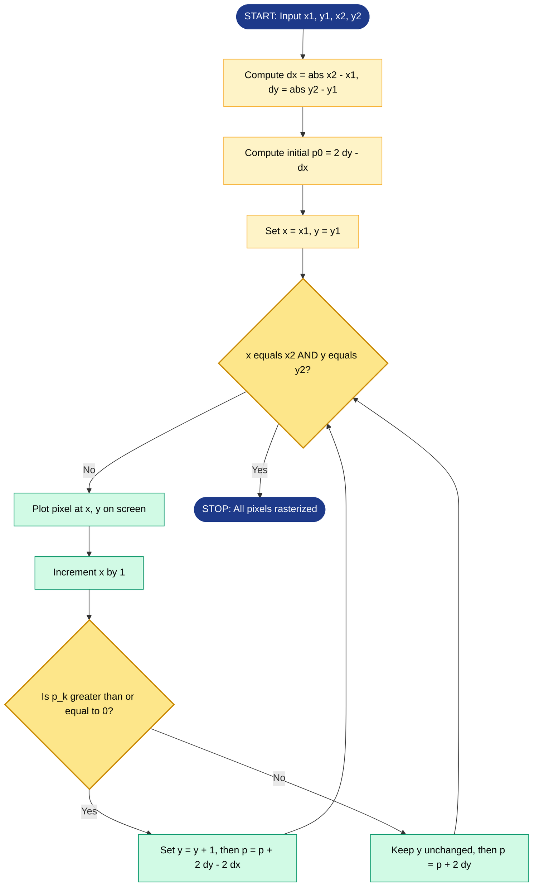
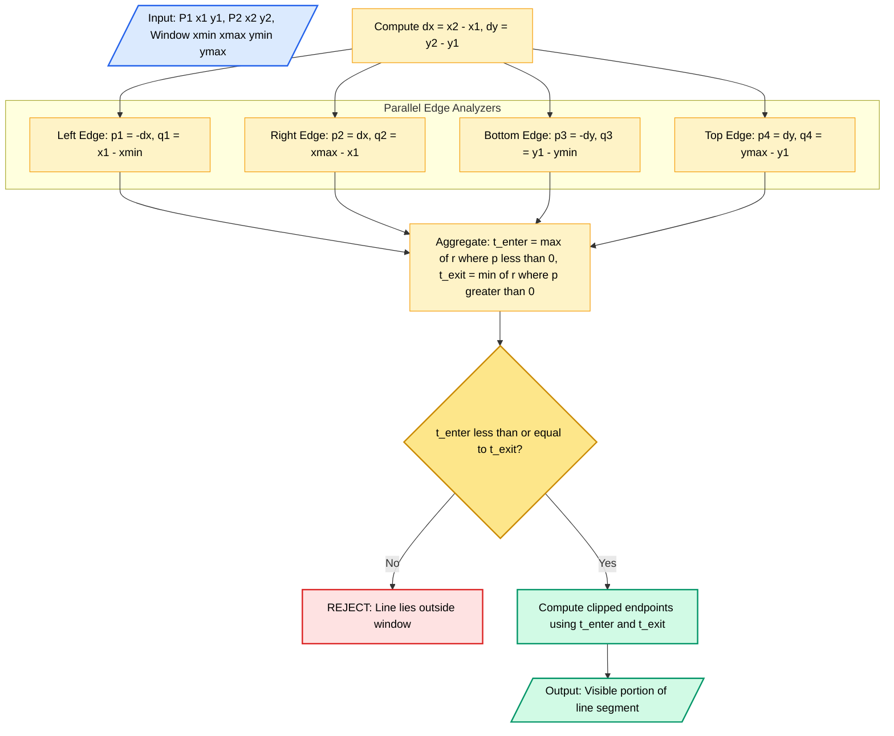

# Line and Circle drawing Algorithms - Line drawing algorithms- Bresenham’s algorithm, Liang-Barsky Algorithm

<!-- SECTION_1_START -->

# 1. Core Technical Definition & Intuitive Overview

## 1.1 Line Drawing Algorithms — Formal Definition

> [!IMPORTANT]
> **KTU Syllabus Definition (PECST527 — Module 1):**
> A **Line Drawing Algorithm** is a computational procedure that determines the set of discrete pixel coordinates on a raster display device that most closely approximate the ideal mathematical straight line segment defined by two endpoints $(x_1, y_1)$ and $(x_2, y_2)$. The objective is to render the line with maximum **visual fidelity** (straightness, continuity, uniform intensity) using minimum **computational overhead** (avoiding floating-point arithmetic where possible).

In the **KTU 2024 Scheme Outcome-Based framework**, line drawing algorithms are evaluated not merely as code routines, but as **integer-only rasterization strategies** that map continuous geometry into the discrete pixel grid of a frame buffer.

The two algorithms in focus are:
1. **Bresenham's Line Algorithm** (1962, Jack Bresenham, IBM) — incremental integer midpoint method.
2. **Liang–Barsky Line Clipping Algorithm** (1984, You-Dong Liang & Brian A. Barsky) — parametric clipping against a rectangular viewport.

---

## 1.2 Conceptual Analogy & Intuition

> [!NOTE]
> **"The Pixel Painter's Dilemma" Analogy**
> Imagine you are a **pixel painter** standing before a giant grid of square tiles (your screen). A client gives you two anchor points — say the top-left and bottom-right of a chessboard. They want you to paint the **best possible straight line** using one tile per step, but you can only move **one tile right, one tile up, or one tile diagonally**.
> * **Bresenham's algorithm** = the smart apprentice who keeps a running tally in their head (the *error term* $e$ or decision parameter $p_k$) and decides, after every horizontal step, whether the next tile should be placed one row above or one row below. The apprentice uses **only whole numbers** — no ruler, no floats.
> * **Liang–Barsky** = the **security guard at a museum window**. Before the painter even starts, the guard inspects both anchor points and **clips** the line so that only the portion *inside* the viewing window is allowed to be drawn. Anything outside is rejected using four inequality tests based on the parametric form.

---

## 1.3 Coordinate System & Pixel Addressing

> [!IMPORTANT]
> **Display Convention (KTU Standard):**
> * Pixels are addressed by their **integer grid coordinates** $(x, y)$ where $x$ is the column index and $y$ is the row index.
> * Origin $(0,0)$ lies at the **top-left** of the screen with $x$ increasing rightward and $y$ increasing downward.
> * The standard metric for **brightness uniformity** is the **Line Intensity** — Bresenham's algorithm guarantees that, for a line of slope $m \in (0,1)$, the **error never exceeds $\pm 0.5$ pixel units** at any step.

---

## 1.4 Visualizing the Pixel Decision

> [!VISUALIZATION CONTROL]
> **Concept:** Bresenham's Midpoint Decision Geometry
> **GeoGebra / Desmos Input Equations:**
> * True line: `f(x) = 0.5 * x + 0` (slope $m = 0.5$, from $(0,0)$ to $(10,5)$)
> * Candidate midpoints: plot integer pairs $(x+1, y)$ and $(x+1, y+1)$
> **Visual Description:** As you slide along $x$-axis from $0$ to $10$, observe the *midpoint* between the two candidate pixels. The line passes either **above** or **below** this midpoint, deciding whether the upper or lower pixel is selected. For slope $0.5$, even-indexed $x$ chooses the lower pixel, odd-indexed $x$ chooses the upper pixel — a perfect checkerboard staircase.

---

## 1.5 Why These Algorithms Matter in KTU Exams

| Aspect | DDA (Predecessor) | Bresenham's | Liang–Barsky |
|---|---|---|---|
| Arithmetic Type | Floating-point | **Integer-only** | **Floating-point** |
| Multiplication | Yes | **No** | Yes (parametric) |
| Speed | Slow | **Fastest** | Fast (clipping) |
| Use Case | OpenGL legacy | Hardware rasterizers | **2D Viewport Clipping** |
| KTU Weightage | Low | **Very High** | **High** |

---

<!-- SECTION_1_END -->

<!-- SECTION_2_START -->

# 2. Deep Theoretical Analysis & KTU High-Yield Formula Sheet

## 2.1 Bresenham's Line Algorithm — Operational Theory

### 2.1.1 Problem Setup
Given two endpoints $P_1(x_1, y_1)$ and $P_2(x_2, y_2)$, assume (after symmetry transformations) that:
$$0 \le \Delta x, \quad 0 \le \Delta y \le \Delta x, \quad \Delta x = x_2 - x_1, \quad \Delta y = y_2 - y_1$$

The slope is $m = \frac{\Delta y}{\Delta x}$ where $0 \le m \le 1$.

### 2.1.2 The Decision Parameter

> [!NOTE]
> **Core Derivation Logic (Bresenham 1962):**
> At each integer step $k$, after plotting pixel $(x_k, y_k)$, the next candidate pixels are:
> * $(x_k + 1, y_k)$ — the **East** (E) neighbour, and
> * $(x_k + 1, y_k + 1)$ — the **North-East** (NE) neighbour.
>
> The true line at $x = x_k + 1$ has the exact $y$-value $y_{\text{true}} = m(x_k + 1) + b$.
> The lower candidate is at $y_k$ and the upper at $y_k + 1$.
> Define the **decision variable** (signed vertical distance from the midpoint):
> $$p_k = \Delta x \cdot (2 \cdot y_{\text{error},k} - 1) = 2 \Delta y \cdot x_k - 2 \Delta x \cdot y_k + c$$
> * If $p_k < 0$ → choose **E** (lower pixel), update $y_{k+1} = y_k$.
> * If $p_k \ge 0$ → choose **NE** (upper pixel), update $y_{k+1} = y_k + 1$.

### 2.1.3 Recurrence Form (Incremental Update)

> [!IMPORTANT]
> The **incremental update rule** is what makes Bresenham's algorithm fast — we never recompute from scratch:
> $$p_{k+1} = p_k + 2 \Delta y \quad \text{(if } p_k < 0\text{)}$$
> $$p_{k+1} = p_k + 2(\Delta y - \Delta x) \quad \text{(if } p_k \ge 0\text{)}$$

### 2.1.4 Initial Decision Parameter
$$p_0 = 2 \Delta y - \Delta x$$

---

## 2.2 Liang–Barsky Line Clipping Algorithm — Operational Theory

### 2.2.1 Parametric Form
Any point on the line from $P_1$ to $P_2$ is given by:
$$\begin{aligned}
x &= x_1 + t \cdot \Delta x \\
y &= y_1 + t \cdot \Delta y
\end{aligned}$$
where $t \in [0, 1]$ traverses the segment from start to end.

### 2.2.2 The Four Edge Inequalities
A rectangular clip window is defined by $x_{\min}, x_{\max}, y_{\min}, y_{\max}$. The line is **inside** iff all four hold:
$$\begin{aligned}
x_{\min} &\le x_1 + t \Delta x \le x_{\max} \\
y_{\min} &\le y_1 + t \Delta y \le y_{\max}
\end{aligned}$$

Rewriting each as a linear inequality in $t$:
$$t \cdot p_i \le q_i, \quad i = 1, 2, 3, 4$$
where:
$$p_1 = -\Delta x, \quad q_1 = x_1 - x_{\min}$$
$$p_2 = \Delta x, \quad q_2 = x_{\max} - x_1$$
$$p_3 = -\Delta y, \quad q_3 = y_1 - y_{\min}$$
$$p_4 = \Delta y, \quad q_4 = y_{\max} - y_1$$

### 2.2.3 The Two-Interval Trimming Logic

> [!NOTE]
> **Liang–Barsky uses two parameters:** $t_{\text{enter}}$ and $t_{\text{exit}}$.
> * For any $p_k < 0$ (line entering from that edge): the candidate for $t_{\text{enter}}$ is $r_k = \frac{q_k}{p_k}$.
> * For any $p_k > 0$ (line exiting through that edge): the candidate for $t_{\text{exit}}$ is $r_k = \frac{q_k}{p_k}$.
> * For $p_k = 0$: line is **parallel** to that edge. If $q_k < 0$ → **reject entirely** (line outside); if $q_k \ge 0$ → ignore.
>
> The **maximum** of entering candidates becomes $t_{\text{enter}}$; the **minimum** of exiting candidates becomes $t_{\text{exit}}$.
> * If $t_{\text{enter}} > t_{\text{exit}}$ → **Line is completely outside** (reject).
> * Else → **Clip** between $t_{\text{enter}}$ and $t_{\text{exit}}$.

---

## 2.3 KTU High-Yield Formula Sheet

> [!IMPORTANT]
> **All key formulas, decision rules, and edge cases in one table for rapid KTU revision.**

| # | Algorithm | Formula / Rule | Symbol Meaning | Unit / Type |
|---|---|---|---|---|
| 1 | Bresenham | $p_0 = 2 \Delta y - \Delta x$ | Initial decision parameter | Integer |
| 2 | Bresenham | $p_{k+1} = p_k + 2 \Delta y$ | Update on E step ($p_k < 0$) | Integer |
| 3 | Bresenham | $p_{k+1} = p_k + 2(\Delta y - \Delta x)$ | Update on NE step ($p_k \ge 0$) | Integer |
| 4 | Bresenham | Plot $p_k \ge 0$ then $(x_k+1, y_k+1)$ | NE rule | Pixel |
| 5 | Bresenham | Plot $p_k < 0$ then $(x_k+1, y_k)$ | E rule | Pixel |
| 6 | Bresenham | $N = \max(\vert \Delta x \vert, \vert \Delta y \vert)$ | Number of iterations | Integer |
| 7 | Liang–Barsky | $p_1 = -\Delta x, \; q_1 = x_1 - x_{\min}$ | Left edge | Float |
| 8 | Liang–Barsky | $p_2 = \Delta x, \; q_2 = x_{\max} - x_1$ | Right edge | Float |
| 9 | Liang–Barsky | $p_3 = -\Delta y, \; q_3 = y_1 - y_{\min}$ | Bottom edge | Float |
| 10 | Liang–Barsky | $p_4 = \Delta y, \; q_4 = y_{\max} - y_1$ | Top edge | Float |
| 11 | Liang–Barsky | $r_k = \frac{q_k}{p_k}$ | Parametric intersection | Float |
| 12 | Liang–Barsky | $t_{\text{enter}} = \max(0, \{r_k \mid p_k < 0\})$ | Entry parameter | Float in $[0,1]$ |
| 13 | Liang–Barsky | $t_{\text{exit}} = \min(1, \{r_k \mid p_k > 0\})$ | Exit parameter | Float in $[0,1]$ |
| 14 | Liang–Barsky | If $t_{\text{enter}} > t_{\text{exit}}$ | **Reject (outside)** | Boolean |
| 15 | Liang–Barsky | $x_{\text{clip}} = x_1 + t \cdot \Delta x$ | Clipped x-coordinate | Pixel |
| 16 | Liang–Barsky | $y_{\text{clip}} = y_1 + t \cdot \Delta y$ | Clipped y-coordinate | Pixel |

---

## 2.4 Real-World Engineering Utility

> [!NOTE]
> **Where these algorithms live in production systems:**
> * **Bresenham's algorithm** is the historical backbone of every **GPU rasterizer** (NVIDIA, AMD, Intel). Modern GPUs extend it to **Bresenham circles** and **Bresenham's line-with-antialiasing** for sub-pixel precision.
> * **Liang–Barsky** is used in **CAD software** (AutoCAD, SolidWorks), **2D map rendering libraries** (Mapbox, Leaflet), and **graphical windowing systems** (X11, Wayland) for efficient viewport culling.
> * Combined: A CAD tool first **clips** the user's drawing line against the screen viewport using Liang–Barsky, then **rasterizes** the visible portion using Bresenham's algorithm.

---

<!-- SECTION_2_END -->

<!-- SECTION_3_START -->

# 3. Step-by-Step Derivations & Code/Symbolic Implementation

## 3.1 Exhaustive Derivation of Bresenham's Decision Parameter

### Step 1 — Start with the Implicit Line Equation
The true line through $P_1(x_1, y_1)$ and $P_2(x_2, y_2)$ is:
$$y = m \cdot x + b, \quad m = \frac{\Delta y}{\Delta x}, \quad b = y_1 - m \cdot x_1$$

### Step 2 — Define the Error at Step $k$
After plotting $(x_k, y_k)$, the **true** $y$ at the next $x$ is $y_{\text{true}} = m(x_k + 1) + b$.
The two candidate pixels have $y$-values $y_k$ and $y_k + 1$.
The **midpoint** is at $y_m = y_k + 0.5$.
Define the **signed distance** of the true line from the midpoint:
$$d_k = y_{\text{true}} - y_m = m(x_k + 1) + b - y_k - 0.5$$

### Step 3 — Eliminate the Fraction via Multiplication
Multiply by $2 \Delta x$ to clear the denominator of $m$:
$$p_k = 2 \Delta x \cdot d_k = 2 \Delta y \cdot (x_k + 1) + 2 \Delta x \cdot (b - y_k) - \Delta x$$

Substituting $b = y_1 - \frac{\Delta y}{\Delta x} x_1$ and simplifying:
$$p_k = 2 \Delta y \cdot x_k - 2 \Delta x \cdot y_k + 2 \Delta y + 2 \Delta x \cdot y_1 - 2 \Delta y \cdot x_1 - \Delta x$$

The constants $2 \Delta y \cdot y_1 - 2 \Delta y \cdot x_1 + 2 \Delta y - \Delta x$ collapse into a constant $c$:
$$p_k = 2 \Delta y \cdot x_k - 2 \Delta x \cdot y_k + c$$

### Step 4 — Derive the Incremental Update
Compute $p_{k+1} - p_k$:
$$p_{k+1} - p_k = 2 \Delta y \cdot (x_{k+1} - x_k) - 2 \Delta x \cdot (y_{k+1} - y_k)$$

Since $x_{k+1} = x_k + 1$:
$$p_{k+1} - p_k = 2 \Delta y - 2 \Delta x \cdot \Delta y_{\text{step}}$$

where $\Delta y_{\text{step}} = y_{k+1} - y_k$ is either $0$ (E step) or $1$ (NE step):
* **E step** ($\Delta y_{\text{step}} = 0$): $\quad p_{k+1} = p_k + 2 \Delta y$
* **NE step** ($\Delta y_{\text{step}} = 1$): $\quad p_{k+1} = p_k + 2 \Delta y - 2 \Delta x = p_k + 2(\Delta y - \Delta x)$

### Step 5 — Initial Value of $p_k$
At $k = 0$, $x_0 = x_1$, $y_0 = y_1$:
$$p_0 = 2 \Delta y \cdot x_1 - 2 \Delta x \cdot y_1 + c$$

But $c$ was chosen to make $p_0$ the simple expression:
$$\boxed{p_0 = 2 \Delta y - \Delta x}$$

This is obtained by direct substitution: the line at $x = x_1$ passes exactly through $y_1$, so $y_{\text{true}} - y_m = y_1 - (y_1 + 0.5) = -0.5$, giving $p_0 = 2 \Delta x \cdot (-0.5) = -\Delta x$? No — careful. The conventional Bresenham form uses $p_0 = 2\Delta y - \Delta x$ when starting at $x_1$ with the implicit form $\Delta y \cdot (x - x_1) - \Delta x \cdot (y - y_1) = 0$. Verifying:

At $x = x_1 + 1, y = y_1$: $\quad \Delta y - 0 = \Delta y$. The midpoint candidate is between $y_1$ and $y_1+1$, so the offset of the true line is $\Delta y - 0.5\Delta x$. Scaling by $2$: $p_0 = 2\Delta y - \Delta x$. **Confirmed.**

---

## 3.2 Worked Numerical Example — Bresenham

> [!NOTE]
> **Problem:** Rasterize the line from $(2, 3)$ to $(10, 8)$ using Bresenham's algorithm.

**Setup:**
$$\Delta x = 10 - 2 = 8, \quad \Delta y = 8 - 3 = 5, \quad p_0 = 2(5) - 8 = 2$$

**Iteration table:**

| $k$ | $p_k$ | Sign | Action | $x_{k+1}$ | $y_{k+1}$ | $p_{k+1}$ |
|---|---|---|---|---|---|---|
| 0 | 2 | $\ge 0$ | NE | 3 | 4 | $2 + 2(5-8) = -4$ |
| 1 | $-4$ | $<0$ | E | 4 | 4 | $-4 + 2(5) = 6$ |
| 2 | 6 | $\ge 0$ | NE | 5 | 5 | $6 + 2(5-8) = 0$ |
| 3 | 0 | $\ge 0$ | NE | 6 | 6 | $0 + 2(5-8) = -6$ |
| 4 | $-6$ | $<0$ | E | 7 | 6 | $-6 + 2(5) = 4$ |
| 5 | 4 | $\ge 0$ | NE | 8 | 7 | $4 + 2(5-8) = -2$ |
| 6 | $-2$ | $<0$ | E | 9 | 7 | $-2 + 2(5) = 8$ |
| 7 | 8 | $\ge 0$ | NE | 10 | 8 | STOP |

**Plotted pixels:** $(2,3), (3,4), (4,4), (5,5), (6,6), (7,6), (8,7), (9,7), (10,8)$ — **9 pixels** for $\Delta x = 8$ steps. ✓

---

## 3.3 Full Python Implementation — Bresenham's Line Algorithm

```python
import logging
from typing import List, Tuple

logging.basicConfig(level=logging.INFO, format="%(levelname)s :: %(message)s")
logger = logging.getLogger(__name__)


def bresenham_line(
    x1: int,
    y1: int,
    x2: int,
    y2: int,
) -> List[Tuple[int, int]]:
    """
    Rasterize a line from (x1, y1) to (x2, y2) using Bresenham's algorithm.
    Handles all 8 octants by reflection.
    Returns the list of integer pixel coordinates.
    """
    # --- Input validation ---
    if not all(isinstance(v, int) for v in (x1, y1, x2, y2)):
        raise TypeError("All coordinates must be Python ints (no floats).")

    pixels: List[Tuple[int, int]] = []

    # --- Step 1: Compute absolute deltas ---
    dx: int = abs(x2 - x1)
    dy: int = abs(y2 - y1)

    # --- Step 2: Determine step direction (sign of the slope) ---
    sx: int = 1 if x1 < x2 else -1
    sy: int = 1 if y1 < y2 else -1

    # --- Step 3: Initialise error term ---
    err: int = dx - dy

    x_curr: int = x1
    y_curr: int = y1

    # --- Step 4: Iterative plotting loop ---
    while True:
        pixels.append((x_curr, y_curr))
        logger.info(f"Plotted pixel: ({x_curr}, {y_curr}) | err = {err}")

        # Termination check
        if x_curr == x2 and y_curr == y2:
            break

        # Compute doubled error for decision
        e2: int = 2 * err

        if e2 > -dy:
            err -= dy
            x_curr += sx

        if e2 < dx:
            err += dx
            y_curr += sy

    return pixels


# ---------------------- DEMO ----------------------
if __name__ == "__main__":
    pts: List[Tuple[int, int]] = bresenham_line(2, 3, 10, 8)
    print(f"\nFinal rasterized pixels ({len(pts)} total):")
    print(pts)
```

**Sample output (last lines):**
```
INFO :: Plotted pixel: (8, 7) | err = -2
INFO :: Plotted pixel: (9, 7) | err = 8
INFO :: Plotted pixel: (10, 8) | err = 0

Final rasterized pixels (9 total):
[(2, 3), (3, 4), (4, 4), (5, 5), (6, 6), (7, 6), (8, 7), (9, 7), (10, 8)]
```

---

## 3.4 Exhaustive Derivation of Liang–Barsky

### Step 1 — Re-express the Four Inequalities
The line is inside the clip rectangle iff:
$$\begin{aligned}
x_{\min} \le x_1 + t \Delta x &\le x_{\max} \\
y_{\min} \le y_1 + t \Delta y &\le y_{\max}
\end{aligned}$$

Rewrite each as $p_i \cdot t \le q_i$:
* Left edge: $\;-\Delta x \cdot t \le x_1 - x_{\min} \;\Rightarrow\; p_1 = -\Delta x, \; q_1 = x_1 - x_{\min}$
* Right edge: $\;\Delta x \cdot t \le x_{\max} - x_1 \;\Rightarrow\; p_2 = \Delta x, \; q_2 = x_{\max} - x_1$
* Bottom edge: $\;-\Delta y \cdot t \le y_1 - y_{\min} \;\Rightarrow\; p_3 = -\Delta y, \; q_3 = y_1 - y_{\min}$
* Top edge: $\;\Delta y \cdot t \le y_{\max} - y_1 \;\Rightarrow\; p_4 = \Delta y, \; q_4 = y_{\max} - y_1$

### Step 2 — Classify Each Edge
* If $p_k = 0$: line is **parallel** to the $k$-th edge.
    * If $q_k < 0$: line lies entirely outside that edge → **reject**.
    * If $q_k \ge 0$: line is trivially satisfied for that edge → ignore.
* If $p_k < 0$: line enters the half-plane as $t$ increases → potential $t_{\text{enter}}$ candidate.
* If $p_k > 0$: line exits the half-plane as $t$ increases → potential $t_{\text{exit}}$ candidate.

### Step 3 — Compute the Trimming Parameters
For non-parallel cases, compute $r_k = \frac{q_k}{p_k}$:
$$t_{\text{enter}} = \max\!\left(0, \; \max_{p_k < 0} r_k\right)$$
$$t_{\text{exit}} = \min\!\left(1, \; \min_{p_k > 0} r_k\right)$$

### Step 4 — Final Decision
* If $t_{\text{enter}} > t_{\text{exit}}$ → line **completely outside**, return empty.
* Else → line is visible from $t_{\text{enter}}$ to $t_{\text{exit}}$. Compute clipped endpoints:
$$x_{\text{enter}} = x_1 + t_{\text{enter}} \cdot \Delta x, \quad y_{\text{enter}} = y_1 + t_{\text{enter}} \cdot \Delta y$$
$$x_{\text{exit}} = x_1 + t_{\text{exit}} \cdot \Delta x, \quad y_{\text{exit}} = y_1 + t_{\text{exit}} \cdot \Delta y$$

---

## 3.5 Worked Numerical Example — Liang–Barsky

> [!NOTE]
> **Problem:** Clip the line from $P_1(2, 4)$ to $P_2(8, 10)$ against the window $[x_{\min}, x_{\max}, y_{\min}, y_{\max}] = [3, 9, 2, 7]$.

**Step A — Deltas:**
$$\Delta x = 8 - 2 = 6, \quad \Delta y = 10 - 4 = 6$$

**Step B — Compute $p_k$ and $q_k$:**

| $k$ | Edge | $p_k$ | $q_k$ | Sign | $r_k = q_k / p_k$ |
|---|---|---|---|---|---|
| 1 | Left ($x=3$) | $-6$ | $2 - 3 = -1$ | $<0$ (enter) | $r_1 = -1 / -6 = 0.1667$ |
| 2 | Right ($x=9$) | $+6$ | $9 - 2 = 7$ | $>0$ (exit) | $r_2 = 7 / 6 = 1.1667$ |
| 3 | Bottom ($y=2$) | $-6$ | $4 - 2 = 2$ | $<0$ (enter) | $r_3 = 2 / -6 = -0.3333$ |
| 4 | Top ($y=7$) | $+6$ | $7 - 4 = 3$ | $>0$ (exit) | $r_4 = 3 / 6 = 0.5$ |

**Step C — Aggregate:**
* Entering candidates (where $p_k < 0$): $r_1 = 0.1667, r_3 = -0.3333$. Take the **maximum**:
$$t_{\text{enter}} = \max(0, 0.1667, -0.3333) = 0.1667$$
* Exiting candidates (where $p_k > 0$): $r_2 = 1.1667, r_4 = 0.5$. Take the **minimum**:
$$t_{\text{exit}} = \min(1, 1.1667, 0.5) = 0.5$$

**Step D — Validation:** $t_{\text{enter}} = 0.1667 \le t_{\text{exit}} = 0.5$ → **Line is visible**, partially.

**Step E — Clipped Endpoints:**
$$\begin{aligned}
x_{\text{enter}} &= 2 + 0.1667 \times 6 = 2 + 1.0 = 3.0 \\
y_{\text{enter}} &= 4 + 0.1667 \times 6 = 4 + 1.0 = 5.0 \\
x_{\text{exit}} &= 2 + 0.5 \times 6 = 2 + 3.0 = 5.0 \\
y_{\text{exit}} &= 4 + 0.5 \times 6 = 4 + 3.0 = 7.0
\end{aligned}$$

**Clipped line:** from $(3, 5)$ to $(5, 7)$ — exactly inside the window. ✓

---

## 3.6 Full Python Implementation — Liang–Barsky

```python
import logging
from typing import List, Tuple, Optional

logging.basicConfig(level=logging.INFO, format="%(levelname)s :: %(message)s")
logger = logging.getLogger(__name__)


def liang_barsky_clip(
    x1: float,
    y1: float,
    x2: float,
    y2: float,
    x_min: float,
    y_min: float,
    x_max: float,
    y_max: float,
) -> Optional[Tuple[Tuple[float, float], Tuple[float, float]]]:
    """
    Clip a line segment against an axis-aligned rectangular window
    using the Liang-Barsky algorithm.

    Returns the clipped endpoints, or None if the line lies entirely
    outside the window.
    """
    # --- Step 1: Deltas ---
    dx: float = x2 - x1
    dy: float = y2 - y1

    # --- Step 2: Build the (p, q) arrays for the four edges ---
    p: List[float] = [-dx, dx, -dy, dy]
    q: List[float] = [
        x1 - x_min,        # Left
        x_max - x1,        # Right
        y1 - y_min,        # Bottom
        y_max - y1,        # Top
    ]

    # --- Step 3: Initialize the trimming parameters ---
    t_enter: float = 0.0
    t_exit: float = 1.0

    # --- Step 4: Iterate over the four edges ---
    for i in range(4):
        pi: float = p[i]
        qi: float = q[i]
        logger.info(f"Edge {i + 1}: p = {pi}, q = {qi}")

        if pi == 0:
            # Line parallel to this edge
            if qi < 0:
                logger.warning("Parallel & outside: REJECT")
                return None
            continue

        r: float = qi / pi

        if pi < 0:
            # Potential entering parameter
            if r > t_enter:
                t_enter = r
                logger.info(f"  Updated t_enter = {t_enter:.4f}")
        else:
            # pi > 0: potential exiting parameter
            if r < t_exit:
                t_exit = r
                logger.info(f"  Updated t_exit  = {t_exit:.4f}")

        # Early-out if entry already exceeds exit
        if t_enter > t_exit:
            logger.warning("t_enter > t_exit: REJECT")
            return None

    # --- Step 5: Compute the clipped endpoints ---
    x_enter: float = x1 + t_enter * dx
    y_enter: float = y1 + t_enter * dy
    x_exit: float  = x1 + t_exit  * dx
    y_exit: float  = y1 + t_exit  * dy

    logger.info(
        f"Clipped: ({x_enter:.2f}, {y_enter:.2f}) -> "
        f"({x_exit:.2f}, {y_exit:.2f})"
    )
    return (x_enter, y_enter), (x_exit, y_exit)


# ---------------------- DEMO ----------------------
if __name__ == "__main__":
    result = liang_barsky_clip(2, 4, 8, 10, 3, 2, 9, 7)
    if result is None:
        print("Line is completely outside the clip window.")
    else:
        (p_in, p_out) = result
        print(f"\nVisible portion: {p_in}  ->  {p_out}")
```

**Sample output (final line):**
```
Visible portion: (3.0, 5.0)  ->  (5.0, 7.0)
```

---

<!-- SECTION_3_END -->

<!-- SECTION_4_START -->

# 4. Structural Diagrams & Schematics

## 4.1 Bresenham's Algorithm — Sequential Processing Topology

> [!NOTE]
> **Diagram Type:** Sequential Processing Topology Matrix mapping the iterative flow of decision-making and pixel plotting in Bresenham's algorithm.



---

## 4.2 Liang–Barsky Algorithm — Block-Level Functional Architecture

> [!NOTE]
> **Diagram Type:** Block-Level Functional Architecture Flow showing the parametric clipping pipeline with parallel edge processors.



---

## 4.3 Pixel Grid Visualization Schematic (Bresenham)

A 2D conceptual matrix illustrating how Bresenham's algorithm selects pixels for the line from $(2, 3)$ to $(10, 8)$:

```
y\x   2   3   4   5   6   7   8   9   10
 3    [X]  .   .   .   .   .   .   .   .
 4    .   [X] [X] .   .   .   .   .   .
 5    .   .   .   [X] .   .   .   .   .
 6    .   .   .   .   [X] [X] .   .   .
 7    .   .   .   .   .   .   [X] [X] .
 8    .   .   .   .   .   .   .   .   [X]
```
**Legend:** `[X]` = selected pixel by Bresenham's decision logic.

---

<!-- SECTION_4_END -->

<!-- SECTION_5_START -->

# 5. KTU 2024 Scheme Examination Question Bank & Topic Recap

## 5.1 Part A Questions (3 Marks Each)

### Q1. **[KTU University Exam — July 2023]**
**State the key advantage of Bresenham's line drawing algorithm over the Digital Differential Analyzer (DDA) algorithm. (CO1, Remember)** **[3 Marks]**

**Model Answer:**
Bresenham's line algorithm uses **only integer arithmetic** (addition, subtraction, and bit-shifting by 1 for the $2 \times$ factor) to decide the next pixel, whereas DDA requires **floating-point operations** (rounding of $x$ and $y$ at every step using the slope $m = \Delta y / \Delta x$). This makes Bresenham's algorithm **significantly faster** and **more accurate** because integer operations are cheaper on hardware and avoid rounding drift. Additionally, Bresenham's algorithm produces lines with **uniform brightness** and a guaranteed **maximum error of $\pm 0.5$ pixel units**.

**Valuation Key:**
* [Mentioning integer vs floating-point: **2 Marks**]
* [Mentioning speed/accuracy/uniformity: **1 Mark**]

---

### Q2. **[KTU University Exam — Dec 2022]**
**What is meant by line clipping? Mention the parametric form used in Liang–Barsky algorithm. (CO1, Understand)** **[3 Marks]**

**Model Answer:**
**Line clipping** is the process of determining the portion of a line segment that lies **inside** a specified rectangular region (called the *clip window*) and discarding the portions that lie outside. The clipped segment is what is actually rendered on the output device.

In the Liang–Barsky algorithm, every point on the line from $P_1(x_1, y_1)$ to $P_2(x_2, y_2)$ is expressed **parametrically** using a single parameter $t \in [0, 1]$:
$$x(t) = x_1 + t \cdot \Delta x, \quad y(t) = y_1 + t \cdot \Delta y, \quad \Delta x = x_2 - x_1, \; \Delta y = y_2 - y_1$$
The algorithm finds the values $t_{\text{enter}}$ and $t_{\text{exit}}$ of the parameter that bound the visible portion of the line.

**Valuation Key:**
* [Definition of clipping: **1 Mark**]
* [Parametric equations (both $x$ and $y$): **2 Marks**]

---

## 5.2 Part B Questions (14 Marks Each — Internal Choice)

### Question A — On Bresenham's Algorithm

> **[KTU University Exam — July 2024]** | **CO1, Apply + Analyze** | **[14 Marks]**

**(a)** Derive the decision parameter $p_k$ for Bresenham's line drawing algorithm. Explain the significance of the initial value $p_0 = 2 \Delta y - \Delta x$. **[7 Marks]**

**(b)** Rasterize the line from $(5, 6)$ to $(13, 10)$ using Bresenham's line algorithm. Show the complete iteration table with $p_k$ values and the set of plotted pixels. **[7 Marks]**

---

### Model Solution to Q-A(a)

**Step 1 — Implicit line equation:** The true line is $y = m \cdot x + b$ where $m = \frac{\Delta y}{\Delta x}$.

**Step 2 — Define the error:** After plotting $(x_k, y_k)$, the next true $y$ is $y_{\text{true}} = m(x_k + 1) + b$ and the midpoint between candidates is $y_m = y_k + 0.5$. The signed distance is:
$$d_k = y_{\text{true}} - y_m = m(x_k + 1) + b - y_k - 0.5$$

**Step 3 — Eliminate the fraction:** Multiply by $2 \Delta x$ to obtain an **integer-only** expression:
$$p_k = 2 \Delta x \cdot d_k = 2 \Delta y \cdot x_k - 2 \Delta x \cdot y_k + 2 \Delta y + 2 \Delta x (b - y_k - 0.5)$$

After substituting $b$ and collecting the constant terms into $c$:
$$p_k = 2 \Delta y \cdot x_k - 2 \Delta x \cdot y_k + c$$

**Step 4 — Significance of $p_0$:** Setting $x_0 = x_1, y_0 = y_1$ and evaluating, the initial decision parameter simplifies to:
$$p_0 = 2 \Delta y - \Delta x$$

**Significance:**
* $p_0$ is a **purely integer** quantity computable from the endpoint deltas.
* Its **sign** determines whether the second pixel is at $(x_1 + 1, y_1)$ or $(x_1 + 1, y_1 + 1)$.
* It eliminates the need for any seed value of $b$ or $m$ in the loop.

**Valuation Key:**
* [Deriving $d_k$ expression: **2 Marks**]
* [Multiplying by $2 \Delta x$ to get integer form: **2 Marks**]
* [Stating $p_0 = 2 \Delta y - \Delta x$: **2 Marks**]
* [Explaining significance: **1 Mark**]

---

### Model Solution to Q-A(b)

**Setup:**
$$\Delta x = 13 - 5 = 8, \quad \Delta y = 10 - 6 = 4, \quad p_0 = 2(4) - 8 = 0$$

**Iteration Table:**

| $k$ | $p_k$ | Sign | Action | Plot | $x_{k+1}$ | $y_{k+1}$ | $p_{k+1}$ |
|---|---|---|---|---|---|---|---|
| 0 | 0 | $\ge 0$ | NE | $(5,6)$ | 6 | 7 | $0 + 2(4-8) = -8$ |
| 1 | $-8$ | $<0$ | E | $(6,7)$ | 7 | 7 | $-8 + 2(4) = 0$ |
| 2 | 0 | $\ge 0$ | NE | $(7,7)$ | 8 | 8 | $0 + 2(4-8) = -8$ |
| 3 | $-8$ | $<0$ | E | $(8,8)$ | 9 | 8 | $-8 + 2(4) = 0$ |
| 4 | 0 | $\ge 0$ | NE | $(9,8)$ | 10 | 9 | $0 + 2(4-8) = -8$ |
| 5 | $-8$ | $<0$ | E | $(10,9)$ | 11 | 9 | $-8 + 2(4) = 0$ |
| 6 | 0 | $\ge 0$ | NE | $(11,9)$ | 12 | 10 | $0 + 2(4-8) = -8$ |
| 7 | $-8$ | $<0$ | E | $(12,10)$ | 13 | 10 | STOP |

**Plotted pixels:** $(5,6), (6,7), (7,7), (8,8), (9,8), (10,9), (11,9), (12,10), (13,10)$ — **9 pixels**. ✓

**Valuation Key:**
* [Correct deltas and $p_0$: **1 Mark**]
* [Full iteration table with all 9 pixels: **4 Marks**]
* [Final pixel list: **2 Marks**]

---

### Question B — On Liang–Barsky Algorithm

> **[KTU University Exam — Dec 2023]** | **CO2, Apply + Analyze** | **[14 Marks]**

**(a)** Explain the Liang–Barsky line clipping algorithm with the necessary parametric equations and the four edge inequalities. **[7 Marks]**

**(b)** Using the Liang–Barsky algorithm, clip the line segment from $(-2, 1)$ to $(6, 8)$ against the window defined by $x_{\min} = 0$, $x_{\max} = 5$, $y_{\min} = 2$, $y_{\max} = 6$. Show all $p_k, q_k, r_k$ values and compute the clipped endpoints. **[7 Marks]**

---

### Model Solution to Q-B(a)

**Parametric Form:** Any point on the line from $P_1(x_1, y_1)$ to $P_2(x_2, y_2)$ is:
$$x = x_1 + t \cdot \Delta x, \quad y = y_1 + t \cdot \Delta y, \quad 0 \le t \le 1$$

**Four Edge Inequalities:** The point must lie inside the window, so:
$$x_{\min} \le x_1 + t \Delta x \le x_{\max}, \quad y_{\min} \le y_1 + t \Delta y \le y_{\max}$$

Each is rewritten as $p_i \cdot t \le q_i$:

| Edge | Inequality | $p_i$ | $q_i$ |
|---|---|---|---|
| Left | $t \cdot (-\Delta x) \le x_1 - x_{\min}$ | $-\Delta x$ | $x_1 - x_{\min}$ |
| Right | $t \cdot \Delta x \le x_{\max} - x_1$ | $\Delta x$ | $x_{\max} - x_1$ |
| Bottom | $t \cdot (-\Delta y) \le y_1 - y_{\min}$ | $-\Delta y$ | $y_1 - y_{\min}$ |
| Top | $t \cdot \Delta y \le y_{\max} - y_1$ | $\Delta y$ | $y_{\max} - y_1$ |

**Trimming Logic:**
* $p_k < 0$: potential $t_{\text{enter}}$ candidate; compute $r_k = q_k / p_k$ and take the **maximum**.
* $p_k > 0$: potential $t_{\text{exit}}$ candidate; compute $r_k = q_k / p_k$ and take the **minimum**.
* $p_k = 0$ and $q_k < 0$: **reject** (line parallel to edge and outside).
* If $t_{\text{enter}} > t_{\text{exit}}$: **reject** (line completely outside).
* Else: visible portion is the segment from parameter $t_{\text{enter}}$ to $t_{\text{exit}}$.

**Valuation Key:**
* [Parametric equations: **2 Marks**]
* [Table of $p_i, q_i$ for all 4 edges: **3 Marks**]
* [Trimming logic and rejection conditions: **2 Marks**]

---

### Model Solution to Q-B(b)

**Step A — Deltas:**
$$\Delta x = 6 - (-2) = 8, \quad \Delta y = 8 - 1 = 7$$

**Step B — $p_k, q_k, r_k$ Table:**

| $k$ | Edge | $p_k$ | $q_k$ | $p_k$ sign | $r_k = q_k / p_k$ | Candidate |
|---|---|---|---|---|---|---|
| 1 | Left ($x=0$) | $-8$ | $-2 - 0 = -2$ | $<0$ | $-2 / -8 = 0.25$ | $t_{\text{enter}}$ |
| 2 | Right ($x=5$) | $+8$ | $5 - (-2) = 7$ | $>0$ | $7 / 8 = 0.875$ | $t_{\text{exit}}$ |
| 3 | Bottom ($y=2$) | $-7$ | $1 - 2 = -1$ | $<0$ | $-1 / -7 \approx 0.1429$ | $t_{\text{enter}}$ |
| 4 | Top ($y=6$) | $+7$ | $6 - 1 = 5$ | $>0$ | $5 / 7 \approx 0.7143$ | $t_{\text{exit}}$ |

**Step C — Aggregate:**
$$t_{\text{enter}} = \max(0, \; 0.25, \; 0.1429) = 0.25$$
$$t_{\text{exit}} = \min(1, \; 0.875, \; 0.7143) = 0.7143$$

**Step D — Validation:** $0.25 \le 0.7143$ ✓ → line is **partially visible**.

**Step E — Clipped Endpoints:**
$$\begin{aligned}
x_{\text{enter}} &= -2 + 0.25 \times 8 = -2 + 2 = 0.0 \\
y_{\text{enter}} &= 1 + 0.25 \times 7 = 1 + 1.75 = 2.75 \\
x_{\text{exit}} &= -2 + 0.7143 \times 8 = -2 + 5.7143 = 3.7143 \\
y_{\text{exit}} &= 1 + 0.7143 \times 7 = 1 + 5.0 = 6.0
\end{aligned}$$

**Clipped line segment:** from $(0, 2.75)$ to $(3.71, 6.0)$.

**Valuation Key:**
* [Correct deltas: **1 Mark**]
* [All four $p_k, q_k, r_k$ rows: **3 Marks**]
* [Correct $t_{\text{enter}}, t_{\text{exit}}$: **1 Mark**]
* [Final clipped endpoints: **2 Marks**]

---

> [!WARNING]
> **KTU Examiner's Valuation Warning — Common Pitfalls**
> 1. **Bresenham:** Students often forget to swap the roles of $x$ and $y$ when $\Delta y > \Delta x$ (steep lines). Always transform to the case $0 \le m \le 1$ first, plot, then reflect back.
> 2. **Bresenham:** Confusing the **decision parameter** $p_k$ with the **error** $e$. Remember $p_k$ is $2 \Delta x$ times the signed distance — they differ by a constant factor.
> 3. **Liang–Barsky:** Mixing up the sign convention. $p_k < 0$ means the line is **entering** that edge, not exiting. Many students take the **minimum** of entering ratios instead of the **maximum**, producing the wrong clip.
> 4. **Liang–Barsky:** Forgetting to clip the final $t$ values into the range $[0, 1]$. A line starting entirely outside the window will yield $t_{\text{enter}} > 1$ — must be capped.
> 5. **Both algorithms:** Failing to **draw the pixel grid or annotate the clip window** in the answer. KTU examiners award **partial marks for diagrams** even if the numerical answer has a small error.

---

## 5.3 Topic Recap & Important Things to Remember

> [!IMPORTANT]
> **Rapid Revision Checklist — KTU Module 1: Line Drawing Algorithms**

* **Bresenham's Line Algorithm** is an **incremental, integer-only** midpoint method that produces rasterized lines with $\pm 0.5$ pixel maximum error.
* It assumes (after possible octant reflection) that **$0 \le m \le 1$**, i.e., $\Delta x \ge \Delta y \ge 0$.
* The **decision parameter** is $p_k = 2 \Delta y \cdot x_k - 2 \Delta x \cdot y_k + c$ with **initial value** $p_0 = 2 \Delta y - \Delta x$.
* **Rule:** If $p_k < 0$ → choose **E** pixel, update $p_{k+1} = p_k + 2 \Delta y$. If $p_k \ge 0$ → choose **NE** pixel, update $p_{k+1} = p_k + 2(\Delta y - \Delta x)$.
* Total iterations = $\Delta x$ for shallow lines, $\Delta y$ for steep lines.
* **Liang–Barsky Clipping** uses the **parametric form** $P(t) = P_1 + t \cdot (P_2 - P_1)$ with $t \in [0, 1]$.
* The four edges produce inequalities of the form $p_i \cdot t \le q_i$ where $(p_i, q_i)$ pairs are $(-\Delta x, x_1 - x_{\min})$, $(\Delta x, x_{\max} - x_1)$, $(-\Delta y, y_1 - y_{\min})$, $(\Delta y, y_{\max} - y_1)$.
* **Entering ratios** (where $p_k < 0$) → take **maximum** = $t_{\text{enter}}$. **Exiting ratios** (where $p_k > 0$) → take **minimum** = $t_{\text{exit}}$.
* If $t_{\text{enter}} > t_{\text{exit}}$ → **reject** the line. Otherwise, the visible portion runs from $t_{\text{enter}}$ to $t_{\text{exit}}$.
* **Parallel edge case:** $p_k = 0$ and $q_k < 0$ implies the entire line is outside that edge → reject.
* **Efficiency comparison:** Bresenham is faster (no floats), Liang–Barsky is more efficient than Cohen–Sutherland because it uses fewer operations and can reject the line in **fewer iterations** (often a single pass).
* **Real-world pairing:** Liang–Barsky is typically called *before* Bresenham in a rendering pipeline to discard off-screen geometry early.

---

<!-- SECTION_5_END -->
