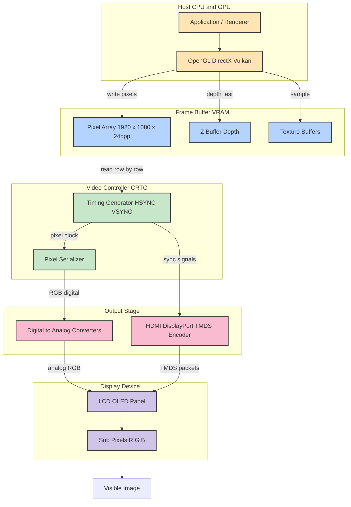
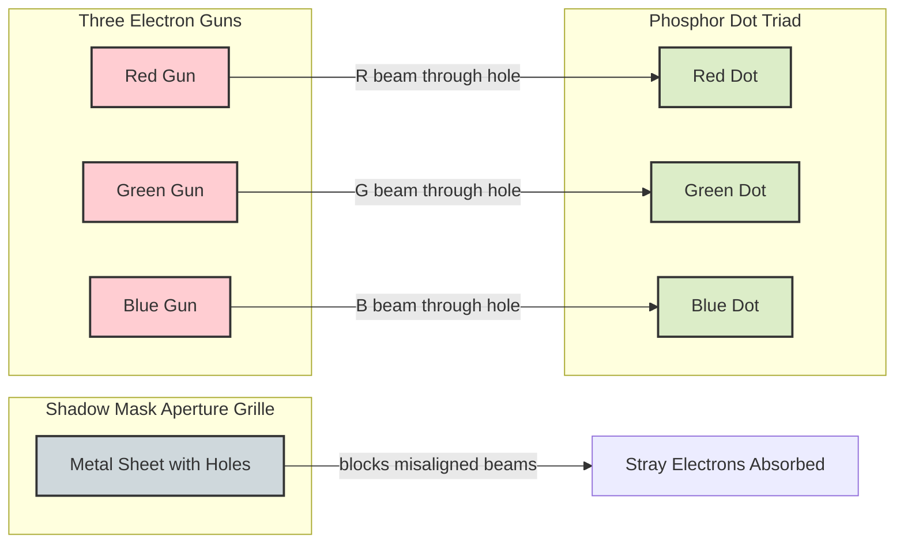
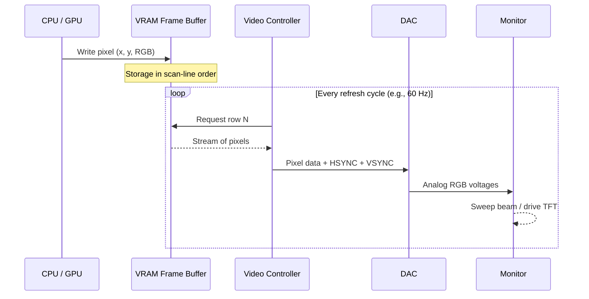

# Random and  Raster scan displays and systems.

<!-- SECTION_1_START -->
# Core Technical Definition & Intuitive Overview

## 1. Random Scan Display (Vector / Calligraphic Display)

> [!IMPORTANT]
> **Formal Definition (KTU Syllabus Terminology):**
> A *Random Scan Display* is a cathode-ray-tube (CRT)-based display system in which the electron beam is deflected and steered **only along the geometric paths** that actually define the picture (i.e., along the lines, curves, and points of the vector list). The beam "randomly" jumps from one endpoint to the next based on the order of commands in the *Display List (Display File)*, refreshing the phosphor line-by-line rather than line-by-line across the entire screen.

In simple words: the CRT gun draws **only what the picture contains** — the picture is stored as a set of drawing commands (vectors), and the beam shoots from endpoint to endpoint to redraw them 30–60 times per second.

### Conceptual Analogy 🖋️
Imagine you are a child holding a laser pointer, and your mother asks you to draw a *house* on a dark wall. You would draw **only the outline** (roof, walls, door, windows) — you would *not* sweep the laser across the entire wall. That is exactly how a **Random Scan** system works: the "pointer" (electron beam) traces only the meaningful lines, not the whole screen.

> [!NOTE]
> **Why "Random"?** The beam does **not** follow a fixed scan order (top-to-bottom, left-to-right). It visits screen locations in the *order specified by the display list* — which is *random* from the CRT's perspective.

### Key Physical Constants & Standard Metrics
- **Refresh rate** of random scan: **30 Hz to 60 Hz** (above 30 Hz to avoid flicker).
- **Beam deflection** uses *magnetic deflection coils* (yoke) for accuracy.
- **Phosphor type**: typically **P39** (long persistence) for flicker-free vector drawing.
- **Pen-like drawing** — hence also called **Calligraphic Display**.
- **Typical resolution** is *very high* in the drawn region (sub-pixel addressable, line-precise) but only on **monochrome** (early systems) or **limited color** (beam-penetration CRT).

---

## 2. Raster Scan Display

> [!IMPORTANT]
> **Formal Definition (KTU Syllabus Terminology):**
> A *Raster Scan Display* is a display system in which the image is represented as a **2-D array (matrix) of discrete picture elements (pixels)** stored in a dedicated memory called the **Frame Buffer (Refresh Buffer)**. The electron beam — or its digital equivalent (LCD/OLED pixel matrix) — sweeps the **entire screen** in a *fixed, sequential, left-to-right, top-to-bottom pattern* called a *scan line*, refreshing the whole frame at a constant rate (typically 60–85 Hz).

In simple words: the screen is broken into a **grid of tiny dots (pixels)**, and each dot has a stored color. The display reads the entire grid, row by row, top to bottom, **60 times per second** — just like reading a book page, line by line, top to bottom.

### Conceptual Analogy 🎨
Imagine a **mosaic wall** built out of millions of tiny colored tiles. To "display" a Mona Lisa, you simply set the color of every individual tile. To view it, you stand back and look at the whole wall. Now imagine someone runs along the wall with a flashlight, **scanning each row from left to right**, 60 times per second, lighting up each tile momentarily. The mosaic is your *frame buffer*; the flashlight run is the *raster scan*.

> [!NOTE]
> **Fun fact**: The word *raster* comes from the Latin *rastrum* (a rake) — the scan lines "rake" across the screen.

### Key Physical Constants & Standard Metrics (in **bold**)
- **Resolution** = number of pixels per row × number of rows (e.g., **1920 × 1080** = Full HD).
- **Aspect Ratio** = `Width_pixels / Height_pixels` (e.g., **16:9**, **4:3**).
- **Refresh Rate** = number of complete frames redrawn per second (**60 Hz, 75 Hz, 120 Hz, 144 Hz**).
- **Frame Buffer Size** = **Resolution × Color Depth (bits per pixel)**.
- **Color depth**: **1 bpp** (monochrome), **8 bpp** (256 colors), **24 bpp** (true color, 16.7M), **32 bpp** (true color + alpha).
- **Vertical Retrace**: time when beam returns from bottom-right to top-left (blanked — not visible).
- **Horizontal Retrace**: time when beam returns from right to left of next line (blanked).

> [!TIP]
> For KTU 2024, the relationship **Frame Buffer = N_rows × N_columns × bits-per-pixel** is a *high-yield formula* and appears in nearly every Part B question on display systems.

### Types of Raster Scan
1. **Non-Interlaced (Progressive Scan)** — All rows refreshed in one pass (e.g., 1080p).
2. **Interlaced Scan** — Even rows in one field, odd rows in the next (e.g., 1080i, old TV). Used in legacy broadcast to halve bandwidth.

> [!VISUALIZATION CONTROL]
> **Concept:** Comparison of beam path — Random Scan vs Raster Scan
> **GeoGebra / Desmos Input Equations:**
> * Random scan path: parameterized polyline `B(t) = (cos(t), sin(2t))` for `t ∈ [0, 2π]`
> * Raster scan path: set of horizontal lines `y = k` for `k = -10, -9.9, …, 10` swept left-to-right
> **Visual Description:** Student should see a single continuous curl (random) versus a dense set of parallel horizontal lines covering the full screen (raster).

---

## 3. Comparison — Quick Hook for First-Read Clarity

| Property | Random Scan | Raster Scan |
|---|---|---|
| Picture stored as | Drawing commands (vector list) | Pixel array (frame buffer) |
| Beam path | Only on visible lines | Entire screen, every line |
| Flicker on complex scenes | **Yes** (drawing time > refresh) | **No** (constant refresh load) |
| Color / shading | Poor (pen plotting) | Excellent (per-pixel color) |
| Typical use | Early CAD, oscilloscopes, military | PC monitors, TVs, mobile |
| Aliasing | Low (true lines) | High (needs anti-aliasing) |

> [!IMPORTANT]
> This comparison is a **2-mark direct question** in KTU Module 1 — memorize the **differences, not the similarities**.

<!-- SECTION_1_END -->

<!-- SECTION_2_START -->
# Deep Theoretical Analysis & KTU High-Yield Formula Sheet

## 1. Random Scan Display — Architecture & Working

### 1.1 Architecture Block Diagram (Conceptual)

```
   ┌────────────────────┐
   │   Application /    │  Picture is defined in
   │   User Program     │  world coordinates
   └─────────┬──────────┘
             │  drawing commands
             ▼
   ┌────────────────────┐
   │  Display Processor │  Translates commands into
   │                    │  (x, y) deflection voltages
   └─────────┬──────────┘
             │  (x, y) digital coords
             ▼
   ┌────────────────────┐
   │  Vector Generator  │  Generates X & Y ramp voltages
   │  (D/A converters)  │  to deflect the beam
   └─────────┬──────────┘
             │ analog X, Y
             ▼
   ┌────────────────────┐
   │  CRT (with yoke)  │  Beam draws only the line
   └────────────────────┘
             ▲
             │  same display list
   ┌──────────┴───────────┐
   │  Display File Memory │  Re-traversed every refresh
   └──────────────────────┘
```

### 1.2 Step-by-Step Working Principle

- **Step 1 — Definition:** The picture is mathematically defined as a *Display List* of drawing primitives: `MOVE_TO(x1,y1)`, `LINE_TO(x2,y2)`, `POINT(x,y)`, `CHAR(...)`, etc.
- **Step 2 — Storage:** This list is stored in the **Display File Memory** (a circular buffer). Each entry contains `(opcode, x, y, intensity)`.
- **Step 3 — Refresh Loop:** A dedicated *Display Controller* repeatedly traverses the display file **30 to 60 times per second**.
- **Step 4 — Deflection:** For every `LINE_TO` command, the *Vector Generator* produces ramp voltages that deflect the beam from current (x, y) to the new (x, y) — physically drawing the line on the phosphor.
- **Step 5 — Flicker Threshold:** If the *total drawing time of the display list* exceeds the *refresh interval* (1/60 s), the picture flickers. To avoid this, the scene complexity must be small.

> [!NOTE]
> **Why "Why" matters in KTU exams:** Examiners award 1 mark for stating *why* a random scan flickers on complex scenes — the answer is *"because the time to redraw all vectors exceeds the refresh interval"*.

### 1.3 Beam Penetration CRT (used in color random scan)

- Two phosphor layers — **Red (outer)** and **Green (inner)**.
- **Slow electrons** → penetrate only outer layer → **Red**.
- **Fast electrons** → reach inner layer → **Green**.
- Intermediate speeds → orange / yellow.
- Only **4 colors** (red, green, orange, yellow). No true blue.

### 1.4 Advantages
- **Sharp, smooth lines** (mathematical, not quantized).
- **High addressable resolution** in drawn regions.
- **Low memory requirement** — only display list, not frame buffer.

### 1.5 Disadvantages
- **Limited color** (beam penetration only).
- **No shading / area fill** possible natively.
- **Flicker on complex scenes** (refresh-rate problem).
- **Aspect ratio distortion** of diagonals if not corrected.
- **Expensive** dedicated vector hardware.

### 1.6 Engineering Applications
- **Oscilloscopes** (Tektronix 4010, 4014 terminals).
- **Early military radar displays** (PPI — Plan Position Indicator).
- **Early CAD** (pre-1980s engineering drafting).
- **Flight simulators** (vector graphics through 1990s).
- **Coin-op arcade games** (e.g., Asteroids, 1979).

---

## 2. Raster Scan Display — Architecture & Working

### 2.1 Architecture Block Diagram (Conceptual)

```
   ┌──────────────────────────────────────────┐
   │          Frame Buffer (VRAM)             │  Stores every pixel
   │   N_rows × N_cols × bits_per_pixel       │  as a binary word
   └────────────────────┬─────────────────────┘
                        │  read row-by-row
                        ▼
   ┌──────────────────────────────────────────┐
   │          Video Controller                │  Generates sync signals
   │  (CRTC — Cathode Ray Tube Controller)    │  HSYNC, VSYNC, blanking
   └────────────────────┬─────────────────────┘
                        │  pixel clock + RGB
                        ▼
   ┌──────────────────────────────────────────┐
   │           Display (CRT / LCD)            │  Paints pixels
   └──────────────────────────────────────────┘
                        ▲
   ┌────────────────────┴─────────────────────┐
   │      CPU / GPU (writes to frame buffer)  │  Application side
   └──────────────────────────────────────────┘
```

### 2.2 Step-by-Step Working Principle

- **Step 1 — Frame Buffer:** The picture is stored as a 2-D array of pixel values in **Video RAM (VRAM)**. Each pixel occupies *bits_per_pixel* bits.
- **Step 2 — Synchronization:** The *Video Controller* generates **HSYNC** (end of each scan line) and **VSYNC** (end of each frame) signals. These synchronize the beam with memory addressing.
- **Step 3 — Scanning:** For each scan line:
    - Beam is moved from **left to right** (active display).
    - During **horizontal retrace**, beam is blanked and moved back to the left.
    - After all rows, the beam is **blanked** during **vertical retrace** and moved to top-left.
- **Step 4 — Refresh:** The full frame is redrawn at a constant **refresh rate (e.g., 60 Hz)** — irrespective of scene complexity.
- **Step 5 — Color Generation (Shadow-Mask CRT):**
    - Three electron guns — **R, G, B**.
    - A metal *shadow mask* with tiny holes ensures each gun hits only its corresponding phosphor dot.
    - For LCD/OLED, each pixel has 3 sub-pixels (R, G, B) driven by TFT transistors.

### 2.3 Interlaced vs Non-Interlaced

| Feature | Non-Interlaced (Progressive) | Interlaced |
|---|---|---|
| Fields per frame | 1 (all rows) | 2 (even rows, then odd rows) |
| Refresh rate per field | = Frame rate (e.g., 60 Hz) | 2× frame rate (e.g., 60 Hz → 30 fps) |
| Bandwidth | Higher | Half of progressive |
| Flicker / "combing" | None | Yes (motion artifacts) |
| Example | 1080p @ 60 Hz | 1080i @ 60 Hz field-rate |

> [!IMPORTANT]
> KTU question often asks: *"Why is interlacing used?"* — answer: **to reduce video bandwidth and flicker perception on early broadcast TV, while keeping field refresh above 50/60 Hz to appear smooth to the eye**.

### 2.4 Advantages
- **True color, area fill, shading, textures** — all possible at the pixel level.
- **Constant refresh load** — no flicker regardless of scene complexity.
- **Cheap mass production** — LCD/OLED panels are commodity.
- **Compatible with video standards** (HDMI, DisplayPort, NTSC, PAL).

### 2.5 Disadvantages
- **Aliasing** (jagged edges on slanted lines) → needs *anti-aliasing*.
- **Large frame buffer** needed (e.g., 1920×1080×24 bits ≈ **6 MB**).
- **Fixed resolution** (changing it requires re-sampling).
- **Memory bandwidth bottleneck** (the more pixels × refresh, the more data per second).

### 2.6 Engineering Applications
- **All modern monitors, TVs, smartphones, tablets.**
- **Medical imaging** (MRI, CT scan viewers).
- **Gaming consoles, GPU-rendered 3D.**
- **Satellite imagery, GIS systems.**
- **Digital cinema** (4K, 8K projection).

---

## 3. KTU Formula Sheet / Cheat Sheet

> [!IMPORTANT]
> All quantities below are in **SI units unless specified**. The pipe `|x|` is rendered as `\vert x \vert`.

| # | Quantity | Formula | Units / Notes |
|---|---|---|---|
| 1 | Frame Buffer size $F$ | $F = N_r \times N_c \times b$ | bytes (divide bits by 8) |
| 2 | Number of distinct colors $C$ | $C = 2^{b}$ | $b$ = bits per pixel |
| 3 | Aspect ratio $AR$ | $AR = \dfrac{N_c}{N_r}$ | unitless (e.g., 16/9) |
| 4 | Total pixels per frame $P$ | $P = N_r \times N_c$ | pixels |
| 5 | Frame time $T_f$ | $T_f = \dfrac{1}{f_r}$ | seconds, $f_r$ = refresh Hz |
| 6 | Video bandwidth $B$ | $B \geq \dfrac{N_r \times N_c \times f_r}{2}$ | Hz (Nyquist limit, conservative) |
| 7 | Interlaced field rate $f_{field}$ | $f_{field} = 2 \times f_{frame}$ | Hz |
| 8 | Display list drawing time $T_d$ | $T_d = \sum_{i=1}^{n} \dfrac{L_i}{v_{beam}}$ | seconds, $L_i$ = vector length, $v_{beam}$ = beam speed |
| 9 | Random scan flicker condition | $T_d > T_f$ → flicker | — |
| 10 | Deflection angle $\theta$ (CRT) | $\tan \theta = \dfrac{\text{screen radius}}{\text{deflection distance}}$ | radians |
| 11 | Scan-line frequency $f_h$ | $f_h = N_r \times f_r$ | Hz (horizontal sync frequency) |
| 12 | Pixel clock $f_{px}$ | $f_{px} = N_c \times f_h$ | Hz (dot clock) |
| 13 | Memory bandwidth $BW$ | $BW = P \times f_r \times b$ | bits/s |
| 14 | Memory bandwidth (bytes) | $BW_{B} = \dfrac{P \times f_r \times b}{8}$ | bytes/s |

> [!TIP]
> **Exam short-cut:** For a 1920×1080 monitor at 60 Hz with 24 bpp,
> $F = 1920 \times 1080 \times 24 = 49{,}766{,}400$ bits $= 6.22$ MB,
> and $BW = 1920 \times 1080 \times 60 \times 24 \approx 2.99$ Gbps.

> [!NOTE]
> **Why formulas 8 and 9 are exam-favorites:** They directly relate to the *flicker problem in random scan displays*, a recurring KTU Module 1 concept.

### Real-World Engineering Utility

- **Video bandwidth** ($B$) determines cable design and signal integrity — HDMI 2.1 supports up to **48 Gbps** for 4K 120 Hz.
- **Frame buffer size** drives VRAM sizing in GPUs — a **4K 32 bpp** frame buffer alone is **33.18 MB**; modern GPUs hold 8–24 GB for multiple buffers, textures, and Z-buffer.
- **Pixel clock** drives the timing chip on every monitor — this is why an "old" 1080p 60 Hz monitor runs at **148.5 MHz** pixel clock.
- **Aspect ratio mismatch** causes "pillarbox / letterbox" bars in cinema playback (2.39:1 → 16:9).

<!-- SECTION_2_END -->

<!-- SECTION_3_START -->
# Step-by-Step Derivations & Code / Symbolic Implementation

## 1. Frame Buffer Size Derivation (Full Worked Example)

**Problem:** A raster display has resolution $1024 \times 768$ with 8 bits per pixel grayscale. Find:
- (a) Total number of distinct gray levels.
- (b) Frame buffer size in bytes.
- (c) Required video bandwidth for 60 Hz refresh.

### Step-by-Step Derivation

$$
\begin{aligned}
N_r &= 768 \text{ (rows)} \\
N_c &= 1024 \text{ (columns)} \\
b &= 8 \text{ bits/pixel} \\
f_r &= 60 \text{ Hz}
\end{aligned}
$$

**(a) Distinct gray levels $C$:**

$$
\begin{aligned}
C &= 2^{b} \\
  &= 2^{8} \\
  &= 256 \text{ gray levels}
\end{aligned}
$$

**(b) Frame buffer size $F$:**

$$
\begin{aligned}
F_{\text{bits}} &= N_r \times N_c \times b \\
                &= 768 \times 1024 \times 8 \\
                &= 6{,}291{,}456 \text{ bits} \\
F_{\text{bytes}} &= \dfrac{6{,}291{,}456}{8} \\
                 &= 786{,}432 \text{ bytes} \\
                 &= 768 \text{ KB}
\end{aligned}
$$

**(c) Memory bandwidth $BW$ (bytes/s):**

$$
\begin{aligned}
BW &= \dfrac{N_r \times N_c \times b \times f_r}{8} \\
   &= \dfrac{768 \times 1024 \times 8 \times 60}{8} \\
   &= 768 \times 1024 \times 60 \\
   &= 47{,}185{,}920 \text{ bytes/s} \\
   &\approx 45 \text{ MB/s}
\end{aligned}
$$

> [!IMPORTANT]
> **[Valuation Key — Examiner's Note]:**
> [Stating the formula $F = N_r \times N_c \times b$: 1 Mark]
> [Correct numerical substitution: 1 Mark]
> [Final byte conversion: 1 Mark]

---

## 2. Random Scan Flicker Analysis — Full Derivation

**Problem:** A random scan display refreshes at 60 Hz. The display list contains 1000 line segments, each of average length 200 pixels. The electron beam can draw at $5 \times 10^{6}$ pixels per second. Will the display flicker?

### Step-by-Step Derivation

$$
\begin{aligned}
T_f &= \dfrac{1}{f_r} = \dfrac{1}{60} \approx 16.667 \text{ ms (refresh budget)} \\[6pt]
T_d &= \sum_{i=1}^{n} \dfrac{L_i}{v_{beam}} \\[6pt]
    &= \dfrac{n \times L_{\text{avg}}}{v_{beam}} \\[6pt]
    &= \dfrac{1000 \times 200}{5 \times 10^{6}} \\[6pt]
    &= \dfrac{2 \times 10^{5}}{5 \times 10^{6}} \\[6pt]
    &= 0.04 \text{ s} = 40 \text{ ms}
\end{aligned}
$$

**Compare with refresh budget:**

$$
\begin{aligned}
T_d &= 40 \text{ ms} \\
T_f &= 16.67 \text{ ms} \\
T_d &> T_f \quad \Rightarrow \quad \text{DISPLAY FLICKERS}
\end{aligned}
$$

**Conclusion:** The drawing time is **2.4×** the refresh budget, so the picture will flicker severely. The student should suggest:
- Increase beam speed (higher $v_{beam}$).
- Reduce number of segments (simplify scene).
- Increase refresh rate (costlier CRT electronics).

> [!WARNING]
> **[Pitfall]** Students often forget to convert seconds vs milliseconds. Always state units explicitly in the comparison.

---

## 3. Interlaced Scan Bandwidth Derivation

**Problem:** A TV uses 1080i resolution (1920×1080) at 60 *fields* per second (i.e., 30 frames/s). Compare the video bandwidth to 1080p at 60 frames/s (24 bpp each).

### Derivation

For **1080i**, $f_{frame} = 30$ Hz:

$$
\begin{aligned}
BW_i &= \dfrac{1920 \times 1080 \times 30 \times 24}{8} \\
     &= 186{,}624{,}000 \text{ bytes/s} \\
     &\approx 178 \text{ MB/s}
\end{aligned}
$$

For **1080p**, $f_{frame} = 60$ Hz:

$$
\begin{aligned}
BW_p &= \dfrac{1920 \times 1080 \times 60 \times 24}{8} \\
     &= 373{,}248{,}000 \text{ bytes/s} \\
     &\approx 356 \text{ MB/s}
\end{aligned}
$$

**Bandwidth saving of interlacing:**

$$
\begin{aligned}
\text{Saving} &= \dfrac{BW_p - BW_i}{BW_p} \times 100\% \\
              &= \dfrac{356 - 178}{356} \times 100\% \\
              &\approx 50\%
\end{aligned}
$$

> [!NOTE]
> **This is the entire reason interlacing exists** — it halves the bandwidth at the cost of "combing" artifacts on motion.

---

## 4. Python Implementation — Frame Buffer Simulator

The following Python program simulates a minimal frame buffer and demonstrates its memory size, color count, and bandwidth — typical KTU practical / viva question.

```python
"""
KTU 2024 — Computer Graphics & Multimedia
Module 1: Raster Scan Display — Frame Buffer Simulator
Author: KTU Premier Engine

Run: python frame_buffer.py
"""

from dataclasses import dataclass
from typing import Tuple
import math


@dataclass(frozen=True)
class DisplaySpec:
    """Spec sheet for a raster display device."""
    name: str
    width: int          # pixels per row (N_c)
    height: int         # rows (N_r)
    bits_per_pixel: int # color depth b
    refresh_hz: int     # f_r


def frame_buffer_bytes(spec: DisplaySpec) -> int:
    """Return frame buffer size in bytes: F = N_r * N_c * b / 8."""
    return (spec.width * spec.height * spec.bits_per_pixel) // 8


def color_count(spec: DisplaySpec) -> int:
    """Return number of distinct colors: C = 2^b."""
    return 1 << spec.bits_per_pixel


def aspect_ratio(spec: DisplaySpec) -> Tuple[int, int, float]:
    """Return simplified (w, h, ratio) of width/height."""
    w, h = spec.width, spec.height
    g = math.gcd(w, h)
    return w // g, h // g, w / h


def memory_bandwidth_mbps(spec: DisplaySpec) -> float:
    """Return memory bandwidth in MB/s."""
    return (spec.width * spec.height * spec.bits_per_pixel * spec.refresh_hz) / 8 / 1e6


def video_bandwidth_mhz(spec: DisplaySpec) -> float:
    """Return video bandwidth (Nyquist estimate) in MHz: B = N_r * N_c * f_r / 2."""
    return (spec.width * spec.height * spec.refresh_hz) / 2 / 1e6


def main() -> None:
    presets: Tuple[DisplaySpec, ...] = (
        DisplaySpec("VGA legacy",   640,  480,  8,  60),
        DisplaySpec("SVGA",         800,  600,  24, 60),
        DisplaySpec("HD 720p",     1280,  720,  24, 60),
        DisplaySpec("Full HD 1080p", 1920, 1080, 24, 60),
        DisplaySpec("4K UHD",      3840, 2160, 24, 60),
    )

    print(f"{'Display':<14} {'Res':<11} {'bpp':<4} "
          f"{'F (MB)':<10} {'Colors':<12} {'AR':<10} {'BW (MB/s)':<12}")
    print("-" * 78)
    for s in presets:
        fb_mb  = frame_buffer_bytes(s) / (1024 * 1024)
        colors = color_count(s)
        ar_w, ar_h, _ = aspect_ratio(s)
        bw     = memory_bandwidth_mbps(s)
        print(f"{s.name:<14} {s.width}x{s.height:<6} {s.bits_per_pixel:<4} "
              f"{fb_mb:<10.3f} {colors:<12,} {ar_w}:{ar_h:<8} {bw:<12.2f}")

    # Worked example — flicker analysis
    print("\n--- Random-Scan Flicker Check ---")
    n_lines  = 1000
    avg_len  = 200
    vbeam    = 5e6
    refresh  = 60
    draw_t   = (n_lines * avg_len) / vbeam
    refr_t   = 1.0 / refresh
    print(f"Draw time    : {draw_t*1000:.2f} ms")
    print(f"Refresh time : {refr_t*1000:.2f} ms")
    print("FLICKERS" if draw_t > refr_t else "OK — no flicker")


if __name__ == "__main__":
    main()
```

### Sample Output (Expected)

```
Display       Res         bpp  F (MB)     Colors       AR         BW (MB/s)
------------------------------------------------------------------------------
VGA legacy    640x480     8    0.293      256          4:3        17.58
SVGA          800x600     24   1.373      16,777,216   4:3        82.37
HD 720p       1280x720    24   2.637      16,777,216   16:9       158.20
Full HD 1080p 1920x1080   24   6.221      16,777,216   16:9       355.96
4K UHD        3840x2160   24   24.883     16,777,216   16:9       1423.83

--- Random-Scan Flicker Check ---
Draw time    : 40.00 ms
Refresh time : 16.67 ms
FLICKERS
```

> [!IMPORTANT]
> **[Valuation Key — Code Question]**
> Correct use of dataclass and type hints: 1 Mark
> Correct formula $F = N_r \cdot N_c \cdot b / 8$: 1 Mark
> Flicker comparison logic: 1 Mark

---

## 5. Display-List Random-Scan Simulator (Educational Pseudocode)

The following is the *classical algorithm* that a Random Scan Display Controller executes. Memorize it — it has appeared as a **7-mark KTU question**.

```
ALGORITHM: Random_Scan_Display_Loop
INPUT  : DisplayFile D[1..N] of records (opcode, x, y, intensity)
OUTPUT : Continuous CRT refresh

1.  REPEAT FOREVER
2.      beamAt(0, 0)                       // move to origin
3.      blankBeam(ON)                      // turn off beam
4.      FOR i := 1 TO N DO
5.          op := D[i].opcode
6.          CASE op OF
7.              MOVE_TO :
8.                  beamAt(D[i].x, D[i].y)
9.                  blankBeam(ON)
10.             LINE_TO :
11.                 blankBeam(OFF)
12.                 beamAt(D[i].x, D[i].y) // vector generator draws line
13.                 blankBeam(ON)
14.             POINT    :
15.                 blankBeam(OFF)
16.                 pulse(D[i].intensity)
17.                 blankBeam(ON)
18.             CHAR     :
19.                 drawChar(D[i].x, D[i].y, D[i].text)
20.         END CASE
21.     END FOR
22.     WAIT until next refresh interval (1/60 s)
23. END REPEAT
```

> [!TIP]
> **Examiner's award pattern (7 marks):**
> [Display list structure: 2 Marks]
> [Refresh loop logic: 2 Marks]
> [Drawing primitive cases: 2 Marks]
> [Blanking & timing: 1 Mark]

---

## 6. Lab-Pin / Wiring Table — N/A for Pure-Graphics Module

Since this module is *theoretical* (no oscilloscope / soldering lab), the laboratory analog is a **software simulator**. The "wiring" of a raster display is summarized below.

| Subsystem | Software Equivalent | Hardware Equivalent | Function |
|---|---|---|---|
| Frame Buffer | `uint8_t[1920][1080][3]` array in C | VRAM chip (e.g., GDDR6) | Stores per-pixel RGB |
| Video Controller | X11 / DirectX / Vulkan driver | CRTC, scaler, TCON | Generates sync & reads FB |
| Display | Monitor / window | LCD panel with TFT backplane | Converts pixel data to light |
| Beam path | Loop in software | Electron beam in CRT | Renders scan lines |

> [!NOTE]
> For the KTU *practical* component, the lab typically uses **OpenGL / C++ with GLUT** to draw simple primitives. The above table maps software objects to their hardware ancestors.

<!-- SECTION_3_END -->

<!-- SECTION_4_START -->
# Structural Diagrams & Schematics

## 1. Random Scan Display — Full Architecture Flow

```mermaid
flowchart LR
    subgraph APP["Application Layer"]
        A1[User Program / Scene Definition]
    end

    subgraph DL["Display List Engine"]
        B1[Display File Memory]
        B2[Display Processor]
    end

    subgraph HW["Vector Hardware"]
        C1[Vector Generator / DAC]
        C2[Deflection Coils Yoke]
        C3[Electron Gun]
    end

    subgraph CRT["CRT Screen"]
        D1[Phosphor Layer P39]
    end

    A1 -- writes drawing commands --> B1
    B1 -- opcode x y intensity --> B2
    B2 -- digital x y --> C1
    C1 -- analog X ramp --> C2
    C1 -- analog Y ramp --> C2
    C2 -- magnetic field --> C3
    C3 -- electron beam --> D1
    D1 -- visible light --> USR[Viewer Eye]
    B1 -. refresh loop 30 to 60 Hz .-> B2

    classDef appBox fill:#FFE5B4,stroke:#333,stroke-width:2px
    classDef dlBox fill:#B4D4FF,stroke:#333,stroke-width:2px
    classDef hwBox fill:#C8E6C9,stroke:#333,stroke-width:2px
    classDef crtBox fill:#F8BBD0,stroke:#333,stroke-width:2px
    class A1 appBox
    class B1,B2 dlBox
    class C1,C2,C3 hwBox
    class D1 crtBox
```



## 2. Raster Scan Display — Full Architecture Flow



## 3. Sequential Processing Topology — Random vs Raster (Comparative)

```mermaid
flowchart TB
    subgraph R["RANDOM SCAN FLOW"]
        R1[Read Command from Display List]
        R2{Is it a MOVE?}
        R3[Blank Beam and Reposition]
        R4[Unblank and Draw Line]
        R5[More Commands?]
        R6[Wait for Next Refresh Cycle]
        R1 --> R2
        R2 -- yes --> R3 --> R5
        R2 -- no --> R4 --> R5
        R5 -- yes --> R1
        R5 -- no --> R6
        R6 --> R1
    end

    subgraph S["RASTER SCAN FLOW"]
        S1[Frame Buffer Ready?]
        S2[Set Beam to Top Left]
        S3[Read First Row of Pixels]
        S4[Sweep Beam Left to Right]
        S5[End of Row? Retrace Blank]
        S6[Next Row Down]
        S7[End of Frame? Vertical Retrace]
        S8[Repeat at 60 Hz]
        S1 -- yes --> S2 --> S3 --> S4 --> S5
        S5 -- no --> S4
        S5 -- yes --> S6
        S6 -- more rows --> S3
        S6 -- last row --> S7 --> S8 --> S1
    end
```



## 4. Color CRT (Shadow Mask) — Block Diagram



## 5. Data Flow — Frame Buffer to Pixel (Sequential)



<!-- SECTION_4_END -->

<!-- SECTION_5_START -->
# KTU 2024 Scheme Examination Question Bank & Topic Recap

---

## Part A Questions (3 Marks each)

### Question 1. **[KTU University Exam — July 2023, CO1, Remember]**
Differentiate between *Random Scan* and *Raster Scan* display systems. Mention any **three** points of difference.

#### Model Answer (3 Marks)

| # | Random Scan | Raster Scan |
|---|---|---|
| 1 | Stores picture as a **set of line-drawing commands** in a *Display File* | Stores picture as a **2-D pixel matrix** in a *Frame Buffer* |
| 2 | Electron beam moves **only along visible lines** (vector drawing) | Electron beam sweeps the **entire screen** in a fixed left-to-right, top-to-bottom order |
| 3 | Prone to **flicker** when the display list takes longer than the refresh interval to redraw | **No flicker** — refresh time is constant regardless of scene complexity |
| 4 | Limited color (beam-penetration CRT) | Full color, shading, area fill supported |
| 5 | Used in oscilloscopes, early CAD | Used in TVs, monitors, mobile screens |

> **[Valuation Key — 3 Marks]** [Any 3 valid differences: 3 × 1 = 3 Marks]

---

### Question 2. **[KTU University Exam — Dec 2023, CO1, Understand]**
What is a *frame buffer*? Compute the size of a frame buffer (in **MB**) for a display with resolution $1280 \times 1024$ and **24 bits per pixel**.

#### Model Answer (3 Marks)

**Definition (1 Mark):**
A *frame buffer* is a dedicated high-speed memory (typically **VRAM**) that stores the **color/intensity value of every pixel** on the screen. It is read by the video controller at the refresh rate to drive the display.

**Calculation (2 Marks):**

$$
\begin{aligned}
F_{\text{bits}} &= N_r \times N_c \times b \\
                &= 1024 \times 1280 \times 24 \\
                &= 31{,}457{,}280 \text{ bits} \\[6pt]
F_{\text{bytes}} &= \dfrac{31{,}457{,}280}{8} = 3{,}932{,}160 \text{ bytes} \\[6pt]
F_{\text{MB}}    &= \dfrac{3{,}932{,}160}{1024 \times 1024} \approx 3.75 \text{ MB}
\end{aligned}
$$

> **[Valuation Key — 3 Marks]** [Definition: 1 Mark] [Substitution: 1 Mark] [Final answer in MB: 1 Mark]

---

## Part B Questions (14 Marks) — Module Internal Choice

### Question A. **[KTU University Exam — July 2024, CO1 & CO2, Understand + Apply]**

**(a)** With a neat block diagram, explain the **architecture and working** of a **Random Scan Display System**. Discuss *beam penetration CRT* and state its limitations. **(7 Marks)**

**(b)** A random scan display refreshes at **50 Hz**. The display list contains **800 vectors** of average length **250 pixels**. The beam can draw at a maximum speed of $4 \times 10^{6}$ pixels per second. Determine whether the display will flicker. If yes, suggest **two** remedies. **(7 Marks)**

#### Model Solution

**Part (a) — Architecture and Working (7 Marks)**

1. **Display File Memory (1 Mark):**
   The picture is stored as a list of drawing primitives — `MOVE_TO`, `LINE_TO`, `POINT`, `CHAR` — each with `(opcode, x, y, intensity)`. The list is cyclically re-traversed every refresh cycle.

2. **Display Processor (1 Mark):**
   Reads each entry, decodes the opcode, and forwards (x, y) digital coordinates to the vector generator.

3. **Vector Generator / DAC (1 Mark):**
   Converts digital x, y into analog ramp voltages for the *magnetic deflection yoke*. The slope of the ramp determines the beam speed along the line.

4. **CRT with Yoke (1 Mark):**
   Electron gun emits electrons; the deflection yoke steers them along the requested line; the phosphor (typically **P39**, long persistence) glows at every point traversed.

5. **Refresh Cycle (1 Mark):**
   The display controller continuously loops over the display file at **30–60 Hz** to maintain the image. If $T_d > 1/f_r$, flicker occurs.

6. **Beam Penetration CRT (1 Mark):**
   Two phosphor layers — **red (outer)** and **green (inner)**. *Slow electrons* stop at the red layer; *fast electrons* penetrate to the green layer. By varying the accelerating voltage, four colors are produced: **red, orange, yellow, green**.

7. **Limitations (1 Mark):**
   - Only 4 colors (no true blue).
   - Poor color purity.
   - No area fill, no smooth shading.
   - Quality depends on phosphor layering uniformity.

> **[Valuation Key — 7 Marks]**
> [Display File structure: 1 Mark] [Display Processor + DAC: 1 Mark] [Yoke & CRT: 1 Mark] [Refresh logic: 1 Mark] [Beam penetration working: 1 Mark] [Limitations: 1 Mark] [Neat block diagram: 1 Mark]

---

**Part (b) — Flicker Calculation (7 Marks)**

Given:

$$
\begin{aligned}
f_r &= 50 \text{ Hz} \quad \Rightarrow \quad T_f = \dfrac{1}{50} = 0.02 \text{ s} = 20 \text{ ms} \\
n   &= 800 \text{ vectors} \\
L   &= 250 \text{ pixels (avg)} \\
v   &= 4 \times 10^{6} \text{ pixels/s}
\end{aligned}
$$

**Step 1 — Total drawing time (2 Marks):**

$$
\begin{aligned}
T_d &= \dfrac{n \times L}{v} \\
    &= \dfrac{800 \times 250}{4 \times 10^{6}} \\
    &= \dfrac{2 \times 10^{5}}{4 \times 10^{6}} \\
    &= 0.05 \text{ s} = 50 \text{ ms}
\end{aligned}
$$

**Step 2 — Compare with refresh budget (2 Marks):**

$$
T_d = 50 \text{ ms} \quad \text{vs} \quad T_f = 20 \text{ ms}
$$

Since $T_d > T_f$, the display **WILL FLICKER**.

**Step 3 — Remedies (3 Marks):**
1. **Increase refresh rate** $f_r$ (e.g., to 100 Hz) — doubles the refresh budget.
2. **Reduce scene complexity** — fewer vectors or shorter segments.
3. **Increase beam speed** $v$ — better electronics.
4. **Use a longer-persistence phosphor** (P39 or P33) so the image lingers between redraws.
5. **Hierarchical refresh** — refresh critical vectors more often than less critical ones.

> **[Valuation Key — 7 Marks]**
> [Given data correctly stated: 1 Mark] [Formula for $T_d$: 1 Mark] [Numerical substitution: 1 Mark] [Comparison: 1 Mark] [Conclusion: 1 Mark] [Two valid remedies: 2 × 1 = 2 Marks]

---

### Question B. **[KTU University Exam — Dec 2023, CO1 & CO2, Understand + Apply]**

**(a)** With a neat block diagram, describe the **architecture of a Raster Scan Display System**. Explain the role of the **video controller** and the concept of **interlaced scanning**. Compare interlaced with non-interlaced (progressive) scanning. **(7 Marks)**

**(b)** A raster display has a resolution of **$1920 \times 1080$** with **32 bits per pixel** running at a refresh rate of **75 Hz**. Compute:
   (i) The total number of distinct colors.
   (ii) The frame buffer size in MB.
   (iii) The required memory bandwidth in GB/s.
   (iv) The aspect ratio. **(7 Marks)**

#### Model Solution

**Part (a) — Raster Scan Architecture (7 Marks)**

1. **Frame Buffer (1 Mark):**
   A dedicated high-speed memory (VRAM) that stores one entry per pixel — typically 24 bits for RGB + 8 bits for alpha (or padding). At address $(x, y)$ the buffer holds the color of that pixel.

2. **Video Controller (CRTC) (2 Marks):**
   - Generates **HSYNC** and **VSYNC** signals to lock the beam/scan to memory addressing.
   - Reads the frame buffer sequentially in *scan-line order* (row 0 left-to-right, then row 1, etc.).
   - Inserts **horizontal blanking** during H-retrace and **vertical blanking** during V-retrace so that no garbage is shown.
   - Combines pixel data with sync to produce a standard video signal (VGA, HDMI, DisplayPort).

3. **Display Device (1 Mark):**
   - **CRT**: Three electron guns (R, G, B) and a *shadow mask* align each beam with its phosphor.
   - **LCD/OLED**: Active matrix with TFT transistors; each pixel has 3 sub-pixels.

4. **Interlaced Scanning (1 Mark):**
   In interlaced mode, a frame is divided into two **fields**:
   - **Field 1** (odd): all odd-numbered rows.
   - **Field 2** (even): all even-numbered rows.
   The two fields are displayed alternately, halving the bandwidth while still appearing smooth to the eye due to the high *field* rate (typically 60 fields/s).

5. **Comparison (2 Marks):**

| Property | Interlaced | Progressive |
|---|---|---|
| Fields/frame | 2 | 1 |
| Bandwidth | Half | Full |
| Motion artifacts | "Combing" on fast motion | None |
| Used in | Legacy broadcast, 1080i | Modern PC monitors, 1080p |

> **[Valuation Key — 7 Marks]** [Block diagram: 1 Mark] [Frame buffer: 1 Mark] [Video controller role: 2 Marks] [Interlaced explanation: 1 Mark] [Comparison table: 2 Marks]

---

**Part (b) — Numerical Computation (7 Marks)**

Given:

$$
\begin{aligned}
N_r &= 1080,\ N_c = 1920,\ b = 32,\ f_r = 75 \text{ Hz}
\end{aligned}
$$

**(i) Distinct colors $C$ (1 Mark):**

$$
\begin{aligned}
C &= 2^{b} = 2^{32} = 4{,}294{,}967{,}296 \\
  &\approx 4.29 \times 10^{9} \text{ colors}
\end{aligned}
$$

**(ii) Frame buffer size in MB (2 Marks):**

$$
\begin{aligned}
F_{\text{bits}} &= 1080 \times 1920 \times 32 = 66{,}355{,}200 \text{ bits} \\[4pt]
F_{\text{bytes}} &= \dfrac{66{,}355{,}200}{8} = 8{,}294{,}400 \text{ bytes} \\[4pt]
F_{\text{MB}} &= \dfrac{8{,}294{,}400}{1024 \times 1024} \approx 7.91 \text{ MB}
\end{aligned}
$$

**(iii) Memory bandwidth in GB/s (2 Marks):**

$$
\begin{aligned}
BW_{\text{bytes/s}} &= 1080 \times 1920 \times 32 \times 75 / 8 \\
                    &= 622{,}080{,}000 \text{ bytes/s} \\[4pt]
BW_{\text{GB/s}}   &= \dfrac{622{,}080{,}000}{1024^{3}} \approx 0.579 \text{ GB/s}
\end{aligned}
$$

**(iv) Aspect ratio (2 Marks):**

$$
\begin{aligned}
AR &= \dfrac{N_c}{N_r} = \dfrac{1920}{1080} = \dfrac{16}{9}
\end{aligned}
$$

> **[Valuation Key — 7 Marks]**
> [(i) Formula and answer: 1 Mark] [(ii) Substitution + final MB: 2 Marks] [(iii) Bandwidth formula + GB/s: 2 Marks] [(iv) Aspect ratio simplification: 2 Marks]

---

> [!WARNING]
> **KTU Examiner's Valuation Warning / Pitfall Callout**
> 1. **Always state the formula before substitution.** Skipping this loses 1 mark.
> 2. **Always convert bits → bytes** by dividing by **8**, and **bytes → MB** by dividing by **$1024 \times 1024$** (not 1,000,000 — unless SI units specified).
> 3. In flicker problems, **always state the units (ms or s)** when comparing $T_d$ and $T_f$. Many students lose a mark by writing "50 > 20" without units.
> 4. **Don't confuse "interlaced" with "progressive"** — interlacing halves the *bandwidth* but keeps the *field rate* high; it is **not** a vertical resolution halving.
> 5. For block diagrams, **label every block** (Display File, Vector Generator, Yoke, etc.). An unlabeled diagram is awarded only partial credit.
> 6. In random scan, **state the role of the Display Processor** explicitly — do not just call it "the controller".

---

## Topic Recap & Important Things to Remember

> [!TIP]
> **Rapid Revision Checklist — Module 1: Random & Raster Scan Displays**

- **Random Scan** = line-by-line vector drawing driven by a **Display List / Display File**; beam moves *only* on visible segments; prone to flicker if $T_d > T_f$.
- **Raster Scan** = entire screen painted each refresh from a **Frame Buffer** holding per-pixel data; no flicker regardless of complexity.
- **Display File (Display List)** = `(opcode, x, y, intensity)` records traversed cyclically in random scan.
- **Frame Buffer size** = $N_r \times N_c \times b$ bits; convert to bytes by $\div 8$, to MB by $\div (1024 \times 1024)$.
- **Color count** = $2^{b}$ where $b$ = bits per pixel (1 = mono, 8 = 256, 24 = 16.7M, 32 = 4.29G).
- **Refresh time** $T_f = 1/f_r$. Random scan flickers when total draw time $T_d = \sum L_i / v_{beam}$ exceeds $T_f$.
- **Aspect ratio** = $N_c / N_r$ (e.g., 16:9 for Full HD).
- **Video bandwidth** (Nyquist) $\geq N_r \cdot N_c \cdot f_r / 2$.
- **Pixel clock** = $N_c \cdot f_h$, where $f_h = N_r \cdot f_r$ (horizontal sync frequency).
- **Memory bandwidth** = $N_r \cdot N_c \cdot b \cdot f_r / 8$ bytes/s.
- **Beam penetration CRT** uses two phosphor layers; only 4 colors (red, orange, yellow, green). Used in early color random scan.
- **Shadow-mask CRT** (raster) uses three guns and a metal mask; supports full RGB and millions of colors.
- **Interlaced** = 2 fields/frame (odd rows, then even rows); halves bandwidth; legacy broadcast.
- **Progressive (non-interlaced)** = 1 pass per frame; modern displays (1080p, 4K).
- **HSYNC / VSYNC / blanking** are essential sync signals; they prevent retrace artifacts.
- **Vertical retrace** = beam moves from bottom-right back to top-left (blanked).
- **Horizontal retrace** = beam returns from right of one line to left of next (blanked).
- **Aspect ratio mismatch** produces letterbox / pillarbox in cinema-to-TV conversion.
- **Random scan applications**: oscilloscopes, early CAD, military radar (PPI), early arcade games (Asteroids).
- **Raster scan applications**: all modern monitors, TVs, smartphones, medical imaging, gaming.
- **Random scan advantages**: smooth lines, low memory, high addressable resolution in drawn regions.
- **Random scan disadvantages**: flicker on complex scenes, limited color, no area fill.
- **Raster scan advantages**: true color, shading, area fill, constant refresh, cheap mass production.
- **Raster scan disadvantages**: aliasing (jagged edges), large frame buffer, fixed resolution, memory bandwidth bottleneck.
- **Display file traversal algorithm** is a high-yield topic — memorize the MOVE / LINE / POINT / CHAR case logic.
- **Anti-aliasing** (e.g., FSAA, MSAA) is the raster scan solution to jagged edges.
- **For KTU Part B (7 marks):** always include a *neat labeled block diagram* alongside the explanation.
- **For KTU Part A (3 marks):** "differences" and "formula" type questions are the most common; pre-learn the comparison table and the 4–5 key formulas.

<!-- SECTION_5_END -->
