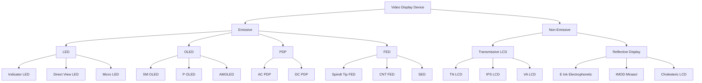
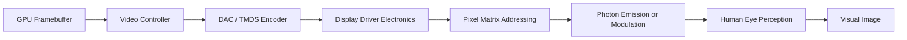
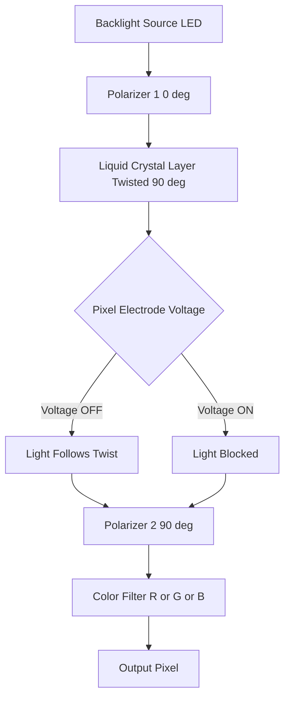
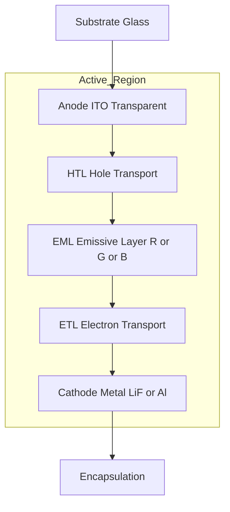
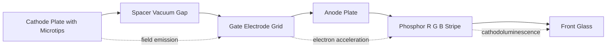

# Video Display devices - LED, OLED, LCD, PDP and FED and reflective displays.

<!-- SECTION_1_START -->

# Video Display Devices — LED, OLED, LCD, PDP, FED & Reflective Displays

## 1.1 Formal Academic Definition

A **Video Display Device** is an electronic output peripheral that converts a stream of digital/analog video signals into viewable, two-dimensional luminous images through a matrix of addressable picture elements (pixels). In the context of **Computer Graphics (KTU 2024 Scheme, Module 1)**, it forms the **primary visual sink** of the rendering pipeline — the physical device where rasterized pixel buffers (framebuffers) are finally presented to the human eye.

> [!IMPORTANT]
> **KTU Syllabus Definition (verbatim):** *Video display devices are hardware components that produce visually perceivable images by controlling the intensity and color of each pixel using electrical signals. They are classified based on the underlying emission technology — emissive (LED, OLED, PDP, FED) and non-emissive (LCD, reflective).*

## 1.2 Intuitive Real-World Analogy

Think of a **display device as a stadium full of light switches**:
- Each **pixel** = one tiny light switch held by a worker.
- The **GPU** = the conductor who tells every worker how bright their switch should be and for how long.
- The **frame rate (fps)** = how many times per second the conductor re-writes the entire instruction sheet.
- **Resolution** = the number of workers available (Full HD = 1920 × 1080 ≈ 2 million workers).

The *technology* (LED vs LCD vs OLED...) is simply **how the worker makes light**:
- **LED/PDP/FED worker** *generates* their own light (emissive).
- **LCD worker** is *directionally blind* and only twists a window shade, letting light from a backlight through (non-emissive/transmissive).
- **Reflective worker** *borrows* sunlight from outside and only opens or closes a window shade (reflective).

## 1.3 Why This Topic Matters in Computer Graphics

| Pipeline Stage | Role of Display |
|---|---|
| Modeling | None |
| Transformation & Viewing | None |
| Rasterization | Pixels are written into the **framebuffer** |
| **Display** | **Framebuffer is scanned out → visible on screen** |

Without an understanding of pixel addressing, **refresh rate**, **aspect ratio**, and **color depth**, the CG pipeline is incomplete. KTU 2024 places heavy emphasis on this in **CO1**: *"Understand the basics of computer graphics, display devices and graphics primitives."*

## 1.4 Classification Overview

> [!NOTE]
> **Two master classes of display devices**
> 1. **Emissive Displays** — The pixel *itself* emits light.
>    - LED (Light Emitting Diode)
>    - OLED (Organic Light Emitting Diode)
>    - PDP (Plasma Display Panel)
>    - FED (Field Emission Display)
> 2. **Non-Emissive Displays** — The pixel *modulates* an external light source.
>    - LCD (Liquid Crystal Display) — uses a **backlight**
>    - **Reflective Displays** — use **ambient light** (sun/room)

## 1.5 Standard Display Metrics (KTU High-Yield Constants)

| Metric | Symbol | Typical Value | Unit |
|---|---|---|---|
| Refresh Rate | $f_r$ | **60 Hz** (TV/monitor), **120 Hz** (gaming) | Hz |
| Horizontal Sync Frequency | $f_h$ | ~15.75 kHz (480i NTSC) | kHz |
| Aspect Ratio | $AR$ | 4:3, 16:9, 21:9 | ratio |
| Color Depth | $b$ | 8 bits/channel (**24-bit true color**) | bits |
| Total Colors | $N_c$ | $2^{3b} = 16{,}777{,}216$ | colors |
| Pixel Clock | $f_{pclk}$ | $f_h \times \text{pixels/line}$ | MHz |
| Luminance | $L$ | 250–1000 | $\text{cd/m}^2$ (nits) |
| Contrast Ratio | $CR$ | 1000:1 (LCD), $\infty$ (OLED) | ratio |
| Response Time | $t_r$ | 1 ms (OLED), 5 ms (LCD) | ms |
| Dot Pitch | $p$ | 0.25 mm | mm |

> [!VISUALIZATION CONTROL]
> **Concept:** Pixel Matrix Geometry — Resolution vs. Dot Pitch relationship
> **GeoGebra / Desmos Input Equations:**
> * `f(x) = 1920 * 0.25` → screen width in mm
> * `g(x) = 1080 * 0.25` → screen height in mm
> **Visual Description:** A rectangular grid of 1920 × 1080 cells, each cell 0.25 mm wide. Total diagonal ≈ 549 mm (≈ 21.6 inch). This shows how a 0.25 mm pitch directly fixes the physical size of a Full HD panel.

---

<!-- SECTION_1_END -->

<!-- SECTION_2_START -->

# Deep Theoretical Analysis — Working Principles

## 2.1 LED Display (Light Emitting Diode)

### Principle
A **LED** is a p–n junction semiconductor diode that emits **photons** when forward-biased, through the process of **electroluminescence** (electron–hole recombination at the junction). The emitted wavelength $\lambda$ depends on the **band gap energy** $E_g$ of the semiconductor:

$$\lambda = \frac{h \cdot c}{E_g}$$

where $h = 6.626 \times 10^{-34}$ J·s (Planck's constant) and $c = 3 \times 10^8$ m/s (speed of light).

### Two Architectural Forms
1. **LED Indicator / Edge-Lit Backlight** — A few LEDs illuminate an LCD layer.
2. **Direct-View LED Display** — Each pixel is a cluster of **R, G, B** micro-LEDs. Used in stadiums, billboards, and modern **Micro-LED TVs**.

### Key Characteristics
- **Lifespan:** $\approx$ 50,000–100,000 hours
- **Brightness:** Up to 4000+ nits (best in class)
- **Viewing angle:** ~$178°$
- **Power:** Voltage-driven; luminance $L \propto I_{\text{forward}}$ (linear with current)

> [!TIP]
> **Why are LED TVs actually LCD TVs?** Marketing coined "LED TV" for LCD panels with LED backlights. A *true* LED display has self-emissive LED pixels (no backlight).

## 2.2 OLED Display (Organic Light Emitting Diode)

### Principle
An OLED is a thin-film device with the sandwich structure:

$$\text{Anode (ITO)} \mid \text{HTL} \mid \text{EML} \mid \text{ETL} \mid \text{Cathode (Al/LiF)}$$

- **HTL** = Hole Transport Layer
- **ETL** = Electron Transport Layer
- **EML** = Emissive Layer (organic polymer or small molecule)

When current flows, holes and electrons recombine in the EML, forming **excitons** that relax by emitting photons. By doping the EML with different fluorescent/phosphorescent dyes, **R, G, B** emission is achieved.

### Two Variants
- **SM-OLED** (Small Molecule) — vacuum-deposited
- **P-OLED** (Polymer) — solution-processed (cheaper)

### Key Characteristics
- **True black** — pixels OFF = 0 nits → $CR = \infty$ (theoretical)
- **Lifespan:** Blue OLED ≈ 30,000 hrs (degrades fastest)
- **Flexible & rollable** panels possible (no backlight)
- **Burn-in** risk (static images leave permanent residue)

## 2.3 LCD (Liquid Crystal Display)

### Principle — Twisted Nematic (TN) Cell
A **liquid crystal** is a phase of matter between solid and liquid where rod-shaped molecules can be aligned by an electric field. In a TN-LCD:

1. Two polarizers are placed at **90°** to each other.
2. Liquid crystals in between are naturally **twisted by 90°**.
3. With **no voltage**, light follows the twist → passes through → pixel is **ON (bright)**.
4. With **voltage applied**, crystals align straight → light blocked → pixel is **OFF (dark)**.

The transmitted intensity is governed by the **Jones matrix optics** of the birefringent crystal; for the simplified case:

$$I_{\text{out}} = I_{\text{in}} \cdot \sin^2\!\left(\frac{\pi \cdot \Delta n \cdot d}{\lambda}\right)$$

where $\Delta n$ is the birefringence, $d$ is the cell thickness, and $\lambda$ is the wavelength.

### Active vs. Passive Matrix
- **Passive Matrix LCD (PMLCD):** Rows/columns driven directly; limited to $\approx$ 1000 lines.
- **Active Matrix LCD (AMLCD):** Each pixel has a thin-film transistor (**TFT**) + capacitor → holds charge between refresh cycles → supports **4K, 8K**.

### Key Characteristics
- **Non-emissive** — requires backlight (CCFL historically, LED now).
- **Viewing angle:** TN = 170°, IPS = 178°, VA = best contrast.
- **Color filters** (RGB sub-pixels) produce full color.

## 2.4 PDP — Plasma Display Panel

### Principle
Each pixel is a tiny cell filled with **noble gas** (Ne, Xe, or Ne-Xe mixture) sandwiched between two glass plates with **transparent electrodes** (anode + cathode). When a high-voltage AC pulse is applied:

1. Gas ionizes → **plasma** of electrons and ions.
2. Ions strike the **phosphor coating** (R, G, B).
3. Phosphor emits visible light via cathodoluminescence.

> [!NOTE]
> **Why is it called "plasma"?** The ionized gas is the **fourth state of matter** — a quasi-neutral ionized gas containing free electrons and ions. Each PDP cell is a microscopic fluorescent lamp.

### Key Characteristics
- **Self-emissive** (no backlight).
- **Excellent blacks** at full pixel-off state.
- **Screen size:** 40"–150"+ (large-format kings of 2000s).
- **Disadvantages:** Heavy, heat generation, phosphor burn-in, power-hungry, discontinued by LG in 2015.

## 2.5 FED — Field Emission Display

### Principle
A **FED** is essentially a flat-panel **CRT** — each pixel has millions of tiny **spindt-style microtips** (molybdenum cones, $\approx$ 1 µm tip radius) acting as cold cathodes. When a strong electric field ($\approx 10^9$ V/m) is applied between cathode tip and gate:

1. Electrons **tunnel** out of the tip (Fowler-Nordheim tunneling).
2. Electrons are accelerated toward the anode.
3. Anode is coated with **phosphor** (R, G, B stripes) → light emitted on impact.

The emission current density follows **Fowler-Nordheim equation**:

$$J = \frac{A \cdot E^2}{\phi} \cdot \exp\!\left(-\frac{B \cdot \phi^{3/2}}{E}\right)$$

where $E$ is the electric field, $\phi$ is the work function (eV), $A, B$ are constants.

### Key Characteristics
- **CRT-quality color** + thin flat profile.
- **Fast response** (µs level).
- **Low power** consumption.
- **Challenges:** Vacuum maintenance, tip uniformity, manufacturing cost — *still largely R&D*.

## 2.6 Reflective Displays

### Principle
A **reflective display** has **no backlight**. It works by **modulating ambient light** (sun, room lamps). Common implementations:
- **Electrophoretic (E-Ink)** — black & white particles in microcapsules moved by electric field (used in e-readers like Kindle).
- **MEMS (Interferometric Modulator — IMOD / Qualcomm Mirasol)** — tiny movable membranes create constructive/destruction interference of reflected light.
- **Cholesteric LCD (ChLCD)** — bistable reflective liquid crystal.

### Key Characteristics
- **Sunlight readable** — looks better in bright light.
- **Ultra-low power** — E-Ink uses power only during page change.
- **Bistability** — image persists without power.
- **Slow refresh** — unsuitable for video (typically 1–4 Hz).

## 2.7 KTU High-Yield Formula Sheet

| # | Concept | Formula | Units |
|---|---|---|---|
| 1 | LED emission wavelength | $\lambda = \dfrac{h c}{E_g}$ | m |
| 2 | Total displayable colors | $N_c = 2^{3b}$ | colors |
| 3 | Frame time | $T_f = \dfrac{1}{f_r}$ | s |
| 4 | Framebuffer size | $S_{fb} = W \times H \times b$ | bits |
| 5 | Refresh bandwidth | $BW = W \times H \times f_r \times b$ | bits/s |
| 6 | LCD transmittance (simplified) | $I_{\text{out}} = I_{\text{in}} \sin^2\!\left(\dfrac{\pi \Delta n d}{\lambda}\right)$ | — |
| 7 | Fowler–Nordheim emission (FED) | $J = \dfrac{A E^2}{\phi} \exp\!\left(-\dfrac{B \phi^{3/2}}{E}\right)$ | A/m² |
| 8 | Aspect ratio | $AR = \dfrac{W}{H}$ | ratio |
| 9 | Physical screen width | $W_{\text{phys}} = p \times W$ | mm |
| 10 | Luminance (Lambertian) | $L = \dfrac{I}{A \cdot \cos\theta}$ | cd/m² |

> [!IMPORTANT]
> **Exam Tip:** Questions on this topic frequently ask for framebuffer size and bandwidth calculations. Memorize equations 3, 4, and 5 — they appear in nearly every KTU Module 1 question paper.

## 2.8 Real-World Engineering Utility

- **Medical imaging:** OLED & FED used in surgical displays for true blacks and 1 ms response.
- **Aviation:** Reflective displays used in cockpit instruments (sunlight readable, low power).
- **Wearables / AR:** Micro-LED dominates (Apple Watch, future Vision Pro).
- **Public information:** Direct-view LED walls at airports, stadiums.
- **E-Readers:** Reflective E-Ink gives weeks of battery life.

---

<!-- SECTION_2_END -->

<!-- SECTION_3_START -->

# Step-by-Step Derivations & Worked Examples

## 3.1 Worked Example 1 — Framebuffer Size & Bandwidth

> **Problem (KTU-style):** A display has resolution $W = 1920$, $H = 1080$, color depth $b = 24$ bits, refresh rate $f_r = 60$ Hz. Calculate the framebuffer size and the required video bandwidth.

### Step 1: Framebuffer Size
$$S_{fb} = W \times H \times b$$
$$S_{fb} = 1920 \times 1080 \times 24 \text{ bits}$$
$$S_{fb} = 2{,}073{,}600 \times 24 = 49{,}766{,}400 \text{ bits}$$

### Step 2: Convert to megabytes
$$S_{fb} = \frac{49{,}766{,}400}{8 \times 1024 \times 1024} \approx 5.93 \text{ MB}$$

### Step 3: Bandwidth
$$BW = W \times H \times f_r \times b$$
$$BW = 1920 \times 1080 \times 60 \times 24 \text{ bits/s}$$
$$BW = 2{,}985{,}984{,}000 \text{ bits/s} \approx 2.986 \text{ Gbps} \approx 373.25 \text{ MB/s}$$

> **Valuation Tip:** Show unit conversion explicitly. KTU awards 1 mark for the final numerical value with correct units.

## 3.2 Worked Example 2 — Color Depth / Total Colors

> **Problem:** A display uses 10 bits per channel (HDR10). How many distinct colors can it represent?

$$N_c = 2^{3b} = 2^{3 \times 10} = 2^{30} = 1{,}073{,}741{,}824 \approx 1.07 \text{ billion colors}$$

## 3.3 Worked Example 3 — LED Emission Wavelength

> **Problem:** A GaAs LED has band gap $E_g = 1.43$ eV. Find the peak emission wavelength.

### Step 1: Convert eV to Joules
$$E_g = 1.43 \times 1.602 \times 10^{-19} = 2.291 \times 10^{-19} \text{ J}$$

### Step 2: Apply the formula
$$\lambda = \frac{h c}{E_g} = \frac{6.626 \times 10^{-34} \times 3 \times 10^8}{2.291 \times 10^{-19}}$$

$$\lambda = \frac{1.9878 \times 10^{-25}}{2.291 \times 10^{-19}} = 8.677 \times 10^{-7} \text{ m} \approx 867.7 \text{ nm}$$

This lies in the **near-infrared (NIR)** region — close to red visible light.

## 3.4 Worked Example 4 — Physical Screen Dimensions

> **Problem:** A monitor has $W = 2560$ pixels, $H = 1440$ pixels, and dot pitch $p = 0.233$ mm. Find the diagonal size in inches.

### Step 1: Width and Height in mm
$$W_{\text{phys}} = 0.233 \times 2560 = 596.48 \text{ mm}$$
$$H_{\text{phys}} = 0.233 \times 1440 = 335.52 \text{ mm}$$

### Step 2: Diagonal
$$D = \sqrt{W_{\text{phys}}^2 + H_{\text{phys}}^2} = \sqrt{596.48^2 + 335.52^2}$$
$$D = \sqrt{355{,}786.5 + 112{,}573.6} = \sqrt{468{,}360.1} \approx 684.4 \text{ mm}$$

### Step 3: Convert to inches
$$D_{\text{inch}} = \frac{684.4}{25.4} \approx 26.95 \text{ in} \approx 27 \text{ inch monitor}$$

## 3.5 Worked Example 5 — Pixel Clock Calculation

> **Problem:** A 1080p display runs at 60 Hz with a horizontal blanking of 280 pixels and vertical blanking of 45 lines. Compute the pixel clock.

### Step 1: Total pixels per line
$$N_h = W + \text{H. blanking} = 1920 + 280 = 2200$$

### Step 2: Total lines per frame
$$N_v = H + \text{V. blanking} = 1080 + 45 = 1125$$

### Step 3: Total pixels per frame
$$N_{\text{total}} = N_h \times N_v = 2200 \times 1125 = 2{,}475{,}000$$

### Step 4: Pixel clock
$$f_{pclk} = N_{\text{total}} \times f_r = 2{,}475{,}000 \times 60 = 148.5 \text{ MHz}$$

This matches the official HDMI 1080p@60 timing.

## 3.6 Symbolic Python Implementation — Refresh & Bandwidth Calculator

```python
"""
KTU Module 1 - Display Calculator
Computes framebuffer size, bandwidth, and physical screen dimensions.
"""

from dataclasses import dataclass
from typing import Tuple
import logging

# Configure logging for error reporting
logging.basicConfig(
    level=logging.INFO,
    format="%(asctime)s | %(levelname)s | %(message)s"
)
logger = logging.getLogger(__name__)

# --- Physical constant ---
INCH_TO_MM: float = 25.4


@dataclass(frozen=True)
class DisplaySpec:
    width_px: int           # Horizontal resolution in pixels
    height_px: int          # Vertical resolution in pixels
    color_depth_bit: int    # Bits per pixel (e.g. 24 for True Color)
    refresh_hz: float       # Refresh rate in Hz
    dot_pitch_mm: float     # Dot pitch in millimetres


def framebuffer_size_bytes(spec: DisplaySpec) -> int:
    """Compute the framebuffer size in bytes with strict validation."""
    if spec.width_px <= 0 or spec.height_px <= 0:
        logger.error("Resolution components must be positive integers.")
        raise ValueError("Invalid resolution: must be > 0.")
    if spec.color_depth_bit <= 0 or spec.color_depth_bit % 8 != 0:
        logger.error("Color depth must be a positive multiple of 8 bits.")
        raise ValueError("Invalid color depth.")
    bits = spec.width_px * spec.height_px * spec.color_depth_bit
    return bits // 8


def bandwidth_bps(spec: DisplaySpec) -> float:
    """Compute video bandwidth in bits-per-second."""
    if spec.refresh_hz <= 0:
        logger.error("Refresh rate must be > 0 Hz.")
        raise ValueError("Invalid refresh rate.")
    return spec.width_px * spec.height_px * spec.refresh_hz * spec.color_depth_bit


def physical_diagonal_inch(spec: DisplaySpec) -> float:
    """Return the physical diagonal of the screen in inches."""
    if spec.dot_pitch_mm <= 0:
        logger.error("Dot pitch must be > 0 mm.")
        raise ValueError("Invalid dot pitch.")
    width_mm = spec.dot_pitch_mm * spec.width_px
    height_mm = spec.dot_pitch_mm * spec.height_px
    diagonal_mm = (width_mm ** 2 + height_mm ** 2) ** 0.5
    return diagonal_mm / INCH_TO_MM


def total_colors(spec: DisplaySpec) -> int:
    """Return the total distinct colors displayable."""
    if spec.color_depth_bit <= 0:
        logger.error("Color depth must be > 0.")
        raise ValueError("Invalid color depth.")
    return 2 ** (3 * spec.color_depth_bit)


# ----------------- Demonstration -----------------
if __name__ == "__main__":
    full_hd = DisplaySpec(
        width_px=1920,
        height_px=1080,
        color_depth_bit=24,
        refresh_hz=60.0,
        dot_pitch_mm=0.25
    )

    logger.info("Full HD 1080p display metrics:")
    logger.info("Framebuffer size: %.2f MB", framebuffer_size_bytes(full_hd) / (1024 ** 2))
    logger.info("Bandwidth:        %.3f Gbps", bandwidth_bps(full_hd) / 1e9)
    logger.info("Diagonal:         %.2f inches", physical_diagonal_inch(full_hd))
    logger.info("Colors:           %d", total_colors(full_hd))
```

**Expected Output:**
```
Full HD 1080p display metrics:
Framebuffer size: 5.93 MB
Bandwidth:        2.986 Gbps
Diagonal:         21.61 inches
Colors:           16777216
```

## 3.7 Step-by-Step — Choosing the Right Display Technology

> **Design Decision Matrix (KTU Application Question):**

| Requirement | Best Technology | Justification |
|---|---|---|
| Outdoor billboard, sunlight, huge size | Direct-View **LED** | High nits, modular, sunlight-viewable |
| Smartphone with deep blacks | **OLED** | Per-pixel OFF state, $\infty$ contrast |
| E-Reader (Kindle) | **Reflective E-Ink** | Bistable, ultra-low power |
| Large TV in 2005, 60"+ | **PDP** | Self-emissive, big sizes (historical) |
| Bright office monitor, low cost | **LCD (IPS)** | Cheap, accurate color, good viewing angle |
| Future AR/MR headsets | **Micro-LED / OLED** | High PPI, low power, small form factor |
| Aircraft cockpit instrument | **Reflective / FED** | Sunlight readable, high contrast |

---

<!-- SECTION_3_END -->

<!-- SECTION_4_START -->

# Structural Diagrams & Schematics

## 4.1 Functional Architecture — Display Device Classification



## 4.2 Sequential Flow — Generic Video Display Pipeline



## 4.3 Block Diagram — TN-LCD Cell Operation



## 4.4 Block Diagram — OLED Layer Stack



## 4.5 Block Diagram — FED Cross-Section



## 4.6 Comparative Matrix — Display Technologies

| Technology | Class | Backlight | Luminance (nits) | Contrast | Response | Power | Lifespan | Notes |
|---|---|---|---|---|---|---|---|---|
| **LED** | Emissive | No (self) | 500–4000+ | High | ns | Medium | 100 kh | Stadiums |
| **OLED** | Emissive | No (self) | 500–1000 | Infinite | < 1 ms | Low | 30–100 kh | Burn-in risk |
| **LCD (IPS)** | Non-emissive | Yes (LED) | 250–600 | 1000:1 | 5 ms | Medium | 60 kh | Cheap |
| **PDP** | Emissive | No (plasma) | 50–100 | 30000:1 | µs | High | 60 kh | Discontinued |
| **FED** | Emissive | No (field) | 300–600 | High | µs | Low | R&D | Flat CRT |
| **Reflective E-Ink** | Non-emissive | Ambient | Sunlight | 10:1 | 100 ms | Ultra-low | Million pages | E-Readers |

---

<!-- SECTION_4_END -->

<!-- SECTION_5_START -->

# KTU 2024 Scheme Examination Question Bank

## PART A — Short Answer Questions (3 Marks Each)

### Question A1 [KTU University Exam — July 2024]
**Q: List and briefly explain the two main classes of video display devices.**

**Model Answer (3 marks):**
Video display devices are classified into two main classes based on how light is produced at the pixel level.

1. **Emissive Displays (2 marks):** The pixel itself produces light. Examples: LED, OLED, PDP, FED. Each pixel contains a light-generating element such as a semiconductor junction, plasma, or field emitter.
2. **Non-Emissive Displays (1 mark):** The pixel does not produce light but modulates an external light source. Examples: LCD (uses a backlight) and Reflective displays (use ambient light).

> **Valuation Key:** [Class 1 naming + example: 1 mark], [Class 2 naming + example: 1 mark], [Distinction explained: 1 mark].

---

### Question A2 [KTU University Exam — Dec 2023]
**Q: What is a Field Emission Display (FED)? Mention any two advantages.**

**Model Answer (3 marks):**
A **Field Emission Display (FED)** is an emissive flat-panel display in which each pixel contains an array of microscopic cold-cathode microtips (e.g., molybdenum Spindt tips). When a strong electric field ($\approx 10^9$ V/m) is applied, electrons are emitted by **Fowler-Nordheim quantum tunneling**, accelerated across a vacuum gap, and strike a phosphor-coated anode to produce light via cathodoluminescence.

**Advantages (any two):**
1. **CRT-quality color and contrast** with a thin flat-panel form factor.
2. **Fast response time** (microsecond range) — suitable for video.
3. **Low power consumption** compared to PDP and CRT.
4. **Wide viewing angle** and good luminance uniformity.

> **Valuation Key:** [Definition with emission mechanism: 2 marks], [Any two valid advantages: 1 mark].

---

## PART B — Long Answer Questions (14 Marks Each)

> **Internal Choice Pattern:** KTU allows students to answer **either** Question A **or** Question B.

### Question B-A (14 Marks) [KTU University Exam — July 2024]

**Q: Explain in detail the working principle, construction, advantages and disadvantages of OLED displays. Compare OLED with LCD technology.**

#### Part (a) — 7 Marks: Working Principle & Construction

**Working Principle (4 marks):**
An OLED (Organic Light Emitting Diode) is a thin-film electroluminescent device in which an organic compound emits light in response to an electric current.

**Construction (3 marks):** The OLED is a multi-layer sandwich:

1. **Substrate** — Glass or flexible plastic.
2. **Anode** — Transparent Indium Tin Oxide (ITO).
3. **Hole Transport Layer (HTL)** — Injects and transports holes (e.g., NPB).
4. **Emissive Layer (EML)** — Organic dye/polymer (Alq3 for green, DCJTB for red, FIrpic for blue).
5. **Electron Transport Layer (ETL)** — Transports electrons (e.g., Alq3, TPBi).
6. **Cathode** — Low work-function metal (Al, Mg:Ag, or Ca/Al).

**Working steps:**
1. Forward bias applied → holes injected from anode, electrons from cathode.
2. Holes and electrons migrate toward the **emissive layer**.
3. They recombine to form **excitons** (bound electron-hole pairs).
4. Excitons relax radiatively, releasing energy as **photons**.
5. Color of light depends on the **band gap of the organic dye**.

#### Part (b) — 7 Marks: OLED vs LCD Comparison + Advantages/Disadvantages

| Parameter | **OLED** | **LCD** |
|---|---|---|
| Backlight | **No** (self-emissive) | **Yes** (CCFL/LED) |
| Contrast Ratio | Theoretically **infinite** | Typically 1000:1–3000:1 |
| Black Level | True black (pixel off) | Grayish (backlight leakage) |
| Response Time | < 1 ms | 2–10 ms |
| Viewing Angle | ~$178°$ | $160°$–$178°$ (IPS best) |
| Thickness | Ultra-thin, flexible | Thicker (backlight) |
| Power | Lower (dark pixels off) | Constant (backlight always on) |
| Lifespan | Blue degrades fast | 60 kh typical |
| Burn-in | Yes | No |
| Cost | High | Low |

**Advantages of OLED:** Self-emissive, true blacks, ultra-thin, flexible panels, fast response, wide viewing angle.

**Disadvantages of OLED:** Blue OLED short lifespan, burn-in risk, water sensitivity, expensive manufacturing, lower peak brightness than LED.

> **Valuation Key:** [Working principle with exciton mechanism: 3 marks], [Construction layer diagram/description: 1 mark], [Comparison table covering 6+ parameters: 3 marks], [At least 2 advantages + 2 disadvantages: 2 marks].

> [!WARNING]
> **KTU Examiner's Pitfall Alert:**
> 1. Students often confuse OLED with LED. *LED* uses **inorganic** semiconductors; *OLED* uses **organic** compounds. (–1 mark)
> 2. Do not claim OLED has a backlight. (–1 mark)
> 3. Avoid writing only "OLED is better than LCD" without a proper **tabular comparison**. (–1 mark)

---

### Question B-B (14 Marks) [KTU University Exam — Dec 2023]

**Q: Describe the construction and working of a Plasma Display Panel (PDP). Discuss its advantages, disadvantages and compare it with LED display.**

#### Part (a) — 7 Marks: PDP Construction & Working

**Construction (3 marks):**
A PDP consists of two parallel glass plates separated by a **vacuum-sealed gap of ~100 µm** filled with a low-pressure mixture of **noble gases** (typically Neon + Xenon or Helium + Xenon).

- **Front plate** — Transparent Indium Tin Oxide (ITO) electrodes in horizontal rows, covered with a dielectric layer and **MgO protective coating**.
- **Rear plate** — Address electrodes in vertical columns, with **barrier ribs** defining sub-pixel cells, and **R, G, B phosphor stripes** (red: Y₂O₃:Eu, green: Zn₂SiO₄:Mn, blue: BaMgAl₁₀O₁₇:Eu).
- Each sub-pixel is a microscopic **gas discharge cell**.

**Working (4 marks):**
1. A high-voltage **AC pulse** ($\approx$ 200 V) is applied between the row and column electrodes at the intersection of a cell.
2. The **noble gas ionizes** → forms **plasma** (free electrons and ions).
3. **UV photons** are emitted by the excited Xenon atoms (147 nm and 173 nm).
4. UV photons strike the **phosphor stripes** of the corresponding color.
5. Phosphor atoms absorb UV and re-emit **visible light** via cathodoluminescence.
6. By varying the **number of sustain pulses per frame**, the brightness of each sub-pixel is controlled (**Pulse Width Modulation**).
7. The full-color image is formed by spatially combining the R, G, B sub-pixels.

#### Part (b) — 7 Marks: Advantages, Disadvantages & LED Comparison

**Advantages of PDP:**
1. Self-emissive → excellent contrast and color saturation.
2. Wide viewing angle ($> 160°$).
3. Very fast response (µs) → excellent for motion.
4. Large screen sizes possible (up to 150"+ historically).
5. Uniform brightness across the screen (no backlight hotspots).

**Disadvantages of PDP:**
1. High power consumption (plasma cells are always somewhat active).
2. Generates significant heat → requires cooling.
3. Phosphor **burn-in** risk for static images.
4. Heavy and thick (vacuum glass sandwich).
5. Lower peak brightness than LED in bright environments.
6. **Discontinued** by major manufacturers (LG 2015) due to LCD/LED dominance.

**PDP vs LED Comparison:**

| Parameter | **PDP** | **LED (Direct-View)** |
|---|---|---|
| Light Generation | Plasma gas discharge | Electroluminescent semiconductor |
| Backlight | No | No |
| Peak Brightness | 50–100 nits | 1000–4000+ nits |
| Power Consumption | High | Low to Medium |
| Lifespan | ~60,000 hrs | ~100,000 hrs |
| Heat Output | High | Low |
| Screen Size | Large (40"–150"+) | Scalable (modular) |
| Outdoor Use | Poor | Excellent |
| Current Status | Discontinued | Dominant (incl. Micro-LED) |

> **Valuation Key:** [Construction with all layers mentioned: 3 marks], [Working steps including UV generation and phosphor excitation: 4 marks], [At least 3 advantages + 3 disadvantages: 3 marks], [Comparison table: 2 marks], [Current relevance: 1 mark].

> [!WARNING]
> **KTU Examiner's Pitfall Alert:**
> 1. Writing "PDP uses liquid crystals" is a **fatal error** — that is LCD. (–2 marks)
> 2. Forgetting the **UV-phosphor step** in the working — the gas does not emit visible light directly; the **phosphor does**. (–2 marks)
> 3. Failing to mention the **noble gas mixture** (Ne/Xe) — examiner deducts 1 mark for incomplete construction.

---

## Topic Recap & Important Things to Remember

> [!IMPORTANT]
> **Rapid Revision Checklist — Display Devices (Module 1)**

- **Two master classes:** Emissive (LED, OLED, PDP, FED) vs Non-Emissive (LCD, Reflective).
- **LED:** Inorganic p-n junction; $\lambda = \dfrac{hc}{E_g}$; used in direct-view and backlights.
- **OLED:** Organic emissive layers; sandwich of HTL / EML / ETL; per-pixel OFF → true black.
- **LCD (TN):** Twisted nematic liquid crystal between crossed polarizers; TFT for active matrix.
- **PDP:** Ionized noble gas (Ne-Xe) emits **UV**, which excites **phosphor** to emit visible light.
- **FED:** Cold-cathode microtips emit electrons via **Fowler-Nordheim tunneling**; flat-panel CRT equivalent.
- **Reflective:** E-Ink, IMOD, ChLCD; **no backlight**; ambient light modulated; bistable; ultra-low power.
- **Key formulas:** $N_c = 2^{3b}$, $S_{fb} = W \cdot H \cdot b$, $BW = W \cdot H \cdot f_r \cdot b$, $T_f = 1/f_r$.
- **Fowler-Nordheim emission:** $J = \dfrac{A E^2}{\phi} \exp\!\left(-\dfrac{B \phi^{3/2}}{E}\right)$ — memorize for FED derivations.
- **True LED vs marketing LED:** "LED TV" is actually LCD with LED backlight. **True LED** displays are direct-view with self-emissive LED pixels.
- **OLED advantage over LCD:** Self-emissive → no backlight → true blacks → $CR \to \infty$.
- **Discontinued tech:** PDP (LG stopped production 2015); SED (Canon 2010). FED remains largely R&D.
- **Always use SI units and unit conversions** in bandwidth, framebuffer, and wavelength problems.
- **Remember the "How light is made" rule:**
  - LED → electron-hole recombination in semiconductor.
  - OLED → exciton recombination in organic layer.
  - PDP → UV from plasma → phosphor emission.
  - FED → electron bombardment of phosphor (CRT-like).
  - LCD → backlight + crystal twist modulation.
  - Reflective → ambient light + particle/membrane modulation.

---

<!-- SECTION_5_END -->
