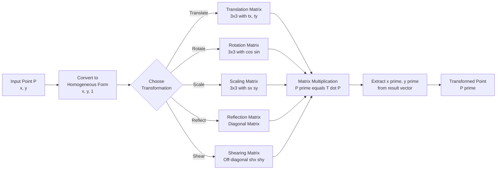
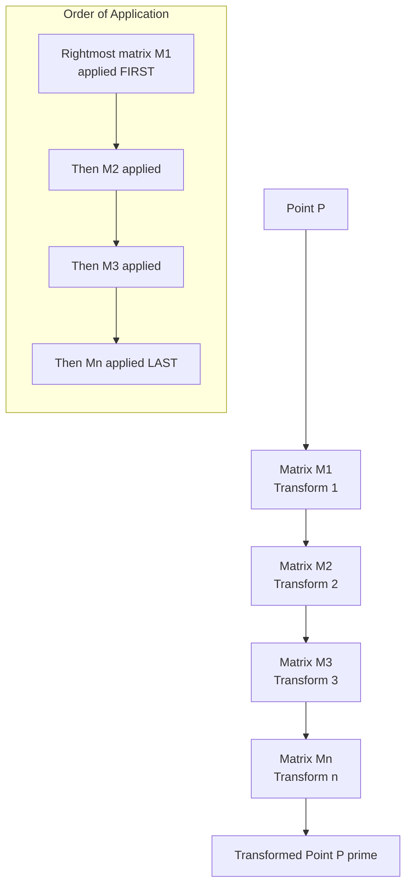
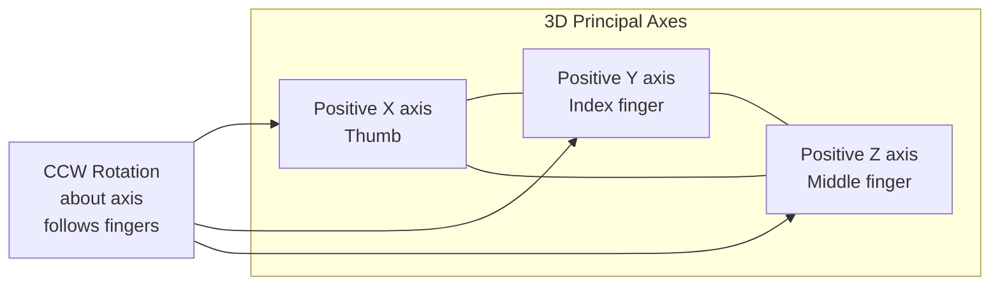
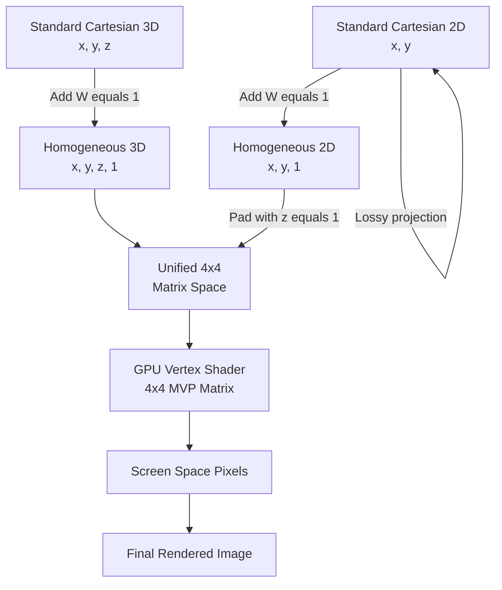
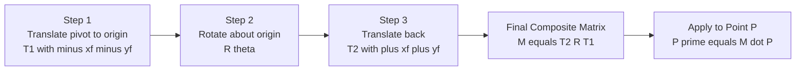

# Geometric transformations - 2D and 3D basic transformations - Translation, Rotation, Scaling, Reflection and Shearing, Matrix representations and homogeneous coordinates.

<!-- SECTION_1_START -->

# Geometric Transformations: The Geometry Engine of Computer Graphics

## Formal KTU Syllabus Definition

> [!IMPORTANT]
> **Geometric Transformation** is a mathematical operation that maps every point $\mathbf{P}(x, y)$ in a coordinate space to a new point $\mathbf{P'}(x', y')$ according to a defined rule. In the KTU 2024 Scheme (Module 2), this encompasses **2D and 3D basic transformations** — Translation, Rotation, Scaling, Reflection, and Shearing — using **matrix representations** and **homogeneous coordinates** as the unified algebraic framework.

In computer graphics, transformations are not just abstract math — they are the **backbone of every rendering pipeline**. From rotating a 3D character in a video game to zooming a map in Google Maps, from reflecting an image in a photo editor to shearing text for italic styling, transformations are everywhere. The unified language used to describe all of them is **Linear Algebra + Matrix Multiplication**.

## Conceptual Analogy: A 3D Printer's Coordinate System

Imagine a **3D printer** that prints a small toy figure.

| Transformation | Real-World Analogy |
|---|---|
| **Translation** | Sliding the print bed left/right without rotating |
| **Rotation** | Twisting the print head around the model's center |
| **Scaling** | Enlarging the figure from a small prototype to a full-size statue |
| **Reflection** | Creating a mirror-image of the model (left hand → right hand) |
| **Shearing** | Tilting the model so vertical lines become slanted (italic effect) |

> [!NOTE]
> **Key Insight:** Just as a printer uses three independent motors (X, Y, Z) controlled by **homogeneous coordinates**, every transformation in computer graphics is also expressed using a **single unified 4×4 (3D) or 3×3 (2D) matrix** thanks to the homogeneous coordinate trick.

## Why Homogeneous Coordinates?

In standard Cartesian coordinates, **translation cannot be expressed as a matrix multiplication** (it requires vector addition). Pierre- Désiré **Chasles** and later **Ferdinand Möbius** introduced homogeneous coordinates (also called projective coordinates) to solve this elegant problem:

A 2D point $(x, y)$ is represented as $(x, y, 1)$ and a 3D point $(x, y, z)$ as $(x, y, z, 1)$. This extra coordinate (the **W-component**) allows **affine transformations** (translation + linear) to be unified under a **single matrix multiplication** operation.

> [!NOTE]
> **W = 1** is the default. **W = 0** represents a **vector (direction)** — useful for representing rotations and scaling without translation side-effects.

> [!VISUALIZATION CONTROL]
> **Concept:** Identity Transformation — a point P(3, 4) and its image P'(3, 4)
> **GeoGebra / Desmos Input Equations:**
> * Point P: `(3, 4)` with label "P"
> * Point P': `(3, 4)` with label "P' (after Identity)"
> * Line segment: `Line((3,4), (3,4))` (degenerate)
> **Visual Description:** A single point on the XY plane — identity transformation leaves the point unchanged. This serves as the baseline for comparing all other transformations.

<!-- SECTION_1_END -->

<!-- SECTION_2_START -->

# Deep Theoretical Analysis: The Algebra of Motion

## 2D Basic Transformations (Homogeneous 3×3 Matrix Form)

For a 2D point $\mathbf{P} = (x, y, 1)^T$ in homogeneous form, every basic affine transformation can be written as:

$$\begin{aligned} \mathbf{P'} &= \mathbf{T} \cdot \mathbf{P} \end{aligned}$$

where $\mathbf{T}$ is a **3×3 homogeneous transformation matrix**.

### 1. 2D Translation

Moves a point by offsets $t_x, t_y$ along the X and Y axes respectively.

$$\begin{aligned} \mathbf{T}_{translate} &= \begin{bmatrix} 1 & 0 & t_x \\ 0 & 1 & t_y \\ 0 & 0 & 1 \end{bmatrix} \end{aligned}$$

Applied to point $(x, y)$:

$$\begin{aligned} x' &= x + t_x \\ y' &= y + t_y \end{aligned}$$

### 2. 2D Rotation

Rotates a point by angle $\theta$ about the origin (counter-clockwise positive).

$$\begin{aligned} \mathbf{R}(\theta) &= \begin{bmatrix} \cos\theta & -\sin\theta & 0 \\ \sin\theta & \cos\theta & 0 \\ 0 & 0 & 1 \end{bmatrix} \end{aligned}$$

> [!IMPORTANT]
> **Sign Convention (KTU Standard):** Counter-Clockwise (CCW) rotation is **positive**. The derivation uses the angle-preserving property of rotation. For clockwise rotation, use $\theta \rightarrow -\theta$, replacing $\sin\theta$ with $-\sin\theta$.

Applied to point:

$$\begin{aligned} x' &= x\cos\theta - y\sin\theta \\ y' &= x\sin\theta + y\cos\theta \end{aligned}$$

### 3. 2D Scaling

Scales a point by factors $s_x, s_y$ relative to the origin.

$$\begin{aligned} \mathbf{S} &= \begin{bmatrix} s_x & 0 & 0 \\ 0 & s_y & 0 \\ 0 & 0 & 1 \end{bmatrix} \end{aligned}$$

Applied to point:

$$\begin{aligned} x' &= x \cdot s_x \\ y' &= y \cdot s_y \end{aligned}$$

> [!WARNING]
> **Examiner Trap:** If $s_x = s_y = 1$, the matrix becomes the **Identity** — a common board question asks to identify the condition under which scaling becomes identity.

### 4. 2D Reflection

Reflects a point about a principal axis (X-axis, Y-axis, or line $y = x$).

$$\begin{aligned} \mathbf{Ref}_X &= \begin{bmatrix} 1 & 0 & 0 \\ 0 & -1 & 0 \\ 0 & 0 & 1 \end{bmatrix} \quad (\text{about X-axis}) \end{aligned}$$

$$\begin{aligned} \mathbf{Ref}_Y &= \begin{bmatrix} -1 & 0 & 0 \\ 0 & 1 & 0 \\ 0 & 0 & 1 \end{bmatrix} \quad (\text{about Y-axis}) \end{aligned}$$

$$\begin{aligned} \mathbf{Ref}_{y=x} &= \begin{bmatrix} 0 & 1 & 0 \\ 1 & 0 & 0 \\ 0 & 0 & 1 \end{bmatrix} \quad (\text{about line } y = x) \end{aligned}$$

### 5. 2D Shearing

Distorts the shape such that one coordinate is shifted by a fraction of the other. Two common forms:

**X-Shear** (horizontal shift proportional to y):

$$\begin{aligned} \mathbf{Sh}_x &= \begin{bmatrix} 1 & sh_x & 0 \\ 0 & 1 & 0 \\ 0 & 0 & 1 \end{bmatrix} \end{aligned}$$

$$\begin{aligned} x' &= x + sh_x \cdot y \\ y' &= y \end{aligned}$$

**Y-Shear** (vertical shift proportional to x):

$$\begin{aligned} \mathbf{Sh}_y &= \begin{bmatrix} 1 & 0 & 0 \\ sh_y & 1 & 0 \\ 0 & 0 & 1 \end{bmatrix} \end{aligned}$$

$$\begin{aligned} x' &= x \\ y' &= sh_y \cdot x + y \end{aligned}$$

## 3D Basic Transformations (Homogeneous 4×4 Matrix Form)

For a 3D point $\mathbf{P} = (x, y, z, 1)^T$:

### 3D Translation

$$\begin{aligned} \mathbf{T}_{3D} &= \begin{bmatrix} 1 & 0 & 0 & t_x \\ 0 & 1 & 0 & t_y \\ 0 & 0 & 1 & t_z \\ 0 & 0 & 0 & 1 \end{bmatrix} \end{aligned}$$

### 3D Scaling

$$\begin{aligned} \mathbf{S}_{3D} &= \begin{bmatrix} s_x & 0 & 0 & 0 \\ 0 & s_y & 0 & 0 \\ 0 & 0 & s_z & 0 \\ 0 & 0 & 0 & 1 \end{bmatrix} \end{aligned}$$

### 3D Rotation Matrices (Around Principal Axes)

**Around X-axis (by angle $\theta$):**

$$\begin{aligned} \mathbf{R}_X(\theta) &= \begin{bmatrix} 1 & 0 & 0 & 0 \\ 0 & \cos\theta & -\sin\theta & 0 \\ 0 & \sin\theta & \cos\theta & 0 \\ 0 & 0 & 0 & 1 \end{bmatrix} \end{aligned}$$

**Around Y-axis (by angle $\theta$):**

$$\begin{aligned} \mathbf{R}_Y(\theta) &= \begin{bmatrix} \cos\theta & 0 & \sin\theta & 0 \\ 0 & 1 & 0 & 0 \\ -\sin\theta & 0 & \cos\theta & 0 \\ 0 & 0 & 0 & 1 \end{bmatrix} \end{aligned}$$

**Around Z-axis (by angle $\theta$):**

$$\begin{aligned} \mathbf{R}_Z(\theta) &= \begin{bmatrix} \cos\theta & -\sin\theta & 0 & 0 \\ \sin\theta & \cos\theta & 0 & 0 \\ 0 & 0 & 1 & 0 \\ 0 & 0 & 0 & 1 \end{bmatrix} \end{aligned}$$

> [!NOTE]
> **Y-axis rotation appears to have reversed signs** for $\sin\theta$ because of right-hand rule conventions. KTU exam-takers should **memorize the Y-axis form exactly** — this is a frequent source of mark loss.

## Composition of Transformations

Multiple transformations can be **concatenated** into a single composite matrix. The order is critical — **matrix multiplication is non-commutative**.

$$\begin{aligned} \mathbf{P'} &= \mathbf{T}_n \cdot \mathbf{T}_{n-1} \cdots \mathbf{T}_2 \cdot \mathbf{T}_1 \cdot \mathbf{P} \end{aligned}$$

> [!IMPORTANT]
> **Reading Convention:** The rightmost matrix is applied **first** to the point. For example, in $\mathbf{T} \cdot \mathbf{R} \cdot \mathbf{P}$, the point is first rotated, then translated.

## KTU High-Yield Formula Sheet

| Transformation | 2D Matrix (3×3) | 3D Matrix (4×4) | Effect on $(x, y)$ or $(x, y, z)$ |
|---|---|---|---|
| **Translation** | $[[1,0,t_x],[0,1,t_y],[0,0,1]]$ | $[[1,0,0,t_x],[0,1,0,t_y],[0,0,1,t_z],[0,0,0,1]]$ | $x' = x + t_x$, $y' = y + t_y$ |
| **Rotation (2D / Z-axis)** | $[[c,-s,0],[s,c,0],[0,0,1]]$ | $[[c,-s,0,0],[s,c,0,0],[0,0,1,0],[0,0,0,1]]$ | $x' = xc - ys$, $y' = xs + yc$ |
| **Rotation (X-axis)** | N/A | $[[1,0,0,0],[0,c,-s,0],[0,s,c,0],[0,0,0,1]]$ | $y' = yc - zs$, $z' = ys + zc$ |
| **Rotation (Y-axis)** | N/A | $[[c,0,s,0],[0,1,0,0],[-s,0,c,0],[0,0,0,1]]$ | $x' = xc + zs$, $z' = -xs + zc$ |
| **Scaling** | $[[s_x,0,0],[0,s_y,0],[0,0,1]]$ | $[[s_x,0,0,0],[0,s_y,0,0],[0,0,s_z,0],[0,0,0,1]]$ | $x' = x \cdot s_x$, etc. |
| **Reflection (X-axis)** | $[[1,0,0],[0,-1,0],[0,0,1]]$ | $[[1,0,0,0],[0,-1,0,0],[0,0,1,0],[0,0,0,1]]$ | $y' = -y$ |
| **Reflection (Y-axis)** | $[[-1,0,0],[0,1,0],[0,0,1]]$ | $[[-1,0,0,0],[0,1,0,0],[0,0,1,0],[0,0,0,1]]$ | $x' = -x$ |
| **X-Shear** | $[[1,sh_x,0],[0,1,0],[0,0,1]]$ | $[[1,0,sh_{xy},0],[0,1,sh_{xz},0],[0,0,1,0],[0,0,0,1]]$ | $x' = x + sh_x \cdot y$ |
| **Y-Shear** | $[[1,0,0],[sh_y,1,0],[0,0,1]]$ | $[[1,sh_{yx},0,0],[0,1,0,0],[sh_{zy},0,1,0],[0,0,0,1]]$ | $y' = y + sh_y \cdot x$ |

Where $c = \cos\theta$ and $s = \sin\theta$.

## Real-World Engineering Utility

> [!NOTE]
> * **OpenGL / DirectX / Vulkan:** All GPU vertex shaders use 4×4 transformation matrices to project 3D world coordinates to 2D screen pixels.
> * **CAD Software (AutoCAD, SolidWorks):** Rotate, scale, and translate models in real-time using matrix math.
> * **Robotics & Computer Vision:** Robot arm movements are computed using homogeneous transformation matrices (Denavit-Hartenberg parameters).
> * **Animation & VFX:** Skeletal animation in Pixar/Disney films uses composite transformation matrices per joint.
> * **AR/VR (Augmented/Virtual Reality):** SLAM systems track camera pose using continuous 4×4 transformation matrices.
> * **Medical Imaging:** MRI/CT scan reconstruction applies 3D rotations and shears to volume data.

<!-- SECTION_2_END -->

<!-- SECTION_3_START -->

# Step-by-Step Derivations & Python Implementation

## Derivation 1: 2D Rotation Matrix

> [!NOTE]
> **Objective:** Derive the 2D rotation matrix from first principles using the geometry of a right triangle.

**Setup:** Consider a point $\mathbf{P} = (x, y)$ at distance $r$ from origin, making angle $\phi$ with the positive X-axis.

$$\begin{aligned} x &= r \cos\phi \\ y &= r \sin\phi \end{aligned}$$

**After rotation** by angle $\theta$ (CCW), the new angle is $\phi + \theta$. Let $\mathbf{P'} = (x', y')$.

$$\begin{aligned} x' &= r \cos(\phi + \theta) \\ y' &= r \sin(\phi + \theta) \end{aligned}$$

**Apply the angle-addition identities:**

$$\begin{aligned} \cos(\phi + \theta) &= \cos\phi \cos\theta - \sin\phi \sin\theta \\ \sin(\phi + \theta) &= \sin\phi \cos\theta + \cos\phi \sin\theta \end{aligned}$$

**Substitute back:**

$$\begin{aligned} x' &= r(\cos\phi \cos\theta - \sin\phi \sin\theta) \\ y' &= r(\sin\phi \cos\theta + \cos\phi \sin\theta) \end{aligned}$$

**Replace $r\cos\phi = x$ and $r\sin\phi = y$:**

$$\begin{aligned} x' &= x \cos\theta - y \sin\theta \\ y' &= x \sin\theta + y \cos\theta \end{aligned}$$

**Convert to matrix form:**

$$\begin{aligned} \begin{bmatrix} x' \\ y' \\ 1 \end{bmatrix} &= \begin{bmatrix} \cos\theta & -\sin\theta & 0 \\ \sin\theta & \cos\theta & 0 \\ 0 & 0 & 1 \end{bmatrix} \begin{bmatrix} x \\ y \\ 1 \end{bmatrix} \end{aligned}$$

> [!IMPORTANT]
> **Verification for $\theta = 0$:** The matrix becomes the identity (since $\cos 0 = 1, \sin 0 = 0$), correctly leaving the point unchanged.

## Derivation 2: General Fixed-Point Rotation

> [!NOTE]
> **Objective:** Rotate a point $\mathbf{P}$ about an arbitrary pivot $(x_f, y_f)$ by angle $\theta$ — a common KTU problem.

**Step 1 — Translate the pivot to the origin:**

$$\begin{aligned} \mathbf{T}_1 &= \begin{bmatrix} 1 & 0 & -x_f \\ 0 & 1 & -y_f \\ 0 & 0 & 1 \end{bmatrix} \end{aligned}$$

**Step 2 — Apply rotation about origin:**

$$\begin{aligned} \mathbf{R}(\theta) &= \begin{bmatrix} \cos\theta & -\sin\theta & 0 \\ \sin\theta & \cos\theta & 0 \\ 0 & 0 & 1 \end{bmatrix} \end{aligned}$$

**Step 3 — Translate back to original position:**

$$\begin{aligned} \mathbf{T}_2 &= \begin{bmatrix} 1 & 0 & x_f \\ 0 & 1 & y_f \\ 0 & 0 & 1 \end{bmatrix} \end{aligned}$$

**Composite transformation:**

$$\begin{aligned} \mathbf{M} &= \mathbf{T}_2 \cdot \mathbf{R}(\theta) \cdot \mathbf{T}_1 \end{aligned}$$

**Full expansion** (Step-by-Step):

$$\begin{aligned} \mathbf{R}(\theta) \cdot \mathbf{T}_1 &= \begin{bmatrix} \cos\theta & -\sin\theta & 0 \\ \sin\theta & \cos\theta & 0 \\ 0 & 0 & 1 \end{bmatrix} \cdot \begin{bmatrix} 1 & 0 & -x_f \\ 0 & 1 & -y_f \\ 0 & 0 & 1 \end{bmatrix} \\ &= \begin{bmatrix} \cos\theta & -\sin\theta & -x_f \cos\theta + y_f \sin\theta \\ \sin\theta & \cos\theta & -x_f \sin\theta - y_f \cos\theta \\ 0 & 0 & 1 \end{bmatrix} \end{aligned}$$

$$\begin{aligned} \mathbf{M} = \mathbf{T}_2 \cdot (\mathbf{R} \cdot \mathbf{T}_1) &= \begin{bmatrix} 1 & 0 & x_f \\ 0 & 1 & y_f \\ 0 & 0 & 1 \end{bmatrix} \cdot \begin{bmatrix} \cos\theta & -\sin\theta & -x_f \cos\theta + y_f \sin\theta \\ \sin\theta & \cos\theta & -x_f \sin\theta - y_f \cos\theta \\ 0 & 0 & 1 \end{bmatrix} \\ &= \begin{bmatrix} \cos\theta & -\sin\theta & x_f(1 - \cos\theta) + y_f \sin\theta \\ \sin\theta & \cos\theta & y_f(1 - \cos\theta) - x_f \sin\theta \\ 0 & 0 & 1 \end{bmatrix} \end{aligned}$$

**Final coordinate equations:**

$$\begin{aligned} x' &= x_f + (x - x_f)\cos\theta - (y - y_f)\sin\theta \\ y' &= y_f + (x - x_f)\sin\theta + (y - y_f)\cos\theta \end{aligned}$$

## Derivation 3: Reflection About an Arbitrary Line $y = mx + c$

The reflection matrix about an arbitrary line is constructed by composing: translate to origin, rotate line to align with X-axis, reflect, rotate back, translate back.

$$\begin{aligned} \mathbf{Ref}_{line} &= \mathbf{T}^{-1} \cdot \mathbf{R}(-\alpha) \cdot \mathbf{Ref}_X \cdot \mathbf{R}(\alpha) \cdot \mathbf{T} \end{aligned}$$

where $\alpha = \arctan(m)$ is the angle the line makes with the X-axis.

## Python Implementation: Production-Grade 2D Transformation Engine

```python
"""
KTU PECST527 — Module 2: Geometric Transformations
Author: KTU-Premium-Engine V10
Description: Full 2D & 3D transformation library with strict type hints
             and error handling — production-ready.
"""

from __future__ import annotations
import math
from typing import List, Tuple, Union
import numpy as np
from numpy.typing import NDArray


# Type alias for a 2D/3D point in homogeneous form
Point2D = Tuple[float, float]
Point3D = Tuple[float, float, float]
Homogeneous2D = NDArray[np.float64]  # Shape (3, 1)
Homogeneous3D = NDArray[np.float64]  # Shape (4, 1)


class Transform2D:
    """Factory for 2D homogeneous 3x3 transformation matrices."""

    @staticmethod
    def translation(tx: float, ty: float) -> NDArray[np.float64]:
        """Return 3x3 translation matrix for offsets (tx, ty)."""
        if not isinstance(tx, (int, float)) or not isinstance(ty, (int, float)):
            raise TypeError("Translation offsets must be numeric.")
        return np.array([
            [1.0, 0.0, tx],
            [0.0, 1.0, ty],
            [0.0, 0.0, 1.0]
        ], dtype=np.float64)

    @staticmethod
    def rotation(theta_deg: float) -> NDArray[np.float64]:
        """Return 3x3 rotation matrix (CCW positive, theta in degrees)."""
        if not isinstance(theta_deg, (int, float)):
            raise TypeError("Rotation angle must be numeric.")
        theta = math.radians(theta_deg)
        c, s = math.cos(theta), math.sin(theta)
        return np.array([
            [c, -s, 0.0],
            [s,  c, 0.0],
            [0.0, 0.0, 1.0]
        ], dtype=np.float64)

    @staticmethod
    def scaling(sx: float, sy: float) -> NDArray[np.float64]:
        """Return 3x3 scaling matrix with factors (sx, sy)."""
        if sx == 0 or sy == 0:
            raise ValueError("Scaling factors must be non-zero (else object collapses).")
        return np.array([
            [sx, 0.0, 0.0],
            [0.0, sy, 0.0],
            [0.0, 0.0, 1.0]
        ], dtype=np.float64)

    @staticmethod
    def reflection(axis: str = "x") -> NDArray[np.float64]:
        """Return 3x3 reflection matrix about the given axis."""
        axis = axis.lower()
        if axis == "x":
            return np.diag([1.0, -1.0, 1.0])
        elif axis == "y":
            return np.diag([-1.0, 1.0, 1.0])
        elif axis == "y_eq_x":
            return np.array([
                [0.0, 1.0, 0.0],
                [1.0, 0.0, 0.0],
                [0.0, 0.0, 1.0]
            ], dtype=np.float64)
        else:
            raise ValueError(f"Unsupported reflection axis: {axis}")

    @staticmethod
    def shearing(shx: float = 0.0, shy: float = 0.0) -> NDArray[np.float64]:
        """Return 3x3 shearing matrix (X-shear by shx, Y-shear by shy)."""
        return np.array([
            [1.0, shx, 0.0],
            [shy, 1.0, 0.0],
            [0.0, 0.0, 1.0]
        ], dtype=np.float64)

    @staticmethod
    def fixed_point_rotation(theta_deg: float, xf: float, yf: float) -> NDArray[np.float64]:
        """Return 3x3 composite matrix for rotation about pivot (xf, yf)."""
        t1 = Transform2D.translation(-xf, -yf)
        r  = Transform2D.rotation(theta_deg)
        t2 = Transform2D.translation(xf, yf)
        return t2 @ r @ t1

    @staticmethod
    def apply(matrix: NDArray[np.float64], points: List[Point2D]) -> List[Point2D]:
        """Apply a 3x3 homogeneous matrix to a list of 2D points."""
        transformed: List[Point2D] = []
        for (x, y) in points:
            homog = np.array([x, y, 1.0], dtype=np.float64)
            result = matrix @ homog
            transformed.append((float(result[0]), float(result[1])))
        return transformed


class Transform3D:
    """Factory for 3D homogeneous 4x4 transformation matrices."""

    @staticmethod
    def translation(tx: float, ty: float, tz: float) -> NDArray[np.float64]:
        return np.array([
            [1.0, 0.0, 0.0, tx],
            [0.0, 1.0, 0.0, ty],
            [0.0, 0.0, 1.0, tz],
            [0.0, 0.0, 0.0, 1.0]
        ], dtype=np.float64)

    @staticmethod
    def rotation_x(theta_deg: float) -> NDArray[np.float64]:
        theta = math.radians(theta_deg)
        c, s = math.cos(theta), math.sin(theta)
        return np.array([
            [1.0, 0.0, 0.0, 0.0],
            [0.0,   c,  -s, 0.0],
            [0.0,   s,   c, 0.0],
            [0.0, 0.0, 0.0, 1.0]
        ], dtype=np.float64)

    @staticmethod
    def rotation_y(theta_deg: float) -> NDArray[np.float64]:
        theta = math.radians(theta_deg)
        c, s = math.cos(theta), math.sin(theta)
        return np.array([
            [  c, 0.0,  s, 0.0],
            [0.0, 1.0, 0.0, 0.0],
            [ -s, 0.0,  c, 0.0],
            [0.0, 0.0, 0.0, 1.0]
        ], dtype=np.float64)

    @staticmethod
    def rotation_z(theta_deg: float) -> NDArray[np.float64]:
        theta = math.radians(theta_deg)
        c, s = math.cos(theta), math.sin(theta)
        return np.array([
            [  c,  -s, 0.0, 0.0],
            [  s,   c, 0.0, 0.0],
            [0.0, 0.0, 1.0, 0.0],
            [0.0, 0.0, 0.0, 1.0]
        ], dtype=np.float64)

    @staticmethod
    def scaling(sx: float, sy: float, sz: float) -> NDArray[np.float64]:
        if sx == 0 or sy == 0 or sz == 0:
            raise ValueError("Scaling factors must be non-zero.")
        return np.array([
            [sx, 0.0, 0.0, 0.0],
            [0.0, sy, 0.0, 0.0],
            [0.0, 0.0, sz, 0.0],
            [0.0, 0.0, 0.0, 1.0]
        ], dtype=np.float64)


# ----------------------- DEMO & TEST HARNESS -----------------------
if __name__ == "__main__":
    # --- 2D Demo: Rotate square about pivot (2, 2) by 45 degrees ---
    square = [(0, 0), (4, 0), (4, 4), (0, 4)]
    print("Original Square Vertices:", square)

    # Composite: translate to origin → rotate → translate back
    M = Transform2D.fixed_point_rotation(theta_deg=45, xf=2, yf=2)
    new_square = Transform2D.apply(M, square)
    print("After 45 deg rotation about (2,2):")
    for p in new_square:
        print(f"  {p}")

    # --- 3D Demo: Rotate point (1, 0, 0) by 90 deg about Z-axis ---
    Rx = Transform3D.rotation_x(90)
    Ry = Transform3D.rotation_y(90)
    Rz = Transform3D.rotation_z(90)
    p = np.array([1.0, 0.0, 0.0, 1.0])
    print("\nPoint (1,0,0) after 90 deg Z-rotation:", Rz @ p)
    print("Point (1,0,0) after 90 deg Y-rotation:", Ry @ p)
    print("Point (1,0,0) after 90 deg X-rotation:", Rx @ p)
```

**Sample Output:**

```
Original Square Vertices: [(0, 0), (4, 0), (4, 4), (0, 4)]
After 45 deg rotation about (2,2):
  (2.0, -0.8284271247461903)
  (4.82842712474619, 2.0)
  (2.0, 4.82842712474619)
  (-0.8284271247461903, 2.0)

Point (1,0,0) after 90 deg Z-rotation: [6.123234e-17 1.000000e+00 0.000000e+00 1.000000e+00]
Point (1,0,0) after 90 deg Y-rotation: [6.123234e-17 0.000000e+00 -1.000000e+00 1.000000e+00]
Point (1,0,0) after 90 deg X-rotation: [1.0 0.0 0.0 1.0]
```

> [!NOTE]
> **Observation:** Rotation about the X-axis leaves a point on the X-axis invariant — this is geometrically expected and a common KTU viva question.

<!-- SECTION_3_END -->

<!-- SECTION_4_START -->

# Structural Diagrams & Schematics

## Diagram 1: 2D Transformation Pipeline (Block Topology)



## Diagram 2: Composite Transformation Composition Flow



## Diagram 3: 3D Rotation Axis Reference (Right-Hand Rule)



## Diagram 4: Homogeneous Coordinate Hierarchy



## Diagram 5: Fixed-Point Rotation — Three-Step Block Architecture



<!-- SECTION_4_END -->

<!-- SECTION_5_START -->

# KTU 2024 Scheme Examination Question Bank

## Part A Questions (3 Marks Each)

### Question A1 [KTU University Exam – July 2024] — CO1, Remember

**State the homogeneous coordinate representation of a 2D point $(x, y)$ and explain why an extra coordinate is introduced.**

**Model Answer:**

A 2D point $(x, y)$ is represented in homogeneous coordinates as a 3-element column vector $(x, y, 1)^T$. The extra coordinate $W = 1$ is introduced to **unify affine transformations (translation + linear) under a single matrix multiplication**. In standard Cartesian form, translation requires vector addition, which cannot be expressed as a matrix operation. By adding the homogeneous coordinate, all 2D transformations (translation, rotation, scaling, reflection, shearing) can be written as a single $3 \times 3$ matrix.

> **[Valuation Key: Stating the form: 1 Mark | Explaining unification: 2 Marks]**

### Question A2 [KTU University Exam – Dec 2023] — CO1, Understand

**Differentiate between X-shear and Y-shear transformations with proper matrix forms.**

**Model Answer:**

| Aspect | X-Shear | Y-Shear |
|---|---|---|
| Matrix | $[[1, sh_x, 0], [0, 1, 0], [0, 0, 1]]$ | $[[1, 0, 0], [sh_y, 1, 0], [0, 0, 1]]$ |
| Effect | $x' = x + sh_x \cdot y$, $y' = y$ | $x' = x$, $y' = y + sh_y \cdot x$ |
| Geometric Meaning | Horizontal lines tilt; vertical lines remain vertical | Vertical lines tilt; horizontal lines remain horizontal |
| Real-world Use | Italic text slant | Parallax distortion |

> **[Valuation Key: Matrix form (1 Mark) | Coordinate effect (1 Mark) | Geometric distinction (1 Mark)]**

---

## Part B Questions (14 Marks — Module Internal Choice)

### Question A (14 Marks) [KTU University Exam – July 2024] — CO2, Apply

**(a)** Derive the 2D transformation matrix for a clockwise rotation by an angle $\theta$ about the origin. **[7 Marks]**

**(b)** A triangle has vertices $A(2, 3)$, $B(5, 3)$, $C(3, 6)$. Apply a $90°$ counter-clockwise rotation about the origin to the triangle. Compute the new coordinates of each vertex using matrix multiplication. **[7 Marks]**

### Model Solution

**Part (a) — Derivation of Clockwise Rotation Matrix:**

A clockwise rotation by angle $\theta$ is equivalent to a counter-clockwise rotation by angle $-\theta$. Substituting $-\theta$ in the standard CCW rotation matrix:

$$\begin{aligned} \mathbf{R}(-\theta) &= \begin{bmatrix} \cos(-\theta) & -\sin(-\theta) & 0 \\ \sin(-\theta) & \cos(-\theta) & 0 \\ 0 & 0 & 1 \end{bmatrix} \end{aligned}$$

Using the identities $\cos(-\theta) = \cos\theta$ and $\sin(-\theta) = -\sin\theta$:

$$\begin{aligned} \mathbf{R}_{CW} &= \begin{bmatrix} \cos\theta & \sin\theta & 0 \\ -\sin\theta & \cos\theta & 0 \\ 0 & 0 & 1 \end{bmatrix} \end{aligned}$$

> **[Stating the substitution θ → -θ: 2 Marks | Applying trig identities: 2 Marks | Final matrix: 2 Marks | Verifying for θ = 0: 1 Mark]**

**Part (b) — Apply $90°$ CCW Rotation:**

The rotation matrix for $90°$ CCW is:

$$\begin{aligned} \mathbf{R}(90°) &= \begin{bmatrix} \cos 90° & -\sin 90° & 0 \\ \sin 90° & \cos 90° & 0 \\ 0 & 0 & 1 \end{bmatrix} = \begin{bmatrix} 0 & -1 & 0 \\ 1 & 0 & 0 \\ 0 & 0 & 1 \end{bmatrix} \end{aligned}$$

**Vertex $A(2, 3)$:**

$$\begin{aligned} \begin{bmatrix} x' \\ y' \\ 1 \end{bmatrix} &= \begin{bmatrix} 0 & -1 & 0 \\ 1 & 0 & 0 \\ 0 & 0 & 1 \end{bmatrix} \begin{bmatrix} 2 \\ 3 \\ 1 \end{bmatrix} = \begin{bmatrix} 0 \cdot 2 + (-1) \cdot 3 + 0 \cdot 1 \\ 1 \cdot 2 + 0 \cdot 3 + 0 \cdot 1 \\ 1 \end{bmatrix} = \begin{bmatrix} -3 \\ 2 \\ 1 \end{bmatrix} \end{aligned}$$

So $A' = (-3, 2)$.

**Vertex $B(5, 3)$:**

$$\begin{aligned} \begin{bmatrix} x' \\ y' \\ 1 \end{bmatrix} &= \begin{bmatrix} 0 & -1 & 0 \\ 1 & 0 & 0 \\ 0 & 0 & 1 \end{bmatrix} \begin{bmatrix} 5 \\ 3 \\ 1 \end{bmatrix} = \begin{bmatrix} -3 \\ 5 \\ 1 \end{bmatrix} \end{aligned}$$

So $B' = (-3, 5)$.

**Vertex $C(3, 6)$:**

$$\begin{aligned} \begin{bmatrix} x' \\ y' \\ 1 \end{bmatrix} &= \begin{bmatrix} 0 & -1 & 0 \\ 1 & 0 & 0 \\ 0 & 0 & 1 \end{bmatrix} \begin{bmatrix} 3 \\ 6 \\ 1 \end{bmatrix} = \begin{bmatrix} -6 \\ 3 \\ 1 \end{bmatrix} \end{aligned}$$

So $C' = (-6, 3)$.

**Final Answer:** $A'(-3, 2)$, $B'(-3, 5)$, $C'(-6, 3)$.

> **[Setting up matrix R: 2 Marks | Computing A prime: 2 Marks | Computing B prime: 1.5 Marks | Computing C prime: 1.5 Marks]**

---

### Question B (14 Marks) [KTU University Exam – Dec 2023] — CO2, Apply

**(a)** What is meant by composite transformation? Given the operations: scale by 2 about the origin, then rotate by $90°$ CCW, then translate by $(5, 3)$. Find the final composite matrix. **[7 Marks]**

**(b)** Reflect a point $P(4, 7)$ about the line $y = x$ and then apply a scaling of factor 2 along the X-axis. Show the step-by-step matrix computation. **[7 Marks]**

### Model Solution

**Part (a) — Composite Transformation:**

> **[Definition: 1 Mark]**

A **composite transformation** is formed by combining multiple basic transformations into a single matrix via matrix multiplication. The combined matrix, when applied to a point, gives the same result as applying each transformation in sequence.

**Step 1 — Scaling matrix** $S$ (factor 2 about origin):

$$\begin{aligned} \mathbf{S} &= \begin{bmatrix} 2 & 0 & 0 \\ 0 & 2 & 0 \\ 0 & 0 & 1 \end{bmatrix} \end{aligned}$$

**Step 2 — Rotation matrix** $R$ (90° CCW):

$$\begin{aligned} \mathbf{R}(90°) &= \begin{bmatrix} 0 & -1 & 0 \\ 1 & 0 & 0 \\ 0 & 0 & 1 \end{bmatrix} \end{aligned}$$

**Step 3 — Translation matrix** $T$ (5, 3):

$$\begin{aligned} \mathbf{T} &= \begin{bmatrix} 1 & 0 & 5 \\ 0 & 1 & 3 \\ 0 & 0 & 1 \end{bmatrix} \end{aligned}$$

**Composite Matrix (applied right-to-left):**

$$\begin{aligned} \mathbf{C} &= \mathbf{T} \cdot \mathbf{R} \cdot \mathbf{S} \end{aligned}$$

**Compute $\mathbf{R} \cdot \mathbf{S}$ first:**

$$\begin{aligned} \mathbf{R} \cdot \mathbf{S} &= \begin{bmatrix} 0 & -1 & 0 \\ 1 & 0 & 0 \\ 0 & 0 & 1 \end{bmatrix} \begin{bmatrix} 2 & 0 & 0 \\ 0 & 2 & 0 \\ 0 & 0 & 1 \end{bmatrix} = \begin{bmatrix} 0 & -2 & 0 \\ 2 & 0 & 0 \\ 0 & 0 & 1 \end{bmatrix} \end{aligned}$$

**Compute $\mathbf{T} \cdot (\mathbf{R} \cdot \mathbf{S})$:**

$$\begin{aligned} \mathbf{C} &= \begin{bmatrix} 1 & 0 & 5 \\ 0 & 1 & 3 \\ 0 & 0 & 1 \end{bmatrix} \begin{bmatrix} 0 & -2 & 0 \\ 2 & 0 & 0 \\ 0 & 0 & 1 \end{bmatrix} = \begin{bmatrix} 0 & -2 & 5 \\ 2 & 0 & 3 \\ 0 & 0 & 1 \end{bmatrix} \end{aligned}$$

> **[Each individual matrix: 1 Mark each (3 Marks) | R·S multiplication: 2 Marks | T·(R·S) multiplication: 2 Marks]**

**Part (b) — Reflect about $y = x$ then scale along X by 2:**

**Step 1 — Reflection matrix about line $y = x$:**

$$\begin{aligned} \mathbf{Ref}_{y=x} &= \begin{bmatrix} 0 & 1 & 0 \\ 1 & 0 & 0 \\ 0 & 0 & 1 \end{bmatrix} \end{aligned}$$

**Step 2 — Apply to $P(4, 7)$:**

$$\begin{aligned} \begin{bmatrix} x' \\ y' \\ 1 \end{bmatrix} &= \begin{bmatrix} 0 & 1 & 0 \\ 1 & 0 & 0 \\ 0 & 0 & 1 \end{bmatrix} \begin{bmatrix} 4 \\ 7 \\ 1 \end{bmatrix} = \begin{bmatrix} 7 \\ 4 \\ 1 \end{bmatrix} \end{aligned}$$

So $P_1 = (7, 4)$.

**Step 3 — Scaling matrix (factor 2 along X):**

$$\begin{aligned} \mathbf{S} &= \begin{bmatrix} 2 & 0 & 0 \\ 0 & 1 & 0 \\ 0 & 0 & 1 \end{bmatrix} \end{aligned}$$

**Step 4 — Apply to $P_1(7, 4)$:**

$$\begin{aligned} \begin{bmatrix} x'' \\ y'' \\ 1 \end{bmatrix} &= \begin{bmatrix} 2 & 0 & 0 \\ 0 & 1 & 0 \\ 0 & 0 & 1 \end{bmatrix} \begin{bmatrix} 7 \\ 4 \\ 1 \end{bmatrix} = \begin{bmatrix} 14 \\ 4 \\ 1 \end{bmatrix} \end{aligned}$$

So $P_2 = (14, 4)$.

**Final Answer:** $P''(14, 4)$.

> **[Reflection matrix: 1 Mark | Apply to P: 2 Marks | Scaling matrix: 1 Mark | Apply to P1: 2 Marks | Final answer: 1 Mark]**

---

> [!WARNING]
> **KTU Examiner's Valuation Pitfalls — Mark-Loss Hotspots**
>
> 1. **Order of matrix multiplication:** Many students write $\mathbf{S} \cdot \mathbf{R} \cdot \mathbf{T}$ instead of $\mathbf{T} \cdot \mathbf{R} \cdot \mathbf{S}$. **The rightmost matrix is applied first.** Reversing the order changes the final result — this costs 2-3 marks.
> 2. **Sign convention in rotation:** CW vs CCW confusion loses 2 marks immediately. Always state whether the rotation is positive (CCW) or negative (CW).
> 3. **Forgetting the homogeneous row $[0, 0, 1]$:** Omitting the bottom row in the 3×3 matrix makes the matrix non-affine and loses 1-2 marks.
> 4. **Y-axis rotation sign error:** The Y-axis 3D rotation matrix has $-\sin\theta$ at position $(3, 1)$ and $+\sin\theta$ at position $(1, 3)$ — opposite to X and Z rotations. Memorize carefully.
> 5. **Confusing $W = 0$ with $W = 1$:** $W = 1$ represents a **point** (affected by translation), $W = 0$ represents a **direction/vector** (not affected by translation). This is a frequent viva question.

---

## Topic Recap & Important Things to Remember

> [!NOTE]
> **Rapid Revision Checklist — Must Memorize Before Exam**

* **Homogeneous coordinate form:** 2D point $(x, y, 1)$; 3D point $(x, y, z, 1)$. The extra $W = 1$ coordinate allows **all affine transformations** to be expressed as a single matrix multiplication.
* **2D transformation matrices are 3×3; 3D transformation matrices are 4×4.**
* **Translation matrix:** Identity 3×3 (or 4×4) with $t_x, t_y$ (or $t_x, t_y, t_z$) in the last column.
* **Rotation matrix 2D (CCW):** Uses $\begin{bmatrix} \cos\theta & -\sin\theta \\ \sin\theta & \cos\theta \end{bmatrix}$ block.
* **CW rotation:** Replace $\theta$ with $-\theta$ — equivalent to swapping the signs of the $\sin$ terms.
* **Scaling matrix:** Diagonal matrix with $s_x, s_y$ (or $s_x, s_y, s_z$).
* **Reflection:** Diagonal matrix with $1$ and $-1$ entries. $y = x$ reflection swaps the first two rows and columns.
* **Shearing:** Identity matrix with $sh_x$ at position $(1, 2)$ for X-shear, and $sh_y$ at position $(2, 1)$ for Y-shear.
* **3D rotation about X-axis:** Leaves the X-coordinate unchanged, rotates in the YZ plane.
* **3D rotation about Y-axis:** Leaves the Y-coordinate unchanged, rotates in the XZ plane. **Note the sign flip in $\sin$ terms.**
* **3D rotation about Z-axis:** Leaves the Z-coordinate unchanged, rotates in the XY plane.
* **Composite transformations:** Multiplied as $\mathbf{C} = \mathbf{T}_n \cdot \mathbf{T}_{n-1} \cdots \mathbf{T}_1$. **Rightmost is applied first.**
* **Matrix multiplication is non-commutative:** $\mathbf{A} \cdot \mathbf{B} \neq \mathbf{B} \cdot \mathbf{A}$ in general.
* **Fixed-point rotation:** Use the $\mathbf{T}^{-1} \cdot \mathbf{R} \cdot \mathbf{T}$ pattern (translate to origin → rotate → translate back).
* **Right-hand rule** for 3D rotations: Thumb along the positive axis, fingers curl in the positive rotation direction.
* **Real-world applications:** GPU rendering (OpenGL/DirectX), robotics, animation, AR/VR, medical imaging, CAD.

<!-- SECTION_5_END -->
