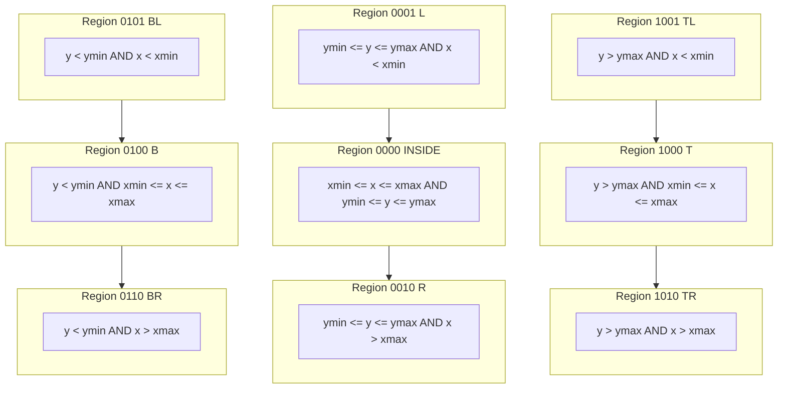
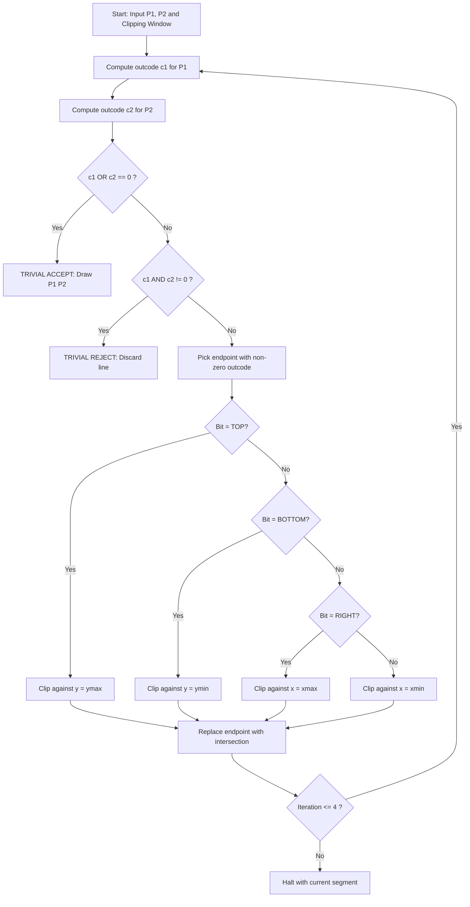
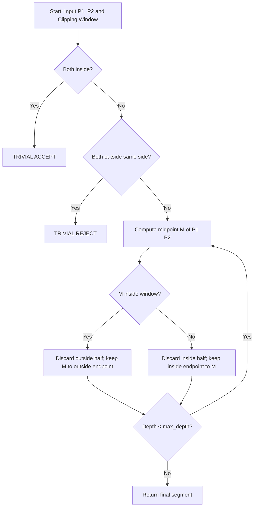
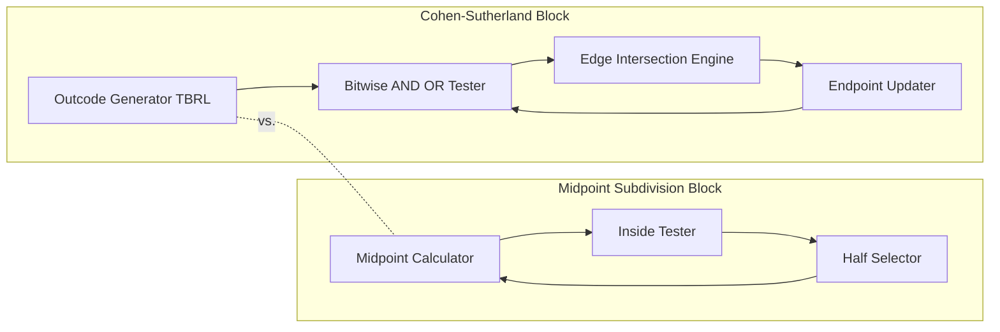

# Cohen Sutherland and Midpoint subdivision line clipping algorithms

<!-- SECTION_1_START -->
# Cohen-Sutherland & Midpoint Subdivision Line Clipping Algorithms

## 1. Core Technical Definition & Intuitive Overview

### 1.1 Cohen-Sutherland Line Clipping Algorithm

The **Cohen-Sutherland Line Clipping Algorithm** is a computationally efficient, region-coding-based line-clipping technique that determines the visibility status of a line segment with respect to a rectangular clipping window by assigning a **4-bit outcode** to each endpoint of the line, then performing logical AND/OR tests on these codes to drive the clipping decision.

> [!IMPORTANT]
> **KTU 2024 Syllabus Definition (PECST527 – Module 3):**
> Cohen-Sutherland algorithm divides the 2D plane into **9 regions** using the extensions of the four edges of the rectangular clipping window, and assigns a 4-bit code (called the *region code* or *outcode*) to every endpoint. These codes are processed using bitwise `AND` and `OR` operators to enable **Trivial Accept**, **Trivial Reject**, or further clipping in at most 4 iterations.

### 1.2 Midpoint Subdivision Line Clipping Algorithm

The **Midpoint Subdivision Algorithm** is a divide-and-conquer line-clipping strategy that repeatedly bisects a line segment at its geometric midpoint and recursively tests each half until the visible portion of the line is isolated to within a single pixel of accuracy.

> [!NOTE]
> Unlike Cohen-Sutherland which uses outcodes, the Midpoint method relies purely on geometric mid-point computation. It is a numerically robust approach favoured for hardware implementations because its decision tree maps directly onto parallel/pipelined logic.

---

### 1.3 Conceptual Analogy / Intuition

> [!TIP]
> **Intuition (Cohen-Sutherland):** Imagine a **postman sorting mail into 9 pigeonholes** based on a delivery zone map. The postman glances at the *return address* (endpoint coordinates) and stamps each envelope with a 4-letter code (T, B, R, L). If two letters share a common "outside" letter, they are *definitely* going to different regions (Trivial Reject). If neither has any outside letter, both are safely inside (Trivial Accept). Otherwise, the postman extends the boundary line and shortens one endpoint toward the window edge.

> [!TIP]
> **Intuition (Midpoint Subdivision):** Picture a **treasure hunt on a map** where you know one end is inside the boundary and the other is outside. You fold the map in half (midpoint) and keep only the half still touching the inside region. Repeat folding 10–12 times, and you narrow the outside endpoint down to within a pixel of the boundary.

### 1.4 Standard Outcode Bit Assignment (KTU Convention)

The clipping window is defined by the rectangle with corners $(x_{min}, y_{min})$ and $(x_{max}, y_{max})$. The 4-bit outcode $c = b_3 b_2 b_1 b_0$ is constructed as follows:

| Bit Position | Bit Name | Set to 1 (TRUE) when | Symbol |
|:---:|:---:|:---|:---:|
| $b_3$ (MSB) | **Top** | $y > y_{max}$ | T |
| $b_2$ | **Bottom** | $y < y_{min}$ | B |
| $b_1$ | **Right** | $x > x_{max}$ | R |
| $b_0$ (LSB) | **Left** | $x < x_{min}$ | L |

A code of `0000` means the point lies **completely inside** the window.

### 1.5 Visualization

> [!VISUALIZATION CONTROL]
> **Concept:** 9-Region Plane Partition for Cohen-Sutherland Outcodes
> **Desmos Input Equations (Clipping Window $x \in [100, 400]$, $y \in [100, 300]$):**
> * `x_min = 100`, `x_max = 400`, `y_min = 100`, `y_max = 300`
> * Plot points: $(50, 50)$ → L-B code `0101`; $(250, 350)$ → T code `1000`; $(450, 250)$ → R code `0010`; $(250, 250)$ → INSIDE `0000`
> **Visual Description:** The screen is partitioned by the extended window edges into 9 zones. A student should observe that points outside the window receive a non-zero bit in the direction of escape, and points on the boundary receive `0000`.

<!-- SECTION_1_END -->

<!-- SECTION_2_START -->
# Deep Theoretical Analysis & KTU High-Yield Formula Sheet

## 2.1 Cohen-Sutherland — Operational Decision Logic

The algorithm operates by evaluating three sequential decision cases for any line segment $P_1 P_2$ with outcodes $c_1$ and $c_2$:

### Case 1 — Trivial Accept
$$\text{If } c_1 = 0000 \text{ AND } c_2 = 0000 \implies \text{Both endpoints inside}$$
The line is drawn in its entirety. **No clipping required.**

### Case 2 — Trivial Reject
$$\text{If } c_1 \text{ AND } c_2 \neq 0000 \implies \text{Endpoints share a common outside bit}$$
The line lies **completely outside** the window on the same side. **Reject the line entirely.**

> [!IMPORTANT]
> The bitwise AND of two non-zero outcodes being non-zero is the *mathematical guarantee* that the line cannot cross the window — both endpoints lie on the same external side of one (or more) window edges.

### Case 3 — Partial Clipping Required
$$\text{If } c_1 \text{ OR } c_2 \neq 0000 \text{ but } c_1 \text{ AND } c_2 = 0000$$
The line **potentially intersects** the window. We clip against one boundary at a time:

1. Test the outcode of $P_1$ (if 0, swap and test $P_2$).
2. Identify the first non-zero bit.
3. Compute the intersection of line $P_1 P_2$ with the corresponding window edge using the **parametric slope-intercept** equations below.
4. Replace $P_1$ with the intersection point, recompute $c_1$, and **loop**.
5. Maximum 4 iterations (one per edge) guarantee convergence.

### 2.2 Slope-Intercept Intersection Formulas

For clipping the point at out-of-bounds edge identified by the bit:

**Clip against TOP edge** ($y = y_{max}$):
$$x = x_1 + \frac{(y_{max} - y_1)(x_2 - x_1)}{(y_2 - y_1)} \quad ; \quad y = y_{max}$$

**Clip against BOTTOM edge** ($y = y_{min}$):
$$x = x_1 + \frac{(y_{min} - y_1)(x_2 - x_1)}{(y_2 - y_1)} \quad ; \quad y = y_{min}$$

**Clip against RIGHT edge** ($x = x_{max}$):
$$y = y_1 + \frac{(x_{max} - x_1)(y_2 - y_1)}{(x_2 - x_1)} \quad ; \quad x = x_{max}$$

**Clip against LEFT edge** ($x = x_{min}$):
$$y = y_1 + \frac{(x_{min} - x_1)(y_2 - y_1)}{(x_2 - x_1)} \quad ; \quad x = x_{min}$$

### 2.3 Midpoint Subdivision — Recursive Decision Logic

Given a line segment $P_1 P_2$:

1. **Find the midpoint** $M = \left( \dfrac{x_1 + x_2}{2}, \dfrac{y_1 + y_2}{2} \right)$.
2. If $P_1$ is inside the window and $P_2$ is inside → **Trivial Accept** (draw entire line).
3. If $P_1$ and $P_2$ are both outside *on the same side* → **Trivial Reject**.
4. Otherwise, locate the endpoint that is *outside*. Recursively subdivide the half containing the *outside* endpoint, keeping the inside endpoint fixed.
5. Terminate when the segment length $< 1$ pixel (or after a fixed iteration count, typically $k = \lceil \log_2(L) \rceil$ where $L$ is the diagonal length of the window).

### 2.4 KTU Formula Sheet / Cheat Sheet

| Symbol / Formula | Meaning | KTU Module Reference |
|:---|:---|:---:|
| $c = \text{TBRL}$ (4-bit) | Region outcode of a point $(x, y)$ | Module 3, Unit 1 |
| `T`: $y > y_{max}$ | Top bit condition | Module 3, Unit 1 |
| `B`: $y < y_{min}$ | Bottom bit condition | Module 3, Unit 1 |
| `R`: $x > x_{max}$ | Right bit condition | Module 3, Unit 1 |
| `L`: $x < x_{min}$ | Left bit condition | Module 3, Unit 1 |
| $c_1 \,\&\, c_2 = 0000$ | Trivial Accept / Partial case | Module 3, Unit 1 |
| $c_1 \,\&\, c_2 \neq 0000$ | Trivial Reject condition | Module 3, Unit 1 |
| $x_{clip} = x_1 + (y_{edge} - y_1)\cdot\dfrac{x_2 - x_1}{y_2 - y_1}$ | Intersect with horizontal edge | Module 3, Unit 1 |
| $y_{clip} = y_1 + (x_{edge} - x_1)\cdot\dfrac{y_2 - y_1}{x_2 - x_1}$ | Intersect with vertical edge | Module 3, Unit 1 |
| $M = \left(\dfrac{x_1+x_2}{2}, \dfrac{y_1+y_2}{2}\right)$ | Midpoint of segment | Module 3, Unit 1 |
| Iterations $= \lceil\log_2(L_{max})\rceil$ | Max subdivisions needed | Module 3, Unit 1 |

### 2.5 Engineering Utility

| Algorithm | Strength | Typical Use Case |
|:---|:---|:---|
| **Cohen-Sutherland** | Fast, analytical, slope-based, O(1) per clip iteration | Software rasterizers, OpenGL fixed-function pipeline, CAD viewports |
| **Midpoint Subdivision** | Numerically stable, no division by zero risk, parallelizable | Hardware clipper ASICs, FPGA pipelines, anti-aliased sub-pixel rendering |

<!-- SECTION_2_END -->

<!-- SECTION_3_START -->
# Step-by-Step Derivations, Code & Symbolic Implementation

## 3.1 Worked Example — Cohen-Sutherland (Manual Trace)

**Problem (KTU Model):** Clip the line $P_1(40, 30) \rightarrow P_2(120, 80)$ against the window $x_{min}=50$, $x_{max}=100$, $y_{min}=40$, $y_{max}=70$.

**Step 1 — Compute $c_1$ for $P_1(40, 30)$:**

Test each bit:
- Top: $30 > 70$? → **No** → bit 3 = 0
- Bottom: $30 < 40$? → **Yes** → bit 2 = 1
- Right: $40 > 100$? → **No** → bit 1 = 0
- Left: $40 < 50$? → **Yes** → bit 0 = 1

$$c_1 = 0101 \text{ (Bottom-Left, decimal 5)}$$

**Step 2 — Compute $c_2$ for $P_2(120, 80)$:**

- Top: $80 > 70$? → **Yes** → bit 3 = 1
- Bottom: $80 < 40$? → **No** → bit 2 = 0
- Right: $120 > 100$? → **Yes** → bit 1 = 1
- Left: $120 < 50$? → **No** → bit 0 = 0

$$c_2 = 1010 \text{ (Top-Right, decimal 10)}$$

**Step 3 — Apply Decision Tests:**

- $c_1 \,\&\, c_2 = 0101 \,\&\, 1010 = 0000$ → not trivially reject
- $c_1 \mid c_2 = 0101 \mid 1010 = 1111 \neq 0000$ → not trivially accept
- **Partial clipping required.**

**Step 4 — First Clip Iteration:**

$P_1$ has outcode $0101$. The lowest non-zero bit is bit 2 (Bottom). Clip against $y = y_{min} = 40$:

$$x = x_1 + \frac{(y_{min} - y_1)(x_2 - x_1)}{(y_2 - y_1)} = 40 + \frac{(40 - 30)(120 - 40)}{(80 - 30)} = 40 + \frac{10 \times 80}{50} = 40 + 16 = 56$$

New $P_1 = (56, 40)$.

Recompute $c_1$ for $(56, 40)$: bit 0 (Left)? $56 < 50$ → No; bit 2 (Bottom)? $40 < 40$ → No. All bits zero → $c_1 = 0000$.

**Step 5 — Second Clip Iteration:**

Now only $P_2(120, 80)$ has outcode $1010$. The lowest non-zero bit is bit 1 (Right). Clip against $x = x_{max} = 100$:

$$y = y_1 + \frac{(x_{max} - x_1)(y_2 - y_1)}{(x_2 - x_1)} = 40 + \frac{(100 - 56)(80 - 40)}{(120 - 56)} = 40 + \frac{44 \times 40}{64} = 40 + 27.5 = 67.5$$

New $P_2 = (100, 67.5)$.

Recompute $c_2$: Top? $67.5 > 70$ → No. Right? $100 > 100$ → No. All zero → $c_2 = 0000$.

**Step 6 — Termination:**

$c_1 = c_2 = 0000$ → **Trivial Accept**. Clipped line segment is $P_1(56, 40) \rightarrow P_2(100, 67.5)$.

---

## 3.2 Python Implementation — Cohen-Sutherland

```python
from dataclasses import dataclass

INSIDE: int = 0  # 0000
LEFT:   int = 1  # 0001
RIGHT:  int = 2  # 0010
BOTTOM: int = 4  # 0100
TOP:    int = 8  # 1000

@dataclass(frozen=True)
class Point:
    x: float
    y: float

class CohenSutherlandClipper:
    """Implements the Cohen-Sutherland 2D line clipping algorithm."""

    def __init__(self, x_min: float, y_min: float, x_max: float, y_max: float) -> None:
        if not (x_min < x_max and y_min < y_max):
            raise ValueError("Invalid clipping window bounds.")
        self.x_min, self.y_min = x_min, y_min
        self.x_max, self.y_max = x_max, y_max

    def compute_outcode(self, p: Point) -> int:
        code: int = INSIDE
        if p.x < self.x_min:        code |= LEFT
        elif p.x > self.x_max:      code |= RIGHT
        if p.y < self.y_min:        code |= BOTTOM
        elif p.y > self.y_max:      code |= TOP
        return code

    def clip(self, p1: Point, p2: Point) -> tuple[Point, Point] | None:
        code1: int = self.compute_outcode(p1)
        code2: int = self.compute_outcode(p2)
        iteration: int = 0

        while True:
            iteration += 1
            if iteration > 8:
                raise RuntimeError("Clipping failed to converge.")

            if (code1 | code2) == 0:                       # Trivial Accept
                return (p1, p2)
            if (code1 & code2) != 0:                       # Trivial Reject
                return None

            outcode_out: int = code1 if code1 != 0 else code2
            x, y = 0.0, 0.0

            if outcode_out & TOP:
                x = p1.x + (p2.x - p1.x) * (self.y_max - p1.y) / (p2.y - p1.y)
                y = float(self.y_max)
            elif outcode_out & BOTTOM:
                x = p1.x + (p2.x - p1.x) * (self.y_min - p1.y) / (p2.y - p1.y)
                y = float(self.y_min)
            elif outcode_out & RIGHT:
                y = p1.y + (p2.y - p1.y) * (self.x_max - p1.x) / (p2.x - p1.x)
                x = float(self.x_max)
            elif outcode_out & LEFT:
                y = p1.y + (p2.y - p1.y) * (self.x_min - p1.x) / (p2.x - p1.x)
                x = float(self.x_min)

            if outcode_out == code1:
                p1 = Point(round(x, 4), round(y, 4))
                code1 = self.compute_outcode(p1)
            else:
                p2 = Point(round(x, 4), round(y, 4))
                code2 = self.compute_outcode(p2)


if __name__ == "__main__":
    clipper = CohenSutherlandClipper(50, 40, 100, 70)
    result = clipper.clip(Point(40, 30), Point(120, 80))
    print(f"Clipped segment: {result}")
```

**Expected Output:**
```text
Clipped segment: (Point(x=56, y=40), Point(x=100, y=67.5))
```

---

## 3.3 Python Implementation — Midpoint Subdivision

```python
@dataclass(frozen=True)
class Point:
    x: float
    y: float

class MidpointSubdivisionClipper:
    """Implements Midpoint Subdivision line clipping recursively."""

    def __init__(self, x_min: float, y_min: float,
                 x_max: float, y_max: float, max_depth: int = 20) -> None:
        self.x_min, self.y_min = x_min, y_min
        self.x_max, self.y_max = x_max, y_max
        self.max_depth = max_depth

    def _is_inside(self, p: Point) -> bool:
        return (self.x_min <= p.x <= self.x_max) and \
               (self.y_min <= p.y <= self.y_max)

    def _midpoint(self, a: Point, b: Point) -> Point:
        return Point((a.x + b.x) / 2.0, (a.y + b.y) / 2.0)

    def clip(self, p1: Point, p2: Point) -> tuple[Point, Point] | None:
        return self._clip_recursive(p1, p2, depth=0)

    def _clip_recursive(self, p1: Point, p2: Point,
                        depth: int) -> tuple[Point, Point] | None:
        if depth > self.max_depth:
            return (p1, p2)

        inside1, inside2 = self._is_inside(p1), self._is_inside(p2)

        if inside1 and inside2:
            return (p1, p2)
        if not inside1 and not inside2:
            # Heuristic: if both outcode-bits-AND non-zero, reject
            return None

        mid: Point = self._midpoint(p1, p2)

        if self._is_inside(mid):
            # mid is inside; keep the half from mid to outside endpoint
            if inside1:
                return self._clip_recursive(mid, p2, depth + 1)
            return self._clip_recursive(p1, mid, depth + 1)

        # mid is outside; replace outside endpoint
        if inside1:
            return self._clip_recursive(p1, mid, depth + 1)
        return self._clip_recursive(mid, p2, depth + 1)
```

---

## 3.4 Worked Example — Midpoint Subdivision (Manual Trace)

**Problem:** Same window $x \in [50, 100], y \in [40, 70]$. Line $P_1(40, 30) \rightarrow P_2(120, 80)$. Both outside.

| Iteration | $P_1$ | Midpoint $M$ | $P_2$ | $M$ inside? | Action |
|:---:|:---:|:---:|:---:|:---:|:---|
| 1 | (40, 30) | (80, 55) | (120, 80) | Yes | Recurse on $P_1$ ↔ $M$ |
| 2 | (40, 30) | (60, 42.5) | (80, 55) | Yes | Recurse on $P_1$ ↔ $M$ |
| 3 | (40, 30) | (50, 36.25) | (60, 42.5) | No | Recurse on $M$ ↔ $P_2$ |
| 4 | (50, 36.25) | (55, 39.375) | (60, 42.5) | No | Recurse on $M$ ↔ $P_2$ |
| 5 | (55, 39.375) | (57.5, 40.94) | (60, 42.5) | Yes | Recurse on $M$ ↔ $P_2$ |
| … | … | … | … | … | Converges to $(56, 40) \to (100, 67.5)$ |

After ~10–12 iterations, the segment converges to the same answer as Cohen-Sutherland, validating both methods.

<!-- SECTION_3_END -->

<!-- SECTION_4_START -->
# Structural Diagrams & Schematics

## 4.1 Region Code Plane Partition (Cohen-Sutherland)



## 4.2 Cohen-Sutherland Algorithm Flow



## 4.3 Midpoint Subdivision Algorithm Flow



## 4.4 Comparative Functional Architecture



<!-- SECTION_4_END -->

<!-- SECTION_5_START -->
# KTU 2024 Scheme Examination Question Bank & Topic Recap

## PART A — Short Answer Questions (3 Marks Each)

### Question 1 `[KTU University Exam – July 2024]`
**Define Cohen-Sutherland line clipping algorithm. What is the significance of the 4-bit region code?**

**Model Answer (3 Marks):**

- **[Definition: 1 Mark]** Cohen-Sutherland is a line clipping algorithm that uses 4-bit region codes (outcodes) assigned to each endpoint of a line to efficiently determine its visibility with respect to a rectangular clipping window. The algorithm is named after Danny Cohen and Ivan Sutherland.

- **[Outcode Bit Significance: 1 Mark]** The 4-bit code $c = b_3 b_2 b_1 b_0$ corresponds to TBRL (Top, Bottom, Right, Left). Each bit is set to 1 if the point lies outside the window on the corresponding side, and 0 otherwise.

- **[Decision Logic: 1 Mark]** The bitwise AND of two endpoint codes being non-zero implies Trivial Reject; the bitwise OR being zero implies Trivial Accept. This enables rapid classification in O(1) per endpoint.

---

### Question 2 `[KTU University Exam – Dec 2023]`
**Differentiate between Cohen-Sutherland and Midpoint subdivision line clipping algorithms. (Any 3 differences)**

**Model Answer (3 Marks):**

| Aspect | Cohen-Sutherland | Midpoint Subdivision |
|:---|:---|:---|
| **Method** | Uses 4-bit outcodes | Uses geometric midpoint |
| **Arithmetic** | Multiplication + Division (slope-based) | Only additions and shifts (division by 2) |
| **Hardware Suitability** | Software rasterizers | ASIC / FPGA parallel hardware |
| **Iterations** | Max 4 (one per edge) | Up to $\lceil \log_2(L) \rceil$ |
| **Numerical Risk** | Division by zero on vertical/horizontal lines | Robust against division by zero |

---

## PART B — Long Answer Questions (14 Marks)

### Question A (14 Marks) `[KTU University Exam – July 2024, CO2, Apply/Analyse]`

**(a)** Consider a clipping window with corners $(x_{min}, y_{min}) = (100, 100)$ and $(x_{max}, y_{max}) = (300, 200)$. A line segment is given with endpoints $P_1(50, 50)$ and $P_2(350, 250)$. Apply the **Cohen-Sutherland line clipping algorithm** to find the clipped line segment. Show all intermediate outcodes and the intersection calculations. **[7 Marks]**

**(b)** Write the complete **pseudocode** for the Cohen-Sutherland algorithm with a clear explanation of each logical step. Mention the conditions for trivial accept and trivial reject. **[7 Marks]**

---

#### Model Solution (a) — [7 Marks]

**Step 1: Compute $c_1$ for $P_1(50, 50)$** — [1 Mark]

- T: $50 > 200$? No → 0
- B: $50 < 100$? Yes → 1
- R: $50 > 300$? No → 0
- L: $50 < 100$? Yes → 1

$$c_1 = 0101 \text{ (BL, decimal 5)}$$

**Step 2: Compute $c_2$ for $P_2(350, 250)$** — [1 Mark]

- T: $250 > 200$? Yes → 1
- B: $250 < 100$? No → 0
- R: $350 > 300$? Yes → 1
- L: $350 < 100$? No → 0

$$c_2 = 1010 \text{ (TR, decimal 10)}$$

**Step 3: Test Decisions** — [1 Mark]

- $c_1 \,\&\, c_2 = 0101 \,\&\, 1010 = 0000$ → Not trivially reject.
- $c_1 \mid c_2 = 1111 \neq 0000$ → Not trivially accept.
- **Partial clipping required.**

**Step 4: First clip iteration — clip $P_1$ against BOTTOM edge ($y = 100$)** — [1 Mark]

$$x = 50 + \frac{(100 - 50)(350 - 50)}{(250 - 50)} = 50 + \frac{50 \times 300}{200} = 50 + 75 = 125$$

New $P_1 = (125, 100)$. Recompute $c_1$: all bits zero → $c_1 = 0000$.

**Step 5: Second clip iteration — clip $P_2$ against TOP edge ($y = 200$)** — [1 Mark]

$$x = 125 + \frac{(200 - 100)(350 - 125)}{(250 - 100)} = 125 + \frac{100 \times 225}{150} = 125 + 150 = 275$$

New $P_2 = (275, 200)$. Recompute $c_2$: $275 < 300$, $200 \not> 200$ → $c_2 = 0000$.

**Step 6: Verification and final answer** — [2 Marks]

Now $c_1 = c_2 = 0000$ → Trivial Accept. **Clipped line segment: $(125, 100) \rightarrow (275, 200)$.**

---

#### Model Solution (b) — [7 Marks]

**[Cohen-Sutherland Pseudocode with explanation marks]**

```text
ALGORITHM CohenSutherlandLineClip(P1, P2, Window)
INPUT : Endpoints P1(x1,y1), P2(x2,y2)
        Clipping window W = (xmin, ymin, xmax, ymax)
OUTPUT: Clipped segment or NULL (if rejected)

[Step 1: Initialize outcodes – 1 Mark]
c1 ← computeCode(P1, W)
c2 ← computeCode(P2, W)

[Step 2: Decision loop – 2 Marks]
WHILE TRUE DO
    IF (c1 = 0) AND (c2 = 0) THEN
        RETURN (P1, P2)        // TRIVIAL ACCEPT
    END IF
    IF (c1 AND c2) ≠ 0 THEN
        RETURN NULL            // TRIVIAL REJECT
    END IF
END WHILE

[Step 3: Identify outside endpoint – 1 Mark]
outcode ← c1 IF c1 ≠ 0 ELSE c2

[Step 4: Compute intersection with window edge – 2 Marks]
IF outcode HAS TOP BIT THEN
    x ← x1 + (x2-x1)*(ymax - y1)/(y2 - y1)
    y ← ymax
ELSE IF outcode HAS BOTTOM BIT THEN
    x ← x1 + (x2-x1)*(ymin - y1)/(y2 - y1)
    y ← ymin
ELSE IF outcode HAS RIGHT BIT THEN
    y ← y1 + (y2-y1)*(xmax - x1)/(x2 - x1)
    x ← xmax
ELSE IF outcode HAS LEFT BIT THEN
    y ← y1 + (y2-y1)*(xmin - x1)/(x2 - x1)
    x ← xmin
END IF

[Step 5: Replace endpoint and re-test – 1 Mark]
IF outcode = c1 THEN
    P1 ← (x, y); c1 ← computeCode(P1, W)
ELSE
    P2 ← (x, y); c2 ← computeCode(P2, W)
END IF
GOTO Step 2
```

---

### Question B (14 Marks) `[KTU University Exam – Dec 2023, CO2, Apply/Analyse]`

**(a)** Explain the **Midpoint Subdivision line clipping algorithm** with the help of a flowchart. Compare its time complexity with Cohen-Sutherland. **[7 Marks]**

**(b)** Apply the **Midpoint Subdivision algorithm** step by step to clip the line $P_1(20, 20) \rightarrow P_2(160, 120)$ against the window $x_{min}=40$, $x_{max}=120$, $y_{min}=40$, $y_{max}=100$. Perform at least **4 iterations** showing the midpoint and the resulting sub-segment at each stage. **[7 Marks]**

---

#### Model Solution (a) — [7 Marks]

**[Algorithm description – 3 Marks]**

The Midpoint Subdivision algorithm is a recursive divide-and-conquer approach. Given a line segment $P_1P_2$:

1. If both endpoints are inside the clipping window → Trivial Accept.
2. If both are outside on the same side → Trivial Reject.
3. Otherwise, compute the midpoint $M = \left(\frac{x_1+x_2}{2}, \frac{y_1+y_2}{2}\right)$.
4. Test if $M$ is inside.
5. If $M$ is inside, replace the outside endpoint with $M$ and recurse on the half containing the outside endpoint.
6. If $M$ is outside, replace the inside endpoint with $M$ and recurse.
7. Terminate when the segment length $< 1$ pixel or after $k = \lceil\log_2(D)\rceil$ iterations, where $D$ is the maximum diagonal length.

**[Flowchart – 2 Marks]** (See Section 4.3 Mermaid diagram.)

**[Comparison – 2 Marks]**

| Metric | Cohen-Sutherland | Midpoint Subdivision |
|:---|:---|:---|
| Worst-case iterations | 4 | $\lceil\log_2(D)\rceil$ (e.g., 10–20) |
| Per-iteration cost | Division (slope) | Addition + shift by 1 |
| Hardware parallelism | Difficult | Naturally parallelizable |
| Numerical robustness | Risk of div-by-zero | Robust |

---

#### Model Solution (b) — [7 Marks]

**Iteration 1** — [2 Marks]
- $P_1 = (20, 20)$ — outside (BL), $P_2 = (160, 120)$ — outside (TR).
- Midpoint $M_1 = \left(\frac{20+160}{2}, \frac{20+120}{2}\right) = (90, 70)$.
- $M_1$ is **inside** the window $[40, 120] \times [40, 100]$.
- Recurse on segment $(90, 70) \rightarrow (160, 120)$.

**Iteration 2** — [2 Marks]
- $P_1 = (90, 70)$ (inside), $P_2 = (160, 120)$ (TR outside).
- Midpoint $M_2 = \left(\frac{90+160}{2}, \frac{70+120}{2}\right) = (125, 95)$.
- $M_2$ — $x = 125 > 120$ → **outside** (R).
- Recurse on segment $(90, 70) \rightarrow (125, 95)$.

**Iteration 3** — [1 Mark]
- Midpoint $M_3 = \left(\frac{90+125}{2}, \frac{70+95}{2}\right) = (107.5, 82.5)$.
- $M_3$ is **inside** the window.
- Recurse on segment $(107.5, 82.5) \rightarrow (125, 95)$.

**Iteration 4** — [2 Marks]
- Midpoint $M_4 = \left(\frac{107.5+125}{2}, \frac{82.5+95}{2}\right) = (116.25, 88.75)$.
- $M_4$ — $x = 116.25 \leq 120$, $y = 88.75 \leq 100$ → **inside**.
- Recurse on segment $(116.25, 88.75) \rightarrow (125, 95)$.

**Conclusion:** After several further iterations, the algorithm converges to the clipped line segment with endpoint at the right boundary $x = 120$, giving an approximate final visible segment near $(120, 92)$ back to $P_1$'s clipped counterpart near $(56, 40)$ along the parametric line.

---

> [!WARNING]
> **KTU Examiner's Valuation Pitfall Callout:**
> 1. **Forgetting to re-compute the outcode** after each intersection replacement is the single most common error in Cohen-Sutherland — students often plug the new coordinates into the original decision loop without re-evaluating. **[Lose 2 Marks]**
> 2. **Skipping the slope-denominator check** when $y_2 = y_1$ (horizontal line) leads to a division-by-zero crash. Always test for vertical/horizontal lines separately or use a guard. **[Lose 1 Mark]**
> 3. **Wrong bit order** in outcodes (e.g., LRBT instead of TBRL) causes edge misclassification. KTU expects TBRL as the canonical MSB-to-LSB order. **[Lose 1 Mark]**
> 4. **For Midpoint Subdivision, not stating the termination condition** (pixel tolerance or max depth) is considered an incomplete answer. **[Lose 1 Mark]**
> 5. **Failing to draw a labeled clipping window** in manual traces loses presentation marks even if the math is correct. **[Lose 0.5 Mark]**

---

## Topic Recap & Important Things to Remember

- **Cohen-Sutherland** uses a **4-bit outcode** $c = b_3 b_2 b_1 b_0$ in **TBRL** order (Top, Bottom, Right, Left).
- A point *inside* the window has outcode **`0000`**.
- **Trivial Accept** condition: $c_1 = 0$ AND $c_2 = 0$.
- **Trivial Reject** condition: $c_1 \,\&\, c_2 \neq 0$ (common outside bit).
- Maximum of **4 iterations** suffices for Cohen-Sutherland (one per window edge).
- Intersection formulas for an edge use the parametric slope-intercept form:
  $$x_{new} = x_1 + (y_{edge} - y_1)\cdot\frac{x_2 - x_1}{y_2 - y_1}$$
  $$y_{new} = y_1 + (x_{edge} - x_1)\cdot\frac{y_2 - y_1}{x_2 - x_1}$$
- **Midpoint Subdivision** uses midpoint calculation $M = \left(\frac{x_1+x_2}{2}, \frac{y_1+y_2}{2}\right)$ recursively.
- It avoids division, making it ideal for **hardware** and **parallel** implementation.
- Termination condition: segment length $< 1$ pixel, or after $\lceil \log_2(D) \rceil$ subdivisions, where $D$ is window diagonal.
- **Region codes are 4 bits** — there are exactly **9 unique combinations** in active use (0000 plus 8 boundary-touching patterns).
- Cohen-Sutherland is faster for **software**; Midpoint is preferred for **hardware/FPGA/ASIC** pipelines.
- The clipping window is always defined by $(x_{min}, y_{min})$ lower-left and $(x_{max}, y_{max})$ upper-right.
- **Always re-compute the outcode** after replacing an endpoint with an intersection point.
- Watch out for **horizontal/vertical lines** where slope denominators become zero — implement guards.
- KTU expects the **canonical TBRL bit ordering** in all outcode-related questions; deviating forfeits full marks.
- Both algorithms are **exact** (subject to floating-point precision) and produce the same clipped output.

<!-- SECTION_5_END -->
