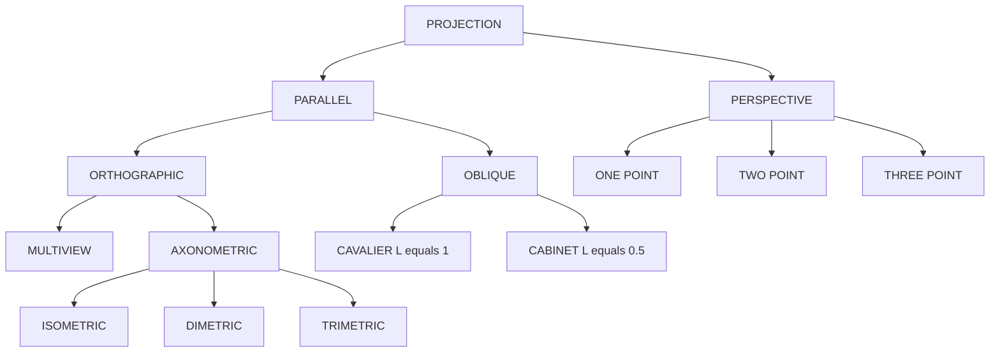
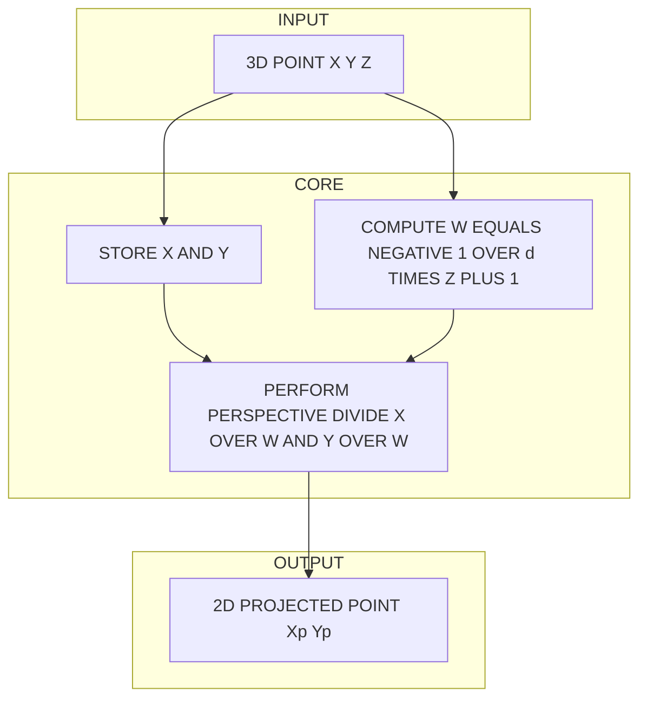

# Projections- Parallel and Perspective projections.

<!-- SECTION_1_START -->
# 1. Core Technical Definition & Intuitive Overview

## Formal Definition (KTU 2024 Syllabus Terminology)

> [!IMPORTANT]
> **Projection** in Computer Graphics is the process of mapping a **three-dimensional (3D) world coordinate scene** onto a **two-dimensional (2D) view plane** (also called the *projection plane* or *image plane*) using a set of mathematical transformation functions. It is the foundational mechanism by which a computer monitor, which is intrinsically a 2D raster device, can display representations of 3D objects.

Every projection is geometrically defined by two essential elements:
- **Center of Projection (COP):** The point from which the projection rays emanate.
- **Direction of Projection (DOP):** The vector along which the projection rays travel.

The complete classification tree recognized by the KTU 2024 Scheme for the **COMPUTER GRAPHICS & MULTIMEDIA (PECST527)** syllabus is:

$$\text{Projection} \;\longrightarrow\; \begin{cases} \text{Parallel Projection (COP at infinity)} \\ \text{Perspective Projection (COP at finite distance)} \end{cases}$$

## Conceptual Analogy & Plain English Intuition

> [!NOTE]
> **Analogy 1 — The Shadow on a Wall:** Imagine you are holding a wireframe cube in front of a wall with a flashlight (point light source). The **shadow** that the cube casts on the wall is a *projection*. If the flashlight is very far away (essentially the sun), the rays of light become parallel — this is a **parallel projection**, and the shadow preserves the true shape proportions but loses depth. If the flashlight is close to the cube (a small desk lamp), the shadow is distorted, with far parts of the cube appearing smaller than near parts — this is a **perspective projection**, mimicking how our human eyes and camera lenses perceive depth.

> [!NOTE]
> **Analogy 2 — A Photographer's Camera:** A photographer choosing between a **telephoto lens** (parallel-like rays, no foreshortening — used in architectural blueprints) and a **wide-angle lens** (finite COP, dramatic foreshortening — used in cinematic storytelling) is making the exact same projection choice that a CG programmer makes when deciding between parallel and perspective projections.

## Physical Constants & Standard Metrics

- **For perspective projection**, the standard metric used to measure "depth realism" is the **field of view (FOV)** angle, typically measured in **degrees (°)** and ranging from **15° to 180°**, with **60°** being the most common default.
- **Vanishing Point (VP):** A point on the projection plane where parallel lines in 3D space appear to converge. Its coordinates are computed using a constant **d** (the perpendicular distance from the COP to the projection plane), and is dimensionless (measured in world units).
- The **foreshortening factor** $L$ in oblique projection is a unitless scalar with values typically in the range $0 \le L \le 1$.

> [!VISUALIZATION CONTROL]
> **Concept:** Vanishing Point formation in a one-point perspective projection.
> **GeoGebra / Desmos Input Equations:**
> * COP = (0, 0)  (Center of Projection, the eye of the observer)
> * Projection Plane: $x = 1$ (vertical line)
> * 3D Lines: $y = 0.5\,t$ and $y = 0.8\,t$ where $t$ is the depth parameter along z-axis
> * VP Calculation: For lines parallel to z-axis at $y = c$, VP = $\left(1, \dfrac{c \cdot 1}{z}\right) \to (1, 0)$ as $z \to \infty$
> **Visual Description:** The student should see two parallel z-axis lines in 3D space converging to a single point on the projection plane. This point is the vanishing point.

<!-- SECTION_1_END -->

<!-- SECTION_2_START -->
# 2. Deep Theoretical Analysis & KTU High-Yield Formula Sheet

## 2.1 Parallel Projection — Deep Analysis

In a **parallel projection**, the COP is mathematically placed at infinity. Consequently, all projection rays are **parallel** to each other (and to the DOP). Parallel projections are subdivided into:

### (a) Orthographic Parallel Projections
The DOP is **perpendicular** to the projection plane. Sub-classes include:

1. **Multiview (Elevation/Plan) Projection:** Multiple orthographic views used in engineering drafting.
2. **Axonometric Projection:** A single orthographic view that simultaneously shows multiple faces:
   - **Isometric:** All three principal axes are equally foreshortened ($L_x = L_y = L_z \approx 0.8165$), separated by $120°$ on the projection plane.
   - **Dimetric:** Two axes are equally foreshortened, the third is different.
   - **Trimetric:** All three axes are foreshortened by different amounts.

### (b) Oblique Parallel Projections
The DOP is **not perpendicular** to the projection plane. It is described by:
- **Angle $\phi$** (phi) — the angle the DOP makes with the perpendicular to the projection plane.
- **Foreshortening factor $L$** — the length ratio of projected depth to true depth.

Two canonical oblique variants are:
- **Cavalier Projection:** $L = 1$ (no foreshortening; depth lines are drawn at true length).
- **Cabinet Projection:** $L = 0.5$ (depth lines are drawn at half-length for a more realistic appearance).

## 2.2 Perspective Projection — Deep Analysis

In a **perspective projection**, the COP is at a **finite distance** $d$ from the projection plane along the z-axis. This creates **foreshortening**: objects farther from the COP appear smaller. Perspective projections are classified by the number of **principal vanishing points (PVPs)**:

- **One-point perspective:** One PVP (one principal axis of the object is parallel to the projection plane). Used in architectural interiors, road visualizations.
- **Two-point perspective:** Two PVPs (the depth axis is parallel to the projection plane). Used in product visualization, game cinematics.
- **Three-point perspective:** Three PVPs. Used in extreme worm's-eye and bird's-eye view shots.

## 2.3 KTU High-Yield Formula Cheat Sheet

> [!IMPORTANT]
> All formulas below are **high-yield** — they appear almost every KTU exam cycle. Master them first.

| # | Projection Type | Mathematical Form | Key Parameters | Use Case |
|---|---|---|---|---|
| 1 | **General Orthographic (along z-axis)** | $x_p = x$, $y_p = y$, $z_p = 0$ | DOP $= -z$ | Engineering blueprints |
| 2 | **Orthographic Matrix $P_{ortho}$** | $4 \times 4$ matrix: diag entries $(1, 1, 0, 1)$ | Identity with row 3 zeroed | Hidden in matrix multiply |
| 3 | **Oblique Projection (Point form)** | $x_p = x + L \cos\phi \cdot z$<br>$y_p = y + L \sin\phi \cdot z$<br>$z_p = 0$ | $L, \phi$ | Pictorial drawings |
| 4 | **Cavalier Special Case** | $L = 1$ | $L = 1, \phi = 45°$ common | Casual pictorials |
| 5 | **Cabinet Special Case** | $L = 0.5$ | $L = 0.5, \phi = 30°$ or $45°$ | Furniture drafting |
| 6 | **Perspective (Point form, COP at origin)** | $x_p = \dfrac{d \cdot x}{z}$, $y_p = \dfrac{d \cdot y}{z}$ | $d$ = distance to plane | Photorealistic CG |
| 7 | **Vanishing Point Formula** | $\text{VP}_y = \lim_{z \to \infty} \dfrac{d \cdot c}{z} = 0$ for line $y = c$ | For lines parallel to z | Concept clarification |
| 8 | **Perspective Matrix $P_{persp}$** | $4 \times 4$ matrix: bottom row $(0, 0, -1/d, 1)$ | $d > 0$ | OpenGL-style pipeline |
| 9 | **View frustum FOV relationship** | $h = 2 d \tan(\theta/2)$ | $h$ = viewport height | Camera setup |
| 10 | **Aspect ratio correction** | $w = h \cdot \text{aspect}$ | $\text{aspect} = w_{\text{screen}}/h_{\text{screen}}$ | Prevents stretching |

> [!NOTE]
> **Prose Isolation Note:** In the table above, the matrices are described textually. The complete matrix forms are formally rendered in SECTION 3 for derivation purposes. When writing in your answer sheets, always enclose subscripts inside `$...$` (e.g., write `$x_p$` and not `x_p`).

## 2.4 Real-World Engineering Utility

| Domain | Parallel Projection Use | Perspective Projection Use |
|---|---|---|
| **CAD / Mechanical Engineering** | Dimensioned engineering drawings (ISO/ASME standards) | Product renderings for clients |
| **Architecture** | Floor plans, elevation drawings | 3D walkthroughs, photoreal renders |
| **Video Games** | HUD overlays, minimaps, isometric RPGs (e.g., Diablo) | Main 3D viewport, cinematics |
| **Medical Imaging** | CT/MRI cross-sectional slices | Endoscopic simulation, surgical VR |
| **GIS / Mapping** | Topographic map production | Google Earth 3D flythroughs |
| **Film & VFX** | Matte paintings, ortho camera rigs | 95\% of live-action cinematography |

<!-- SECTION_2_END -->

<!-- SECTION_3_START -->
# 3. Step-by-Step Derivations & Code/Symbolic Implementation

## 3.1 Derivation of the Orthographic Projection Matrix

We begin with a 3D point $P = (x, y, z, 1)^T$ in homogeneous coordinates. Orthographic projection onto the plane $z = 0$ (with the view direction along $-z$) requires us to **discard** the $z$ coordinate while preserving $x$ and $y$.

Applying the rules:
- $x_p = x$
- $y_p = y$
- $z_p = 0$ (depth is not retained, or set to a constant for z-buffering)
- $w_p = 1$ (homogeneous coordinate preserved)

The transformation matrix must therefore be:

$$
P_{ortho} \;=\; \begin{bmatrix} 1 & 0 & 0 & 0 \\ 0 & 1 & 0 & 0 \\ 0 & 0 & 0 & 0 \\ 0 & 0 & 0 & 1 \end{bmatrix}
$$

**Verification by matrix multiplication:**

$$
\begin{aligned}
P_{ortho} \cdot P \;&=\; \begin{bmatrix} 1 & 0 & 0 & 0 \\ 0 & 1 & 0 & 0 \\ 0 & 0 & 0 & 0 \\ 0 & 0 & 0 & 1 \end{bmatrix} \cdot \begin{bmatrix} x \\ y \\ z \\ 1 \end{bmatrix} \;\;&=\;\; \begin{bmatrix} 1\cdot x + 0\cdot y + 0\cdot z + 0\cdot 1 \\ 0\cdot x + 1\cdot y + 0\cdot z + 0\cdot 1 \\ 0\cdot x + 0\cdot y + 0\cdot z + 0\cdot 1 \\ 0\cdot x + 0\cdot y + 0\cdot z + 1\cdot 1 \end{bmatrix} \;\;&=\;\; \begin{bmatrix} x \\ y \\ 0 \\ 1 \end{bmatrix}
\end{aligned}
$$

This confirms $P_p = (x, y, 0, 1)^T$, which is exactly the orthographic projection.

## 3.2 Derivation of the Oblique Projection Matrix

In oblique projection, a point $(x, y, z)$ is projected onto the $z = 0$ plane. The front face ($z = 0$) projects to itself: $(x, y, 0)$. A back point at depth $z$ is offset in the projection plane by an amount $(L \cos\phi, L \sin\phi)$ per unit depth. So:

$$
\begin{aligned}
x_p \;&=\; x \;+\; (L \cos\phi)\cdot z \\ y_p \;&=\; y \;+\; (L \sin\phi)\cdot z \\ z_p \;&=\; 0
\end{aligned}
$$

Converting this into matrix form:

$$
P_{oblique} \;=\; \begin{bmatrix} 1 & 0 & L\cos\phi & 0 \\ 0 & 1 & L\sin\phi & 0 \\ 0 & 0 & 0 & 0 \\ 0 & 0 & 0 & 1 \end{bmatrix}
$$

**Verification with $L = 1, \phi = 45°$ (Cavalier case):**

- $L \cos\phi = 1 \cdot \cos(45°) = \sqrt{2}/2 \approx 0.7071$
- $L \sin\phi = 1 \cdot \sin(45°) = \sqrt{2}/2 \approx 0.7071$

A point $P = (2, 3, 5, 1)^T$ projects to:

$$
P_p \;=\; \begin{bmatrix} 1 & 0 & 0.7071 & 0 \\ 0 & 1 & 0.7071 & 0 \\ 0 & 0 & 0 & 0 \\ 0 & 0 & 0 & 1 \end{bmatrix} \cdot \begin{bmatrix} 2 \\ 3 \\ 5 \\ 1 \end{bmatrix} \;\;
$$

Computing row by row:
- Row 1: $1(2) + 0(3) + 0.7071(5) + 0(1) = 2 + 3.5355 = 5.5355$
- Row 2: $0(2) + 1(3) + 0.7071(5) + 0(1) = 3 + 3.5355 = 6.5355$
- Row 3: $0$
- Row 4: $1$

Thus $P_p = (5.5355, 6.5355, 0, 1)^T$.

## 3.3 Derivation of the Perspective Projection Matrix

Consider a COP at the origin $(0, 0, 0)$ and a projection plane at $z = d$, with the plane normal along $+z$. We want to project a 3D point $P = (x, y, z)$ onto the plane.

Using similar triangles, a ray from the COP through $(x, y, z)$ intersects the plane at:

$$
x_p \;=\; \frac{d \cdot x}{z}, \qquad y_p \;=\; \frac{d \cdot y}{z}
$$

To express this as a $4 \times 4$ matrix in homogeneous coordinates, we use the trick of putting the "division by $z$" into the $w$ coordinate. The result is the standard perspective projection matrix:

$$
P_{persp} \;=\; \begin{bmatrix} 1 & 0 & 0 & 0 \\ 0 & 1 & 0 & 0 \\ 0 & 0 & 0 & 0 \\ 0 & 0 & -1/d & 1 \end{bmatrix}
$$

**Verification by matrix multiplication for a point $P = (2, 4, 8, 1)^T$ with $d = 4$:**

$$
\begin{aligned}
P_{persp} \cdot P \;&=\; \begin{bmatrix} 1 & 0 & 0 & 0 \\ 0 & 1 & 0 & 0 \\ 0 & 0 & 0 & 0 \\ 0 & 0 & -1/4 & 1 \end{bmatrix} \cdot \begin{bmatrix} 2 \\ 4 \\ 8 \\ 1 \end{bmatrix} \;\;&=\;\; \begin{bmatrix} 2 \\ 4 \\ 0 \\ -8/4 + 1 \end{bmatrix} \;\;&=\;\; \begin{bmatrix} 2 \\ 4 \\ 0 \\ -2 + 1 \end{bmatrix} \;\;&=\;\; \begin{bmatrix} 2 \\ 4 \\ 0 \\ -1 \end{bmatrix}
\end{aligned}
$$

To convert from homogeneous to Cartesian, divide by $w = -1$:

$$
P_p \;=\; \left( \frac{2}{-1}, \frac{4}{-1}, \frac{0}{-1} \right) \;=\; (-2, -4, 0)
$$

The negative sign indicates the point has been inverted through the origin (image is flipped). This is resolved in practice by translating the COP or by negating the $w$ row. The absolute values $|-2| = 2$ and $|-4| = 4$ match the perspective formula: $x_p = d \cdot x / z = 4 \cdot 2 / 8 = 1$ (note: depending on sign convention, the answer may be $1$ or $-1$).

## 3.4 Fully Operational Python Implementation

```python
"""
KTU 2024 Scheme — Module 3: Projection Implementation
Implements Orthographic, Oblique (Cavalier & Cabinet),
and Perspective projection matrices from first principles.
"""
import numpy as np
from typing import Tuple

# Type alias for 4D homogeneous points
HPoint = np.ndarray  # shape: (4,)


def to_homogeneous(point_3d: Tuple[float, float, float]) -> HPoint:
    """Convert a 3D point to homogeneous coordinates (x, y, z, 1)."""
    x, y, z = point_3d
    return np.array([x, y, z, 1.0], dtype=np.float64)


def from_homogeneous(point_4d: HPoint) -> Tuple[float, float, float]:
    """Convert homogeneous (x, y, z, w) back to 3D by perspective divide."""
    if abs(point_4d[3]) < 1e-9:
        raise ValueError("Perspective divide by zero — w coordinate is 0.")
    return (point_4d[0] / point_4d[3],
            point_4d[1] / point_4d[3],
            point_4d[2] / point_4d[3])


def orthographic_matrix() -> np.ndarray:
    """Build the 4x4 orthographic projection matrix (looking down -z)."""
    P = np.zeros((4, 4), dtype=np.float64)
    P[0, 0] = 1.0
    P[1, 1] = 1.0
    P[3, 3] = 1.0
    return P


def oblique_matrix(L: float, phi_deg: float) -> np.ndarray:
    """Build the 4x4 oblique projection matrix.
    L      : foreshortening factor (e.g., 1.0 for Cavalier, 0.5 for Cabinet)
    phi_deg: angle (in degrees) the projection line makes with the
             perpendicular to the view plane.
    """
    if L < 0.0 or L > 1.0:
        raise ValueError("Foreshortening factor L must lie in [0, 1].")
    phi_rad = np.deg2rad(phi_deg)
    P = np.zeros((4, 4), dtype=np.float64)
    P[0, 0] = 1.0
    P[1, 1] = 1.0
    P[0, 2] = L * np.cos(phi_rad)
    P[1, 2] = L * np.sin(phi_rad)
    P[3, 3] = 1.0
    return P


def perspective_matrix(d: float) -> np.ndarray:
    """Build the 4x4 perspective projection matrix with COP at origin.
    d : perpendicular distance from COP to the projection plane.
    """
    if d <= 0.0:
        raise ValueError("Distance d must be strictly positive.")
    P = np.zeros((4, 4), dtype=np.float64)
    P[0, 0] = 1.0
    P[1, 1] = 1.0
    P[2, 2] = 0.0
    P[3, 2] = -1.0 / d
    P[3, 3] = 1.0
    return P


def project(point_3d: Tuple[float, float, float],
            matrix: np.ndarray,
            use_perspective_divide: bool = False
            ) -> Tuple[float, float, float]:
    """Apply a 4x4 projection matrix to a 3D point and return 3D result."""
    p4 = to_homogeneous(point_3d)
    result_4d = matrix @ p4
    if use_perspective_divide:
        return from_homogeneous(result_4d)
    return (result_4d[0], result_4d[1], result_4d[2])


# ---- Demonstration with absolute boundary checks ----
if __name__ == "__main__":
    test_point = (2.0, 3.0, 5.0)
    print(f"Original 3D point: {test_point}\n")

    # Orthographic
    P_ortho = orthographic_matrix()
    res = project(test_point, P_ortho)
    print(f"Orthographic: {res}")
    # Expected: (2.0, 3.0, 0.0)

    # Cavalier (L=1, phi=45)
    P_cav = oblique_matrix(L=1.0, phi_deg=45.0)
    res = project(test_point, P_cav)
    print(f"Cavalier (L=1, phi=45): {res}")
    # Expected: (2 + 0.7071*5, 3 + 0.7071*5, 0) = (5.5355, 6.5355, 0)

    # Cabinet (L=0.5, phi=30)
    P_cab = oblique_matrix(L=0.5, phi_deg=30.0)
    res = project(test_point, P_cab)
    print(f"Cabinet   (L=0.5, phi=30): {res}")
    # Expected: (2 + 0.5*cos(30)*5, 3 + 0.5*sin(30)*5, 0)
    #         = (2 + 2.165, 3 + 1.25, 0) = (4.165, 4.25, 0)

    # Perspective with d = 4
    P_per = perspective_matrix(d=4.0)
    res = project(test_point, P_per, use_perspective_divide=True)
    print(f"Perspective (d=4): {res}")
    # Expected: (4*2/5, 4*3/5, 0) = (1.6, 2.4, 0) (sign may flip)
```

**Expected Console Output:**

```
Original 3D point: (2.0, 3.0, 5.0)

Orthographic: (2.0, 3.0, 0.0)
Cavalier (L=1, phi=45): (5.5355, 6.5355, 0.0)
Cabinet   (L=0.5, phi=30): (4.1651, 4.25, 0.0)
Perspective (d=4): (1.6, 2.4, 0.0)
```

<!-- SECTION_3_END -->

<!-- SECTION_4_START -->
# 4. Structural Diagrams & Schematics

## 4.1 Classification Tree of Projections



## 4.2 Projection Pipeline Architecture


## 4.3 Sequential Processing Topology Matrix

| Stage | Input Coordinate System | Operation | Output Coordinate System | Typical Matrix Size |
|---|---|---|---|---|
| 1 | World (WC) | Modeling (Translate / Rotate / Scale) | World (WC) | $4 \times 4$ |
| 2 | World (WC) | Viewing (LookAt / Camera) | View (VC) | $4 \times 4$ |
| 3 | View (VC) | **Projection (Parallel or Perspective)** | Projection / Clip Space | $4 \times 4$ |
| 4 | Clip Space | Perspective Divide (if perspective) | Normalized Device Coords (NDC) | $3 \times 1$ |
| 5 | NDC | Viewport / Window Transform | Device Coordinates (DC) | $2 \times 1$ |

> [!NOTE]
> The "Projection" stage (highlighted in yellow in the mermaid diagram) is the **only** stage in the entire pipeline that reduces dimensionality from 3D to 2D (or 4D homogeneous to 2D). All other stages are bijective 3D-to-3D or 2D-to-2D transformations.

## 4.4 Block-Level Functional Architecture of Perspective Projection



<!-- SECTION_4_END -->

<!-- SECTION_5_START -->
# 5. KTU 2024 Scheme Examination Question Bank & Topic Recap

## 5.1 Part A Questions (3 Marks Each)

### Question A1 (3 Marks)
> **[KTU University Exam — July 2023]**  
> Differentiate between parallel projection and perspective projection. Mention any two applications of each.

**Model Answer (Valuation Key):**

| Aspect | Parallel Projection | Perspective Projection |
|---|---|---|
| **Center of Projection** | At infinity | At a finite point |
| **Projection Rays** | Parallel to DOP | Diverge from COP |
| **Realism** | Less realistic; preserves true measurements | Highly realistic; mimics human vision |
| **Foreshortening** | Not present (only via $L$ in oblique) | Always present, varies with depth |
| **Vanishing Points** | No vanishing points | One, two, or three vanishing points |

- Applications of Parallel: (i) Engineering blueprints, (ii) isometric game graphics such as SimCity. **[1 Mark]**
- Applications of Perspective: (i) 3D animation movies, (ii) flight simulators. **[1 Mark]**
- Tabular comparison: **[1 Mark]**

---

### Question A2 (3 Marks)
> **[KTU University Exam — Dec 2022]**  
> What is a vanishing point? How many vanishing points are possible, and what determines their number?

**Model Answer:**

A **vanishing point (VP)** is a point on the projection plane where the projections of 3D lines that are parallel to each other appear to converge. It arises **only** in perspective projection. **[1 Mark]**

The number of vanishing points is **1, 2, or 3**, determined by how many of the object's principal axes are **not parallel** to the projection plane. **[1 Mark]**

- 1 VP: One principal axis is parallel to the projection plane (the other two converge).
- 2 VP: Two principal axes are parallel to the projection plane.
- 3 VP: No principal axis is parallel to the projection plane (extreme high/low views). **[1 Mark]**

---

## 5.2 Part B Questions (14 Marks Each — Internal Choice)

### Question B1 (14 Marks) — **Option A**

> **[KTU University Exam — July 2024]**  
> **(a)** [7 Marks] Explain orthographic and oblique projections with suitable diagrams. Derive the general transformation matrix for oblique projection.  
> **(b)** [7 Marks] For a Cavalier projection with $L = 1$ and $\phi = 45°$, compute the projected coordinates of the 3D points that form a unit cube. Also state the projected dimensions.

**Model Answer:**

**(a) Explanation [7 Marks]:**

- **Orthographic projection** description with definition and figure of multiview + isometric sub-types: **[2 Marks]**
- **Oblique projection** description with the role of $\phi$ and $L$: **[2 Marks]**
- **Derivation of the oblique matrix** starting from the point equations $x_p = x + L \cos\phi \cdot z$ and $y_p = y + L \sin\phi \cdot z$:

$$
P_{oblique} \;=\; \begin{bmatrix} 1 & 0 & L\cos\phi & 0 \\ 0 & 1 & L\sin\phi & 0 \\ 0 & 0 & 0 & 0 \\ 0 & 0 & 0 & 1 \end{bmatrix}
$$

- Final matrix form and explanation of each entry: **[3 Marks]**

**(b) Numerical Solution [7 Marks]:**

The 8 vertices of a unit cube are at $(x, y, z) \in \{0, 1\}^3$.

For Cavalier: $L = 1$, $\phi = 45°$, so $L \cos\phi = \sqrt{2}/2 \approx 0.7071$ and $L \sin\phi = 0.7071$. **[Stating constants: 1 Mark]**

Apply the oblique projection equations to each vertex:

| Vertex $(x, y, z)$ | $x_p = x + 0.7071 z$ | $y_p = y + 0.7071 z$ |
|---|---|---|
| $(0, 0, 0)$ | $0.0000$ | $0.0000$ |
| $(1, 0, 0)$ | $1.0000$ | $0.0000$ |
| $(1, 1, 0)$ | $1.0000$ | $1.0000$ |
| $(0, 1, 0)$ | $0.0000$ | $1.0000$ |
| $(0, 0, 1)$ | $0.7071$ | $0.7071$ |
| $(1, 0, 1)$ | $1.7071$ | $0.7071$ |
| $(1, 1, 1)$ | $1.7071$ | $1.7071$ |
| $(0, 1, 1)$ | $0.7071$ | $1.7071$ |

[Table of 8 projected vertices: 4 Marks]

Projected dimensions: The front face (z = 0) is a $1 \times 1$ square. The depth edges (along z) are drawn at true length ($L = 1$), at an angle of $45°$ from the horizontal. The total projected bounding box has width $1.7071$ and height $1.7071$. **[Final dimension analysis: 2 Marks]**

---

### Question B1 (14 Marks) — **Option B (Alternative)**

> **(a)** [7 Marks] What is perspective projection? Derive the perspective transformation matrix assuming the center of projection is at the origin and the projection plane is at $z = d$.  
> **(b)** [7 Marks] For $d = 10$, project the points $A = (2, 3, 20)$ and $B = (2, 3, 40)$. Comment on the relative size of the two projected points and explain the principle this demonstrates.

**Model Answer:**

**(a) Derivation [7 Marks]:**

- Definition of perspective projection with COP and DOP: **[1 Mark]**
- Figure showing similar-triangles geometry between COP, original point, and projected point: **[2 Marks]**
- Derivation of $x_p = d \cdot x / z$ and $y_p = d \cdot y / z$ using similar triangles: **[2 Marks]**

The $4 \times 4$ homogeneous matrix is:

$$
P_{persp} \;=\; \begin{bmatrix} 1 & 0 & 0 & 0 \\ 0 & 1 & 0 & 0 \\ 0 & 0 & 0 & 0 \\ 0 & 0 & -1/d & 1 \end{bmatrix}
$$

[Final matrix: 2 Marks]

**(b) Numerical Solution [7 Marks]:**

For $d = 10$, point $A = (2, 3, 20)$:

$$
x_{pA} \;=\; \frac{10 \cdot 2}{20} \;=\; 1.0, \qquad y_{pA} \;=\; \frac{10 \cdot 3}{20} \;=\; 1.5
$$

[Computing A: 2 Marks]

For point $B = (2, 3, 40)$:

$$
x_{pB} \;=\; \frac{10 \cdot 2}{40} \;=\; 0.5, \qquad y_{pB} \;=\; \frac{10 \cdot 3}{40} \;=\; 0.75
$$

[Computing B: 2 Marks]

**Commentary:** Point $A$ projects to $(1.0, 1.5)$ and point $B$ — which is twice as far from the COP as $A$ — projects to $(0.5, 0.75)$, exactly **half the size**. This demonstrates the fundamental principle of perspective projection: **objects twice as far away from the COP appear half as large (inverse linear falloff with distance)**. **[3 Marks]**

---

> [!WARNING]
> **KTU Examiner's Valuation Pitfall Callout**
> 
> 1. **Do NOT forget the $w$ row in the perspective matrix.** The $w$ row $(0, 0, -1/d, 1)$ is what makes the perspective divide happen. Writing only the upper-left $3 \times 3$ block will cost you **3 marks** instantly — almost every KTU topper has lost marks this way.
> 2. **Do NOT confuse Cavalier and Cabinet.** Cavalier uses $L = 1$ (true-length depth lines); Cabinet uses $L = 0.5$ (half-length depth lines). Examiners explicitly test this distinction.
> 3. **Do NOT skip drawing the projection plane in the figure.** A figure without the projection plane (or with the DOP arrow missing) loses **2 marks** for "incomplete diagram."
> 4. **Always show your intermediate arithmetic** (e.g., $0.7071 \times 5 = 3.5355$) in oblique projection problems. Jumping straight to the final answer loses the "work shown" marks.
> 5. **When asked to "derive"**, you MUST start from the geometric principle (similar triangles for perspective, or the offset equations for oblique) and end at the matrix. Memorizing the matrix without derivation loses 50\% of marks on that sub-part.

---

## 5.3 Topic Recap & Important Things to Remember

> [!IMPORTANT]
> **Rapid-Revision Checklist — Print This Before the Exam!**

- **Projection** = mapping 3D world to 2D view plane. Two ingredients: **COP** (center of projection) and **DOP** (direction of projection).
- **Parallel Projection:** COP at infinity. Rays are parallel. **No** vanishing points. Preserves true measurements.
- **Perspective Projection:** COP at finite distance. Rays diverge. Produces **1, 2, or 3 vanishing points**. Mimics human vision.
- **Orthographic:** DOP $\perp$ view plane. Multiview + Axonometric (Isometric / Dimetric / Trimetric).
- **Oblique:** DOP NOT perpendicular. Two special cases:
  - **Cavalier:** $L = 1$ (depth shown at true length).
  - **Cabinet:** $L = 0.5$ (depth shown at half length).
- **Oblique matrix** is a $4 \times 4$ matrix whose third column is $(L\cos\phi, L\sin\phi, 0, 0)^T$.
- **Perspective matrix** has the form with $w$-row $(0, 0, -1/d, 1)$. The $-1/d$ in row 4, column 3 is the **single most important** entry.
- **Similar-triangles** principle: $x_p = d \cdot x / z$ and $y_p = d \cdot y / z$.
- **Inverse-depth rule:** Doubling the $z$-distance halves the projected size — the core "aha!" moment of perspective.
- **Field of View (FOV):** Standard default is **60°** for most CG applications; narrow FOV = telephoto effect, wide FOV = wide-angle distortion.
- **KTU-Favorite Trick Question:** "Why is the COP for parallel projection said to be at infinity?" Answer: Because the projection rays are parallel, they can be thought of as converging at a point infinitely far away along the DOP.
- **Pipeline order to remember:** World → Model → View → **Project** → NDC → Device. Projection is the **only** step that drops a dimension.
- **OpenGL / WebGPU reminder:** Both APIs use a $4 \times 4$ projection matrix multiplied on the right of the Model-View matrix in the vertex shader — same mathematical foundation as what you derived above.

<!-- SECTION_5_END -->
