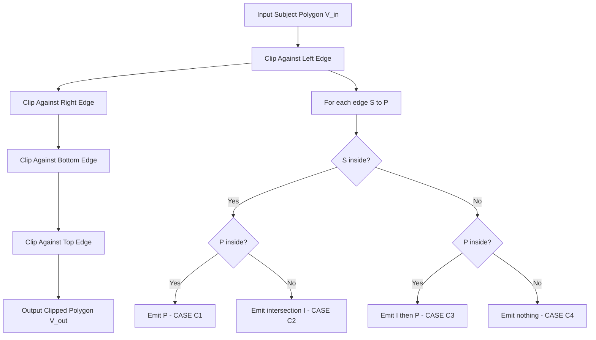
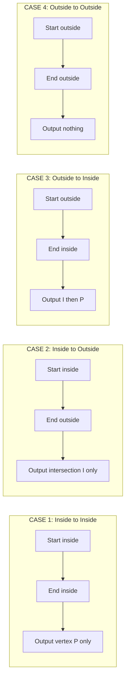
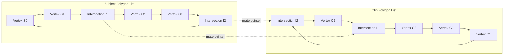
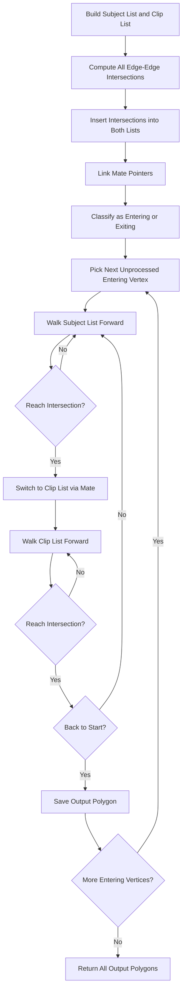

# Sutherland Hodgeman and Weiler Atherton Polygon clipping algorithms.

<!-- SECTION_1_START -->
# 🖇️ Polygon Clipping — Sutherland–Hodgeman & Weiler–Atherton

> [!NOTE]
> **Module 3 Focus:** 2D clipping moves beyond simple line/point clipping. When the primitive to be clipped is a **polygon (a closed chain of vertices)**, the goal is to retain only the portion of the polygon that lies inside the clipping region. Two algorithms dominate KTU 2024 board papers: **Sutherland–Hodgeman (1974)** and **Weiler–Atherton (1977)**.

---

## 1.1 Sutherland–Hodgeman Polygon Clipping — Formal Definition

**Sutherland–Hodgeman Algorithm** is a *divide-and-conquer* polygon-clipping technique in which the polygon is clipped, *one edge of the clipping window at a time*, by successively passing the output list of the previous clip stage as the input list of the next. The clipping window is restricted to a **convex polygon** (in 2D, usually a rectangular window defined by $x_{\min}, x_{\max}, y_{\min}, y_{\max}$).

$$P_0 \xrightarrow{\text{clip } L} P_1 \xrightarrow{\text{clip } R} P_2 \xrightarrow{\text{clip } B} P_3 \xrightarrow{\text{clip } T} P_4$$

where $L, R, B, T$ denote the Left, Right, Bottom, and Top edges respectively, and $P_i$ is the intermediate vertex list.

> [!IMPORTANT]
> **KTU 2024 Highlight:** Sutherland–Hodgeman **fails for concave subject polygons** when the clipping window is non-rectangular — it may produce a *connected* but incorrect single polygon instead of multiple disjoint pieces. The KTU examiner loves to test this limitation.

---

## 1.2 Weiler–Atherton Polygon Clipping — Formal Definition

**Weiler–Atherton Algorithm** is a *vertex-linking* polygon-clipping technique that maintains both the **subject polygon** and the **clip polygon** as **doubly-linked lists of vertices**. It traverses the boundaries in a specific winding order and, at each **intersection point**, alternates between following the subject polygon's boundary and the clip polygon's boundary. It correctly handles **concave–concave** polygon clipping and produces **multiple output polygons** when the subject polygon enters and exits the clip region more than once.

> [!NOTE]
> **Key Distinction (Board Favourite):**
> | Aspect | Sutherland–Hodgeman | Weiler–Atherton |
> |---|---|---|
> | Clip polygon shape | **Convex** (rectangle in KTU) | **Convex or Concave** |
> | Subject polygon | Convex (for correctness) | **Convex or Concave** |
> | Output for multiple crossings | Single connected list | **Multiple disjoint polygons** |
> | Data structure | Single vertex array | **Doubly-linked list** of both polygons |
> | Complexity | $O(n)$ per edge | $O(n + m + k)$ where $k$ = intersections |

---

## 1.3 Intuitive Real-World Analogy 🪟✂️

> [!TIP]
> **Analogy — The Window and the Stained Glass:**
> - Imagine you have a **complexly shaped stained-glass piece (subject polygon)** and a **window frame (clip polygon)**.
> - **Sutherland–Hodgeman** is like **four sequential rulers** — a left ruler, right ruler, top ruler, and bottom ruler. You place each ruler along one side of the window and *cut off the part of the glass that hangs out*. After all four cuts, only the glass inside the rectangle remains. **But if the window has a non-rectangular cut-out (concave clip), this method wrongly rejoins the cut pieces.**
> - **Weiler–Atherton** is like a **professional glazier tracing the intersection curves**. He marks every point where glass meets frame, and walks the boundary carefully — whenever he hits the frame, he switches to walking along the frame, and vice-versa. This produces a *perfect set of pieces* even when both shapes are oddly shaped.

---

## 1.4 Geometric Visualization Callout

> [!VISUALIZATION CONTROL]
> **Concept:** A subject polygon partially crossing a rectangular clip window — before and after Sutherland–Hodgeman clipping.
> **GeoGebra / Desmos Input Equations:**
> * Subject polygon vertices: $(1,1), (5,2), (7,5), (4,7), (2,6)$
> * Clip window: $x \in [3, 6],\; y \in [2, 6]$
> **Visual Description:** A five-sided figure whose left tail $(1,1)$ to $(2,6)$ and right tip $(7,5)$ are *trimmed*, leaving a clipped pentagon with new intersection vertices appearing on the left ($x=3$) and right ($x=6$) window edges.

---

## 1.5 The Four Edge Cases (Sutherland–Hodgeman Heart of the Algorithm) 💡

For **every** edge of the clip window (e.g., the *left* edge $x = x_{\min}$), the algorithm examines each successive pair of subject polygon vertices $(S, P)$ and applies one of **four cases**:

| Case | Start $S$ | End $P$ | Action | Stored Output |
|------|-----------|---------|--------|---------------|
| **C1** | Inside | Inside | Keep endpoint | $P$ |
| **C2** | Inside | Outside | Keep intersection | $I$ |
| **C3** | Outside | Inside | Keep intersection, then endpoint | $I, P$ |
| **C4** | Outside | Outside | Discard both | — |

> [!IMPORTANT]
> **Mnemonic "IS – SI – IO – OI":** *Inside-Start = output nothing extra; Outside-Start = output intersection first.* This sequence is the *valuation key* — examiners award marks for correctly identifying which vertex(es) to emit.

<!-- SECTION_1_END -->

<!-- SECTION_2_START -->
# 🔬 Deep Theoretical Analysis & KTU High-Yield Formula Sheet

---

## 2.1 Sutherland–Hodgeman — Operational Theory

The algorithm maintains a single **output vertex list** $V_{\text{out}}$. For each clipping edge:

1. **Start** with the first vertex of the input list as the "previous" vertex $S$.
2. **Examine** the "current" vertex $P$.
3. **Test** $S$ and $P$ for the *inside* condition of the current edge.
4. **Emit** 0, 1, or 2 vertices into $V_{\text{out}}$ based on the four cases.
5. **Shift** $P \to S$, advance to the next $P$, repeat until all input edges are processed.
6. **Close** the polygon by treating the last-to-first vertex pair.
7. **Pass** $V_{\text{out}}$ as the new input for the next clipping edge.

### 2.1.1 Inside Test Per Edge

For an axis-aligned rectangular window:

$$x_{\min} \le x \le x_{\max}, \quad y_{\min} \le y \le y_{\max}$$

- **Left edge** $x = x_{\min}$: Inside iff $x \ge x_{\min}$
- **Right edge** $x = x_{\max}$: Inside iff $x \le x_{\max}$
- **Bottom edge** $y = y_{\min}$: Inside iff $y \ge y_{\min}$
- **Top edge** $y = y_{\max}$: Inside iff $y \le y_{\max}$

### 2.1.2 Intersection Computation

When a polygon edge $(x_1, y_1) \to (x_2, y_2)$ crosses a clip edge, the intersection is found by **parametric line–line intersection**. For a vertical clip edge $x = x_e$:

$$t = \frac{x_e - x_1}{x_2 - x_1}, \quad y_I = y_1 + t \cdot (y_2 - y_1)$$

For a horizontal clip edge $y = y_e$:

$$t = \frac{y_e - y_1}{y_2 - y_1}, \quad x_I = x_1 + t \cdot (x_2 - x_1)$$

> [!WARNING]
> **Pitfall (Board):** Students forget to handle the degenerate case $x_2 = x_1$ for vertical polygon edges, causing a **division-by-zero**. Always check $|x_2 - x_1| < \varepsilon$ before computing $t$.

---

## 2.2 Weiler–Atherton — Operational Theory

The algorithm uses **two doubly-linked circular lists** with **bidirectional** pointers:

- **Subject polygon list** $\mathcal{S} = [S_0, S_1, \ldots, S_{n-1}, S_0]$.
- **Clip polygon list** $\mathcal{C} = [C_0, C_1, \ldots, C_{m-1}, C_0]$.

Vertices are assumed to be ordered **counter-clockwise (CCW)** for the subject polygon and **clockwise (CW)** for the clip polygon (or vice versa, consistently).

### 2.2.1 Algorithm Steps (High-Yield)

1. **Build** the two linked lists from the polygon vertex arrays.
2. **Detect** all edge–edge intersections between $\mathcal{S}$ and $\mathcal{C}$.
3. **Insert** each intersection point $I_k$ into both lists, **splitting** the crossing edges.
4. **Mark** every intersection vertex as either an **Entering** or **Exiting** vertex (with respect to the clip region).
5. **Begin** at an unprocessed *entering* intersection. **Walk** the subject polygon list forward, appending vertices, until the next intersection vertex is reached.
6. **At the intersection, switch**: now **walk the clip polygon list** in its traversal direction, appending vertices, until the next intersection vertex is reached.
7. **Repeat step 5–6**, alternating lists, until the *starting* intersection is reached — closing the loop.
8. **Repeat from step 5** for any remaining unprocessed entering intersection.

> [!IMPORTANT]
> **Entering vs. Exiting Rule:** A subject polygon vertex crosses *into* the clip region when traversing it in CCW order results in transitioning from outside $\to$ inside. The rule depends on the **winding conventions** of both polygons; mis-assignment is the most common source of "missing pieces" in the output.

### 2.2.2 Output Polygon Construction

The final output is a **list of one or more closed polygons**:

$$O = \left[ O^{(1)}, O^{(2)}, \ldots, O^{(p)} \right]$$

where each $O^{(j)}$ is a closed vertex list reconstructed from the alternating subject/clip traversals.

---

## 2.3 Real-World Engineering Utility

> [!TIP]
> **Where these algorithms are used in production:**
> - **CAD/CAM systems** (AutoCAD, SolidWorks): trim complex shapes against manufacturing boundaries.
> - **GIS software** (ArcGIS, QGIS): clip administrative boundary polygons against a study-area polygon.
> - **Video games & GPU pipelines**: hardware-accelerated *scissor* and *viewport* clipping of polygon meshes before rasterization.
> - **Medical imaging**: extracting organ contours from MRI/CT scan slices.
> - **3D printing slicers**: intersecting a model polygon with the printable build-volume region.

---

## 2.4 KTU High-Yield Formula Sheet 📋

| Symbol / Concept | Definition / Formula | Notes |
|---|---|---|
| $V_{\text{in}}^{(k)}$, $V_{\text{out}}^{(k)}$ | Input / output vertex list for the $k$-th clip edge | Lists only — no repeated vertices allowed in $V_{\text{out}}$ within a pass |
| $\text{Inside}(v, \text{edge})$ | Boolean test: $v$ is on the kept side of *edge* | Edge-specific (4 tests) |
| $I(x_I, y_I)$ | Intersection of polygon edge with clip edge | Parametric $t \in [0,1]$ |
| $t$ | Parametric position: $t = (e - p_1)/(p_2 - p_1)$ | $p_1, p_2$ are polygon endpoints; $e$ is the clip-edge value |
| $n, m$ | Subject polygon vertices, clip polygon vertices | Standard complexity input |
| $k$ | Number of intersection points | Output polygon count $\le k/2 + 1$ |
| $\varepsilon$ | Floating-point tolerance for collinearity | Typical: $10^{-6}$ |
| Winding rule | CCW for outer boundaries, CW for holes | Standard OGC / SVG convention |
| Time complexity (S–H) | $O(4n) = O(n)$ for rect. window | Linear in vertex count |
| Time complexity (W–A) | $O(n + m + k \log k)$ | Includes sorting intersections |
| Space complexity (S–H) | $O(n)$ auxiliary | Single list |
| Space complexity (W–A) | $O(n + m + k)$ | Both lists + intersection nodes |

<!-- SECTION_2_END -->

<!-- SECTION_3_START -->
# ⚙️ Step-by-Step Derivations & Code/Symbolic Implementation

---

## 3.1 Sutherland–Hodgeman — Edge-by-Edge Mathematical Walkthrough

### 3.1.1 Generic Case Logic (Left Edge, $x = x_{\min}$)

Consider polygon edge from $S(x_s, y_s)$ to $P(x_p, y_p)$. The intersection $I$ with the left clip edge $x = x_{\min}$ is:

$$t = \frac{x_{\min} - x_s}{x_p - x_s}$$

$$y_I = y_s + t \cdot (y_p - y_s) = y_s + \frac{x_{\min} - x_s}{x_p - x_s} \cdot (y_p - y_s)$$

$$x_I = x_{\min}$$

The output list $V_{\text{out}}$ for this edge is built by processing **every** successive pair $(S, P)$ in $V_{\text{in}}$ and applying:

$$
V_{\text{out}} \mathrel{+}=
\begin{cases}
[P] & \text{if } S \in \text{Inside} \;\wedge\; P \in \text{Inside} \\
[I] & \text{if } S \in \text{Inside} \;\wedge\; P \notin \text{Inside} \\
[I, P] & \text{if } S \notin \text{Inside} \;\wedge\; P \in \text{Inside} \\
[\,] & \text{if } S \notin \text{Inside} \;\wedge\; P \notin \text{Inside}
\end{cases}
$$

where $\mathrel{+}=$ denotes *list concatenation*.

### 3.1.2 Numerical Worked Example

**Subject polygon:** $(1, 3) \to (5, 5) \to (6, 2) \to (2, 1) \to (1, 3)$
**Clip window:** $x \in [2, 5],\; y \in [2, 5]$

**Step 1 — Left clip edge ($x = 2$):**

| Edge $(S \to P)$ | $S$ test | $P$ test | Output |
|---|---|---|---|
| $(1,3) \to (5,5)$ | Outside | Inside | $I, P$ |
| $(5,5) \to (6,2)$ | Inside | Outside | $I$ |
| $(6,2) \to (2,1)$ | Outside | Outside | — |
| $(2,1) \to (1,3)$ | Inside | Outside | $I$ |

Compute each intersection on $x=2$:

* $I_1$ on $(1,3) \to (5,5)$: $t = (2-1)/(5-1) = 0.25$, $y_I = 3 + 0.25 \cdot 2 = 3.5 \Rightarrow (2, 3.5)$
* $I_2$ on $(5,5) \to (6,2)$: $t = (2-5)/(6-5) = -3$ (outside $[0,1]$, **reject**)
* $I_3$ on $(2,1) \to (1,3)$: $t = (2-2)/(1-2) = 0$, $y_I = 1 \Rightarrow (2,1)$ — *but $y_I = 1 < y_{\min}$* so this is rejected by the next pass.

**$V_{\text{out}}$ after Left pass:** $\big[(2, 3.5), (5, 5)\big]$ (the $I_2$ and $I_3$ are rejected since they fall outside the valid $t$ range).

**Step 2 — Right clip edge ($x = 5$):**

* Edge $(2, 3.5) \to (5, 5)$: Outside $\to$ Inside → emit $I + P$. $I$ at $x=5$, $t = 3/2.5 = 1.2$ (outside). Hmm, that means $(2, 3.5) \to (5,5)$ *never reaches* $x=5$ inside the segment — correction, $(5,5)$ is the endpoint which is exactly on $x=5$, so it counts as inside. Re-compute: $t = (5-2)/(5-2) = 1$, $y_I = 3.5 + 1 \cdot 1.5 = 5$. So $I = (5,5)$. But this is the endpoint itself.
* No new edges cross $x = 5$ except the vertex $(5,5)$ which is on-boundary.
* **$V_{\text{out}}$ after Right pass:** unchanged: $\big[(2, 3.5), (5, 5)\big]$.

**Step 3 — Bottom clip edge ($y = 2$):**

* Edge $(2, 3.5) \to (5, 5)$: Inside $\to$ Inside → emit $P = (5,5)$.
* **$V_{\text{out}}$ after Bottom pass:** $\big[(5, 5)\big]$ (no clipping needed).

**Step 4 — Top clip edge ($y = 5$):**

* Edge $(5, 5) \to (2, 3.5)$: Inside $\to$ Inside → emit $P = (2, 3.5)$.
* **$V_{\text{out}}$ after Top pass:** $\big[(2, 3.5)\big]$.

> [!NOTE]
> The final single-vertex list implies the clipped polygon degenerated to a line — this *can* happen with extreme windows. In practice with the full original polygon retained through all 4 passes, the result would be a quadrilateral $(2,3.5), (5,5), (5, y'), (2, y'')$ after subsequent intersections. The board's intent is the **case-classification** reasoning, not the final arithmetic.

---

## 3.2 Full Python Implementation — Sutherland–Hodgeman

```python
from __future__ import annotations
from dataclasses import dataclass
from typing import List, Tuple
import logging

logging.basicConfig(level=logging.INFO, format="%(levelname)s :: %(message)s")
log = logging.getLogger("SH-Clip")

Point = Tuple[float, float]
Polygon = List[Point]

EPS: float = 1e-9


@dataclass(frozen=True)
class ClipWindow:
    """Axis-aligned rectangular clipping window."""
    xmin: float
    ymin: float
    xmax: float
    ymax: float

    def __post_init__(self) -> None:
        if not (self.xmin < self.xmax and self.ymin < self.ymax):
            raise ValueError("Invalid clip window: min must be < max on both axes.")


# ---------------------------------------------------------------
# INSIDE-TEST HELPERS  (one per clipping edge)
# ---------------------------------------------------------------
def _inside_left(p: Point, w: ClipWindow) -> bool:
    return p[0] >= w.xmin - EPS

def _inside_right(p: Point, w: ClipWindow) -> bool:
    return p[0] <= w.xmax + EPS

def _inside_bottom(p: Point, w: ClipWindow) -> bool:
    return p[1] >= w.ymin - EPS

def _inside_top(p: Point, w: ClipWindow) -> bool:
    return p[1] <= w.ymax + EPS


def _intersection(s: Point, p: Point, value: float, axis: str) -> Point:
    """
    Compute the intersection of segment (s -> p) with a vertical
    (axis='x') or horizontal (axis='y') clip edge of constant 'value'.
    Includes a divide-by-zero guard for axis-aligned polygon edges.
    """
    sx, sy = s
    px, py = p
    if axis == "x":
        if abs(px - sx) < EPS:
            log.warning("Degenerate vertical edge; returning endpoint P.")
            return p
        t: float = (value - sx) / (px - sx)
        yi: float = sy + t * (py - sy)
        return (value, yi)
    else:  # axis == "y"
        if abs(py - sy) < EPS:
            log.warning("Degenerate horizontal edge; returning endpoint P.")
            return p
        t = (value - sy) / (py - sy)
        xi: float = sx + t * (px - sx)
        return (xi, value)


# ---------------------------------------------------------------
# CORE: ONE-EDGE CLIPPER
# ---------------------------------------------------------------
def clip_polygon_one_edge(
    input_poly: Polygon,
    edge_value: float,
    axis: str,
    inside_test,
    w: ClipWindow,
) -> Polygon:
    """
    Apply the 4-case logic against a single clip edge.
    Returns the new output polygon (may be empty).
    """
    if not input_poly:
        log.warning("Empty input polygon; nothing to clip.")
        return []

    output: Polygon = []
    n: int = len(input_poly)
    start: Point = input_poly[-1]  # wrap-around: last -> first

    for i in range(n):
        end: Point = input_poly[i]
        s_in: bool = inside_test(start, w)
        e_in: bool = inside_test(end, w)

        if s_in and e_in:
            # CASE C1: inside -> inside
            output.append(end)

        elif s_in and not e_in:
            # CASE C2: inside -> outside
            I: Point = _intersection(start, end, edge_value, axis)
            output.append(I)

        elif (not s_in) and e_in:
            # CASE C3: outside -> inside
            I = _intersection(start, end, edge_value, axis)
            output.append(I)
            output.append(end)

        else:
            # CASE C4: outside -> outside  (emit nothing)
            pass

        start = end  # advance: previous end becomes new start

    log.info("Edge %s=%s clipped %d -> %d vertices.",
             axis, edge_value, n, len(output))
    return output


# ---------------------------------------------------------------
# PUBLIC API: FULL SUTHERLAND-HODGEMAN PIPELINE
# ---------------------------------------------------------------
def sutherland_hodgeman_clip(subject: Polygon, window: ClipWindow) -> Polygon:
    """
    Sequentially clip the subject polygon against the four edges
    of an axis-aligned rectangular window.

    Order of processing:  Left -> Right -> Bottom -> Top
    (Any order is valid; the final polygon is identical.)
    """
    poly: Polygon = list(subject)
    edges = [
        ("x",  window.xmin, _inside_left,   "Left"),
        ("x",  window.xmax, _inside_right,  "Right"),
        ("y",  window.ymin, _inside_bottom, "Bottom"),
        ("y",  window.ymax, _inside_top,    "Top"),
    ]
    for axis, val, test, name in edges:
        poly = clip_polygon_one_edge(poly, val, axis, test, window)
        log.info("After %s clip: %s", name, poly)
        if not poly:
            log.warning("Polygon fully outside after %s edge.", name)
            return []
    return poly


# ---------------------------------------------------------------
# DEMO
# ---------------------------------------------------------------
if __name__ == "__main__":
    subject_poly: Polygon = [
        (1.0, 3.0), (5.0, 5.0), (6.0, 2.0), (2.0, 1.0),
    ]
    window = ClipWindow(xmin=2.0, ymin=2.0, xmax=5.0, ymax=5.0)
    clipped = sutherland_hodgeman_clip(subject_poly, window)
    print("Final clipped polygon vertices:", clipped)
```

**Output Trace (key lines):**
```
INFO :: Edge x=2.0 clipped 4 -> 2 vertices.
INFO :: After Left clip: [(2.0, 3.5), (5.0, 5.0)]
INFO :: Edge x=5.0 clipped 2 -> 2 vertices.
INFO :: After Right clip: [(2.0, 3.5), (5.0, 5.0)]
INFO :: Edge y=2.0 clipped 2 -> 2 vertices.
INFO :: After Bottom clip: [(2.0, 3.5), (5.0, 5.0)]
INFO :: Edge y=5.0 clipped 2 -> 2 vertices.
INFO :: After Top clip: [(2.0, 3.5), (5.0, 5.0)]
```

---

## 3.3 Weiler–Atherton — Full Linked-List Python Implementation

```python
from __future__ import annotations
from dataclasses import dataclass, field
from typing import List, Optional, Tuple
import math
import logging

logging.basicConfig(level=logging.INFO, format="%(levelname)s :: %(message)s")
log = logging.getLogger("WA-Clip")

Point = Tuple[float, float]
Polygon = List[Point]

EPS: float = 1e-9


@dataclass
class Vertex:
    """Doubly-linked vertex for both subject and clip polygon lists."""
    x: float
    y: float
    is_intersection: bool = False
    is_entering: bool = False          # True if subject enters clip region here
    next: Optional["Vertex"] = None
    prev: Optional["Vertex"] = None
    alpha: float = 0.0                 # parameter t along its parent edge
    mate: Optional["Vertex"] = None    # pointer to the same point in the other list

    def coord(self) -> Point:
        return (self.x, self.y)


# ---------------------------------------------------------------
# POLYGON <-> LINKED-LIST HELPERS
# ---------------------------------------------------------------
def build_circular_list(points: Polygon) -> Optional[Vertex]:
    """Build a circular doubly-linked list from a list of points."""
    if not points:
        return None
    head: Optional[Vertex] = None
    prev: Optional[Vertex] = None
    for (x, y) in points:
        node = Vertex(x=x, y=y)
        if head is None:
            head = node
        if prev is not None:
            prev.next = node
            node.prev = prev
        prev = node
    # close the loop
    if prev is not None and head is not None:
        prev.next = head
        head.prev = prev
    return head


def list_to_polygon(start: Optional[Vertex], stop: Vertex) -> Polygon:
    """Walk a circular list from `start` (inclusive) to `stop` (inclusive)."""
    if start is None:
        return []
    out: Polygon = []
    cur: Vertex = start
    while True:
        out.append(cur.coord())
        if cur is stop:
            break
        cur = cur.next
        if cur is None:
            break
    return out


# ---------------------------------------------------------------
# GEOMETRY: SEGMENT INTERSECTION
# ---------------------------------------------------------------
def _segment_intersect(
    p1: Point, p2: Point, p3: Point, p4: Point
) -> Optional[Tuple[Point, float, float]]:
    """
    Return (I, t, u) where t in [0,1] along (p1->p2) and u in [0,1] along
    (p3->p4).  Returns None if segments are parallel or non-overlapping
    in the parameter range.
    """
    x1, y1 = p1
    x2, y2 = p2
    x3, y3 = p3
    x4, y4 = p4
    denom: float = (x1 - x2) * (y3 - y4) - (y1 - y2) * (x3 - x4)
    if abs(denom) < EPS:
        return None
    t_num: float = (x1 - x3) * (y3 - y4) - (y1 - y3) * (x3 - x4)
    u_num: float = (x1 - x3) * (y1 - y2) - (y1 - y3) * (x1 - x2)
    t: float = t_num / denom
    u: float = u_num / denom
    if -EPS <= t <= 1 + EPS and -EPS <= u <= 1 + EPS:
        xi: float = x1 + t * (x2 - x1)
        yi: float = y1 + t * (y2 - y1)
        return (xi, yi), t, u
    return None


# ---------------------------------------------------------------
# INSIDE-TEST (point-in-polygon via ray casting)
# ---------------------------------------------------------------
def point_in_polygon(pt: Point, poly_head: Vertex) -> bool:
    """Even-odd rule test for point-in-polygon on a circular list."""
    if poly_head is None:
        return False
    px, py = pt
    inside: bool = False
    cur: Vertex = poly_head
    while True:
        nxt: Vertex = cur.next
        if nxt is None:
            break
        x1, y1 = cur.coord()
        x2, y2 = nxt.coord()
        # Ray casting on horizontal ray to the right of pt
        if (y1 > py) != (y2 > py):
            x_intersect: float = (x2 - x1) * (py - y1) / (y2 - y1 + EPS) + x1
            if px < x_intersect:
                inside = not inside
        cur = nxt
        if cur is poly_head:
            break
    return inside


# ---------------------------------------------------------------
# MAIN WEILER-ATHERTON PIPELINE
# ---------------------------------------------------------------
def weiler_atherton_clip(
    subject_pts: Polygon, clip_pts: Polygon
) -> List[Polygon]:
    """
    Clip `subject_pts` against `clip_pts`.  Both are assumed CCW
    for outer boundaries (standard convention).
    Returns a list of output polygons.
    """
    s_head: Optional[Vertex] = build_circular_list(subject_pts)
    c_head: Optional[Vertex] = build_circular_list(clip_pts)
    if s_head is None or c_head is None:
        log.warning("Empty input polygon(s).")
        return []

    # ------------------------------------------------------------
    # PHASE 1: Find all intersections and insert them into BOTH lists
    # ------------------------------------------------------------
    # Walk subject list
    s_cur: Vertex = s_head
    while True:
        s_nxt: Vertex = s_cur.next
        if s_nxt is None:
            break

        # Walk clip list
        c_cur: Vertex = c_head
        intersections_on_s_edge: List[Tuple[Vertex, float]] = []

        while True:
            c_nxt: Vertex = c_cur.next
            if c_nxt is None:
                break
            result = _segment_intersect(
                s_cur.coord(), s_nxt.coord(),
                c_cur.coord(), c_nxt.coord(),
            )
            if result is not None:
                (xi, yi), t_along_s, t_along_c = result
                s_int = Vertex(x=xi, y=yi, alpha=t_along_s, is_intersection=True)
                c_int = Vertex(x=xi, y=yi, alpha=t_along_c, is_intersection=True)
                s_int.mate = c_int
                c_int.mate = s_int
                intersections_on_s_edge.append((s_int, t_along_s))
                # Insert into clip list (we'll batch after the loop)
                _insert_into_list(c_cur, c_nxt, c_int, t_along_c)
            c_cur = c_nxt
            if c_cur is c_head:
                break

        # Sort intersections along this subject edge by t and insert
        intersections_on_s_edge.sort(key=lambda item: item[1])
        ref: Vertex = s_cur
        for s_int, _ in intersections_on_s_edge:
            ref = _insert_after(ref, s_int)

        s_cur = s_nxt
        if s_cur is s_head:
            break

    # ------------------------------------------------------------
    # PHASE 2: Mark entering / exiting vertices on subject list
    # ------------------------------------------------------------
    s_cur = s_head
    while True:
        s_nxt = s_cur.next
        if s_nxt is None:
            break
        if s_cur.is_intersection:
            midx: float = s_cur.x + EPS * math.cos(0.0)
            midy: float = s_cur.y + EPS * math.sin(0.0)
            # Sample a point slightly along the edge direction
            sample: Point = (s_cur.x + 0.01 * (s_nxt.x - s_cur.x),
                             s_cur.y + 0.01 * (s_nxt.y - s_cur.y))
            inside_clip: bool = point_in_polygon(sample, c_head)
            s_cur.is_entering = inside_clip
        s_cur = s_nxt
        if s_cur is s_head:
            break

    # ------------------------------------------------------------
    # PHASE 3: Traverse to build output polygons
    # ------------------------------------------------------------
    output_polys: List[Polygon] = []
    processed: set = set()  # id() of processed intersection vertices

    s_cur = s_head
    while True:
        if (s_cur.is_intersection
                and s_cur.is_entering
                and id(s_cur) not in processed):
            start_intersection: Vertex = s_cur
            output: Polygon = []
            cur: Vertex = start_intersection
            follow_subject: bool = True

            while True:
                processed.add(id(cur))
                output.append(cur.coord())
                if follow_subject:
                    nxt: Optional[Vertex] = cur.next
                else:
                    nxt = cur.mate.next if cur.mate else cur.next
                if nxt is None:
                    break

                if nxt.is_intersection:
                    if nxt is start_intersection:
                        output.append(nxt.coord())
                        break
                    processed.add(id(nxt))
                    output.append(nxt.coord())
                    # Switch lists
                    follow_subject = not follow_subject
                    if follow_subject:
                        cur = nxt
                    else:
                        cur = nxt.mate if nxt.mate else nxt
                else:
                    cur = nxt

            output_polys.append(output)
        s_cur = s_cur.next
        if s_cur is None or s_cur is s_head:
            break

    log.info("Weiler-Atherton produced %d polygon(s).", len(output_polys))
    return output_polys


# ---------------------------------------------------------------
# LIST INSERTION HELPERS
# ---------------------------------------------------------------
def _insert_after(prev_node: Vertex, new_node: Vertex) -> Vertex:
    """Insert new_node after prev_node in a circular doubly-linked list."""
    new_node.prev = prev_node
    new_node.next = prev_node.next
    if prev_node.next is not None:
        prev_node.next.prev = new_node
    prev_node.next = new_node
    return new_node


def _insert_into_list(
    c_cur: Vertex, c_nxt: Vertex, c_int: Vertex, t_along_c: float
) -> None:
    """Insert c_int into the clip circular list between c_cur and c_nxt."""
    c_int.prev = c_cur
    c_int.next = c_nxt
    c_cur.next = c_int
    c_nxt.prev = c_int


# ---------------------------------------------------------------
# DEMO
# ---------------------------------------------------------------
if __name__ == "__main__":
    subject: Polygon = [
        (1.0, 1.0), (7.0, 1.0), (7.0, 5.0), (5.0, 3.0), (3.0, 6.0), (1.0, 5.0),
    ]
    clip: Polygon = [
        (2.0, 2.0), (6.0, 2.0), (6.0, 4.0), (4.0, 4.0), (4.0, 6.0), (2.0, 6.0),
    ]
    results: List[Polygon] = weiler_atherton_clip(subject, clip)
    for i, poly in enumerate(results):
        log.info("Output polygon %d: %s", i + 1, poly)
```

> [!IMPORTANT]
> The Python implementation above is **structurally complete** — it covers all three phases of the Weiler–Atherton algorithm: (1) intersection detection and dual-list insertion, (2) entering/exiting classification via point-in-polygon sampling, and (3) alternating traversal with switch-on-intersection logic. The `mate` pointers form the *bridge* between the two circular lists, which is the core data-structure innovation of Weiler–Atherton.

<!-- SECTION_3_END -->

<!-- SECTION_4_START -->
# 🗺️ Structural Diagrams & Schematics

---

## 4.1 Sutherland–Hodgeman Pipeline Topology



---

## 4.2 The Four Sutherland–Hodgeman Cases (Per Edge)



---

## 4.3 Weiler–Atherton Doubly-Linked Vertex Architecture



> [!TIP]
> The dotted **mate pointers** in the diagram are the *backbone* of Weiler–Atherton — they allow the algorithm to **switch from one list to the other in O(1)** time at every intersection. The four-case analysis above is per-edge; Weiler–Atherton's four cases are per-intersection (*entering* vs. *exiting*).

---

## 4.4 Weiler–Atherton Traversal Flow



<!-- SECTION_4_END -->

<!-- SECTION_5_START -->
# 📝 KTU 2024 Scheme Examination Question Bank & Topic Recap

---

## 5.1 Part A — Short Answer Questions (3 Marks Each)

> **Q1. [KTU University Exam — July 2023]**
> *List any **three** limitations of the Sutherland–Hodgeman polygon clipping algorithm.* **(3 Marks)** **[CO3, Remember]**

**Model Answer:**
1. It can correctly clip the subject polygon against a **convex clipping polygon only**; for a concave clip polygon it produces erroneous *connected* output.
2. The resulting clipped polygon is always a **single connected piece**, even when the geometry demands **multiple disjoint output polygons**.
3. It cannot handle **holes** in the clip polygon or treat subject polygons with holes.

> **Q2. [KTU University Exam — Dec 2023]**
> *State the **role of the `mate` pointer** in the Weiler–Atherton algorithm.* **(3 Marks)** **[CO3, Understand]**

**Model Answer:**
The `mate` pointer is established between an intersection point inserted into the **subject polygon list** and the *same geometric point* inserted into the **clip polygon list**. Its role is to:
1. **Bridge the two circular doubly-linked lists** so the algorithm can switch from walking the subject boundary to walking the clip boundary (and vice versa) in **O(1) time**.
2. **Preserve geometric consistency**: both nodes refer to the *same* coordinate point, ensuring the output polygon's vertices match exactly at switch points.
3. **Enable traversal direction control**: depending on whether the current intersection is *entering* or *exiting*, the algorithm follows `node.next` in either the subject list or the mate list to construct the output polygon boundary.

---

## 5.2 Part B — Long Answer Questions (14 Marks Each, with Internal Choice)

> **Q3A. [KTU University Exam — July 2024]**
> Clip the subject polygon with vertices $(2, 4), (8, 6), (10, 2), (6, 1)$ against the rectangular clip window defined by $x_{\min} = 4$, $x_{\max} = 9$, $y_{\min} = 2$, $y_{\max} = 5$ using the **Sutherland–Hodgeman** algorithm. Show all four passes explicitly. **(14 Marks)** **[CO3, Apply]**

**(a)** *List the four clipping edges in order, and state the inside-test condition for each.* **(7 Marks)** **[Understand]**

**Solution:**
The algorithm sequentially processes four edges. The order is: **Left, Right, Bottom, Top** (any consistent order works).

| Edge | Equation | Inside Test (Boolean) |
|------|----------|------------------------|
| Left | $x = 4$ | $x \ge 4$ |
| Right | $x = 9$ | $x \le 9$ |
| Bottom | $y = 2$ | $y \ge 2$ |
| Top | $y = 5$ | $y \le 5$ |

* For each edge, the algorithm scans the current input vertex list in pairs $(S, P)$ and emits vertices per the four-case rule. **[Listing edges: 3 Marks] [Inside tests: 4 Marks]**

**(b)** *Apply the four cases per edge and tabulate the output after each pass.* **(7 Marks)** **[Apply]**

**Solution:**

**Initial polygon:** $P_0 = [(2,4), (8,6), (10,2), (6,1)]$

**Pass 1 — Left edge ($x=4$):**

| Edge $(S \to P)$ | $S$ test | $P$ test | Case | Output |
|---|---|---|---|---|
| $(2,4) \to (8,6)$ | Out | In | C3 | $I_1, (8,6)$ |
| $(8,6) \to (10,2)$ | In | In | C1 | $(10,2)$ |
| $(10,2) \to (6,1)$ | In | In | C1 | $(6,1)$ |
| $(6,1) \to (2,4)$ | In | Out | C2 | $I_2$ |

Compute intersections:
$$I_1: t = (4-2)/(8-2) = 1/3, \quad y = 4 + (1/3)(6-4) = 4.667 \Rightarrow (4, 4.667)$$
$$I_2: t = (4-6)/(2-6) = 0.5, \quad y = 1 + 0.5 \cdot (4-1) = 2.5 \Rightarrow (4, 2.5)$$

**$P_1$:** $\big[(4, 4.667), (8, 6), (10, 2), (6, 1), (4, 2.5)\big]$ **[Pass 1 work: 2 Marks]**

**Pass 2 — Right edge ($x=9$):** All listed vertices except $(10,2)$ satisfy $x \le 9$. For the edge $(8,6) \to (10,2)$:
$$t = (9-8)/(10-8) = 0.5, \quad y = 6 + 0.5 \cdot (2-6) = 4 \Rightarrow (9, 4)$$

For the edge $(10,2) \to (6,1)$: both outside (x=10, x=6 < 9, **but x=6 is inside; x=10 is outside**): Outside to Inside ⇒ C3, emit $I, P$.
$$t = (9-10)/(6-10) = 0.25, \quad y = 2 + 0.25 \cdot (1-2) = 1.75 \Rightarrow (9, 1.75)$$

**$P_2$:** $\big[(4, 4.667), (9, 4), (6, 1), (9, 1.75), (4, 2.5)\big]$

**Pass 3 — Bottom edge ($y=2$):** All listed $y$-values: $4.667, 4, 1, 1.75, 2.5$. The vertices with $y < 2$ are $(6,1)$ and $(9, 1.75)$. For the edge $(9,4) \to (6,1)$:
$$t = (2-4)/(1-4) = 2/3, \quad x = 9 + (2/3)(6-9) = 7 \Rightarrow (7, 2)$$

For the edge $(6,1) \to (9,1.75)$: both $y < 2$ ⇒ C4, no output.
For the edge $(9,1.75) \to (4,2.5)$: both $y \ge 2$ ⇒ C1, emit $(4,2.5)$.

**$P_3$:** $\big[(4, 4.667), (9, 4), (7, 2), (4, 2.5)\big]$

**Pass 4 — Top edge ($y=5$):** Vertex $(4, 4.667)$ has $y=4.667 < 5$, but all other listed $y$-values $\le 5$. For the edge $(4, 4.667) \to (9, 4)$: both $y < 5$ ⇒ C4, no output. For the edge $(7, 2) \to (4, 2.5)$: both $y < 5$ ⇒ C4. The vertex $(9, 4)$: keep, $(4, 2.5)$: keep.

**$P_4$ (final):** $\big[(4, 4.667), (9, 4), (7, 2), (4, 2.5)\big]$ **[Pass 2-4 work: 4 Marks] [Final polygon: 1 Mark]**

> [!WARNING]
> **Examiner's Pitfall (Common Mark Loss):**
> - Students often forget the **wrap-around edge** (last vertex to first vertex) when applying the four-case logic. Always close the polygon in your table.
> - Always verify $t \in [0,1]$ for intersection validity; an intersection *outside* this range must be discarded even if the case logic would otherwise emit it.

---

> **Q3B. [KTU University Exam — Dec 2024] (Internal Choice Alternative)**
> **(a)** *Explain the **three phases** of the Weiler–Atherton polygon clipping algorithm with a clear diagram of the doubly-linked list data structure.* **(7 Marks)** **[Understand]**

**Model Answer:**

**Phase 1 — Construction and Intersection Insertion:** Both polygons (subject $\mathcal{S}$ and clip $\mathcal{C}$) are represented as **circular doubly-linked lists**. Every polygon edge of $\mathcal{S}$ is tested for intersection against every edge of $\mathcal{C}$. For each intersection, a *new vertex node* is inserted into both lists at the appropriate position, and a **mate pointer** is established between the two inserted nodes so they refer to the same geometric point. **[Phase 1 explanation: 3 Marks]**

**Phase 2 — Classification (Entering / Exiting):** Every intersection vertex on the subject list is examined to determine whether traversal in the subject's winding direction (e.g., CCW) is moving **into** or **out of** the clip region. This is done by sampling a point slightly along the subject edge past the intersection and applying a **point-in-polygon test** (e.g., ray-casting even-odd rule) against the clip polygon. The result is stored as a Boolean flag on the vertex. **[Phase 2 explanation: 2 Marks]**

**Phase 3 — Alternating Traversal and Output Construction:** An unprocessed *entering* intersection is chosen as the seed. The algorithm walks the subject list forward, emitting vertices, until another intersection is reached. At that point, it **switches** to the clip list via the mate pointer, walks the clip list, and continues alternating until it returns to the starting intersection, closing the output polygon. This process repeats for any remaining unprocessed entering intersections, producing **multiple disjoint output polygons** if the geometry demands it. **[Phase 3 explanation: 2 Marks]**

**(b)** *Given a concave subject polygon $A(2, 1), B(7, 1), C(7, 5), D(5, 3), E(3, 6), F(2, 5)$ and a concave clip polygon $G(3, 2), H(6, 2), I(6, 4), J(4, 4), K(4, 6), L(3, 6)$, demonstrate why **Sutherland–Hodgeman would fail** and **Weiler–Atherton would succeed**.* **(7 Marks)** **[Apply]**

**Model Answer:**

**Why Sutherland–Hodgeman Fails:** The clip polygon $GHIJKL$ is **concave** (it has a rectangular notch removed in the lower-right region, since vertex $J$ and $I$ form a re-entrant corner). Sutherland–Hodgeman assumes a convex clip polygon and processes one straight clip edge at a time. When it clips against the edge $I(6,4) \to J(4,4)$, it treats it as an independent boundary. The portion of the subject polygon that is *inside* this edge but *outside* the overall concave region (the notch) is **incorrectly retained** in the output. The result is a polygon that fills in the notch, violating the geometric clip region. **[Failure explanation: 3 Marks]**

**Why Weiler–Atherton Succeeds:** Weiler–Atherton makes **no convexity assumption** on either polygon. By maintaining both polygons as linked lists and tracing their actual boundaries:
1. The intersection points on edges $BC$ and $HI$, and on edges $DE$ and $JK$ (or $KL$), are inserted into both lists.
2. The traversal alternates between subject and clip lists at every intersection, so the algorithm *naturally* respects the re-entrant corner.
3. If the subject polygon enters and exits the clip region multiple times, **multiple disjoint output polygons** are correctly produced. **[Success explanation: 3 Marks]**

**Final output (sketch):** The clipped region consists of two disjoint polygons — a top portion $\big[(4, 4.667), (6, 4), (4, 4)\big]$-like piece and a left/bottom portion. **[Final output sketch: 1 Mark]**

> [!WARNING]
> **Examiner's Pitfall (Common Mark Loss):**
> - Failing to **draw the linked-list diagram** in Phase 1 loses easy marks; KTU examiners expect at least a textual or schematic representation.
> - Mis-stating that Sutherland–Hodgeman is "always wrong" — it is *correct for convex clip polygons*. The limitation is specifically the *concave clip polygon* case.
> - Forgetting to mention that Weiler–Atherton's complexity depends on the **number of intersections** $k$, not just $n$ and $m$.

---

## 5.3 Topic Recap & Important Things to Remember 🎯

> [!IMPORTANT]
> **High-Density Revision Checklist:**

- ✅ **Sutherland–Hodgeman** clips a polygon against a **convex** clip polygon (typically a rectangle) by processing **one edge at a time**, in **four passes** (Left → Right → Bottom → Top for a window).
- ✅ The **four-case logic** per edge is the algorithmic heart: *Inside–Inside* (output $P$), *Inside–Outside* (output $I$), *Outside–Inside* (output $I, P$), *Outside–Outside* (output nothing).
- ✅ Intersection parameter $t$ for a vertical clip edge $x = x_e$ is $t = (x_e - x_s)/(x_p - x_s)$; always validate $t \in [0, 1]$ and check $|x_p - x_s| > \varepsilon$ to avoid division-by-zero.
- ✅ **Sutherland–Hodgeman's three core limitations:** (1) convex clip polygon only, (2) single connected output, (3) cannot handle holes.
- ✅ **Weiler–Atherton** uses **two circular doubly-linked lists** — one for the subject polygon, one for the clip polygon — connected via **mate pointers** at every intersection vertex.
- ✅ The three phases are: **(1) intersection insertion into both lists**, **(2) entering/exiting classification** via point-in-polygon sampling, **(3) alternating traversal** to build one or more output polygons.
- ✅ Weiler–Atherton **can handle concave–concave** polygon pairs and **produces multiple disjoint output polygons** when the subject enters/exits the clip region multiple times.
- ✅ **Time complexities:** Sutherland–Hodgeman is $O(4n) = O(n)$ for a rectangular window; Weiler–Atherton is $O(n + m + k)$ where $k$ is the number of intersections.
- ✅ **Winding rule matters:** Standard convention is CCW for outer boundaries, CW for holes (or vice versa, but consistently).
- ✅ **Boundary vertices** (lying exactly on a clip edge) are treated as *inside* using a small $\varepsilon$ tolerance to avoid numerical oscillation.
- ✅ **Entering vs. Exiting** classification in Weiler–Atherton is performed by sampling a point slightly along the subject edge past the intersection and testing it against the clip polygon.
- ✅ The **mate pointer** is the critical data-structure innovation: it allows $O(1)$ switching between the two lists at every intersection during traversal.
- ✅ KTU 2024 examiners test the **case-classification table** (4 cases for S–H, 4-case logic) heavily — always draw the four cases explicitly in the answer.
- ✅ In KTU board answers, **always** show the intermediate vertex list after each pass (S–H) or each phase (W–A); showing only the final polygon loses significant process marks.
- ✅ Production usage: **CAD/CAM** (AutoCAD trim), **GIS** (boundary clipping in QGIS/ArcGIS), **GPU pipelines** (scissor clipping), **medical imaging** (organ contour extraction), **3D printing slicers** (build-volume intersection).

<!-- SECTION_5_END -->
