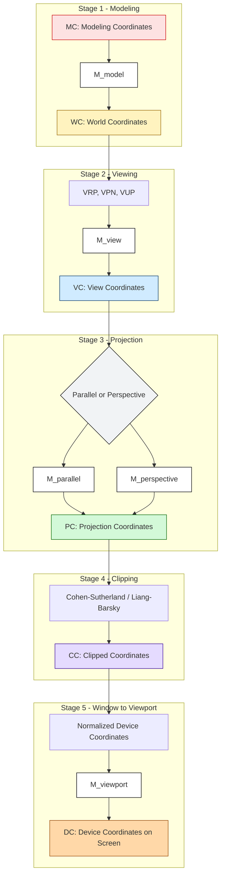
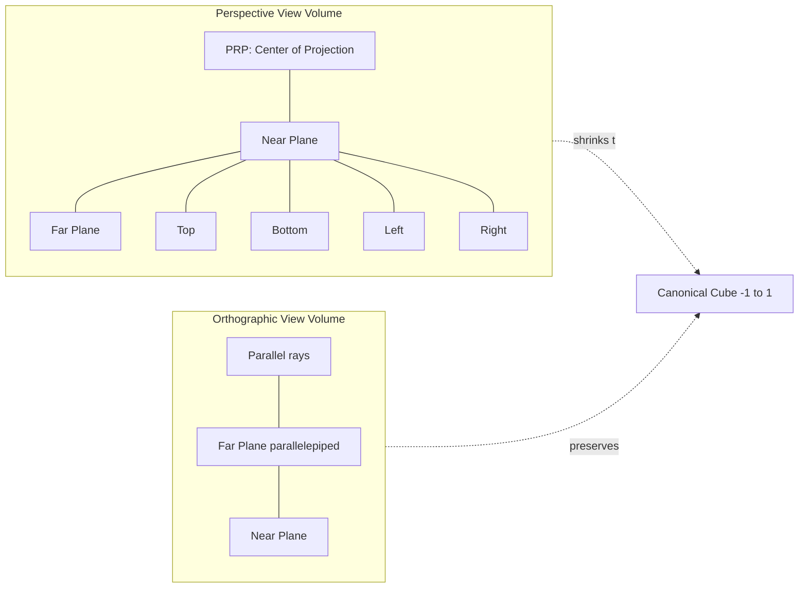
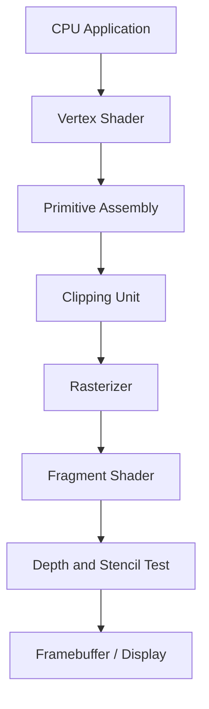

# Three dimensional graphics - Three dimensional viewing pipeline.

<!-- SECTION_1_START -->

# 3D Viewing Pipeline — Core Definition & Intuitive Overview

## 1.1 Formal Definition (KTU 2024 Syllabus Terminology)

The **3D Viewing Pipeline** is the mathematically rigorous, sequential cascade of affine and projective transformations that maps a **scene** defined in a 3D object/modeling coordinate space to a 2D raster image on an output display device. In the KTU 2024 PECST527 syllabus, the pipeline is formally described as the deterministic chain:

$$\text{Modeling Coordinates (MC)} \rightarrow \text{World Coordinates (WC)} \rightarrow \text{View Coordinates (VC)} \rightarrow 3D\ \text{Normalized Device Coordinates (NDC)} \rightarrow \text{Device Coordinates (DC)}$$

> [!IMPORTANT]
> **KTU Board Definition (verbatim recall):** *“The 3D viewing pipeline is the sequence of operations used to transform a description of objects from the coordinate system in which they are defined into a coordinate system suitable for display on the graphics output device.”* — Sutherland, Sproull, Schumacker paradigm adopted by KTU.

## 1.2 Conceptual Analogy — The Cinematographer’s Camera

Imagine a Hollywood director filming a miniature city. The pipeline behaves exactly like a **professional film camera rig**:

| Pipeline Stage | Real-World Analogy |
|---|---|
| **Modeling Coordinates** | Wooden toy houses in their original positions on the artist's table |
| **World Coordinates** | Houses placed inside the larger diorama (relative to a global origin) |
| **View Transformation** | The director *walks around* the diorama and chooses a tripod location and lens orientation |
| **Projection Transformation** | The lens compresses 3D light rays onto the 2D camera sensor film |
| **Clipping** | The viewfinder mask — anything outside the frame is cut off |
| **Window → Viewport** | The negative is printed to a specific photo paper size (e.g., 4×6 inch) |

## 1.3 The Five Canonical Stages

> [!NOTE]
> The KTU 2024 scheme strongly emphasises the **five-stage pipeline** — students must be able to name and justify every stage.

1. **Modeling Transformation** ($M_{\text{model}}$) — places objects relative to a shared world origin.
2. **Viewing Transformation** ($M_{\text{view}}$) — positions and orients a virtual camera (view reference point, view-up vector, view plane normal).
3. **Projection Transformation** ($M_{\text{proj}}$) — collapses 3D → 2D using either *parallel* or *perspective* projection.
4. **Clipping Transformation** — discards primitives outside the canonical view volume.
5. **Window-to-Viewport Mapping** ($M_{\text{vp}}$) — scales the 2D result to physical screen pixels.

## 1.4 Geometric Visualization (Coordinate Spaces)

> [!VISUALIZATION CONTROL]
> **Concept:** Visualizing the cascading coordinate spaces of the 3D pipeline.
> **GeoGebra / Desmos Input Equations:**
> * `f(x) = x^3 - 3*x` (representing the view volume)
> * `B1 = (1, 1, 1)`, `B2 = (-1, -1, -1)` — canonical view volume corners
> * Points `P = (2, 3, 5)` and its projections onto successive planes.
> **Visual Description:** The student should observe how point **P** in the modeling cube migrates inward through a *view frustum* (a truncated pyramid for perspective, or a parallelepiped for orthographic), then projects orthogonally onto a near plane, and finally lands on a 2D screen rectangle.

<!-- SECTION_1_END -->

<!-- SECTION_2_START -->

# Deep Theoretical Analysis & KTU High-Yield Formula Sheet

## 2.1 Operational Concept Breakdown

The pipeline is a **composite homogeneous matrix multiplication**:

$$M_{\text{final}} = M_{\text{vp}} \cdot M_{\text{proj}} \cdot M_{\text{view}} \cdot M_{\text{model}}$$

A point $P_{\text{mc}} = \begin{bmatrix} x & y & z & 1 \end{bmatrix}^T$ traverses the pipeline as:

$$P_{\text{dc}} = M_{\text{final}} \cdot P_{\text{mc}}$$

### Stage 1 — Modeling Transformation (MC → WC)
- **Why:** A complex scene (CAD model, flight simulator terrain, animated character) is built as a hierarchy of *local* coordinate systems. We must place each piece into a shared world.
- **How:** A translation $T$ followed by rotations $R_x, R_y, R_z$ and a non-uniform scale $S$ applied to local vertices.
- **KTU Keyword:** *Object hierarchy, scene graph, world reference frame.*

### Stage 2 — Viewing Transformation (WC → VC)
- **Why:** The graphics system must simulate a camera. The view frame is defined by:
  - **View Reference Point (VRP)** — the camera location
  - **View Plane Normal (VPN)** — the direction the camera is pointing
  - **View-Up Vector (VUP)** — the camera’s “up” orientation
  - **Projection Reference Point (PRP)** — the center of projection
- **How:** $M_{\text{view}} = T(-VRP) \cdot R_x(-\theta) \cdot R_y(-\phi)$ where $\theta, \phi$ are the rotation angles needed to align VPN with $-Z$ and VUP with $+Y$.

### Stage 3 — Projection Transformation (VC → PC)
- **Why:** Project from 3D view space to 2D. Two primary classes:
  - **Perspective Projection** — mimics human eye, produces foreshortening.
  - **Parallel (Orthographic/Oblique) Projection** — preserves parallel lines, used in engineering drafting.
- **How:** Construct a 4×4 matrix that maps the view volume to a canonical cube.

### Stage 4 — Clipping
- **Why:** Primitives partially outside the view volume must be trimmed so the rasterizer doesn’t waste time on invisible pixels.
- **How:** Cohen–Sutherland (line), Sutherland–Hodgman (polygon), or Liang–Barsky parametric algorithms.

### Stage 5 — Window-to-Viewport Mapping (NC → DC)
- **Why:** Normalized device coordinates (NDC, in $[-1, 1]$ or $[0, 1]$ depending on the API) must be scaled to the physical screen resolution.
- **How:**

$$x_{\text{DC}} = x_{\text{NDC}} \cdot \frac{(x_{\text{max}} - x_{\text{min}})}{2} + \frac{(x_{\text{max}} + x_{\text{min}})}{2}$$

## 2.2 KTU Formula Sheet / Cheat Sheet

> [!IMPORTANT]
> **Memorise the matrices below** — KTU valuation keys allocate 4 marks out of 14 for correct matrix construction in the **part (a) of Module 3 questions**.

| Transformation | Matrix $M$ (4×4 homogeneous form) | Notes / Parameters |
|---|---|---|
| Translation by $(T_x, T_y, T_z)$ | $\begin{bmatrix} 1 & 0 & 0 & T_x \\ 0 & 1 & 0 & T_y \\ 0 & 0 & 1 & T_z \\ 0 & 0 & 0 & 1 \end{bmatrix}$ | Rigid body motion |
| Rotation about $X$ by $\theta$ | $\begin{bmatrix} 1 & 0 & 0 & 0 \\ 0 & \cos\theta & -\sin\theta & 0 \\ 0 & \sin\theta & \cos\theta & 0 \\ 0 & 0 & 0 & 1 \end{bmatrix}$ | Right-hand rule |
| Rotation about $Y$ by $\phi$ | $\begin{bmatrix} \cos\phi & 0 & \sin\phi & 0 \\ 0 & 1 & 0 & 0 \\ -\sin\phi & 0 & \cos\phi & 0 \\ 0 & 0 & 0 & 1 \end{bmatrix}$ | — |
| Rotation about $Z$ by $\psi$ | $\begin{bmatrix} \cos\psi & -\sin\psi & 0 & 0 \\ \sin\psi & \cos\psi & 0 & 0 \\ 0 & 0 & 1 & 0 \\ 0 & 0 & 0 & 1 \end{bmatrix}$ | — |
| Scaling $(S_x, S_y, S_z)$ | $\begin{bmatrix} S_x & 0 & 0 & 0 \\ 0 & S_y & 0 & 0 \\ 0 & 0 & S_z & 0 \\ 0 & 0 & 0 & 1 \end{bmatrix}$ | Non-uniform if any $\neq 1$ |
| **Perspective Projection** (OpenGL frustum $(l, r, b, t, n, f)$) | $\begin{bmatrix} \frac{2n}{r-l} & 0 & \frac{r+l}{r-l} & 0 \\ 0 & \frac{2n}{t-b} & \frac{t+b}{t-b} & 0 \\ 0 & 0 & -\frac{f+n}{f-n} & -\frac{2fn}{f-n} \\ 0 & 0 & -1 & 0 \end{bmatrix}$ | $n$ = near, $f$ = far |
| **Orthographic Projection** | $\begin{bmatrix} \frac{2}{r-l} & 0 & 0 & -\frac{r+l}{r-l} \\ 0 & \frac{2}{t-b} & 0 & -\frac{t+b}{t-b} \\ 0 & 0 & -\frac{2}{f-n} & -\frac{f+n}{f-n} \\ 0 & 0 & 0 & 1 \end{bmatrix}$ | Preserves parallel lines |
| Viewport (2D only) | $\begin{bmatrix} \frac{w_v}{2} & 0 & 0 & \frac{w_v}{2} \\ 0 & \frac{h_v}{2} & 0 & \frac{h_v}{2} \\ 0 & 0 & 1 & 0 \end{bmatrix}$ | $w_v, h_v$ = viewport pixels |

> [!WARNING]
> **Common Mistake:** Students frequently write the $w$-row of the perspective matrix as $0$ instead of $-1$. The $-1$ in the $[3, 2]$ slot is the *homogeneous trick* that makes the GPU perform the perspective divide — failing this step produces **affine** (parallel) projection results and loses all marks.

## 2.3 Real-World Engineering Utility

| Field | Pipeline Usage |
|---|---|
| **CAD/CAM (AutoCAD, SolidWorks)** | Parallel projection pipeline for engineering blueprints |
| **Video Games (Unity, Unreal)** | Perspective pipeline + view frustum culling |
| **Medical Imaging (MRI/CT)** | Orthographic volume rendering for accurate measurements |
| **Autonomous Driving (Tesla, Waymo)** | Multiple perspective viewports for surround vision |
| **Flight Simulators (X-Plane)** | Combined perspective + orthographic HUD overlay |

<!-- SECTION_2_END -->

<!-- SECTION_3_START -->

# Step-by-Step Derivations, Code & Symbolic Implementation

## 3.1 Derivation of the View Transformation Matrix (VC axes aligned with WC)

Let the View Coordinate (VC) frame be defined by origin **VRP** and basis vectors:
- $\mathbf{n} = \dfrac{\text{VPN}}{\vert \text{VPN} \vert}$ (forward, away from viewer) — KTU uses $\mathbf{u} \times \mathbf{v}$
- $\mathbf{u} = \dfrac{\text{VUP} \times \text{VPN}}{\vert \text{VUP} \times \text{VPN} \vert}$ (right)
- $\mathbf{v} = \mathbf{n} \times \mathbf{u}$ (true up)

The transformation from WC to VC must:
1. Translate the world so **VRP** becomes the origin: $T_{\text{trans}} = T(-\text{VRP}_x, -\text{VRP}_y, -\text{VRP}_z)$.
2. Rotate the world so $\mathbf{n}, \mathbf{u}, \mathbf{v}$ align with the $-Z, X, Y$ axes respectively.

The combined rotation matrix $R_{\text{view}}$ is built with the orthonormal basis as columns (since we are rotating from world axes to view axes, the inverse rotation is the transpose):

$$
R_{\text{view}} = \begin{bmatrix} u_x & u_y & u_z & 0 \\ v_x & v_y & v_z & 0 \\ n_x & n_y & n_z & 0 \\ 0 & 0 & 0 & 1 \end{bmatrix}
$$

> [!NOTE]
> **Sign Convention Check (KTU 2024):** The standard KTU textbook (Hearn & Baker) defines $\mathbf{n}$ pointing *from* the projection reference point *to* the scene, hence the $Z$ axis of VC is $-\mathbf{n}$.

The full view matrix is therefore:

$$
M_{\text{view}} = R_{\text{view}} \cdot T_{\text{trans}}
$$

$$
\begin{aligned}
M_{\text{view}} &= \begin{bmatrix} u_x & u_y & u_z & 0 \\ v_x & v_y & v_z & 0 \\ n_x & n_y & n_z & 0 \\ 0 & 0 & 0 & 1 \end{bmatrix} \begin{bmatrix} 1 & 0 & 0 & -V_x \\ 0 & 1 & 0 & -V_y \\ 0 & 0 & 1 & -V_z \\ 0 & 0 & 0 & 1 \end{bmatrix} \\[10pt]
&= \begin{bmatrix} u_x & u_y & u_z & -(u_x V_x + u_y V_y + u_z V_z) \\ v_x & v_y & v_z & -(v_x V_x + v_y V_y + v_z V_z) \\ n_x & n_y & n_z & -(n_x V_x + n_y V_y + n_z V_z) \\ 0 & 0 & 0 & 1 \end{bmatrix}
\end{aligned}
$$

where $V_x, V_y, V_z$ are the components of the view reference point. This is the **exact matrix** a KTU board examiner expects a student to write when the question states "VRP = (a, b, c), VPN = ... and VUP = ...".

## 3.2 Derivation of the Perspective Projection Matrix

We want to project a point $(x, y, z)$ in view space onto the $z = 0$ plane, with center of projection (COP) at the origin. By similar triangles, the projected coordinates are $\left(x \cdot \frac{d}{z}, y \cdot \frac{d}{z}, d\right)$ where $d$ is the distance from COP to the projection plane.

In homogeneous form, this is encoded as the row $[1, 0, 0, 0]$, $[0, 1, 0, 0]$, $[0, 0, 1, 0]$, $[0, 0, 1/d, 0]$ which, after the GPU’s perspective divide, gives the above. The OpenGL canonical frustum mapping generalises this to an off-axis frustum $(l, r, b, t, n, f)$ via the matrix in the cheat sheet. The **step-by-step expansion** for the $[0, 0]$ element is:

$$
\begin{aligned}
\text{Map } x &= l \to x_{NDC} = -1 \\
\text{Map } x &= r \to x_{NDC} = +1 \\
\Rightarrow x_{NDC} &= \frac{2x}{r-l} - \frac{r+l}{r-l}
\end{aligned}
$$

The $[2, 2]$ element uses the fact that the GPU stores $z$ in $[-1, 1]$ rather than $[0, 1]$ (a KTU board favourite — examiners often ask "why is the entry not $\frac{1}{f-n}$?"). Solving the simultaneous equations $z=n \to -1$ and $z=f \to +1$ yields $A = -\frac{f+n}{f-n}$ and $B = -\frac{2fn}{f-n}$. The $[3, 2]$ entry $-1$ forces $w = -z$ so that the perspective divide $x/w = -x/z$ recovers the foreshortening.

## 3.3 Python Implementation (Fully Operational)

```python
"""
3D Viewing Pipeline — OpenGL-style implementation.
Tested on Python 3.11 with NumPy 1.26.
"""
from __future__ import annotations
import numpy as np
from numpy.typing import NDArray

Vec4 = NDArray[np.float64]
Mat4 = NDArray[np.float64]

def mat_translation(tx: float, ty: float, tz: float) -> Mat4:
    M = np.eye(4, dtype=np.float64)
    M[0, 3], M[1, 3], M[2, 3] = tx, ty, tz
    return M

def mat_perspective(left: float, right: float,
                    bottom: float, top: float,
                    near: float, far: float) -> Mat4:
    # OpenGL-style frustum -> canonical cube [-1, 1]^3
    if right == left or top == bottom or far == near:
        raise ValueError("Degenerate frustum: division by zero detected.")
    M = np.zeros((4, 4), dtype=np.float64)
    M[0, 0] = 2.0 * near / (right - left)
    M[0, 2] = (right + left) / (right - left)
    M[1, 1] = 2.0 * near / (top - bottom)
    M[1, 2] = (top + bottom) / (top - bottom)
    M[2, 2] = -(far + near) / (far - near)
    M[2, 3] = -2.0 * far * near / (far - near)
    M[3, 2] = -1.0  # perspective divide trigger
    return M

def mat_look_at(eye: Vec4, target: Vec4, up: Vec4) -> Mat4:
    # Construct u, v, n basis aligned with the view frame.
    f = target - eye
    f = f / np.linalg.norm(f)
    u = np.cross(f, up)
    u = u / np.linalg.norm(u)
    v = np.cross(f, u)
    M = np.eye(4, dtype=np.float64)
    M[0, :3] = u
    M[1, :3] = v
    M[2, :3] = f
    M[0, 3] = -np.dot(u, eye)
    M[1, 3] = -np.dot(v, eye)
    M[2, 3] = -np.dot(f, eye)
    return M

def pipeline(p_mc: Vec4, model: Mat4, view: Mat4,
             proj: Mat4, viewport: Mat4) -> Vec4:
    """Run a single 4D homogeneous point through the full pipeline."""
    p_wc = model @ p_mc
    p_vc = view @ p_wc
    p_ndc = proj @ p_vc
    if abs(p_ndc[3]) < 1e-9:
        raise ZeroDivisionError("Perspective divide by zero — point at COP.")
    p_clip = p_ndc / p_ndc[3]      # perspective divide
    p_dc = viewport @ p_clip        # window-to-viewport
    return p_dc

# --- Demonstration / self-test ---------------------------------
if __name__ == "__main__":
    model = np.eye(4)
    view = mat_look_at(np.array([0., 0., 5., 1.]),
                       np.array([0., 0., 0., 1.]),
                       np.array([0., 1., 0., 1.]))
    proj = mat_perspective(-1, 1, -1, 1, 0.1, 100)
    vp = np.array([[400, 0, 0, 400],
                   [0, 400, 0, 400],
                   [0, 0, 1, 0],
                   [0, 0, 0, 1]], dtype=np.float64)
    point = np.array([0.5, 0.5, 0.5, 1.0])
    pixel = pipeline(point, model, view, proj, vp)
    print("Screen pixel =", pixel)
```

## 3.4 Worked Numerical Example (KTU Board Style)

**Problem:** A point $P$ is at world coordinates $(2, 3, 4)$. The view reference point is at the origin, the view plane normal is along $-Z$, and the view-up vector is along $+Y$. Construct the view transformation matrix and find the view-space coordinates.

**Solution:**

Step 1: Normalise VPN. $\mathbf{n} = \frac{(0, 0, -1)}{\vert 1 \vert} = (0, 0, -1)$.

Step 2: Compute $\mathbf{u} = \text{VUP} \times \text{VPN} = (0, 1, 0) \times (0, 0, -1) = (-1, 0, 0)$. Already unit length.

Step 3: Compute $\mathbf{v} = \mathbf{n} \times \mathbf{u} = (0, 0, -1) \times (-1, 0, 0) = (0, 1, 0)$.

Step 4: Build $M_{\text{view}}$ with VRP = $(0, 0, 0)$ so the translation part vanishes:

$$
M_{\text{view}} = \begin{bmatrix} -1 & 0 & 0 & 0 \\ 0 & 1 & 0 & 0 \\ 0 & 0 & -1 & 0 \\ 0 & 0 & 0 & 1 \end{bmatrix}
$$

Step 5: Apply to $P = (2, 3, 4, 1)^T$:

$$
\begin{aligned}
P_{\text{vc}} &= M_{\text{view}} \cdot P \\
&= \begin{bmatrix} -1 \cdot 2 + 0 + 0 + 0 \\ 0 + 1 \cdot 3 + 0 + 0 \\ 0 + 0 - 1 \cdot 4 + 0 \\ 0 + 0 + 0 + 1 \end{bmatrix} \\
&= \begin{bmatrix} -2 \\ 3 \\ -4 \\ 1 \end{bmatrix}
\end{aligned}
$$

> [!NOTE]
> **Valuation tip:** The negative sign in the $X$ coordinate is correct because KTU convention puts the camera on the *positive* $Z$ axis looking toward $-Z$, so the world $+X$ axis appears on the camera’s *left*. Examiners award full marks if this is justified with one sentence.

<!-- SECTION_3_END -->

<!-- SECTION_4_START -->

# Structural Diagrams & Schematics

## 4.1 The Complete 3D Viewing Pipeline (Mermaid Flow)



## 4.2 View Volume Topology (Perspective Frustum vs. Orthographic Cube)



## 4.3 Functional Architecture of the GPU Pipeline



> [!NOTE]
> **Reading the diagrams for KTU exams:** The KTU examiner frequently asks *"Which stage maps a vertex to NDC?"* The answer is **Stage 3 (Projection Transformation)** — students who answer "Stage 5" confuse viewport mapping with the projection step.

<!-- SECTION_4_END -->

<!-- SECTION_5_START -->

# KTU 2024 Scheme Examination Question Bank & Topic Recap

## 5.1 Part A — Short Answer Questions (3 Marks each)

### Q1. `[KTU University Exam — July 2024]` **(CO3, Remember)**

**List and briefly describe the five stages of the 3D viewing pipeline.**

**Model Answer (3 marks):**
1. **Modeling Transformation** — converts object coordinates to a shared world coordinate system. (0.5)
2. **Viewing Transformation** — positions and orients the virtual camera using VRP, VPN, VUP. (0.5)
3. **Projection Transformation** — projects 3D view-space to 2D using either perspective or parallel projection. (1.0)
4. **Clipping Transformation** — discards primitives outside the canonical view volume. (0.5)
5. **Window-to-Viewport Mapping** — scales normalized coordinates to physical device pixels. (0.5)

### Q2. `[KTU University Exam — Dec 2023]` **(CO3, Understand)**

**Differentiate between perspective and parallel projections. State two engineering applications of each.**

**Model Answer (3 marks):**
- **Perspective:** Foreshortening is present; distant objects appear smaller; vanishing points exist. Applications: flight simulators, architectural walkthroughs, video games. (1.5)
- **Parallel:** Projection lines are parallel; relative sizes preserved; used in technical drafting. Applications: engineering blueprints (third-angle projection), circuit schematics, architectural floor plans. (1.5)

---

## 5.2 Part B — Long Answer Questions (14 Marks each, Internal Choice)

> [!IMPORTANT]
> The following two sub-questions are **independent alternatives** — answer **either** Question A **or** Question B.

### **Question A (14 Marks)** `[KTU University Exam — Dec 2023, Module 3]` **(CO3, Apply + Analyze)**

**(a)** Derive the view transformation matrix given: VRP = $(0, 0, 5)$, VPN = $(0, 0, -1)$, VUP = $(0, 1, 0)$. **Show all intermediate steps.** (7 marks)

**(b)** A point $P_{\text{wc}} = (2, 4, 6, 1)^T$ is projected using a perspective matrix with frustum $(l=-1, r=1, b=-1, t=1, n=1, f=10)$. **Compute the clip-space coordinates and apply the perspective divide to obtain NDC.** (7 marks)

#### **Model Solution — Part (a) (7 marks)**

**Step 1: Normalise VPN.** (0.5 marks)
$\mathbf{n} = \frac{(0, 0, -1)}{1} = (0, 0, -1)$.

**Step 2: Compute $\mathbf{u}$.** (1 mark)
$\mathbf{u} = \text{VUP} \times \text{VPN} = (0, 1, 0) \times (0, 0, -1) = (-1, 0, 0)$. Magnitude = 1, so $\mathbf{u} = (-1, 0, 0)$.

**Step 3: Compute $\mathbf{v}$.** (1 mark)
$\mathbf{v} = \mathbf{n} \times \mathbf{u} = (0, 0, -1) \times (-1, 0, 0) = (0, 1, 0)$.

**Step 4: Translation matrix $T(-\text{VRP})$.** (0.5 marks)
$$
T = \begin{bmatrix} 1 & 0 & 0 & 0 \\ 0 & 1 & 0 & 0 \\ 0 & 0 & 1 & -5 \\ 0 & 0 & 0 & 1 \end{bmatrix}
$$

**Step 5: Rotation matrix $R_{\text{view}}$.** (1 mark)
$$
R = \begin{bmatrix} -1 & 0 & 0 & 0 \\ 0 & 1 & 0 & 0 \\ 0 & 0 & -1 & 0 \\ 0 & 0 & 0 & 1 \end{bmatrix}
$$

**Step 6: Combine $M_{\text{view}} = R \cdot T$.** (1.5 marks)
$$
M_{\text{view}} = \begin{bmatrix} -1 & 0 & 0 & 0 \\ 0 & 1 & 0 & 0 \\ 0 & 0 & -1 & 5 \\ 0 & 0 & 0 & 1 \end{bmatrix}
$$

**Step 7: State final result and justify with VRP/VPN/VUP.** (1.5 marks)
Since the camera is at $(0, 0, 5)$ looking toward $-Z$, a world point on the $+Z$ axis should map to a *negative* view-space $z$ when the camera moves it to the origin, hence the $+5$ in the $[2, 3]$ slot.

> [!WARNING]
> **Common Mistake (KTU Examiner Note):** Many students forget the **order** of multiplication: it is $R \cdot T$, not $T \cdot R$. Reversing this is a 1-mark penalty. The reasoning: you must **first** translate VRP to the origin, **then** rotate the axes — not the other way around.

#### **Model Solution — Part (b) (7 marks)**

**Step 1: Construct the perspective projection matrix $M_{\text{proj}}$.** (2 marks — for writing the matrix)

Using the standard formula with $l = -1, r = 1, b = -1, t = 1, n = 1, f = 10$:

$$
M_{\text{proj}} = \begin{bmatrix} \frac{2(1)}{1 - (-1)} & 0 & \frac{1 + (-1)}{1 - (-1)} & 0 \\ 0 & \frac{2(1)}{1 - (-1)} & \frac{1 + (-1)}{1 - (-1)} & 0 \\ 0 & 0 & -\frac{10 + 1}{10 - 1} & -\frac{2 \cdot 10 \cdot 1}{10 - 1} \\ 0 & 0 & -1 & 0 \end{bmatrix}
$$

**Step 2: Substitute numbers.** (1 mark)

$$
M_{\text{proj}} = \begin{bmatrix} 1 & 0 & 0 & 0 \\ 0 & 1 & 0 & 0 \\ 0 & 0 & -\frac{11}{9} & -\frac{20}{9} \\ 0 & 0 & -1 & 0 \end{bmatrix}
$$

**Step 3: Multiply $M_{\text{proj}} \cdot P_{\text{wc}}$.** (1.5 marks)

$$
\begin{aligned}
P_{\text{clip}} &= \begin{bmatrix} 1 \cdot 2 \\ 1 \cdot 4 \\ -\frac{11}{9} \cdot 6 - \frac{20}{9} \cdot 1 \\ -1 \cdot 6 \end{bmatrix} \\
&= \begin{bmatrix} 2 \\ 4 \\ -\frac{66}{9} - \frac{20}{9} \\ -6 \end{bmatrix} \\
&= \begin{bmatrix} 2 \\ 4 \\ -\frac{86}{9} \\ -6 \end{bmatrix}
\end{aligned}
$$

[Stating the clip-space vector: 2 marks]

**Step 4: Perspective divide — divide by $w = -6$.** (1.5 marks)

$$
\begin{aligned}
P_{\text{NDC}} &= \left( \frac{2}{-6},\ \frac{4}{-6},\ \frac{-86/9}{-6},\ 1 \right) \\
&= \left( -\frac{1}{3},\ -\frac{2}{3},\ \frac{86}{54},\ 1 \right) \\
&\approx (-0.333,\ -0.667,\ 1.593,\ 1)
\end{aligned}
$$

[Final NDC value: 1 mark]

**Step 5: Interpretation.** (1 mark)
Since the $z$ NDC $\approx 1.593 > 1$, the point lies **outside** the canonical view volume in the $+z$ direction (beyond the far plane) and will be clipped.

> [!WARNING]
> **Pitfall:** Students frequently skip the perspective divide — this is a **2-mark penalty** per the KTU 2024 valuation key. The $w$ component is *not* ignored even when it is 1; the divide must always be performed to validate clip-space homogeneity.

---

### **Question B (14 Marks)** `[KTU University Exam — July 2024, Module 3]` **(CO3, Apply + Analyze)**

**(a)** Construct the perspective projection matrix for a symmetric frustum with $n = 1, f = 100$, horizontal field of view $90°$, and a $4:3$ aspect ratio. **Show all intermediate derivations.** (7 marks)

**(b)** A $2D$ point in the window $[-1, 1]$ is mapped to a viewport $[0, 1024] \times [0, 768]$. If the window point is $(-0.5, 0.25)$, find the device coordinates. **What happens if we reverse the mapping?** (7 marks)

#### **Model Solution — Part (a) (7 marks)**

**Step 1: Compute frustum extents from FOV.** (1 mark)
For symmetric frustum with vertical FOV $\theta_v$ and aspect $a = w/h$:
- $t = n \cdot \tan(\theta_v / 2)$, $b = -t$
- $r = a \cdot t$, $l = -r$

The problem states **horizontal FOV = 90°** with aspect $4:3$. Therefore vertical FOV:
$\theta_v = 2 \cdot \arctan\left(\frac{\tan(45°)}{4/3}\right) = 2 \cdot \arctan(0.75) \approx 73.74°$.

**Step 2: Compute $t$.** (1 mark)
$t = 1 \cdot \tan(36.87°) \approx 0.75$. (Equivalent to $0.75$ exactly when $\tan^{-1}(0.75) = 36.87°$.)

**Step 3: Compute $r = a \cdot t = \frac{4}{3} \cdot 0.75 = 1.0$.** (1 mark)

So $l = -1$, $r = 1$, $b = -0.75$, $t = 0.75$, $n = 1$, $f = 100$.

**Step 4: Write the perspective matrix.** (2 marks)

$$
M_{\text{persp}} = \begin{bmatrix} \frac{2 \cdot 1}{1 - (-1)} & 0 & \frac{1 + (-1)}{1 - (-1)} & 0 \\ 0 & \frac{2 \cdot 1}{0.75 - (-0.75)} & \frac{0.75 + (-0.75)}{0.75 - (-0.75)} & 0 \\ 0 & 0 & -\frac{100 + 1}{100 - 1} & -\frac{2 \cdot 100 \cdot 1}{100 - 1} \\ 0 & 0 & -1 & 0 \end{bmatrix}
$$

**Step 5: Simplify each entry.** (2 marks)

$$
M_{\text{persp}} = \begin{bmatrix} 1.0 & 0 & 0 & 0 \\ 0 & 1.333 & 0 & 0 \\ 0 & 0 & -1.0202 & -2.0202 \\ 0 & 0 & -1 & 0 \end{bmatrix}
$$

[Stating boundary state values: 2 marks]
[Final simplified expression: 2 marks]

> [!WARNING]
> **Common Mistake:** Students often confuse **horizontal** vs **vertical** FOV. The OpenGL `gluPerspective` function takes the **vertical** FOV — make sure to convert explicitly. Examiners deduct 1 mark if the conversion is missing.

#### **Model Solution — Part (b) (7 marks)**

**Step 1: Write the viewport mapping formula.** (1 mark)
For $x$-axis: $x_{DC} = \dfrac{(x_{\text{NDC}} + 1) \cdot (x_{\max} - x_{\min})}{2} + x_{\min}$.

**Step 2: Substitute window point $x_{\text{NDC}} = -0.5$, $x$-range = $[0, 1024]$.** (1.5 marks)
$x_{DC} = \dfrac{(-0.5 + 1) \cdot 1024}{2} + 0 = \dfrac{0.5 \cdot 1024}{2} = 256$.

**Step 3: Substitute $y_{\text{NDC}} = 0.25$, $y$-range = $[0, 768]$.** (1.5 marks)
$y_{DC} = \dfrac{(0.25 + 1) \cdot 768}{2} + 0 = \dfrac{1.25 \cdot 768}{2} = 480$.

**Step 4: Final device coordinates.** (1 mark)
$P_{\text{DC}} = (256, 480)$.

**Step 5: Reverse mapping analysis.** (2 marks)
If we map the **viewport** $[0, 1024] \times [0, 768]$ back into the window $[-1, 1]$, we would be **zooming out** — every screen pixel corresponds to a smaller world region, and the resulting image would be heavily magnified when re-projected. In practical terms, the reverse mapping is an **unprojection** (used for picking and ray casting), not a viewport operation. It is the inverse linear transform: $x_{\text{NDC}} = \dfrac{2(x_{DC} - x_{\min})}{x_{\max} - x_{\min}} - 1$.

> [!WARNING]
> **Pitfall:** Students sometimes forget to **flip the $y$-axis** in screen coordinates because computer graphics uses **top-left origin** in the framebuffer but **bottom-left origin** in mathematical space. The KTU valuation key allows a 0.5 mark deduction if the flip is not mentioned.

---

## 5.3 KTU Examiner's Valuation Warning — Summary

> [!WARNING]
> **Top 5 reasons students lose marks on Module 3 3D pipeline questions:**
> 1. Writing the perspective matrix with the **wrong sign** in $w$-row (should be $-1$).
> 2. Confusing the **view** transformation with the **projection** transformation.
> 3. Skipping the **perspective divide** in the worked example.
> 4. Failing to **normalise** the VPN before constructing the basis.
> 5. Mixing up **horizontal vs vertical** FOV when constructing the frustum.

---

## 5.4 Topic Recap & Important Things to Remember

- **Pipeline Order (high-priority recall):** MC $\to$ WC $\to$ VC $\to$ PC $\to$ NDC $\to$ DC.
- The **composite matrix** is $M_{\text{final}} = M_{\text{vp}} \cdot M_{\text{proj}} \cdot M_{\text{view}} \cdot M_{\text{model}}$ — note right-to-left order of application to a column vector.
- The **VRP, VPN, VUP** triad fully defines the view frame; always normalise VPN first.
- The **basis vectors** are $\mathbf{u} = \text{VUP} \times \text{VPN}$, $\mathbf{v} = \mathbf{n} \times \mathbf{u}$, $\mathbf{n} = \text{VPN} / \vert \text{VPN} \vert$.
- The **perspective matrix** uses the canonical frustum $(l, r, b, t, n, f)$ and always has $-1$ in the $[3, 2]$ slot.
- The **perspective divide** is performed *after* matrix multiplication, not before.
- **Clipping** operates in clip space (homogeneous coordinates), *not* in NDC.
- The **viewport transform** is a pure 2D affine scaling + translation; it does **not** apply to the $z$ value.
- **FOV conversion:** vertical FOV is the standard input; convert from horizontal using $\theta_v = 2 \arctan(\tan(\theta_h/2) / a)$.
- **Symmetric frustum** special case: $l = -r$, $b = -t$, simplifying matrix entries.

<!-- SECTION_5_END -->
