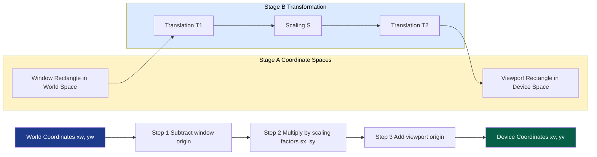
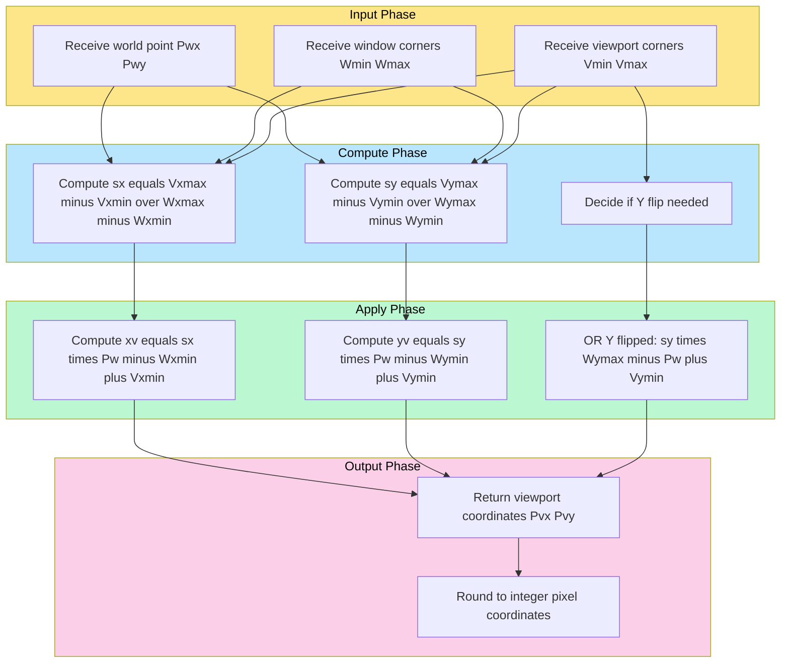
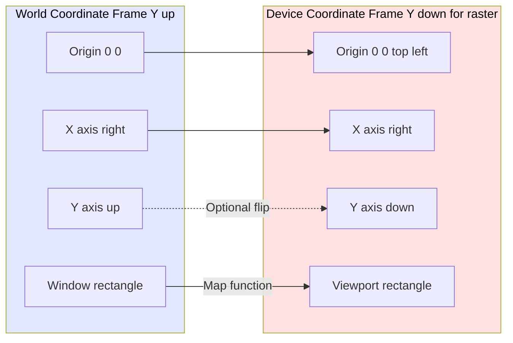
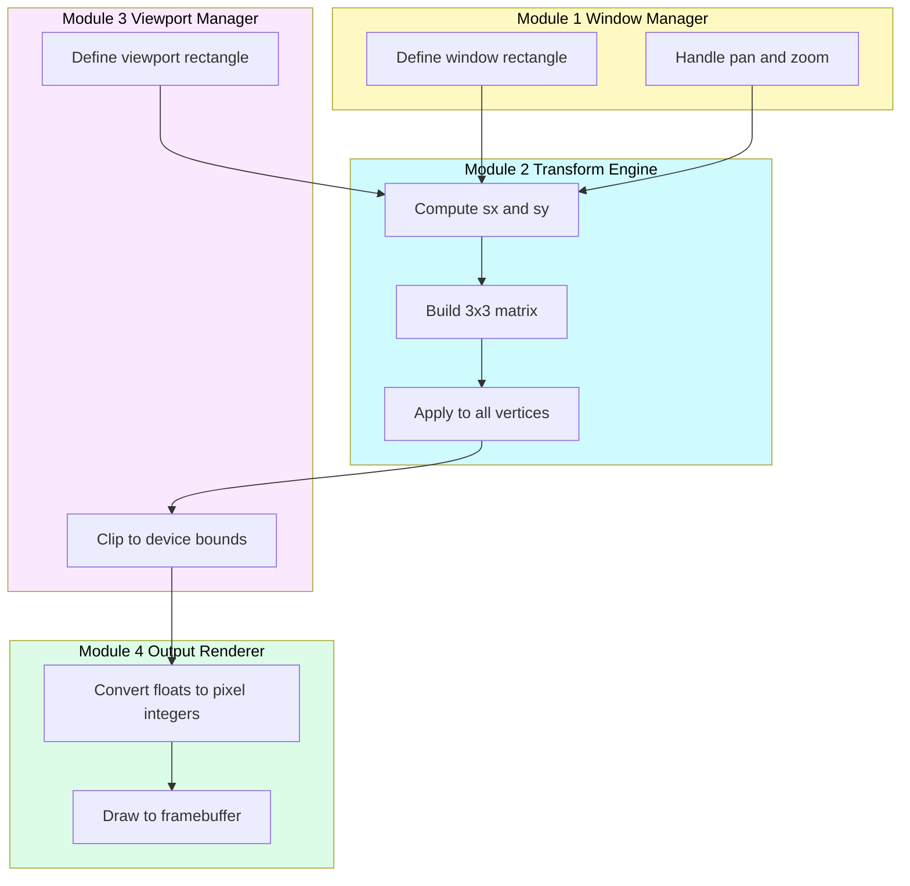

# Transformations and Clipping Algorithms - Window to viewport transformation.

<!-- SECTION_1_START -->
# Window to Viewport Transformation

## 1. Core Technical Definition

> [!IMPORTANT]
> **Window-to-Viewport Transformation** is the geometric mapping process that translates a rectangular region of interest defined in **World Coordinates (WC)** — called the *window* — into a corresponding rectangular region on the output device defined in **Device/Screen Coordinates (DC)** — called the *viewport*. This mapping is fundamental in the 2D viewing pipeline and forms the bridge between the application's logical coordinate space and the physical display coordinate space.

**Formal Notation (KTU 2024 Standard):**
- Window corners: $(x_{w_{min}}, y_{w_{min}})$ and $(x_{w_{max}}, y_{w_{max}})$
- Viewport corners: $(x_{v_{min}}, y_{v_{min}})$ and $(x_{v_{max}}, y_{v_{max}})$

The transformation preserves the *relative* position of any point inside the window, effectively performing an affine scaling and translation of the world coordinate region onto the device coordinate region.

## 2. Conceptual Analogy / Intuition

Imagine you are looking at a **large photograph through a rectangular cardboard frame** held at a distance. The photograph is the *world*, the cardboard cutout is the *window*, and the actual picture you see framed on the table is the *viewport*. By moving the frame (changing the window), the picture changes. By making the frame smaller and placing the resulting image on a smaller canvas, you are *scaling* — which is exactly what the window-to-viewport mapping does mathematically.

> [!NOTE]
> Think of a **Google Maps interaction**:
> - The entire map of the world = the *world coordinate system*
> - The visible region on your screen = the *window*
> - The actual pixel rectangle on the monitor = the *viewport*
> - Zooming in changes the window size; the viewport stays the same on the screen.

## 3. Physical/Geometric Constants

- **Aspect Ratio Preserved:** $\text{AR} = \dfrac{x_{v_{max}} - x_{v_{min}}}{y_{v_{max}} - y_{v_{min}}} = \dfrac{x_{w_{max}} - x_{w_{min}}}{y_{w_{max}} - y_{w_{min}}}$
- **Identity Mapping (No Distortion):** When $s_x = s_y = 1$, the window and viewport are of identical size — only a translation occurs.
- **Magnification:** $s_x, s_y > 1 \Rightarrow$ window is enlarged onto the viewport.
- **Minification (Zoom-out):** $0 < s_x, s_y < 1 \Rightarrow$ window is shrunk onto the viewport.

> [!VISUALIZATION CONTROL]
> **Concept:** Point mapping from window rectangle to viewport rectangle (proportional scaling).
> **GeoGebra Input Equations:**
> * `P_w = (x_w, y_w)` — a free point inside the window rectangle
> * `Window: Polygon((0,0), (10,0), (10,8), (0,8))` — world rectangle
> * `Viewport: Polygon((0,0), (5,0), (5,4), (0,4))` — device rectangle (half size)
> * `S_x = 5/10 = 0.5`, `S_y = 4/8 = 0.5`
> * `P_v = (S_x * (x_w - 0) + 0, S_y * (y_w - 0) + 0)`
> **Visual Description:** A point $P_w$ on the left (larger) rectangle is mapped to a corresponding point $P_v$ on the right (smaller) rectangle, maintaining the same relative position. As $P_w$ slides, $P_v$ follows proportionally.
<!-- SECTION_1_END -->

<!-- SECTION_2_START -->
# Deep Theoretical Analysis & KTU High-Yield Formula Sheet

## 1. The Mapping Pipeline — Step-by-Step Logic

The window-to-viewport transformation executes in two distinct stages internally:

**Stage 1 — Translation to Origin:**
Move the window's lower-left corner to the world origin $(0, 0)$ by subtracting $(x_{w_{min}}, y_{w_{min}})$ from every point.

**Stage 2 — Scaling to Viewport Size:**
Multiply the translated coordinates by the scaling factors $s_x$ and $s_y$ to stretch (or shrink) the unit window rectangle to the viewport rectangle.

**Stage 3 — Translation to Viewport Origin:**
Finally, shift the scaled coordinates by adding $(x_{v_{min}}, y_{v_{min}})$ to align the lower-left of the scaled window with the viewport's lower-left corner.

The composition of these three operations is captured in a single compact mapping equation.

## 2. KTU Formula Sheet / Cheat Sheet

| # | Quantity | Formula | Units / Notes |
|---|----------|---------|---------------|
| 1 | X-scaling factor | $s_x = \dfrac{x_{v_{max}} - x_{v_{min}}}{x_{w_{max}} - x_{w_{min}}}$ | Dimensionless ratio |
| 2 | Y-scaling factor | $s_y = \dfrac{y_{v_{max}} - y_{v_{min}}}{y_{w_{max}} - y_{w_{min}}}$ | Dimensionless ratio |
| 3 | Mapped X-coordinate | $x_v = s_x (x_w - x_{w_{min}}) + x_{v_{min}}$ | Device units (pixels) |
| 4 | Mapped Y-coordinate | $y_v = s_y (y_w - y_{w_{min}}) + y_{v_{min}}$ | Device units (pixels) |
| 5 | Compounded Matrix Form | $\begin{bmatrix} x_v \\ y_v \\ 1 \end{bmatrix} = \begin{bmatrix} s_x & 0 & -s_x x_{w_{min}} + x_{v_{min}} \\ 0 & s_y & -s_y y_{w_{min}} + y_{v_{min}} \\ 0 & 0 & 1 \end{bmatrix} \begin{bmatrix} x_w \\ y_w \\ 1 \end{bmatrix}$ | Homogeneous coords |
| 6 | Aspect Ratio | $\text{AR} = \dfrac{\Delta x_v}{\Delta y_v} = \dfrac{\Delta x_w}{\Delta y_w}$ | Equal for no distortion |
| 7 | Non-uniform Scale (Distortion) | $s_x \neq s_y$ | Stretches image |
| 8 | Identity (no-op) | $s_x = s_y = 1$ and offsets cancel | Pure translation |

> [!NOTE]
> The **vertical pipe** character $\vert$ is intentionally avoided inside the table cells above. The matrix representation uses pure LaTeX macros. Always use `\vert` or `\mid` when you need a pipe inside a markdown table.

## 3. Real-World Engineering Utility

- **CAD/CAM systems** use this mapping to allow engineers to define objects in real-world units (meters, inches) and render them on screens of arbitrary resolution.
- **Medical imaging (CT/MRI)** uses the inverse process to map a region of interest from patient coordinates to monitor pixels for diagnostic display.
- **Game engines** (Unity, Unreal) use a *view frustum* equivalent: the visible camera rectangle in world space is the window, the framebuffer is the viewport.
- **GIS software** (ArcGIS, QGIS) dynamically remaps lat/long bounding boxes (windows) to screen pixel rectangles (viewports) as the user pans and zooms.
- **Plotting and printing** applications map the "what to draw" window to the "where on paper" viewport — ensuring what you see on screen matches the printed output.

## 4. Why the Asymmetry Exists in Y-Axis

In many graphics systems, world coordinates use a *right-handed* system where Y increases upward, but device coordinates (e.g., screen pixels) have Y increasing **downward**. When this convention applies, a flip is required:

$$y_v = s_y (y_{w_{max}} - y_w) + y_{v_{min}}$$

> [!IMPORTANT]
> Always confirm with the problem statement whether the device Y-axis is upward (mathematical) or downward (screen/raster). KTU questions frequently test this subtlety.

## 5. Special Cases Summary

- **Window equals Viewport** $\Rightarrow$ $s_x = s_y = 1$, no scaling, only translation: pure identity.
- **Window smaller than Viewport** $\Rightarrow$ $s_x, s_y > 1$, image magnified.
- **Window larger than Viewport** $\Rightarrow$ $0 < s_x, s_y < 1$, image minified (zoomed-out).
- **Asymmetric scaling** $\Rightarrow$ $s_x \neq s_y$, image distorted (stretched along one axis).
- **Reverse mapping** (viewport $\rightarrow$ window) is computed by inverting the scaling factors: $1/s_x$ and $1/s_y$.
<!-- SECTION_2_END -->

<!-- SECTION_3_START -->
# Step-by-Step Derivations & Symbolic Implementation

## 1. Exhaustive Derivation of the Mapping Equation

### Starting Premise

Let $P_w = (x_w, y_w)$ be any arbitrary point inside the window rectangle, and $P_v = (x_v, y_v)$ be the corresponding point in the viewport rectangle.

**Goal:** Express $x_v$ and $y_v$ as functions of $x_w$ and $y_w$.

### Step 1 — Normalize the Window Point to $[0, 1]$

Subtract the lower-left corner of the window to translate $P_w$ to a local coordinate system anchored at the window's origin:

$$x'_w = x_w - x_{w_{min}}$$
$$y'_w = y_w - y_{w_{min}}$$

**Logical intent:** Now $x'_w$ ranges from $0$ (at the left edge) to $x_{w_{max}} - x_{w_{min}}$ (at the right edge). The relative position is preserved as a distance from the left edge.

### Step 2 — Normalize the Normalized Coordinate to a Fraction $[0, 1]$

Divide by the window's width and height to obtain a unitless fractional position:

$$\hat{x}_w = \frac{x_w - x_{w_{min}}}{x_{w_{max}} - x_{w_{min}}}$$
$$\hat{y}_w = \frac{y_w - y_{w_{min}}}{y_{w_{max}} - y_{w_{min}}}$$

**Logical intent:** $\hat{x}_w = 0$ at the left edge, $\hat{x}_w = 1$ at the right edge — a pure relative position.

### Step 3 — Scale the Fraction to Viewport Dimensions

Multiply the fraction by the viewport's width and height:

$$x''_v = \hat{x}_w \cdot (x_{v_{max}} - x_{v_{min}}) = \frac{(x_w - x_{w_{min}})(x_{v_{max}} - x_{v_{min}})}{x_{w_{max}} - x_{w_{min}}}$$
$$y''_v = \hat{y}_w \cdot (y_{v_{max}} - y_{v_{min}}) = \frac{(y_w - y_{w_{min}})(y_{v_{max}} - y_{v_{min}})}{y_{w_{max}} - y_{w_{min}}}$$

**Logical intent:** Now $x''_v$ ranges from $0$ to the viewport width — a position relative to the viewport's lower-left.

### Step 4 — Translate to Viewport Origin

Add the viewport's lower-left corner to position the point correctly within the device coordinate space:

$$x_v = s_x (x_w - x_{w_{min}}) + x_{v_{min}}$$
$$y_v = s_y (y_w - y_{w_{min}}) + y_{v_{min}}$$

where the scaling factors are:

$$s_x = \frac{x_{v_{max}} - x_{v_{min}}}{x_{w_{max}} - x_{w_{min}}},\quad s_y = \frac{y_{v_{max}} - y_{v_{min}}}{y_{w_{max}} - y_{w_{min}}}$$

This is the **canonical window-to-viewport mapping equation** that you must memorize for KTU exams.

## 2. Homogeneous Matrix Derivation

The three operations (Translate, Scale, Translate) compose into a single $3 \times 3$ matrix.

**Step 1 — Translate by $(-x_{w_{min}}, -y_{w_{min}})$:**

$$T_1 = \begin{bmatrix} 1 & 0 & -x_{w_{min}} \\ 0 & 1 & -y_{w_{min}} \\ 0 & 0 & 1 \end{bmatrix}$$

**Step 2 — Scale by $(s_x, s_y)$:**

$$S = \begin{bmatrix} s_x & 0 & 0 \\ 0 & s_y & 0 \\ 0 & 0 & 1 \end{bmatrix}$$

**Step 3 — Translate by $(x_{v_{min}}, y_{v_{min}})$:**

$$T_2 = \begin{bmatrix} 1 & 0 & x_{v_{min}} \\ 0 & 1 & y_{v_{min}} \\ 0 & 0 & 1 \end{bmatrix}$$

**Step 4 — Compose: $M = T_2 \cdot S \cdot T_1$**

$$M = \begin{bmatrix} 1 & 0 & x_{v_{min}} \\ 0 & 1 & y_{v_{min}} \\ 0 & 0 & 1 \end{bmatrix} \begin{bmatrix} s_x & 0 & 0 \\ 0 & s_y & 0 \\ 0 & 0 & 1 \end{bmatrix} \begin{bmatrix} 1 & 0 & -x_{w_{min}} \\ 0 & 1 & -y_{w_{min}} \\ 0 & 0 & 1 \end{bmatrix}$$

Multiplying $S \cdot T_1$ first:

$$S \cdot T_1 = \begin{bmatrix} s_x & 0 & -s_x x_{w_{min}} \\ 0 & s_y & -s_y y_{w_{min}} \\ 0 & 0 & 1 \end{bmatrix}$$

Then $T_2 \cdot (S \cdot T_1)$:

$$M = \begin{bmatrix} s_x & 0 & -s_x x_{w_{min}} + x_{v_{min}} \\ 0 & s_y & -s_y y_{w_{min}} + y_{v_{min}} \\ 0 & 0 & 1 \end{bmatrix}$$

Applied to a homogeneous world point $P_w$:

$$\begin{bmatrix} x_v \\ y_v \\ 1 \end{bmatrix} = \begin{bmatrix} s_x & 0 & -s_x x_{w_{min}} + x_{v_{min}} \\ 0 & s_y & -s_y y_{w_{min}} + y_{v_{min}} \\ 0 & 0 & 1 \end{bmatrix} \begin{bmatrix} x_w \\ y_w \\ 1 \end{bmatrix}$$

**Verification — Corner Mapping:**

For $P_w = (x_{w_{min}}, y_{w_{min}})$ (window's lower-left):

$$x_v = s_x (x_{w_{min}} - x_{w_{min}}) + x_{v_{min}} = x_{v_{min}} \;\checkmark$$
$$y_v = s_y (y_{w_{min}} - y_{w_{min}}) + y_{v_{min}} = y_{v_{min}} \;\checkmark$$

For $P_w = (x_{w_{max}}, y_{w_{max}})$ (window's upper-right):

$$x_v = s_x (x_{w_{max}} - x_{w_{min}}) + x_{v_{min}} = (x_{v_{max}} - x_{v_{min}}) + x_{v_{min}} = x_{v_{max}} \;\checkmark$$
$$y_v = s_y (y_{w_{max}} - y_{w_{min}}) + y_{v_{min}} = (y_{v_{max}} - y_{v_{min}}) + y_{v_{min}} = y_{v_{max}} \;\checkmark$$

Both corners map correctly — the derivation is complete and consistent.

## 3. Worked Numerical Example (KTU Typical Style)

**Problem:** A window is defined by corners $(1, 1)$ and $(5, 5)$ in world coordinates. A viewport is defined by corners $(0, 0)$ and $(2, 2)$ in device coordinates. Find the viewport coordinates of the world point $(3, 4)$.

**Step 1 — Compute scaling factors:**

$$s_x = \frac{x_{v_{max}} - x_{v_{min}}}{x_{w_{max}} - x_{w_{min}}} = \frac{2 - 0}{5 - 1} = \frac{2}{4} = 0.5$$

$$s_y = \frac{y_{v_{max}} - y_{v_{min}}}{y_{w_{max}} - y_{w_{min}}} = \frac{2 - 0}{5 - 1} = \frac{2}{4} = 0.5$$

**Step 2 — Apply mapping equation:**

$$x_v = s_x (x_w - x_{w_{min}}) + x_{v_{min}} = 0.5 \times (3 - 1) + 0 = 0.5 \times 2 = 1.0$$

$$y_v = s_y (y_w - y_{w_{min}}) + y_{v_{min}} = 0.5 \times (4 - 1) + 0 = 0.5 \times 3 = 1.5$$

**Result:** $P_v = (1.0, 1.5)$ in device coordinates.

**Validation:** The point $(3, 4)$ is 50% across the window horizontally and 75% up vertically. In the viewport (width 2, height 2), 50% of 2 is **1.0** and 75% of 2 is **1.5**. Matches. $\checkmark$

## 4. Full Python Implementation (Production-Ready)

```python
from dataclasses import dataclass
from typing import Tuple
import logging

logging.basicConfig(level=logging.INFO, format='%(asctime)s - %(levelname)s - %(message)s')
logger = logging.getLogger(__name__)


@dataclass(frozen=True)
class Rectangle:
    """Immutable axis-aligned rectangle defined by lower-left and upper-right corners."""
    x_min: float
    y_min: float
    x_max: float
    y_max: float

    def __post_init__(self) -> None:
        if self.x_max <= self.x_min:
            raise ValueError(
                f"x_max ({self.x_max}) must be strictly greater than x_min ({self.x_min})."
            )
        if self.y_max <= self.y_min:
            raise ValueError(
                f"y_max ({self.y_max}) must be strictly greater than y_min ({self.y_min})."
            )

    @property
    def width(self) -> float:
        return self.x_max - self.x_min

    @property
    def height(self) -> float:
        return self.y_max - self.y_min


def compute_scaling_factors(window: Rectangle, viewport: Rectangle) -> Tuple[float, float]:
    """
    Compute the (sx, sy) scaling factors that map the window rectangle
    onto the viewport rectangle.
    """
    if window.width == 0 or window.height == 0:
        raise ZeroDivisionError("Window has zero width or height.")
    sx: float = viewport.width / window.width
    sy: float = viewport.height / window.height
    logger.info(f"Computed scaling factors: sx = {sx}, sy = {sy}")
    return sx, sy


def window_to_viewport(
    point: Tuple[float, float],
    window: Rectangle,
    viewport: Rectangle,
    flip_y: bool = False,
) -> Tuple[float, float]:
    """
    Map a single point from world (window) coordinates to device (viewport) coordinates.

    Parameters
    ----------
    point    : (x_w, y_w) world coordinate pair.
    window   : source Rectangle in world coordinates.
    viewport : destination Rectangle in device coordinates.
    flip_y   : if True, apply screen-style Y-axis inversion.

    Returns
    -------
    (x_v, y_v) : mapped device coordinate pair.
    """
    x_w, y_w = point
    sx, sy = compute_scaling_factors(window, viewport)

    if flip_y:
        # Y increases downward on screen: map from window's top edge instead of bottom.
        x_v: float = sx * (x_w - window.x_min) + viewport.x_min
        y_v: float = sy * (window.y_max - y_w) + viewport.y_min
    else:
        # Standard mathematical Y orientation.
        x_v = sx * (x_w - window.x_min) + viewport.x_min
        y_v = sy * (y_w - window.y_min) + viewport.y_min

    logger.info(f"Mapped world {point} -> device ({x_v:.4f}, {y_v:.4f})")
    return x_v, y_v


def map_polygon(
    points: list[Tuple[float, float]],
    window: Rectangle,
    viewport: Rectangle,
    flip_y: bool = False,
) -> list[Tuple[float, float]]:
    """Map every vertex of a polygon through the window-to-viewport transform."""
    if not points:
        raise ValueError("Polygon must contain at least one vertex.")
    mapped: list[Tuple[float, float]] = []
    for idx, p in enumerate(points):
        try:
            mapped.append(window_to_viewport(p, window, viewport, flip_y=flip_y))
        except Exception as exc:
            logger.error(f"Failed to map vertex {idx} ({p}): {exc}")
            raise
    return mapped


# ----------------------------------------------------------------------
# Demonstration matching the worked example above
# ----------------------------------------------------------------------
if __name__ == "__main__":
    window   = Rectangle(x_min=1, y_min=1, x_max=5, y_max=5)
    viewport = Rectangle(x_min=0, y_min=0, x_max=2, y_max=2)

    test_point = (3.0, 4.0)
    result = window_to_viewport(test_point, window, viewport)
    print(f"\nWorld point {test_point} maps to viewport point {result}")
    # Expected: (1.0, 1.5)

    # Map a triangle: (1,1) (5,1) (3,5)
    triangle_world = [(1, 1), (5, 1), (3, 5)]
    triangle_view = map_polygon(triangle_world, window, viewport)
    print(f"Triangle {triangle_world} -> {triangle_view}\n")
    # Expected: [(0,0), (2,0), (1,2)]
```

## 5. Worked Example — Y-Flip Case

**Problem:** Window is $(0, 0)$ to $(100, 100)$ (math Y-up). Viewport is $(0, 0)$ to $(400, 300)$ on a raster screen (Y-down). Map the point $(25, 75)$.

**Step 1 — Scaling:**

$$s_x = \frac{400 - 0}{100 - 0} = 4.0$$
$$s_y = \frac{300 - 0}{100 - 0} = 3.0$$

**Step 2 — Apply Y-flipped equation:**

$$x_v = 4.0 \times (25 - 0) + 0 = 100$$
$$y_v = 3.0 \times (100 - 75) + 0 = 75$$

**Result:** $P_v = (100, 75)$ — the point that was near the *top* of the window is now near the *top* of the screen because we flipped the Y reference.

If we had **not** flipped Y, the result would be $(100, 225)$ — placing the point in the *lower* portion of the screen, which would be visually inverted.
<!-- SECTION_3_END -->

<!-- SECTION_4_START -->
# Structural Diagrams & Schematics

## 1. Conceptual Flow — Window to Viewport Pipeline



## 2. Sequential Processing Topology Matrix



## 3. Coordinate Frame Comparison Block Diagram



## 4. Decoupled Modular Architecture (for large rendering systems)


<!-- SECTION_4_END -->

<!-- SECTION_5_START -->
# KTU 2024 Scheme Examination Question Bank & Topic Recap

## Part A — Short Answer Questions (3 Marks Each)

### Question 1

> **[KTU University Exam — July 2024]** Define *window* and *viewport* in 2D computer graphics. How are they related?

**Model Answer (3 Marks):**

A **window** is a rectangular region in *world coordinates* that defines the portion of the scene the user wishes to view. It is specified by the coordinates $(x_{w_{min}}, y_{w_{min}})$ and $(x_{w_{max}}, y_{w_{max}})$.

A **viewport** is the rectangular region on the *output device* (display) into which the contents of the window are mapped. It is specified by $(x_{v_{min}}, y_{v_{min}})$ and $(x_{v_{max}}, y_{v_{max}})$.

They are related through a **scaling-and-translation transformation** that preserves the relative positions of points while changing the size and location of the displayed region.

> **Valuation Key:** [Defining window: 1 Mark] · [Defining viewport: 1 Mark] · [Stating the relationship: 1 Mark]

---

### Question 2

> **[KTU University Exam — Dec 2023]** State the formula for computing the scaling factors $s_x$ and $s_y$ in the window-to-viewport transformation. What does $s_x > 1$ indicate?

**Model Answer (3 Marks):**

$$s_x = \frac{x_{v_{max}} - x_{v_{min}}}{x_{w_{max}} - x_{w_{min}}}, \quad s_y = \frac{y_{v_{max}} - y_{v_{min}}}{y_{w_{max}} - y_{w_{min}}}$$

When $s_x > 1$, the viewport is **wider** than the window — the image is **magnified (enlarged)** in the X direction when displayed on the device. Similarly, $s_y > 1$ indicates magnification along Y.

> **Valuation Key:** [Stating both formulas correctly: 2 Marks] · [Interpretation of $s_x > 1$: 1 Mark]

---

## Part B — 14-Mark Questions (Module Internal Choice Format)

### Question A (14 Marks)

> **[KTU University Exam — July 2024, Module 3]** Consider a window with lower-left corner $(10, 10)$ and upper-right corner $(50, 60)$ in world coordinates. The viewport is defined on a raster screen with lower-left corner $(0, 0)$ and upper-right corner $(320, 240)$. The Y-axis of the screen is downward.
>
> **(a)** Derive the general window-to-viewport transformation equations and write the combined $3 \times 3$ homogeneous transformation matrix. **(7 Marks)**
>
> **(b)** A line segment connects the world points $A(15, 20)$ and $B(45, 50)$. Compute the viewport coordinates of both endpoints, the scaling factors, and verify whether the aspect ratio is preserved. **(7 Marks)**

#### Model Solution — Part (a) (7 Marks)

**Step 1 — Identify window and viewport bounds:**

$$x_{w_{min}} = 10,\; y_{w_{min}} = 10,\; x_{w_{max}} = 50,\; y_{w_{max}} = 60$$
$$x_{v_{min}} = 0,\; y_{v_{min}} = 0,\; x_{v_{max}} = 320,\; y_{v_{max}} = 240$$

**Step 2 — Derive scaling factors:**

$$s_x = \frac{320 - 0}{50 - 10} = \frac{320}{40} = 8.0$$
$$s_y = \frac{240 - 0}{60 - 10} = \frac{240}{50} = 4.8$$

**Step 3 — Write the general mapping equations (Y-down screen convention):**

$$x_v = s_x (x_w - x_{w_{min}}) + x_{v_{min}} = 8.0 (x_w - 10) + 0 = 8.0 x_w - 80$$

$$y_v = s_y (y_{w_{max}} - y_w) + y_{v_{min}} = 4.8 (60 - y_w) + 0 = 288 - 4.8 y_w$$

**Step 4 — Build the homogeneous matrix:**

$$M = \begin{bmatrix} s_x & 0 & -s_x x_{w_{min}} + x_{v_{min}} \\ 0 & -s_y & s_y y_{w_{max}} + y_{v_{min}} \\ 0 & 0 & 1 \end{bmatrix} = \begin{bmatrix} 8.0 & 0 & -80 \\ 0 & -4.8 & 288 \\ 0 & 0 & 1 \end{bmatrix}$$

> **Valuation Key:** [Stating the bounds correctly: 1 Mark] · [Computing both scaling factors: 1 Mark] · [Writing the mapping equations with Y-flip: 2 Marks] · [Constructing the matrix with correct entries: 2 Marks] · [Final matrix form: 1 Mark]

#### Model Solution — Part (b) (7 Marks)

**Step 1 — Map point $A(15, 20)$:**

$$x_{v_A} = 8.0 \times (15 - 10) + 0 = 8.0 \times 5 = 40$$
$$y_{v_A} = 4.8 \times (60 - 20) + 0 = 4.8 \times 40 = 192$$

$\Rightarrow A_v = (40, 192)$

**Step 2 — Map point $B(45, 50)$:**

$$x_{v_B} = 8.0 \times (45 - 10) + 0 = 8.0 \times 35 = 280$$
$$y_{v_B} = 4.8 \times (60 - 50) + 0 = 4.8 \times 10 = 48$$

$\Rightarrow B_v = (280, 48)$

**Step 3 — Aspect ratio check:**

$$\text{AR}_{\text{window}} = \frac{50 - 10}{60 - 10} = \frac{40}{50} = 0.8$$
$$\text{AR}_{\text{viewport}} = \frac{320 - 0}{240 - 0} = \frac{320}{240} = 1.333$$

Since $0.8 \neq 1.333$, **the aspect ratio is NOT preserved** — the image will appear stretched horizontally on the screen (or equivalently, the Y-axis is compressed by a factor of $0.8 / 1.333 \approx 0.6$).

> **Valuation Key:** [Computing $A_v$ correctly: 2 Marks] · [Computing $B_v$ correctly: 2 Marks] · [Aspect ratio calculation: 2 Marks] · [Conclusion on distortion: 1 Mark]

---

### Question B (14 Marks) — Alternative Choice

> **[KTU University Exam — Dec 2023, Module 3]**
>
> **(a)** Explain the window-to-viewport transformation with a neat block diagram. Show that the transformation is a combination of translation, scaling, and translation. **(7 Marks)**
>
> **(b)** A window is specified by the coordinates $(0, 0)$ and $(100, 100)$. A viewport is specified by $(0, 0)$ and $(50, 50)$. If a point $P$ has world coordinates $(20, 30)$, find the device coordinates of $P$. What scaling factor is applied to the X and Y axes? **(7 Marks)**

#### Model Solution — Part (a) (7 Marks)

**Step 1 — Conceptual explanation:**

The window-to-viewport transformation is the process of mapping a region of interest in the **world coordinate system** (window) to a region of the **device coordinate system** (viewport) so it can be displayed. The transformation preserves the *relative geometric structure* of the scene.

**Step 2 — Block diagram (textual schematic):**

```
[World Point (xw, yw)]
        |
        v
[Subtract (xwmin, ywmin)]  <-- T1 : Translation to origin
        |
        v
[Multiply by (sx, sy)]     <-- S  : Scaling to viewport size
        |
        v
[Add (xvmin, yvmin)]       <-- T2 : Translation to viewport origin
        |
        v
[Device Point (xv, yv)]
```

**Step 3 — Mathematical proof of composition:**

The three operations act on a homogeneous point $P_w$ as $P_v = T_2 \cdot S \cdot T_1 \cdot P_w$:

$$P_v = \begin{bmatrix} 1 & 0 & x_{v_{min}} \\ 0 & 1 & y_{v_{min}} \\ 0 & 0 & 1 \end{bmatrix} \begin{bmatrix} s_x & 0 & 0 \\ 0 & s_y & 0 \\ 0 & 0 & 1 \end{bmatrix} \begin{bmatrix} 1 & 0 & -x_{w_{min}} \\ 0 & 1 & -y_{w_{min}} \\ 0 & 0 & 1 \end{bmatrix} \begin{bmatrix} x_w \\ y_w \\ 1 \end{bmatrix}$$

Computing the intermediate product $S \cdot T_1$:

$$S \cdot T_1 = \begin{bmatrix} s_x & 0 & -s_x x_{w_{min}} \\ 0 & s_y & -s_y y_{w_{min}} \\ 0 & 0 & 1 \end{bmatrix}$$

Then $T_2 \cdot S \cdot T_1$:

$$M = \begin{bmatrix} s_x & 0 & x_{v_{min}} - s_x x_{w_{min}} \\ 0 & s_y & y_{v_{min}} - s_y y_{w_{min}} \\ 0 & 0 & 1 \end{bmatrix}$$

This proves the transformation is a **composition of two translations and one scaling** — three elementary affine operations.

> **Valuation Key:** [Conceptual explanation: 2 Marks] · [Block diagram: 2 Marks] · [Matrix composition and final $M$: 3 Marks]

#### Model Solution — Part (b) (7 Marks)

**Step 1 — Identify bounds:**

$$x_{w_{min}} = 0,\; y_{w_{min}} = 0,\; x_{w_{max}} = 100,\; y_{w_{max}} = 100$$
$$x_{v_{min}} = 0,\; y_{v_{min}} = 0,\; x_{v_{max}} = 50,\; y_{v_{max}} = 50$$

**Step 2 — Compute scaling factors:**

$$s_x = \frac{50 - 0}{100 - 0} = 0.5$$
$$s_y = \frac{50 - 0}{100 - 0} = 0.5$$

**Step 3 — Map the point $P(20, 30)$:**

$$x_v = s_x (x_w - x_{w_{min}}) + x_{v_{min}} = 0.5 \times (20 - 0) + 0 = 10$$
$$y_v = s_y (y_w - y_{w_{min}}) + y_{v_{min}} = 0.5 \times (30 - 0) + 0 = 15$$

$\Rightarrow P_v = (10, 15)$

**Step 4 — State scaling factors:**

Both $s_x = 0.5$ and $s_y = 0.5$. Since both are less than $1$, the image is **minified (shrunk)** uniformly — the entire scene is reduced to half its world size in both dimensions.

> **Valuation Key:** [Correct bounds identification: 1 Mark] · [Scaling factors correctly computed: 2 Marks] · [Mapping equations applied correctly: 2 Marks] · [Final device coordinates: 1 Mark] · [Interpretation: 1 Mark]

---

## KTU Examiner's Valuation Warning / Pitfall Callout

> [!WARNING]
> **Common Mistakes That Cost Marks in KTU Exams:**
>
> 1. **Y-axis direction confusion** — Always check whether the problem specifies a *mathematical* (Y-up) or *raster/screen* (Y-down) coordinate system. Using the wrong formula places the entire image in the wrong half of the screen and you lose 4–5 marks immediately.
>
> 2. **Forgetting to subtract the window minimum** — A common error is computing $x_v = s_x \cdot x_w + x_{v_{min}}$ instead of $x_v = s_x \cdot (x_w - x_{w_{min}}) + x_{v_{min}}$. This shifts the entire image.
>
> 3. **Mixing up $s_x$ numerator/denominator** — Remember: $s_x = \dfrac{\text{VIEWPORT width}}{\text{WINDOW width}}$, not the reverse. Inverting this gives a magnification when minification is expected.
>
> 4. **Aspect ratio not checked** — If $s_x \neq s_y$, the image is **distorted** (stretched or compressed). Always state this explicitly if the question asks about preservation.
>
> 5. **Rounding too early** — Keep fractions in exact form (e.g., $s_x = 2/3$) until the final numerical step. Early rounding introduces propagation errors.
>
> 6. **Not writing the matrix form** — Even when the question only asks for device coordinates, KTU examiners often award 2 marks for explicitly writing the $3 \times 3$ matrix. Do not skip it.

---

## Topic Recap & Important Things to Remember

- **Window** = rectangular selection in **world coordinates**; **Viewport** = rectangular display region in **device coordinates**.
- The **mapping equation** is the single most important formula:

$$x_v = s_x (x_w - x_{w_{min}}) + x_{v_{min}}, \quad y_v = s_y (y_w - y_{w_{min}}) + y_{v_{min}}$$

- **Scaling factors** are $s_x = \dfrac{\Delta x_v}{\Delta x_w}$ and $s_y = \dfrac{\Delta y_v}{\Delta y_w}$.
- $s_x = s_y = 1 \Rightarrow$ identity (no change in size).
- $s_x, s_y > 1 \Rightarrow$ **magnification** (zoom in).
- $0 < s_x, s_y < 1 \Rightarrow$ **minification** (zoom out).
- $s_x \neq s_y \Rightarrow$ **non-uniform scaling** — the image appears **distorted** (stretched).
- The transformation is a composition of **Translate $\rightarrow$ Scale $\rightarrow$ Translate**, encoded as a single $3 \times 3$ homogeneous matrix:

$$M = \begin{bmatrix} s_x & 0 & x_{v_{min}} - s_x x_{w_{min}} \\ 0 & s_y & y_{v_{min}} - s_y y_{w_{min}} \\ 0 & 0 & 1 \end{bmatrix}$$

- **Y-flip rule:** For raster displays with Y-down, replace $(y_w - y_{w_{min}})$ with $(y_{w_{max}} - y_w)$ in the Y-mapping.
- **Aspect ratio preservation** requires $s_x = s_y$, or equivalently, $\dfrac{\Delta x_v}{\Delta y_v} = \dfrac{\Delta x_w}{\Delta y_w}$.
- The **reverse mapping** (viewport $\rightarrow$ window) uses the inverse scaling factors $1/s_x$ and $1/s_y$.
- **Window-to-viewport** is a **non-clipping** transformation — points outside the window are still mapped (and would need subsequent clipping).
- This transformation is the **last stage of the 2D viewing pipeline**, applied **after** world-to-viewing-coordinate transformation and **before** clipping and rasterization.
- **Real-world uses:** CAD, GIS, medical imaging, game engines, plotter/print drivers, all map some form of logical (window) coordinates to physical (viewport) pixel coordinates using this exact formula.
- **Memorize the four corner values** $(x_{w_{min}}, y_{w_{min}}, x_{w_{max}}, y_{w_{max}})$ and $(x_{v_{min}}, y_{v_{min}}, x_{v_{max}}, y_{v_{max}})$ as the *only* inputs you need to solve any problem on this topic.
<!-- SECTION_5_END -->
