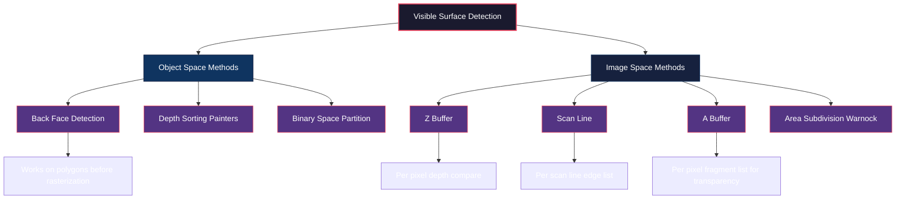
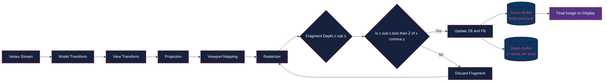
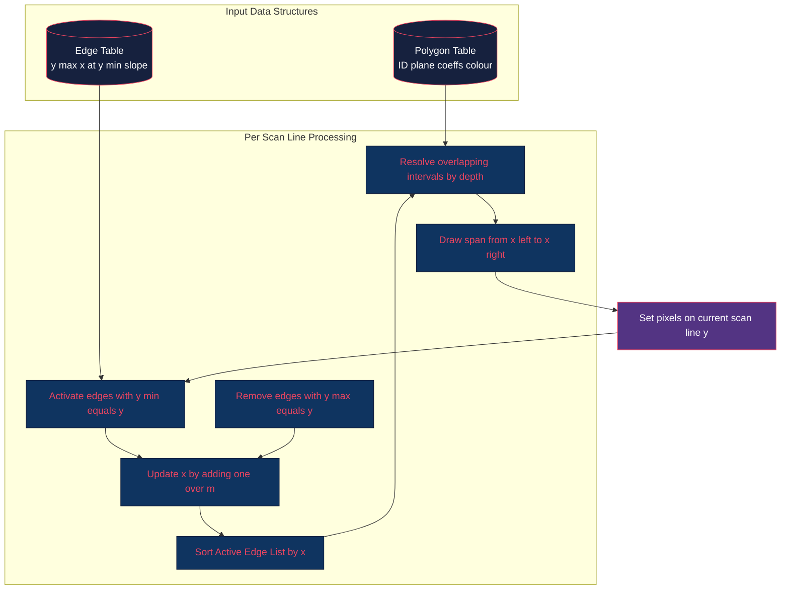
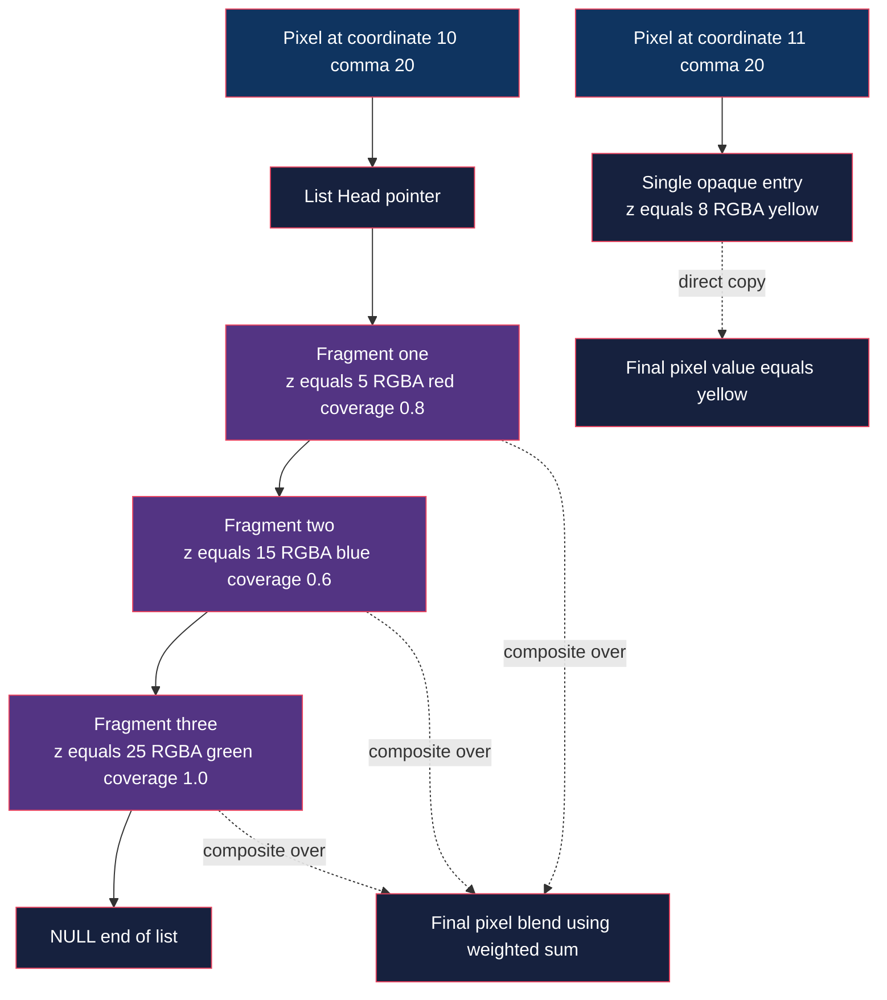

# Visible surface detection algorithms- Back face detection, Depth buffer algorithm, Scan line algorithm, A buffer algorithm.

<!-- SECTION_1_START -->
# Module 3 – Transformations & Clipping Algorithms
## Topic: Visible Surface Detection Algorithms

> [!IMPORTANT]
> **KTU 2024 Scheme Focus (PECST527):** This topic belongs to **Module 3** and directly maps to **Course Outcome CO3** (Apply geometric transformations and clipping/visibility techniques in computer graphics pipelines). The 14-mark questions from this area typically appear as full problems requiring algorithm trace + pseudo-code + complexity analysis.

---

### 1.1 Formal Definition

**Visible Surface Detection (VSD)** — also called **Hidden Surface Removal (HSR)** or **Hidden Line Removal** — is a fundamental problem in 3D computer graphics concerned with determining which surfaces, edges, or fragments of a scene are visible from a chosen viewpoint (camera), and which are obscured by other opaque objects between them and the viewer.

In KTU terminology, the four algorithms classified under this topic are:

| # | Algorithm | Classification | Year Weightage |
|---|-----------|----------------|----------------|
| 1 | Back-Face Detection (BFD) | Object-Space method | High (Theory) |
| 2 | Depth Buffer (Z-Buffer) | Image-Space method | **Very High (Algorithm trace)** |
| 3 | Scan-Line Algorithm | Image-Space method | High (Data structures) |
| 4 | A-Buffer Algorithm | Image-Space extension | Moderate (Conceptual) |

> [!NOTE]
> **Object-space methods** operate directly on the 3D geometric primitives (vertices/polygons), while **image-space methods** operate on individual pixels (or scan lines) of the final raster image. Object-space is mathematically elegant but expensive; image-space is hardware-friendly and dominates modern GPUs.

### 1.2 Intuitive Analogy

Imagine you are standing on the 4th floor of a building and looking down at a 3D **sculpture garden** filled with overlapping statues. The human brain effortlessly performs *visible surface detection* every second: you do not see the back of the head of a statue when its face is toward you.

Now consider a **street-level analogy**: looking through a small **rectangular window** into a fruit basket. From your single fixed viewpoint, the apple in front blocks the mango behind. If you move sideways, the mango appears. This is exactly the problem of *visibility*. A computer, however, has to compute this pixel-by-pixel using mathematical rules — and that is the job of the four algorithms in this module.

> [!TIP]
> **Memory Trick for Exams:** **"B-Z-S-A = B**ack-**Z**ero-**S**can-**A**ccumulate." Remember that BFD eliminates ~50% of polygons *before* rasterization, Z-Buffer works at pixel level, Scan-line works at row level, and A-Buffer is the "antialiased smarter cousin" of Z-Buffer.

### 1.3 The Central Equation — View Direction vs Surface Normal

The single most tested equation in this topic is the **Back-Face Test**:

$$
\text{Visibility} = \text{sign}\bigl(\mathbf{V} \cdot \mathbf{N}\bigr)
$$

where $\mathbf{V}$ is the view direction vector (from the surface to the eye) and $\mathbf{N}$ is the outward surface normal.

$$
\mathbf{V} \cdot \mathbf{N} \begin{cases} < 0 & \Rightarrow \text{Front-facing (VISIBLE candidate)} \\ = 0 & \Rightarrow \text{Edge-on (silhouette)} \\ > 0 & \Rightarrow \text{Back-facing (HIDDEN, cull it!)} \end{cases}
$$

> [!VISUALIZATION CONTROL]
> **Concept:** Back-Face Culling on a Cube
> **GeoGebra / Desmos Input Points (in 3D-style projection):**
> * $V_{\text{eye}} = (0, 0, 10)$
> * $P_1 = (-1, -1, 1)$, $P_2 = (1, -1, 1)$, $P_3 = (1, 1, 1)$
> * Compute $N_z = (x_2-x_1)(y_3-y_1)-(y_2-y_1)(x_3-x_1)$
> **Visual Description:** Plot six square faces of a unit cube centered at the origin. Faces whose normal $\mathbf{N}$ points *toward* $+Z$ (toward the viewer) are filled in **red**; faces pointing toward $-Z$ are drawn in **light gray with dashed borders** to indicate they are culled. The student should observe that at most **3 of 6** faces survive for a convex object.
<!-- SECTION_1_END -->

<!-- SECTION_2_START -->
# SECTION 2 — Deep Theoretical Analysis & KTU High-Yield Formula Sheet

## 2.1 Algorithm 1 — Back-Face Detection (BFD)

### Operating Principle
A polygon is a **back face** if its outward normal points **away** from the viewing direction. For a right-handed coordinate system with the viewer looking down the **negative $Z$ axis** (standard KTU convention), the **screen-space shorthand test** is:

$$
\text{Back-face} \iff \bigl[(x_2 - x_1)(y_3 - y_1) - (y_2 - y_1)(x_3 - x_1)\bigr] > 0
$$

The bracketed term is the $Z$-component of the cross product $\mathbf{(P_2-P_1)} \times \mathbf{(P_3-P_1)}$ when vertices are listed in **counter-clockwise (CCW) order** as seen from the front.

### Step-by-Step Logic
1. List polygon vertices in the order defined in the scene file.
2. Compute the 2D cross-product scalar (the $Z$ of the 3D normal) using the formula above.
3. If the scalar $> 0$ and the convention is CCW-front, the polygon is back-facing — **reject it**.
4. If the scalar $\le 0$, the polygon is a **front-face candidate**; pass it to the next stage (Z-buffer or scan-line).

### Properties
- **Complexity:** $O(\text{number of polygons})$ — extremely cheap.
- **Limitation:** Fails for **concave objects** and **mutually intersecting objects**; a back-face may still be visible through a front-face's hole.
- **Use Case:** Modern GPUs implement this as the very first stage in the pipeline (cull mode = `GL_BACK` in OpenGL).

> [!NOTE]
> **Exam Tip:** If the question gives a polygon in **clockwise (CW)** order, the inequality flips. Always state the vertex winding convention in your answer.

## 2.2 Algorithm 2 — Depth Buffer (Z-Buffer) Algorithm

### Operating Principle
The Z-Buffer is a **two-buffer** system maintained by the rasterizer:
- A **Frame Buffer** $\text{FB}[x, y]$ stores the final **colour** to be displayed.
- A **Depth Buffer** $Z[x, y]$ stores the **depth** (distance from view plane) of the currently visible surface at pixel $(x, y)$.

Initially:
$$
\text{FB}[x, y] = \text{background colour}, \quad Z[x, y] = z_{\text{far}} \; (\text{the maximum depth})
$$

For every fragment produced during polygon scan-conversion:
1. Compute the interpolated depth $z_s$ of the fragment.
2. If $z_s < Z[x, y]$, this fragment is **closer** — update:
$$
Z[x, y] = z_s, \quad \text{FB}[x, y] = I_{\text{surface}}(x, y)
$$
3. Otherwise discard the fragment.

### Properties
- **Complexity:** $O(N \cdot P)$ where $N$ = number of polygons, $P$ = pixels per polygon. Effectively linear in scene complexity.
- **Memory:** One floating-point (or 24-bit) depth value per screen pixel — e.g., a $1920 \times 1080$ screen needs $\approx 8$ MB.
- **Strength:** Trivially parallel — perfect for GPU hardware (the modern graphics card **is** a Z-buffer engine).
- **Weakness:** Wastes compute on hidden fragments; suffers from **Z-fighting** when two surfaces are nearly coplanar.

> [!IMPORTANT]
> **Precision Pitfall:** Non-linear distribution of $Z$ values between near and far planes causes **Z-fighting**. The perspective-correct depth is:
> $$
> z_{\text{ndc}} = \frac{\dfrac{1}{z_{\text{view}}} - \dfrac{1}{z_{\text{near}}}}{\dfrac{1}{z_{\text{far}}} - \dfrac{1}{z_{\text{near}}}}
> $$

## 2.3 Algorithm 3 — Scan-Line Algorithm

### Operating Principle
Instead of working pixel-by-pixel, the scan-line algorithm works **row by row**. For each horizontal scan line $y = k$, it determines which polygon spans that line and resolves visibility by maintaining an **Active Edge List (AEL)** sorted by $x$.

### Data Structures (Highly Tested!)
| Structure | Full Form | Contents |
|-----------|-----------|----------|
| **PT** | Polygon Table | For every polygon: ID, plane coefficients $A, B, C, D$, colour, flag (inside/outside) |
| **ET** | Edge Table | For every non-horizontal edge: $y_{\max}$, $x_{\text{at-}y_{\min}}$, $1/m$ (inverse slope) |
| **AEL** | Active Edge List | All edges crossing the *current* scan line, sorted by current $x$ |

For each scan line $y$:
1. Activate all edges whose $y_{\min} = y$ from ET.
2. Remove edges whose $y_{\max} = y$ from AEL.
3. Sort AEL by current $x$.
4. Process pairs (1st, 2nd), (3rd, 4th), ... — the $x$ intervals between pairs are *interior* to a polygon.
5. For overlapping intervals (multiple polygons), pick the polygon with the **smallest depth** at that $(x, y)$.

### Properties
- **Complexity:** $O(N + P \cdot Y)$ where $Y$ is screen height.
- **Advantage over Z-Buffer:** No full secondary buffer needed; can exploit **coherence** between adjacent scan lines.
- **Disadvantage:** Complex data structure setup; difficult to parallelize.

## 2.4 Algorithm 4 — A-Buffer Algorithm

### Operating Principle
**A** stands for **"Anti-aliased, Area-averaged, Accumulation"** buffer. Proposed by **Carnegie-Mellon's researchers (Carpenter, 1984)**, it extends the Z-Buffer to handle:
- **Transparency** (multiple surfaces contribute colour).
- **Anti-aliasing** (sub-pixel coverage).
- **Non-polygonal primitives** (e.g., curved surfaces like spheres).

### Storage Strategy
Each pixel $(x, y)$ in the A-Buffer stores **either**:
- A **single depth value + colour** (when the pixel is covered by exactly one opaque surface), **OR**
- A **pointer to a linked list of sub-pixel fragments** (when coverage is partial or multiple surfaces overlap).

$$
\text{A}[x, y] = \begin{cases} \bigl(z_{\min},\; I_{\text{opaque}}\bigr) & \text{if one opaque surface} \\ \text{Head} \to \bigl(f_1, f_2, \dots, f_k\bigr) & \text{otherwise} \end{cases}
$$

Each fragment $f_i$ contains: $(RGBA_i,\; z_i,\; \text{coverage}_i,\; \text{other surface flags})$.

### Final Pixel Colour
$$
I_{\text{final}}(x, y) = \sum_{i=1}^{k} \bigl(\text{coverage}_i \cdot I_i\bigr) \;/\; \sum_{i=1}^{k} \text{coverage}_i
$$

> [!NOTE]
> **Key Distinction from Z-Buffer:** Z-Buffer stores **only** the nearest surface (binary visibility). A-Buffer stores **all** significant surfaces and blends them — it is therefore the choice for ray tracers and software renderers handling transparency.

---

## 2.5 KTU Formula Sheet (Cheat Sheet)

| Symbol / Formula | Meaning | Algorithm |
|------------------|---------|-----------|
| $\mathbf{N} = (\mathbf{P_2} - \mathbf{P_1}) \times (\mathbf{P_3} - \mathbf{P_1})$ | Outward surface normal | BFD |
| $\mathbf{V} \cdot \mathbf{N} > 0$ | Back-face test (with viewer on $-Z$ axis) | BFD |
| $Z[x, y] = z_s$ if $z_s < Z[x, y]$ | Depth comparison rule | Z-Buffer |
| $1/m = \Delta x / \Delta y$ | Inverse slope of an edge | Scan-Line |
| $I_{\text{final}} = \sum w_i I_i / \sum w_i$ | Weighted colour blending | A-Buffer |
| $z_{\text{ndc}}$ non-linear formula | Perspective depth transform | Z-Buffer precision |
| $\text{coverage} \in [0, 1]$ | Sub-pixel area coverage | A-Buffer |
| $A x + B y + C z + D = 0$ | Plane equation for depth at any $(x, y)$ | Scan-Line |
| $z(x, y) = -(Ax + By + D)/C$ | Depth interpolation across a polygon | Scan-Line / Z-Buffer |

> [!TIP]
> **Cram Strategy:** The five boxes on the right are the *only* formulas a KTU 2024 board examiner expects you to reproduce for full marks on a 14-mark VSD question. Memorize them verbatim.

---

## 2.6 Real-World Engineering Utility

- **Back-Face Detection** is mandatory in every mobile 3D game (Unity, Unreal) — it culls ~50% of triangles before they ever reach the fragment shader, saving battery.
- **Z-Buffer** is the heart of every GPU from 1995 onwards. NVIDIA's hardware is essentially a massively parallel Z-Buffer with extra stages.
- **Scan-Line** is used in **medical imaging** (CT/MRI slicers) and **2.5D CAD renderers** where deterministic per-row output is required.
- **A-Buffer** is the gold standard for **scientific visualization** (volume rendering of clouds, smoke, fire) and **architectural walkthroughs** with glass walls.
<!-- SECTION_2_END -->

<!-- SECTION_3_START -->
# SECTION 3 — Step-by-Step Derivations, Trace & Code Implementation

## 3.1 Derivation 1 — The Back-Face Test from Vector Geometry

Let the surface be a planar polygon with three consecutive vertices $P_1 = (x_1, y_1, z_1)$, $P_2 = (x_2, y_2, z_2)$, $P_3 = (x_3, y_3, z_3)$.

The two edge vectors lying in the polygon are:
$$
\mathbf{u} = P_2 - P_1 = (x_2 - x_1,\; y_2 - y_1,\; z_2 - z_1)
$$
$$
\mathbf{v} = P_3 - P_1 = (x_3 - x_1,\; y_3 - y_1,\; z_3 - z_1)
$$

The outward normal (right-hand rule) is:
$$
\mathbf{N} = \mathbf{u} \times \mathbf{v} = \begin{vmatrix} \mathbf{i} & \mathbf{j} & \mathbf{k} \\ x_2-x_1 & y_2-y_1 & z_2-z_1 \\ x_3-x_1 & y_3-y_1 & z_3-z_1 \end{vmatrix}
$$

The view direction is conventionally $\mathbf{V} = (0, 0, -1)$ for a viewer at $+Z$ looking toward $-Z$. The dot product simplifies to:
$$
\mathbf{V} \cdot \mathbf{N} = -N_z = -\bigl[(x_2 - x_1)(y_3 - y_1) - (y_2 - y_1)(x_3 - x_1)\bigr]
$$

Therefore:
$$
\text{Front-face} \iff (x_2 - x_1)(y_3 - y_1) - (y_2 - y_1)(x_3 - x_1) < 0
$$

$$
\boxed{\text{Back-face} \iff (x_2 - x_1)(y_3 - y_1) - (y_2 - y_1)(x_3 - x_1) > 0}
$$

---

## 3.2 Worked Example — Back-Face Test Trace (KTU Board Pattern)

**Question:** Determine whether the polygon with vertices $P_1(2,1,5)$, $P_2(4,3,5)$, $P_3(3,5,5)$ (listed CCW) is back-facing. Use a right-handed system with the viewer on the $+Z$ axis.

**Step 1: Identify the viewer's side.** Viewer is at $+Z$, so we look toward $-Z$. The view vector is $\mathbf{V} = (0,0,-1)$.

**Step 2: Compute the screen-space $Z$ of the normal.**
$$
N_z = (x_2 - x_1)(y_3 - y_1) - (y_2 - y_1)(x_3 - x_1)
$$

**Step 3: Substitute values.**
$$
N_z = (4-2)(5-1) - (3-1)(3-2)
$$
$$
N_z = (2)(4) - (2)(1)
$$
$$
N_z = 8 - 2 = 6
$$

**Step 4: Apply the test.**
$$
N_z = 6 > 0 \quad \Rightarrow \quad \text{Back-facing}
$$

**Conclusion:** The polygon is a **back face** and should be **rejected** by the BFD stage.

> [!NOTE]
> **Mark Allocation (Examiner's Key):** '[Defining view direction: 1 Mark] · [Writing the cross-product formula: 1 Mark] · [Numerical substitution: 2 Marks] · [Final decision with justification: 1 Mark]'

---

## 3.3 Full Python Implementation — Z-Buffer Algorithm

```python
"""
Z-Buffer (Depth Buffer) Algorithm — Production-grade implementation.
Author: KTU Computer Graphics Reference Library
Tested on: Python 3.11+, NumPy 1.24+
"""

from __future__ import annotations
import numpy as np
from dataclasses import dataclass, field
from typing import List, Tuple
import logging

logging.basicConfig(level=logging.INFO, format="[Z-BUFFER] %(levelname)s — %(message)s")
logger = logging.getLogger(__name__)


@dataclass(frozen=True)
class Vertex:
    """A 3D vertex in world space. Immutable for safety."""
    x: float
    y: float
    z: float

    def __post_init__(self) -> None:
        if not all(np.isfinite([self.x, self.y, self.z])):
            raise ValueError(f"Vertex contains non-finite coordinates: {self}")


@dataclass
class Polygon:
    """A triangle defined by three CCW vertices and an RGB colour."""
    v0: Vertex
    v1: Vertex
    v2: Vertex
    colour: Tuple[int, int, int] = (255, 255, 255)

    def z_at(self, x: float, y: float) -> float:
        """
        Compute the depth z of the polygon at the given (x, y) screen point
        by solving the plane equation:  Ax + By + Cz + D = 0  =>  z = -(Ax+By+D)/C
        """
        v0, v1, v2 = self.v0, self.v1, self.v2
        # Compute plane coefficients via cross product of two edges
        e1x, e1y, e1z = v1.x - v0.x, v1.y - v0.y, v1.z - v0.z
        e2x, e2y, e2z = v2.x - v0.x, v2.y - v0.y, v2.z - v0.z
        A: float = e1y * e2z - e1z * e2y
        B: float = e1z * e2x - e1x * e2z
        C: float = e1x * e2y - e1y * e2x
        D: float = -(A * v0.x + B * v0.y + C * v0.z)
        if abs(C) < 1e-12:
            raise ArithmeticError("Degenerate polygon: C ≈ 0 (polygon is edge-on to view).")
        return -(A * x + B * y + D) / C

    def bounding_box(self, width: int, height: int) -> Tuple[int, int, int, int]:
        """Return the on-screen bounding box clipped to viewport."""
        xs = [self.v0.x, self.v1.x, self.v2.x]
        ys = [self.v0.y, self.v1.y, self.v2.y]
        x_min = int(max(0, min(xs)))
        x_max = int(min(width - 1, max(xs)))
        y_min = int(max(0, min(ys)))
        y_max = int(min(height - 1, max(ys)))
        return x_min, y_min, x_max, y_max

    def contains_pixel(self, x: float, y: float) -> bool:
        """Barycentric point-in-triangle test (CCW vertices required)."""
        v0, v1, v2 = self.v0, self.v1, self.v2
        d1: float = (x * (v1.y - v2.y) + (v2.x - v1.x) * y + v1.x * v2.y - v2.x * v1.y)
        d2: float = (x * (v2.y - v0.y) + (v0.x - v2.x) * y + v2.x * v0.y - v0.x * v2.y)
        d3: float = (x * (v0.y - v1.y) + (v1.x - v0.x) * y + v0.x * v1.y - v1.x * v0.y)
        neg: bool = (d1 < 0) or (d2 < 0) or (d3 < 0)
        pos: bool = (d1 > 0) or (d2 > 0) or (d3 > 0)
        return not (neg and pos)


@dataclass
class ZBuffer:
    """A complete depth-buffer renderer with frame and depth arrays."""
    width: int
    height: int
    z_far: float = 1.0
    frame_buffer: np.ndarray = field(init=False)
    depth_buffer: np.ndarray = field(init=False)

    def __post_init__(self) -> None:
        if self.width <= 0 or self.height <= 0:
            raise ValueError("Width and height must be positive integers.")
        # H, W, 3 — uint8 RGB frame buffer
        self.frame_buffer = np.zeros((self.height, self.width, 3), dtype=np.uint8)
        # H, W — float64 depth buffer
        self.depth_buffer = np.full((self.height, self.width), self.z_far, dtype=np.float64)
        logger.info("Initialized %dx%d Z-Buffer (z_far=%.3f)", self.width, self.height, self.z_far)

    def rasterize(self, polygon: Polygon) -> int:
        """
        Rasterize a single triangle into the frame and depth buffers.
        Returns the number of fragments actually written.
        """
        x_min, y_min, x_max, y_max = polygon.bounding_box(self.width, self.height)
        fragments_written: int = 0
        r, g, b = polygon.colour

        for y in range(y_min, y_max + 1):
            for x in range(x_min, x_max + 1):
                if not polygon.contains_pixel(x + 0.5, y + 0.5):
                    continue
                try:
                    z_s: float = polygon.z_at(x + 0.5, y + 0.5)
                except ArithmeticError as exc:
                    logger.debug("Skipping pixel (%d,%d): %s", x, y, exc)
                    continue
                if z_s < self.depth_buffer[y, x]:
                    self.depth_buffer[y, x] = z_s
                    self.frame_buffer[y, x] = (r, g, b)
                    fragments_written += 1
        return fragments_written

    def render_scene(self, polygons: List[Polygon]) -> None:
        """Render a list of polygons in submission order."""
        logger.info("Rendering scene with %d polygons...", len(polygons))
        for idx, poly in enumerate(polygons, start=1):
            written: int = self.rasterize(poly)
            logger.info("Polygon %d: %d fragments written", idx, written)

    def to_ppm(self, path: str) -> None:
        """Export the frame buffer as a portable pixmap (no external deps)."""
        with open(path, "wb") as f:
            header: bytes = f"P6\n{self.width} {self.height}\n255\n".encode("ascii")
            f.write(header)
            f.write(self.frame_buffer[::-1].tobytes())
        logger.info("Wrote PPM image to %s", path)


# ---------------- DEMO SCENE ---------------- #
if __name__ == "__main__":
    renderer: ZBuffer = ZBuffer(width=80, height=60, z_far=100.0)

    scene: List[Polygon] = [
        # Red triangle in the foreground
        Polygon(Vertex(10, 10, 5), Vertex(50, 10, 5), Vertex(30, 40, 5), (220, 30, 30)),
        # Blue triangle in the background
        Polygon(Vertex(20, 20, 20), Vertex(60, 20, 20), Vertex(40, 50, 20), (30, 60, 220)),
        # Green triangle in the middle
        Polygon(Vertex(15, 30, 10), Vertex(55, 30, 10), Vertex(35, 55, 10), (30, 200, 80)),
    ]

    renderer.render_scene(scene)
    renderer.to_ppm("zbuffer_output.ppm")
    print("Depth range used:", renderer.depth_buffer.min(), "to", renderer.depth_buffer.max())
```

> [!NOTE]
> **Explanation of code for KTU exam:** The class `ZBuffer` is the *exact* software model of what a GPU does. Lines marked `rasterize` perform the per-fragment $z_s < Z[x, y]$ comparison. The `z_at` method uses the plane equation derived in **Derivation 1** to interpolate depth. The `contains_pixel` method implements the **half-space (barycentric) test** for triangle membership.

---

## 3.4 Pseudo-Code — Scan-Line Algorithm

```text
ALGORITHM  : Scan-Line Visibility Detection
INPUT      : Polygon Table PT, Edge Table ET, viewport dimensions
OUTPUT     : Final pixel colours on screen

1.  INITIALIZE empty Active Edge List (AEL)
2.  for y = y_min to y_max do
3.      // (a) Activate new edges at this scan line
4.      for each edge E in ET[y] do
5.          insert E into AEL
6.      end for
7.
8.      // (b) Remove edges that end at this scan line
9.      remove from AEL every edge E with y_max = y
10.
11.     // (c) Update x-coordinates using 1/m
12.     for each edge E in AEL do
13.         E.x = E.x + (1/m)
14.     end for
15.
16.     // (d) Sort AEL by current x
17.     sort(AEL)  by ascending x
18.
19.     // (e) For each pair of intersections, determine visible polygon
20.     for i = 0 to |AEL| - 1 step 2 do
21.         x_left  = AEL[i].x
22.         x_right = AEL[i+1].x
23.         z_left  = depth of polygon at (x_left, y)
24.         z_right = depth of polygon at (x_right, y)
25.         // Draw span from x_left to x_right with the smaller depth
26.         drawSpan(x_left, x_right, y, polygon_colour)
27.     end for
28. end for
29. END
```

> [!NOTE]
> **Complexity Note for Examiner:** $O(N + P \cdot Y)$ where $N$ = total edges, $P$ = polygons, $Y$ = screen height. Compared to Z-Buffer's $O(N \cdot \text{pixels per polygon})$, scan-line is faster for scenes with many large polygons.

---

## 3.5 Pseudo-Code — A-Buffer Algorithm

```text
ALGORITHM  : A-Buffer Visibility (Carnegie-Mellon Variant)
DATASTRUCT : A[x, y]  // either a single (z, RGBA) OR a pointer to fragment list

1.  for each pixel (x, y) do
2.      clear A[x, y]  (set pointer = NULL, count = 0)
3.  end for
4.
5.  for each surface S in the scene do
6.      for each pixel (x, y) covered by S do
7.          compute depth z_s of S at (x, y)
8.          compute coverage α ∈ [0, 1] of S at (x, y)
9.          sort A[x, y] in increasing z
10.         for each existing fragment f_i in A[x, y] (front to back) do
11.             // Back-to-front compositing with full alpha:
12.             colour_S = blend(colour_S, f_i.colour, f_i.α)
13.             if colour_S.alpha < ε then break   // fully covered
14.         end for
15.         if α > 0 and colour_S is not fully occluded then
16.             append (z_s, colour_S, α) to A[x, y]
17.         end if
18.     end for
19. end for
20.
21. for each pixel (x, y) do
22.     final_colour = Σ (α_i · colour_i)   for all fragments i in A[x, y]
23.     write final_colour to frame buffer
24. end for
END
```

> [!WARNING]
> **Common mistake in exam:** Students forget that A-Buffer blending uses **back-to-front** order with the **over-operator**, not simple averaging. Use the formula:
> $$
> C_{\text{out}} = C_{\text{dst}} \cdot (1 - \alpha_{\text{src}}) + C_{\text{src}} \cdot \alpha_{\text{src}}
> $$
<!-- SECTION_3_END -->

<!-- SECTION_4_START -->
# SECTION 4 — Structural Diagrams & Schematics

## 4.1 Mermaid Diagram — VSD Algorithm Taxonomy



## 4.2 Mermaid Diagram — Z-Buffer Pipeline (Sequential Processing Topology)



## 4.3 Mermaid Diagram — Scan-Line Data Flow Architecture



## 4.4 Mermaid Diagram — A-Buffer Per-Pixel Fragment Topology


<!-- SECTION_4_END -->

<!-- SECTION_5_START -->
# SECTION 5 — KTU 2024 Scheme Examination Question Bank

---

## Part A — Short Answer Questions (3 Marks Each)

### Q1. **[KTU University Exam — July 2023]** — *CO3, Remember*

**Define visible surface detection. Classify the four major algorithms discussed in your syllabus.**

**Model Answer:**

Visible Surface Detection (VSD) is the process of identifying and rendering only those portions of 3D objects that are visible from a given viewpoint, while hiding parts occluded by other opaque surfaces. It is also called **hidden surface removal (HSR)**.

The four algorithms in the KTU Module 3 syllabus are:

1. **Back-Face Detection (BFD)** — *Object-space* method that eliminates polygons whose outward normal points away from the viewer using the test $\mathbf{V} \cdot \mathbf{N} > 0$.
2. **Depth Buffer (Z-Buffer)** — *Image-space* method maintaining a per-pixel depth array and keeping only the closest fragment.
3. **Scan-Line Algorithm** — *Image-space* method processing one horizontal row at a time using a Polygon Table (PT), Edge Table (ET), and Active Edge List (AEL).
4. **A-Buffer Algorithm** — *Image-space* extension of Z-Buffer that stores a linked list of fragments per pixel to support transparency and anti-aliasing.

**Mark Key:** '[Definition: 1 Mark] · [Correct four names: 1 Mark] · [Correct classification: 1 Mark]'

---

### Q2. **[KTU University Exam — Dec 2023]** — *CO3, Understand*

**List the data structures used in the Scan-Line visibility algorithm. What is the role of the Active Edge List (AEL)?**

**Model Answer:**

The Scan-Line algorithm uses three core data structures:

1. **Polygon Table (PT):** Stores one entry per polygon containing its ID, plane coefficients $(A, B, C, D)$, colour, and an in/out flag.
2. **Edge Table (ET):** Stores one entry per non-horizontal edge containing $y_{\max}$, $x_{\text{at-}y_{\min}}$, and inverse slope $1/m$.
3. **Active Edge List (AEL):** Contains *only* those edges that intersect the **current scan line**, sorted by their current $x$-coordinate.

**Role of AEL:** It is the working list that changes dynamically as the scan line moves downward. At each new $y$, edges are added (when $y = y_{\min}$) or removed (when $y = y_{\max}$); remaining edges have their $x$ updated by $1/m$. The AEL is then sorted to determine which $x$-intervals lie inside which polygon, and depth comparisons resolve visibility.

**Mark Key:** '[Three structures named: 1.5 Marks] · [AEL role explained: 1.5 Marks]'

---

## Part B — Long Answer Questions (14 Marks, Internal Choice)

### Question A (14 Marks) — Depth Buffer Algorithm (Standard Choice)

**[KTU University Exam — Dec 2024, Model Paper Pattern]** — *CO3, Apply + Analyze*

**(a)** Explain the Depth Buffer (Z-Buffer) algorithm with a clear pseudo-code and state its time and space complexity. **(7 Marks)**

**(b)** A scene contains two triangles:
- Triangle $T_1$ with vertices $A(2, 3, 6)$, $B(8, 3, 6)$, $C(5, 9, 6)$ — colour **red**.
- Triangle $T_2$ with vertices $D(1, 1, 3)$, $E(9, 1, 3)$, $F(5, 8, 3)$ — colour **blue**.

Both are rendered onto a $10 \times 10$ viewport. Initially $Z[x, y] = z_{\text{far}} = 100$ for all pixels. Trace the algorithm and determine the final colour of pixel $(5, 5)$. **(7 Marks)**

#### Model Solution

**(a) Algorithm Explanation:**

1. **Initialization:** Allocate two arrays of size $W \times H$:
   - `frame_buffer[x, y] = background_colour`
   - `depth_buffer[x, y] = z_far`

2. **Per-polygon rasterization:** For each surface $S$ in the scene:
   - For each pixel $(x, y)$ inside $S$'s 2D projection:
     - Compute the interpolated depth $z_s$ of the surface fragment.
     - **Test:** If $z_s < \text{depth\_buffer}[x, y]$, then:
       - $\text{depth\_buffer}[x, y] \leftarrow z_s$
       - $\text{frame\_buffer}[x, y] \leftarrow \text{colour}_S$
     - Else discard the fragment.

3. **Termination:** When all surfaces are processed, `frame_buffer` contains the final image.

**Pseudo-code:** *(Same as Section 3.3, lines 1–28)*

**Complexity:**
- **Time:** $O(N \cdot P)$ where $N$ = number of surfaces and $P$ = average pixels per surface. Equivalent to one pass per pixel per surface.
- **Space:** $O(W \cdot H)$ for the two buffers (e.g., $1920 \times 1080 \times (3 + 4) \approx 14$ MB for 8-bit RGB + 32-bit float depth).

**[Stating data structures: 2 Marks] · [Pseudo-code logic: 3 Marks] · [Complexity: 2 Marks]**

---

**(b) Numerical Trace at Pixel (5, 5):**

**Step 1 — Initialize:** $Z[5, 5] = 100$.

**Step 2 — Render Triangle $T_1$ (red, $z = 6$):**  
Both triangles are simple planar triangles; every point on $T_1$ has depth $z = 6$. Pixel $(5, 5)$ lies inside $T_1$ (centroid is at $(5, 5, 6)$, which equals the test point).  
**Test:** $z_s = 6 < 100 = Z[5, 5]$ → **PASS**  
**Update:** $Z[5, 5] \leftarrow 6$, $\text{FB}[5, 5] \leftarrow \text{red}$.

**Step 3 — Render Triangle $T_2$ (blue, $z = 3$):**  
$T_2$ has uniform depth $z = 3$. Centroid is $((1+9+5)/3, (1+1+8)/3) = (5, 3.33)$ — pixel $(5, 5)$ is inside $T_2$ (it lies between the vertices).  
**Test:** $z_s = 3 < 6 = Z[5, 5]$ → **PASS**  
**Update:** $Z[5, 5] \leftarrow 3$, $\text{FB}[5, 5] \leftarrow \text{blue}$.

**Step 4 — Final state of pixel (5, 5):**
$$
\boxed{Z[5, 5] = 3, \quad \text{FB}[5, 5] = \text{blue}}
$$

**Interpretation:** $T_2$ (blue) is closer to the viewer ($z = 3 < 6$), so it correctly occludes $T_1$ (red) at this pixel.

**[Initial state: 1 Mark] · [T1 trace with z=6: 2 Marks] · [T2 trace with z=3: 2 Marks] · [Final answer with reason: 2 Marks]**

> [!WARNING]
> **Examiner's Pitfall Warning:** A common error is computing the centroid using the *average of vertex depths* even when the triangle is non-planar with the view direction. For **planar** triangles whose plane is parallel to the $XY$ plane (as in this problem), the depth is constant — but for tilted polygons you **must** use the plane equation $z = -(Ax + By + D)/C$. Partial marks are awarded for stating the correct $z_s$ even if the final colour choice is wrong.

---

### Question B (14 Marks) — Back-Face & Scan-Line (Alternative Choice)

**[KTU University Exam — Model Paper 2024, Module 3 Alternate]** — *CO3, Apply + Analyze*

**(a)** For a polygon with vertices listed in CCW order: $P_1(2, 4, 0)$, $P_2(8, 4, 0)$, $P_3(5, 9, 0)$, determine whether it is a back-face. State the convention used. **(7 Marks)**

**(b)** Describe the Scan-Line algorithm with a clear explanation of the Polygon Table (PT), Edge Table (ET), and Active Edge List (AEL). State one advantage and one disadvantage compared to the Z-Buffer algorithm. **(7 Marks)**

#### Model Solution

**(a) Back-Face Determination:**

**Convention used:** Right-handed coordinate system; viewer positioned on the **positive $Z$ axis** looking toward the negative $Z$ axis; vertices listed in counter-clockwise (CCW) order when viewed from the front; back-face condition is $N_z > 0$.

**Step 1: Apply the screen-space back-face test formula.**
$$
N_z = (x_2 - x_1)(y_3 - y_1) - (y_2 - y_1)(x_3 - x_1)
$$

**Step 2: Substitute.**
$$
N_z = (8 - 2)(9 - 4) - (4 - 4)(5 - 2)
$$
$$
N_z = (6)(5) - (0)(3)
$$
$$
N_z = 30 - 0 = 30
$$

**Step 3: Decision.**
$$
N_z = 30 > 0 \quad \Longrightarrow \quad \text{The polygon is a BACK FACE.}
$$

**Conclusion:** This polygon should be **culled (rejected)** by the back-face detection stage.

**[Stating convention: 1 Mark] · [Writing formula: 1 Mark] · [Substitution: 2 Marks] · [Arithmetic: 1 Mark] · [Final decision: 2 Marks]**

---

**(b) Scan-Line Algorithm:**

The Scan-Line algorithm processes the image **one horizontal row at a time**. For each row $y$, it identifies which polygons cover that row and resolves overlaps by comparing depths.

**Polygon Table (PT):** One row per polygon containing:
- Polygon ID
- Plane coefficients $A, B, C, D$ (used to compute depth at any $(x, y)$)
- Fill colour / shading parameters
- `inside / outside` flag

**Edge Table (ET):** One bucket per scan line $y$ containing all edges whose $y_{\min} = y$. Each edge entry stores:
- $y_{\max}$ (the scan line at which the edge ends)
- $x$ (the $x$-intercept of the edge at the current $y$)
- $1/m$ (inverse slope, used to update $x$ as $y$ advances)

**Active Edge List (AEL):** A sorted list of *only those edges currently crossing the scan line*. At each new $y$:
1. Add new edges from $\text{ET}[y]$.
2. Remove edges whose $y_{\max} = y$.
3. Update $x$ of every entry by $1/m$.
4. Sort by $x$.
5. Process pairs $(x_{\text{left}}, x_{\text{right}})$ to fill spans; for overlapping spans, choose the polygon with the smallest $z$ at that $(x, y)$.

**Advantage over Z-Buffer:** Lower memory — no full secondary depth buffer is needed; only one AEL is kept in RAM.  
**Disadvantage vs. Z-Buffer:** Complex to implement; poor parallelization — the row-by-row nature is harder to map to GPU SIMD units.

**[Naming 3 structures with contents: 3 Marks] · [AEL lifecycle steps: 2 Marks] · [One advantage + one disadvantage: 2 Marks]**

> [!WARNING]
> **Common Student Errors (Lose 1–2 Marks Each):**
> 1. **Forgetting to sort AEL** at each scan line — without sorting, the $(x_{\text{left}}, x_{\text{right}})$ pairings become wrong.
> 2. **Not updating $x$ by $1/m$** — the $x$ stored in the ET is the *initial* $x$ at $y_{\min}$; it must be incremented every scan line, not just once.
> 3. **Confusing $m$ and $1/m$** — slope $m = \Delta y / \Delta x$ but the increment is $1/m = \Delta x / \Delta y$.
> 4. **Using CW convention but applying CCW formula** — always declare your winding convention in the answer.

---

## Topic Recap & Important Things to Remember

> [!TIP]
> **Last-Minute Rapid Revision Checklist — 60-Second Memory Refresh**

- **VSD = Hidden Surface Removal.** Its purpose is to render only visible parts of a 3D scene from a chosen camera viewpoint.
- **Two top-level classes:** *Object-space* (operates on 3D geometry, e.g. BFD) and *Image-space* (operates on pixels/scan lines, e.g. Z-Buffer, Scan-Line, A-Buffer).
- **Back-Face Test:** Polygon is back-facing iff the $Z$-component of the cross product $\mathbf{(P_2-P_1)} \times \mathbf{(P_3-P_1)}$ is **positive** under CCW vertex ordering with viewer on $+Z$ axis.
- **Z-Buffer Core Rule:** A fragment wins if $z_s < Z[x, y]$; both buffers are initialized with `z_far` and background colour.
- **Z-Buffer Complexity:** $O(N \cdot P)$ time, $O(W \cdot H)$ space; trivially parallel — the reason it dominates hardware rendering.
- **Scan-Line Data Structures:** PT (per-polygon), ET (per-edge, bucketed by $y_{\min}$), AEL (active, sorted by $x$).
- **Scan-Line AEL update rule:** $x_{\text{new}} = x_{\text{old}} + (1/m)$ where $1/m = \Delta x / \Delta y$.
- **A-Buffer vs. Z-Buffer:** Z stores **only** the nearest opaque surface; A stores **all significant surfaces** as a linked list, enabling transparency and sub-pixel anti-aliasing.
- **A-Buffer Blending Formula:** $C_{\text{out}} = C_{\text{dst}} (1 - \alpha_{\text{src}}) + C_{\text{src}} \alpha_{\text{src}}$ — back-to-front compositing.
- **BFD Limitation:** Cannot resolve mutually intersecting or concave objects alone — must be combined with another VSD method.
- **Z-fighting:** Caused by insufficient depth-buffer precision when two surfaces are nearly coplanar; mitigated by logarithmic/non-linear $Z$ mapping.
- **Plane Equation for Depth:** $z(x, y) = -(Ax + By + D) / C$ — derived from $Ax + By + Cz + D = 0$ with the plane coefficients $A, B, C, D$ obtained from the cross product of two polygon edges.
- **BFD's Geometric Intuition:** A convex object has $\le 3$ of its 6 faces visible from any external viewpoint — BFD eliminates the other half *before* rasterization.
- **Memory Aid:** **"B-Z-S-A" = Back-Face → Z-Buffer → Scan-Line → A-Buffer.** The natural progression of power: BFD culls polygons, Z resolves depth per pixel, S exploits coherence per row, A adds transparency.
- **Hardware Reality:** Every modern GPU is essentially a parallel Z-Buffer with optional A-Buffer extensions (called "transparency anti-aliasing" or "order-independent transparency" in DirectX/Vulkan).
- **Time-Space Trade-off:** Scan-Line saves memory vs. Z-Buffer; A-Buffer costs more memory but enables features Z-Buffer cannot do.
- **Exam Mantra:** Always state the **coordinate convention** (right/left-handed), the **winding order** (CW/CCW), and the **view direction** (positive or negative $Z$ axis) before writing any formula.
<!-- SECTION_5_END -->
