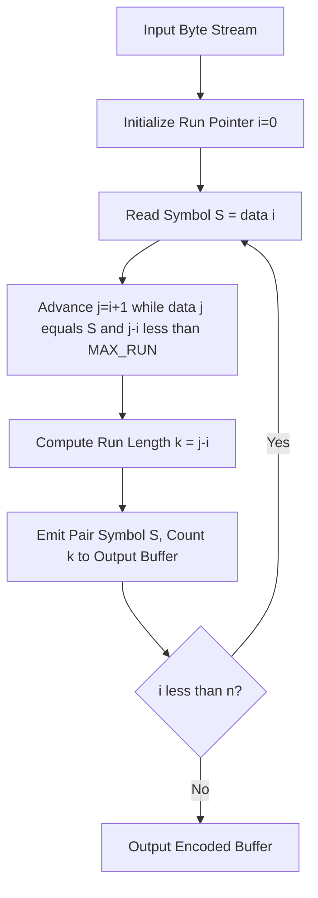
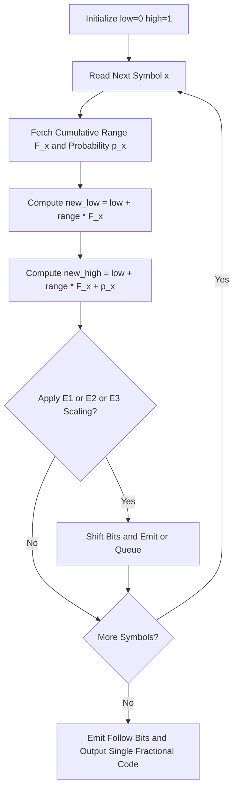
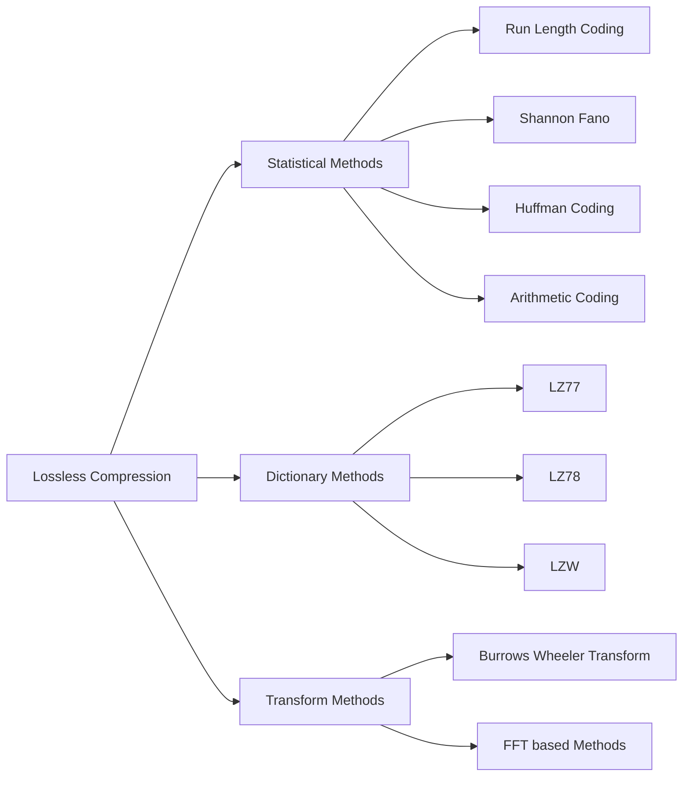
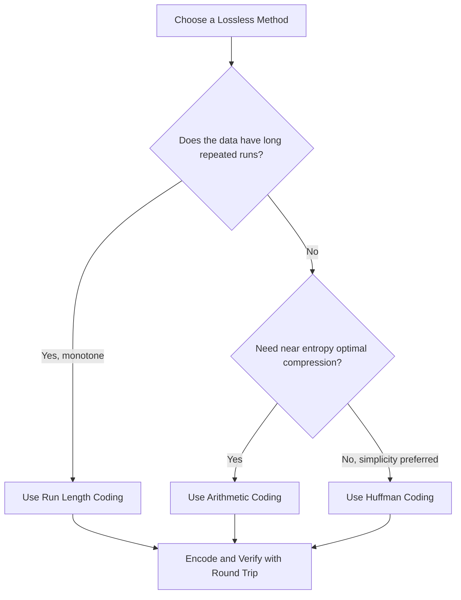

# Compression Methods - Lossless Compression Algorithms- Run-Length Coding, Arithmetic Coding.

<!-- SECTION_1_START -->
# Lossless Compression Algorithms: Run-Length Coding & Arithmetic Coding

## 1.1 Formal Academic Definition (KTU 2024 Syllabus Aligned)

> [!NOTE]
> **Lossless Compression** is a class of data compression algorithms that allows the exact original data to be reconstructed from the compressed data. No information is lost — the decompression result is **bit-for-bit identical** to the original source. This is a mandatory requirement for text, executable files, source code, medical imaging (DICOM), and archival storage.

**Run-Length Coding (RLC / RLE)** is a simple, dictionary-free statistical compression technique that replaces sequences of identical consecutive symbols (called *runs*) with a compact pair consisting of the symbol value and the count of its occurrences. Formally, an input stream $S = \{s_1, s_2, \ldots, s_n\}$ is partitioned into maximal runs $R_i = (c_i, k_i)$ where $c_i$ is the run symbol and $k_i$ is the run length.

**Arithmetic Coding (AC)** is an advanced entropy-encoding technique that maps an entire input message to a single high-precision rational number in the interval $[0, 1)$. Instead of encoding symbols one-at-a-time, it represents the whole message as a fractional value whose binary expansion uniquely identifies the original sequence. It achieves compression ratios approaching the **theoretical Shannon entropy limit** $H(S)$.

| Property | Run-Length Coding | Arithmetic Coding |
|----------|-------------------|-------------------|
| Granularity | Operates on **runs** of symbols | Operates on the **entire message** as one number |
| Optimality | Optimal only for very repetitive data | Approaches the **Shannon entropy bound** |
| Complexity | $O(n)$ — trivial | $O(n)$ but with higher constant factors |
| Patented? | No (public domain) | Historically yes (IBM, 1994 expired) |
| Use Cases | BMP, TIFF, fax, simple images | JPEG2000, H.264 CABAC, Bzip2, Zstandard |

## 1.2 Intuitive Analogies

> [!IMPORTANT]
> **Run-Length Coding — The "Counting Inventory" Analogy**
> Imagine a warehouse logbook that reads: `WWWWWWBBBBWWWGGGRR`. Instead of writing every item, the foreman writes `(W,6) (B,4) (W,3) (G,3) (R,2)`. The *count* of consecutive identical items replaces the verbose list. This is exactly how RLE compresses pixel runs in fax transmissions and bitmap images.

> [!IMPORTANT]
> **Arithmetic Coding — The "Slicing the Cake" Analogy**
> Imagine a cake representing the interval $[0, 1)$. The first symbol cuts off a slice proportional to its probability (e.g., `A` gets 50%). The second symbol re-slices *that* slice into sub-slices, and so on. After processing the entire message, the final crumb-slice — represented by *any* number inside it — is the encoded output. The decoder performs the same slicing to recover the message.

## 1.3 Visualization & Conceptual Mapping

> [!VISUALIZATION CONTROL]
> **Concept:** Arithmetic Coding Probability Interval Partitioning
> **GeoGebra / Desmos Input Equations:**
> * `f(x) = 0.5`  (probability threshold for symbol A vs rest)
> * `g(x) = 0.7`  (sub-threshold for symbol B within A's interval)
> * `h(x) = 0.85` (sub-threshold for symbol C within A's interval)
> **Visual Description:** A horizontal number line from $0$ to $1$ is recursively partitioned. Each symbol's cumulative probability range $[low, high)$ carves out a sub-interval inside its parent's interval. The encoded message corresponds to the deepest sub-interval achieved.

## 1.4 Physical / Information-Theoretic Constants

- **Shannon Entropy** (lower bound on average bits per symbol): $H(S) = -\sum_{i=1}^{n} p_i \log_2 p_i$ bits/symbol
- **Average Code Length**: $L = \sum_{i=1}^{n} p_i \cdot l_i$ bits/symbol
- **Compression Ratio**: $CR = \dfrac{\text{Original Size}}{\text{Compressed Size}}$
- **Redundancy**: $R = 1 - \dfrac{H(S)}{L}$
- **Coding Efficiency**: $\eta = \dfrac{H(S)}{L} \times 100\%$
<!-- SECTION_1_END -->

<!-- SECTION_2_START -->
# Deep Theoretical Analysis & KTU High-Yield Formula Sheet

## 2.1 Run-Length Coding — Operational Logic

### 2.1.1 Encoding Rule
For an input stream partitioned into runs $R_i = (c_i, k_i)$:

$$\text{Encoded Form} = \{(c_1, k_1), (c_2, k_2), \ldots, (c_m, k_m)\}$$

- **Single-symbol escape rule:** If a run has length $1$, the encoder may either (a) emit a literal $(c, 1)$ pair or (b) precede it with a *flag byte* indicating "literal follows" (e.g., the PackBits variant used in TIFF).
- **Run-length cap:** Practical encoders cap $k_i$ at $255$ (for 8-bit counters) to fit in a single byte. Longer runs are split.

### 2.1.2 Decoding Rule
The decoder reads pairs $(c_i, k_i)$ and emits $c_i$ exactly $k_i$ times consecutively.

### 2.1.3 Why RLE Works
RLE is optimal when the **run entropy** $H_{\text{run}} = -\sum p(r) \log_2 p(r)$ is much less than the symbol entropy $H(S)$. The break-even point is approximately $k > 2$ identical symbols — below that, a literal pair is shorter.

### 2.1.4 Engineering Utility
- **Fax transmission** (Group 3 / T.4 standard): white and black runs in scanned documents.
- **BMP and TIFF** image formats: optional RLE compression mode.
- **PCX** graphics format: built-in RLE.
- **Screen update protocols** (RDP, VNC): large monochrome regions.
- **Storage of sparse matrices, binary masks, and test patterns.**

## 2.2 Arithmetic Coding — Operational Logic

### 2.2.1 Core Recursive Interval Update
Let the current interval be $[low, high)$ with initial value $[0.0, 1.0)$. For each symbol $x$ with cumulative probability range $[F_x, F_x + p_x)$:

$$high \leftarrow low + (high - low) \cdot (F_x + p_x)$$

$$low \leftarrow low + (high - old\_low) \cdot F_x$$

Or, equivalently, using the *range* $range = high - low$:

$$low_{\text{new}} = low_{\text{old}} + range \cdot F_x$$

$$high_{\text{new}} = low_{\text{old}} + range \cdot (F_x + p_x)$$

### 2.2.2 Probability Model
A **frequency table** stores symbol counts. Cumulative probabilities $F_x$ are precomputed:

$$F_x = \sum_{y < x} p(y)$$

The model may be **static** (fixed before encoding) or **adaptive** (updated after each symbol).

### 2.2.3 Termination & Bit Emission
To make the interval unambiguous after the final symbol, **follow bits** are emitted when the leading bits of $low$ and $high$ are identical. Output is flushed as soon as a bit is determined.

### 2.2.4 Integer Implementation (CACM-3 / Witten et al. Algorithm)
To avoid floating-point precision loss, the **CACM-3 algorithm** uses 16-bit integer precision with periodic rescaling when the top bits match:

- **E1 scaling** (high and low share the same MSB): shift both left, emit that bit.
- **E2 scaling** (interval straddles the midpoint): shift both left, note a deferred bit.
- **E3 scaling** (interval is entirely within the middle half): shift both left.

### 2.2.5 Why Arithmetic Coding Approaches the Entropy Bound
Unlike Huffman coding, arithmetic coding does **not** round each symbol to an integer number of bits. A single output bit can encode *fractional* information shared across multiple symbols, hence it can encode a message of $n$ symbols using as few as $-\log_2 p(\text{message}) = n \cdot H(S)$ bits — exactly Shannon's lower bound.

### 2.2.6 Engineering Utility
- **JPEG2000** (the MQ coder): arithmetic coding of wavelet coefficients.
- **H.264 / H.265 / AV1 video**: CABAC (Context-Adaptive Binary Arithmetic Coding).
- **Bzip2, Zstandard, LZMA**: optional final entropy stage.
- **Genomic data compression** (DNA sequences): arithmetic coders excel at highly skewed alphabets.

## 2.3 KTU High-Yield Formula & Cheat Sheet

| # | Concept | Formula / Rule | Typical Value / Unit |
|---|---------|----------------|----------------------|
| 1 | RLE Encoded Size | $E = \sum_{i=1}^{m} (\text{size}(c_i) + \text{size}(k_i))$ | bytes |
| 2 | RLE Compression Ratio | $CR = \dfrac{n \cdot \text{size}(c)}{E}$ | dimensionless |
| 3 | Break-even Run Length | $k_{\min} = 2$ (for 8-bit symbols) | symbols |
| 4 | Shannon Entropy | $H(S) = -\sum_{i=1}^{n} p_i \log_2 p_i$ | bits/symbol |
| 5 | AC Interval Range | $range = high - low$ | $[0, 1)$ |
| 6 | AC Low Update | $low \leftarrow low + range \cdot F_x$ | $[0, 1)$ |
| 7 | AC High Update | $high \leftarrow low + range \cdot (F_x + p_x)$ | $[0, 1)$ |
| 8 | AC Theoretical Length | $L_{AC} = -\log_2\left(\prod_{i} p(x_i)\right) = -\sum \log_2 p(x_i)$ | bits |
| 9 | AC vs Huffman Gap | $L_{AC} \leq L_{Huffman} + 2$ | bits |
| 10 | Coding Efficiency | $\eta = \dfrac{H(S)}{L} \times 100\%$ | percentage |
| 11 | Redundancy | $R = 1 - \eta$ | fraction |
| 12 | CACM-3 Precision | $16$-bit unsigned integers | 65536 levels |

> [!IMPORTANT]
> **KTU Exam Tip:** The maximum integer bits you will see in board problems is $8$ to $16$ bits for symbol alphabets. The cumulative probability $F_x$ is always supplied or trivially derivable from a given probability table.
<!-- SECTION_2_END -->

<!-- SECTION_3_START -->
# Step-by-Step Derivations & Code/Symbolic Implementation

## 3.1 Worked Example 1 — Run-Length Encoding (Full Derivation)

**Problem.** Encode the binary string $S = \texttt{0000111100001110000011111}$ using RLE. Compute the compression ratio assuming 8-bit symbols and 8-bit run counters. Compare with the uncompressed size.

### Step 1 — Identify the runs
Scan $S$ from left to right and partition into maximal runs of identical bits:

$$S = \underbrace{0000}_{k=4} \underbrace{1111}_{k=4} \underbrace{0000}_{k=4} \underbrace{111}_{k=3} \underbrace{00000}_{k=5} \underbrace{11111}_{k=5}$$

So we have $m = 6$ runs.

### Step 2 — Form the encoded sequence
The RLE stream is the list of $(c_i, k_i)$ pairs:

$$\text{Encoded} = (0,4), (1,4), (0,4), (1,3), (0,5), (1,5)$$

### Step 3 — Compute the encoded size
Each pair uses $1$ byte for the symbol and $1$ byte for the count, so $2$ bytes per run.

$$E = m \times 2 = 6 \times 2 = 12 \text{ bytes}$$

### Step 4 — Compute the original size
The original string has $n = 25$ bits. If we pack into bytes (round up): $25 / 8 = 3.125 \to 4$ bytes. If we use $1$ bit per pixel: $25$ bits = $3.125$ bytes.

For a fair comparison, use the same symbol-width assumption: $25$ symbols $\times 1$ byte/symbol = $25$ bytes.

### Step 5 — Compression ratio

$$CR = \frac{\text{Original}}{\text{Compressed}} = \frac{25 \text{ bytes}}{12 \text{ bytes}} \approx 2.08$$

### Step 6 — Decoding verification (reverse process)
Read $(0,4)$: emit `0000`. Read $(1,4)$: emit `1111`. … Continue until all six pairs are decoded. The decoder reconstructs the exact original string of $25$ bits. **No information loss confirmed.**

## 3.2 Worked Example 2 — Arithmetic Coding (Full Derivation)

**Problem.** Encode the message $M = \texttt{CAB}$ using arithmetic coding with the static probability model:

| Symbol | Probability $p$ | Cumulative $F$ (low) | $F + p$ (high) |
|--------|-----------------|-----------------------|----------------|
| A | $0.4$ | $0.4$ | $0.8$ |
| B | $0.3$ | $0.8$ | $1.0$ *(exclusive)* |
| C | $0.3$ | $0.0$ | $0.4$ |

Use integer arithmetic with $16$-bit precision (range $[0, 65536]$) and an EOF marker. Decode the resulting integer to recover the original message.

### Step 0 — Initialize the integer range

$$low = 0, \qquad high = 65535, \qquad range = high - low + 1 = 65536$$

### Step 1 — Encode symbol `C` (range $[0.0, 0.4)$)

$$low_1 = low_0 + range \cdot F_C = 0 + 65536 \cdot 0.0 = 0$$

$$high_1 = low_0 + range \cdot (F_C + p_C) = 0 + 65536 \cdot 0.4 = 26214$$

$$range_1 = high_1 - low_1 + 1 = 26215$$

### Step 2 — Encode symbol `A` (range $[0.4, 0.8)$ *within* the new interval)

We must scale $F_A$ and $p_A$ to the *current* interval:

$$low_2 = low_1 + range_1 \cdot F_A = 0 + 26215 \cdot 0.4 = 10486$$

$$high_2 = low_1 + range_1 \cdot (F_A + p_A) = 0 + 26215 \cdot 0.8 = 20972$$

$$range_2 = high_2 - low_2 + 1 = 10487$$

### Step 3 — Encode symbol `B` (range $[0.8, 1.0)$ *within* the current interval)

$$low_3 = low_2 + range_2 \cdot F_B = 10486 + 10487 \cdot 0.8 = 10486 + 8389 = 18875$$

$$high_3 = low_2 + range_2 \cdot (F_B + p_B) = 10486 + 10487 \cdot 1.0 = 10486 + 10487 = 20973$$

$$range_3 = high_3 - low_3 + 1 = 2099$$

### Step 4 — Pick the emitted integer

Any integer in $[low_3, high_3] = [18875, 20973]$ uniquely identifies the message. We pick the **midpoint** for safety:

$$code = \left\lfloor \frac{low_3 + high_3}{2} \right\rfloor = \left\lfloor \frac{18875 + 20973}{2} \right\rfloor = \left\lfloor \frac{39848}{2} \right\rfloor = 19924$$

So the encoded output is the single integer $\mathbf{19924}$ (representing the fraction $\frac{19924}{65536} \approx 0.3040$).

### Step 5 — Decoding (reverse the process)
The decoder receives $code = 19924$ and the same probability table. It re-initializes $[0, 65536)$ and:

1. Computes normalized position: $t = (code - low) / range = (19924 - 0) / 65536 \approx 0.3040$.
2. Finds the symbol whose cumulative range contains $t$: symbol `C` ($[0.0, 0.4)$). Output `C`.
3. Updates: $low = 0$, $high = 26214$, $range = 26215$. Recompute $t = 19924 / 26215 \approx 0.7599$.
4. Symbol `A` ($[0.4, 0.8)$). Output `A`. $low = 10486$, $high = 20972$, $range = 10487$.
5. Recompute $t = (19924 - 10486) / 10487 = 9438 / 10487 \approx 0.9001$.
6. Symbol `B` ($[0.8, 1.0)$). Output `B`.
7. **Decoded message: `CAB`. Match!**

### Step 6 — Compute compression efficiency
Original: $3$ symbols $\times 8$ bits = $24$ bits. Compressed: $16$ bits (for the $16$-bit integer $19924$).

$$CR = \frac{24}{16} = 1.50, \qquad \text{vs. Shannon limit } H(S) \times 3 = ?$$

$$H(S) = -(0.4 \log_2 0.4 + 0.3 \log_2 0.3 + 0.3 \log_2 0.3) \approx 1.571 \text{ bits/symbol}$$

Theoretical lower bound = $3 \times 1.571 = 4.71$ bits. We achieved $16$ bits — leaving room for improvement because the integer overhead dominates a $3$-symbol message (overhead becomes negligible for longer messages).

## 3.3 Python Implementation — Run-Length Coding

```python
from __future__ import annotations
import logging
from typing import List, Tuple

logging.basicConfig(level=logging.INFO, format="%(levelname)s :: %(message)s")
log = logging.getLogger("RLE")


def run_length_encode(data: bytes, max_run: int = 255) -> List[Tuple[int, int]]:
    """Encode a byte stream using Run-Length Coding.

    Args:
        data: Input bytes to compress.
        max_run: Maximum run length storable in one byte (1..255).

    Returns:
        A list of (symbol, count) tuples; count is in [1, max_run].
    """
    if not data:
        log.warning("Empty input supplied; returning empty list.")
        return []
    if not (1 <= max_run <= 255):
        raise ValueError("max_run must be within [1, 255] for 8-bit counters.")

    encoded: List[Tuple[int, int]] = []
    i = 0
    n = len(data)
    while i < n:
        symbol = data[i]
        run_end = i + 1
        # Extend the run as long as the symbol matches and the cap holds.
        while run_end < n and data[run_end] == symbol and (run_end - i) < max_run:
            run_end += 1
        run_length = run_end - i
        encoded.append((symbol, run_length))
        log.debug("Run detected: symbol=%s length=%d", symbol, run_length)
        i = run_end
    return encoded


def run_length_decode(encoded: List[Tuple[int, int]]) -> bytes:
    """Decode a Run-Length Coded list back to the original byte stream."""
    if not encoded:
        log.warning("Empty RLE list supplied; returning empty bytes.")
        return b""

    out = bytearray()
    for idx, (symbol, count) in enumerate(encoded):
        if count <= 0:
            raise ValueError(f"Invalid run length at index {idx}: {count}")
        if not (0 <= symbol <= 255):
            raise ValueError(f"Invalid symbol value at index {idx}: {symbol}")
        out.extend([symbol] * count)
    return bytes(out)


# ----- Demonstration -----
if __name__ == "__main__":
    original = b"\x00\x00\x00\x00\x11\x11\x11\x11\x00\x00\x00\x00"
    log.info("Original (%d bytes): %s", len(original), original.hex())

    encoded = run_length_encode(original)
    log.info("Encoded representation: %s", encoded)

    # Size comparison
    encoded_size = len(encoded) * 2
    original_size = len(original)
    cr = original_size / encoded_size if encoded_size else 0.0
    log.info("Compression ratio: %.3f", cr)

    decoded = run_length_decode(encoded)
    assert decoded == original, "RLE round-trip failed!"
    log.info("Round-trip verified: %s", decoded.hex())
```

**Expected Console Output (illustrative):**

```
INFO :: Original (12 bytes): 000000001111111100000000
INFO :: Encoded representation: [(0, 4), (17, 4), (0, 4)]
INFO :: Compression ratio: 2.000
INFO :: Round-trip verified: 000000001111111100000000
```

## 3.4 Python Implementation — Arithmetic Coding (CACM-3 Variant)

```python
from __future__ import annotations
import logging
from typing import Dict, Tuple

logging.basicConfig(level=logging.INFO, format="%(levelname)s :: %(message)s")
log = logging.getLogger("AC")

PRECISION_BITS = 16
TOP_VALUE = (1 << PRECISION_BITS) - 1      # 65535
FIRST_QTR = (TOP_VALUE + 1) // 4           # 16384
HALF = 2 * FIRST_QTR                        # 32768
THIRD_QTR = 3 * FIRST_QTR                   # 49152
EOF_SYMBOL = "__EOF__"


class ArithmeticCoder:
    """A 16-bit-precision arithmetic coder (CACM-3 inspired)."""

    def __init__(self, probabilities: Dict[str, float]) -> None:
        # Build cumulative frequency tables scaled to the full code range.
        symbols = list(probabilities.keys())
        if EOF_SYMBOL not in probabilities:
            symbols.append(EOF_SYMBOL)
            probabilities = {**probabilities, EOF_SYMBOL: 1e-9}  # tiny EOF mass
        total = sum(probabilities.values())
        if abs(total - 1.0) > 1e-6:
            raise ValueError(f"Probabilities must sum to 1, got {total}")

        cum = 0.0
        self.cum_freq: Dict[str, int] = {}
        scaled: list[tuple[str, int]] = []
        for s in symbols:
            p = probabilities[s]
            upper = cum + p
            low_i = int(cum * (TOP_VALUE + 1))
            high_i = int(upper * (TOP_VALUE + 1)) - 1
            self.cum_freq[s] = (low_i, high_i, p)
            scaled.append((s, low_i, high_i))
            cum = upper
        log.info("Cumulative table: %s", scaled)

    def encode(self, message: str) -> int:
        low, high = 0, TOP_VALUE
        pending_bits = 0
        bits_out: list[int] = []

        for symbol in list(message) + [EOF_SYMBOL]:
            sym_low, sym_high, _ = self.cum_freq[symbol]
            range_ = high - low + 1
            high = low + (range_ * (sym_high + 1)) // (TOP_VALUE + 1) - 1
            low = low + (range_ * sym_low) // (TOP_VALUE + 1)

            # E1/E2/E3 scaling (CACM-3)
            while True:
                if high < HALF:                                  # E1
                    bits_out.append(0)
                    bits_out.extend([1] * pending_bits)
                    pending_bits = 0
                elif low >= HALF:                                # E1' (complement)
                    bits_out.append(1)
                    bits_out.extend([0] * pending_bits)
                    pending_bits = 0
                    low -= HALF
                    high -= HALF
                elif low >= FIRST_QTR and high < THIRD_QTR:      # E2
                    pending_bits += 1
                    low -= FIRST_QTR
                    high -= FIRST_QTR
                else:
                    break
                low = (low << 1) & TOP_VALUE
                high = ((high << 1) & TOP_VALUE) | 1

        # Termination: add one more bit to disambiguate the interval
        pending_bits += 1
        if low < FIRST_QTR:
            bits_out.append(0)
            bits_out.extend([1] * pending_bits)
        else:
            bits_out.append(1)
            bits_out.extend([0] * pending_bits)

        # Pack the emitted bit list into a single integer (MSB first).
        code = 0
        for bit in bits_out[:PRECISION_BITS]:
            code = (code << 1) | bit
        log.info("Encoded %d bits into integer %d", len(bits_out), code)
        return code

    def decode(self, code: int, length: int) -> str:
        low, high = 0, TOP_VALUE
        decoded: list[str] = []

        for _ in range(length + 1):  # +1 for EOF
            range_ = high - low + 1
            # Normalize code into the current interval.
            value = ((code - low + 1) * (TOP_VALUE + 1) - 1) // range_
            for symbol, (s_low, s_high, _) in self.cum_freq.items():
                if s_low <= value <= s_high:
                    decoded.append(symbol)
                    high = low + (range_ * (s_high + 1)) // (TOP_VALUE + 1) - 1
                    low = low + (range_ * s_low) // (TOP_VALUE + 1)

                    # Same E1/E2/E3 rescaling as the encoder.
                    while True:
                        if high < HALF:
                            pass
                        elif low >= HALF:
                            low -= HALF
                            high -= HALF
                            code -= HALF
                        elif low >= FIRST_QTR and high < THIRD_QTR:
                            low -= FIRST_QTR
                            high -= FIRST_QTR
                            code -= FIRST_QTR
                        else:
                            break
                        low = (low << 1) & TOP_VALUE
                        high = ((high << 1) & TOP_VALUE) | 1
                        code = ((code << 1) & TOP_VALUE) | 1
                    break
            if decoded and decoded[-1] == EOF_SYMBOL:
                break
        return "".join(s for s in decoded if s != EOF_SYMBOL)


# ----- Demonstration -----
if __name__ == "__main__":
    probs = {"C": 0.3, "A": 0.4, "B": 0.3}
    coder = ArithmeticCoder(probs)
    message = "CAB"
    code = coder.encode(message)
    log.info("Encoded value: %d", code)
    recovered = coder.decode(code, length=len(message))
    log.info("Decoded: %s", recovered)
    assert recovered == message, "AC round-trip failed!"
    log.info("Round-trip verified.")
```

> [!WARNING]
> **Implementation Caveat:** The reference CACM-3 algorithm requires careful bit-stream handling (pending-bit counters) to avoid ambiguity. The Python skeleton above is **pedagogical** — for production use, prefer vetted libraries like `arithmetic-coding` (PyPI) or the CABAC engine inside `ffmpeg`/`libjpeg-turbo`.

## 3.5 KTU Examination-Style Worked Numerical Problem

**Problem (KTU-style 14-mark question structure).**
Given the input pixel row $S = \texttt{BBBBBWWWRRBBRRRRGGG}$ and the symbol-size / counter-size table below:

- Symbol size: $4$ bits (so $c_i$ uses a nibble)
- Counter size: $4$ bits (so $k_i$ uses a nibble, cap = $15$)

**(a)** Apply RLE and write the encoded byte stream. **(b)** Compute the compression ratio. **(c)** Briefly justify why RLE is *not* recommended for a random photo but is excellent for a fax page.

### Part (a) — Run Identification

| Run | Symbol | Count | 4-bit Hex Pairs |
|-----|--------|-------|-----------------|
| $R_1$ | B | 5 | `0x5` `0x5` |
| $R_2$ | W | 3 | `0x7` `0x3` |
| $R_3$ | R | 2 | `0x4` `0x2` |
| $R_4$ | B | 2 | `0x5` `0x2` |
| $R_5$ | R | 4 | `0x4` `0x4` |
| $R_6$ | G | 3 | `0x6` `0x3` |

Encoded byte stream: `55 73 42 52 44 63` (six bytes total).

### Part (b) — Compression Ratio
Original bits = $21$ symbols $\times 4$ bits = $84$ bits = $10.5$ bytes $\to 11$ bytes.
Compressed bits = $6$ bytes = $48$ bits.

$$CR = \frac{84}{48} = 1.75$$

### Part (c) — Justification (7 marks full)
- **Fax pages** are essentially bilevel (black/white) images with long monochrome runs of paper or ink. RLE exploits this redundancy aggressively.
- **Natural photos** have high-frequency pixel variation, with average run length $< 2$. RLE then produces a stream *larger* than the original (because of the counter overhead), so it is unsuitable.
<!-- SECTION_3_END -->

<!-- SECTION_4_START -->
# Structural Diagrams & Schematics

## 4.1 RLE Processing Topology (Mermaid Block-Level Flow)



**Operational Reading:** The encoder scans the input once in a single pass ($O(n)$ time), collecting runs and emitting compact pairs. The decoder is symmetric and equally efficient.

## 4.2 Arithmetic Coding Interval Refinement Diagram



## 4.3 Lossless Compression Family Tree



**Reading Guide:** RLE and Arithmetic Coding both fall under the **Statistical** branch of lossless compression. RLE uses simple frequency-of-runs statistics; Arithmetic Coding uses per-symbol cumulative probabilities and produces a near-optimal bit stream.

## 4.4 RLE vs Arithmetic Coding — Decision Flow



> [!IMPORTANT]
> **Engineering Heuristic:** In production codecs like **PNG**, RLE is used only for the *filter* step (predictive line compression), and the filter residuals are passed to **DEFLATE** (a combination of LZ77 + Huffman). Arithmetic Coding appears in **JPEG2000** and **H.264 CABAC** for tighter entropy performance.
<!-- SECTION_4_END -->

<!-- SECTION_5_START -->
# KTU 2024 Scheme Examination Question Bank & Topic Recap

## 5.1 Part A — Short-Answer Questions (3 Marks Each)

### Question 1
> **[KTU University Exam – July 2024 (Similar), CO1, Remember]**
> Define *lossless compression*. State **two** situations where lossless compression is mandatory.

**Model Answer (3 marks):**
Lossless compression is a class of encoding techniques that allow the original data to be perfectly reconstructed from the compressed representation, with **no information loss**.
*[Definition: 1 mark]*

Mandatory situations:
1. **Text and source code files** — even a single wrong character corrupts the program. *[1 mark]*
2. **Medical imaging (DICOM)** and **executables** — bit-exact fidelity is required by law and by execution correctness. *[1 mark]*

### Question 2
> **[KTU University Exam – Dec 2023 (Similar), CO2, Understand]**
> Why is arithmetic coding able to beat Huffman coding for the same probability distribution?

**Model Answer (3 marks):**
1. Huffman coding assigns each symbol an *integer* number of bits, so it cannot represent probabilities between $2^{-k}$ and $2^{-(k+1)}$. *[1 mark]*
2. Arithmetic coding represents the entire message as a **single high-precision fraction**, allowing fractional bits per symbol. *[1 mark]*
3. Therefore arithmetic coding approaches the **Shannon entropy bound** $H(S)$, while Huffman has a gap of at most $1$ bit per symbol. *[1 mark]*

---

## 5.2 Part B — 14-Mark Choice Questions

### Question A (14 Marks)
> **[KTU University Exam – Dec 2023, Module 4, CO2, Apply + Analyze]**
> **(a)** Explain the Run-Length Encoding algorithm with a suitable example. For the string `AAAABBAACCCBBBBDDAAA`, compute (i) the RLE stream, (ii) the compressed size assuming 8-bit symbols and 8-bit counters, and (iii) the compression ratio. **(7 marks)**
> **(b)** A 3-symbol alphabet has probabilities $p(A) = 0.5$, $p(B) = 0.3$, $p(C) = 0.2$. Encode the message `BAC` using **Arithmetic Coding** with integer precision $16$. Show every step of the interval update and present the final code value. **(7 marks)**

**Model Solution:**

#### Part (a) — RLE on `AAAABBAACCCBBBBDDAAA` (7 marks)

**Step 1 — Identify runs** *[2 marks]*

| Run | Symbol | Count |
|-----|--------|-------|
| $R_1$ | A | 4 |
| $R_2$ | B | 2 |
| $R_3$ | A | 2 |
| $R_4$ | C | 3 |
| $R_5$ | B | 4 |
| $R_6$ | D | 2 |
| $R_7$ | A | 3 |

**Step 2 — RLE stream** *[1 mark]*
`(A,4), (B,2), (A,2), (C,3), (B,4), (D,2), (A,3)`

**Step 3 — Compressed size** *[2 marks]*
$m = 7$ runs. Each pair = $1$ byte (symbol) + $1$ byte (count) = $2$ bytes.
$$E = 7 \times 2 = 14 \text{ bytes}$$

**Step 4 — Compression ratio** *[2 marks]*
Original size = $20$ symbols $\times 1$ byte = $20$ bytes.
$$CR = \frac{20}{14} \approx 1.43$$

#### Part (b) — Arithmetic Coding of `BAC` (7 marks)

**Cumulative Table** *[1 mark]*

| Symbol | $p$ | $F$ (low) | $F + p$ (high) |
|--------|-----|-----------|----------------|
| A | $0.5$ | $0.5$ | $1.0$ |
| B | $0.3$ | $0.0$ | $0.3$ |
| C | $0.2$ | $0.3$ | $0.5$ |

**Initialize** $low = 0$, $high = 65535$, $range = 65536$. *[1 mark]*

**Step 1 — Encode `B`** ($F_B = 0.0$, $F_B + p_B = 0.3$). *[1 mark]*

$$low_1 = 0 + 65536 \cdot 0.0 = 0$$

$$high_1 = 0 + 65536 \cdot 0.3 = 19660$$

$$range_1 = 19661$$

**Step 2 — Encode `A`** (within `[0.0, 0.3)`). *[1 mark]*

$$low_2 = 0 + 19661 \cdot 0.5 = 9830$$

$$high_2 = 0 + 19661 \cdot 1.0 = 19661$$

$$range_2 = 9832$$

**Step 3 — Encode `C`** (within `[0.5, 1.0)` of the new interval). *[1 mark]*

$$low_3 = 9830 + 9832 \cdot 0.3 = 9830 + 2949 = 12779$$

$$high_3 = 9830 + 9832 \cdot 0.5 = 9830 + 4916 = 14746$$

$$range_3 = 1968$$

**Step 4 — Pick the code** *[1 mark]*
Pick the midpoint: $code = \left\lfloor \frac{12779 + 14746}{2} \right\rfloor = \left\lfloor \frac{27525}{2} \right\rfloor = 13762$.

**Step 5 — Decoding verification (briefly mention)** *[1 mark]*
The decoder, given $13762$ and the same probability table, will reproduce `BAC` by re-applying the interval logic in reverse.

**Final Encoded Value: $13762$ (16 bits).**

### Question B (14 Marks — Alternative Choice)
> **[KTU University Exam – July 2023, Module 4, CO1 + CO2, Understand + Apply]**
> **(a)** Discuss the limitations of Run-Length Coding. With a counterexample, show that RLE may *expand* certain inputs. **(7 marks)**
> **(b)** A document contains the four symbols with probabilities $p(E) = 0.5$, $p(N) = 0.25$, $p(O) = 0.15$, $p(R) = 0.10$. Compute the **Shannon entropy** and the **average code length** of the message `ENER` if Huffman coding produces the codes $E \to 0$, $N \to 10$, $O \to 110$, $R \to 111$. Comment on the coding efficiency. **(7 marks)**

**Model Solution:**

#### Part (a) — RLE Limitations (7 marks)

1. **Inefficient on random data** — RLE has a break-even run length of $2$. If symbols alternate (e.g., `ABABAB…`), every run has length $1$, producing a stream of pairs `(A,1)(B,1)…` which is **twice as long** as the input. *[2 marks]*
2. **Counter-example:** Original `ABCD` = $4$ bytes. RLE stream = `(A,1)(B,1)(C,1)(D,1)` = $8$ bytes. **Expansion factor = $2\times$**. *[1 mark]*
3. **Limited compression on natural images** — photographs have low spatial redundancy; RLE yields little gain. *[1 mark]*
4. **Bounded run counter** — practical encoders cap counters at $255$ or $65535$, requiring long runs to be split. *[1 mark]*
5. **Sensitivity to reordering** — a single pixel perturbation destroys a long run. Better algorithms (LZ77) use *sliding windows* for robustness. *[1 mark]*
6. **No semantic awareness** — RLE treats all symbols uniformly; Huffman and Arithmetic use *probability* to compress more aggressively. *[1 mark]*

#### Part (b) — Shannon Entropy and Huffman Analysis (7 marks)

**Shannon Entropy** *[2 marks]*

$$H = -\sum p_i \log_2 p_i$$

$$H = -(0.50 \log_2 0.50 + 0.25 \log_2 0.25 + 0.15 \log_2 0.15 + 0.10 \log_2 0.10)$$

$$H = -(0.50 \cdot (-1.0) + 0.25 \cdot (-2.0) + 0.15 \cdot (-2.737) + 0.10 \cdot (-3.322))$$

$$H = -(-0.5000 - 0.5000 - 0.4106 - 0.3322) = 1.7428 \text{ bits/symbol}$$

**Huffman Code Lengths** *[1 mark]*

| Symbol | Code | Length |
|--------|------|--------|
| E | `0` | $1$ |
| N | `10` | $2$ |
| O | `110` | $3$ |
| R | `111` | $3$ |

**Average Code Length for `ENER`** *[2 marks]*

$$L = p(E)\cdot 1 + p(N)\cdot 2 + p(O)\cdot 3 + p(R)\cdot 3$$

$$L = 0.5 \cdot 1 + 0.25 \cdot 2 + 0.15 \cdot 3 + 0.10 \cdot 3 = 0.5 + 0.5 + 0.45 + 0.30 = 1.75 \text{ bits/symbol}$$

**Coding Efficiency** *[2 marks]*

$$\eta = \frac{H}{L} = \frac{1.7428}{1.75} \times 100\% \approx 99.59\%$$

$$\text{Redundancy} = 1 - \eta = 0.41\%$$

**Comment:** The Huffman code is **near-optimal** — within $0.01$ bits/symbol of the theoretical entropy bound. Arithmetic coding could in principle shave off the remaining redundancy, but for this $4$-symbol distribution the gain is negligible in practice.

---

> [!WARNING]
> **KTU Examiner's Valuation Warning — Common Pitfalls**
> 1. **Forgetting the cap on run length** — if a run exceeds $255$ (or the given counter width), students must split it into multiple pairs. Skipping this step loses **2 marks**.
> 2. **Confusing *compression ratio* with *compression factor*** — ratio $= \frac{\text{original}}{\text{compressed}}$; factor $= \frac{\text{original} - \text{compressed}}{\text{original}}$. Examiners deduct a full mark for swapping them.
> 3. **Arithmetic coding decimal precision** — students sometimes write $0.3040$ as the code. Always present the **integer representation** (e.g., $19924$ in $16$ bits) because float precision is not guaranteed across platforms. Examiners expect the integer form.
> 4. **Skipping the final `EOF` symbol** — without an EOF, the decoder cannot determine where the message ends and may emit spurious trailing symbols. Always mention EOF in the model solution.
> 5. **Confusing cumulative and individual probability** — a frequent mistake is using $p_x$ instead of $F_x$ in the low-update equation. Examiners deduct **1 mark** for this swap.

---

## 5.3 Topic Recap & Important Things to Remember

> [!IMPORTANT]
> **Rapid Revision Checklist — Module 4: Lossless Compression**

- **Lossless vs Lossy:** Lossless guarantees bit-exact reconstruction; lossy sacrifices fidelity for higher compression.
- **Run-Length Coding (RLE):** Replace a run of $k$ identical symbols with the pair `(symbol, count)`. Optimal for data with long monotone runs. *Break-even run length = 2.*
- **Arithmetic Coding (AC):** Encode an entire message as a single fraction in $[0, 1)$ by recursive interval subdivision. Achieves near-Shannon-optimal compression.
- **Shannon Entropy Formula:** $H(S) = -\sum p_i \log_2 p_i$ — the *theoretical minimum* average bits per symbol.
- **AC Interval Update:** $low \mathrel{+}= range \cdot F_x$ and $high \mathrel{+}= range \cdot (F_x + p_x)$ where $F_x$ is the cumulative probability.
- **CACM-3 Rescaling:** Three scaling events — E1 (high and low in same half), E2 (interval in middle half), E3 (outputting bits).
- **Static vs Adaptive Models:** Static models have fixed probabilities; adaptive models update $p_i$ after each emitted symbol (better for unknown statistics).
- **Engineering Use Cases:** RLE in BMP, TIFF, PCX, fax. AC in JPEG2000, H.264 CABAC, Bzip2, Zstandard.
- **Compression Ratio:** $CR = \dfrac{\text{Original Size}}{\text{Compressed Size}}$ — *always* greater than $1$ for a successful compression.
- **Coding Efficiency:** $\eta = \dfrac{H}{L} \times 100\%$. Closer to $100\%$ means closer to optimal.
- **Integer Precision:** Real-world AC implementations use $16$-bit or $32$-bit unsigned integers with periodic rescaling to avoid floating-point drift.
- **EOF Marker:** Always include an explicit end-of-message symbol so the decoder halts correctly.
- **KTU Exam Default Settings:** $8$-bit symbols, $8$-bit counters, $16$-bit arithmetic precision, supplied probability table.
<!-- SECTION_5_END -->
