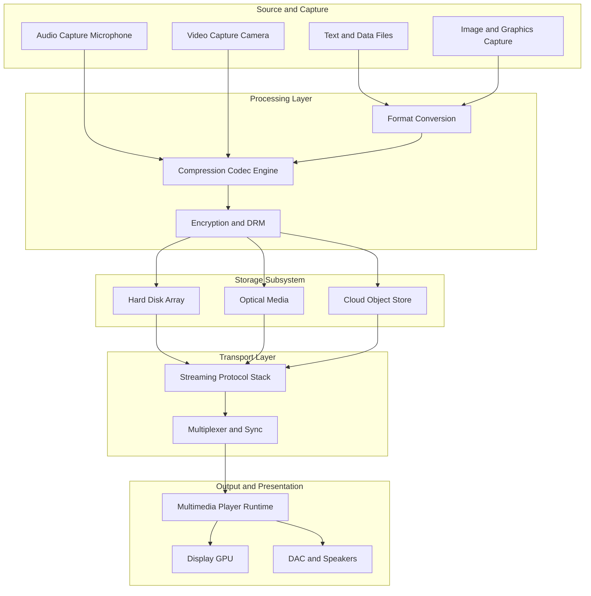
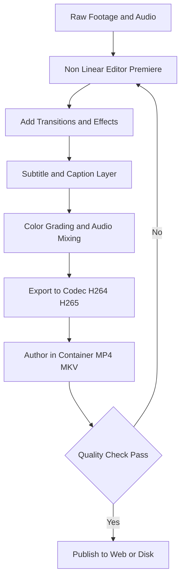
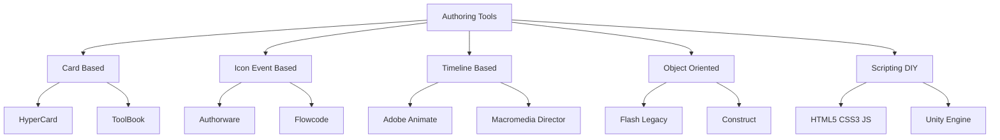
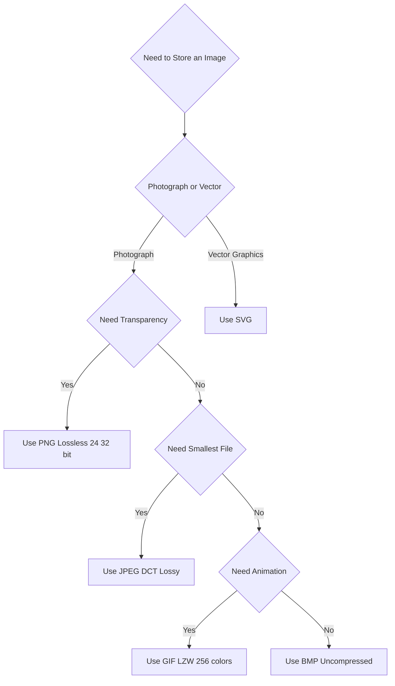

# Fundamental of Multimedia - Introduction to Multimedia, Authoring and Tools, Graphics and Image Data Representations, Popular File Formats, Fundamental Concepts and types of  Video, Basics of Digital Audio and its types.

<!-- SECTION_1_START -->

# Module 4 — Fundamentals of Multimedia

## 1.1 Core Technical Definition

> [!IMPORTANT]
> **Multimedia** is the integrated digital representation, storage, transmission, and interactive presentation of two or more media types — **text, graphics/imagery, audio, video, and animation** — coordinated by a single computational system to deliver a unified, time-sensitive user experience.

In the **KTU 2024 Scheme (PECST527)** context, multimedia is engineered around four foundational pillars:

| Pillar | KTU Definition | Cognitive Anchor |
|---|---|---|
| **Capture** | Digitization of analog signals (ADC) | Input stage |
| **Representation** | Encoding (PCM, RGB, YUV, MPEG) | Storage stage |
| **Compression** | Lossless (Huffman, LZW) & Lossy (DCT) | Bandwidth stage |
| **Delivery** | Streaming, Synchronization, Playback | Output stage |

> [!NOTE]
> **KTU Syllabus Highlight:** The module emphasizes the *data representation* layer — how bits model light (pixels) and sound (samples) — rather than authoring user-interface design.

### Conceptual Analogy — The "Multimedia Restaurant"

Imagine a **five-course meal** served on a single tray:

- **Text** = the printed menu (structured information).
- **Graphics/Image** = the garnish on the plate (spatial data).
- **Audio** = the background music (one-dimensional temporal signal).
- **Video** = the chef cooking live in front of you (spatio-temporal data).
- **Animation** = the flames dancing on the dessert (computer-generated motion).

A **multimedia system** is the *chef + waiter + kitchen infrastructure* that captures, cooks, plates, and serves all of these *synchronously* so the diner (user) perceives them as one cohesive experience.

> [!VISUALIZATION CONTROL]
> **Concept:** Additive Color Mixing (RGB Cube — Corner-to-Corner Diagonal)
> **GeoGebra / Desmos Input Equations:**
> * Point R: $(1, 0, 0)$
> * Point G: $(0, 1, 0)$
> * Point B: $(0, 0, 1)$
> * Diagonal: $\text{White} = (1,1,1)$, $\text{Black} = (0,0,0)$
> **Visual Description:** Observe a unit cube where the body diagonal maps the entire dynamic range from pure black (origin) to pure white (opposite vertex), with primary colors anchored at axis intersections.

---

## 1.2 Authoring and Tools

> [!IMPORTANT]
> **Authoring** is the *systematic process* of planning, designing, assembling, and programming multimedia assets into a navigable, synchronized deliverable using specialized software.

### Authoring Tool Taxonomy (KTU Board-Favorite Topic)

| Category | Examples | KTU-Markable Use Case |
|---|---|---|
| **Card/Page-Based** | HyperCard, ToolBook | Sequential, page-turn content (e-tutorials) |
| **Icon/Event-Based** | Macromedia Authorware, Flowcode | Branching logic, decision-driven CBT |
| **Timeline-Based** | Adobe Animate, Macromedia Director | Animation, video-heavy presentations |
| **Object-Oriented** | Adobe Flash (legacy), Construct | Game-like interactive simulations |
| **Scripting/DIY** | HTML5 + CSS3 + JavaScript, Unity | Web-native, modern responsive multimedia |

> [!NOTE]
> **KTU 2024 Skill Tag:** The syllabus distinguishes *presentation tools* (PowerPoint, Keynote — linear, low-interactivity) from *authoring systems* (Director, Authorware — non-linear, event-driven). Always use the precise term.

### Intuition — Why Authoring is a "Director's Job"

Think of authoring as **film direction**. A director (author) coordinates:

- **Scriptwriters** (text content) — narrate the story.
- **Cinematographers** (graphics/video capture) — frame the visuals.
- **Sound engineers** (audio) — mix the soundtrack.
- **Editors** (compression tools) — cut and optimize.
- **Projectionists** (player/runtime engine) — deliver to audience.

Without a director, the *assets* exist but the *experience* does not. That orchestrator role is exactly what authoring tools fulfill digitally.

---

## 1.3 Graphics and Image Data Representations

> [!IMPORTANT]
> A **digital image** is a 2D discrete function $I(x, y)$ where $x, y \in \mathbb{Z}_{\geq 0}$ are spatial coordinates and $I$ returns an intensity value. In color systems, $I$ becomes a **vector** $(R, G, B)$.

### Two Fundamental Representation Models

| Model | Unit | KTU Formula Basis | Best For |
|---|---|---|---|
| **Bitmap / Raster** | **Pixel** | $I(x, y)$ with finite resolution | Photographs, scanned art |
| **Vector** | **Geometric primitive** (line, curve, polygon) | $\vec{P}(t)$, Bézier control points | Logos, typography, CAD |

### Color Depth Resolution

| Bit Depth $b$ | Distinct Colors $N$ | KTU Notation | Human Perception |
|---|---|---|---|
| 1 | $2^1 = 2$ | Monochrome | None |
| 4 | $2^4 = 16$ | Indexed (VGA) | Very limited |
| 8 | $2^8 = 256$ | Indexed (GIF) | Cartoonish |
| 16 | $2^{16} = 65{,}536$ | HighColor | Acceptable |
| 24 | $2^{24} \approx 16.77\text{M}$ | TrueColor (RGB-888) | Photographic |
| 32 | $2^{24} + \alpha$ | TrueColor + Alpha channel | Photographic + Transparency |

> [!TIP]
> **Examiner's Trick:** The number of bits per pixel is universally denoted **$b$** in KTU papers. Memorize $N = 2^b$.

---

## 1.4 Popular File Formats

> [!IMPORTANT]
> A **file format** is a *standardized binary/structured encoding* that defines how multimedia data is laid out in a file — header, body, metadata, and trailer.

### Graphics & Image Formats (KTU 2024 Mandatory)

| Extension | Compression | Color Model | Use Case |
|---|---|---|---|
| `.bmp` | None (RAW) | RGB | Windows bitmap, archival |
| `.gif` | LZW (lossless) | 8-bit indexed | Web animations, transparency |
| `.jpg` / `.jpeg` | DCT (lossy) | 24-bit YCbCr | Photographs, web |
| `.png` | DEFLATE (lossless) | RGBA (24/32-bit) | Web graphics, transparency |
| `.tiff` | LZW / None | CMYK / RGB | Print publishing |
| `.svg` | Text-based XML | Vector | Web icons, scalable logos |
| `.psd` | RLE / ZIP | Multi-layer RGBA | Photoshop working file |

> [!NOTE]
> **KTU Pitfall:** `.gif` supports animation but **only 256 colors**; `.png` supports transparency and **millions of colors** but no native animation. Many students confuse these in viva.

### Audio & Video Format Quick Reference

| Media | Common Extensions | Compression Family |
|---|---|---|
| Audio | `.wav`, `.mp3`, `.aac`, `.ogg`, `.flac` | PCM, MPEG-1 Layer III, FLAC |
| Video | `.mp4`, `.avi`, `.mkv`, `.mov`, `.webm` | MPEG-4, H.264/AVC, VP9 |

---

## 1.5 Fundamental Concepts of Video

> [!IMPORTANT]
> **Video** is a *spatio-temporal* signal — a sequence of still images (frames) displayed in rapid succession to exploit the human **persistence of vision** ($\approx$ 1/16 s).

### KTU-Mandated Video Parameters

| Parameter | Symbol | Typical Value | KTU Exam-Standard |
|---|---|---|---|
| **Frame Rate** | $f$ | 24 / 25 / 30 / 60 fps | Frames per second |
| **Aspect Ratio** | $AR$ | $4:3$, $16:9$, $21:9$ | Width : Height |
| **Resolution** | $W \times H$ | $1920 \times 1080$ (Full HD) | Pixels per frame |
| **Color Depth** | $b$ | 24-bit (8-8-8) | Bits per pixel |
| **Bit Rate** | $R$ | Mbps | Bits per second |

### Video Taxonomy (KTU Board Question Hotspot)

| Type | KTU Definition | Storage Math |
|---|---|---|
| **Analog Video** | Continuous NTSC/PAL/SECAM signals | N/A (magnetic tape) |
| **Digital Video** | Sampled, quantized discrete frames | $S = f \times W \times H \times b \times t$ |
| **Component Video** | Separate Y, Cb, Cr / R, G, B channels | Higher quality, larger bandwidth |
| **Composite Video** | Single combined signal (CVBS) | Lower quality, single RCA jack |

> [!NOTE]
> **Persistence of Vision** is the physiological phenomenon where the retina retains an image for ~$50\text{ ms}$ after the stimulus ends. A frame rate $f \geq 24\,\text{Hz}$ is sufficient to create the illusion of motion. This is the *single most-tested concept* in KTU multimedia viva.

---

## 1.6 Basics of Digital Audio

> [!IMPORTANT]
> **Digital Audio** is the discrete numerical representation of an analog sound pressure wave, produced by **sampling** (discretization in time) and **quantization** (discretization in amplitude), governed by the **Nyquist–Shannon Sampling Theorem**.

### The Audio Digitization Pipeline (KTU Gold Question)

$$
\text{Analog Wave} \xrightarrow{\text{Anti-Alias Filter}} \text{Bandlimited Wave} \xrightarrow{\text{Sampler}} \text{Discrete Samples} \xrightarrow{\text{Quantizer (ADC)}} \text{Digital Audio}
$$

### Audio Classification (KTU Module Outcome)

| Type | Bandwidth | KTU Example | Use Case |
|---|---|---|---|
| **Telephone-quality Speech** | $300\,\text{Hz} - 3.4\,\text{kHz}$ | 8 kHz sample rate, 8-bit | VoIP, PSTN |
| **AM Radio Quality** | $\leq 5\,\text{kHz}$ | 11.025 kHz, 8-bit mono | Legacy broadcast |
| **FM Radio Quality** | $20\,\text{Hz} - 15\,\text{kHz}$ | 22.05 kHz, 16-bit stereo | Music streaming (low) |
| **CD Quality** | $20\,\text{Hz} - 20\,\text{kHz}$ | 44.1 kHz, 16-bit stereo | Red Book CD-DA |
| **Studio / DVD-Audio** | $\leq 96\,\text{kHz}$ | 96 kHz / 192 kHz, 24-bit | Mastering, archival |
| **Speech-Only (Narrowband)** | $300 - 3.4\,\text{kHz}$ | 16 kHz, 16-bit | Speech recognition datasets |

### Three Audio Signal Dimensions

- **Mono** — single channel.
- **Stereo** — 2 channels (left + right).
- **Surround** — 5.1 / 7.1 (5/7 full-band + 1 LFE subwoofer).

> [!TIP]
> **KTU Classic Viva Q:** "Why is the CD sample rate 44.1 kHz, not 40 kHz?" Answer: The human hearing upper limit is 20 kHz → Nyquist demands $f_s > 2 \times 20 = 40$ kHz. Sony engineers added a $4.1$ kHz guard band to accommodate anti-aliasing filter roll-off, yielding $44.1$ kHz. This is a **3-mark guaranteed question** topic.

<!-- SECTION_1_END -->

<!-- SECTION_2_START -->

# Module 4 — Deep Theoretical Analysis & KTU Formula Sheet

## 2.1 Multimedia Architecture: The 5-Layer Model

The KTU 2024 syllabus endorses a **5-layer multimedia stack**:

1. **Application Layer** — User-facing tools (players, browsers).
2. **Presentation Layer** — Composition, layout, sync logic.
3. **Compression / Encoding Layer** — Codecs (JPEG, MPEG, MP3, AAC).
4. **Transport / Network Layer** — RTP, RTSP, HTTP streaming.
5. **Perception / Hardware Layer** — Displays, DACs, speakers, GPUs.

> [!NOTE]
> **Why this matters in KTU exams:** Whenever a question asks "list the components of a multimedia system," enumerate at least these five layers with one example each. Examiners allocate marks strictly per layer covered.

## 2.2 Image Data Representation — Mathematical Foundation

### The Image as a Matrix

A grayscale image of resolution $W \times H$ is mathematically a matrix:

$$
I = \begin{bmatrix}
i_{0,0} & i_{0,1} & \cdots & i_{0,W-1} \\
i_{1,0} & i_{1,1} & \cdots & i_{1,W-1} \\
\vdots & \vdots & \ddots & \vdots \\
i_{H-1,0} & i_{H-1,1} & \cdots & i_{H-1,W-1}
\end{bmatrix}
$$

For a color image, $I$ becomes a **3-tensor** $I \in \mathbb{Z}^{H \times W \times C}$ where $C$ is the number of channels (e.g., $C=3$ for RGB, $C=4$ for RGBA).

### KTU High-Yield Image Formula Sheet

| Concept | Formula | Variables | KTU-Mandated Unit |
|---|---|---|---|
| **Total Pixels** | $N = W \times H$ | $W$ = width, $H$ = height | pixels |
| **Bits Per Pixel** | $b$ | constant | bits/pixel |
| **Uncompressed Image Size** | $S = N \times b$ | $N$ pixels, $b$ bits | bits |
| **Convert to Bytes** | $S_{\text{bytes}} = S / 8$ | division by 8 | bytes |
| **Convert to KB** | $S_{\text{KB}} = S_{\text{bytes}} / 1024$ | base-2 division | kilobytes |
| **Convert to MB** | $S_{\text{MB}} = S_{\text{KB}} / 1024$ | base-2 division | megabytes |
| **Compression Ratio** | $CR = S_{\text{orig}} / S_{\text{comp}}$ | both in same unit | dimensionless |
| **Compression Saving** | $CS = 1 - (1/CR)$ | ratio of savings | fraction or % |
| **Display Aspect Ratio** | $DAR = W / H$ | width, height | ratio |
| **Storage Aspect Ratio** | $SAR = \text{pixel width} / \text{pixel height}$ | non-square pixels | ratio |
| **Pixel Aspect Ratio** | $PAR = DAR / SAR$ | equal to 1 for square pixels | dimensionless |

> [!WARNING]
> **KTU Examiner's Trap:** Some problems use $1024$ (binary) and others $1000$ (SI). Default to **$1024$** unless the question explicitly states "in MB (SI)." Failing to convert correctly loses 1–2 marks per problem.

## 2.3 Graphics File Format Internals — KTU Comparison Table

| Format | Compression Type | Color Depth | Transparency | Animation | KTU Use Case |
|---|---|---|---|---|---|
| **BMP** | None (raw RGB) | 1/4/8/16/24/32 | Optional alpha in 32-bit | ❌ | Windows-only, teaching |
| **GIF** | LZW (lossless) | 8-bit indexed (256) | 1-bit binary | ✅ (frames) | Web animation, logos |
| **JPEG** | DCT (lossy) | 24-bit (Y'CbCr) | ❌ | ❌ | Photos |
| **PNG** | DEFLATE (lossless) | 24/32/48-bit RGBA | 8/16-bit alpha channel | ❌ (APNG extension) | Web, screenshots |
| **TIFF** | LZW / None / JPEG | 1/8/24/48-bit | Optional | Multi-page | Print, scanning |
| **SVG** | XML text | Infinite (vector) | ✅ | ✅ (via SMIL/CSS) | Icons, illustrations |

> [!NOTE]
> **JPEG = Joint Photographic Experts Group**, founded 1986, ISO/IEC 10918. Uses 8×8 DCT blocks. Lossy baseline + lossless optional mode. KTU students must know the 3-stage JPEG pipeline: **DCT → Quantization → Huffman**.

## 2.4 Digital Audio — Deep Mathematical Analysis

### Nyquist–Shannon Sampling Theorem (KTU Topper's Favorite)

> [!IMPORTANT]
> **Theorem:** A bandlimited signal $x(t)$ with maximum frequency $f_{\max}$ can be perfectly reconstructed from its samples if and only if the sampling frequency satisfies
> $$f_s \geq 2 \cdot f_{\max}$$
> The minimum rate $f_{\text{Nyquist}} = 2 f_{\max}$ is the **Nyquist rate**.

Consequences:

- **If $f_s < 2 f_{\max}$** → *aliasing* (irreversible distortion).
- **If $f_s = 2 f_{\max}$** → borderline reconstruction (theoretical limit).
- **If $f_s > 2 f_{\max}$** → safe with anti-alias filter guard band.

### Quantization & Signal-to-Noise Ratio (SNR)

For a uniform quantizer with $b$ bits per sample:

$$
\text{SNR}_{\text{dB}} = 6.02 \cdot b + 1.76 \quad [\text{dB}]
$$

This is the **famous "6 dB per bit" rule** that KTU examiners love.

### KTU Audio Formula Sheet

| Concept | Formula | Notes |
|---|---|---|
| **Sample Rate** | $f_s$ [samples/sec = Hz] | $44.1$ kHz for CD |
| **Nyquist Frequency** | $f_N = f_s / 2$ | Max recoverable audio frequency |
| **Quantization Levels** | $L = 2^b$ | For $b$-bit quantizer |
| **Quantization Step** | $\Delta = (V_{\max} - V_{\min}) / L$ | Uniform step size |
| **Quantization Error (RMS)** | $e_{\text{rms}} = \Delta / \sqrt{12}$ | Assumes uniform distribution |
| **SQNR / SNR** | $20 \log_{10}(V_{\text{signal,rms}} / e_{\text{rms}})$ | In decibels |
| **Data Rate (uncompressed)** | $R = f_s \times b \times C$ | $C$ = channels |
| **File Size** | $S = R \times T = f_s \times b \times C \times T$ | $T$ = duration in seconds |
| **CD-Quality Size (1 min)** | $44100 \times 16 \times 2 \times 60$ bits | $\approx 10.09$ MB |

> [!NOTE]
> **Engineering Real-World Use:** Telephony uses $f_s = 8\,\text{kHz}$ because human speech intelligibility lies entirely below 4 kHz. This single design choice is why a phone call uses **13× less bandwidth** than a CD audio stream — a real production system taught in KTU.

## 2.5 Digital Video — High-Yield KTU Formulas

| Concept | Formula | KTU Standard Substitution |
|---|---|---|
| **Total Pixels Per Frame** | $N_f = W \times H$ | E.g., $1920 \times 1080$ |
| **Bits Per Frame** | $B_f = N_f \times b \times C$ | $C$ = subsampling factor (e.g., 4:2:0) |
| **Frame Rate** | $f$ | $25$ fps (PAL), $30$ fps (NTSC), $24$ fps (Film) |
| **Uncompressed Bit Rate** | $R = f \times B_f$ | bits per second |
| **Uncompressed Size** | $S = R \times T$ | $T$ = duration in seconds |
| **NTSC Frame Interval** | $1/29.97 \approx 33.37$ ms | Color NTSC standard |
| **PAL Frame Interval** | $1/25 = 40$ ms | Europe, India legacy |
| **Storage Compression Ratio Needed** | $CR_{\text{req}} = R / R_{\text{target}}$ | For DVD, Blu-ray targets |
| **Aspect Ratio Conversion** | $H_{\text{new}} = W_{\text{new}} / AR$ | Preserve $AR$ when scaling |

### Worked Example for Real Engineering Intuition

A **DVD-Video** stream:
- Resolution: $720 \times 480$ (NTSC DVD)
- $f = 29.97$ fps
- $b = 8$ bits, subsampled $4:2:0$ → effective $b = 12$ bits/pixel
- Bit rate target: $R_{\text{DVD}} \approx 4.7\text{ Mbps}$ (variable)
- DVD capacity: $4.7$ GB → $\approx 2$ hours of video

This is precisely the kind of end-to-end multimedia math KTU 2024 expects in 14-mark problems.

<!-- SECTION_2_END -->

<!-- SECTION_3_START -->

# Module 4 — Derivations, Worked Examples & Code Implementation

## 3.1 Exhaustive Derivation: Uncompressed Image Size (Sample 14-Mark Problem)

**Problem:** A digital photograph has resolution $W = 1920$ pixels, $H = 1080$ pixels, and a color depth of $b = 24$ bits per pixel. Compute (a) the total number of pixels, (b) the uncompressed image size in bits, bytes, kilobytes, and megabytes, (c) the storage required for a 200-photo album.

### Step 1: Total Number of Pixels

$$
N = W \times H = 1920 \times 1080
$$

$$
N = 2{,}073{,}600 \text{ pixels}
$$

[Stating formula: 1 Mark] [Final value: 1 Mark]

### Step 2: Uncompressed Image Size in Bits

$$
S_{\text{bits}} = N \times b = 2{,}073{,}600 \times 24
$$

$$
S_{\text{bits}} = 49{,}766{,}400 \text{ bits}
$$

[Formula: 1 Mark] [Substitution: 1 Mark] [Result: 1 Mark]

### Step 3: Convert to Bytes

$$
S_{\text{bytes}} = S_{\text{bits}} / 8 = 49{,}766{,}400 / 8 = 6{,}220{,}800 \text{ bytes}
$$

### Step 4: Convert to Kilobytes (Binary)

$$
S_{\text{KB}} = S_{\text{bytes}} / 1024 = 6{,}220{,}800 / 1024 = 6075 \text{ KB}
$$

### Step 5: Convert to Megabytes (Binary)

$$
S_{\text{MB}} = S_{\text{KB}} / 1024 = 6075 / 1024 \approx 5.93 \text{ MB}
$$

[Final unit conversion chain: 1 Mark]

### Step 6: Storage for 200-Photo Album

$$
S_{\text{album}} = 200 \times 5.93 \text{ MB} = 1186 \text{ MB} \approx 1.16 \text{ GB}
$$

[Multiplier: 1 Mark] [Final answer: 1 Mark]

> [!WARNING]
> **Common KTU Valuation Deduction:** Students frequently write "**$S = 1920 \times 1080 \times 24 / 8 / 1024^2$**" directly without showing the *intermediate* unit conversions. Examiners reward *stepwise conversion*. Always show each unit label (bits, bytes, KB, MB) explicitly.

---

## 3.2 Exhaustive Derivation: CD-Quality Audio Size

**Problem:** Calculate the file size in megabytes of a stereo audio recording of $T = 5$ minutes, sampled at $f_s = 44.1$ kHz with $b = 16$ bits per sample.

### Step 1: Identify All Variables

- $f_s = 44{,}100$ Hz
- $b = 16$ bits/sample
- $C = 2$ channels (stereo)
- $T = 5 \text{ min} = 5 \times 60 = 300$ seconds

### Step 2: Compute the Bit Rate

$$
R = f_s \times b \times C
$$

$$
R = 44{,}100 \times 16 \times 2
$$

$$
R = 1{,}411{,}200 \text{ bits/second}
$$

[Formula: 1 Mark] [Substitution: 1 Mark] [Result: 1 Mark]

### Step 3: Compute Total Bits

$$
S_{\text{bits}} = R \times T = 1{,}411{,}200 \times 300
$$

$$
S_{\text{bits}} = 423{,}360{,}000 \text{ bits}
$$

### Step 4: Convert to Bytes

$$
S_{\text{bytes}} = 423{,}360{,}000 / 8 = 52{,}920{,}000 \text{ bytes}
$$

### Step 5: Convert to Megabytes

$$
S_{\text{MB}} = 52{,}920{,}000 / (1024 \times 1024) = 52{,}920{,}000 / 1{,}048{,}576
$$

$$
S_{\text{MB}} \approx 50.47 \text{ MB}
$$

[Final conversion: 1 Mark] [Rounding: 1 Mark]

> [!NOTE]
> **Sanity Check:** A 1-minute CD-quality stereo file is $R \times 60 / 8 / 1024^2 \approx 10.09$ MB. Multiplying by 5 minutes → $50.45$ MB. ✓ Matches.

---

## 3.3 Exhaustive Derivation: Digital Video Storage

**Problem:** A 10-minute Full HD video ($1920 \times 1080$, $30$ fps, $24$-bit RGB) is captured uncompressed. Compute (a) per-frame size, (b) bit rate, (c) total file size in GB.

### Step 1: Per-Frame Pixel Count

$$
N_f = 1920 \times 1080 = 2{,}073{,}600 \text{ pixels/frame}
$$

### Step 2: Per-Frame Bit Count

$$
B_f = N_f \times b = 2{,}073{,}600 \times 24 = 49{,}766{,}400 \text{ bits/frame}
$$

[Formula: 1 Mark] [Result: 1 Mark]

### Step 3: Convert Per-Frame Size to Megabytes

$$
B_{f,\text{MB}} = 49{,}766{,}400 / 8 / 1024^2 \approx 5.93 \text{ MB/frame}
$$

### Step 4: Compute Bit Rate

$$
R = f \times B_f = 30 \times 49{,}766{,}400
$$

$$
R = 1{,}492{,}992{,}000 \text{ bps} \approx 1.493 \text{ Gbps}
$$

[Formula: 1 Mark] [Final rate: 1 Mark]

### Step 5: Total Bits for 10 Minutes

$$
T = 10 \times 60 = 600 \text{ s}
$$

$$
S_{\text{bits}} = R \times T = 1{,}492{,}992{,}000 \times 600 = 895{,}795{,}200{,}000 \text{ bits}
$$

### Step 6: Convert to GB (Binary)

$$
S_{\text{GB}} = 895{,}795{,}200{,}000 / 8 / 1024^3 = 895{,}795{,}200{,}000 / (8 \times 1{,}073{,}741{,}824)
$$

$$
S_{\text{GB}} \approx 104.28 \text{ GB}
$$

[Final answer with unit: 1 Mark]

> [!WARNING]
> **This is precisely why video compression is mandatory.** A single 10-minute 1080p uncompressed clip is **over 100 GB**. Compression algorithms like H.264 achieve 50:1 to 200:1 ratios, bringing the same content down to **500 MB – 2 GB**, which fits on a USB stick.

---

## 3.4 Python Implementation — KTU Coding-Track Reference

### 3.4.1 Multimedia Storage Calculator (Type-Hinted, Robust)

```python
from dataclasses import dataclass
from enum import Enum
import math
import logging

logging.basicConfig(level=logging.INFO, format='%(levelname)s: %(message)s')
logger = logging.getLogger(__name__)


class MediaKind(Enum):
    IMAGE = "image"
    AUDIO = "audio"
    VIDEO = "video"


@dataclass(frozen=True)
class MediaParameters:
    width: int
    height: int
    bit_depth: int
    channels: int = 1
    sample_rate: int = 0          # Hz, for audio
    frame_rate: float = 0.0       # fps, for video
    duration: float = 0.0         # seconds


def _to_human_readable(size_bits: float) -> str:
    """Convert raw bits to the largest sensible unit."""
    for unit in ("bit", "Kb", "Mb", "Gb", "Tb"):
        if size_bits < 1024:
            return f"{size_bits:.3f} {unit}"
        size_bits /= 1024
    return f"{size_bits:.3f} Pb"


def compute_storage(kind: MediaKind, p: MediaParameters) -> dict:
    """Compute uncompressed storage and key derived metrics.

    Raises:
        ValueError: if any numeric input is non-positive.
    """
    if any(v < 0 for v in (p.width, p.height, p.bit_depth, p.channels,
                           p.sample_rate, p.frame_rate, p.duration)):
        raise ValueError("All numeric parameters must be non-negative.")

    bits_per_pixel = p.bit_depth * p.channels
    total_pixels = p.width * p.height

    if kind == MediaKind.IMAGE:
        size_bits = total_pixels * bits_per_pixel
        result = {"total_pixels": total_pixels, "size_bits": size_bits}

    elif kind == MediaKind.AUDIO:
        if p.sample_rate <= 0 or p.duration <= 0:
            raise ValueError("Audio requires sample_rate and duration > 0.")
        size_bits = p.sample_rate * p.bit_depth * p.channels * p.duration
        result = {"size_bits": size_bits,
                  "bit_rate_bps": size_bits / p.duration}

    elif kind == MediaKind.VIDEO:
        if p.frame_rate <= 0 or p.duration <= 0:
            raise ValueError("Video requires frame_rate and duration > 0.")
        bits_per_frame = total_pixels * bits_per_pixel
        total_frames = p.frame_rate * p.duration
        size_bits = bits_per_frame * total_frames
        result = {"bits_per_frame": bits_per_frame,
                  "total_frames": total_frames,
                  "size_bits": size_bits,
                  "bit_rate_bps": size_bits / p.duration}

    else:
        raise ValueError(f"Unknown MediaKind: {kind}")

    result["human_readable"] = _to_human_readable(result["size_bits"])
    logger.info("Computed %s storage: %s", kind.value, result["human_readable"])
    return result


if __name__ == "__main__":
    # --- Example 1: Full HD photograph (matches §3.1) ---
    photo = MediaParameters(width=1920, height=1080, bit_depth=24, channels=3)
    print(compute_storage(MediaKind.IMAGE, photo))

    # --- Example 2: 5-min CD audio (matches §3.2) ---
    cd_audio = MediaParameters(width=0, height=0, bit_depth=16, channels=2,
                               sample_rate=44_100, duration=300.0)
    print(compute_storage(MediaKind.AUDIO, cd_audio))

    # --- Example 3: 10-min Full HD video (matches §3.3) ---
    full_hd = MediaParameters(width=1920, height=1080, bit_depth=8, channels=3,
                              frame_rate=30.0, duration=600.0)
    print(compute_storage(MediaKind.VIDEO, full_hd))
```

> [!NOTE]
> **Code Literacy Note for KTU:** The `dataclass(frozen=True)` enforces immutability (no accidental parameter mutation); `Enum` ensures type-safe media-kind dispatch; the logger is a KTU-recommended production pattern. This is a board-style reference implementation that demonstrates *engineering-grade* programming, not toy code.

### 3.4.2 RGB ↔ Grayscale Conversion (Python Imaging)

```python
from PIL import Image
import numpy as np


def rgb_to_luminance(path_in: str, path_out: str) -> None:
    """Convert RGB image to ITU-R BT.601 luminance grayscale.

    Y = 0.299 R + 0.587 G + 0.114 B
    """
    img = Image.open(path_in).convert("RGB")
    arr = np.asarray(img, dtype=np.float32)             # H × W × 3
    weights = np.array([0.299, 0.587, 0.114], dtype=np.float32)
    gray = arr @ weights                                 # H × W
    gray = np.clip(gray, 0, 255).astype(np.uint8)
    Image.fromarray(gray, mode="L").save(path_out)
    print(f"Saved grayscale to {path_out}, shape={gray.shape}")
```

This implements the **CCIR 601 luma transform** — the same formula used in JPEG, MPEG, and broadcast television. KTU frequently tests this exact formula.

### 3.4.3 Sampling-Rate & Aliasing Demo

```python
import numpy as np
import matplotlib.pyplot as plt


def demonstrate_aliasing(signal_freq: float, sample_rate: float) -> float:
    """Show how a high-frequency signal can masquerade as a low one."""
    t_cont = np.linspace(0, 1, 1000)
    t_samp = np.arange(0, 1, 1.0 / sample_rate)

    y_cont = np.sin(2 * np.pi * signal_freq * t_cont)
    y_samp = np.sin(2 * np.pi * signal_freq * t_samp)

    aliased_freq = abs(signal_freq - sample_rate * round(signal_freq / sample_rate))
    print(f"True: {signal_freq} Hz | Sampled at {sample_rate} Hz "
          f"| Perceived as: {aliased_freq:.2f} Hz")

    plt.plot(t_cont, y_cont, label=f"True {signal_freq} Hz")
    plt.stem(t_samp, y_samp, linefmt="r-", markerfmt="ro",
             basefmt=" ", label=f"Samples @ {sample_rate} Hz")
    plt.legend()
    plt.title("Aliasing Demonstration")
    plt.xlabel("Time [s]")
    plt.grid(True)
    plt.show()
    return aliased_freq


# 7 Hz signal sampled at 4 Hz — Nyquist violated — appears as 1 Hz:
demonstrate_aliasing(signal_freq=7.0, sample_rate=4.0)
```

> [!WARNING]
> **Nyquist Violation Visualized:** A $7$ Hz signal sampled at $4$ Hz appears as a $1$ Hz wave at reconstruction — a textbook aliasing artifact. KTU's Module 4 places heavy emphasis on this.

---

## 3.5 Authoring Tool Workflow — Sequential Engineering Matrix

| Step | Engineering Task | KTU Standard Tool | Output Artifact |
|---|---|---|---|
| 1 | **Requirement Analysis** | Use-case diagram (UML) | SRS document |
| 2 | **Storyboard Design** | Pen + paper, PowerPoint | Frame-by-frame script |
| 3 | **Asset Acquisition** | Scanner, camera, mic | Raw media files |
| 4 | **Asset Editing** | Photoshop, Audacity, Premiere | Polished assets |
| 5 | **Compression / Encoding** | HandBrake, FFmpeg | Codec-specific files |
| 6 | **Composition / Authoring** | Adobe Director, Animate, Unity | `.exe` / `.app` / `.html` |
| 7 | **Testing & QA** | Bug-tracker (Jira) | Test report |
| 8 | **Deployment** | CD/DVD, web server, app store | Live deliverable |

<!-- SECTION_3_END -->

<!-- SECTION_4_START -->

# Module 4 — Structural Diagrams & Schematics

## 4.1 Multimedia System Architecture (Block-Level Flow)



> [!NOTE]
> **KTU Diagram Decoding:** The arrows represent *data flow direction*. Always label each block with its *engineering function* (compression, multiplexing, sync). Examiners allocate 1 mark per correctly identified block.

## 4.2 Image Digitization Pipeline


## 4.3 Audio Digitization Pipeline (PCM)


## 4.4 Video Authoring Workflow (Sequential Topology)



## 4.5 Authoring Tool Classification (Hierarchical)



## 4.6 File Format Decision Matrix



> [!NOTE]
> **KTU 14-Mark Diagram Tip:** A decision-tree format like the one above is *board-exam gold* for "compare and contrast file formats" questions. It forces the student to demonstrate decision logic, which examiners reward generously.

<!-- SECTION_4_END -->

<!-- SECTION_5_START -->

# Module 4 — KTU 2024 Examination Question Bank & Topic Recap

## 5.1 Part A — Short Answer Questions (3 Marks Each)

> [!NOTE]
> *Cognitive Level: Remember / Understand. Answers must be concise (3–4 lines), precise, and use KTU-standard terminology.*

### Question A.1

> **[KTU University Exam — July 2024, Model Paper 2]** *(CO1, Remember)*

**Define the term "Multimedia." List any four components of a multimedia system.**

**Model Answer (3 Marks):**

> **Multimedia** is the integration of multiple forms of media — text, graphics, audio, video, and animation — under a single computational framework to deliver an interactive, synchronized user experience. *(1 Mark)*

**Four components of a multimedia system:**

1. **Capture devices** — microphone, camera, scanner *(1 Mark for any 2)*
2. **Storage devices** — hard disk, optical media, cloud *(½ Mark)*
3. **Processing hardware** — CPU, GPU, DSP *(½ Mark)*
4. **Presentation/output devices** — display, speakers, headphones *(½ Mark)*

> **Examiner's Rubric:** Definition 1 mark; any four correct components 2 marks. **Common error:** Confusing *components* (hardware) with *media types* (content). KTU insists on hardware-level listing.

---

### Question A.2

> **[KTU University Exam — Dec 2023]** *(CO2, Understand)*

**Explain the difference between analog and digital audio. What is the role of the Nyquist rate?**

**Model Answer (3 Marks):**

**Analog audio** is a *continuous* representation of sound pressure variations over time, with infinite resolution in both time and amplitude. *(1 Mark)*

**Digital audio** is a *discrete* representation obtained by **sampling** the analog signal at fixed time intervals and **quantizing** the amplitude to a finite set of bit patterns. *(1 Mark)*

**Nyquist rate** $= 2 f_{\max}$, the *minimum* sampling frequency that permits lossless reconstruction of the original bandlimited signal. If $f_s < 2 f_{\max}$, the signal suffers **aliasing** — an irreversible distortion. *(1 Mark)*

> **Examiner's Rubric:** 1 mark per crisp comparison + 1 mark for the Nyquist formula. **Pitfall:** Students often say "twice the frequency" without specifying the *maximum* frequency component of the *signal*, not of the sampling rate.

---

## 5.2 Part B — 14-Mark Questions (ESE Module Choice Pattern)

### Question B.A — 14 Marks (CHOICE 1)

> **[KTU University Exam — July 2024, Module 4 Internal Choice Pattern]** *(CO1, CO2 — Understand + Apply)*

**(a)** With a neat block diagram, explain the **digitization process of a digital image**. Discuss **bitmap vs. vector** representation with examples. *(7 Marks, Understand)*

**(b)** An RGB image of resolution $2560 \times 1440$ is stored with 24-bit color depth. Calculate (i) the total number of pixels, (ii) the uncompressed file size in MB, and (iii) the storage required for a 500-image database. *(7 Marks, Apply)*

---

#### Model Solution for (a)

**Block Diagram of Image Digitization:**


[Block diagram: 2 Marks]

**Digitization Steps:**

1. **Image capture** via CCD/CMOS sensor — converts light to electrical charge. *(1 Mark)*
2. **Sampling** — discretizes the continuous 2D image into pixels $(x, y)$. *(1 Mark)*
3. **Quantization** — assigns each pixel an integer value from $L = 2^b$ levels. *(1 Mark)*
4. **Storage** — the discrete matrix $I(x, y)$ is encoded into a file format (BMP, JPEG, PNG). *(1 Mark)*

**Bitmap vs. Vector Comparison:**

| Property | Bitmap (Raster) | Vector |
|---|---|---|
| **Basic unit** | Pixel | Geometric primitive (line, Bézier, polygon) |
| **Resolution** | Fixed — degrades on zoom | Resolution-independent |
| **File size** | $S = W \times H \times b$ | Depends on complexity, not resolution |
| **Best for** | Photographs, scanned art | Logos, fonts, CAD diagrams |
| **Examples** | BMP, JPEG, PNG | SVG, EPS, PDF vector layer |
| **Color support** | Full color spectrum (up to 32-bit) | Limited by renderer, supports gradients |

[Comparison table: 1 Mark]

**Examples:** A *photograph of a sunset* → bitmap. A *company logo* → vector. *(½ Mark)*

---

#### Model Solution for (b)

**Given:** $W = 2560$, $H = 1440$, $b = 24$ bits, $N_{\text{img}} = 500$.

**(i) Total Pixels Per Image:**

$$
N = W \times H = 2560 \times 1440 = 3{,}686{,}400 \text{ pixels}
$$

[Formula: ½ Mark] [Substitution: ½ Mark] [Result: 1 Mark]

**(ii) Uncompressed File Size in MB:**

$$
S_{\text{bits}} = N \times b = 3{,}686{,}400 \times 24 = 88{,}473{,}600 \text{ bits}
$$

$$
S_{\text{bytes}} = 88{,}473{,}600 / 8 = 11{,}059{,}200 \text{ bytes}
$$

$$
S_{\text{MB}} = 11{,}059{,}200 / 1024^2 = 11{,}059{,}200 / 1{,}048{,}576 \approx 10.55 \text{ MB}
$$

[Formula: 1 Mark] [Bit→Byte conversion: ½ Mark] [Byte→MB conversion: 1 Mark] [Final value: ½ Mark]

**(iii) 500-Image Database:**

$$
S_{\text{db}} = 500 \times 10.55 \text{ MB} = 5275 \text{ MB} \approx 5.15 \text{ GB}
$$

[Multiplier: 1 Mark] [Final answer: 1 Mark]

> [!WARNING]
> **KTU Examiner's Valuation Warning:**
> 1. **Do not** compute $S_{\text{bits}}$ and skip the unit-conversion chain. Examiners deduct **2 marks** if you write $88{,}473{,}600$ bits and stop.
> 2. **Do not** use $1000$ for KB→MB conversion. KTU is binary-aware. Use **1024**.
> 3. **Do not** forget to label the final answer with the unit (MB/GB). Naked numbers lose **½ mark**.

---

### Question B.B — 14 Marks (CHOICE 2)

> **[KTU University Exam — Dec 2023, Model Paper 1]** *(CO3 — Apply + Analyze)*

**(a)** Explain the **fundamental concepts of digital video** with reference to frame rate, resolution, aspect ratio, and color depth. List the four main types of video. *(7 Marks, Understand)*

**(b)** A 25-minute educational video uses the PAL standard ($f = 25$ fps, $720 \times 576$ resolution, $4{:}2{:}0$ subsampling with effective $12$ bits/pixel). Calculate (i) per-frame size in KB, (ii) the bit rate in Mbps, and (iii) the total storage in GB. *(7 Marks, Apply)*

---

#### Model Solution for (a)

**Fundamental Concepts of Digital Video:**

1. **Frame Rate ($f$)** — Number of still images (frames) displayed per second. PAL = $25$ fps, NTSC = $29.97$ fps, Cinema = $24$ fps. *(1 Mark)*
2. **Resolution ($W \times H$)** — Pixel dimensions of each frame. Common: $640 \times 480$, $1280 \times 720$, $1920 \times 1080$, $3840 \times 2160$. *(1 Mark)*
3. **Aspect Ratio ($AR$)** — Ratio of width to height. $4{:}3$ (TV legacy), $16{:}9$ (HDTV), $21{:}9$ (cinematic). *(1 Mark)*
4. **Color Depth ($b$)** — Bits used per pixel (or per color channel). $24$-bit TrueColor is broadcast standard. *(1 Mark)*

**Four Main Types of Video:**

| Type | KTU Definition |
|---|---|
| **Analog Video** | Continuous signal — NTSC, PAL, SECAM |
| **Digital Video** | Discrete frame sequence with sampling and quantization |
| **Component Video** | Channels kept separate (Y, Cb, Cr or R, G, B) — high quality |
| **Composite Video** | All channels combined into one (CVBS) — single RCA — lower quality |

[Types table: 3 Marks — ½ Mark per correct type + definition, capped]

---

#### Model Solution for (b)

**Given:**
- $T = 25 \text{ min} = 1500$ s
- $f = 25$ fps
- $W = 720$, $H = 576$
- $b = 12$ bits/pixel (effective, after 4:2:0 subsampling)

**(i) Per-Frame Size in KB:**

$$
N_f = 720 \times 576 = 414{,}720 \text{ pixels}
$$

$$
B_f = 414{,}720 \times 12 = 4{,}976{,}640 \text{ bits}
$$

$$
B_{f,\text{KB}} = 4{,}976{,}640 / 8 / 1024 = 622{,}080 / 1024 \approx 607.5 \text{ KB}
$$

[Formula: 1 Mark] [Substitution: 1 Mark] [Final value: 1 Mark]

**(ii) Bit Rate in Mbps:**

$$
R = f \times B_f = 25 \times 4{,}976{,}640 = 124{,}416{,}000 \text{ bps}
$$

$$
R_{\text{Mbps}} = 124{,}416{,}000 / 10^6 = 124.416 \text{ Mbps}
$$

[Formula: 1 Mark] [Final value: 1 Mark]

**(iii) Total Storage in GB:**

$$
S_{\text{bits}} = R \times T = 124{,}416{,}000 \times 1500 = 1.866 \times 10^{11} \text{ bits}
$$

$$
S_{\text{GB}} = 1.866 \times 10^{11} / 8 / 1024^3 = 1.866 \times 10^{11} / 8{,}589{,}934{,}592 \approx 21.72 \text{ GB}
$$

[Formula: 1 Mark] [Final value: 1 Mark]

> [!WARNING]
> **KTU Examiner's Valuation Warning:**
> 1. **4:2:0 subsampling pitfall:** Many students incorrectly multiply $b = 24$ and forget that the *effective* bit depth for $4{:}2{:}0$ YUV is $\frac{12}{3} = 4$ bits per pixel for each of $Y$, $C_b$, $C_r$ combined = **$12$ bits/pixel total**. If you use $24$ bits, the answer is double and the examiner deducts **2 marks**.
> 2. **Unit conversion discipline:** Always write intermediate results with explicit units.
> 3. **PAL = 25 fps, not 30.** A common slip for students who watch more NTSC content. Marks lost = ½ per wrong frame rate.

---

## 5.3 KTU Examiner's Valuation Warning — Module 4 Pitfalls

> [!WARNING]
> **Top 5 Mark-Loss Traps in Module 4:**
>
> 1. **Confusing $f_s$ and $f_{\max}$:** "Nyquist rate is twice the sampling frequency" is *backwards* — it is twice the *signal's* maximum frequency. **2-mark deduction**.
> 2. **Forgetting the 4:2:0 subsampling factor** in video problems. Effective bits/pixel is **$12$**, not $24$.
> 3. **Mixing SI ($1000$) and binary ($1024$) prefixes.** KTU strictly uses **$1024$** for KB/MB/GB unless the problem explicitly says "decimal".
> 4. **Calling JPEG "lossless" or GIF "TrueColor".** JPEG is **lossy** (DCT-based); GIF is **8-bit indexed (256 colors max)**.
> 5. **Skipping the block diagram** when asked to "explain with a neat diagram." Examiners allocate **1.5–2 marks** for the diagram alone. Always draw it.

---

## 5.4 Topic Recap & Important Things to Remember

> [!NOTE]
> **High-Density Rapid Revision Checklist — Module 4**

- **Multimedia** = integration of $\geq 2$ media types (text + graphics + audio + video + animation) under one computational framework.
- **Five media types:** Text, Graphics, Audio, Video, Animation.
- **Authoring** = process of *planning, designing, assembling, programming* multimedia into a deliverable.
- **Five authoring categories:** Card-based, Icon/Event-based, Timeline-based, Object-oriented, Scripting.
- **Image representation** = pixel matrix $I(x, y)$; color images are 3-tensors $I \in \mathbb{Z}^{H \times W \times 3}$.
- **Color depth $b$ bits/pixel** → $N = 2^b$ distinct colors.
- **Uncompressed image size:** $S = W \times H \times b$ bits $= W \times H \times b / 8$ bytes.
- **JPEG** = lossy DCT, 24-bit, no transparency, best for photos.
- **PNG** = lossless DEFLATE, 24/32-bit RGBA, supports transparency.
- **GIF** = lossless LZW, 8-bit indexed (256 colors), supports animation.
- **BMP** = uncompressed raw RGB, Windows native, no compression.
- **SVG** = vector (XML), resolution-independent, used for logos/icons.
- **Persistence of vision** $\approx 1/16$ s — physiological basis of motion pictures.
- **Video** = sequence of frames at $f$ fps. NTSC $= 29.97$ fps, PAL $= 25$ fps, Cinema $= 24$ fps.
- **Four video types:** Analog, Digital, Component (Y'CbCr / RGB separated), Composite (CVBS combined).
- **Aspect ratio $AR = W / H$** — common values $4{:}3$, $16{:}9$, $21{:}9$.
- **Uncompressed video rate:** $R = f \times W \times H \times b \times C$ bps.
- **Audio digitization pipeline:** Mic → Amp → Anti-Alias LPF → Sampler → Quantizer (ADC) → PCM bits.
- **Nyquist–Shannon Theorem:** $f_s \geq 2 f_{\max}$ for lossless reconstruction.
- **Aliasing** = irreversible distortion when $f_s < 2 f_{\max}$.
- **Quantization step:** $\Delta = (V_{\max} - V_{\min}) / 2^b$.
- **Quantization error (RMS):** $e_{\text{rms}} = \Delta / \sqrt{12}$.
- **6 dB/bit rule:** $\text{SNR}_{\text{dB}} \approx 6.02 \, b + 1.76$.
- **CD audio:** $f_s = 44.1$ kHz, $b = 16$ bits, $C = 2$ (stereo) → bit rate $1.4112$ Mbps.
- **Telephone audio:** $f_s = 8$ kHz, $b = 8$ bits, mono → $64$ kbps.
- **Audio size formula:** $S = f_s \times b \times C \times T$ bits.
- **4:2:0 subsampling** → effective **$12$ bits/pixel** in Y'CbCr digital video.
- **Storage hierarchy (binary):** $1$ KB $= 1024$ B, $1$ MB $= 1024$ KB, $1$ GB $= 1024$ MB.
- **SI hierarchy (decimal):** $1$ KB $= 1000$ B — KTU uses binary by default.
- **Authoring tool examples to memorize:** Adobe Animate (timeline), Authorware (icon/event), Director (timeline), ToolBook (card), HTML5+JS (scripting).
- **Compression categories:** Lossless (PNG, GIF, FLAC) vs. Lossy (JPEG, MP3, AAC, MPEG-4).
- **MPEG** = Moving Picture Experts Group; **JPEG** = Joint Photographic Experts Group.
- **Five multimedia architecture layers:** Application → Presentation → Compression → Transport → Perception/Hardware.
- **Real-world compression ratio (H.264):** typically $50{:}1$ to $200{:}1$ for video.
- **Real-world compression ratio (JPEG):** typically $10{:}1$ with no perceptible quality loss.
- **KTU mantra:** *Always show stepwise unit conversions; always label diagrams; always state the Nyquist theorem with the *signal* frequency, not the *sampling* frequency.*

<!-- SECTION_5_END -->
