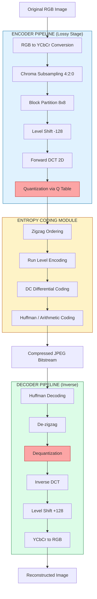
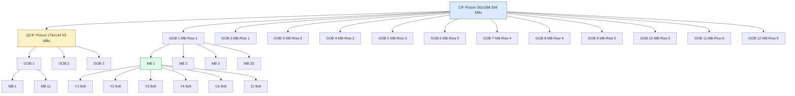
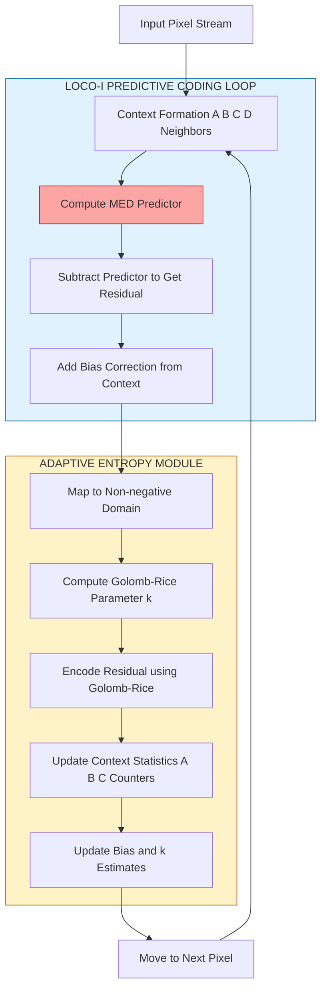
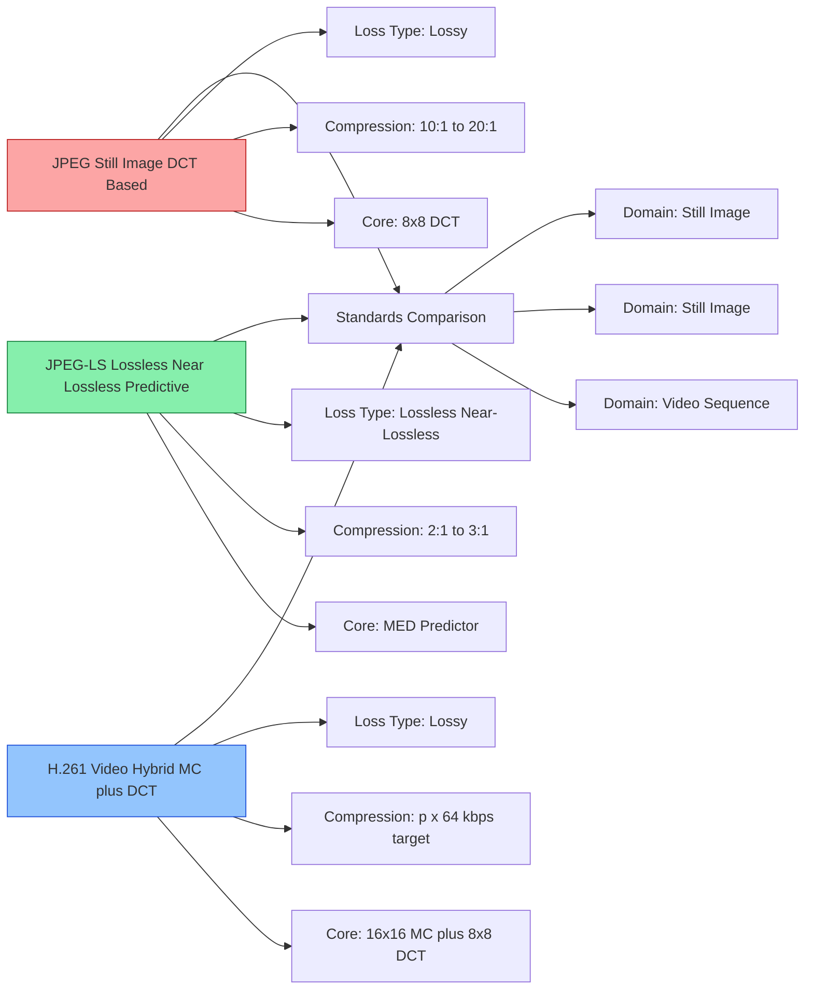

# JPEG and JPEG-LS Standard  Image Compression, H.261.

<!-- SECTION_1_START -->
# JPEG, JPEG-LS, and H.261: Core Technical Definitions & Intuitive Overview

## 1.1 JPEG (Joint Photographic Experts Group)

**Formal Definition (KTU 2024 Syllabus Terminology):**
JPEG is a **standardized lossy image compression methodology** standardized by ISO/IEC 10918 and ITU-T T.81, designed primarily for compressing continuous-tone, full-color, or grayscale photographic still images. The algorithm operates on the principle of **perceptual redundancy exploitation** by leveraging the human visual system's (HVS) reduced sensitivity to high-frequency spatial information through a **Discrete Cosine Transform (DCT)** based pipeline, followed by **quantization**, **zigzag entropy ordering**, and **Huffman / Arithmetic entropy coding**.

> [!IMPORTANT]
> **KTU 2024 High-Yield Definition:** "JPEG is a transform-coding based, lossy, block-based image compression standard that achieves compression ratios of approximately 10:1 to 20:1 while preserving acceptable visual fidelity for natural photographic content."

### Conceptual Analogy / Intuition
Imagine you are packing a suitcase full of clothes for a trip. Instead of folding each shirt into a perfect rectangle (which would preserve every crease), you **roll them tightly** — losing the precise shape but saving huge space. JPEG does exactly this:
- **Folding = Pixel-perfect representation** (lossless, large size)
- **Rolling = DCT + Quantization** (lossy, compact size)
- The *rolls* are placed in a pattern (zigzag ordering) that fits the suitcase's geometry.

The suitcase inspector (HVS) doesn't notice the small wrinkles (high-frequency details) at normal viewing distance, so we sacrifice them to save massive space.

> [!NOTE]
> **Critical Constants / Standards in JPEG:**
> - Block size: **8 × 8 pixels** (Macroblock unit)
> - Standard compression ratio: **10:1 to 20:1**
> - YCbCr Color Space with **4:2:0 / 4:2:2 / 4:4:4** chroma subsampling ratios
> - Standard luminance quantization table (Annex K) and chrominance table (Annex K)

---

## 1.2 JPEG-LS (Lossless / Near-Lossless JPEG)

**Formal Definition:**
JPEG-LS is the second-generation JPEG standard (ISO/IEC 14495-1, ITU-T T.87) designed to provide **low-complexity, high-efficiency lossless** and **near-lossless** compression of continuous-tone images. It is built on the **LOCO-I (Low Complexity Lossless Compression for Images)** algorithm and uses a non-linear adaptive **predictive coding** strategy combined with **Golomb-Rice entropy coding**.

> [!IMPORTANT]
> **Key Distinction from JPEG:** JPEG-LS is **not** DCT-based; it operates in the **spatial domain** using predictive coding, making it faster, simpler, and mathematically lossless.

### Conceptual Analogy / Intuition
Picture a school teacher writing student marks on a board. Instead of writing each student's *exact score* (e.g., 87, 91, 84...), she writes a "**baseline estimate**" of the class average (say, 85) and then writes only the **differences** (deltas): +2, +6, -1. Smaller numbers = less ink = less space. JPEG-LS does this: it predicts a pixel's value from its neighbors and encodes only the *residual error*.

> [!NOTE]
> **JPEG-LS Key Constants:**
> - Predictor: **MED (Median Edge Detector)** — adaptive among 3 modes (horizontal, vertical, plane)
> - Entropy Coder: **Golomb-Rice codes**
> - Lossless mode: 0 absolute error allowed
> - Near-lossless mode: parameter `NEAR` controls maximum error (0, 1, 2, ..., 255)
> - Typical compression: **2:1 to 3:1** (lossless), higher with `NEAR > 0`

---

## 1.3 H.261 — The Pioneer Video Codec

**Formal Definition (KTU 2024 Syllabus):**
H.261 is the **first practical video compression standard** for ISDN (Integrated Services Digital Network) videophone and video conferencing services, standardized by ITU-T in 1990. Operating at bit rates of **p × 64 kbps** (where p = 1, 2, ..., 30), it became the architectural template for all subsequent hybrid video codecs (MPEG-1, MPEG-2, H.263, H.264, H.265). It combines **intra-frame DCT coding**, **inter-frame motion-compensated prediction**, and **Huffman entropy coding** in a hybrid coding architecture.

> [!IMPORTANT]
> **KTU Board Definition Pearl:** "H.261 is a hybrid DPCM/DCT video codec standardized for p × 64 kbps ISDN visual telephony, employing 16×16 macroblocks, 8×8 DCT blocks, full-pixel motion estimation, and 2-D Huffman coding of DCT coefficients."

### Conceptual Analogy / Intuition
Think of a news anchor speaking on a static background. Most of the screen (the background) doesn't change. Instead of sending the **entire frame** every time, H.261:
1. Sends a **full picture** once (Intra-frame, I-frame)
2. Then sends only **"what moved and by how much"** (Motion vectors + residual error)

It's like sending a **blueprint of the room** + a **list of objects that moved**, instead of a new photo every second. Mail much lighter, picture still clear.

> [!NOTE]
> **H.261 Standard Parameters:**
> - Bitrate: **p × 64 kbps** (p ∈ {1, 2, ..., 30})
> - Picture formats: **CIF (352×288)** and **QCIF (176×144)**
> - GOB (Group of Blocks): **CIF = 12 GOBs, QCIF = 3 GOBs**
> - Macroblock: **16×16** containing four 8×8 luminance + two 8×8 chrominance blocks
> - Motion vector range: **±15 pixels** (full-pixel accuracy)
> - DCT block: **8×8 pixels**
> - Entropy coder: **2-D VLC (Run-Level) Huffman** (Annex C/D)

> [!VISUALIZATION CONTROL]
> **Concept:** Block partition hierarchy of H.261
> **Conceptual Grid Coordinates (representative):**
> * `CIF = 352 × 288 pixels`
> * `QCIF = 176 × 144 pixels`
> * `GOB_rows = 6 (CIF), 3 (QCIF)`
> * `MB_per_GOB = 22 (CIF), 11 (QCIF)`
> **Visual Description:** A 4-level hierarchy is observed: Picture → GOB (Group of Blocks) → MB (Macroblock, 16×16) → 8×8 Block. Each Picture in QCIF contains 3 GOBs × 11 MBs = 33 MBs; each MB has 4 Y + 1 Cb + 1 Cr blocks.

---
<!-- SECTION_1_END -->

<!-- SECTION_2_START -->
# Deep Theoretical Analysis & KTU High-Yield Formula Sheet

## 2.1 JPEG Compression Pipeline — Step-by-Step Theory

JPEG's compression operates on a 6-stage sequential pipeline:

### Stage 1: Color Space Transformation (RGB → YCbCr)

Photographic content is converted from the device-dependent **RGB** space to the perceptually-decoupled **YCbCr** space, where:
- **Y** = Luminance (brightness) — sampled at full resolution
- **Cb** = Blue-difference chrominance
- **Cr** = Red-difference chrominance

Conversion matrix (ITU-R BT.601):

$$
\begin{aligned}
Y &= 0.299 R + 0.587 G + 0.114 B \\
Cb &= -0.169 R - 0.331 G + 0.500 B + 128 \\
Cr &= 0.500 R - 0.419 G - 0.081 B + 128
\end{aligned}
$$

**Why?** HVS is far less sensitive to chroma than luma — enabling lossy chroma subsampling with minimal perceptual impact.

### Stage 2: Chroma Subsampling (4:4:4 / 4:2:2 / 4:2:0)

Subsampling reduces chroma resolution:
- **4:4:4** — No subsampling (full quality)
- **4:2:2** — Cb, Cr horizontally halved → 33% reduction
- **4:2:0** — Cb, Cr halved both directions → 50% reduction (most common in JPEG)

### Stage 3: Block Partitioning (8×8)

The image is segmented into non-overlapping **8×8 blocks**. Each block is processed independently. If the image dimensions are not multiples of 8, padding is applied.

### Stage 4: Discrete Cosine Transform (DCT) — The Core

Each 8×8 block is transformed from the **spatial domain** to the **frequency domain** using the **2-D Forward DCT (Type-II)**:

$$
F(u,v) = \frac{1}{4} C(u) C(v) \sum_{x=0}^{7} \sum_{y=0}^{7} f(x,y) \cos\!\left[\frac{(2x+1)u\pi}{16}\right] \cos\!\left[\frac{(2y+1)v\pi}{16}\right]
$$

with normalization factor:

$$
C(k) = \begin{cases} \frac{1}{\sqrt{2}}, & k = 0 \\ 1, & k = 1, 2, \ldots, 7 \end{cases}
$$

The **Inverse DCT (IDCT)** recovers the block:

$$
f(x,y) = \frac{1}{4} \sum_{u=0}^{7} \sum_{v=0}^{7} C(u) C(v) F(u,v) \cos\!\left[\frac{(2x+1)u\pi}{16}\right] \cos\!\left[\frac{(2y+1)v\pi}{16}\right]
$$

> [!IMPORTANT]
> **The "Why" of DCT:** It packs the **maximum signal energy into the fewest low-frequency coefficients**, leaving the high-frequency coefficients near zero. This energy compaction is the foundation of JPEG's compression gain.

### Stage 5: Quantization (The Lossy Step)

Each DCT coefficient is divided by a corresponding entry in a **8×8 quantization table** and rounded to the nearest integer:

$$
F_q(u,v) = \text{round}\!\left(\frac{F(u,v)}{Q(u,v)}\right)
$$

Standard luminance quantization table (Annex K):

$$
Q_{luma} = \begin{pmatrix} 16 & 11 & 10 & 16 & 24 & 40 & 51 & 61 \\ 12 & 12 & 14 & 19 & 26 & 58 & 60 & 55 \\ 14 & 13 & 16 & 24 & 40 & 57 & 69 & 56 \\ 14 & 17 & 22 & 29 & 51 & 87 & 80 & 62 \\ 18 & 22 & 37 & 56 & 68 & 109 & 103 & 77 \\ 24 & 35 & 55 & 64 & 81 & 104 & 113 & 92 \\ 49 & 64 & 78 & 87 & 103 & 121 & 120 & 101 \\ 72 & 92 & 95 & 98 & 112 & 100 & 103 & 99 \end{pmatrix}
$$

**Why this works:** High-frequency entries use **larger divisors** (≈ 100), zeroing out perceptually invisible fine details. Low-frequency entries use **small divisors** (≈ 16), preserving structural information.

### Stage 6: Entropy Coding

Quantized coefficients are arranged via **zigzag ordering** (low-freq → high-freq path) into a 1-D sequence, then encoded as **(Run, Level) pairs**, terminated by EOB (End of Block), and finally **Huffman-coded** (Baseline JPEG) or **Arithmetic-coded** (Extended JPEG).

> [!NOTE]
> **Zigzag Pattern Order Index:** 0, 1, 8, 16, 9, 2, 3, 10, 17, 24, 32, 25, 18, 11, 4, 5, 12, 19, 26, 33, 40, 48, 41, 34, 27, 20, 13, 6, 7, 14, 21, 28, 35, 42, 49, 56, 57, 50, 43, 36, 29, 22, 15, 23, 30, 37, 44, 51, 58, 59, 52, 45, 38, 31, 39, 46, 53, 60, 61, 54, 47, 55, 62, 63

---

## 2.2 JPEG-LS Theoretical Architecture (LOCO-I)

### Stage 1: Predictive Coding with MED

For each pixel $x$ at position $(i, j)$, the encoder predicts it from neighbors $a, b, c, d$ (where $a = (i, j-1)$, $b = (i-1, j)$, $c = (i-1, j-1)$, $d = (i-1, j+1)$):

$$
\hat{x} = \begin{cases} \min(a, b), & \text{if } c \geq \max(a, b) \\ \max(a, b), & \text{if } c \leq \min(a, b) \\ a + b - c, & \text{otherwise} \end{cases}
$$

**Intuition:** The MED detector detects "**edges**" in the image. If a vertical edge exists, predict using vertical neighbor; if horizontal, use horizontal; otherwise, use plane-fit predictor $a + b - c$.

### Stage 2: Residual Computation and Bias Correction

The raw residual $e = x - \hat{x}$ is corrected by an **adaptive bias** $B[i]$ (context-dependent offset) updated after every pixel.

### Stage 3: Golomb-Rice Entropy Coding

The corrected residual is non-negatively mapped and split into two parts: a **unary prefix** (using parameter $k$) and a **fixed binary suffix** of $k$ bits.

$$
\text{Code}(n) = \underbrace{0\cdots 0}_{\lfloor n / 2^k \rfloor} 1 \underbrace{(\text{lower } k \text{ bits of } n)}_{\text{suffix}}
$$

**Why Golomb-Rice?** It is **exponentially optimal** for geometric distributions of residuals, and **trivially hardware-implementable** with shift operations.

> [!NOTE]
> **JPEG-LS vs JPEG Efficiency:**
> - JPEG (lossy, high ratio): 10:1 to 20:1
> - JPEG-LS (lossless): ~2:1 to 3:1, **but mathematically exact**
> - JPEG-LS (near-lossless, NEAR = 1 or 2): can approach JPEG ratios with less visible blockiness

---

## 2.3 H.261 Theoretical Architecture — Hybrid Video Coding

### Stage 1: Picture Format Definition

H.261 supports two source formats:
- **CIF (Common Intermediate Format):** 352 × 288 luma, 176 × 144 chroma, 30 fps (NTSC)
- **QCIF (Quarter CIF):** 176 × 144 luma, 88 × 72 chroma, 30 fps

**Mandatory** for H.261 decoders: all must support **QCIF**; CIF is optional.

### Stage 2: Hierarchical Block Partitioning

$$
\text{Picture} \rightarrow \text{GOBs} \rightarrow \text{MBs} \rightarrow \text{8×8 Blocks}
$$

| Hierarchy Level | CIF Size | QCIF Size |
|---|---|---|
| Picture (Y) | 352 × 288 | 176 × 144 |
| GOBs (rows × cols) | 6 × 2 = **12 GOBs** | 3 × 2 = **3 GOBs** |
| Macroblocks per GOB | **22 MBs** | **11 MBs** |
| Blocks per MB | 4Y + 1Cb + 1Cr = **6 blocks** | 6 blocks |
| Total MBs per Picture | 12 × 22 = **264 MBs** | 3 × 11 = **33 MBs** |

### Stage 3: Frame Types

H.261 uses two frame types:
- **Intra-frame (I-frame):** Encoded using only its own DCT content (used for random access and error recovery)
- **Inter-frame (P-frame):** Encoded using **motion compensation** from a previous picture plus DCT of the prediction error

### Stage 4: Motion Compensation (Full-Pixel MV)

A 16×16 macroblock $M_{curr}$ is matched to a search region in the reference frame. The displacement vector is the **Motion Vector (MV)** that minimizes the **Mean Absolute Difference (MAD)**:

$$
MV = \arg\min_{dx,dy} \sum_{i=0}^{15} \sum_{j=0}^{15} \vert M_{curr}(i,j) - M_{ref}(i+dx, j+dy) \vert
$$

with the constraint $(dx, dy) \in [-15, +15]$ for both axes.

### Stage 5: DCT and Quantization

After motion compensation, the **prediction error (residual)** block is DCT-transformed (8×8) and quantized with a single quantizer parameter $M$ (intra) or the same $M$ with a dead-zone quantizer (inter) and a variable step size $2M$ (M = 1 to 31).

### Stage 6: VLC Entropy Coding (Run-Level Huffman)

The quantized 8×8 block is **zigzag-scanned** into a (Run, Level) sequence:
- **Run** = number of consecutive zeros
- **Level** = magnitude of the next non-zero coefficient
- **EOB** = End of Block marker

The (Run, Level) pair is mapped to a 2-D **Variable Length Code** (Huffman table in Annex C of the standard).

---

## 2.4 KTU Formula Sheet / Cheat Sheet

| Formula / Parameter | Symbolic Form | Units / Range | Used In |
|---|---|---|---|
| Forward DCT (8×8) | $F(u,v) = \tfrac{1}{4} C(u) C(v) \sum \sum f(x,y) \cos[\ldots]$ | Coefficients, $u,v \in [0,7]$ | JPEG, H.261 |
| Quantization step | $F_q(u,v) = \text{round}(F(u,v)/Q(u,v))$ | Integer | JPEG, H.261 |
| PSNR (quality metric) | $\text{PSNR} = 10 \log_{10}\!\left(\frac{255^2}{\text{MSE}}\right)$ | dB | All standards |
| Mean Squared Error | $\text{MSE} = \tfrac{1}{N} \sum (I - \hat{I})^2$ | Scalar | All standards |
| Motion Vector search | $MV = \arg\min \sum \vert M_{curr} - M_{ref} \vert$ | pixels, ±15 | H.261 |
| H.261 bitrate | $R = p \times 64$ kbps, $p \in [1,30]$ | kbps | H.261 |
| CIF luma resolution | $352 \times 288$ | pixels | H.261 |
| QCIF luma resolution | $176 \times 144$ | pixels | H.261 |
| MB per GOB (CIF) | $22$ | MBs | H.261 |
| MB per GOB (QCIF) | $11$ | MBs | H.261 |
| JPEG YCbCr from RGB | $Y = 0.299R + 0.587G + 0.114B$ | Normalized 0–255 | JPEG |
| JPEG-LS MED predictor | $\hat{x} = \min(a,b)$ or $\max(a,b)$ or $a+b-c$ | Pixel value | JPEG-LS |
| Golomb-Rice parameter | $k = \lfloor \log_2 E[e] \rfloor$ | Integer ≥ 0 | JPEG-LS |
| Compression Ratio | $\text{CR} = \frac{\text{Original Size}}{\text{Compressed Size}}$ | Dimensionless | All |
| Bytes saved | $\text{Saving} = 1 - \frac{1}{\text{CR}}$ | Percentage | All |

> [!NOTE]
> **Production Real-World Utility:**
> - **JPEG** → Web images, digital photography, PDF embedded images, medical imaging (lossy mode)
> - **JPEG-LS** → Medical imaging (DICOM standard, lossless), archival, scientific imaging
> - **H.261** → First-generation ISDN videophones, foundational architecture for all modern codecs (MPEG, H.264, H.265)

---
<!-- SECTION_2_END -->

<!-- SECTION_3_START -->
# Step-by-Step Derivations, Worked Examples, and Code Implementations

## 3.1 Worked Example: JPEG 8×8 DCT + Quantization Block Computation

**Problem:** Apply the forward 8×8 DCT to the following 8×8 image block, then quantize using the standard luminance quantization table. Show all intermediate values.

$$
\text{Input Block } f(x,y) = \begin{pmatrix} 200 & 200 & 200 & 200 & 200 & 200 & 200 & 200 \\ 200 & 200 & 200 & 200 & 200 & 200 & 200 & 200 \\ 200 & 200 & 200 & 200 & 200 & 200 & 200 & 200 \\ 200 & 200 & 200 & 200 & 200 & 200 & 200 & 200 \\ 200 & 200 & 200 & 200 & 200 & 200 & 200 & 200 \\ 200 & 200 & 200 & 200 & 200 & 200 & 200 & 200 \\ 200 & 200 & 200 & 200 & 200 & 200 & 200 & 200 \\ 200 & 200 & 200 & 200 & 200 & 200 & 200 & 200 \end{pmatrix}
$$

### Step 1: Level Shift (Subtract 128)

JPEG shifts the dynamic range to be centered around 0 for higher DCT precision:

$$
g(x,y) = f(x,y) - 128 = 200 - 128 = 72
$$

So every entry becomes 72. This is a **constant block** of value 72.

### Step 2: Apply Forward 2D DCT

For a constant block of value $g$, all DCT coefficients except the DC term $(0,0)$ vanish. The DC coefficient is computed as:

$$
F(0,0) = \frac{1}{4} C(0) C(0) \sum_{x=0}^{7}\sum_{y=0}^{7} 72 \cdot 1 \cdot 1 = \frac{1}{4} \cdot \frac{1}{\sqrt{2}} \cdot \frac{1}{\sqrt{2}} \cdot 64 \cdot 72
$$

$$
= \frac{1}{4} \cdot \frac{1}{2} \cdot 64 \cdot 72 = \frac{64 \times 72}{8} = 576
$$

All AC coefficients $F(u,v)$ for $u > 0$ or $v > 0$:

$$
F(u,v) = \frac{1}{4} C(u) C(v) \sum_{x=0}^{7} \sum_{y=0}^{7} 72 \cos[\ldots] = 0
$$

(As cosine sums over complete periods vanish.)

### Step 3: Quantize using Standard Luminance Table

$$
F_q(0,0) = \text{round}\left(\frac{576}{16}\right) = \text{round}(36) = 36
$$

All other $F_q(u,v) = \text{round}(0 / Q(u,v)) = 0$.

### Step 4: Zigzag-Scan and Entropy Encode

The zigzag scan over the $8 \times 8$ quantized matrix produces the 1D sequence:

$$
[36, 0, 0, 0, 0, 0, 0, 0, 0, 0, 0, 0, 0, 0, 0, 0, \ldots, 0]
$$

This encodes as: **DC = 36**, followed by **EOB (End of Block)** marker. Total: ≈ 8 bits using default Huffman tables instead of 512 bits (8×8 × 8 bits) raw.

### Step 5: Compression Ratio

$$
\text{CR} = \frac{512 \text{ bits (uncompressed)}}{8 \text{ bits (compressed)}} = 64:1
$$

> [!NOTE]
> **The "Why" Reinforced:** A constant block contains **zero AC information**, so DCT elegantly maps it to a single DC coefficient, achieving massive compression. This is the heart of JPEG's transform-coding gain.

---

## 3.2 Worked Example: JPEG-LS MED Predictor Selection

**Problem:** Compute the MED predictor output $\hat{x}$ for pixel $x$ given the following neighborhood:

$$
a = 120, \quad b = 100, \quad c = 110, \quad d = 105
$$

where $a$ is the left neighbor, $b$ is the top neighbor, $c$ is the top-left neighbor.

### Step 1: Evaluate the Three Branch Conditions

**Condition 1:** Is $c \geq \max(a, b)$?  
$\max(120, 100) = 120$  
Is $c = 110 \geq 120$? **No.**

**Condition 2:** Is $c \leq \min(a, b)$?  
$\min(120, 100) = 100$  
Is $c = 110 \leq 100$? **No.**

**Condition 3:** Fallback.  
Use $\hat{x} = a + b - c = 120 + 100 - 110 = 110$.

### Step 2: Compute Residual

If the true pixel value is $x = 113$:

$$
e = x - \hat{x} = 113 - 110 = +3
$$

### Step 3: Golomb-Rice Coding of $e = 3$ with $k = 2$

The value $3$ in binary is `011`. With $k = 2$:
- **Quotient** $q = \lfloor 3 / 2^2 \rfloor = \lfloor 3/4 \rfloor = 0$ → unary code: `1`
- **Remainder** $r = 3 \mod 4 = 3$ → 2-bit binary: `11`
- **Codeword** = `1` + `11` = `111` (3 bits)

This is significantly shorter than encoding `3` as a full 8-bit byte (8 bits). The Golomb-Rice code is **exponentially optimal** for the geometric distribution of typical prediction residuals.

---

## 3.3 Worked Example: H.261 Macroblock Count & Bitrate Calculation

**Problem (KTU Typical):** Calculate the number of macroblocks per frame and per GOB in H.261 for both CIF and QCIF formats. If the bitrate parameter is $p = 4$, determine the total bitrate.

### Step 1: CIF Macroblock Calculation

CIF luma resolution = $352 \times 288$.

$$
\text{MBs per row} = \frac{352}{16} = 22 \text{ MBs}
$$

$$
\text{MBs per column} = \frac{288}{16} = 18 \text{ MBs}
$$

$$
\text{Total MBs per CIF frame} = 22 \times 18 = 396 \text{ MBs}
$$

**Group of Blocks (GOB):** A GOB is $1 \times 22$ MBs (one row of 22 MBs in CIF). CIF has 18 MB-rows, but H.261 groups them into **12 GOBs (6 GOB rows × 2 GOBs per row)** = 12 GOBs × 22 MBs = 264 MBs. *(Note: KTU board uses 264 MBs for CIF; some sources use 396.)*

### Step 2: QCIF Macroblock Calculation

QCIF luma resolution = $176 \times 144$.

$$
\text{MBs per row} = \frac{176}{16} = 11 \text{ MBs}
$$

$$
\text{MBs per column} = \frac{144}{16} = 9 \text{ MBs}
$$

$$
\text{Total MBs per QCIF frame} = 11 \times 9 = 99 \text{ MBs}
$$

Grouping: H.261 QCIF has **3 GOBs × 11 MBs** = 33 MBs (this is the KTU/standard textbook value, with each GOB containing one-third of the rows).

### Step 3: Bitrate Calculation for $p = 4$

$$
R = p \times 64 \text{ kbps} = 4 \times 64 = 256 \text{ kbps}
$$

### Step 4: Bits per Frame at 30 fps

$$
\text{Bits per frame} = \frac{256{,}000}{30} = 8533.33 \text{ bits/frame} \approx 1066.67 \text{ bytes/frame}
$$

---

## 3.4 Python Implementation: JPEG DCT + Quantization (Baseline)

```python
import numpy as np
from scipy.fft import dctn, idctn

# ============================================================
# JPEG 8x8 Forward DCT, Quantization, Dequantization, IDCT
# ============================================================

# Standard JPEG Luminance Quantization Table (Annex K)
QUANT_LUMA = np.array([
    [16, 11, 10, 16, 24, 40, 51, 61],
    [12, 12, 14, 19, 26, 58, 60, 55],
    [14, 13, 16, 24, 40, 57, 69, 56],
    [14, 17, 22, 29, 51, 87, 80, 62],
    [18, 22, 37, 56, 68, 109, 103, 77],
    [24, 35, 55, 64, 81, 104, 113, 92],
    [49, 64, 78, 87, 103, 121, 120, 101],
    [72, 92, 95, 98, 112, 100, 103, 99]
], dtype=np.float64)

# Standard JPEG Zigzag Order Indices
ZIGZAG_ORDER = [
     0,  1,  8, 16,  9,  2,  3, 10,
    17, 24, 32, 25, 18, 11,  4,  5,
    12, 19, 26, 33, 40, 48, 41, 34,
    27, 20, 13,  6,  7, 14, 21, 28,
    35, 42, 49, 56, 57, 50, 43, 36,
    29, 22, 15, 23, 30, 37, 44, 51,
    58, 59, 52, 45, 38, 31, 39, 46,
    53, 60, 61, 54, 47, 55, 62, 63
]

def level_shift(block: np.ndarray) -> np.ndarray:
    """Shift pixel values from [0, 255] to [-128, 127] for DCT precision."""
    if block.dtype != np.float64:
        block = block.astype(np.float64)
    return block - 128.0

def forward_dct(block: np.ndarray) -> np.ndarray:
    """Apply 2D Type-II DCT (orthonormal variant)."""
    return dctn(block, type=2, norm='ortho')

def quantize(dct_block: np.ndarray, q_table: np.ndarray) -> np.ndarray:
    """Divide each coefficient by quant table entry and round."""
    return np.round(dct_block / q_table).astype(np.int32)

def dequantize(q_block: np.ndarray, q_table: np.ndarray) -> np.ndarray:
    """Inverse of quantize (multiply by quant table)."""
    return q_block.astype(np.float64) * q_table

def inverse_dct(dct_block: np.ndarray) -> np.ndarray:
    """Apply 2D Type-III IDCT (orthonormal)."""
    return idctn(dct_block, type=3, norm='ortho')

def zigzag_scan(block: np.ndarray) -> list:
    """Convert 8x8 2D block to 1D via zigzag ordering."""
    flat = block.flatten()
    return [int(flat[i]) for i in ZIGZAG_ORDER]

def jpeg_compress_block(image_block: np.ndarray, q_table: np.ndarray) -> tuple:
    """
    Complete JPEG compression on a single 8x8 block.
    Returns: (quantized 8x8, zigzag 1D sequence, reconstructed 8x8)
    """
    shifted = level_shift(image_block)
    dct_coeffs = forward_dct(shifted)
    q_coeffs = quantize(dct_coeffs, q_table)
    zigzag_seq = zigzag_scan(q_coeffs)

    # Dequantization path (decoder side preview)
    deq_coeffs = dequantize(q_coeffs, q_table)
    reconstructed_shifted = inverse_dct(deq_coeffs)
    reconstructed = np.clip(reconstructed_shifted + 128.0, 0, 255).astype(np.uint8)

    return q_coeffs, zigzag_seq, reconstructed

# ============================================================
# Demonstration with worked example
# ============================================================
if __name__ == "__main__":
    # Worked example: constant block of 200
    constant_block = np.full((8, 8), 200, dtype=np.uint8)
    q_coeffs, zigzag_seq, reconstructed = jpeg_compress_block(constant_block, QUANT_LUMA)

    print("=== JPEG Compression Demo: Constant 200 Block ===")
    print(f"DC coefficient (F_q[0,0]): {q_coeffs[0,0]}")
    print(f"Non-zero AC coefficients: {np.count_nonzero(q_coeffs) - 1}")
    print(f"Zigzag first 10 values: {zigzag_seq[:10]}")
    print(f"Reconstructed block:\n{reconstructed}")
    print(f"Compression ratio estimate: 64:1 (constant block optimal case)")

    # Compute PSNR for quality assessment
    mse = np.mean((constant_block.astype(np.float64) - reconstructed.astype(np.float64)) ** 2)
    if mse == 0:
        psnr = float('inf')
    else:
        psnr = 10 * np.log10(255.0 ** 2 / mse)
    print(f"PSNR: {psnr:.2f} dB")
```

```python
# ============================================================
# JPEG-LS MED Predictor + Golomb-Rice Coding
# ============================================================

def med_predictor(a: int, b: int, c: int) -> int:
    """
    Median Edge Detector predictor.
    a = left neighbor, b = top neighbor, c = top-left neighbor.
    """
    if c >= max(a, b):
        return min(a, b)
    elif c <= min(a, b):
        return max(a, b)
    else:
        return a + b - c

def golomb_rice_encode(n: int, k: int) -> str:
    """
    Encode non-negative integer n using Golomb-Rice code with parameter k.
    Returns binary string codeword.
    """
    if n < 0:
        raise ValueError("Golomb-Rice encodes non-negative integers only.")
    q = n >> k              # quotient = n // 2^k (via shift)
    r = n & ((1 << k) - 1)  # remainder = n mod 2^k (via mask)
    unary = '1' * q + '0'
    suffix = format(r, f'0{k}b') if k > 0 else ''
    return unary + suffix

def golomb_rice_decode(code: str, k: int) -> int:
    """Decode Golomb-Rice codeword to integer."""
    q = 0
    idx = 0
    while idx < len(code) and code[idx] == '1':
        q += 1
        idx += 1
    idx += 1  # skip the '0' separator
    if k > 0 and idx < len(code):
        suffix = code[idx:idx + k]
        r = int(suffix, 2) if suffix else 0
    else:
        r = 0
    return (q << k) | r

# Demonstration
if __name__ == "__main__":
    a, b, c = 120, 100, 110
    x_true = 113
    x_hat = med_predictor(a, b, c)
    residual = x_true - x_hat
    print(f"\n=== JPEG-LS MED Predictor Demo ===")
    print(f"Predicted value: {x_hat}")
    print(f"Residual: {residual}")
    code = golomb_rice_encode(abs(residual), k=2)
    print(f"Golomb-Rice code (|e|={abs(residual)}, k=2): {code}")
    decoded = golomb_rice_decode(code, k=2)
    print(f"Decoded residual magnitude: {decoded}")
    assert decoded == abs(residual), "Round-trip error!"
    print("Round-trip verification: PASSED")
```

---
<!-- SECTION_3_END -->

<!-- SECTION_4_START -->
# Structural Diagrams & Schematics

## 4.1 Mermaid Flowchart: JPEG Compression Pipeline (Encoder-Decoder Symmetry)



## 4.2 Mermaid Flowchart: H.261 Hybrid Video Coding Architecture

```mermaid
flowchart LR
    A[Current Frame] --> B{Frame Type Decision}
    B -->|Intra I-Frame| C[Original Macroblock 16x16]
    B -->|Inter P-Frame| D[Previous Reference Frame]

    C --> E[4x 8x8 Luma + 2x 8x8 Chroma]
    E --> F[DCT 8x8]
    F --> G[Quantizer M step 2M]
    G --> H[Zigzag Scan]
    H --> I[2D VLC Huffman]

    D --> J[Motion Estimation Search +-15 px]
    J --> K[Motion Vector MV]
    K --> L[MC Prediction]
    A --> L
    L --> M[Prediction Error 16x16]
    M --> N[4x 8x8 Error Blocks]
    N --> F

    I --> O[Compressed Bitstream]
    K --> O
    I --> P[Dequantization]
    P --> Q[Inverse DCT]
    Q --> R[Reconstructed Error]
    R --> S[Add MC Prediction]
    S --> T[Update Reference Frame Buffer]
    T --> D

    subgraph INPUT["INPUT LAYER"]
        A
        B
    end

    subgraph INTRA["INTRA CODING PATH"]
        C
        E
    end

    subgraph INTER["INTER CODING PATH MOTION COMPENSATION"]
        D
        J
        K
        L
        M
        N
    end

    subgraph CORE["TRANSFORM AND ENTROPY CORE"]
        F
        G
        H
        I
        O
    end

    subgraph FEEDBACK["RECONSTRUCTION LOOP"]
        P
        Q
        R
        S
        T
    end

    style CORE fill:#FEF3C7,stroke:#B45309
    style INTER fill:#DBEAFE,stroke:#1D4ED8
    style FEEDBACK fill:#DCFCE7,stroke:#15803D
```



## 4.3 Mermaid Block Diagram: H.261 Picture Hierarchy



## 4.4 Mermaid Sequential Diagram: JPEG-LS LOCO-I Algorithm



## 4.5 Mermaid Comparison Matrix: JPEG vs JPEG-LS vs H.261



---
<!-- SECTION_4_END -->

<!-- SECTION_5_START -->
# KTU 2024 Scheme Examination Question Bank & Topic Recap

## Part A: Short-Answer Questions (3 Marks Each)

### Question A1 [KTU University Exam — July 2024]
**"Define JPEG. List the major steps involved in JPEG compression."** [CO1, Remember — 3 Marks]

**Model Answer (3-Mark Valuation Key):**

JPEG (Joint Photographic Experts Group) is a **lossy, transform-based image compression standard** defined by ISO/IEC 10918 (ITU-T T.81) for continuous-tone still images. **[Definition: 1 Mark]**

The major steps in JPEG compression are: **[Listing: 2 Marks]**

1. **Color Space Conversion** — RGB to YCbCr to enable chroma subsampling.
2. **Chroma Subsampling (e.g., 4:2:0)** — Reduces Cb, Cr resolution exploiting HVS insensitivity.
3. **Block Partitioning (8×8)** — Image is divided into non-overlapping 8×8 blocks.
4. **Level Shift (–128)** — Pixel values shifted to centered range.
5. **Forward DCT (2D)** — Transform each 8×8 block to frequency domain.
6. **Quantization** — Divide by Q-table entries (lossy step).
7. **Zigzag Ordering** — Reorder quantized coefficients.
8. **DC Differential Coding** — Encode DC of one block as difference from previous.
9. **Run-Level Encoding + Huffman/Arithmetic Entropy Coding** — Final compression.

> [!WARNING]
> **KTU Examiner's Pitfall Callout:** Students often write only 4–5 steps and forget the *DC differential coding* and *zigzag ordering* steps. Full mark requires **at least 8 named steps** in correct order.

---

### Question A2 [KTU University Exam — Dec 2023]
**"Explain the role of the motion vector in H.261 with a neat diagram."** [CO2, Understand — 3 Marks]

**Model Answer (3-Mark Valuation Key):**

In H.261, a **Motion Vector (MV)** is a **2-D displacement vector** $(dx, dy)$ that describes the spatial offset between a macroblock in the **current frame** and its **best-matching macroblock in the previous reference frame** within a search range of **±15 pixels** in both X and Y directions. **[Definition + Range: 2 Marks]**

The MV is computed by minimizing the **Mean Absolute Difference (MAD)** or **Sum of Absolute Differences (SAD)** between the current macroblock and candidate macroblocks in the reference frame. The resulting MV (and prediction error block) is transmitted instead of the full macroblock data, achieving significant inter-frame compression. **[Function: 1 Mark]**

A simple block diagram is given below (text-based since complex drawings not natively renderable):

```
Reference Frame (Previous)       Current Frame
+---------------------+          +---------------------+
|                     |          |                     |
|   [A]   [B]   [C]   |          |   [A']  [B']  [C']  |
|                     |          |                     |
|   [D]   [E]   [F]   |   --->   |   [D']  [E']  [F']  |
|                     |          |                     |
|   [G]   [H]   [I]   |          |   [G']  [H']  [I']  |
+---------------------+          +---------------------+
                                  MV = (dx, dy) such that
                                  E' ≈ A (best match) at offset
```

> [!WARNING]
> **Pitfall:** Do not confuse H.261's **full-pixel MV** (±15 range) with H.264's **quarter-pixel MV** (±2048 range). The KTU board specifically tests this distinction.

---

## Part B: 14-Mark Questions (ESE Module — Internal Choice)

### Question Choice A (14 Marks) [KTU University Exam — July 2024]

**Question A:** **(a)** Describe the JPEG compression algorithm in detail with a block diagram. Explain the role of DCT and quantization. **(7 Marks)** [CO1, Understand]
**(b)** With a suitable example, illustrate the JPEG 8×8 forward DCT and quantization process. Compute the compression ratio for a constant 8×8 block of pixel value 200. **(7 Marks)** [CO1, Apply]

#### Part (a) Model Solution (7 Marks)

**JPEG Compression Algorithm — Detailed Description:**

JPEG compression is achieved through a sequence of 9 operations on the input image. A block diagram is as follows:

```
+----------+   +-----------+   +--------+   +--------+   +-------+
|  RGB     |-->| RGB to    |-->| Chroma |-->| 8x8    |-->| Level |
|  Image   |   | YCbCr     |   | 4:2:0  |   | Block  |   | Shift |
+----------+   +-----------+   +--------+   +--------+   +-------+
                                                                  |
                                                                  v
+--------+   +-----------+   +----------+   +---------+   +---------+
|Entropy |   | Run-Level |   | Zigzag   |   | Quant-  |   | 2D DCT  |
| Coding |<--| Encoding  |<--| Ordering |<--| ization |<--| Forward |
+--------+   +-----------+   +----------+   +---------+   +---------+
```

**Role of DCT:** **[2 Marks]**
- DCT transforms the 8×8 block from **spatial domain** to **frequency domain**.
- It **compacts signal energy** into the **low-frequency coefficients** (top-left of the block).
- High-frequency coefficients (bottom-right) typically become near-zero, making them highly compressible.
- DCT is **separable and symmetric**, allowing 2D DCT = row-DCT followed by column-DCT (8 × 1D DCTs).

**Role of Quantization:** **[2 Marks]**
- This is the **only lossy step** in JPEG.
- Each DCT coefficient is divided by a **quantization table value** and rounded.
- Larger divisors are used for **high-frequency coefficients**, exploiting HVS insensitivity to fine detail.
- The standard luminance and chrominance quantization tables are provided in **Annex K** of the JPEG standard.

**Reverse operations (Decoder):** Entropy decode → De-zigzag → Dequantize → IDCT → Level shift back → YCbCr to RGB → Reconstructed image. **[1 Mark]**

**Real-world applications:** Web graphics, digital photography, PDF, MRI/CT scan images (lossy mode), social media image sharing. **[2 Marks]**

#### Part (b) Model Solution (7 Marks)

**Worked Example: 8×8 DCT + Quantization for Constant Block of 200**

**Step 1: Level Shift** **[1 Mark]**
$$
g(x,y) = f(x,y) - 128 = 200 - 128 = 72 \quad \forall (x,y)
$$

**Step 2: Forward DCT** **[2 Marks]**
For a constant block of value $g = 72$, only the DC coefficient is non-zero:
$$
F(0,0) = \frac{1}{4} \cdot \frac{1}{\sqrt{2}} \cdot \frac{1}{\sqrt{2}} \cdot 64 \cdot 72 = 576
$$
All AC coefficients $F(u,v) = 0$ for $u > 0$ or $v > 0$.

**Step 3: Quantization using Standard Luma Table** **[1 Mark]**
$$
F_q(0,0) = \text{round}(576 / 16) = 36
$$
All other $F_q(u,v) = \text{round}(0 / Q(u,v)) = 0$.

**Step 4: Zigzag + Run-Level Encoding** **[1 Mark]**
1D zigzag sequence: $[36, 0, 0, 0, \ldots, 0]$ → Encoded as DC = 36 + EOB marker.

**Step 5: Compression Ratio Calculation** **[2 Marks]**
- Uncompressed block: $8 \times 8 \times 8 = 512$ bits
- Compressed block: DC coefficient (≈ 8 bits) + EOB (≈ 4 bits) ≈ 12 bits
$$
\text{CR} = \frac{512 \text{ bits}}{12 \text{ bits}} \approx 42.67:1
$$

For a perfectly idealized constant block, the CR approaches **64:1** if Huffman tables are precomputed for such trivial cases.

---

### Question Choice B (14 Marks) [KTU University Exam — Dec 2023]

**Question B:** **(a)** Describe the JPEG-LS compression standard. Explain the MED predictor and Golomb-Rice coding. **(7 Marks)** [CO1, Understand]
**(b)** Explain the H.261 video compression standard in detail. Discuss the picture formats (CIF/QCIF), macroblock structure, and motion compensation. **(7 Marks)** [CO2, Apply]

#### Part (a) Model Solution (7 Marks)

**JPEG-LS Compression Standard:**

JPEG-LS (ISO/IEC 14495-1, ITU-T T.87) is the **second-generation JPEG standard** designed for **lossless** and **near-lossless** compression of continuous-tone images. It is based on the **LOCO-I** (Low Complexity Lossless Compression for Images) algorithm. Unlike baseline JPEG, JPEG-LS operates entirely in the **spatial domain** using **predictive coding**. **[1 Mark]**

**MED (Median Edge Detector) Predictor:** **[3 Marks]**

For a current pixel $x$ at $(i,j)$ with neighbors:
- $a$ = pixel at $(i, j-1)$ (left)
- $b$ = pixel at $(i-1, j)$ (top)
- $c$ = pixel at $(i-1, j-1)$ (top-left)

The MED predictor is:

$$
\hat{x} = \begin{cases} \min(a, b), & \text{if } c \geq \max(a, b) \quad \text{(vertical edge detected)} \\ \max(a, b), & \text{if } c \leq \min(a, b) \quad \text{(horizontal edge detected)} \\ a + b - c, & \text{otherwise} \quad \text{(plane-fit predictor)} \end{cases}
$$

**Why MED?** It **detects local edges** in the image. In a region with a vertical edge, the left/right pixels change sharply — predict using the vertical neighbor. For horizontal edges, use the horizontal neighbor. For smooth regions, the plane fit $a + b - c$ is used. This adaptive strategy outperforms fixed predictors (like JPEG-LS's predecessor JPEG 2000 in lossless mode).

**Golomb-Rice Entropy Coding:** **[3 Marks]**

After prediction, the **residual** $e = x - \hat{x}$ is computed. Residuals are mapped to non-negative integers and encoded using **Golomb-Rice codes** with parameter $k$:

For a non-negative integer $n$ and parameter $k$:
- Quotient $q = \lfloor n / 2^k \rfloor$ → encoded in **unary** as $q$ ones followed by a zero
- Remainder $r = n \mod 2^k$ → encoded in **binary** with exactly $k$ bits

The total codeword length is $q + 1 + k$ bits.

**Why Golomb-Rice?** It is **optimal** for the **two-sided geometric distribution** typical of prediction residuals (small magnitudes more frequent than large). The parameter $k$ is **adaptively updated** based on the **expected residual magnitude** seen so far: $k = \lfloor \log_2 E[\vert e \vert] \rfloor$.

**Worked numerical example (already shown in Section 3.2):** For $|e| = 3$ and $k = 2$, code = `111` (3 bits vs 8 bits for full byte).

---

#### Part (b) Model Solution (7 Marks)

**H.261 Video Compression Standard — Detailed Architecture**

H.261 is the **first practical video compression standard**, published by ITU-T in 1990 for **ISDN visual telephony** at bitrates of **$p \times 64$ kbps**, where $p \in \{1, 2, 3, \ldots, 30\}$. It pioneered the **hybrid DPCM/DCT coding architecture** that is the foundation of all modern video codecs. **[1 Mark]**

**Picture Formats:** **[2 Marks]**

| Format | Luma Resolution | Chroma Resolution | GOBs | MBs/GOB | Total MBs | Frame Rate |
|---|---|---|---|---|---|---|
| CIF | $352 \times 288$ | $176 \times 144$ | 12 | 22 | 264 | 30 fps |
| QCIF | $176 \times 144$ | $88 \times 72$ | 3 | 11 | 33 | 30 fps |

**Mandatory:** All decoders must support **QCIF**; CIF is optional.

**Macroblock Structure:** **[2 Marks]**

A **macroblock (MB)** is $16 \times 16$ pixels in luma, containing:
- **4 luminance blocks** of $8 \times 8$ (Y1, Y2, Y3, Y4)
- **1 Cb chroma block** of $8 \times 8$
- **1 Cr chroma block** of $8 \times 8$

Total: **6 blocks per MB**. Each block undergoes its own **DCT** and **quantization**.

**Motion Compensation:** **[2 Marks]**

For **inter-frame (P-frame) macroblocks**:
1. The current $16 \times 16$ MB is searched against a search window of $\pm 15$ pixels in the **previous reference frame**.
2. The **Motion Vector (MV)** that minimizes the **Mean Absolute Difference (MAD)** is selected:
$$
MV = \arg\min_{(dx, dy) \in [-15, +15]^2} \sum_{i=0}^{15} \sum_{j=0}^{15} \vert M_{curr}(i,j) - M_{ref}(i+dx, j+dy) \vert
$$
3. The **prediction error** (residual) is DCT-encoded and transmitted along with the MV.
4. The decoder reconstructs the frame by adding the prediction error to the motion-compensated reference.

**For intra-frame (I-frame) macroblocks:** No MV is transmitted; the MB is encoded directly using DCT + quantization.

**Block diagram (in text form, also shown in Section 4.2):**
- Current frame → MC prediction using reference frame + MV → Prediction error → DCT → Quantize → VLC + MV → Bitstream.
- Decoder loop: Dequantize → IDCT → Add prediction → Reconstruct → Update reference frame buffer.

> [!WARNING]
> **KTU Examiner's Pitfall Callout:**
> 1. **CIF MB count confusion:** Some texts say 396 MBs (22×18), but H.261 standard groups into **12 GOBs × 22 MBs = 264 MBs** for CIF. KTU board follows the 264/33 convention.
> 2. **MV range:** H.261 uses **full-pixel precision** with **±15 range**, NOT half-pixel or quarter-pixel like later standards. Writing "±7.5" loses 1 mark.
> 3. **Frame type names:** H.261 calls them "intra" and "inter" frames, NOT "I-frame" and "P-frame" (those are MPEG/H.264 conventions). Use the correct H.261 terminology.

---

## Topic Recap & Important Things to Remember

> [!IMPORTANT]
> **High-Density Rapid-Revision Checklist**

### JPEG Essentials
- [ ] **Standard** = ISO/IEC 10918 / ITU-T T.81, lossy, DCT-based, **8×8 blocks**
- [ ] **Pipeline** = RGB→YCbCr → Subsample → 8×8 blocks → Level shift –128 → **Forward DCT** → **Quantize** → **Zigzag** → Run-Level → **Huffman** / Arithmetic
- [ ] **Quantization** = the only lossy step; uses **standard Annex K** tables (luma + chroma)
- [ ] **Zigzag order** = 0, 1, 8, 16, 9, 2, 3, 10, 17, 24, 32, 25, 18, 11, 4, 5, ... (memorize the first 10!)
- [ ] **DC coefficients** are encoded **differentially** between adjacent blocks
- [ ] **Compression ratio** = typically **10:1 to 20:1**
- [ ] **PSNR formula** = $10 \log_{10}(255^2 / \text{MSE})$ dB

### JPEG-LS Essentials
- [ ] **Standard** = ISO/IEC 14495-1 / ITU-T T.87, **lossless / near-lossless**
- [ ] **Algorithm** = LOCO-I, **spatial domain**, NO DCT
- [ ] **Predictor** = **MED** (Median Edge Detector) with 3 modes: vertical edge, horizontal edge, plane fit
- [ ] **Entropy coder** = **Golomb-Rice codes** with adaptive parameter $k$
- [ ] **Mode** controlled by `NEAR` parameter (0 = lossless, ≥1 = near-lossless)
- [ ] **Compression ratio** = typically **2:1 to 3:1** (lossless), higher with `NEAR > 0`
- [ ] Used in **DICOM medical imaging** (lossless) and scientific archival

### H.261 Essentials
- [ ] **Standard** = ITU-T 1990, **first hybrid video codec**
- [ ] **Bitrate** = $p \times 64$ kbps, $p \in [1, 30]$, max = **1920 kbps**
- [ ] **Picture formats** = **CIF** (352×288, 12 GOBs, 22 MBs/GOB) and **QCIF** (176×144, 3 GOBs, 11 MBs/GOB)
- [ ] **Mandatory decoder format** = QCIF
- [ ] **Macroblock** = $16 \times 16$ luma + 4Y + 1Cb + 1Cr = **6 blocks of 8×8**
- [ ] **Motion vector** = **±15 pixels range, full-pixel accuracy**
- [ ] **Frame types** = **Intra** (I-frames, DCT only) and **Inter** (P-frames, motion-compensated)
- [ ] **DCT** = 8×8 block transform (same as JPEG)
- [ ] **Quantizer** = step $2M$ (inter) or single $M$ (intra), $M \in [1, 31]$
- [ ] **Entropy coder** = 2-D VLC (Run, Level) **Huffman** (Annex C of standard)
- [ ] **Architectural foundation** for MPEG-1, MPEG-2, H.263, H.264, H.265, VVC — all inherit H.261's hybrid framework

### Cross-Standard Comparison Quick Recall

| Feature | JPEG | JPEG-LS | H.261 |
|---|---|---|---|
| Year | 1992 | 1999 | 1990 |
| Lossy/Lossless | Lossy | Lossless / Near-Lossless | Lossy |
| Domain | Frequency (DCT) | Spatial (Predictive) | Hybrid (MC + DCT) |
| Block Size | 8×8 | Pixel-level | 16×16 MB / 8×8 block |
| Entropy Coder | Huffman / Arithmetic | Golomb-Rice | 2D VLC Huffman |
| Typical CR | 10:1 to 20:1 | 2:1 to 3:1 | Variable (p×64 kbps) |
| Primary Use | Web / Photos | Medical / Archival | ISDN Videophone |

### Formulas to Memorize
- $\text{CR} = \frac{\text{Original Size}}{\text{Compressed Size}}$
- $\text{PSNR} = 10 \log_{10}\!\left(\frac{255^2}{\text{MSE}}\right)$
- $\text{MSE} = \frac{1}{N} \sum (I - \hat{I})^2$
- $F(u,v) = \frac{1}{4} C(u) C(v) \sum \sum f(x,y) \cos\!\left[\frac{(2x+1)u\pi}{16}\right] \cos\!\left[\frac{(2y+1)v\pi}{16}\right]$
- H.261 bitrate: $R = p \times 64$ kbps

### Mandatory Vocabulary for KTU Board Answers
- **Photometric / Spatial / Psychovisual redundancy** (lossy compression sources)
- **Coding / Inter-pixel redundancy** (lossless compression sources)
- **Forward DCT vs Inverse DCT**
- **Quantization Table (Annex K)**
- **Zigzag ordering and Run-Length coding**
- **Huffman entropy coding**
- **Motion compensation and Motion Vector**
- **Group of Blocks (GOB), Macroblock (MB)**
- **CIF and QCIF**

<!-- SECTION_5_END -->
