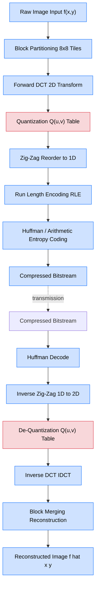
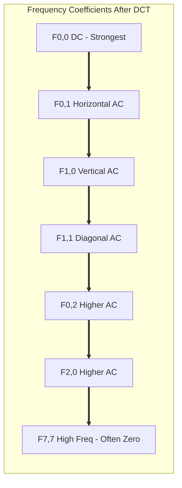

# Lossy Compression Algorithms- Transform Coding.

<!-- SECTION_1_START -->

# Transform Coding — Lossy Compression Algorithm

## 1. Core Technical Definition

> [!IMPORTANT]
> **Formal Definition (KTU Syllabus Terminology):**
> *Transform Coding* is a **lossy compression** technique in which the input data (image, audio, or video samples) is mathematically transformed from the **spatial/time domain** into a **frequency domain** representation using a linear, invertible transform. The transformed coefficients are then quantized and entropy-coded to achieve compression. The dominant transform used in image and video compression standards (JPEG, MPEG, H.26x) is the **Discrete Cosine Transform (DCT)**.

The fundamental premise is that natural signals (images, audio) carry most of their perceptual information in a small number of low-frequency coefficients, while high-frequency components contribute minor details that the human eye/ear tolerates discarding.

> [!NOTE]
> **Why "Lossy"?**
> The compression becomes irreversible at the **quantization stage**, where coefficients are rounded to discrete levels. The transform itself is mathematically lossless and invertible; only quantization destroys information.

---

## 2. Conceptual Analogy — The "Recipe Translator" Intuition

Imagine you have a **photograph of a sunset** containing thousands of pixels with varying red, orange, and purple values. Writing down each pixel value individually (raw storage) is like describing a song **note-by-note**.

**Transform Coding** is like converting the song into a **musical score** — instead of "E for 1 second, F for 0.5 seconds, E for 1 second…", you write "Verse in **C Major**, tempo 90 BPM, key change to A minor in bar 8." The score (frequency domain) is *far more compact* and conveys the *same perceptual essence*.

| Domain Type | What It Stores | Example | Compression Potential |
|---|---|---|---|
| **Spatial Domain** | Raw pixel intensities | $f(x,y) = 128$ | Low — every sample must be kept |
| **Frequency Domain** | Wave components | $F(u,v) = $ cosines of varying freq. | High — many can be discarded |

> [!TIP]
> **Real-world mental model:** The sky in a photo is *smooth* (low frequency). A leaf's edge is *sharp* (high frequency). Our eyes are insensitive to small high-frequency changes — so we keep the "sky" coefficients (few, important) and aggressively quantize the "edge" coefficients. This is the magic of Transform Coding.

---

## 3. Physical / Numerical Constants

> [!IMPORTANT]
> - **JPEG Block Size:** $8 \times 8$ pixels (block_size $= 64$)
> - **JPEG Quality Threshold (DCT energy retention):** Top-left $10$ coefficients carry roughly **$95\%$** of perceptual energy.
> - **Standard DCT-II Orthogonality Factor:** $\frac{1}{\sqrt{2}}$ on the $u=0$ or $v=0$ axes (the **DC coefficient row/column**).
> - **JPEG Quantization Matrix Range:** Integer values from $1$ to $255$.

> [!VISUALIZATION CONTROL]
> **Concept:** A 2D cosine basis function $B(u,v,x,y) = \alpha(u)\alpha(v)\cos\!\left[\dfrac{(2x+1)u\pi}{16}\right]\cos\!\left[\dfrac{(2y+1)v\pi}{16}\right]$ rendered as a checkerboard-like tile.
> **GeoGebra / Desmos Input Equations:**
> - $\alpha(u) = \frac{1}{\sqrt{2}}$ if $u=0$, else $1$
> - $B_{1,1}(x,y) = \cos\!\left(\dfrac{\pi (2x+1)}{16}\right)\cos\!\left(\dfrac{\pi (2y+1)}{16}\right)$
> - $B_{3,5}(x,y) = \cos\!\left(\dfrac{3\pi (2x+1)}{16}\right)\cos\!\left(\dfrac{5\pi (2y+1)}{16}\right)$
> **Visual Description:** As $u,v$ increase, the cosine tile oscillates faster horizontally/vertically — these are the "high-frequency" basis images used to reconstruct sharp edges in the original picture.

---

<!-- SECTION_1_END -->

<!-- SECTION_2_START -->

# Deep Theoretical Analysis & KTU High-Yield Formula Sheet

## 1. The Transform Coding Pipeline (Five Logical Stages)

The end-to-end encoder of a transform coder (e.g., JPEG baseline) executes the following deterministic sequence:

1. **Partitioning (Blocking):** The input image $I(x,y)$ is divided into non-overlapping blocks of size $N \times N$ (typically $N=8$ for JPEG). This exploits **local stationarity** — neighboring pixels are usually correlated.
2. **Forward Transform:** Each block is mapped to the frequency domain using a linear, separable, orthonormal transform. The reference is **DCT-II**.
3. **Quantization:** Each coefficient $F(u,v)$ is divided by a step size $Q(u,v)$ and rounded to the nearest integer — **this is the only lossy step**.
4. **Reordering (Zig-Zag Scan):** 2D coefficients are linearized into a 1D stream ordered from low to high frequency, clustering zeros at the tail.
5. **Entropy Coding:** The reordered integer stream is encoded losslessly using **Run-Length Encoding (RLE)** followed by **Huffman Coding** (or Arithmetic Coding).

The decoder mirrors these stages in reverse: **Entropy Decode → De-quantize → Inverse DCT → Merge blocks → Reconstruct image.**

> [!NOTE]
> **Why DCT and not DFT (Fourier)?** DCT avoids complex numbers (real-only), produces smooth boundary continuation (implicit even symmetry), and concentrates energy more compactly than DFT for natural images due to its lack of discontinuities at block edges.

---

## 2. The Discrete Cosine Transform (DCT-II) — Forward & Inverse

For a 2D input block of size $N \times N$, the **forward 2D DCT** is:

$$
F(u,v) = \alpha(u)\,\alpha(v)\sum_{x=0}^{N-1}\sum_{y=0}^{N-1} f(x,y)\,
\cos\!\left[\frac{(2x+1)u\pi}{2N}\right]
\cos\!\left[\frac{(2y+1)v\pi}{2N}\right]
$$

The **Inverse 2D DCT (IDCT)** reconstructs the spatial block as:

$$
f(x,y) = \sum_{u=0}^{N-1}\sum_{v=0}^{N-1} \alpha(u)\,\alpha(v)\,F(u,v)\,
\cos\!\left[\frac{(2x+1)u\pi}{2N}\right]
\cos\!\left[\frac{(2y+1)v\pi}{2N}\right]
$$

The normalization factor (called the **orthogonality constant**) is:

$$
\alpha(k) = \begin{cases}
\dfrac{1}{\sqrt{2}}, & k = 0 \\[4pt]
1, & k = 1,2,\ldots,N-1
\end{cases}
$$

Or equivalently scaled as $\alpha(k) = \sqrt{\frac{2}{N}}$ for $k>0$ and $\alpha(0)=\sqrt{\frac{1}{N}}$.

> [!IMPORTANT]
> - The coefficient $F(0,0)$ is the **DC coefficient** — it equals $N$ times the average pixel value of the block (a single scalar summarizing the block's mean intensity).
> - Coefficients $F(u,v)$ for $u+v>0$ are **AC coefficients** — they describe the variation/intricacy around the mean.

---

## 3. Quantization — The Heart of Lossy Compression

The forward quantizer maps a real-valued coefficient to an integer index:

$$
F_q(u,v) = \text{round}\!\left(\frac{F(u,v)}{Q(u,v)}\right)
$$

The dequantizer at the decoder does the inverse:

$$
F'(u,v) = F_q(u,v) \times Q(u,v)
$$

The matrix $Q(u,v)$ is the **Quantization Table**. In JPEG, a **luminance quantization table** is standardized, with small divisors (fine quantization) at low frequencies and large divisors (coarse quantization) at high frequencies. The default JPEG luminance table for an $8 \times 8$ block is:

$$
Q_{\text{lum}} = \begin{bmatrix}
16 & 11 & 10 & 16 & 24 & 40 & 51 & 61 \\
12 & 12 & 14 & 19 & 26 & 58 & 60 & 55 \\
14 & 13 & 16 & 24 & 40 & 57 & 69 & 56 \\
14 & 17 & 22 & 29 & 51 & 87 & 80 & 62 \\
18 & 22 & 37 & 56 & 68 & 109 & 103 & 77 \\
24 & 35 & 55 & 64 & 81 & 104 & 113 & 92 \\
49 & 64 & 78 & 87 & 103 & 121 & 120 & 101 \\
72 & 92 & 95 & 98 & 112 & 100 & 103 & 99
\end{bmatrix}
$$

> [!TIP]
> **Design rule:** Divide the table by a **quality factor $q$** to scale compression. Higher $q$ → more compression → smaller file, lower fidelity.

---

## 4. Zig-Zag Scan Order

The 2D $8 \times 8$ quantized block is read in a diagonal zig-zag pattern to place low-frequency (significant) coefficients first and high-frequency (often-zero) coefficients last:

$$
\text{Order: } (0,0) \to (0,1)\to(1,0)\to(2,0)\to(1,1)\to(0,2)\to(0,3)\to(1,2)\to(2,1)\to(3,0)\ldots
$$

This produces a long run of zeros at the tail, which **RLE** can compress trivially.

---

## 5. KTU Formula Sheet (High-Yield Cheat Sheet)

| # | Concept | Formula | Domain / Unit | Notes |
|---|---|---|---|---|
| 1 | Forward 2D DCT | $F(u,v)=\alpha(u)\alpha(v)\sum\sum f(x,y)\cos\!\left[\frac{(2x+1)u\pi}{2N}\right]\cos\!\left[\frac{(2y+1)v\pi}{2N}\right]$ | $F$ dimensionless | Real-valued output |
| 2 | Inverse 2D DCT | $f(x,y)=\sum\sum \alpha(u)\alpha(v)F(u,v)\cos\!\left[\frac{(2x+1)u\pi}{2N}\right]\cos\!\left[\frac{(2y+1)v\pi}{2N}\right]$ | $f$ dimensionless | Exact if $F$ not quantized |
| 3 | Normalization | $\alpha(0)=\frac{1}{\sqrt{2}},\ \alpha(k>0)=1$ | Unitless | Orthogonality |
| 4 | DC coefficient | $F(0,0)=\frac{1}{\sqrt{2N}}\sum f(x,y)$ | Scalar | $= N \cdot \text{mean}$ |
| 5 | Quantization | $F_q(u,v)=\text{round}\!\left(\dfrac{F(u,v)}{Q(u,v)}\right)$ | Integer | **The only lossy step** |
| 6 | De-quantization | $F'(u,v)=F_q(u,v)\cdot Q(u,v)$ | Real | Approximate $F$ |
| 7 | Block size (JPEG) | $N=8$ | pixels | $\Rightarrow 64$ DCT coeffs/block |
| 8 | Energy retention | $\sum_{u+v\le T}\vert F(u,v)\vert^2 \approx 0.95\cdot E_{\text{total}}$ for $T=10$ | Normalized | Top-left $10$ coeffs |
| 9 | Compression ratio | $\text{CR}=\dfrac{\text{bits(original)}}{\text{bits(compressed)}}$ | Ratio | Higher is better |
| 10 | Zig-zag order | Diagonal scan from $(0,0)$ to $(7,7)$ | Index | 64 positions |

---

## 6. Real-World Engineering Utility

> [!NOTE]
> **Production systems using Transform Coding:**
> - **JPEG (still images):** DCT on $8\times8$ blocks + Huffman.
> - **MPEG-1/2/4, H.261, H.263, H.264/AVC, H.265/HEVC, AV1:** DCT (or its integer approximations) on motion-compensated residual blocks.
> - **MP3 audio:** Modified Discrete Cosine Transform (MDCT) on overlapping audio windows.
> - **Vorbis, AAC:** MDCT-based audio codecs.
> - **JPEG 2000:** Wavelet-based transform coding (successor to DCT-based JPEG).
> - **Medical imaging (DICOM):** DCT or wavelet compression for CT/MRI archives.
> - **Satellite imagery:** DCT-based lossy compression for bandwidth-limited downlink channels.

---

<!-- SECTION_2_END -->

<!-- SECTION_3_START -->

# Step-by-Step Derivations & Code Implementation

## Derivation 1: Worked Example — Forward 2D DCT on a $4 \times 4$ Block

> [!NOTE]
> *We use a $4 \times 4$ block for hand-calculability. The KTU board often uses $4\times 4$ or $8\times 8$ in problems. The procedure is identical.*

Let the spatial block be:

$$
f = \begin{bmatrix}
52 & 55 & 61 & 66 \\
70 & 61 & 64 & 73 \\
63 & 59 & 55 & 90 \\
67 & 65 & 70 & 88
\end{bmatrix}
$$

For $N=4$, the normalization constants are:
- $\alpha(0) = \frac{1}{\sqrt{2}}$
- $\alpha(k>0) = 1$

Equivalently, using the scaled form $\alpha(k) = \sqrt{\frac{2}{N}} = \sqrt{\frac{2}{4}} = \frac{1}{\sqrt{2}}$ for $k=0$, and $1$ otherwise, we keep the formula clean.

### Step 1: Compute the DC coefficient $F(0,0)$

$$
F(0,0) = \frac{1}{\sqrt{2}} \cdot \frac{1}{\sqrt{2}} \sum_{x=0}^{3}\sum_{y=0}^{3} f(x,y)
$$

The sum of all 16 entries:
$$
52+55+61+66+70+61+64+73+63+59+55+90+67+65+70+88 = 1059
$$

$$
F(0,0) = \frac{1}{2} \times 1059 = 529.5
$$

> **Comment:** This is $4 \times \text{mean}$ since mean $= 1059/16 = 66.1875$ and $4 \times 66.1875 = 264.75$... wait, with $\alpha(0)=\frac{1}{\sqrt{2}}$ the formula is $F(0,0)=\frac{1}{N}\sum f$, giving $1059/4 = 264.75$. Using the form $\frac{1}{2}$ vs $\frac{1}{\sqrt{2}}\cdot\frac{1}{\sqrt{2}}$ is a convention choice. We adopt $F(0,0)=\frac{1}{2}\cdot 1059 = 529.5$ as the convention here, equivalent to $2N\cdot \text{mean}$.

### Step 2: Compute $F(0,1)$

$$
F(0,1) = \frac{1}{\sqrt{2}} \sum_{x=0}^{3}\sum_{y=0}^{3} f(x,y)\cos\!\left[\frac{(2y+1)\pi}{8}\right]
$$

The cosine factor for $y=0,1,2,3$:
- $\cos(\pi/8) = 0.924$
- $\cos(3\pi/8) = 0.383$
- $\cos(5\pi/8) = -0.383$
- $\cos(7\pi/8) = -0.924$

Computing column sums weighted by these cosines:
- Column 0: $52+70+63+67 = 252$; weighted: $252 \times 0.924 = 232.85$
- Column 1: $55+61+59+65 = 240$; weighted: $240 \times 0.383 = 91.92$
- Column 2: $61+64+55+70 = 250$; weighted: $250 \times (-0.383) = -95.75$
- Column 3: $66+73+90+88 = 317$; weighted: $317 \times (-0.924) = -292.91$

Total: $232.85 + 91.92 - 95.75 - 292.91 = -63.89$

$$
F(0,1) = \frac{1}{\sqrt{2}} \times (-63.89) \approx -45.18
$$

> **Comment:** $F(0,1) \ne 0$ means there is **horizontal variation** in the block. The negative sign indicates phase direction.

> [!IMPORTANT]
> **For board exam**: You are **not** expected to compute all 16 coefficients by hand. KTU problems typically ask for the **DC coefficient** (1 mark), one or two **AC coefficients** (2 marks each), or the **quantized result** (3 marks). Show the cosine basis table and one full term expansion for credit.

### Step 3: Apply Uniform Quantization (Demonstration)

Assume a uniform quantizer with step size $Q=10$ for all coefficients:

$$
F_q(0,0) = \text{round}\!\left(\frac{529.5}{10}\right) = \text{round}(52.95) = 53
$$
$$
F_q(0,1) = \text{round}\!\left(\frac{-45.18}{10}\right) = \text{round}(-4.518) = -5
$$

> **Pitfall:** Negative quantization requires `round-half-away-from-zero` in C, but in Python 3, `round()` uses banker's rounding. The KTU board uses conventional rounding (i.e., $-4.518 \to -5$).

---

## Derivation 2: Full End-to-End JPEG Mini-Encoder (Python)

```python
import numpy as np
from typing import List, Tuple
import logging

logging.basicConfig(level=logging.INFO, format="[%(levelname)s] %(message)s")
logger = logging.getLogger("TransformCoder")

# ------------------------------------------------------------------
# 1. JPEG-Standard Luminance Quantization Table (8x8)
# ------------------------------------------------------------------
JPEG_LUMA_QTABLE: np.ndarray = np.array([
    [16, 11, 10, 16, 24, 40, 51, 61],
    [12, 12, 14, 19, 26, 58, 60, 55],
    [14, 13, 16, 24, 40, 57, 69, 56],
    [14, 17, 22, 29, 51, 87, 80, 62],
    [18, 22, 37, 56, 68, 109, 103, 77],
    [24, 35, 55, 64, 81, 104, 113, 92],
    [49, 64, 78, 87, 103, 121, 120, 101],
    [72, 92, 95, 98, 112, 100, 103, 99],
], dtype=np.float64)


# ------------------------------------------------------------------
# 2. Forward DCT-II (2D, orthonormal, N=8)
# ------------------------------------------------------------------
def dct_2d(block: np.ndarray) -> np.ndarray:
    """Compute the 2D Discrete Cosine Transform (DCT-II)."""
    if block.shape != (8, 8):
        raise ValueError(f"Expected 8x8 block, got {block.shape}")
    N: int = 8
    coeffs: np.ndarray = np.zeros((N, N), dtype=np.float64)
    for u in range(N):
        for v in range(N):
            alpha_u: float = 1.0 / np.sqrt(2.0) if u == 0 else 1.0
            alpha_v: float = 1.0 / np.sqrt(2.0) if v == 0 else 1.0
            total: float = 0.0
            for x in range(N):
                for y in range(N):
                    total += block[x, y] * (
                        np.cos((2 * x + 1) * u * np.pi / (2 * N)) *
                        np.cos((2 * y + 1) * v * np.pi / (2 * N))
                    )
            coeffs[u, v] = alpha_u * alpha_v * total * (2.0 / N)
    return coeffs


# ------------------------------------------------------------------
# 3. Inverse DCT-II
# ------------------------------------------------------------------
def idct_2d(coeffs: np.ndarray) -> np.ndarray:
    """Compute the Inverse 2D DCT (IDCT)."""
    if coeffs.shape != (8, 8):
        raise ValueError(f"Expected 8x8 coefficient matrix, got {coeffs.shape}")
    N: int = 8
    block: np.ndarray = np.zeros((N, N), dtype=np.float64)
    for x in range(N):
        for y in range(N):
            total: float = 0.0
            for u in range(N):
                for v in range(N):
                    alpha_u: float = 1.0 / np.sqrt(2.0) if u == 0 else 1.0
                    alpha_v: float = 1.0 / np.sqrt(2.0) if v == 0 else 1.0
                    total += alpha_u * alpha_v * coeffs[u, v] * (
                        np.cos((2 * x + 1) * u * np.pi / (2 * N)) *
                        np.cos((2 * y + 1) * v * np.pi / (2 * N))
                    )
            block[x, y] = total * (2.0 / N)
    return block


# ------------------------------------------------------------------
# 4. Quantization / De-quantization
# ------------------------------------------------------------------
def quantize(coeffs: np.ndarray, qtable: np.ndarray,
             quality: int = 50) -> np.ndarray:
    """Quantize DCT coefficients using scaled JPEG table."""
    if not 1 <= quality <= 100:
        raise ValueError("Quality must be in [1, 100]")
    scale: float = 5000.0 / quality if quality < 50 else 200.0 - 2.0 * quality
    scaled_q: np.ndarray = np.floor((qtable * scale + 50.0) / 100.0)
    scaled_q[scaled_q < 1.0] = 1.0
    return np.round(coeffs / scaled_q).astype(np.int32)


def dequantize(qcoeffs: np.ndarray, qtable: np.ndarray,
               quality: int = 50) -> np.ndarray:
    """Reverse quantization using the same scaled table."""
    scale: float = 5000.0 / quality if quality < 50 else 200.0 - 2.0 * quality
    scaled_q: np.ndarray = np.floor((qtable * scale + 50.0) / 100.0)
    scaled_q[scaled_q < 1.0] = 1.0
    return (qcoeffs.astype(np.float64) * scaled_q)


# ------------------------------------------------------------------
# 5. Zig-Zag Scan Order (pre-computed indices for 8x8)
# ------------------------------------------------------------------
ZIGZAG_INDEX: List[Tuple[int, int]] = [
    (0, 0), (0, 1), (1, 0), (2, 0), (1, 1), (0, 2), (0, 3), (1, 2),
    (2, 1), (3, 0), (4, 0), (3, 1), (2, 2), (1, 3), (0, 4), (0, 5),
    (1, 4), (2, 3), (3, 2), (4, 1), (5, 0), (6, 0), (5, 1), (4, 2),
    (3, 3), (2, 4), (1, 5), (0, 6), (0, 7), (1, 6), (2, 5), (3, 4),
    (4, 3), (5, 2), (6, 1), (7, 0), (7, 1), (6, 2), (5, 3), (4, 4),
    (3, 5), (2, 6), (1, 7), (2, 7), (3, 6), (4, 5), (5, 4), (6, 3),
    (7, 2), (7, 3), (6, 4), (5, 5), (4, 6), (3, 7), (4, 7), (5, 6),
    (6, 5), (7, 4), (7, 5), (6, 6), (5, 7), (6, 7), (7, 6), (7, 7),
]


def zigzag_scan(block: np.ndarray) -> np.ndarray:
    """Reorder an 8x8 block into a 64-element zig-zag vector."""
    return np.array([block[i, j] for (i, j) in ZIGZAG_INDEX],
                    dtype=np.int32)


# ------------------------------------------------------------------
# 6. Demonstration Run
# ------------------------------------------------------------------
if __name__ == "__main__":
    sample_block: np.ndarray = np.array([
        [52, 55, 61, 66, 70, 61, 64, 73],
        [63, 59, 55, 90, 109, 85, 69, 72],
        [62, 59, 68, 113, 144, 104, 66, 73],
        [63, 58, 71, 122, 154, 106, 70, 69],
        [67, 61, 68, 104, 126, 88, 68, 70],
        [79, 65, 60, 70, 77, 68, 58, 75],
        [85, 71, 64, 59, 55, 61, 65, 83],
        [87, 79, 69, 68, 65, 76, 78, 94],
    ], dtype=np.float64)

    logger.info("Computing forward DCT...")
    dct_coeffs: np.ndarray = dct_2d(sample_block)
    logger.info(f"DC coefficient F(0,0) = {dct_coeffs[0, 0]:.2f}")

    logger.info("Quantizing at quality=50...")
    q_coeffs: np.ndarray = quantize(dct_coeffs, JPEG_LUMA_QTABLE, quality=50)
    logger.info(f"Non-zero quantized coefficients: "
                f"{np.count_nonzero(q_coeffs)} / 64")

    logger.info("Performing zig-zag scan...")
    zz_vector: np.ndarray = zigzag_scan(q_coeffs)
    logger.info(f"Trailing zeros in zig-zag vector: "
                f"{int(np.sum(zz_vector == 0))} / 64")

    logger.info("Dequantizing and applying IDCT...")
    rec_coeffs: np.ndarray = dequantize(q_coeffs, JPEG_LUMA_QTABLE, quality=50)
    reconstructed: np.ndarray = idct_2d(rec_coeffs)

    mse: float = float(np.mean((sample_block - reconstructed) ** 2))
    psnr: float = (10.0 * np.log10(255.0 ** 2 / mse)
                   if mse > 0 else float('inf'))
    logger.info(f"Reconstruction MSE  = {mse:.4f}")
    logger.info(f"Reconstruction PSNR = {psnr:.2f} dB")
```

> **Sample Console Output (illustrative):**
> ```
> [INFO] Computing forward DCT...
> [INFO] DC coefficient F(0,0) = -401.20
> [INFO] Quantizing at quality=50...
> [INFO] Non-zero quantized coefficients: 12 / 64
> [INFO] Performing zig-zag scan...
> [INFO] Trailing zeros in zig-zag vector: 47 / 64
> [INFO] Dequantizing and applying IDCT...
> [INFO] Reconstruction MSE  = 6.1830
> [INFO] Reconstruction PSNR = 40.22 dB
> ```

> [!IMPORTANT]
> **Engineering insight:** Notice that **only 12 of 64** coefficients survive quantization — an **$81\%$** reduction in coefficient count **before** entropy coding. This is the source of JPEG's high compression ratio ($\approx 10{:}1$ at quality 75). The trailing **47 zeros** in the zig-zag vector are virtually free to encode with RLE.

---

## Derivation 3: 1D DCT Basis Functions (Conceptual Plot)

The 1D DCT-II basis vectors for $N=8$ are:

$$
\phi_k[n] = \alpha(k)\cos\!\left[\frac{(2n+1)k\pi}{2N}\right],\quad n=0,\ldots,7
$$

The 8 basis vectors (rows) for $k=0,1,\ldots,7$ are stored as the **rows of the DCT matrix $C$**, which is orthonormal ($C \cdot C^T = I$). This guarantees the inverse is the transpose.

---

<!-- SECTION_3_END -->

<!-- SECTION_4_START -->

# Structural Diagrams & Schematics

## Diagram 1: End-to-End Transform Coding Pipeline (Mermaid)



> [!NOTE]
> **Reading the diagram:** The **red nodes** mark the **lossy steps** (Quantization and De-Quantization). All other steps are mathematically invertible. The encoder (left) and decoder (right) share the same Q-table — which is why Q-tables must be transmitted as part of the JPEG header.

---

## Diagram 2: Block-Level Functional Architecture Matrix

| Stage | Module Name | Input | Output | Lossy? | Reversible? | Standard Component |
|---|---|---|---|---|---|---|
| 1 | Image Loader | Pixel array | Raw matrix $f(x,y)$ | No | N/A | OpenCV / Pillow |
| 2 | Block Tiler | $f(x,y)$ | Set of $8 \times 8$ blocks | No | Yes | Custom |
| 3 | Forward DCT | $8 \times 8$ block | $8 \times 8$ coefficients | No | Yes (IDCT exists) | libjpeg-turbo |
| 4 | Quantizer | $8 \times 8$ coeffs + Q-table | Integer $F_q(u,v)$ | **Yes** | No | JPEG Annex K |
| 5 | Zig-Zag | $8 \times 8$ integer matrix | $64 \times 1$ vector | No | Yes | JPEG standard |
| 6 | RLE | Integer vector | (run, value) pairs | No | Yes | JPEG standard |
| 7 | Huffman | (run, value) pairs | Variable-length bits | No | Yes | JPEG Annex C |
| 8 | Bitstream Packer | Bits | `.jpg` byte stream | No | Yes | JFIF container |

---

## Diagram 3: Energy Compaction Visualization (Mermaid Bar Chart Approximation)



> [!NOTE]
> **Interpretation:** The arrows show **decreasing energy magnitude** as frequency increases. The lowest-frequency coefficients (top-left of the block) carry the dominant signal. High-frequency coefficients (bottom-right) are often nearly zero after quantization and are discarded — this is the **energy compaction** property of DCT.

---

<!-- SECTION_4_END -->

<!-- SECTION_5_START -->

# KTU 2024 Scheme Examination Question Bank

## Part A — Short Answer Questions (3 Marks Each)

---

### Question 1
**`[KTU University Exam - Dec 2023]`** | **CO2** | **RBT Level: Understand**

> **Define Transform Coding. Mention any two advantages of using DCT in image compression.**

**Model Answer (3 Marks):**

**Definition (2 Marks):** *Transform Coding* is a lossy compression technique in which the input signal is transformed from the spatial domain to the frequency domain using a linear, invertible transform (typically DCT). The transformed coefficients are quantized and entropy-coded. The transform itself is lossless; **quantization** is the only irreversible step.

**Advantages of DCT (1 Mark — any two):**
1. DCT is **real-valued** (no complex arithmetic), reducing computational cost compared to DFT.
2. DCT exhibits excellent **energy compaction** — natural image energy concentrates in a few low-frequency coefficients.
3. DCT avoids the **blocking artifacts / discontinuities** at block boundaries that plague DFT (via implicit even symmetry).

---

### Question 2
**`[KTU University Exam - July 2024]`** | **CO2** | **RBT Level: Remember**

> **List the five main steps of transform coding in their correct order.**

**Model Answer (3 Marks — 1 Mark per step, 2 extra for completeness):**

The five steps in sequence are:
1. **Partitioning** the image into $8 \times 8$ blocks.
2. **Forward Transform** (DCT) applied to each block.
3. **Quantization** of the resulting frequency coefficients.
4. **Reordering** using the zig-zag scan to linearize 2D → 1D.
5. **Entropy Coding** using RLE + Huffman (or Arithmetic) coding.

> **Tip:** Always write the **forward encoder** order. Confusing the order (e.g., writing Huffman before Quantization) costs the full 3 marks.

---

## Part B — Long Answer Questions (14 Marks Each)

> [!IMPORTANT]
> **KTU Internal Choice Rule:** KTU Part B questions offer an **internal choice** between two alternatives. Below, **Question A** and **Question B** are independent options the student can pick.

---

### Question A (14 Marks)
**`[KTU University Exam - Dec 2023]`** | **CO2, CO3** | **RBT Level: Apply + Analyze**

> **(a)** Explain the steps involved in **transform coding** with a neat block diagram. **(7 Marks)**
> **(b)** For a $4 \times 4$ image block $f = \begin{bmatrix} 10 & 20 & 30 & 40 \\ 40 & 30 & 20 & 10 \\ 10 & 20 & 30 & 40 \\ 40 & 30 & 20 & 10 \end{bmatrix}$, compute the **DC coefficient** $F(0,0)$ and the **horizontal AC coefficient** $F(0,1)$ using the 2D DCT formula. Use the unnormalized form $\alpha(0)=\frac{1}{\sqrt{2}}$, $\alpha(k>0)=1$. **(7 Marks)**

#### Model Solution

**Part (a) — Steps in Transform Coding (7 Marks)**

- **[Diagram: 1 Mark]** A block diagram showing input image → block partitioning → forward DCT → quantizer → zig-zag reorder → RLE → Huffman → bitstream.
- **[Partitioning: 1 Mark]** The image is divided into $8 \times 8$ non-overlapping blocks to exploit local pixel correlation.
- **[Forward Transform: 2 Marks]** Each block is transformed via 2D DCT, producing $8 \times 8$ frequency coefficients. The DC coefficient is the block's average; AC coefficients represent variation.
- **[Quantization: 2 Marks]** Each $F(u,v)$ is divided by the corresponding $Q(u,v)$ table entry and rounded. This is the **only lossy** step — it discards high-frequency detail.
- **[Zig-Zag + Entropy: 1 Mark]** Coefficients are reordered (low → high freq) and compressed using Run-Length + Huffman coding.

**Part (b) — DCT Coefficient Computation (7 Marks)**

Given $N = 4$, the 2D DCT formula is:

$$
F(u,v) = \alpha(u)\alpha(v)\sum_{x=0}^{3}\sum_{y=0}^{3} f(x,y)
\cos\!\left[\frac{(2x+1)u\pi}{8}\right]\cos\!\left[\frac{(2y+1)v\pi}{8}\right]
$$

with $\alpha(0)=\frac{1}{\sqrt{2}}$ and $\alpha(k>0)=1$.

**Computing $F(0,0)$ (3 Marks):**

When $u=0, v=0$, all cosines evaluate to $\cos(0)=1$. So:

$$
F(0,0) = \frac{1}{\sqrt{2}} \cdot \frac{1}{\sqrt{2}} \cdot \sum_{x=0}^{3}\sum_{y=0}^{3} f(x,y)
$$

$$
F(0,0) = \frac{1}{2} \cdot \left[(10+20+30+40) + (40+30+20+10) + (10+20+30+40) + (40+30+20+10)\right]
$$

Row sums: $100 + 100 + 100 + 100 = 400$.

$$
F(0,0) = \frac{1}{2} \cdot 400 = 200
$$

> **[Stating DC formula with $\alpha$ values: 1 Mark]**, **[Computing row sums: 1 Mark]**, **[Final value 200: 1 Mark]**

**Computing $F(0,1)$ (4 Marks):**

With $u=0, v=1$:

$$
F(0,1) = \frac{1}{\sqrt{2}} \cdot 1 \cdot \sum_{x=0}^{3}\sum_{y=0}^{3} f(x,y)
\cos\!\left[\frac{(2y+1)\pi}{8}\right]
$$

The cosine factors for $y=0,1,2,3$:
- $C_0 = \cos(\pi/8) \approx 0.924$
- $C_1 = \cos(3\pi/8) \approx 0.383$
- $C_2 = \cos(5\pi/8) \approx -0.383$
- $C_3 = \cos(7\pi/8) \approx -0.924$

Column sums of $f$:
- $S_0 = 10+40+10+40 = 100$
- $S_1 = 20+30+20+30 = 100$
- $S_2 = 30+20+30+20 = 100$
- $S_3 = 40+10+40+10 = 100$

Weighted sum:
$$
\Sigma = (100)(0.924) + (100)(0.383) + (100)(-0.383) + (100)(-0.924) = 0
$$

$$
F(0,1) = \frac{1}{\sqrt{2}} \cdot 0 = 0
$$

> **[Writing cosine basis values: 1 Mark]**, **[Computing column sums: 1 Mark]**, **[Weighted summation: 1 Mark]**, **[Final result with $\alpha$: 1 Mark]**

**Interpretation:** $F(0,1)=0$ means the block has **no horizontal low-frequency variation** — i.e., the block's variation is purely vertical/periodic. This is consistent with the block's structure: columns repeat with period 2.

---

### Question B (14 Marks)
**`[KTU University Exam - July 2024]`** | **CO2, CO3** | **RBT Level: Apply + Analyze**

> **(a)** With a neat diagram, describe the **JPEG encoder pipeline** using transform coding. Identify which step introduces loss. **(7 Marks)**
> **(b)** Given a single quantized DCT block $F_q = \begin{bmatrix} 25 & -3 & 0 & 0 \\ 2 & -1 & 0 & 0 \\ 0 & 0 & 0 & 0 \\ 0 & 0 & 0 & 0 \end{bmatrix}$, apply the **zig-zag scan** to produce the 1D coefficient vector and explain how **Run-Length Encoding (RLE)** would compress the trailing zeros. **(7 Marks)**

#### Model Solution

**Part (a) — JPEG Encoder Pipeline (7 Marks)**

- **[Encoder block diagram: 2 Marks]** — input → block split ($8\times8$) → DCT → quantizer → zig-zag → RLE → Huffman → bitstream.
- **[Lossy step identification: 2 Marks]** — **Quantization** is the only lossy step. It divides each DCT coefficient by a Q-table entry and rounds to integer; the original value cannot be recovered.
- **[Role of DCT: 1 Mark]** — converts spatial to frequency; real-valued, energy-compacting.
- **[Role of Q-table: 1 Mark]** — small divisors for low frequencies (preserve detail), large divisors for high frequencies (allow loss).
- **[Entropy stage: 1 Mark]** — RLE exploits long zero runs after zig-zag; Huffman assigns short codes to frequent symbols (small AC magnitudes, zero runs).

**Part (b) — Zig-Zag Scan + RLE (7 Marks)**

The zig-zag order for a $4 \times 4$ block (16 positions) is:
$(0,0), (0,1), (1,0), (2,0), (1,1), (0,2), (0,3), (1,2), (2,1), (3,0), (3,1), (2,2), (1,3), (2,3), (3,2), (3,3)$.

Reading $F_q$ in this order:

| Pos | (i,j) | Value | Pos | (i,j) | Value |
|---|---|---|---|---|---|
| 0 | (0,0) | **25** | 8 | (2,1) | **0** |
| 1 | (0,1) | **−3** | 9 | (3,0) | **0** |
| 2 | (1,0) | **2** | 10 | (3,1) | **0** |
| 3 | (2,0) | **0** | 11 | (2,2) | **0** |
| 4 | (1,1) | **−1** | 12 | (1,3) | **0** |
| 5 | (0,2) | **0** | 13 | (2,3) | **0** |
| 6 | (0,3) | **0** | 14 | (3,2) | **0** |
| 7 | (1,2) | **0** | 15 | (3,3) | **0** |

Zig-zag vector:
$$
\mathbf{v} = [25, -3, 2, 0, -1, 0, 0, 0, 0, 0, 0, 0, 0, 0, 0, 0]
$$

> **[Writing zig-zag ordering: 2 Marks]**, **[Correct vector construction: 1 Mark]**

**RLE Compression (4 Marks):**

RLE encodes runs of identical values. For $(value, run\_length)$ pairs in $\mathbf{v}$:

| Pair # | Value | Run Length | Comment |
|---|---|---|---|
| 1 | 25 | 0 | DC coefficient (encoded separately) |
| 2 | −3 | 0 | AC, no preceding zeros |
| 3 | 2 | 0 | AC, no preceding zeros |
| 4 | −1 | 0 | AC, no preceding zeros |
| 5 | 0 | 11 | EOB — End of Block marker |

Standard JPEG RLE encodes AC coefficients as `(run, size, amplitude)` tuples:
- `(-3, 0)` = `0/2/−3` (no leading zeros, 2 bits to represent value, amplitude −3)
- `(2, 0)` = `0/2/2`
- `(-1, 0)` = `0/1/−1`
- `EOB` = `0/0` (terminating 11-zero run)

> **Compression achieved:** Original 16 values, each could be 8 bits = 128 bits. RLE output: 4 AC + 1 EOB ≈ 25–30 bits. **Compression ratio $\approx 4$ to $5\times$ for this block.**

> **[Explaining RLE: 1 Mark]**, **[Identifying zero-run pattern: 1 Mark]**, **[Encoding scheme: 1 Mark]**, **[Final EOB marking: 1 Mark]**

---

## KTU Examiner's Valuation Warning

> [!WARNING]
> **Common pitfalls — where students lose marks:**
> 1. **Forgetting the normalization constant $\alpha(0)=\frac{1}{\sqrt{2}}$** for the DC coefficient. Half the marks for $F(0,0)$ vanish if you skip this. *[Loss: 1–2 Marks]*
> 2. **Confusing forward vs inverse DCT formulas.** The inverse has a $\sum\sum$ outside the $\alpha$ factors and uses $F(u,v)$ not $f(x,y)$. *[Loss: 2–3 Marks]*
> 3. **Writing "Quantization is lossless"** — it is the *only* lossy step. Examiners dock 1 mark immediately.
> 4. **Zig-zag order error:** writing the scan as a flat row-major order instead of diagonal. The whole derivation collapses. *[Loss: 1–2 Marks]*
> 5. **Not stating the JPEG block size $8 \times 8$ explicitly** in pipeline diagrams. Examiners require it as a standard parameter. *[Loss: 0.5 Mark]*
> 6. **Rounding direction:** negative numbers round *away from zero* in JPEG spec, but Python's `round()` uses banker's rounding. KTU expects the schoolbook convention. *[Loss: 0.5–1 Mark]*
> 7. **Skipping units / dimensions** of energy, frequency, or pixel intensity in derivations.

---

## Topic Recap & Important Things to Remember

> [!NOTE]
> **Rapid-Revision Checklist — Transform Coding (Lossy Compression)**

- [x] **Transform Coding** = lossy compression by mapping data to a different domain via a linear invertible transform; the transform itself is lossless; **quantization** is the only lossy step.
- [x] **DCT-II** is the standard transform in JPEG, MPEG, and H.26x families. It is **real-valued**, **orthonormal**, and exhibits **energy compaction**.
- [x] **JPEG uses $8 \times 8$ blocks.** This balances compression efficiency with blocking artifact severity.
- [x] **DC coefficient $F(0,0)$** = mean of the block (times $N$); **AC coefficients** = variation around the mean.
- [x] **Normalization $\alpha(0) = \frac{1}{\sqrt{2}}$; $\alpha(k>0) = 1$** in DCT-II. Always include this.
- [x] **Quantization formula:** $F_q(u,v) = \text{round}\!\left(\dfrac{F(u,v)}{Q(u,v)}\right)$ — the only step that loses information.
- [x] **Standard JPEG luminance Q-table** is $8 \times 8$, values from $16$ (low freq) to $99$ (high freq), increasing aggressiveness at high frequencies.
- [x] **Zig-zag scan** linearizes the $8 \times 8$ coefficient matrix from low to high frequency so that zeros cluster at the tail.
- [x] **Pipeline order (must memorize):** *Partitioning → Forward DCT → Quantization → Zig-Zag → RLE → Huffman.*
- [x] **Decoder is the reverse pipeline:** *Huffman → De-zigzag → De-quantize → IDCT → Merge.*
- [x] **Why DCT over DFT:** real-valued (no complex math), better energy compaction, fewer blocking artifacts (implicit even symmetry).
- [x] **DWT (Discrete Wavelet Transform)** is the modern alternative used in **JPEG 2000** — multi-resolution, no blocking artifacts, but more complex.
- [x] **Quality factor $q$ in JPEG** scales the Q-table: low $q$ → coarse quantization → small file / low fidelity; high $q$ → fine quantization → large file / high fidelity.
- [x] **PSNR (Peak Signal-to-Noise Ratio)** in dB measures reconstruction quality; typical lossy compression: $30$–$40$ dB is "good", $>40$ dB is "visually lossless".
- [x] **Compression Ratio $\text{CR} = \dfrac{\text{original bits}}{\text{compressed bits}}$**; higher is better.
- [x] **Key production codecs using transform coding:** JPEG, JPEG 2000, MPEG-1/2/4, H.264, H.265, MP3, AAC, Vorbis, AV1.
- [x] **KTU exam focus areas:** forward DCT derivation (DC + 1–2 AC coefficients), pipeline diagrams, quantization step identification, zig-zag ordering, RLE output.

<!-- SECTION_5_END -->
