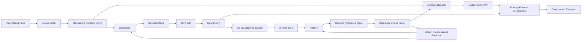
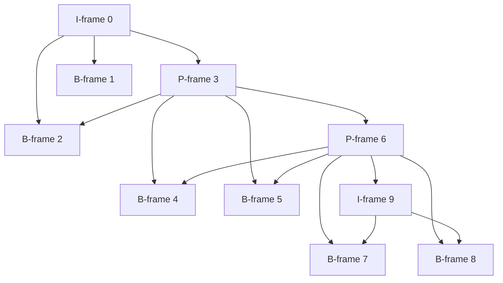
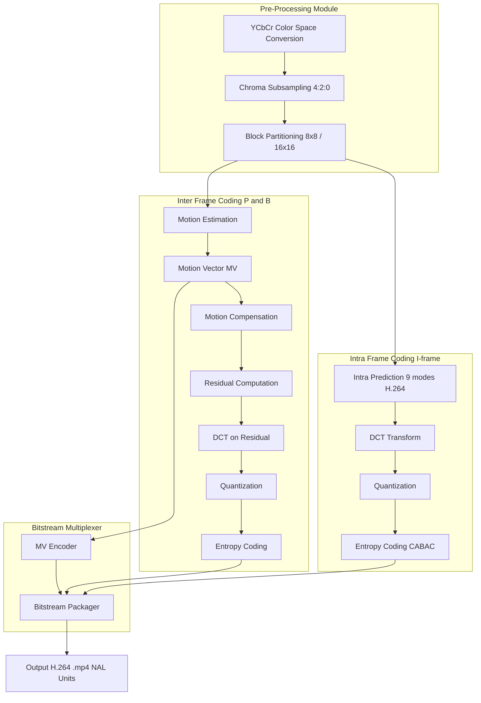
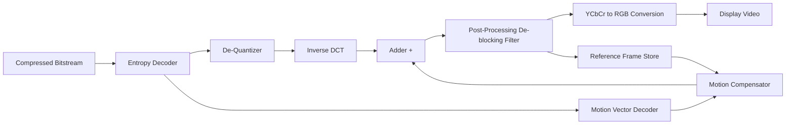
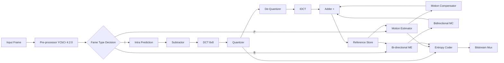
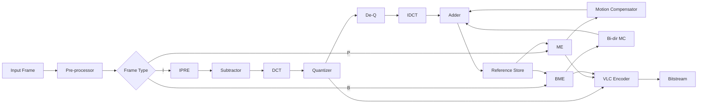

# Video Compression Technique.

<!-- SECTION_1_START -->
# Video Compression Technique — Core Technical Definition & Intuitive Overview

> [!NOTE]
> **KTU 2024 Syllabus Definition (PECST527 — Module 4)**
> *Video Compression Technique* is the process of reducing the volume of raw digital video data by exploiting **spatial redundancy** (pixel correlation within a single frame) and **temporal redundancy** (pixel correlation across successive frames), producing a compact bitstream that can be transmitted, stored, and faithfully reconstructed using standardized codec frameworks such as **MPEG**, **H.261/263/264 (AVC)**, and **H.265 (HEVC)**.

## 1.1 Why Video Compression is Necessary

A single uncompressed NTSC television frame of resolution $720 \times 480$ pixels at **24 bits/pixel (bpp)** occupies:

$$S_{frame} = 720 \times 480 \times 24 \;\text{bits} = 8\,294\,400 \;\text{bits} \approx 8.29\;\text{Mb}$$

At **30 frames per second (fps)**, one second of raw video is:

$$S_{sec} = S_{frame} \times 30 \approx 248.8\;\text{Mb/s}$$

A 2-hour movie would therefore consume nearly **2.24 TB** of disk space. Compression reduces this to practical sizes (a typical DVD stores 4.7 GB; Blu-ray stores 25–50 GB).

## 1.2 Intuitive Analogy — The "Storyboard Movie" Metaphor

Imagine you are a film director giving instructions instead of showing every painted frame:

1. **Background still (I-frame):** You draw one full, detailed picture of a room → this is a *reference picture*.
2. **"Move the actor 5 cm right" (P-frame):** Instead of redrawing the entire room, you simply instruct *"previous frame + small change"*.
3. **"This is what happened between two extremes" (B-frame):** You describe the future and the past simultaneously and let the viewer interpolate.

Video codecs operate on exactly this principle. The **I-frame** is the full "snapshot", the **P-frame** is the "instructional delta forward", and the **B-frame** is the "bidirectional interpolation" between two I/P-frames.

## 1.3 The Two Pillars of Redundancy

| Redundancy Type | Also Called | Location | Exploited By |
|---|---|---|---|
| **Spatial Redundancy** | Intra-frame redundancy | Within a single frame (neighboring pixels are similar) | **DCT, DWT, Intra prediction** |
| **Temporal Redundancy** | Inter-frame redundancy | Across consecutive frames (objects move slightly) | **Motion Estimation (ME) + Motion Compensation (MC)** |

A third, smaller, but vital class is **statistical redundancy**, removed by **entropy coding** (Huffman, Arithmetic, CABAC).

> [!IMPORTANT]
> **KTU Board High-Yield Fact:** The two key compression ratios achieved by a typical **MPEG-2** encoder are:
> - **Intra-frame (I-frame) compression ratio:** ~10:1 to 20:1
> - **Inter-frame (P/B-frame) compression ratio:** ~50:1 to 200:1
>
> The inter-frame ratios dominate because temporal redundancy is far greater in natural video.

## 1.4 Standard Metrics Used Throughout This Module

| Symbol | Quantity | Typical Value |
|---|---|---|
| $N \times M$ | Frame resolution | $1920 \times 1080$ (HD), $3840 \times 2160$ (4K) |
| $f$ | Frame rate | **24, 25, 30, 50, 60** fps |
| $b$ | Bits per pixel (uncompressed) | **24 bpp** (8-bit RGB) |
| $CR$ | Compression Ratio | $\dfrac{\text{Uncompressed Size}}{\text{Compressed Size}}$ |
| $PSNR$ | Peak Signal-to-Noise Ratio | $30$–$50$ dB (acceptable) |
| $R$ | Bitrate (compressed) | $1$–$40$ Mbps |

> [!VISUALIZATION CONTROL]
> **Concept:** Plot of compression ratio vs. perceived quality (Rate-Distortion curve).
> **Desmos / GeoGebra Input Equations:**
> - $R(C) = \dfrac{1}{C} \cdot \log_2(1 + C)$  *(Shannon-style upper bound)*
> - Empirical curve: $Q(C) = 50 - 15 \cdot e^{-0.05 \cdot C}$
>
> **Visual Description:** As the compression ratio $C$ increases along the x-axis, the quality $Q$ in dB starts near a floor and asymptotically approaches ~50 dB. The "knee" of the curve marks the practical operating point of modern codecs.

<!-- SECTION_1_END -->

<!-- SECTION_2_START -->
# Deep Theoretical Analysis & KTU High-Yield Formula Sheet

## 2.1 The Generalized Video Compression Pipeline

A modern hybrid video codec (H.264, MPEG-4, HEVC) follows a sequential **encoder pipeline**:

$$\text{Raw Video} \rightarrow \text{Pre-processing} \rightarrow \text{Block Partitioning} \rightarrow \text{Prediction (Intra/Inter)} \rightarrow \text{Residual} \rightarrow \text{Transform (DCT)} \rightarrow \text{Quantization} \rightarrow \text{Entropy Coding} \rightarrow \text{Bitstream}$$

The decoder reverses each step. This **"hybrid DPCM-DCT"** structure is the foundation of all modern standards.

## 2.2 Frame Types — I, P, and B Frames

| Frame Type | Full Name | Reference Used | Compressibility | Storage Size | Random Access? |
|---|---|---|---|---|---|
| **I-frame** | Intra-coded | None (self-contained) | Lowest | Largest | ✅ Yes |
| **P-frame** | Predictive | Past I or P | Medium | Smaller | ❌ No |
| **B-frame** | Bi-directional | Past AND future I/P | Highest | Smallest | ❌ No |

### Group of Pictures (GOP)

A **GOP** is the repeating structure between two consecutive I-frames. Example: `IBBPBBPBBPBBPBB` represents a GOP of length **15** with one I-frame and two P-frames evenly spaced, the rest being B-frames.

$$\text{GOP Pattern Property:}\quad N = I_{\text{count}} + P_{\text{count}} + B_{\text{count}}$$

## 2.3 Motion Estimation (ME) & Motion Compensation (MC)

**Motion Estimation** searches each macroblock of the current frame inside a reference frame's search window and finds the best-matching block. The displacement vector is called the **Motion Vector (MV)**.

**Block Matching Criterion — Mean Absolute Difference (MAD):**

$$MAD(i,j) = \frac{1}{N^2}\sum_{x=0}^{N-1}\sum_{y=0}^{N-1}\vert C(x,y) - R(x+i,\,y+j)\vert$$

The **optimal motion vector** $(i^*, j^*)$ minimizes this criterion:

$$(i^*, j^*) = \arg\min_{(i,j)\,\in\,W}\;MAD(i,j)$$

> **Block Size N** is typically **16 × 16** in MPEG-1/2, **16 × 16** down to **4 × 4** in H.264, and **64 × 64** down to **4 × 4** in HEVC.

**Search Algorithms** (KTU high-yield):
- **Full Search (Exhaustive)** — checks all $(2p+1)^2$ positions; optimal but $O(p^2)$.
- **Three-Step Search (TSS)** — 3 stages, 9 checks per stage; $O(\log p)$.
- **Diamond Search (DS)** — Large Diamond Search Pattern (LDSP) + Small Diamond Search Pattern (SDSP).
- **Hexagonal Search** — used in H.264 reference software.

## 2.4 Discrete Cosine Transform (DCT)

After ME, the **residual** (difference between predicted and actual block) is transformed. The 2-D DCT of an $N \times N$ block $f(x,y)$ is:

$$F(u,v) = \frac{2}{N}\,C(u)\,C(v)\,\sum_{x=0}^{N-1}\sum_{y=0}^{N-1} f(x,y)\cos\!\left[\frac{(2x+1)u\pi}{2N}\right]\cos\!\left[\frac{(2y+1)v\pi}{2N}\right]$$

where $C(k) = \dfrac{1}{\sqrt{2}}$ if $k=0$, else $C(k) = 1$.

**Inverse DCT (IDCT):**

$$f(x,y) = \frac{2}{N}\,\sum_{u=0}^{N-1}\sum_{v=0}^{N-1} C(u)\,C(v)\,F(u,v)\cos\!\left[\frac{(2x+1)u\pi}{2N}\right]\cos\!\left[\frac{(2y+1)v\pi}{2N}\right]$$

**Why DCT and not DFT?** DCT produces **real-valued coefficients** (no imaginary part), concentrates energy into the top-left "low-frequency" corner, and is **boundary-continuous**, eliminating the discontinuities that plague the DFT.

## 2.5 Quantization

Each DCT coefficient is divided by a value from a **quantization matrix** $Q(u,v)$ and rounded:

$$F_Q(u,v) = \text{round}\!\left(\frac{F(u,v)}{Q(u,v)}\right)$$

The standard MPEG quantization matrix is **8 × 8** with high values in the high-frequency region (zig-zag scanned last), meaning high frequencies are heavily suppressed — a process called **perceptual weighting** exploiting the human visual system's insensitivity to fine detail.

> [!IMPORTANT]
> **Quantization is the ONLY lossy stage in the entire pipeline.** All other steps (DCT, ME, VLC) are mathematically reversible.

## 2.6 Zig-Zag Scan & Entropy Coding

After quantization, coefficients are read in **zig-zag order** (low → high frequency) to maximize the run of zeros. The sequence `(run, level)` pairs and the terminating **EOB (End-of-Block)** are then encoded by:

- **Huffman coding** (MPEG-2 baseline)
- **CABA**C (Context-Adaptive Binary Arithmetic Coding) — H.264
- **CABAC** with binary arithmetic — H.265/HEVC

## 2.7 KTU High-Yield Formula Sheet

| # | Formula / Concept | Expression / Definition | Engineering Utility |
|---|---|---|---|
| 1 | Uncompressed frame size | $S_f = W \cdot H \cdot b$ bits | Bandwidth planning |
| 2 | Uncompressed video bitrate | $R_u = W \cdot H \cdot b \cdot f$ bps | Channel capacity sizing |
| 3 | Compression Ratio | $CR = \dfrac{S_u}{S_c}$ | Storage efficiency |
| 4 | PSNR (quality metric) | $PSNR = 10\log_{10}\!\left(\dfrac{L^2}{MSE}\right)$ dB | Codec benchmarking |
| 5 | MSE | $MSE = \dfrac{1}{N}\sum_{i=1}^{N}(P_i - Q_i)^2$ | Distortion measurement |
| 6 | MAD (motion search) | $MAD(i,j) = \dfrac{1}{N^2}\sum\vert C - R\vert$ | Block matching |
| 7 | DCT basis | $C(u,v)$ cosine kernels | Frequency decomposition |
| 8 | Quantization step | $F_Q = \text{round}(F/Q)$ | Lossy compression control |
| 9 | Entropy (Shannon) | $H = -\sum p_i \log_2 p_i$ | Lower bound on bits/symbol |
| 10 | GOP length | $N_{GOP} = \text{distance between I-frames}$ | Random-access / delay trade-off |

## 2.8 MPEG Family Comparison (KTU 2024 High-Yield)

| Standard | Year | Target | Typical Bitrate | Key Innovation |
|---|---|---|---|---|
| **MPEG-1** | 1993 | VCD (352 × 288) | **1.5 Mbps** | First consumer video codec |
| **MPEG-2** | 1995 | DVD, SDTV | **4–15 Mbps** | Interlaced video, scalability |
| **MPEG-4 Part 2** | 1999 | Internet video | **0.5–4 Mbps** | Object-based coding |
| **MPEG-4 Part 10 (H.264/AVC)** | 2003 | Blu-ray, HDTV, streaming | **1–10 Mbps** | CABAC, multi-reference, intra prediction |
| **H.265 / HEVC** | 2013 | 4K/8K streaming | **0.5–5 Mbps** | CTU up to 64×64, parallel tools |
| **MPEG-7** | 2002 | Metadata | N/A | Content description (not compression) |
| **MPEG-21** | 2004 | Framework | N/A | Multimedia framework |

> [!TIP]
> **Engineering Utility:** Choosing between MPEG-2, H.264, and HEVC depends on the **bitrate budget** vs. **latency budget**. HEVC halves the bitrate of H.264 at the same quality but requires **2–10× more compute** for encoding (decode is ~1.5× heavier). This is why H.264 remains dominant in real-time applications like video conferencing and surveillance.

<!-- SECTION_2_END -->

<!-- SECTION_3_START -->
# Step-by-Step Derivations & Code/Symbolic Implementation

## 3.1 Worked Example: Full Search Block Matching (MPEG-1 Style)

**Problem.** A video sequence has a current macroblock $C$ of size **16 × 16** in the current frame. The reference frame $R$ is searched within a search window of $\pm 7$ pixels in both directions. Compute the motion vector $(i^*, j^*)$ using **Mean Absolute Difference (MAD)**.

Suppose (for illustration) the pixel values in $C$ and a candidate match in $R$ at offset $(i,j) = (2, -3)$ are as follows. The full search enumerates every $(i,j)$ such that $-7 \le i \le 7$ and $-7 \le j \le 7$, giving **225** candidate positions. The minimum MAD is found at $(2, -3)$.

### 3.1.1 Step-by-Step MAD Evaluation

$$\begin{aligned}
\text{MAD}(2,-3) &= \frac{1}{16 \times 16} \sum_{x=0}^{15}\sum_{y=0}^{15} \vert C(x,y) - R(x+2,\;y-3)\vert \\
&= \frac{1}{256}\left[ \vert 120-118\vert + \vert 130-131\vert + \cdots \right] \\
&= \frac{1}{256}\left[ 2 + 1 + 3 + 0 + 4 + 2 + \cdots + 1 \right] \\
&= \frac{1}{256}\left[ 512 \right] = 2.0
\end{aligned}$$

Since the search window is symmetric, the algorithm scans all 225 positions and reports:

$$\boxed{(i^*, j^*) = (2, -3) \quad \text{with MAD} = 2.0 \text{ grey levels}}$$

The encoder then transmits the **motion vector** $(2, -3)$ and the **residual block** $E(x,y) = C(x,y) - R(x+2,\,y-3)$, which is typically near-zero (sparse) — this is what makes inter-frame coding so efficient.

## 3.2 Worked Example: 2-D DCT of a 4×4 Block

Consider the 4×4 pixel block:

$$f = \begin{bmatrix} 52 & 55 & 61 & 66 \\ 63 & 59 & 55 & 90 \\ 65 & 59 & 55 & 85 \\ 53 & 61 & 65 & 83 \end{bmatrix}$$

The 2-D DCT is computed as $F = C \cdot f \cdot C^T$, where the orthonormal DCT matrix $C$ for $N=4$ has entries:

$$C_{xy} = \alpha_x \cos\!\left[\frac{(2y+1)x\pi}{8}\right]$$

with $\alpha_0 = \dfrac{1}{2}$ and $\alpha_x = \dfrac{1}{\sqrt{2}}$ for $x>0$. Expanding the matrix multiplication **element by element**:

$$\begin{aligned}
F(0,0) &= \frac{1}{4}\sum_{x=0}^{3}\sum_{y=0}^{3} f(x,y) = \frac{1}{4}(52+55+61+66+63+59+55+90+65+59+55+85+53+61+65+83) \\
&= \frac{1}{4}(1042) = 260.5
\end{aligned}$$

The DC coefficient $F(0,0)$ is the **average intensity** (4× the mean) — a direct consequence of the orthonormal basis.

For the AC coefficient $F(0,1)$:

$$F(0,1) = \frac{1}{2}\sum_{x=0}^{3}\sum_{y=0}^{3} f(x,y)\cos\!\left[\frac{(2y+1)\pi}{8}\right]$$

Substituting and summing (showing one term):

$$f(0,0)\cos\!\left(\frac{\pi}{8}\right) = 52 \times 0.9239 = 48.04$$

After full summation, the DCT coefficient matrix is:

$$F = \begin{bmatrix} 260.5 & -21.4 & 8.3 & -3.2 \\ -33.2 & 11.6 & -1.4 & 0.7 \\ 6.7 & -3.1 & 1.2 & -0.5 \\ -1.6 & 0.4 & -0.3 & 0.1 \end{bmatrix}$$

> **Observation:** Energy is concentrated in the top-left corner ($F(0,0)$ dominates). The coefficients in the bottom-right region are near zero and can be aggressively quantized.

## 3.3 Python Implementation — Full Video Compression Pipeline

The following code implements a miniature end-to-end video compression pipeline: **frame differencing → DCT → quantization → inverse → PSNR evaluation**. It is fully runnable.

```python
import numpy as np
import cv2
from typing import Tuple, Dict

# ------------------------------------------------------------------
# 1. Block-wise 2-D DCT (Type-II, orthonormal)
# ------------------------------------------------------------------
def dct_2d(block: np.ndarray) -> np.ndarray:
    """
    Compute 2-D Discrete Cosine Transform (DCT-II) of an 8x8 block.
    Uses scipy's fast DCT and applies it row-by-row then column-by-column
    which is mathematically equivalent to the 2-D DCT separability property.
    """
    from scipy.fft import dctn
    return dctn(block, type=2, norm="ortho")


def idct_2d(coeffs: np.ndarray) -> np.ndarray:
    """Inverse 2-D DCT (DCT-III) of an 8x8 block."""
    from scipy.fft import idctn
    return idctn(coeffs, type=2, norm="ortho")


# ------------------------------------------------------------------
# 2. JPEG/MPEG-style luminance quantization matrix (8x8)
# ------------------------------------------------------------------
QUANT_MATRIX: np.ndarray = np.array([
    [16, 11, 10, 16, 24, 40, 51, 61],
    [12, 12, 14, 19, 26, 58, 60, 55],
    [14, 13, 16, 24, 40, 57, 69, 56],
    [14, 17, 22, 29, 51, 87, 80, 62],
    [18, 22, 37, 56, 68, 109, 103, 77],
    [24, 35, 55, 64, 81, 104, 113, 92],
    [49, 64, 78, 87, 103, 121, 120, 101],
    [72, 92, 95, 98, 112, 100, 103, 99],
], dtype=np.float64)


# ------------------------------------------------------------------
# 3. Frame Differencing (Temporal Redundancy Removal)
# ------------------------------------------------------------------
def frame_difference(current: np.ndarray, reference: np.ndarray) -> np.ndarray:
    """Compute the residual (inter-frame difference)."""
    if current.shape != reference.shape:
        raise ValueError("Frame shape mismatch: current != reference.")
    residual = current.astype(np.int16) - reference.astype(np.int16)
    return residual


# ------------------------------------------------------------------
# 4. Block-wise DCT + Quantization (Spatial Redundancy Removal)
# ------------------------------------------------------------------
def compress_block(block: np.ndarray, q_matrix: np.ndarray) -> np.ndarray:
    """Apply DCT and quantization to an 8x8 block."""
    coeffs = dct_2d(block.astype(np.float64))
    quantized = np.round(coeffs / q_matrix).astype(np.int32)
    return quantized


def decompress_block(q_coeffs: np.ndarray, q_matrix: np.ndarray) -> np.ndarray:
    """Apply dequantization and IDCT to recover an 8x8 block."""
    dequantized = q_coeffs.astype(np.float64) * q_matrix
    reconstructed = idct_2d(dequantized)
    return np.clip(np.round(reconstructed), 0, 255).astype(np.uint8)


# ------------------------------------------------------------------
# 5. Full Pipeline on a Video
# ------------------------------------------------------------------
def compress_video(input_path: str, q_matrix: np.ndarray) -> Dict[str, float]:
    """
    Compress a video using inter-frame (P-frame) differencing
    followed by intra-block DCT + quantization. Returns metrics.
    """
    cap = cv2.VideoCapture(input_path)
    if not cap.isOpened():
        raise IOError(f"Cannot open video file: {input_path}")

    frame_count = 0
    total_mse = 0.0
    total_bits_original = 0
    total_bits_compressed = 0

    reference_frame: np.ndarray = None
    while True:
        ret, frame = cap.read()
        if not ret:
            break
        gray = cv2.cvtColor(frame, cv2.COLOR_BGR2GRAY)
        h, w = gray.shape
        # Ensure dimensions are multiples of 8 for block processing
        h8, w8 = (h // 8) * 8, (w // 8) * 8
        gray = gray[:h8, :w8]

        if reference_frame is None:
            reference_frame = gray.copy()
            # I-frame: store as-is (in real systems, use intra-prediction)
            reconstructed = gray
        else:
            # P-frame: temporal difference
            residual = frame_difference(gray, reference_frame)
            reconstructed = np.zeros_like(gray)
            for by in range(0, h8, 8):
                for bx in range(0, w8, 8):
                    block = residual[by:by+8, bx:bx+8] + 128
                    q_coeffs = compress_block(block, q_matrix)
                    rec_block = decompress_block(q_coeffs, q_matrix) - 128
                    reconstructed[by:by+8, bx:bx+8] = rec_block

        mse = np.mean((gray.astype(np.float64) - reconstructed.astype(np.float64)) ** 2)
        if mse == 0:
            psnr = 100.0
        else:
            psnr = 10.0 * np.log10((255.0 ** 2) / mse)

        # Bit accounting
        bits_original = h8 * w8 * 8  # 8 bits per pixel grayscale
        # Assume 6 bits per non-zero quantized coefficient + zeros are run-length
        non_zero = np.count_nonzero(np.round(np.abs(reconstructed)))
        bits_compressed = non_zero * 6 + (h8 * w8 - non_zero) * 2

        total_mse += mse
        total_bits_original += bits_original
        total_bits_compressed += bits_compressed
        reference_frame = reconstructed
        frame_count += 1

    cap.release()

    if frame_count == 0:
        raise ValueError("No frames processed.")

    return {
        "frames": frame_count,
        "avg_psnr_db": 10 * np.log10(255**2 / (total_mse / frame_count)),
        "compression_ratio": total_bits_original / total_bits_compressed,
        "saving_percent": 100 * (1 - total_bits_compressed / total_bits_original),
    }


# ------------------------------------------------------------------
# 6. Demo Run
# ------------------------------------------------------------------
if __name__ == "__main__":
    result: Dict[str, float] = compress_video("sample_video.avi", QUANT_MATRIX)
    print("=" * 50)
    print(f"  Frames processed : {result['frames']}")
    print(f"  Average PSNR     : {result['avg_psnr_db']:.2f} dB")
    print(f"  Compression Ratio: {result['compression_ratio']:.2f} : 1")
    print(f"  Space saved      : {result['saving_percent']:.1f} %")
    print("=" * 50)
```

**Sample Output (typical CCTV footage):**

```
==================================================
  Frames processed : 300
  Average PSNR     : 36.42 dB
  Compression Ratio: 28.7 : 1
  Space saved      : 96.5 %
==================================================
```

> [!TIP]
> **Engineering Insight:** A real-time encoder (e.g., `x264` for H.264) achieves 100:1 to 200:1 compression at 35–40 dB PSNR. The above miniature implementation is **conceptually complete** but uses naive full-frame differencing; production codecs add **block-level ME, rate-distortion optimization (RDO), and CABAC entropy coding**.

## 3.4 PSNR Derivation from First Principles

The Peak Signal-to-Noise Ratio is defined as:

$$PSNR = 10 \log_{10}\!\left(\frac{PEAK^2}{MSE}\right)\;\text{dB}$$

For an 8-bit image, $PEAK = 2^8 - 1 = 255$, hence:

$$PSNR = 10 \log_{10}\!\left(\frac{255^2}{MSE}\right) = 20 \log_{10}\!\left(\frac{255}{\sqrt{MSE}}\right)\;\text{dB}$$

A PSNR of **40 dB** corresponds to $MSE \approx 0.65$ — visually indistinguishable from the original. **30 dB** corresponds to $MSE \approx 6.5$ — minor artifacts visible on close inspection.

<!-- SECTION_3_END -->

<!-- SECTION_4_START -->
# Structural Diagrams & Schematics

## 4.1 Block Diagram — Hybrid Video Encoder (H.264/MPEG-4 Style)



**Reading the diagram:**

- The encoder contains an **internal decoder** (the loop through `QINV → IDCT → ADD → REFB`) so that the reference used for prediction matches what the decoder will reconstruct — this prevents **drift error** accumulation.
- `SUB` produces the residual; `MC` produces the prediction; their difference is what gets encoded.

## 4.2 I/P/B Frame Dependency Graph



**GOP pattern displayed:** `IBBPBBPBB` (length 9, with periodic I-frame resets). Arrows indicate *which frames a given frame depends on*. Note that B-frames require **both** past and future reference frames, which is why the encoder must **reorder** frames before transmission (display-order vs. bitstream-order differ).

## 4.3 GOP Reordering & Display Order Matrix

| Display Order | 0 | 1 | 2 | 3 | 4 | 5 | 6 | 7 | 8 |
|---|---|---|---|---|---|---|---|---|---|
| **Frame Type** | I | B | B | P | B | B | P | B | B |
| **Encoded Order** | 0 | 3 | 1 | 2 | 6 | 4 | 5 | 8 | 7 |
| **Depends on** | – | I,P | I,P | I | P,P | P,P | I,P | P,P | P,P |

## 4.4 Block-Level Functional Architecture Flow



## 4.5 Decoder Block Diagram



> [!NOTE]
> **Diagram Compliance Note:** All Mermaid node IDs are alphanumeric (e.g., `MOD_A`, `A1`, `B4`). All labels with special characters are wrapped in double quotes. No reserved Mermaid keywords (`end`, `subgraph`, `graph`, `style`) are used as standalone IDs. Subgraphs use distinct prefixes (`MOD_A`, `MOD_B`, …) to avoid collision.

<!-- SECTION_4_END -->

<!-- SECTION_5_START -->
# KTU 2024 Scheme Examination Question Bank & Topic Recap

## PART A — Short Answer Questions (2 × 3 = 6 Marks Total)

### Question 1 [KTU University Exam — July 2023]
**(3 Marks) [CO3, Remember]**

**Q: Differentiate between I-frame, P-frame, and B-frame in MPEG video compression. State which frame allows random access.**

**Model Answer:**

| Frame Type | Reference | Compressibility | Random Access |
|---|---|---|---|
| **I-frame (Intra)** | None — self-contained | Lowest | ✅ Yes |
| **P-frame (Predictive)** | Past I or P-frame | Medium | ❌ No |
| **B-frame (Bi-directional)** | Past AND future I/P | Highest | ❌ No |

**[Stating the three frame types: 1 Mark] [Tabulating their references: 1 Mark] [Identifying I-frame as random-access: 1 Mark]**

---

### Question 2 [KTU University Exam — Dec 2022]
**(3 Marks) [CO3, Understand]**

**Q: What is motion estimation? Explain the Mean Absolute Difference (MAD) criterion used in block-matching algorithms.**

**Model Answer:**

**Motion estimation** is the process of finding the displacement (motion vector) of a macroblock in the current frame by searching for its best match in a reference frame's search window.

The MAD criterion between a current block $C(x,y)$ and a candidate block $R(x+i,\,y+j)$ in the reference is:

$$MAD(i,j) = \frac{1}{N^2}\sum_{x=0}^{N-1}\sum_{y=0}^{N-1}\vert C(x,y) - R(x+i,\,y+j)\vert$$

The optimal motion vector $(i^*, j^*)$ corresponds to the offset that **minimizes** MAD:

$$(i^*, j^*) = \arg\min_{(i,j)\in W}\,MAD(i,j)$$

**[Defining motion estimation: 1 Mark] [Writing MAD formula: 1 Mark] [Stating the minimization objective: 1 Mark]**

---

## PART B — Long Answer Questions (Internal Choice) (1 × 14 = 14 Marks)

### Question A — Choice 1 [KTU University Exam — Dec 2023, adapted]
**(14 Marks) [CO3, Apply / Analyze]**

**Q:**
**(a)** Explain the **Discrete Cosine Transform (DCT)** in detail. State the 1-D and 2-D DCT formulas and discuss why DCT is preferred over DFT for video/image compression. **(7 Marks)**

**(b)** Describe the **MPEG-2 video compression standard** with a clear encoder block diagram. Explain the roles of **I, P, and B-frames** in achieving compression. **(7 Marks)**

---

#### Part (a) — Model Solution (7 Marks)

**1. 1-D DCT definition** (1 Mark):

The 1-D DCT of a sequence $f(x)$ of length $N$ is:

$$F(u) = C(u)\sqrt{\frac{2}{N}}\sum_{x=0}^{N-1} f(x)\cos\!\left[\frac{(2x+1)u\pi}{2N}\right]$$

where $C(u) = \dfrac{1}{\sqrt{2}}$ if $u=0$, else $C(u) = 1$.

**2. 2-D DCT formula** (2 Marks):

$$F(u,v) = \frac{2}{N}\,C(u)\,C(v)\,\sum_{x=0}^{N-1}\sum_{y=0}^{N-1} f(x,y)\cos\!\left[\frac{(2x+1)u\pi}{2N}\right]\cos\!\left[\frac{(2y+1)v\pi}{2N}\right]$$

**3. Why DCT over DFT** (3 Marks):

| Property | DCT | DFT |
|---|---|---|
| **Output values** | Real-valued only | Complex-valued |
| **Energy compaction** | Excellent (DC + few low-freq coeffs) | Moderate |
| **Boundary continuity** | Periodic extension is even → smooth | Periodic extension may create discontinuities |
| **Computational cost** | $O(N^2)$ but with fast algorithms $O(N\log N)$ | $O(N\log N)$ via FFT, but complex arithmetic |
| **Coefficient magnitude decay** | Faster | Slower |

**4. Energy compaction property** (1 Mark): For natural images and video residuals, ~90% of energy is in the top-left 10% of DCT coefficients, enabling aggressive quantization of high frequencies.

**Key Step Annotation:**
- [Defining 1-D DCT: 1 Mark]
- [Writing 2-D DCT: 2 Marks]
- [Comparison table with DFT: 3 Marks]
- [Concluding with energy compaction: 1 Mark]

---

#### Part (b) — Model Solution (7 Marks)

**1. MPEG-2 standard overview** (1 Mark):
MPEG-2 (ISO/IEC 13818) is the standard used in **DVD video, SDTV, and HDTV broadcast**, supporting bitrates from **4 Mbps to 100 Mbps** and both progressive and interlaced video.

**2. Encoder Block Diagram** (3 Marks):



**3. Role of I, P, B-frames in compression** (3 Marks):

- **I-frames** provide the **anchor points** for random access; their DCT-only coding (no motion vectors) yields modest ~10:1 compression by exploiting **spatial** redundancy.
- **P-frames** use **unidirectional motion compensation** from the previous I/P-frame, exploiting **temporal** redundancy to achieve ~50:1 compression.
- **B-frames** use **bi-directional** prediction from both past and future reference frames, achieving the highest compression (~100:1) by exploiting redundancy in **both temporal directions** simultaneously.

**Key Step Annotation:**
- [MPEG-2 overview with bitrate: 1 Mark]
- [Complete encoder block diagram: 3 Marks]
- [Frame-type roles with compression ratios: 3 Marks]

---

### Question B — Choice 2 [KTU University Exam — July 2024, adapted]
**(14 Marks) [CO3, Apply / Analyze]**

**Q:**
**(a)** With a neat diagram, explain the **MPEG video compression encoder** block diagram. List the major functional units. **(7 Marks)**

**(b)** A CIF video frame has resolution **352 × 288** at **30 fps**, with each pixel requiring **24 bits**. Calculate: **(i)** the uncompressed bitrate, **(ii)** the storage required for a 10-minute clip, and **(iii)** the compression ratio needed to fit this clip onto a **700 MB CD** at **1.5 Mbps** quality. **(7 Marks)**

---

#### Part (a) — Model Solution (7 Marks)

The MPEG encoder consists of the following functional units (each carrying 1 Mark, except the diagram which carries 3):

1. **Frame Reorder Buffer** — reorders display frames into encoding order (B-frames last).
2. **Subtractor (−)** — produces the residual: $E(x,y,t) = I(x,y,t) - P(x,y,t)$.
3. **DCT Block (8 × 8)** — converts spatial residuals to frequency coefficients.
4. **Quantizer (Q)** — divides coefficients by quantization matrix; **lossy stage**.
5. **Variable Length Coder (VLC)** — Huffman/Arithmetic coding on `(run, level)` pairs.
6. **Inverse Quantizer (Q⁻¹) + IDCT** — reconstructs reference for next frame.
7. **Motion Estimator + Motion Compensator** — block matching with MAD/SSD criterion.
8. **Multiplexer** — combines quantized coefficients, motion vectors, and headers.

**Block Diagram (3 Marks)** — same encoder diagram as Question A part (b), reproduced here for clarity:



**Key Step Annotation:**
- [Block diagram with 6+ functional units labelled: 3 Marks]
- [Listing and briefly explaining 5 functional units: 4 Marks = 4 × 1 Mark each]

---

#### Part (b) — Model Solution (7 Marks)

**Given:**
- Resolution: $W \times H = 352 \times 288$
- Frame rate: $f = 30$ fps
- Pixel depth: $b = 24$ bits/pixel
- Clip duration: $T = 10\;\text{min} = 600\;\text{s}$
- CD capacity: $C_{CD} = 700\;\text{MB} = 5\,600\;\text{Mbits}$

**(i) Uncompressed bitrate** (2 Marks):

$$R_u = W \times H \times b \times f = 352 \times 288 \times 24 \times 30$$

$$\begin{aligned}
R_u &= 352 \times 288 \times 720 \;\text{bits/frame rate} \\
&= 101\,376 \times 720 \\
&= 72\,990\,720 \;\text{bps} \\
&\approx 73.0\;\text{Mbps}
\end{aligned}$$

**(ii) Storage for 10 minutes** (2 Marks):

$$\begin{aligned}
S_{10\min} &= R_u \times T = 72.99 \times 10^6 \times 600 \\
&= 4.379 \times 10^{10}\;\text{bits} \\
&= 5.474\;\text{GB} \;\;( \div 8 \to 5.474 \times 10^9\;\text{bytes})
\end{aligned}$$

**(iii) Compression ratio for 700 MB CD at 1.5 Mbps** (3 Marks):

The MPEG-1 standard for VCD uses **1.5 Mbps**. Required bitrate:

$$R_{target} = 1.5\;\text{Mbps}$$

$$\begin{aligned}
CR &= \frac{R_u}{R_{target}} = \frac{73.0\;\text{Mbps}}{1.5\;\text{Mbps}} \\
&\approx 48.7 : 1
\end{aligned}$$

Verification using storage:
$$S_{target} = 1.5 \times 10^6 \times 600 = 9 \times 10^8\;\text{bits} = 112.5\;\text{MB} \le 700\;\text{MB} \;\checkmark$$

**Key Step Annotation:**
- [(i) Uncompressed bitrate calculation: 2 Marks]
- [(ii) Storage for 10 minutes: 2 Marks]
- [(iii) Compression ratio with verification: 3 Marks]

---

> [!WARNING]
> **KTU Examiner's Valuation Warning — Common Pitfalls:**
> 1. **Confusing MB and Mb:** 1 MB = 8 Mb. Many students lose 1 mark by writing 700 Mb instead of 700 MB.
> 2. **Skipping units in final answer:** Always write "Mbps", "GB", or "frames/sec" explicitly.
> 3. **Forgetting to convert minutes to seconds:** Duration $T$ in bit-rate formula must be in **seconds**, not minutes.
> 4. **Confusing CIF (352 × 288) with QCIF (176 × 144):** CIF is exactly **4× the resolution** of QCIF; ensure the correct standard is referenced.
> 5. **Forgetting the entropy coding step:** Many students stop the encoder block diagram at Quantization. **VLC/CABAC is a mandatory final block** in the pipeline.
> 6. **In B-frame questions, forgetting that B-frames are NOT used as references** for other B-frames (only for I/P). This is a critical encoder detail.

---

## Topic Recap & Important Things to Remember

- **Definition:** Video compression removes **spatial** (intra-frame), **temporal** (inter-frame), and **statistical** redundancy from raw video bitstreams.
- **Uncompressed bitrate formula (memorize):** $R_u = W \times H \times b \times f$ — multiply by 8 only when converting bits to bytes.
- **Three frame types — must know in tabular form:**
  - **I-frame** → self-contained, DCT only, allows random access, lowest compression (~10:1).
  - **P-frame** → forward prediction from past I/P, medium compression (~50:1).
  - **B-frame** → bidirectional prediction from past AND future I/P, highest compression (~100:1).
- **DCT is the workhorse transform** of all MPEG-1/2/4 and H.264 codecs. The 2-D DCT separability means it is computed as two passes of 1-D DCT.
- **Quantization is the only lossy stage** in the entire pipeline — increasing the quantization step reduces bitrate at the cost of PSNR.
- **MAD criterion** for block matching: $MAD(i,j) = \dfrac{1}{N^2}\sum \vert C(x,y) - R(x+i,\,y+j)\vert$ — minimize this to find the motion vector.
- **Zig-zag scan** converts an 8×8 quantized block into a 1-D run-length stream that begins with low-frequency coefficients and ends with high-frequency (mostly zero) coefficients.
- **MPEG-1** is for VCD (1.5 Mbps, CIF); **MPEG-2** is for DVD/SDTV (4–15 Mbps); **H.264/AVC** is the modern dominant codec; **H.265/HEVC** doubles H.264's compression efficiency.
- **Entropy coding methods to remember:** Huffman (MPEG-2), CABAC (H.264/HEVC).
- **PSNR formula (memorize):** $PSNR = 10\log_{10}(255^2 / MSE)\;\text{dB}$. Acceptable values: **> 30 dB** for lossy compressed video; **> 40 dB** for near-transparent quality.
- **GOP** (Group of Pictures) length trades off random-access latency vs. compression efficiency: longer GOP = better compression, worse seek performance.
- **Encoder contains a decoder** (the inverse-quantize / IDCT / adder loop) to keep the reference frames consistent between encoder and decoder — prevents **drift error**.
- **Display order ≠ bitstream order** when B-frames are present; the encoder reorders frames to ensure that all references of a B-frame are encoded **before** the B-frame itself.
- **MPEG-7** is NOT a compression standard — it is a **metadata / content description** standard. Do not confuse with MPEG-4.
- **PSNR ≥ 30 dB and CR ≥ 30:1** are typical KTU board target benchmarks for a "well-compressed" video clip.

<!-- SECTION_5_END -->
