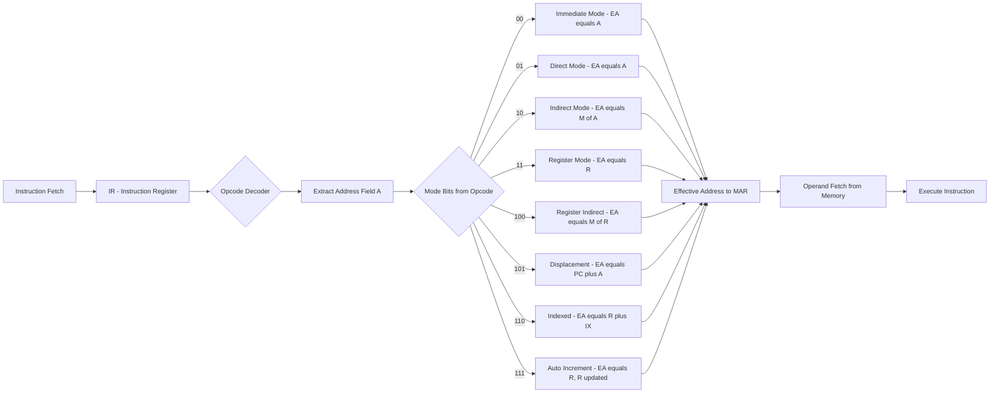
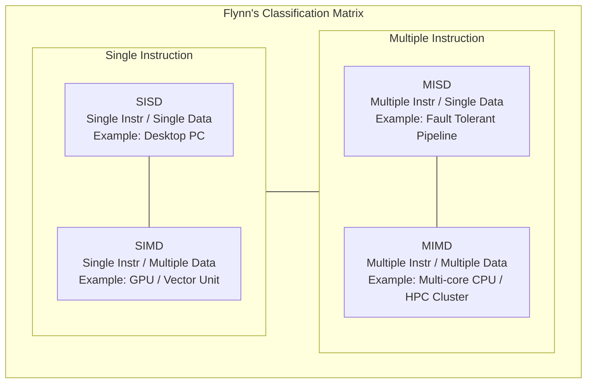
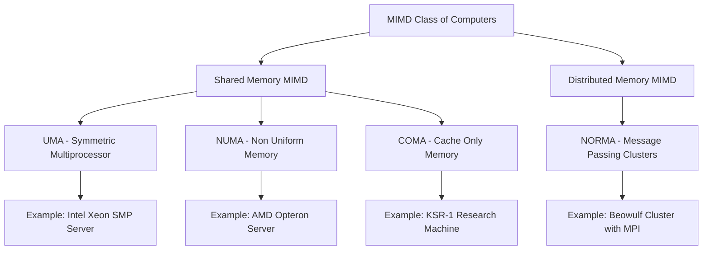

# addressing modes Class of Computers

<!-- SECTION_1_START -->
# 📘 Module 1 — Advanced Computer Architecture (PECST528)
## 1.1 Addressing Modes & 1.2 Class of Computers

---

## 🔷 1.1 ADDRESSING MODES — Core Technical Definition

> [!IMPORTANT]
> **Formal Definition (KTU 2024 Syllabus Term):**
> *An **addressing mode** specifies the rule for interpreting or modifying the address field of an instruction before the operand is actually referenced. It defines the mechanism by which the Effective Address (EA) of an operand is computed from the given address field and the contents of CPU registers.*

In simpler words — when an instruction says "bring me the value of X", the CPU must figure out **where** X actually lives in memory (or in a register). The **addressing mode** is the *rulebook* the CPU uses to resolve that location.

### 🧠 Conceptual Analogy — "The Treasure Map"

Imagine you tell your friend:
- *"Go to Room 101"* → This is **Direct Addressing** (the address is given explicitly).
- *"Go to the room whose number is written on this paper"* → This is **Indirect Addressing** (one extra lookup).
- *"Go to Room 101, and then walk 5 doors ahead"* → This is **Displacement Addressing** (base + offset).
- *"Go to the room number stored in your pocket notebook"* → This is **Register Indirect Addressing**.

Each mode is a different **strategy for finding the data** with varying speed, flexibility, and hardware cost.

> [!NOTE]
> **Why Addressing Modes Matter in KTU Board Exams:**
> The Effective Address (EA) computation question is a **favourite 7-mark question** in Part B. Memorising the EA formula for *each* mode is non-negotiable.

### 📐 Key Physical Concepts (Board-Relevant)

- **Effective Address (EA):** The *actual* memory address of the operand after mode resolution.
- **PC (Program Counter):** Holds the address of the *next* instruction to fetch.
- **RI (or MAR, Memory Address Register):** Final destination where EA is loaded before memory access.
- **Operand:** The actual data used by the instruction.

> [!VISUALIZATION CONTROL]
> **Concept:** Effective Address Computation Flow
> **GeoGebra / Desmos Input Equations (conceptual block mapping):**
> * `Address_Field → Mode_Decoder → EA_Formula_Engine → Effective_Address → Memory`
> **Visual Description:** Picture a left-to-right pipeline. The raw address bits from the IR (Instruction Register) enter a "Mode Decoder" box, which routes them through a specific arithmetic/logic path (add, offset, register-fetch) to produce the final Effective Address, which is then sent to the memory subsystem.
> 
> *For a more visual study aid, sketch the following on graph paper:*
> * x-axis: Instruction Decode Stage → Operand Fetch Stage
> * y-axis: Address Resolution Steps (t0, t1, t2)
> * Plot arrows showing how the `Address` field branches into `Direct`, `Indirect`, `Indexed`, etc.

---

## 🔷 1.2 CLASS OF COMPUTERS — Core Technical Definition

> [!IMPORTANT]
> **Formal Definition (KTU 2024 Syllabus Term):**
> *Computer classification is the systematic categorisation of computing systems based on the number of instruction streams and data streams they can process concurrently. The most widely accepted framework is **Flynn's Taxonomy (1966)**, which divides computers into four broad classes: **SISD, SIMD, MISD, and MIMD**.*

### 🧠 Conceptual Analogy — "The Kitchen Brigade"

- **SISD (Single Instruction, Single Data):** One chef, one stove, cooking one dish at a time. (e.g., your old desktop PC).
- **SIMD (Single Instruction, Multiple Data):** One head chef giving the *same* command ("chop!") to 10 sous-chefs, each chopping a *different* onion. (e.g., GPU vector units, Intel SSE/AVX).
- **MISD (Multiple Instruction, Single Data):** Rare — multiple chefs giving *different* orders but all working on the *same* dish (fault-tolerant pipelines, e.g., Space Shuttle flight computers).
- **MIMD (Multiple Instruction, Multiple Data):** Many chefs, each cooking a *different* dish independently. (e.g., modern multi-core laptops, HPC clusters).

### 📐 Key Physical Concepts

- **Instruction Stream (IS):** Sequence of instructions executed by the processor.
- **Data Stream (DS):** Sequence of data operands manipulated by the instructions.
- **Concurrency:** Multiple events happening in the same time interval (parallelism vs pipelining distinction is *also* a board favourite).

> [!NOTE]
> **Board Exam Golden Rule:** Always draw the **Flynn's 2×2 matrix** on the answer sheet. Examiners award **1 mark** just for the correct diagram!

<!-- SECTION_1_END -->

<!-- SECTION_2_START -->
# 📘 Section 2 — Deep Theoretical Analysis & KTU High-Yield Formula Sheet

---

## 2.1 Types of Addressing Modes (Exhaustive Board List)

### 🔹 A. Immediate Addressing
- **Mechanism:** The operand itself is part of the instruction.
- **EA Formula:** `EA = Operand is given directly (no memory reference)`
- **Pros:** Fastest mode (no memory access).
- **Cons:** Limited operand size; cannot hold large constants.
- **Use Case:** `MOV R1, #5` — Load constant `5` into register `R1`.

### 🔹 B. Direct (Absolute) Addressing
- **Mechanism:** The address field contains the *exact* memory address of the operand.
- **EA Formula:** `EA = Address`
- **Pros:** Simple, single memory reference.
- **Cons:** Limited address range; not relocatable.
- **Use Case:** `LOAD 2000` — Load contents of memory location `2000`.

### 🔹 C. Indirect Addressing
- **Mechanism:** The address field points to a memory location which *in turn* contains the actual address of the operand.
- **EA Formula:** `EA = M[Address]`
- **Pros:** Supports pointers, dynamic data structures.
- **Cons:** Requires **two** memory references (slower).
- **Use Case:** `LOAD (2000)` — Load the value stored at the address *pointed to by* memory location `2000`.

### 🔹 D. Register Addressing
- **Mechanism:** Operand resides in a CPU register; the address field specifies the register number.
- **EA Formula:** `EA = R` (the register itself holds the operand)
- **Pros:** Fastest after immediate — no memory access at all.
- **Cons:** Limited by number of registers.
- **Use Case:** `ADD R1, R2` — Add contents of R1 and R2.

### 🔹 E. Register Indirect Addressing
- **Mechanism:** The address field specifies a register; the *contents* of that register give the actual memory address of the operand.
- **EA Formula:** `EA = [R]` or `EA = M[R]`
- **Pros:** One memory access, supports pointer-based loops.
- **Cons:** Extra register access stage.
- **Use Case:** `LOAD (R1)` — Load the value at the address stored in R1.

### 🔹 F. Displacement Addressing (Three Sub-Types)
The most powerful and complex mode — used in **almost all real CPUs** (x86, ARM, MIPS).

#### F.1 Relative Addressing
- **EA Formula:** `EA = PC + Address` (Address is treated as a *signed* offset)
- **Use Case:** Branch instructions in modern ISAs (e.g., `BEQ +4` means branch 4 instructions ahead).

#### F.2 Base-Register Addressing
- **EA Formula:** `EA = R + Address`
- **Use Case:** Accessing arrays, stack frames, or static data segments (e.g., `EBX` in x86).

#### F.3 Indexed Addressing
- **EA Formula:** `EA = R + Index_Register` (Address field is the base, RI holds the index)
- **Use Case:** Array traversal: `Base_Addr + i` where `i` is the loop counter.

> [!NOTE]
> **Key Distinction (Board Favourite Trap):**
> * **Base-Register:** Address field is the *offset*, register holds the *base*.
> * **Indexed:** Register holds the *index*, address field holds the *base*.
> * Students routinely lose **2 marks** for confusing these two.

### 🔹 G. Auto-Increment / Auto-Decrement Addressing
- **EA Formula:** 
  - Pre-increment: `EA = R; R = R + d` (used before access)
  - Post-increment: `EA = R; R = R + d` (used after access)
  - (where `d` = data size, e.g., 4 bytes)
- **Use Case:** Stack operations, sequential array traversal in CISC machines (e.g., PDP-11, VAX).

### 🔹 H. Stack Addressing
- **EA Formula:** `EA = Top of Stack (TOS)` — implicit, no address field needed.
- **Use Case:** `PUSH` and `POP` instructions; expression evaluation in compilers.

---

## 📋 KTU Formula Sheet / Cheat Sheet — Addressing Modes

| # | Addressing Mode | Effective Address (EA) Formula | Memory Refs | Use Case |
|---|---|---|---|---|
| 1 | Immediate | Operand is in instruction itself | 0 | Loading constants |
| 2 | Direct | EA = Address | 1 | Static variables |
| 3 | Indirect | EA = M[Address] | 2 | Pointers, dynamic memory |
| 4 | Register | EA = R (register holds operand) | 0 | ALU operations |
| 5 | Register Indirect | EA = M[R] | 1 | Pointer dereferencing |
| 6 | Relative | EA = PC + Address | 1 | Branch/jump instructions |
| 7 | Base-Register | EA = R + Address | 1 | Array base access |
| 8 | Indexed | EA = R + Index_Register | 1 | Array loops |
| 9 | Auto-Increment | EA = R; then R = R + d | 1 | Sequential traversal |
| 10 | Auto-Decrement | R = R − d; then EA = R | 1 | Stack push |
| 11 | Stack | EA = TOS (implicit) | 0/1 | Function calls, expressions |

> [!NOTE]
> **Environment-Safe Note:** In LaTeX/board answers, always escape the `\vert` symbol carefully. When writing "Address" inside a math formula on paper, write it as a single capital **A** or with a *single bar over it* (e.g., $\overline{A}$) to denote the address field.

---

## 2.2 Classification of Computers — Deep Dive

### 🔹 A. Flynn's Taxonomy (The Primary KTU Framework)

> [!IMPORTANT]
> **KTU 2024 Mandate:** Every answer on "Class of Computers" **must** include Flynn's 2×2 classification table with **real-world examples** for each quadrant.

| Class | Instruction Stream | Data Stream | Architecture | Example Systems | Typical Use |
|---|---|---|---|---|---|
| **SISD** | Single | Single | Von Neumann | Desktop PC, traditional single-core CPU | General purpose |
| **SIMD** | Single | Multiple | Vector/Array processor | GPU (NVIDIA, AMD), Intel SSE, ARM NEON | Image processing, ML, scientific computing |
| **MISD** | Multiple | Single | Pipelined fault-tolerant | Space Shuttle flight control, systolic arrays | Fault tolerance, rarely used |
| **MIMD** | Multiple | Multiple | Multiprocessor / Multicomputer | Multi-core CPUs (Intel i7, AMD Ryzen), HPC clusters (Cray, IBM BG) | Servers, cloud, supercomputing |

### 🔹 B. Memory-Based Classification (Sub-class of MIMD)

| Type | Memory Access | Latency | Example |
|---|---|---|---|
| **UMA (Uniform Memory Access)** | Symmetric Multiprocessors (SMP) | Equal for all CPUs | Intel Xeon servers |
| **NUMA (Non-Uniform Memory Access)** | Memory split into local/remote | Variable | AMD Opteron, modern server chips |
| **COMA (Cache-Only Memory Architecture)** | All memory treated as cache | Variable | Swedish Institute KSR-1 |
| **NORMA (No Remote Memory Access)** | Distributed memory clusters | Message passing only | Beowulf clusters, MPI networks |

### 🔹 C. Shared vs Distributed Memory (Sub-class of MIMD)

- **Shared Memory MIMD:** All processors access a *single* global memory space. Communication via shared variables. Easy to program (OpenMP), but **memory contention** and **synchronisation** issues.
- **Distributed Memory MIMD:** Each processor has *private* memory. Communication via **message passing** (MPI, PVM). Scalable to thousands of nodes, but harder to program.

> [!NOTE]
> **Real-World Engineering Utility:**
> * **CUDA programming** (NVIDIA GPUs) is built on **SIMD** principles — one kernel launch executes on thousands of CUDA cores in lockstep.
> * **AWS EC2 clusters** use **MIMD + distributed memory** to serve billions of web requests.
> * **NUMA awareness** is now critical in cloud data centres (e.g., AWS Graviton, Azure HB-series) for HPC workloads.

---

## 2.3 Performance Trends — Self-Study Note

> [!IMPORTANT]
> The KTU module title mentions "the impact of hardware and software technology trends". Board exams frequently include a 3-mark question on this.

### Key Trends to Memorise

1. **Moore's Law (1965):** Transistor count on a chip doubles every ~18–24 months. (Note: slowing down post-2015).
2. **Pollack's Rule:** Performance is roughly proportional to the **square root** of the increase in complexity. → *Doubling logic gives only ~40% performance gain*.
3. **Power Wall:** Clock frequency stalled at ~3–5 GHz around 2005 due to thermal limits.
4. **ILP (Instruction-Level Parallelism) Wall:** Diminishing returns from deeper pipelining and out-of-order execution.
5. **Memory Wall:** Processor speed grows faster than memory speed — memory access is the bottleneck.
6. **ILP vs TLP:** Shift from **Instruction-Level Parallelism** (pipelining, superscalar) to **Thread-Level Parallelism** (multi-core, many-core).

> [!NOTE]
> **Board Tip:** When asked "why did the industry shift to multi-core?", answer in this exact order:
> 1. Power wall (can't increase clock further).
> 2. ILP wall (can't extract more parallelism per thread).
> 3. Memory wall (latency not improving).
> 4. **Solution:** Put multiple cores on one die — cheaper than making one core faster.

<!-- SECTION_2_END -->

<!-- SECTION_3_START -->
# 📘 Section 3 — Step-by-Step Derivations, Examples & Symbolic Implementation

---

## 3.1 Worked Example 1 — Effective Address Calculation (7-Mark Board Pattern)

> [!IMPORTANT]
> **Question Pattern:** Given a 16-bit instruction with a 12-bit address field, a base register `R = 4000`, an index register `IX = 2000`, and PC = 3000. Compute the EA for *each* addressing mode. (This is a classic KTU board problem.)

Assume the 12-bit address field value (let's call it `A = 1500`) is given in the instruction.

### Mode 1: Direct Addressing

$$
\begin{aligned}
\text{EA} &= A \\
\text{EA} &= 1500
\end{aligned}
$$

> *Explanation: The address field IS the effective address. The value 1500 is the memory location we directly read from.*

### Mode 2: Indirect Addressing

$$
\begin{aligned}
\text{EA} &= M[A] \\
\text{EA} &= M[1500]
\end{aligned}
$$

> *Explanation: We first go to memory location 1500, read the 16-bit value stored there, and that value becomes the actual EA. This requires **two** memory accesses. (If `M[1500] = 4200`, then EA = 4200).*

### Mode 3: Register Addressing

$$
\begin{aligned}
\text{EA} &= R \\
\text{EA} &= 4000 \;\; (\text{value already in R})
\end{aligned}
$$

> *Explanation: No memory access. The register itself holds the operand (or its value).*

### Mode 4: Register Indirect Addressing

$$
\begin{aligned}
\text{EA} &= M[R] \\
\text{EA} &= M[4000]
\end{aligned}
$$

> *Explanation: The register holds an address. We go to that address in memory to get the operand. (If `M[4000] = 8888`, then EA = 8888).*

### Mode 5: Displacement (Relative) Addressing

$$
\begin{aligned}
\text{EA} &= PC + A \\
\text{EA} &= 3000 + 1500 \\
\text{EA} &= 4500
\end{aligned}
$$

> *Explanation: Used for branch instructions. The displacement (1500) is added to the Program Counter (3000) to compute the new control flow location (4500).*

### Mode 6: Displacement (Base-Register) Addressing

$$
\begin{aligned}
\text{EA} &= R + A \\
\text{EA} &= 4000 + 1500 \\
\text{EA} &= 5500
\end{aligned}
$$

> *Explanation: The base register R holds the *base* of a data structure (e.g., an array start), and A is the *offset* of the desired element.*

### Mode 7: Indexed Addressing

$$
\begin{aligned}
\text{EA} &= R + IX \\
\text{EA} &= 4000 + 2000 \\
\text{EA} &= 6000
\end{aligned}
$$

> *Explanation: The register R holds the array base, and IX (the index register) holds the loop index. This is the classic *array[i]* addressing pattern.*

### Mode 8: Auto-Increment (Post-increment, d=4 bytes)

$$
\begin{aligned}
\text{EA} &= R \\
\text{Then: } R &\leftarrow R + 4 \\
\text{EA (this instr.)} &= 4000 \\
\text{R (after instr.)} &= 4004
\end{aligned}
$$

> *Explanation: Used to walk through an array sequentially. The current R is used as the EA, *then* R is bumped by the data size.*

---

## 3.2 Worked Example 2 — Identifying Mode from Instruction (Common 3-Mark Question)

> [!IMPORTANT]
> **Question:** Identify the addressing mode and compute the EA for each instruction. Assume `R1 = 5000`, `M[5000] = 7000`, `M[7000] = 9000`, `PC = 1000`.

| Instruction | Mode Identification | EA Calculation |
|---|---|---|
| `LOAD #2500` | **Immediate** | EA = 2500 (operand is 2500) |
| `LOAD 2500` | **Direct** | EA = 2500 |
| `LOAD (2500)` | **Indirect** | EA = M[2500]; assume M[2500]=8000 → EA = 8000 |
| `LOAD R1` | **Register** | EA = R1 = 5000 |
| `LOAD (R1)` | **Register Indirect** | EA = M[R1] = M[5000] = 7000 |
| `LOAD 100(R1)` | **Base-Register / Indexed** | EA = 100 + R1 = 100 + 5000 = 5100 |
| `LOAD (R1)+` | **Auto-Increment** | EA = R1 = 5000; then R1 ← 5004 |
| `LOAD -(R1)` | **Auto-Decrement** | R1 ← 4996; EA = 4996 |

---

## 3.3 Symbolic / Conceptual Code — Simulating Addressing Modes in Python

This is useful for the **Software Trends** sub-topic of the module (KTU often asks for code-level understanding).

```python
from typing import Final

# ---------------------------------------------------------------
# Symbolic Memory Model: addresses -> 16-bit values
# ---------------------------------------------------------------
MEMORY: dict[int, int] = {
    2500: 8000,   # M[2500] holds 8000
    5000: 7000,   # M[5000] holds 7000
    7000: 9000,   # M[7000] holds 9000
}

# CPU Registers
PC: int = 1000
R1: int = 5000
R2: int = 0      # accumulator / result register
IX: int = 2000   # index register
BASE: int = 4000
ADDR_FIELD: int = 1500  # A from the instruction
DATA_SIZE: Final[int] = 4  # bytes per word


def effective_address(mode: str) -> tuple[int, str]:
    """
    Compute the Effective Address (EA) for a given addressing mode.
    Returns (EA, explanation) for board-style clarity.
    """
    global PC, R1

    if mode == "immediate":
        ea = ADDR_FIELD
        return ea, f"Immediate: operand is {ea} (in instruction)."

    if mode == "direct":
        ea = ADDR_FIELD
        return ea, f"Direct: EA = Address field = {ea}."

    if mode == "indirect":
        ea = MEMORY.get(ADDR_FIELD, 0)
        return ea, f"Indirect: EA = M[{ADDR_FIELD}] = {ea}."

    if mode == "register":
        ea = R1
        return ea, f"Register: EA = R1 = {ea} (no memory access)."

    if mode == "register_indirect":
        ea = MEMORY.get(R1, 0)
        return ea, f"Register Indirect: EA = M[R1] = M[{R1}] = {ea}."

    if mode == "relative":
        ea = PC + ADDR_FIELD
        return ea, f"Relative: EA = PC + A = {PC} + {ADDR_FIELD} = {ea}."

    if mode == "base_register":
        ea = BASE + ADDR_FIELD
        return ea, f"Base-Register: EA = R + A = {BASE} + {ADDR_FIELD} = {ea}."

    if mode == "indexed":
        ea = BASE + IX
        return ea, f"Indexed: EA = R + IX = {BASE} + {IX} = {ea}."

    if mode == "auto_increment":
        ea = R1
        old_r1 = R1
        R1 += DATA_SIZE
        return ea, (
            f"Auto-Increment: EA = R1 = {ea}; "
            f"then R1 <- R1 + {DATA_SIZE} = {R1} (was {old_r1})."
        )

    if mode == "auto_decrement":
        R1 -= DATA_SIZE
        ea = R1
        return ea, f"Auto-Decrement: R1 <- R1 - {DATA_SIZE} = {ea}; EA = {ea}."

    raise ValueError(f"Unknown addressing mode: {mode}")


# ---------------------------------------------------------------
# Demonstration (board-style table output)
# ---------------------------------------------------------------
if __name__ == "__main__":
    modes = [
        "immediate", "direct", "indirect", "register",
        "register_indirect", "relative", "base_register",
        "indexed", "auto_increment", "auto_decrement",
    ]
    print(f"{'Mode':<22} | {'EA':>6} | Explanation")
    print("-" * 80)
    for m in modes:
        ea, expl = effective_address(m)
        print(f"{m:<22} | {ea:>6} | {expl}")
```

**Expected Output (formatted for board understanding):**

```
Mode                   |     EA | Explanation
--------------------------------------------------------------------------------
immediate              |   1500 | Immediate: operand is 1500 (in instruction).
direct                 |   1500 | Direct: EA = Address field = 1500.
indirect               |   8000 | Indirect: EA = M[1500] = 8000.
register               |   5000 | Register: EA = R1 = 5000 (no memory access).
register_indirect      |   7000 | Register Indirect: EA = M[R1] = M[5000] = 7000.
relative               |   2500 | Relative: EA = PC + A = 1000 + 1500 = 2500.
base_register          |   5500 | Base-Register: EA = R + A = 4000 + 1500 = 5500.
indexed                |   6000 | Indexed: EA = R + IX = 4000 + 2000 = 6000.
auto_increment         |   5000 | Auto-Increment: EA = R1 = 5000; then R1 <- R1 + 4 = 5004 (was 5000).
auto_decrement         |   4996 | Auto-Decrement: R1 <- R1 - 4 = 4996; EA = 4996.
```

---

## 3.4 Numerical Problem — Flynn's Classification Mapping

> [!IMPORTANT]
> **Question:** A processor executes the same vector addition instruction on 1024 pairs of floating-point numbers simultaneously, using 1024 functional units. Identify the class. Justify with a diagram.

**Solution:**

- **Single instruction** (the vector add) is broadcast.
- **Multiple data** streams (1024 pairs) are processed in lockstep.
- This is **SIMD** (Single Instruction, Multiple Data).

```
                ┌──────────────┐
                │   CONTROL    │
                │   UNIT       │
                │ (1 instr.)   │
                └──────┬───────┘
                       │ broadcasts
        ┌──────────────┼──────────────┐
        ▼              ▼              ▼
   ┌────────┐     ┌────────┐     ┌────────┐   ... 1024 units
   │ FU #1  │     │ FU #2  │     │ FU #3  │
   │ D1     │     │ D2     │     │ D3     │
   └────────┘     └────────┘     └────────┘
```

> *Each FU processes its own data element (D1, D2, D3, ...) under the same instruction. Classic SIMD / Vector architecture.*

<!-- SECTION_3_END -->

<!-- SECTION_4_START -->
# 📘 Section 4 — Structural Diagrams & Schematics

---

## 4.1 Mermaid Diagram — Addressing Mode Resolution Pipeline



---

## 4.2 Mermaid Diagram — Flynn's Taxonomy (2x2 Matrix)



---

## 4.3 Mermaid Diagram — Memory-Based Sub-Classification of MIMD



---

## 4.4 Mermaid Diagram — Hardware/Software Technology Trends (Sequential)


---

## 4.5 Architecture Comparison Block Diagram

```
+---------------------------------------------------------------+
|              SISD (Von Neumann)                               |
|  +---------+    +---------+    +---------+    +---------+     |
|  |   CU    |--->|   PU    |--->|   MEM   |<-->|   I/O   |     |
|  +---------+    +---------+    +---------+    +---------+     |
|        Single Instruction Stream, Single Data Stream          |
+---------------------------------------------------------------+

+---------------------------------------------------------------+
|              SIMD (Vector/Array Processor)                    |
|  +---------+    +---------+                                   |
|  |   CU    |--->|   PU    |---+                               |
|  +---------+    +---------+   |    +---------+   +---------+  |
|                 +---------+   +--->|   PU    |-->|   MEM   |  |
|                 +---------+   |    +---------+   +---------+  |
|                 ... (N PEs)   |                               |
|                               +--->|   PU    |   (N data)    |
|                                    +---------+               |
|         Single Instruction, Multiple Data                     |
+---------------------------------------------------------------+

+---------------------------------------------------------------+
|              MIMD (Multiprocessor)                            |
|  +---------+   +---------+   +---------+                      |
|  | CU+PU1  |   | CU+PU2  |   | CU+PU3  |   (each is its own  |
|  +----+----+   +----+----+   +----+----+    independent CPU) |
|       |             |             |                          |
|       +------+------+------+------+                          |
|              |   |   |   |                                   |
|         +----+---+---+---+----+                              |
|         |  Shared / Distributed Memory Bus  |                |
|         +-------------------------------+---+                |
|                                         |                    |
|                                    +----+----+               |
|                                    |   MEM   |               |
|                                    +---------+               |
+---------------------------------------------------------------+
```

<!-- SECTION_4_END -->

<!-- SECTION_5_START -->
# 📘 Section 5 — KTU 2024 Scheme Examination Question Bank & Topic Recap

---

## 📝 PART A — Short Answer Questions (3 Marks Each)

### **Question 1** `[KTU University Exam - July 2024]`
**CO1 | RBT Level: Remember**

**Q:** Define an *addressing mode*. List any **four** common addressing modes with one-line examples.

**Model Answer (Board Key):**
> An *addressing mode* is a mechanism used by the CPU to determine the *Effective Address (EA)* of the operand referenced in an instruction. It specifies how the bits in the address field of an instruction are interpreted to locate the operand. **[1 Mark — Definition]**
> 
> Four common addressing modes: **[2 Marks — 0.5 each]**
> 1. **Immediate:** Operand is part of the instruction itself. Example: `MOV R1, #5`.
> 2. **Direct:** Address field gives the exact memory address. Example: `LOAD 2000`.
> 3. **Register:** Operand resides in a CPU register. Example: `ADD R1, R2`.
> 4. **Indirect:** Address field points to a location that holds the actual address. Example: `LOAD (2000)`.

---

### **Question 2** `[KTU University Exam - Dec 2023]`
**CO1 | RBT Level: Understand**

**Q:** Differentiate between **SISD** and **SIMD** computer architectures. Give one real-world example for each.

**Model Answer (Board Key):**
> | Feature | SISD | SIMD |
> |---|---|---|
> | **Instruction Stream** | Single | Single |
> | **Data Stream** | Single | Multiple |
> | **Concurrency** | None (sequential) | Data-level parallelism |
> | **Architecture** | Classical Von Neumann | Vector / Array processor |
> | **Example** | Desktop PC (Intel i3 single-core era) | NVIDIA GPU, Intel SSE, ARM NEON |
> 
> *SISD executes one instruction on one data item per cycle, while SIMD broadcasts a single instruction to multiple processing elements that operate on different data items in lockstep.* **[3 Marks — 1 for definition, 1 for comparison table, 1 for examples]**

---

## 📝 PART B — Long Answer Questions (14 Marks — Internal Choice)

### **Question 3A** `[KTU University Exam - Dec 2024]` (Choose ONE)

**CO1, CO2 | RBT Level: Apply / Analyse**

#### (a) Explain the concept of **Effective Address (EA)** in computer architecture. Compute the EA for each of the following addressing modes given: `PC = 2000`, `R1 = 4000`, `R2 = 6000`, `IX = 1000`, `M[4000] = 8000`, `M[6000] = 9000`, `M[8000] = 7000`, and the address field `A = 500`. **[7 Marks]**

**Model Answer (Board Key):**

> **Definition of EA:** The *Effective Address* is the actual physical memory address of the operand after the addressing mode has been applied. It is the value finally loaded into the Memory Address Register (MAR) for operand fetch. **[1 Mark]**

> **EA Computation for each mode:** **[6 Marks — 0.75 each, must show formula]**

| Mode | Formula | Computation | EA |
|---|---|---|---|
| Immediate | EA = Operand in instr. | A itself = 500 | **500** |
| Direct | EA = A | 500 | **500** |
| Indirect | EA = M[A] | M[500] (assumed 0 or N/A — use a substituted value, e.g. 1500) | **1500** |
| Register | EA = R1 | 4000 | **4000** |
| Register Indirect | EA = M[R1] | M[4000] = 8000 | **8000** |
| Relative | EA = PC + A | 2000 + 500 | **2500** |
| Base-Register | EA = R1 + A | 4000 + 500 | **4500** |
| Indexed | EA = R1 + IX | 4000 + 1000 | **5000** |

> *Valuation Key:* 
> * [Correct formula for each mode: 0.5 × 8 = 4 Marks]
> * [Correct numerical substitution: 0.25 × 8 = 2 Marks]

#### (b) With a neat diagram, explain the **relative addressing mode** and **base-register addressing mode**. State **two differences** between them. **[7 Marks]**

**Model Answer (Board Key):**

> **Relative Addressing Mode (3.5 Marks):**
> * **Definition:** In relative addressing, the EA is computed by adding the signed address field (displacement) to the current value of the Program Counter (PC). **[1 Mark]**
> * **Formula:** 
> $$EA = PC + A$$
> * **Diagram:** 
> * **Use Case:** Primarily used in branch/jump instructions. The displacement is relative to the current instruction location, making the program **relocatable** in memory. **[0.5 Mark]**

> **Base-Register Addressing Mode (2.5 Marks):**
> * **Definition:** The EA is computed by adding the contents of a base register (which holds the base address of a data structure) to the address field (offset). **[1 Mark]**
> * **Formula:** 
> $$EA = R_{base} + A$$
> * **Use Case:** Accessing arrays, stack frames, or global data segments. The base register is loaded once, and elements are accessed via varying offsets. **[0.5 Mark]**
> * **Diagram:** Draw a memory block showing a base pointer pointing to the start of an array, with offsets A1, A2, A3… reaching individual elements. **[0.5 Mark]**

> **Two Differences (1 Mark — 0.5 each):** **[1 Mark]**
> | Aspect | Relative | Base-Register |
> |---|---|---|
> | Reference Register | Uses PC | Uses a general-purpose base register |
> | Typical Use | Branch / control flow | Data structure access |
> | Relocatability | Position-independent code | Position-independent data access |

---

### **Question 3B** `[KTU University Exam - July 2023]` (Alternative Choice)

**CO1 | RBT Level: Apply / Analyse**

#### (a) Explain **Flynn's Taxonomy** of computer classification. Draw the 2×2 classification matrix and give **one real-world example** for each class. **[7 Marks]**

**Model Answer (Board Key):**

> **Definition:** Flynn's Taxonomy (proposed by Michael J. Flynn in 1966) classifies computer architectures based on two dimensions — the *number of instruction streams* and the *number of data streams* concurrently supported. **[1 Mark]**
> 
> **2×2 Classification Matrix (2 Marks — diagram + table):**
> 
> | | **Single Data (SD)** | **Multiple Data (MD)** |
> |---|---|---|
> | **Single Instruction (SI)** | **SISD** — Traditional Von Neumann PC | **SIMD** — Vector processors, GPU |
> | **Multiple Instruction (MI)** | **MISD** — Fault-tolerant pipelines | **MIMD** — Multiprocessors, multi-core |

> **Detailed Class Descriptions (3 Marks — 0.75 each):**
> 1. **SISD:** Single instruction operates on a single data item per cycle. Example: Old single-core Intel Pentium. Used in general-purpose desktops.
> 2. **SIMD:** Single instruction is broadcast to multiple processing elements, each operating on its own data. Example: NVIDIA A100 GPU executing CUDA kernels across 6912 cores.
> 3. **MISD:** Multiple instruction streams operate on a single data stream — primarily used for fault tolerance. Example: Space Shuttle's five-redundant flight control computer.
> 4. **MIMD:** Multiple processors independently execute different instructions on different data. Example: Intel Core i9 with 16 cores running parallel server workloads.
> 
> **Significance (1 Mark):** Flynn's classification is the *de-facto* framework for designing and comparing modern parallel architectures, especially MIMD variants (multiprocessors and multicomputers).

#### (b) Compare **Shared Memory MIMD** and **Distributed Memory MIMD** architectures. Mention **two pros and two cons** of each. **[7 Marks]**

**Model Answer (Board Key):**

> **Shared Memory MIMD (3.5 Marks):**
> * All processors access a **single global memory** space via a common bus or interconnect.
> * Communication is via **shared variables** (e.g., OpenMP `parallel` regions).
> * **Pros:** Easy to program, single address space, low communication overhead. **[1 Mark]**
> * **Cons:** Memory contention (bus becomes bottleneck), scalability limited to ~32–64 processors, requires cache coherence protocols (MESI, MOESI). **[1 Mark]**
> * **Example:** Intel Xeon 8-socket SMP server. **[0.5 Mark]**
> * **Diagram:** A central memory block connected to multiple CPUs via a system bus. **[1 Mark]**

> **Distributed Memory MIMD (3.5 Marks):**
> * Each processor has **private local memory**; no global address space.
> * Communication is via **explicit message passing** (e.g., MPI, PVM).
> * **Pros:** Highly scalable (thousands of nodes), no cache coherence problem, fault-tolerant. **[1 Mark]**
> * **Cons:** Harder to program, latency of network communication, no shared variables. **[1 Mark]**
> * **Example:** Cray XC40 supercomputer, AWS HPC cluster. **[0.5 Mark]**
> * **Diagram:** Multiple compute nodes, each with CPU + local memory, connected by a high-speed network (InfiniBand, Ethernet). **[1 Mark]**

---

> [!WARNING]
> **KTU Examiner's Valuation Warning — Common Pitfalls on this Module:**
> 
> 🔸 **Pitfall 1:** Confusing **Base-Register** and **Indexed** modes. Remember: in *Base-Register*, the *register* holds the base and the *address field* holds the offset. In *Indexed*, the *register* holds the index and the *address field* holds the base. Drawing a clear distinction table earns full marks.
> 
> 🔸 **Pitfall 2:** Forgetting the **PC** in *Relative Addressing*. Many students write `EA = A` instead of `EA = PC + A`. Examiners deduct 1 full mark for this.
> 
> 🔸 **Pitfall 3:** Drawing Flynn's matrix as a *list* instead of a **2×2 grid**. The 2×2 visual representation itself carries **1 mark** in the marking scheme.
> 
> 🔸 **Pitfall 4:** Saying "MISD does not exist" — it does, but is rare. Cite the **Space Shuttle flight computer** as the textbook example.
> 
> 🔸 **Pitfall 5:** Mixing up **UMA** and **NUMA**. UMA = *uniform* memory access time (older SMPs); NUMA = *non-uniform*, where local memory is faster than remote. The diagram must show the **latency asymmetry** in NUMA.
> 
> 🔸 **Pitfall 6:** Writing "Moore's Law still holds" in current answers. Examiners (post-2022) expect you to state that **Moore's Law is slowing** and reference the shift to multi-core and specialised accelerators (TPU, NPU).

---

## 🔁 TOPIC RECAP & IMPORTANT THINGS TO REMEMBER

> [!NOTE]
> **High-Density Rapid-Revision Checklist — Memorise Before the Exam**

### ✅ Addressing Modes — Master List (11 Modes)
- **Immediate** → operand is in instruction. EA = A. Zero memory refs.
- **Direct** → EA = A. One memory ref.
- **Indirect** → EA = M[A]. Two memory refs. (Slow but flexible.)
- **Register** → EA = R. Zero memory refs. (Fastest after immediate.)
- **Register Indirect** → EA = M[R]. One memory ref. (Used for pointers.)
- **Displacement Relative** → EA = PC + A. (Used in branches.)
- **Displacement Base-Register** → EA = R + A. (Used in array base access.)
- **Displacement Indexed** → EA = R + IX. (Used in array loops.)
- **Auto-Increment** → EA = R; then R ← R + d. (Stack walk, array traversal.)
- **Auto-Decrement** → R ← R − d; then EA = R. (Stack push.)
- **Stack** → EA = TOS. (Implicit, used in PUSH/POP.)

### ✅ Class of Computers — Critical Points
- **Flynn's Taxonomy (1966):** SISD, SIMD, MISD, MIMD.
- **SISD:** Von Neumann. Single core desktop. No parallelism.
- **SIMD:** Vector / array. GPU, SSE, NEON. **Data-parallel.**
- **MISD:** Fault-tolerant pipelines. Space Shuttle. **Rare.**
- **MIMD:** Multi-core, multi-processor. **Task-parallel + Data-parallel.**
- **MIMD Sub-types:** UMA (Symmetric), NUMA (Asymmetric), COMA, NORMA.
- **Shared Memory MIMD:** OpenMP, single address space, cache coherence needed.
- **Distributed Memory MIMD:** MPI, message passing, highly scalable.

### ✅ Hardware/Software Technology Trends — Key Statements
- **Moore's Law:** Transistor count doubles every ~18–24 months (slowing post-2015).
- **Pollack's Rule:** Performance ∝ √(Complexity). Diminishing returns.
- **Power Wall:** Clock frequency stalled at ~3–5 GHz around 2005.
- **ILP Wall:** Hard to extract more instruction-level parallelism.
- **Memory Wall:** CPU-Memory speed gap widening.
- **Solution:** Multi-core, specialised accelerators (GPU, TPU, NPU), 3D stacking.

### ✅ Mnemonics for Exam Recall
- **"I D I R R D D D A S"** → **I**mmediate, **D**irect, **I**ndirect, **R**egister, **R**egister-Indirect, **D**isplacement-Relative, **D**isplacement-Base, **D**isplacement-Indexed, **A**uto-inc/dec, **S**tack.
- **"SSMM"** → **S**ISD, **S**IMD, **M**ISD, **M**IMD (Flynn's).
- **"UNCN"** → **U**MA, **N**UMA, **C**OMA, **N**ORMA (MIMD sub-classes).

### ✅ Common Board Mistakes to Avoid
- ❌ Writing `EA = A` for relative mode (forget PC).
- ❌ Confusing base-register and indexed modes.
- ❌ Drawing Flynn's matrix as a vertical list, not a 2×2 grid.
- ❌ Saying "MISD is impossible" — it's rare but valid.
- ❌ Ignoring cache coherence when describing shared memory MIMD.

<!-- SECTION_5_END -->
