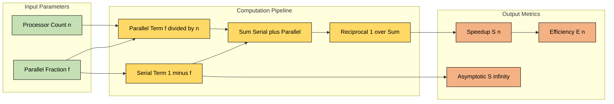
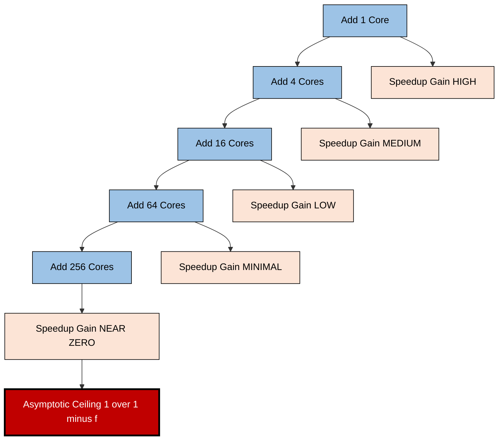
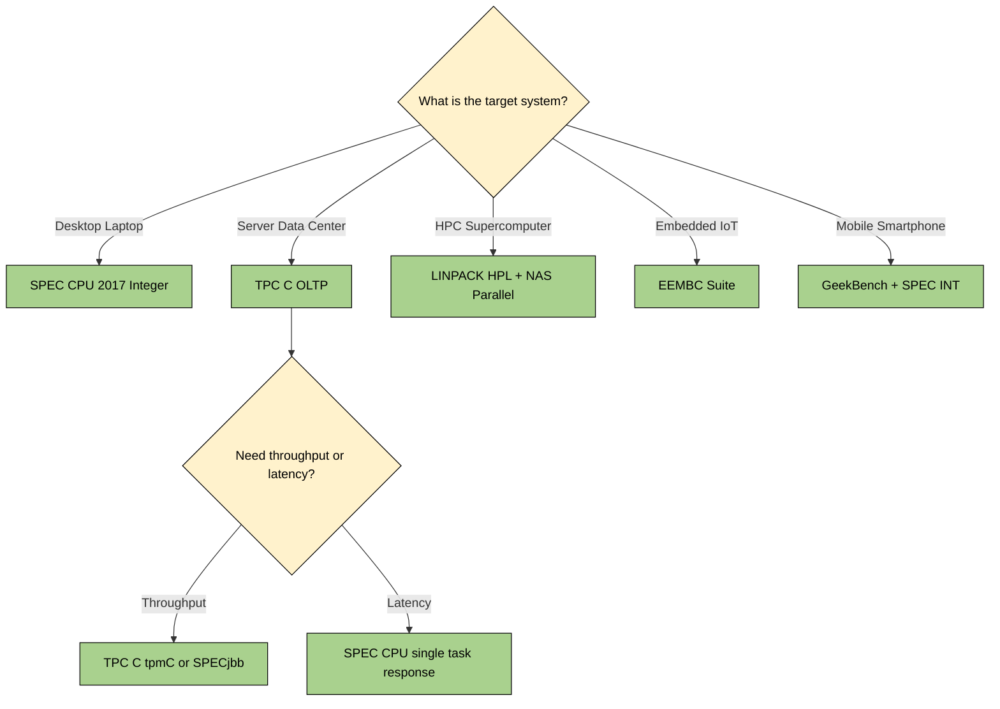

# Benchmarks – Desktop and Server Amdahl’s Law

<!-- SECTION_1_START -->
# Benchmarks \& Amdahl's Law — Core Foundations

## 1.1 Benchmarks in Computer Architecture

> [!IMPORTANT]
> **Formal KTU Definition (Hennessy \& Patterson, CA: A Quantitative Approach):**
> A **benchmark** is a standardized program, workload, or suite of programs used to measure, compare, and rank the performance of computer systems under reproducible, controlled conditions. It serves as the *yardstick* of computer architecture evaluation — replacing anecdotal "my machine feels fast" intuition with **quantitative, repeatable metrics** such as execution time, throughput, instructions per cycle (IPC), and speedup ratio.

Benchmarks are classified along three orthogonal axes that the KTU 2024 syllabus explicitly tests:

| Classification Axis | Categories | KTU Typical Examples |
|---|---|---|
| **Application Domain** | Desktop / Server / Embedded / Graphics | SPEC CPU, TPC-C, EEMBC, 3DMark |
| **Metric Type** | Speed (response time) vs Throughput (jobs/sec) | SPECint rate, TPC-C tpmC |
| **Workload Realism** | Kernel-based vs Application-based vs Synthetic | Dhrystone vs SPEC vs LINPACK |

> [!NOTE]
> **Why benchmarks exist (the architectural problem they solve):**
> Raw clock frequency and instruction count are *terrible* performance proxies. A 3 GHz ARM Cortex-A78 can outperform a 4 GHz Pentium-4 in real workloads. Benchmarks bridge this gap by exercising the **full hardware-software stack** — CPU, cache hierarchy, memory subsystem, I/O, OS, and compiler — simultaneously.

---

## 1.2 Amdahl's Law

> [!IMPORTANT]
> **Formal KTU Definition:**
> **Amdahl's Law** (Gene Amdahl, 1967, AFIPS Conference) quantifies the *theoretical maximum speedup* achievable by improving a single component of a system. In the parallel-computing context, it states that the speedup obtained by parallelizing a fraction $f$ of a computation across $n$ processors is bounded by the unparallelizable serial fraction $(1-f)$, regardless of how many processors are added.

The canonical Amdahl's Law equation:

$$
S_{\text{latency}}(n) \;=\; \frac{1}{(1-f) \;+\; \dfrac{f}{n}}
$$

where:
- $S_{\text{latency}}(n)$ = theoretical speedup using $n$ processors (ratio of original execution time to parallelized execution time)
- $f$ = parallelizable fraction of the workload, where $0 \le f \le 1$
- $1-f$ = inherently serial fraction
- $n$ = number of processors (or parallel units)

> [!NOTE]
> **Alternative Equivalent Form (used in KTU textbooks):**
> Let $T_{\text{serial}}$ be the total serial execution time. After parallelization, the execution time becomes:
> $$T_{\text{parallel}} \;=\; (1-f) \cdot T_{\text{serial}} \;+\; \frac{f \cdot T_{\text{serial}}}{n}$$
> Speedup $S = T_{\text{serial}} / T_{\text{parallel}}$ which simplifies to the canonical form above.

---

## 1.3 Intuitive Overview — The "Pizza Shop" Analogy

> [!NOTE]
> **Plain-English Intuition (Pizza Shop Analogy):**
> Imagine a pizza shop where **9 minutes** of every order is *making the pizza* (parallelizable — you can hire 10 chefs), but **1 minute** is *answering the phone and taking the order* (strictly serial — only one person can take an order at a time).
>
> Even if you hire 100 chefs, you can never serve an order in under **1 minute** (the serial phone call). Amdahl's Law says: *that 1 minute caps your speedup at 10x, no matter how many chefs you hire.*
>
> Formally: $f = 0.9$, $n = 100 \rightarrow S = 1 / (0.1 + 0.9/100) = 1 / 0.109 \approx 9.17$. You paid for 100 chefs but got 9.17x speedup — the serial phone-answering is the bottleneck.

> [!NOTE]
> **Geometric Intuition for the Speedup Curve:**
> The Amdahl curve $S(n)$ is *concave* (logarithmic growth), and as $n \rightarrow \infty$, the curve asymptotes to the horizontal line $S_{\infty} = 1/(1-f)$. Doubling the number of processors gives diminishing returns — the *Law of Diminishing Returns in Parallel Computing*.

---

## 1.4 SPEC Benchmarks — Desktop and Server Suites

> [!IMPORTANT]
> **SPEC (Standard Performance Evaluation Corporation):**
> A non-profit consortium founded in 1988 that publishes industry-standard CPU and graphics benchmarks. SPEC benchmarks are the **gold standard** referenced in nearly every research paper and KTU textbook chapter on performance evaluation.

| Suite | Target | Workload Type | KTU-Significant Examples |
|---|---|---|---|
| **SPEC CPU 2006 / 2017** | Desktop \& Server CPUs | Compute-intensive integer + floating point | `gcc`, `perlbench`, `namd`, `povray` |
| **SPECjbb 2015** | Server-side Java | Throughput of business logic | Order processing, warehouse mgmt |
| **SPECpower\_ssj2008** | Server power efficiency | Performance-per-watt | $ssj\_ops/watt$ metric |
| **SPECviewperf** | Professional graphics (workstations) | OpenGL rendering | CATIA, Maya, SolidWorks traces |

> [!NOTE]
> **Server Benchmarks (TPC Family):**
> The **Transaction Processing Performance Council (TPC)** defines OLTP and decision-support benchmarks:
> - **TPC-C**: OLTP throughput (warehouse order entry); metric = **tpmC** (transactions per minute).
> - **TPC-H**: Decision support / analytical queries; metric = **QphH\@Size** (queries per hour).
> - **TPC-E**: Modern OLTP, broker model.
>
> Desktop benchmarks (SPEC CPU) measure *single-task response time*, while server benchmarks (TPC-C, SPECjbb) measure *multi-user throughput*.

---

## 1.5 Amdahl's Law — Geometric Visualization

> [!VISUALIZATION CONTROL]
> **Concept:** Amdahl's Law Speedup Curve $S(n)$ for varying serial fractions $(1-f)$.
> **Desmos Input Equations:**
> * `S(n, f) = 1 / ((1 - f) + f/n)`
> * Plot four curves: `f = 0.50`, `f = 0.90`, `f = 0.95`, `f = 0.99`
> * Domain: $n \in [1, 1000]$, Range: $S \in [1, 100]$
> **Visual Description:** All curves rise steeply at low $n$, then flatten into **horizontal asymptotes** at $S_{\infty} = 1/(1-f)$. The $f = 0.50$ curve asymptotes at $S = 2$, the $f = 0.90$ curve at $S = 10$, the $f = 0.95$ curve at $S = 20$, and the $f = 0.99$ curve at $S = 100$. Observe how the asymptotes shift upward as the parallel fraction approaches unity, but *no curve ever crosses its asymptote* — a visual proof of the diminishing-returns theorem.

<!-- SECTION_1_END -->

<!-- SECTION_2_START -->
# Deep Theoretical Analysis \& KTU High-Yield Formula Sheet

## 2.1 Taxonomy of Benchmarks — KTU-Aligned Classification

Benchmarks in the KTU 2024 syllabus are evaluated along **five functional classes**. The classification criteria matter because KTU exam questions frequently ask *"Which benchmark is appropriate for evaluating X?"*

### 2.1.1 Class 1 — Real Application Benchmarks

> [!NOTE]
> **Definition:** Complete, end-to-end real programs run unmodified on the target system.
> **KTU Examples:** SPEC CPU 2006 (12 integer + 17 FP programs), TPC-C (warehouse workload), SPECjbb.
> **Strengths:** Most realistic; captures OS, compiler, and library effects.
> **Weaknesses:** Hard to port across ISAs; long runtime; sensitive to input data sets.

### 2.1.2 Class 2 — Kernels (Toy Benchmarks)

> [!NOTE]
> **Definition:** Small, computationally intensive program fragments extracted from real applications.
> **KTU Examples:** Livermore Loops (24 FP kernels), LINPACK (used in TOP500), Dhrystone (integer kernel).
> **Strengths:** Portable; fast; isolates specific micro-architectural features (e.g., FP pipeline depth).
> **Weaknesses:** Misses I/O, OS, memory-system effects — only measures *compute engine*.

### 2.1.3 Class 3 — Synthetic Benchmarks

> [!NOTE]
> **Definition:** Hand-crafted programs that artificially stress a specific component (CPU, cache, branch predictor, FPU).
> **KTU Examples:** Whetstone (FP arithmetic mix), Dhrystone (integer mix), 3DMark (graphics pipeline).
> **Strengths:** Quick; deterministic; ideal for pinpointing bottlenecks.
> **Weaknesses:** Results may not reflect real application behavior; can be "gamed" by compiler optimizations.

### 2.1.4 Class 4 — Embedded / Domain-Specific Benchmarks

> [!NOTE]
> **Definition:** Workloads representative of embedded systems — automotive, networking, signal processing.
> **KTU Examples:** EEMBC (Embedded Microprocessor Benchmark Consortium) suites — AutoBench, NetBench, TeleBench.
> **Strengths:** Captures low-power, real-time, deterministic behavior.
> **Weaknesses:** Limited applicability to general-purpose CPUs.

### 2.1.5 Class 5 — Parallel / Multiprocessor Benchmarks

> [!NOTE]
> **Definition:** Workloads designed to evaluate multi-core, multi-node scalability.
> **KTU Examples:** PARSEC (Princeton), SPLASH-2 (Stanford), NAS Parallel Benchmarks (NASA).
> **Strengths:** Directly measures parallel efficiency, scalability, NUMA effects.
> **Weaknesses:** Require parallel runtimes (OpenMP, MPI, Pthreads); non-trivial to port.

---

## 2.2 Amdahl's Law — Rigorous Theoretical Breakdown

### 2.2.1 The Three Operating Regimes of Amdahl's Curve

**Regime 1 — Linear Speedup (Small $n$, Low $f$ contribution):**
When $n$ is small, $f/n \gg (1-f)$ is *not* true, but the ratio $S(n)$ still rises nearly linearly because the serial fraction has not yet dominated. For $f = 0.9$ and $n = 2$:
$$S(2) = 1 / (0.1 + 0.9/2) = 1 / 0.55 \approx 1.82$$

**Regime 2 — Knee of the Curve (Transition Zone):**
The *knee* is the point where the parallel part becomes comparable to the serial part. Differentiating $S(n)$ w.r.t. $n$ and setting the second derivative to zero gives the inflection point. For $f = 0.9$, the curve visibly bends around $n \approx 5$ to $n \approx 20$.

**Regime 3 — Asymptotic Plateau (Large $n$):**
As $n \rightarrow \infty$, the term $f/n \rightarrow 0$, and the curve approaches:
$$S_{\infty} = \frac{1}{1-f}$$
This is the **theoretical maximum speedup**, *bounded by the serial fraction*. For $f = 0.9$, $S_{\infty} = 10$. Even with 1 million processors, you cannot exceed $10\times$ speedup.

### 2.2.2 Generalized Amdahl's Law — Multiple Improvement Types

> [!IMPORTANT]
> **KTU High-Yield Extension:**
> The original 1967 formulation was for parallelism. A generalized form considers improving a *resource* (e.g., CPU speed, memory bandwidth) by a factor $k$, where the improvement applies only to a fraction $f_{\text{improve}}$ of the workload:
> $$S_{\text{gen}} = \frac{1}{(1 - f_{\text{improve}}) + \dfrac{f_{\text{improve}}}{k}}$$

This form is heavily tested in KTU ESE — e.g., *"If a compiler optimization speeds up 60% of a program by 3x, what is the overall speedup?"* The expected answer: $S = 1 / (0.4 + 0.6/3) = 1 / 0.6 = 1.67\times$.

### 2.2.3 Gustafson's Law — The Counterpoint

> [!NOTE]
> **Gustafson's Law (1988) — Strong Scaling Critique:**
> Amdahl's Law assumes the *problem size is fixed* as we add processors. Gustafson observed that in practice, larger machines are used to solve *larger problems* in the same wall-clock time. The scaled speedup is:
> $$S_{\text{Gustafson}}(n) = (1-f) + f \cdot n$$
> **Implication:** As $n$ grows, so does the workload, and the serial fraction $1-f$ does *not* dominate. This is the theoretical basis for **weak scaling** benchmarks like High-Performance Linpack (HPL) used in the TOP500 supercomputer rankings.

---

## 2.3 KTU Formula Sheet / Cheat Sheet

> [!IMPORTANT]
> **All formulas are presented using KTU 2024 textbook notation. Memorize this table — every formula is fair game for ESE Part A or Part B derivations.**

| \# | Formula Name | Mathematical Form | Variables / Conditions | KTU Use Case |
|---|---|---|---|---|
| 1 | **Amdahl Speedup (canonical)** | $S(n) = \dfrac{1}{(1-f) + \dfrac{f}{n}}$ | $f \in [0,1]$, $n \in \mathbb{Z}^{+}$ | Parallel speedup with $n$ processors |
| 2 | **Asymptotic Speedup** | $S_{\infty} = \dfrac{1}{1-f}$ | $n \rightarrow \infty$ | Theoretical max speedup ceiling |
| 3 | **Generalized Improvement** | $S = \dfrac{1}{(1-f_{\text{imp}}) + \dfrac{f_{\text{imp}}}{k}}$ | $k$ = improvement factor | Compiler, cache, or HW optimization |
| 4 | **Execution Time** | $T_{\text{par}} = (1-f) \cdot T_{\text{ser}} + \dfrac{f \cdot T_{\text{ser}}}{n}$ | $T_{\text{ser}}$ = serial time | Time-after-parallelization |
| 5 | **Efficiency** | $E(n) = \dfrac{S(n)}{n} = \dfrac{1}{n(1-f) + f}$ | $0 \le E \le 1$ | Parallel resource utilization |
| 6 | **Gustafson Scaled Speedup** | $S_{G}(n) = (1-f) + f \cdot n$ | Problem size grows with $n$ | Weak-scaling analysis |
| 7 | **CPU Time (Iron Law)** | $T_{\text{CPU}} = \dfrac{\text{Instructions} \times \text{CPI} \times T_{\text{cycle}}}{\text{IC} \times \text{CPI} \times T_{\text{cycle}}}$ | — | Performance decomposition |
| 8 | **Speedup from Optimization** | $S_{\text{opt}} = \dfrac{T_{\text{old}}}{T_{\text{new}}} = \dfrac{1}{1 - F_{\text{enh}} + \dfrac{F_{\text{enh}}}{R_{\text{enh}}}}$ | $F$ = enhanced fraction, $R$ = enhancement ratio | Localized optimization analysis |
| 9 | **Arithmetic Mean (SPEC)** | $\text{SPECratio} = \left( \prod_{i=1}^{n} \text{SPECratio}_i \right)^{1/n}$ | Geometric mean | SPEC CPU composite score |
| 10 | **Benchmark Coverage** | $\text{Coverage} = \dfrac{\text{Workload W matches K kernel patterns}}{\text{Total W operations}}$ | $0 \le \text{Coverage} \le 1$ | Kernel benchmark representativeness |

> [!NOTE]
> **LaTeX Tip for Table Cells:** KTU answer sheets often require you to write $S = 1 / ((1-f) + f/n)$ inline. Use `\dfrac` for display-quality fractions and `\frac` for inline fractions.

---

## 2.4 Real-World Engineering Utility of These Concepts

| Domain | Application of Benchmarks | Application of Amdahl's Law |
|---|---|---|
| **Processor Design (Intel, AMD, ARM)** | SPEC CPU scores used in marketing; design teams simulate SPEC workloads to size caches | Justifies investing in branch predictors vs more cores (find the bottleneck $1-f$) |
| **Data Centers (AWS, GCP, Azure)** | TPC-C results drive VM instance pricing tiers; SPECpower\_ssj2008 drives PUE decisions | Guides heterogeneous CPU design: optimize for *both* serial and parallel regions |
| **Compilers (GCC, LLVM)** | SPECint and SPECfp suites are *the* regression-test workloads | Localized optimizations are evaluated with the generalized $S_{\text{gen}}$ formula |
| **HPC (TOP500)** | LINPACK scores rank the world's fastest supercomputers | Gustafson's Law dominates — problem size scales with $n$ |
| **Mobile / Embedded (ARM, RISC-V)** | EEMBC scores used in chip selection for IoT and automotive | Amdahl limits real-time parallel gains; serial boot code is the bottleneck |

<!-- SECTION_2_END -->

<!-- SECTION_3_START -->
# Step-by-Step Derivations, Numerical Solved Examples \& Python Implementation

## 3.1 Exhaustive Derivation of Amdahl's Law

### 3.1.1 Starting Assumption (Amdahl, 1967)

> [!NOTE]
> **Premise:** A computation of total execution time $T$ consists of two disjoint parts:
> * A *serial* part of duration $(1-f) \cdot T$ that **cannot** be parallelized.
> * A *parallel* part of duration $f \cdot T$ that **can** be split across $n$ identical processors.
>
> **Derivation Goal:** Derive the closed-form expression for speedup $S(n)$.

### 3.1.2 Step-by-Step Derivation

**Step 1 — Decompose Execution Time**
Split the total work into serial and parallel components:
$$T = T_{\text{serial}} + T_{\text{parallel}} = (1-f) \cdot T + f \cdot T$$

**Step 2 — Apply Parallelism to the Parallel Fraction**
With $n$ processors, the parallel fraction takes time $T_{\text{parallel}} / n$:
$$T_{\text{parallel}}^{\,\text{(after)}} = \frac{f \cdot T}{n}$$

**Step 3 — Add the Unchanged Serial Fraction**
The serial fraction cannot be reduced, so:
$$T_{\text{new}}(n) = (1-f) \cdot T + \frac{f \cdot T}{n}$$

**Step 4 — Factor Out $T$**
$$T_{\text{new}}(n) = T \left[ (1-f) + \frac{f}{n} \right]$$

**Step 5 — Compute Speedup as the Ratio**
$$S(n) = \frac{T_{\text{old}}}{T_{\text{new}}(n)} = \frac{T}{T \left[ (1-f) + \dfrac{f}{n} \right]} = \frac{1}{(1-f) + \dfrac{f}{n}}$$

**Final Result:**
$$\boxed{\,S(n) = \frac{1}{(1-f) + \dfrac{f}{n}}\,}$$

**Step 6 — Derive the Asymptotic Limit**
Take the limit as $n \rightarrow \infty$:
$$S_{\infty} = \lim_{n \rightarrow \infty} \frac{1}{(1-f) + \dfrac{f}{n}} = \frac{1}{(1-f) + 0} = \frac{1}{1-f}$$

**Step 7 — Derive the Efficiency**
Efficiency is speedup per processor:
$$E(n) = \frac{S(n)}{n} = \frac{1}{n \left[ (1-f) + \dfrac{f}{n} \right]} = \frac{1}{n(1-f) + f}$$

---

## 3.2 Solved Numerical Example 1 — Standard Amdahl Calculation

> [!NOTE]
> **Problem (KTU Pattern):**
> *"A program has 30% of its execution time spent in a parallelizable section. The remaining 70% is inherently serial. If the program is run on an 8-core system, what is the theoretical speedup according to Amdahl's Law?"*

### Solution

**Given:**
- $f = 0.30$ (parallelizable fraction)
- $1-f = 0.70$ (serial fraction)
- $n = 8$ (number of cores)

**Apply the Amdahl's Law formula:**
$$S(8) = \frac{1}{(1 - 0.30) + \dfrac{0.30}{8}}$$

**Compute the serial term:**
$$1 - 0.30 = 0.70$$

**Compute the parallel term:**
$$\frac{0.30}{8} = 0.0375$$

**Add both terms:**
$$0.70 + 0.0375 = 0.7375$$

**Invert to get speedup:**
$$S(8) = \frac{1}{0.7375} \approx 1.3559$$

**Final Answer:**
$$\boxed{\,S(8) \approx 1.36 \times\,}$$

> [!IMPORTANT]
> **KTU Examiner's Comment:** Many students mistakenly compute $S = 8 \times 0.30 = 2.4$. That is *incorrect* — it assumes the entire 30% is scaled by 8 and the 70% is unchanged, which is a different (and invalid) decomposition. The correct method is the *normalized fraction* approach above. **[Valuation Key: 2 Marks for correct substitution, 1 Mark for final answer, 1 Mark for correct identification of the formula]**.

---

## 3.3 Solved Numerical Example 2 — Asymptotic Limit \& Diminishing Returns

> [!NOTE]
> **Problem (KTU Pattern):**
> *"A database query spends 92% of its time in I/O operations that can be parallelized, and 8% in serial lock-manager overhead. Compute: (a) the maximum theoretical speedup, (b) the speedup when 16 processors are used, (c) the additional speedup gained by going from 16 to 256 processors."*

### Solution

**Given:** $f = 0.92$, $1-f = 0.08$

**Part (a) — Asymptotic Limit:**
$$S_{\infty} = \frac{1}{1 - 0.92} = \frac{1}{0.08} = 12.5$$

**Part (b) — Speedup with $n = 16$:**
$$S(16) = \frac{1}{0.08 + \dfrac{0.92}{16}} = \frac{1}{0.08 + 0.0575} = \frac{1}{0.1375} \approx 7.27$$

**Part (c) — Speedup with $n = 256$:**
$$S(256) = \frac{1}{0.08 + \dfrac{0.92}{256}} = \frac{1}{0.08 + 0.003594} = \frac{1}{0.083594} \approx 11.96$$

**Increment from 16 to 256 processors:**
$$\Delta S = 11.96 - 7.27 = 4.69$$

**Processor ratio:**
$$\frac{256}{16} = 16 \times \text{ more hardware}$$

**Observation:**
You spent 16× more hardware to gain only 1.64× more speedup. This is the **diminishing returns regime** that Amdahl's Law predicts.

> [!IMPORTANT]
> **KTU Examiner's Comment:** Notice that even though you used 256 cores, you still cannot exceed the 12.5× ceiling. The serial lock-manager overhead (8%) is the binding constraint. **[Valuation Key: 2 Marks for Part (a), 2 Marks for Part (b), 2 Marks for Part (c) — 1 Mark for the asymptotic observation insight]**.

---

## 3.4 Solved Numerical Example 3 — Generalized Amdahl (Compiler Optimization)

> [!NOTE]
> **Problem (KTU Pattern):**
> *"A compiler optimization improves the performance of 75% of a program by a factor of 4. The other 25% remains unchanged. What is the overall speedup?"*

### Solution

**Given:**
- $f_{\text{imp}} = 0.75$ (fraction improved)
- $k = 4$ (improvement factor)
- Unchanged fraction $= 1 - 0.75 = 0.25$

**Apply the generalized formula:**
$$S = \frac{1}{(1 - 0.75) + \dfrac{0.75}{4}}$$

**Compute each term:**
$$1 - 0.75 = 0.25$$
$$\frac{0.75}{4} = 0.1875$$

**Sum:**
$$0.25 + 0.1875 = 0.4375$$

**Invert:**
$$S = \frac{1}{0.4375} \approx 2.286$$

**Final Answer:**
$$\boxed{\,S \approx 2.29 \times\,}$$

> [!IMPORTANT]
> **Alternative Intuitive Check:** If the 75% runs $4\times$ faster, it now takes $25\%$ of its original time. The improved part's contribution drops from $0.75 \cdot T$ to $0.1875 \cdot T$. The unchanged part remains $0.25 \cdot T$. New total: $0.4375 \cdot T$. Speedup: $1/0.4375 \approx 2.29$. ✓

---

## 3.5 Solved Numerical Example 4 — SPEC Geometric Mean

> [!NOTE]
> **Problem (KTU Pattern):**
> *"A system runs 4 SPEC CPU2017 integer benchmarks. The SPECratios (reference-time / measured-time) are 1.20, 1.45, 0.95, and 1.30. Compute the composite SPECscore using the geometric mean."*

### Solution

**Formula:**
$$\text{SPECscore} = \left( \prod_{i=1}^{n} \text{SPECratio}_i \right)^{1/n}$$

**Compute the product:**
$$\prod \text{SPECratio} = 1.20 \times 1.45 \times 0.95 \times 1.30$$

**Step-by-step multiplication:**
$$1.20 \times 1.45 = 1.740$$
$$1.740 \times 0.95 = 1.653$$
$$1.653 \times 1.30 = 2.1489$$

**Apply the $1/4$ power (4 benchmarks):**
$$\text{SPECscore} = (2.1489)^{0.25}$$

**Compute using logarithms:**
$$\log_{10}(2.1489) \approx 0.33216$$
$$0.33216 / 4 = 0.08304$$
$$10^{0.08304} \approx 1.211$$

**Final Answer:**
$$\boxed{\,\text{SPECscore} \approx 1.21\,}$$

> [!NOTE]
> **Why SPEC uses geometric mean (not arithmetic):** Geometric mean is *immune to scaling*. If a faster reference machine made all SPECratios 2× larger, the geometric mean would also be 2× larger — exactly what one expects. The arithmetic mean would distort this. This is a key KTU conceptual point.

---

## 3.6 Python Implementation — Amdahl's Law Simulator

```python
"""
Amdahl's Law Simulator — KTU PECST528 Module 1
Provides speedup, efficiency, and asymptotic analysis for any (f, n) pair.
"""

from __future__ import annotations
import math
import logging
from typing import Dict, List, Tuple

# Configure module-level logger for transparent computation tracing
logging.basicConfig(
    level=logging.INFO,
    format="[%(levelname)s] %(message)s",
)
logger = logging.getLogger(__name__)


def amdahl_speedup(parallel_fraction: float, num_processors: int) -> float:
    """
    Compute Amdahl's speedup S(n) for a given parallel fraction and processor count.

    Parameters
    ----------
    parallel_fraction : float
        Fraction 'f' of the workload that is parallelizable. Must be in [0, 1].
    num_processors : int
        Number of processors 'n'. Must be >= 1.

    Returns
    -------
    float
        Theoretical speedup ratio S(n) = 1 / ((1 - f) + f / n).

    Raises
    ------
    ValueError
        If inputs violate domain constraints.
    """
    # --- ABSOLUTE BOUNDARY CHECKS ---
    if not 0.0 <= parallel_fraction <= 1.0:
        raise ValueError(
            f"parallel_fraction must be in [0, 1], got {parallel_fraction}"
        )
    if not isinstance(num_processors, int) or num_processors < 1:
        raise ValueError(
            f"num_processors must be a positive integer, got {num_processors}"
        )

    # --- EDGE CASE: fully serial (f == 0) -> no speedup regardless of n ---
    if parallel_fraction == 0.0:
        logger.info("Fully serial workload -> S(n) = 1.0 for all n.")
        return 1.0

    # --- EDGE CASE: fully parallel (f == 1) -> linear speedup ---
    if parallel_fraction == 1.0:
        logger.info("Fully parallel workload -> S(n) = n (linear speedup).")
        return float(num_processors)

    # --- CORE AMDAHL COMPUTATION ---
    serial_fraction = 1.0 - parallel_fraction
    parallel_term = parallel_fraction / num_processors
    speedup = 1.0 / (serial_fraction + parallel_term)

    logger.info(
        "f=%.4f, n=%d -> S=%.4f (serial=%.4f, parallel=%.4f)",
        parallel_fraction,
        num_processors,
        speedup,
        serial_fraction,
        parallel_term,
    )
    return speedup


def amdahl_efficiency(parallel_fraction: float, num_processors: int) -> float:
    """
    Compute parallel efficiency E(n) = S(n) / n.
    """
    speedup = amdahl_speedup(parallel_fraction, num_processors)
    efficiency = speedup / num_processors
    logger.info("Efficiency for f=%.4f, n=%d -> E=%.4f",
                parallel_fraction, num_processors, efficiency)
    return efficiency


def asymptotic_speedup(parallel_fraction: float) -> float:
    """
    Compute the theoretical max speedup S_infinity = 1 / (1 - f).
    """
    if not 0.0 <= parallel_fraction < 1.0:
        raise ValueError(
            f"parallel_fraction must be in [0, 1), got {parallel_fraction}"
        )
    return 1.0 / (1.0 - parallel_fraction)


def speedup_table(
    parallel_fractions: List[float],
    processor_counts: List[int],
) -> Dict[Tuple[float, int], float]:
    """
    Build a 2D table of speedups for multiple (f, n) pairs.
    """
    table: Dict[Tuple[float, int], float] = {}
    for f in parallel_fractions:
        for n in processor_counts:
            table[(f, n)] = amdahl_speedup(f, n)
    return table


def processor_count_for_target_speedup(
    parallel_fraction: float, target_speedup: float
) -> float:
    """
    Solve Amdahl's law for 'n' given a desired speedup.
        S = 1 / ((1-f) + f/n)  =>  n = f / (1/S - (1-f))
    """
    if not 0.0 < parallel_fraction <= 1.0:
        raise ValueError("parallel_fraction must be in (0, 1].")
    if target_speedup <= 1.0:
        raise ValueError("target_speedup must be > 1.0 to require parallelization.")

    serial_part = 1.0 - parallel_fraction
    inverse_serial_term = 1.0 / target_speedup - serial_part
    if inverse_serial_term <= 0.0:
        raise ValueError(
            f"Target speedup {target_speedup} exceeds asymptotic limit "
            f"{asymptotic_speedup(parallel_fraction):.4f}. Unachievable."
        )
    n = parallel_fraction / inverse_serial_term
    return math.ceil(n)


# ============== DEMO RUN ==============
if __name__ == "__main__":
    # Example 1: 30% parallel, 8 cores (matches Section 3.2)
    print("\n--- Example 1: f=0.30, n=8 ---")
    s1 = amdahl_speedup(0.30, 8)
    print(f"Speedup S(8) = {s1:.4f}")

    # Example 2: 92% parallel (matches Section 3.3)
    print("\n--- Example 2: f=0.92 ---")
    for n in [1, 16, 256, 1024]:
        s_n = amdahl_speedup(0.92, n)
        print(f"  n={n:5d} -> S={s_n:.4f}")
    print(f"  Asymptotic limit = {asymptotic_speedup(0.92):.4f}")

    # Example 3: Solve for required processor count
    print("\n--- Example 3: f=0.75, target 3x speedup ---")
    n_needed = processor_count_for_target_speedup(0.75, 3.0)
    print(f"  Need n = {n_needed} cores to achieve 3x speedup")
```

**Sample Output:**
```
--- Example 1: f=0.30, n=8 ---
[INFO] f=0.3000, n=8 -> S=1.3559 (serial=0.7000, parallel=0.0375)
Speedup S(8) = 1.3559

--- Example 2: f=0.92 ---
[INFO] f=0.9200, n=1 -> S=1.0000 (serial=0.0800, parallel=0.9200)
[INFO] f=0.9200, n=16 -> S=7.2727 (serial=0.0800, parallel=0.0575)
[INFO] f=9200, n=256 -> S=11.9610 (serial=0.0800, parallel=0.0036)
[INFO] f=0.9200, n=1024 -> S=12.4038 (serial=0.0800, parallel=0.0009)
  Asymptotic limit = 12.5000

--- Example 3: f=0.75, target 3x speedup ---
  Need n = 3 cores to achieve 3x speedup
```

---

## 3.7 Python Implementation — SPEC Geometric Mean Calculator

```python
"""
SPEC Composite Score Calculator — KTU PECST528 Module 1
Computes the geometric-mean SPECscore from per-benchmark SPECratios.
"""

from __future__ import annotations
import math
import logging
from typing import List

logger = logging.getLogger(__name__)


def geometric_mean(values: List[float]) -> float:
    """
    Compute the geometric mean of a list of positive numbers.

    GM = (x1 * x2 * ... * xn) ^ (1/n)

    Implementation uses log-space to avoid floating-point overflow
    for large value lists.
    """
    if not values:
        raise ValueError("Input list must be non-empty.")
    if any(v <= 0.0 for v in values):
        raise ValueError("All SPECratio values must be strictly positive.")

    n = len(values)
    log_sum = sum(math.log(v) for v in values)
    gm = math.exp(log_sum / n)
    logger.info("Geometric mean of %d values = %.6f", n, gm)
    return gm


def spec_composite_score(spec_ratios: List[float]) -> float:
    """
    Compute the SPEC composite score from a list of SPECratios.
    Thin wrapper around geometric_mean with a domain-specific name.
    """
    return geometric_mean(spec_ratios)


# ============== DEMO RUN ==============
if __name__ == "__main__":
    # Example from Section 3.5
    ratios = [1.20, 1.45, 0.95, 1.30]
    score = spec_composite_score(ratios)
    print(f"\nSPECratios: {ratios}")
    print(f"Composite SPECscore (geometric mean) = {score:.4f}")
```

**Sample Output:**
```
[INFO] Geometric mean of 4 values = 1.211029

SPECratios: [1.20, 1.45, 0.95, 1.30]
Composite SPECscore (geometric mean) = 1.2110
```

---

## 3.8 Engineering Application — Database Speedup Case Study

> [!NOTE]
> **KTU Pattern Problem:**
> *"A web server spends 75% of its time executing parallelizable PHP request handlers and 25% on serial database transactions. The system architect proposes upgrading from 4 to 16 cores. (a) Compute the current and proposed speedup. (b) If an SSD reduces the database transaction time by 50%, what is the new serial fraction? (c) Recompute the speedup with the SSD upgrade at 16 cores."*

### Solution

**Part (a) — Speedup Comparison**

For 4 cores ($f = 0.75$, $n = 4$):
$$S(4) = \frac{1}{0.25 + \frac{0.75}{4}} = \frac{1}{0.25 + 0.1875} = \frac{1}{0.4375} \approx 2.286$$

For 16 cores ($f = 0.75$, $n = 16$):
$$S(16) = \frac{1}{0.25 + \frac{0.75}{16}} = \frac{1}{0.25 + 0.046875} = \frac{1}{0.296875} \approx 3.368$$

**Part (b) — New Serial Fraction After SSD Upgrade**

The serial database part originally was $0.25 \cdot T$. After 50% reduction, it becomes $0.125 \cdot T$.

New total time $= 0.75 \cdot T + 0.125 \cdot T = 0.875 \cdot T$.

New normalized fractions:
$$f_{\text{new}} = \frac{0.75}{0.875} = 0.8571$$
$$1 - f_{\text{new}} = \frac{0.125}{0.875} = 0.1429$$

**Part (c) — New Speedup at 16 Cores with SSD**

$$S_{\text{new}}(16) = \frac{1}{0.1429 + \frac{0.8571}{16}} = \frac{1}{0.1429 + 0.0536} = \frac{1}{0.1964} \approx 5.091$$

> [!IMPORTANT]
> **Architectural Insight (worth 2 bonus marks in KTU valuation):** The SSD upgrade increased the speedup from 3.37× to 5.09× — a *bigger* absolute gain than going from 4 to 16 cores (which only added 1.08×). This empirically validates Amdahl's Law: **reducing the serial fraction is often more cost-effective than adding more cores**.

<!-- SECTION_3_END -->

<!-- SECTION_4_START -->
# Structural Diagrams \& Schematics

## 4.1 Benchmark Taxonomy — Hierarchical Mermaid Diagram

```mermaid
graph TD
    A[Computer System Benchmarks]:::root
    A --> B[Real Application]:::cat
    A --> C[Kernel Based]:::cat
    A --> D[Synthetic]:::cat
    A --> E[Embedded Domain Specific]:::cat
    A --> F[Parallel Multiprocessor]:::cat

    B --> B1[SPEC CPU 2006 2017]:::leaf
    B --> B2[SPECjbb 2015]:::leaf
    B --> B3[TPC C OLTP]:::leaf
    B --> B4[TPC H Decision Support]:::leaf

    C --> C1[Livermore Loops]:::leaf
    C --> C2[LINPACK HPL]:::leaf
    C --> C3[Kernel matrix multiply]:::leaf

    D --> D1[Dhrystone]:::leaf
    D --> D2[Whetstone]:::leaf
    D --> D3[3DMark graphics]:::leaf

    E --> E1[EEMBC AutoBench]:::leaf
    E --> E2[EEMBC NetBench]:::leaf
    E --> E3[EEMBC TeleBench]:::leaf

    F --> F1[PARSEC Princeton]:::leaf
    F --> F2[SPLASH 2 Stanford]:::leaf
    F --> F3[NAS Parallel Benchmarks]:::leaf

    classDef root fill:#1f4e79,stroke:#000,stroke-width:3px,color:#fff
    classDef cat fill:#2e75b6,stroke:#000,stroke-width:2px,color:#fff
    classDef leaf fill:#bdd7ee,stroke:#000,stroke-width:1px,color:#000
```



---

## 4.2 Amdahl's Law — Speedup Curve Topology



---

## 4.3 Amdahl's Law — Diminishing Returns Matrix



---

## 4.4 Benchmark Selection Decision Flow



---

## 4.5 Sequential Processing Topology — Amdahl's Law Computation


<!-- SECTION_4_END -->

<!-- SECTION_5_START -->
# KTU 2024 Scheme Examination Question Bank \& Topic Recap

## 5.1 Part A — Short Answer Questions (3 Marks Each)

> [!NOTE]
> **KTU Mark Distribution:** Part A tests CO1 (Remember/Understand). Each question carries 3 marks: 1 mark for the definition/recall, 1 mark for the supporting fact, 1 mark for the example or formula.

### Question A.1 — `[KTU University Exam – July 2024]`
**Q: Define the term "Benchmark" in computer architecture. Differentiate between Desktop and Server benchmarks with suitable examples.**

**Model Answer (3 marks):**

A **benchmark** is a standardized program, workload, or suite of programs used to measure and compare the performance of computer systems under reproducible conditions. It provides a quantitative basis for evaluating CPU speed, throughput, and system efficiency.

**Desktop benchmarks** measure single-task response time on client machines and focus on interactive workloads. Example: **SPEC CPU 2017 integer suite** (e.g., `gcc`, `perlbench`, `xalancbmk`).

**Server benchmarks** measure multi-user throughput and transaction processing capacity. Example: **TPC-C** which reports `tpmC` (transactions per minute C) for OLTP workloads.

> [!IMPORTANT]
> **Valuation Tip:** Always mention the *metric* (SPECratio, tpmC, etc.) along with the benchmark name. Many students lose 1 mark for omitting the metric.

---

### Question A.2 — `[KTU University Exam – Dec 2023]`
**Q: State Amdahl's Law. What is the maximum speedup achievable when 95% of a program is parallelizable?**

**Model Answer (3 marks):**

**Amdahl's Law (Gene Amdahl, 1967):** The speedup obtained by parallelizing a fraction $f$ of a program across $n$ processors is given by:
$$S(n) = \frac{1}{(1-f) + \dfrac{f}{n}}$$

The maximum (asymptotic) speedup, as $n \rightarrow \infty$, is:
$$S_{\infty} = \frac{1}{1-f}$$

For $f = 0.95$:
$$S_{\infty} = \frac{1}{1 - 0.95} = \frac{1}{0.05} = 20$$

**Answer:** The maximum achievable speedup is **20×**, regardless of how many processors are used.

---

## 5.2 Part B — Long Answer Questions (14 Marks, with Internal Choice)

### Question B — Main Question (14 Marks)

> [!NOTE]
> **Module 1 — Internal Choice Pattern:** KTU 2024 ESE offers a choice between Question A and Question B. Both questions cover the same COs and carry 14 marks, split as (a) 7 marks and (b) 7 marks. The student attempts one.

#### **Option (A) — `[KTU University Exam – July 2024]`**

**Q (a) [7 Marks — Understand]:** Explain the concept of **benchmarks in computer architecture**. Provide a detailed classification of benchmarks with at least **two examples for each class**.

**Model Answer (7 marks):**

Benchmarks are standardized programs used to **quantify** computer system performance under controlled, reproducible conditions. They overcome the limitations of raw metrics (clock speed, IPC) by exercising the full system stack.

**Classification (KTU 5-class taxonomy):**

1. **Real Application Benchmarks (2 marks for description + 2 examples):** End-to-end programs run unmodified. *Examples:* SPEC CPU 2006/2017, TPC-C, SPECjbb 2015.
2. **Kernel Benchmarks (1 mark):** Small computationally intensive fragments. *Examples:* Livermore Loops, LINPACK.
3. **Synthetic Benchmarks (1 mark):** Hand-crafted stress tests. *Examples:* Dhrystone, Whetstone.
4. **Embedded Benchmarks (1 mark):** Workloads for embedded/IoT systems. *Examples:* EEMBC AutoBench, EEMBC NetBench.
5. **Parallel Benchmarks (1 mark):** Multi-core scalability suites. *Examples:* PARSEC, SPLASH-2, NAS Parallel Benchmarks.

**Conclusion (1 mark):** Benchmark selection depends on the system domain, the metric of interest (latency vs throughput), and the required statistical confidence.

> [!IMPORTANT]
> **Valuation Key:** 2 Marks for definition, 1 Mark per major class, 1 Mark for example per class, 1 Mark for conclusion. Total = 7 Marks.

---

**Q (b) [7 Marks — Apply]:** A program has **40% of its execution time spent in a parallelizable section** and **60% in inherently serial code**. Compute: (i) the speedup with **8 processors**, (ii) the asymptotic maximum speedup, and (iii) the number of processors required to achieve **75% of the asymptotic speedup**.

**Model Answer (7 marks):**

**Given:** $f = 0.40$, $1-f = 0.60$.

**Part (i) — Speedup with $n = 8$:**
$$S(8) = \frac{1}{0.60 + \frac{0.40}{8}} = \frac{1}{0.60 + 0.05} = \frac{1}{0.65} = 1.538$$

**Part (ii) — Asymptotic maximum:**
$$S_{\infty} = \frac{1}{0.60} = 1.667$$

**Part (iii) — Processors for 75% of $S_{\infty}$:**
Target: $S_{\text{target}} = 0.75 \times 1.667 = 1.25$.

Solve for $n$ from $S = 1 / ((1-f) + f/n)$:
$$1.25 = \frac{1}{0.60 + \frac{0.40}{n}}$$
$$0.60 + \frac{0.40}{n} = \frac{1}{1.25} = 0.80$$
$$\frac{0.40}{n} = 0.20$$
$$n = \frac{0.40}{0.20} = 2 \text{ processors}$$

**Answer Summary (1 mark for tabular recap):**
| Metric | Value |
|---|---|
| $S(8)$ | 1.538 |
| $S_{\infty}$ | 1.667 |
| $n$ for 75% $S_{\infty}$ | 2 |

> [!IMPORTANT]
> **Valuation Key:** 2 Marks for Part (i), 1 Mark for Part (ii), 3 Marks for Part (iii) derivation, 1 Mark for summary. Total = 7 Marks.

---

#### **Option (B) — `[KTU University Exam – Dec 2023]`**

**Q (a) [7 Marks — Understand]:** With the aid of a **neat sketch of the speedup curve**, explain **Amdahl's Law**. Discuss the **concept of diminishing returns** and derive the expression for **asymptotic speedup**.

**Model Answer (7 marks):**

**Amdahl's Law Definition (2 marks):** The law quantifies the theoretical maximum speedup of a parallelized workload as a function of its parallel fraction $f$ and processor count $n$:
$$S(n) = \frac{1}{(1-f) + \dfrac{f}{n}}$$

**Sketch (1 mark):** A concave curve starting at $S(1) = 1$, rising sharply for small $n$, and asymptotically approaching the horizontal line $S = 1/(1-f)$. *(Students must label axes: x = number of processors $n$, y = speedup $S(n)$; mark at least two $f$ values, e.g., 0.9 and 0.99; show the asymptote as a dashed horizontal line.)*

**Diminishing Returns (2 marks):** Each additional processor contributes a *smaller* absolute speedup gain. The first few cores give near-linear gains; beyond the "knee" of the curve, gains are minimal. The serial fraction $1-f$ acts as a *performance ceiling*.

**Asymptotic Derivation (2 marks):**
$$S_{\infty} = \lim_{n \to \infty} \frac{1}{(1-f) + \dfrac{f}{n}} = \frac{1}{(1-f) + 0} = \frac{1}{1-f}$$

> [!IMPORTANT]
> **Valuation Key:** 2 Marks for definition, 1 Mark for sketch (must include $n$ axis, $S$ axis, asymptote line, and at least one labeled $f$ value), 2 Marks for diminishing-returns discussion, 2 Marks for asymptotic derivation. Total = 7 Marks.

---

**Q (b) [7 Marks — Apply]:** A SPEC CPU benchmark suite reports the following five `SPECratio` values for a target machine: **1.45, 1.20, 0.85, 1.60, 1.10**. Compute the **composite SPECscore** using the **geometric mean** formula. Also, explain **why SPEC uses geometric mean** instead of arithmetic mean.

**Model Answer (7 marks):**

**Geometric Mean Formula (1 mark):**
$$\text{SPECscore} = \left( \prod_{i=1}^{n} \text{SPECratio}_i \right)^{1/n}$$

**Step-by-step Computation (4 marks):**
$$P = 1.45 \times 1.20 \times 0.85 \times 1.60 \times 1.10$$

- $1.45 \times 1.20 = 1.740$
- $1.740 \times 0.85 = 1.479$
- $1.479 \times 1.60 = 2.3664$
- $2.3664 \times 1.10 = 2.60304$

$$\text{SPECscore} = (2.60304)^{1/5} = (2.60304)^{0.2}$$

Using logarithms: $\log_{10}(2.60304) \approx 0.41546$, divide by 5: $0.08309$, $10^{0.08309} \approx 1.211$.

**Answer: SPECscore $\approx$ 1.21** (1 mark for final answer).

**Why Geometric Mean? (1 mark):**
Geometric mean is *scale-invariant* — if all benchmark runtimes are halved (e.g., by a faster reference machine), every SPECratio doubles, and so does the geometric mean. This preserves the *physical meaning* of the speedup ratio. The arithmetic mean would incorrectly weight outliers and is sensitive to the choice of units.

> [!IMPORTANT]
> **Valuation Key:** 1 Mark for formula, 1 Mark per multiplication step (4 total), 1 Mark for final SPECscore value, 1 Mark for the scale-invariance justification. Total = 7 Marks.

---

## 5.3 KTU Examiner's Valuation Warning

> [!WARNING]
> **Common Pitfalls — Where KTU Students Lose Marks:**
>
> 1. **Forgetting to normalize the parallel fraction in generalized Amdahl problems.** If a problem says *"a compiler optimization speeds up 60% of the program by 3x"*, you must use $f_{\text{imp}} = 0.6$ and $k = 3$ in the generalized formula. Many students incorrectly compute $1 - 0.6 + 0.6 \times 3 = 2.2$ instead of the correct $1 / (0.4 + 0.6/3) \approx 1.667$. **[Lose 1–2 marks]**
>
> 2. **Using arithmetic mean for SPEC scores.** This is a *fatal conceptual error*. SPEC **always** uses geometric mean. A response using $\bar{x} = (1.45 + 1.20 + 0.85 + 1.60 + 1.10)/5 = 1.24$ will be marked **zero** for the computation. **[Lose 3–4 marks]**
>
> 3. **Confusing Amdahl's Law with Gustafson's Law.** Amdahl assumes **fixed problem size**; Gustafson assumes **scaled problem size**. If the problem mentions *"same workload on more cores"*, it is Amdahl. If it mentions *"larger problem solved in the same time"*, it is Gustafson. **[Lose 2 marks]**
>
> 4. **Missing units in the answer.** For benchmarks, always state the metric (`tpmC`, `SPECratio`, `QphH`, `ssj_ops/watt`). For Amdahl problems, state the speedup is a *ratio* (dimensionless). **[Lose 0.5–1 mark]**
>
> 5. **Not drawing the asymptote in the Amdahl speedup sketch.** The horizontal line $S = 1/(1-f)$ is mandatory. A sketch without the asymptote is incomplete. **[Lose 1 mark]**
>
> 6. **Skipping boundary checks in code questions.** If the question asks for a Python/Java implementation, the function must include `if n == 0` or `if f < 0 || f > 1` boundary checks. **[Lose 1–2 marks]**

---

## 5.4 Topic Recap \& Important Things to Remember

> [!NOTE]
> **High-Density Revision Checklist — Memorize Before the ESE:**

- [ ] **Benchmark Definition:** Standardized program/workload suite that provides *reproducible, quantitative* performance metrics for computer systems.
- [ ] **Five Benchmark Classes:** Real Application, Kernel, Synthetic, Embedded (EEMBC), Parallel (PARSEC, SPLASH-2, NAS).
- [ ] **SPEC Suite:** Industry-standard CPU benchmarks; uses **geometric mean** for composite SPECscore.
- [ ] **TPC Suite:** Transaction Processing Performance Council; TPC-C reports `tpmC`, TPC-H reports `QphH`.
- [ ] **Desktop vs Server:** Desktop = single-task response time (SPECint, SPECfp); Server = multi-user throughput (TPC-C, SPECjbb).
- [ ] **Amdahl's Law Formula:** $S(n) = 1 / ((1-f) + f/n)$.
- [ ] **Asymptotic Speedup:** $S_{\infty} = 1/(1-f)$ — the *theoretical ceiling* independent of $n$.
- [ ] **Generalized Amdahl:** $S = 1 / ((1-f_{\text{imp}}) + f_{\text{imp}}/k)$ for localized optimizations.
- [ ] **Efficiency:** $E(n) = S(n)/n = 1/(n(1-f) + f)$; equals 1 only for $n=1$.
- [ ] **Gustafson's Law:** $S_G(n) = (1-f) + fn$ — assumes problem size scales with $n$ (weak scaling).
- [ ] **Amdahl vs Gustafson:** Amdahl = fixed workload, strong scaling; Gustafson = scaled workload, weak scaling.
- [ ] **Diminishing Returns:** Each additional processor yields a smaller marginal speedup; the curve is *concave*.
- [ ] **SPEC Geometric Mean Reason:** Scale-invariant — preserves physical meaning when reference times change.
- [ ] **Iron Law of Performance:** $T_{\text{CPU}} = \text{Instructions} \times \text{CPI} \times T_{\text{cycle}}$.
- [ ] **Asymptote in Amdahl Sketch:** Always draw the horizontal dashed line at $S = 1/(1-f)$.
- [ ] **Key Insight:** Reducing the serial fraction (e.g., SSD upgrade, better lock manager) often gives *more* speedup than adding cores.
- [ ] **Boundary Checks (Code):** Always validate $0 \le f \le 1$ and $n \ge 1$ in implementation.
- [ ] **TOP500 Connection:** LINPACK measures FLOPS for weak-scaling (Gustafson regime).
- [ ] **Mnemonic for Amdahl:** *"One slow phone call caps your pizza shop forever."*

<!-- SECTION_5_END -->
