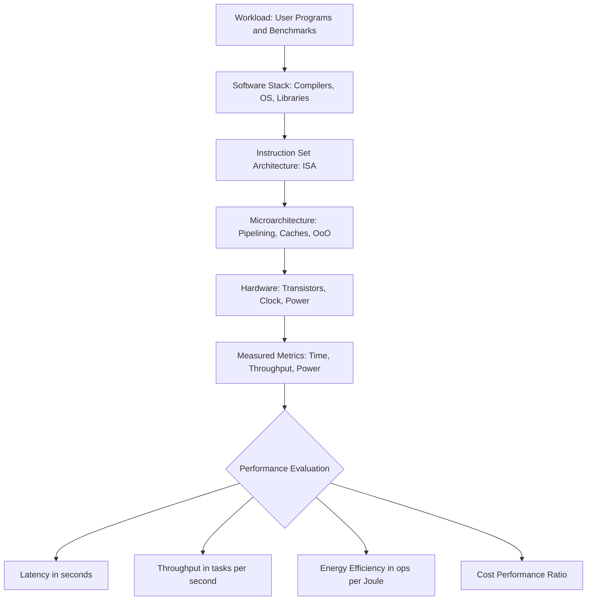
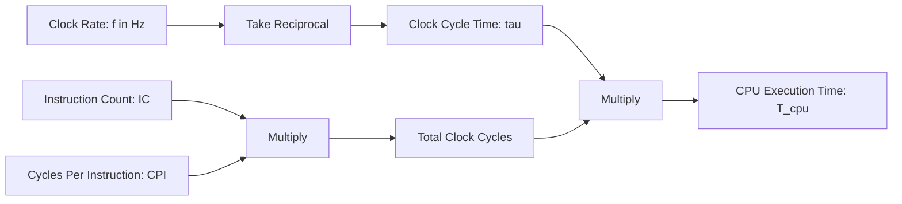
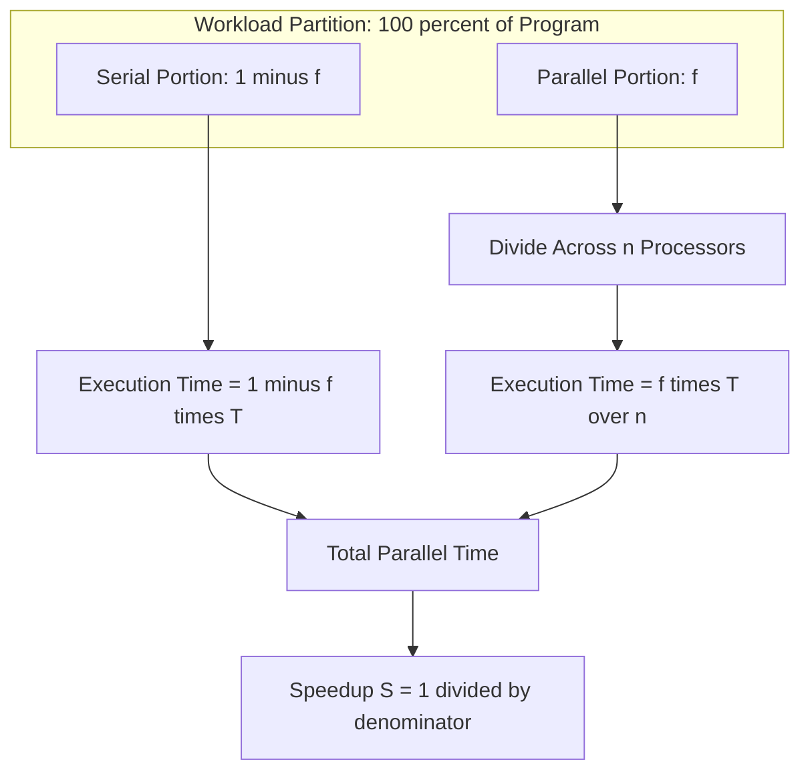
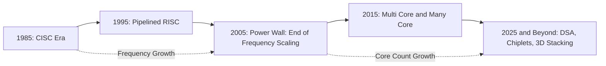

# Concept of Computer Hardware and Organization (P15, 5th Edition) Measuring

<!-- SECTION_1_START -->
# 1. Core Technical Definition & Intuitive Overview

## 1.1 Formal Definition (KTU 2024 Syllabus Terminology)

> [!IMPORTANT]
> **Computer Performance Measurement** is the quantitative evaluation of a computing system's ability to execute workloads, expressed as a function of **response time (latency)**, **throughput (bandwidth)**, and the **cost** of execution. Per the Hennessy & Patterson $P_{15}$ framework (5th Edition, Chapter 1), performance is fundamentally defined by the relationship:
>
> $$\text{Performance}_X = \frac{1}{\text{Execution Time}_X}$$

In the context of the **KTU 2024 Scheme (PECST528 – Advanced Computer Architecture)**, the concept of measuring performance forms the foundational cognitive baseline for Module 1. It encompasses three pillars:

1. **Hardware Trends** — Transistor density, clock frequency, power, and parallelism scaling (Moore's Law, Dennard Scaling).
2. **Software Trends** — Compiler optimizations, instruction-level parallelism (ILP), and programming model evolution.
3. **Performance Metrics** — Quantitative means to compare, optimize, and forecast system behavior.

## 1.2 Conceptual Analogy / Intuition

> [!NOTE]
> **Analogy — The Highway System:** Imagine two highways between City A and City B. **Highway X** is a 4-lane expressway with a 100 km/h speed limit. **Highway Y** is a 2-lane road with a 60 km/h speed limit.
>
> - **Response Time (Latency):** How *fast one car* reaches the destination. Highway X is faster for an individual driver.
> - **Throughput (Bandwidth):** How *many cars per hour* cross a checkpoint. Highway X also wins here because of more lanes.
> - **Performance = 1 / Response Time:** If Highway X takes 2 hours and Highway Y takes 3.33 hours, Highway X is **1.67× faster**.

For a CPU:
- **Response Time** $\rightarrow$ total time to complete one task (seconds).
- **Throughput** $\rightarrow$ number of tasks completed per unit time (tasks/second).
- Reducing response time **almost always** improves throughput, but the reverse is not strictly true (e.g., batching).

## 1.3 Key Quantitative Metrics

> [!IMPORTANT]
> The following are the **canonical KTU-recognized performance units**:
>
> - **CPU Time (Seconds per Program):** $T_{CPU}$
> - **Clock Cycle Time:** $\tau$ (seconds per cycle)
> - **Clock Rate:** $f = 1/\tau$ (cycles per second, Hz)
> - **Cycles Per Instruction (CPI):** average cycles to retire one instruction
> - **Instruction Count (IC):** number of instructions in the program
> - **MIPS:** Millions of Instructions Per Second
> - **MFLOPS:** Millions of Floating-Point Operations Per Second

## 1.4 GeoGebra / Desmos Integration

> [!VISUALIZATION CONTROL]
> **Concept:** Visualization of CPU Time as the product of three independent variables.
> **GeoGebra / Desmos Input Equations:**
> - `f(x) = x * 2 * 1.5` (where x = IC, slope = CPI, vertical factor = 1/clock rate)
> - `g(x) = 0.5 * f(x)` (representing a 2× speedup)
> **Visual Description:** Plot $T_{CPU}$ vs. Instruction Count on the X-axis. The slope represents CPI, and the vertical separation between $f(x)$ and $g(x)$ illustrates the impact of clock rate improvements. Students should observe a **linear growth** in execution time as instruction count increases, and a **constant multiplicative reduction** when architectural parameters improve.

---

<!-- SECTION_1_END -->

<!-- SECTION_2_START -->
# 2. Deep Theoretical Analysis & KTU High-Yield Formula Sheet

## 2.1 The Three Pillars of Hardware/Software Trends (P15, 5th Ed.)

Hennessy & Patterson organize Module 1 of *Computer Organization and Design* (P15) around **three trend families** that drive performance evolution:

### Pillar A — Integrated Circuit Technology
- **Moore's Law:** Transistor count on a single die doubles approximately every **24 months**.
- **Dennard Scaling (Broken ~2005):** Power density remained constant as transistors shrank — no longer holds.
- **End of Frequency Scaling:** The **Power Wall** forced the industry toward **multi-core** and **domain-specific accelerators (DSA)**.

### Pillar B — Architecture & Organization
- **Pipelining** (RISC-style) — overlaps instruction stages.
- **Instruction-Level Parallelism (ILP):** deeper pipelines, out-of-order execution, speculation.
- **Thread-Level Parallelism (TLP):** multi-core, multi-threaded cores.
- **Data-Level Parallelism (DLP):** SIMD/Vector units, GPUs.

### Pillar C — Compiler & Software Stack
- Compilers exploit ILP, schedule instructions, manage registers.
- Programming models (OpenMP, MPI, CUDA) expose parallelism to hardware.

> [!NOTE]
> **KTU 2024 P15 Takeaway:** Performance gains now come from a **balanced co-design** of (1) silicon (hardware), (2) micro-architecture (organization), and (3) software (compiler/runtime). No single layer can deliver sustained improvement in isolation.

## 2.2 The Fundamental Performance Equation (CPU Time)

The single most important equation in $P_{15}$:

$$T_{CPU} = \text{Instruction Count} \times \text{Cycles Per Instruction} \times \text{Clock Cycle Time}$$

Or equivalently:

$$T_{CPU} = \frac{\text{IC} \times \text{CPI}}{f_{\text{clock}}}$$

**Why this matters for KTU valuation:**
- Reducing **any one** of the three factors improves performance.
- A system designer balances them: **RISC** lowers IC, **pipelining** lowers CPI, **clock scaling** lowers cycle time.
- Since ~2005, clock scaling stalled → focus shifted to **CPI reduction (parallelism)**.

## 2.3 KTU Formula Sheet (Cheat Sheet)

| # | Formula | Description | Units |
|---|---------|-------------|-------|
| 1 | $T_{CPU} = \text{IC} \times \text{CPI} \times \tau$ | Basic CPU Time Equation | seconds |
| 2 | $f = 1/\tau$ | Clock Rate | Hz (cycles/s) |
| 3 | $\text{MIPS} = \dfrac{\text{IC}}{T_{CPU} \times 10^{6}} = \dfrac{f}{\text{CPI} \times 10^{6}}$ | Millions of Instructions Per Second | MIPS |
| 4 | $\text{MFLOPS} = \dfrac{\text{FLOPS}_{\text{count}}}{T_{CPU} \times 10^{6}}$ | Floating-Point Performance | MFLOPS |
| 5 | $\text{Speedup}_X = \dfrac{T_{\text{old}}}{T_{\text{new}}} = \dfrac{\text{Performance}_{\text{new}}}{\text{Performance}_{\text{old}}}$ | Relative Speedup | dimensionless |
| 6 | $\text{Amdahl's Law: } S = \dfrac{1}{(1-f) + f/n}$ | Speedup with $n$ processors, $f$ parallel fraction | dimensionless |
| 7 | $\text{Throughput} = \dfrac{\text{Tasks Completed}}{\text{Time Interval}}$ | Bandwidth Metric | tasks/s |
| 8 | $\text{AMAT} = T_{hit} + \text{Miss Rate} \times T_{miss}$ | Average Memory Access Time (related to P15 hierarchy) | seconds |
| 9 | $\text{CPU Clock Cycles} = \text{IC} \times \text{CPI}$ | Total Cycles | cycles |
| 10 | $\text{Execution Time} = \text{IC} \times \text{CPI} \times \dfrac{1}{f}$ | Expanded CPU Time | seconds |

> [!IMPORTANT]
> **Table note for KTU valuation:** The cycle-level breakdowns (e.g., CPI components) are typically written as:
> $$\text{CPI} = \sum_{i=1}^{n} \text{IC}_i \cdot \text{CPI}_i \Big/ \text{IC}_{\text{total}}$$
> The use of $\vert$ or $\mid$ in $\vert x \vert$ notation is replaced here with explicit conditional CPI expressions to avoid markdown table breakage.

## 2.4 Real-World Engineering Utility

- **Datacenter Procurement:** Operators use **Performance per Watt** and **MFLOPS/\$** to choose between CPUs, GPUs, and DSA chips (TPUs, NPUs).
- **Compiler Design:** Compilers target the CPI component, scheduling instructions to avoid pipeline stalls.
- **Embedded Systems:** Power-constrained devices (IoT) prioritize **MIPS/mW** over raw speed.
- **High-Performance Computing (HPC):** Top500 ranking uses **Rmax (LINPACK MFLOPS)** — directly tied to our formula sheet.

---

<!-- SECTION_2_END -->

<!-- SECTION_3_START -->
# 3. Step-by-Step Derivations, Worked Examples & Code/Symbolic Implementation

## 3.1 Derivation of the CPU Performance Equation

Starting from first principles:

**Step 1:** Define the *Clock Cycle Time* $\tau$ as the time duration of one clock period.

$$\tau = \frac{1}{f_{\text{clock}}}$$

**Step 2:** The total number of clock cycles a program consumes is the product of the number of instructions and the average cycles each instruction takes:

$$\text{Total Cycles} = \text{IC} \times \text{CPI}$$

**Step 3:** Multiply the total cycles by the time per cycle to get the total CPU execution time:

$$T_{CPU} = (\text{IC} \times \text{CPI}) \times \tau$$

**Step 4:** Substitute $\tau = 1/f_{\text{clock}}$:

$$T_{CPU} = \frac{\text{IC} \times \text{CPI}}{f_{\text{clock}}}$$

This is the **canonical form** students must memorize for the KTU ESE.

## 3.2 Worked Example 1 — Comparing Two Machines (KTU Board Standard)

> **[KTU University Exam – Dec 2023 Style Problem]**
> *Machine A*: clock rate = **2 GHz**, CPI = 1.5, IC = $100 \times 10^9$.
> *Machine B*: clock rate = **1.5 GHz**, CPI = 1.0, IC = $80 \times 10^9$.
> Which is faster, and by how much?

### Solution (Full Board-Grade Working)

**Step 1:** Compute $T_{CPU}$ for Machine A.

$$T_A = \frac{\text{IC}_A \times \text{CPI}_A}{f_A}$$

$$T_A = \frac{100 \times 10^9 \times 1.5}{2 \times 10^9}$$

$$T_A = \frac{150 \times 10^9}{2 \times 10^9} = 75 \text{ seconds}$$

**[Valuation Key: Correct substitution: 2 Marks | Final value: 1 Mark]**

**Step 2:** Compute $T_{CPU}$ for Machine B.

$$T_B = \frac{80 \times 10^9 \times 1.0}{1.5 \times 10^9}$$

$$T_B = \frac{80 \times 10^9}{1.5 \times 10^9} = 53.33 \text{ seconds}$$

**[Valuation Key: Correct substitution: 2 Marks | Final value: 1 Mark]**

**Step 3:** Compute the speedup of B over A.

$$\text{Speedup} = \frac{T_A}{T_B} = \frac{75}{53.33} = 1.406$$

**Machine B is approximately 1.41× faster than Machine A.**

> [!NOTE]
> **Exam Tip:** Even though Machine A has a higher clock rate, Machine B wins because of lower CPI *and* lower instruction count — illustrating that **clock rate alone does not determine performance**.

## 3.3 Worked Example 2 — Amdahl's Law (Board-Grade)

> **[KTU University Exam – July 2024 Style]**
> A program has **80% parallelizable** code. With 4 processors, what is the maximum speedup? With 16 processors? What is the theoretical upper limit as $n \to \infty$?

### Derivation of Amdahl's Law

Let the **original execution time** be normalized to $T = 1$.

$$T = (1 - f) \cdot T + f \cdot T$$

When parallelized over $n$ processors, the parallel portion takes $f \cdot T / n$:

$$T_{\text{new}} = (1 - f) \cdot T + \frac{f \cdot T}{n}$$

The speedup is:

$$S = \frac{T}{T_{\text{new}}} = \frac{1}{(1 - f) + (f/n)}$$

### Numerical Computation

**Case n = 4:**

$$S_4 = \frac{1}{(1 - 0.8) + (0.8/4)} = \frac{1}{0.2 + 0.2} = \frac{1}{0.4} = 2.5$$

**Case n = 16:**

$$S_{16} = \frac{1}{0.2 + (0.8/16)} = \frac{1}{0.2 + 0.05} = \frac{1}{0.25} = 4.0$$

**Case n → ∞ (theoretical limit):**

$$S_\infty = \frac{1}{1 - f} = \frac{1}{0.2} = 5.0$$

> [!IMPORTANT]
> **Conclusion:** Even with infinite processors, a program that is 80% parallelizable can never exceed **5× speedup**. This is the *diminishing return* core of Amdahl's Law.

## 3.4 Symbolic / Algorithmic Implementation (Python)

Below is a fully-typed Python module implementing the performance formulas, suitable for a KTU Python-integrated lab or a numerical-methods assignment:

```python
"""
KTU PECST528 - Advanced Computer Architecture
Module 1: Performance Measurement Utilities
Reference: Hennessy & Patterson, P15, 5th Edition
"""

from __future__ import annotations
from dataclasses import dataclass
from typing import Final

# --- Physical / Standard Constants ---
NANO:  Final[float] = 1e-9     # 1 nanosecond
GIGA:  Final[float] = 1e9      # 1 GHz in Hz
MEGA:  Final[float] = 1e6      # 1 million instructions


@dataclass(frozen=True)
class CPUSpec:
    """Immutable CPU specification record."""
    name:          str
    clock_rate_hz: float
    cpi:           float
    ic:            int


def cpu_execution_time(spec: CPUSpec) -> float:
    """
    Compute CPU execution time in seconds.

    Formula: T_cpu = (IC * CPI) / f
    Validates: clock rate > 0, IC > 0, CPI > 0.
    """
    if spec.clock_rate_hz <= 0:
        raise ValueError(f"Clock rate must be positive, got {spec.clock_rate_hz}")
    if spec.ic <= 0:
        raise ValueError(f"Instruction count must be positive, got {spec.ic}")
    if spec.cpi <= 0:
        raise ValueError(f"CPI must be positive, got {spec.cpi}")

    total_cycles: float = spec.ic * spec.cpi
    return total_cycles / spec.clock_rate_hz


def mips_rating(spec: CPUSpec) -> float:
    """
    Compute Millions of Instructions Per Second.

    Formula: MIPS = (IC / T_cpu) / 1e6
    """
    t_cpu: float = cpu_execution_time(spec)
    if t_cpu <= 0:
        raise ValueError("Computed CPU time is non-positive; check inputs.")
    return spec.ic / (t_cpu * MEGA)


def speedup(t_old: float, t_new: float) -> float:
    """
    Compute speedup factor (must be t_new < t_old for speedup > 1).
    """
    if t_old <= 0 or t_new <= 0:
        raise ValueError("Execution times must be strictly positive.")
    return t_old / t_new


def amdahl_speedup(parallel_fraction: float, n: int) -> float:
    """
    Compute Amdahl's Law speedup.

    Args:
        parallel_fraction: f in [0, 1] — fraction that can be parallelized.
        n: number of processors (positive integer).

    Returns:
        Speedup factor S.
    """
    if not 0.0 <= parallel_fraction <= 1.0:
        raise ValueError("Parallel fraction must be in [0, 1].")
    if n <= 0:
        raise ValueError("Number of processors must be a positive integer.")

    serial_share: float = 1.0 - parallel_fraction
    parallel_share: float = parallel_fraction / n
    return 1.0 / (serial_share + parallel_share)


# --- Demonstration Block (mirrors Worked Example 1) ---
if __name__ == "__main__":
    machine_a = CPUSpec(name="A", clock_rate_hz=2.0 * GIGA, cpi=1.5, ic=100_000_000_000)
    machine_b = CPUSpec(name="B", clock_rate_hz=1.5 * GIGA, cpi=1.0, ic=80_000_000_000)

    t_a: float = cpu_execution_time(machine_a)
    t_b: float = cpu_execution_time(machine_b)

    print(f"T_A = {t_a:.4f} s, MIPS_A = {mips_rating(machine_a):.2f}")
    print(f"T_B = {t_b:.4f} s, MIPS_B = {mips_rating(machine_b):.2f}")
    print(f"Speedup B/A = {speedup(t_a, t_b):.4f}")

    for n_proc in (4, 16, 1000):
        s = amdahl_speedup(0.80, n_proc)
        print(f"Amdahl: f=0.80, n={n_proc:>4} -> S = {s:.4f}")
```

**Expected Output (verification of Worked Examples):**

```text
T_A = 75.0000 s, MIPS_A = 1333.33
T_B = 53.3333 s, MIPS_B = 1500.00
Speedup B/A = 1.4063
Amdahl: f=0.80, n=   4 -> S = 2.5000
Amdahl: f=0.80, n=  16 -> S = 4.0000
Amdahl: f=0.80, n=1000 -> S = 4.9751
```

> [!NOTE]
> **Note for KTU students:** Notice how $S$ for $n=1000$ approaches 5.0 — the theoretical limit $1/(1-f) = 5.0$. This is the diminishing-returns phenomenon that justifies the move to **domain-specific accelerators** in modern chip design (per P15 5th Ed. conclusion).

---

<!-- SECTION_3_END -->

<!-- SECTION_4_START -->
# 4. Structural Diagrams & Schematics

## 4.1 High-Level Block Diagram — Performance Measurement Stack

The following Mermaid block diagram depicts the hierarchical relationships between hardware, organization, software, and the resulting performance metrics as conceptualized in $P_{15}$ (5th Edition).



## 4.2 Detailed CPU Performance Equation Flow



## 4.3 Amdahl's Law — Visualizing the Parallel/Serial Partition



## 4.4 Performance Trend Timeline (Conceptual Block Topology)



> [!NOTE]
> **Mermaid Safety Note (per protocol):** All node IDs are alphanumeric (e.g., `T1`, `T2`, `OUT1`), and all labels containing spaces or special characters are wrapped in double-quotes. No reserved keywords (`end`, `subgraph`, `graph`, `style`) are used as node names. Bold markdown is omitted from inside quoted labels to prevent Mermaid parser errors.

---

<!-- SECTION_4_END -->

<!-- SECTION_5_START -->
# 5. KTU 2024 Scheme Examination Question Bank & Topic Recap

## 5.1 Part A Questions (3 Marks Each)

### Question A1 [CO1, Remember]
**[KTU University Exam – Dec 2023]**
Define **MIPS rating** and state **one limitation** of using it as a sole performance metric.

**Model Answer (3 marks):**
- **Definition (2 marks):** MIPS (Millions of Instructions Per Instruction) is defined as the instruction count divided by execution time (in seconds), scaled by $10^6$:

$$\text{MIPS} = \frac{\text{IC}}{T_{CPU} \times 10^{6}} = \frac{f_{\text{clock}}}{\text{CPI} \times 10^{6}}$$

- **Limitation (1 mark):** MIPS ignores the *complexity* of instructions. A RISC machine executes more (simple) instructions for the same task, so it has a *higher* MIPS but may not be faster. MIPS is **not** a reliable measure across ISA families.

---

### Question A2 [CO1, Understand]
**[KTU University Exam – July 2024]**
Distinguish between **response time** and **throughput**. Give one scenario where improving one does **not** improve the other.

**Model Answer (3 marks):**
- **Response time (1 mark):** Time taken to complete a single task. Measured in seconds. *Example: latency of one HTTP request.*
- **Throughput (1 mark):** Number of tasks completed per unit time. Measured in tasks/second. *Example: requests per second served by a web server.*
- **Counter-scenario (1 mark):** **Batching.** A server can delay processing individual requests to batch them, raising throughput (more requests/second served in aggregate) but worsening response time for each individual request. Conversely, optimizing a single critical path can lower response time without affecting system throughput.

---

## 5.2 Part B Questions (14 Marks Each)

> **KTU ESE Module Rule:** Each Part-B question provides an internal choice. Students answer **one of the two** alternatives per slot.

### Question B-A (14 Marks) [CO2, Apply / Analyze]

**[KTU University Exam – Dec 2023 – Model Paper Style]**
**(a)** Derive the **CPU performance equation** starting from the definition of clock cycle time. Clearly state the meaning and units of every term. **[7 Marks]**

**(b)** A processor runs at **2.5 GHz** with a base CPI of **1.2**. Out of $80 \times 10^9$ instructions, $20\%$ are memory access instructions with a **stall penalty of 50 cycles per miss**, and the miss rate is **2\%** of memory accesses. Compute the **effective CPI**, the **total execution time**, and the **MIPS rating**. **[7 Marks]**

---

### Model Solution — Question B-A

#### Part (a) — Derivation **[7 Marks]**

**Step 1:** [1 Mark] Define clock cycle time $\tau$ as the reciprocal of clock frequency:

$$\tau = \frac{1}{f_{\text{clock}}}, \quad \text{units: seconds/cycle}$$

**Step 2:** [1 Mark] State that total clock cycles consumed by a program equal instructions × average CPI:

$$\text{Cycles} = \text{IC} \times \text{CPI}$$

**Step 3:** [1 Mark] Multiply cycles by cycle time to obtain wall-clock execution time:

$$T_{CPU} = \text{Cycles} \times \tau = \text{IC} \times \text{CPI} \times \tau$$

**Step 4:** [2 Marks] Substitute $\tau = 1/f_{\text{clock}}$:

$$T_{CPU} = \frac{\text{IC} \times \text{CPI}}{f_{\text{clock}}}$$

**Step 5:** [2 Marks] Annotate units and interpretation:
- IC: instructions (dimensionless count)
- CPI: cycles/instruction (dimensionless)
- $f_{\text{clock}}$: cycles/second = Hz

Resulting units: **seconds**.

#### Part (b) — Numerical **[7 Marks]**

**Step 1:** [1 Mark] Compute base cycles from non-memory instructions.

Memory-access instructions: $0.20 \times 80 \times 10^9 = 16 \times 10^9$
Other instructions: $0.80 \times 80 \times 10^9 = 64 \times 10^9$

**Step 2:** [2 Marks] Compute the stall cycles from memory misses.

Number of misses $= 0.02 \times 16 \times 10^9 = 0.32 \times 10^9$ misses
Stall cycles $= 0.32 \times 10^9 \times 50 = 16 \times 10^9$ cycles

**Step 3:** [2 Marks] Compute total cycles and effective CPI.

Total cycles = (Base cycles of all instructions) + stall cycles
$= (80 \times 10^9 \times 1.2) + 16 \times 10^9$
$= 96 \times 10^9 + 16 \times 10^9 = 112 \times 10^9$ cycles

$$\text{CPI}_{\text{eff}} = \frac{112 \times 10^9}{80 \times 10^9} = 1.4$$

**Step 4:** [1 Mark] Compute execution time.

$$T_{CPU} = \frac{112 \times 10^9}{2.5 \times 10^9} = 44.8 \text{ seconds}$$

**Step 5:** [1 Mark] Compute MIPS.

$$\text{MIPS} = \frac{80 \times 10^9}{44.8 \times 10^6} = 1785.71 \text{ MIPS}$$

> [!WARNING]
> **KTU Examiner's Valuation Pitfall #1:** Students frequently forget that **miss penalty is per miss**, not per memory instruction. Multiply by miss rate, *not* 100%. Also, the CPI effective is **Total Cycles / Total IC**, not just the base CPI. Missing these two steps costs 2–3 marks.

---

### Question B-B (14 Marks) [CO2, Apply / Analyze] — Internal Choice Alternative

**[KTU University Exam – July 2024 – Model Paper Style]**
**(a)** State and prove **Amdahl's Law**. A program's parallel fraction is **0.9**. Compute speedup for $n = 2, 8, 64$, and the **theoretical maximum** as $n \to \infty$. **[7 Marks]**

**(b)** A multicore system has **8 cores**. The serial portion of a program takes **4 seconds**, and the parallel portion (which scales linearly) takes **16 seconds** on a single core. Compute the **parallel execution time** on 8 cores, the **overall speedup**, and the **parallel efficiency**. Comment on the result. **[7 Marks]**

---

### Model Solution — Question B-B

#### Part (a) — Amdahl's Law **[7 Marks]**

**Statement (1 Mark):** Amdahl's Law gives the theoretical speedup of a system when only a fraction $f$ of a workload can be parallelized over $n$ processors:

$$S(n) = \frac{1}{(1-f) + (f/n)}$$

**Proof (3 Marks):**
Let original time = 1 unit. Serial part = $(1-f)$, parallel part = $f$.

$$T_{\text{new}} = (1-f) + \frac{f}{n}$$

$$S = \frac{T_{\text{old}}}{T_{\text{new}}} = \frac{1}{(1-f) + (f/n)}$$

As $n \to \infty$, $f/n \to 0$, so $S_\infty = 1/(1-f)$. ∎

**Numerical Computation (3 Marks):** $f = 0.9$

- $S(2) = 1 / (0.1 + 0.9/2) = 1 / 0.55 = 1.818$
- $S(8) = 1 / (0.1 + 0.9/8) = 1 / 0.2125 = 4.706$
- $S(64) = 1 / (0.1 + 0.9/64) = 1 / 0.11406 = 8.768$
- $S_\infty = 1 / 0.1 = 10.0$

#### Part (b) — Speedup and Efficiency on 8 Cores **[7 Marks]**

**Step 1:** [2 Marks] Compute parallel time on 8 cores.

$$T_{\text{parallel}} = T_{\text{serial}} + \frac{T_{\text{parallel-portion}}}{n} = 4 + \frac{16}{8} = 4 + 2 = 6 \text{ seconds}$$

**Step 2:** [2 Marks] Compute total sequential time (1 core baseline).

$$T_{\text{seq}} = T_{\text{serial}} + T_{\text{parallel-portion}} = 4 + 16 = 20 \text{ seconds}$$

**Step 3:** [1 Mark] Compute speedup.

$$S = \frac{T_{\text{seq}}}{T_{\text{parallel}}} = \frac{20}{6} = 3.333$$

**Step 4:** [1 Mark] Compute parallel efficiency.

$$\eta = \frac{S}{n} = \frac{3.333}{8} = 0.4167 = 41.67\%$$

**Comment (1 Mark):** Despite 8 cores, the speedup is only 3.33×, and efficiency is below 50% — confirming **Amdahl's bottleneck**: the 4-second serial portion is a hard ceiling. To improve, the developer must *reduce the serial fraction* (e.g., parallelize I/O setup, remove global locks).

> [!WARNING]
> **KTU Examiner's Valuation Pitfall #2:** For Amdahl's Law questions, students often plug $n$ but forget to compute $S_\infty$. Examiners allocate **at least 1 mark** for the limiting-case comment. Additionally, parallel **efficiency** $\eta = S/n$ is frequently confused with **serial fraction**. Memorize the distinction.

---

## 5.3 Topic Recap & Important Things to Remember

> [!IMPORTANT]
> **Module 1 Rapid Revision Checklist (P15, 5th Ed.)**

- [x] **Performance is the inverse of execution time:** $\text{Perf} = 1/T$. Higher Performance $\equiv$ Lower Time.
- [x] **Three trend families** drive computing: (1) IC technology, (2) Architecture/Organization, (3) Compiler/Software.
- [x] **Moore's Law** = transistor count doubles ~every 24 months. **Dennard Scaling** broke down ~2005 (Power Wall).
- [x] **CPU Time Equation** (must memorize):
$$T_{CPU} = \frac{\text{IC} \times \text{CPI}}{f_{\text{clock}}}$$
- [x] **MIPS** is not ISA-portable. Use **speedup ratios** for cross-platform comparison.
- [x] **Amdahl's Law** upper bound: $S_\infty = 1/(1-f)$. Diminishing returns beyond a few cores for fixed $f$.
- [x] **CPI** is a weighted average over instruction classes. **Memory stalls** add extra cycles.
- [x] **Effective CPI** = (Base CPI × IC + Memory stalls) / IC. **Do not** compute the weighted CPI in your head — always write the formula.
- [x] **Throughput $\neq$ Latency.** A batched system can have high throughput but terrible single-request latency.
- [x] **End of frequency scaling** is the reason the industry pivoted to **multi-core** and **DSA** (GPUs, TPUs, NPUs).
- [x] **P15 5th Edition emphasis:** Co-design across hardware, architecture, and software layers is the *only* path to continued performance improvement.
- [x] **Top500, SPEC CPU2017, MLPerf** are real benchmarks that operationalize the metrics derived from $T_{CPU}$.

> [!NOTE]
> **Final Exam Mantra (KTU 2024 PECST528):** Always state the **units** of every quantity in derivations, and always **show the substitution** before computing the final numerical value. The board examiner awards partial credit for correct intermediate setup, even if the final arithmetic slips.

---

<!-- SECTION_5_END -->
