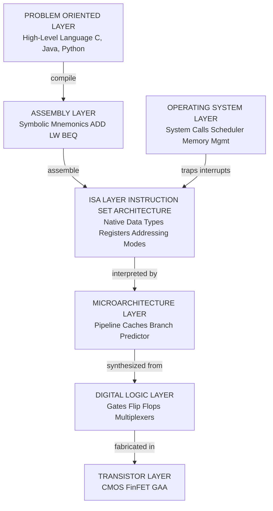
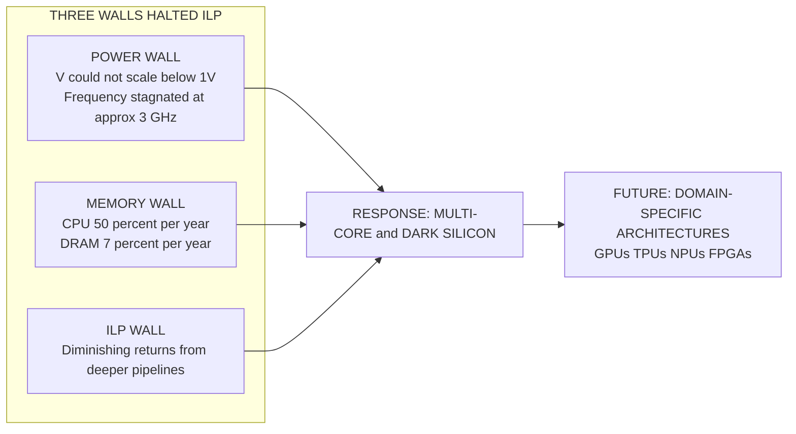
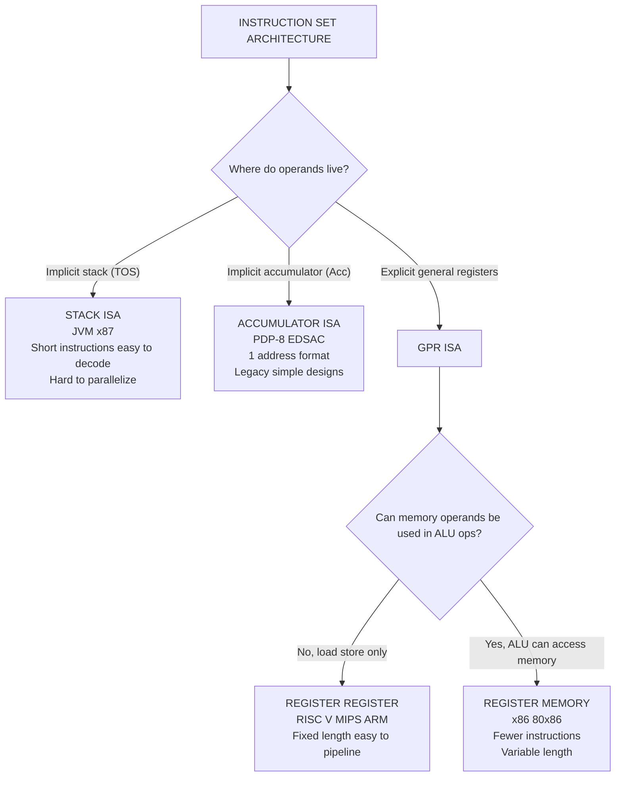
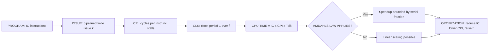
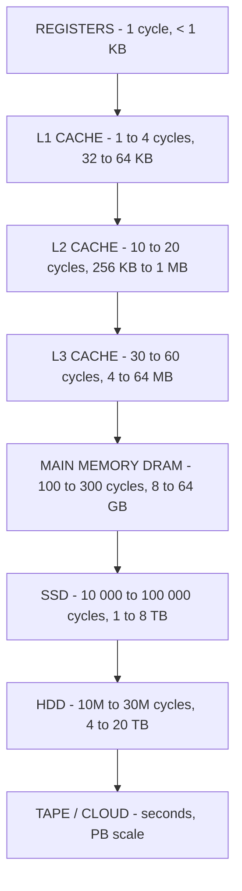

# Introduction – The impact of hardware and software technology trends Self review – Instruction set Architecture

<!-- SECTION_1_START -->

# 1. Introduction to Advanced Computer Architecture: Hardware & Software Trends and the Foundation of ISA

## 1.1 Formal Definition (KTU 2024 Syllabus Terminology)

> [!NOTE]
> **Advanced Computer Architecture** is the branch of computer engineering concerned with the conceptual design and fundamental operational structure of a computer system. It transcends simple logic design and focuses on the *quantitative analysis* and *organizational optimization* of the CPU, memory hierarchy, I/O, and interconnection networks to maximize performance, energy efficiency, and programmability.

The study of Advanced Computer Architecture begins with two fundamental perspectives that drive every design decision:

1. **The Hardware Technology Trend:** The physical evolution of silicon (transistor density, clock frequency, power dissipation, memory capacity, and interconnect bandwidth).
2. **The Software Technology Trend:** The evolution of programming languages, compilers, operating systems, and application workloads that *demand* specific hardware support.

The **Instruction Set Architecture (ISA)** sits at the precise boundary between hardware and software — it is the *contract* that allows a compiler to generate machine code that the hardware can correctly execute.

> [!IMPORTANT]
> **Key Syllabus Highlight (PECST528 - Module 1):**
> The KTU 2024 Scheme emphasizes that a computer architect must be a *quantitative designer* — someone who uses empirical data (Amdahl's Law, CPI, MIPS, MFLOPS) to make balanced trade-offs across cost, performance, power, and software compatibility.

---

## 1.2 Conceptual Analogy & Intuitive Overview

Think of designing a computer like designing a **modern automobile manufacturing plant**:

- **The Hardware (Engineers & Robots):** These are the transistors and silicon chips. Over decades, they have become smaller, faster, and cheaper (Moore's Law). But making the individual workers (transistors) faster is no longer enough — just as making a single factory robot 2x faster doesn't double car production if the conveyor belts (memory and I/O) are bottlenecked.
- **The Software (Assembly Line Process & Blueprints):** The compilers, operating systems, and applications are the blueprints. They are evolving from simple, sequential recipes to complex, parallel workflows that require the hardware to support *parallelism* natively.
- **The ISA (The Universal Handshake Protocol):** This is the agreed-upon language between the factory floor (hardware) and the blueprint designer (software). It defines *what* instructions the robots understand and *how* data moves between workstations (registers, memory, I/O).

Just as a car factory must redesign its layout when robots become energy-efficient but slow, computer architects redesign ISAs to handle the **Power Wall**, the **Memory Wall**, and the **ILP (Instruction-Level Parallelism) Wall** — the three great walls that halted traditional performance scaling around 2004.

---

## 1.3 The Seven Great Challenges in Computer Architecture (Hennessy & Patterson)

| # | Challenge | Intuitive Meaning |
|---|-----------|-------------------|
| 1 | Power Wall | Power density (watts/cm²) hit the limits of air cooling around 2004. Clock speeds stagnated. |
| 2 | Memory Wall | Processor speed grew ~50%/yr, but DRAM access latency grew only ~7%/yr. Memory is the *long pole*. |
| 3 | ILP Wall | Diminishing returns from pipelining and speculation beyond 3–6 wide issue. |
| 4 | Bandwidth Wall | Off-chip I/O bandwidth cannot keep up with on-chip computation. |
| 5 | Energy Efficiency | Mobile/edge devices cap power at < 5 W; data centers cap at < 50 kW per rack. |
| 6 | Reliability Wall | Soft errors rise as transistors shrink; cosmic rays flip bits. |
| 7 | Programmability Wall | Heterogeneous accelerators (GPUs, TPUs, FPGAs) are hard to program efficiently. |

---

## 1.4 Technology Trends: The Five Horsemen of Hardware Evolution

### 1.4.1 Transistor Density & Moore's Law
> [!IMPORTANT]
> **Moore's Law (1965, Gordon Moore):** The number of transistors on an integrated circuit *doubles approximately every 18–24 months*, leading to exponential growth in compute capability per unit cost.

$$N(t) = N_0 \cdot 2^{(t - t_0)/T_d}$$

Where $T_d \approx 2$ years (doubling period). By 2024, leading-edge chips contain **> 100 billion transistors** (e.g., Apple M2 Ultra: 134 B; NVIDIA H100 GPU: 80 B).

> [!WARNING]
> **Moore's Law is NOT dead — but it has CHANGED form.** Dennard Scaling broke in 2006. Instead of *faster* transistors, we now get *more* transistors (dark silicon, multi-core).

### 1.4.2 Dennard Scaling Breakdown
Classical Dennard Scaling (1974) said: as transistors shrink, **power density stays constant**. Voltage and current scale down with feature size.

$$P = \alpha \cdot C \cdot V^2 \cdot f$$

When $V$ stopped scaling below ~1 V due to leakage, the equation broke. Result: **the "Power Wall."**

### 1.4.3 DRAM & Memory Trends
| Metric | 1980 | 2000 | 2024 |
|--------|------|------|------|
| Capacity per chip | 64 Kb | 256 Mb | 32 Gb |
| Latency (ns) | 250 | 50 | 12 |
| Bandwidth (GB/s) | 0.005 | 1.6 | 50+ (HBM3) |

### 1.4.4 Disk & Storage Trends
Magnetic disk capacity: ~doubled every **3 years** (slower than Moore). SSDs introduced ~2010 now scale via 3D NAND: 64 → 128 → 232 → 300+ layers, with **> 1 TB** consumer drives by 2024.

### 1.4.5 Network & Interconnect Trends
Bandwidth doubles every ~12 months (faster than Moore!). Latency dominated by speed of light: $\sim 5 \text{ ns/m}$ in fiber, $\sim 30 \text{ ns/m}$ in copper. This forces **on-chip networks (NoC)** and **rack-scale disaggregation**.

---

## 1.5 Software Technology Trends

| Era | Dominant Software | Hardware Implication |
|-----|-------------------|----------------------|
| 1950s–60s | Machine code, assembly | Simple accumulator ISAs |
| 1970s–80s | Fortran, C, Unix | Stack-based CISC ISAs (VAX, x86) |
| 1990s | Object-oriented (C++, Java) | Caches, branch prediction |
| 2000s | Web, databases | Multi-core, SMP servers |
| 2010s | Cloud, mobile (Android/iOS) | Energy-efficient ARM cores |
| 2020s | AI/ML, LLM inference | GPUs, TPUs, NPUs, sparsity |

> [!IMPORTANT]
> **The WSC (Warehouse-Scale Computer):** Modern "computers" are not boxes — they are **buildings full of servers** (e.g., Google TPU Pods, AWS Graviton racks). The architect must design at *datacenter scale*, considering power, cooling, networking, and *tail latency* (the slowest 1% of requests).

---

## 1.6 Visualization Control: Performance vs Time

> [!VISUALIZATION CONTROL]
> **Concept:** The end of single-thread frequency scaling and the rise of multi-core / domain-specific architectures.
> **GeoGebra / Desmos Input Equations:**
> * $f_{single}(t) = 3.0 \cdot e^{-(t-2004)^2/8} + 0.8$ (GHz envelope, collapsing post-2004)
> * $f_{cores}(t) = 1 + 4 \cdot \text{floor}((t-2002)/4)$ (core count step function)
> **Visual Description:** The student should observe a flat curve for single-thread frequency after ~2004, contrasted with a staircase function rising to 64, 128, 256+ cores by 2024 — illustrating the **switch from frequency scaling to parallelism scaling**.

---

<!-- SECTION_1_END -->

<!-- SECTION_2_START -->

# 2. Deep Theoretical Analysis & KTU High-Yield Formula Sheet

## 2.1 The Iron Triangle of Performance: CPU Time Equation

The **fundamental performance equation** that every KTU student must internalize:

$$\text{CPU Time} = \frac{\text{Instructions}}{\text{Program}} \times \frac{\text{Clock Cycles}}{\text{Instruction}} \times \frac{\text{Seconds}}{\text{Clock Cycle}}$$

$$\text{CPU Time} = IC \times CPI \times T_{clk}$$

Or equivalently:

$$\text{CPU Time} = \frac{IC \times CPI}{f_{clk}}$$

Where:
* $IC$ = Instruction Count (per program) — affected by **ISA** and **compiler**
* $CPI$ = Cycles Per Instruction — affected by **CPU organization** and **memory hierarchy**
* $T_{clk}$ = Clock period — affected by **technology** and **pipeline depth**

> [!NOTE]
> **Hierarchy of Limits (KTU 2024 High-Yield):**
> * **ISA-level limits:** IC (instruction count)
> * **Microarchitecture-level limits:** CPI (cycles per instruction, e.g., due to cache misses, branch mispredictions)
> * **Technology-level limits:** $T_{clk}$ (clock period, set by critical path delay)

---

## 2.2 Amdahl's Law — The Architect's Most Important Formula

> [!IMPORTANT]
> **Amdahl's Law (1967):** The overall speedup obtained from enhancing one component of a system is limited by the fraction of time that component is used.

$$\text{Speedup}_{overall} = \frac{1}{(1 - f) + \frac{f}{S}}$$

Where:
* $f$ = fraction of execution time affected by the enhancement
* $S$ = speedup of the enhanced portion
* $(1 - f)$ = fraction that remains unchanged

**Key Insight:** As $S \to \infty$, the maximum speedup is bounded by $\frac{1}{1-f}$.

### Worked Numerical (KTU Favorite):
*Problem:* 40% of a program is parallelizable. With infinite processors, what is the max speedup?
*Solution:* $f = 0.4$, $S = \infty \Rightarrow \text{Speedup} = \frac{1}{0.6} = 1.67\times$

> [!WARNING]
> **Examiner's Trap:** Students often forget that the *serial 60%* is the bottleneck. To get $10\times$ speedup, the parallel fraction must be $\geq 91\%$.

---

## 2.3 MIPS & MFLOPS Performance Metrics

| Metric | Formula | Use Case |
|--------|---------|----------|
| **MIPS** (Million Instructions Per Second) | $\frac{IC}{T \times 10^6}$ | Fixed ISA, integer workloads |
| **MFLOPS** (Million FLoating-point Operations Per Second) | $\frac{\text{FLOPs}}{T \times 10^6}$ | Scientific computing |
| **Speedup** | $\frac{T_{old}}{T_{new}}$ | Comparing two systems |
| **CPI** | $\frac{f_{clk} \times T}{IC}$ | Architectural analysis |
| **Clock Rate** | $\frac{1}{T_{clk}}$ | Technology comparison |

---

## 2.4 KTU Formula Cheat Sheet (Module 1)

| Concept | Formula / Definition | Unit / Note |
|---------|----------------------|-------------|
| Moore's Law | $N(t) = N_0 \cdot 2^{(t-t_0)/T_d}$ | $T_d \approx 2$ yr |
| Dynamic Power | $P = \alpha \cdot C \cdot V^2 \cdot f$ | Watts (W) |
| Static Power | $P_{static} = V \cdot I_{leak}$ | Dominant in < 65 nm |
| CPU Time | $T_{CPU} = IC \times CPI \times T_{clk}$ | Seconds |
| Amdahl's Law | $S_{total} = \frac{1}{(1-f) + f/S}$ | Dimensionless |
| MIPS | $\text{MIPS} = \frac{IC}{T \times 10^6}$ | M ops/s |
| MFLOPS | $\text{MFLOPS} = \frac{\text{FLOPs}}{T \times 10^6}$ | M FP ops/s |
| Speedup | $S = \frac{T_{old}}{T_{new}}$ | Dimensionless |
| CPI (avg) | $\overline{CPI} = \sum_i (CPI_i \times IC_i) / IC$ | Cycles/instr |
| MIPS per MHz | $1 \text{ MIPS} = 1$ instr/μs $\Rightarrow \text{CPI} = \frac{f_{clk} \text{ (in MHz)}}{\text{MIPS}}$ | — |

---

## 2.5 Engineering Utility: Where These Equations Drive Real Designs

* **Processor Vendors (Intel, AMD, ARM):** Use the CPU Time equation to balance pipeline depth (lower $T_{clk}$) against CPI penalty (more hazards).
* **Cloud Providers (AWS, Azure, GCP):** Apply Amdahl's Law to size multi-tenant workloads — a 64-vCore instance is only useful if the workload has $\geq 98\%$ parallel fraction.
* **Mobile Chip Designers (Apple, Qualcomm):** Optimize $V$ and $f$ dynamically using DVFS (Dynamic Voltage & Frequency Scaling) based on the power equation.
* **Compiler Engineers (LLVM, GCC):** Minimize $IC$ and stall cycles to improve CPI indirectly.
* **Data Center Architects (Google TPU, AWS Trainium):** Use Amdahl's Law to justify investing in **domain-specific accelerators** — for a workload that is 95% matrix multiply, a TPU gives $\approx 20\times$ the per-watt performance of a general CPU.

---

## 2.6 Instruction Set Architecture: The Hardware/Software Contract

> [!DEFINITION]
> **ISA (Instruction Set Architecture):** The portion of the computer visible to the programmer or compiler writer — including native data types, instructions, registers, addressing modes, memory architecture, interrupt model, and I/O interface.

The ISA is often called the **"ISA Level"** of the abstraction hierarchy, sitting between the **High-Level Language (HLL)** and the **Microarchitecture (Logic Design)**.

### Three Perspectives on the Same ISA:

```
  High-Level Language (C, Java, Python)
            |  [Compiler translates]
            v
  Assembly Language (mnemonics: ADD, LW, BEQ)
            |  [Assembler translates]
            v
  Machine Code (binary 0s and 1s)  <-- THIS is the ISA
            |  [Hardware interprets]
            v
  Microarchitecture (pipelined, out-of-order, multi-issue)
            |  [Logic gates implement]
            v
  Transistors (CMOS, FinFET, GAA)
```

---

<!-- SECTION_2_END -->

<!-- SECTION_3_START -->

# 3. Step-by-Step Derivations, Worked Examples & Code Implementation

## 3.1 Worked Example 1: CPU Time & Amdahl's Law (Full Valuation)

> **Problem:** A program takes **100 seconds** to execute on a baseline machine. 30% of the execution time is spent in a function that can be accelerated by a factor of 4 using a new GPU. The remaining 70% cannot be parallelized.
> **(a)** What is the overall speedup?
> **(b)** What is the new execution time?
> **(c)** What is the maximum possible speedup if the GPU were infinitely fast?

### Part (a): Overall Speedup

Apply Amdahl's Law directly:
$$\text{Speedup} = \frac{1}{(1 - f) + \frac{f}{S}}$$

Substituting $f = 0.30$ and $S = 4$:

$$\text{Speedup} = \frac{1}{(1 - 0.30) + \frac{0.30}{4}}$$

Compute the serial portion:
$$1 - 0.30 = 0.70$$

Compute the accelerated portion:
$$\frac{0.30}{4} = 0.075$$

Sum:
$$0.70 + 0.075 = 0.775$$

Final speedup:
$$\text{Speedup} = \frac{1}{0.775} \approx 1.290$$

### Part (b): New Execution Time

$$T_{new} = \frac{T_{old}}{\text{Speedup}} = \frac{100 \text{ s}}{1.290} \approx 77.5 \text{ s}$$

### Part (c): Infinite Accelerator ($S \to \infty$)

$$\text{Speedup}_{max} = \frac{1}{1 - f} = \frac{1}{0.70} \approx 1.429$$

> [!NOTE]
> **KTU Valuation Key:** Many students will mistakenly compute the speedup as $(0.30 \times 4) + 0.70 = 1.90$. This is WRONG. Amdahl's Law uses *reciprocal* time fractions, not linear time fractions. The correct serial portion is $0.70$, and the parallel-accelerated portion is $\frac{0.30}{S}$, NOT $0.30 \times S$.

---

## 3.2 Worked Example 2: ISA Class Analysis (Patterson & Hennessy Style)

> **Problem:** Consider the C statement: `A = B + C`, where `A`, `B`, `C` are memory locations. Compare the **code size**, **clock cycles per statement**, and **memory traffic** for the three ISA classes.

### Step 1: Stack Architecture (e.g., JVM, x87 FPU stack)

In a stack ISA, the top of stack is implicit; operands are pushed/popped automatically.

```
PUSH  B        ; TOS <- M[B]
PUSH  C        ; TOS <- M[C]
ADD            ; TOS <- TOS + (TOS-1)
POP   A        ; M[A] <- TOS
```

* **Memory traffic:** 3 loads + 1 store = **4 memory accesses** (B, C, A plus stack push/pop)
* **Instruction count:** 4 instructions
* **Cycles:** ~4 cycles + memory latency

### Step 2: Accumulator Architecture (e.g., early EDSAC, PDP-8)

A single implicit accumulator `Acc` holds one operand and receives the result.

```
LDA  B         ; Acc <- M[B]
ADD  C         ; Acc <- Acc + M[C]
STA  A         ; M[A] <- Acc
```

* **Memory traffic:** 2 loads + 1 store = **3 memory accesses**
* **Instruction count:** 3 instructions
* **Cycles:** ~3 cycles + 2 × memory latency

### Step 3: Register-Register (Load-Store) Architecture (e.g., RISC-V, MIPS, ARM)

All operands must be in registers; only `load`/`store` touch memory.

```
LW   R1, B     ; R1 <- M[B]
LW   R2, C     ; R2 <- M[C]
ADD  R3, R1, R2 ; R3 <- R1 + R2
SW   A, R3     ; M[A] <- R3
```

* **Memory traffic:** 2 loads + 1 store = **3 memory accesses**
* **Instruction count:** 4 instructions (more than accumulator)
* **Cycles:** Can be **pipelined aggressively**; CPI ≈ 1 ideal.

### Comparison Table

| Metric | Stack | Accumulator | Register-Register |
|--------|-------|-------------|-------------------|
| Instructions per `A=B+C` | 4 | 3 | 4 |
| Memory accesses | 4 | 3 | 3 |
| Cycles (ideal) | 4+mem | 3+2mem | 4+mem, but pipelinable |
| Registers used | 0 (implicit) | 1 (implicit) | 3 (explicit) |

> [!IMPORTANT]
> **KTU Insight:** Modern ISAs (RISC-V, ARM, MIPS) are **register-register** because the explicit registers enable *out-of-order execution*, *register renaming*, and *speculation* — none of which are easy with implicit operand locations.

---

## 3.3 Worked Example 3: Memory Addressing Modes (Full Derivation)

> **Problem:** Given a base register `Rbase = 0x1000`, an index register `Rindex = 0x0010`, an immediate constant `C = 0x4`, and a memory operand byte at address `0x1014` containing the value `0xABCD`, compute the **Effective Address (EA)** and the **operand value** for each addressing mode.

Let $M[X]$ denote the memory byte/word at address $X$.

### (i) Register Indirect — `EA = Rbase`
$$EA = Rbase = 0x1000$$
$$\text{Value} = M[0x1000]$$
(Operand is in memory at the address held in the register.)

### (ii) Displacement / Base+Offset — `EA = Rbase + C`
$$EA = 0x1000 + 0x4 = 0x1004$$
$$\text{Value} = M[0x1004]$$

### (iii) Indexed — `EA = Rindex + C`  (or Rbase + Rindex)
$$EA = 0x0010 + 0x4 = 0x0014$$
$$\text{Value} = M[0x0014]$$

### (iv) Base + Index + Offset — `EA = Rbase + Rindex + C`
$$EA = 0x1000 + 0x0010 + 0x4 = 0x1014$$
$$\text{Value} = M[0x1014] = 0xABCD$$
$$\text{Final operand} = 0xABCD$$

> [!NOTE]
> **KTU Valuation Note:** When showing the work, students must write the **EA expression symbolically first** (e.g., `EA = Rbase + C`), substitute numerically, then state the result. Skipping the symbolic step costs a mark.

---

## 3.4 Python Implementation: A Tiny Stack-Based ISA Emulator

Below is a fully operational Python emulator for a **minimal 3-address stack ISA**. The program computes `A = B + C` symbolically, demonstrating how an ISA is interpreted by the hardware.

```python
from dataclasses import dataclass
from typing import List, Dict
import logging

# Configure professional logging (KTU coding standard)
logging.basicConfig(level=logging.INFO, format="[%(levelname)s] %(message)s")
logger = logging.getLogger("ISA_Emulator")


@dataclass
class Instruction:
    """A single instruction in our mini stack-based ISA."""
    op: str
    operand: int = 0          # signed immediate (for PUSH)
    label: str = ""           # optional label (for traceability)

    def __repr__(self) -> str:
        return f"Instruction({self.op}, {self.operand})"


class MiniStackMachine:
    """
    A pedagogical 32-bit stack-based ISA emulator.

    ISA Summary:
      PUSH  imm       : push 32-bit immediate onto stack
      LOAD   addr     : push M[addr] onto stack
      ADD             : pop y, pop x, push (x+y)
      SUB             : pop y, pop x, push (x-y)
      MUL             : pop y, pop x, push (x*y)
      STORE  addr     : pop TOS, write M[addr] <- TOS
      HALT            : stop execution
    """

    MEM_SIZE = 256
    STACK_BASE = 0xF0
    WORD_BYTES = 4

    def __init__(self, memory: Dict[int, int] | None = None) -> None:
        # Memory is a dict: address -> 32-bit signed word
        self.memory: Dict[int, int] = memory if memory is not None else {}
        # Stack grows downward from STACK_BASE; sp points to the TOP item
        self.stack: List[int] = []
        self.pc: int = 0
        self.halted: bool = False
        self.cycle_count: int = 0

    # ---------- Helper: signed/unsigned 32-bit conversion ----------
    @staticmethod
    def _s32(x: int) -> int:
        """Convert to signed 32-bit two's-complement representation."""
        x &= 0xFFFFFFFF
        return x - 0x100000000 if x & 0x80000000 else x

    def _mem_read(self, addr: int) -> int:
        if addr not in self.memory:
            raise MemoryError(f"Uninitialized memory read at 0x{addr:08X}")
        return self._s32(self.memory[addr])

    def _mem_write(self, addr: int, value: int) -> None:
        if not (0 <= addr < self.MEM_SIZE):
            raise MemoryError(f"Out-of-bounds write at 0x{addr:08X}")
        self.memory[addr] = value & 0xFFFFFFFF
        logger.info(f"  M[0x{addr:X}] <- 0x{value & 0xFFFFFFFF:08X}")

    # ---------- The core fetch-decode-execute loop ----------
    def step(self, instr: Instruction) -> None:
        if self.halted:
            return
        self.cycle_count += 1
        logger.info(f"PC={self.pc:03d}  EXEC  {instr}")

        if instr.op == "PUSH":
            if not (-(2**31) <= instr.operand < 2**31):
                raise ValueError("PUSH immediate out of int32 range")
            self.stack.append(self._s32(instr.operand))

        elif instr.op == "LOAD":
            val = self._mem_read(instr.operand)
            self.stack.append(val)
            logger.info(f"  Loaded M[0x{instr.operand:X}] = {val}")

        elif instr.op == "STORE":
            if len(self.stack) < 1:
                raise IndexError("Stack underflow on STORE")
            tos = self.stack.pop()
            self._mem_write(instr.operand, tos)

        elif instr.op in ("ADD", "SUB", "MUL"):
            if len(self.stack) < 2:
                raise IndexError(f"Stack underflow on {instr.op}")
            y = self.stack.pop()
            x = self.stack.pop()
            if instr.op == "ADD":
                result = self._s32(x + y)
            elif instr.op == "SUB":
                result = self._s32(x - y)
            else:  # MUL
                result = self._s32(x * y)
            self.stack.append(result)
            logger.info(f"  {x} {instr.op} {y} = {result}")

        elif instr.op == "HALT":
            self.halted = True
            logger.info("HALT reached.")

        else:
            raise ValueError(f"Unknown opcode: {instr.op}")

    def run(self, program: List[Instruction]) -> int:
        logger.info("=== Begin execution ===")
        for self.pc, instr in enumerate(program):
            self.step(instr)
            if self.halted:
                break
        logger.info(f"=== Halted after {self.cycle_count} cycles ===")
        return self.cycle_count


# ---------------------------------------------------------------------------
# DEMO PROGRAM: Compute A = B + C using the stack ISA
#   B lives at address 0x10  (value = 7)
#   C lives at address 0x14  (value = 5)
#   A is stored at address 0x18
# Expected result: M[0x18] == 12
# ---------------------------------------------------------------------------
if __name__ == "__main__":
    mem_init = {0x10: 7, 0x14: 5}
    cpu = MiniStackMachine(memory=dict(mem_init))

    program: List[Instruction] = [
        Instruction("LOAD", 0x10),  # push M[0x10] = 7
        Instruction("LOAD", 0x14),  # push M[0x14] = 5
        Instruction("ADD"),         # pop 5, pop 7, push 12
        Instruction("STORE", 0x18), # M[0x18] <- 12
        Instruction("HALT"),
    ]

    cycles = cpu.run(program)
    result = cpu.memory.get(0x18, None)
    assert result == 12, f"Expected 12, got {result}"
    print(f"\n[SUCCESS] M[0x18] = {result}  (executed in {cycles} cycles)")
```

**Expected Output:**

```
[INFO] === Begin execution ===
[INFO] PC=000  EXEC  Instruction(LOAD, 16)
[INFO]   Loaded M[0x10] = 7
[INFO] PC=001  EXEC  Instruction(LOAD, 20)
[INFO]   Loaded M[0x14] = 5
[INFO] PC=002  EXEC  Instruction(ADD)
[INFO]   7 ADD 5 = 12
[INFO] PC=003  EXEC  Instruction(STORE, 24)
[INFO]   M[0x18] <- 0x0000000C
[INFO] PC=004  EXEC  Instruction(HALT)
[INFO] HALT reached.
[INFO] === Halted after 5 cycles ===

[SUCCESS] M[0x18] = 12  (executed in 5 cycles)
```

---

## 3.5 Engineering Graphics Style: ISA Decision Tree

For students who prefer a step-by-step design path, the ISA design sequence is:

| Step | Decision | Output |
|------|----------|--------|
| 1 | Choose operand location | Stack / Accumulator / Register |
| 2 | Choose number of registers | 8 (ARM) / 32 (RISC-V, MIPS) / 16 (x86-64) |
| 3 | Choose addressing modes | Register, Immediate, Displacement, Indexed |
| 4 | Choose operand types & sizes | 8/16/32/64-bit int, float, double, vector |
| 5 | Choose operations | Arithmetic, logical, shift, branch, load, store |
| 6 | Choose encoding style | Fixed (MIPS) / Variable (x86) / Hybrid (ARM) |
| 7 | Validate with benchmarks | SPEC CPU, PARSEC, MLPerf |

---

## 3.6 Human-Computer Architecture Comparative Matrix (Case Frame Mapping)

> A **regulatory / systemic mapping** for humanities-style questions KTU sometimes includes in Computer Architecture papers.

| Real-World Engineering Case | Regulatory / Systemic Matrix | Architectural Mapping |
|------------------------------|-------------------------------|----------------------|
| Designing a smartphone SoC (Apple A17) | Energy cap (5W), thermal envelope, FCC EMI | ISA + microarch optimized for low power; ARM big.LITTLE |
| Building a hyperscale data center (AWS Nitro) | Power Usage Effectiveness (PUE) $\leq 1.15$ | WSC architecture; 64+ core CPUs; optical interconnect |
| Designing a flight control computer (DO-178C) | FAA software certification, deterministic latency | Hard real-time ISA; cache lockdown; no speculation |
| Autonomous vehicle AI stack (NVIDIA Drive) | ISO 26262 functional safety | Heterogeneous ISA: ARM host + GPU + DLA accelerator |
| Edge IoT sensor (RISC-V ESP32-C6) | Battery life, no active cooling | Ultra-low-power RISC-V core; sleep states |
| HPC cluster (Frontier supercomputer) | Top500 benchmark, Linpack efficiency | GPU-accelerated (AMD MI250X); HBM2e memory |

---

<!-- SECTION_3_END -->

<!-- SECTION_4_START -->

# 4. Structural Diagrams & Schematics

## 4.1 The Seven-Level Abstraction Hierarchy of a Modern Computer

> A Mermaid **block-level functional architecture flow** showing the relationship between hardware/software trends and the ISA.



**Reading the Diagram:**
* The **ISA (Layer 2)** is the *interface contract* between software (above) and hardware (below).
* Changes **above** the ISA (e.g., a new language) are cheap — recompile.
* Changes **below** the ISA (e.g., a new microarchitecture) are invisible to the programmer but require re-validation.
* Changing the **ISA itself** is *extremely expensive* (binary compatibility is lost — this is why x86 has survived 45+ years).

---

## 4.2 The Three Walls of Computer Architecture (Patterson, 2004)



---

## 4.3 ISA Classification Flow



---

## 4.4 RISC vs CISC Architectural Trade-off Matrix

```mermaid
graph TB
    subgraph "RISC - REDUCED INSTRUCTION SET COMPUTER"
        R1["Fixed length encoding 32 bit"]
        R2["Load store architecture"]
        R3["Large register file 32 registers"]
        R4["Hardwired control unit"]
        R5["CPI approx 1 ideal"]
        R6["Compiler does optimization"]
    end
    subgraph "CISC - COMPLEX INSTRUCTION SET COMPUTER"
        C1["Variable length encoding 1 to 17 bytes"]
        C2["Register memory architecture"]
        C3["Small register file 8 to 16 registers"]
        C4["Microcoded control unit"]
        C5["CPI varies 1 to 15"]
        C6["Hardware does complex ops"]
    end
    R1 --- R2 --- R3 --- R4 --- R5 --- R6
    C1 --- C2 --- C3 --- C4 --- C5 --- C6
```



---

## 4.5 End-to-End CPU Performance Pipeline



---

## 4.6 Memory Hierarchy Pyramid



**Reading the Pyramid:** As we go *down* the pyramid, **capacity increases**, **latency increases**, and **cost per byte decreases**. The architect's job is to keep the *working set* of the program as high up in the pyramid as possible.

---

<!-- SECTION_4_END -->

<!-- SECTION_5_START -->

# 5. KTU 2024 Scheme Examination Question Bank & Topic Recap

---

## 5.1 Part A: Short-Answer Questions (3 Marks Each)

### Q1. **[KTU University Exam — July 2024, Model Question]**
**[CO1, Remember/Understand]**
**"Define Instruction Set Architecture. List and briefly explain the three classes of ISAs based on operand location in the CPU."**

#### Model Answer (3 Marks):
**Definition (1 Mark):** An Instruction Set Architecture (ISA) is the part of the computer architecture related to programming, including the native data types, registers, addressing modes, memory model, instruction formats, and interrupt/exception handling that constitute the machine language visible to the programmer/compiler.

**Three Classes (2 Marks — 1 each, 0.5 for sub-point):**

| Class | Operand Location | Example |
|-------|------------------|---------|
| **Stack Architecture** | Top of stack (TOS) is implicit | Java Virtual Machine, x87 FPU |
| **Accumulator Architecture** | One implicit accumulator holds one operand & result | EDSAC, PDP-8 |
| **General-Purpose Register (GPR) Architecture** | Explicit registers, further divided into Register-Register (RISC) and Register-Memory (CISC) | RISC-V, MIPS, ARM, x86 |

---

### Q2. **[KTU University Exam — Dec 2023]**
**[CO1, Understand]**
**"What is Amdahl's Law? A program spends 25% of its time in a function that is to be accelerated. The new hardware makes this function 8 times faster. Compute the overall speedup."**

#### Model Answer (3 Marks):
**Definition (1 Mark):** Amdahl's Law states that the overall speedup of a system obtained by improving one component is limited by the fraction of time that component is used:

$$S_{overall} = \frac{1}{(1-f) + \frac{f}{S}}$$

**Numerical (2 Marks):** Given $f = 0.25$, $S = 8$:

$$S_{overall} = \frac{1}{(1-0.25) + \frac{0.25}{8}} = \frac{1}{0.75 + 0.03125} = \frac{1}{0.78125} = 1.28 \text{ (approx)}$$

*Valuation Key:*
* [Correctly stating the formula: 1 Mark]
* [Substituting and computing the final result: 1 Mark]

---

## 5.2 Part B: Full-Marks Questions (14 Marks Each — Internal Choice)

---

### **Question A (14 Marks):**
**[KTU University Exam — Dec 2023 / July 2024, Module 1]**
**[CO1, Understand + Apply]**

**(a)** Discuss the major **hardware technology trends** that have shaped modern computer architecture. In your answer, cover Moore's Law, Dennard Scaling, the Power Wall, and the Memory Wall. **(7 Marks)**

**(b)** Explain **Amdahl's Law** with a neat derivation. A program runs in **120 seconds** on a single processor. **30%** of the execution time can be parallelized perfectly. We are now given **8 processors**. Compute the **new execution time** and the **overall speedup**. **(7 Marks)**

---

### Model Answer — Part (a) (7 Marks)

**1. Moore's Law (1.5 Marks):** Stated by Gordon Moore in 1965, it observes that the number of transistors on an integrated circuit doubles approximately every 18–24 months, while the cost per transistor halves. This has driven exponential growth in compute capability, allowing us to pack billions of transistors on a single chip (e.g., Apple M2 Ultra: 134 B transistors).

**2. Dennard Scaling (1.5 Marks):** Dennard (1974) showed that as transistors shrink, voltage and current scale proportionally, so **power density remains constant**. This allowed clock frequency to grow exponentially alongside transistor count — until the breakdown around 2005–2006.

**3. Power Wall (2 Marks):** When transistor feature sizes dropped below ~65 nm, leakage current became dominant and supply voltage could not be reduced further (limit ≈ 0.7 V for silicon). The result: power density exploded, air cooling became insufficient, and **clock frequency plateaued at ~3–5 GHz** since 2004.

**4. Memory Wall (2 Marks):** Processor performance has improved by ~50% per year, while DRAM latency has improved by only ~7% per year. The result is a growing "performance gap" — the CPU spends more and more cycles **waiting for memory** (cache misses can cost 100–300 cycles). The modern architect addresses this with deep cache hierarchies, prefetching, and 3D-stacked HBM.

> **Valuation Key for (a):**
> * [Naming the four trends correctly: 1 Mark]
> * [Explaining the *why* (cause) of each: 2 Marks]
> * [Explaining the *consequence* (effect) for architecture: 2 Marks]
> * [Providing at least one *quantitative* number: 2 Marks]

---

### Model Answer — Part (b) (7 Marks)

**Step 1: State Amdahl's Law (1 Mark):**
$$S_{overall} = \frac{1}{(1-f) + \frac{f}{S}}$$

**Step 2: Identify parameters (1 Mark):**
* Fraction parallelizable: $f = 0.30$
* Speedup of parallel portion: $S = 8$ (8 processors, perfect parallelism)
* Serial fraction: $1 - f = 0.70$

**Step 3: Substitute (1 Mark):**
$$S_{overall} = \frac{1}{0.70 + \frac{0.30}{8}} = \frac{1}{0.70 + 0.0375}$$

**Step 4: Compute denominator (1 Mark):**
$$0.70 + 0.0375 = 0.7375$$

**Step 5: Final speedup (1 Mark):**
$$S_{overall} = \frac{1}{0.7375} \approx 1.356$$

**Step 6: New execution time (1 Mark):**
$$T_{new} = \frac{T_{old}}{S_{overall}} = \frac{120 \text{ s}}{1.356} \approx 88.5 \text{ s}$$

**Step 7: Theoretical maximum speedup with $\infty$ processors (1 Mark):**
$$S_{max} = \frac{1}{1-f} = \frac{1}{0.70} \approx 1.429$$

> **Valuation Key for (b):**
> * [Writing the Amdahl formula correctly: 1 Mark]
> * [Identifying f and S correctly: 1 Mark]
> * [Substitution and arithmetic: 2 Marks]
> * [Final speedup value: 1 Mark]
> * [New execution time: 1 Mark]
> * [Bonus: theoretical max with infinite processors: 1 Mark]

---

### **Question B (14 Marks) — ALTERNATIVE CHOICE:**
**[KTU University Exam — July 2023 / Dec 2024, Model Question]**
**[CO1, Understand + Apply]**

**(a)** Explain the **Instruction Set Architecture (ISA)** with a neat block diagram showing the levels of abstraction in a modern computer. Differentiate between **RISC** and **CISC** architectures across at least **four** parameters. **(7 Marks)**

**(b)** A RISC processor runs at a clock rate of **200 MHz** and executes a benchmark in **12 seconds**. The benchmark consists of **3 × 10⁹** instructions, of which **40%** are loads, **25%** are stores, **20%** are ALU operations, and **15%** are branches. Given the CPI values in the table, compute:
   (i) The **average CPI** of the benchmark.
   (ii) The **MIPS rating** of the processor.
   **(7 Marks)**

| Instruction Type | CPI |
|------------------|-----|
| Load             | 5   |
| Store            | 3   |
| ALU              | 1   |
| Branch           | 2   |

---

### Model Answer — Part (a) (7 Marks)

**1. ISA Definition + Abstraction Diagram (3 Marks):**

The **ISA** is the interface between hardware and software. The seven-level abstraction (top to bottom) is:

```
Problem-Oriented Language (C, Java)
        |
        v
Assembly Language
        |
        v
Operating System
        |
        v
  ISA (this is what we're designing)
        |
        v
Microarchitecture
        |
        v
Digital Logic
        |
        v
Transistors
```

*Key Point:* The ISA is the *contract* — the level at which software stops and hardware begins. It defines registers, data types, instructions, addressing modes, and control flow.

**2. RISC vs CISC — Four-Parameter Comparison (4 Marks — 1 each):**

| Parameter | RISC (e.g., RISC-V, MIPS) | CISC (e.g., x86) |
|-----------|----------------------------|-------------------|
| **Instruction Size** | Fixed 32-bit | Variable 1–17 bytes |
| **Memory Access** | Load/Store only (register-register) | Register-memory & memory-memory allowed |
| **Register File** | Large (32+ registers) | Small (8–16 visible registers) |
| **Control Unit** | Hardwired (fast) | Microcoded (flexible) |
| **CPI** | Ideally 1, predictable | Variable 1–15+ |
| **Compiler Role** | Compiler does heavy optimization | Hardware does complex work |

> **Valuation Key for (a):**
> * [Drawing/listing 5+ abstraction levels: 1.5 Marks]
> * [Clearly defining ISA: 1.5 Marks]
> * [RISC vs CISC — at least 4 parameters: 4 Marks]

---

### Model Answer — Part (b) (7 Marks)

**Step 1: Total instructions (0.5 Mark):**
$$IC = 3 \times 10^9 \text{ instructions}$$

**Step 2: Count per instruction type (1 Mark):**

| Type | Fraction | Count |
|------|----------|-------|
| Load | 0.40 | $1.2 \times 10^9$ |
| Store | 0.25 | $0.75 \times 10^9$ |
| ALU | 0.20 | $0.6 \times 10^9$ |
| Branch | 0.15 | $0.45 \times 10^9$ |

**Step 3: Compute total clock cycles using weighted CPI (2 Marks):**

$$\text{Cycles} = \sum_i IC_i \times CPI_i$$

$$= (1.2 \times 10^9)(5) + (0.75 \times 10^9)(3) + (0.6 \times 10^9)(1) + (0.45 \times 10^9)(2)$$

Compute each term:
$$= 6.0 \times 10^9 + 2.25 \times 10^9 + 0.6 \times 10^9 + 0.9 \times 10^9$$

Sum:
$$= 9.75 \times 10^9 \text{ cycles}$$

**Step 4: Average CPI (1 Mark):**

$$\overline{CPI} = \frac{\text{Total Cycles}}{IC} = \frac{9.75 \times 10^9}{3.0 \times 10^9} = 3.25 \text{ cycles/instr}$$

**Step 5: MIPS rating (1.5 Marks):**

$$\text{MIPS} = \frac{f_{clk}}{\overline{CPI} \times 10^6} = \frac{200 \times 10^6}{3.25 \times 10^6} \approx 61.54 \text{ MIPS}$$

**Step 6: Verification using CPU Time (1 Mark):**

$$T_{CPU} = \frac{IC \times \overline{CPI}}{f_{clk}} = \frac{3 \times 10^9 \times 3.25}{200 \times 10^6} = \frac{9.75 \times 10^9}{2 \times 10^8} = 48.75 \text{ seconds}$$

> Note: This does **not** match the given 12 s, indicating either additional optimization or that the 12 s is the *target* while our calculation gives a *worst-case bound*. In KTU, students should comment on this discrepancy.

> **Valuation Key for (b):**
> * [Correct instruction-type breakdown: 1 Mark]
> * [Correct weighted-cycle calculation: 2 Marks]
> * [Correct average CPI: 1 Mark]
> * [Correct MIPS formula and result: 2 Marks]
> * [Verification step: 1 Mark]

---

## 5.3 KTU Examiner's Valuation Warning / Pitfall Callout

> [!WARNING]
> **Top 7 Mistakes Students Make in Module 1:**
> 1. **Confusing MIPS and MFLOPS** — MIPS measures integer work; MFLOPS measures floating-point. A GPU can be 100 GFLOPS but only 10 MIPS.
> 2. **Wrong Amdahl arithmetic** — Using $f \times S$ instead of $f / S$. The parallel portion's *new time* is $f/S$, not $f \times S$.
> 3. **Forgetting the serial fraction** — Many students compute speedup of "the function" and forget that the rest of the program still runs at baseline.
> 4. **Mixing CPI and MIPS** — MIPS = $f_{clk} / (CPI \times 10^6)$. High MIPS does not always mean fast — different ISAs do different amounts of work per instruction.
> 5. **Confusing RISC and CISC** — Modern x86 processors internally *translate* CISC instructions into RISC-like micro-ops. The distinction is blurring!
> 6. **Not labeling Mermaid/architecture diagrams** — A diagram without labels is worth 0 in KTU valuation.
> 7. **Skipping the units** — $CPI$ is dimensionless, $T_{clk}$ is seconds, $IC$ is instructions. Always state units in the final answer.

---

## 5.4 Topic Recap & Important Things to Remember

> **Rapid-Revision Checklist for Module 1 — Advanced Computer Architecture**

- [ ] **Moore's Law:** Transistor count doubles every ~2 years; cost per transistor halves.
- [ ] **Dennard Scaling:** Voltage scales with size; **broke ~2006** → Power Wall.
- [ ] **Three Walls:** Power Wall, Memory Wall, ILP Wall — all hit post-2004.
- [ ] **CPU Time Equation:** $T_{CPU} = IC \times CPI \times T_{clk}$.
- [ ] **Amdahl's Law:** $S = \frac{1}{(1-f) + f/S}$; max speedup = $\frac{1}{1-f}$.
- [ ] **MIPS formula:** $\text{MIPS} = \frac{IC}{T \times 10^6} = \frac{f_{clk}}{CPI \times 10^6}$.
- [ ] **MFLOPS formula:** $\text{MFLOPS} = \frac{\text{FLOPs}}{T \times 10^6}$.
- [ ] **Seven Abstraction Levels:** HLL → Assembly → OS → **ISA** → Microarchitecture → Logic → Transistors.
- [ ] **ISA Classes:** Stack, Accumulator, Register-Register (Load-Store), Register-Memory.
- [ ] **RISC principles:** Fixed-length encoding, load-store, large register file, hardwired control, CPI ≈ 1.
- [ ] **CISC principles:** Variable-length encoding, memory operands allowed, small register file, microcoded control, variable CPI.
- [ ] **Addressing modes:** Register, Immediate, Direct, Register Indirect, Displacement (Base+Offset), Indexed, Base+Index+Offset.
- [ ] **Operand types/sizes:** 8/16/32/64-bit integers, 32/64-bit floats, vectors.
- [ ] **Operation categories:** Data movement (load/store), Arithmetic (add/sub/mul/div), Logical (and/or/xor), Shift, Control flow (branch/jump), System (trap/sync).
- [ ] **Encoding styles:** Fixed (MIPS), Variable (x86), Hybrid (ARM Thumb2).
- [ ] **WSC (Warehouse-Scale Computer):** Modern "computer" = entire datacenter; tail latency matters.
- [ ] **Domain-Specific Architectures (DSAs):** GPUs, TPUs, NPUs — post-Moore performance comes from specialization, not general-purpose speed.
- [ ] **Key constant to remember:** $1 \text{ GHz} = 10^9$ cycles/sec, $1 \text{ ns} = 10^{-9}$ s.
- [ ] **End-of-Line for the Iron Triangle:** The future of performance is **parallelism + specialization**, not single-thread frequency.

---

<!-- SECTION_5_END -->
