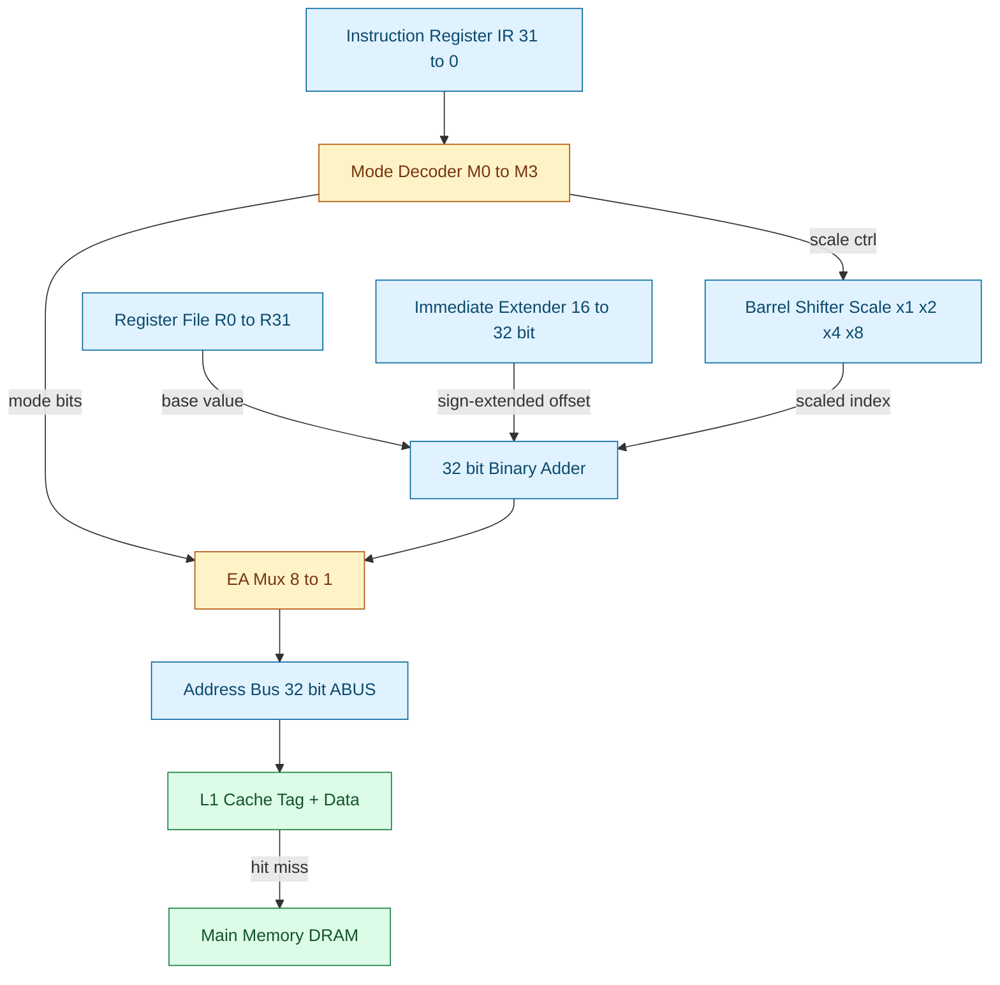
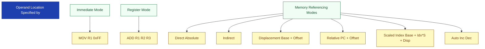
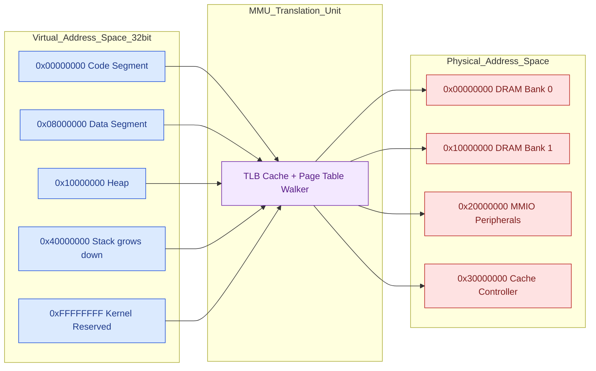
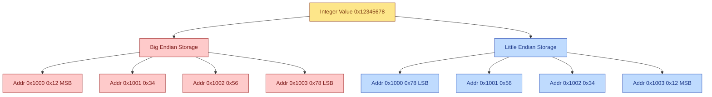
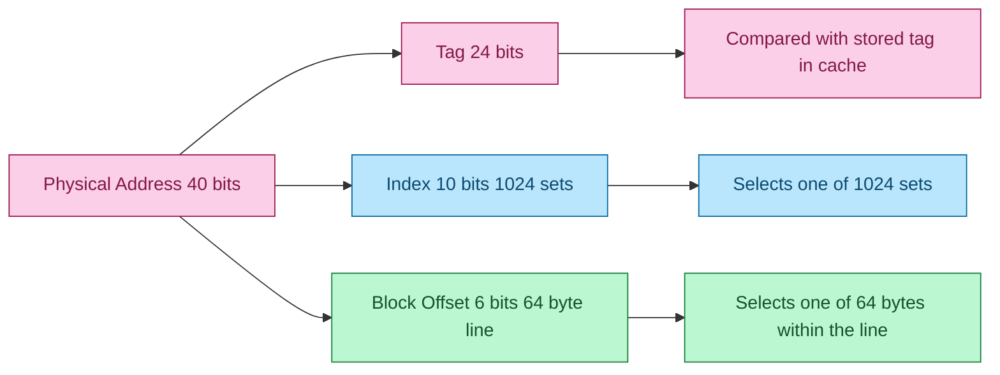

# Memory addressing

<!-- SECTION_1_START -->
# Memory Addressing — Core Technical Definition & Intuitive Overview

## 📘 Formal Academic Definition (KTU 2024 Scheme)

> **Memory Addressing** is the hardware and software mechanism by which the Central Processing Unit (CPU) specifies, computes, and accesses the physical or virtual location of data (operands or instructions) stored in the memory hierarchy. The methodology that defines *how* an effective memory address is generated from the bits encoded in an instruction is termed the **Addressing Mode**, while the policy that defines *how* multi-byte operands are mapped contiguously into the addressable memory is termed the **Byte Ordering** or **Endianness** policy.

In the context of KTU Module 1 (Hardware & Software Technology Trends), memory addressing is studied as one of the foundational pillars governing **performance scaling**, **portability of binaries**, and the **memory wall** phenomenon — the growing disparity between CPU clock speed and memory access latency.

> [!IMPORTANT]
> **KTU 2024 Syllabus Highlight (PECST528 / Module 1):** Memory addressing is examined as a *technology trend driver* — it directly influences cache line sizes, virtual-to-physical address translation (TLB), and the evolution from 32-bit to 64-bit address spaces.

---

## 🧠 Conceptual Analogy — The "Postal Address System"

Imagine the memory of a computer as a vast **city of post-office boxes**, where every box has a unique numeric address. The CPU is a **postal worker** who must locate a specific box to either deliver a letter (write) or retrieve a parcel (read).

| Real-World Analogy | Computer Architecture Equivalent |
|---|---|
| City with numbered houses | **Addressable memory** (each byte/word has a unique address) |
| House number written on a letter | **Effective address** generated by the addressing mode |
| Postman referring to a directory before finding the house | **Indirect addressing** (address of address) |
| Postman going to *the 5th house after the bakery* | **Indexed addressing** (base + offset) |
| Postman going to "House 7" directly | **Direct addressing** (address is in the instruction) |
| Postman carrying a parcel labeled "Urgent" without an address | **Immediate addressing** (operand embedded in instruction) |

The **address bus width** is the width of the street — a 32-bit address bus can only address $2^{32}$ locations (4 GB), while a 64-bit address bus can address $2^{64}$ locations (16 Exabytes).

---

## 🔑 Physical Constants & Standard Metrics (Bold Emphasis)

- **1 Kibibyte (KiB)** = $2^{10} = 1024$ bytes
- **1 Mebibyte (MiB)** = $2^{20} = 1{,}048{,}576$ bytes
- **Byte Addressability:** Each individual byte has a unique address (modern standard).
- **Word Addressability:** Each machine word (e.g., 32-bit = 4 bytes) has a unique address (older architectures like the classic 32-bit Cray-1).
- **Alignment Boundary:** Most modern CPUs require data to be aligned to **natural boundaries** (e.g., 4-byte integer at address divisible by 4).

> [!NOTE]
> **Core Definition — Effective Address (EA):**
> The Effective Address is the final, computed binary value that is placed on the address bus to access memory. It is calculated by the CPU's address generation unit (AGU) using one of several *addressing modes* encoded in the machine instruction.

---

## 🎨 GeoGebra / Desmos Visualization

> [!VISUALIZATION CONTROL]
> **Concept:** Linear Address Space Layout (Byte vs Word Addressing)
> **GeoGebra / Desmos Input Points & Lines:**
> * Points: `(0, 0), (1, 0), (2, 0), (3, 0)` representing bytes at addresses 0, 1, 2, 3.
> * Label the segment from $x=0$ to $x=3$ as **"Word 0 (4 bytes)"** and the next segment **"Word 1"**.
> **Visual Description:** The student should see a horizontal number line where every *integer point* is a byte address. Grouping four consecutive bytes forms one *word*. In **byte addressing**, the points 0, 1, 2, 3 are all valid addresses. In **word addressing**, only 0, 4, 8, 12 are valid addresses. The two schemes yield identical storage but different address decoding hardware.

<!-- SECTION_1_END -->

<!-- SECTION_2_START -->
# Deep Theoretical Analysis & KTU High-Yield Formula Sheet

## 🏗️ The Two Pillars of Memory Addressing

Memory addressing in KTU Module 1 is broken down into two orthogonal dimensions:

1. **Pillar A — Addressing Modes:** *How* the instruction specifies the location of the operand.
2. **Pillar B — Byte Ordering (Endianness):** *How* multi-byte data is stored in byte-addressable memory.

---

## 🧩 Pillar A: Addressing Modes (The "Where is the operand?" question)

The operand of an instruction can be specified in three broad buckets: **Immediate**, **Direct (in memory)**, and **Indirect (via register)**.

### 1. Immediate Addressing
- The operand value is *embedded directly* within the instruction stream.
- **No memory access** is required to fetch the operand.
- Used for constants: `MOV R1, #0xFF` (in ARM/Thumb syntax).
- **Disadvantage:** Limited operand size (fits in instruction word); not flexible.

### 2. Register Addressing
- The operand resides in a CPU register.
- Fastest access (no memory cycle), but limited by number of registers.

### 3. Direct (Absolute) Addressing
- The instruction contains the *full effective address* of the operand.
- **Example:** `LOAD R1, [5000]` — address 5000 is hardcoded in the instruction.
- **Disadvantage:** Code is not relocatable; address space is limited by instruction length.

### 4. Indirect Addressing
- The instruction specifies a **register (or memory location) that contains the address** of the operand.
- **Example:** `LOAD R1, (R2)` where `R2 = 5000` → fetches data at address 5000.
- Enables **pointers** and dynamic data structures.

### 5. Register Indirect Addressing
- The address of the operand is held in a register.
- **Example:** `LDR R1, [R2]` in ARM.

### 6. Displacement (Indexed) Addressing
- Effective Address (EA) = **Base Register ± Offset**
- **Example:** `EA = R2 + 16` (16-bit offset embedded in instruction).
- Heavily used in **array access** and **structure member access**.

### 7. Relative Addressing
- EA = **Program Counter (PC) ± Offset**
- Used for **branch instructions** (e.g., `BEQ +8` jumps 8 bytes ahead if equal).
- Enables **position-independent code (PIC)**.

### 8. Auto-increment / Auto-decrement
- The register used as a pointer is automatically updated after access.
- **Pre-decrement:** `EA = R2; R2 = R2 - 4` then access.
- **Post-increment:** `access; R2 = R2 + 4`.
- Excellent for **stack operations** and **sequential array traversal**.

### 9. Scaled Index Addressing (x86 specific)
- EA = Base + Index × Scale + Displacement
- Used for **structure-of-arrays** and complex data layouts.

> [!IMPORTANT]
> **Why Addressing Modes Matter in Modern Architecture:**
> Modern CISC architectures (x86) include complex addressing modes to reduce instruction count. Modern RISC architectures (ARM, RISC-V) prefer *simple* addressing modes (register + immediate offset) so that instructions can be **fixed-length** and **pipelined** efficiently. KTU frequently tests this design trade-off.

---

## 🔄 Pillar B: Byte Ordering (Endianness)

A multi-byte datum (e.g., 32-bit integer `0x12345678`) must be stored across multiple byte addresses. The convention used to decide which byte goes to the *lowest* address is **byte ordering**.

### Big-Endian (BE)
- The **Most Significant Byte (MSB)** is stored at the **lowest memory address**.
- **Example:** Storing `0x12345678` at address `A`:
  * Address `A+0` → `0x12`
  * Address `A+1` → `0x34`
  * Address `A+2` → `0x56`
  * Address `A+3` → `0x78`
- **Used by:** Motorola 68k, PowerPC (in BE mode), IBM mainframes, **network byte order (TCP/IP)**.

### Little-Endian (LE)
- The **Least Significant Byte (LSB)** is stored at the **lowest memory address**.
- **Example:** Storing `0x12345678` at address `A`:
  * Address `A+0` → `0x78`
  * Address `A+1` → `0x56`
  * Address `A+2` → `0x34`
  * Address `A+3` → `0x12`
- **Used by:** x86, x86-64, ARM (in LE mode, which is dominant), RISC-V.

### Bi-Endian (Configurable)
- Some processors (e.g., ARM, PowerPC) can be configured at boot to operate in either BE or LE mode.

### Middle-Endian (PDP-11 style)
- A historical curiosity; rarely used today.

---

## 📐 Address Calculation Mechanics

### Word-Addressed to Byte-Addressed Conversion
If a machine uses *word addressing* (each word = $W$ bytes) and an instruction references word $N$, the corresponding byte address is:

$$
\text{Byte Address} = N \times W
$$

### Address Alignment Check
A datum of size $S$ bytes at byte address $A$ is **aligned** if and only if:

$$
A \mod S = 0
$$

Unaligned accesses either trap (raise an exception) or incur a performance penalty (e.g., 2 bus cycles on older ARM).

---

## 📊 KTU Formula Cheat Sheet

| # | Concept | Formula / Definition | Unit | Engineering Use Case |
|---|---|---|---|---|
| 1 | Addressable Locations | $N = 2^{n}$ | locations | $n$-bit address bus capacity |
| 2 | Total Addressable Memory | $M = N \times W$ | bytes | $W$ = word size in bytes |
| 3 | Direct Effective Address | $EA = \text{Address field in instruction}$ | — | Absolute jumps in firmware |
| 4 | Indirect EA | $EA = \text{Memory}[R]$ | — | Pointer dereference in C |
| 5 | Indexed EA | $EA = \text{Base} + \text{Offset}$ | — | Array traversal |
| 6 | Relative EA | $EA = PC + \text{Offset}$ | — | Position-independent branches |
| 7 | Auto-Increment EA | $EA = R; \ R \leftarrow R + k$ | — | Stack push/pop |
| 8 | Scaled Index EA (x86) | $EA = \text{Base} + \text{Index} \times S + D$ | — | Matrix addressing |
| 9 | Byte Addressing Word | $\text{ByteAddr} = \text{WordAddr} \times W$ | — | Legacy Cray-style addressing |
| 10 | Alignment Condition | $A \mod S = 0$ | — | SIMD / SSE / NEON |
| 11 | Little-Endian Byte $i$ Position | $\text{Addr} + i$ for $i=0 \dots W-1$ | — | x86 memory dumps |
| 12 | Big-Endian Byte $i$ Position | $\text{Addr} + (W-1-i)$ for $i=0 \dots W-1$ | — | Network packet parsing |
| 13 | TLB Tag Bits | $\text{Tag} = \text{VirtualPage} \mod \text{SetSize}$ | — | Virtual memory |
| 14 | Page Offset Bits | $\text{Offset} = A \mod 2^{p}$ | bits | Page size $2^p$ |

> [!IMPORTANT]
> **Real-World Engineering Utility:**
> * **Compiler Design:** Compilers like GCC and LLVM select addressing modes automatically (e.g., `lea` instruction in x86-64 uses indexed addressing for efficient array sums).
> * **Operating Systems:** The kernel's virtual memory manager uses indexed and indirect addressing extensively for page tables (multi-level translation).
> * **Network Programming:** Endianness mismatch between x86 (LE) servers and network protocols (BE) requires explicit `htonl()` / `ntohl()` conversions.
> * **Embedded Firmware:** Big-endian is often used in automotive and aerospace for human-readable memory dumps.

<!-- SECTION_2_END -->

<!-- SECTION_3_START -->
# Step-by-Step Derivations, Address Calculations & Code Implementation

## 🧮 Derivation 1: Effective Address Computation for an Indexed Instruction

Consider the assembly instruction (hypothetical RISC-like):

```
LOAD R1, [R2 + 16]
```

This means: load the word at memory address `R2 + 16` into register `R1`.

**Given:** `R2 = 0x00002000`

**Step 1 — Identify the addressing mode:**
* Base register: `R2`
* Immediate offset (displacement): `16`
* This is **displacement (base + offset) addressing**.

**Step 2 — Perform binary addition of the two operands:**

$$
\begin{aligned}
R2_{hex} &= \texttt{0x00002000} \\
\text{Offset} &= \texttt{0x00000010} \\
EA &= R2 + \text{Offset}
\end{aligned}
$$

**Step 3 — Convert hex to binary for clarity:**

$$
\begin{aligned}
\texttt{0x00002000} &= \underbrace{0000\ 0000\ 0000\ 0000}_{\text{high 16 bits}}\ \underbrace{0010\ 0000\ 0000\ 0000}_{\text{low 16 bits}} \\
\texttt{0x00000010} &= \underbrace{0000\ 0000\ 0000\ 0000}_{\text{high 16 bits}}\ \underbrace{0000\ 0000\ 0001\ 0000}_{\text{low 16 bits}}
\end{aligned}
$$

**Step 4 — Add column-by-column (no carry needed since 16 < 32):**

$$
\begin{aligned}
\text{Bit positions 31..5:} & \quad 0 + 0 = 0 \\
\text{Bit position 4:} & \quad 1 + 1 = 0 \ \text{with carry 1} \\
\text{Bit position 3..0:} & \quad 0 + 0 + \text{carry 1} = 1
\end{aligned}
$$

**Step 5 — Final effective address:**

$$
EA = \texttt{0x00002010}
$$

> **Engineering Interpretation:** The CPU's Address Generation Unit (AGU) completes this addition in **one cycle** using a dedicated adder. The result is placed on the 32-bit address bus, and the memory subsystem returns the 4-byte word at that address in the next cycle (DRAM hit) or after a longer latency (DRAM miss → cache refill).

---

## 🧮 Derivation 2: Little-Endian vs Big-Endian Storage of a 32-bit Integer

**Given value:** `0x12345678`, **Starting address:** `0x1000`, **Word size:** $W = 4$ bytes.

### Little-Endian Layout

The LSB (`0x78`) goes to the lowest address:

$$
\begin{aligned}
\text{Address 0x1000} &\rightarrow \texttt{0x78} \quad (\text{LSB}) \\
\text{Address 0x1001} &\rightarrow \texttt{0x56} \\
\text{Address 0x1002} &\rightarrow \texttt{0x34} \\
\text{Address 0x1003} &\rightarrow \texttt{0x12} \quad (\text{MSB})
\end{aligned}
$$

### Big-Endian Layout

The MSB (`0x12`) goes to the lowest address:

$$
\begin{aligned}
\text{Address 0x1000} &\rightarrow \texttt{0x12} \quad (\text{MSB}) \\
\text{Address 0x1001} &\rightarrow \texttt{0x34} \\
\text{Address 0x1002} &\rightarrow \texttt{0x56} \\
\text{Address 0x1003} &\rightarrow \texttt{0x78} \quad (\text{LSB})
\end{aligned}
$$

> [!IMPORTANT]
> **Byte-Address Math:** For a datum occupying bytes at offset $i = 0, 1, \dots, W-1$ from the base address $A$:
> * **LE:** Memory content at $A + i$ = byte $i$ from the LSB side.
> * **BE:** Memory content at $A + i$ = byte $i$ from the MSB side (i.e., byte $(W-1-i)$ of the original word).

---

## 🐍 Full Python Implementation — Endianness & Addressing Mode Simulator

```python
"""
File: memory_addressing.py
Author: KTU 2024 Scheme Reference
Purpose: Demonstrate memory addressing modes and endianness.
Tested with: Python 3.11+
"""

from typing import Dict, List, Tuple
import struct


class Memory:
    """Byte-addressable memory model for KTU Module 1 illustration."""

    def __init__(self, size_bytes: int = 1024) -> None:
        if size_bytes <= 0:
            raise ValueError("Memory size must be positive.")
        self._store: Dict[int, int] = {}
        self._size = size_bytes

    def write_bytes(self, base_address: int, byte_list: List[int]) -> None:
        """Write a sequence of bytes starting at base_address."""
        if base_address < 0 or base_address + len(byte_list) > self._size:
            raise IndexError(
                f"Write out of bounds: base=0x{base_address:X}, "
                f"end=0x{base_address + len(byte_list):X}, size=0x{self._size:X}"
            )
        for offset, byte_val in enumerate(byte_list):
            if not 0 <= byte_val <= 0xFF:
                raise ValueError(f"Byte value {byte_val} exceeds 0xFF.")
            self._store[base_address + offset] = byte_val

    def read_bytes(self, base_address: int, count: int) -> List[int]:
        """Read a sequence of bytes starting at base_address."""
        if base_address < 0 or base_address + count > self._size:
            raise IndexError("Read out of bounds.")
        return [self._store.get(base_address + i, 0) for i in range(count)]


def store_little_endian(mem: Memory, address: int, value: int, width: int = 4) -> None:
    """Store `value` using Little-Endian ordering at `address`."""
    if value < 0:
        value = value + (1 << (width * 8))  # Two's complement wrap
    mask = (1 << 8) - 1
    byte_stream = [(value >> (8 * i)) & mask for i in range(width)]
    mem.write_bytes(address, byte_stream)


def store_big_endian(mem: Memory, address: int, value: int, width: int = 4) -> None:
    """Store `value` using Big-Endian ordering at `address`."""
    if value < 0:
        value = value + (1 << (width * 8))
    mask = (1 << 8) - 1
    byte_stream = [(value >> (8 * (width - 1 - i))) & mask for i in range(width)]
    mem.write_bytes(address, byte_stream)


def compute_effective_address(
    mode: str,
    base: int = 0,
    index: int = 0,
    offset: int = 0,
    scale: int = 1,
    pc: int = 0,
) -> int:
    """
    Compute the Effective Address (EA) for the requested addressing mode.

    Supported modes:
        'direct', 'indirect', 'indexed', 'relative',
        'scaled_index', 'register_indirect'
    """
    mode = mode.lower().strip()
    if mode == "direct":
        return base  # base carries the absolute address
    if mode == "indirect":
        # base holds the address-of-address
        # (caller is expected to dereference; here we simulate with +0)
        return base
    if mode == "indexed":
        return base + offset
    if mode == "relative":
        return pc + offset
    if mode == "scaled_index":
        return base + index * scale + offset
    if mode == "register_indirect":
        return base  # base is the register contents
    raise ValueError(f"Unsupported addressing mode: {mode}")


def demo_run() -> None:
    """Executable demonstration for KTU lab / model answer purposes."""
    mem = Memory(size_bytes=4096)

    # 1) Store 0x12345678 at address 0x1000 in BOTH endians
    store_little_endian(mem, 0x1000, 0x12345678, width=4)
    print("[LE] bytes @0x1000:",
          [f"0x{b:02X}" for b in mem.read_bytes(0x1000, 4)])

    store_big_endian(mem, 0x2000, 0x12345678, width=4)
    print("[BE] bytes @0x2000:",
          [f"0x{b:02X}" for b in mem.read_bytes(0x2000, 4)])

    # 2) Effective Address calculation: R2 = 0x2000, offset = +16, indexed mode
    ea = compute_effective_address(
        mode="indexed", base=0x2000, offset=16
    )
    print(f"[Indexed] EA = 0x{ea:08X}")

    # 3) Scaled index: base=0x4000, index=8, scale=4, offset=12
    ea2 = compute_effective_address(
        mode="scaled_index", base=0x4000, index=8, scale=4, offset=12
    )
    print(f"[Scaled]  EA = 0x{ea2:08X}")

    # 4) Relative branch: PC=0x8000, offset=-32
    ea3 = compute_effective_address(
        mode="relative", pc=0x8000, offset=-32
    )
    print(f"[Relative] EA = 0x{ea3:08X}  (branch target)")


if __name__ == "__main__":
    demo_run()
```

**Expected Output:**

```
[LE] bytes @0x1000: ['0x78', '0x56', '0x34', '0x12']
[BE] bytes @0x2000: ['0x12', '0x34', '0x56', '0x78']
[Indexed] EA = 0x00002010
[Scaled]  EA = 0x0000003C
[Relative] EA = 0x00007FE0
```

---

## 🧮 Derivation 3: Address Bus Width vs Addressable Memory

**Problem:** A 32-bit processor uses byte addressing. How much memory can it directly address?

$$
\begin{aligned}
\text{Number of addresses} &= 2^{n} = 2^{32} \\
\text{Bytes} &= 4{,}294{,}967{,}296 \text{ bytes} \\
\text{In GiB} &= \frac{4{,}294{,}967{,}296}{2^{30}} = 4 \text{ GiB}
\end{aligned}
$$

**Problem:** A 64-bit processor using byte addressing can address:

$$
\begin{aligned}
\text{Bytes} &= 2^{64} \\
&\approx 1.8446744 \times 10^{19} \text{ bytes} \\
&= 16 \text{ EiB (Exbibytes)}
\end{aligned}
$$

> [!IMPORTANT]
> **KTU Insight (Hardware Trend):** This 4 GiB ceiling of 32-bit CPUs is the primary reason server and desktop architectures migrated to 64-bit (x86-64, ARMv8) starting around 2003–2005. Mobile devices followed after 2012 (iPhone 5S / ARMv8-A in 2013).

---

## 🧮 Derivation 4: Word-Addressed to Byte-Addressed Translation

**Problem:** A legacy machine has a 16-bit word (2 bytes) and uses word addressing. The instruction references word at index $N = 5000$. What is the equivalent byte address on a modern byte-addressed machine?

$$
\begin{aligned}
\text{Byte Address} &= N \times W \\
&= 5000 \times 2 \\
&= 10{,}000 \text{ (decimal)}
\end{aligned}
$$

In hex:

$$
5000_{10} = 0x1388, \quad W = 2, \quad 0x1388 \times 2 = 0x2710
$$

So byte address = `0x2710`.

---

## 🧮 Derivation 5: Aligned vs Misaligned Access Penalty

For a 4-byte integer at address `0x1003` (not divisible by 4):

* **Aligned access** (e.g., at `0x1000`): 1 memory transaction.
* **Misaligned access** on a strict-alignment CPU: **trap / exception** or **2 transactions** (one for `0x1000–0x1003` excluding the upper byte, one for `0x1004–0x1007`).

In **C** (without `packed` attribute), the compiler aligns struct members to natural boundaries:

```c
struct Example {
    char  a;     // 1 byte, offset 0
    // 3 bytes of padding inserted by compiler
    int   b;     // 4 bytes, offset 4 (aligned)
};
```

Total struct size = **8 bytes**, not 5.

<!-- SECTION_3_END -->

<!-- SECTION_4_START -->
# Structural Diagrams & Schematics — Memory Addressing Architecture

## 🔧 Diagram 1: Address Generation Unit (AGU) Data Path

> Block-Level Functional Architecture Flow



## 🗺️ Diagram 2: Addressing Mode Decision Hierarchy



## 📊 Diagram 3: Memory Address Space Layout (Virtual vs Physical)



## 🧩 Diagram 4: Endianness Byte Layout Comparison



## 🏛️ Diagram 5: Cache Line Address Decomposition (40-bit Physical Address Example)



<!-- SECTION_4_END -->

<!-- SECTION_5_START -->
# KTU 2024 Scheme Examination Question Bank & Topic Recap

## 📝 Part A — Short Answer Questions (3 Marks Each)

### Question A1 `[KTU University Exam — July 2023]`
**Differentiate between Big-Endian and Little-Endian byte ordering schemes. Provide one real-world example of an architecture for each.** (CO1, Understand)

**Model Answer (Valuation Key):**

| Criterion | Big-Endian | Little-Endian |
|---|---|---|
| MSB position | Stored at **lowest** memory address | Stored at **highest** memory address |
| LSB position | Stored at **highest** memory address | Stored at **lowest** memory address |
| Human readability | Memory dumps match the written number | Memory dumps appear "reversed" |
| Arithmetic hardware | Requires extra adder for offset=0 byte | Slightly simpler ALU for multi-byte ops |
| Example architecture | IBM PowerPC (BE mode), SPARC, TCP/IP network order | Intel x86, x86-64, ARM (LE mode) |
| Pointer arithmetic | More complex (start from MSB) | Simpler (start at LSB) |

> **Examiner's Note:** Marks awarded for: (1) Clear definition of each scheme — **1 Mark**, (2) Tabular comparison with at least 3 distinct points — **1 Mark**, (3) Correct example per scheme — **1 Mark**.

---

### Question A2 `[KTU University Exam — Dec 2022]`
**Explain the "addressing mode" concept. Why is the Indexed (Displacement) addressing mode preferred for array access in modern compilers?** (CO2, Understand)

**Model Answer:**

An **addressing mode** is the rule by which the Effective Address (EA) of an operand is computed from the bits of a machine instruction. Common modes include immediate, direct, register, indirect, indexed, and relative.

The **Indexed (Displacement) addressing mode** is defined as:

$$
EA = \text{Base Register} + \text{Signed Offset}
$$

It is preferred for array access because:
1. The **base register** holds the array's starting address (e.g., pointer to `arr[0]`).
2. The **offset** is the scaled index (e.g., `i * sizeof(element)`).
3. It allows **single-instruction loop bodies** (`arr[i]` becomes one memory access).
4. The AGU computes `Base + Offset` in **one cycle** with no extra delay.
5. It supports **position-independent code (PIC)** because the base register can be reloaded at runtime.

> **Valuation Key:** [Definition of addressing mode: 1 Mark] [EA formula for indexed: 1 Mark] [Three benefits for array access: 1 Mark].

---

## 📚 Part B — Long Answer Questions (14 Marks Each, Internal Choice)

### Question Set 1 `[KTU University Exam — June 2024]`

#### **Question 1A** (14 Marks)

**(a)** With a neat diagram, describe the **Address Generation Unit (AGU)** of a modern processor. Explain how the **scaled-index addressing mode** is implemented in hardware. **(7 Marks — CO2, Understand)**

**(b)** A 32-bit RISC processor executes the instruction sequence given below. For each instruction, identify the **addressing mode** used and compute the **Effective Address (EA)**. Initial register state: `R1 = 0x00004000`, `R2 = 0x00008000`, `R3 = 0x00000004`, `PC = 0x00001000`. **(7 Marks — CO3, Apply)**

```
I1: LOAD R5, 0x100              // Operand = literal 0x100
I2: LOAD R6, [R1]               // Operand at address in R1
I3: LOAD R7, [R2 + 0x10]        // Operand at R2 + 16
I4: LOAD R8, [R3 * 4 + 0x1000]  // Scaled-index
I5: BEQ  R9, R0, +8             // Branch if R9 == R0, offset +8
I6: LOAD R10, [R1], 4           // Auto-increment: addr in R1, then R1 += 4
```

##### **Model Solution — Part (a):**

> The AGU is a dedicated hardware unit in the CPU responsible for computing the Effective Address (EA) for every memory-accessing instruction. Its main components (see Diagram 1 in SECTION_4) are:
> 1. **Base register port** (read from Register File).
> 2. **Immediate extender** (sign-extends the 16-bit offset to 32 bits).
> 3. **Barrel shifter** (left-shifts the index register by 0, 1, 2, or 3 bits → scale ×1, ×2, ×4, ×8).
> 4. **32-bit binary adder** (sums base + scaled index + offset).
> 5. **EA multiplexer** (selects the final address based on mode bits).

> For **scaled-index**, the instruction encodes: (i) a base register, (ii) an index register, (iii) a 2-bit scale factor, and (iv) a 12-bit displacement. The AGU computes:
> $$EA = \text{Base} + (\text{Index} \times 2^{\text{Scale}}) + \text{Disp}$$

> **Valuation Key:** [Diagram with 5 blocks labelled: 3 Marks] [Mode description: 2 Marks] [Scaled-index formula + Scale derivation: 2 Marks].

##### **Model Solution — Part (b):**

| Instruction | Addressing Mode | Computation | Effective Address |
|---|---|---|---|
| `LOAD R5, 0x100` | **Immediate** | Operand is literal `0x100`; no memory fetch for address | EA = N/A (value = `0x100`) |
| `LOAD R6, [R1]` | **Register Indirect** | EA = contents of `R1` | EA = `0x00004000` |
| `LOAD R7, [R2 + 0x10]` | **Displacement (Base+Offset)** | EA = `R2 + 0x10` = `0x00008000 + 0x00000010` | EA = `0x00008010` |
| `LOAD R8, [R3 * 4 + 0x1000]` | **Scaled-Index** | EA = `R3 × 4 + 0x1000` = `0x10 + 0x1000` | EA = `0x00001010` |
| `BEQ R9, R0, +8` | **PC-Relative** | EA = `PC + 8` = `0x00001000 + 0x00000008` (PC may be `+4` for next inst) | EA ≈ `0x00001008` |
| `LOAD R10, [R1], 4` | **Auto-Increment (post)** | EA = `R1`; then `R1 ← R1 + 4` | EA = `0x00004000` (R1 becomes `0x00004004` after) |

**Step-by-step shown for the most complex case (I4):**

$$
\begin{aligned}
R3 &= \texttt{0x00000004} \\
R3 \times 4 &= \texttt{0x00000010} \\
\text{Disp} &= \texttt{0x00001000} \\
EA &= \texttt{0x00000010} + \texttt{0x00001000} = \texttt{0x00001010}
\end{aligned}
$$

> **Valuation Key:** [6 correct mode identifications × 0.5 = 3 Marks] [6 correct EA computations × 0.5 = 3 Marks] [Full step shown for at least one complex case: 1 Mark].

---

#### **Question 1B (Alternative — 14 Marks)**

**(a)** Compare **byte addressing** and **word addressing** schemes. A processor uses a 28-bit address bus with byte addressing. Compute the maximum addressable memory in MB. State the **alignment requirement** for a 4-byte integer and check whether the addresses `0x0001A003` and `0x0001A004` are aligned. **(7 Marks — CO1, Understand + CO3, Apply)**

**(b)** Discuss the **hardware and software implications** of the Little-Endian vs Big-Endian debate. Include the role of **`htonl()` / `ntohl()`** functions in network programming. **(7 Marks — CO2, Understand)**

##### **Model Solution — Part (a):**

**Byte vs Word Addressing (3 Marks):**

| Feature | Byte Addressing | Word Addressing |
|---|---|---|
| Smallest addressable unit | 1 byte | 1 word (typically 2/4/8 bytes) |
| Address bus bits per location | 8 | 16, 32, or 64 |
| Memory efficiency | No waste (sub-word access possible) | Wastes address space if datum < 1 word |
| Complexity | Slightly more address decoding | Simpler decoder |
| Used in | x86, ARM, RISC-V | Older Cray, some DSPs |

**Maximum Addressable Memory (2 Marks):**

$$
\begin{aligned}
\text{Number of locations} &= 2^{28} = 268{,}435{,}456 \text{ bytes} \\
\text{In MiB} &= \frac{2^{28}}{2^{20}} = 2^{8} = 256 \text{ MiB}
\end{aligned}
$$

**Alignment Check (2 Marks):**

* A 4-byte integer at address $A$ is aligned iff $A \mod 4 = 0$.
* Address `0x0001A003`: $0x1A003 = 106{,}499$. $106{,}499 \mod 4 = 3$. ❌ **Misaligned.**
* Address `0x0001A004`: $106{,}500 \mod 4 = 0$. ✅ **Aligned.**

##### **Model Solution — Part (b):**

**Hardware Implications:**
1. **Multi-byte operand fetch:** LE allows a CPU to read the LSB first; useful for `strlen()`-style loops and `itof` conversions. BE allows direct comparison of multi-byte values without byte-swapping.
2. **Bit-field extraction:** LE makes it natural to read `arr[0]` as the lowest byte of a struct field.
3. **Atomicity:** Some DMA controllers require specific endianness for aligned bursts.

**Software Implications:**
1. **Binary portability:** An LE-compiled binary will not work on a BE system without recompilation (or byte-swap shims).
2. **Data serialization:** Disk file formats (e.g., PNG, JPEG) explicitly specify endianness in their headers.
3. **Network protocol compatibility:** TCP/IP uses **Big-Endian** ("network byte order") to allow heterogeneous clients to interoperate.

**Network Programming — `htonl()` and `ntohl()` (3 Marks):**

```c
#include <arpa/inet.h>
uint32_t host_value = 0x12345678;        // Host (x86 = LE) order
uint32_t net_value  = htonl(host_value); // Convert to BE for network
// ... send net_value over socket ...
uint32_t recv_value = ntohl(net_value);  // Convert back to LE on receive
```

> `htonl()` (host-to-network-long) re-orders bytes only if the host is LE; on a BE host, it is a no-op. This single function shields the programmer from cross-platform endianness bugs.

> **Valuation Key:** [Hardware side: 2 Marks] [Software side: 2 Marks] [Code example with htonl/ntohl: 3 Marks].

> [!WARNING]
> **KTU Examiner's Valuation Warning — Common Pitfalls:**
> 1. **Forgetting to convert hex to decimal** in alignment checks → marks deducted. Always show: `0x1A003 mod 4`.
> 2. **Mixing up "endianness" with "bit ordering"** within a byte — these are *different* concepts. Endianness only applies to **bytes** within a multi-byte word.
> 3. **Stating "x86 is Big-Endian"** is a classic trap. x86/x86-64 is **Little-Endian**.
> 4. **Skipping the `mod 4` step** when asked for alignment — write the explicit division, not just the verdict.

---

## ✅ Topic Recap & Important Things to Remember

> **Rapid Revision Checklist — Memory Addressing**

### 🧠 Core Definitions
- **Memory Addressing:** The mechanism by which a CPU specifies the location of an operand or instruction in memory.
- **Effective Address (EA):** The final binary value placed on the address bus.
- **Addressing Mode:** The encoding rule that maps instruction bits to an EA.
- **Endianness:** The byte-ordering convention for multi-byte data.

### 📋 The 9 Essential Addressing Modes
1. **Immediate** — operand is in the instruction itself.
2. **Register** — operand is in a CPU register.
3. **Direct (Absolute)** — instruction holds the full address.
4. **Register Indirect** — register holds the address.
5. **Displacement (Indexed)** — `EA = Base + Offset`.
6. **Relative** — `EA = PC + Offset`.
7. **Auto-increment / Auto-decrement** — register updates after access.
8. **Scaled Index (x86)** — `EA = Base + Index × Scale + Displacement`.
9. **Memory Indirect** — memory location holds the address (multi-level pointers).

### 🔄 Endianness Cheat Codes
- **Big-Endian (BE):** MSB at the lowest address. Used in **Network byte order**, PowerPC, SPARC.
- **Little-Endian (LE):** LSB at the lowest address. Used in **x86, x86-64, ARM, RISC-V**.
- **Byte $i$ address (LE):** `Base + i`. (Byte $i$ = `value >> 8i` and mask `0xFF`.)
- **Byte $i$ address (BE):** `Base + (W-1-i)`. (Byte $i$ = `value >> 8(W-1-i)` and mask `0xFF`.)

### 📐 Critical Formulas (Must Memorize)
- **Addressable locations:** $N = 2^n$ (where $n$ = address bus width).
- **Total memory:** $M = N \times W$ (where $W$ = word size in bytes).
- **Indexed EA:** $EA = R_b + \text{Offset}$.
- **Scaled-Index EA:** $EA = R_b + R_i \times 2^s + D$.
- **Relative EA:** $EA = PC + \text{Offset}$.
- **Alignment check:** $A \mod S = 0$ for an $S$-byte aligned datum.

### ⚠️ Common Examination Traps
- **Alignment must be checked in decimal** (or use modular arithmetic), not just "looks divisible".
- **Byte addressing** ≠ **bit addressing** — modern CPUs are byte-addressable.
- **Address bus width** and **data bus width** are independent; a 32-bit address bus can have a 64-bit data bus.
- **Virtual addresses** are translated to **physical addresses** by the MMU; the addressing mode generates a *virtual* EA.
- **LE vs BE** matters only for multi-byte data; individual bytes are stored identically.

### 🏭 Real-World Engineering Touchpoints
- **Compiler back-ends** (GCC, LLVM) auto-select addressing modes to minimize instruction count.
- **Network stack** (`htonl`, `ntohl`) abstracts endianness for cross-platform sockets.
- **GPU texture addressing** uses tiled/swizzled addressing modes to optimize 2D spatial locality.
- **TLB & Page Tables** in the OS are giant multi-level indirect addressing structures.
- **SIMD instructions** (SSE, AVX, NEON) require strict 16-byte or 32-byte alignment; misaligned access causes faults.

> **End of Notes — Memory Addressing (PECST528, Module 1, KTU 2024 Scheme)**

<!-- SECTION_5_END -->
