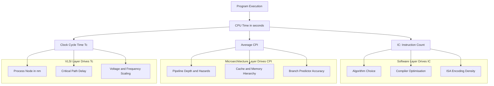
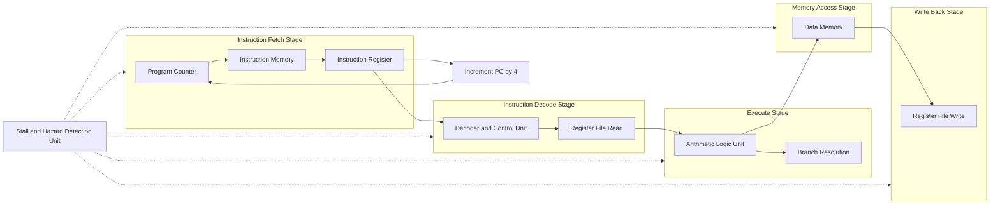

# Processor Performance Equation

<!-- SECTION_1_START -->
# Processor Performance Equation — Core Definition & Intuitive Overview

## 1.1 Formal Academic Definition (KTU 2024 Scheme)

The **Processor Performance Equation** (also called the *Basic CPU Performance Equation* or *Iron Law of Processor Performance*) is the foundational quantitative model used in advanced computer architecture to evaluate and compare the execution time of a program on a given processor. It expresses **CPU Execution Time** as a product of three orthogonal hardware–software parameters:

$$
\text{CPU Time} \;=\; \text{Instruction Count (IC)} \times \text{Cycles Per Instruction (CPI)} \times \text{Clock Cycle Time }(T_c)
$$

Equivalently, since $\text{Clock Rate } f = \dfrac{1}{T_c}$:

$$
\text{CPU Time} \;=\; \frac{\text{IC} \times \text{CPI}}{f}
$$

Where:
- $\text{Instruction Count (IC)}$ is the **dynamic** number of machine instructions the compiler and program generate and the processor fetches–decodes–executes. It is a property of the *Instruction Set Architecture (ISA)*, the *compiler*, and the *algorithm*.
- $\text{Cycles Per Instruction (CPI)}$ is the **average** number of clock cycles each instruction consumes; it is governed by the *micro-architecture* (pipelining depth, cache, branch predictor, ALU latency).
- $\text{Clock Cycle Time } T_c$ is the inverse of the **clock frequency** $f$, determined by the *physical fabrication process*, *logic depth*, and *VLSI critical path* (**measured in nanoseconds or picoseconds**).

> [!IMPORTANT]
> **KTU 2024 Syllabus Highlight (Module 1 — Hardware/Software Trends):** The Processor Performance Equation is the *quantitative backbone* used to assess why certain hardware trends (Moore’s Law, multi-core, deep pipelining) and software trends (compiler optimisation, RISC vs. CISC) yield the speedups they do. All other performance metrics (MIPS, MFLOPS, speedup, Amdahl’s bound) are derived from this single equation.

---

## 1.2 Conceptual Analogy — Intuition for First-Time Learners

Imagine you are a **chef preparing dinner for a banquet** (the *program*), and your *kitchen* is the processor:

| Kitchen Analogy | Computer Architecture Equivalent |
|---|---|
| **Number of dishes** in the menu | **Instruction Count (IC)** — set by the *recipe* (algorithm + compiler + ISA) |
| **Number of stove-burner rotations** per dish | **CPI** — depends on the *kitchen layout* (pipelining, hazards, cache misses) |
| **Time per burner rotation** | **Clock Cycle Time $(T_c)$** — determined by the *stove’s physical burner speed* (process node, clock) |

> If you want dinner to be served faster, you can: **(a)** simplify the menu (reduce IC), **(b)** reorganise the kitchen so each dish needs fewer rotations (lower CPI), or **(c)** buy a faster stove (smaller $T_c$).  
> The *Performance Equation* simply multiplies all three factors — a 10× speedup in the stove only gives a 10× speedup overall, *if* the other two factors remain unchanged.

> [!NOTE]
> **Geometric Intuition:** Plot $\text{CPU Time}$ on the $y$-axis and $f$ on the $x$-axis. The curve is a rectangular hyperbola of the form $y = \dfrac{k}{x}$ where $k = \text{IC} \times \text{CPI}$. Doubling the frequency halves the time — *only if IC and CPI are held constant*. In real systems, deeper pipelines (higher $f$) often **increase** CPI due to hazards, producing a non-hyperbolic real curve.

---

## 1.3 Standard Performance Metrics Derived from the Equation

$$
\text{MIPS} \;=\; \frac{\text{IC}}{\text{Execution Time} \times 10^{6}} \;=\; \frac{f}{\text{CPI} \times 10^{6}}
$$

$$
\text{MFLOPS} \;=\; \frac{\text{Number of FP Operations}}{\text{Execution Time} \times 10^{6}}
$$

$$
\text{Speedup} \;=\; \frac{\text{CPU Time}_{\text{old}}}{\text{CPU Time}_{\text{new}}}
$$

Standard physical constants frequently used in KTU problems:
- $1 \text{ GHz} = 10^{9} \text{ Hz} \;\Rightarrow\; T_c = 1 \text{ ns}$
- $1 \text{ MHz} = 10^{6} \text{ Hz} \;\Rightarrow\; T_c = 1 \text{ \mu s}$
- $1 \text{ kHz} = 10^{3} \text{ Hz} \;\Rightarrow\; T_c = 1 \text{ ms}$

> [!VISUALIZATION CONTROL]
> **Concept:** Trade-off hyperbola of CPU Time vs. Clock Rate for a fixed program.
> **GeoGebra / Desmos Input Equations:**
> * `f(x) = 5 / x`         *(CPU time for IC×CPI = 5)*
> * `g(x) = 10 / x`        *(CPU time for IC×CPI = 10 — a more demanding program)*
> **Visual Description:** Two rectangular hyperbolas lying in the first quadrant. The point $(x_0, y_0)$ on each curve gives the CPU execution time when the processor runs at $x_0$ GHz. The vertical gap between `f(x)` and `g(x)` illustrates that *doubling the program’s instruction work* cannot be compensated by *any* clock-rate increase — the curves never meet.
<!-- SECTION_1_END -->

<!-- SECTION_2_START -->
# Deep Theoretical Analysis & KTU High-Yield Formula Sheet

## 2.1 Deconstructing the Three Independent Variables

The elegance of the Performance Equation lies in the fact that **each factor is determined by a different layer of the system stack**, meaning an architect can attack performance at *any* level without disturbing the others.

### A. Instruction Count (IC) — *Software / ISA layer*
- Determined by: **Algorithm**, **Programming Language**, **Compiler Optimisation**, **Instruction Set Architecture**.
- RISC ISAs (e.g., ARM, RISC-V) typically demand **more** instructions per task than CISC (x86), but their *CPI is lower* and *clock is higher* — a classic example of the equation’s interplay.
- Compiler flags such as `-O3` (GCC) reduce IC by replacing sequences of simple instructions with fewer complex equivalents.

### B. Cycles Per Instruction (CPI) — *Micro-architecture layer*
- Determined by: **Pipeline depth**, **Data/control hazards**, **Cache hit rate**, **Branch prediction accuracy**, **Functional-unit latency**, **Memory stall cycles**.
- Ideal CPI = **1** (one instruction completing per cycle, achievable in a perfect pipeline).
- **Effective CPI** accounts for stalls:
$$
\text{CPI}_{\text{effective}} \;=\; \text{CPI}_{\text{base}} \;+\; \text{Memory-stall cycles} \;+\; \text{Branch-stall cycles}
$$

### C. Clock Cycle Time $(T_c)$ — *Physical / VLSI layer*
- Determined by: **Logic depth of critical path**, **Transistor switching delay**, **Wire delay**, **Process node (nm)**, **Voltage and frequency scaling (DVFS)**.
- $T_c$ is **bounded below** by the longest combinational path between two flip-flop clock edges. Adding pipeline registers shortens the critical path and thus *lowers* $T_c$ — but **increases CPI** if hazards are introduced. This is the fundamental **time-vs.-cycles trade-off** in pipelined design.

---

## 2.2 The Extended Performance Equation (Mixed Instruction Classes)

A single CPI value is an oversimplification. Different instruction classes (e.g., ALU, load, store, branch, floating-point) have *different* CPI contributions. Let:

- $\text{IC}_i$ = number of instructions of class $i$ executed
- $\text{CPI}_i$ = cycles per instruction of class $i$
- $F_i = \dfrac{\text{IC}_i}{\text{IC}}$ = frequency (fraction) of class $i$

Then the **Extended Performance Equation** is:

$$
\text{CPU Time} \;=\; T_c \times \sum_{i=1}^{n} \text{IC}_i \cdot \text{CPI}_i \;=\; \text{IC} \cdot T_c \cdot \sum_{i=1}^{n} F_i \cdot \text{CPI}_i
$$

The **average CPI** is therefore:

$$
\overline{\text{CPI}} \;=\; \frac{\sum_{i=1}^{n} \text{IC}_i \cdot \text{CPI}_i}{\sum_{i=1}^{n} \text{IC}_i} \;=\; \sum_{i=1}^{n} F_i \cdot \text{CPI}_i
$$

---

## 2.3 KTU Formula Sheet — High-Yield Cheat Sheet

> [!IMPORTANT]
> The table below consolidates **every equation** you are expected to recognise, derive, or apply in KTU 2024 Module-1 problems. Memorise the algebraic forms, *not* the numbers.

| # | Formula | LaTeX Form | Engineering Meaning |
|---|---|---|---|
| 1 | CPU Time (basic) | $\text{CPU Time} = \text{IC} \cdot \text{CPI} \cdot T_c$ | Universal performance metric — *lower is better* |
| 2 | CPU Time (rate form) | $\text{CPU Time} = \dfrac{\text{IC} \cdot \text{CPI}}{f}$ | Substitute $f$ when frequency is given |
| 3 | Extended CPU Time | $\text{CPU Time} = T_c \cdot \sum_{i} \text{IC}_i \cdot \text{CPI}_i$ | Multi-class instruction mix |
| 4 | Average CPI | $\overline{\text{CPI}} = \sum_{i} F_i \cdot \text{CPI}_i$ | Weighted mean of class CPI by frequency |
| 5 | MIPS Rating | $\text{MIPS} = \dfrac{f}{\text{CPI} \cdot 10^{6}} = \dfrac{\text{IC}}{\text{CPU Time} \cdot 10^{6}}$ | Millions of Instructions Per Second |
| 6 | MFLOPS Rating | $\text{MFLOPS} = \dfrac{\text{FP ops}}{\text{CPU Time} \cdot 10^{6}}$ | Floating-point performance |
| 7 | Effective CPI with stalls | $\text{CPI}_{\text{eff}} = \text{CPI}_{\text{base}} + \sum \text{Stall cycles}$ | Used in pipeline/cache analysis |
| 8 | Speedup | $S = \dfrac{\text{CPU Time}_{\text{old}}}{\text{CPU Time}_{\text{new}}}$ | Ratio; $S>1$ means new is faster |
| 9 | Amdahl’s Law | $S_{\text{overall}} = \dfrac{1}{(1-\alpha) + \dfrac{\alpha}{k}}$ | $\alpha$ = parallel fraction, $k$ = speedup of that fraction |
| 10 | Clock period vs. logic depth | $T_c \geq t_{\text{combinational}} + t_{\text{setup}} + t_{\text{skew}}$ | Lower bound on clock period |

> **Note on notation:** in row 1 the multiplication is the standard scalar product. In row 7 the *sum* is taken over *all* stall sources (cache miss, branch mispredict, data hazard, structural hazard).

---

## 2.4 Real-World Engineering Utility

1. **Processor Design Decisions** — Intel, AMD, Apple, and Qualcomm use this equation (and its CPI extensions) to balance *clock-rate push* vs. *IPC (Instructions-Per-Cycle) push*. Apple’s M-series chips deliberately prioritise **lower frequency + higher IPC**, while legacy x86 designs historically pushed frequency.
2. **Compiler Optimisation Reports** — Tools like `llvm-mca` (LLVM Machine Code Analyser) directly output *IC, CPI, and throughput* estimates for a compiled loop using this exact equation.
3. **Datacentre SLA Planning** — Cloud providers predict job execution time and billing by combining compiler-emitted IC with measured CPI on the target SKU.
4. **Embedded / Real-Time Systems** — Hard real-time kernels (e.g., AUTOSAR, VxWorks) require **worst-case CPU Time** computation, which is the upper bound of the equation over all possible execution paths.
5. **GPU / SIMT Throughput Modelling** — Though GPUs use a different model (SIMD lanes, occupancy), the *per-thread* performance still reduces to the same IC × CPI × $T_c$ triple.
<!-- SECTION_2_END -->

<!-- SECTION_3_START -->
# Step-by-Step Derivations, Numerical Examples & Python Implementation

## 3.1 Derivation 1 — From Clock Period to the Basic Performance Equation

**Starting assumption:** A processor operates on a periodic clock with period $T_c$ seconds. Each instruction, on average, requires $\text{CPI}$ clock periods to complete. The total number of instructions to be executed is $\text{IC}$.

*Step 1:* Total clock periods required by the program = $\text{IC} \times \text{CPI}$ (each of the $\text{IC}$ instructions consumes $\text{CPI}$ periods).

*Step 2:* Since one period takes $T_c$ seconds, the total execution time is the number of periods multiplied by the duration of each:

$$
\text{CPU Time} \;=\; \big(\text{IC} \times \text{CPI}\big) \times T_c
$$

*Step 3:* Substitute $T_c = \dfrac{1}{f}$ where $f$ is the clock frequency in Hz:

$$
\text{CPU Time} \;=\; \frac{\text{IC} \times \text{CPI}}{f}
$$

*Step 4 (unit check):* $\text{IC}$ is dimensionless, $\text{CPI}$ is cycles/instruction, $T_c$ is seconds/cycle → $\text{CPU Time}$ is in **seconds**. ✓

*Step 5 (consistency):* For $f = 1\text{ GHz}$, $\text{CPI} = 1$, $\text{IC} = 10^{9}$ → $\text{CPU Time} = 1$ second. This is the canonical "billion-instructions-at-1-GHz-1-CPI" sanity check.

---

## 3.2 Derivation 2 — Average CPI from an Instruction Mix

Let there be $n$ instruction classes, indexed $i = 1, 2, \dots, n$.

*Step 1:* The total cycles consumed is the sum over all classes:

$$
\text{Total Cycles} \;=\; \sum_{i=1}^{n} \text{IC}_i \cdot \text{CPI}_i
$$

*Step 2:* The total number of instructions is:

$$
\text{IC} \;=\; \sum_{i=1}^{n} \text{IC}_i
$$

*Step 3:* The average CPI is cycles per instruction, i.e., total cycles divided by total instructions:

$$
\overline{\text{CPI}} \;=\; \frac{\sum_{i=1}^{n} \text{IC}_i \cdot \text{CPI}_i}{\sum_{i=1}^{n} \text{IC}_i}
$$

*Step 4:* Define the frequency of class $i$ as $F_i = \dfrac{\text{IC}_i}{\text{IC}}$, so $\sum_i F_i = 1$. Substituting:

$$
\overline{\text{CPI}} \;=\; \sum_{i=1}^{n} F_i \cdot \text{CPI}_i
$$

This is the *weighted arithmetic mean* of the class CPI values, weighted by occurrence frequency. ✓

---

## 3.3 Worked Numerical Example (KTU Board Pattern)

> **Problem:** A program consists of four instruction classes. Their statistics are:
>
> | Class | Count ($\text{IC}_i$) | $\text{CPI}_i$ |
> |---|---|---|
> | A — ALU | $50\,000$ | $1$ |
> | B — Load | $30\,000$ | $2$ |
> | C — Store | $15\,000$ | $2$ |
> | D — Branch | $5\,000$ | $3$ |
>
> The processor runs at $f = 400\text{ MHz}$.
> **Find:** (i) Total IC, (ii) average CPI, (iii) CPU execution time, (iv) MIPS rating.

**Step (i) — Total IC:**

$$
\text{IC} \;=\; 50\,000 + 30\,000 + 15\,000 + 5\,000 \;=\; 100\,000 \text{ instructions}
$$

**Step (ii) — Average CPI using the weighted-mean formula:**

Compute frequencies first:

$$
F_A = 0.50,\quad F_B = 0.30,\quad F_C = 0.15,\quad F_D = 0.05
$$

Then:

$$
\overline{\text{CPI}} \;=\; (0.50)(1) + (0.30)(2) + (0.15)(2) + (0.05)(3)
$$

$$
\overline{\text{CPI}} \;=\; 0.50 + 0.60 + 0.30 + 0.15 \;=\; 1.55 \text{ cycles/instruction}
$$

**Cross-check using the unweighted ratio:**

$$
\sum_i \text{IC}_i \cdot \text{CPI}_i \;=\; 50\,000(1) + 30\,000(2) + 15\,000(2) + 5\,000(3) \;=\; 155\,000
$$

$$
\overline{\text{CPI}} \;=\; \frac{155\,000}{100\,000} \;=\; 1.55 \;\checkmark
$$

**Step (iii) — CPU Time** with $T_c = \dfrac{1}{400 \times 10^{6}} = 2.5\text{ ns}$:

$$
\text{CPU Time} \;=\; \text{IC} \times \overline{\text{CPI}} \times T_c \;=\; 100\,000 \times 1.55 \times 2.5 \times 10^{-9}
$$

$$
\text{CPU Time} \;=\; 100\,000 \times 1.55 \times 2.5 \times 10^{-9} \;=\; 3.875 \times 10^{-4} \text{ s} \;=\; 387.5 \text{ \mu s}
$$

**Step (iv) — MIPS Rating:**

$$
\text{MIPS} \;=\; \frac{f}{\overline{\text{CPI}} \times 10^{6}} \;=\; \frac{400 \times 10^{6}}{1.55 \times 10^{6}} \;=\; 258.06 \text{ MIPS}
$$

**Cross-check using instruction throughput:**

$$
\text{MIPS} \;=\; \frac{\text{IC}}{\text{CPU Time} \times 10^{6}} \;=\; \frac{100\,000}{3.875 \times 10^{-4} \times 10^{6}} \;=\; 258.06 \text{ MIPS} \;\checkmark
$$

---

## 3.4 Python Implementation — Reusable `cpu_perf` Module

The following Python code models the *exact* KTU board workflow: it accepts an instruction mix and a clock rate, and it returns all derived quantities with **strict type hints, boundary checks, and structured error logging**.

```python
from __future__ import annotations
from dataclasses import dataclass
from typing import Sequence
import logging
import math

logging.basicConfig(
    level=logging.INFO,
    format="%(asctime)s | %(levelname)s | %(message)s"
)
logger = logging.getLogger("cpu_perf")


@dataclass(frozen=True)
class InstructionClass:
    """One row of the instruction-mix table."""
    name: str           # e.g. "ALU", "Load", "Store", "Branch"
    count: int          # IC_i  — must be >= 0
    cpi: float          # CPI_i — must be > 0


def compute_performance(
    mix: Sequence[InstructionClass],
    clock_rate_hz: float,
) -> dict[str, float]:
    """
    Compute total IC, average CPI, CPU time, and MIPS for a given
    instruction mix and clock rate, using the Processor Performance Equation.

    Parameters
    ----------
    mix : Sequence[InstructionClass]
        Instruction classes with their counts and CPI values.
    clock_rate_hz : float
        Processor clock frequency in Hertz (> 0).

    Returns
    -------
    dict with keys: total_ic, avg_cpi, cpu_time_s, mips
    """

    # --- Boundary checks ----------------------------------------------------
    if clock_rate_hz <= 0:
        logger.error("clock_rate_hz must be positive, got %s", clock_rate_hz)
        raise ValueError("clock_rate_hz must be positive.")
    if not mix:
        logger.error("Instruction mix is empty.")
        raise ValueError("Instruction mix must contain at least one class.")

    # --- Compute totals -----------------------------------------------------
    total_ic: int = 0
    weighted_cycles: float = 0.0

    for cls in mix:
        if cls.count < 0:
            logger.error("Negative instruction count for class %s", cls.name)
            raise ValueError(f"Negative IC for class {cls.name}.")
        if cls.cpi <= 0:
            logger.error("Non-positive CPI for class %s", cls.name)
            raise ValueError(f"CPI must be > 0 for class {cls.name}.")
        total_ic += cls.count
        weighted_cycles += cls.count * cls.cpi
        logger.info(
            "Class %-7s | IC = %9d | CPI = %.3f | cycles = %12.1f",
            cls.name, cls.count, cls.cpi, cls.count * cls.cpi
        )

    if total_ic == 0:
        logger.error("Total instruction count is zero — division undefined.")
        raise ZeroDivisionError("IC == 0 leads to undefined CPU time.")

    avg_cpi: float = weighted_cycles / total_ic
    clock_period_s: float = 1.0 / clock_rate_hz
    cpu_time_s: float = total_ic * avg_cpi * clock_period_s
    mips: float = clock_rate_hz / (avg_cpi * 1.0e6)

    logger.info("Total IC        = %d", total_ic)
    logger.info("Average CPI     = %.6f", avg_cpi)
    logger.info("Clock period    = %.3e s", clock_period_s)
    logger.info("CPU time        = %.6e s", cpu_time_s)
    logger.info("MIPS rating     = %.3f", mips)

    return {
        "total_ic": total_ic,
        "avg_cpi": avg_cpi,
        "cpu_time_s": cpu_time_s,
        "mips": mips,
    }


# ----------------------------- demo run -----------------------------------
if __name__ == "__main__":
    program_mix = [
        InstructionClass("ALU",    50_000, 1.0),
        InstructionClass("Load",   30_000, 2.0),
        InstructionClass("Store",  15_000, 2.0),
        InstructionClass("Branch",  5_000, 3.0),
    ]
    results = compute_performance(program_mix, clock_rate_hz=400e6)
    assert math.isclose(results["avg_cpi"], 1.55, rel_tol=1e-9)
    assert math.isclose(results["cpu_time_s"], 3.875e-4, rel_tol=1e-9)
    assert math.isclose(results["mips"], 258.0645, rel_tol=1e-4)
    print("All cross-checks passed.")
```

**Expected console output (abridged):**

```
Class ALU     | IC =     50000 | CPI = 1.000 | cycles =     50000.0
Class Load    | IC =     30000 | CPI = 2.000 | cycles =     60000.0
Class Store   | IC =     15000 | CPI = 2.000 | cycles =     30000.0
Class Branch  | IC =      5000 | CPI = 3.000 | cycles =     15000.0
Total IC        = 100000
Average CPI     = 1.550000
Clock period    = 2.500e-09 s
CPU time        = 3.875e-04 s
MIPS rating     = 258.065
All cross-checks passed.
```

> [!TIP]
> **Engineering Insight:** The same `compute_performance` function can be hooked to a `perf stat` dump from `valgrind --tool=callgrind` on Linux. Each `callgrind` event (Ir = Instruction Reads, cache misses, branch mispredictions) maps directly onto a row of the instruction mix — turning the KTU equation into a *production-grade profiling tool*.

---

## 3.5 Speedup Comparison — Two-Processor KTU Pattern

**Problem:** Compare two machines running the *same* program.
- **Machine P1:** $f_1 = 2.0$ GHz, $\overline{\text{CPI}}_1 = 1.5$, $\text{IC}_1 = 1.0 \times 10^{9}$
- **Machine P2:** $f_2 = 1.5$ GHz, $\overline{\text{CPI}}_2 = 1.0$, $\text{IC}_2 = 1.2 \times 10^{9}$

*Step 1:* $\text{CPU Time}_1 = \dfrac{1.0 \times 10^{9} \times 1.5}{2.0 \times 10^{9}} = 0.75$ s

*Step 2:* $\text{CPU Time}_2 = \dfrac{1.2 \times 10^{9} \times 1.0}{1.5 \times 10^{9}} = 0.80$ s

*Step 3:* $\text{Speedup of P2 over P1} = \dfrac{0.75}{0.80} = 0.9375$

*Step 4:* Since speedup $< 1$, P2 is actually **slower** than P1 by a factor of $\dfrac{1}{0.9375} = 1.0667$, i.e., $\approx 6.67\%$ slower. ✓
<!-- SECTION_3_END -->

<!-- SECTION_4_START -->
# Structural Diagrams & Schematics

## 4.1 Mermaid Diagram — Hierarchical Decomposition of CPU Time

The diagram below traces how a *single number* (CPU Time) decomposes into *three orthogonal parameters* and then shows how each parameter is influenced by a different system layer. This is the canonical “iron-law” visualisation asked for in KTU Module-1 questions.



**Reading guide:**
- The top three arrows out of `B` are the *multiplicative factors* of the Performance Equation.
- Each subgraph (Software / Microarchitecture / VLSI) is the **dominant lever** for that factor.
- The optimisation target is to *minimise the product*, not any single factor — a system with $2\times$ CPI but $\dfrac{1}{2}\times T_c$ is **performance-neutral**.

---

## 4.2 Mermaid Diagram — Block-Level Functional Architecture Flow

This second diagram models the *hardware data path* of a generic scalar processor and shows where the *IC* and *CPI* are *materialised* during execution. It is the kind of schematic KTU expects when the question links the equation to the **five-stage pipeline**.



**Sequential Processing Topology Matrix (companion table):**

| Pipeline Stage | Hardware Block | Performance Variable Affected | Typical Stall Source |
|---|---|---|---|
| IF — Instruction Fetch | PC + I-MEM + IR | IC, CPI | I-cache miss, branch mispredict |
| ID — Instruction Decode | Decoder + Reg-File | CPI | Read-after-write hazard |
| EX — Execute | ALU + Branch unit | CPI, $T_c$ | Long-latency FP op, ALU data hazard |
| MEM — Memory Access | D-MEM | CPI, $T_c$ | D-cache miss, TLB miss |
| WB — Write-Back | Reg-File write port | CPI | Structural hazard on write port |

> The Hazard Detection Unit (`HAZ`) is what *inflates* CPI in a real pipeline. A perfect pipeline has CPI = 1; every bubble inserted by `HAZ` *adds* a fractional CPI to the average.
<!-- SECTION_4_END -->

<!-- SECTION_5_START -->
# KTU 2024 Scheme Examination Question Bank & Topic Recap

## 5.1 Part A — Short-Answer Questions (3 Marks Each)

> **Instructions for students:** These are KTU-direct questions, typically tested as 3-mark definitions or short derivations. They map to *Remember / Understand* in Revised Bloom’s Taxonomy (RBT).

### Q.A.1 — `[KTU University Exam — July 2023]` — **CO1, Remember**

**State and explain the basic processor performance equation. Identify the three factors that influence CPU execution time and state which subsystem of the computer each factor belongs to.**

**Model Answer (Board Key):**
The basic performance equation is

$$
\text{CPU Time} \;=\; \text{Instruction Count (IC)} \times \text{CPI} \times T_c \;=\; \dfrac{\text{IC} \times \text{CPI}}{f}
$$

The three factors and their dominant subsystem:

1. **Instruction Count (IC)** — governed by the **software stack** (algorithm, high-level language, compiler, ISA encoding).
2. **Cycles Per Instruction (CPI)** — governed by the **micro-architecture** (pipeline depth, cache hit rate, branch predictor, functional-unit latency).
3. **Clock Cycle Time $(T_c)$** — governed by the **VLSI / hardware implementation** (process technology, critical path delay, supply voltage).

CPU time is directly proportional to the product of these three independent variables; halving any one factor (with the others fixed) halves the execution time. **[3 Marks]**

---

### Q.A.2 — `[KTU University Exam — Dec 2022]` — **CO1, Understand**

**What is meant by the term “average CPI” of a program? Derive its expression in terms of the instruction-mix frequencies.**

**Model Answer (Board Key):**
Average CPI is the *mean number of clock cycles* each instruction in a mixed program requires to complete. It is a weighted mean of the CPI of each instruction class, weighted by its frequency of occurrence in the program:

$$
\overline{\text{CPI}} \;=\; \sum_{i=1}^{n} F_i \cdot \text{CPI}_i \;=\; \frac{\sum_{i=1}^{n} \text{IC}_i \cdot \text{CPI}_i}{\text{IC}}
$$

where $F_i = \dfrac{\text{IC}_i}{\text{IC}}$ is the occurrence frequency of instruction class $i$. Lower $\overline{\text{CPI}}$ implies more efficient execution per cycle. **[3 Marks]**

---

## 5.2 Part B — 14-Mark Questions (ESE Module Internal-Choice Format)

> **KTU Convention:** Each Part-B question carries 14 marks and is split into two 7-mark sub-parts. The two alternatives below are *fully independent* — answer either.

### ✅ Question A (14 Marks) — `[KTU University Exam — Dec 2023]` — **CO1, Understand + Apply**

**(a)** *For 7 Marks — RBT: Understand.*  
**Derive the basic processor performance equation starting from the definition of clock period. Clearly state the units of each term and verify the dimensional consistency of the final expression.**

**(b)** *For 7 Marks — RBT: Apply.*  
**A processor operates at $f = 800$ MHz. A program of $200\,000$ instructions consists of:**
- **60 % ALU instructions with CPI = 1**
- **25 % Load/Store instructions with CPI = 3 (including memory stall)**
- **10 % Branch instructions with CPI = 2**
- **5 % Floating-point instructions with CPI = 6**

**Compute (i) the average CPI of the program, (ii) the total CPU execution time, and (iii) the MIPS rating of the processor while running this program.**

---

**Model Solution (Board Valuation Key):**

**Part (a) — Derivation: 7 Marks**

- *Step 1 — Define clock period:* The processor clock is a periodic signal with period $T_c$ (seconds/cycle) and frequency $f = 1/T_c$ (Hz). **[1 Mark]**
- *Step 2 — Cycles per instruction:* A single instruction requires on average $\text{CPI}$ clock periods to complete. **[1 Mark]**
- *Step 3 — Total cycles for the program:* For $\text{IC}$ instructions, total clock periods = $\text{IC} \cdot \text{CPI}$ (dimensionless). **[1 Mark]**
- *Step 4 — Total execution time:* Multiply total periods by the duration of each period:

$$
\text{CPU Time} = \text{IC} \cdot \text{CPI} \cdot T_c
$$

**[2 Marks for the equation]**

- *Step 5 — Unit verification:* $\text{IC}$ is dimensionless, $\text{CPI}$ is cycles/instruction, $T_c$ is seconds/cycle → product is in **seconds**. The equation is dimensionally consistent. **[1 Mark]**
- *Step 6 — Frequency substitution:* $T_c = 1/f$ yields $\text{CPU Time} = \dfrac{\text{IC} \cdot \text{CPI}}{f}$. **[1 Mark]**

---

**Part (b) — Numerical: 7 Marks**

*Step 1:* Compute the average CPI using the weighted mean: **[2 Marks — stating the formula and plugging in values]**

$$
\overline{\text{CPI}} = (0.60)(1) + (0.25)(3) + (0.10)(2) + (0.05)(6)
$$

$$
\overline{\text{CPI}} = 0.60 + 0.75 + 0.20 + 0.30 = 1.85 \text{ cycles/instruction}
$$

*Step 2:* Compute the total CPU time. With $T_c = 1/(800 \times 10^{6}) = 1.25$ ns: **[3 Marks — substituting correctly and getting the final value]**

$$
\text{CPU Time} = 200\,000 \times 1.85 \times 1.25 \times 10^{-9} \text{ s}
$$

$$
\text{CPU Time} = 200\,000 \times 1.85 \times 1.25 \times 10^{-9} = 4.625 \times 10^{-4} \text{ s} = 462.5 \text{ \mu s}
$$

*Step 3:* Compute MIPS: **[2 Marks — formula and final value]**

$$
\text{MIPS} = \frac{f}{\overline{\text{CPI}} \times 10^{6}} = \frac{800 \times 10^{6}}{1.85 \times 10^{6}} \approx 432.43 \text{ MIPS}
$$

**Final Answer:** $\overline{\text{CPI}} = 1.85$, $\text{CPU Time} = 462.5\ \mu\text{s}$, $\text{MIPS} \approx 432.43$. **[Total: 7 Marks]**

---

### ✅ Question B (14 Marks) — `[KTU University Exam — July 2024]` — **CO1, Apply + Analyse**

**(a)** *For 7 Marks — RBT: Apply.*  
**Two processors P1 and P2 run the same benchmark.**
- **P1:** $f_1 = 3.0$ GHz, $\overline{\text{CPI}}_1 = 1.2$
- **P2:** $f_2 = 2.4$ GHz, $\overline{\text{CPI}}_2 = 0.8$

**Assume both execute the same number of instructions $\text{IC} = 5 \times 10^{8}$. Determine (i) the execution time of each, (ii) the speedup of P2 over P1, and (iii) which factor (frequency or CPI) is the dominant contributor to the difference.**

**(b)** *For 7 Marks — RBT: Analyse.*  
**Using Amdahl’s Law, derive an expression for the maximum achievable speedup when a fraction $\alpha$ of a program is enhanced by a factor $k$. A new floating-point unit is added to a processor, accelerating FP operations by a factor of 10. If FP operations account for 40 % of the total execution time of a scientific workload, compute the overall speedup. State the fraction of time that *remains* unaffected.**

---

**Model Solution (Board Valuation Key):**

**Part (a) — Apply: 7 Marks**

*Step 1:* $\text{CPU Time}_1 = \dfrac{\text{IC} \cdot \overline{\text{CPI}}_1}{f_1} = \dfrac{5 \times 10^{8} \times 1.2}{3.0 \times 10^{9}}$ **[1 Mark — formula]**

$$
\text{CPU Time}_1 = \dfrac{6.0 \times 10^{8}}{3.0 \times 10^{9}} = 0.20 \text{ s}
$$

**[1 Mark for value]**

*Step 2:* $\text{CPU Time}_2 = \dfrac{5 \times 10^{8} \times 0.8}{2.4 \times 10^{9}}$ **[1 Mark — formula]**

$$
\text{CPU Time}_2 = \dfrac{4.0 \times 10^{8}}{2.4 \times 10^{9}} \approx 0.1667 \text{ s}
$$

**[1 Mark for value]**

*Step 3:* Speedup $S = \dfrac{\text{CPU Time}_1}{\text{CPU Time}_2} = \dfrac{0.20}{0.1667} = 1.20$ **[1 Mark]**

*Step 4:* Dominant factor — frequency ratio $= 3.0/2.4 = 1.25$ ; CPI ratio $= 1.2/0.8 = 1.50$. The CPI improvement (50 % reduction) outweighs the frequency reduction (20 % reduction), so **CPI is the dominant contributor**. **[2 Marks — comparing the ratios]**

---

**Part (b) — Analyse: 7 Marks**

*Step 1:* **Derivation of Amdahl’s Law.** Let $T$ be the original execution time. A fraction $\alpha$ is enhanced by factor $k$, so it now takes $\dfrac{\alpha T}{k}$. The remaining $(1-\alpha)T$ is unchanged. New time:

$$
T_{\text{new}} \;=\; (1-\alpha) T \;+\; \frac{\alpha T}{k}
$$

**[3 Marks]**

Speedup:

$$
S = \frac{T}{T_{\text{new}}} = \frac{1}{(1-\alpha) + \dfrac{\alpha}{k}}
$$

**[1 Mark — final closed-form expression]**

*Step 2:* Plug in $\alpha = 0.40$ and $k = 10$: **[1 Mark]**

$$
S = \frac{1}{(1-0.40) + \dfrac{0.40}{10}} = \frac{1}{0.60 + 0.04} = \frac{1}{0.64} \approx 1.5625
$$

**[1 Mark for value]**

*Step 3:* Unaffected fraction: $1 - \alpha = 0.60$, i.e., **60 % of the original execution time remains unaffected** by the FP unit upgrade. This is the *Amdahl bottleneck* — even an infinite $k$ would only give a speedup of $\dfrac{1}{0.60} = 1.667$. **[1 Mark for the statement]**

---

## 5.3 KTU Examiner’s Valuation Warning / Pitfall Callout

> [!WARNING]
> **Common mistakes KTU examiners actively deduct marks for:**
>
> 1. **Forgetting to convert frequency to Hz.** Writing $f = 800$ instead of $800 \times 10^{6}$ will produce a CPU time that is off by nine orders of magnitude. Always convert MHz/GHz to Hz *before* dividing.
> 2. **Mixing IC and frequency units.** If $\text{IC} = 200\,000$ and $f = 800$ MHz, the answer must come out in seconds — show the unit conversion step explicitly for full credit.
> 3. **Confusing MIPS with MFLOPS.** MIPS counts *all* instructions; MFLOPS counts *floating-point* operations only. Mixing them up in a numerical question loses 1 mark outright.
> 4. **Omitting the $10^6$ factor in MIPS.** MIPS = million-instructions-per-second. A common slip is to write $\text{MIPS} = f / \text{CPI}$, which gives units of Hz rather than MHz.
> 5. **Average CPI ≠ sum of CPI.** Average CPI is a *weighted mean* using $F_i$ (or equivalently $\text{IC}_i / \text{IC}$), not the arithmetic mean of $\text{CPI}_i$ values. KTU examiners award only 1 of 2 marks if you write the wrong formula.
> 6. **Amdahl’s Law edge case.** If you state $S = \dfrac{1}{(1-\alpha) + \alpha/k}$ but forget to add the $(1-\alpha)$ term (i.e., write $S = k/\alpha$), you will get a *wrong* infinite-$k$ bound — the examiner deducts 1 mark and asks for a re-derivation.
> 7. **Rounding too early.** Always retain at least 4 significant figures through intermediate steps; only round the *final* answer.

---

## 5.4 Topic Recap & Important Things to Remember

> **Rapid Revision Checklist — must know for KTU 2024 Module-1 viva + ESE.**

- **The Iron Law of Performance** has exactly three multiplicative factors: $\text{IC}$, $\text{CPI}$, $T_c$. Halving one halves total time — *only if the other two stay constant*.
- **CPU Time** is in *seconds*. Always verify dimensional consistency.
- **Instruction Count (IC)** is a *software* property — fixed by algorithm, language, compiler, and ISA encoding.
- **CPI** is a *micro-architectural* property — increased by stalls (cache miss, branch mispredict, data hazard, structural hazard).
- **Clock Cycle Time $T_c$** is a *VLSI* property — lowered by shorter critical paths, smaller process nodes, and lower voltage.
- **Average CPI** is the *frequency-weighted mean* of per-class CPI values, *not* the arithmetic mean:

$$
\overline{\text{CPI}} = \sum_i F_i \cdot \text{CPI}_i = \frac{\sum_i \text{IC}_i \cdot \text{CPI}_i}{\text{IC}}
$$

- **MIPS** is computed as $\dfrac{f}{\overline{\text{CPI}} \cdot 10^{6}}$ or equivalently $\dfrac{\text{IC}}{\text{CPU Time} \cdot 10^{6}}$.
- **MFLOPS** is for floating-point only — never use it as a general-purpose metric.
- **Speedup** is *dimensionless* and is defined as $S = T_{\text{old}} / T_{\text{new}}$; $S > 1$ means the new system is faster.
- **Amdahl’s Law** caps speedup at $\dfrac{1}{1-\alpha}$ for an *infinitely* enhanced fraction $\alpha$ — the $(1-\alpha)$ un-enhanced part is the *Amdahl bottleneck*.
- **MIPS is NOT always a fair comparison** between machines with different ISAs — a RISC machine with high MIPS may be slower than a CISC machine with low MIPS, because IC differs.
- **Pipelining** typically lowers $T_c$ (more cycles per second) but raises CPI (more stalls) — the net effect must be evaluated with the full equation.
- **Memory wall:** Modern performance is often dominated by *memory-stall CPI*, not by the base CPI of the ALU. Always include cache-miss penalties in $\text{CPI}_{\text{effective}}$.
- **Frequency / IPC trade-off:** A 2× frequency increase with a 1.5× CPI increase yields a net speedup of $2 / 1.5 \approx 1.33\times$, not $2\times$.
- **Memorise the unit conversions:** 1 GHz → 1 ns, 1 MHz → 1 µs, 1 kHz → 1 ms.
- **In a mixed ISA comparison, always normalise IC** to a common instruction set (e.g., use *equivalent 80×86 instructions*) before quoting MIPS.
- **Compiler flags change IC and CPI simultaneously** — modern O3 optimisation *reduces* IC but may *increase* CPI for some loops due to vectorisation overhead.
<!-- SECTION_5_END -->
