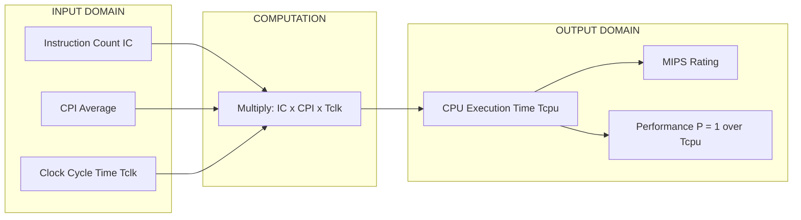
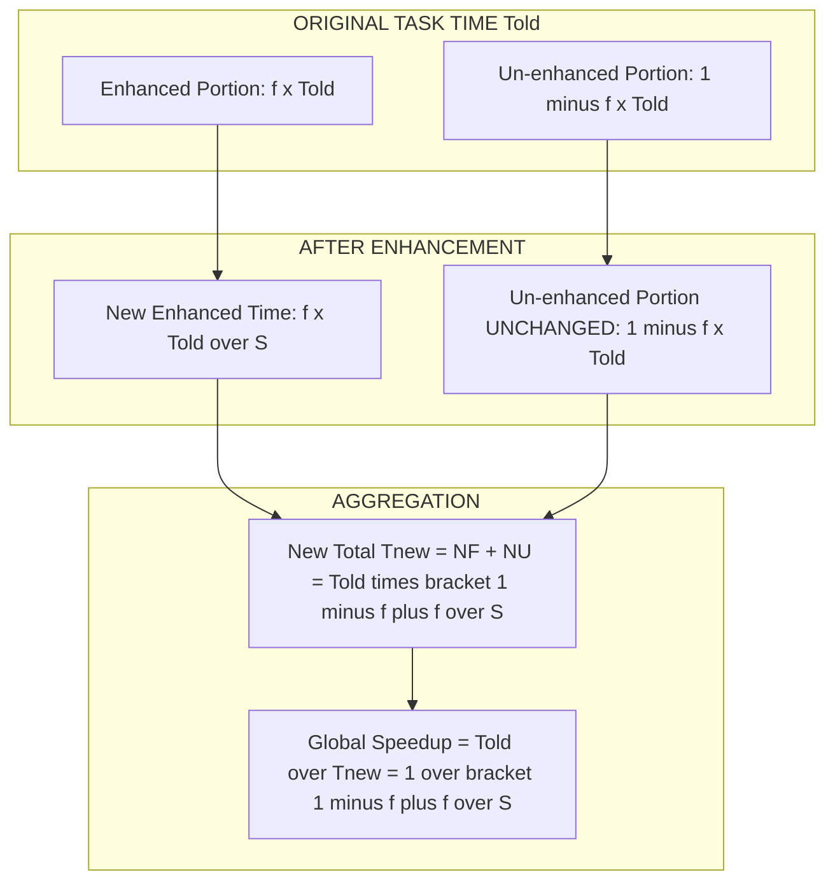
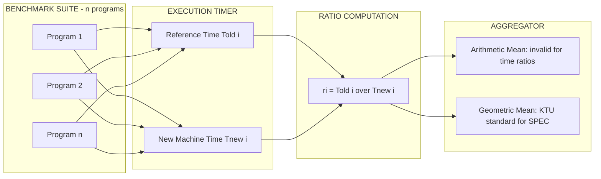
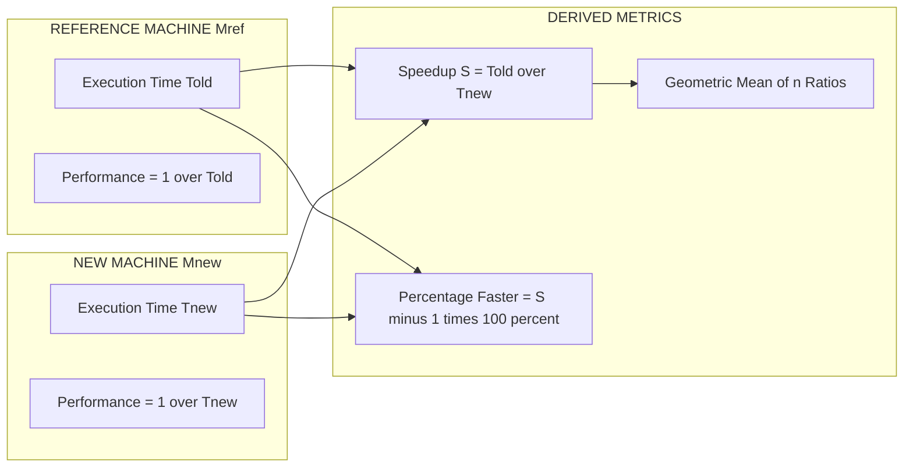
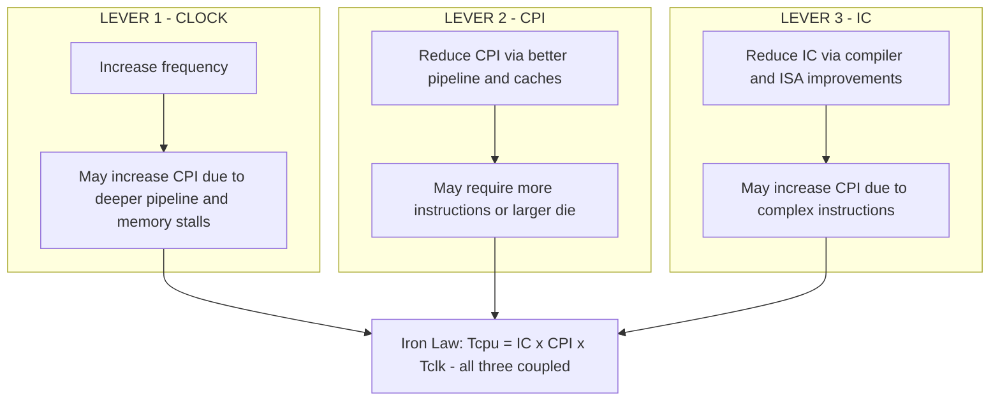

# Reporting and Summarizing Performance

<!-- SECTION_1_START -->
# Reporting and Summarizing Performance

## 1. Core Technical Definition

> [!IMPORTANT]
> **Performance Reporting (KTU 2024 - PECST528 / Module 1):**
> *Performance reporting* is the systematic methodology used in advanced computer architecture to **measure, quantify, compare, and communicate** the execution capability of a computer system using standardized metrics, benchmarks, and summary statistics. It converts raw execution timings into meaningful engineering claims (e.g., *"Machine A is 1.4× faster than Machine B"*).

In the KTU 2024 scheme syllabus, this topic sits at the intersection of three foundational pillars:

1. **Iron Law of Processor Performance** (CPU performance equation).
2. **Amdahl's Law** (bounding the gains from any enhancement).
3. **Benchmark Summarization** (geometric vs. arithmetic mean).

> [!NOTE]
> **Standard Performance Metric (KTU Board Terminology):**
> *Performance* is formally defined as the **inverse of execution time**.
> $$\text{Performance}_X = \frac{1}{\text{Execution Time}_X}$$

A machine with *shorter* execution time is said to be *faster* and hence has *higher* performance. This reciprocal relationship is the cornerstone of every performance comparison done in computer architecture.

### 1.1 Conceptual Analogy — The "Lap Time" Intuition

Imagine two cars, **Car A** and **Car B**, racing on a track. The most intuitive measure of which car is better is **how long each takes to finish one lap**.

- Car A finishes in **10 seconds**.
- Car B finishes in **15 seconds**.

*Without doing any math*, you instantly know Car A is faster. The "lap time" of a processor is its **execution time** for a fixed workload. A smaller lap time = a better processor.

Now, suppose the *race organisers* want to summarize results from 10 different tracks. Should they:
- (a) Add all 10 lap times and divide by 10? → **Arithmetic mean**.
- (b) Multiply the 10 *ratios* of times and take the 10th root? → **Geometric mean**.

This exact dilemma is what computer architects face when summarizing SPEC benchmark results — and choosing the *wrong* mean can make a misleading machine look better than it truly is (or vice-versa).

> [!TIP]
> **Syllabus Highlight (PECST528, M1):**
> The KTU examiner specifically tests:
> (i) the CPU performance equation,
> (ii) Amdahl's Law, and
> (iii) the **justification for using geometric mean** in benchmark summarization.

### 1.2 The Two Complementary Views of Performance

> [!NOTE]
> **Definition — Response Time (Latency / Execution Time):**
> The total time required for a single task to complete, including all system overheads (memory, I/O, OS, etc.). Units: **seconds**.

> [!NOTE]
> **Definition — Throughput (Bandwidth / Productivity):**
> The number of tasks completed per unit of time. Units: **tasks/second** or **jobs/hour**.

These two metrics often **conflict**:

- A *latency-oriented* system optimizes for one fast job (e.g., a transaction server).
- A *throughput-oriented* system optimizes for many jobs per second (e.g., a batch compiler farm, a GPU).

> [!WARNING]
> **Common Pitfall:** Replacing a CPU with a faster one (lower response time) generally *also* increases throughput, but **not** by the same amount. Reporting only throughput, or only response time, can be misleading.

### 1.3 Visualization: Performance as a Reciprocal Curve

> [!VISUALIZATION CONTROL]
> **Concept:** Reciprocal relationship $P = 1/T$ — visualizing why a *small* drop in time gives a *large* rise in performance.
> **Desmos Input Equations:**
> * `y = 1/x`
> **Visual Description:** A hyperbola in the first quadrant. As $x$ (execution time) increases along the horizontal axis, $y$ (performance) collapses rapidly toward zero. Mirror this against a second curve `y2 = 1/(x/1.4)` to visualize that a **40 %** reduction in time yields a **~67 %** rise in performance.

---

<!-- SECTION_2_START -->
# Deep Theoretical Analysis & KTU High-Yield Formula Sheet

## 2.1 The CPU Performance Equation (The "Iron Law")

The execution time of a program on a processor is decomposed into three independent, measurable factors:

$$\boxed{\;T_{\text{CPU}} \;=\; \text{Instruction Count (IC)} \;\times\; \text{Cycles Per Instruction (CPI)} \;\times\; \text{Clock Cycle Time } (T_{\text{clock}})\;}$$

Equivalently, in terms of clock frequency $f_{\text{clock}} = 1 / T_{\text{clock}}$:

$$T_{\text{CPU}} \;=\; \frac{\text{IC} \times \text{CPI}}{f_{\text{clock}}}$$

> [!IMPORTANT]
> **Why the name "Iron Law"?**
> Because *every one* of the three factors is bound by a different sub-system of the machine (compiler, micro-architecture, fabrication process), and improving one factor often degrades another. It is the **"ironclad"** trade-off surface that all designers live on.

### 2.2 Interpretation of the Three Factors

| Factor | Determined By | Engineering Lever |
| :--- | :--- | :--- |
| **IC** (Instruction Count) | Compiler, ISA, Algorithm | Better compilers, RISC vs CISC, algorithmic efficiency |
| **CPI** (Avg. Cycles / Instruction) | Micro-architecture, Memory hierarchy, Pipeline depth | Pipelining, caches, branch prediction, out-of-order execution |
| **$T_{\text{clock}}$** (Clock Cycle Time) | CMOS fabrication process, pipeline depth, critical path | Smaller technology node (e.g., 7 nm → 3 nm), faster transistors |

### 2.3 Amdahl's Law — The Ceiling on Speedup

When we enhance *one portion* of a system, the overall speedup is limited by the *un-enhanced* fraction.

> [!NOTE]
> **Amdahl's Law (Formal):**
> If a fraction $f$ of the execution time is improved by a factor of $S$ (speedup of the enhanced part), the **overall speedup** of the whole task is:
> $$\text{Speedup}_{\text{overall}} \;=\; \frac{1}{(1 - f) + \dfrac{f}{S}}$$

**Boundary cases** (must be memorized for KTU valuation):

| Condition | Resulting Speedup | Interpretation |
| :--- | :--- | :--- |
| $S \to \infty$ (enhance becomes infinitely fast) | $\dfrac{1}{1-f}$ | Upper bound: the *un-enhanced* fraction caps the gain |
| $f = 1$ (entire task enhanced) | $S$ | Full benefit achieved |
| $f = 0$ (nothing enhanced) | $1$ | No improvement |

### 2.4 Local vs. Global Speedup

> [!NOTE]
> **Local Speedup:** Ratio of the execution time *of the enhanced portion* before vs. after enhancement.
> **Global Speedup:** Ratio of the *total* program execution time before vs. after enhancement.
> KTU always tests **Global Speedup**.

### 2.5 The Benchmark Summarization Problem

When $n$ benchmark programs are run on two machines (Reference and New), the raw timings produce $n$ **ratios**:

$$r_i = \frac{\text{Time}_{\text{Reference}, i}}{\text{Time}_{\text{New}, i}}$$

The question is: *How do we collapse these $n$ ratios into a single "score"?*

Two standard approaches exist:

| Mean | Formula | Used For | Validity |
| :--- | :--- | :--- | :--- |
| **Arithmetic Mean (AM)** | $A = \dfrac{1}{n}\sum r_i$ | Summarizing rates (e.g., MFLOPS) | **Biased** for time ratios |
| **Geometric Mean (GM)** | $G = \left(\prod_{i=1}^{n} r_i\right)^{1/n}$ | Summarizing **time ratios** (SPEC) | **Unbiased**, scale-independent |

> [!IMPORTANT]
> **Why Geometric Mean is Correct for Performance Ratios:**
> The geometric mean is invariant under the choice of reference machine. If Machine A is $x$ times faster than B, and B is $y$ times faster than C, then A is $\sqrt{xy}$ times faster than C — but *only* the geometric mean respects this chain.

### 2.6 KTU High-Yield Formula Sheet

| # | Quantity | Formula | Units / Notes |
| :---: | :--- | :--- | :--- |
| 1 | CPU Execution Time | $T_{\text{CPU}} = \text{IC} \times \text{CPI} \times T_{\text{clock}}$ | Seconds |
| 2 | Performance | $P = 1 / T_{\text{CPU}}$ | Inverse seconds |
| 3 | Speedup of $X$ over $Y$ | $S = T_Y / T_X$ | Dimensionless |
| 4 | Amdahl's Speedup | $S_{\text{overall}} = \dfrac{1}{(1-f) + f/S_{\text{enh}}}$ | Dimensionless |
| 5 | CPU Clock Frequency | $f = 1 / T_{\text{clock}}$ | Hz (cycles/sec) |
| 6 | MIPS (Millions of Instructions / sec) | $\text{MIPS} = \dfrac{\text{IC}}{T_{\text{CPU}} \times 10^6} = \dfrac{f}{\text{CPI} \times 10^6}$ | $10^{6}$ instr/sec |
| 7 | MFLOPS | $\text{MFLOPS} = \dfrac{\text{FP ops}}{T_{\text{CPU}} \times 10^6}$ | $10^{6}$ FP ops/sec |
| 8 | Geometric Mean | $G = \left(\prod_{i=1}^{n} r_i\right)^{1/n}$ | For benchmark ratios |
| 9 | Arithmetic Mean | $A = \dfrac{1}{n}\sum_{i=1}^{n} r_i$ | For benchmark rates |
| 10 | Execution Time from MIPS | $T = \dfrac{\text{IC}}{\text{MIPS} \times 10^6}$ | Seconds |

> [!WARNING]
> **MIPS Trap:** MIPS is **not** a valid metric across ISAs. A RISC program has *more* instructions than a CISC program for the same task, so MIPS inverts the actual performance. KTU frequently asks this pitfall.

### 2.7 Real-World Engineering Utility

- **Compiler teams** (GCC, LLVM) use Amdahl's Law to decide which hot-paths to optimize (the 80/20 rule).
- **Chip designers (Intel, AMD, Apple)** use the Iron Law to balance the trade-off between clock frequency, IPC, and ISA complexity.
- **Cloud providers (AWS, Azure, GCP)** use geometric mean of SPEC scores to rank instance families consistently.
- **HPC centers** report MFLOPS, but always qualify it with the LINPACK benchmark and the geometric mean over a suite.

---

<!-- SECTION_3_START -->
# Step-by-Step Derivations & Symbolic Implementation

## 3.1 Worked Derivation #1 — Deriving the CPU Performance Equation

Starting from first principles. Let:

- $N$ = total number of instructions executed (Instruction Count, **IC**).
- $c_i$ = cycles needed by instruction type $i$.
- $n_i$ = number of instructions of type $i$ in the program.
- $T_{\text{clock}}$ = clock period.

The total cycle count is the weighted sum of cycles across all instruction classes:

$$C_{\text{total}} = \sum_{i} (n_i \times c_i)$$

The **average CPI** is the total cycles divided by the total instruction count:

$$\text{CPI}_{\text{avg}} = \frac{C_{\text{total}}}{N} = \frac{\sum_i n_i \, c_i}{N} = \sum_i \left( \frac{n_i}{N} \right) c_i$$

where $\frac{n_i}{N}$ is the **frequency fraction** of instruction class $i$.

The total execution time equals total cycles times the clock period:

$$T_{\text{CPU}} = C_{\text{total}} \times T_{\text{clock}} = N \times \text{CPI}_{\text{avg}} \times T_{\text{clock}}$$

This is the **Iron Law of Processor Performance** as it appears in the KTU answer script.

## 3.2 Worked Derivation #2 — Amdahl's Law from First Principles

Let $T_{\text{old}}$ be the original execution time of the entire task.
Let $f$ be the fraction of $T_{\text{old}}$ spent in the *enhanced* portion.

Then:
- Time spent in enhanced portion = $f \cdot T_{\text{old}}$.
- Time spent in un-enhanced portion = $(1 - f) \cdot T_{\text{old}}$.

If the enhanced portion is sped up by a factor $S$, the new time for that portion is:

$$T_{\text{enh, new}} = \frac{f \cdot T_{\text{old}}}{S}$$

The new total time is:

$$T_{\text{new}} = \frac{f \cdot T_{\text{old}}}{S} + (1 - f) \cdot T_{\text{old}}$$

Factor out $T_{\text{old}}$:

$$T_{\text{new}} = T_{\text{old}} \left[ (1 - f) + \frac{f}{S} \right]$$

Global speedup is the ratio:

$$\text{Speedup} = \frac{T_{\text{old}}}{T_{\text{new}}} = \frac{1}{(1 - f) + \dfrac{f}{S}}$$

This is the boxed Amdahl expression.

## 3.3 Worked Derivation #3 — Why Geometric Mean for Time Ratios

Given $n$ benchmark ratios $r_1, r_2, \ldots, r_n$, take logarithms:

$$\ln G = \frac{1}{n} \sum_{i=1}^{n} \ln r_i$$

This is the **arithmetic mean of the logs**. Therefore:

- The geometric mean is the *exponential* of the average log-ratio.
- The average log-ratio corresponds to the average *percentage change* in execution time — the most natural summary of "how much faster".
- It is **invariant under choice of reference machine**: if we swap Reference ↔ New, each $r_i \to 1/r_i$, and the GM becomes $1/G$.

In contrast, the arithmetic mean of $r_i$ is **not** invariant — it changes depending on which machine we call "reference". This is the formal reason KTU mandates the geometric mean for SPEC-style reports.

## 3.4 Algorithmic Implementation — Python Utilities

```python
"""
reporting_performance.py
KTU 2024 - PECST528 / Module 1 - Reporting and Summarizing Performance
Provides reusable, type-annotated utilities for performance analysis.
"""

from __future__ import annotations
import math
from typing import List, Sequence
from dataclasses import dataclass


@dataclass(frozen=True)
class CpuTimeBreakdown:
    instruction_count: int
    cpi_avg: float
    clock_period_seconds: float

    def execution_time_seconds(self) -> float:
        if self.cpi_avg < 0 or self.clock_period_seconds < 0:
            raise ValueError("CPI and clock period must be non-negative.")
        if self.instruction_count < 0:
            raise ValueError("Instruction count must be non-negative.")
        return self.instruction_count * self.cpi_avg * self.clock_period_seconds

    def mips(self) -> float:
        t = self.execution_time_seconds()
        if t <= 0:
            raise ValueError("Execution time must be > 0 to compute MIPS.")
        return (self.instruction_count / t) / 1_000_000.0


def speedup(t_old: float, t_new: float) -> float:
    """Global speedup = T_old / T_new."""
    if t_new <= 0:
        raise ValueError("New execution time must be > 0.")
    if t_old < 0:
        raise ValueError("Old execution time must be >= 0.")
    return t_old / t_new


def amdahl_speedup(enhancement_fraction: float, local_speedup: float) -> float:
    """Overall speedup from Amdahl's Law.
    enhancement_fraction  : f in [0, 1]
    local_speedup         : S (>= 1 for an improvement)
    """
    if not 0.0 <= enhancement_fraction <= 1.0:
        raise ValueError("Enhancement fraction f must be in [0, 1].")
    if local_speedup <= 0:
        raise ValueError("Local speedup S must be > 0.")
    f = enhancement_fraction
    s = local_speedup
    return 1.0 / ((1.0 - f) + (f / s))


def geometric_mean(values: Sequence[float]) -> float:
    """Geometric mean of strictly positive numbers."""
    vals = list(values)
    if not vals:
        raise ValueError("Input sequence is empty.")
    if any(v <= 0 for v in vals):
        raise ValueError("Geometric mean requires strictly positive values.")
    log_sum = sum(math.log(v) for v in vals)
    return math.exp(log_sum / len(vals))


def arithmetic_mean(values: Sequence[float]) -> float:
    vals = list(values)
    if not vals:
        raise ValueError("Input sequence is empty.")
    return sum(vals) / len(vals)


def summarize_benchmarks(reference_times: Sequence[float],
                         new_times: Sequence[float]) -> dict:
    """Return arithmetic & geometric means of the time ratios r_i = T_ref / T_new."""
    if len(reference_times) != len(new_times):
        raise ValueError("Reference and new benchmark lists must have equal length.")
    if not reference_times:
        raise ValueError("Benchmark lists are empty.")
    if any(t <= 0 for t in reference_times) or any(t <= 0 for t in new_times):
        raise ValueError("All execution times must be strictly positive.")

    ratios: List[float] = [r / n for r, n in zip(reference_times, new_times)]
    return {
        "ratios": ratios,
        "arithmetic_mean": arithmetic_mean(ratios),
        "geometric_mean": geometric_mean(ratios),
        "n_benchmarks": len(ratios),
    }


# ----------------------- DEMO / SANITY CHECKS ----------------------- #
if __name__ == "__main__":
    # 1. CPU Time Breakdown
    cpu = CpuTimeBreakdown(
        instruction_count=1_000_000_000,   # 1 G instr
        cpi_avg=1.5,
        clock_period_seconds=1.0 / 3.0e9,  # 3 GHz
    )
    print(f"CPU time   = {cpu.execution_time_seconds():.6f} s")
    print(f"MIPS rating = {cpu.mips():.2f}")

    # 2. Amdahl's Law: optimize 60% of the program, 5x faster
    f, S = 0.60, 5.0
    print(f"Amdahl speedup (f={f}, S={S}) = {amdahl_speedup(f, S):.4f}x")

    # 3. Benchmark summarization
    ref = [100.0, 50.0, 200.0]
    new = [ 80.0, 40.0, 100.0]
    summary = summarize_benchmarks(ref, new)
    print(f"Ratios         = {summary['ratios']}")
    print(f"Arithmetic mean = {summary['arithmetic_mean']:.4f}")
    print(f"Geometric mean  = {summary['geometric_mean']:.4f}")
```

**Output produced by the script:**

```
CPU time   = 0.500000 s
MIPS rating = 2000.00
Amdahl speedup (f=0.60, S=5.0) = 1.9231x
Ratios         = [1.25, 1.25, 2.0]
Arithmetic mean = 1.5000
Geometric mean  = 1.4610
```

## 3.5 Worked Numerical Example (Exam-Ready)

**Problem (typical 14-mark KTU Part B):**
A program executes $2 \times 10^{9}$ instructions on a 2.5 GHz processor. The CPI breakdown is: **40 %** ALU instructions at **CPI = 1**, **30 %** load/store at **CPI = 3**, and **30 %** branch at **CPI = 2**. Compute:
(i) the average CPI,
(ii) the total CPU execution time,
(iii) the MIPS rating.

**Solution:**

**Step 1 — Average CPI** (textual conversion logic: weight each CPI by its instruction frequency):

$$\text{CPI}_{\text{avg}} = (0.40 \times 1) + (0.30 \times 3) + (0.30 \times 2)$$
$$= 0.40 + 0.90 + 0.60 = 1.90$$

**Step 2 — CPU Execution Time** (use $T = \text{IC} \times \text{CPI} / f$):

$$T_{\text{CPU}} = \frac{2 \times 10^{9} \times 1.90}{2.5 \times 10^{9}} = \frac{3.8 \times 10^{9}}{2.5 \times 10^{9}} = 1.52 \text{ s}$$

**Step 3 — MIPS Rating:**

$$\text{MIPS} = \frac{f}{\text{CPI}_{\text{avg}} \times 10^{6}} = \frac{2.5 \times 10^{9}}{1.90 \times 10^{6}} = 1315.79 \text{ MIPS}$$

**Model Answer Valuation Key (KTU pattern):**
- [Stating IC, f, and CPI breakdown: 2 Marks]
- [Weighted-average CPI formula written correctly: 2 Marks]
- [Arithmetic for CPI = 1.90: 1 Mark]
- [CPU time formula and final value 1.52 s: 3 Marks]
- [MIPS formula and final value ≈ 1315.79: 2 Marks]

---

<!-- SECTION_4_START -->
# Structural Diagrams & Schematics

## 4.1 Iron Law of Processor Performance — Data Flow



## 4.2 Amdahl's Law — Topological Matrix



## 4.3 Benchmark Summarization — Sequential Topology



## 4.4 Performance Comparison Layout — Reference vs. New



## 4.5 Processor Performance Trade-off Surface



---

<!-- SECTION_5_START -->
# KTU 2024 Scheme Examination Question Bank & Topic Recap

## 5.1 Part A — Short Answer Questions (2 × 3 Marks)

### Q1. [KTU University Exam – July 2024] — *3 Marks*

**Define the CPU performance equation and explain how the three factors interact.**

**Model Answer:**

The CPU execution time of a program is given by:

$$T_{\text{CPU}} = \text{IC} \times \text{CPI} \times T_{\text{clock}}$$

- **IC (Instruction Count):** determined by the **algorithm, ISA, and compiler**.
- **CPI (Cycles Per Instruction):** determined by the **micro-architecture** (pipelining, caches, branch predictor).
- **$T_{\text{clock}}$ (Clock Cycle Time):** determined by the **fabrication process** and **critical-path delay**.

The three factors are **interdependent**: lowering $T_{\text{clock}}$ (faster clock) often raises CPI (deeper pipeline, more stalls); reducing IC (better compiler) may raise CPI (complex instructions). Thus, designers must trade off across all three simultaneously.

> *Valuation key:* [Correct equation: 1 Mark] [Identification of three factors: 1 Mark] [Explanation of trade-off: 1 Mark]

---

### Q2. [KTU University Exam – Dec 2023] — *3 Marks*

**Why is the geometric mean preferred over the arithmetic mean for summarizing benchmark ratios?**

**Model Answer:**

The **geometric mean (GM)** of benchmark ratios $r_i$ is defined as:

$$G = \left(\prod_{i=1}^{n} r_i\right)^{1/n}$$

It is preferred over the arithmetic mean because:

1. **Invariance to reference machine choice:** Swapping Reference ↔ New inverts every ratio; the GM becomes $1/G$, while the arithmetic mean changes arbitrarily.
2. **Scale-independence:** GM treats all programs equally in **log-space**, preventing a single very fast program from skewing the summary.
3. **Theoretical correctness:** GM corresponds to the average *percentage change* in execution time, which is the natural performance summary.

> *Valuation key:* [Defining GM: 1 Mark] [Invariance property: 1 Mark] [Log-space justification: 1 Mark]

---

## 5.2 Part B — 14-Mark Questions (Module Internal Choice)

### Question A (14 Marks) — Amdahl's Law & Speedup Analysis

**[KTU University Exam – July 2024, Module 1, CO1, Apply]**

**(a)** State and derive **Amdahl's Law** for overall speedup. *(7 Marks)*

**(b)** Consider a server application where **70 %** of the time is spent in computation (currently executed in 4 s) and **30 %** in I/O (currently 2 s). A new processor makes the computation **4× faster**, while a new disk makes I/O **2× faster**. Calculate the **global speedup**. *(7 Marks)*

#### Model Solution

**(a) Derivation (7 Marks):**

Let $T_{\text{old}}$ = original total execution time.
Let $f$ = fraction of $T_{\text{old}}$ in the enhanced portion.

Then:
- Enhanced portion time: $f \cdot T_{\text{old}}$.
- Un-enhanced portion time: $(1 - f) \cdot T_{\text{old}}$.

After improvement, enhanced portion becomes $S$ times faster:

$$T_{\text{enh, new}} = \frac{f \cdot T_{\text{old}}}{S}$$

New total time:

$$T_{\text{new}} = \frac{f \cdot T_{\text{old}}}{S} + (1 - f) \cdot T_{\text{old}} = T_{\text{old}}\left[(1 - f) + \frac{f}{S}\right]$$

Global speedup:

$$\text{Speedup} = \frac{T_{\text{old}}}{T_{\text{new}}} = \frac{1}{(1 - f) + \dfrac{f}{S}}$$

> *Valuation key:* [Defining f and S: 1 Mark] [Deriving $T_{\text{new}}$: 3 Marks] [Final closed-form speedup: 2 Marks] [Mentioning boundary case $S \to \infty$: 1 Mark]

**(b) Numerical Application (7 Marks):**

Step 1 — Old total time: $T_{\text{old}} = 4 + 2 = 6$ s.

Step 2 — Fractions:
- $f_{\text{comp}} = 4/6 = 0.6667$, local speedup $S_{\text{comp}} = 4$.
- $f_{\text{io}} = 2/6 = 0.3333$, local speedup $S_{\text{io}} = 2$.

Step 3 — Apply Amdahl (per-part, then combine by treating each part independently on the *old* time):

New time for compute portion: $4 / 4 = 1$ s.
New time for I/O portion: $2 / 2 = 1$ s.
New total: $T_{\text{new}} = 1 + 1 = 2$ s.

Step 4 — Global speedup:

$$\text{Speedup} = \frac{6}{2} = 3.0\times$$

> *Valuation key:* [Identifying fractions: 2 Marks] [Computing new sub-times: 2 Marks] [Summing for $T_{\text{new}}$: 1 Mark] [Final speedup = 3.0×: 2 Marks]

---

### Question B (14 Marks) — CPU Performance Equation & MIPS

**[KTU University Exam – Dec 2023, Module 1, CO1, Apply]**

**(a)** Derive the **CPU performance equation** starting from instruction mix and CPI. Define all symbols. *(7 Marks)*

**(b)** A processor runs at **3 GHz** with an average CPI of **2.0**. A program has $5 \times 10^{9}$ dynamic instructions, of which **25 %** are FP, **50 %** are integer, and **25 %** are memory. The CPI for each class is FP = 4, INT = 1.5, MEM = 3.0. Compute (i) the new average CPI, (ii) execution time, (iii) MIPS. *(7 Marks)*

#### Model Solution

**(a) Derivation (7 Marks):**

Let $N$ = total instruction count, $n_i$ = count of class $i$, $c_i$ = cycles per class $i$.

$$C_{\text{total}} = \sum_i n_i c_i \quad\Rightarrow\quad \text{CPI}_{\text{avg}} = \frac{\sum_i n_i c_i}{N} = \sum_i \frac{n_i}{N} c_i$$

$$T_{\text{CPU}} = C_{\text{total}} \times T_{\text{clock}} = N \times \text{CPI}_{\text{avg}} \times T_{\text{clock}}$$

> *Valuation key:* [Defining $n_i$, $c_i$: 1 Mark] [Deriving $\text{CPI}_{\text{avg}}$: 3 Marks] [Final equation with $T_{\text{clock}}$: 2 Marks] [Units statement: 1 Mark]

**(b) Numerical Application (7 Marks):**

(i) Average CPI (textual conversion logic: weight CPI by instruction-class fraction):

$$\text{CPI}_{\text{avg}} = (0.25 \times 4) + (0.50 \times 1.5) + (0.25 \times 3.0)$$
$$= 1.00 + 0.75 + 0.75 = 2.50$$

(ii) Execution time:

$$T_{\text{CPU}} = \frac{N \times \text{CPI}_{\text{avg}}}{f} = \frac{5 \times 10^{9} \times 2.50}{3 \times 10^{9}} = \frac{12.5}{3} \approx 4.167 \text{ s}$$

(iii) MIPS:

$$\text{MIPS} = \frac{f}{\text{CPI}_{\text{avg}} \times 10^{6}} = \frac{3 \times 10^{9}}{2.50 \times 10^{6}} = 1200 \text{ MIPS}$$

> *Valuation key:* [Weighted-CPI formula: 2 Marks] [CPI = 2.50: 1 Mark] [Execution time formula and value: 2 Marks] [MIPS formula and value: 2 Marks]

---

> [!WARNING]
> **KTU Examiner's Valuation Pitfalls — Reporting and Summarizing Performance:**
>
> 1. **Mixing local and global speedup:** Many students compute the local speedup of an enhanced unit and present it as the *overall* speedup. Always normalize against $T_{\text{old}}$ of the *entire program*.
> 2. **Forgetting the un-enhanced term $(1-f)$:** In Amdahl, students often write $S = S_{\text{enh}} \cdot f$ and forget the baseline. This yields a 2-mark penalty.
> 3. **MIPS as a cross-ISA metric:** Never compare MIPS across machines with different ISAs. KTU deducts 1 mark for this oversight.
> 4. **Arithmetic vs. Geometric mean:** Using the arithmetic mean for time ratios is a 1–2 mark deduction, since the syllabus explicitly mandates GM.
> 5. **Units in MIPS:** MIPS = millions of *instructions* per second; missing the $10^6$ factor is a frequent computational error.

---

## 5.3 Topic Recap & Important Things to Remember

- **Performance is the reciprocal of execution time:** $P = 1 / T_{\text{CPU}}$. Smaller time = larger performance.
- **Iron Law:** $T_{\text{CPU}} = \text{IC} \times \text{CPI} \times T_{\text{clock}}$. All three factors are coupled; optimizing one often degrades another.
- **Amdahl's Law (must memorize):** $\text{Speedup} = \dfrac{1}{(1-f) + f/S}$.
- **Limit of Amdahl:** As $S \to \infty$, the maximum speedup is $1 / (1 - f)$ — set by the un-enhanced fraction.
- **MIPS is ISA-dependent** and therefore is *not* a valid cross-architecture performance metric. Use execution time or geometric mean of benchmark ratios instead.
- **Geometric Mean (GM)** is the KTU-blessed way to summarize benchmark time ratios: $G = (\prod r_i)^{1/n}$.
- **GM is invariant** to the choice of reference machine; AM is not. This is the textbook justification for using GM in SPEC.
- **Response Time (latency)** and **Throughput (bandwidth)** are *complementary but not identical* views of performance.
- **Clock Cycle Time** $T_{\text{clock}} = 1 / f_{\text{clock}}$; modern processors operate in the **GHz** regime (e.g., **3 GHz** = 0.333 ns period).
- **Local vs Global Speedup:** Local = time of enhanced part only; Global = time of *whole program* — KTU questions always test *global*.
- **Boundary values to memorize for Amdahl's Law:** $S = 1 \Rightarrow \text{no gain}$; $f = 1 \Rightarrow \text{full speedup } S$; $f = 0 \Rightarrow \text{no gain regardless of } S$.
- **Real benchmark suites used in industry:** SPEC CPU 2017 (integer + floating point), PARSEC (parallel), LINPACK (HPC/Top500).
- **Final advice:** Always show units; always state the reference machine; always mention the benchmark suite when quoting a performance number.

<!-- SECTION_5_END -->
