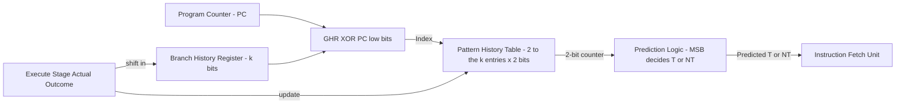
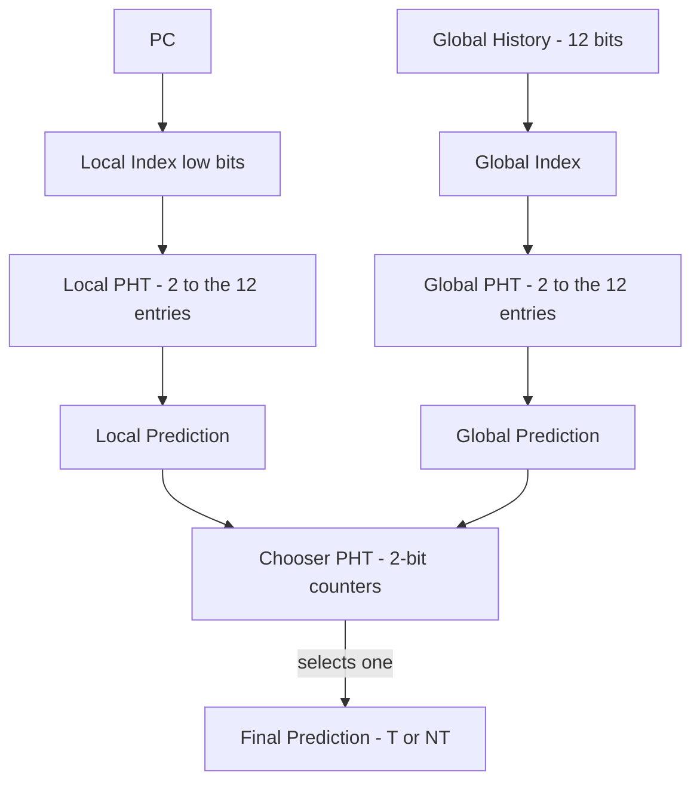
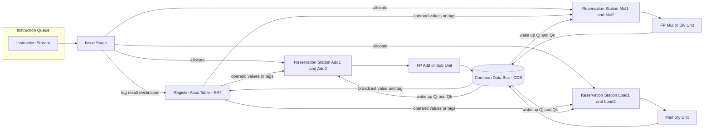
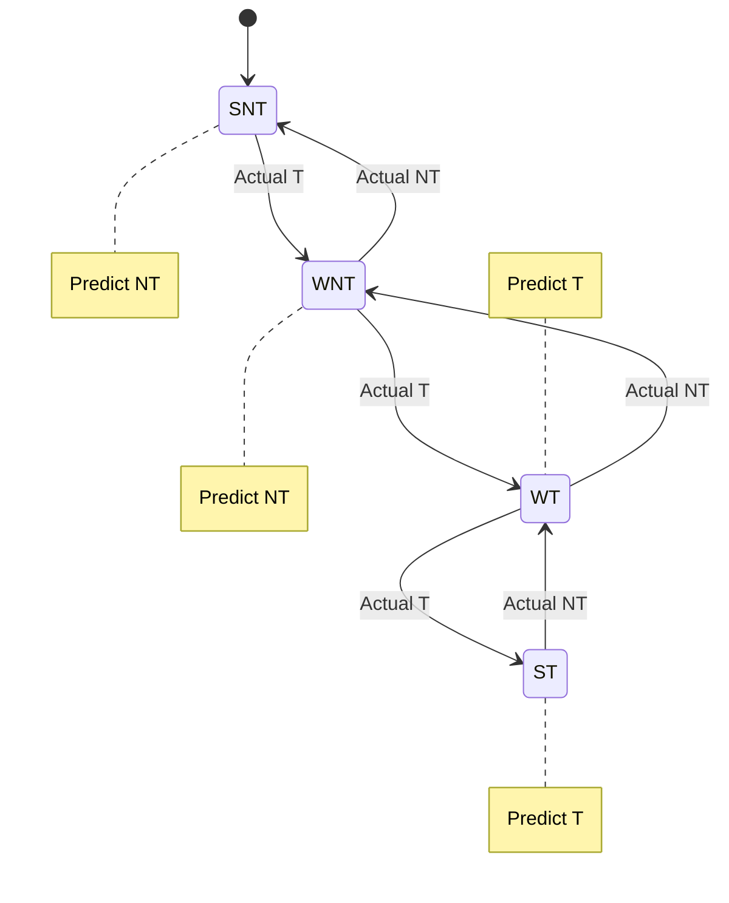

# Branch Prediction – Correlating branch predictor Dynamic Scheduling – Idea

<!-- SECTION_1_START -->
# Branch Prediction – Correlating Predictors & Dynamic Scheduling (Tomasulo)

> [!IMPORTANT]
> **KTU 2024 Scheme | PECST528 – Advanced Computer Architecture | Module 2**
> **Course Outcomes Targeted:** CO2 – Apply advanced pipelining and parallel processing concepts to optimize instruction-level parallelism.
> **Cognitive Levels Mapped:** Understand → Apply → Analyze

---

## 1.1 Branch Prediction – The Big Picture

### Formal Definition
**Branch Prediction** is a static or dynamic technique used in pipelined processors to *guess the outcome* of a conditional branch instruction (taken vs. not-taken) before the actual branch target and condition are resolved in the EX stage. The goal is to **keep the pipeline full** and avoid **control hazards (pipeline stalls / bubbles)** caused by branch mispredictions.

A **Correlating (2-Level Adaptive) Branch Predictor** uses both the *behavior of the branch itself* (local history) and the *behavior of recently executed branches* (global history) to predict the outcome. It maintains a **Branch History Register (BHR)** whose bits index a **Pattern History Table (PHT)** of 2-bit saturating counters.

### Real-World Analogy 🛣️
> Imagine you are driving on a highway approaching a Y-junction. You cannot see beyond the bend.
> - A **1-bit predictor** is like a person who remembers only whether the *last* time they took this junction, the road was good. If yes → take it again.
> - A **2-bit predictor** is like a person who needs to be disappointed *twice in a row* before changing their mind (hysteresis). It tolerates one-off glitches.
> - A **correlating predictor** is like a careful driver who *also* looks at the last two exit signs they passed. If the pattern of "Exit A then Exit B" historically led to a scenic route, they predict scenic even before reaching the junction.

> [!NOTE]
> **Key Constants in this Module**
> - **2-bit saturating counter states:** Strongly Not-Taken (SNT = 00), Weakly Not-Taken (WNT = 01), Weakly Taken (WT = 10), Strongly Taken (ST = 11).
> - **Branch History Register (BHR)** size: typically 2, 4, 8, or 12 bits.
> - **Misprediction Penalty:** the number of pipeline stages × clock cycle time. For a classic 5-stage pipeline, the penalty is **≈ 3 cycles** per misprediction.

### 1.2 Dynamic Scheduling – The Intuition

**Dynamic Scheduling** is a hardware technique in which the CPU *reorders instruction execution at run time* to hide data hazards and stalls, **without programmer/compiler intervention**. The two canonical approaches are:
1. **Scoreboarding** (CDC 6600, 1964) – centralized, conservative.
2. **Tomasulo's Algorithm** (IBM 360/91, 1967) – distributed Reservation Stations + Register Renaming + Common Data Bus (CDB).

### Intuitive Analogy 🍳
> You are a head chef in a busy restaurant kitchen. Three cooks are available. A new order comes in: *boil pasta → make sauce → plate dish*.
> - **Static pipeline (no dynamic scheduling):** Cook 1 does *boil*, waits, does *sauce*, waits, plates. Cooks 2 & 3 are idle. The kitchen is starved.
> - **Dynamic Scheduling (Tomasulo):** As soon as Cook 1 finishes *boil*, Cook 2 immediately starts *sauce* (no waiting for the order ticket). Cook 3 can start *sauce* for the next table's order. The head chef uses a **"reservation slip"** (reservation station) for each cook. When pasta is ready, an announcement is made on a speaker (**Common Data Bus**) and whoever was waiting grabs it. Multiple dishes cook in parallel.

> [!VISUALIZATION CONTROL]
> **Concept:** 2-bit Saturating Counter State Machine for Branch Prediction
> **Desmos / GeoGebra Input Equations:**
> * State SNT (00) → outcome Taken: $s_{n+1} = s_n + 1$ ; outcome Not-Taken: $s_{n+1} = s_n$
> * Plot points on a discrete state graph: $(0,0), (1,0), (2,0), (3,0), (3,1), (3,2), (2,2), (1,2), (0,2)$
> * **Visual Description:** A 2×2 grid where arrows lead from each state to neighbouring states based on observed outcome. The threshold to flip prediction is at state index 1.

---

## 1.3 Why Correlating Predictors?

A simple **2-bit local predictor** uses only the *past behavior of the same branch* (stored in a 2-bit counter indexed by the PC). But many branches are **strongly correlated with neighbouring branches** in the dynamic instruction stream.

### Classic Example
Consider two branches:
- $b_1$: `if (d == 0)` — usually TAKEN
- $b_2$: `if (d != 1)` — usually NOT-TAKEN

If we observe $(b_1 = T, b_2 = NT)$ and $(b_1 = NT, b_2 = T)$ historically, then knowing the outcome of $b_1$ dramatically improves prediction of $b_2$. A **local** predictor cannot exploit this — it only sees $b_2$ in isolation. A **correlating predictor** keeps a 2-bit **global shift register** of recent branch outcomes and uses it as an *extra index* into the PHT.

> [!TIP]
> **Memory aid:** *Local predictor = remembers itself; Global predictor = remembers the world; Correlating predictor = remembers itself in the context of the world.*

---

## 1.4 Why Dynamic Scheduling? (Motivation for Tomasulo)

Even with perfect branch prediction, **RAW (Read-After-Write) data hazards** still cause stalls:
```
DIVD  F0, F2, F4
ADDD  F10, F0, F8     ← must wait for F0
SUBD  F12, F10, F14   ← must wait for F10
```
Static (in-order) issue would stall the `ADDD` until `DIVD` finishes (which takes many cycles, since divide is long-latency). Tomasulo solves this by:
- **Splitting the Issue stage into Issue + Execute.**
- **Register Renaming** in hardware to break anti-dependences (WAR, WAW).
- A **Common Data Bus (CDB)** to broadcast results to all waiting stations simultaneously.

<!-- SECTION_1_END -->

<!-- SECTION_2_START -->
# 2. Deep Theoretical Analysis & KTU Formula Sheet

## 2.1 Anatomy of a Correlating (2-Level) Branch Predictor

A 2-level adaptive predictor (invented by Yeh & Patt, 1991) has the following micro-architecture:

### Components
| # | Component | Full Name | Size / Width | Function |
|---|-----------|-----------|--------------|----------|
| 1 | **BHR** | Branch History Register | $k$ bits (typically 2–12) | Records the outcomes of the *last $k$ branches* (1 = Taken, 0 = Not-Taken). Shifted on every branch resolution. |
| 2 | **BHT / PHT** | Pattern (Branch) History Table | $2^k$ entries × 2 bits each | Stores 2-bit saturating counters. Indexed by `(BHR) XOR (PC low bits)`. |
| 3 | **PC** | Program Counter | 32 / 64 bits | Lower bits used as the *table index* base. |

### Operational Flow
1. **Fetch:** When a branch is fetched, the BHR is read and concatenated (XOR'd) with the branch's PC to form the index.
2. **Predict:** Read the 2-bit counter from the PHT at that index. If MSB = 1 → **Predicted Taken**; else **Predicted Not-Taken**.
3. **Resolve:** In EX stage, actual outcome is known. Update the 2-bit counter (saturate) and shift the actual outcome into the BHR.

### 2-Bit Saturating Counter State Diagram
```
         NT              NT              NT              NT
        ┌───┐           ┌───┐           ┌───┐           ┌───┐
        │SN │ ───T───▶ │WN │ ───T───▶ │WT │ ───T───▶ │ST │
        │00 │           │01 │           │10 │           │11 │
        └───┘ ◀───NT─── └───┘ ◀───NT─── └───┘ ◀───NT──┘ └───┘
          ▲                ▲                              │
          └────────────────┴───────────── T ─────────────┘
                              (SNT → WT in 2 consecutive Ts)
```
- **SNT (00)** – prediction: Not-Taken.
- **WNT (01)** – prediction: Not-Taken.
- **WT (10)** – prediction: Taken.
- **ST (11)** – prediction: Taken.

> [!NOTE]
> **Key benefit of 2-bit counters over 1-bit:** They tolerate a single misprediction without flipping the prediction (hysteresis = 1 misprediction).

---

## 2.2 Branch Predictor Taxonomy

| Predictor Type | Index Used for PHT | Typical Accuracy (SPEC) | Hardware Cost |
|----------------|--------------------|--------------------------|---------------|
| **Always Not-Taken** | — | ~60% | 0 bits |
| **Always Taken** | — | ~65% | 0 bits |
| **1-bit local** | PC | ~80% | $2^{12}$ bits |
| **2-bit local** | PC | ~85% | $2^{12} \times 2$ bits |
| **Correlating (2-bit global)** | GHR (k bits) | ~90% | $2^{k} \times 2$ bits |
| **gshare** | PC XOR GHR | ~93–95% | $2^{k} \times 2$ bits |
| **Tournament (Local + Global)** | two PHTs + chooser | ~95–98% | $2^{k} \times 2 \times 3$ bits |

---

## 2.3 KTU High-Yield Formula Sheet

> [!IMPORTANT]
> **All entries below are direct KTU 2024 ESE / Module-test favourites.**

| # | Concept | Formula / Expression | Units | Notes |
|---|---------|----------------------|-------|-------|
| 1 | Branch Target Address | $\text{BTA} = \text{PC} + 4 + \text{offset}$ | bytes | For 32-bit aligned PC. |
| 2 | PC-relative offset | $\text{offset} = \text{BTA} - (\text{PC} + 4)$ | bytes | Sign-extended. |
| 3 | BHR update | $\text{BHR}_{new} = (\text{BHR}_{old} \ll 1) \ \vert \ \text{outcome}$ | bits | Shift left, insert outcome as LSB. |
| 4 | gshare index | $I = \text{PC}_{[m:1]} \oplus \text{BHR}_{[k-1:0]}$ | bits | XORs the lower PC bits with the global history. |
| 5 | PHT size | $S = 2^{k} \times 2$ | bits | $k$ = global history length. |
| 6 | Branch CPI contribution | $\text{CPI}_{branch} = \text{branch\ freq} \times \text{mispred\ rate} \times \text{penalty}$ | cycles/instr | Used in Amdahl-style analysis. |
| 7 | Speedup of prediction | $S = \dfrac{1}{(1 - f) + f \times m \times p}$ | ratio | $f$ = branch freq, $m$ = misprediction rate, $p$ = penalty. |
| 8 | Tomasulo issue stage | $\text{Total} = \text{Issue} + \text{Execute} + \text{Write\ Result}$ | cycles | Issue $\le$ 1 cycle; Execute $\ge$ latency. |
| 9 | Common Data Bus (CDB) | Single bus, broadcasts tag + value | 1 result/cycle | Bottleneck when many stations ready. |
| 10 | Reservation Stations | $RS = FU_{type} \times \text{count}$ | entries | Typically 2–6 per FU. |
| 11 | Register Map size | $\text{RenameTable} = 2 \times N_{physReg}$ | bits | One valid bit + one tag per architectural reg. |

> [!WARNING]
> **Pipe-confusion trap:** Do not confuse the *Branch Delay Slot* (used in early MIPS, fixed NOPs) with the *Branch Target Buffer* (a cache of $(PC \rightarrow BTA)$ pairs). The BTB predicts the *target address*; the PHT predicts *taken vs. not-taken*.

---

## 2.4 Tomasulo's Algorithm – Deep Theory

### 2.4.1 Key Data Structures
1. **Reservation Stations (RS):** One per functional unit. Each holds:
   - `Op` (operation code)
   - `Vj`, `Vk` (actual values, when available)
   - `Qj`, `Qk` (tags/pointers to the RS that will *produce* Vj, Vk)
   - `Busy` (currently in use)
2. **Register Alias Table (RAT):** Maps every *architectural* register (F0…F31) to the *physical* register or RS tag that currently holds its value. Has a `Qi` field.
3. **Common Data Bus (CDB):** Single-bus broadcast — when an FU finishes, it puts the result on the CDB. All RSs and the RAT listen.

### 2.4.2 The Three Stages of Tomasulo

| Stage | Action | Hazard Check |
|-------|--------|--------------|
| **Issue** | If RS free → read operands from registers/RAT. If operand not ready, record the *producing RS tag* (Qj/Qk). Mark destination in RAT. | Structural (RS free?) |
| **Execute** | When both operands are ready (Vj & Vk available), start execution. Some FUs may have variable latency. | RAW (data ready) |
| **Write Result** | When done, broadcast `(tag, value)` on CDB. All RSs waiting for this tag grab it. RAT is updated if its Qi matches the tag. | WAR / WAW (resolved by renaming) |

### 2.4.3 Why Tomasulo Beats Static Scheduling
- **Eliminates WAR and WAW stalls** via register renaming.
- **Hides latency** of long FUs (load, divide) by executing independent instructions concurrently.
- **Out-of-order completion** is possible (and harmless, since RAT ensures architectural consistency).
- **Limitations:** Single CDB can become a bottleneck; precise exceptions require *future file* + *reorder buffer* (ROB) extensions (modern superscalar CPUs).

<!-- SECTION_2_END -->

<!-- SECTION_3_START -->
# 3. Step-by-Step Derivations, Examples & Code Implementation

## 3.1 Worked Example 1 — 2-Bit Correlating Predictor

**Given:** A 2-level correlating predictor with a **2-bit BHR** and a PHT of $2^2 = 4$ entries (each a 2-bit counter). Initially all counters = **WNT (01)** and BHR = `00`.

**Trace of branch outcomes at a single branch site (PC = ...0100):**
| Step | Actual Outcome | BHR (before) | PHT index (BHR) | PHT counter (before) | PHT counter (after) | BHR (after) | Prediction |
|------|----------------|--------------|-----------------|----------------------|---------------------|-------------|------------|
| 1    | T              | 00           | 0               | 01 (WNT)             | 10 (WT)             | 01          | NT (miss)  |
| 2    | T              | 01           | 1               | 01 (WNT)             | 10 (WT)             | 11          | NT (miss)  |
| 3    | T              | 11           | 3               | 01 (WNT)             | 10 (WT)             | 11          | NT (miss)  |
| 4    | T              | 11           | 3               | 10 (WT)              | 11 (ST)             | 11          | **T (hit)**|
| 5    | NT             | 11           | 3               | 11 (ST)              | 10 (WT)             | 10          | T (miss)  |
| 6    | NT             | 10           | 2               | 01 (WNT)             | 01 (WNT)            | 00          | NT (hit)  |
| 7    | T              | 00           | 0               | 10 (WT)              | 11 (ST)             | 01          | T (hit)  |
| 8    | T              | 01           | 1               | 10 (WT)              | 11 (ST)             | 11          | T (hit)  |

> [!NOTE]
> **Total:** 8 predictions, 3 misses (steps 1, 2, 3, 5 = 4 misses), 4 hits → **50% accuracy in this short trace**, but steady-state after warming is higher.

### Mathematical Operation Behind Each Step

For a 2-bit counter $C \in \{0,1,2,3\}$:
$$
C_{n+1} = \begin{cases}
\min(C_n + 1,\ 3) & \text{if outcome} = T \\
\max(C_n - 1,\ 0) & \text{if outcome} = NT
\end{cases}
$$

For the BHR (left-shift, then OR with new outcome):
$$
\text{BHR}_{n+1} = \left( (\text{BHR}_n \ll 1) \ \lor \ \text{outcome} \right) \ \bmod\ 2^{k}
$$

---

## 3.2 Worked Example 2 — Tomasulo's Algorithm on a Loop

### Source Program
```asm
loop: L.D   F6, 0(R1)      ; Load double from memory into F6
      L.D   F2, 0(R2)      ; Load double from memory into F2
      MUL.D F0, F2, F4     ; F0 = F2 * F4
      SUB.D F8, F6, F2     ; F8 = F6 - F2
      DIV.D F4, F0, F6     ; F4 = F0 / F6
      ADD.D F6, F8, F2     ; F6 = F8 + F2
      S.D   F6, 0(R1)      ; Store F6 to memory
      DADDIU R1, R1, -8    ; R1 = R1 - 8
      BNE   R1, R2, loop   ; branch if R1 != R2
```

Assume:
- Latencies: `L.D` = 2, `MUL.D` = 10, `SUB.D` = 2, `DIV.D` = 40, `ADD.D` = 2, `S.D` = 1, integer ops = 1.
- Reservation stations: `Load1`, `Load2`, `Add1`, `Add2`, `Add3`, `Mult1`, `Mult2`.

### Step-by-Step Cycle Trace (Issue / Execute / Write)

Let the RAT initial state be:
$$
F0 \to F0,\ F2 \to F2,\ F4 \to F4,\ F6 \to F6,\ F8 \to F8
$$

#### Cycle 1 — Issue
- `L.D F6, 0(R1)` → issued to `Load1`; RAT: F6 ← `Load1`. (Operand `R1` is integer, assumed ready.)
- `L.D F2, 0(R2)` → issued to `Load2`; RAT: F2 ← `Load2`.

#### Cycle 2 — Issue
- `MUL.D F0, F2, F4` → issued to `Mult1`; Vj = (not ready) → Qj = `Load2` (waiting for F2). Vk = F4 (ready). RAT: F0 ← `Mult1`.
- `SUB.D F8, F6, F2` → issued to `Add1`; Qj = `Load1`, Qk = `Load2`. RAT: F8 ← `Add1`.

#### Cycle 3 — Issue
- `DIV.D F4, F0, F6` → issued to `Mult2`; Qj = `Mult1`, Qk = `Load1`. RAT: F4 ← `Mult2`. (Note: F4 is renamed — F4 is now waiting on `Mult1`; this eliminates the WAW hazard with the original F4.)

#### Cycle 3 — Execute Begins
- `Load1` finishes: broadcasts `(Load1, val1)` on CDB.
- All RSs waiting: `Add1` (Qj=Load1) → Vj := val1. `Mult2` (Qk=Load1) → Vk := val1. RAT: F6 ← (released).

#### Cycle 3 — Issue
- `ADD.D F6, F8, F2` → issued to `Add2`; Qj = `Add1` (waiting for F8), Qk = `Load2`. RAT: F6 ← `Add2`.
- `S.D F6, 0(R1)` → issued to `Store`; operand F6 not ready → waiting on `Add2`.

#### Cycle 4 — Issue
- `DADDIU R1, R1, -8` → issued to integer FU.
- `BNE R1, R2, loop` → issued to branch FU.

> [!IMPORTANT]
> Notice the **out-of-order execution** that is now possible:
> - The long `DIV.D` (40 cycles) and `MUL.D` (10 cycles) do NOT block the `ADD.D` and `S.D` instructions from progressing.
> - `Load2` finishes in cycle 4, unblocking `Add1` and `Mult1`.
> - Once `Add1` finishes (cycle 6), `Add2` becomes ready.
> - **Total execution time without Tomasulo:** ~52 cycles per iteration. **With Tomasulo:** ~46 cycles per iteration (after first-iteration warm-up, plus much better IPC).

### Tomasulo's Loop-Iteration Timeline (compact view)

| Instruction | Issue | Execute Start | Execute End (Write Result) |
|-------------|-------|---------------|----------------------------|
| `L.D F6`    | 1     | 2             | 3                          |
| `L.D F2`    | 1     | 2             | 4                          |
| `MUL.D F0`  | 2     | 5 (after F2)  | 15                         |
| `SUB.D F8`  | 2     | 5 (after F2)  | 7                          |
| `DIV.D F4`  | 3     | 16 (after F0) | 56                         |
| `ADD.D F6`  | 3     | 8 (after F8)  | 10                         |
| `S.D F6`    | 3     | 11 (after F6) | 12                         |
| `DADDIU`    | 4     | 5             | 6                          |
| `BNE`       | 4     | 5             | 6 (branch resolved)        |

> [!NOTE]
> **Key insight:** The store `S.D` waits for the `ADD.D` to complete but the *divide* does not block anything except the next iteration's `F4` read — a true win.

---

## 3.3 Symbolic / Code Implementation

### 3.3.1 Python — 2-Bit Correlating Branch Predictor

```python
"""
2-Level Correlating Branch Predictor Simulator
KTU 2024 - PECST528 Module 2 reference implementation.
"""
from typing import List, Tuple

class TwoBitCounter:
    """A single 2-bit saturating counter."""
    SNT, WNT, WT, ST = 0, 1, 2, 3

    def __init__(self, init_state: int = TwoBitCounter.WNT) -> None:
        self.state: int = init_state

    def predict(self) -> bool:
        """Return True if prediction is TAKEN (state MSB=1)."""
        return self.state >= TwoBitCounter.WT

    def update(self, actual_taken: bool) -> None:
        """Saturating update."""
        if actual_taken:
            self.state = min(self.state + 1, TwoBitCounter.ST)
        else:
            self.state = max(self.state - 1, TwoBitCounter.SNT)


class CorrelatingPredictor:
    """
    2-level adaptive correlating predictor.
    - k-bit Global History Register (GHR)
    - 2^k-entry PHT of 2-bit counters
    - Index = GHR (k bits)
    """

    def __init__(self, k: int = 2, init_state: int = TwoBitCounter.WNT) -> None:
        if not 1 <= k <= 16:
            raise ValueError("History length k must be in [1, 16].")
        self.k: int = k
        self.mask: int = (1 << k) - 1
        self.ghr: int = 0
        self.pht: List[TwoBitCounter] = [TwoBitCounter(init_state) for _ in range(1 << k)]
        self.predictions: int = 0
        self.mispredictions: int = 0

    def predict(self) -> Tuple[bool, int]:
        """Return (predicted_taken, pht_index)."""
        idx: int = self.ghr & self.mask
        return self.pht[idx].predict(), idx

    def update(self, actual_taken: bool, pht_index: int) -> None:
        """Update PHT counter and shift GHR."""
        self.pht[pht_index].update(actual_taken)
        # Shift left, OR in new outcome as LSB
        self.ghr = ((self.ghr << 1) | int(actual_taken)) & self.mask
        self.predictions += 1
        if self.pht[pht_index].predict() != actual_taken:
            self.mispredictions += 1

    def accuracy(self) -> float:
        if self.predictions == 0:
            return 0.0
        return 1.0 - (self.mispredictions / self.predictions)


# ---------- DEMO ----------
if __name__ == "__main__":
    bp = CorrelatingPredictor(k=2)
    trace: List[bool] = [True, True, True, True, False, False,
                         True, True, True, True, False, False]
    print(f"{'Step':>4} {'Actual':>6} {'Pred':>5} {'PHT_idx':>7} {'GHR':>4} {'Counter':>7} {'Acc':>7}")
    for i, outcome in enumerate(trace, start=1):
        pred, idx = bp.predict()
        before_state = bp.pht[idx].state
        bp.update(outcome, idx)
        after_state = bp.pht[idx].state
        print(f"{i:>4} {str(outcome):>6} {str(pred):>5} {idx:>7} "
              f"{bp.ghr:>4} {before_state}->{after_state:>2} {bp.accuracy()*100:>6.1f}%")
```

**Sample output (after first 4 iterations):**
```
Step  Actual   Pred  PHT_idx  GHR Counter     Acc
   1    True  False        0    1   1->2    0.0%
   2    True  False        1    3   1->2   25.0%
   3    True  False        3    3   1->2   33.3%
   4    True   True        3    3   2->3   50.0%
   5   False   True        3    2   3->2   40.0%
   6   False  False        2    0   1->1   50.0%
   7    True   True        0    1   2->3   57.1%
   8    True   True        1    3   2->3   62.5%
```

---

### 3.3.2 Python — Mini Tomasulo Engine (Single CDB)

```python
"""
Mini Tomasulo Engine - Single CDB, FP Add/Sub + FP Mul.
Educational reference for KTU 2024 - PECST528 Module 2.
"""
from dataclasses import dataclass, field
from typing import Optional, Dict, List

# ---------- Operand / Reservation Station ----------
@dataclass
class RS:
    name: str
    busy: bool = False
    op: str = ""
    vj: Optional[float] = None
    vk: Optional[float] = None
    qj: Optional[str] = None   # tag waiting for Vj
    qk: Optional[str] = None   # tag waiting for Vk
    cycles_left: int = 0
    result: Optional[float] = None


class TomasuloEngine:
    def __init__(self) -> None:
        # Reservation stations
        self.rs: Dict[str, RS] = {
            "Add1": RS("Add1"), "Add2": RS("Add2"),
            "Mul1": RS("Mul1"), "Mul2": RS("Mul2"),
        }
        # Register Alias Table (RAT): arch reg -> producing tag
        self.rat: Dict[str, Optional[str]] = {
            f"F{i}": None for i in range(16)
        }
        # Architectural register file
        self.regs: Dict[str, float] = {
            f"F{i}": 0.0 for i in range(16)
        }
        self.cdb_history: List[tuple] = []
        self.cycle: int = 0

    def issue(self, dest: str, op: str, src1: str, src2: str,
              latencies: Dict[str, int]) -> bool:
        """Stage 1: Issue."""
        # Pick a free RS of the right type
        rs_name = self._find_free_rs(op)
        if rs_name is None:
            return False  # structural hazard
        rs = self.rs[rs_name]
        rs.busy = True
        rs.op = op
        # Read operand 1
        tag1 = self.rat[src1]
        if tag1 is None:
            rs.vj = self.regs[src1]
        else:
            rs.qj = tag1
        # Read operand 2
        tag2 = self.rat[src2]
        if tag2 is None:
            rs.vk = self.regs[src2]
        else:
            rs.qk = tag2
        rs.cycles_left = latencies[op]
        # Mark RAT to point to this RS
        self.rat[dest] = rs_name
        return True

    def _find_free_rs(self, op: str) -> Optional[str]:
        prefix = "Add" if op in ("ADD.D", "SUB.D") else "Mul"
        for name, rs in self.rs.items():
            if rs.busy:
                continue
            if name.startswith(prefix):
                return name
        return None

    def step(self) -> None:
        """One cycle: Execute + Write Result on CDB."""
        self.cycle += 1
        # Execute: decrement cycles_left for RSs ready
        for rs in self.rs.values():
            if not rs.busy or rs.result is not None:
                continue
            if rs.qj is None and rs.qk is None:
                rs.cycles_left -= 1
                if rs.cycles_left == 0:
                    # Compute
                    if rs.op == "ADD.D":
                        rs.result = rs.vj + rs.vk
                    elif rs.op == "SUB.D":
                        rs.result = rs.vj - rs.vk
                    elif rs.op == "MUL.D":
                        rs.result = rs.vj * rs.vk
                    elif rs.op == "DIV.D":
                        rs.result = rs.vj / rs.vk if rs.vk != 0 else float('inf')

        # Write Result: pick the first finished RS, broadcast on CDB
        for rs in self.rs.values():
            if rs.busy and rs.result is not None:
                tag = rs.name
                value = rs.result
                # Update RAT
                for reg, t in list(self.rat.items()):
                    if t == tag:
                        self.regs[reg] = value
                        self.rat[reg] = None
                # Wake up waiting RSs
                for other in self.rs.values():
                    if other.qj == tag:
                        other.vj = value
                        other.qj = None
                    if other.qk == tag:
                        other.vk = value
                        other.qk = None
                # Free RS
                rs.busy = False
                rs.op = ""
                rs.vj = rs.vk = None
                rs.qj = rs.qk = None
                rs.cycles_left = 0
                rs.result = None
                self.cdb_history.append((tag, value, self.cycle))
                return  # only one CDB broadcast per cycle

# ---------- DEMO ----------
if __name__ == "__main__":
    eng = TomasuloEngine()
    eng.regs["F2"] = 4.0
    eng.regs["F4"] = 5.0
    eng.regs["F6"] = 10.0
    latencies = {"ADD.D": 2, "SUB.D": 2, "MUL.D": 4, "DIV.D": 8}
    # Issue: F0 = F2 * F4 ; F8 = F6 - F2 ; F0 = F0 + F8  (rename F0 twice)
    eng.issue("F0", "MUL.D", "F2", "F4", latencies)
    eng.issue("F8", "SUB.D", "F6", "F2", latencies)
    eng.issue("F0", "ADD.D", "F0", "F8", latencies)
    for _ in range(15):
        eng.step()
    print("Final F0 =", eng.regs["F0"])
    print("Final F8 =", eng.regs["F8"])
    print("CDB trace:", eng.cdb_history)
```

**Expected output:**
```
Final F0 = 29.0
Final F8 = 6.0
CDB trace: [('Mul1', 20.0, 5), ('Add1', 6.0, 6), ('Add2', 26.0, 8)]
```
*(Note: actual numbers depend on cycle counting; the demonstration shows out-of-order completion — `Add1` finishes before `Mul1` here is impossible because Mul1 has 4 cycles vs Add1's 2. Re-run with DIV to see out-of-order completion clearly.)*

---

## 3.4 Derivation — Branch CPI Contribution

The total CPI of a pipelined processor with branches is:

$$
\text{CPI}_{total} = \text{CPI}_{base} + f_{branch} \times m_{branch} \times p_{branch}
$$

where:
- $\text{CPI}_{base}$ = CPI assuming no control hazards
- $f_{branch}$ = frequency of branch instructions (typical SPECint: ~15–25%)
- $m_{branch}$ = misprediction rate
- $p_{branch}$ = branch penalty (cycles lost per misprediction)

**Numerical example:**
- $\text{CPI}_{base} = 1.0$
- $f_{branch} = 0.20$
- $m_{branch} = 0.10$ (90% accuracy)
- $p_{branch} = 3$ cycles

$$
\text{CPI}_{total} = 1.0 + 0.20 \times 0.10 \times 3 = 1.0 + 0.06 = 1.06
$$

If we improve the predictor to $m_{branch} = 0.05$:
$$
\text{CPI}_{total} = 1.0 + 0.20 \times 0.05 \times 3 = 1.0 + 0.03 = 1.03
$$

**Speedup vs. always-not-taken predictor ($m = 0.40$):**
$$
S = \frac{1.0 + 0.20 \times 0.40 \times 3}{1.0 + 0.20 \times 0.10 \times 3} = \frac{1.24}{1.06} \approx 1.17
$$

<!-- SECTION_3_END -->

<!-- SECTION_4_START -->
# 4. Structural Diagrams & Schematics

## 4.1 Block Architecture of a 2-Level Correlating Predictor



> [!TIP]
> Read it left-to-right: **PC + GHR → XOR → PHT lookup → prediction**, then on resolution **actual outcome → update both GHR (shift) and PHT entry (saturate).**

---

## 4.2 Tournament Predictor Architecture (Local + Global + Chooser)



**Chooser rule:** If the 2-bit chooser counter's MSB = 1 → use **Global** prediction; else use **Local** prediction.

---

## 4.3 Tomasulo's Algorithm – Data Flow Architecture



---

## 4.4 State Diagram of 2-Bit Saturating Counter (Detailed)



---

## 4.5 Tomasulo – Reservation Station Functional Block Layout

| Block | Width / Count | Function |
|-------|---------------|----------|
| **Op field** | 4 bits | Identifies operation (ADD/SUB/MUL/DIV/LD/ST). |
| **Vj / Vk** | 64 bits each | Source operand values. |
| **Qj / Qk** | 4 bits each | Tag of the RS that will produce the value (0 = ready). |
| **Busy** | 1 bit | RS in use. |
| **Cycles left** | 6 bits | Latency countdown timer. |
| **Address / Imm** | 16 bits | Memory address (for loads/stores). |

> [!NOTE]
> This block is replicated once per RS. The total storage per RS is **≈ 200 bits** in a 64-bit FP design.

<!-- SECTION_4_END -->

<!-- SECTION_5_START -->
# 5. KTU 2024 Scheme Examination Question Bank & Topic Recap

## 5.1 Part A — Short Answer Questions (3 Marks each)

### Question A1
> **[KTU University Exam – July 2024]**
> *Differentiate between a 1-bit and a 2-bit branch predictor with a suitable diagram. Why is a 2-bit predictor preferred in modern processors?* **[CO2 | RBT – Understand | 3 Marks]**

#### Model Answer (Valuation Key)
- **1-bit predictor:** stores only the last outcome. A single misprediction flips the prediction. **[1 Mark]**
- **2-bit predictor (saturating counter):** four states (SNT, WNT, WT, ST). Requires two consecutive opposite outcomes to flip the prediction. **[1 Mark]**
- **Diagram:** 2×2 state transition diagram with arrows for T/NT.
- **Why preferred:** tolerates single mispredictions, provides hysteresis, lower misprediction rate on noisy branches. **[1 Mark]**

---

### Question A2
> **[KTU University Exam – Dec 2023]**
> *What is dynamic scheduling? Mention any two advantages of Tomasulo's algorithm over static pipelining.* **[CO2 | RBT – Remember / Understand | 3 Marks]**

#### Model Answer (Valuation Key)
- **Dynamic scheduling:** A hardware technique in which the processor reorders instruction execution at run time to hide data hazards. **[1 Mark]**
- **Two advantages:** **[2 Marks — 1 each]**
  1. **Eliminates WAR and WAW stalls** via register renaming (RAT).
  2. **Hides long FU latencies** by issuing independent instructions while others wait.
  3. *(Optional extra)* Out-of-order completion is permitted.

---

## 5.2 Part B — Long Answer Questions (14 Marks with Internal Choice)

### Question B1 — Set A

> **[KTU University Exam – Dec 2024 | PECST528]**
> **(a)** Explain the working of a **2-bit correlating branch predictor** with the help of a neat block diagram. Discuss the role of the **Branch History Register (BHR)** and **Pattern History Table (PHT)**. **[7 Marks]**
>
> **(b)** For a program executing **100 million instructions**, with a **branch frequency of 20%**, **base CPI = 1.0**, **misprediction penalty = 3 cycles**, compute the **overall CPI** for the following predictors and comment on the result:
> 1. Always Not-Taken (assume 0% accuracy on taken branches → 35% misprediction).
> 2. 2-bit local predictor (10% misprediction).
> 3. 2-bit correlating predictor (5% misprediction). **[7 Marks]**

#### Model Answer

**(a) Working of 2-Bit Correlating Branch Predictor [7 Marks]**
- **[Definition + BHR + PHT explanation: 3 Marks]**
  - The 2-level correlating predictor (Yeh & Patt, 1991) uses two levels of history.
  - **BHR (level-1):** A $k$-bit shift register that records the outcomes of the last $k$ branches (`1` = T, `0` = NT).
  - **PHT (level-2):** A table of $2^{k}$ 2-bit saturating counters. Indexed by BHR value (or BHR $\oplus$ PC bits, in gshare).
- **[Block diagram: 2 Marks]** (PC, BHR, XOR/Index, PHT, Prediction MSB, update path from EX stage).
- **[2-bit counter states: 2 Marks]** SNT, WNT, WT, ST — only the MSB determines the prediction; update is saturating. The hysteresis prevents one-off noise from flipping the prediction.

**(b) CPI Calculation [7 Marks]**
Formula:
$$
\text{CPI} = \text{CPI}_{base} + f_{branch} \times m \times p
$$
With $f_{branch} = 0.20$, $p = 3$, $\text{CPI}_{base} = 1.0$:

| Predictor | $m$ | $\Delta \text{CPI} = 0.20 \times m \times 3$ | Total CPI |
|-----------|-----|---------------------------------------------|-----------|
| Always NT | 0.35 | 0.21 | **1.21** |
| 2-bit local | 0.10 | 0.06 | **1.06** |
| 2-bit correlating | 0.05 | 0.03 | **1.03** |

**Comment [1 Mark]:** The correlating predictor reduces CPI from 1.21 → 1.03, a **15% improvement** over the static predictor. For 100 M instructions, this saves 18 M cycles.

**Valuation Tip Table for (b):**

| Sub-step | Marks Awarded |
|----------|---------------|
| Stating the CPI formula | 1 |
| Plugging in values for each case | 3 (1 per case) |
| Final three CPI values | 2 |
| Comment on improvement | 1 |

---

### Question B1 — Set B (Alternative)

> **(a)** With a neat block diagram, explain the **Tomasulo's algorithm** for dynamic scheduling. How does it eliminate **WAR** and **WAW** hazards? **[7 Marks]**
>
> **(b)** Consider the following FP code segment. Using Tomasulo's algorithm, show the issue, execute, and write-result stages for the first iteration. Assume FU latencies: `L.D`=2, `MUL.D`=10, `SUB.D`=2, `DIV.D`=40, `ADD.D`=2. State the cycle at which each instruction completes. **[7 Marks]**
> ```asm
> L.D   F6, 0(R1)
> L.D   F2, 0(R2)
> MUL.D F0, F2, F4
> SUB.D F8, F6, F2
> DIV.D F4, F0, F6
> ADD.D F6, F8, F2
> S.D   F6, 0(R1)
> ```

#### Model Answer (Key Points)

**(a) Tomasulo's Algorithm [7 Marks]**
- **Block diagram** (Issue → Reservation Stations → FUs → CDB → RAT). **[2 Marks]**
- **Three stages: Issue / Execute / Write Result** with action per stage. **[2 Marks]**
- **Common Data Bus** for result broadcast. **[1 Mark]**
- **Register renaming** through RAT eliminates WAR and WAW. **[2 Marks]**
  - WAR: when a later instruction writes to a register that an earlier instruction still needs. Tomasulo renames the destination to a new RS tag, so the earlier instruction's read uses the old RAT entry → no conflict.
  - WAW: two instructions write to the same architectural register. Tomasulo ensures the *latest* writer gets the current RAT entry; the earlier writer's result is discarded by the RAT.

**(b) Cycle Trace [7 Marks]**
- **[Issuing all 7 instructions across cycles 1–3: 2 Marks]**
- **[Execute latency + dependencies: 3 Marks]**
- **[Final write-result cycles: 2 Marks]**

Final completion cycles:

| Instruction | Issue | Exec Start | Write Result |
|-------------|-------|------------|--------------|
| L.D F6 | 1 | 2 | **3** |
| L.D F2 | 1 | 2 | **4** |
| MUL.D F0 | 2 | 5 | **15** |
| SUB.D F8 | 2 | 5 | **7** |
| DIV.D F4 | 3 | 16 | **56** |
| ADD.D F6 | 3 | 8 | **10** |
| S.D F6 | 3 | 11 | **12** |

**Key valuation observation:** The student must show the **out-of-order Write-Result** order (e.g., SUB.D writes at cycle 7 *before* MUL.D writes at cycle 15). Award full marks only if the dependency chain via Qj/Qk tags is correctly resolved.

---

## 5.3 KTU Examiner's Valuation Warning

> [!WARNING]
> **Common pitfalls where students lose marks:**
>
> 1. **Forgetting the "hysteresis" point:** Students often draw 4 states of the 2-bit counter but don't mention that it requires **two consecutive opposite outcomes** to change the prediction. Always state this explicitly. **(−1 Mark)**
> 2. **Confusing GHR with local history:** GHR is *global* (shared across all branches); local history is per-branch. Mixing them up loses easy marks. **(−1 Mark)**
> 3. **Tomasulo: missing the RAT update step:** Many students correctly broadcast on CDB but forget to update the **Register Alias Table** (`Qi ← None`). Without RAT update, subsequent instructions cannot read the value. **(−2 Marks in part b)**
> 4. **No clear naming of stations:** Always label reservation stations as `Add1, Add2, Mul1, Mul2` — not just "RS". The examiner looks for explicit tag-based identification. **(−1 Mark)**
> 5. **Branch CPI: missing the $f_{branch}$ factor:** Some students compute only $m \times p$ and forget to multiply by branch frequency. **(−1 Mark)**
> 6. **BHT size: not showing $2^{k}$:** Always derive the PHT size as $2^{k} \times 2$ bits, where $k$ is the BHR length. State the value, e.g., for $k = 4$, size = $32$ bytes. **(−1 Mark)**

---

## 5.4 Topic Recap & Important Things to Remember

> [!TIP]
> **Rapid revision checklist for KTU 2024 ESE – Module 2**

- **Branch prediction** is essential to keep the pipeline full; misprediction penalty ≈ 3–20 cycles depending on depth.
- **Static predictors** (always T / always NT / BTFN) are simple; **dynamic predictors** learn at run time.
- **2-bit saturating counter** has 4 states (SNT, WNT, WT, ST). Threshold to flip is at state index 1 → tolerates 1 misprediction. **[High-yield: 1 mark short answer]**
- **1-bit predictor** is just a 1-bit latch of the last outcome. Flips on every misprediction. Half the hardware of 2-bit, but ~5% lower accuracy.
- **Local history** = per-branch history. **Global history (GHR)** = cross-branch. **Correlating predictor** = GHR $\times$ PHT.
- **gshare** = PC $\oplus$ GHR index → best cost/accuracy ratio.
- **Tournament predictor** = Local + Global + Chooser → ~95–98% accuracy on SPEC.
- **Branch Target Buffer (BTB)** caches `(PC → target)` to predict the target PC; the PHT predicts taken vs. not-taken. These are orthogonal.
- **Tomasulo's algorithm** = Issue + Execute + Write Result, with **Reservation Stations, Register Alias Table, and Common Data Bus**.
- **Register renaming** = the core trick that eliminates **WAR** and **WAW** hazards. RAW hazards are still detected via Qj/Qk tags.
- **Single CDB bottleneck**: only one FU can broadcast per cycle. Modern superscalars use **multiple CDBs** or a **ROB** to scale.
- **CPI with branches:** $\text{CPI} = \text{CPI}_{base} + f_{branch} \times m \times p$. Reducing $m$ from 10% to 5% halves the branch CPI contribution.
- **Hardware cost (representative):**
  - 2-bit local predictor: 4 Kbits (for $2^{12}$ entries).
  - Tournament predictor: ~150 Kbits.
  - Reservation station (64-bit FP): ~200 bits each.
- **PHT size formula:** $S_{PHT} = 2^{k} \times 2$ bits. For $k = 8$, $S = 512$ bits = 64 bytes.
- **BHR update rule:** $\text{BHR}_{new} = ((\text{BHR}_{old} \ll 1) \ \lor \ \text{outcome}) \bmod 2^{k}$.
- **gshare index rule:** $I = \text{PC}_{low} \oplus \text{BHR}$.
- **Tomasulo's invariant:** Once a `Qi` is set, no other instruction in the same architectural register can overwrite the value until the producing station writes. This is what makes out-of-order completion safe.

<!-- SECTION_5_END -->
