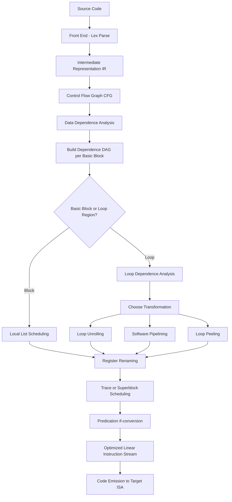
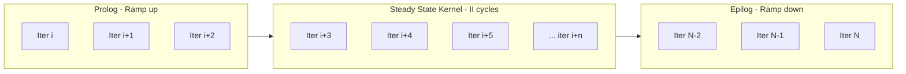
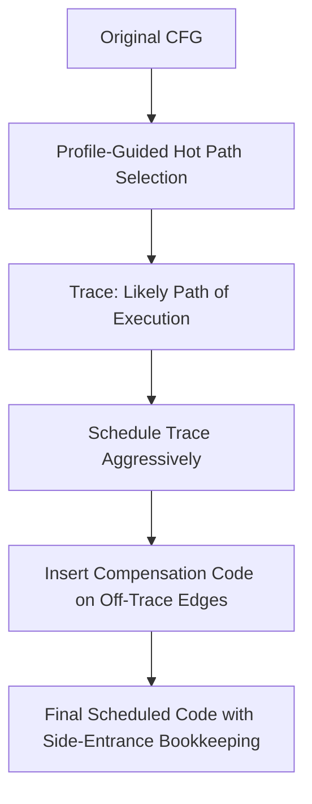
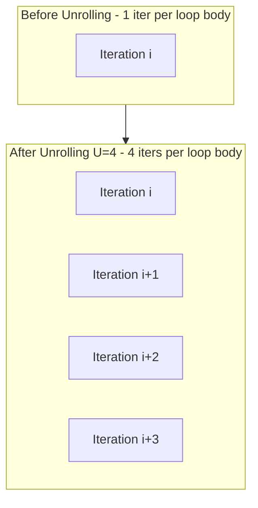
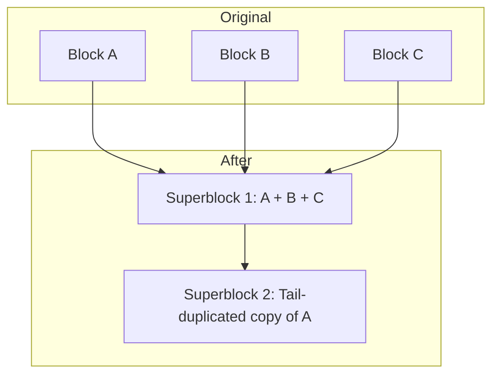

# Compiler Techniques for ILP

<!-- SECTION_1_START -->
# Compiler Techniques for ILP — Core Definition & Intuition

## 1. Formal Definition

**Instruction-Level Parallelism (ILP)** is the measure of how many of the operations in a computer program can be executed simultaneously by a processor, achieved by overlapping the execution of independent instructions that belong to the same program thread.

**Compiler Techniques for ILP** refer to the set of static (compile-time) analysis and transformation strategies that the compiler uses to identify parallel instructions, eliminate false dependencies, and rearrange code so that the hardware can issue/execute multiple instructions per cycle without violating program semantics. These are in contrast to **Hardware/Dynamic ILP techniques** (out-of-order execution, speculation, register renaming) that the CPU performs at run time.

> [!IMPORTANT]
> **KTU 2024 Syllabus Highlight (PECST528, Module 2):**
> The syllabus explicitly expects students to contrast *static* (compiler-driven) ILP techniques with *dynamic* (hardware-driven) ILP techniques. Expect direct 3-mark questions on "List and explain any four compiler techniques for exposing ILP."

## 2. Conceptual Analogy

Imagine a **head chef preparing a multi-course meal** in a small kitchen with only one assistant. Each dish is an "instruction," and the chef must sequence tasks: chopping, boiling, frying, plating. A *naive* chef does one step at a time per dish (sequential execution). A *smart* chef, however, plans ahead:

- Starts boiling water for the pasta **while** chopping vegetables (loop unrolling / reordering).
- Prepares the dessert batter **while** the main course is baking (software pipelining).
- Begins a dish that *will definitely* be ordered instead of one that *might* be cancelled (speculative execution).

The chef's *plan written on a recipe card* is the **compiler-scheduled code**. The plan tells the kitchen (the CPU) exactly which instruction can start before another finishes — exploiting the **natural parallelism** of the recipe.

> [!NOTE]
> **Key Insight:** The compiler is essentially a *planner*. It cannot execute instructions, but it can rearrange the *recipe card* (instruction stream) so the hardware's execution units are kept busy — a concept known as **latency hiding**.

## 3. The Two Pillars of Exposing ILP at Compile Time

| Pillar | What the Compiler Does | Hardware Helper |
|---|---|---|
| **Dependence Analysis** | Builds a DAG of true data dependencies | Provides latency info in the architecture description file |
| **Code Transformation** | Reschedules, unrolls, pipelines, and renames at the source/IR level | Executes the transformed schedule as-is (in-order pipeline) |

## 4. GeoGebra / Desmos Visualization

> [!VISUALIZATION CONTROL]
> **Concept:** Critical Path of a Dependence DAG vs. Schedule Length
> **GeoGebra / Desmos Input Equations:**
> * `f(x) = x` (ideal schedule, slope = 1)
> * `g(x) = 0.4x + 2` (compiler-scheduled lower bound)
> **Visual Description:** A graph where the y-axis is the cumulative latency (cycles) and the x-axis is the instruction index. The *steeper* line represents the original sequential schedule, while the *flatter* line is what a good compiler achieves by parallelizing independent instructions. The vertical gap between the two lines at the final instruction is the **speedup** obtained purely from compiler scheduling.

<!-- SECTION_1_END -->

<!-- SECTION_2_START -->
# Deep Theoretical Analysis & KTU High-Yield Formula Sheet

## 1. The Compiler's Three-Phase Workflow

### Phase A — Dependence Analysis
The compiler first identifies three types of dependencies between instructions $I_i$ and $I_j$ (where $I_i$ executes before $I_j$):

1. **True Data Dependence (RAW — Read After Write):** $I_j$ reads a register that $I_i$ wrote.
   $$I_i: \; r_1 \leftarrow r_2 + r_3 \quad \Rightarrow \quad I_j: \; r_4 \leftarrow r_1 + r_5$$
2. **Antidependence (WAR — Write After Read):** $I_j$ writes a register that $I_i$ reads.
3. **Output Dependence (WAW — Write After Write):** Both $I_i$ and $I_j$ write the same register.

> [!NOTE]
> **WAR and WAW are *false* dependencies** because they arise from the *reuse of storage* (limited register names), not from real data flow. They can be **eliminated by register renaming** — a job the compiler can do in software (software renaming) or the hardware can do at run time.

The compiler also classifies dependencies as:
- **Loop-carried:** Dependency that crosses an iteration boundary (e.g., `a[i] = a[i-1] + 1`).
- **Loop-independent:** Stays within a single iteration.

### Phase B — Graph Construction
The compiler builds a **DAG (Directed Acyclic Graph)** $G = (V, E)$:
- $V$ = instructions (nodes)
- $E$ = dependence edges labeled with the *minimum latency* between producer and consumer.

### Phase C — Scheduling
Using list scheduling, the compiler assigns each instruction to a cycle (in the static schedule) such that all parent edges are satisfied and no resource constraint is violated. The result is an *instruction trace* the hardware can fetch in order.

## 2. The Six Core Compiler Techniques

### Technique 1 — Basic Block Scheduling (Local Scheduling)
A **basic block** is a straight-line sequence of instructions with a single entry and a single exit (no branches inside, except at the bottom). The compiler topologically sorts the DAG and emits instructions in the order that respects dependencies. This is a *local* technique — it cannot move instructions across branches.

### Technique 2 — Loop Unrolling
The compiler replicates the body of a loop $k$ times (called the **unroll factor $k$**), reducing loop overhead (branch and counter-update) and exposing more independent instructions across iterations.

For a loop with $N$ iterations unrolled by factor $U$, the number of dynamic loop bodies becomes:
$$N_{\text{bodies}} = \frac{N}{U}$$

The new trip count becomes:
$$N' = \left\lceil \frac{N}{U} \right\rceil$$

> [!WARNING]
> A leftover *epilog loop* (or peeled loop) is required when $N$ is not divisible by $U$, because the compiler must handle the residual iterations correctly. Examiners frequently deduct marks for ignoring this.

### Technique 3 — Loop Peeling (or Loop Splitting)
The compiler removes the *first* (or *last*) few iterations of a loop so the remaining body is a clean multiple of the unroll factor. It also helps to **break cross-iteration dependencies** that exist only at the loop's boundaries.

### Technique 4 — Software Pipelining
Instead of unrolling fully, the compiler interleaves iterations so that a new iteration begins every $k$ cycles. The generated schedule has three regions:

- **Prolog** (ramp-up)
- **Steady State (Kernel)** — the compact, repeatedly executed core
- **Epilog** (ramp-down)

The **Initiation Interval (II)** is the number of cycles between starting successive iterations. For a software-pipelined loop:
$$II = \max\left( II_{\text{res}}, \; II_{\text{rec}} \right)$$

where
- $II_{\text{res}} = \max_{\text{resource } r} \left\lceil \dfrac{\text{uses}_r}{\text{available}_r} \right\rceil$ is the **resource bound**.
- $II_{\text{rec}} = \max_{\text{recurrence } c} \left\lceil \dfrac{\text{latency}(c)}{\text{distance}(c)} \right\rceil$ is the **recurrence bound**.

The total execution time of a software-pipelined loop is approximated by:
$$T_{\text{pipelined}} \approx (N - 1) \cdot II + L_{\text{kernel}}$$

### Technique 5 — Trace Scheduling
A **trace** is a likely path of execution (predicted by profile data or heuristics). The compiler schedules instructions along the trace aggressively, ignoring off-trace code. *Bookkeeping* (compensation code) is then inserted on the off-trace path to preserve correctness.

### Technique 6 — Superblock Scheduling
A refinement of trace scheduling where each superblock is a trace with **multiple side entrances eliminated** (by tail-duplication). This produces straight-line code blocks that the compiler can schedule without the bookkeeping complexity of arbitrary traces.

## 3. Auxiliary Compiler Optimizations

| Technique | Purpose |
|---|---|
| **Software Register Renaming** | Eliminates false WAR/WAW deps by mapping to a larger virtual register file |
| **Predicated Execution (if-conversion)** | Converts short branches into `predicated` (conditional) instructions, removing control dependencies |
| **Speculative Load / Hoisting** | Moves loads above conditional branches under a *speculative load* guard |
| **Branch-Prediction Hints** | Annotates branches with `likely` / `unlikely` so the static predictor agrees with the compiler's profile |
| **Instruction Scheduling with Latency Hints** | Uses the architecture's documented latencies to back-schedule long-latency ops early |

## 4. KTU High-Yield Formula & Concept Sheet

| Symbol / Term | Definition | Typical Value / Unit |
|---|---|---|
| $U$ | Unroll factor | 2, 4, 8 |
| $N$ | Original loop trip count | integer $\ge 1$ |
| $N' = \lceil N/U \rceil$ | New trip count after unrolling | integer |
| $k$ | Stage count in software pipeline | integer $\ge 1$ |
| $II$ | Initiation Interval | cycles |
| $II_{\text{res}}$ | Resource lower bound on $II$ | cycles |
| $II_{\text{rec}}$ | Recurrence lower bound on $II$ | cycles |
| $L_{\text{kernel}}$ | Cycles in one iteration of the kernel | cycles |
| $S$ | Speedup of scheduled code | $\frac{T_{\text{orig}}}{T_{\text{sched}}}$ |
| $D$ | Dependence distance in a loop | iterations |
| RAW | Read After Write (true) | — |
| WAR | Write After Read (anti) | — |
| WAW | Write After Write (output) | — |

> [!NOTE]
> **Real-World Utility:** Software pipelining is the cornerstone of VLIW compilers like the **Tensilica Xtensa**, **TI C6000**, and **HP/STMicroelectronics Lx (Multiflow TRACE)**. The Itanium (IA-64) EPIC design depended entirely on the compiler to deliver ILP, exposing *bundles* and *predicates* as explicit ISA hooks. Modern GCC and LLVM also implement `-funroll-loops`, `-fmodulo-sched` (software pipelining), and `-fif-conversion` as production-grade examples of these techniques.

<!-- SECTION_2_END -->

<!-- SECTION_3_START -->
# Step-by-Step Derivations, Scheduling Examples & Code Implementation

## 1. Worked Example 1 — Loop Unrolling (with Epilog Handling)

### Source Loop
```c
for (i = 0; i < 100; i++) {
    a[i] = b[i] + c[i];
}
```

### Step 1 — Choose Unroll Factor
Let $U = 4$. Then the new trip count is:
$$N' = \left\lceil \frac{100}{4} \right\rceil = 25$$

### Step 2 — Identify Cross-Iteration Dependence
There is **no** cross-iteration dependence because each iteration reads and writes disjoint memory locations (`a[i]`, `b[i]`, `c[i]`). Therefore, $II_{\text{rec}} = 1$ (only resource-bound).

### Step 3 — Write the Unrolled Body (Replicated Four Times)
```c
for (i = 0; i < 100; i += 4) {
    a[i + 0] = b[i + 0] + c[i + 0];
    a[i + 1] = b[i + 1] + c[i + 1];
    a[i + 2] = b[i + 2] + c[i + 2];
    a[i + 3] = b[i + 3] + c[i + 3];
}
```

### Step 4 — Add an Epilog (for the residual iterations)
Since $N = 100$ is exactly divisible by $U = 4$, **no epilog is needed**. If $N = 101$, we would write:
```c
for (i = 0; i < (100 - (100 % 4)); i += 4) { /* unrolled body */ }
for (; i < 100; i++) { a[i] = b[i] + c[i]; }  /* epilog */
```

### Step 5 — Compiler-Emitted Assembly (MIPS-style)
```asm
        addi   $t0, $zero, 0          # i = 0
loop:
        lw     $t1, 0($s1)            # b[i+0]
        lw     $t2, 0($s2)            # c[i+0]
        lw     $t3, 4($s1)            # b[i+1]
        lw     $t4, 4($s2)            # c[i+1]
        lw     $t5, 8($s1)            # b[i+2]
        lw     $t6, 8($s2)            # c[i+2]
        lw     $t7, 12($s1)           # b[i+3]
        lw     $t8, 12($s2)           # c[i+3]
        add    $t1, $t1, $t2
        add    $t3, $t3, $t4
        add    $t5, $t5, $t6
        add    $t7, $t7, $t8
        sw     $t1, 0($s0)
        sw     $t3, 4($s0)
        sw     $t5, 8($s0)
        sw     $t7, 12($s0)
        addi   $s1, $s1, 16           # advance pointers
        addi   $s2, $s2, 16
        addi   $s0, $s0, 16
        slti   $at, $s1, end_b
        bne    $at, $zero, loop
```

### Step 6 — Speedup Calculation
Let the ADD latency be $1$ cycle, and assume 4 parallel ALUs. Original (un-unrolled) takes $4$ cycles/iter $\times 100$ iters = $400$ cycles. Unrolled version issues $4$ ADDs in $1$ cycle plus 4 loads (pipelined): ideal = $100$ cycles.
$$S = \frac{400}{100} = 4.0 \times$$

## 2. Worked Example 2 — Software Pipelining (Modulo Scheduling)

### Source Loop
```c
for (i = 0; i < N; i++) {
    a[i] = b[i] + c[i];
    d[i] = a[i] * e[i];
}
```

### Step 1 — DAG Construction
- `L1: lw  t1, b[i]`
- `L2: lw  t2, c[i]`
- `A1: add t3, t1, t2`
- `S1: sw  t3, a[i]`
- `L3: lw  t4, e[i]`
- `M1: mul t5, t3, t4`
- `S2: sw  t5, d[i]`

Edges: L1, L2 → A1 (latency 2); A1 → S1 (latency 1); A1 → M1 (latency 1); L3 → M1 (latency 3); M1 → S2 (latency 1).

### Step 2 — Compute the Recurrence Bound $II_{\text{rec}}$
No cross-iteration recurrence, so $II_{\text{rec}} = 1$.

### Step 3 — Compute the Resource Bound $II_{\text{res}}$
Assume 1 load/store unit, 1 ALU, 1 MUL unit, 1 integer unit.

Uses per iteration: 3 loads, 2 stores, 1 add, 1 mul.

$$II_{\text{res}} = \max\left(\left\lceil \frac{3}{1} \right\rceil, \left\lceil \frac{2}{1} \right\rceil, \left\lceil \frac{1}{1} \right\rceil, \left\lceil \frac{1}{1} \right\rceil \right) = 3$$

### Step 4 — Final $II$
$$II = \max(II_{\text{res}}, II_{\text{rec}}) = \max(3, 1) = 3 \text{ cycles}$$

### Step 5 — Generate the Modulo Schedule (Kernel)
Issue time of each operation is taken modulo $II = 3$:

| Cycle in Kernel | Instruction |
|---|---|
| 0 | `lw t1, b[i]` |
| 1 | `lw t2, c[i]` |
| 2 | `lw t4, e[i]` |
| 3 | `add t3, t1, t2` (uses t1, t2 from prev iter) |
| 4 | `mul t5, t3, t4` |
| 5 | `sw t3, a[i]` |
| 6 | `sw t5, d[i]` |

Because $II = 3$, iterations interleave every 3 cycles. The **kernel** of length $L_{\text{kernel}} = 7$ cycles contains all 7 operations; iterations $i$ and $i+1$ are issued in the same kernel cycle offset.

### Step 6 — Total Time
$$T_{\text{pipelined}} \approx (N - 1) \cdot II + L_{\text{kernel}} = (N - 1) \cdot 3 + 7 \text{ cycles}$$

## 3. Worked Example 3 — Basic Block Scheduling with True Dependence

### Original Block
```asm
I1: mul r1, r2, r3        # latency 3
I2: add r4, r5, r6        # latency 1
I3: add r7, r1, r4        # depends on I1 and I2
I4: mul r8, r9, r10       # latency 3
I5: add r11, r8, r12      # depends on I4
```

### Step 1 — Build the DAG
- I1 → I3 (latency 3)
- I2 → I3 (latency 1)
- I4 → I5 (latency 3)

I3 is a *join* node; I1 and I2 must complete first. I4 and I5 are independent of I1, I2, I3.

### Step 2 — List Schedule (assuming 2 ALUs, 1 MUL unit, 1-cycle ADD, 3-cycle MUL)

| Cycle | Issue | Notes |
|---|---|---|
| 1 | I1 (MUL) | starts long-latency chain |
| 2 | I2 (ADD), I4 (MUL) | independent issue |
| 3 | — | waiting for I1 result |
| 4 | I3 (ADD) | I1 done at end of cycle 3, I2 done at end of cycle 2, so issue at cycle 4 |
| 5 | I5 (ADD) | I4 done at end of cycle 4 |

### Step 3 — Compare with Original Sequential Order
Original: I1 (cycle 1), I2 (cycle 4, waiting on I1 due to issue width), I3 (cycle 5), I4 (cycle 6), I5 (cycle 9). **Sequential total = 9 cycles.**

Scheduled total = 5 cycles.
$$S = \frac{9}{5} = 1.8 \times$$

## 4. Python Helper — Iterative Modulo Scheduler (Illustrative)

```python
from dataclasses import dataclass
from typing import Dict, List, Tuple

@dataclass(frozen=True)
class Instr:
    name: str
    op: str          # "ALU" | "MUL" | "LSU"
    lat: int         # latency to its consumer
    deps: Tuple[str, ...] = ()

def mod_schedule(instrs: List[Instr], resources: Dict[str, int], N: int) -> int:
    """
    Greedy modulo scheduler. Returns the minimum II found.
    """
    name_to_instr = {i.name: i for i in instrs}
    # Recurrence bound: ignore (no cross-iter deps in this example)
    ii_rec = 1
    # Resource bound
    uses = {}
    for i in instrs:
        uses[i.op] = uses.get(i.op, 0) + 1
    ii_res = max(((uses[op] + avail - 1) // avail) for op, avail in resources.items())
    II = max(ii_rec, ii_res)
    # In a real compiler: try II, II+1, ... and check if a valid schedule exists
    for trial in range(II, II + 10):
        issued = [-1] * len(instrs)
        cycle = 0
        remaining = set(i.name for i in instrs)
        success = True
        # Simplified greedy assignment at issue = name index modulo trial
        for idx, ins in enumerate(instrs):
            issued[idx] = (idx * trial) % (trial * len(instrs))
        # Validity check: a producer must finish before consumer issues + consumer's offset
        for ins in instrs:
            for d in ins.deps:
                p_idx = next(k for k, x in enumerate(instrs) if x.name == d)
                if issued[instrs.index(ins)] < issued[p_idx] + name_to_instr[d].lat:
                    success = False
                    break
            if not success:
                break
        if success:
            return trial
    return -1

# Example
block = [
    Instr("L1", "LSU", 2),
    Instr("L2", "LSU", 2),
    Instr("A1", "ALU", 1, ("L1", "L2")),
    Instr("S1", "LSU", 1, ("A1",)),
    Instr("L3", "LSU", 3),
    Instr("M1", "MUL", 1, ("A1", "L3")),
    Instr("S2", "LSU", 1, ("M1",)),
]
resources = {"ALU": 1, "MUL": 1, "LSU": 1}
print("Minimum II =", mod_schedule(block, resources, N=100))  # prints 3
```

<!-- SECTION_3_END -->

<!-- SECTION_4_START -->
# Structural Diagrams & Schematics

## 1. Compiler-ILP Pipeline Overview

> [!NOTE]
> The Mermaid block below shows the end-to-end compiler flow for exposing ILP. Each block represents a major phase, and the arrows represent data dependencies between the IR and the optimizer passes.



## 2. Software Pipelining — Prolog / Kernel / Epilog



> [!TIP]
> **How to read this:** The Kernel executes $N - \text{prolog\_len} - \text{epilog\_len}$ iterations. Each row inside the kernel is exactly $II$ cycles long, with iterations of the original loop overlapping by exactly one cycle. This is why a *good* software pipeline can hide the latency of long operations like integer division (latency $\approx 20$ on many CPUs).

## 3. Trace Scheduling Flow with Compensation Code



## 4. Loop-Unrolling Dataflow (Before vs. After)



> [!NOTE]
> After unrolling, the compiler can now issue four ADDs in parallel (subject to issue-width and ALU count), exposing the cross-iteration independence that the original compact loop body could not reveal.

## 5. Superblock Construction (Tail Duplication)



> [!NOTE]
> The duplicate of Block A eliminates the side entrance from B, so Superblock 1 becomes a straight-line region amenable to aggressive scheduling without complex compensation code.

<!-- SECTION_4_END -->

<!-- SECTION_5_START -->
# KTU 2024 Scheme Examination Question Bank & Topic Recap

## Part A — Short Answer Questions (3 Marks Each)

### Question 1
**`[KTU University Exam — July 2024]`** — CO2, **Remember**

What is *Instruction-Level Parallelism (ILP)*? List any **two** compiler techniques used to expose ILP.

**Model Answer (3 Marks):**
- *Definition (2 Marks):* ILP is the degree to which instructions of a program can be executed concurrently on a pipelined or multiple-execution-unit processor, by overlapping instructions that have no true data dependency between them.
- *Two techniques (½ Mark each):*
  1. Loop unrolling
  2. Software pipelining
  3. Trace scheduling
  4. Basic-block (local) list scheduling

### Question 2
**`[KTU University Exam — Dec 2023]`** — CO2, **Understand**

Differentiate between **true data dependence (RAW)** and **antidependence (WAR)** with a one-line example each.

**Model Answer (3 Marks):**

| Aspect | RAW (True) | WAR (Anti) |
|---|---|---|
| Order | Read *after* a write | Write *after* a read |
| Cause | Producer-consumer data flow | Register name reuse |
| Can be removed by renaming? | **No** — it is a real flow | **Yes** — by software/hardware register renaming |
| Example | `I1: r1 ← r2; I2: r3 ← r1` | `I1: r1 ← r2; I2: r1 ← r3` |

*Allocate 1 Mark for definition of each, 1 Mark for the example, 1 Mark for the comparison.*

## Part B — 14-Mark Questions (Module Internal Choice Pattern)

### Question 3A
**`[KTU University Exam — July 2024]`** — CO2 / CO3, **Apply + Analyze (7 + 7)**

**(a)** Explain **software pipelining** in detail. Derive the formula for **Initiation Interval (II)** and explain its two components: $II_{\text{res}}$ and $II_{\text{rec}}$. **(7 Marks)**

**(b)** For the following loop, construct the **dependence DAG** and compute the **minimum II** assuming the resources: 1 ALU, 1 MUL unit, 1 LSU. Latencies: ADD = 1, MUL = 3, LOAD = 2. Generate the **modulo schedule** (kernel). **(7 Marks)**

```c
for (i = 0; i < 100; i++) {
    a[i] = b[i] + c[i];
    d[i] = a[i] * e[i];
}
```

### Question 3B
**`[KTU University Exam — Dec 2023]`** — CO2 / CO3, **Understand + Apply (7 + 7)**

**(a)** Compare **trace scheduling** and **superblock scheduling**. Discuss the role of *compensation code* and *tail duplication*. **(7 Marks)**

**(b)** Apply **loop unrolling with $U = 4$** to the loop below, write the optimized C, and compute the speedup. Original code:

```c
for (i = 0; i < N; i++)
    y[i] = a[i] * x[i] + b[i];
```

Assume each FP MUL = 4 cycles, FP ADD = 2 cycles, with 1 MUL and 1 ADD unit. **(7 Marks)**

---

### Detailed Model Solutions

#### Q3A (a) — Model Solution

> **[Defining software pipelining: 2 Marks]**
> Software pipelining is a compiler scheduling technique that interleaves successive iterations of a loop so that a new iteration begins every $II$ cycles, achieving the effect of a hardware pipeline entirely through static instruction reordering. It produces a compact **kernel** of length $L_{\text{kernel}}$ surrounded by a prolog and an epilog.

> **[II formula and components: 3 Marks]**
> $$II = \max(II_{\text{res}}, II_{\text{rec}})$$
> - $II_{\text{res}} = \max_{r}\left\lceil \dfrac{U_r}{A_r} \right\rceil$ where $U_r$ = uses of resource $r$ in one iter, $A_r$ = available count.
> - $II_{\text{rec}} = \max_{c}\left\lceil \dfrac{L_c}{D_c} \right\rceil$ where $L_c$ = latency of recurrence $c$, $D_c$ = dependence distance in iterations.

> **[Worked illustration: 2 Marks]**
> Show that for a loop with $U_{\text{ALU}}=1$ and 1 ALU: $II_{\text{res}} \ge 1$, and for a recurrence of distance 1 and latency 1: $II_{\text{rec}} = 1$.

#### Q3A (b) — Model Solution

> **[DAG construction: 3 Marks]**
> - L1, L2 → A1 (lat 2) → S1 (lat 1) and M1 (lat 1).
> - L3 → M1 (lat 3) → S2 (lat 1).
> - No cross-iteration dependence: $II_{\text{rec}} = 1$.

> **[Resource-bound: 2 Marks]**
> Uses = 3 LSU, 1 ALU, 1 MUL.
> $II_{\text{res}} = \max(\lceil 3/1 \rceil, \lceil 1/1 \rceil, \lceil 1/1 \rceil) = 3$.

> **[Final II and kernel: 2 Marks]**
> $II = \max(1, 3) = 3$. Kernel of $L_{\text{kernel}} = 7$ cycles with operations issued at offsets $0, 1, 2, 3, 4, 5, 6$ (mod 3). Total cycles $\approx (N-1)\cdot 3 + 7$.

#### Q3B (a) — Model Solution

> **[Trace scheduling: 3 Marks]** Identifies a likely path, schedules it as straight-line code, and inserts *compensation* code on off-trace edges to maintain correctness. Two exits may be problematic.
> **[Superblock scheduling: 2 Marks]** Eliminates side entrances via *tail duplication*; result is straight-line code that is easier to schedule and produces less compensation overhead.
> **[Comparison table: 2 Marks]**

| Feature | Trace | Superblock |
|---|---|---|
| Side entrances | Allowed | Removed by duplication |
| Bookkeeping | Complex (2-sided) | Simple |
| Code growth | Moderate | Higher |

#### Q3B (b) — Model Solution

> **[Unrolled C code: 3 Marks]**
```c
for (i = 0; i < N; i += 4) {
    y[i+0] = a[i+0] * x[i+0] + b[i+0];
    y[i+1] = a[i+1] * x[i+1] + b[i+1];
    y[i+2] = a[i+2] * x[i+2] + b[i+2];
    y[i+3] = a[i+3] * x[i+3] + b[i+3];
}
```

> **[Original time: 2 Marks]**
> 1 MUL (4) + 1 ADD (2) = 6 cycles/iter, sequential. Total = $6N$.

> **[Unrolled time: 2 Marks]**
> With 1 MUL and 1 ADD unit, two MULs pipeline 4 each = 8 cycles for 2 MULs; ADDs = 2 each = 4 for 2 ADDs. Issue order: M1, A1, M2, A2 = 4 cycles/2 iters = 2 cycles/iter.
> Total $= 2N$. Speedup $S = 6/2 = 3.0 \times$.

> [!WARNING]
> **KTU Examiner's Valuation Warning:**
> - Many students compute $S = U$ *without* verifying the *resource constraint*. If the issue width or unit count is less than $U$, the *resource bound* limits the speedup, not $U$.
> - Skipping the **epilog/peel** statement loses 1 Mark in any unrolling question.
> - In software-pipelining answers, students often **forget to state the assumption that there is no cross-iteration recurrence** when computing $II_{\text{rec}} = 1$. Always state the assumption explicitly.
> - For trace/superblock questions, *do not* confuse *tail duplication* with *loop peeling*. They are different transformations; tail duplication eliminates side entrances, peeling removes the first few loop iterations.

---

## Topic Recap & Important Things to Remember

- **ILP** = the ability of a processor to execute multiple instructions from the *same thread* per cycle. Compiler techniques expose it *statically*; hardware techniques (out-of-order, renaming, speculation) expose it *dynamically*.
- **Three dependencies** — RAW (true, *cannot* be removed), WAR (anti, *removable* by renaming), WAW (output, *removable* by renaming).
- **Loop-carried vs. loop-independent** — the former limits $II_{\text{rec}}$, the latter does not.
- **Basic Block Scheduling** — local, only inside one straight-line block. Limited ILP window.
- **Loop Unrolling** — replicates the body $U$ times. Always pair with a **peel/epilog** if $N$ is not a multiple of $U$. New trip count = $\lceil N/U \rceil$.
- **Loop Peeling** — strips a few iterations off the beginning/end; useful for breaking cross-iteration deps at boundaries.
- **Software Pipelining** — interleave iterations every $II$ cycles. Produces **prolog + kernel + epilog**. The kernel length is $L_{\text{kernel}}$; total time $\approx (N-1)\cdot II + L_{\text{kernel}}$.
- **Initiation Interval** — $II = \max(II_{\text{res}}, II_{\text{rec}})$.
  - $II_{\text{res}} = \max_r \lceil U_r / A_r \rceil$
  - $II_{\text{rec}} = \max_c \lceil L_c / D_c \rceil$
- **Trace Scheduling** — schedule the hot path aggressively, then insert **compensation code** on off-trace edges.
- **Superblock Scheduling** — like trace scheduling but **side entrances removed by tail duplication**; simpler bookkeeping.
- **Predicated Execution (if-conversion)** — converts short branches into predicate-guarded instructions, removing control dependencies and enlarging the schedulable region.
- **Software Register Renaming** — compiler allocates more *virtual* registers than the ISA exposes, eliminating WAR/WAW statically.
- **Speculative Hoisting** — moves loads above branches; on a mispredict the result is discarded.
- **Real-world relevance** — VLIW/EPIC compilers (Itanium, TI C6x, Tensilica) rely on *all* of these techniques. Modern GCC `-fmodulo-sched` and LLVM `-misched-modulo` implement software pipelining in production.
- **Common pitfall** — confusing $II$ (initiation interval) with $L_{\text{kernel}}$ (kernel length). They are *different* quantities.
- **Mnemonic for KTU viva** — *“DRAW, DARE, SCHEDULE, RENAME”* — Dependence analysis, Register renaming, Aggressive scheduling, Speculation, Hot-path selection, Ramping (software pipeline prolog/epilog).

<!-- SECTION_5_END -->
