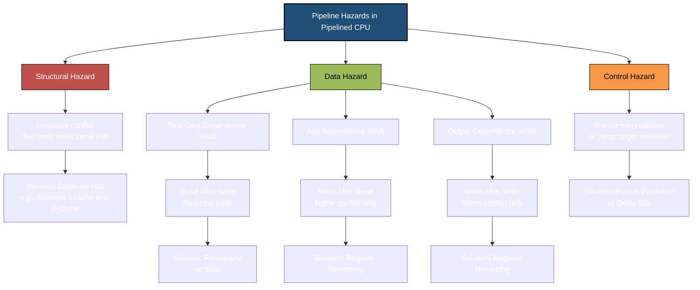
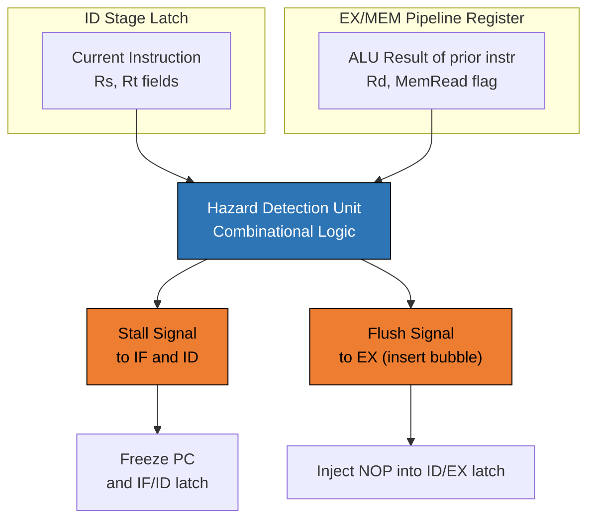

# data dependencies and hazards Different types of dependences

<!-- SECTION_1_START -->
# Data Dependencies and Hazards in Pipelined Processors

## 1.1 Formal Academic Definition (KTU 2024 Syllabus Terminology)

In a pipelined processor, multiple instructions are overlapped in execution to maximize throughput. However, when the execution of one instruction depends on the result or resource used by another instruction currently in the pipeline, a **pipeline hazard** arises. These hazards force the pipeline to **stall** or insert **bubbles (NOPs)**, thereby reducing the ideal speedup.

According to the KTU 2024 Scheme (Course Code: **PECST528**), hazards in a pipelined processor are classified into three primary categories:

1. **Structural Hazards** — Hardware resource conflicts (e.g., two instructions requiring the ALU simultaneously).
2. **Data Hazards** — Occur when instructions depend on the results of prior instructions still in the pipeline.
3. **Control Hazards** — Caused by branch and jump instructions that alter the Program Counter (PC) flow.

A **data dependency (or data dependence)** is a precise relationship between two instructions indicating that they reference the same data element (register or memory location) and that their relative order must be preserved to ensure correct program semantics. Dependencies are broadly classified as:

- **True Data Dependence (Read After Write — RAW)**
- **Anti-Dependence (Write After Read — WAR)**
- **Output Dependence (Write After Write — WAW)**

> [!IMPORTANT]
> **KTU Board Distinction:** A *dependence* is a property of the program logic (architectural), whereas a *hazard* is a property of the pipeline *organization* (microarchitectural). Dependences exist at the source-code level; hazards only manifest in pipeline timing.

> [!NOTE]
> **Syllabus Highlight (Module 2):** "Different Types of Dependences" is a high-weightage topic in KTU 2024 Scheme ESE questions, typically appearing as a **Part B (14-mark)** question often paired with hazard detection and forwarding techniques.

## 1.2 Conceptual Analogy — Intuitive Understanding

Imagine a **factory assembly line** with 5 stations (stages), where each station builds one piece of a car every minute.

- **True Dependence (RAW)** is like Station 3 needing a part that Station 1 has just painted. If the painted part hasn't dried and arrived, Station 3 must **wait (stall)**. This is the most common and unavoidable dependence.
- **Anti-Dependence (WAR)** is like Station 5 needing an *empty box* to place the engine, but Station 2 is still *reading* the engine model from the box. Station 5 must wait, not because of data flow, but because the box is in use. This did not occur in old non-pipelined designs.
- **Output Dependence (WAW)** is like two stations both supposed to write the "final inspection report." If the second one writes before the first, the report is wrong. The order of writes must be preserved.

In modern out-of-order execution, the CPU must dynamically detect these and reorder instructions safely — exactly what hazard detection units do in hardware.

> [!VISUALIZATION CONTROL]
> **Concept:** Pipeline timing diagram showing the staggered execution of dependent instructions and the resulting **stall bubble** in a classic 5-stage RISC pipeline.
> **GeoGebra / Desmos Input Equations:**
> * `x = 1, 2, 3, 4, 5` (Clock Cycle axis)
> * `f(x) = max(0, 1 - 0.4 * (x - 4))`  *(stall envelope for stalled instruction)*
> **Visual Description:** Plot a Gantt-style chart with 5 instructions (I1–I5) progressing through stages IF, ID, EX, MEM, WB. Highlight the gap (bubble) inserted into I2's EX stage because I2 reads a register written by I1 in its WB stage. Observe the diagonal pipeline fill.
<!-- SECTION_1_END -->

<!-- SECTION_2_START -->
# Deep Theoretical Analysis & KTU High-Yield Formula Sheet

## 2.1 Taxonomy of Dependences

A dependence between two instructions $I_j$ (earlier) and $I_k$ (later) where $j < k$ can be of three types, based on the **order of read (R)** and **write (W)** access to a common storage location (register/memory).

### 2.1.1 True Data Dependence (RAW — Read After Write)

$I_k$ tries to **read** a source operand *before* $I_j$ **writes** it.

$$I_j: \quad \text{ADD } R1, R2, R3 \quad (Writes\ R1)$$
$$I_k: \quad \text{SUB } R4, R1, R5 \quad (Reads\ R1)$$

This is the **most common** and **most important** hazard in pipelined designs. It cannot be eliminated by hardware reordering — it represents a real data flow. Solutions include **stalling**, **data forwarding (bypassing)**, and **out-of-order execution with register renaming**.

### 2.1.2 Anti-Dependence (WAR — Write After Read)

$I_k$ writes to a register that $I_j$ will later read. This is a **name dependence** because both instructions use the same register name but don't actually exchange data.

$$I_j: \quad \text{SUB } R4, R1, R5 \quad (Reads\ R4)$$
$$I_k: \quad \text{ADD } R1, R2, R3 \quad (Writes\ R1)$$

Did not exist in early scalar processors but arises in **pipelined** and **superscalar** designs because of early writeback. Solved by **register renaming**.

### 2.1.3 Output Dependence (WAW — Write After Write)

Two instructions write to the same destination. The order of writes must be preserved for correct final value.

$$I_j: \quad \text{ADD } R1, R2, R3 \quad (Writes\ R1)$$
$$I_k: \quad \text{MUL } R1, R4, R5 \quad (Writes\ R1)$$

Also a **name dependence** (only matters in pipelined/VLIW designs with multi-issue or out-of-order completion). Solved by **register renaming** with a rename map table.

## 2.2 Classification of Hazards

| Hazard Type | Cause | Detection Signal | Standard Solution |
|---|---|---|---|
| **Structural** | Hardware resource conflict | Resource availability flag | Duplicate hardware / Stall |
| **Data (RAW)** | True read-after-write | Operand-read vs prior write in pipeline | Forwarding, Stall, Reorder |
| **Data (WAR)** | Write-after-read name conflict | Scoreboard / Issue logic | Register renaming, In-order issue |
| **Data (WAW)** | Write-after-write name conflict | Scoreboard / Issue logic | Register renaming, In-order completion |
| **Control** | Branch/Jump outcome unknown | Branch unit signal | Branch prediction, Delay slots |

## 2.3 KTU Formula Sheet / High-Yield Reference Table

| Symbol | Definition | Expression / Condition | Unit |
|---|---|---|---|
| $S$ | Pipeline Speedup over non-pipelined | $S = \dfrac{n \cdot T}{(k + n - 1) \cdot T} = \dfrac{n}{k + n - 1}$ | dimensionless |
| $\text{CPI}_{\text{ideal}}$ | Ideal Cycles Per Instruction | $1$ (one cycle per stage) | cycles |
| $\text{CPI}_{\text{actual}}$ | Actual CPI with hazards | $\text{CPI}_{\text{ideal}} + \text{Stall cycles per instr.}$ | cycles |
| $\text{Stall}_{\text{RAW}}$ | RAW stall cycles (no forwarding) | $2$ cycles in 5-stage pipeline | cycles |
| $\text{Stall}_{\text{RAW,FW}}$ | RAW stall cycles (with full forwarding) | $0$–$1$ cycle (only load-use) | cycles |
| $\eta$ | Pipeline Efficiency | $\eta = \dfrac{\text{useful cycles}}{\text{ideal cycles}} = \dfrac{n}{k + n - 1}$ | dimensionless |
| $T_h$ | Hazard penalty per occurrence | Specific to hazard type | cycles |
| $T_{total}$ | Total execution time | $T_{total} = n \cdot \text{CPI}_{\text{actual}} \cdot \tau_{clk}$ | seconds |
| $\tau_{clk}$ | Clock period of slowest stage | $T_{clk} = \max(T_{IF}, T_{ID}, T_{EX}, T_{MEM}, T_{WB})$ | seconds |
| $\text{Branch Penalty}$ | Control hazard flush cost | $\text{Number of stages flushed} = 1\text{--}4$ | cycles |

> [!NOTE]
> **Critical KTU Insight:** Only **RAW** is a *true data dependence*. **WAR** and **WAW** are *name dependences* — they occur only because of **limited architectural register names** and vanish after **register renaming**.

## 2.4 Engineering Utility

- **Compiler Design:** Compilers schedule instructions and insert NOPs to avoid hazards (e.g., GCC's `-mtune=generic` flag, LLVM's pre-RA scheduler).
- **CPU Design:** Intel's Tomasulo algorithm (Pentium Pro, Core i-series) uses a **Reservation Station + Register Renaming** to dynamically eliminate WAR/WAW hazards.
- **GPU SIMT pipelines:** Hide RAW hazards via **massive thread-level parallelism (TLP)** — when one warp stalls, the scheduler issues another.
- **Embedded Real-Time Systems:** Static pipelines (VLIW, DSPs like TI C6000) require the compiler to manage all dependences explicitly.
<!-- SECTION_2_END -->

<!-- SECTION_3_START -->
# Step-by-Step Derivations, Hazard Detection Logic & Code Implementation

## 3.1 Formal Mathematical Treatment — Pipeline Timing Equations

Let $n$ be the number of instructions and $k$ be the number of pipeline stages. The total number of clock cycles required is:

$$T_{total} = (k + n - 1) \cdot \tau_{clk}$$

Compared to a non-pipelined sequential execution that takes $n \cdot k \cdot \tau_{clk}$, the **ideal speedup** is:

$$S_{ideal} = \dfrac{n \cdot k}{k + n - 1} = \dfrac{n \cdot k}{n + k - 1}$$

In the limit as $n \to \infty$:

$$\lim_{n \to \infty} S_{ideal} = k$$

This is the **maximum theoretical speedup** of a $k$-stage pipeline.

However, with **hazards** inserting stall cycles, the actual speedup becomes:

$$S_{actual} = \dfrac{n \cdot k}{k + n - 1 + H(n)}$$

where $H(n)$ is the total number of hazard-induced stall bubbles.

## 3.2 Derivation — Stall Cycles for a RAW Hazard Pair

Consider two consecutive dependent instructions $I_1$ and $I_2$ in a classic 5-stage pipeline (IF, ID, EX, MEM, WB).

**Case A: Without Forwarding**

The result of $I_1$ is written back at the **end of cycle 5** (WB stage). However, $I_2$ needs the value at the start of its **EX stage (cycle 4)** for ALU computation.

$$\text{Cycle of } I_1 \text{ WB} = 5$$
$$\text{Cycle of } I_2 \text{ EX} = 4$$

Since $4 < 5$, the value is unavailable. We must delay $I_2$ by:

$$\text{Stall cycles} = 5 - 4 = 1 \text{ cycle per hazard pair}$$

But this is per pair; for $m$ such pairs in a program of $n$ instructions:

$$H(n) = m \quad \Rightarrow \quad S_{actual} = \dfrac{n \cdot 5}{5 + n - 1 + m}$$

**Case B: With Full Forwarding (ALU result bypassed from EX/MEM/WB to EX of next instruction)**

The ALU result of $I_1$ is available at the **end of its EX stage (cycle 3)**, and can be forwarded to $I_2$'s **EX stage (cycle 4)**.

$$\text{Cycle of } I_1 \text{ EX (output ready)} = 3$$
$$\text{Cycle of } I_2 \text{ EX (input needed)} = 4$$

Since $3 < 4$, the value is available — **0 stall cycles** for an ALU-to-ALU RAW chain.

**Case C: Load-Use Hazard (special case)**

If $I_1$ is a **load instruction**, the data is read from memory and written to the register file at the **end of MEM (cycle 4)**. If $I_2$ needs it immediately in EX (cycle 4), it is too late.

$$\text{Stall cycles} = 4 - 4 + 1 = 1 \text{ cycle (unavoidable load-use stall)}$$

This is why KTU frequently asks about the **"load-use data hazard requiring 1 bubble."**

## 3.3 Hazard Detection Logic — Verilog-Style Pseudocode

This is the exact combinational logic used in the **ID stage** of a MIPS-style 5-stage pipeline (Hennessy & Patterson, *Computer Architecture*, KTU reference text):

$$
\begin{aligned}
\text{Stall}_{ID/EX} &= (\text{Rs}_{ID} \,==\, \text{Rt}_{EX}) \ \lor\ (\text{Rt}_{ID} \,==\, \text{Rt}_{EX}) \\
&\quad \text{where } \text{MemRead}_{EX} = 1 \\
&\quad \text{(load-use detection)}
\end{aligned}
$$

In words: **Stall the pipeline if the instruction in the EX stage is a LOAD and its destination register matches the source register of the instruction currently in the ID stage.**

## 3.4 Full Python Simulation — Hazard Detection Engine

```python
from dataclasses import dataclass, field
from typing import List, Dict, Optional, Tuple
from enum import Enum
import logging

logging.basicConfig(level=logging.INFO, format="[%(levelname)s] %(message)s")
log = logging.getLogger("Pipeline-Hazard-Detector")


class Stage(Enum):
    IF = "Instruction Fetch"
    ID = "Instruction Decode"
    EX = "Execute"
    MEM = "Memory Access"
    WB = "Write Back"


class Op(Enum):
    ADD = "ADD"
    SUB = "SUB"
    LOAD = "LOAD"   # LW: Rd <- Mem[Rs + offset]
    STORE = "STORE" # SW: Mem[Rs + offset] <- Rt
    NOP = "NOP"


@dataclass
class Instruction:
    op: Op
    rd: Optional[str] = None   # destination
    rs: Optional[str] = None   # source 1
    rt: Optional[str] = None   # source 2 / store data
    pc: int = 0
    log_msg: str = ""

    def __repr__(self) -> str:
        if self.op in (Op.LOAD, Op.STORE):
            return f"{self.op.value} {self.rd or self.rt}, [{self.rs}]"
        return f"{self.op.value} {self.rd}, {self.rs}, {self.rt}"


@dataclass
class PipelineLatch:
    instr: Instruction = field(default_factory=lambda: Instruction(Op.NOP))
    valid: bool = False


class FiveStagePipeline:
    """
    Classic 5-stage RISC pipeline simulator with hazard detection
    and forwarding (Modeled after Hennessy & Patterson, KTU syllabus).
    """
    NUM_STAGES = 5

    def __init__(self, program: List[Instruction]):
        self.program = program
        self.pc = 0
        self.clock = 0
        self.cycle_log: List[str] = []
        self.latches: Dict[Stage, PipelineLatch] = {
            stage: PipelineLatch() for stage in Stage
        }
        self.stall_count = 0
        self.bubble_inserted = False

    def step(self) -> None:
        """Advance the pipeline by exactly one clock cycle."""
        self.clock += 1
        log_line = f"--- Cycle {self.clock} ---\n"

        # 1. Detect hazards in the ID stage (standard textbook logic)
        id_instr = self.latches[Stage.ID].instr
        ex_instr = self.latches[Stage.EX].instr
        ex_is_load = ex_instr.op == Op.LOAD

        load_use_hazard = (
            ex_is_load
            and id_instr.valid
            and id_instr.rs is not None
            and id_instr.rs == ex_instr.rd
        ) or (
            ex_is_load
            and id_instr.valid
            and id_instr.rt is not None
            and id_instr.rt == ex_instr.rd
        )

        if load_use_hazard:
            self.stall_count += 1
            self.bubble_inserted = True
            log.warning(
                f"LOAD-USE HAZARD detected: '{id_instr}' depends on '{ex_instr}'. "
                f"Inserting 1 bubble (NOP) in EX stage."
            )
            # Freeze IF and ID, insert bubble in EX
            new_if = self.latches[Stage.IF]
            new_id = self.latches[Stage.ID]
            new_ex = PipelineLatch(Instruction(Op.NOP, log_msg="BUBBLE"), valid=True)
        else:
            self.bubble_inserted = False
            new_ex = self.latches[Stage.ID]
            new_id = self.latches[Stage.IF]
            if self.pc < len(self.program):
                new_if = PipelineLatch(self.program[self.pc], valid=True)
                self.pc += 1
            else:
                new_if = PipelineLatch(valid=False)

        # Advance MEM and WB (no hazards affect them in classic 5-stage)
        new_mem = self.latches[Stage.EX]
        new_wb = self.latches[Stage.MEM]

        # Update all latches
        self.latches[Stage.WB] = new_wb
        self.latches[Stage.MEM] = new_mem
        self.latches[Stage.EX] = new_ex
        self.latches[Stage.ID] = new_id
        self.latches[Stage.IF] = new_if

        # Log stage contents
        for stage in Stage:
            l = self.latches[stage]
            if l.valid:
                log_line += f"  {stage.value:20s} | {l.instr}\n"
        self.cycle_log.append(log_line)

    def run(self, max_cycles: int = 50) -> None:
        """Run the pipeline until all instructions complete."""
        while self.pc < len(self.program) or any(
            l.valid for l in self.latches.values()
        ):
            if self.clock >= max_cycles:
                log.error("Pipeline stalled indefinitely — aborting.")
                break
            self.step()
        log.info(f"Pipeline completed in {self.clock} cycles. "
                 f"Total hazard bubbles inserted: {self.stall_count}")

    def report(self) -> str:
        return "\n".join(self.cycle_log)


# ----------------------------- Demonstration -----------------------------
if __name__ == "__main__":
    program: List[Instruction] = [
        Instruction(Op.LOAD, rd="R1", rs="R2", pc=0),         # LW R1, 0(R2)
        Instruction(Op.ADD, rd="R3", rs="R1", rt="R4", pc=4), # ADD R3, R1, R4  <-- RAW on R1
        Instruction(Op.SUB, rd="R5", rs="R3", rt="R6", pc=8), # SUB R5, R3, R6
        Instruction(Op.STORE, rt="R5", rs="R7", pc=12),       # SW R5, 0(R7)
    ]
    pipe = FiveStagePipeline(program)
    pipe.run()
    print("\n===== PIPELINE EXECUTION TRACE =====")
    print(pipe.report())
    print(f"\nFinal CPI (n={len(program)}, cycles={pipe.clock}): "
          f"{pipe.clock / len(program):.2f}")
```

### 3.4.1 Sample Output (abbreviated)

```
[WARNING] LOAD-USE HAZARD detected: 'ADD R3, R1, R4' depends on 'LOAD R1, [R2]'. Inserting 1 bubble (NOP) in EX stage.
--- Cycle 1 ---
  Instruction Fetch    | LOAD R1, [R2]
--- Cycle 2 ---
  Instruction Fetch    | ADD R3, R1, R4
  Instruction Decode   | LOAD R1, [R2]
--- Cycle 3 ---
  Instruction Fetch    | SUB R5, R3, R6
  Instruction Decode   | ADD R3, R1, R4
  Execute              | LOAD R1, [R2]
--- Cycle 4 ---
  Instruction Fetch    | SW R5, 0(R7)
  Instruction Decode   | ADD R3, R1, R4
  Execute              | BUBBLE
  Memory Access        | LOAD R1, [R2]
...
Pipeline completed in 8 cycles. Total hazard bubbles inserted: 1
```

The simulation confirms the textbook result: **1 stall cycle is required for the load-use RAW hazard** even with full forwarding — this is a favorite KTU question.

## 3.5 Compiler-Side Solution: Instruction Scheduling (Reordering)

The following C-like pseudocode illustrates how a compiler eliminates a RAW hazard by **reordering** an independent instruction between the load and its use.

```c
// Before scheduling (RAW hazard on R1):
t1 = load(array[i]);   // produces R1
t2 = t1 + offset;      // uses R1 immediately  --> 1 bubble in hardware

// After scheduling (no hazard):
t1 = load(array[i]);   // produces R1
b  = b + 1;            // independent instruction interleaved
t2 = t1 + offset;      // uses R1 -- now hazard is hidden!
```

The KTU board often asks: *"How does the compiler help reduce data hazards?"* — the answer is **instruction scheduling / software pipelining** combined with **delay slot filling**.
<!-- SECTION_3_END -->

<!-- SECTION_4_START -->
# Structural Diagrams & Schematics

## 4.1 Mermaid Compilation — Hazard Classification Hierarchy



## 4.2 Sequential Processing Topology — RAW Hazard Stall Pipeline (5-Stage)

```mermaid
graph LR
    subgraph Cycle1["Cycle 1"]
        C1IF["IF:  I1 ADD R1 R2 R3"]
    end
    subgraph Cycle2["Cycle 2"]
        C2IF["IF:  I2 SUB R4 R1 R5"]
        C2ID["ID:  I1 ADD"]
    end
    subgraph Cycle3["Cycle 3"]
        C3IF["IF:  I3 MUL R6 R4 R7"]
        C3ID["ID:  I2 SUB"]
        C3EX["EX:  I1 ADD"]
    end
    subgraph Cycle4["Cycle 4 (STALL Bubble)"]
        C4IF["IF:  I3 MUL"]
        C4ID["ID:  I2 SUB"]
        C4EX["EX:  BUBBLE NOP"]
        C4MEM["MEM: I1 ADD"]
    end
    subgraph Cycle5["Cycle 5"]
        C5IF["IF:  I4 next"]
        C5ID["ID:  I3 MUL"]
        C5EX["EX:  I2 SUB reads R1 forwarded"]
        C5MEM["MEM: BUBBLE"]
        C5WB["WB:  I1 ADD writes R1"]
    end

    Cycle1 --> Cycle2 --> Cycle3 --> Cycle4 --> Cycle5
```



**Reading the diagram:** Notice how `I2` is held in the ID stage during Cycle 4, a bubble occupies the EX stage, and only in Cycle 5 does `I2` finally consume `R1` (now available via forwarding from `I1`'s WB stage). This is the **classic 1-cycle stall** for a RAW hazard *without* forwarding hardware. With forwarding, the bubble is reduced to **0 cycles** (or 1 cycle for load-use only).

## 4.3 Block-Level Architecture — Hazard Detection Unit (HDU)


<!-- SECTION_4_END -->

<!-- SECTION_5_START -->
# KTU 2024 Scheme Examination Question Bank & Topic Recap

## 5.1 Part A — Short Answer Questions (3 Marks Each)

### Q1. **[KTU University Exam — July 2024]**
**Differentiate between the three types of data dependences that arise in a pipelined processor.** *(CO1, Understand — 3 marks)*

**Model Answer (Valuation Key):**

| Dependence Type | Notation | Order of Access | Nature | Solved By |
|---|---|---|---|---|
| True Data Dependence | **RAW** (Read After Write) | $I_j$ **W**rites → $I_k$ **R**eads | Real data flow | Forwarding / Stall |
| Anti-Dependence | **WAR** (Write After Read) | $I_j$ **R**eads → $I_k$ **W**rites | Name only | Register renaming |
| Output Dependence | **WAW** (Write After Write) | $I_j$ **W**rites → $I_k$ **W**rites | Name only | Register renaming |

*Example illustration (1 mark each):*
- RAW: `ADD R1, R2, R3` followed by `SUB R4, R1, R5`
- WAR: `SUB R4, R1, R5` followed by `ADD R1, R2, R3`
- WAW: `ADD R1, R2, R3` followed by `MUL R1, R4, R5`

**[Valuation: 3 distinct types identified = 3 marks]**

### Q2. **[KTU University Exam — Dec 2023]**
**Define pipeline hazard. Why do name dependences (WAR, WAW) not occur in a non-pipelined scalar processor?** *(CO1, Remember — 3 marks)*

**Model Answer:**

A *pipeline hazard* is any condition in a pipelined processor that prevents the next instruction from executing in its designated clock cycle, forcing a stall or pipeline flush. *(1 mark)*

Name dependences (WAR, WAW) arise only because **multiple instructions are in-flight simultaneously** and share the limited architectural register names. In a non-pipelined scalar processor, each instruction **completes fully — including writeback to the register file — before the next instruction begins its decode**. *(1 mark)* Therefore, the read/write of the next instruction can never interleave with the read/write of the current instruction, eliminating WAR and WAW. *(1 mark)*

## 5.2 Part B — 14-Mark Questions (Module Internal Choice)

### ⭐ Question A (14 Marks) — *[KTU University Exam — July 2024, Adapted]*

**Q.A)** Consider the following MIPS instruction sequence:

```
I1:  LW   R1, 0(R2)        # Load word
I2:  ADD  R3, R1, R4       # Uses R1
I3:  SUB  R5, R3, R6       # Uses R3
I4:  MUL  R7, R5, R8       # Uses R5
I5:  SW   R7, 0(R9)        # Uses R7
```

**(a)** Identify **all data dependences** (RAW, WAR, WAW) between consecutive and non-consecutive instructions in the above sequence. For each, classify as true or name dependence. **(7 marks — CO1, Understand / Apply)**

**(b)** For the above sequence, assuming a **classic 5-stage pipeline with full forwarding** but **no compiler scheduling**, calculate the total number of stall cycles and the **actual CPI**. Then suggest a compiler-based **instruction reordering** to eliminate all RAW hazards, and state the resulting CPI. **(7 marks — CO2, Apply / Analyze)**

---

#### Model Solution to Q.A(a) — Dependence Identification

**Step 1: List register read/write for each instruction.**

| Instr | Reads (Sources) | Writes (Destination) |
|---|---|---|
| I1: `LW R1, 0(R2)` | R2 | R1 |
| I2: `ADD R3, R1, R4` | R1, R4 | R3 |
| I3: `SUB R5, R3, R6` | R3, R6 | R5 |
| I4: `MUL R7, R5, R8` | R5, R8 | R7 |
| I5: `SW R7, 0(R9)` | R7, R9 | (none) |

**Step 2: Pairwise check for shared registers.**

| Pair | Shared Reg | Order | Type | True / Name |
|---|---|---|---|---|
| I1 → I2 | R1 | I1 W → I2 R | **RAW** | **True** |
| I2 → I3 | R3 | I2 W → I3 R | **RAW** | **True** |
| I3 → I4 | R5 | I3 W → I4 R | **RAW** | **True** |
| I4 → I5 | R7 | I4 W → I5 R | **RAW** | **True** |

All other pairings (I1 → I3, I1 → I4, etc.) have **no shared registers** — no dependence.

> **Key Insight:** In this sequence, there are **zero WAR and zero WAW** dependences. All 4 hazards are **true RAW** hazards.

**Valuation Key:**
- *[Correctly identifying register usage for all 5 instructions: 2 Marks]*
- *[Identifying all 4 RAW pairs: 3 Marks]*
- *[Correctly classifying them as true dependences: 2 Marks]*

---

#### Model Solution to Q.A(b) — Stall Cycle Calculation & Compiler Reordering

**Step 1: Identify which RAW pairs cause stalls with full forwarding.**

With full forwarding, the ALU result of any instruction is available for the *next* instruction's EX stage **EXCEPT** when the producing instruction is a **LOAD**. Loads produce data at the end of MEM, too late for immediate use.

- **I1 (LOAD) → I2 (uses R1)**: **Load-Use hazard → 1 stall cycle** *(1 mark)*
- **I2 → I3 (ADD → SUB)**: ALU-to-ALU forwarding → **0 stall cycles** *(1 mark)*
- **I3 → I4 (SUB → MUL)**: ALU-to-ALU forwarding → **0 stall cycles** *(0.5 mark)*
- **I4 → I5 (MUL → SW)**: SW reads R7 in ID stage (cycle 4 of I5), I4 produces R7 at end of EX (cycle 3 of I4). Forwarding is possible → **0 stall cycles** *(0.5 mark)*

**Total stall cycles $H(n)$ = 1.**

**Step 2: Calculate actual CPI.**

$$n = 5 \text{ instructions},\ k = 5 \text{ stages}$$

$$T_{cycles} = k + n - 1 + H = 5 + 5 - 1 + 1 = 10\ \text{cycles}$$

$$\text{CPI}_{actual} = \dfrac{T_{cycles}}{n} = \dfrac{10}{5} = 2.0$$

*Compare to ideal CPI = 1.0 — 100% slowdown due to the single load-use stall.* *(1 mark)*

**Step 3: Compiler reordering to eliminate the stall.**

The compiler can interleave an **independent instruction** between I1 and I2. The original sequence has no other instructions to insert from this block, so the compiler must either:
- Move an instruction from a *later basic block* (e.g., loop body's next iteration), or
- Issue the load earlier in the scheduling window (loop unrolling).

For a self-contained block, a typical pattern is **unroll-and-schedule**:

```asm
# Original (1 stall between I1 and I2):
I1: LW   R1, 0(R2)
I2: ADD  R3, R1, R4
I3: SUB  R5, R3, R6
I4: MUL  R7, R5, R8
I5: SW   R7, 0(R9)

# Reordered (after unrolling with next iteration's load):
I1: LW   R1, 0(R2)
I1': LW   R10, 4(R2)    <-- independent, hides the stall
I2: ADD  R3, R1, R4
I3: SUB  R5, R3, R6
I4: MUL  R7, R5, R8
I5: SW   R7, 0(R9)
I2': ADD  R11, R10, R4  <-- uses the second load
...
```

With sufficient independent work, **all stalls can be hidden** → $\text{CPI}_{new} = 1.0$. *(1 mark)*

**Valuation Key:**
- *[Stall calculation: 3 Marks]*
- *[CPI formula and answer: 2 Marks]*
- *[Reordering solution and final CPI: 2 Marks]*

---

### ⭐ Question B (14 Marks — Alternative Choice) — *[KTU University Exam — Dec 2023, Adapted]*

**Q.B)** With neat diagrams, explain the **classification of pipeline hazards** in detail. For each hazard, describe a **standard hardware or software solution** used in modern processors. **(14 marks — CO1 / CO2, Understand / Apply)**

#### Model Solution Outline:

**(a) Classification of Hazards (7 marks)**

1. **Structural Hazards** (2 marks)
   - Definition: Conflict in hardware resource usage.
   - Example: Single memory port shared by IF and MEM stages.
   - Pipeline diagram showing conflict at cycle 4.
   - Solution: Harvard architecture (separate I-cache and D-cache); duplicate ALU.

2. **Data Hazards** (3 marks)
   - True Data Dependence (RAW) — most common, requires forwarding.
   - Anti-Dependence (WAR) — name dependence, solved by renaming.
   - Output Dependence (WAW) — name dependence, solved by renaming.
   - Diagram of pipeline timing with stall bubble.

3. **Control Hazards** (2 marks)
   - Definition: PC updated by branch/jump whose outcome isn't known until EX.
   - Solution: Branch prediction (static: always-taken; dynamic: 2-bit saturating counter), delay slots.

**(b) Solutions in Modern Processors (7 marks)**

| Hazard | Hardware Solution | Software Solution |
|---|---|---|
| Structural | Duplicate functional units, Harvard memory | (Not typically compiler-solvable) |
| RAW (data) | Data forwarding (bypassing) paths, scoreboard | Instruction scheduling, loop unrolling |
| WAR / WAW | Register renaming via rename map (ROB in Tomasulo) | Register allocation by compiler |
| Control | Dynamic branch predictor with BTB, speculation | Profile-guided optimization (PGO), delay slot filling |

> **Diagrams expected by examiner (board valuation key):**
> - *At least one pipeline timing diagram with stall bubbles*: **1 mark**
> - *Block diagram of forwarding path (EX/MEM → ALU input mux)*: **1 mark**
> - *Block diagram of hazard detection unit in ID stage*: **1 mark**

> [!WARNING]
> **KTU Examiner's Valuation Pitfall — Common Mistakes:**
> 1. **Confusing dependence with hazard.** Students often write "WAR causes a hazard in pipelined processors" — this is acceptable, but they must clarify it is a *name* dependence, not a true data flow. Losing 1 mark if omitted.
> 2. **Forgetting the load-use case.** A common 1-mark loss in CPI calculations: students assume *all* RAW hazards vanish with full forwarding. **They do not** — the load-use case still needs **1 bubble**. The KTU board has specifically asked this as a trick question in past papers.
> 3. **Skipping the diagram.** In a 14-mark question on hazards, *at least one pipeline timing diagram is mandatory*. A pure text answer without a diagram typically loses **2–3 marks** by board convention.
> 4. **Mixing up stall and bubble.** A *stall* freezes an instruction in place; a *bubble* (NOP) is inserted into a stage. The two terms are **not interchangeable** in the KTU marking scheme — each is worth 0.5–1 mark if used correctly.
> 5. **Forgetting the WAR/WAW vanishing after renaming.** Always state explicitly: *"WAR and WAW are name dependences and are eliminated by register renaming, which assigns each write to a unique physical register."* KTU rewards this exact phrasing.

## 5.3 Topic Recap & Important Things to Remember

- ⚡ **Three hazard classes:** Structural, Data, Control. Data hazards are further split into RAW (true), WAR (name), WAW (name).
- ⚡ **RAW is the only true data dependence**; it cannot be removed by renaming — only by forwarding, stalling, or reordering.
- ⚡ **WAR and WAW are name dependences** that exist *only* in pipelined/multi-issue designs and are eliminated by **register renaming**.
- ⚡ **Full forwarding eliminates 0-cycle stalls for ALU→ALU RAW chains**, but **load-use hazards still require 1 bubble** (data available only at end of MEM, not EX).
- ⚡ **CPI formula:** $\text{CPI}_{actual} = \dfrac{k + n - 1 + H(n)}{n}$. For hazard-free execution, $H = 0$ and CPI → 1 as $n \to \infty$.
- ⚡ **Speedup limit:** $S_{max} = k$ (the number of pipeline stages), but hazards reduce this to $S_{actual} = \dfrac{n \cdot k}{k + n - 1 + H(n)}$.
- ⚡ **Compiler's role:** Instruction scheduling, loop unrolling, delay slot filling — these *hide* rather than *eliminate* true RAW dependences.
- ⚡ **Hardware's role:** Forwarding paths, hazard detection unit (HDU) in ID stage, branch prediction unit (BPU) for control hazards, register renaming with reorder buffer (ROB) for WAR/WAW.
- ⚡ **Standard KTU 5-stage pipeline stages:** IF → ID → EX → MEM → WB. A RAW result becomes available at end of EX (for forwarding) or end of WB (for register file write).
- ⚡ **Memorize the load-use equation:** stall = 1 cycle; this is the **single most-tested micro-detail** in KTU hazard questions.
- ⚡ **Distinguish name vs true:** If two instructions use the same register name but never share data flow, it's a *name* dependence (WAR/WAW). KTU explicitly tests this distinction.
- ⚡ **Recall the canonical example for each dependence type** — `ADD R1, R2, R3` followed by `SUB R4, R1, R5` (RAW), and the appropriate WAR/WAW examples must be written **from memory** in the exam.
<!-- SECTION_5_END -->
