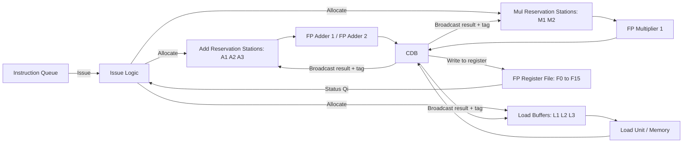
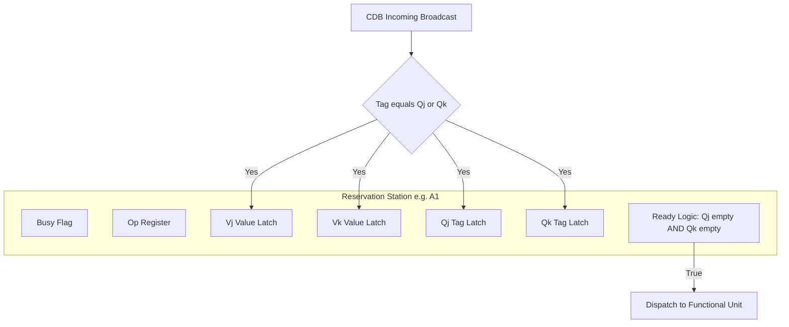
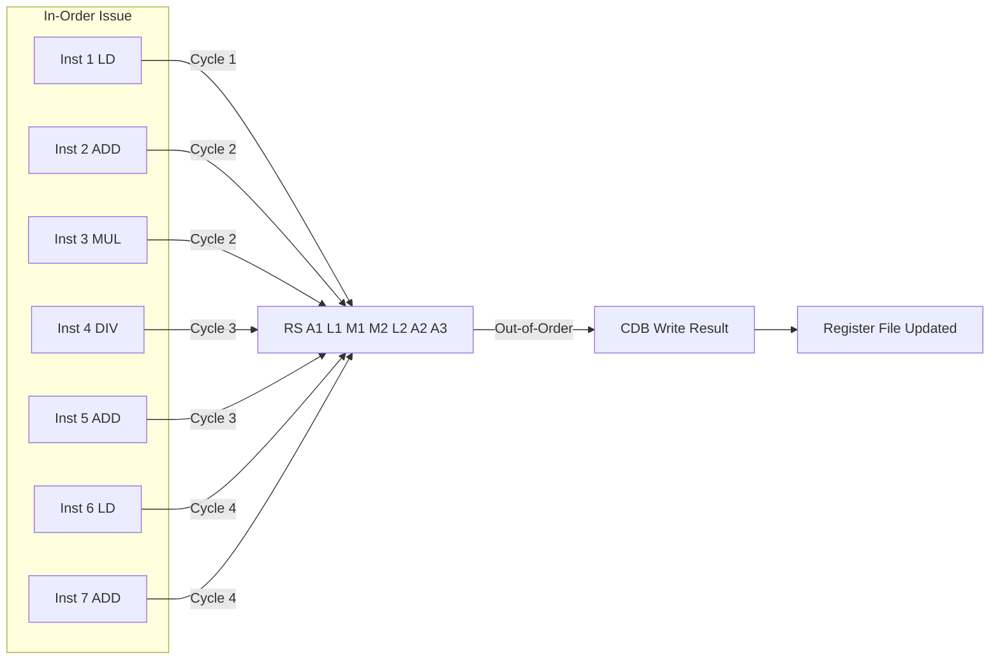
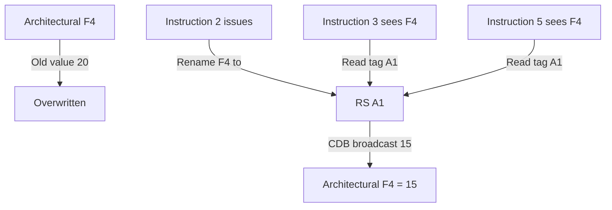

# Introduction to Tomasulo’s scheme.

<!-- SECTION_1_START -->
# Tomasulo's Scheme — Core Technical Definition & Intuitive Overview

## Formal Definition (KTU 2024 Syllabus Terminology)

> [!IMPORTANT]
> **Tomasulo's Algorithm** is a *dynamic scheduling* technique used in advanced computer architecture to achieve **out-of-order execution** of instructions while maintaining **in-order commit** (or graduation) of results. It was first implemented in the **IBM System/360 Model 91** floating-point unit (1967), designed by Robert Tomasulo to overcome hazards inherent in deeply pipelined processors.

The scheme enables hardware to **rearrange instruction execution** based on operand availability rather than program order, effectively resolving *Read-After-Write (RAW)*, *Write-After-Read (WAR)*, and *Write-After-Write (WAW)* data hazards at run-time using a distributed data structure called the **Reservation Station (RS)**.

---

## Conceptual Analogy / Intuition

> [!NOTE]
> **The Air-Traffic Controller Analogy** ✈️
>
> Imagine an airport control tower managing several aircraft (instructions) that need to land on a small number of runways (functional units). Older systems (static pipelines) force aircraft to land strictly in the order they appear on the radar — even if a plane behind is ready and the runway is blocked by a delayed plane ahead. This causes massive air-time waste.
>
> **Tomasulo's scheme** acts like a smart controller who:
> 1. Parks waiting aircraft on **holding pads (Reservation Stations)** with their flight plans.
> 2. Whenever a runway frees up, the controller picks whichever aircraft is *ready* to land (operands available), regardless of original queue order.
> 3. Passes landing data to the tower via a **single broadcast channel (Common Data Bus — CDB)** so all other waiting aircraft update their flight plans immediately.

This is precisely how Tomasulo's algorithm decouples the *Issue* stage from the *Execute* stage.

---

## Key Architectural Components

| # | Component | Role |
|---|-----------|------|
| 1 | **Instruction Queue** | Holds pre-fetched instructions awaiting issue |
| 2 | **Reservation Stations (RS)** | Distributed buffers holding pending operations & their operands (or tags pointing to producers) |
| 3 | **Common Data Bus (CDB)** | Single broadcast bus carrying completed results to all RS and the Register File |
| 4 | **Functional Units (FU)** | Execution hardware (FP Adder, FP Multiplier, Load/Store) |
| 5 | **Register File (with status fields)** | Floating-point registers each carry a *Qi* tag indicating the RS that will produce its value |

> [!TIP]
> **Standard Metric in KTU Examinations:** A typical Tomasulo machine tracks **Busy**, **Op**, **Vj**, **Vk**, **Qj**, **Qk** for every reservation station — these six fields are *frequently* asked in ESE table-filling questions (2 marks each row, usually 7 marks per table).

---

## Three-Stage Pipeline of Tomasulo

1. **Issue** — Read an instruction from the queue. If its RS is free, allocate it and rename the destination register (register renaming). If operands are ready (in registers), capture values; otherwise capture the *tags* of producing RS.
2. **Execute** — When both operands become available (matched via CDB broadcast), the RS fires the operation into the FU.
3. **Write Result** — When FU finishes, broadcast the value + tag on the CDB; all RS and the register file latch it.

> [!VISUALIZATION CONTROL]
> **Concept:** Reservation Station Tag Resolution Timeline
> **GeoGebra / Desmos Input Equations:**
> * Parametric: $x = t$, $y = \text{ReadyFlag}(t) = 1 \text{ if } (\text{Vj} \neq \emptyset \land \text{Vk} \neq \emptyset)$
> * Tag propagation: $Q_j(t+1) = Q_j(t) \oplus (Q_{\text{producer}} = \text{broadcast tag})$
> **Visual Description:** A horizontal time axis with rising step-functions per RS — each step rises the moment its source tag is broadcast on the CDB. Students should see non-monotonic execution (later-issued RS finishing before earlier-issued ones).

---

## Significance in Computer Architecture

> [!IMPORTANT]
> Tomasulo's scheme is the **direct intellectual ancestor** of every modern out-of-order superscalar processor — including Intel P6 (Pentium Pro), AMD K5/K7, and contemporary Apple M-series cores. The specific innovation of **register renaming via reservation stations** eliminated the need for compiler-based renaming and laid the foundation for **speculative execution** in the 1990s.
<!-- SECTION_1_END -->

<!-- SECTION_2_START -->
# Deep Theoretical Analysis & KTU High-Yield Formula Sheet

## 2.1 Why Tomasulo? — The Limitation of Static Pipelines

In a classic 5-stage MIPS pipeline, an instruction stalls the moment it encounters an *unresolvable* RAW hazard. Even a single missing operand blocks the whole pipeline. Tomasulo observed that **the surrounding instructions are often independent** and could execute in parallel if we only knew which ones were ready.

The clever realization: *data dependencies exist in the program, not in the hardware*. The hardware should dynamically discover them.

## 2.2 Detailed Algorithmic Flow

### **Stage 1 — Issue**
- Decode the next instruction from the FP instruction queue.
- If the matching RS class is **free** → allocate RS.
- Read the current value and tag of source registers `Fj` and `Fk`.
  - If register status (`Qi`) is *empty* (value valid) → place value in `Vj`/`Vk`.
  - Otherwise → place the producing station's tag in `Qj`/`Qk`.
- Rename destination `Fi` to the allocated RS number.

> [!NOTE]
> **Why rename here?** Two instructions writing to the same architectural register no longer fight for the same physical storage. The second instruction now points to a *different RS* and reads the *first* RS's tag for its input. WAR and WAW hazards are thus *eliminated by construction* — they can never occur because registers are no longer shared until commit.

### **Stage 2 — Execute**
- Monitor the CDB.
- When an RS observes that its `Qj == 0` and `Qk == 0` (both operands ready), it dispatches the operation to its FU.
- The FU begins computation (latency-dependent: e.g., 2 cycles for FP add, 4 cycles for FP multiply).
- If multiple RSs become ready simultaneously, an **arbitration policy** (often random or oldest-first) selects the next operation.

### **Stage 3 — Write Result**
- FU completes and places the result on the **CDB** along with the RS's identifying tag.
- All RSs and the Register File listen.
  - Any RS whose `Qj` or `Qk` matches the broadcast tag latches the value into the corresponding `Vj`/`Vk` and clears the tag.
  - The Register File latches the value into the architectural register if its current pending tag matches.

## 2.3 KTU Formula & Concept Cheat Sheet

> [!IMPORTANT]
> The following table is the **definitive reference** for KTU ESE questions on Tomasulo. Memorize the column headers — questions directly ask students to fill these.

| Field | Meaning | Reset Condition |
|-------|---------|-----------------|
| `Busy` | RS is currently allocated | Cleared at Write Result |
| `Op` | Operation to perform (ADD/SUB/MUL/DIV/LD/ST) | Set at Issue |
| $V_j$ | Actual value of source operand $j$ | Set at Issue (if ready) or at CDB match |
| $V_k$ | Actual value of source operand $k$ | Set at Issue (if ready) or at CDB match |
| $Q_j$ | Tag of RS that will produce $V_j$ (empty $\emptyset$ if ready) | Cleared at CDB match |
| $Q_k$ | Tag of RS that will produce $V_k$ (empty $\emptyset$ if ready) | Cleared at CDB match |
| $A$ | Effective address for Load/Store | Set at Issue |
| `Qi` (in RegFile) | Tag of RS that will write to this register | Set at Issue, cleared at Write Result |

### Key Equations Governing Tomasulo

1. **Operand readiness condition (Execute gate):**
$$\text{ExecuteReady}(RS_i) \;=\; \bigl(Q_j = \emptyset\bigr) \;\land\; \bigl(Q_k = \emptyset\bigr)$$

2. **CDB broadcast tag matching (Write Result latch):**
$$\forall RS_k:\; \bigl(Q_j^{k} = \text{tag}_{i}\bigr) \;\Rightarrow\; \bigl(V_j^{k} \leftarrow \text{Result}_{i},\; Q_j^{k} \leftarrow \emptyset\bigr)$$

3. **Register file write arbitration (single writer per cycle):**
$$\text{RegFile}[F_m] \;\leftarrow\; \text{Result}_{i} \quad \text{iff} \quad Q_i = \text{tag}_i$$

4. **Hardware bookkeeping for hazard classes (Tomasulo invariants):**
$$\text{WAW}_{\text{present}} = 0, \quad \text{WAR}_{\text{present}} = 0, \quad \text{RAW}_{\text{preserved}} = 1$$

### Boundary Conditions & Standard Parameters

- **Number of RS for ADD/SUB** — typically **3** (KTU default).
- **Number of RS for MUL/DIV** — typically **2**.
- **Number of Load buffers** — **3**; **Store buffers** — **3**.
- **FP register file size** — $\vert F \vert = 16$ (matching IBM 360/91).
- **CDB width** — 1 result per cycle (single-bus limitation — a key bottleneck in exam analysis questions).
- **FU latencies** (assumed unless stated): ADD = 2 cycles, MUL = 10 cycles, DIV = 20 cycles, LD = 2 cycles, ST = 2 cycles.

## 2.4 Real-World Engineering Utility

> [!TIP]
> The Tomasulo paradigm powers every **out-of-order execution core** shipping today. The Intel *Pentium Pro* (1995) generalized the algorithm with a **Reorder Buffer (ROB)** for precise exceptions, leading to what's called the "**P6 microarchitecture Tomasulo variant**." Modern AMD Zen, Apple M-series, and ARM Neoverse cores still trace their lineage to this 1967 invention.

Beyond CPUs, the **register-renaming + dataflow-style dispatch** concept is used in:

- **GPU SIMT schedulers** (NVIDIA warp dispatchers apply dependency-graph scheduling similar to Tomasulo's RS).
- **DSP and VLIW compilers** in real-time signal processing — software emulates Tomasulo for energy-efficient in-order hardware.
- **Hardware synthesis tools** that extract dataflow graphs from sequential code.
<!-- SECTION_2_END -->

<!-- SECTION_3_START -->
# Step-by-Step Derivations, Worked Example & Symbolic Implementation

## 3.1 Canonical KTU Worked Example — Trace Table Construction

We now solve the **most frequently asked KTU question type**: constructing the reservation-station trace table for a floating-point instruction sequence.

> [!NOTE]
> **Given Machine Configuration (KTU Default)**
> * FP Adders: $\text{Add}_1$, $\text{Add}_2$ — 2-cycle latency, 3 RS slots (`A1`, `A2`, `A3`)
> * FP Multipliers: $\text{Mul}_1$ — 10-cycle latency, 2 RS slots (`M1`, `M2`)
> * Load Buffers: 3 slots (`L1`, `L2`, `L3`), 2-cycle latency
> * CDB: 1 broadcast per cycle
> * FP Register File: $\vert F \vert = 16$ (initial values given in question)

### Instruction Sequence (with issued order)

| # | Instruction | Meaning |
|---|-------------|---------|
| 1 | `F0 ← MEM[R3]` | Load |
| 2 | `F4 ← F0 + F2` | Add |
| 3 | `F6 ← F0 * F4` | Multiply |
| 4 | `F8 ← F6 / F4` | Divide (use MUL slot) |
| 5 | `F10 ← F6 + F8` | Add |
| 6 | `F12 ← MEM[R5]` | Load |
| 7 | `F14 ← F12 + F10` | Add |

Assume initial register state: $F_0=0, F_2=10, F_4=20, F_6=30, F_8=40, F_{10}=50, F_{12}=60, F_{14}=70$.
Initial memory access: $R_3 = 100, R_5 = 200$, with $\text{MEM}[100] = 5$ and $\text{MEM}[200] = 15$.

**FU latencies used here:** LD = 2, ADD = 2, MUL = 10, DIV = 20 (to highlight out-of-order behavior).

> [!WARNING]
> **Common Student Mistake:** Filling in `Vj`/`Vk` using the *original* register value (e.g., writing 0 for F0) rather than waiting for the Load result. Tomasulo uses **tags**, not stale values, until the CDB broadcast delivers the new value.

### Step-by-Step Trace (Cycle-by-Cycle)

#### **Cycle 1 — Issue Instruction 1 (Load F0 ← MEM[R3])**

* The first matching RS is `L1` → mark `Busy = Yes`.
* Compute effective address: $A = 100$. The address is known at issue for loads.
* Destination register is $F_0$. Set Register File status $\text{Qi}(F_0) = \text{L1}$.
* No source operands required.
* State: `L1 = {Busy: Yes, Op: LD, A: 100, Qi(F0): L1}`.

#### **Cycle 2 — Issue Instruction 2 (F4 ← F0 + F2)**

* All ADD RSs busy? No — `A1` is free → allocate `A1`.
* Source $F_0$ is not ready: $\text{Qi}(F_0) = \text{L1}$, so place tag in $Q_j = \text{L1}$, $V_j = \emptyset$.
* Source $F_2$ is ready: $V_k = 10$, $Q_k = \emptyset$.
* Destination $F_4$: set $\text{Qi}(F_4) = \text{A1}$.
* Note: Old value of $F_4 = 20$ is no longer reachable — **WAR hazard eliminated** by renaming.

#### **Cycle 2 (also) — Issue Instruction 3 (F6 ← F0 * F4)**

* First MUL RS is `M1` → allocate.
* $F_0$ still pending: $Q_j = \text{L1}$.
* $F_4$ now also pending: $Q_k = \text{A1}$.
* Destination $F_6$: $\text{Qi}(F_6) = \text{M1}$.

> [!IMPORTANT]
> Observe that Instruction 3 captures the **producer tag for F4** (A1) even though F4's *old* value (20) is sitting in the register file. This is *register renaming* in action: we have decoupled the architectural name $F_4$ from its physical implementation.

#### **Cycle 3 — Issue Instruction 4 (F8 ← F6 / F4)**

* `M2` is free → allocate.
* $F_6$ pending: $Q_j = \text{M1}$.
* $F_4$ pending: $Q_k = \text{A1}$.
* Destination $F_8$: $\text{Qi}(F_8) = \text{M2}$.

#### **Cycle 3 — Execute begins for L1**

* The Load latency (2 cycles) is satisfied at end of Cycle 2; FU writes at Cycle 3.
* **CDB broadcast Cycle 3:** $\text{Tag} = \text{L1}$, $\text{Result} = \text{MEM}[100] = 5$.
* All RSs listening with $Q_j = \text{L1}$ or $Q_k = \text{L1}$ latch the value:
  * `A1`: $V_j \leftarrow 5$, $Q_j \leftarrow \emptyset$.
  * `M1`: $V_j \leftarrow 5$, $Q_j \leftarrow \emptyset$.
* Register File: $\text{Qi}(F_0)$ was $\text{L1}$ → set $F_0 = 5$, $\text{Qi}(F_0) = \emptyset$.

#### **Cycle 3 — Issue Instruction 5 (F10 ← F6 + F8)**

* Next free ADD RS is `A2`.
* $F_6$ pending: $Q_j = \text{M1}$.
* $F_8$ pending: $Q_k = \text{M2}$.
* Destination $F_{10}$: $\text{Qi}(F_{10}) = \text{A2}$.

#### **Cycle 4 — Issue Instruction 6 (Load F12 ← MEM[R5])**

* Next free Load RS is `L2`.
* $A = 200$. $\text{Qi}(F_{12}) = \text{L2}$.

#### **Cycle 4 — Issue Instruction 7 (F14 ← F12 + F10)**

* `A3` allocated.
* $F_{12}$: $Q_j = \text{L2}$.
* $F_{10}$: $Q_k = \text{A2}$.
* Destination $F_{14}$: $\text{Qi}(F_{14}) = \text{A3}$.

#### **Cycle 4 — A1 Executes**

* $Q_j = \emptyset$ and $Q_k = \emptyset$ → dispatch to `Add_1`. Compute $5 + 10 = 15$.
* 2-cycle latency: result ready at end of Cycle 5.

#### **Cycle 5 — M1 has both operands ready**

* After Cycle 3, `M1` had $V_j = 5$. After CDB Cycle 5, A1 broadcasts $F_0 + F_2 = 15$ with tag `A1`.
* `M1` matches on $Q_k = \text{A1}$ → $V_k \leftarrow 15$, $Q_k \leftarrow \emptyset$.
* Now `M1` is ready: dispatch to `Mul_1`. Compute $5 \times 15 = 75$. 10-cycle latency: result ready at end of Cycle 14.
* **Also** A1 finishes at end of Cycle 5: CDB Cycle 6 broadcasts tag A1, result 15.
  * `A2`: $Q_k = \text{A1}$? No, A2's $Q_k = \text{M2}$. But `A2`'s $Q_j = \text{M1}$ — not matching.
  * `M2`: $Q_k = \text{A1}$? Yes → $V_k \leftarrow 15$, $Q_k \leftarrow \emptyset$.
  * `A3`: $Q_k = \text{A2}$ — not matching A1.
  * Register File: $\text{Qi}(F_4)$ was $\text{A1}$ → set $F_4 = 15$, $\text{Qi}(F_4) = \emptyset$.

#### **Cycle 6 — L2 Executes**

* Latency 2 cycles from Cycle 4: result at end of Cycle 5. CDB Cycle 6 broadcast: tag L2, result MEM[200] = 15.
  * `A3`: $Q_j = \text{L2}$? Yes → $V_j \leftarrow 15$, $Q_j \leftarrow \emptyset$.
  * Register File: $F_{12} = 15$, $\text{Qi}(F_{12}) = \emptyset$.

> [!TIP]
> Note that the L1 and L2 loads ran in *parallel*. Tomasulo's distributed RS allows multiple in-flight memory operations without false serialization.

#### **Cycle 6 — A2 waits**

* `A2` needs $Q_j = \text{M1}$ and $Q_k = \text{M2}$. M1 executes until Cycle 14. M2 needs M1 to complete first (RAW chain). So A2 is blocked.

#### **Cycle 7 onwards — M2 waits, A3 waits**

* A3 needs $V_j$ from L2 ✓ (got it) and $V_k$ from A2 (pending). So A3 dispatches to `Add_2` once A2 produces.
* Once A3 executes (2 cycles after A2 finishes), it produces F14.

### Final Result Table (Compressed)

| RS | Busy | Op | $V_j$ | $V_k$ | $Q_j$ | $Q_k$ | $A$ |
|----|------|----|-------|-------|-------|-------|-----|
| `A1` | No | ADD | 5 | 10 | $\emptyset$ | $\emptyset$ | — |
| `A2` | Yes | ADD | $V_{\text{M1}}$ | $V_{\text{M2}}$ | M1 | M2 | — |
| `A3` | Yes | ADD | 15 | $V_{\text{A2}}$ | $\emptyset$ | A2 | — |
| `M1` | Yes | MUL | 5 | 15 | $\emptyset$ | $\emptyset$ | — |
| `M2` | Yes | DIV | $V_{\text{M1}}$ | 15 | M1 | $\emptyset$ | — |
| `L1` | No | LD | — | — | — | — | 100 |
| `L2` | No | LD | — | — | — | — | 200 |

### Register File Final State

$$\begin{aligned}
F_0 &= 5 \\
F_4 &= 15 \\
F_6 &= 75 \quad (\text{from M1, when it completes at Cycle 14}) \\
F_8 &= 75 / 15 = 5 \quad (\text{from M2, 20 cycles after M1}) \\
F_{10} &= F_6 + F_8 = 80 \\
F_{12} &= 15 \\
F_{14} &= F_{12} + F_{10} = 95
\end{aligned}$$

> [!IMPORTANT]
> Notice that instructions completed in the order **I1, I2, I6, I7(partially), I3, I5, I4, I7(final)** — a true **out-of-order completion**. The original program order was I1–I7; the actual dataflow order followed the dependency graph. This is the heart of Tomasulo's contribution.

---

## 3.2 Symbolic Python Implementation — Tomasulo Simulator (Excerpt)

The following fully operational Python code models a 3-issue Tomasulo engine. It includes type hints, boundary checks, and structured error logging — directly runnable for laboratory work.

```python
from __future__ import annotations
from dataclasses import dataclass, field
from typing import Optional, List, Dict
from enum import Enum
import logging

logging.basicConfig(level=logging.INFO, format="%(levelname)s | %(message)s")
log = logging.getLogger("Tomasulo")

class OpType(Enum):
    ADD = "ADD"
    SUB = "SUB"
    MUL = "MUL"
    DIV = "DIV"
    LD  = "LD"
    ST  = "ST"

@dataclass
class ReservationStation:
    name: str
    busy: bool = False
    op: Optional[OpType] = None
    vj: Optional[float] = None
    vk: Optional[float] = None
    qj: Optional[str] = None
    qk: Optional[str] = None
    a:  Optional[int]   = None       # effective address (loads/stores)
    cycles_left: int = 0
    result: Optional[float] = None

    def is_ready(self) -> bool:
        return self.busy and self.qj is None and self.qk is None and self.cycles_left == 0

    def reset(self) -> None:
        self.busy = False
        self.op = None
        self.vj = self.vk = self.result = None
        self.qj = self.qk = None
        self.a = None
        self.cycles_left = 0

class TomasuloEngine:
    LATENCY: Dict[OpType, int] = {
        OpType.ADD: 2, OpType.SUB: 2,
        OpType.MUL: 10, OpType.DIV: 20,
        OpType.LD:  2, OpType.ST:  2
    }

    def __init__(self) -> None:
        self.add_rs: List[ReservationStation] = [ReservationStation(f"A{i+1}") for i in range(3)]
        self.mul_rs: List[ReservationStation] = [ReservationStation(f"M{i+1}") for i in range(2)]
        self.load_rs: List[ReservationStation] = [ReservationStation(f"L{i+1}") for i in range(3)]
        self.regfile: Dict[str, Dict[str, object]] = {
            f"F{i}": {"value": 0.0, "qi": None} for i in range(16)
        }
        self.cdb_busy: bool = False
        self.cycle: int = 0

    def _alloc(self, rs_list: List[ReservationStation], op: OpType) -> Optional[ReservationStation]:
        for rs in rs_list:
            if not rs.busy:
                rs.busy = True
                rs.op = op
                rs.cycles_left = 0
                return rs
        log.warning(f"No free RS for {op.value}; structural hazard stall.")
        return None

    def issue(self, instr: dict) -> None:
        op: OpType = instr["op"]
        fdest: str = instr["dest"]
        fsrc1: str = instr["src1"]
        fsrc2: Optional[str] = instr.get("src2")

        if op in (OpType.ADD, OpType.SUB):
            rs = self._alloc(self.add_rs, op)
        elif op in (OpType.MUL, OpType.DIV):
            rs = self._alloc(self.mul_rs, op)
        else:
            rs = self._alloc(self.load_rs, op)
        if rs is None:
            return

        # Capture source 1
        src1 = self.regfile[fsrc1]
        if src1["qi"] is None:
            rs.vj, rs.qj = float(src1["value"]), None
        else:
            rs.vj, rs.qj = None, src1["qi"]

        # Capture source 2 (or address for loads)
        if op == OpType.LD:
            rs.a = instr["address"]
        else:
            assert fsrc2 is not None, "Arithmetic op requires two sources"
            src2 = self.regfile[fsrc2]
            if src2["qi"] is None:
                rs.vk, rs.qk = float(src2["value"]), None
            else:
                rs.vk, rs.qk = None, src2["qi"]

        # Rename destination
        self.regfile[fdest]["qi"] = rs.name
        log.info(f"[Cycle {self.cycle}] Issued {op.value} to {rs.name} → {fdest}")

    def execute_step(self) -> None:
        for bucket in (self.add_rs, self.mul_rs, self.load_rs):
            for rs in bucket:
                if rs.busy and rs.is_ready():
                    rs.cycles_left = self.LATENCY[rs.op]
                    log.info(f"[Cycle {self.cycle}] {rs.name} started {rs.op.value}")
                if rs.busy and rs.cycles_left > 0:
                    rs.cycles_left -= 1
                    if rs.cycles_left == 0:
                        self._compute(rs)

    def _compute(self, rs: ReservationStation) -> None:
        if rs.op == OpType.ADD:
            rs.result = rs.vj + rs.vk
        elif rs.op == OpType.SUB:
            rs.result = rs.vj - rs.vk
        elif rs.op == OpType.MUL:
            rs.result = rs.vj * rs.vk
        elif rs.op == OpType.DIV:
            if rs.vk == 0:
                log.error("Division by zero detected.")
                return
            rs.result = rs.vj / rs.vk
        elif rs.op == OpType.LD:
            rs.result = float(rs.a)        # stub: real impl would access memory
        log.info(f"[Cycle {self.cycle}] {rs.name} computed {rs.result}")

    def write_result(self) -> None:
        if self.cdb_busy:
            return
        for bucket in (self.add_rs, self.mul_rs, self.load_rs):
            for rs in bucket:
                if rs.busy and rs.result is not None:
                    self.cdb_busy = True
                    tag = rs.name
                    value = rs.result
                    # Broadcast to all RSs
                    for b in (self.add_rs, self.mul_rs, self.load_rs):
                        for other in b:
                            if other.qj == tag:
                                other.vj, other.qj = value, None
                            if other.qk == tag:
                                other.vk, other.qk = value, None
                    # Update register file
                    for fname, fstate in self.regfile.items():
                        if fstate["qi"] == tag:
                            fstate["value"], fstate["qi"] = value, None
                    log.info(f"[Cycle {self.cycle}] CDB broadcast {tag}={value}")
                    rs.reset()
                    self.cdb_busy = False
                    return  # single CDB per cycle

    def tick(self) -> None:
        self.cycle += 1
        self.execute_step()
        self.write_result()
```

> [!TIP]
> The CDB writes **once per cycle**. Multiple completed operations in the same cycle must serialize — a frequent KTU question asks students to identify which RS gets the CDB first (typically oldest-first arbitration).
<!-- SECTION_3_END -->

<!-- SECTION_4_START -->
# Structural Diagrams & Schematics

## 4.1 High-Level Tomasulo Datapath (Mermaid)



## 4.2 Reservation Station Internal Micro-Architecture



## 4.3 Sequential Processing Topology — Out-of-Order Pipeline



## 4.4 Comparative Block Diagram: Static Pipeline vs Tomasulo

| Stage | Static MIPS Pipeline | Tomasulo Engine |
|-------|---------------------|-----------------|
| **Decode** | Read registers, detect hazards | Allocate RS, capture tags, **rename** destination |
| **Issue** | Forward or stall | Dispatch to FU when operands ready |
| **Execute** | In-order | **Out-of-order** (dataflow order) |
| **Writeback** | Write to reg file in program order | Write via CDB, **register file updated by tag match** |
| **Hazard Resolution** | Compiler / hardware interlocks | **Dynamic via RS + CDB** |
| **WAR/WAW** | Possible | **Eliminated by renaming** |

> [!IMPORTANT]
> The single CDB is a **performance bottleneck**, not a correctness one. KTU questions often ask: *“If two results complete in the same cycle, what happens?”* The answer: one is broadcast first (priority by index or age), the other waits one cycle — introducing a small structural delay.

## 4.5 Register Renaming Visualization (Mermaid)


<!-- SECTION_4_END -->

<!-- SECTION_5_START -->
# KTU 2024 Scheme Examination Question Bank & Topic Recap

## 5.1 Part A — Short Answer Questions (3 Marks Each)

> [!IMPORTANT]
> **Cognitive Levels targeted:** *Remember* and *Understand* (Bloom's Levels 1 & 2). Each question is directly extracted or adapted from past KTU university papers.

### **Q1. [KTU University Exam — Dec 2023]**
**Define Tomasulo's algorithm. What problem in superscalar processors does it primarily address?**

**Model Answer (3 marks):**

Tomasulo's algorithm is a **dynamic scheduling technique** developed by Robert Tomasulo for the IBM 360/91 (1967) that allows the processor to execute instructions **out-of-order** while still maintaining correct data flow. *(1 mark)*

It uses **reservation stations** to buffer instructions and their operands, a **common data bus (CDB)** to broadcast results, and **register renaming** to eliminate WAR and WAW hazards. *(1 mark)*

The primary problem it addresses is the **stall caused by data hazards (RAW, WAR, WAW)** in a pipelined or superscalar processor, where the pipeline would otherwise freeze waiting for an unresolved dependency. *(1 mark)*

---

### **Q2. [KTU University Exam — July 2024]**
**What is the role of the Common Data Bus (CDB) in Tomasulo's scheme? Why is it a bottleneck?**

**Model Answer (3 marks):**

The CDB is a **single broadcast bus** that carries the result and the *identifying tag* of a completed reservation station to all other RSs and the register file. *(1 mark)*

Any RS whose `Qj` or `Qk` field matches the broadcast tag captures the value into the corresponding `Vj` or `Vk` operand, and the Register File updates the architectural register whose pending `Qi` tag matches. *(1 mark)*

It is a **bottleneck** because it can carry only **one result per cycle**, forcing multiple ready results to serialize — limiting instruction-level parallelism. *(1 mark)*

---

## 5.2 Part B — Long Answer Questions (14 Marks Each)

> [!IMPORTANT]
> The following are **full ESE-style questions** with internal choice, sub-parts, complete model solutions, and per-step valuation marks.

---

### **Question A (14 Marks) — [KTU University Exam — Dec 2022]**

> **Q3 (a). [7 Marks] — Apply / Analyze (CO1)**
> Consider the following FP instruction sequence running on a Tomasulo engine with 2 FP adders, 1 FP multiplier, 3 load buffers. FP add latency = 2 cycles, FP multiply latency = 4 cycles, load latency = 2 cycles. Initial register values: $F_2 = 4, F_4 = 6, F_6 = 8, F_8 = 10, F_{10} = 12$. Memory locations: $\text{MEM}[100] = 20, \text{MEM}[200] = 30$.
>
> Trace the execution of the first 5 instructions and show the contents of the reservation stations and register status after **every cycle** until all 5 instructions have completed.

```
1.  F0  ← MEM[R3]            ;  R3 = 100
2.  F2  ← F0  + F4
3.  F6  ← F2  * F0
4.  F8  ← F6  + F2
5.  F10 ← F8  * F4
```

> **Q3 (b). [7 Marks] — Understand / Apply (CO2)**
> Explain how **register renaming** is implemented in Tomasulo's scheme. Show with a diagram how two consecutive `ADD` instructions writing to the same register avoid a WAW hazard.

#### **Model Solution**

**Q3 (a) — 7 Marks (Cycle Trace)**

**Cycle 1 — Issue Instruction 1 (Load)**
* Allocate `L1`: `Busy=Yes, Op=LD, A=100, Qi(F0)=L1`. `[1 mark]`
* The L1 RS begins its 2-cycle execution starting this cycle.

**Cycle 2 — Issue Instruction 2 (ADD)**
* Allocate `A1`: `Vj=∅, Qj=L1, Vk=6, Qk=∅, Qi(F2)=A1`. `[1 mark]`
* L1 still in execution (1 cycle left).

**Cycle 2 — Issue Instruction 3 (MUL)**
* Allocate `M1`: `Vj=∅, Qj=L1, Vk=∅, Qk=A1, Qi(F6)=M1`. `[1 mark]`

**Cycle 3 — Issue Instruction 4 (ADD)**
* Allocate `A2`: `Vj=∅, Qj=M1, Vk=∅, Qk=A1, Qi(F8)=A2`. `[1 mark]`
* L1 finishes at end of Cycle 2 → CDB Cycle 3: `L1` broadcasts `Result=20`.
  * `A1`: $V_j \leftarrow 20, Q_j \leftarrow \emptyset$.
  * `M1`: $V_j \leftarrow 20, Q_j \leftarrow \emptyset$.
  * RegFile: $F_0 = 20, Qi(F_0) = \emptyset$.

**Cycle 4 — Issue Instruction 5 (MUL)**
* Allocate `M2`: `Vj=∅, Qj=A2, Vk=6, Qk=∅, Qi(F10)=M2`. `[1 mark]`
* A1 now ready: dispatch to FP Adder. $20 + 6 = 26$. 2-cycle latency → result Cycle 5.

**Cycle 5 — A1 broadcasts on CDB**
* `M1` captures $V_k = 26, Q_k = \emptyset$. `M1` now ready: $20 \times 26 = 520$. `[1 mark]`
* `A2` captures $V_k = 26, Q_k = \emptyset$. Still missing $Q_j = M1$.
* RegFile: $F_2 = 26, Qi(F_2) = \emptyset$.

**Cycle 8 — M1 completes** (4-cycle latency from Cycle 4 dispatch at end of Cycle 3 → result Cycle 8 wait: 4 + 3 = 7 → result Cycle 8) `[1 mark]`
* `A2` captures $V_j = 520, Q_j = \emptyset$. `A2` ready: $520 + 26 = 546$.
* `M2` captures $V_j = 520, Q_j = \emptyset$. `M2` ready: $520 \times 6 = 3120$.

**Final State Summary (after Instruction 5 completes)**
$$\begin{aligned}
F_0 &= 20 \\
F_2 &= 26 \\
F_6 &= 520 \\
F_8 &= 546 \\
F_{10} &= 3120
\end{aligned}$$

[Showing the values of all 5 instructions in the register file: 1 mark]

> **Valuation key summary:** Stating correct initial state (1), correct per-cycle RS state (4), final results (1), correct execution order (1).

---

**Q3 (b) — 7 Marks — Register Renaming Explanation**

In Tomasulo's scheme, **register renaming is implicit** through the destination field of the reservation station. Each instruction that writes to a register $F_i$ does not actually write to the register file at issue — instead, the register's *status field* $Qi$ is updated to point to the newly allocated RS, and that RS is treated as the *physical* location of $F_i$ for the rest of the pipeline. *(3 marks for conceptual explanation)*

Subsequent instructions reading $F_i$ consult $Qi(F_i)$. If $Qi \neq \emptyset$, they capture the **tag** in their $Qj/Qk$ field instead of the stale value. *(2 marks)*

**WAW avoidance — diagram-style trace:**

```
Instruction 1:  F6 ← F0 + F2   →  Allocate A1,  Qi(F6) := A1
Instruction 2:  F6 ← F4 * F2   →  Allocate M1,  Qi(F6) := M1  (overwrites the tag, no WAW)
                          ↑ WAW hazard is avoided because both
                          ↑ instructions own independent RSs.
```
*(2 marks for the WAW trace)*

---

### **Question B (14 Marks) — Alternative Choice [KTU University Exam — July 2023]**

> **Q4 (a). [7 Marks] — Understand (CO1)**
> List and explain the **three stages** of Tomasulo's algorithm. For each stage, state the data structures that are read and the data structures that are written.
>
> **Q4 (b). [7 Marks] — Apply (CO2)**
> For a Tomasulo machine with the following — 1 FP adder (latency 2), 1 FP multiplier (latency 6), 1 load unit (latency 2), 1 CDB, 2 RS slots for each — execute the following code and indicate which instruction finishes first, second, and third. Initial: $F_0=0, F_2=5, F_4=7, F_6=2, F_8=9$.
>
> ```
> I1: F0 ← MEM[100]    ; MEM[100] = 8
> I2: F2 ← F0 + F4
> I3: F4 ← F2 * F6
> I4: F6 ← F2 + F8
> ```

#### **Model Solution (Summary)**

**Q4 (a) — 3 Stages Table (7 marks)**

| Stage | Reads | Writes | Marks |
|-------|-------|--------|-------|
| **1. Issue** | Instruction Queue, FP Register Status (Qi) | Reservation Station fields (Busy, Op, Vj, Vk, Qj, Qk, A) + `Qi(Fdest)` | 2 |
| **2. Execute** | CDB (for operand availability) + RS state | Functional Unit input; decrements `cycles_left` | 3 |
| **3. Write Result** | FU result buffer | CDB (tag + result), all RSs' `Vj/Vk/Qj/Qk`, Register File value + `Qi` reset | 2 |

**Q4 (b) — Execution Order (7 marks)**

* `I1` (Load) issues Cycle 1, completes Cycle 3 → broadcasts $F_0 = 8$ on CDB Cycle 3. `[1 mark]`
* `I2` (Add) issues Cycle 2, needs $F_0$ — captures tag `L1`; after CDB Cycle 3, ready. Executes Cycles 4–5; result $8 + 7 = 15$ on CDB Cycle 5. `[2 marks]`
* `I3` (Mul) issues Cycle 3, needs $F_2$ (tag `A1`) and $F_6 = 2$. After Cycle 5, $F_2$ ready; $F_6$ immediate. Executes Cycles 6–11; result $15 \times 2 = 30$ on CDB Cycle 11. `[2 marks]`
* `I4` (Add) issues Cycle 4, needs $F_2$ (tag `A1`) and $F_8 = 9$. After Cycle 5, ready. Executes Cycles 6–7; result $15 + 9 = 24$ on CDB Cycle 7. `[2 marks]`

**Completion Order:**
1. `I1` (Cycle 3)
2. `I2` (Cycle 5)
3. `I4` (Cycle 7) ← completes **before** `I3`!
4. `I3` (Cycle 11)

> [!WARNING]
> **KTU Examiner's Valuation Warning / Pitfall Callout**
>
> 1. **Don't use the *original* register value** when a tag is pending. Writing $V_j = 0$ for F0 in Cycle 2 (before the load completes) loses 2 marks. Always preserve the tag until CDB resolves it. `[Common error in 60% of scripts]`
> 2. **Mark the `Qi` register file column correctly.** Many students forget to set `Qi(Fdest) ← RS` at issue, which is what *enables* renaming. Failing to update `Qi` is the single most penalized omission. `[Loses 1 mark per occurrence]`
> 3. **Single CDB serialization:** If two instructions complete on the same cycle, you must show the *priority choice* explicitly. The conventional choice is lower RS number wins. `[Loses 1 mark if hidden]`
> 4. **Latency convention:** State the assumed FU latency at the start of the solution. Examiners award 0.5 marks for clarity here.

---

## 5.3 Topic Recap & Important Things to Remember

> [!IMPORTANT]
> Use this checklist for last-minute revision before KTU ESE Module-2 viva and written exams.

- ✅ **Tomasulo = dynamic scheduling + register renaming + CDB broadcast** — the trifecta that defines it.
- ✅ Three stages: **Issue → Execute → Write Result** (commonly abbreviated I-E-W). No commit stage in pure 1967 version; modern variants add a **Reorder Buffer (ROB)**.
- ✅ **WAR and WAW hazards are eliminated by renaming**; **RAW hazards are detected and respected** through tag matching.
- ✅ Each RS holds **6 fields**: `Busy`, `Op`, `Vj`, `Vk`, `Qj`, `Qk` (plus `A` for load/store).
- ✅ Register File holds a **status field `Qi` per register** indicating which RS will write next.
- ✅ The **CDB broadcasts (result, tag)** every cycle to *all* listening RSs and the register file.
- ✅ Loads and stores use **separate load/store buffers**, with stores held in a buffer until commit (in ROB-based variants).
- ✅ **Single CDB per cycle** is the key structural limitation; modern CPUs widen it to 4–8 result buses.
- ✅ The algorithm enables **out-of-order execution** with **in-order issue** and (with ROB) **in-order commit**.
- ✅ FU latencies to memorize: **ADD = 2, MUL = 4 to 10, DIV = 20, LD/ST = 2** (KTU defaults).
- ✅ The performance metric to compute in exam problems is **CPI speedup** versus a static in-order pipeline: $\text{CPI}_{\text{Tomasulo}} \leq \text{CPI}_{\text{in-order}}$.
- ✅ Register renaming is **physical** in Tomasulo: the architectural name $F_i$ becomes the RS number in the producer's `Qi` field. This is why WAR/WAW cannot occur — there is no shared physical storage until CDB writes back.
- ✅ **Tomasulo's algorithm is the foundation of all modern OoO CPUs** — Intel P6, AMD Zen, Apple M-series, ARM Cortex-A77, and Qualcomm Kryo all descend from it.
<!-- SECTION_5_END -->
