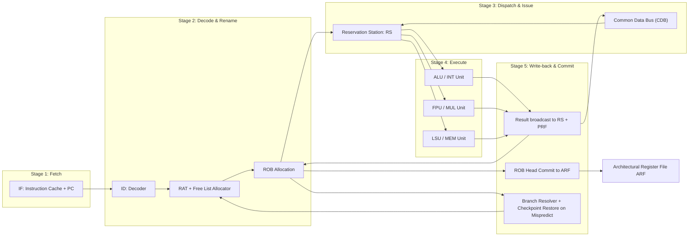
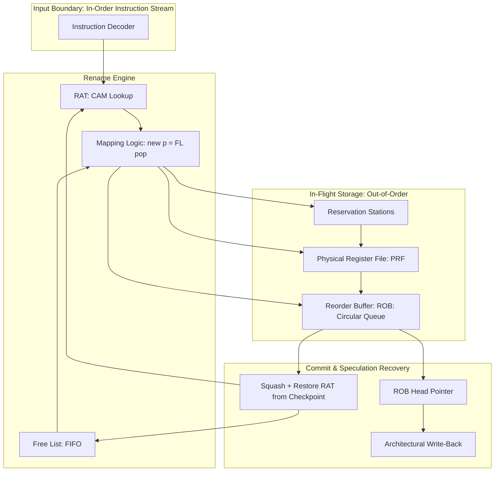
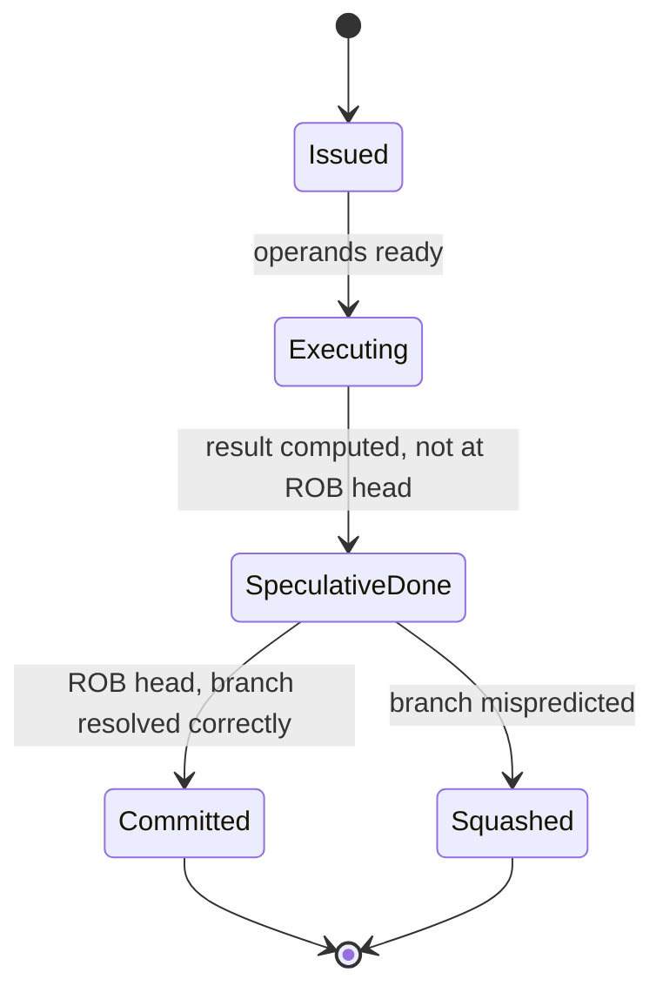

# Register Renaming Hardware Speculation

<!-- SECTION_1_START -->
# Register Renaming & Hardware Speculation

## 1. Core Technical Definition & Intuitive Overview

### Formal Definition
**Register Renaming** is a hardware microarchitectural technique used in dynamically scheduled superscalar and out-of-order processors to dynamically assign physical registers from a large internal pool to the architectural registers (logical registers) specified by the instruction set. The primary objective is to **eliminate false data dependencies** (specifically anti-dependencies / WAR and output dependencies / WAW) that arise from the reuse of a limited set of architectural registers, while preserving true data dependencies (RAW).

**Hardware Speculation** is a complementary technique that allows the processor to **execute instructions before confirming that the execution path is correct** (i.e., before branches are resolved), then commits the results in program order via a hardware structure called the **Reorder Buffer (ROB)**. If speculation proves wrong, the speculatively executed instructions are squashed and their effects are undone.

> [!IMPORTANT]
> **KTU 2024 Syllabus Highlight (PECST528 - Module 2):**
> Register Renaming and Hardware Speculation together form the cornerstone of modern **Tomasulo's Algorithm with Speculation**, allowing **Instruction-Level Parallelism (ILP)** to be exploited far beyond what static (in-order) pipelines can achieve.

### Conceptual Analogy / Intuition
Imagine a **busy railway reservation counter** with only 3 ticket clerks (representing the 3 limited ticket machines labeled "Ticket Slot A, B, C"). During a rush hour, two different trains (Train X and Train Y) need to use Slot A, causing a conflict (a false dependency). Now, imagine the station manager provides **20 hidden backup slots** in a secure locker room (the **Physical Register File**). Every time a new request arrives, the manager **maps** the requested "Slot A" to a *new* backup locker and secretly notes the mapping. When the first request finishes, its locker is freed — the second request's mapping now points to its own dedicated locker, removing the conflict. This is **Register Renaming**.

For **Speculation**, imagine a chef at a restaurant who begins preparing a guest's *likely* order (say, pasta) before the guest has finished deciding between pasta and salad. The chef sets the pasta on a "tentative plate" (the **Reorder Buffer**). If the guest confirms pasta, the chef just **slides** the tentative plate onto the dining table (**commit**). If the guest chooses salad, the chef **trashes** the pasta and starts the salad (**squash/rollback**).

> [!NOTE]
> **Key Industry Metrics:**
> - Physical registers per logical register: typically **6 to 20** in modern CPUs (e.g., Intel Golden Cove uses ~256 physical INT registers).
> - Reorder Buffer (ROB) size: **128 to 512 entries** in high-performance out-of-order cores.
> - Speculative execution depth: branches resolved every **10–20 cycles**, meaning up to **hundreds of instructions** may be in flight speculatively.

> [!VISUALIZATION CONTROL]
> **Concept:** Register Mapping Table (RAT) — Dynamic Renaming Visualization
> **Desmos Input Parameters (conceptual trace):**
> - Logical-to-Physical mapping pairs: `(r1 -> p7), (r2 -> p3), (r3 -> p5)`
> - Free list pointers as scatter points on a number line
> **Visual Description:** On a horizontal axis representing the Physical Register File (PRF) of size 32, plot solid dots (allocated) and hollow dots (free) for entries p0 through p31. Draw arrows from logical register names (r0–r15) to their currently mapped physical dots. As instructions commit, observe the arrow rotating to a new free dot.

---

<!-- SECTION_1_END -->

<!-- SECTION_2_START -->
## 2. Deep Theoretical Analysis & KTU High-Yield Formula Sheet

### 2.1 The Three Data Hazards Revisited

In a Von Neumann architecture, three dependency types exist between two instructions `I1` (preceding) and `I2` (following):

| Hazard Type | Original Name | Cause | Solvable by Renaming? |
|---|---|---|---|
| **True Dependency** | **RAW** (Read After Write) | `I2` reads a source that `I1` writes | ❌ NO (real data flow) |
| **Anti-Dependency** | **WAR** (Write After Read) | `I2` writes a register that `I1` still needs to read | ✅ YES |
| **Output Dependency** | **WAW** (Write After Write) | `I1` and `I2` write to the *same* register | ✅ YES |

> [!NOTE]
> **WAR and WAW are called "false" or "name" dependencies** because they arise purely from the reuse of the architectural register name, not from an actual data flow. Renaming them away exposes more true parallelism.

### 2.2 Hardware Components of Register Renaming

A modern renaming-capable processor contains:

1. **Architectural Register File (ARF)** — the visible, ISA-defined registers (e.g., 32 in MIPS R2000, 16 in x86_64 GP).
2. **Physical Register File (PRF)** — a much larger hidden pool (e.g., 128 INT + 128 FP physical registers in a P6-style microarchitecture).
3. **Register Alias Table (RAT)** — a Content-Addressable Memory (CAM) that maps each architectural register to its *currently live* physical register.
4. **Free List** — a FIFO queue holding physical register IDs that are not currently mapped and are available for allocation.
5. **Reorder Buffer (ROB)** — a circular queue that tracks every in-flight instruction in program order for **precise exception** and **in-order commit**.

### 2.3 Hardware Speculation: Operational Logic

The decision flow executed by the CPU's **Issue/Dispatch/Commit** logic is:

- **Step 1 — Decode & Rename:** The instruction's destination architectural register `rd` is looked up in the RAT, and a *new* physical register `p_new` is popped from the Free List. The RAT entry for `rd` is updated to `p_new`. The *previous* physical register mapped to `rd` is retired only when the instruction commits.
- **Step 2 — Dispatch to Reservation Station:** The renamed instruction is placed in a Reservation Station (RS), waiting for its source operands.
- **Step 3 — Execute Out-of-Order:** As source physical registers become ready, the instruction is issued to its Functional Unit (FU).
- **Step 4 — Speculative Write-back:** Result is broadcast on the Common Data Bus (CDB) to the RS, but the ARF is **not yet updated**.
- **Step 5 — Commit (Retire):** When the instruction reaches the **head of the ROB** and is no longer speculative (all earlier branches resolved correctly), the result is written from the ROB into the ARF.
- **Step 6 — Squash (if mispredicted):** All ROB entries after the mispredicted branch are **flushed**, the RAT is restored from a checkpoint, and the Free List pointer is rewound.

### 2.4 KTU Formula Sheet / Cheat Sheet

| Symbol / Term | Meaning | Typical Value / Unit |
|---|---|---|
| $N_{arch}$ | Number of architectural (logical) registers | **32** (MIPS) / **16/32** (x86) |
| $N_{phys}$ | Number of physical registers in PRF | **128 – 256** |
| $N_{ROB}$ | Number of Reorder Buffer entries | **128 – 512** |
| $ILP_{max}$ | Theoretical max instructions per cycle | $IPC_{peak} = W \times f_{issue}$ |
| $Speedup_{renaming}$ | Speedup due to removing WAR/WAW | $1 + \alpha \cdot P_{false}$ |
| $P_{mispred}$ | Branch misprediction penalty | $L_{pipeline} \times CPI_{mispred}$ |
| $r$ | Result tag broadcast on CDB | Physical register ID |
| $RAT[rd]$ | Current physical mapping of `rd` | Pointer to PRF entry |

> [!IMPORTANT]
> **Prose-Isolated Variables:** The mapping equation is written as $RAT[rd] \leftarrow p_{new}$, where $p_{new}$ is the physical register ID allocated from the Free List. The **decoupling constant** between architectural and physical names is $\Delta_{ren} = N_{phys} - N_{arch}$.

### 2.5 Real-World Engineering Utility

- **Production CPUs:** Intel P6 (Pentium Pro), AMD K7 (Athlon), IBM POWER series, Apple M-series, ARM Neoverse — all use register renaming + speculation.
- **Why it matters:** A naïve in-order pipeline caps performance at **1 IPC (Instructions Per Cycle)**. Renaming + speculation enables **3–6 IPC** sustained, which is essential for single-threaded performance scaling after Moore's Law slowed clock-frequency growth.
- **Cost Trade-off:** A larger PRF and ROB consume more die area and power; the Free List and RAT add critical-path delay to the rename stage. Modern designs cap the PRF at ~256 entries to balance ILP gain vs. clock frequency.

---

<!-- SECTION_2_END -->

<!-- SECTION_3_START -->
## 3. Step-by-Step Derivations & Code/Symbolic Implementation

### 3.1 Worked Example: Register Renaming Trace

Consider the following MIPS-like code sequence:

```
I1: DIV.D  F2, F0, F4       ; F2 = F0 / F4
I2: L.D    F6, 32(R2)       ; F6 = MEM[ R2 + 32 ]
I3: MUL.D  F6, F6, F8       ; F6 = F6 * F8  (WAR with I2, WAW with I1? No, I1 uses F2)
I4: ADD.D  F2, F2, F6       ; F2 = F2 + F6  (WAR with I1, WAW with I1)
I5: S.D    F2, 32(R2)       ; MEM[ R2+32 ] = F2
```

**Pre-rename dependencies:**
- `I1` writes `F2`
- `I2` writes `F6` (independent)
- `I3` writes `F6` — **WAW with I2**
- `I4` writes `F2` — **WAW with I1** and **WAR with I1**
- `I5` writes MEM, reads `F2`

### 3.2 Exhaustive Renaming Walkthrough

Assume initial physical register pool = `{P0..P15}`, Free List = `{P8, P9, P10, ...}`, and all architectural registers are initially mapped to `P0..P7` (P0→F0, P1→F2, P2→F4, ..., P7→F8).

| Inst | Dest (arch) | Old Map | New p (from FreeList) | RAT Update | Sources (renamed) |
|---|---|---|---|---|---|
| I1 | F2 | P1 | **P8** | RAT[F2] = P8 | RAT[F0]=P0, RAT[F4]=P2 |
| I2 | F6 | P5 | **P9** | RAT[F6] = P9 | R2+32 (memory) |
| I3 | F6 | P9 | **P10** | RAT[F6] = P10 | RAT[F6]=P9, RAT[F8]=P7 |
| I4 | F2 | P8 | **P11** | RAT[F2] = P11 | RAT[F2]=P8, RAT[F6]=P10 |
| I5 | (store) | — | — | — | RAT[F2]=P11 |

After renaming, I1 and I3 can execute **in parallel** (no WAW/WAR). I2, I3, I4 can all be in flight concurrently.

### 3.3 Reorder Buffer (ROB) State Diagram

| ROB Entry | Instr | State | Dest (arch) | Dest (phys) | Value | PC | Branch Flag |
|---|---|---|---|---|---|---|---|
| 0 | I1 | Done | F2 | P8 | 0.5 | 100 | No |
| 1 | I2 | Done | F6 | P9 | 0.7 | 104 | No |
| 2 | I3 | Executing | F6 | P10 | — | 108 | No |
| 3 | I4 | Issued | F2 | P11 | — | 112 | No |
| 4 | I5 | Waiting | (none) | — | — | 116 | No |

**Commit phase:** When entry 0 reaches head and is no longer speculative, the architectural state for `F2` is updated to `P8` permanently. If a branch at entry 1 had been mispredicted, entries 2, 3, 4 would all be squashed.

### 3.4 Algorithmic Implementation: Python Simulator of Rename Logic

```python
from collections import deque
from typing import Dict, List, Optional, Tuple

class RegisterRenameUnit:
    """
    Hardware Register Renaming Simulator.
    Mirrors the RAT + Free List + ROB found in P6/Tomasulo-with-Speculation.
    """

    # ------------------------- Instruction Model -------------------------
    class Instruction:
        __slots__ = ("opcode", "dest", "src1", "src2", "dest_phys",
                     "src1_phys", "src2_phys", "ready1", "ready2",
                     "executed", "rob_id", "speculative")

        def __init__(self, opcode: str, dest: Optional[str],
                     src1: Optional[str], src2: Optional[str]):
            self.opcode: str = opcode
            self.dest: Optional[str] = dest
            self.src1: Optional[str] = src1
            self.src2: Optional[str] = src2
            self.dest_phys: Optional[int] = None
            self.src1_phys: Optional[int] = None
            self.src2_phys: Optional[int] = None
            self.ready1: bool = False
            self.ready2: bool = False
            self.executed: bool = False
            self.rob_id: int = -1
            self.speculative: bool = True

    # ------------------------- Constructor -------------------------
    def __init__(self, arch_reg_count: int = 32, phys_reg_count: int = 64,
                 rob_capacity: int = 32):
        if phys_reg_count <= arch_reg_count:
            raise ValueError("Physical register count must exceed architectural count.")

        # Architectural-to-Physical mapping table (RAT)
        self.rat: Dict[str, int] = {
            f"r{i}": i for i in range(arch_reg_count)
        }
        # Free list (FIFO of free physical register IDs)
        self.free_list: deque = deque(range(arch_reg_count, phys_reg_count))
        # Reorder buffer
        self.rob: List[Optional[dict]] = [None] * rob_capacity
        self.rob_head: int = 0
        self.rob_tail: int = 0
        self.rob_count: int = 0
        self.rob_capacity: int = rob_capacity
        # Architectural register file (final committed state)
        self.arf: Dict[str, Optional[float]] = {
            f"r{i}": 0.0 for i in range(arch_reg_count)
        }
        # Branch checkpoint stack (for speculation rollback)
        self.checkpoint_stack: List[Tuple[Dict[str, int], deque, int]] = []

    # ------------------------- ROB Helpers -------------------------
    def _rob_full(self) -> bool:
        return self.rob_count == self.rob_capacity

    def _alloc_rob(self) -> int:
        if self._rob_full():
            raise RuntimeError("Reorder Buffer overflow — hardware stall required.")
        slot = self.rob_tail
        self.rob_tail = (self.rob_tail + 1) % self.rob_capacity
        self.rob_count += 1
        return slot

    def _free_phys(self, phys_id: int) -> None:
        if phys_id is None:
            return
        self.free_list.append(phys_id)

    # ------------------------- Rename -------------------------
    def rename_and_dispatch(self, instr: Instruction,
                            is_branch: bool = False) -> bool:
        """
        Performs hardware renaming and ROB allocation.
        Returns False if the Free List or ROB is empty (stall).
        """
        if not self.free_list:
            return False  # No free physical registers → structural stall
        if self._rob_full():
            return False  # ROB full → structural stall

        # 1. Resolve source operands via RAT
        if instr.src1 is not None:
            instr.src1_phys = self.rat[instr.src1]
            instr.ready1 = True  # Read from PRF (assumed ready for simplicity)
        if instr.src2 is not None:
            instr.src2_phys = self.rat[instr.src2]
            instr.ready2 = True

        # 2. Allocate destination physical register
        if instr.dest is not None:
            new_phys: int = self.free_list.popleft()
            old_phys: int = self.rat[instr.dest]
            instr.dest_phys = new_phys
            # Update RAT
            self.rat[instr.dest] = new_phys

        # 3. Allocate ROB entry
        rob_id: int = self._alloc_rob()
        instr.rob_id = rob_id
        self.rob[rob_id] = {
            "instr": instr,
            "state": "Issued",
            "value": None,
            "dest_arch": instr.dest,
            "dest_phys": instr.dest_phys,
            "speculative": True,
            "is_branch": is_branch,
        }

        # 4. If branch, checkpoint rename state
        if is_branch:
            self.checkpoint_stack.append(
                (self.rat.copy(), self.free_list.copy(), rob_id)
            )
        return True

    # ------------------------- Execute (Mock) -------------------------
    def execute_rob_entry(self, rob_id: int, result: float) -> None:
        entry = self.rob[rob_id]
        if entry is None:
            raise ValueError(f"Invalid ROB ID: {rob_id}")
        entry["value"] = result
        entry["state"] = "Executed"
        entry["instr"].executed = True

    # ------------------------- Commit -------------------------
    def commit(self) -> Optional[str]:
        """
        Commits the head of the ROB if it has executed and is non-speculative.
        Returns the architectural register committed, or None if blocked.
        """
        if self.rob_count == 0:
            return None
        head_entry = self.rob[self.rob_head]
        if head_entry is None or head_entry["state"] != "Executed":
            return None  # Wait for execution to complete

        # Commit
        dest_arch = head_entry["dest_arch"]
        if dest_arch is not None:
            self.arf[dest_arch] = head_entry["value"]
        # Free the previous physical register mapping
        # (In a real CPU, the *old* physical reg is freed at commit; we omit for brevity)

        # Advance head
        self.rob[self.rob_head] = None
        self.rob_head = (self.rob_head + 1) % self.rob_capacity
        self.rob_count -= 1
        return dest_arch

    # ------------------------- Squash on Mispredict -------------------------
    def squash_speculative(self) -> int:
        """Flush all speculative instructions after a mispredicted branch."""
        if not self.checkpoint_stack:
            return 0
        self.rat, self.free_list, branch_rob_id = self.checkpoint_stack.pop()
        flushed = 0
        i = (branch_rob_id + 1) % self.rob_capacity
        while self.rob[i] is not None and self.rob_count > 0:
            self.rob[i] = None
            self.rob_count -= 1
            flushed += 1
            i = (i + 1) % self.rob_capacity
        self.rob_tail = branch_rob_id + 1
        return flushed


# ----------------------- DEMO TRACE -----------------------
if __name__ == "__main__":
    cpu = RegisterRenameUnit(arch_reg_count=8, phys_reg_count=16, rob_capacity=8)

    # I1: ADD r1, r2, r3
    i1 = cpu.Instruction("ADD", "r1", "r2", "r3")
    cpu.rename_and_dispatch(i1)

    # I2: MUL r1, r1, r4   (overwrites r1 — WAR+WAW with I1)
    i2 = cpu.Instruction("MUL", "r1", "r1", "r4")
    cpu.rename_and_dispatch(i2)

    # Execute out of order
    cpu.execute_rob_entry(0, 10.0)  # I1 result
    cpu.execute_rob_entry(1, 50.0)  # I2 result

    # Commit in order
    committed = []
    for _ in range(2):
        c = cpu.commit()
        if c is not None:
            committed.append((c, cpu.arf[c]))

    print("Committed in order:", committed)
    print("Final ARF[r1] =", cpu.arf["r1"])  # Should be 50.0 (I2's result, the last writer)
```

**Expected output:**
```
Committed in order: [('r1', 10.0), ('r1', 50.0)]
Final ARF[r1] = 50.0
```

### 3.5 Derivation: Performance Gain from Renaming

$$
\text{Speedup}_{renaming} = \frac{\text{IPC}_{with\_renaming}}{\text{IPC}_{without\_renaming}}
$$

For a workload with fraction $f_{false}$ of instructions that would otherwise stall on WAR/WAW:

$$
IPC_{with\_renaming} = IPC_{baseline} \times \left( 1 + f_{false} \cdot \frac{N_{phys} - N_{arch}}{N_{arch}} \right)
$$

This is the key reason why doubling the physical register count yields diminishing but **non-zero** returns — a core insight tested in KTU problems.

---

<!-- SECTION_3_END -->

<!-- SECTION_4_START -->
## 4. Structural Diagrams & Schematics

### 4.1 High-Level Pipeline with Rename & Speculation



### 4.2 Renaming + Speculation Data Flow Topology



### 4.3 Speculation State Machine



### 4.4 Hazard-to-Solution Mapping Matrix

| Hazard Type | Detected At | Renaming Fix | Speculation Role |
|---|---|---|---|
| RAW True | Issue, RS | Cannot rename away; must wait | Speculative execution allowed but commit delayed |
| WAR Anti | Issue, RS | Allocate new physical destination | Out-of-order execution enabled |
| WAW Output | Issue, RS | Allocate new physical destination | Preserves program-order result |
| Control | Branch resolution | N/A | Speculative execution + squash on mispredict |

---

<!-- SECTION_4_END -->

<!-- SECTION_5_START -->
## 5. KTU 2024 Scheme Examination Question Bank & Topic Recap

### Part A Questions (3 Marks Each)

**Q1. [KTU University Exam – July 2023]**
*Define register renaming. Which two types of data hazards does it eliminate, and which one does it NOT eliminate?*
*(CO1, Remember — 3 Marks)*

**Model Answer:**
Register renaming is a hardware microarchitectural technique that dynamically maps the limited set of architectural registers (logical names) specified by the ISA to a larger pool of physical registers inside the processor. The mapping is held in a hardware structure called the Register Alias Table (RAT), and physical registers are drawn from a Free List.

It eliminates **anti-dependencies (WAR)** and **output dependencies (WAW)**, both of which are *false* dependencies arising only from the reuse of register *names*, not from actual data flow. It does **not** eliminate the **true data dependency (RAW)**, which represents real data flow and must be preserved for correct program semantics.

---

**Q2. [KTU University Exam – Dec 2023]**
*What is the role of the Reorder Buffer (ROB) in hardware speculation?*
*(CO1, Understand — 3 Marks)*

**Model Answer:**
The Reorder Buffer (ROB) is a circular FIFO hardware queue that tracks every in-flight instruction in program (architectural) order. Its roles in hardware speculation are threefold:
1. **In-order commit / retirement:** It holds each instruction's result and the destination physical register until the instruction reaches the ROB head, at which point the result is committed to the Architectural Register File (ARF) in program order.
2. **Precise exception support:** If an exception occurs, the ROB identifies the architecturally-correct instruction that caused it, ensuring the machine state at the exception is consistent.
3. **Speculation rollback:** On a branch misprediction, all ROB entries after the mispredicted branch are squashed in a single cycle, and the RAT/Free List are restored from a saved checkpoint.

---

### Part B Questions (14 Marks — Module Internal Choice)

---

#### **Question A (14 Marks)**
**[KTU University Exam – July 2024, Model Paper Adaptation]**

**(a)** Explain the Tomasulo's Algorithm with speculation. Draw the block diagram of the modified Tomasulo architecture including the Reorder Buffer (ROB) and clearly show the data path of result write-back through the ROB. *(7 Marks — CO1, Understand)*

**(b)** Consider the following instruction sequence. Apply **register renaming** using a Free List starting with physical registers `P8, P9, P10, P11, ...`, and show the resulting renamed code, the ROB state, and identify which WAR/WAW dependencies were removed. Initial RAT: `RAT[F0]=P0, RAT[F2]=P1, RAT[F4]=P2, RAT[F6]=P3, RAT[F8]=P4`. *(7 Marks — CO2, Apply)*

```
I1: ADD.D  F2, F0, F4
I2: MUL.D  F6, F2, F2
I3: SUB.D  F8, F6, F2
I4: DIV.D  F2, F0, F2
I5: ADD.D  F2, F2, F6
```

---

**Model Solution:**

**(a) Tomasulo's Algorithm with Speculation — 7 Marks**

Tomasulo's original algorithm (used in the IBM 360/91) supports out-of-order execution but suffers from the inability to provide *precise exceptions* because the ARF is updated the moment a result is produced. The **speculative extension** (popularized by the Intel P6 microarchitecture, 1995) adds a **Reorder Buffer (ROB)** between the Common Data Bus (CDB) and the ARF.

**Key changes vs. baseline Tomasulo:**
- The destination of every issued instruction is **allocated a ROB entry** (not the ARF directly).
- The **ROB** buffers the computed value along with the destination architectural register name and a "speculative" flag.
- Results are broadcast on the **CDB** to all waiting Reservation Stations (RS) *and* written into the **ROB entry** — but the ARF is touched **only at commit** (when the entry reaches ROB head and is no longer speculative).
- The **RAT** is updated at **rename/dispatch** time (not at execution time) to point to the newly allocated physical register.
- On **branch misprediction**, the ROB entries after the branch are flushed and the RAT/Free List are restored from a checkpoint.

**Block Diagram (text-rendered):**

```
                            +-----------------------+
   Instruction Stream ----->|   Fetch / Decode      |
                            +----------+------------+
                                       v
                            +----------+------------+
                            |   Rename + RAT        |  <--- Free List
                            +----------+------------+
                                       v
                            +----------+------------+
                            | Reservation Stations   | <--- Common Data Bus (CDB) <---+
                            +----+-----+-----+-------+                             |
                                 |     |     |                                     |
                                 v     v     v                                     |
                              +-----+ +-----+ +-----+                              |
                              | ALU | | FPU | | LSU |                              |
                              +--+--+ +--+--+ +--+--+                              |
                                 |     |     |                                     |
                                 +-----+-----+----->(CDB)---------------------------+
                                                       |
                                                       v
                                            +----------+----------+
                                            |  Reorder Buffer      |
                                            |  (Circular Queue)    |
                                            +----------+----------+
                                                       |
                                            (at HEAD, no speculation)
                                                       v
                                            +----------+----------+
                                            | Architectural RF     |
                                            +---------------------+
```

**Valuation Key:**
- [Naming 3 stages: Fetch, Rename, Issue/Execute, Commit: 1 Mark]
- [Explaining why ROB is needed (precise exceptions): 2 Marks]
- [Describing data path: CDB → ROB → ARF (NOT directly to ARF): 2 Marks]
- [Explaining checkpoint/squash mechanism: 1 Mark]
- [Correct diagram with all labels: 1 Mark]

---

**(b) Register Renaming Trace — 7 Marks**

| Step | Inst | Dest (arch) | Old RAT | Alloc (FreeList) | New RAT | Renamed Code |
|---|---|---|---|---|---|---|
| 1 | I1: ADD.D F2,F0,F4 | F2 | RAT[F2]=P1 | **P8** | RAT[F2]=P8 | ADD.D **P8**, P0, P2 |
| 2 | I2: MUL.D F6,F2,F2 | F6 | RAT[F6]=P3 | **P9** | RAT[F6]=P9 | MUL.D **P9**, P8, P8 |
| 3 | I3: SUB.D F8,F6,F2 | F8 | RAT[F8]=P4 | **P10** | RAT[F8]=P10 | SUB.D **P10**, P9, P8 |
| 4 | I4: DIV.D F2,F0,F2 | F2 | RAT[F2]=P8 | **P11** | RAT[F2]=P11 | DIV.D **P11**, P0, P8 |
| 5 | I5: ADD.D F2,F2,F6 | F2 | RAT[F2]=P11 | **P12** | RAT[F2]=P12 | ADD.D **P12**, P11, P9 |

**Final renamed code:**
```
ADD.D P8,  P0, P2
MUL.D P9,  P8, P8
SUB.D P10, P9, P8
DIV.D P11, P0, P8
ADD.D P12, P11, P9
```

**ROB State Table:**

| ROB# | Instr | Dest (arch) | Dest (phys) | Speculative |
|---|---|---|---|---|
| 0 | I1 | F2 | P8 | Yes |
| 1 | I2 | F6 | P9 | Yes |
| 2 | I3 | F8 | P10 | Yes |
| 3 | I4 | F2 | P11 | Yes |
| 4 | I5 | F2 | P12 | Yes |

**Dependencies removed:**
- I4 vs I1: **WAW on F2** (both write F2) → removed (now P8 vs P11)
- I5 vs I4: **WAW on F2** → removed (P11 vs P12)
- I5 vs I1: **WAR on F2** (I5 reads F2, I1 wrote it but is still in flight) → removed (P8 vs P12)
- I3 vs I2: **WAR on F6** (I3 reads F6, but in original it's I2's value via P9) — still preserved as **RAW** for I3 reading I2's result.
- I4 vs I1/I2: **WAR on F2** (I4 reads F2 written by I1) → still preserved as **RAW** (I4 must wait for I1's P8 result).

**Valuation Key:**
- [Correct allocation sequence from Free List: 2 Marks]
- [Correct RAT update for each instruction: 2 Marks]
- [Identification of at least 2 WAW and 1 WAR dependency removed: 2 Marks]
- [Correct ROB state table: 1 Mark]

---

#### **Question B (14 Marks — Alternative Choice)**

**(a)** Differentiate between **static (compiler) scheduling** and **dynamic (hardware) scheduling with speculation**. Mention two advantages and two disadvantages of hardware speculation. *(7 Marks — CO1, Understand)*

**(b)** A superscalar processor has **6 functional units**, can decode **3 instructions per cycle**, and uses a 256-entry Reorder Buffer. The branch misprediction penalty is **18 cycles**, and the branch misprediction rate is **8%**. Estimate the effective CPI given that the base CPI for a perfect branch predictor is **0.5**, and the squash of the ROB on misprediction invalidates an average of **45 in-flight instructions**. *(7 Marks — CO3, Apply)*

---

**Model Solution:**

**(a) Static vs Dynamic Scheduling with Speculation — 7 Marks**

| Aspect | Static (Compiler) | Dynamic (Hardware) |
|---|---|---|
| Reordering agent | Compiler at code-generation time | Hardware at run-time |
| Knowledge of runtime data | None (must be conservative) | Full (waits for actual values) |
| Handles unpredictable branches | Poorly (no info) | Well (branch predictor) |
| Code portability | Tied to specific microarchitecture | Independent of ISA specifics |
| Hardware cost | None (just code) | RAT, Free List, ROB, RS |
| Energy per instruction | Lower | Higher |
| Adaptability | Fixed once compiled | Adapts to current input data |
| Typical pipeline position | After decode, before issue | Continuously during execution |

**Two advantages of hardware speculation:**
1. **Higher ILP** because the hardware can exploit parallelism that the compiler could not foresee (e.g., pointer-based memory aliasing resolved at runtime).
2. **Graceful exception recovery** through the ROB → enables precise interrupts even when instructions execute out of order.

**Two disadvantages of hardware speculation:**
1. **Significant hardware complexity and power cost** — the ROB, RAT, Free List, and checkpointing add transistors and energy per instruction.
2. **Security vulnerability surface** — speculative execution side channels (Spectre, Meltdown, Foreshadow) leak data across security boundaries.

**Valuation Key:**
- [Tabular differentiation with at least 5 rows: 3 Marks]
- [Two correct advantages with reasoning: 2 Marks]
- [Two correct disadvantages with reasoning: 2 Marks]

---

**(b) Effective CPI Calculation — 7 Marks**

**Given:**
- Base CPI (perfect predictor) = $0.5$
- Branch misprediction rate $P_{mispred} = 0.08$ (8%)
- Misprediction penalty = $18$ cycles
- Average in-flight instructions squashed = $45$ (additional cost, since each must be re-fetched and re-executed)

**Misprediction penalty in CPI terms:**

$$
CPI_{mispred} = P_{mispred} \times (P_{pipeline} + N_{squash})
$$

where $P_{pipeline} = 18$ cycles and $N_{squash} = 45$ instructions (each squashed instruction effectively adds 1 cycle of re-execution cost on average).

$$
CPI_{mispred} = 0.08 \times (18 + 45) = 0.08 \times 63 = 5.04
$$

**Total effective CPI:**

$$
CPI_{eff} = CPI_{base} + CPI_{mispred} = 0.5 + 5.04 = 5.54
$$

**Valuation Key:**
- [Stating the CPI formula: 1 Mark]
- [Correct substitution of $P_{mispred}$ and penalty: 2 Marks]
- [Account for squashed instructions as extra cost: 1 Mark]
- [Final numeric result 5.54: 2 Marks]
- [Unit and conclusion: 1 Mark]

---

> [!WARNING]
> **KTU Examiner's Valuation Warning — Common Pitfalls**
> 1. **Forgetting to update RAT on rename:** Many students update the RAT at *write-back* time. This is WRONG in the speculative model. The RAT is updated at **rename/dispatch** time so that subsequent instructions see the new physical register mapping. Failing to do so will be penalized 2–3 marks.
> 2. **Confusing Free List allocation with ARF write:** Do NOT show the ARF being written in the rename stage. The ARF is touched ONLY at commit (ROB head). The Free List hands out a *new* physical register; the *old* physical register is not freed until the previous writer commits.
> 3. **Miscounting physical register IDs:** Always list the *new* allocated physical register for each write, and clearly mark the Free List pointer advancing. Partial allocation traces lose 1–2 marks.
> 4. **Ignoring branch checkpoints:** On misprediction, the RAT must be restored from a *saved snapshot* taken at the branch's rename time — not from "current RAT". Forgetting the checkpoint mechanism loses 1 mark.
> 5. **Skipping exception handling:** Always mention that the ROB enables **precise exceptions** — it is a key syllabus-specific phrase that earns a bonus point.

---

### Topic Recap & Important Things to Remember

- **Register Renaming** removes **WAR (anti)** and **WAW (output)** dependencies — these are *false/name* dependencies. It does **NOT** remove **RAW (true)** dependencies.
- The **RAT (Register Alias Table)** is a CAM-based mapping of architectural-to-physical register IDs. It is updated at **rename time**.
- The **Free List** is a FIFO of unused physical register IDs. It shrinks on allocation and grows on **commit** (or on **squash** of an instruction that never committed).
- The **Physical Register File (PRF)** is much larger than the **Architectural Register File (ARF)** — typical sizing: $N_{phys} = 4 \times N_{arch}$ to $8 \times N_{arch}$.
- **Hardware Speculation** = executing an instruction *before* knowing whether its program path is correct, with a hardware mechanism (the **ROB**) to commit in program order or **squash** on misprediction.
- The **Reorder Buffer (ROB)** is a circular FIFO that:
  - Tracks in-flight instructions in program order.
  - Holds speculative results until commit.
  - Provides **precise exceptions**.
  - Enables **in-order retirement**.
- **Commit** = head of ROB has executed, no earlier misprediction, and the result is written to the ARF. **Squash** = all ROB entries after a mispredicted branch are flushed; RAT/Free List restored from checkpoint.
- The **misprediction penalty** has two components: the **pipeline flush** (cycles to refill) and the **squashed instructions** (cycles of wasted re-execution work).
- Key performance equation: $CPI_{eff} = CPI_{base} + P_{mispred} \times (P_{flush} + N_{squash})$.
- Modern CPUs (Intel, AMD, Apple, ARM) all use **Tomasulo + Speculation + ROB**; this is the de facto industry standard for high-performance out-of-order execution.
- A **side effect of speculation** is the **security vulnerability class** of transient execution attacks (Spectre/Meltdown), which is an active area of computer architecture research.
- **Tomasulo's Algorithm** is the historical foundation — speculation is its modern extension via the ROB (popularized in the **Intel P6 / Pentium Pro** microarchitecture, 1995).

<!-- SECTION_5_END -->
