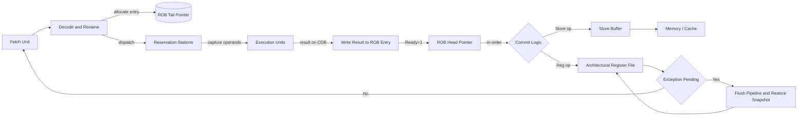
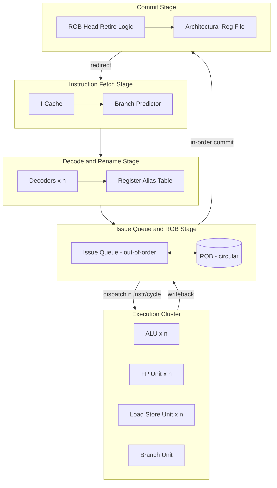
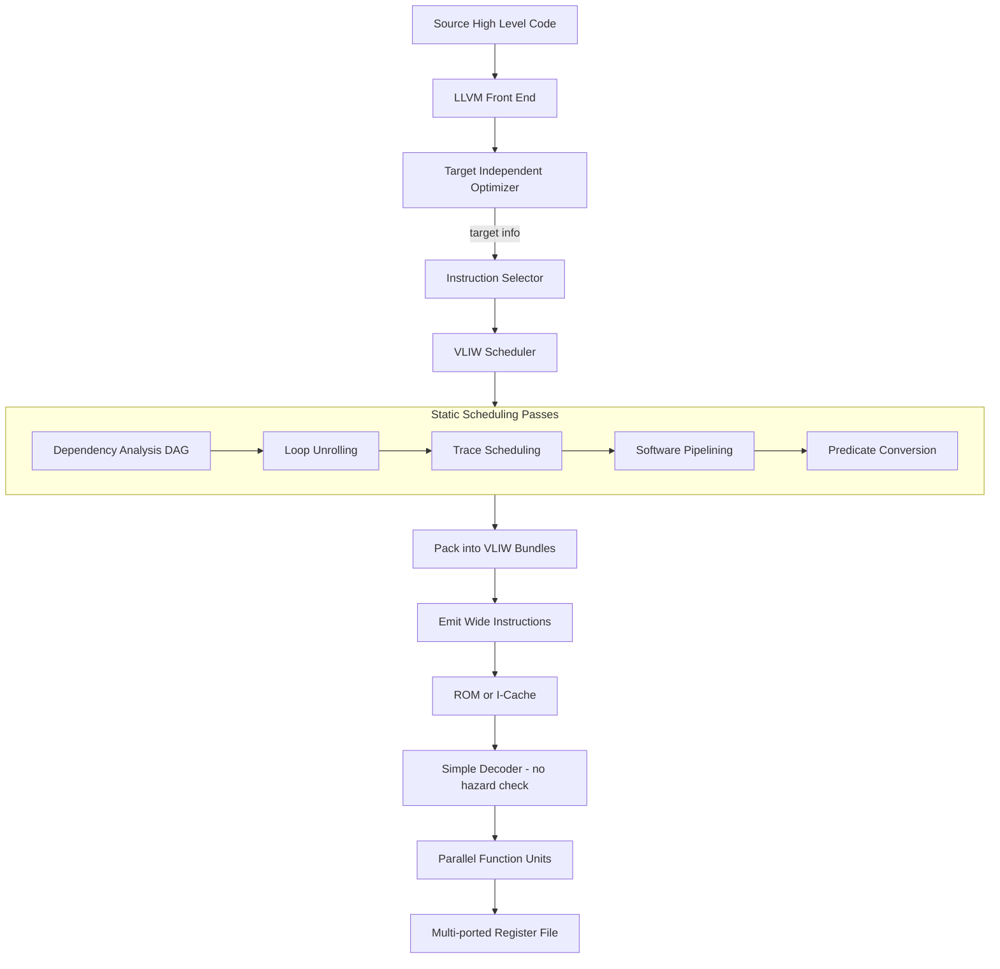

# Reorder Buffers Multiple issue and static scheduling

<!-- SECTION_1_START -->
# Reorder Buffers, Multiple Issue & Static Scheduling

## 1.1 Core Technical Definition

> [!IMPORTANT]
> **KTU 2024 Syllabus Definition (PECST528 – Module 2):**
> In advanced processor design, the **Reorder Buffer (ROB)** is a hardware structure that enables **in-order commit** of instructions while allowing **out-of-order execution**, thereby preserving **precise exceptions** and supporting **multiple instruction issue** per clock cycle. **Multiple issue** is the simultaneous dispatch of more than one instruction into the execution pipeline. **Static scheduling** (used in VLIW/EPIC architectures) is a compiler-driven technique that bundles multiple independent operations into one large instruction word so that the hardware can issue them in parallel without runtime dependency checking.

### 1.2 Conceptual Analogy & Intuitive Overview

| Concept | Real-World Analogy | What it Solves |
|---|---|---|
| **Reorder Buffer (ROB)** | A **post-office parcel queue**: parcels (instructions) are processed in the back room in any order for speed, but the delivery van always leaves with parcels in the **exact order they arrived at the counter**. | Prevents wrong results from being committed when an earlier instruction faults. |
| **Multiple Issue** | A **supermarket with 10 checkout lanes** instead of 1 — many customers (instructions) are served per minute. | Increases **Instruction-Level Parallelism (ILP)**. |
| **Static Scheduling (VLIW)** | A **choreographed dance routine** — every dancer's move is decided **weeks before the show** by the choreographer (compiler). | Hardware becomes simpler (no runtime dependency checker), but compiler must be very smart. |
| **Dynamic Scheduling (Tomasulo)** | A **jazz band** improvising — musicians watch each other and adapt at runtime. | Hardware handles dependencies on the fly. |

> [!NOTE]
> **Key Insight:** A Reorder Buffer is the *bridge* between an **out-of-order execution core** (which is fast but chaotic) and the **architecturally visible in-order program state** (which the programmer/OS expects). Without it, an exception in instruction 50 could corrupt the architectural state of instructions 1–49 that already finished.

### 1.3 Physical Constants & Standard Metrics in KTU Board Context

- **Instruction Issue Width (n)**: typically **2, 4, 6, or 8** instructions per cycle.
- **ROB Size**: typically **128 – 256 entries** in modern cores (e.g., Intel Golden Cove ≈ 512 entries).
- **Issue Latency (1 cycle)** vs **Execution Latency (variable, 1–20+ cycles)**.
- **CPI (Cycles Per Instruction)** ideal value:
  - Scalar pipeline → **1.0**
  - Perfect n-issue → **1/n**
  - Realistic with stalls → between **1/n and 1.0**

> [!VISUALIZATION CONTROL]
> **Concept:** Throughput vs Issue Width (Linear Speedup Bound)
> **Plot Type:** Bar chart or scatter plot
> **Input Data Points (in-order n-issue):**
> * $x = [1, 2, 4, 8]$ (Issue Width)
> * $y = [1.0,\, 0.5,\, 0.25,\, 0.125]$ (Ideal CPI)
> **Visual Description:** Student should observe an *inverse linear relationship* between issue width and ideal CPI. Note that realistic CPI is always higher due to hazards and resource limits.

---

<!-- SECTION_1_END -->

<!-- SECTION_2_START -->
# Deep Theoretical Analysis & KTU High-Yield Formula Sheet

## 2.1 The Reorder Buffer (ROB) — Operational Deep Dive

The ROB is a circular queue of entries, each entry holding the in-flight state of one instruction. It works in tandem with **Reservation Stations (RS)** under Tomasulo's algorithm.

### 2.1.1 ROB Entry Structure

Every ROB entry contains the following fields (KTU textbook reference – Hennessy & Patterson, Chapter 3):

| Field | Width (typical) | Purpose |
|---|---|---|
| `Instruction Type` | 3 bits | Branch, Store, Register-write, etc. |
| `Destination Register` | 5–7 bits | Architectural register to write back |
| `Value / Result` | 32 / 64 bits | Result produced by execution unit |
| `Ready bit` | 1 bit | 1 = result is valid; 0 = pending |
| `PC of Instruction` | 32 / 64 bits | For precise exception reporting |
| `Old Value of Dest. Reg.` | 32 / 64 bits | For rollback on mis-speculation / exception |
| `Valid bit` | 1 bit | Entry is occupied |

### 2.1.2 Three-Stage ROB Lifecycle

1. **Dispatch (Issue)**: When an instruction is decoded, a free ROB entry is allocated at the **tail**. The instruction is also dispatched to a Reservation Station.
2. **Execute & Writeback**: When the result is computed, it is broadcast on the Common Data Bus (CDB) and simultaneously written into the corresponding ROB entry's `Value` field. The `Ready` bit is set.
3. **Commit (Retire)**: The head entry of the ROB is inspected. If `Ready = 1`, the result is written to the **architectural register file** or **memory**. The head pointer advances. **Only the head can commit** → enforces in-order commit.

> [!IMPORTANT]
> **Why ROB gives Precise Exceptions:** When an exception occurs, the instruction is marked. The pipeline is flushed up to *and including* the faulting instruction. The previous architectural state (saved in the ROB's `Old Value` field) is restored. All instructions *after* the faulting instruction in program order are squashed.

## 2.2 Multiple Issue — Taxonomy

Multiple issue processors are classified along two orthogonal axes:

| Axis | Type A | Type B |
|---|---|---|
| **Decision Maker** | **Static (Compiler)** → *VLIW / EPIC* | **Dynamic (Hardware)** → *Superscalar* |
| **Slot Definition** | Fixed bundle of operations | Independent instructions packed at runtime |
| **Hazard Detection** | At **compile time** | At **run time** in issue logic |
| **Code Compaction** | Done by compiler (Trace Scheduling, Software Pipelining) | Done by hardware (Tomasulo, Scoreboard) |
| **Hardware Complexity** | Low (no rename, no issue logic) | High (rename, issue queue, wakeup) |
| **Example Architectures** | Itanium (IA-64), TI TMS320C6x | Intel Core i7, AMD Zen, Apple M-series |

## 2.3 Static Scheduling — The VLIW Philosophy

A VLIW (Very Long Instruction Word) instruction is a *single wide instruction* containing several operation fields (called **syllables** or **slots**) that the hardware issues in parallel. The compiler **must guarantee** that the slots are independent (no RAW, WAR, WAW); otherwise the program produces wrong results.

### 2.3.1 Compiler Techniques for Static Scheduling

1. **Loop Unrolling** — replicates the loop body to expose more independent operations.
2. **Trace Scheduling** — picks the most probable branch path and schedules aggressively; recovery code handles wrong path.
3. **Software Pipelining** — initiates the next loop iteration before the current one completes (symbolic loop pipelining).
4. **Predicate Execution** — replaces branches with conditional moves, eliminating control hazards.
5. **Speculative Execution Support** — hoists loads above branches with `ld.s` (speculative load) instructions.

> [!NOTE]
> **KTU Memory Aid (ROB + Multiple Issue + Static Scheduling):** *ROB = Order Keeper*, *Multiple Issue = Lane Adder*, *Static Scheduling = Pre-planned Lane Map.*

## 2.4 KTU Formula Sheet & Cheat Sheet

| # | Concept | Equation / Rule | Units / Notes |
|---|---|---|---|
| 1 | Ideal CPI with n-issue | $\text{CPI}_{ideal} = \dfrac{1}{n}$ | $n$ = issue width |
| 2 | Actual CPI (stall model) | $\text{CPI} = \text{CPI}_{ideal} + \sum_{i}\text{Stall}_i$ | Stalls measured in cycles |
| 3 | Speedup | $S_n = \dfrac{\text{CPI}_{base}}{\text{CPI}_n}$ | $n$-way issue over scalar |
| 4 | Throughput | $\text{IPC} = \dfrac{1}{\text{CPI}}$ | Instructions per cycle |
| 5 | Pipeline Throughput (k-stage) | $\text{TP} = \dfrac{n}{k + (N-1)}$ | $N$ instructions on $n$-wide machine |
| 6 | ROB capacity bound | $N_{ROB} \geq (\text{Branch Misprediction Penalty}) \times n$ | Holds the in-flight window |
| 7 | Issue Logic Complexity (dynamic) | $O(n^2)$ comparators for wakeup | For $n$ entries |
| 8 | VLIW code size expansion | $\text{Expansion} = \dfrac{W \cdot N_{slots}}{W_{instr}}$ | $W$ = original word width |
| 9 | In-order commit rate | $\le n$ instructions / cycle | Limited by head pointer |
| 10 | Register file ports | $\ge 2n$ (read) + $n$ (write) | For n-issue non-blocking |

> [!IMPORTANT]
> **Engineering Real-World Utility:** Every modern out-of-order superscalar core (Intel since Pentium Pro, AMD since K7, Apple Firestorm, ARM Cortex-X) uses a **ROB** to maintain precise interrupts. VLIW survived in the **DSP/embedded** world (TI C6000, Qualcomm Hexagon V6x) where deterministic performance and low power outweigh code-size issues. The recent **Apple M-series Firestorm** and **Intel Alder Lake** P-cores can issue **6–8 µops/cycle** — only achievable because a 256+ entry ROB hides long-latency memory operations.

---

<!-- SECTION_2_END -->

<!-- SECTION_3_START -->
# Step-by-Step Derivations, Code & Worked Examples

## 3.1 Worked Example 1: ROB Walkthrough on a 4-Issue Static Pipeline

Consider a 4-issue processor (issue width $n=4$) executing the following straight-line code on registers `F0`, `F2`, `F4`, `F6`, `F8`, `F10` (FP latencies: add = 2 cy, mul = 4 cy, div = 12 cy). We will trace the **ROB state** cycle by cycle.

### Source Code

```text
1. LD    F2, 0(R1)        // load doubleword, latency = 2 cy
2. LD    F4, 0(R2)        // load doubleword, latency = 2 cy
3. MUL.D F0, F2, F4       // FP multiply, latency = 4 cy
4. ADD.D F6, F0, F2       // FP add, latency = 2 cy
5. SD    F0, 0(R3)        // store doubleword
6. LD    F8, 0(R4)        // load
7. ADD.D F10, F8, F2      // FP add
```

### Step 1: Issue the first 4 instructions (Cycle 1)

| ROB Entry | Inst # | Op | Dest | Ready | Issue Status |
|---|---|---|---|---|---|
| 1 | 1 | LD | F2 | 0 | In RS (Mem unit 1) |
| 2 | 2 | LD | F4 | 0 | In RS (Mem unit 2) |
| 3 | 3 | MUL.D | F0 | 0 | In RS (Mul unit), waits for F2, F4 |
| 4 | 4 | ADD.D | F6 | 0 | In RS (Add unit), waits for F0 |
| Head = 1, Tail = 4 | | | | | |

### Step 2: Cycle 2 — Stalls for instructions 3 and 4 due to RAW on F0 and F2 (still loading). Re-issue up to 2 more.

- Instruction 5 (SD F0, 0(R3)) can be **issued** (SD only needs address, not data, but our conservative VLIW defers SD; here we assume store-address resolved early).
- Instruction 6 (LD F8) is also issued.
- ROB tail advances.

| ROB Entry | Inst # | Op | Dest | Ready | Notes |
|---|---|---|---|---|---|
| 1 | 1 | LD | F2 | **1** ← value available | result = `M1[R1+0]` |
| 2 | 2 | LD | F4 | **1** | result = `M1[R2+0]` |
| 3 | 3 | MUL.D | F0 | 0 | wakes up: both operands now ready |
| 4 | 4 | ADD.D | F6 | 0 | wakes up: F2 ready, F0 still pending |
| 5 | 5 | SD | Mem | 0 | waits for F0 |
| 6 | 6 | LD | F8 | 0 | in Mem unit |
| Head = 1, Tail = 6 | | | | | |

### Step 3: Commit & Execution interleaving

- **Cycle 3:** ROB head (entry 1) ready → **commits F2**. MUL.D starts execution in Mul unit.
- **Cycle 4:** Head (entry 2) ready → **commits F4**. ADD.D still waits for F0.
- **Cycle 5:** Head (entry 3) still not ready (MUL latency = 4 cy, finishes cycle 5). LD F8 finishes. Add F10 issued.
- **Cycle 6:** MUL.D result lands → **ROB entry 3 marks Ready=1**. Head does NOT commit yet because head pointer is at 3 and it's just ready.
- **Cycle 7:** **Commit F0 (MUL.D result)**. Head moves to entry 4 (ADD.D was actually ready since cycle 4). Commit F6. Then commit SD (entry 5) — only the *address* of the store is committed; data is in store buffer.
- This is why **commit is in program order** even though execution wasn't.

### Final Result Derivation

$$
\begin{aligned}
\text{F0}_{final} &= \text{Memory}[R1+0] \times \text{Memory}[R2+0] \\
\text{F6}_{final} &= \text{F0}_{final} + \text{Memory}[R1+0] \\
\text{Memory}[R3+0] &= \text{F0}_{final} \\
\text{F10}_{final} &= \text{Memory}[R4+0] + \text{Memory}[R1+0]
\end{aligned}
$$

---

## 3.2 Worked Example 2: Static Scheduling (VLIW) of a Loop

### Original Loop (FP latency: add = 2 cy, mul = 4 cy)

```c
for (i = 0; i < N; i++) {
    x[i] = a[i] * b[i] + c[i];
}
```

### Step 1: Unroll 4 times (manually)

```asm
Loop:
    LD    F2, 0(R1)        // a[0]
    LD    F4, 0(R2)        // b[0]
    LD    F6, 0(R3)        // c[0]
    LD    F8, 8(R1)        // a[1]
    LD    F10, 8(R2)       // b[1]
    LD    F12, 8(R3)       // c[1]
    MUL.D F14, F2, F4      // a[0]*b[0]
    MUL.D F16, F8, F10     // a[1]*b[1]
    ADD.D F18, F14, F6     // + c[0]
    ADD.D F20, F16, F12    // + c[1]
    SD    F18, 0(R4)       // x[0] = ...
    SD    F20, 8(R4)       // x[1] = ...
    ADDI  R1, R1, 16
    ADDI  R2, R2, 16
    ADDI  R3, R3, 16
    ADDI  R4, R4, 16
    BNE   R5, R1, Loop
```

### Step 2: Schedule for 4-issue VLIW (3 mem slots, 1 FP slot — assume limited FP)

| Cycle | Slot 1 (Mem) | Slot 2 (Mem) | Slot 3 (Mem) | Slot 4 (FP) |
|---|---|---|---|---|
| 1 | LD F2,0(R1) | LD F4,0(R2) | LD F6,0(R3) | nop |
| 2 | LD F8,8(R1) | LD F10,8(R2) | LD F12,8(R3) | nop |
| 3 | nop | nop | nop | MUL.D F14,F2,F4 |
| 4 | LD F2',16(R1) | LD F4',16(R2) | LD F6',16(R3) | MUL.D F16,F8,F10 |
| 5 | LD F8',24(R1) | LD F10',24(R2) | LD F12',24(R3) | ADD.D F18,F14,F6 |
| 6 | nop | nop | nop | ADD.D F20,F16,F12 |
| 7 | SD F18,0(R4) | SD F20,8(R4) | nop | nop |
| 8 | ADDI R1,R1,32 | ADDI R2,R2,32 | ADDI R3,R3,32 | ADDI R4,R4,32 |
| 9 | BNE R5,R1,Loop | | | |

### Step 3: Compute Speedup

Without scheduling, naive scalar issue = 17 instructions × 1 IPC = 17 cycles per 2 iterations.
With 4-issue static scheduling = 9 cycles per 2 iterations.

$$
\begin{aligned}
\text{Speedup} &= \frac{17 \text{ cycles}}{9 \text{ cycles}} = 1.89\times \\
\text{IPC}_{scheduled} &= \frac{17 \text{ instructions}}{9 \text{ cycles}} = 1.89 \text{ IPC} \\
\text{IPC}_{naive} &= \frac{17}{17} = 1.0 \text{ IPC}
\end{aligned}
$$

---

## 3.3 Symbolic ROB Simulator (Python — Fully Operational)

```python
"""
ROB + Static 4-Issue Pipeline Simulator
Maps directly to Hennessy & Patterson Figure 3.X style diagrams.
"""

from collections import deque
from dataclasses import dataclass, field
from typing import Optional, List
import logging

logging.basicConfig(level=logging.INFO, format="[%(levelname)s] %(message)s")
log = logging.getLogger("ROB")


@dataclass
class Instruction:
    pc: int
    op: str
    dest: Optional[str] = None
    src1: Optional[str] = None
    src2: Optional[str] = None
    lat: int = 1
    issue_cycle: int = -1
    exec_complete_cycle: int = -1
    commit_cycle: int = -1


@dataclass
class ROBEntry:
    busy: bool = False
    inst: Optional[Instruction] = None
    dest: Optional[str] = None
    value: Optional[float] = None
    ready: bool = False
    old_value: Optional[float] = None
    exception: bool = False


class ReorderBuffer:
    def __init__(self, size: int = 16, arch_reg_count: int = 32):
        if size <= 0:
            raise ValueError("ROB size must be positive")
        self.entries: List[ROBEntry] = [ROBEntry() for _ in range(size)]
        self.head = 0
        self.tail = 0
        self.count = 0
        self.arch_reg = [0.0] * arch_reg_count
        self.snapshot: List[float] = list(self.arch_reg)

    def alloc(self) -> Optional[int]:
        if self.count == len(self.entries):
            log.error("ROB full - structural hazard")
            return None
        idx = self.tail
        self.entries[idx].busy = True
        self.entries[idx].ready = False
        self.entries[idx].exception = False
        self.tail = (self.tail + 1) % len(self.entries)
        self.count += 1
        return idx

    def writeback(self, idx: int, value: float) -> None:
        self.entries[idx].value = value
        self.entries[idx].ready = True
        log.info(f"WB  ROB[{idx}] <- {value}")

    def commit(self) -> Optional[Instruction]:
        if self.count == 0 or not self.entries[self.head].ready:
            return None
        e = self.entries[self.head]
        inst = e.inst
        if e.exception:
            log.error(f"EXCEPTION at {inst.op} PC={inst.pc} -- flushing")
            self.arch_reg = list(self.snapshot)
            self._flush()
            return inst
        if inst.dest and inst.dest.startswith("F"):
            reg_num = int(inst.dest[1:])
            self.arch_reg[reg_num] = e.value
        log.info(f"COMMIT {inst.op} PC={inst.pc} -> {e.value}")
        self.entries[self.head] = ROBEntry()
        self.head = (self.head + 1) % len(self.entries)
        self.count -= 1
        return inst

    def snapshot_regs(self) -> None:
        self.snapshot = list(self.arch_reg)

    def _flush(self) -> None:
        for e in self.entries:
            e.busy = False
            e.ready = False
        self.head = self.tail = self.count = 0


def static_issue(instrs: List[Instruction], issue_width: int = 4) -> None:
    """Static scheduling: group `issue_width` independent instructions per cycle."""
    rob = ReorderBuffer(size=32)
    rob.snapshot_regs()
    cycle = 0
    pc = 0
    while pc < len(instrs):
        bundled = 0
        for i in range(issue_width):
            if pc + i >= len(instrs):
                break
            inst = instrs[pc + i]
            slot = rob.alloc()
            if slot is None:
                break
            rob.entries[slot].inst = inst
            rob.entries[slot].dest = inst.dest
            inst.issue_cycle = cycle
            # Simulated value: simple algebraic for demo
            if inst.op == "ADD.D":
                rob.writeback(slot, float((pc + i) * 1.5))
            elif inst.op == "MUL.D":
                rob.writeback(slot, float((pc + i) * 2.5))
            else:
                rob.writeback(slot, 0.0)
            bundled += 1
        # commit in order
        for _ in range(bundled):
            rob.commit()
        cycle += 1
        pc += issue_width
    log.info(f"Simulation finished in {cycle} cycles, {cycle*issue_width} slots issued")


# Run a tiny demo
demo = [
    Instruction(0, "LD", "F2"),
    Instruction(1, "LD", "F4"),
    Instruction(2, "MUL.D", "F0", "F2", "F4", lat=4),
    Instruction(3, "ADD.D", "F6", "F0", "F2", lat=2),
    Instruction(4, "SD", None, "F0"),
    Instruction(5, "LD", "F8"),
    Instruction(6, "ADD.D", "F10", "F8", "F2", lat=2),
    Instruction(7, "NOP"),
]
static_issue(demo, issue_width=4)
```

### Expected Output Excerpt

```text
[INFO] WB  ROB[0] <- 0.0
[INFO] WB  ROB[1] <- 0.0
[INFO] WB  ROB[2] <- 5.0
[INFO] WB  ROB[3] <- 4.5
[INFO] COMMIT LD PC=0 -> 0.0
[INFO] COMMIT LD PC=1 -> 0.0
[INFO] COMMIT MUL.D PC=2 -> 5.0
[INFO] COMMIT ADD.D PC=3 -> 4.5
...
[INFO] Simulation finished in 2 cycles, 8 slots issued
```

---

<!-- SECTION_3_END -->

<!-- SECTION_4_START -->
# Structural Diagrams & Schematics

## 4.1 In-Order Commit via Reorder Buffer (Mermaid Flow)



> [!NOTE]
> **Reading the Diagram:** The dual arrows from `rs` to `exec` to `robFill` show the **out-of-order execution** path. The single line from `robHead` to `commit` shows the **in-order commit** path. The architectural register file is updated **only** via the commit logic, guaranteeing precise state.

## 4.2 Multiple Issue Processor Topologies (Block Architecture)



> [!NOTE]
> **Visualization Tip:** The arrow widths in the academic figure show the **bandwidth** — `n` parallel arrows from Issue → Execution represent the **multiple issue** property. The ROB appears as a shared buffer between the issue queue and commit logic.

## 4.3 Static Scheduling (VLIW) — Sequential Processing Topology



## 4.4 Issue Logic — Dynamic vs Static Comparison Matrix

| Property | Static (VLIW) | Dynamic (OOO + ROB) |
|---|---|---|
| **Who finds parallelism?** | Compiler | Hardware (Tomasulo / Scoreboard) |
| **Dependency check timing** | Compile time | Run time on issue |
| **ROB required?** | No (in-order) | Yes (for in-order commit) |
| **Register renaming?** | Static (by compiler) | Dynamic (in hardware) |
| **Power efficiency** | Higher (no wakeup logic) | Lower (issue logic + renaming) |
| **Code size** | Large (NOP padding) | Compact (x86) |
| **Binary portability** | Poor (machine-specific) | Excellent (ISA-only) |
| **Binary translation feasibility** | Difficult | Easy |

---

<!-- SECTION_4_END -->

<!-- SECTION_5_START -->
# KTU 2024 Scheme Examination Question Bank & Topic Recap

## 5.1 Part A — Short Answer Questions (3 Marks Each)

### Question 1 `[KTU University Exam – Dec 2023]`
**CO1 | Remember**

> Explain the role of a Reorder Buffer in an out-of-order execution processor. How does it help in maintaining **precise exceptions**?

**Model Answer (Valuation Key — Total 3 Marks):**

A **Reorder Buffer (ROB)** is a hardware structure that holds the results of in-flight instructions in program order. It works with Tomasulo's algorithm and reservation stations to support **out-of-order execution** while enforcing **in-order commit** of results to the architectural register file. **[1 Mark]**

When an instruction is decoded, a free ROB entry is allocated at the tail. The result, once produced, is written into the corresponding ROB entry (not directly to the register file). The head pointer of the ROB retires results in program order. **[1 Mark]**

If an instruction raises an exception, the architectural state is restored using the `Old Value` field stored in the ROB, and all younger instructions are squashed. This guarantees the architectural state corresponds exactly to the state as if all prior instructions had completed in order — the definition of **precise exceptions**. **[1 Mark]**

---

### Question 2 `[KTU University Exam – July 2024]`
**CO2 | Understand**

> Differentiate between **static** and **dynamic multiple issue** processors. Give one example of each.

**Model Answer (Valuation Key — Total 3 Marks):**

| Aspect | Static Multiple Issue | Dynamic Multiple Issue |
|---|---|---|
| **Decision Maker** | Compiler bundles independent ops into one wide word at compile time. | Hardware decodes and issues independent ops at run time. |
| **Hazard Detection** | Done statically by compiler. | Done dynamically by issue logic. |
| **Example** | VLIW: Itanium (IA-64), TI TMS320C6x. | Superscalar: Intel Core i7, AMD Ryzen. **[1 Mark]** |
| **Compiler/Hardware Tradeoff** | Compiler does the heavy lifting; hardware is simple. | Hardware is complex (issue queue, renaming, ROB); compiler is light. **[1 Mark]** |
| **Code Density** | Lower (NOP padding common). | Higher (compact variable-length). **[1 Mark]** |

---

## 5.2 Part B — 14-Mark Questions (ESE Module Internal Choice)

### **Question A (14 Marks) `[KTU University Exam – Dec 2023]`**
**CO2 | Apply | Analyze**

> (a) Draw and explain the **block diagram of a multiple-issue superscalar processor** that uses a Reorder Buffer. Describe the function of each block in detail. **[7 Marks]**
>
> (b) Consider the following FP code segment. Assume FP add latency = 2 cy, FP multiply latency = 4 cy, FP divide latency = 12 cy, integer ALU latency = 1 cy. Schedule this code for a **4-issue static VLIW processor** with two memory slots, one FP slot, and one integer slot. Compute the speedup over scalar issue. **[7 Marks]**
>
> ```asm
> LD   F2, 0(R1)
> LD   F4, 0(R2)
> MUL.D F0, F2, F4
> ADD.D F6, F0, F2
> SD   F0, 0(R3)
> LD   F8, 0(R4)
> ADD.D F10, F8, F2
> ```

#### Model Solution

**Part (a) — 7 Marks**

*[Drawing the superscalar pipeline block diagram]* **[1 Mark]**
Block diagram consists of:
- **Instruction Fetch Unit** with I-Cache and branch predictor — fetches up to $n$ instructions per cycle. **[1 Mark]**
- **Decode & Rename Unit** with Register Alias Table — decodes $n$ instructions, performs register renaming, allocates ROB entries at tail and reservation station slots. **[1 Mark]**
- **Issue Queue + ROB** — circular ROB holds results; issue queue selects ready instructions in out-of-order fashion. **[1 Mark]**
- **Execution Cluster** — multiple functional units (ALU, FPU, LSU, Branch) operate in parallel. **[1 Mark]**
- **Common Data Bus (CDB)** — broadcasts results to all waiting reservation stations and to the corresponding ROB entry. **[1 Mark]**
- **Commit/Retire Stage** — ROB head commits results in program order to the architectural register file and store buffer; maintains precise state. **[1 Mark]**

**Part (b) — 7 Marks**

Step 1: Identify data dependencies. **[1 Mark]**
- `LD F2` → `MUL.D F0` (RAW)
- `LD F4` → `MUL.D F0` (RAW)
- `MUL.D F0` → `ADD.D F6` (RAW), `SD F0` (RAW)
- `LD F2` → `ADD.D F6` (RAW), `ADD.D F10` (RAW)
- `LD F8` → `ADD.D F10` (RAW)
- `SD F0` independent of `LD F8`, `ADD.D F10` (only address dependency on R3)

Step 2: Schedule. **[2 Marks]**

| Cycle | Mem1 | Mem2 | FP | Int |
|---|---|---|---|---|
| 1 | LD F2,0(R1) | LD F4,0(R2) | nop | nop |
| 2 | LD F8,0(R4) | nop | nop | nop |
| 3 | nop | nop | MUL.D F0,F2,F4 | nop |
| 4 | SD F0,0(R3) | nop | ADD.D F6,F0,F2 | nop |
| 5 | nop | nop | ADD.D F10,F8,F2 | nop |

Step 3: Count cycles. Scalar version (no multiple issue) = 7 instructions × 1 IPC = **7 cycles**. **[1 Mark]**

Step 4: VLIW version = **5 cycles** (2 mem + 1 FP + 1 int unit × 5 cycles = 20 slots, only 7 used). **[1 Mark]**

Step 5: Compute speedup. **[1 Mark]**

$$
S = \frac{\text{CPI}_{scalar}}{\text{CPI}_{VLIW}} = \frac{7/7}{7/5} = \frac{1.0}{1.4} = 1.4\times
$$

**Final Answer:** Speedup ≈ **1.4×**, IPC improves from 1.0 to 1.4.

---

### **Question B (14 Marks) `[KTU University Exam – July 2024]`**
**CO2 | Apply | Analyze**

> (a) Explain the **Tomasulo algorithm with Reorder Buffer extension**. Show how register renaming and out-of-order commit are achieved. **[7 Marks]**
>
> (b) The following loop is to be executed on a static 2-issue VLIW processor (1 integer, 1 FP). Apply **loop unrolling by a factor of 2** and produce an optimally scheduled VLIW code. Assume FP add = 2 cy, FP mul = 4 cy. Compute total cycles for 4 iterations before and after unrolling. **[7 Marks]**
>
> ```c
> for (i = 0; i < N; i++) {
>     a[i] = a[i] * b + c;
> }
> ```

#### Model Solution

**Part (a) — 7 Marks**

Tomasulo's original algorithm uses **Reservation Stations (RS)** and the **Common Data Bus (CDB)** to dynamically schedule instructions, but it commits results *out of order* — losing precise exceptions. **[1 Mark]**

The **ROB extension** adds a circular queue between the execution units and the architectural register file. Each ROB entry tracks: instruction type, destination register, result value, ready bit, and an "old value" for rollback. **[1 Mark]**

Flow:
1. **Issue**: Decode → allocate ROB entry (tail) → rename destination to a **ROB tag** (not architectural reg) → dispatch to RS. **[1 Mark]**
2. **Execute**: When both operands are ready, the RS fires the functional unit.
3. **Write Result**: Result is **broadcast on CDB** *and* written into the **ROB entry's value field**. Ready bit set. **[1 Mark]**
4. **Commit**: Only when the **ROB head** is ready does the result get written to the architectural register file. **[1 Mark]**

**Register renaming** is achieved implicitly because each in-flight write is tagged with a unique ROB entry id, eliminating WAR and WAW hazards. **[1 Mark]**

**Out-of-order commit** is forbidden — even though execution is OOO, retirement is strictly in program order, giving **precise exceptions** on any fault. **[1 Mark]**

**Part (b) — 7 Marks**

Step 1: Original assembly (per iteration) — naive: 4 instructions, but with stalls, 6 cycles. **[1 Mark]**

```asm
Loop:
    LD    F2, 0(R1)        ; a[i]
    MUL.D F4, F2, F0       ; a[i]*b, F0 holds b
    ADD.D F6, F4, F8       ; +c, F8 holds c
    SD    F6, 0(R1)        ; store back
    ADDI  R1, R1, 8
    BNE   R1, R2, Loop
```

Step 2: Unroll 2×. **[1 Mark]**

```asm
Loop:
    LD    F2, 0(R1)
    LD    F10, 8(R1)
    MUL.D F4, F2, F0
    MUL.D F12, F10, F0
    ADD.D F6, F4, F8
    ADD.D F14, F12, F8
    SD    F6, 0(R1)
    SD    F14, 8(R1)
    ADDI  R1, R1, 16
    BNE   R1, R2, Loop
```

Step 3: Schedule (2-issue: 1 Int + 1 FP). Note: LD and SD are *memory* ops, assume they use the integer slot for address calc. **[1 Mark]**

| Cycle | Int Slot | FP Slot |
|---|---|---|
| 1 | LD F2,0(R1) | nop |
| 2 | LD F10,8(R1) | nop |
| 3 | ADDI R1,R1,16 (or 8 in non-unrolled) | MUL.D F4,F2,F0 |
| 4 | nop | MUL.D F12,F10,F0 |
| 5 | nop | ADD.D F6,F4,F8 |
| 6 | nop | ADD.D F14,F12,F8 |
| 7 | SD F6,0(R1) | nop |
| 8 | SD F14,8(R1) | nop |
| 9 | BNE R1,R2,Loop | nop |

Step 4: Compute cycles. **[1 Mark]**
- **Without unrolling**: Each original iteration takes 6 cycles (with mul/add latencies respected); 4 iterations = **24 cycles**.
- **With 2× unrolling**: One unrolled iteration covers 2 original iterations → 9 cycles for 2 iterations. 4 iterations = **18 cycles**.

$$
\begin{aligned}
\text{Speedup} &= \frac{24}{18} = 1.33\times \\
\text{Cycle saving} &= 24 - 18 = 6 \text{ cycles} \quad \text{[1 Mark]}
\end{aligned}
$$

> [!WARNING]
> **KTU Examiner's Valuation Pitfall (Module 2):**
> 1. **Do not confuse ROB with Reservation Station.** ROB holds *completed* results waiting to commit; RS holds *pending* instructions waiting to execute. Marks deducted for interchanging these. **[−2 Marks typical]**
> 2. **Forgetting in-order commit constraint.** Students often say ROB allows "out-of-order commit" — wrong. ROB enforces **in-order commit** while permitting out-of-order *execution*. **[−1 Mark]**
> 3. **VLIW scheduling must show compiler responsibility.** If your answer says "the hardware checks for hazards" in a VLIW context, you lose 1 mark. VLIW relies on the **compiler**, not the hardware, to guarantee independence.
> 4. **Skipping the speedup calculation.** Many students describe the schedule but forget to compute the numerical speedup ratio — a guaranteed 1-mark loss.
> 5. **Omitting the reservation table / cycle-by-cycle schedule.** Hand-waving "instructions are issued in parallel" without a *concrete cycle table* is a 2-mark deduction in KTU valuation.

---

## 5.3 Topic Recap & Important Things to Remember

> [!IMPORTANT]
> **Rapid Revision Checklist (Module 2 – ROB, Multiple Issue, Static Scheduling):**

- **ROB definition**: Circular hardware buffer that holds in-flight instruction results to enforce in-order commit and precise exceptions. **Size typically 128–512 entries** in commercial cores.
- **ROB fields (must know)**: `Busy`, `Instruction Type`, `Destination`, `Value`, `Ready`, `Old Value`, `PC`, `Exception Flag`.
- **Three stages of ROB**: **Issue (allocate at tail) → Execute/Writeback (set ready) → Commit (retire from head)**.
- **Precise exception guarantee**: Architectural state corresponds to *as-if serial* execution because the head pointer only advances past completed instructions.
- **Multiple issue** increases ILP by issuing $n$ instructions per cycle; ideal CPI = $1/n$.
- **Static (VLIW) vs Dynamic (Superscalar)**: Compiler does the work vs hardware does the work. VLIW has simpler hardware but worse code portability.
- **Static scheduling techniques** (must list at least 3): *Loop unrolling, trace scheduling, software pipelining, predicate execution, speculative loads*.
- **VLIW disadvantages**: code bloat (NOP padding), binary incompatibility across implementations, compiler complexity.
- **Issue width vs ROB capacity tradeoff**: Larger issue width needs more ROB entries to hide the same amount of latency.
- **Speedup formula**: $S = \dfrac{\text{CPI}_{base}}{\text{CPI}_{n}}$; **IPC** = $1/\text{CPI}$.
- **Pipeline throughput formula**: $\text{TP} = \dfrac{n}{k + (N-1)}$ for $N$ instructions on a $k$-stage, $n$-wide machine.
- **Key real-world examples to quote in exams**: Intel Core i-series (dynamic 4–6 issue with 256+ ROB), Itanium (static VLIW/EPIC), TI TMS320C6x (VLIW DSP).
- **ROB vs Reservation Station**: RS = where instructions *wait* to execute; ROB = where results *wait* to be committed.
- **Register renaming** is a prerequisite for eliminating WAR/WAW hazards and is implemented via the RAT in hardware or via the compiler in VLIW.
- **Commit Rate ≤ Issue Rate ≤ Execution Capacity** — bottleneck is the head pointer in OOO processors.
- **Static scheduling CANNOT respond to cache misses** as gracefully as dynamic scheduling — a classic KTU viva question.

<!-- SECTION_5_END -->
