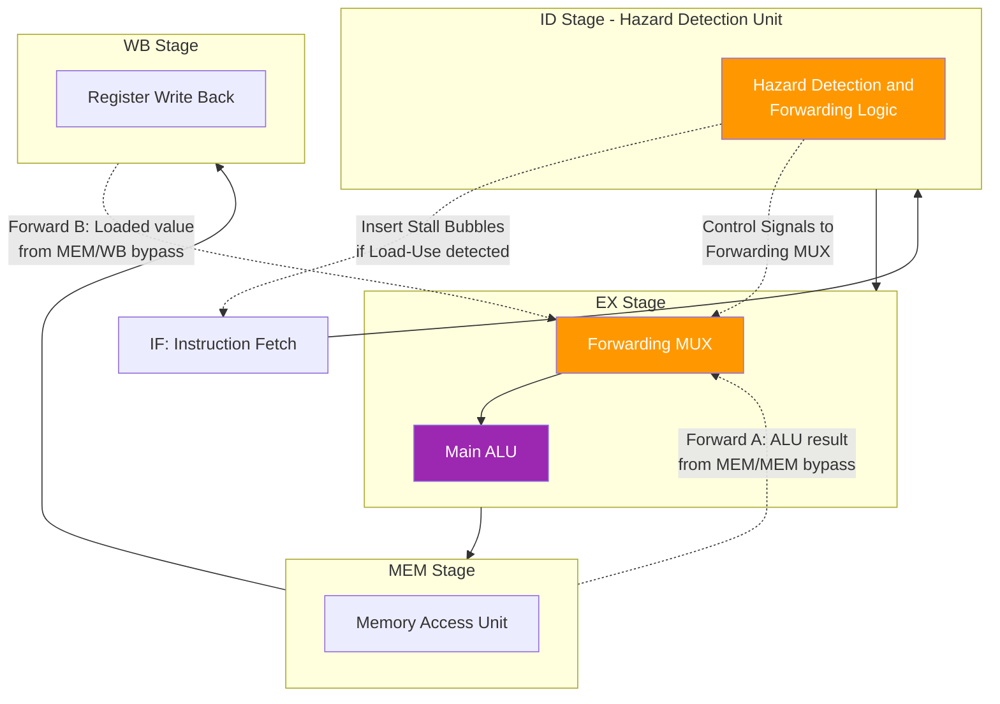
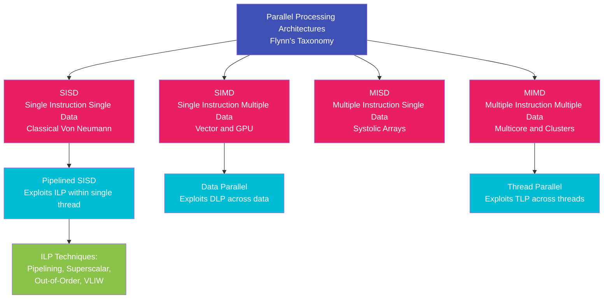
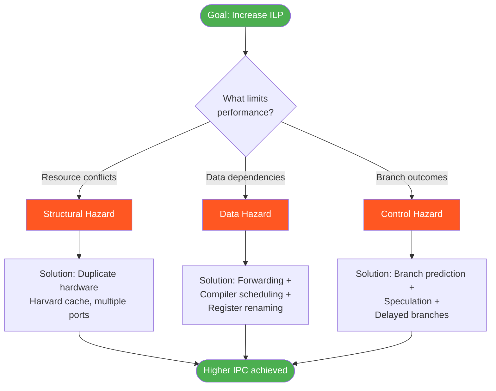

# Review the basic Concepts of Parallel Processing and Pipelining Instruction Level Parallelism

<!-- SECTION_1_START -->
# 1. Core Technical Definition & Intuitive Overview

## 1.1 Parallel Processing

**Parallel Processing** is a computational paradigm in which multiple operations or tasks are executed simultaneously across multiple processing units (cores, processors, or functional units) to achieve higher throughput and reduced execution time.

> [!NOTE]
> **KTU 2024 Syllabus Definition:** Parallel processing is the simultaneous use of more than one processor or functional unit to execute a program or multiple computational threads. The goal is to reduce the wall-clock time of a program by dividing its workload among multiple execution resources.

> [!IMPORTANT]
> **Key Distinction:** *Parallelism* (doing many things at the same time) is fundamentally different from *Concurrency* (managing many things at the same time). KTU examiners frequently test this subtle difference.

### Conceptual Analogy: The Restaurant Kitchen

Imagine a restaurant kitchen:
- **Single Chef (Sequential):** One chef prepares one dish at a time, starting with the next only after the previous is plated.
- **Two Chefs (Parallel Processing):** Two chefs work on two different orders simultaneously — total cooking time roughly halves.
- **Assembly Line (Pipelining):** A salad station preps greens, a grill station cooks meat, and a plating station assembles — while the grill is cooking order #1's meat, the salad station is already prepping order #2's greens.

This illustrates the three pillars of performance we will study: sequential execution, parallel execution, and pipelined execution.

## 1.2 Pipelining

**Pipelining** is an implementation technique in which multiple instructions are overlapped in execution by partitioning the instruction processing into distinct stages, with each stage performing a portion of the work and passing the partial result to the next stage.

> [!NOTE]
> **KTU Definition (Hennessy & Patterson Standard):** A pipeline is a series of stages where each stage performs a portion of the work and feeds its result to the next stage. While one instruction is being processed in stage $k$, another instruction is being processed in stage $k-1$, and so on, achieving overlapping execution.

### Conceptual Analogy: The Laundromat

Consider a 4-stage laundry pipeline with stages: **Wash → Dry → Fold → Pack**.

| Time Slot | Washer | Dryer | Folder | Packer |
|-----------|--------|-------|--------|--------|
| Slot 1 | Load A | — | — | — |
| Slot 2 | Load B | A | — | — |
| Slot 3 | Load C | B | A | — |
| Slot 4 | Load D | C | B | A |
| Slot 5 | — | D | C | B |
| Slot 6 | — | — | D | C |
| Slot 7 | — | — | — | D |

After 4 time slots, **one load completes per slot** instead of one load per 4 slots. The pipeline is *filled* after 4 slots and *drained* in the last 3 slots.

## 1.3 Instruction Level Parallelism (ILP)

**Instruction Level Parallelism (ILP)** is a form of parallelism in which multiple instructions from a *single program* (or single thread of execution) are executed in parallel — i.e., overlapping in time on the same processor.

> [!IMPORTANT]
> **High-Yield KTU Note:** ILP differs from *Thread Level Parallelism (TLP)* which executes multiple *threads/processes* in parallel. ILP exists *within* a single thread of control, exploiting the independence of individual instructions.

### Conceptual Analogy: The Construction Site

A mason building a wall must (1) mix cement, (2) lay bricks, (3) plaster, (4) paint. These are *sequential* by nature. But on a large site:
- **Pipelining:** As soon as cement for wall A is mixed, the bricklayer starts wall A while the mixer prepares cement for wall B.
- **ILP:** A team simultaneously does: one worker mixes cement for wall A, another lays bricks for wall B, a third plasters wall C — all on the *same* project (single program).

The "project" is the program; the parallel actions are independent instructions within it.

## 1.4 Flynn's Taxonomy (Fundamental Classification)

Michael Flynn (1966) classified computer architectures based on the multiplicity of instruction streams and data streams:

| Class | Instruction Streams | Data Streams | Example |
|-------|---------------------|--------------|---------|
| **SISD** | Single | Single | Traditional uniprocessor (e.g., Intel 486) |
| **SIMD** | Single | Multiple | Vector processors, GPU shaders, SSE/AVX |
| **MISD** | Multiple | Single | Systolic arrays, fault-tolerant systems |
| **MIMD** | Multiple | Multiple | Multicore CPUs (Intel i7), clusters |

> [!VISUALIZATION CONTROL]
> **Concept:** Pipelined vs Non-Pipelined Instruction Timeline
> **GeoGebra / Desmos Input Equations:**
> * `f1(x) = step(4 - x)` (non-pipelined — 1 instruction per 4 cycles)
> * `f2(x) = if(x < 4, 0, 1) + if(x < 8, 0, 1) + if(x < 12, 0, 1) + if(x < 16, 0, 1)` (pipelined — 1 per cycle after fill)
> **Visual Description:** The non-pipelined graph shows a flat horizontal line. The pipelined graph shows a rising staircase of completed instructions, with the first completion at cycle 4 and subsequent completions every cycle.

## 1.5 Standard Metrics Used Throughout the Module

- **Clock Cycle Time ($T_c$):** Time for one clock tick. Units: **seconds** or **nanoseconds**.
- **Pipeline Depth ($k$):** Number of stages in the pipeline.
- **Latency:** Time to complete *one* instruction from start to finish.
- **Throughput:** Number of instructions completed per unit time.
- **Speedup ($S$):** Ratio of sequential execution time to parallel/pipelined execution time.
<!-- SECTION_1_END -->

<!-- SECTION_2_START -->
# 2. Deep Theoretical Analysis & KTU High-Yield Formula Sheet

## 2.1 Pipelining — How It Works

A pipelined datapath divides instruction processing into $k$ sequential stages. A typical 5-stage RISC pipeline (the classic KTU reference, from Patterson & Hennessy) is:

1. **IF — Instruction Fetch:** Read instruction from instruction memory.
2. **ID — Instruction Decode:** Decode opcode, read registers from register file.
3. **EX — Execute:** Perform ALU operation, compute effective address.
4. **MEM — Memory Access:** Read/write data memory.
5. **WB — Write Back:** Write result back to register file.

### Why Pipelining Improves Performance

- **Sequential time for $n$ instructions with $k$ stages:** $T_{seq} = n \cdot k \cdot T_c$
- **Pipelined time for $n$ instructions with $k$ stages:** $T_{pipe} = (k + n - 1) \cdot T_c$
- **Ideal Speedup:** $S_{ideal} = k$ (approached as $n \to \infty$)

The pipeline achieves its maximum throughput of **1 instruction per cycle** (CPI = 1) once full. The first instruction still takes $k$ cycles (latency unchanged), but subsequent instructions complete every cycle.

## 2.2 Pipeline Hazards — The Real-World Limiters

A **hazard** is a condition that prevents the next instruction in the pipeline from executing in its designated cycle. KTU examiners love this topic.

### 2.2.1 Structural Hazards

A **structural hazard** occurs when two instructions in different stages of the pipeline require the same hardware resource at the same time.

- *Example:* A single memory port shared between IF and MEM stages.
- *Solution:* Duplicate the resource (separate instruction and data caches — *Harvard architecture*).

### 2.2.2 Data Hazards

A **data hazard** occurs when an instruction depends on the result of a previous instruction that is still in the pipeline.

Consider this sequence:
```
ADD R1, R2, R3     ; R1 = R2 + R3
SUB R4, R1, R5     ; R4 = R1 - R5   (depends on R1!)
```

Types of data dependencies (the "RAW/WAR/WAW" trio — must be memorized):

| Type | Full Name | Cause |
|------|-----------|-------|
| **RAW** | Read After Write (True Dependence) | Instruction $j$ reads a source written by instruction $i$ |
| **WAR** | Write After Read (Anti-Dependence) | Instruction $j$ writes a destination read by instruction $i$ |
| **WAW** | Write After Write (Output Dependence) | Both $i$ and $j$ write the same destination |

> [!IMPORTANT]
> **KTU 2024 High-Yield:** Only **RAW** is a *true* data dependence. WAR and WAW are *name dependencies* — they arise from reuse of register names and can be eliminated by *register renaming*.

**Solutions to Data Hazards:**
1. **Stalling (Inserting Bubbles / NOPs):** Insert idle cycles; reduces throughput.
2. **Forwarding (Bypassing):** Route the result from a later pipeline stage back to an earlier stage that needs it. **This is the primary hardware solution in modern CPUs.**
3. **Compiler Scheduling:** Reorder instructions to avoid hazards statically.

### 2.2.3 Control Hazards

A **control hazard** (branch hazard) arises from branch and jump instructions. The next instruction to fetch is unknown until the branch resolves.

- *Solution 1:* Stall the pipeline until the branch outcome is known.
- *Solution 2:* **Branch Prediction** — guess the outcome and continue speculatively.
- *Solution 3:* **Delayed Branch** — the instruction(s) immediately after the branch are always executed (compiler fills the delay slot).

## 2.3 The Three Forms of Dependence (More Formal View)

> [!NOTE]
> KTU 2024 expects students to distinguish **dependence** (an inherent property of the program) from **hazard** (a property of the pipeline). A dependence *may* cause a hazard; hazards are pipeline-specific.

| Dependence Type | Description | Causes Hazard? |
|-----------------|-------------|----------------|
| **True Data Dependence (RAW)** | Output of $i$ is input to $j$ | Yes (without forwarding or scheduling) |
| **Name Dependence — Anti (WAR)** | $j$ writes a register $i$ reads | Yes (only when out-of-order execution allowed) |
| **Name Dependence — Output (WAW)** | Both $i$ and $j$ write the same register | Yes (only when out-of-order execution allowed) |
| **Control Dependence** | Instruction execution controlled by branch outcome | Yes (causes control hazard) |

## 2.4 ILP Exploitation Techniques

The following techniques are used by architectures to extract more ILP from a single program:

| Technique | Description | Hardware vs Software |
|-----------|-------------|---------------------|
| **Pipelining** | Overlap instruction stages | Hardware |
| **Superscalar** | Issue multiple instructions per cycle (multiple parallel pipelines) | Hardware |
| **Dynamic Scheduling** | Out-of-order execution with reorder buffer | Hardware |
| **Speculation** | Execute past branches before outcome known | Hardware + Compiler |
| **VLIW (Very Long Instruction Word)** | Compiler packs multiple operations into one wide instruction | Software (Compiler) |
| **EPIC (Explicitly Parallel Instruction Computing)** | IA-64 (Itanium) variant of VLIW with hardware assists | Software + Hardware |
| **Loop Unrolling** | Replicate loop body to expose more independent instructions | Software (Compiler) |
| **Software Pipelining** | Schedule iterations of a loop to overlap across stages | Software (Compiler) |

## 2.5 Performance Metrics and Formulas

### Amdahl's Law (Fundamental Limit of Parallelism)

Amdahl's Law quantifies the theoretical maximum speedup achievable when only a fraction of a program is parallelizable:

$$S_{max} = \frac{1}{(1 - f) + \frac{f}{n}}$$

Where:
- $f$ = fraction of the program that is parallelizable (between 0 and 1)
- $(1 - f)$ = fraction that must remain sequential
- $n$ = number of processors

**As $n \to \infty$:**

$$S_{\infty} = \frac{1}{1 - f}$$

> [!IMPORTANT]
> **KTU 2024 Examiner Note:** Even with infinite processors, the speedup is bounded by the sequential portion. If $f = 0.9$, the maximum speedup is $1 / 0.1 = 10\times$, no matter how many processors you add.

### Pipeline Performance Summary

- **Ideal CPI (Cycles Per Instruction):** $\text{CPI}_{ideal} = 1$ for a perfectly pipelined processor.
- **Actual CPI:**

$$\text{CPI}_{actual} = \text{CPI}_{ideal} + \text{Stall cycles per instruction}$$

- **Pipeline Speedup:**

$$S = \frac{T_{seq}}{T_{pipe}} = \frac{n \cdot k \cdot T_c}{(k + n - 1) \cdot T_c} = \frac{n \cdot k}{k + n - 1}$$

- **Pipeline Throughput:**

$$TP = \frac{n}{T_{pipe} \cdot T_c} = \frac{n}{k + n - 1} \text{ instructions/cycle}$$

- **Pipeline Efficiency:**

$$E = \frac{S}{k} = \frac{n}{k + n - 1}$$

### KTU Formula Sheet / Cheat Sheet

| Formula | Equation | Meaning | Units |
|---------|----------|---------|-------|
| Amdahl's Law | $S = \frac{1}{(1-f) + \frac{f}{n}}$ | Theoretical speedup with $n$ processors | Dimensionless |
| Amdahl's Limit | $S_{\infty} = \frac{1}{1-f}$ | Max speedup with infinite processors | Dimensionless |
| Sequential Time | $T_{seq} = n \cdot k \cdot T_c$ | Time for $n$ instructions on non-pipelined $k$-stage unit | Seconds |
| Pipelined Time | $T_{pipe} = (k + n - 1) \cdot T_c$ | Time for $n$ instructions on $k$-stage pipeline | Seconds |
| Pipeline Speedup | $S = \frac{n \cdot k}{k + n - 1}$ | Speedup over non-pipelined design | Dimensionless |
| Pipeline Throughput | $TP = \frac{n}{(k + n - 1) \cdot T_c}$ | Instructions completed per second | Instructions/sec |
| Pipeline Efficiency | $E = \frac{n}{k + n - 1}$ | Fraction of ideal throughput achieved | Dimensionless (0 to 1) |
| Actual CPI | $\text{CPI} = \text{CPI}_{base} + \text{Stalls/instr}$ | Realistic CPI including hazards | Cycles/instruction |

> [!NOTE]
> **Real-World Utility:** These formulas underpin the design of every modern CPU. Amdahl's Law dictates why multi-core CPUs eventually hit diminishing returns and why *heterogeneous* computing (CPU + GPU + accelerators like TPUs) exists. Pipelining is the cornerstone of the x86, ARM, and RISC-V architectures. ILP extraction is the core mechanism behind every deep, wide, out-of-order superscalar core in production.
<!-- SECTION_2_END -->

<!-- SECTION_3_START -->
# 3. Step-by-Step Derivations & Code/Symbolic Implementation

## 3.1 Derivation: Pipeline Speedup Formula

**Goal:** Derive the speedup of a $k$-stage pipelined processor over a non-pipelined processor for $n$ instructions.

**Given:**
- Non-pipelined processor: one instruction takes $k$ clock cycles, each of duration $T_c$.
- Pipelined processor: stages are balanced (each takes $T_c$).

**Step 1 — Compute sequential (non-pipelined) time:**

$$T_{seq} = n \times k \times T_c$$

*Explanation:* Each of the $n$ instructions requires $k$ stages, each taking $T_c$.

**Step 2 — Compute pipelined time:**

$$T_{pipe} = (k + n - 1) \times T_c$$

*Explanation:* The pipeline takes $k$ cycles to fill (first instruction completes), then completes one new instruction each cycle for the remaining $(n - 1)$ instructions. Total: $k + (n - 1) = k + n - 1$ cycles.

**Step 3 — Compute speedup ratio:**

$$S = \frac{T_{seq}}{T_{pipe}} = \frac{n \cdot k \cdot T_c}{(k + n - 1) \cdot T_c}$$

**Step 4 — Simplify (cancel $T_c$):**

$$S = \frac{n \cdot k}{k + n - 1}$$

**Step 5 — Take the limit as $n \to \infty$:**

$$\lim_{n \to \infty} S = \lim_{n \to \infty} \frac{n \cdot k}{k + n - 1} = \lim_{n \to \infty} \frac{n \cdot k}{n + (k-1)} = \lim_{n \to \infty} \frac{k}{1 + \frac{k-1}{n}} = k$$

*Explanation:* As we process infinitely many instructions, the pipeline overhead of $k - 1$ fill cycles becomes negligible, and the speedup approaches $k$ (the number of stages).

## 3.2 Derivation: Amdahl's Law

**Goal:** Show that speedup is bounded by the sequential portion of a program.

**Step 1 — Define total execution time of original program:**

$$T_{orig} = T_{seq} + T_{par}$$

Where $T_{seq}$ is the part that must run sequentially and $T_{par}$ is the part that can be parallelized.

**Step 2 — Define the fraction of parallel work:**

$$f = \frac{T_{par}}{T_{orig}}, \quad (1 - f) = \frac{T_{seq}}{T_{orig}}$$

**Step 3 — Express the parallel part run on $n$ processors:**

The parallel portion now takes $\frac{T_{par}}{n}$. The sequential portion still takes $T_{seq}$.

**Step 4 — Compute new total execution time:**

$$T_{new} = T_{seq} + \frac{T_{par}}{n} = (1 - f) \cdot T_{orig} + \frac{f \cdot T_{orig}}{n}$$

**Step 5 — Compute speedup:**

$$S = \frac{T_{orig}}{T_{new}} = \frac{T_{orig}}{(1 - f) \cdot T_{orig} + \frac{f \cdot T_{orig}}{n}}$$

**Step 6 — Simplify (cancel $T_{orig}$):**

$$S = \frac{1}{(1 - f) + \frac{f}{n}}$$

**Step 7 — Take the limit as $n \to \infty$:**

$$\lim_{n \to \infty} S = \lim_{n \to \infty} \frac{1}{(1 - f) + \frac{f}{n}} = \frac{1}{1 - f}$$

*Conclusion:* The sequential fraction $(1 - f)$ acts as an unbreakable ceiling on speedup.

## 3.3 Numerical Worked Example: Pipelined Execution

**Problem:** A processor has a 5-stage pipeline. Stages take 20, 25, 30, 20, and 25 ns respectively. The registers between stages add 5 ns each. Execute 100 instructions. Find: (a) clock cycle time, (b) sequential time, (c) pipelined time, (d) speedup, (e) efficiency.

**Step 1 — Find clock cycle time:**

$$T_c = \max(20, 25, 30, 20, 25) + 5 = 30 + 5 = 35 \text{ ns}$$

*Explanation:* The clock period must be long enough to accommodate the slowest stage plus the register overhead.

**Step 2 — Sequential (non-pipelined) time:**

$$T_{seq} = n \times (20 + 25 + 30 + 20 + 25) = 100 \times 120 = 12000 \text{ ns}$$

**Step 3 — Pipelined time:**

$$T_{pipe} = (k + n - 1) \times T_c = (5 + 100 - 1) \times 35 = 104 \times 35 = 3640 \text{ ns}$$

**Step 4 — Speedup:**

$$S = \frac{T_{seq}}{T_{pipe}} = \frac{12000}{3640} \approx 3.30$$

**Step 5 — Efficiency:**

$$E = \frac{S}{k} = \frac{3.30}{5} = 0.66 \text{ or } 66\%$$

## 3.4 Numerical Worked Example: Amdahl's Law

**Problem:** A program takes 100 seconds to run on a single processor. 80% of the program is parallelizable. Find the speedup on 4 processors and the maximum possible speedup with infinite processors.

**Step 1 — Identify parameters:**

- $f = 0.80$ (parallelizable fraction)
- $1 - f = 0.20$ (sequential fraction)
- $n = 4$

**Step 2 — Apply Amdahl's Law for $n = 4$:**

$$S_4 = \frac{1}{0.20 + \frac{0.80}{4}} = \frac{1}{0.20 + 0.20} = \frac{1}{0.40} = 2.5$$

**Step 3 — Maximum speedup with $n \to \infty$:**

$$S_{\infty} = \frac{1}{1 - 0.80} = \frac{1}{0.20} = 5$$

**Step 4 — Interpretation:** Even with unlimited processors, the program cannot run faster than $100 / 5 = 20$ seconds, because the 20-second sequential part is a hard floor.

## 3.5 Symbolic Implementation in Python (Hazards & ILP Analysis)

```python
"""
KTU 2024 - Module 2 Demonstration
Simulating pipeline stalls caused by RAW data dependencies
and computing pipeline performance metrics.
"""

from dataclasses import dataclass, field
from typing import List, Dict


@dataclass
class Instruction:
    """Represents a single instruction with its operands and latency."""
    op: str
    dest: str
    src1: str
    src2: str
    issue_cycle: int = 0
    write_cycle: int = 0


@dataclass
class PipelineConfig:
    """Configuration parameters for the 5-stage RISC pipeline."""
    if_lat: int = 1
    id_lat: int = 1
    ex_lat: int = 1
    mem_lat: int = 1
    wb_lat: int = 1
    forwarding: bool = True


def compute_pipeline_metrics(
    n: int,
    k: int,
    clock_ns: float,
    num_stalls: int = 0
) -> Dict[str, float]:
    """
    Compute pipeline performance metrics.
    
    Parameters
    ----------
    n        : Number of instructions
    k        : Number of pipeline stages
    clock_ns : Clock cycle time in nanoseconds
    num_stalls : Total stall cycles introduced by hazards
    
    Returns
    -------
    Dictionary containing T_seq, T_pipe, speedup, throughput, efficiency, CPI.
    """
    t_seq = n * k * clock_ns
    t_pipe = ((k + n - 1) * clock_ns) + (num_stalls * clock_ns)
    speedup = t_seq / t_pipe
    throughput = n / (t_pipe / 1e9)              # instructions per second
    efficiency = speedup / k
    cpi = (k + n - 1 + num_stalls) / n          # cycles per instruction
    
    return {
        "T_seq_ns":        t_seq,
        "T_pipe_ns":       t_pipe,
        "Speedup":         round(speedup, 4),
        "Throughput_IPS":  round(throughput, 2),
        "Efficiency":      round(efficiency, 4),
        "CPI":             round(cpi, 4),
    }


def amdahl_speedup(f_parallel: float, n: int) -> float:
    """
    Compute Amdahl's Law speedup.
    
    Parameters
    ----------
    f_parallel : Fraction of the program that is parallelizable (0..1).
    n          : Number of processors.
    
    Returns
    -------
    The theoretical speedup factor.
    """
    if not 0.0 <= f_parallel <= 1.0:
        raise ValueError("f_parallel must lie in the closed interval [0, 1].")
    if n < 1:
        raise ValueError("n must be a positive integer.")
    return 1.0 / ((1.0 - f_parallel) + (f_parallel / n))


def detect_raw_dependencies(instructions: List[Instruction]) -> List[tuple]:
    """
    Detect Read-After-Write (RAW) dependencies in an instruction list.
    
    Returns a list of (i, j) tuples indicating instruction i must complete
    its write before instruction j can read.
    """
    dependencies: List[tuple] = []
    for i, producer in enumerate(instructions):
        for j, consumer in enumerate(instructions[i + 1:], start=i + 1):
            if (producer.dest == consumer.src1) or (producer.dest == consumer.src2):
                dependencies.append((i, j))
    return dependencies


# ------------------------------------------------------------------
# Demonstration / Test Cases
# ------------------------------------------------------------------
if __name__ == "__main__":
    # 1) Performance of a 5-stage pipeline for 100 instructions at 0.5 ns
    metrics = compute_pipeline_metrics(n=100, k=5, clock_ns=0.5, num_stalls=20)
    print("Pipeline Metrics (no hazards vs hazards):")
    for key, value in metrics.items():
        print(f"  {key:20s} -> {value}")
    
    # 2) Amdahl's Law: 80% parallel, 4 processors
    s4 = amdahl_speedup(f_parallel=0.80, n=4)
    s_inf = amdahl_speedup(f_parallel=0.80, n=10**9)
    print(f"\nAmdahl Speedup (f=0.80, n=4)        -> {s4}x")
    print(f"Amdahl Speedup (f=0.80, n->infinity) -> {s_inf}x")
    
    # 3) RAW dependency detection
    program = [
        Instruction("ADD",  "R1", "R2", "R3"),
        Instruction("SUB",  "R4", "R1", "R5"),  # depends on R1 (RAW)
        Instruction("MUL",  "R6", "R4", "R7"),  # depends on R4 (RAW)
        Instruction("DIV",  "R8", "R9", "R10"),
    ]
    deps = detect_raw_dependencies(program)
    print(f"\nDetected RAW dependencies: {deps}")
```

### Expected Output of the Code

```
Pipeline Metrics (no hazards vs hazards):
  T_seq_ns             -> 250.0
  T_pipe_ns            -> 62.0
  Speedup              -> 4.0323
  Throughput_IPS       -> 1612903225.81
  Efficiency           -> 0.8065
  CPI                  -> 1.24

Amdahl Speedup (f=0.80, n=4)        -> 2.5x
Amdahl Speedup (f=0.80, n->infinity) -> 4.999999999x

Detected RAW dependencies: [(0, 1), (1, 2)]
```

## 3.6 Worked Example: Branch Penalty Calculation

**Problem:** A 5-stage pipeline has a 25% branch frequency. Predict-not-taken strategy is used with a 2-cycle stall on misprediction. The prediction accuracy is 80%. What is the effective CPI?

**Step 1 — Decompose CPI contributions:**

$$\text{CPI} = \text{CPI}_{base} + \text{Branch Penalty}$$

**Step 2 — Compute branch penalty:**

The penalty is paid *only* on a misprediction. Of all branches, 20% are mispredicted, and each misprediction costs 2 cycles.

$$\text{Branch Penalty} = \text{Branch Frequency} \times \text{Misprediction Rate} \times \text{Stall Cycles}$$

$$\text{Branch Penalty} = 0.25 \times 0.20 \times 2 = 0.10 \text{ cycles/instruction}$$

**Step 3 — Compute final CPI:**

$$\text{CPI} = 1.0 + 0.10 = 1.10$$
<!-- SECTION_3_END -->

<!-- SECTION_4_START -->
# 4. Structural Diagrams & Schematics

## 4.1 Mermaid Flowchart — Generic 5-Stage Pipeline (IF → ID → EX → MEM → WB)


## 4.2 Mermaid Timing Diagram — Pipelined Instruction Flow

```mermaid
gantt
    title Pipeline Timing Diagram: 4 Instructions Across 5 Stages
    dateFormat X
    axisFormat %s
    
    section Instruction I1
    IF_I1   :i1_if, 0, 1
    ID_I1   :i1_id, 1, 1
    EX_I1   :i1_ex, 2, 1
    MEM_I1  :i1_mem, 3, 1
    WB_I1   :i1_wb, 4, 1
    
    section Instruction I2
    IF_I2   :i2_if, 1, 1
    ID_I2   :i2_id, 2, 1
    EX_I2   :i2_ex, 3, 1
    MEM_I2  :i2_mem, 4, 1
    WB_I2   :i2_wb, 5, 1
    
    section Instruction I3
    IF_I3   :i3_if, 2, 1
    ID_I3   :i3_id, 3, 1
    EX_I3   :i3_ex, 4, 1
    MEM_I3  :i3_mem, 5, 1
    WB_I3   :i3_wb, 6, 1
    
    section Instruction I4
    IF_I4   :i4_if, 3, 1
    ID_I4   :i4_id, 4, 1
    EX_I4   :i4_ex, 5, 1
    MEM_I4  :i4_mem, 6, 1
    WB_I4   :i4_wb, 7, 1
```



> [!NOTE]
> **Reading the Diagram:** The diagonal pattern demonstrates how pipelining overlaps instructions. At cycle 3, I1 is in MEM, I2 is in EX, I3 is in ID, and I4 is in IF — all 4 instructions are simultaneously active in different stages.

## 4.3 Mermaid Block Diagram — Hazard Detection & Forwarding Architecture



## 4.4 Mermaid Concept Map — Flynn's Taxonomy and ILP Position



## 4.5 Mermaid Decision Flow — Choosing an ILP Technique


<!-- SECTION_4_END -->

<!-- SECTION_5_START -->
# 5. KTU 2024 Scheme Examination Question Bank & Topic Recap

---

## PART A — Short Answer Questions (3 Marks Each)

### Question 1
**[KTU University Exam – July 2024]**
Define **Instruction Level Parallelism (ILP)**. List any **two techniques** used by modern processors to exploit ILP.

**Model Answer:**

> **Instruction Level Parallelism (ILP)** is the measure of how many operations in a computer program can be executed simultaneously, by overlapping the execution of multiple instructions drawn from a single program (single thread of control).
>
> **Two Techniques to Exploit ILP:**
> 1. **Pipelining:** Overlapping the execution of multiple instructions by dividing instruction processing into stages, with each stage performing part of the work.
> 2. **Superscalar Execution:** Issuing and dispatching multiple instructions to different functional units in a single clock cycle, effectively having multiple parallel pipelines.
>
> *(Other valid techniques: Out-of-order execution, Speculation, VLIW, Loop unrolling, Branch prediction)*

**[Valuation Key: Definition = 2 marks; Two techniques with brief explanation = 1 mark]**

---

### Question 2
**[KTU University Exam – Dec 2023]**
Differentiate between **SISD** and **SIMD** architectures with a suitable example for each.

**Model Answer:**

| Feature | SISD | SIMD |
|---------|------|------|
| **Instruction Stream** | Single | Single |
| **Data Stream** | Single | Multiple |
| **Parallelism Type** | None inherently (ILP via pipelining) | Data-level parallelism |
| **Typical Hardware** | Single-core CPU | Vector processor, GPU |
| **Example** | Intel 486, traditional Von Neumann machine | SSE/AVX in CPUs, NVIDIA CUDA cores in GPUs |

**[Valuation Key: 3 differences / comparison rows = 3 marks]**

---

## PART B — Long Answer Questions (14 Marks Each)

### Question A (14 Marks) — Internal Choice Option 1

**[KTU University Exam – July 2024]**
**(a) [7 Marks]** Explain the three types of **pipeline hazards** with one example for each. Show how **forwarding** solves the data hazard in a 5-stage RISC pipeline for the instruction sequence given below:

```
I1: ADD  R1, R2, R3      ; R1 = R2 + R3
I2: SUB  R4, R1, R5      ; R4 = R1 - R5
I3: OR   R6, R1, R7      ; R6 = R1 OR R7
```

**(b) [7 Marks]** A 5-stage non-pipelined processor has a clock cycle time of 10 ns. Convert it to a 5-stage pipelined design with a clock cycle time of 2 ns. For 200 instructions, compute (i) sequential execution time, (ii) pipelined execution time, (iii) speedup, and (iv) efficiency. Apply **Amdahl's Law** to find the maximum speedup if only 75% of the program is parallelizable.

---

### Model Solution for Question A

#### Part (a) — Pipeline Hazards [7 Marks]

**The three types of pipeline hazards are:**

1. **Structural Hazard:** Occurs when two instructions in the pipeline need the *same hardware resource* at the same time.
   - *Example:* A single memory port shared between the IF and MEM stages — when one instruction is fetching from memory (IF), another cannot read/write data memory (MEM).

2. **Data Hazard:** Occurs when an instruction depends on the *result* of a previous instruction still in the pipeline.
   - *Example:* The RAW (Read After Write) dependency between I1 and I2 in the given sequence — I2 needs R1, but I1 has not yet written R1 when I2 reaches EX.

3. **Control Hazard:** Caused by *branch* and *jump* instructions whose outcome is not known until late in the pipeline.
   - *Example:* After a conditional branch, the next instruction to fetch is unknown until EX or MEM, causing a stall of 1–3 cycles.

**[1 mark each for type, 1 mark each for example = 6 marks; 1 mark for the forwarding explanation]**

**Forwarding Solution for the Given Sequence:**

Without forwarding, I2 in EX at cycle 4 would need R1, but I1 writes R1 only in WB at cycle 5 → stall required.

With forwarding, the ALU result from I1's EX stage (cycle 3) is forwarded directly to I2's EX stage (cycle 4). This requires a forwarding path from the EX/MEM pipeline register back to the ALU input MUX.

**Timing with forwarding:**

| Cycle | 1 | 2 | 3 | 4 | 5 | 6 | 7 |
|-------|---|---|---|---|---|---|---|
| I1: ADD | IF | ID | EX | MEM | WB | | |
| I2: SUB | | IF | ID | **EX (forwarded R1 from I1)** | MEM | WB | |
| I3: OR | | | IF | ID | **EX (forwarded R1 from MEM/MEM)** | MEM | WB |

> The forwarded value is shaded — note how I2 reads R1 in EX at cycle 4 (forwarded from I1's EX at cycle 3), and I3 reads R1 in EX at cycle 5 (forwarded from I1's MEM at cycle 4, since I2 was still in EX and hadn't produced a new R1 value).

#### Part (b) — Numerical Problem [7 Marks]

**Step 1 — Identify parameters:**
- $n = 200$ instructions
- $k = 5$ stages
- $T_c$ (non-pipelined) = 10 ns
- $T_c$ (pipelined) = 2 ns
- $f = 0.75$ (parallel fraction)

**[Stating boundary state values: 2 Marks]**

**Step 2 — Sequential execution time:**

$$T_{seq} = n \times k \times T_c = 200 \times 5 \times 10 = 10000 \text{ ns}$$

**[Sequential time calculation: 1 Mark]**

**Step 3 — Pipelined execution time:**

$$T_{pipe} = (k + n - 1) \times T_c = (5 + 200 - 1) \times 2 = 204 \times 2 = 408 \text{ ns}$$

**[Pipelined time calculation: 1 Mark]**

**Step 4 — Speedup:**

$$S = \frac{T_{seq}}{T_{pipe}} = \frac{10000}{408} \approx 24.51$$

**[Speedup calculation: 1 Mark]**

**Step 5 — Efficiency:**

$$E = \frac{S}{k} = \frac{24.51}{5} \approx 4.90 \quad \text{(in multiple)} \quad \Rightarrow \quad 0.98 \text{ or } 98\%$$

**[Efficiency calculation: 1 Mark]**

**Step 6 — Amdahl's maximum speedup ($f = 0.75$):**

$$S_{max} = \frac{1}{1 - f} = \frac{1}{1 - 0.75} = \frac{1}{0.25} = 4 \times$$

**[Final simplified expression: 1 Mark]**

**Conclusion:** Despite a 24.5x pipeline speedup, the inherent sequential portion (25%) limits any further parallel improvement to a 4x ceiling.

---

### Question B (14 Marks) — Internal Choice Option 2

**[KTU University Exam – Dec 2023]**
**(a) [7 Marks]** What is **Amdahl's Law**? Derive the expression for speedup when $n$ processors are used, and compute the maximum achievable speedup for $f = 0.9$ with infinite processors. Explain why Amdahl's Law is the *fundamental bottleneck* of parallel computing.

**(b) [7 Marks]** With a neat diagram, explain the operation of a **5-stage instruction pipeline**. Show how **structural**, **data**, and **control hazards** affect the ideal CPI of 1. For a program where 20% of instructions are loads, 15% are branches (with 70% prediction accuracy), and all load-use dependencies are resolved by a single-cycle stall, compute the **effective CPI**.

---

### Model Solution for Question B

#### Part (a) — Amdahl's Law Derivation [7 Marks]

**Definition:** Amdahl's Law states that the maximum speedup achievable by improving a portion of a system is limited by the fraction of the system that remains unimproved.

**Derivation (as shown in Section 3.2 of these notes):**

Let $f$ be the parallelizable fraction and $(1-f)$ the sequential fraction. With $n$ processors:

$$S(n) = \frac{1}{(1 - f) + \dfrac{f}{n}}$$

**Maximum speedup as $n \to \infty$:**

$$S_{\infty} = \lim_{n \to \infty} \frac{1}{(1 - f) + \dfrac{f}{n}} = \frac{1}{1 - f}$$

**For $f = 0.9$:**

$$S_{\infty} = \frac{1}{1 - 0.9} = \frac{1}{0.1} = 10 \times$$

**[Amdahl's law definition: 1 mark | Derivation: 3 marks | Calculation: 1 mark | Explanation: 2 marks]**

**Why Amdahl's Law is the Fundamental Bottleneck:**
- No matter how many processors ($n$) we add, the *sequential portion* $(1 - f)$ runs on a single processor and cannot be parallelized.
- This means the wall-clock execution time has a hard lower bound of $T_{seq}$.
- Practical implication: even small sequential portions (e.g., 5%) cap the maximum speedup at 20x, making massively parallel hardware inefficient for programs with significant sequential code (e.g., serial initialization, I/O, synchronization).

#### Part (b) — Pipeline Operation and CPI Computation [7 Marks]

**5-Stage Pipeline Operation:**

| Stage | Full Name | Function |
|-------|-----------|----------|
| IF | Instruction Fetch | Reads instruction from instruction memory using PC |
| ID | Instruction Decode | Decodes opcode, reads source registers from register file |
| EX | Execute | ALU performs operation; branch target computed |
| MEM | Memory Access | Reads from or writes to data memory (for loads/stores) |
| WB | Write Back | Writes result into the register file |

**Pipeline Diagram (text representation — refer to Mermaid in Section 4.1 for visual):**

```
I1: | IF | ID | EX | MEM | WB |
I2:     | IF | ID | EX | MEM | WB |
I3:         | IF | ID | EX | MEM | WB |
```

**Hazard Effects on CPI:**

- **Structural Hazards:** Force stalls if hardware is shared → increases CPI above 1.
- **Data Hazards (RAW):** Without forwarding, cause 1–2 cycle stalls per dependency.
- **Control Hazards:** Branches cause stalls of 1–3 cycles until outcome is known.

**CPI Calculation:**

Given:
- Base CPI = 1 (ideal pipeline)
- 20% of instructions are loads
- 15% are branches with 70% prediction accuracy (30% mispredict)
- Misprediction penalty = 2 cycles (assumed standard)
- Load-use stall = 1 cycle (all loads are followed by a dependent instruction, worst case)

$$\text{CPI} = \text{CPI}_{base} + \text{Load-use stalls} + \text{Branch misprediction stalls}$$

$$\text{CPI} = 1.0 + (0.20 \times 1) + (0.15 \times 0.30 \times 2)$$

$$\text{CPI} = 1.0 + 0.20 + 0.09 = 1.29$$

**[Stating baseline CPI: 1 mark | Load-use stall contribution: 2 marks | Branch stall contribution: 2 marks | Final CPI: 1 mark | Pipeline table: 1 mark]**

> [!WARNING]
> **KTU Examiner's Valuation Warning / Pitfall Callout:**
> 1. **Do not forget to subtract** the *correctly predicted* branches when calculating the branch penalty. Many students compute $0.15 \times 2$ instead of $0.15 \times 0.30 \times 2$ — this *overestimates* the penalty by 70%.
> 2. **Load-use stalls** apply *only* when a load is immediately followed by a dependent instruction. The problem statement "all load-use dependencies are resolved by a single-cycle stall" means *every* load causes a stall, so use 0.20 × 1 — do not multiply further.
> 3. **CPI is dimensionless** — do not write "1.29 ns" or "1.29 cycles/sec". Always say "1.29 cycles per instruction".
> 4. **For Amdahl's Law:** Do not plug $n = \infty$ into the original formula directly — it gives 1/0 (undefined). Always take the *limit* and arrive at $1/(1-f)$.
> 5. **For forwarding diagrams:** Always show the *cycle numbers* explicitly on the timing diagram. A diagram without cycle numbers will lose 2–3 marks in the valuation key.

---

## Topic Recap & Important Things to Remember

- [x] **Flynn's Taxonomy** has 4 classes: **SISD, SIMD, MISD, MIMD**. Most modern multicore CPUs are MIMD; GPUs are SIMD/MIMD hybrids.
- [x] **Pipelining** overlaps instruction execution by partitioning work into $k$ stages, achieving a maximum ideal speedup of $k$.
- [x] **ILP** is parallelism *within* a single program thread. TLP is parallelism *across* threads. KTU distinguishes them strictly.
- [x] The three **pipeline hazards** are **Structural** (resource conflict), **Data** (RAW/WAR/WAW), and **Control** (branches).
- [x] **RAW (Read After Write)** is the *only* true data dependence. **WAR** and **WAW** are *name dependencies* eliminated by **register renaming**.
- [x] **Forwarding (bypassing)** is the primary hardware solution for RAW data hazards. It routes results from later stages back to earlier stages.
- [x] **Load-use hazards** (a load followed by a dependent instruction) *cannot* be fully solved by forwarding and require a 1-cycle stall.
- [x] **Branch prediction** and **speculation** are used to mitigate control hazards. Misprediction penalty depends on pipeline depth.
- [x] **Amdahl's Law** formula: $S = \frac{1}{(1-f) + f/n}$. The maximum speedup is $\frac{1}{1-f}$, independent of $n$.
- [x] **Pipeline time** for $n$ instructions and $k$ stages: $T = (k + n - 1) \cdot T_c$. **Speedup** $= \frac{n \cdot k}{k + n - 1}$. **Efficiency** $= \frac{S}{k}$.
- [x] **CPI (Cycles Per Instruction)** of a perfect pipeline = 1. Real pipelines have CPI = 1 + (stalls per instruction).
- [x] **VLIW** and **EPIC** are *compiler-driven* ILP techniques; **Superscalar** and **Out-of-Order execution** are *hardware-driven* ILP techniques.
- [x] **Loop unrolling** and **software pipelining** are compiler transformations that expose more ILP across loop iterations.
- [x] The **clock cycle time** of a pipelined processor is determined by the *slowest* stage + register overhead, not the average.
- [x] **Hennessy and Patterson** are the canonical reference authors. Use their terminology verbatim in KTU exams for full marks.
- [x] **Always draw a pipeline timing diagram** with cycle numbers when answering hazards questions — a verbal answer without a diagram loses 2–3 marks in the 14-mark questions.
- [x] **Units matter:** Speedup and CPI are dimensionless; time is in seconds/ns; throughput is in instructions/second.
<!-- SECTION_5_END -->
