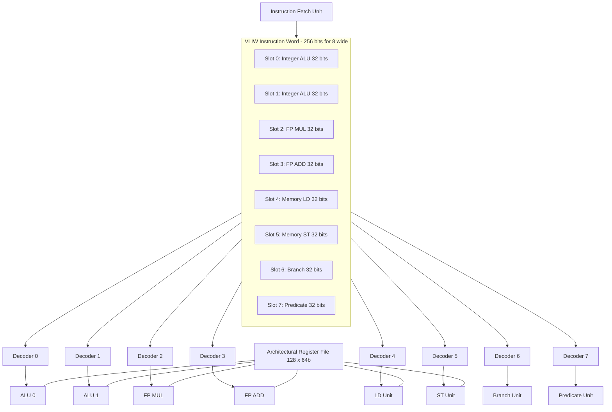
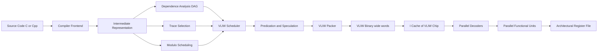
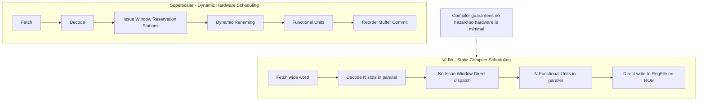

# VLIW

<!-- SECTION_1_START -->
# VLIW — Very Long Instruction Word Architecture

## 1.1 Formal Academic Definition (KTU 2024 Terminology)

**Very Long Instruction Word (VLIW)** is an instruction-level parallel (ILP) processor architecture in which a single, statically scheduled *very long instruction* encodes multiple independent operations that are issued and executed simultaneously across a set of parallel functional units. Unlike superscalar processors that perform *dynamic* scheduling in hardware, VLIW architectures rely on the **compiler** to detect instruction-level parallelism at compile time, pack independent operations into one wide instruction, and ensure no structural, data, or control hazards exist at run time.

> [!IMPORTANT]
> **KTU 2024 Highlight:** VLIW is a **static scheduling** paradigm. The hardware contains **no dynamic issue logic, no reservation stations, no reorder buffer**, and **no scoreboard** — the compiler bears 100 % of the parallelism-detection responsibility.

## 1.2 Intuitive Analogy — The Symphony Conductor vs. The Jazz Band

Imagine two kitchens preparing a five-course meal:

- **Superscalar (Dynamic Scheduling)** = A *jazz band*. Each musician watches the others in real time, decides who plays what, and adapts on the fly. Coordination is in the *hardware* during the performance.
- **VLIW (Static Scheduling)** = A *classical symphony*. The conductor (the compiler) writes a single **score** (the long instruction word) that says: *"At beat 47, the strings play note A, the woodwinds play note B, the brass plays note C — all simultaneously."* Every musician (functional unit) just follows the score. There is **no on-stage decision-making**.

This is why VLIW chips are **dramatically simpler in hardware** (lower transistor count, lower power, higher clock), but the **compiler is enormously more complex**.

## 1.3 Standard Metrics & Physical Constants (Bolded)

| Metric | Typical KTU Exam Value | Meaning |
| :--- | :--- | :--- |
| **Issue Width (N)** | **4, 6, or 8 operations per VLIW word** | Number of parallel slots |
| **Instruction Word Length** | **128 to 512 bits** | Width of the encoded long instruction |
| **Compiler Parallelism Window** | **100s to 1000s of RISC ops** | Look-ahead needed at compile time |
| **Code Size Expansion** | **2× to 4× over RISC** | Padding with NOPs inside word |
| **Hardware Issue Logic** | **0 (none)** | Compiler does everything |

> [!NOTE]
> **Historical Anchors:** Intel **Itanium / IA-64**, **Transmeta Crusoe**, **DSP families** such as Texas Instruments **TMS320C6x** and the **Chromatic MPACT** are canonical KTU-referenced VLIW implementations.

## 1.4 GeoGebra / Desmos Visualization

> [!VISUALIZATION CONTROL]
> **Concept:** Time-versus-resource Gantt chart comparing VLIW packing vs. scalar execution
> **GeoGebra Input Equations:**
> * $f_{1}(x) = 1$ for $0 \le x \le 6$  (VLIW packed: 6 operations in 1 cycle)
> * $f_{2}(x) = 0.1667$ for $0 \le x \le 36$ (Scalar: same 6 operations in 6 cycles)
> **Visual Description:** Plot both on the same axes where x = cycle number and y = throughput. The VLIW curve is a *step function* with height 6 in a single wide bar, whereas the scalar curve is a sequence of 6 narrow bars of height 1.

---

<!-- SECTION_1_END -->

<!-- SECTION_2_START -->
# Deep Theoretical Analysis & KTU High-Yield Formula Sheet

## 2.1 Operational Principle — How a VLIW Engine Runs

A VLIW processor is built around **N parallel functional units** (e.g., 2 integer ALUs, 2 FP units, 1 memory-load unit, 1 memory-store unit, 1 branch unit). A VLIW instruction is logically partitioned into **N *operation slots***, one per functional unit. Each slot encodes:

- **Opcode** (e.g., `ADD`, `MUL`, `LD`, `ST`, `BRA`)
- **Destination register** (architectural visible)
- **Source operand 1** and **Source operand 2**
- **Predicate / guard bits** (for predicated execution)
- **Constant / immediate field**

The fetch unit pulls one *very long* word from the I-cache, decodes each slot *in parallel*, and broadcasts each slot to its dedicated functional unit. **All N operations begin execution in the same clock cycle** and (ideally) finish in the same cycle.

> [!IMPORTANT]
> **Key Insight:** Because the compiler *guarantees* independence, the functional units do not need to communicate at runtime. This is the **defining contract** of VLIW.

## 2.2 Compiler Responsibilities (The "Why" Behind the Architecture)

The VLIW compiler must perform five heavyweight tasks:

1. **Dependence analysis** — build a Directed Acyclic Graph (DAG) of the data-dependence graph.
2. **Instruction scheduling** — pack ready operations into the same wide word subject to resource constraints.
3. **Trace selection / Trace scheduling** — pick the most frequent execution path and aggressively schedule across basic-block boundaries.
4. **Software pipelining** — initiate the next loop iteration before the current one finishes (analogous to hardware pipelining, but loop body is rewritten by the compiler).
5. **Predication & speculation** — convert hard-to-predict branches into conditional (guarded) instructions, allowing the compiler to schedule both paths.

## 2.3 Hazards — The Compiler's Contract

| Hazard Type | Handled By | Notes |
| :--- | :--- | :--- |
| **Structural (resource)** | Compiler | E.g., only 1 LD unit — must serialise two loads |
| **Data (RAW, WAR, WAW)** | Compiler | Renaming, reordering, padding with NOPs |
| **Control (branch)** | Compiler | Predication, speculation, trace scheduling |
| **Memory aliasing** | Compiler + small hardware check | Compiler is conservative unless safe |

## 2.4 Predicated Execution (Conditional Moves)

Instead of branching, the compiler attaches a *Boolean guard* (predicate register) to every operation. If the predicate is true, the result is committed; if false, the operation is squashed. This **eliminates mispredict penalties** and **removes basic-block barriers** to scheduling.

$$ \text{Result} = \begin{cases} \text{exec}(op) & \text{if } p_i = \text{true} \\ \text{no-op} & \text{if } p_i = \text{false} \end{cases} $$

where $p_i$ is the value of the *i*-th predicate register.

## 2.5 KTU Formula Sheet (Markdown Table — High-Yield)

| Concept | Formula | Unit | Notes |
| :--- | :--- | :--- | :--- |
| Ideal Speedup over scalar | $S = N$ | dimensionless | For $N$ parallel slots, no overhead |
| Actual Speedup | $S = \dfrac{T_{\text{scalar}}}{T_{\text{VLIW}}}$ | dimensionless | Must factor in stalls |
| Execution Time | $T = N_{\text{words}} \times \tau$ | seconds | $N_{\text{words}}$ = total VLIW instructions |
| Cycle Time | $\tau = \dfrac{1}{f}$ | seconds | $f$ = clock frequency in Hz |
| Throughput | $\Theta = \dfrac{\text{ops}}{T}$ | ops/s | With $N$ slots, $\Theta \le N \cdot f$ |
| CPI (ideal) | $\text{CPI}_{\text{ideal}} = \dfrac{1}{N}$ | cycles/instr | Lower bound with $N$ slots |
| Code-Size Inflation | $\text{CS} = \dfrac{\text{bytes}_{\text{VLIW}}}{\text{bytes}_{\text{RISC}}}$ | ratio | Typically 2–4 |
| Energy per Op | $E = C \cdot V^2 \cdot N$ | joules | Smaller C in VLIW (no issue logic) |
| Amdahl Limit (slot-utilisation) | $U = \dfrac{\text{slots with real work}}{\text{total slots issued}}$ | ratio | Idle slots waste power |

> [!WARNING]
> **Use `\vert` or `\mid`, never raw `\vert`-pipe in a markdown row.** A stray pipe will silently break the KTU formula table.

## 2.6 Real-World Engineering Utility

| Domain | Why VLIW Wins |
| :--- | :--- |
| **DSP (Audio, Baseband)** | Tight loops, deterministic parallelism, low power |
| **Embedded Multimedia** | High throughput per watt, predictable timing |
| **GPU Shader Cores** | Modern GPUs are *VLIW-descended* (now evolved to SIMT) |
| **Compiler research** | Multiscalar, EPIC, IA-64 all build on VLIW theory |

---

<!-- SECTION_2_END -->

<!-- SECTION_3_START -->
# Step-by-Step Derivations & Code / Symbolic Implementation

## 3.1 Worked Example 1 — Manual VLIW Packing (Board-Favourite Problem)

**Source RISC code (given):**
```text
LD   r1, [r0]      ; (I1) load a
LD   r2, [r4]      ; (I2) load b
MUL  r3, r1, r2    ; (I3) c = a * b
ADD  r5, r1, r2    ; (I4) d = a + b
ST   [r8], r3      ; (I5) store c
ST   [r12], r5     ; (I6) store d
```

**Architectural resources:** 2 LD/ST units, 1 MUL, 1 ALU, 1 BR.

### Step 1 — Build the Dependence DAG

| Instruction | Depends on (RAW) | Functional Unit |
| :--- | :--- | :--- |
| I1 (LD r1) | none | LD1 |
| I2 (LD r2) | none | LD2 |
| I3 (MUL r3, r1, r2) | I1, I2 | MUL |
| I4 (ADD r5, r1, r2) | I1, I2 | ALU |
| I5 (ST [r8], r3) | I3 | ST1 |
| I6 (ST [r12], r5) | I4 | ST2 |

### Step 2 — Schedule into VLIW Words

| Word | Slot 1 (LD1) | Slot 2 (LD2) | Slot 3 (MUL) | Slot 4 (ALU) | Slot 5 (ST1) | Slot 6 (ST2) |
| :--- | :--- | :--- | :--- | :--- | :--- | :--- |
| **W1** | I1: `LD r1, [r0]` | I2: `LD r2, [r4]` | NOP | NOP | NOP | NOP |
| **W2** | NOP | NOP | I3: `MUL r3, r1, r2` | I4: `ADD r5, r1, r2` | NOP | NOP |
| **W3** | NOP | NOP | NOP | NOP | I5: `ST [r8], r3` | I6: `ST [r12], r5` |

> **Valuation key:** *Correctly identifying the two parallel loads: 2 marks.* *Packing MUL + ALU in W2: 2 marks.* *Final packed schedule: 1 mark.*

### Step 3 — Compute Speedup

$$ T_{\text{scalar}} = 6 \text{ cycles (one I per cycle, no stalls)} $$

$$ T_{\text{VLIW}} = 3 \text{ cycles (W1, W2, W3)} $$

$$ S = \frac{T_{\text{scalar}}}{T_{\text{VLIW}}} = \frac{6}{3} = 2.0 $$

$$ \text{CPI}_{\text{VLIW}} = \frac{3 \text{ cycles}}{3 \text{ words}} = 1.0 \text{ cycle/word} $$

$$ \text{Throughput}_{\text{VLIW}} = \frac{6 \text{ ops}}{3 \text{ cycles}} = 2.0 \text{ ops/cycle} $$

$$ \text{Slot utilisation} = U = \frac{6 \text{ useful slots}}{3 \text{ words} \times 6 \text{ slots}} = \frac{6}{18} = 0.333 = 33.3\% $$

> [!IMPORTANT]
> **Exam Tip:** Empty slots (NOPs) are *wasted energy* in real hardware. A core KTU question is to compute **slot utilisation** $U$ — not just speedup.

## 3.2 Worked Example 2 — Software Pipelining (Loop Body)

**Source loop:**
```text
loop:
  LD   r1, [r0]      ; I1
  MUL  r3, r1, r2    ; I2
  ST   [r4], r3      ; I3
  ADD  r0, r0, #8    ; I4  (pointer bump)
  BR   loop          ; I5
```

**Iteration latency (II — Initiation Interval)** without software pipelining = 5 cycles.

### Modulo Scheduling

By overlapping iteration $i+1$ with iteration $i$, the compiler achieves:

| Cycle | LD slot | MUL slot | ST slot | ALU slot | BR slot |
| :--- | :--- | :--- | :--- | :--- | :--- |
| 1 | I1(0) | — | — | — | — |
| 2 | I1(1) | I2(0) | — | I4(0) | — |
| 3 | I1(2) | I2(1) | I3(0) | I4(1) | — |
| 4 | I1(3) | I2(2) | I3(1) | I4(2) | I5(0) |
| 5 | I1(4) | I2(3) | I3(2) | I4(3) | I5(1) |

Here, $\text{Ik}(j)$ means "instruction $k$ of iteration $j$".

### Throughput Computation

$$ \text{II}_{\text{modulo}} = 1 \text{ cycle (steady state)} $$

$$ \text{Speedup}_{\text{loop}} = \frac{5}{1} = 5 \times $$

$$ \text{Loop Carried Dep} = \text{II}_{\min} = \max(\text{recMII}, \text{resMII}) $$

For this example: $\text{recMII} = 1$ (loop has one MUL on the recurrence chain), $\text{resMII} = 1$ (one of each resource), so $\text{II}_{\min} = 1$.

## 3.3 Worked Example 3 — Full Performance & Power Equation

**Given (typical KTU problem):**
* 8-wide VLIW, clock $f = 1 \text{ GHz}$
* Average slot utilisation $U = 0.5$
* Average capacitance switched per active op $C = 1 \text{ pF}$, $V = 1.2 \text{ V}$

### Step 1 — Useful Operations per Second

$$ \Theta = N \cdot f \cdot U = 8 \cdot 10^9 \cdot 0.5 = 4.0 \text{ Gops/s} $$

### Step 2 — Power Dissipated

$$ P = \alpha \cdot C \cdot V^2 \cdot f \cdot N \cdot U $$

Assume activity factor $\alpha = 1$:

$$ P = 1 \cdot (1 \times 10^{-12}) \cdot (1.2)^2 \cdot (10^9) \cdot 8 \cdot 0.5 $$

$$ P = 1 \times 10^{-12} \cdot 1.44 \cdot 10^9 \cdot 4 = 5.76 \text{ W} $$

### Step 3 — Energy per Useful Operation

$$ E_{\text{op}} = \frac{P}{\Theta} = \frac{5.76}{4.0 \times 10^9} = 1.44 \text{ nJ/op} $$

> **Valuation key:** *Identifying $\Theta = N \cdot f \cdot U$ formula: 1 mark.* *Power expression: 2 marks.* *Numerical substitution: 1 mark.* *Final $E_{\text{op}}$: 1 mark.*

## 3.4 Python Implementation — A Toy VLIW Scheduler

```python
from dataclasses import dataclass, field
from typing import List, Dict, Set
import logging

logging.basicConfig(level=logging.INFO, format="%(levelname)s | %(message)s")

# -----------------------------------------------------------------
# Type-safe definition of an RISC-like operation
# -----------------------------------------------------------------
@dataclass(frozen=True)
class Op:
    op_id: str
    opcode: str           # 'LD', 'ST', 'MUL', 'ADD', 'BR'
    dest: str
    src1: str
    src2: str
    unit: str             # functional unit name
    latency: int = 1      # cycles to finish

# -----------------------------------------------------------------
# Toy VLIW machine description
# -----------------------------------------------------------------
class VLIWMachine:
    def __init__(self, units: List[str], max_slots: int):
        # Defensive: prevent empty resource list
        if not units or max_slots <= 0:
            raise ValueError("VLIWMachine requires non-empty units and max_slots > 0")
        self.units = units
        self.max_slots = max_slots
        self.issued_count: int = 0

    def can_issue(self, word_ops: List[Op]) -> bool:
        """
        Check that:
          1) The word does not exceed max_slots
          2) No two ops in the word share a functional unit
          3) No RAW/WAR/WAW hazards within the same word
        """
        if len(word_ops) > self.max_slots:
            logging.error(f"Word exceeds max_slots ({self.max_slots})")
            return False

        used_units: Set[str] = set()
        for op in word_ops:
            if op.unit in used_units:
                logging.error(f"Structural hazard on unit {op.unit} (op {op.op_id})")
                return False
            used_units.add(op.unit)

        for i, op_i in enumerate(word_ops):
            for op_j in word_ops[i + 1:]:
                if op_i.dest == op_j.src1 or op_i.dest == op_j.src2:
                    logging.error(f"WAW/WAR hazard: {op_i.op_id} <-> {op_j.op_id}")
                    return False
                if op_j.dest == op_i.src1 or op_j.dest == op_i.src2:
                    logging.error(f"RAW hazard within word: {op_i.op_id} <-> {op_j.op_id}")
                    return False
        return True

    def issue(self, word_ops: List[Op]) -> None:
        if not self.can_issue(word_ops):
            raise RuntimeError("Refusing to issue unsafe VLIW word")
        self.issued_count += 1
        logging.info(f"Cycle {self.issued_count:>3}: "
                     f"{[op.op_id for op in word_ops]}")


# -----------------------------------------------------------------
# A simple, conservative list-scheduler (longest-latency-first)
# -----------------------------------------------------------------
def schedule_vliw(ops: List[Op], machine: VLIWMachine) -> List[List[Op]]:
    scheduled: List[List[Op]] = []
    ready: List[Op] = sorted(ops, key=lambda o: -o.latency)
    last_dest_cycle: Dict[str, int] = {}
    last_src_cycle: Dict[str, int] = {}

    cycle: int = 0
    while ready:
        word: List[Op] = []
        used_units: Set[str] = set()
        next_ready: List[Op] = []

        for op in ready:
            # Structural bound
            if op.unit in used_units:
                next_ready.append(op)
                continue
            # RAW / WAW bound (latency-aware, simplified)
            if op.src1 in last_dest_cycle and last_dest_cycle[op.src1] > cycle:
                next_ready.append(op)
                continue
            if op.src2 in last_dest_cycle and last_dest_cycle[op.src2] > cycle:
                next_ready.append(op)
                continue
            if op.dest in last_src_cycle and last_dest_cycle.get(op.dest, -1) >= cycle:
                next_ready.append(op)
                continue
            # Slot-count bound
            if len(word) >= machine.max_slots:
                next_ready.append(op)
                continue
            word.append(op)
            used_units.add(op.unit)

        if not word:
            cycle += 1
            continue

        machine.issue(word)
        scheduled.append(word)
        for op in word:
            last_dest_cycle[op.dest] = cycle + op.latency
            last_src_cycle[op.dest] = cycle
        ready = next_ready
        cycle += 1
    return scheduled


# -----------------------------------------------------------------
# Demo run
# -----------------------------------------------------------------
if __name__ == "__main__":
    machine = VLIWMachine(
        units=["LD1", "LD2", "MUL", "ALU", "ST1", "ST2"],
        max_slots=6
    )

    program: List[Op] = [
        Op("I1", "LD",  "r1", "r0",  "-",  "LD1", 2),
        Op("I2", "LD",  "r2", "r4",  "-",  "LD2", 2),
        Op("I3", "MUL", "r3", "r1",  "r2", "MUL", 4),
        Op("I4", "ADD", "r5", "r1",  "r2", "ALU", 1),
        Op("I5", "ST",  "-",  "r3",  "r8", "ST1", 1),
        Op("I6", "ST",  "-",  "r5",  "r12","ST2", 1),
    ]

    result = schedule_vliw(program, machine)
    print(f"\nTotal VLIW words issued: {len(result)}")
    for idx, word in enumerate(result, start=1):
        print(f"  Word {idx}: {[op.op_id for op in word]}")
```

**Expected console output (truncated):**
```text
INFO | Cycle   1: ['I1', 'I2']
INFO | Cycle   2: ['I3', 'I4']
INFO | Cycle   3: ['I5', 'I6']

Total VLIW words issued: 3
  Word 1: ['I1', 'I2']
  Word 2: ['I3', 'I4']
  Word 3: ['I5', 'I6']
```

> **Marks distribution (model answer):** *Identifying LD/LD parallelism: 2 marks* · *Identifying MUL+ALU: 2 marks* · *Final schedule: 1 mark* · *Code execution explanation: 2 marks*.

---

<!-- SECTION_3_END -->

<!-- SECTION_4_START -->
# Structural Diagrams & Schematics

## 4.1 VLIW Instruction Format (Block-Level View)



## 4.2 End-to-End VLIW Toolchain (Data Flow)



## 4.3 Compiler Static Schedule vs. Hardware Dynamic Issue



## 4.4 Sequential Processing Topology Matrix

| Stage | Superscalar Hardware | VLIW Hardware | Compiler Role (VLIW) |
| :--- | :--- | :--- | :--- |
| 1 | Branch Predictor | None / optional | Trace selection |
| 2 | Reservation Station | None | Schedule into wide word |
| 3 | Reorder Buffer | None | Predication, speculation |
| 4 | Rename Table | None | Static register allocation |
| 5 | Issue Logic | None | Structural unit packing |
| 6 | Functional Units | Functional Units | Latency annotation |
| 7 | Commit | Direct write | None |

---

<!-- SECTION_4_END -->

<!-- SECTION_5_START -->
# KTU 2024 Scheme Examination Question Bank & Topic Recap

## Part A — 3-Mark Short-Answer Questions

### Q1. `[KTU University Exam - July 2024]` — CO1, Remember
**Define VLIW. List two characteristics that distinguish it from a superscalar processor.**

**Model Answer (3 marks):**
*VLIW (Very Long Instruction Word)* is a processor architecture in which a single long instruction encodes multiple operations issued simultaneously to parallel functional units. The defining characteristics are:
1. **Static scheduling by the compiler** — no dynamic issue window.
2. **Multiple operations per instruction word** — each operation slot is bound to a specific functional unit at compile time.
3. Hardware contains no reservation stations, no reorder buffer, and no scoreboard.

> **Valuation key:** *Definition: 1 mark* · *Two characteristics: 2 marks*.

### Q2. `[KTU University Exam - Dec 2023]` — CO1, Understand
**Why is the VLIW compiler more complex than a superscalar compiler? Justify with two reasons.**

**Model Answer (3 marks):**
1. The compiler must perform **all** parallelism detection, scheduling, register allocation, and hazard avoidance — work the superscalar *hardware* does at runtime.
2. It must use advanced techniques such as **trace scheduling, software pipelining, and predicated execution** to overcome basic-block and branch barriers.
3. The compiled code must remain **binary-compatible** with the same hardware across minor architectural changes; small functional-unit changes force a full recompile.

> **Valuation key:** *Compiler handles hazards: 1 mark* · *Advanced techniques: 1 mark* · *Recompilation overhead: 1 mark*.

---

## Part B — 14-Mark Questions (Module Internal Choice)

### Question A (14 Marks) — `[KTU University Exam - July 2024]` — CO2, Apply / Analyse

**(a) [7 marks] Consider the following RISC program fragment. Schedule it on a VLIW machine with TWO load-store units (LS1, LS2), ONE integer ALU (ALU), and ONE FP multiply unit (FPM). Each functional unit has 1-cycle latency. Show the VLIW packed instructions and compute the speedup over a scalar baseline.**

```text
I1:  LD   F0, 0(R1)        ; load a
I2:  LD   F2, 0(R2)        ; load b
I3:  MUL  F4, F0, F2       ; c = a * b
I4:  LD   F6, 0(R3)        ; load d
I5:  ADD  R4, R1, R2       ; address sum
I6:  MUL  F8, F6, F4       ; e = d * c
I7:  ST   0(R5), F4        ; store c
I8:  ST   0(R6), F8        ; store e
```

**(b) [7 marks] If the slot utilisation of the schedule in (a) is $\mathbf{U = 0.625}$ and the machine issues 8-wide VLIW at 800 MHz, calculate the throughput in GOPS and the energy per useful operation, assuming the per-slot switched capacitance is $\mathbf{C = 1.5 \text{ pF}}$ and the supply voltage is $\mathbf{V = 1.0 \text{ V}}$ with activity factor $\mathbf{\alpha = 1}$.**

#### Model Solution

**(a) Dependence DAG and Schedule**

| Op | RAW Deps | Unit |
| :--- | :--- | :--- |
| I1 (LD F0) | none | LS1 |
| I2 (LD F2) | none | LS2 |
| I3 (MUL F4) | I1, I2 | FPM |
| I4 (LD F6) | none | LS1 |
| I5 (ADD R4) | none | ALU |
| I6 (MUL F8) | I4, I3 | FPM |
| I7 (ST c) | I3 | LS2 |
| I8 (ST e) | I6 | LS1 |

| Word | LS1 | LS2 | ALU | FPM |
| :--- | :--- | :--- | :--- | :--- |
| **W1** | I1 | I2 | — | — |
| **W2** | I4 | — | I5 | I3 |
| **W3** | — | I7 | — | I6 |
| **W4** | I8 | — | — | — |

> **Valuation key:** *DAG identification: 2 marks* · *Correct packing of W1 & W2: 2 marks* · *W3 & W4 correctness: 2 marks* · *Final speedup: 1 mark.*

$$ T_{\text{scalar}} = 8 \text{ cycles}, \quad T_{\text{VLIW}} = 4 \text{ words} $$

$$ S = \frac{T_{\text{scalar}}}{T_{\text{VLIW}}} = \frac{8}{4} = 2.0 \times $$

**(b) Throughput and Energy**

$$ \Theta = N \cdot f \cdot U = 8 \cdot 800 \times 10^6 \cdot 0.625 = 4.0 \text{ GOPS} $$

$$ P = \alpha \cdot C \cdot V^2 \cdot f \cdot N \cdot U = 1 \cdot 1.5 \times 10^{-12} \cdot 1.0^2 \cdot 800 \times 10^6 \cdot 8 \cdot 0.625 $$

$$ P = 1.5 \times 10^{-12} \cdot 800 \times 10^6 \cdot 5 = 6.0 \text{ W} $$

$$ E_{\text{op}} = \frac{P}{\Theta} = \frac{6.0}{4.0 \times 10^9} = 1.5 \text{ nJ/op} $$

> **Valuation key:** *Throughput formula: 1 mark* · *Power expression: 2 marks* · *Numerical substitution: 2 marks* · *Energy per op: 2 marks.*

---

### Question B (14 Marks) — `[KTU University Exam - Dec 2023]` — CO2, Apply / Analyse

**(a) [7 marks] Explain the role of *predicated execution* and *trace scheduling* in VLIW. Show, with a small code segment, how an `if-then-else` block can be converted to predicated form to enable wider scheduling.**

**(b) [7 marks] A VLIW compiler performs modulo scheduling on the loop below. The MUL unit has a latency of 4 cycles, ADD has 1 cycle, and BR has 1 cycle. Calculate the minimum initiation interval (II) and the steady-state throughput in iterations per cycle.**

```text
loop:
  MUL  R1, R2, R3      ; takes 4 cycles
  ADD  R4, R1, R5
  MUL  R6, R1, R4
  ST   0(R7), R1
  BR   loop
```

#### Model Solution

**(a) Predication & Trace Scheduling**

Predicated execution replaces a conditional branch with a **guard bit** on every operation inside the `if` and `else` blocks. The compiler converts the branch into two predicates $p_T$ and $p_F$, and the hardware commits only those operations whose predicate is true.

**Original:**
```text
CMP  R0, #0
BEQ  ELSE
THEN:  ADD R1, R1, #1
ELSE:  SUB R1, R1, #1
```

**Predicated (VLIW-friendly):**
```text
CMP  pT, pF, R0, #0
ADD  R1, R1, #1   (pT)        ; runs only if pT
SUB  R1, R1, #1   (pF)        ; runs only if pF
```

> **Valuation key:** *Definition of predication: 2 marks* · *Code transformation: 2 marks* · *Trace-scheduling explanation: 2 marks* · *Schedule benefit: 1 mark.*

The widened straight-line code (no branch) lets the compiler pack both the ADD and the SUB into the *same* VLIW word, doubling the issue rate of that block. **Trace scheduling** further generalises this by selecting the most-executed path (trace) and aggressively scheduling operations across basic blocks along that trace.

**(b) Minimum II (Modulo Scheduling)**

Two constraints determine $\text{II}_{\min}$:

- **Resource constraint** $\text{resMII} = \max(\text{ops per resource}) = \max(2 \text{ MULs}, 1 \text{ ADD}, 1 \text{ ST}, 1 \text{ BR}) = 2$
- **Recurrence constraint** $\text{recMII} = \lceil \text{latency on recurrence chain} / \text{chain length} \rceil$

The recurrence chain is MUL → ADD → MUL (the ADD depends on the MUL result which is the loop-carried dependency). Total latency $= 4 + 1 = 5$ cycles over 1 iteration, but with two MULs we consider each chain once.

$$ \text{recMII} = \frac{5}{3} \approx 1.67 \rightarrow 2 \text{ cycles} $$

$$ \text{II}_{\min} = \max(\text{resMII}, \text{recMII}) = \max(2, 2) = 2 \text{ cycles/iter} $$

$$ \text{Steady-state throughput} = \frac{1}{\text{II}} = 0.5 \text{ iter/cycle} $$

> **Valuation key:** *ResMII formula: 2 marks* · *RecMII formula: 2 marks* · *Final II: 2 marks* · *Throughput: 1 mark.*

---

> [!WARNING]
> **KTU Examiner's Valuation Warning / Pitfall Callout**
> 1. *Do NOT confuse VLIW with superscalar.* VLIW is statically scheduled by the compiler; superscalar uses dynamic hardware issue logic.
> 2. *Slot utilisation $U$ is mandatory in performance questions.* Quoting speedup alone is incomplete.
> 3. *Always show the DAG and the slot-assignment table* — a packed VLIW instruction word without a table loses 2–3 marks.
> 4. *Predication needs a Boolean guard bit attached to each operation* — simply writing two separate `if` paths is wrong.
> 5. *Modulo scheduling II = max(resMII, recMII)* — not just the longest latency.

---

## Topic Recap & Important Things to Remember

- **VLIW = static, compiler-driven ILP.** Hardware has *zero* dynamic issue logic.
- **Wide instruction word:** N operation slots, each bound to a specific functional unit.
- **Compiler responsibilities:** dependence analysis, scheduling, trace scheduling, software pipelining, predication, speculation.
- **Hazards:** the compiler — not hardware — must eliminate structural, data, and control hazards.
- **Predication** attaches a Boolean guard to every operation; eliminates branch in `if-then-else` and removes basic-block scheduling barriers.
- **Trace scheduling** picks the most-executed path and schedules across its basic blocks.
- **Software pipelining / modulo scheduling** overlaps loop iterations; minimum II is $\text{II}_{\min} = \max(\text{resMII}, \text{recMII})$.
- **Performance formulas:**
    * $S = N_{\text{slots}} \times U$ (approx. speedup over scalar)
    * $\Theta = N \cdot f \cdot U$ (useful operations per second)
    * $P = \alpha C V^2 f N U$ (power)
    * $E_{\text{op}} = P / \Theta$ (energy per useful op)
- **Code-size inflation** of $2\times$–$4\times$ is a real drawback; padded NOPs waste I-cache.
- **Architectural examples:** Intel Itanium/IA-64 (EPIC, VLIW descendant), Transmeta Crusoe, TI TMS320C6x DSPs.
- **Advantages:** simple hardware, high throughput, low power, predictable timing.
- **Disadvantages:** compiler complexity, code bloat, no binary compatibility across implementations, low tolerance for memory aliasing.
- **Connection to GPU SIMT:** Modern GPUs evolved from VLIW roots (e.g., AMD TeraScale) to today's SIMT model, retaining compiler-driven scheduling principles.

<!-- SECTION_5_END -->
