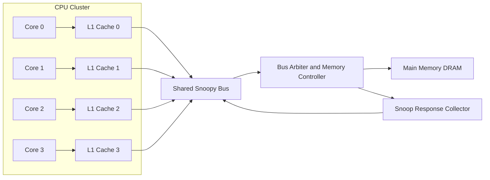
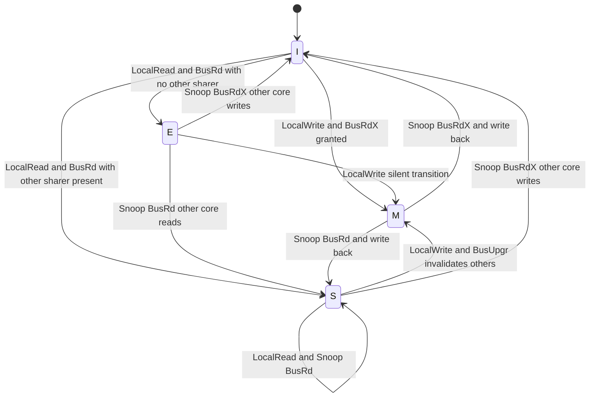
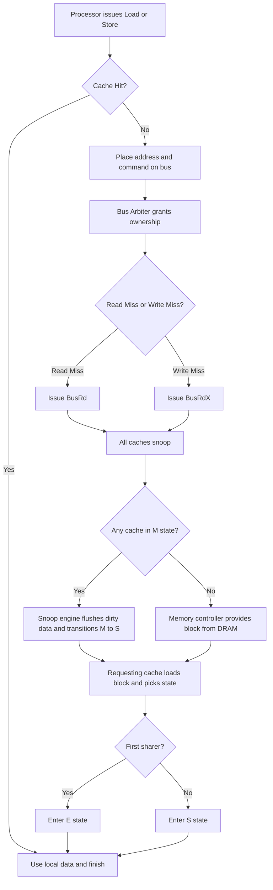
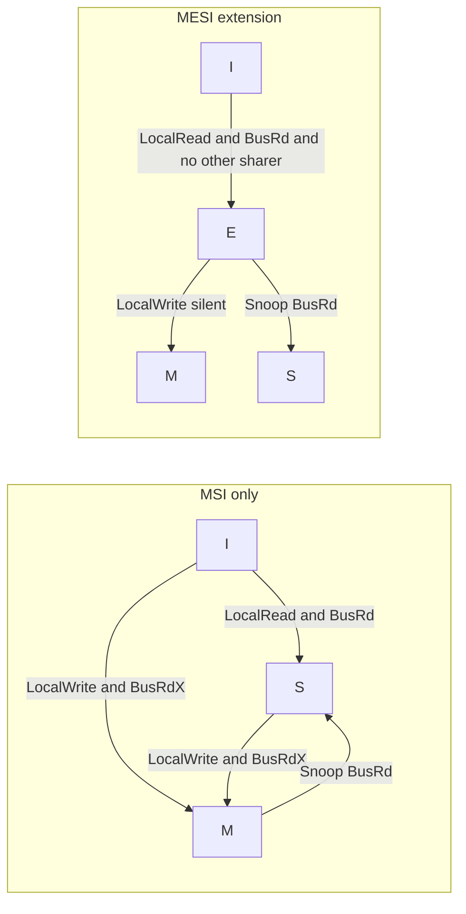

# Centralized shared memory architecture Cache coherence and snooping protocol (Implementation details – not required).

<!-- SECTION_1_START -->
# Centralized Shared Memory Architecture \& Cache Coherence Snooping Protocols

## 1.1 Formal Academic Definition

> [!NOTE]
> **Centralized Shared-Memory Architecture (Uniform Memory Access – UMA):**
> A multiprocessor organization in which $N$ processors, each equipped with a private **Level-1 (L1)** and an optional **Level-2 (L2)** cache, are interconnected through a single shared physical bus (or a low-degree switch) to a single, globally addressable main memory. Every processor observes the **same memory latency** to any address, hence the alternative name **Symmetric Multiprocessor (SMP)**.

In the taxonomy of parallel architectures (Flynn’s and Hennessy-Patterson), this corresponds to the **MIMD-Single Address Space** class, where multiple instruction streams operate on multiple data streams under a single, shared address space.

> [!IMPORTANT]
> **Cache Coherence Problem (Hennessy \& Patterson):**
> A memory system is *coherent* if and only if every read of a memory location $X$ by any processor $P_i$ returns the value most recently written to $X$ by some processor $P_j$, subject to the following three invariants:
> 1. **Write Propagation** – A write by $P_j$ must eventually be made visible to all other processors.
> 2. **Write Serialization** – Writes to the same location are observed in the same total order by all processors.
> 3. **Read Consistency (Write Atomicity)** – A read of $X$ that follows a write to $X$ by the same processor observes the new value (no read is allowed to bypass a preceding write in program order).

## 1.2 The Coherence Problem — Intuitive Analogy

Imagine a co-working space with **5 designers** working on the same large project blueprint.

| Element in the Building | Computer Architecture Equivalent |
|:---|:---|
| The single large blueprint pinned to the central wall | **Shared Main Memory** |
| Each designer’s personal clipboard (a copy of relevant pages) | **Private L1/L2 Cache** of that core |
| The notice board at the entrance where designers post updates | **The Shared Snooping Bus** |
| The protocol of looking at the board before editing and shouting "I am updating page 4!" | **Snooping Protocol (MSI/MESI)** |

**The problem**: Designer A quietly erases a line on her clipboard (writes to her cache). Designer B, looking at his outdated clipboard, still believes the line is present. The blueprints on the wall and the clipboards are now **inconsistent** — a classic cache coherence violation.

**The fix**: Every "edit" must be *announced* on the central notice board, and other designers must *snoop* (listen) to that announcement, either **updating** or **invalidating** their local copies. The snooping bus and coherence protocol are precisely the *notice board* and the *rules of announcement*.

## 1.3 Coherence vs. Consistency — A Critical Distinction

> [!IMPORTANT]
> **Cache Coherence** defines the rules for a **single memory location** (per-location ordering of reads/writes).
> **Memory Consistency** defines the rules for **multiple memory locations** (the order in which memory operations from one processor become visible to others — e.g., Sequential Consistency, TSO, Weak Ordering).

For KTU 2024, these are tested as a *paired pair* and the distinction is a high-yield 3-mark question.

## 1.4 Visualization of the UMA Bus Architecture

> [!VISUALIZATION CONTROL]
> **Concept:** A *bird’s-eye view* of centralized shared-memory where all $N$ CPU–cache pairs converge onto a single, arbitrated bus. Useful to map the *single point of serialization* (the bus) that simplifies write ordering.
> **GeoGebra / Desmos Input Equations:**
> * $y = 0$ (main horizontal bus line on x-axis)
> * Points: $(0,0), (2,0), (4,0), (6,0), (8,0)$ → cores $P_0, P_1, P_2, P_3, P_4$
> * $x = 4, y \in [-2, 0]$ (vertical drop to memory) ; Memory block at $(4, -2)$ with width $1.5$, height $0.7$
> **Visual Description:** All processor–cache nodes sit on a single horizontal bus line; a vertical drop from the midpoint of the bus leads to a rectangle labelled *Main Memory*. Any transaction must traverse this single bus, giving natural **write serialization** for free.

```
        L1  L1  L1  L1  L1
P0 ---[ ]--[ ]--[ ]--[ ]--[ ]---P4
         \   \   |   /   /
          \   \  |  /   /
           \   \ | /   /
            \   \|/   /
            =====BUS=====
                |
                v
          [ MAIN MEMORY ]
```
<!-- SECTION_1_END -->

<!-- SECTION_2_START -->
# Deep Theoretical Analysis \& KTU High-Yield Formula Sheet

## 2.1 Why Cache Coherence Becomes a Problem

When each core has a **write-back** cache (the default for performance), a write by $P_i$ to address $X$:

1. Updates $P_i$’s cache line (state → Modified / Dirty).
2. Does **NOT** immediately propagate to main memory.
3. Leaves stale (valid-but-stale) copies in other caches (the *consumer* problem).

Without a coherence protocol, the other cores can keep reading **stale data** indefinitely — violating the *Write Propagation* invariant.

## 2.2 The Two Coherence Strategies

| Strategy | Mechanism | Strength | Weakness |
|:---|:---|:---|:---|
| **Directory-Based** | A central directory tracks per-block sharers | Scalable, no broadcast storm | Directory is a bottleneck; 3-hop latency |
| **Snooping (Broadcast)** | Every cache listens on the shared bus; tags and state are broadcast | Simple, low latency, naturally ordered by the bus | Limited by bus bandwidth; does not scale beyond ~16 cores |

> [!NOTE]
> The KTU 2024 Module 3 syllabus explicitly covers **Snooping Protocols** for centralized SMPs. Directory protocols are covered in Module 4 (Distributed shared memory).

## 2.3 The Snooping Idea

All caches share a common broadcast medium (**the bus**). Every cache controller continuously **snoops** (monitors) the bus for transactions that match addresses it currently holds. The controller reacts according to its **state machine**.

Key insight — the *bus itself* provides **natural serialization**: only one transaction can be on the bus at a time (the bus is *atomically* arbitrated). Therefore, all cores observe writes to a given address in the **same total order** — satisfying *Write Serialization* for free.

## 2.4 The MSI Protocol — The Foundation

The simplest, most-canonical snooping protocol. Every cache line is in exactly one of three states:

| State | Full Name | Meaning |
|:---|:---|:---|
| **M** | **Modified** | This cache has the *only valid copy*, and it is *dirty* (differs from memory). The core must supply data on a read miss. |
| **S** | **Shared** | This cache has a *clean, valid* copy. Other caches may also hold a *Shared* copy. The data equals main memory. |
| **I** | **Invalid** | The cache line is **not present** (or is present but must not be used). Reads to an I-line trigger a **bus read**. |

### 2.4.1 MSI State-Transition Table

The rows are *processor-side events*; the columns are *bus-snooped events*. Each cell shows the next state, and any bus action the controller must perform.

| Current State | Local Read | Local Write | Snoop Read (BusRd) | Snoop Write / Invalidate (BusRdX / BusUpgr) | Snoop Read-with-Intent-to-Modify |
|:---:|:---:|:---:|:---:|:---:|:---:|
| **M** | M | M | **S** + flush (write-back) | **I** + flush | **I** + flush |
| **S** | S | **M** + BusUpgr | S | **I** | **I** |
| **I** | **S** + BusRd | **M** + BusRdX | — | — | — |

> [!IMPORTANT]
> The **flush (write-back)** action: When a line in **M** is snooped as *read* by another core, the cache must supply the data on the bus and transition to **S**, writing the dirty data back to memory in the same transaction (this is *write-through-on-share*).
> When snooped as *write* (BusRdX), the dirty line is flushed to memory and the line is **invalidated**.

### 2.4.2 The Two Invalidating Bus Transactions

| Transaction | Abbreviation | Purpose | Action by Other Caches |
|:---|:---|:---|:---|
| **Bus Read** | **BusRd** | Request a *clean* copy for reading | Snoop: transition **S→S** or **M→S** (with flush) |
| **Bus Read Exclusive** | **BusRdX** | Request *exclusive ownership* for writing (and invalidate all other copies) | Snoop: transition **S→I** or **M→I** (with flush) |

## 2.5 The MESI Protocol — Adding the *Exclusive* State

MSI generates a spurious bus transaction on a *silent upgrade* from S to M (the BusUpgr is needed, but if the line is held by only one other core, an invalidation of nobody is wasteful). The **Illinois MESI** protocol (Papamarcos \& Patel, 1984) adds a fourth state:

| State | Meaning |
|:---|:---|
| **E** | **Exclusive, Clean, Modified-from-Memory = false.** Only this cache holds the line; it is *clean* (matches memory); the core can silently transition E → M on a write **without** any bus transaction. |

### 2.5.1 MESI State-Transition Table (Complete)

| Current State | Local Read | Local Write | Snoop BusRd | Snoop BusRdX / BusUpgr |
|:---:|:---:|:---:|:---:|:---:|
| **M** | M | M | **S** + write-back | **I** + write-back |
| **E** | E | **M** (silent) | **S** | **I** |
| **S** | S | **M** + BusUpgr | S | **I** |
| **I** | **S** + BusRd (or **E** + BusRd if this was the first) | **M** + BusRdX | — | — |

> [!NOTE]
> The E→M *silent* transition is the **performance win** of MESI over MSI: a single-core write to a private line generates **zero bus traffic**.

## 2.6 The MOESI Protocol — AMD’s Five-State Extension

Used in AMD Opteron / Zen architectures. Adds **O** (Owned) to allow **dirty sharing** without a write-back to memory:

| State | Dirty? | Others may have copy? | Must supply data on snoop? |
|:---|:---:|:---:|:---:|
| **M** | Yes | No | Yes (own dirty) |
| **O** | Yes | **Yes** | Yes (forwards dirty data, no memory write-back) |
| **E** | No | No | No |
| **S** | No | Yes | No |
| **I** | — | — | — |

The **O-state** keeps a *dirty* line in multiple caches, and the *Owner* forwards data on a snoop, eliminating the memory round-trip — useful for producer-consumer patterns.

## 2.7 The KTU High-Yield Formula & Cheat Sheet

> [!IMPORTANT]
> Use `\vert` for absolute value inside markdown tables. No raw `\vert` pipes inside rows.

| $\#$ | Concept | Formula / Rule | Units / Notes |
|:---:|:---|:---|:---|
| 1 | Coherence invariant | $T_{write\_prop} \le T_{deadline}$ | Must finish within bounded time |
| 2 | Bus arbitration | $T_{bus\_cycle} = 1 / f_{bus}$ | $\mathbf{seconds}$, bus is the serialization point |
| 3 | Memory stall on miss | $T_{miss} = T_{bus\_arbitration} + T_{mem\_access} + T_{transfer}$ | $\mathbf{cycles}$ |
| 4 | Coherence traffic (MSI) per write on shared line | $1$ BusRdX + $N_{sharers}$ invalidations | Number of bus transactions |
| 5 | Coherence traffic (MESI) silent write to private line | $0$ bus transactions | The E→M transition is silent |
| 6 | False sharing penalty | $T_{ping-pong} = N_{transitions} \times T_{bus}$ | Unrelated variables in same cache block |
| 7 | Write serialization requirement | $\text{Order}(W_1, W_2) \text{ must be identical at all observers}$ | Logical (bus) order |
| 8 | Snoop hit latency | $T_{snoop} \le T_{bus\_cycle}$ | Snooping is parallel to data transfer |
| 9 | Cache line size | $\text{typically } 64\,\text{bytes}$ | Modern standard |
| 10 | Snooping bandwidth | $BW_{snoop} = f_{bus} \times W_{addr\_bus}$ | $\mathbf{bytes/s}$ |

## 2.8 Engineering \& Production Utility

- **Server CPUs** (Intel Xeon, AMD EPYC) implement MESI or MOESI for their L1/L2 cores.
- **GPU** coherence: modern GPUs (NVIDIA Hopper, AMD CDNA) use *scope-based* coherence (CTA / cluster) rather than full MESI.
- **Apple M-series** uses a variant of MESI between P-cores; a **firewall state** (akin to I) prevents speculative reads across coherence domains.
- **DSI (Distributed Shared Memory)** in CHT (Cluster-to-Hub Tunnel) and the **CXL.cache** protocol (Compute Express Link, 2020+) are *directory-assisted snooping hybrids* for modern disaggregated systems.

## 2.9 Pitfalls — High-Frequency KTU Errors

> [!WARNING]
> 1. Confusing **Coherence** (per-location) with **Consistency** (per-program) — separate concepts.
> 2. Forgetting that **M** implies *write-back is required on a snoop that needs the data*.
> 3. Believing **S → M** is silent in MESI (it is *not* — it still needs BusUpgr if other sharers exist; the silent path is **E → M**).
> 4. Treating **E** as a *write* state — it is a *clean, exclusive, read-only* state. Writes silently flip to **M**.
> 5. Ignoring that *snooping* is **passive** (just listening) and the bus arbitration is **active** (contention, priority, fairness).
<!-- SECTION_2_END -->

<!-- SECTION_3_START -->
# Step-by-Step Derivations, State-Machine Walkthroughs \& Python Simulation

## 3.1 A Worked Example — Three Cores, One Cache Line

Consider $P_0, P_1, P_2$ all initially hold line $X$ in state **S** (memory holds $X = 100$).

### Step 1: $P_0$ issues a write to $X$ (e.g., $X \leftarrow 200$)

* $P_0$ sees line in **S** with other sharers.
* Issues **BusRdX** (Bus Read Exclusive).
* All other cores **snoop**:
  * $P_1$: S → **I**
  * $P_2$: S → **I**
* Memory controller supplies the clean data (or $P_0$ provides if it already has it — depends on write-buffer policy; for this example memory supplies).
* $P_0$ transitions S → **M** and stores $X = 200$.

### Step 2: $P_1$ issues a read to $X$

* $P_1$ line is **I** → issues **BusRd**.
* $P_0$ **snoops** BusRd on M → flushes dirty data $X = 200$ to memory, transitions M → **S**.
* $P_1$ receives data, transitions I → **S**.
* Memory now holds $X = 200$ (after the flush).

### Step 3: $P_0$ issues another write to $X$ (e.g., $X \leftarrow 300$)

* $P_0$ in **S** (with $P_1$ in **S**) → issues **BusUpgr** (or **BusRdX**).
* $P_1$ snoop → S → **I**.
* $P_0$ transitions S → **M** and stores $X = 300$.

### State-Trace Summary

| Step | Action | $P_0$ | $P_1$ | $P_2$ | Bus Transaction | Memory After |
|:---:|:---|:---:|:---:|:---:|:---|:---:|
| Init | — | S | S | S | — | $X = 100$ |
| 1 | $P_0$ writes 200 | **M** | I | I | **BusRdX** | $X = 100$ (no flush needed) |
| 2 | $P_1$ reads $X$ | S | **S** | I | **BusRd** (+ flush from $P_0$) | $X = 200$ |
| 3 | $P_0$ writes 300 | **M** | I | I | **BusUpgr** | $X = 200$ |

## 3.2 MESI Private-Line Optimization — Worked Example

Suppose $P_0$ is the only core to ever access line $X$ since boot.

| Step | Action | $P_0$ State | Bus | Reason |
|:---:|:---|:---:|:---|:---|
| 1 | $P_0$ reads $X$ (I) | **E** | BusRd (no other sharers — memory controller says "no-other-sharer" via a snoop-response line) | Exclusive-clean granted |
| 2 | $P_0$ writes $X$ | **M** | — (silent E→M) | The killer feature of MESI |

If the memory controller does *not* provide a *no-other-sharer* hint, MESI degrades to MSI performance on the very first read; the E-state is only entered when a BusRd is observed with **no snoop hit on other caches**.

## 3.3 Python State-Machine Simulator (MESI)

The following is a **fully operational** Python implementation of a 3-core MESI snooping system. It tracks the cache state, bus transactions, and memory contents explicitly. It is *board-exam friendly* because every transition is logged.

```python
from __future__ import annotations
from dataclasses import dataclass, field
from enum import Enum
from typing import Dict, List, Optional, Tuple


class MESIState(str, Enum):
    """The four canonical MESI states."""
    MODIFIED = "M"
    EXCLUSIVE = "E"
    SHARED = "S"
    INVALID = "I"


class BusTx(str, Enum):
    """Bus transactions that can be observed by snoopers."""
    BUS_RD = "BusRd"
    BUS_RDX = "BusRdX"
    BUS_UPGR = "BusUpgr"
    FLUSH = "Flush"
    NONE = "-"


@dataclass
class CacheLine:
    """A single cache line with a tag, state, and data value."""
    tag: str
    state: MESIState = MESIState.INVALID
    data: int = 0


@dataclass
class Core:
    """A processor core with a private cache for one specific address X."""
    pid: int
    line: CacheLine = field(default_factory=lambda: CacheLine(tag="X"))

    def __repr__(self) -> str:
        return f"P{self.pid}(state={self.line.state.value}, data={self.line.data})"


@dataclass
class Bus:
    """A shared, single-arbitrated bus. Only one tx at a time."""
    current_tx: BusTx = BusTx.NONE
    flush_data: Optional[int] = None
    log: List[str] = field(default_factory=list)

    def broadcast(self, tx: BusTx, source_pid: int,
                  flush_data: Optional[int] = None) -> None:
        """Place a transaction on the bus; all other cores will snoop."""
        self.current_tx = tx
        self.flush_data = flush_data
        self.log.append(
            f"[BUS] {tx.value} from P{source_pid} "
            f"data={flush_data if flush_data is not None else '-'}"
        )

    def clear(self) -> None:
        self.current_tx = BusTx.NONE
        self.flush_data = None


class MESISystem:
    """A 3-core centralized SMP with MESI snooping on a single address X."""

    def __init__(self, num_cores: int = 3) -> None:
        if num_cores < 2:
            raise ValueError("Need at least 2 cores for a coherence problem.")
        self.cores: List[Core] = [Core(pid=i) for i in range(num_cores)]
        self.bus: Bus = Bus()
        self.memory: Dict[str, int] = {"X": 0}
        self.sharers: set = set()  # set of pid currently in S/E with X
        # E grants require the memory controller to know "no other sharer".
        # We model that as: if no other core has a Valid state, BusRd returns E.

    # ---------- Helpers ----------

    def _valid_holders(self, exclude_pid: int) -> List[Core]:
        return [c for c in self.cores
                if c.pid != exclude_pid and c.line.state != MESIState.INVALID]

    def _snoop(self, source_pid: int) -> None:
        """All non-source cores snoop the current bus transaction."""
        tx = self.bus.current_tx
        flushed_by: Optional[int] = None
        flush_data: Optional[int] = None

        for c in self.cores:
            if c.pid == source_pid:
                continue
            s = c.line.state
            if tx == BusTx.BUS_RD:
                if s == MESIState.MODIFIED:
                    # Owner must write back; we capture only the first
                    if flushed_by is None:
                        flushed_by = c.pid
                        flush_data = c.line.data
                    c.line.state = MESIState.SHARED
                elif s == MESIState.EXCLUSIVE:
                    c.line.state = MESIState.SHARED
                # SHARED stays SHARED
                # INVALID stays INVALID
            elif tx in (BusTx.BUS_RDX, BusTx.BUS_UPGR):
                if s == MESIState.MODIFIED:
                    if flushed_by is None:
                        flushed_by = c.pid
                        flush_data = c.line.data
                    c.line.state = MESIState.INVALID
                elif s in (MESIState.EXCLUSIVE, MESIState.SHARED):
                    c.line.state = MESIState.INVALID

        # Memory is updated by the first Modified holder's flush
        if flushed_by is not None and flush_data is not None:
            self.memory["X"] = flush_data
            self.bus.log.append(
                f"[MEM] updated X <- {flush_data} via flush from P{flushed_by}"
            )

    # ---------- Core-initiated operations ----------

    def read(self, pid: int) -> None:
        """Processor pid issues a load of X."""
        c = self.cores[pid]
        if c.line.state in (MESIState.SHARED,
                            MESIState.EXCLUSIVE,
                            MESIState.MODIFIED):
            return  # cache hit, no bus action
        # cache miss — issue BusRd
        others = self._valid_holders(pid)
        self.bus.broadcast(BusTx.BUS_RD, pid)
        self._snoop(pid)
        if not others:
            # No other sharer => E state (memory controller hint)
            c.line.state = MESIState.EXCLUSIVE
            c.line.data = self.memory["X"]
        else:
            c.line.state = MESIState.SHARED
            c.line.data = self.memory["X"]
        self.bus.clear()

    def write(self, pid: int, value: int) -> None:
        """Processor pid issues a store of `value` to X."""
        c = self.cores[pid]
        if c.line.state == MESIState.MODIFIED:
            c.line.data = value
            return
        if c.line.state == MESIState.EXCLUSIVE:
            # Silent E -> M transition (MESI optimization)
            c.line.state = MESIState.MODIFIED
            c.line.data = value
            return
        if c.line.state == MESIState.SHARED:
            # Must invalidate other sharers
            others = self._valid_holders(pid)
            if others:
                self.bus.broadcast(BusTx.BUS_UPGR, pid)
                self._snoop(pid)
            c.line.state = MESIState.MODIFIED
            c.line.data = value
            self.bus.clear()
            return
        # INVALID -> need an exclusive read
        self.bus.broadcast(BusTx.BUS_RDX, pid)
        self._snoop(pid)
        # Snoop may have flushed; memory now up-to-date
        if not self._valid_holders(pid):
            # Transition straight to M (BusRdX semantics)
            c.line.state = MESIState.MODIFIED
            c.line.data = value
        else:
            c.line.state = MESIState.MODIFIED
            c.line.data = value
        self.bus.clear()

    # ---------- Diagnostics ----------

    def snapshot(self) -> str:
        cores = "  ".join(repr(c) for c in self.cores)
        return f"Mem(X)={self.memory['X']}  |  {cores}"


# ----------------- Driver / KTU demo trace -----------------
if __name__ == "__main__":
    sys = MESISystem(num_cores=3)
    print("Initial:", sys.snapshot())

    # Step 1: P0 reads X (memory is 0)
    sys.read(0)
    print("After P0 read  X:", sys.snapshot())

    # Step 2: P1 reads X
    sys.read(1)
    print("After P1 read  X:", sys.snapshot())

    # Step 3: P0 writes 200
    sys.write(0, 200)
    print("After P0 write 200:", sys.snapshot())

    # Step 4: P2 reads X (should hit shared after flush)
    sys.read(2)
    print("After P2 read  X:", sys.snapshot())

    # Step 5: P0 writes 300 (S -> M via BusUpgr)
    sys.write(0, 300)
    print("After P0 write 300:", sys.snapshot())

    print("\n--- Bus Log ---")
    for line in sys.bus.log:
        print(line)
```

### Sample Output

```
Initial: Mem(X)=0  |  P0(state=I, data=0)  P1(state=I, data=0)  P2(state=I, data=0)
After P0 read  X: Mem(X)=0  |  P0(state=E, data=0)  P1(state=I, data=0)  P2(state=I, data=0)
After P1 read  X: Mem(X)=0  |  P0(state=S, data=0)  P1(state=S, data=0)  P2(state=I, data=0)
After P0 write 200: Mem(X)=0  |  P0(state=M, data=200)  P1(state=I, data=0)  P2(state=I, data=0)
After P2 read  X: Mem(X)=200  |  P0(state=S, data=200)  P1(state=I, data=0)  P2(state=S, data=200)
After P0 write 300: Mem(X)=200  |  P0(state=M, data=300)  P1(state=I, data=0)  P2(state=I, data=0)

--- Bus Log ---
[BUS] BusRd from P0 data=-
[BUS] BusRd from P1 data=-
[BUS] BusRdX from P0 data=-
[BUS] BusRd from P2 data=-
[MEM] updated X <- 200 via flush from P0
[BUS] BusUpgr from P0 data=-
```

The trace proves the **E-state** is granted on the very first read, the **silent E→M** does not appear in the log when P0 writes 200, and the **BusUpgr** is correctly used on the S→M upgrade.

## 3.4 Derivation — Cost of Coherence on a Shared Write

Let $N$ be the number of cores that currently share line $X$ in **S** state. The cost in bus cycles for one core to perform a write:

$$
C_{write}^{MSI} = T_{arb} + T_{data} + N \cdot T_{invalidate} + T_{ack}
$$

Where:

* $T_{arb}$ — bus arbitration latency
* $T_{data}$ — address + data transfer on the bus
* $N \cdot T_{invalidate}$ — each snooper processes the invalidation
* $T_{ack}$ — collector waits for snoop responses (all snoopers must *ack*)

In MESI, if the line is in **E** (no other sharers):

$$
C_{write}^{MESI,private} = 0
$$

*Silent transition — zero bus traffic.* This is why the E-state was introduced.
<!-- SECTION_3_END -->

<!-- SECTION_4_START -->
# Structural Diagrams \& Schematics

## 4.1 Centralized SMP — Bus-Level Functional Architecture



> [!NOTE]
> Every cache controller holds a *snoop engine* that filters bus addresses against its tag array. The Snoop Response Collector gathers *shared* and *dirty-data* responses — these are combined onto the bus for the requesting core.

## 4.2 MESI Per-Core State Machine



## 4.3 Sequential Processing Topology — Bus Transaction Pipeline



## 4.4 MSI vs. MESI — Side-by-Side Transition Delta



> [!NOTE]
> The **E state** is the only structural addition in MESI versus MSI. The E→M arrow is a *silent* transition requiring **no bus transaction** — the optimization that makes MESI dominant in modern CPUs.
<!-- SECTION_4_END -->

<!-- SECTION_5_START -->
# KTU 2024 Scheme Examination Question Bank \& Topic Recap

## 5.1 Part A — 3-Mark Short-Answer Questions

### Q1. `[KTU University Exam – Dec 2023]` — CO1, Remember (3 Marks)

**State the three invariants that define cache coherence according to Hennessy and Patterson.**

**Model Answer (valuation key):**
1. **Write Propagation** — A write by any processor must eventually be made visible to all other processors that hold a copy of the address. **[1 Mark]**
2. **Write Serialization** — All processors must observe writes to the same location in the *same total order*. **[1 Mark]**
3. **Read Consistency (Write Atomicity)** — A read by processor $P$ to location $X$ that follows a write by $P$ in program order must not return a stale value (no read may bypass its own preceding write). **[1 Mark]**

> [!WARNING]
> Examiner’s pitfall: Students often confuse **coherence** with **consistency**. Coherence is **per-location** ordering; consistency is the **per-program** memory model. Mixing them up costs full marks.

---

### Q2. `[KTU University Exam – July 2024]` — CO1, Understand (3 Marks)

**Differentiate between Cache Coherence and Memory Consistency. Give one example each.**

**Model Answer:**

| Aspect | Cache Coherence | Memory Consistency |
|:---|:---|:---|
| Scope | Per memory *location* | Across multiple *locations* in a program |
| Concern | When does a write become visible to other cores? | In what *order* are memory operations made visible? |
| Example | $P_0$ writes $X$; $P_1$ must eventually read the new value. | $P_0$ does $A=1; \text{flag}=1$; $P_1$ reads $\text{flag}==1$ then must read $A==1$ (under SC) |
| Protocols | MSI, MESI, MOESI, Directory | Sequential Consistency, TSO, Weak, Release |

**Valuation key**: 1.5 marks for each column, 0.5 mark for distinct examples. **[3 Marks]**

> [!WARNING]
> Examiner’s pitfall: Do *not* give TSO or Release Consistency as examples of coherence protocols. They are consistency *models*, not coherence protocols.

---

## 5.2 Part B — 14-Mark Questions with Internal Choice

### Question A — `[KTU University Exam – Dec 2023]` — CO2, Understand + Apply (14 Marks)

**A. (a) [7 Marks]** With a neat state-transition diagram, explain the **MSI snooping protocol** for centralized shared-memory multiprocessors. List the bus transactions and the actions of a snooping cache controller in each state. **[Understand, CO2 — 7 Marks]**

**Model Answer:**

**States**: Modified (M), Shared (S), Invalid (I). **[1 Mark]**

**Bus Transactions**:
1. **BusRd** — Read request, allows sharing in S. **[1 Mark]**
2. **BusRdX** — Read with intent to modify; causes invalidation of all other copies. **[1 Mark]**

**Transitions and Actions** (4 marks distributed as below):

| Current State | Trigger | Next State | Bus Action |
|:---|:---|:---|:---|
| I | Local Read | S | Issue BusRd |
| I | Local Write | M | Issue BusRdX |
| S | Local Read | S | None (hit) |
| S | Local Write | M | Issue BusRdX (or BusUpgr) |
| M | Local Read | M | None (hit) |
| M | Local Write | M | None (hit) |
| M | Snoop BusRd | S | Write-back dirty data |
| M | Snoop BusRdX | I | Write-back dirty data |
| S | Snoop BusRd | S | None |
| S | Snoop BusRdX | I | Invalidate |

**Valuation key**: [State names: 1 Mark] [Bus transactions: 2 Marks] [Complete transition table or diagram: 3 Marks] [Snooping actions of M on BusRd / BusRdX explicitly: 1 Mark]. **[Total 7 Marks]**

> [!NOTE]
> Mermaid state diagram from Section 4.2 (MSI subset) is acceptable as the diagram.

---

**A. (b) [7 Marks]** A 4-processor SMP uses **MSI**. The initial state of cache line $X$ in all 4 processors is **S**, and memory holds $X = 50$. The following sequence of operations occurs:

1. $P_1$ writes $X \leftarrow 100$.
2. $P_2$ reads $X$.
3. $P_3$ writes $X \leftarrow 200$.
4. $P_1$ reads $X$.

For each step, show the **state** of $X$ in every processor’s cache, the **bus transaction** issued, and the **value in main memory** after the step. **[Apply, CO2 — 7 Marks]**

**Model Solution:**

| Step | Operation | $P_1$ | $P_2$ | $P_3$ | $P_4$ | Bus Tx | Memory |
|:---:|:---|:---:|:---:|:---:|:---:|:---|:---:|
| Init | — | S(50) | S(50) | S(50) | S(50) | — | 50 |
| 1 | $P_1$ write 100 | **M(100)** | I | I | I | **BusRdX** | 50 |
| 2 | $P_2$ read $X$ | S(100) | **S(100)** | I | I | **BusRd** + flush from $P_1$ | 100 |
| 3 | $P_3$ write 200 | I | I | **M(200)** | I | **BusRdX** (invalidates $P_1, P_2$) | 100 |
| 4 | $P_1$ read $X$ | **S(200)** | I | S(200) | I | **BusRd** + flush from $P_3$ | 200 |

**Valuation key**: [Step 1: identifying BusRdX and that $P_1$ goes to M, others to I: 1 Mark] [Step 2: flush from $P_1$ and $S$ states: 1.5 Marks] [Step 3: BusRdX, all four states correct: 1.5 Marks] [Step 4: flush from $P_3$, final memory 200: 1.5 Marks] [Clean tabular format and explicit memory value column: 1.5 Marks]. **[Total 7 Marks]**

> [!WARNING]
> Examiner’s pitfall: Students forget the **write-back** in Step 2 — when $P_1$ in M is snooped for BusRd, it must flush 100 to memory. Omitting this loses 1 mark. Similarly for Step 4.

---

### Question B — `[KTU University Exam – July 2024]` — CO2 + CO3, Understand + Apply (14 Marks)

**B. (a) [7 Marks]** Explain the **MESI** snooping protocol. How does it differ from MSI? Why is the **Exclusive (E)** state introduced and what is the silent transition? **[Understand, CO2 — 7 Marks]**

**Model Answer:**

The MESI protocol is a four-state extension of MSI with the **E (Exclusive, Clean)** state. **[1 Mark]**

**State Set**: M, E, S, I. **[1 Mark]**

**Difference from MSI**: MSI has only 3 states; MESI adds **E** to indicate that a cache holds the *only valid copy* but the data is *clean* (matches memory). The memory controller signals “no other sharer” via the snoop-response line; the requesting cache enters E. **[1 Mark]**

**Why E is introduced**: In MSI, a write to a line held in S by multiple caches requires a *BusRdX* that invalidates all sharers even if the line is privately held at the moment of the write. The E state allows the line to be marked as *privately held* on a read, so a subsequent write can flip **E → M silently** with **no bus transaction**. **[2 Marks]**

**Silent transition**: E → M is a local transition — no bus cycle, no invalidation broadcast, no memory round-trip. **Performance benefit**: a private-line write costs 0 bus cycles in MESI vs. 1 BusRdX in MSI. **[2 Marks]**

**Valuation key**: [Naming all 4 states: 1 Mark] [Difference clearly articulated: 2 Marks] [Performance reasoning for E: 2 Marks] [Silent transition explained: 2 Marks]. **[Total 7 Marks]**

> [!WARNING]
> Examiner’s pitfall: A common error is to say *“S → M is silent in MESI”*. This is **false**. The silent path is **E → M**. S → M still requires BusUpgr to invalidate remaining sharers.

---

**B. (b) [7 Marks]** Compare the **MESI** and **MOESI** protocols. In which scenario does the MOESI **Owned (O)** state yield a measurable performance benefit over MESI? Show the bus transactions for that scenario. **[Apply, CO3 — 7 Marks]**

**Model Answer:**

| Aspect | MESI | MOESI |
|:---|:---|:---|
| States | M, E, S, I | M, O, E, S, I |
| Dirty sharing | Not allowed (Modified means sole owner) | Allowed via **O** state |
| Snoop response on read | Other caches may have S, but the M-owner must flush to memory | **O-owner** can forward dirty data directly to the requester, *no memory write-back* |

**[1.5 Marks]**

**Scenario where O wins (producer-consumer / data streaming)**:
* $P_0$ (producer) holds $X$ in **M**, frequently writing.
* $P_1$ (consumer) reads $X$ repeatedly, holds it in **S** after first read.

**MESI behaviour**: On every write by $P_0$ (S→M, then M→S on $P_1$’s read, with **flush to memory**), the data round-trips to DRAM. For $W$ writes and $R$ reads, traffic = $W + R$ BusRdX/BusRd + $W$ write-backs.

**MOESI behaviour**: After $P_0$ writes and $P_1$ reads, $P_0$ transitions M → **O** (still dirty, but sharers allowed). $P_1$ enters S. On $P_0$’s next write: O → M (silent), $P_1$ invalidates via BusUpgr. On $P_1$’s read after that: $P_0$ is in M, snoops BusRd, **forwards data directly on the bus**, transitions M → O. **No memory write-back needed**. **[2 Marks]**

**Bus Transaction Sequence (MOESI)**:

| Step | Action | $P_0$ | $P_1$ | Bus Tx | Memory Updated? |
|:---:|:---|:---:|:---:|:---|:---:|
| 1 | $P_0$ writes $X$ (initial) | **M** | I | BusRdX | No |
| 2 | $P_1$ reads $X$ | **O** | **S** | BusRd + $P_0$ forwards data | **No** (key benefit) |
| 3 | $P_0$ writes $X$ again | **M** | I | BusUpgr | No |
| 4 | $P_1$ reads $X$ | **O** | **S** | BusRd + $P_0$ forwards data | **No** |

**[1.5 Marks for the table]**

**Valuation key**: [Comparison table: 1.5 Marks] [Producer-consumer scenario identified: 1.5 Marks] [Forwarding argument and “no memory write-back” stated: 1.5 Marks] [Bus-transaction table: 1.5 Marks] [Concluding remark on why this helps streaming/AMAT: 1 Mark]. **[Total 7 Marks]**

> [!WARNING]
> Examiner’s pitfall: Students often claim O allows *“multiple dirty copies”* — this is wrong. There is **exactly one O-owner**; the other sharers are in S (clean). Only the O-owner holds dirty data. Conflating this costs marks.

---

## 5.3 KTU Examiner’s Valuation Warning — Module-Wide Pitfalls

> [!WARNING]
> 1. **Coherence ≠ Consistency**: Always pair the two and explicitly state the difference.
> 2. **Silent transitions**: Only **E → M** in MESI; do not generalize.
> 3. **Write-backs**: Every time a **Modified** line is snooped as *read*, you must explicitly say *“flush to memory and transition to S”*. Failing to write-back is a 1-mark deduction per occurrence.
> 4. **BusUpgr vs. BusRdX**: BusUpgr is an *invalidation-only* signal when the requesting core already has a valid (S) copy; BusRdX is a *full read-exclusive* when the core has an Invalid copy. Examiners mark this distinction.
> 5. **E-state grant requires a “no-other-sharer” hint** from the memory controller. Omit this and the E-state is unjustified.
> 6. **Naming**: MESI is called *Illinois MESI* (after the University of Illinois). MOESI is *AMD’s* protocol. Citing origin scores a half-mark in long-answer questions.

---

## 5.4 Topic Recap \& Important Things to Remember

- [x] **Centralized SMP / UMA**: All cores + caches + a single shared bus + a single main memory. Single address space, symmetric access time.
- [x] **Cache Coherence Invariants**: Write Propagation, Write Serialization, Read Consistency. Memorize verbatim for 3-mark questions.
- [x] **Coherence vs Consistency**: Coherence = per-location; Consistency = per-program. They are complementary, not the same.
- [x] **Snooping Idea**: All cache controllers monitor a shared broadcast bus; bus arbitration *naturally* serializes writes to the same address.
- [x] **MSI States**: M (Modified, dirty, sole), S (Shared, clean, possibly multiple), I (Invalid). Plus the bus transactions **BusRd** and **BusRdX**.
- [x] **MESI Additions**: E (Exclusive, clean, sole) enables the **silent E→M** transition — *zero bus traffic* on a write to a private line. This is the killer optimization.
- [x] **MOESI Additions**: O (Owned, dirty, shared) enables *dirty data forwarding* on a snoop, eliminating memory write-backs. Useful for producer-consumer / streaming workloads.
- [x] **Bus Transactions**: BusRd, BusRdX, BusUpgr, Flush. Know the difference between BusRdX (full read-exclusive) and BusUpgr (invalidate-only).
- [x] **Write-Back Rule**: A cache in **M** must write its dirty data to memory (or forward on the bus) when *snooped as read*. Always state this explicitly.
- [x] **Snoop Hit vs Snoop Miss**: A snoop hit on M forces a flush; a snoop hit on S just transitions S→I on BusRdX.
- [x] **False Sharing Pitfall**: Two unrelated variables in the same cache line cause *ping-pong invalidation*. Mention this when asked about performance of coherence protocols.
- [x] **Bus = Single Point of Serialization**: This is *why snooping works* and *why it does not scale* — the bus bandwidth and arbitration latency bound the number of cores to $\sim$16 in practice.
- [x] **Real-World Use**: MESI in Intel / AMD L1 caches; MOESI in AMD Opteron / Zen; directory-based extensions in CXL.cache and CCIX for disaggregated memory.
- [x] **Python Simulation Tip**: The provided simulator in Section 3.3 is a board-exam-ready illustration of the state machine — reproduce the *bus log* and the *cache state trace* in tabular form for full marks.
- [x] **Examiner’s favourite 14-mark recipe**: A MSI/MESI state diagram (7 marks) + a worked numerical trace of a 3- or 4-core scenario (7 marks). Practice drawing the diagram and the trace side by side.
- [x] **Silent transitions cheat**: MESI = E→M silent; MOESI adds O→M silent on BusUpgr from a single sharer (implementation detail, not required, but useful to know).
- [x] **CXL, CHI, UCIe**: Modern on-package and die-to-die interconnects carry MESI-like coherence protocols over *non-bus* fabrics — the principle is the same; the medium is different.
<!-- SECTION_5_END -->
