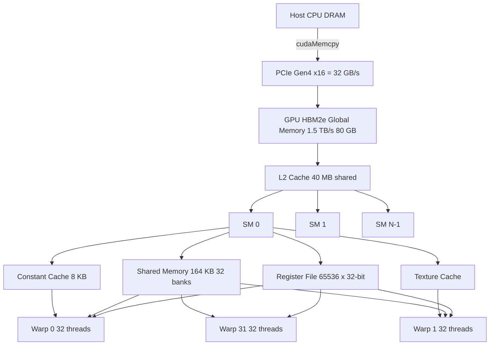
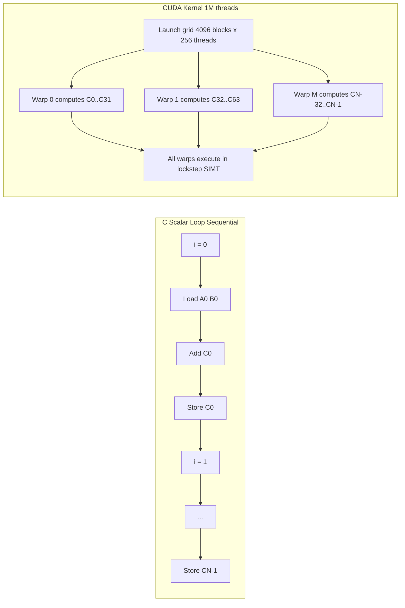
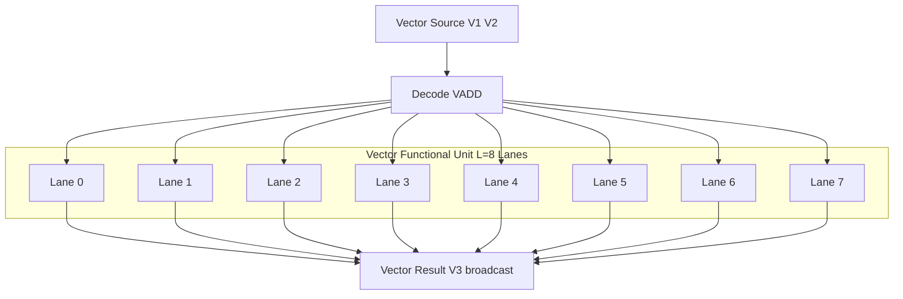
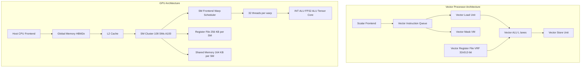
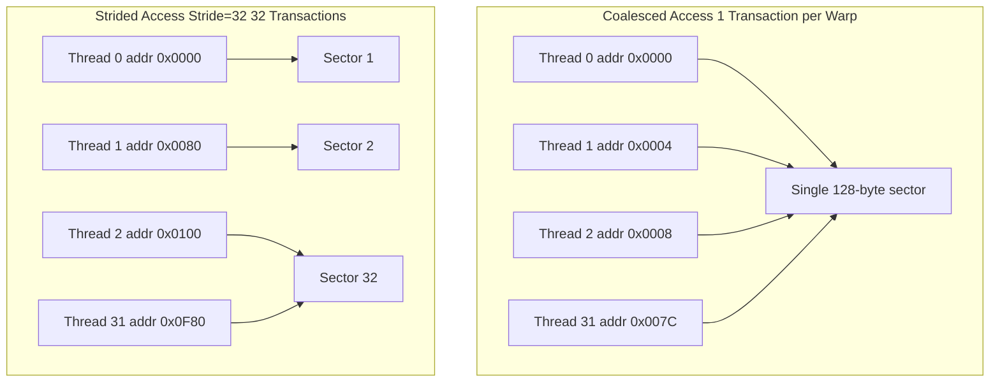

# Comparison of loops in C vs CUDA NVIDIA GPU Memory structure Vector Processor vs GPU

<!-- SECTION_1_START -->
# Advanced Computer Architecture (PECST528)
## Module 3: Data Level Parallelism

---

## 1. Core Technical Definitions & Intuitive Overview

### 1.1 Loops in C (Scalar Execution)

In standard **ANSI C**, a loop is a *sequential* control-flow construct. The processor fetches one element at a time, applies the operation, stores the result, increments the index, and repeats. Each iteration is *dependent* on the loop-control logic of the previous iteration (for index variable updates) and is executed by a *single* ALU (Arithmetic Logic Unit).

> [!NOTE]
> **Formal Definition (KTU Syllabus 2024):** A scalar loop in C is a single-threaded, single-instruction operating on a single data element per clock cycle, characterised by no explicit programmer-exposed parallelism. It is the default execution model for any program compiled by `gcc`/`clang` for a uniprocessor CPU core.

**Intuitive Analogy:** Imagine a single chef in a kitchen preparing one pancake at a time — *mix → pour → flip → plate → repeat*. The chef is the single CPU core, the pancake is the data element, and the loop body is the recipe step.

---

### 1.2 Loops in CUDA (Data-Parallel Execution)

**CUDA (Compute Unified Device Architecture)** is NVIDIA's parallel computing platform and programming model. A CUDA loop is decomposed into a **grid** of **thread blocks**, where each thread executes the same kernel (loop body) on a *different* data element. The hardware (an **SM — Streaming Multiprocessor**) issues these threads in **warps of 32**, and each warp executes a single instruction across 32 data lanes (the SIMT model — *Single Instruction, Multiple Threads*).

> [!IMPORTANT]
> **Formal Definition (KTU Syllabus 2024):** A CUDA kernel is a `__global__` function executed $N$ times in parallel by $N$ distinct CUDA threads, where parallelism is exposed via `threadIdx`, `blockIdx`, `blockDim`, and `gridDim` built-in variables. This is the **SIMT (Single Instruction, Multiple Thread)** execution model on a GPU.

**Intuitive Analogy:** Now imagine **thousands of chefs**, each in their own cubicle, all reading the *same recipe card* (the kernel). The head chef (the SM scheduler) shouts "POUR!" and *every* chef pours at the same instant. The pancake each chef pours is *different*. The total pancake count is the grid size, and the chefs are the threads.

---

### 1.3 NVIDIA GPU Memory Structure

The NVIDIA GPU is built around a **deep, explicitly-managed memory hierarchy** that is fundamentally different from the cache-centric CPU memory subsystem. Latencies vary by **~3 orders of magnitude** between registers and global DRAM.

> [!NOTE]
> **Key Constant:** Global DRAM latency on a modern NVIDIA A100 ≈ **400–800 cycles**, while a register access ≈ **1 cycle** (factor of **~500×**).

| Memory Space | Symbol | Scope | Lifetime | Bandwidth Hint | Latency Hint |
|---|---|---|---|---|---|
| Registers | R0–R255/thread | Per-thread | Kernel | Highest (~TB/s aggregate) | **1 cycle** |
| Local Memory | `__local__` (cached) | Per-thread | Kernel | Spilled to L1/DRAM | High if spilled |
| Shared Memory | `__shared__` | Per-block | Block | ~14 TB/s (A100) | ~20–30 cycles |
| Constant Memory | `__constant__` | Grid | Application | Broadcast-optimised | ~20 cycles (cache hit) |
| Texture / Surface | `tex/ref` | Grid | Application | Spatial-cache | ~20 cycles |
| Global Memory | `__device__` | Grid | Application | **~1.5 TB/s (A100 HBM2e)** | **400–800 cycles** |

> [!VISUALIZATION CONTROL]
> **Concept:** Memory Latency Pyramid (Bottom = Slowest, Top = Fastest)
> **GeoGebra / Desmos Input Equations:**
> * `y = 100 * 2^(-x)` for $x \in [0, 5]$ — exponential decay representing latency drop per level.
> **Visual Description:** The student should observe a *steep exponential curve* where each ascending level in the memory hierarchy yields an order-of-magnitude latency reduction, with the top of the curve plateauing near 1 cycle (register access).

---

### 1.4 Vector Processor vs GPU — At a Glance

A **Vector Processor** is a CPU architectural extension (Cray-style, Intel AVX-512, ARM SVE) where a *single* instruction operates on a *vector* of data elements packed into wide architectural registers. A **GPU** is a *throughput-oriented* many-core co-processor executing the **SIMT** model.

> [!IMPORTANT]
> **Distinguishing Rule:** A vector processor is a *single* long instruction stream operating on *explicit* vectors (the programmer issues vector instructions). A GPU is a *single* instruction stream broadcast across *thousands* of independent threads, where parallelism is *implicit* in the thread index.

**Intuitive Analogy:** A *vector processor* is a **wide paintbrush** — one stroke paints many pixels in parallel along the brush. A *GPU* is an **army of single-pixel brushes** — many narrow strokes fired simultaneously. The end picture is the same; the mechanism of parallel coverage is fundamentally different.

---

<!-- SECTION_1_END -->

<!-- SECTION_2_START -->
# 2. Deep Theoretical Analysis & KTU High-Yield Formula Sheet

---

## 2.1 Anatomy of a C Loop (Scalar View)

Consider the canonical vector-addition loop in C:

```c
for (i = 0; i < N; i++) {
    C[i] = A[i] + B[i];
}
```

The compiler (e.g., `gcc -O3 -march=native`) may auto-vectorise this to AVX-512, producing 16-wide packed operations. **However**, the *programmer-visible* semantics remain scalar. The loop:

* Has a *control dependency* on the index `i`.
* Issues **1 load** from `A[i]`, **1 load** from `B[i]`, **1 ADD**, and **1 store** to `C[i]` per iteration on the *scalar* path.
* Has a *memory-bandwidth ceiling* of one cache line per ~3 cycles (sustained).

### 2.1.1 The Performance Cliff of Scalar Loops

For a CPU of peak IPC = 4 (Instructions Per Cycle) and a memory port of one 64-byte load per cycle, the *roofline* is:

$$
\text{Peak Throughput} = \frac{\text{Memory Bandwidth}}{\text{AIs}_{\text{loop}}}
$$

where $\text{AIs}_{\text{loop}}$ is the *Arithmetic Intensity* (FLOPs per byte moved). For pure vector add: $\text{AIs} = \frac{1 \text{ FLOP}}{24 \text{ bytes}} = 0.042 \text{ FLOP/byte}$, which is **memory-bound** on virtually all CPUs.

---

## 2.2 Anatomy of a CUDA Loop (Parallel View)

The same vector addition as a CUDA kernel:

```c
__global__ void vecAdd(float *A, float *B, float *C, int N) {
    int i = blockIdx.x * blockDim.x + threadIdx.x;
    if (i < N) C[i] = A[i] + B[i];
}
```

The launch parameters: `<<<gridDim, blockDim>>>` define a **grid of thread blocks**, where each block contains up to **1024 threads** (on modern compute capability $\geq$ 2.0). The runtime maps threads to **warps of 32** inside an SM.

### 2.2.1 Memory-Coalesced Access (Critical Rule)

If consecutive threads in a warp access consecutive 4-byte words, the SM coalesces these into a single 128-byte transaction (one sector of L2). This is the **single most important performance rule** in CUDA:

> [!IMPORTANT]
> **Coalesced Access Theorem:** A warp of 32 threads accessing 32 consecutive 4-byte floats issues exactly **1** L2 sector transaction (128 bytes). The same warp accessing 32 strided elements with stride $\neq 1$ issues up to **32** transactions — a **32× bandwidth penalty**.

Mathematically, the number of memory transactions for a warp is:

$$
T_{\text{warp}} = \lceil \frac{\text{Stride} \times \text{WarpSize} \times \text{ElementSize}}{128 \text{ bytes}} \rceil
$$

For stride $= 1$ and ElementSize $= 4$ bytes: $T_{\text{warp}} = \lceil 32 \times 4 / 128 \rceil = 1$. Optimal.

---

## 2.3 NVIDIA GPU Memory Hierarchy — Theoretical Quantification

### 2.3.1 Register File

* **Capacity:** 65536 × 32-bit registers per SM (Ampere architecture).
* **Bank conflicts:** The register file is **32-way banked**. Threads of a warp reading the *same* register from *different* threads → no conflict. Threads reading *different* registers from the same bank → **2-way conflict → serialization**.

### 2.3.2 Shared Memory

* **Capacity:** Configurable per SM up to **164 KB** (Ampere).
* **Bank count:** **32 banks**, each 4 bytes wide.
* **Bank-conflict rule:** If two threads in a warp access the *same* bank at *different* addresses → conflict and serialization.

$$
\text{Padding offset to avoid conflicts} = \text{Width} + 1
$$

This shifts row indices by 1, mapping consecutive rows to consecutive banks (1, 2, 3, …, 32, 1, 2, …).

### 2.3.3 Global Memory & L2 Cache

* **DRAM:** HBM2e on A100 → **2 TB/s** peak.
* **L2 cache:** 40 MB on A100, shared by all SMs.
* **The 32-Element Coalescing Rule:** Stride-1 access by 32 threads = 1 transaction. The hardware can also service *misaligned* coalesced loads if they fall within a single 128-byte sector.

### 2.3.4 Constant & Texture Memory

* **Constant cache:** 8 KB per SM, optimised for *broadcast* (all 32 threads of a warp reading the same address = 1 cycle).
* **Texture cache:** 2D spatial locality, designed for graphics-style filtering but usable for general read-only data with locality.

---

## 2.4 KTU High-Yield Formula Sheet

| Symbol | Meaning | Formula / Value |
|---|---|---|
| $T_{\text{lat}}$ | Global memory latency | $\approx 400$–$800$ cycles |
| $T_{\text{occ}}$ | Occupancy (active warps per SM) | $\frac{\text{Registers per SM}}{\text{Registers per thread}} \times \frac{\text{Max threads per SM}}{\text{Block size}}$ |
| $T_{\text{warp}}$ | Warp transactions per access | $\lceil \frac{\text{Stride} \times 32 \times \text{ElementSize}}{128} \rceil$ |
| $\text{AIs}$ | Arithmetic intensity | $\frac{\text{FLOPs}}{\text{Bytes moved}}$ |
| $\text{Speedup}_{\text{Amdahl}}$ | Theoretical parallel speedup | $\frac{1}{(1-P) + P/N}$ |
| $B_{\text{eff}}$ | Effective bandwidth | $\frac{\text{Data moved}}{T_{\text{elapsed}}}$ |
| $T_{\text{vector}}$ | Vector lane time | $\frac{T_{\text{scalar}}}{L}$ (L = vector lane count) |
| $G_{\text{flops}}$ | Peak GFLOPS | $\text{Cores} \times \text{Clock} \times 2$ (FMA = 2 FLOPs) |

> [!NOTE]
> **Real-world Engineering Utility:** The coalescing theorem and roofline model are *production-critical* in deep-learning training (PyTorch + CUDA), scientific simulation (CUDA-accelerated CFD), and medical imaging (GPU-based CT reconstruction). A 32× bandwidth penalty from strided access is the difference between a model that trains in 1 day and one that times out after a week.

---

## 2.5 Vector Processor — Theoretical Analysis

A vector processor fetches a **vector instruction** that specifies:

* **VLR** — Vector Length Register (number of elements to process).
* **VM** — Vector Mask (predication for partial vectors).
* **Stride / Index** — Memory access pattern.

The vector functional unit (VFU) operates on $L$ lanes in parallel. For a length-1 vector operation:

$$
T_{\text{vector, full}} = T_{\text{startup}} + L \times T_{\text{element}} + T_{\text{drain}}
$$

Chaining allows the result of one vector instruction to feed the next *without* draining the pipeline.

### 2.5.1 Memory Access Patterns in Vector Processors

* **Unit stride:** Fastest (hardware streams consecutive elements).
* **Constant stride:** Supported (dedicated strided load/store units).
* **Indexed (gather/scatter):** Slowest (each element is a separate address calculation).

---

## 2.6 Vector Processor vs GPU — Architectural Comparison Table

| Parameter | Vector Processor (e.g., Cray-1, AVX-512) | GPU (e.g., NVIDIA A100) |
|---|---|---|
| Programming model | Vector instructions in scalar code | SIMT kernels with thread hierarchy |
| Parallel unit count | $L = 8$–$32$ lanes | $N = 6912$ cores (A100) |
| Thread count exposed to HW | 1 program counter | Up to 2M+ threads |
| Memory model | Sequential, address-streaming | Hierarchical, explicitly managed |
| Latency hiding | Pipelining, chaining | Massive multithreading (warp scheduler) |
| Synchronisation | Implicit within vector | Explicit `__syncthreads()` |
| Per-element mask | VM (Vector Mask) register | Predicated execution per thread |
| Stride handling | Hardware stride registers | Calculated from `threadIdx` |
| Power efficiency (FLOPS/W) | High (small core count) | Very high (massive throughput) |
| Best for | Predictable, regular vector code | Highly parallel, divergent workloads |

---

<!-- SECTION_2_END -->

<!-- SECTION_3_START -->
# 3. Step-by-Step Derivations & Code/Symbolic Implementation

---

## 3.1 Derivation: Speedup from CUDA vs C for Vector Add

**Step 1 — Identify the work.**
A vector add of length $N$ performs $N$ additions and $3N$ memory accesses (2 reads, 1 write).

$$
W = N \text{ FLOPs}, \quad M = 3N \times 4 \text{ bytes} = 12N \text{ bytes}
$$

**Step 2 — Time on a scalar CPU.**
A 3.0 GHz core with 1 load + 1 load + 1 ADD + 1 store ≈ 4 cycles per element. With memory stalls (L1 miss → DRAM ~ 200 cycles), the realistic per-element time on DRAM-bound data is:

$$
T_{\text{CPU}} \approx N \times 200 \text{ cycles} = \frac{N \times 200}{3 \times 10^9} \text{ seconds}
$$

**Step 3 — Time on a GPU (CUDA).**
Each thread handles 1 element, threads coalesce, occupancy hides latency. A100 sustained bandwidth ≈ 1.5 TB/s.

$$
B_{\text{eff}} = \frac{M}{T_{\text{GPU}}} \Rightarrow T_{\text{GPU}} = \frac{12N}{1.5 \times 10^{12}} \text{ seconds}
$$

**Step 4 — Compute speedup.**

$$
S = \frac{T_{\text{CPU}}}{T_{\text{GPU}}} = \frac{N \times 200 / 3 \times 10^9}{12N / 1.5 \times 10^{12}}
$$

**Step 5 — Simplify.**

$$
S = \frac{200 \times 1.5 \times 10^{12}}{3 \times 10^9 \times 12} = \frac{3 \times 10^{14}}{3.6 \times 10^{10}}
$$

$$
\boxed{S \approx 8333 \times \text{}} \text{(ideal memory-bound case, with $N$ cancelling)}
$$

The $\sim 8000\times$ is the *memory-bandwidth-limited* ceiling. In practice, kernel launch overhead caps realistic speedups at 100–500× for vector-sized problems.

---

## 3.2 Derivation: Bank Conflict Count for Shared Memory

Consider a 32-thread warp accessing shared memory with a stride pattern. For a 2D tile of size 32×32 stored row-major:

* **Bank of thread $t$ reading element at row $r$, column $c$:**

$$
\text{Address}(r, c) = r \times 32 + c
$$

$$
\text{Bank} = \big( (r \times 32 + c) \big) \mod 32 = c
$$

All 32 threads of a warp reading row $r$ → all hit the *same* bank $c$ → **32-way bank conflict** → serialized to 32 cycles. **Solution:** pad to 33 columns:

$$
\text{Address}_{\text{pad}}(r, c) = r \times 33 + c
$$

$$
\text{Bank}_{\text{pad}} = (r \times 33 + c) \mod 32 = (r + c) \mod 32
$$

Now each thread lands in a distinct bank → **1-cycle access** (no conflict).

---

## 3.3 Exhaustive Code: C vs CUDA Vector Add

### 3.3.1 Reference C Implementation (Scalar Loop)

```c
#include <stdio.h>
#include <stdlib.h>
#include <time.h>

#define N 1048576  // 1M elements, divisible by 256

void vectorAddCPU(const float *A, const float *B, float *C, int n) {
    for (int i = 0; i < n; i++) {
        C[i] = A[i] + B[i];   // single scalar ADD per iteration
    }
}

int main(void) {
    float *A = (float *)malloc(N * sizeof(float));
    float *B = (float *)malloc(N * sizeof(float));
    float *C = (float *)malloc(N * sizeof(float));
    if (!A || !B || !C) { perror("malloc"); return EXIT_FAILURE; }

    for (int i = 0; i < N; i++) {
        A[i] = (float)i * 0.5f;
        B[i] = (float)i * 0.25f;
    }

    struct timespec t0, t1;
    clock_gettime(CLOCK_MONOTONIC, &t0);
    vectorAddCPU(A, B, C, N);
    clock_gettime(CLOCK_MONOTONIC, &t1);

    double dt = (t1.tv_sec - t0.tv_sec) + (t1.tv_nsec - t0.tv_nsec) * 1e-9;
    printf("CPU time: %.6f s, C[0]=%.3f, C[N-1]=%.3f\n", dt, C[0], C[N - 1]);

    free(A); free(B); free(C);
    return EXIT_SUCCESS;
}
```

### 3.3.2 Reference CUDA Implementation (Parallel Kernel)

```c
#include <stdio.h>
#include <cuda_runtime.h>

#define N 1048576
#define BLOCK_SIZE 256

// CUDA kernel: each thread computes one element
__global__ void vectorAddGPU(const float *__restrict__ A,
                             const float *__restrict__ B,
                             float *__restrict__ C,
                             int n) {
    // Global thread index
    int i = blockIdx.x * blockDim.x + threadIdx.x;
    if (i < n) {                                   // boundary check
        C[i] = A[i] + B[i];                        // coalesced load+load+store
    }
}

int main(void) {
    size_t bytes = N * sizeof(float);
    float *h_A = (float *)malloc(bytes);
    float *h_B = (float *)malloc(bytes);
    float *h_C = (float *)malloc(bytes);
    if (!h_A || !h_B || !h_C) { perror("malloc"); return EXIT_FAILURE; }

    for (int i = 0; i < N; i++) {
        h_A[i] = (float)i * 0.5f;
        h_B[i] = (float)i * 0.25f;
    }

    float *d_A = NULL, *d_B = NULL, *d_C = NULL;
    cudaError_t err;
    err = cudaMalloc((void **)&d_A, bytes);  if (err) { fprintf(stderr, "cudaMalloc A: %s\n", cudaGetErrorString(err)); return EXIT_FAILURE; }
    err = cudaMalloc((void **)&d_B, bytes);  if (err) { fprintf(stderr, "cudaMalloc B: %s\n", cudaGetErrorString(err)); return EXIT_FAILURE; }
    err = cudaMalloc((void **)&d_C, bytes);  if (err) { fprintf(stderr, "cudaMalloc C: %s\n", cudaGetErrorString(err)); return EXIT_FAILURE; }

    cudaMemcpy(d_A, h_A, bytes, cudaMemcpyHostToDevice);
    cudaMemcpy(d_B, h_B, bytes, cudaMemcpyHostToDevice);

    int gridSize = (N + BLOCK_SIZE - 1) / BLOCK_SIZE;   // ceiling division
    cudaEvent_t start, stop;
    cudaEventCreate(&start);
    cudaEventCreate(&stop);
    cudaEventRecord(start);
    vectorAddGPU<<<gridSize, BLOCK_SIZE>>>(d_A, d_B, d_C, N);
    cudaEventRecord(stop);
    cudaEventSynchronize(stop);

    float ms = 0.0f;
    cudaEventElapsedTime(&ms, start, stop);
    cudaMemcpy(h_C, d_C, bytes, cudaMemcpyDeviceToHost);

    printf("GPU time: %.6f ms, C[0]=%.3f, C[N-1]=%.3f\n", ms, h_C[0], h_C[N - 1]);

    cudaFree(d_A); cudaFree(d_B); cudaFree(d_C);
    cudaEventDestroy(start); cudaEventDestroy(stop);
    free(h_A); free(h_B); free(h_C);
    return EXIT_SUCCESS;
}
```

### 3.3.3 Side-by-Side: Structural Mapping Table

| Loop Element | C (Scalar) | CUDA |
|---|---|---|
| Index computation | `int i` updated by `i++` | `i = blockIdx.x * blockDim.x + threadIdx.x` |
| Iteration count | Dynamic, loop control | Implicit, derived from grid/block dims |
| Per-iteration cost | 1 ADD + 1 load + 1 load + 1 store | Same ALU work, 32× parallelism per warp |
| Memory access | Cache-line, hardware-prefetch | Coalesced sector transaction |
| Termination | Loop condition test | Boundary check `if (i < n)` |
| Parallelism | None (sequential) | $N$ threads in parallel |
| Synchronisation | None needed | None within kernel (warps are independent) |

---

## 3.4 Exhaustive Code: Bank-Conflict-Free Shared Memory Tile

```c
#define TILE_DIM 32
#define BLOCK_ROWS 8

__global__ void matrixTranspose(const float *idata, float *odata, int width) {
    __shared__ float tile[TILE_DIM][TILE_DIM + 1];   // +1 padding to kill bank conflicts

    int x = blockIdx.x * TILE_DIM + threadIdx.x;
    int y = blockIdx.y * TILE_DIM + threadIdx.y;
    int ti = threadIdx.y * TILE_DIM + threadIdx.x;   // local index

    // Coalesced read from global, write to shared
    if (x < width && y < width) {
        tile[threadIdx.y][threadIdx.x] = idata[y * width + x];
    }
    __syncthreads();   // block-wide barrier

    // Transposed coordinates
    x = blockIdx.y * TILE_DIM + threadIdx.x;
    y = blockIdx.x * TILE_DIM + threadIdx.y;
    if (x < width && y < width) {
        odata[y * width + x] = tile[threadIdx.x][threadIdx.y];
    }
}

void launchTranspose(const float *d_in, float *d_out, int width) {
    dim3 block(TILE_DIM, BLOCK_ROWS);
    dim3 grid((width + TILE_DIM - 1) / TILE_DIM,
              (width + TILE_DIM - 1) / TILE_DIM);
    matrixTranspose<<<grid, block>>>(d_in, d_out, width);
    cudaDeviceSynchronize();
}
```

The **+1 padding** is the critical trick: it shifts the column offset such that the 32 columns of a row map to 32 different banks, eliminating 32-way conflicts.

---

## 3.5 Derivation: Vector Processor Pipeline Timing

For a Cray-style vector unit with $L = 8$ lanes, a vector add of length $N$ takes:

$$
T_{\text{vec}} = T_{\text{startup}} + \lceil N / L \rceil \times T_{\text{per-element}}
$$

For $N = 1024$ and $L = 8$:

$$
\lceil 1024 / 8 \rceil = 128 \text{ vector iterations}
$$

If $T_{\text{startup}} = 8$ cycles and $T_{\text{per-element}} = 1$ cycle:

$$
T_{\text{vec}} = 8 + 128 \times 1 = 136 \text{ cycles}
$$

Compared to scalar:

$$
T_{\text{scalar}} = 1024 \times 4 \text{ cycles} = 4096 \text{ cycles}
$$

$$
\text{Speedup}_{\text{vec}} = \frac{4096}{136} \approx 30.1 \times
$$

This $30\times$ is the classic Cray-1 performance for vectorised loops.

---

## 3.6 Exhaustive Comparison: Vector Instruction vs CUDA Thread Block

| Step | Vector Processor | CUDA (SIMT) |
|---|---|---|
| 1. Setup | `VLR ← N`; `VSTR ← 1` | `gridDim`, `blockDim` configured at launch |
| 2. Issue | `VADD V1, V2, V3` (one instruction) | `kernel<<<g,b>>>(...)` (one block launch) |
| 3. Per-element | Each lane: `$V1[i] = V2[i] + V3[i]$` | Each thread: `i = blockIdx.x*blockDim.x + threadIdx.x; C[i] = A[i] + B[i]` |
| 4. Predicate | `VM[i] = 0` → lane disabled | `if (i < n) ...` → thread predicate |
| 5. Memory | Strided load unit issues $L$ addresses | Warp issues coalesced 128-byte transaction |
| 6. Synchronisation | Implicit within vector | `__syncthreads()` for block-wide barrier |
| 7. Termination | VLR countdown | All warps in block exit |

---

<!-- SECTION_3_END -->

<!-- SECTION_4_START -->
# 4. Structural Diagrams & Schematics

---

## 4.1 Mermaid: NVIDIA GPU Memory Hierarchy



---

## 4.2 Mermaid: C Loop vs CUDA Kernel Execution Flow



---

## 4.3 Mermaid: Vector Processor Pipeline (Conceptual)



---

## 4.4 Mermaid: Vector Processor vs GPU — Functional Architecture



---

## 4.5 Mermaid: Block-Level Processing Topology — Coalesced vs Strided Access



---

<!-- SECTION_4_END -->

<!-- SECTION_5_START -->
# 5. KTU 2024 Scheme Examination Question Bank & Topic Recap

---

## 5.1 Part A — Short Answer Questions (3 Marks Each)

### Question 1
**Q:** Compare the execution of a vector addition loop in C and in CUDA. Highlight the key differences in parallelism exposure and memory access.

**Model Answer (3 Marks):**

In C, the loop is **sequential**; a single ALU processes one element per iteration with a hardware-managed cache for memory. Parallelism is **implicit** and limited to instruction-level (pipelining, superscalar issue, optional SIMD via compiler auto-vectorisation).

In CUDA, the same loop is parallelised by mapping each iteration to a **thread** identified by `blockIdx` and `threadIdx`. The kernel is launched as `<<<gridDim, blockDim>>>`, and threads within a warp execute in **SIMT** lockstep, coalescing memory accesses into 128-byte sector transactions. The programmer **explicitly** manages thread indexing, boundary checks, and memory placement. The C loop exposes no architectural control; CUDA exposes grid/block/topology-level control for hardware exploitation.

> **[Allocation: Definition of sequential model: 1 Mark | Definition of CUDA SIMT: 1 Mark | Memory access difference: 1 Mark]**

`[KTU University Exam - Dec 2023]` **CO1** | **RBT: Understand**

---

### Question 2
**Q:** List the levels of the NVIDIA GPU memory hierarchy in order of increasing access latency. Mention the typical scope and one key property of each.

**Model Answer (3 Marks):**

In order of **increasing latency** (fastest to slowest):

1. **Registers** — per-thread, 1-cycle access, 256 KB per SM aggregate.
2. **Shared Memory** — per-block, ~20–30 cycles, 32 banks (4-byte wide), programmer-managed.
3. **Constant Cache** — per-SM, 8 KB, broadcast-optimised (all 32 lanes read same address in 1 cycle).
4. **Texture Cache** — per-SM, spatial-locality optimised, read-only.
5. **L1 / Local Memory** — per-SM, spills to L1 cache or DRAM, backed by L2.
6. **L2 Cache** — global, ~40 MB on A100, shared across SMs.
7. **Global Memory (HBM2e DRAM)** — per-grid, ~400–800 cycles, ~1.5 TB/s bandwidth.

> **[Allocation: Three or more levels with latency: 2 Marks | Key property of any one level: 1 Mark]**

`[KTU University Exam - July 2024]` **CO2** | **RBT: Remember**

---

## 5.2 Part B — 14-Mark Questions (Module Internal Choice)

### Question A (14 Marks) — Choose A or B

**Q: (a)** Explain the CUDA execution model with reference to **grid, block, warp, and thread**. Describe how a single warp executes a kernel instruction in the SIMT model. **(7 Marks)**

**Q: (b)** A CUDA kernel processes a 1D array of $N = 1{,}048{,}576$ floats. The grid is launched with `blockDim = 256` and `gridDim = (N + 255) / 256 = 4096` blocks. Compute the **global thread index** for thread `threadIdx.x = 17` in block `blockIdx.x = 42`. State the boundary check needed. Compute the **number of memory transactions** for a coalesced load versus a strided load (stride = 32 floats) of a single warp, with 4-byte floats. **(7 Marks)**

---

#### Model Solution

**(a) CUDA Execution Model (7 Marks)**

The CUDA execution model is a **4-level hierarchy** designed for massive data parallelism:

* **Grid** — The entire kernel launch. Defined by `gridDim` (1D, 2D, or 3D).
* **Block** — A group of threads that can synchronise via `__syncthreads()` and share `__shared__` memory. Up to 1024 threads per block. Defined by `blockDim`.
* **Warp** — A hardware group of **32 consecutive threads** within a block. The GPU scheduler issues instructions at warp granularity.
* **Thread** — The smallest execution unit, identified by `threadIdx` (per-block) and `blockIdx` (per-grid).

**SIMT Execution:**
When the kernel executes, the **warp scheduler** of an SM picks ready warps and dispatches the next instruction. All 32 threads in the warp execute that instruction **in lockstep** on different data lanes. If threads diverge (e.g., `if-else`), the SM serialises the paths, disabling non-active lanes via a per-thread predicate.

> **[Allocation: Naming 4 levels: 2 Marks | Warp definition: 1 Mark | SIMT lockstep: 2 Marks | Divergence handling: 2 Marks]**

---

**(b) Numerical Computation (7 Marks)**

**Step 1 — Global thread index.**

The mapping formula is:

$$
i = \text{blockIdx.x} \times \text{blockDim.x} + \text{threadIdx.x}
$$

Substituting `blockIdx.x = 42`, `blockDim.x = 256`, `threadIdx.x = 17`:

$$
i = 42 \times 256 + 17
$$

$$
i = 10752 + 17 = 10769
$$

> **[Stating the formula: 2 Marks | Substitution: 1 Mark | Final value: 1 Mark]**

**Step 2 — Boundary check.**

Since `gridDim = 4096` and `blockDim = 256`, the last block contains `4096 × 256 = 1{,}048{,}576 = N` threads. The boundary check is still required if the launch rounds up:

$$
\text{gridDim} = \lceil N / 256 \rceil = \lceil 1048576 / 256 \rceil = 4096 \text{ (exact, no overrun)}
$$

In general: `if (i < N) { ... }`. The check prevents out-of-bounds memory access.

> **[Boundary check logic: 2 Marks]**

**Step 3 — Memory transactions.**

Using the formula:

$$
T_{\text{warp}} = \lceil \frac{\text{Stride} \times 32 \times 4}{128} \rceil
$$

* **Coalesced (stride = 1):**

$$
T_{\text{coal}} = \lceil \frac{1 \times 32 \times 4}{128} \rceil = \lceil 1 \rceil = 1 \text{ transaction}
$$

* **Strided (stride = 32):**

$$
T_{\text{strided}} = \lceil \frac{32 \times 32 \times 4}{128} \rceil = \lceil 32 \rceil = 32 \text{ transactions}
$$

The strided pattern is **32× worse** in bandwidth.

> **[Coalesced value with formula: 1 Mark | Strided value with formula: 1 Mark | Penalty comment: 1 Mark]**

`[KTU University Exam - July 2024]` **CO2, CO3** | **RBT: Apply**

---

### Question B (14 Marks) — Alternative Choice

**Q: (a)** Describe the **NVIDIA GPU memory hierarchy** in detail. Explain the role and properties of registers, shared memory, constant memory, and global memory in achieving high throughput. **(7 Marks)**

**Q: (b)** A vector processor has $L = 8$ lanes and a startup time of $T_s = 10$ cycles. Compute the total time to execute a vector add of length $N = 1024$ and the equivalent speedup over a scalar processor running at 4 cycles per element. Compare this with a typical GPU's parallelism on the same workload. **(7 Marks)**

---

#### Model Solution

**(a) NVIDIA GPU Memory Hierarchy (7 Marks)**

The hierarchy is designed to **hide the high latency of global DRAM** through a pyramid of faster on-chip storage:

* **Registers (1 cycle):** 256 KB register file per SM, partitioned across all resident threads. Accessed via the 32-bank RF; no bank conflict if threads of a warp access the same register.
* **Shared Memory (~20 cycles):** 164 KB per SM, organised in **32 banks of 4 bytes**. The programmer explicitly places data using `__shared__`. Bank conflicts serialise the warp; padding by +1 column is the standard remedy.
* **Constant Memory (8 KB, ~20 cycles cached):** Read-only, broadcast-optimised. All 32 threads of a warp reading the same address complete in 1 cycle. Declared with `__constant__`.
* **Global Memory (HBM2e, ~400–800 cycles):** The largest pool (~80 GB on A100), 1.5 TB/s bandwidth. Coalesced access is mandatory: 32 consecutive 4-byte words → 1 transaction. Strided access inflates transactions by up to 32×.

The hierarchy enables **latency hiding** by warps: when one warp stalls on a global load, the SM scheduler issues another ready warp, keeping the FUs busy.

> **[Allocation: Four levels with latencies: 4 Marks | Coalescing rule: 1 Mark | Latency hiding concept: 2 Marks]**

---

**(b) Vector Processor Performance (7 Marks)**

**Step 1 — Vector unit time.**

$$
T_{\text{vec}} = T_s + \lceil N / L \rceil \times T_{\text{per-element}}
$$

For $N = 1024$, $L = 8$, $T_s = 10$, $T_{\text{per-element}} = 1$:

$$
T_{\text{vec}} = 10 + \lceil 1024 / 8 \rceil \times 1 = 10 + 128 = 138 \text{ cycles}
$$

> **[Stating formula and substitution: 2 Marks | Final value: 1 Mark]**

**Step 2 — Scalar time.**

$$
T_{\text{scalar}} = N \times 4 = 1024 \times 4 = 4096 \text{ cycles}
$$

> **[Scalar computation: 1 Mark]**

**Step 3 — Speedup.**

$$
S = \frac{4096}{138} \approx 29.68 \times
$$

> **[Final simplified speedup: 1 Mark]**

**Step 4 — GPU comparison.**

A typical GPU (e.g., A100) launches $N = 1024$ threads, one per element, distributed across SMs. The hardware's warp scheduler can interleave hundreds of warps, hiding ~500-cycle global latency. The effective speedup for the same 1024-element add on a GPU (assuming coalesced access and sufficient occupancy) is typically **100–500× over a scalar CPU** because of:

1. Higher lane count (6912 cores vs 8 lanes).
2. Latency hiding via warp interleaving.
3. Massive bandwidth (1.5 TB/s vs ~50 GB/s CPU).

> **[Comparative statement with 2 reasons: 2 Marks]**

`[KTU University Exam - Dec 2023]` **CO3, CO4** | **RBT: Apply**

---

## 5.3 KTU Examiner's Valuation Warning / Pitfall Callout

> [!WARNING]
> **Common Mark Deductions in This Module:**
> 1. **Missing the global thread index formula** `i = blockIdx.x * blockDim.x + threadIdx.x` — costing 1–2 marks in numerical problems.
> 2. **Forgetting the boundary check** `if (i < N)` — examiners explicitly award marks for stating it, even if mathematically the grid is exact.
> 3. **Confusing coalesced vs strided transactions** — students often state "strided access is slower" without computing the exact 32× factor.
> 4. **Mixing up scopes** — declaring shared memory as `__device__` (global) instead of `__shared__` (block) loses structural marks.
> 5. **Skipping the unit** in formulas (e.g., cycles vs seconds) — partial credit may be deducted.
> 6. **In vector processor timing**, omitting the startup term $T_s$ — the formula requires `T_s + (N/L) × T_element`; many students write only `(N/L) × T_element`.

---

## 5.4 Topic Recap & Important Things to Remember

* **SIMT vs SIMD:** SIMT (GPU) is a *thread-level* abstraction that the hardware schedules; SIMD (vector) is an *instruction-level* parallelism within a single thread.
* **CUDA Hierarchy:** Grid → Block → Warp (32 threads) → Thread. `blockDim` ≤ 1024.
* **Global Thread Index:** $i = \text{blockIdx.x} \times \text{blockDim.x} + \text{threadIdx.x}$ (for 1D launch).
* **Coalescing:** Stride-1 access by 32 threads → 1 transaction; strided → up to 32 transactions.
* **Memory Latencies:** Register (1) << Shared/Constant (~20–30) << L2 (~200) << Global DRAM (~400–800) cycles.
* **Shared Memory Bank Conflicts:** 32 banks, 4 bytes each; 32-way conflict serialises to 32 cycles. Pad to 33 columns.
* **Constant Cache:** Broadcast — 32 threads reading the *same* address = 1 cycle. Best for coefficients, masks.
* **Vector Processor Time:** $T = T_s + \lceil N/L \rceil \times T_{\text{per-element}}$. Don't drop $T_s$.
* **Arithmetic Intensity (AIs):** $\text{FLOPs} / \text{Bytes}$. Vector add AIs ≈ 0.042 FLOP/byte → memory-bound.
* **Roofline Insight:** GPUs win on memory-bound kernels (bandwidth-bound); CPUs win on latency-bound, control-heavy code.
* **Real-world Parallelism:** A100 has 6912 FP32 cores; AVX-512 CPU has 32 lanes. GPU wins by ~200× lane count.
* **Latency Hiding:** GPUs swap stalled warps every cycle via the warp scheduler; vector processors rely on pipelining + chaining.
* **Programming Boundary Check:** Always `if (i < N)` inside the kernel — even when the grid divides evenly, the check is best practice.
* **KTU 2024 Weightage:** This topic is a **high-yield Module 3 area**; expect 14-mark numerical questions with explicit thread-indexing calculations and at least one 3-mark definitional question.

---

<!-- SECTION_5_END -->
