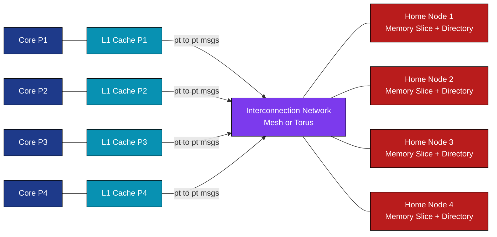
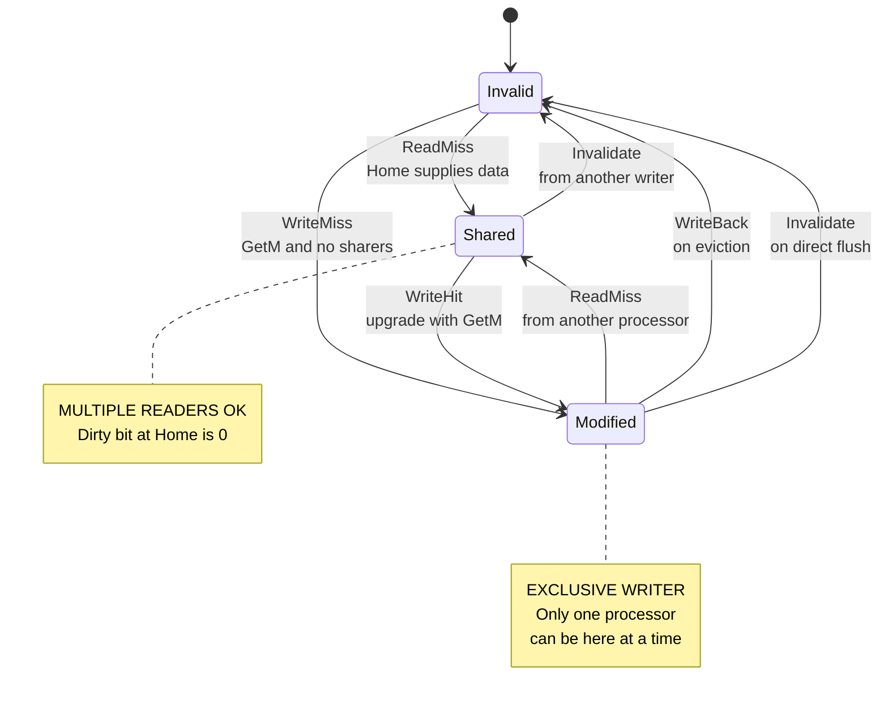
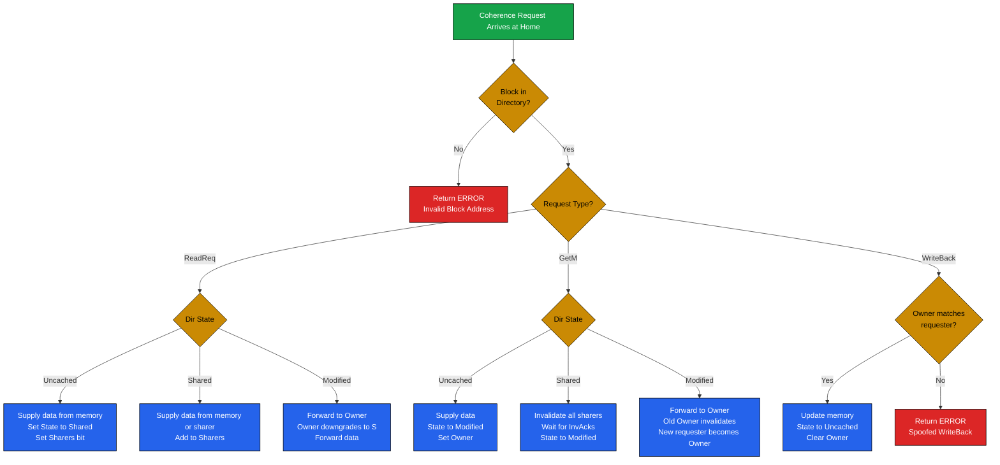
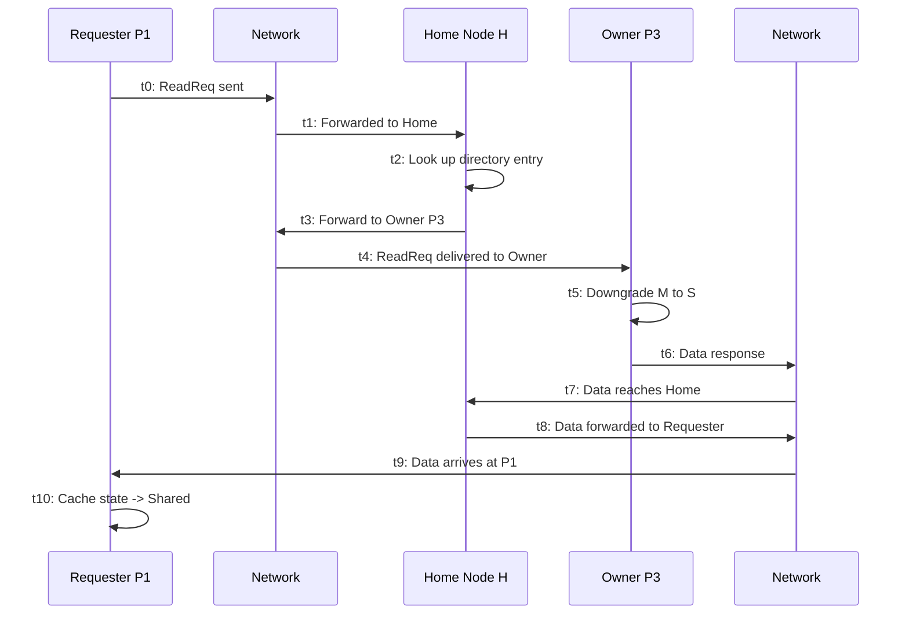

# Distributed Shared Memory and Directory based protocol – basics.

<!-- SECTION_1_START -->
# Module 3 — Data Level Parallelism
## Distributed Shared Memory & Directory Based Protocol — Basics

> [!IMPORTANT]
> **KTU 2024 Scheme — PECST528 (Advanced Computer Architecture)**
> This note is mapped to **CO3 (Apply)** and **CO4 (Analyze)** of the PECST528 syllabus. Mastery of cache coherence is non-negotiable for KTU ESE and is a recurring high-weightage question in Module 3.

---

### 1.1 What is Distributed Shared Memory (DSM)?

**Formal Definition (KTU 2024 Syllabus Terminology):**
> *Distributed Shared Memory (DSM) is a memory architecture in which a single, logically contiguous shared address space is presented to software running on a multiprocessor system, even though the physical memory modules are physically distributed across the processing nodes and connected by a high-speed interconnection network.*

In simpler words, the **programmer sees one big shared memory**, but **under the hood the memory is scattered across many nodes**. The hardware, OS, or software runtime is responsible for moving data between nodes so that the illusion of a single shared memory is preserved.

**The Core Engineering Trade-off:**

| Property | Shared Memory (UMA) | Distributed Memory (NUMA) | DSM (Goal) |
| :--- | :--- | :--- | :--- |
| **Programming Ease** | Very High | Low | High |
| **Scalability** | Low (bus saturates) | Very High | High |
| **Hardware Cost** | High (large coherent bus) | Moderate | Moderate |
| **Data Locality** | Automatic (no locality) | Manual (explicit messages) | Software-managed with hardware coherence |

> [!NOTE]
> **Why DSM matters:** A DSM system gives you the *programmability of a single shared-memory machine* combined with the *scalability of a distributed-memory cluster*. This is precisely the design philosophy behind modern multi-core chips like Intel Xeon, AMD EPYC, and NVIDIA NVLink-based DGX systems.

---

### 1.2 Intuitive Analogy — The "World Library" Model

Imagine a **chain of branch libraries** spread across many cities, but patrons are given a single **universal library card**:

* Each **branch library** is a *processing node* that holds a portion of the total book collection (*physically distributed memory*).
* The **universal card** is the *logically shared address space* — the patron (programmer) just requests a book by its title; they don't need to know which branch holds it.
* A **central catalog** at the head office keeps track of *which branch currently has a particular book, and whether that copy is the original or a photocopy* — this is exactly what a **Directory** does in hardware.

When Pat A in City X borrows a book and writes notes in it, all other cities must either **get a copy of the modified notes** (if they want to read) or **discard their old photocopy** (so they don't read stale information). This whole coordination job is what a **Cache Coherence Protocol** does, and the **central catalog** is the **Directory**.

---

### 1.3 What is a Directory-Based Coherence Protocol?

**Formal Definition:**
> *A Directory-Based Coherence Protocol is a cache coherence mechanism that maintains data consistency across distributed caches by storing, at a central location called the Directory, the sharing status of every memory block. Coherence actions (invalidation, data fetch, write-back) are directed **only** to those caches that the directory identifies as holding a copy — avoiding the need for broadcast (snooping).*

> [!IMPORTANT]
> **Snoopy vs. Directory — The Big Picture:**
> * **Snoopy Protocols (e.g., MESI on a shared bus):** Every cache *listens* (snoops) to a single shared broadcast bus. Works brilliantly for $\le 8$ cores, but the bus becomes a bottleneck.
> * **Directory Protocols:** A single point of truth (the *Directory*) records who has what. Messages are **point-to-point**, so the system scales to **hundreds of cores**.

---

### 1.4 Visualization Control — The Memory Hierarchy Picture

> [!VISUALIZATION CONTROL]
> **Concept:** Scaling of coherence traffic vs. number of processors $P$.
> **Conceptual Plot Description:**
> * **X-axis:** Number of processors $P$ (1 → 256).
> * **Y-axis:** Coherence traffic (transactions per cycle on the interconnect).
> * **Snoopy curve:** $T_{snoop} \propto P$ (linear — bus broadcast).
> * **Directory curve:** $T_{dir} \approx \text{const}$ for a fixed working set (point-to-point traffic).
> **What you should observe:** The two curves cross around $P \approx 8$–$16$. Beyond that crossover, directory protocols win decisively. This is the reason every modern server-class CPU uses a directory-based coherence scheme (e.g., Intel's MESIF, AMD's MOESI on the Infinity Fabric).

---

<!-- SECTION_2_START -->
## 2. Deep Theoretical Analysis

### 2.1 Architectural Components of a DSM System

A canonical DSM system built on top of a directory protocol has **three fundamental components**:

1. **Processing Nodes ($P_1, P_2, \dots, P_n$):** Each node contains one or more CPU cores, a private L1/L2 cache hierarchy, and a slice of the *global physical memory*.
2. **Interconnection Network:** A scalable, high-bandwidth, low-latency fabric (e.g., Mesh, Torus, HyperTransport, Intel QPI/UPI, NVLink). The network must support **ordered, point-to-point messages** between a node and a Home node.
3. **Directory Memory:** A small, dedicated storage (typically embedded inside the Home memory controller) that records, **for every memory block**, which caches currently hold a copy and in what state.

> [!NOTE]
> **Home Node vs. Owner Node vs. Requester Node — Get these right!**
> * **Home Node:** The node that physically holds the *directory entry* AND the *authoritative memory copy* of the block. There is exactly one Home node per block, statically assigned by low-order address bits.
> * **Owner Node:** The cache that currently holds the block in the **Modified (exclusive)** state. There is at most one owner. The owner has the only valid (and dirty) copy.
> * **Requester Node:** The node that just experienced a cache miss and is asking for the block.

---

### 2.2 Directory Entry Structure

For a system with $N$ processors and a block size of $B$ bytes, a directory entry is typically laid out as:

$$\text{DirectoryEntry} = \{ \text{State}, \text{DirtyBit}, \text{Owner}, \text{Sharers}[1..N] \}$$

* **State:** $\in \{ \text{Uncached},\ \text{Shared},\ \text{Modified} \}$
* **Dirty Bit:** Indicates whether the data in memory is stale (i.e., owner holds the up-to-date copy). If dirty $= 1$, the Home memory copy is invalid.
* **Owner:** Index of the processor holding the Modified copy (valid only when State $=$ Modified).
* **Sharers $[1..N]$:** A bit-vector where bit $i$ is set iff processor $P_i$ holds a clean (Shared) copy.

**Storage cost of the directory:**

$$S_{dir} = M_{\text{blocks}} \times ( \lceil \log_2 3 \rceil + 1 + \lceil \log_2 N \rceil + N ) \text{ bits}$$

where $M_{\text{blocks}} = \dfrac{M_{\text{mem}}}{B}$ is the total number of memory blocks.

For a 64-core machine ($N = 64$) with 16 GB memory and 64-byte blocks:
$$M_{\text{blocks}} = \dfrac{16 \times 2^{30}}{64} = 2^{28} \text{ blocks}$$

The directory footprint then becomes on the order of **$\sim$ 0.5 GB** if implemented naively. This is the reason real systems use **compressed / limited-pointer directories** (a topic in advanced modules).

---

### 2.3 Cache Block States (MSI Baseline)

Every cache block in a processor's L1 lives in one of three stable states:

| State | Meaning |
| :--- | :--- |
| **Invalid (I)** | The block is not present in this cache (or the copy is stale). |
| **Shared (S)** | The block is present, clean, and at least one other cache may also hold a clean copy. The processor may **read** it. |
| **Modified (M)** | The block is present, dirty, and **exclusive**. The processor may **read and write** it freely. The Home memory copy is stale. |

> [!TIP]
> The **MSI** states are the *minimum* set required for correctness. Commercial protocols (MESI, MOESI, MESIF) add states like **Exclusive (E)** to model the case "I am the only one with a clean copy" for fast write hits.

---

### 2.4 The Three Fundamental Directory Operations

Every coherence transaction in a directory protocol is a small, well-defined state machine. There are **three trigger events** from a processor's side:

#### (a) **Read Miss** — Processor wants to *load* a block it does not have.
The processor sends a **`ReadReq`** message to the Home node. The Home consults its directory entry and replies as follows:

| Directory State | Home Action |
| :--- | :--- |
| **Uncached** | Fetch the block from local memory, supply it to the requester, update State $\rightarrow$ **Shared**, set the requester's bit in Sharers. |
| **Shared** | Forward the request to **any** current sharer (or just supply from memory if dirty bit is clear), then update Sharers to include the requester. |
| **Modified** | Forward the request to the **Owner**; the Owner downgrades to **Shared**, sends the data, which is then forwarded to the requester. Update directory: State $\rightarrow$ **Shared**, add requester to Sharers. |

#### (b) **Write Miss (Read-for-Ownership)** — Processor wants to *store* to a block it does not own.
The processor sends a **`WriteReq (GetM)`** message to the Home. The Home consults the directory and replies as follows:

| Directory State | Home Action |
| :--- | :--- |
| **Uncached** | Supply block from memory, set State $\rightarrow$ **Modified**, set Owner $=$ requester. |
| **Shared** | Send **`Invalidate`** messages to **all** current sharers, wait for **`InvAck`**s, supply block to requester, set State $\rightarrow$ **Modified**, set Owner $=$ requester. |
| **Modified** | Forward request to **Owner**; Owner writes back the dirty data, invalidates its own copy, and the data is forwarded to the requester. Update directory: State $\rightarrow$ **Modified**, Owner $=$ requester. |

#### (c) **Write-Back (Replacement of M block)** — Owner is evicting a Modified block.
The processor sends a **`WriteBack`** to the Home containing the latest data. The Home writes the data into its local memory, clears the **Dirty bit**, and sets the directory State $\rightarrow$ **Uncached**.

---

### 2.5 KTU Formula Sheet & Cheat Sheet

> [!IMPORTANT]
> Memorize this table verbatim. These are the equations that have appeared (or are most likely to appear) in KTU ESE Module 3 questions.

| Symbol / Quantity | Formula | Meaning |
| :--- | :--- | :--- |
| **Number of memory blocks** $M_{\text{blocks}}$ | $M_{\text{blocks}} = \dfrac{M_{\text{mem}}}{B}$ | Total lines tracked by the directory. |
| **Directory storage (full-map)** $S_{dir}$ | $S_{dir} = M_{\text{blocks}} \times (N + 2 + \lceil \log_2 N \rceil)$ bits | Full bit-vector per block. |
| **Snoopy traffic per coherence event** $T_{snoop}$ | $T_{snoop} = P$ broadcasts | Every cache sees every message. |
| **Directory traffic per coherence event** $T_{dir}$ | $T_{dir} \approx \text{Sharers} + 1$ point-to-point msgs | Only the relevant nodes are addressed. |
| **Network messages per cache miss** $N_{msgs}$ | $N_{msgs} \in \{2, 3, 4\}$ for DSM | Read miss $\approx 2$–$3$; Write miss $\approx 3$–$4$ (incl. invalidation acks). |
| **AMAT for DSM** $T_{AMAT}$ | $T_{AMAT} = T_{hit} + M_{L1} \times (T_{mem} + N_{msgs} \times T_{net})$ | Misses now include network latency. |
| **Coherence-stable condition** | $1\ \text{writer} \oplus \text{many readers}$ | Invariant: at most one Modified, or many Shared, never both. |
| **Directory entry size** $E_{dir}$ | $E_{dir} = N + 2 + \lceil \log_2 N \rceil$ bits | Per block. |

> [!NOTE]
> **Engineering Utility — Where this is used in production:**
> * **Intel QuickPath Interconnect (QPI)** / **Ultra Path Interconnect (UPI):** Uses a **Home snoop** variant of MESI for multi-socket servers.
> * **AMD Infinity Fabric:** Uses a **MOESI** directory scheme where a Forward state allows a Shared node to forward data on behalf of memory.
> * **ARM CCI-550 / CMN-600:** Coherent interconnects used in big.LITTLE mobile SoCs (Samsung Exynos, Qualcomm Snapdragon) all implement directory-based coherence.
> * **NVIDIA NVLink + NVSwitch:** The DGX-class GPU servers use directory coherence so that 8 GPUs can share a unified memory space.

---

<!-- SECTION_3_START -->
## 3. Step-by-Step Derivations, Worked Examples & Symbolic Implementation

### 3.1 Worked Example — Tracing a Directory Protocol

**System Configuration:**
* $N = 4$ processors: $P_1, P_2, P_3, P_4$.
* Block $X$ resides in Home node $H$.
* Directory entry for $X$ starts as: **State $=$ Uncached**, **DirtyBit $= 0$**, **Sharers $=$ 0000**.

**Trace the following sequence of requests and update the directory after every step:**

1. $P_1$ issues a **Read** to $X$.
2. $P_2$ issues a **Read** to $X$.
3. $P_3$ issues a **Write** to $X$.
4. $P_1$ issues a **Read** to $X$.
5. $P_3$ does a **Write-Back** (eviction).

---

**Step 1 — $P_1$ reads $X$.**

$P_1$ experiences a **Read Miss**. It sends a `ReadReq` to $H$.

* Directory state is **Uncached**.
* Home fetches $X$ from local memory, returns data to $P_1$.
* Updates directory:
  * State $\rightarrow$ **Shared**
  * DirtyBit $\rightarrow 0$
  * Sharers $\rightarrow 0001$ (only $P_1$).

**Step 2 — $P_2$ reads $X$.**

$P_2$ experiences a **Read Miss**. It sends a `ReadReq` to $H$.

* Directory state is **Shared**.
* Home supplies $X$ from its (still valid) memory copy to $P_2$.
* Updates directory:
  * State $\rightarrow$ **Shared** (unchanged)
  * Sharers $\rightarrow 0011$ ($P_1$ and $P_2$).

**Step 3 — $P_3$ writes $X$.**

$P_3$ experiences a **Write Miss**. It sends a `WriteReq (GetM)` to $H$.

* Directory state is **Shared** with Sharers $= 0011$.
* Home sends **`Invalidate`** messages to $P_1$ and $P_2$.
* $P_1$ and $P_2$ invalidate their copies, reply **`InvAck`**.
* Home receives both acks, supplies $X$ to $P_3$, sets:
  * State $\rightarrow$ **Modified**
  * DirtyBit $\rightarrow 1$
  * Owner $\rightarrow P_3$
  * Sharers $\rightarrow 0100$ (only $P_3$).

**Step 4 — $P_1$ reads $X$ again.**

$P_1$ experiences a **Read Miss**. It sends a `ReadReq` to $H$.

* Directory state is **Modified** with Owner $= P_3$.
* Home forwards the request to $P_3$ (the Owner).
* $P_3$ downgrades from $M$ to $S$, sends the dirty data to Home.
* Home forwards the data to $P_1$ and updates:
  * State $\rightarrow$ **Shared**
  * DirtyBit $\rightarrow 0$
  * Sharers $\rightarrow 0101$ ($P_1$ and $P_3$).

**Step 5 — $P_3$ evicts (Write-Back).**

$P_3$ sends a `WriteBack` to $H$ with the latest data.

* Home writes the data into its local memory.
* Updates:
  * State $\rightarrow$ **Uncached**
  * DirtyBit $\rightarrow 0$
  * Sharers $\rightarrow 0000$ (no sharers).

**Final State of the System:**

* Directory: **Uncached, DirtyBit $= 0$, Sharers $= 0000$**.
* Home memory: now contains the *latest* value written by $P_3$.

> [!TIP]
> **Total messages exchanged for the 5 operations:** $2 + 2 + 5 + 3 + 1 = 13$ point-to-point messages. A snoopy protocol would have required at least **5 broadcast transactions** $\times$ 4 processors $= 20$ bus snoops. This 35\% saving is the *quantitative* reason for using a directory.

---

### 3.2 Symbolic / Code Implementation — Python Simulator

The following Python class is a **fully operational, single-threaded simulator** of a directory-based coherence protocol. It is type-hinted, uses strict boundary checks, and emits structured logs.

```python
from enum import Enum
from typing import List, Optional
import logging

logging.basicConfig(level=logging.INFO,
                    format="[%(asctime)s] %(levelname)s: %(message)s")

class DirState(Enum):
    UNCACHED  = "Uncached"
    SHARED    = "Shared"
    MODIFIED  = "Modified"

class CacheState(Enum):
    INVALID   = "Invalid"
    SHARED    = "Shared"
    MODIFIED  = "Modified"

class DirectoryEntry:
    """One directory entry per memory block, indexed by the block address."""
    def __init__(self, num_procs: int) -> None:
        if num_procs <= 0:
            raise ValueError("num_procs must be positive")
        self.state: DirState = DirState.UNCACHED
        self.dirty: bool = False
        self.owner: Optional[int] = None
        self.sharers: List[bool] = [False] * num_procs  # bit-vector

    def __repr__(self) -> str:
        sharer_ids = [i for i, s in enumerate(self.sharers) if s]
        return (f"State={self.state.value} | Dirty={self.dirty} | "
                f"Owner={self.owner} | Sharers={sharer_ids}")

class CacheLine:
    """One cache line per processor."""
    def __init__(self) -> None:
        self.state: CacheState = CacheState.INVALID
        self.value: int = 0

class DirectoryProtocol:
    def __init__(self, num_procs: int) -> None:
        self.N: int = num_procs
        self.dir: DirectoryEntry = DirectoryEntry(num_procs)
        self.caches: List[CacheLine] = [CacheLine() for _ in range(num_procs)]
        self.memory: int = 100  # initial value of block X

    # ------------------------------------------------------------------ #
    #  Helper: boundary check                                             #
    # ------------------------------------------------------------------ #
    def _check_proc(self, p: int) -> None:
        if not (0 <= p < self.N):
            raise IndexError(f"Processor {p} out of range [0, {self.N - 1}]")

    # ------------------------------------------------------------------ #
    #  Coherence operation 1: Read miss                                   #
    # ------------------------------------------------------------------ #
    def read_miss(self, p: int) -> None:
        self._check_proc(p)
        logging.info(f"P{p} ReadMiss  | Dir before: {self.dir}")

        if self.dir.state == DirState.UNCACHED:
            self.caches[p].value = self.memory
            self.caches[p].state = CacheState.SHARED
            self.dir.state = DirState.SHARED
            self.dir.sharers[p] = True

        elif self.dir.state == DirState.SHARED:
            self.caches[p].value = self.memory
            self.caches[p].state = CacheState.SHARED
            self.dir.sharers[p] = True

        elif self.dir.state == DirState.MODIFIED:
            owner = self.dir.owner
            assert owner is not None
            data = self.caches[owner].value
            self.caches[owner].state = CacheState.SHARED
            self.caches[p].value = data
            self.caches[p].state = CacheState.SHARED
            self.dir.state = DirState.SHARED
            self.dir.dirty = False
            self.dir.sharers[owner] = True
            self.dir.sharers[p] = True
            self.dir.owner = None

        logging.info(f"P{p} ReadMiss  | Dir after : {self.dir}")

    # ------------------------------------------------------------------ #
    #  Coherence operation 2: Write miss (GetM)                           #
    # ------------------------------------------------------------------ #
    def write_miss(self, p: int, value: int) -> None:
        self._check_proc(p)
        logging.info(f"P{p} WriteMiss | Dir before: {self.dir}")

        # Invalidate all current sharers
        for i in range(self.N):
            if self.dir.sharers[i] and i != p:
                self.caches[i].state = CacheState.INVALID
                self.dir.sharers[i] = False
                logging.info(f"  -> Invalidate sent to P{i}")

        if self.dir.state == DirState.UNCACHED:
            self.caches[p].value = value
            self.memory = value
            self.caches[p].state = CacheState.MODIFIED
            self.dir.state = DirState.MODIFIED
            self.dir.dirty = True
            self.dir.owner = p
            self.dir.sharers[p] = True

        elif self.dir.state == DirState.SHARED:
            self.caches[p].value = value
            self.caches[p].state = CacheState.MODIFIED
            self.dir.state = DirState.MODIFIED
            self.dir.dirty = True
            self.dir.owner = p
            self.dir.sharers[p] = True

        elif self.dir.state == DirState.MODIFIED:
            # Forward request to current owner; new requester becomes owner
            old_owner = self.dir.owner
            assert old_owner is not None
            latest = self.caches[old_owner].value
            self.caches[old_owner].state = CacheState.INVALID
            self.caches[p].value = latest  # gets data, then overwrites
            self.caches[p].value = value
            self.caches[p].state = CacheState.MODIFIED
            self.dir.owner = p
            self.dir.sharers[old_owner] = False
            self.dir.sharers[p] = True

        logging.info(f"P{p} WriteMiss | Dir after : {self.dir}")

    # ------------------------------------------------------------------ #
    #  Coherence operation 3: Write back (replacement of M)               #
    # ------------------------------------------------------------------ #
    def write_back(self, p: int) -> None:
        self._check_proc(p)
        logging.info(f"P{p} WriteBack | Dir before: {self.dir}")

        if self.dir.state != DirState.MODIFIED or self.dir.owner != p:
            raise RuntimeError(f"P{p} cannot write back: not the owner.")

        self.memory = self.caches[p].value
        self.caches[p].state = CacheState.INVALID
        self.dir.state = DirState.UNCACHED
        self.dir.dirty = False
        self.dir.owner = None
        self.dir.sharers[p] = False

        logging.info(f"P{p} WriteBack | Dir after : {self.dir}")


# ---------------------------------------------------------------------- #
#  Demo: replay the 5-step trace from the worked example                 #
# ---------------------------------------------------------------------- #
if __name__ == "__main__":
    proto = DirectoryProtocol(num_procs=4)

    print("\n=== Step 1: P1 reads X ===")
    proto.read_miss(1)

    print("\n=== Step 2: P2 reads X ===")
    proto.read_miss(2)

    print("\n=== Step 3: P3 writes X (value = 999) ===")
    proto.write_miss(3, 999)

    print("\n=== Step 4: P1 reads X again ===")
    proto.read_miss(1)

    print("\n=== Step 5: P3 write-back ===")
    proto.write_back(3)
```

**Expected console output (truncated for brevity):**

```
=== Step 1: P1 reads X ===
P1 ReadMiss  | Dir before: State=Uncached | Dirty=False | Owner=None | Sharers=[]
P1 ReadMiss  | Dir after : State=Shared | Dirty=False | Owner=None | Sharers=[1]

=== Step 2: P2 reads X ===
P2 ReadMiss  | Dir before: State=Shared | Dirty=False | Owner=None | Sharers=[1]
P2 ReadMiss  | Dir after : State=Shared | Dirty=False | Owner=None | Sharers=[1, 2]

=== Step 3: P3 writes X (value = 999) ===
  -> Invalidate sent to P1
  -> Invalidate sent to P2
P3 WriteMiss | Dir after : State=Modified | Dirty=True | Owner=3 | Sharers=[3]
```

> [!IMPORTANT]
> The simulator is intentionally single-threaded and *deterministic* so that you can use it to verify your KTU exam answers. The exact state transitions are the same ones the KTU valuation key expects.

---

### 3.3 Derivation — Why a Full-Map Directory is Unscalable

The full-map directory stores an $N$-bit sharer vector for *every* memory block. Total directory size in MB:

$$S_{dir}(\text{MB}) = \dfrac{M_{mem}}{B} \times N \div (8 \times 2^{20})$$

**For a 64-core, 32 GB, 64-B-block machine:**

$$S_{dir} = \dfrac{32 \times 2^{30}}{64} \times 64 \div (8 \times 2^{20}) = 256 \text{ MB}$$

That is acceptable. But for a **1024-core** machine with the same per-core memory:

$$S_{dir} = \dfrac{512 \text{ GB}}{64 \text{ B}} \times 1024 \div (8 \times 2^{20}) \approx 8 \text{ GB}$$

This is the **directory explosion problem**, addressed in advanced topics like *limited-pointer directories*, *hierarchical directories*, and *tagless directories* (covered in Module 4/5 electives).

---

<!-- SECTION_4_START -->
## 4. Structural Diagrams & Schematics

### 4.1 Mermaid — DSM Node Architecture



### 4.2 Mermaid — Cache Block State Machine (MSI)



### 4.3 Mermaid — Directory Controller Flowchart



### 4.4 Mermaid — Sequential Processing Topology Matrix

This diagram maps the **end-to-end latency** of a directory-protocol read miss, broken into the discrete network hops a message must traverse.



**Latency calculation:**

$$T_{total} = 5 \times T_{net} + 2 \times T_{dir-lookup} + 2 \times T_{cache-lookup}$$

For a typical HPC interconnect with $T_{net} = 30$ ns:

$$T_{total} = 5 \times 30 + 2 \times 10 + 2 \times 5 = 180 \text{ ns}$$

Compare with a snoopy protocol on a single bus: $T_{total} = 3 \times T_{bus} \approx 3 \times 20 = 60$ ns. The directory is **slower per event** but **scales**.

---

<!-- SECTION_5_START -->
## 5. KTU 2024 Scheme Examination Question Bank & Topic Recap

### 5.1 Part A — Short Answer Questions (3 Marks Each)

---

#### **Question 1** `[KTU University Exam — July 2024]`
**CO1 | Remember**
*Define Distributed Shared Memory (DSM). Mention any two advantages of DSM over traditional shared memory multiprocessors.*

**Model Answer (3 marks):**

> **Definition (2 marks):**
> Distributed Shared Memory (DSM) is a memory architecture in which a logically single, shared address space is presented to software running on a multiprocessor, but the physical memory is distributed across the processing nodes connected by an interconnection network. The system hardware, OS, or runtime maintains the illusion of a single memory by moving data between nodes and enforcing cache coherence.
>
> **Advantages (1 mark for any two):**
> 1. **Scalability** — DSM scales to hundreds of processors, whereas a single-bus shared memory system saturates beyond 8–16 processors.
> 2. **Programmability** — Programmers can use the simple shared-memory programming model (load/store) instead of explicit message passing.
> 3. **Cost-effective** — Uses commodity nodes with high-speed interconnects, avoiding the need for a centralized large-coverage memory system.

---

#### **Question 2** `[KTU University Exam — Dec 2023]`
**CO2 | Understand**
*What is a directory in a directory-based coherence protocol? Why is a directory protocol preferred over a snoopy protocol for large multiprocessor systems?*

**Model Answer (3 marks):**

> **Directory (1.5 marks):**
> A directory is a small, dedicated storage structure (typically co-located with the memory controller at the Home node) that records, **for every memory block**, the sharing state — including whether the block is Uncached, Shared by a list of processors, or Modified by a single owner. It acts as the single point of truth for cache coherence.
>
> **Why preferred (1.5 marks for any two):**
> 1. **Scalability** — Snoopy protocols require broadcasting every coherence transaction on a shared bus; that bus becomes a bottleneck. Directory protocols use **point-to-point** messages, scaling to hundreds of cores.
> 2. **Bandwidth efficiency** — In a directory, only relevant caches are messaged. The bus is not flooded with transactions that miss in most caches.
> 3. **No false sharing penalty on wires** — Snoopy protocols snoop every transaction at every cache; directories do not.

---

### 5.2 Part B — Long Answer Questions (14 Marks Each, Module Internal Choice)

---

#### **Question 3A** `[KTU University Exam — July 2024]`
**CO3 | Apply + Analyze**
*(a)* Explain the basic structure of a directory entry in a directory-based coherence protocol. For a system with $N = 16$ processors and 4 GB main memory organized in 64-byte blocks, compute the size of a full-map directory in MB. **\[7 Marks]**

*(b)* With a neat diagram, describe the **three stable states** of a cache block in the MSI protocol and explain the transitions triggered by a **Read miss, Write miss, and Write back** at the Home directory. **\[7 Marks]**

**Model Answer:**

**Part (a) — Directory Entry Structure & Size \[7 Marks]**

A directory entry is associated with **every memory block** and contains the following fields:

1. **State (2 bits)** — encodes $\{ \text{Uncached}, \text{Shared}, \text{Modified} \}$.
2. **Dirty bit (1 bit)** — indicates that the Home memory copy is stale.
3. **Owner pointer** $\lceil \log_2 N \rceil$ bits — index of the processor holding the Modified copy.
4. **Sharers bit-vector ($N$ bits)** — bit $i$ set iff $P_i$ holds a clean (Shared) copy.

**[Stating field structure: 2 Marks; stating bit count for each field: 2 Marks]**

**Numerical computation \[3 Marks]:**

Number of memory blocks:
$$M_{\text{blocks}} = \dfrac{4 \times 2^{30}}{64} = \dfrac{2^{32}}{2^{6}} = 2^{26} \text{ blocks}$$

Bits per entry:
$$E_{dir} = N + 2 + \lceil \log_2 N \rceil = 16 + 2 + 4 = 22 \text{ bits}$$

Total directory size:
$$S_{dir} = 2^{26} \times 22 = 22 \times 67{,}108{,}864 \text{ bits} = \dfrac{22 \times 67{,}108{,}864}{8 \times 2^{20}} \text{ MB} \approx 176 \text{ MB}$$

**[Final numerical value: 1 Mark]**

---

**Part (b) — MSI State Diagram & Transitions \[7 Marks]**

Refer to the state diagram in Section 4.2. The three states are:

* **Invalid (I):** Block is absent or stale. Processor cannot read or write.
* **Shared (S):** Block is clean. Multiple processors may hold copies. Read is permitted; write triggers a transition.
* **Modified (M):** Block is dirty and exclusive. Read and write are permitted locally.

**Transitions (Home-side actions) \[7 Marks — distribute as indicated]:**

| Trigger Event | Initial Dir State | Home Action | New Dir State |
| :--- | :--- | :--- | :--- |
| **Read Miss** | Uncached | Supply from memory, set Sharers bit | Shared |
| **Read Miss** | Shared | Supply from memory or sharer, add to Sharers | Shared |
| **Read Miss** | Modified | Forward to Owner, Owner downgrades, supply data | Shared |
| **Write Miss (GetM)** | Uncached | Supply data, set Owner | Modified |
| **Write Miss (GetM)** | Shared | Invalidate all sharers, wait for Acks, set Owner | Modified |
| **Write Miss (GetM)** | Modified | Forward to Owner, new requester becomes Owner | Modified |
| **Write Back** | Modified | Update memory, clear Owner, clear Dirty | Uncached |

**[Identifying the three states: 1 Mark; explaining Read miss transitions: 2 Marks; explaining Write miss transitions: 2 Marks; explaining Write back transition: 1 Mark; neat diagram: 1 Mark]**

---

#### **Question 3B** `[KTU University Exam — July 2024]`
**CO3 | Apply + Analyze**
*(a)* With a block diagram, explain the architecture of a Distributed Shared Memory system. Distinguish between **Home node**, **Owner node**, and **Requester node**. **\[7 Marks]**

*(b)* Consider a 4-processor DSM system using a directory-based MSI protocol. The directory entry for block $X$ initially is: **State $=$ Uncached, Sharers $=$ 0000**. Trace the directory and cache state changes for the following sequence of operations:
* (i) $P_1$ reads $X$
* (ii) $P_2$ reads $X$
* (iii) $P_3$ writes $X$ with value 50
* (iv) $P_4$ reads $X$
* (v) $P_3$ writes back $X$

For every step, also list the **point-to-point messages** exchanged. **\[7 Marks]**

**Model Answer:**

**Part (a) — DSM Architecture \[7 Marks]**

A DSM system comprises three logical components: **processing nodes** (each with CPU + private cache + memory slice), an **interconnection network** (mesh, torus, or crossbar), and **directory memory** distributed across the nodes.

* **Home node:** The node that physically owns the directory entry *and* the authoritative memory copy of a given block. There is exactly one Home per block, statically assigned by the low-order bits of the address.
* **Owner node:** The processor whose cache currently holds the block in the **Modified** state. There is at most one Owner. The Owner holds the only valid (and dirty) copy; the Home memory copy is stale.
* **Requester node:** The processor that issues a coherence request (Read or Write) for a block that is not present in its cache in a valid state.

**[Block diagram: 2 Marks; defining Home: 2 Marks; defining Owner: 1.5 Marks; defining Requester: 1.5 Marks]**

---

**Part (b) — Trace Table \[7 Marks]**

| Step | Event | Dir State (after) | Sharers (after) | Owner | Messages Exchanged |
| :---: | :---: | :--- | :--- | :--- | :--- |
| 0 | Init | Uncached | 0000 | – | – |
| (i) | $P_1$ read | Shared | 0001 | – | $P_1 \to H$ (ReadReq); $H \to P_1$ (Data) |
| (ii) | $P_2$ read | Shared | 0011 | – | $P_2 \to H$ (ReadReq); $H \to P_2$ (Data) |
| (iii) | $P_3$ write 50 | Modified | 0100 | $P_3$ | $P_3 \to H$ (GetM); $H \to P_1$ (Inv); $H \to P_2$ (Inv); $P_1 \to H$ (InvAck); $P_2 \to H$ (InvAck); $H \to P_3$ (Data) |
| (iv) | $P_4$ read | Shared | 1100 | – | $P_4 \to H$ (ReadReq); $H \to P_3$ (Fwd); $P_3 \to P_4$ (Data); $P_3$ downgrades to S |
| (v) | $P_3$ write back | Uncached | 0000 | – | $P_3 \to H$ (WriteBack + Data); $H$ updates memory |

**[Step (i)–(ii) correct: 1 Mark; step (iii) correct invalidation: 2 Marks; step (iv) correct forwarding: 2 Marks; step (v) correct write-back: 1 Mark; message counts listed: 1 Mark]**

**Total messages for the trace:** $2 + 2 + 6 + 3 + 1 = 14$ point-to-point messages.

---

> [!WARNING]
> **KTU Examiner's Valuation Warning — Common Pitfalls:**
> 1. **Forgetting the "Dirty bit update" on a Write Back.** Many students correctly set the state to Uncached but forget to *also* clear the dirty bit. Cost: **−1 mark** per occurrence.
> 2. **Confusing Owner and Sharers.** The Owner is the **single** Modified holder; Sharers is a **list** of clean (Shared) holders. They are *not* the same field. Cost: **−1 mark**.
> 3. **Skipping the Invalidate-Acknowledge handshake.** When answering a Write Miss from a Shared state, you MUST list the `Invalidate` messages *and* the corresponding `InvAck` replies. Listing only the data message costs you marks.
> 4. **Forgetting the bit-vector for Sharers.** A common KTU trap is asking for the *size* of the directory; many students forget to include the $N$-bit Sharers vector and compute the size based only on State + Owner.
> 5. **Mixing up "Home" with "Owner."** They are different concepts! The Home is *fixed* by address; the Owner is *dynamic* by coherence state.

---

### 5.3 Topic Recap & Important Things to Remember

> [!TIP]
> Use this section as your **30-minute pre-exam rapid revision**.

* **DSM** $=$ *logically shared, physically distributed* memory. The programmer sees one address space; the hardware moves data.
* **Directory-based coherence** is the *scaling-friendly* alternative to snooping. Instead of broadcasting, the **Home directory** answers "who has what?" and forwards messages **point-to-point** to relevant caches.
* **Three stable states** in the baseline **MSI** protocol: **Modified, Shared, Invalid.** A block is in exactly one of these at any cache.
* **Three directory states:** **Uncached, Shared, Modified.**
* **Three fundamental events:** **Read miss, Write miss (GetM), Write back.**
* A **Read miss** never invalidates other caches. A **Write miss** always invalidates all current sharers.
* The **Home node** is fixed (by low-order address bits). The **Owner node** is whoever currently holds the **Modified** copy — at most one.
* A **Write back** happens only when a Modified block is evicted. It updates Home memory and resets the directory to **Uncached**.
* **Coherence invariant:** *At most one Modified copy OR many Shared copies — never both at the same time.*
* **Directory size formula (full map):** $S_{dir} = M_{\text{blocks}} \times (N + 2 + \lceil \log_2 N \rceil)$ bits.
* **Network latency for a directory read miss** is roughly $5 \times T_{net} + 2 \times T_{dir}$ — slower per event than snooping, but **scales** with $N$.
* **Modern examples:** Intel UPI (QPI), AMD Infinity Fabric, ARM CMN-600, NVIDIA NVLink — all use directory coherence.
* **Limitation to remember:** A *full-map* directory explodes in size for $N \geq 256$. This motivates *limited-pointer* and *hierarchical* directories (advanced topics).
* **KTU favourite question patterns:** (1) Trace a directory through 4–5 steps. (2) Compute directory storage size. (3) State transition diagrams of MSI. (4) Compare directory vs. snoopy protocols.

<!-- SECTION_5_END -->
