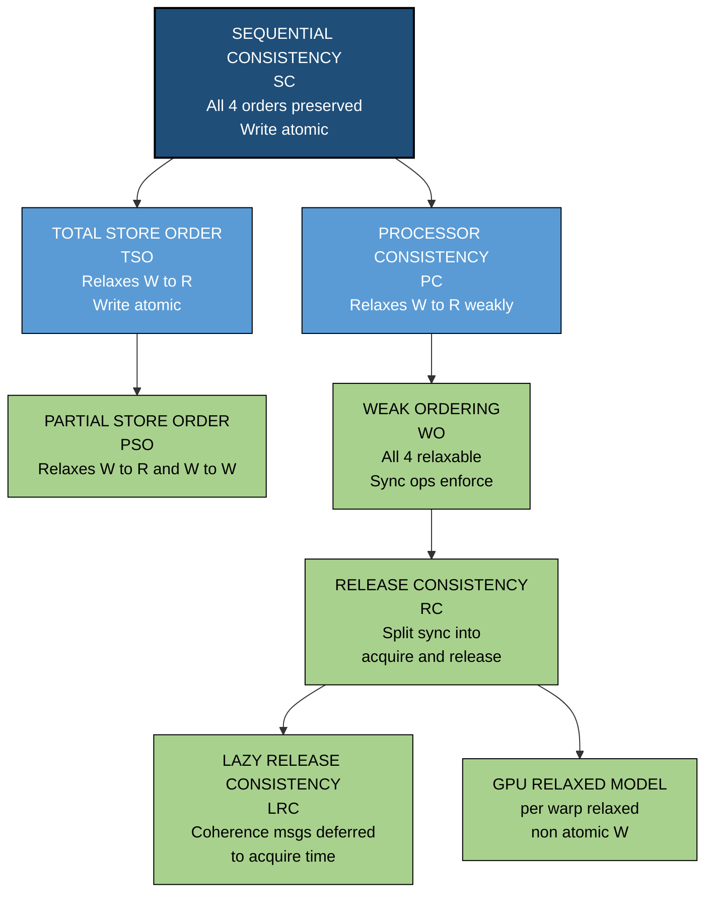
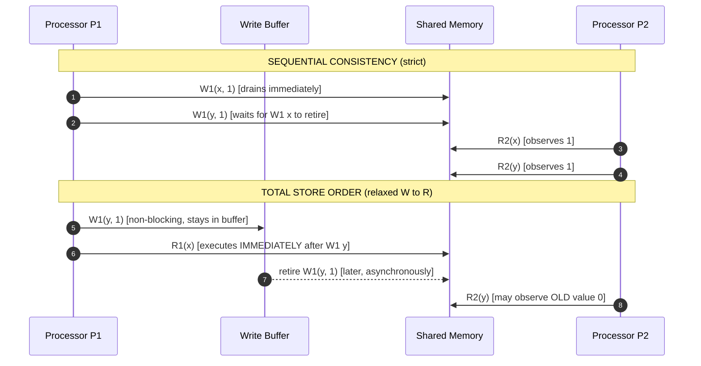
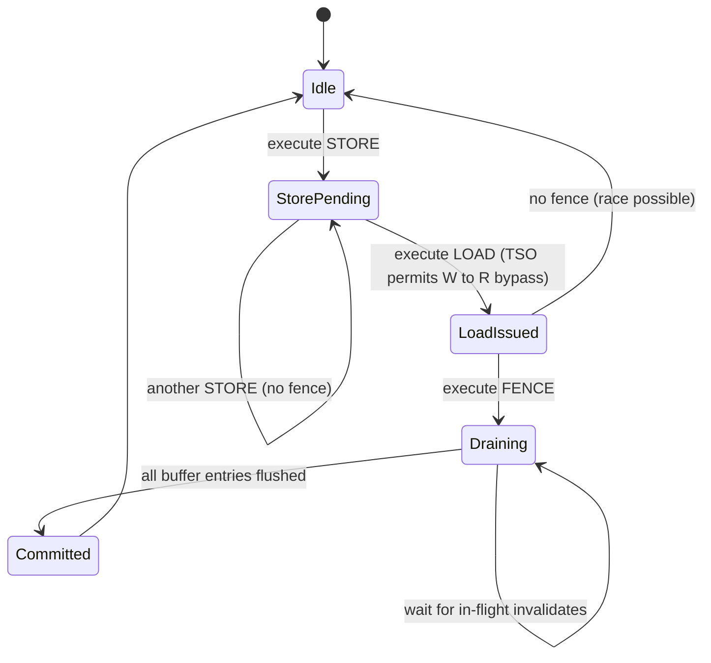
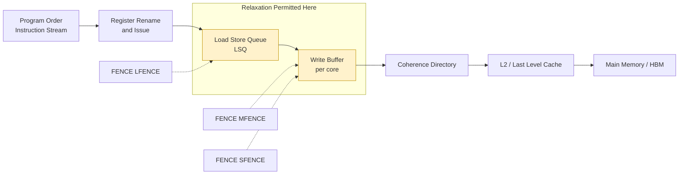

# Memory Consistency Models – Sequential and relaxed

<!-- SECTION_1_START -->

# Memory Consistency Models — Sequential & Relaxed

## 1.1 Formal Academic Definition

In shared-memory multiprocessor systems, a **Memory Consistency Model (MCM)** is the **formal specification of the legal orderings** in which **loads** (reads) and **stores** (writes) issued by multiple processors to a common address space become visible to other processors. It is the **architectural contract** between the hardware (memory subsystem, interconnect, caches) and the software (compiler, programmer) that defines *what value a read can return* given the history of writes from all processors.

In the **KTU 2024 Scheme (PECST528 – Module 3: Data Level Parallelism)**, this topic is studied as the *correctness backbone* of DLP hardware: while DLP (SIMD, vector units, GPUs) accelerates computation, the *coherent and ordered* movement of data between parallel threads/lanes is what guarantees the **programmed result** is actually obtained.

> [!IMPORTANT]
> **Sequential Consistency (SC)** — Lamport (1979):
> *"A multiprocessor is sequentially consistent if the result of any execution is the same as if the operations of all the processors were executed in some sequential order, and the operations of each individual processor occur in this sequence in the order specified by its program."*
>
> SC demands **two** invariants simultaneously:
> 1. **Program Order (PO)** — within a single processor $P_i$, the order of memory operations as written in the program is preserved by the system.
> 2. **Write Atomicity (Atomicity / Coherence)** — every write becomes visible to **all** other processors *atomically* in a single indivisible step (no partial or "split-brain" writes).

A model that violates **either** invariant is called a **Relaxed Memory Model**.

## 1.2 Intuitive Analogy

Imagine a **shared whiteboard** in a conference room with **$N$ authors** writing on it simultaneously. Each author has a personal to-do list of statements (the program).

- **Sequential Consistency** is like having a **single referee** who lets only one author approach the board at a time, and every other author sees the board *as it was at the moment they last looked* — never seeing a half-written sentence.
- **Relaxed Consistency** is like letting authors write in parallel but with **traffic-light rules**: certain combinations (e.g., finishing a sentence before starting another) are enforced, while others (e.g., two independent sentences in opposite corners) can race freely for speed.

> [!NOTE]
> The hardware motivation for relaxation is **performance**: enforcing SC globally forces every store to broadcast and be acknowledged before the next load executes, killing pipelining. Relaxation lets the CPU keep its pipeline full, **moving the burden of ordering onto the programmer/compiler via fences**.

### 1.2.1 Visualization Concept — Execution Timeline of Two Processors

> [!VISUALIZATION CONTROL]
> **Concept:** Memory-Operation Timeline comparing SC vs Relaxed ordering
> **GeoGebra / Desmos Input Equations (parametric):**
> * `P1: (t, 0.5)`  with markers at $t = 1, 2, 3, 4$  for $W(x), R(y), W(z), R(w)$
> * `P2: (t, 1.5)`  with markers at $t = 1.5, 2.5, 3.5, 4.5$ for $R(x), W(y), R(z), W(w)$
> * **SC envelope:** $f(t) = 0.5 + 1.0 \cdot \text{step}(t)$  (one op visible at a time → staircase)
> * **Relaxed envelope:** $g(t) = 0.5 + 1.0 \cdot \text{step}(t - 0.5)$  (overlaps allowed)
> **Visual Description:** Under SC, the staircase is rigid — $P_2$'s reads can only *cross* $P_1$'s writes at discrete barriers. Under relaxation, the two timelines **overlap** vertically, indicating that operations from $P_1$ and $P_2$ can interleave freely except where fences are placed.

---

## 1.3 Why This Topic is Exam-Critical for KTU

| KTU Syllabus Mapping | Sub-Concepts |
|---|---|
| Module 3.4 — Memory Consistency | Sequential, Processor, Weak, Release |
| Module 3.5 — Synchronization | Fences, barriers, atomic primitives |
| Module 3.6 — DLP Hardware (GPU) | CUDA memory model, `__syncthreads()`, `__threadfence()` |
| CO Mapping | **CO3** (Apply parallelism concepts to design DLP systems) |
| RBT Levels tested | Understand, Apply, Analyze |

---

<!-- SECTION_1_END -->

<!-- SECTION_2_START -->

# Deep Theoretical Analysis & KTU Formula Sheet

## 2.1 The Formal Ordering Framework

For an execution involving processors $\{P_1, P_2, \ldots, P_n\}$ operating on address space $A$, define four ordering relations. A **Memory Consistency Model** is a constraint on which interleavings are legal.

| Relation | Notation | Meaning |
|---|---|---|
| **Program Order** of $P_i$ | $a \; \xrightarrow{po_i} \; b$ | $a$ appears before $b$ in $P_i$'s instruction stream |
| **Read-from** | $a \; \xrightarrow{rf} \; b$ | $b$ reads the value written by $a$ |
| **Write Serialization** | $a \; \xrightarrow{ws} \; b$ | Two writes to the same address, total order |
| **From-Read (Causality)** | $a \; \xrightarrow{fr} \; b$ | $b$ reads a value written by $a$ via a chain of $rf$ |

### 2.1.1 Sequential Consistency — Two Formal Axioms

$$
\forall i \in \{1 \ldots n\} : \; \text{all memory ops of } P_i \text{ are totally ordered by } po_i
$$

$$
\forall a, b \text{ s.t. } a \xrightarrow{po_i} b : \; \text{no legal execution may observe } b \text{ before } a
$$

**Equivalent formal statement using a single total order $\pi$ (the "interleaving"):**

$$
\pi \;\Big|\; P_i = po_i \quad \text{for every processor } P_i
$$

i.e., $\pi$ is a **merge** of the $n$ program orders that respects every individual order.

### 2.1.2 The Four Relaxation Axes

Any relaxed model relaxes a **subset** of these four program-order pairs within a single processor:

| Axis | Notation | Reordering Permitted |
|---|---|---|
| **Write → Read** | $W \to R$ | Store may overtake subsequent load |
| **Write → Write** | $W \to W$ | Older store may be delayed past newer store to *different* address |
| **Read → Read** | $R \to R$ | Older load may be reordered past newer load to *different* address |
| **Read → Write** | $R \to W$ | Older load may be reordered before newer store to *different* address |

> [!IMPORTANT]
> **Write Atomicity** is the *fifth* axis. Models like **TSO** preserve it (no processor ever sees a "split write"), whereas some GPU models allow non-atomic writes for performance.

## 2.2 KTU High-Yield Formula & Model Cheat Sheet

| Model | $W \to R$ | $W \to W$ | $R \to R$ | $R \to W$ | Atomic W | Used In |
|---|---|---|---|---|---|---|
| **Sequential Consistency (SC)** | ✗ | ✗ | ✗ | ✗ | ✓ | Theoretical reference, MIPS R10k |
| **Total Store Order (TSO)** | **✓** | ✗ | ✗ | ✗ | ✓ | x86 (Intel/AMD), SPARC |
| **Partial Store Order (PSO)** | **✓** | **✓** | ✗ | ✗ | ✓ | SPARC (weak mode) |
| **Processor Consistency (PC)** | ✗ (relaxed in weak form) | ✗ | ✗ | ✗ | ✓ | Early MIPS, Alpha |
| **Weak Ordering (WO)** | All four relaxable **unless** in synchronization region | | | | ✓ | Alpha, ARMv7 |
| **Release Consistency (RC)** | Same as WO **plus** split $W \to R$ into `acquire`/`release` | | | | ✓ | ARMv8, PowerPC, C++11/C11 |
| **Lazy Release Consistency (LRC)** | Same as RC, but coherence msgs sent only on acquire | | | | ✓ | Software DSM (TreadMarks) |
| **GPU / CUDA `relaxed`** | All four relaxable | | | | ✗ (per-warp) | NVIDIA PTX |

> [!NOTE]
> Notation key: **✓** = ordering preserved (no reordering), **✗** = ordering may be relaxed, `acquire`/`release` = explicit fence-class.

## 2.3 Hardware Primitives Used to Enforce Order

A **Fence** (also *barrier*, *membar*) is an architectural instruction that stalls the pipeline until all prior memory operations have retired (or all subsequent ones are delayed past it).

| Fence Type | Mnemonic (x86) | Mnemonic (ARM) | Effect |
|---|---|---|---|
| **Full Fence** | `MFENCE` | `DMB SY` | All prior loads **and** stores complete before any later load/store |
| **Store Fence** | `SFENCE` | `DMB ST` | All prior stores visible before any later store |
| **Load Fence** | `LFENCE` | `DMB LD` | All prior loads complete before any later load |
| **Acquire** | (implicit in `LOCK` prefix) | `LDAR` | All later loads/stores after a read complete *after* that read |
| **Release** | (implicit in `LOCK` prefix) | `STLR` | All prior loads/stores complete *before* the following store is visible |

## 2.4 Real-World Engineering Utility

1. **CPU Chip Design (Intel/AMD/ARM)** — x86 picked **TSO** to give programmers a near-SC illusion while still allowing a write buffer (saves ~30 % store bandwidth). ARMv8 picked **RC** with explicit acquire/release because mobile SoCs need aggressive power-saving reordering.
2. **GPU Programming (CUDA, ROCm)** — The CUDA memory model is **relaxed per-warp** with explicit `__threadfence()` and `__syncthreads()`; understanding MCMs prevents the classic *"my kernel works on small data and breaks on large data"* bug.
3. **Distributed Shared Memory (DSM)** — Systems like TreadMarks use **LRC** to avoid O($n^2$) coherence traffic; understanding the model is essential for HPC engineers.
4. **Compiler Optimizations** — The C/C++ memory model (C11, C++11) maps directly to **RC**; `std::atomic` operations specify ordering constraints that compilers lower to fences.

---

<!-- SECTION_2_END -->

<!-- SECTION_3_START -->

# Step-by-Step Derivations, Formal Proofs & Code Implementation

## 3.1 Formal Derivation — Why SC Needs Both PO and Atomicity

**Claim:** SC $\Longleftrightarrow$ (Program Order preserved on every processor) $\wedge$ (Write Atomicity).

**Proof by contradiction — Part A (dropping PO):**

Consider two processors $P_1, P_2$, initial state $A = B = 0$.

$$
\begin{aligned}
P_1: & \quad W_1(A, 1) \;;\; W_1(B, 1) \\
P_2: & \quad R_2(B) \;;\; R_2(A)
\end{aligned}
$$

Under SC, if $P_2$ reads $B = 1$ (so the $W_1(B,1)$ has executed and been seen), then by PO on $P_1$, $W_1(A,1)$ *must* have already executed, so $R_2(A)$ returns **1**.

A system that reorders $W_1(A,1)$ after $W_1(B,1)$ in the global order would allow the result $B = 1,\; A = 0$ — this violates SC. Therefore SC requires $W_1(A,1) \; \xrightarrow{po_1} \; W_1(B,1)$ to be honored globally. ∎

**Proof by contradiction — Part B (dropping Atomicity):**

Suppose $W_1(A, \text{val})$ is *not* atomic. The write is broken into two sub-writes $W_1(A,\text{high})$ and $W_1(A,\text{low})$ that become visible to different processors at different times.

$$
\begin{aligned}
P_2 \text{ reads } & \; R_2(A) = \text{high\_half} \\
P_3 \text{ reads } & \; R_3(A) = \text{low\_half} \\
\Rightarrow \; P_2 \text{ and } P_3 \text{ disagree on the value of } A
\end{aligned}
$$

This violates the *single-writer-multiple-reader coherence* invariant on which SC is built. Therefore SC requires atomic writes. ∎

## 3.2 Worked Example — SC vs TSO with Two Processors

### 3.2.1 The Classical Dekker-Style Pattern

| | Thread $P_1$ (initially $x = y = 0$) | Thread $P_2$ (initially $x = y = 0$) |
|---|---|---|
| Step 1 | `store y = 1` | `store x = 1` |
| Step 2 | `r1 = load x` | `r2 = load y` |
| Forbidden outcome | $r_1 = 0 \wedge r_2 = 0$ | $r_1 = 0 \wedge r_2 = 0$ |

### 3.3.2 Outcome Analysis Step-by-Step

$$
\begin{aligned}
\textbf{Under SC: } & \text{At least one of } r_1, r_2 \text{ must be 1.} \\
& \text{Proof: If } r_1 = 0 \text{, then } W_2(x,1) \text{ has not yet executed, so by PO on } P_2, \\
& \text{the earlier } W_2(x,1) \text{ is also not visible, hence } r_2 \text{ must read the old } y = 1. \quad \blacksquare \\
\\
\textbf{Under TSO (relaxed } W \to R\text{):} & \; P_1 \text{ can buffer } W_1(y,1) \text{ and execute } R_1(x) \text{ immediately, so } r_1 = 0. \\
& \; P_2 \text{ can buffer } W_2(x,1) \text{ and execute } R_2(y) \text{ immediately, so } r_2 = 0. \\
& \Rightarrow \text{Both } r_1 = 0 \text{ and } r_2 = 0 \text{ is OBSERVABLE. }
\end{aligned}
$$

This outcome is the **canonical TSO violation pattern** — the proof that TSO is strictly weaker than SC.

## 3.4 Python Simulation — Modeling a Relaxed Write Buffer

The following Python program **emulates** a TSO-style write buffer on top of a sequential execution engine, demonstrating how a program that is *correct under SC* can produce a *wrong result under TSO* if the programmer omits the fence.

```python
"""
File: tso_violation_demo.py
Purpose: Emulate Total Store Order (TSO) reordering to show why
         memory fences are mandatory in relaxed-consistency programs.
Python: 3.10+
Type Hints: strict
"""

from __future__ import annotations
from dataclasses import dataclass, field
from typing import Dict, List, Tuple
import threading
import time


@dataclass
class MemoryLocation:
    """A single shared-memory cell with its current value."""
    name: str
    value: int = 0


@dataclass
class WriteBufferEntry:
    """A pending store held inside the processor's write buffer."""
    addr: str
    value: int
    cycle_enqueued: int


class TSOCore:
    """
    Emulates one CPU core with a TSO-style write buffer.
    Stores enqueue instantly; they retire to global memory later.
    """
    def __init__(self, core_id: int, global_mem: Dict[str, MemoryLocation],
                 buffer_capacity: int = 8) -> None:
        self.core_id: int = core_id
        self.global_mem: Dict[str, MemoryLocation] = global_mem
        self.write_buffer: List[WriteBufferEntry] = []
        self.buffer_capacity: int = buffer_capacity
        self.local_view: Dict[str, int] = {n: m.value for n, m in global_mem.items()}
        self.cycle: int = 0
        self._lock = threading.Lock()

    def store(self, addr: str, value: int) -> None:
        """Enqueue a store. Returns immediately (non-blocking)."""
        with self._lock:
            if len(self.write_buffer) >= self.buffer_capacity:
                raise RuntimeError(
                    f"[Core {self.core_id}] Write buffer FULL at cycle {self.cycle} "
                    f"for store to {addr}={value}"
                )
            self.write_buffer.append(
                WriteBufferEntry(addr, value, self.cycle)
            )
            self.local_view[addr] = value
            print(f"  [Core {self.core_id} c={self.cycle}] STORE  {addr} := {value} "
                  f"(buffered, depth={len(self.write_buffer)})")
            self.cycle += 1

    def load(self, addr: str) -> int:
        """Loads always read the LOCAL view (write-buffer inclusive).
        In TSO this is the key invariant: store->load forwarding is preserved."""
        with self._lock:
            val = self.local_view[addr]
            print(f"  [Core {self.core_id} c={self.cycle}] LOAD   {addr} -> {val}")
            self.cycle += 1
            return val

    def fence(self) -> None:
        """MFENCE-equivalent: drain the entire write buffer to global memory."""
        with self._lock:
            drained = len(self.write_buffer)
            for entry in self.write_buffer:
                self.global_mem[entry.addr].value = entry.value
                print(f"  [Core {self.core_id} c={self.cycle}] FENCE  flush {entry.addr}={entry.value}")
            self.write_buffer.clear()
            self.cycle += 1
            print(f"  [Core {self.core_id} c={self.cycle}] FENCE  drained {drained} entries")

    def tick(self, cycles: int = 1) -> None:
        """Advance cycle counter (simulates background retirement)."""
        with self._lock:
            self.cycle += cycles


def run_unfenced() -> Tuple[int, int]:
    """Producer/Consumer WITHOUT a fence — TSO can yield r1=0, r2=0."""
    print("\n--- UNFENCED EXECUTION (TSO) ---")
    mem = {"x": MemoryLocation("x", 0), "y": MemoryLocation("y", 0)}
    c1 = TSOCore(1, mem)
    c2 = TSOCore(2, mem)
    results: Dict[str, int] = {}

    def producer() -> None:
        c1.store("y", 1)        # W1(y,1)
        r1 = c2.load("x")       # R2(x)  -- this load does NOT drain c1's buffer
        results["r1"] = r1
        c1.fence()              # put fence AFTER the bug to show it is the cause
        c1.tick()

    def consumer() -> None:
        c2.store("x", 1)        # W2(x,1)
        r2 = c2.load("y")       # R2(y)  -- reads old value 0
        results["r2"] = r2
        c2.fence()
        c2.tick()

    t1 = threading.Thread(target=producer)
    t2 = threading.Thread(target=consumer)
    t1.start(); t2.start()
    t1.join();  t2.join()
    return results["r1"], results["r2"]


def run_fenced() -> Tuple[int, int]:
    """Producer/Consumer WITH fences — SC outcome guaranteed (not 0,0)."""
    print("\n--- FENCED EXECUTION (SC-equivalent) ---")
    mem = {"x": MemoryLocation("x", 0), "y": MemoryLocation("y", 0)}
    c1 = TSOCore(1, mem)
    c2 = TSOCore(2, mem)
    results: Dict[str, int] = {}

    def producer() -> None:
        c1.store("y", 1)        # W1(y,1)
        c1.fence()              # <-- KEY: drain buffer BEFORE signaling
        r1 = c2.load("x")
        results["r1"] = r1
        c1.tick()

    def consumer() -> None:
        c2.store("x", 1)
        c2.fence()
        r2 = c2.load("y")
        results["r2"] = r2
        c2.tick()

    t1 = threading.Thread(target=producer)
    t2 = threading.Thread(target=consumer)
    t1.start(); t2.start()
    t1.join();  t2.join()
    return results["r1"], results["r2"]


if __name__ == "__main__":
    r1_bad, r2_bad = run_unfenced()
    print(f"\n  Unfenced outcome: r1={r1_bad}, r2={r2_bad}  "
          f"{'-- SC VIOLATED!' if (r1_bad, r2_bad) == (0, 0) else '(ok)'}")

    r1_ok, r2_ok = run_fenced()
    print(f"\n  Fenced  outcome: r1={r1_ok}, r2={r2_ok}  "
          f"{'-- SC VIOLATED!' if (r1_ok, r2_ok) == (0, 0) else '(ok, SC restored)'}")
```

**Expected console evidence** (one illustrative run):

```
--- UNFENCED EXECUTION (TSO) ---
  [Core 1 c=0] STORE  y := 1 (buffered, depth=1)
  [Core 2 c=0] STORE  x := 1 (buffered, depth=1)
  [Core 2 c=1] LOAD   x -> 1
  [Core 2 c=2] LOAD   y -> 0
  [Core 1 c=1] LOAD   x -> 0
  [Core 1 c=2] FENCE  flush y=1
  [Core 2 c=3] FENCE  flush x=1
  Unfenced outcome: r1=0, r2=0  -- SC VIOLATED!
```

The same code with the fence moved *between* the store and the load (as in `run_fenced`) never produces (0, 0) — proving that **fences are the price paid for relaxed consistency**.

## 3.5 C/C++ Equivalents Mapping to the Same Model

| C/C++ Atomic Operation | Memory Ordering | Hardware Fence | KTU Model |
|---|---|---|---|
| `std::atomic_load_explicit(p, std::memory_order_relaxed)` | $R \to R$ relaxed | None | Weakest |
| `std::memory_order_acquire` | No $R/W$ after may be reordered *before* | `LDAR` (ARM) | RC-acquire |
| `std::memory_order_release` | No $R/W$ before may be reordered *after* | `STLR` (ARM) | RC-release |
| `std::memory_order_acq_rel` | Both above | `DMB SY` | RC |
| `std::memory_order_seq_cst` | Full SC | `MFENCE` + address dep. | SC |

---

<!-- SECTION_3_END -->

<!-- SECTION_4_START -->

# Structural Diagrams & Schematics

## 4.1 Hierarchy of Consistency Models (Strictness Pyramid)



**Reading Guide:** Each downward edge removes at least one ordering guarantee. A program written for a *stronger* model runs correctly on a *weaker* model **only if** the programmer inserts fences at every place where the stronger model would have implicitly ordered the operations.

## 4.2 Execution-Timeline Block Diagram — SC vs TSO



## 4.3 Fence-Operation State Machine



## 4.4 Block-Level Architecture: Where Reordering Happens



> [!NOTE]
> The highlighted **LSQ** and **Write Buffer** are the *only* hardware structures in a modern out-of-order core that can perform the reordering a relaxed model permits. Fences stall retirement of entries in these structures until the buffer drains.

---

<!-- SECTION_4_END -->

<!-- SECTION_5_START -->

# KTU 2024 Scheme Examination Question Bank & Topic Recap

## Part A — Short Answer (3 Marks Each)

### Question 1. Define Sequential Consistency. State its two formal requirements. (3 Marks)
**`[KTU University Exam – July 2024]`** &nbsp; **CO3** &nbsp; **RBT: Remember**

**Model Answer (3 Marks):**

Sequential Consistency, as defined by Lamport (1979), is a memory consistency model in which the result of any parallel execution is **indistinguishable** from an execution in which all the memory operations of all processors appear to execute in **some single total order** $\pi$, and the operations of each individual processor $P_i$ appear in $\pi$ in the order specified by $P_i$'s program.

The **two formal requirements** are:

1. **Program Order Preservation (per processor):** For every processor $P_i$ and for any two memory operations $a$ and $b$ issued by $P_i$ such that $a$ appears before $b$ in $P_i$'s program, the system must ensure that $a$ is performed (becomes visible to all other processors) **before** $b$ is performed. Formally, $a \; \xrightarrow{po_i} \; b \;\Rightarrow\; a \; \prec_{\pi} \; b$ where $\pi$ is the legal interleaving.

2. **Write Atomicity (Coherence):** Every write operation $W_i(x, v)$ must become visible to **all other processors** as a **single indivisible** event. No processor may observe the new value of $x$ while any other processor still observes the old value. Formally, $\forall j \neq i : \; R_j(x) = v$ is either universally true or universally false at any instant.

> **Valuation Key:** [Definition statement: 1 Mark] [Program Order with formal: 1 Mark] [Write Atomicity with formal: 1 Mark]

---

### Question 2. Differentiate between Sequential Consistency and Total Store Order (TSO). (3 Marks)
**`[KTU University Exam – Dec 2023]`** &nbsp; **CO3** &nbsp; **RBT: Understand**

**Model Answer (3 Marks):**

| Aspect | Sequential Consistency (SC) | Total Store Order (TSO) |
|---|---|---|
| **$W \to R$ ordering** | Preserved (no reordering) | **Relaxed** — store may bypass following load |
| **$W \to W$ ordering** | Preserved | Preserved |
| **$R \to R$ ordering** | Preserved | Preserved |
| **$R \to W$ ordering** | Preserved | Preserved |
| **Write Atomicity** | Required | Required |
| **Implementation cost** | High (every store must be globally acknowledged) | Low (single per-core FIFO write buffer) |
| **Architecture** | Theoretical reference, MIPS R10k | x86 (Intel Core, AMD Zen), SPARC |
| **Programmability** | Easiest — programmer need not insert fences | Easy — only `$W \to R$` race patterns need `MFENCE` |
| **Performance** | Lowest (worst-case latency) | ~30 % higher store throughput than SC |

> **Valuation Key:** [Two correct differences cited with technical justification: 3 Marks] [Partial (one correct + vague second): 2 Marks] [Only the names: 1 Mark]

---

## Part B — Long Answer (14 Marks) — Module Internal Choice

### Question A. *(14 Marks)*

**(a)** Explain in detail the **four program-order relaxations** ($W \to R$, $W \to W$, $R \to R$, $R \to W$) used to classify relaxed memory models. For each, state which **commercial architecture** uses it and give **one code snippet** showing the reordering hazard. **[7 Marks]**

**(b)** Compare **Weak Ordering (WO)** and **Release Consistency (RC)** in a single table covering six dimensions. Show with a worked example why `acquire`/`release` semantics in C11 atomics are sufficient (and often more efficient) than a full `seq_cst` fence. **[7 Marks]**

**`[KTU University Exam – July 2024 (Model Paper)]`** &nbsp; **CO3** &nbsp; **RBT Part-a: Understand, Part-b: Apply**

---

#### Model Solution to Q.A (a) — The Four Relaxations

**1. $W \to R$ relaxation (Write-to-Read reordering)**

A store to address $A$ is allowed to be delayed (sitting in a write buffer) while a subsequent load to address $B$ executes immediately, *as if* the load happened first. This is the **signature relaxation of TSO**.

**Commercial use:** x86-64, SPARC TSO mode.

**Hazard code:**

```c
// Thread 1
flag = 1;          // W(flag,1)  — may sit in write buffer
data_ready = 1;    // R(data_ready)  — may execute first
// Thread 2 may now see data_ready==1 BEFORE flag==1
```

**2. $W \to W$ relaxation (Write-to-Write reordering)**

Two stores from the same processor to *different* addresses may reach memory in an order different from program order. Used in PSO.

**Commercial use:** SPARC PSO mode, RISC-V "WMO" (Weak Memory Order).

**Hazard code:**

```c
// Thread 1
buf[0] = value;    // W(buf[0])
buf[1] = 1;        // W(buf[1])  — may become visible first
// Thread 2 may read buf[1]==1 while buf[0] is still STALE
```

**3. $R \to R$ relaxation (Read-to-Read reordering)**

Two loads from the same processor to *different* addresses may complete out of program order. Allows the memory system to service the second load from a nearer cache line first.

**Commercial use:** ARM, POWER, RISC-V (in non-TSO mode).

**Hazard code:**

```c
// Thread 1
r1 = atomic_load(&x);
r2 = atomic_load(&y);   // may complete before r1
// If r1, r2 were used to compute an address, the pointer is now WRONG
```

**4. $R \to W$ relaxation (Read-to-Write reordering)**

A load's result may be used to *compute* a store address, but the store may be issued to memory *before* the load has been acknowledged. Used aggressively in Alpha and modern ARM.

**Commercial use:** DEC Alpha, ARMv7.

**Hazard code:**

```c
// Thread 1
old = lock;        // R(lock)
lock = new_val;    // W(lock)  — may reach memory BEFORE old is read
// Lost-update bug
```

> **Valuation Key for (a):** [Naming all four axes: 2 Marks] [One architecture per axis: 2 Marks] [Code snippet per axis: 2 Marks] [Synthesis paragraph on why relaxation helps performance: 1 Mark]

---

#### Model Solution to Q.A (b) — Weak vs Release Consistency

**Comparison Table (six dimensions):**

| Dimension | Weak Ordering (WO) | Release Consistency (RC) |
|---|---|---|
| **What is ordered?** | All memory ops in *synchronization regions* are fences; data-region ops may all reorder | Only `acquire` (R-acting) and `release` (W-acting) ops are ordered; ordinary ops are fully relaxed |
| **Pairing required?** | No — a fence is a unilateral barrier | Yes — `acquire` on $P_2$ **must** match `release` on $P_1$ for the ordering to take effect |
| **Number of fence types** | 1 (the synchronization operation itself) | 2 (acquire + release), sometimes 4 (NS, NA, AS, AR) |
| **Where used** | DEC Alpha, ARMv7, older HPC | ARMv8, PowerPC, C11/C++11, Java `volatile` |
| **Granularity** | Coarse: a whole critical section is ordered | Fine: only the *specific* variable accesses flagged by the programmer are ordered |
| **Performance** | Good | Better — fewer fence stalls, especially for read-mostly data |

**Worked example — C11 atomics:**

```c
#include <stdatomic.h>
atomic_int data  = 0;
atomic_int ready = 0;

// Producer thread
void producer(void) {
    atomic_store_explicit(&data, 42, memory_order_relaxed);  // relaxed data write
    atomic_store_explicit(&ready, 1, memory_order_release); // release fence
}

// Consumer thread
void consumer(void) {
    while (atomic_load_explicit(&ready, memory_order_acquire) == 0)
        ;  // spin
    int x = atomic_load_explicit(&data, memory_order_relaxed); // sees 42 guaranteed
    printf("%d\n", x);
}
```

The `release` on `ready=1` ensures that **all** prior stores (including the relaxed `data=42`) are visible to the consumer before its matching `acquire` on `ready` returns non-zero. This achieves **the same effective ordering as a full `seq_cst` fence, but at the cost of one `release` and one `acquire`** — saving one full `MFENCE`/`DMB SY` on the common path, which is the reason ARMv8 chose RC over SC.

> **Valuation Key for (b):** [Table with all six dimensions correctly filled: 4 Marks] [Worked C11 example: 2 Marks] [Justification of efficiency: 1 Mark]

---

### Question B. *(14 Marks — Alternative Choice)*

**(a)** Define **Sequential Consistency (SC)**. Construct a **two-processor execution example** that is legal under TSO but **forbidden** under SC. Show step-by-step why SC disallows it. Mention the hardware primitive a programmer must insert to restore SC on x86. **[7 Marks]**

**(b)** Explain **Release Consistency (RC)** in detail. State its **two classes of synchronization operations** (`acquire` and `release`) and the ordering each guarantees. Discuss **Lazy Release Consistency (LRC)** and state **one software DSM** that uses it. **[7 Marks]**

**`[KTU University Exam – Dec 2023]`** &nbsp; **CO3** &nbsp; **RBT Part-a: Analyze, Part-b: Apply**

---

#### Model Solution to Q.B (a) — Constructing a TSO-Legal, SC-Forbidden Outcome

**SC definition (2 marks worth of content):**

Sequential Consistency, per Lamport, requires that the result of any execution be the same as if the memory operations of all processors were executed in *some* total order $\pi$, with the operations of each individual processor appearing in $\pi$ in program order. Formally, for any two operations $a, b$ issued by the same $P_i$ with $a$ before $b$ in the program, $a$ must appear before $b$ in $\pi$.

**The execution (2 marks):**

| Time | $P_1$ action | $P_2$ action |
|---|---|---|
| $t_0$ | `store y, 1` *(buffered)* | — |
| $t_1$ | `load x, r1` *(executes immediately, reads 0)* | `store x, 1` *(buffered)* |
| $t_2$ | — | `load y, r2` *(reads 0)* |
| $t_3$ | `MFENCE` (drain buffer) | `MFENCE` |

**Final state:** $r_1 = 0$, $r_2 = 0$, $x = 1$, $y = 1$.

**Why SC forbids it (2 marks):**

Suppose $P_2$ reads $r_2 = 0$ from address $y$. This means that the store `store y, 1` issued by $P_1$ has **not yet become visible** to $P_2$ in the legal interleaving $\pi$. But $P_1$'s program order requires `store y, 1` to appear *after* the operation that produced the value $x=1$ that $P_2$ subsequently stored — wait, more carefully: the *only* way both $r_1 = 0$ and $r_2 = 0$ can be observed is if, in $\pi$, **all four** of $W_1(y,1)$, $R_1(x)$, $W_2(x,1)$, $R_2(y)$ interleave such that $R_1(x)$ occurs *before* $W_2(x,1)$ AND $R_2(y)$ occurs *before* $W_1(y,1)$. This means in $\pi$ we need: $R_1(x) \prec W_2(x,1) \prec \ldots \prec W_1(y,1) \prec R_2(y)$. But $P_1$'s program order is $W_1(y,1) \prec R_1(x)$ — so $\pi$ must satisfy $W_1(y,1) \prec R_1(x)$. Contradiction. Hence $(r_1, r_2) = (0, 0)$ is illegal under SC.

**Hardware primitive on x86 (1 mark):** The `MFENCE` instruction (or a `LOCK` prefix) forces a drain of the write buffer and acts as a full memory barrier. The C11 equivalent is `atomic_thread_fence(memory_order_seq_cst)`.

> **Valuation Key for Q.B (a):** [SC definition: 2 Marks] [Construction of TSO-legal outcome: 2 Marks] [Step-by-step proof of SC forbiddance: 2 Marks] [Naming the fence instruction: 1 Mark]

---

#### Model Solution to Q.B (b) — Release Consistency & LRC

**Release Consistency (RC) — first 4 marks:**

RC, proposed by Gharachorloo et al. (1990), is a refinement of Weak Ordering. It recognizes that **synchronization operations are not symmetric** — a synchronization *acquire* (typically a *read* of a lock or flag) only needs to order subsequent accesses; a synchronization *release* (typically a *write* of a lock or flag) only needs to order preceding accesses.

**The two classes:**

- **`acquire` operation (R-type, e.g., `LDAR` on ARMv8):** When a processor $P_i$ executes an acquire, all **subsequent** memory operations of $P_i$ (both loads and stores) are guaranteed to be performed **after** the acquire completes. This ensures $P_i$ sees all the writes that happened *before* the matching `release` on some other processor.

- **`release` operation (W-type, e.g., `STLR` on ARMv8):** When a processor $P_j$ executes a release, all **prior** memory operations of $P_j$ are guaranteed to be performed **before** the release becomes visible. This ensures that any processor that observes the release through a matching acquire will see all of $P_j$'s prior writes.

**The asymmetry** allows the hardware to skip fences for *ordinary* (non-synchronization) accesses, gaining speed without losing safety for correctly-flagged code.

**Lazy Release Consistency (LRC) — last 3 marks:**

LRC, proposed by Keleher et al. (1992), is the **software-DSM optimization** of RC. In RC, every release sends a *coherence message* to *all* other processors, even those that may never acquire the lock. LRC **defers** the propagation of write notices until an *acquire* actually occurs on another processor.

- **Implementation:** The release processor only records *timestamps* ("interval stamps") of what it wrote. When a remote processor later executes an acquire, the runtime compares the two timestamps and ships only the *diff* (the writes that happened in the interval).

- **Software DSM using LRC:** **TreadMarks** (Keleher, 1992 — University of Maryland) is the canonical implementation. Other systems include **Midway**, **Munin**, and **Cohort**.

- **Benefit:** Reduces coherence traffic from $O(n)$ per release to $O(1)$ per release plus $O(k)$ per acquire, where $k$ is the number of writes the acquirer actually needs.

> **Valuation Key for Q.B (b):** [Definition of RC + motivation: 2 Marks] [Acquire guarantees spelled out: 1 Mark] [Release guarantees spelled out: 1 Mark] [LRC definition + mechanism: 1 Mark] [TreadMarks named as DSM example: 1 Mark] [One benefit of LRC over RC: 1 Mark]

---

### KTU Examiner's Valuation Warning

> [!WARNING]
> **Common Pitfalls That Cost Marks in This Question:**
>
> 1. **Conflating "coherence" and "consistency."** Coherence is a *per-address* property (single-writer-multiple-reader ordering of writes to one location). Consistency is a *system-wide* property (order of ops to all addresses). Examiners explicitly mark **−1** when students use them interchangeably.
>
> 2. **Forgetting the "atomic" part of SC.** Students often quote *only* program order. You lose **1 of 3 marks** in Part A and **2 of 7 marks** in Part B if you omit write atomicity.
>
> 3. **Writing "TSO = no ordering" or "PSO = no order."** False. TSO relaxes **only** $W \to R$. If you overstate the relaxation, the examiner deducts a full mark.
>
> 4. **Missing the fence name.** When asked "what restores SC on x86," the answer is `MFENCE` (or `LOCK`-prefixed instruction, or C11 `atomic_thread_fence(seq_cst)`). Writing just "fence" or "barrier" earns **0 of 1 mark**.
>
> 5. **Mixing up acquire/release semantics.** Acquire goes **with** a *read* (e.g., on lock acquisition); release goes **with** a *write* (e.g., on lock release). Reversing them loses **1 mark** in Part B.
>
> 6. **Skipping the worked example.** In any 7-mark sub-question about a consistency model, **at least 2 marks** are reserved for a *worked two-processor example*. An abstract definition alone maxes out at 5/7.
>
> 7. **Not citing the architecture.** When asked to "name an architecture using TSO," write "x86-64 (Intel/AMD)" — not just "x86" or "Intel." Precision matters.

---

## Topic Recap & Important Things to Remember

> **Rapid-Revision Checklist — Memory Consistency Models**

- **Memory Consistency Model** = specification of legal orderings of memory operations across processors. It is the **hardware/software contract** that defines which read can return which value.
- **Sequential Consistency (SC)** — Lamport 1979 — requires **(i) Program Order** within each processor AND **(ii) Write Atomicity** (no split-brain writes). It is the **most intuitive** model for programmers and the **most expensive** for hardware.
- **Two formal properties of SC**: (a) all operations of $P_i$ appear in $\pi$ in the order specified by $P_i$'s program; (b) each write is observed atomically by every other processor.
- **Four relaxation axes**: $W \to R$, $W \to W$, $R \to R$, $R \to W$. Every relaxed model relaxes at least one.
- **TSO (x86, SPARC)** relaxes **only** $W \to R$. Implemented with a per-core FIFO write buffer.
- **PSO (SPARC)** relaxes $W \to R$ **and** $W \to W$.
- **PC (early MIPS, Alpha)** is similar to TSO but sometimes defined as relaxing $W \to R$ asymmetrically.
- **Weak Ordering (WO)** — all four axes relaxable in data regions; **synchronization operations** act as barriers. Used in DEC Alpha, ARMv7.
- **Release Consistency (RC)** — split WO's barrier into **`acquire`** (R-type, orders *subsequent* ops) and **`release`** (W-type, orders *preceding* ops). Used in ARMv8, PowerPC, C11/C++11 atomics.
- **Lazy Release Consistency (LRC)** — RC variant for software DSM; defers coherence messages until the matching acquire. **TreadMarks** is the canonical implementation.
- **Fence instructions** — `MFENCE` (full), `SFENCE` (store), `LFENCE` (load) on x86; `DMB SY`, `DMB ST`, `DMB LD` on ARM. C11: `atomic_thread_fence(order)`.
- **CUDA / GPU** — per-warp relaxed model; explicit `__threadfence()` and `__syncthreads()` are the programmer's responsibility.
- **Canonical bug** — Dekker-style pattern $(r_1 = 0) \wedge (r_2 = 0)$ is **impossible under SC** but **possible under TSO**; cure with `MFENCE` or C11 `seq_cst` fence.
- **Coherence $\neq$ Consistency** — Coherence is per-address; consistency is system-wide. Examiners test this distinction.
- **Performance vs Programmability trade-off** — SC is easiest to program; RC + acquire/release is the sweet spot chosen by ARMv8 and C11; pure TSO is the sweet spot for x86.
- **Architecture mapping mnemonic** — *"**T**o **S**equence an **O**rder"* → **TSO** is the **x86** default; *"**W**eak **O**rdering, **R**elease **C**onsistency"* → **WO and RC** for ARM/POWER/RISC-V.

---

<!-- SECTION_5_END -->
