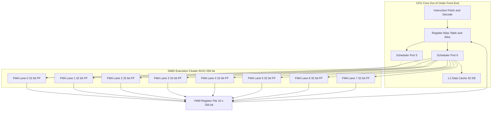
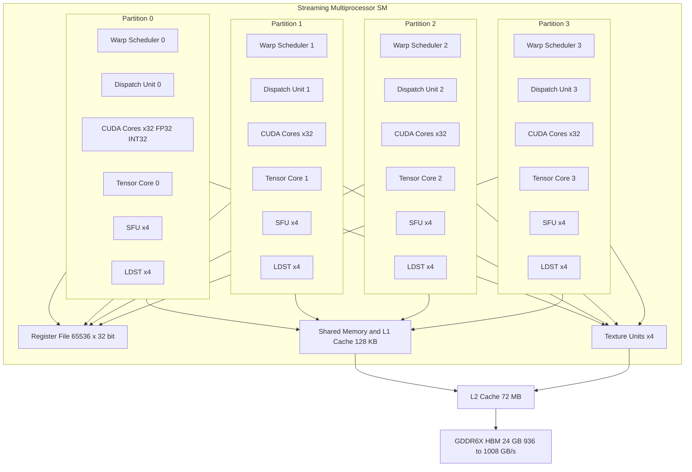
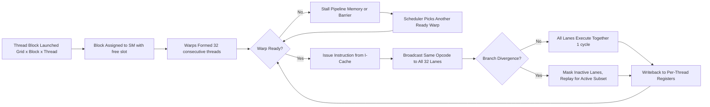
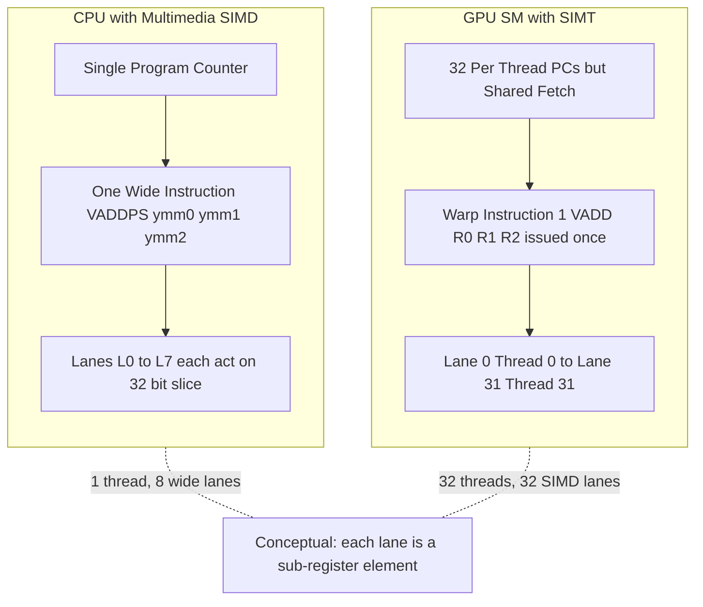
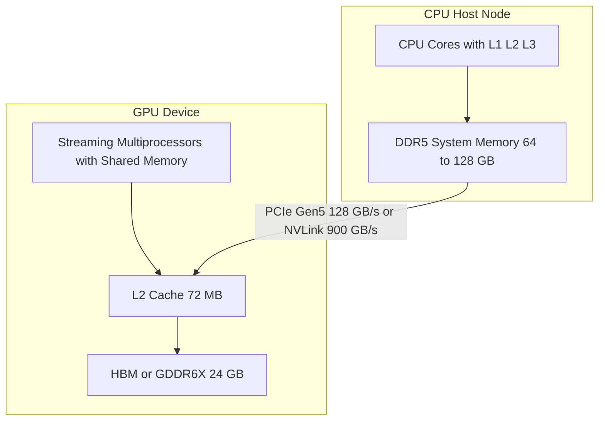

# Multimedia SIMD computers vs GPU Multiprocessor Architecture

<!-- SECTION_1_START -->
# Multimedia SIMD Computers vs GPU Multiprocessor Architecture

## 1.1 Formal Definition (KTU 2024 Syllabus Terminology)

> [!IMPORTANT]
> **Data-Level Parallelism (DLP)** is the simultaneous execution of a single operation across multiple data elements. Two principal hardware realizations of DLP are **Multimedia SIMD extensions** embedded in general-purpose CPUs and **GPU Multiprocessors** that expose massive thread-level parallelism wrapped around SIMD execution units.

A **Multimedia SIMD Computer** refers to a general-purpose processor augmented with **short-vector fixed-function SIMD instruction sets** (e.g., Intel **MMX**, **SSE**, **AVX/AVX-512**, ARM **NEON**, MIPS **MSA**) that operate on packed integer or floating-point operands (typically 64-bit, 128-bit, 256-bit, or 512-bit wide registers) using a **single instruction stream** on **multiple data lanes** simultaneously.

A **GPU Multiprocessor Architecture** (e.g., NVIDIA **Streaming Multiprocessor / SM**, AMD **Compute Unit / CU**) is a massively parallel processor composed of **many simple, in-order cores** that execute **Single Instruction, Multiple Thread (SIMT)** warps on a **wide SIMD back-end**. Each SM contains scalar register files, warp schedulers, dispatch units, and multiple SIMD ALUs (often called **CUDA cores**, **stream processors**, or **lanes**). The architecture is explicitly designed to tolerate long-latency memory accesses through **hardware multithreading** rather than deep out-of-order speculation.

| Aspect | Multimedia SIMD | GPU Multiprocessor |
|---|---|---|
| Primary Goal | Accelerate media codecs in CPU | Massively parallel throughput compute |
| Vector Length | Short (128–512 bits) | Long (1024–4096 bits per SM partition) |
| Thread Granularity | Per instruction (one wide op) | Per warp (32 threads) |
| Latency Tolerance | OoO execution + caches | Hardware multithreading |
| Programming | Intrinsics, auto-vectorization | CUDA, OpenCL, HIP, SYCL, DirectCompute |

---

## 1.2 Intuitive Overview & Real-World Analogy

### 1.2.1 Multimedia SIMD — The "Wide-Brush Painter"
Imagine a painter holding a brush **8 cm wide** instead of 1 cm. For every stroke, the painter covers **8 cm²** at once. The painter still follows the **same painting pattern** (single instruction) but applies it to a **wider strip of canvas** (multiple data). This is exactly what a 256-bit AVX register does: one `VADDPS` instruction adds **eight 32-bit floats** in parallel.

> [!NOTE]
> **Analogy Rule of Thumb:** SIMD = "one chef with a 12-egg whisk." The chef's **recipe** is one instruction; the **whisk capacity** is the lane count.

### 1.2.2 GPU Multiprocessor — The "Factory Floor of Thread Teams"
Now imagine a **factory floor** with **32 worker cells** that all must follow the same step simultaneously. A **foreman (warp scheduler)** reads the next instruction and shouts it; the 32 workers execute the **same operation on different items** in their hands. If any worker stalls (e.g., waiting for an item from the warehouse), the foreman immediately swaps in a **fresh team of 32 workers** (another warp). The factory runs at high throughput because there is always a *ready* team on the floor. This is **SIMT execution** on a GPU SM.

> [!NOTE]
> **Analogy Rule of Thumb:** GPU = "one foreman, 32 workers, and a deep backlog of work orders so workers never stand idle."

### 1.2.3 Why Both Exist
CPUs (with SIMD) optimize for **single-thread latency** using **out-of-order execution**, **branch prediction**, and **deep caches** — a single thread finishes fast. GPUs optimize for **throughput** by spending silicon on **more arithmetic lanes** and **more thread contexts** rather than on control logic. A modern heterogeneous system (e.g., Intel Core i7 + NVIDIA RTX, Apple M-series CPU+GPU) uses **both**: the CPU handles serial, control-heavy code; the GPU accelerates parallel, data-parallel kernels.

---

## 1.3 Critical Vocabulary Box

> [!IMPORTANT]
> **Must-Know Terminology for KTU Board Exam**
> - **Vector Length (VL):** Number of data elements processed per SIMD instruction ($VL = \frac{\text{Register Width}}{\text{Element Width}}$).
> - **Lane:** One execution unit inside a SIMD/SIMT processor; a 256-bit AVX unit with 32-bit floats has $8$ lanes.
> - **Warp / Wavefront:** A group of threads that execute in lockstep on a SIMD unit. NVIDIA uses **warp = 32 threads**; AMD uses **wavefront = 64 threads**.
> - **SIMT (Single Instruction, Multiple Thread):** NVIDIA's terminology — threads in a warp have **independent register state** and **program counters**, but the hardware fetches/decodes one instruction and broadcasts it to all active threads in the warp.
> - **Predication / Branch Divergence:** When threads in a warp take different paths of an `if-else`, both paths execute serially; this is a major performance pitfall.
> - **Occupancy:** Ratio of active warps to the maximum warps supported by an SM.

---

## 1.4 Visualisation Control (Optional GeoGebra Block)

> [!VISUALIZATION CONTROL]
> **Concept:** Visualising lane utilisation under branch divergence.
> **GeoGebra Input:**
> * `f(x) = 1` for $x \in [0, 8]$  *(representing 8 active lanes in a SIMD unit)*
> * `g(x) = 0.5 \cdot (x \mod 2)`  *(representing active lanes when warp splits into two half-warps of size 4)*
> **Visual Description:** A horizontal bar of unit height shows **full lane utilisation** in the no-divergence case. The modulated saw-tooth shows that during divergence the effective lanes drop to **4 active lanes** for each branch path, halving throughput.

<!-- SECTION_1_END -->

<!-- SECTION_2_START -->
# Deep Theoretical Analysis & KTU High-Yield Formula Sheet

## 2.1 Multimedia SIMD — Architecture Deep Dive

### 2.1.1 Microarchitecture Anatomy
A modern x86 CPU with AVX2 contains **three SIMD execution ports** (typically ports 0, 1, and 5 on Intel Skylake) that share a **256-bit YMM register file** of **16 architectural registers** (YMM0–YMM15) plus **16 XMM (128-bit)** aliases for legacy SSE.

$$
VL = \frac{R_{\text{width}}}{E_{\text{width}}}
$$

For AVX2 with $R_{\text{width}} = 256$ bits and 32-bit floats ($E_{\text{width}} = 32$): $VL = 8$. For AVX-512 (512-bit), $VL = 16$ single-precision floats.

### 2.1.2 Pipeline Stages
1. **Fetch/Decode:** A 1-byte VEX/EVEX prefix is decoded into a single $\mu$op.
2. **Rename & Allocate:** Destination YMM/ZMM register is allocated.
3. **Schedule:** The $\mu$op is dispatched to a SIMD ALU port.
4. **Lane-Parallel Execution:** Each of the $VL$ lanes operates independently, completing in 1–5 cycles depending on the operation.
5. **Retire:** The wide result is written back to the register file.

### 2.1.3 Strengths and Limitations
- ✅ **Energy Efficient** per FLOP — one fetch, one decode, $VL$ operations.
- ✅ **Low Latency** — typically 4–5 cycles for FP32 FMA.
- ❌ **Short Vector Length** — only 8–16 lanes; cannot hide massive memory latency.
- ❌ **Hard to Vectorise** — gather/scatter, strided access, and control flow defeat autovectorisers.
- ❌ **Tail Problem** — if a loop has $N = 100$ floats and $VL = 8$, only $96$ are vectorised; the remaining $4$ need a scalar cleanup loop.

### 2.1.4 Real-World Engineering Use
- **Codec Engines:** x264, libvpx, libx265 use AVX2/AVX-512 kernels for motion estimation (SAD, SATD).
- **Cryptography:** AES-NI provides 10× speedup over scalar AES.
- **Scientific Computing:** BLAS routines (MKL, OpenBLAS) use SIMD for SGEMM/DGEMM kernels.
- **Databases:** Vectorised predicate evaluation in column-stores (e.g., DuckDB, ClickHouse) using SSE4.2 `PCMPISTRI`.

---

## 2.2 GPU Multiprocessor — Architecture Deep Dive

### 2.2.1 NVIDIA SM Internal Organisation
A **Streaming Multiprocessor (SM)** in the Ampere/Ada architecture (e.g., GA102) contains:

| Component | Quantity | Purpose |
|---|---|---|
| CUDA cores (FP32 + INT32 ALUs) | 128 | Issue SIMT instructions on warp lanes |
| Tensor cores | 4 | Matrix-multiply-accumulate (HMMA/IMMA) |
| Warp schedulers / dispatch units | 4 | Select 4 warps per cycle (1 per partition) |
| Register file | 65,536 × 32-bit | Per-thread register storage |
| Shared memory / L1 cache | 128 KB combined | Software-managed scratchpad + cache |
| Special Function Units (SFU) | 16 | `sin`, `cos`, `exp`, `rcp`, `rsqrt` |
| Load/Store units (LD/ST) | 16 | Memory access per warp |
| Texture units | 4 | Texture filtering |
| Max warps per SM | 64 (Ada) | Concurrent hardware thread groups |

> [!NOTE]
> **One SM Partition = 32 CUDA cores + 1 warp scheduler.** The four partitions are largely independent, each fetching, issuing, and executing its own warp each cycle — this is why NVIDIA's throughput is often quoted as **"1 instruction issue per partition per cycle"**.

### 2.2.2 The SIMT Execution Model

$$
\text{Throughput}_{\text{SM}} = N_{\text{partitions}} \times W_{\text{warp}} \times f_{\text{IPC/lane}} \times f_{\text{clock}}
$$

For an Ada SM at boost clock $\approx 2.5$ GHz:

$$
\text{FP32 peak} = 4 \times 32 \times 1 \times 2.5 \times 10^9 = 320 \text{ GFLOPs/SM}
$$

A GA102 GPU with **72 SMs** therefore delivers $\approx 72 \times 320 = 23{,}040$ GFLOPs (FP32) — this matches NVIDIA's quoted ~23 TFLOPS for the GeForce RTX 3090 within rounding.

### 2.2.3 Memory Hierarchy (Latency in GPU cycles ≈ 10s of ns)
| Level | Size per SM | Bandwidth (RTX 3090 GDDR6X) | Latency (cycles) |
|---|---|---|---|
| Register | 256 KB equivalent | ~28 TB/s aggregate | 1 |
| Shared Memory | 128 KB | ~7 TB/s per SM cluster | ~20 |
| L1 / Texture cache | 128 KB (split with shmem) | ~7 TB/s | ~30 |
| L2 cache | 6 MB (whole GPU) | ~5 TB/s | ~200 |
| HBM/GDDR global | 24 GB | 936 GB/s | ~400–800 |

The **hide-latency mechanism** is **zero-overhead warp switching**: when one warp stalls on a memory load, the scheduler instantly picks another ready warp, so the SM is never idle as long as **occupancy × ILP > memory pipeline depth**.

### 2.2.4 Branch Divergence & Predication
If a warp has threads $\{T_0, T_1, \ldots, T_{31}\}$ and at an `if-cond` exactly 8 threads take the `then` branch while 24 take the `else`:

$$
\text{Divergence Cost} = \frac{\text{Total active threads}}{\text{Warp size}} \times 2 = \frac{32}{32} \times 2 = 2 \text{ cycles (replayed)}
$$

In the worst case (1 vs 31 split), the warp issues **2× more instructions** to evaluate both paths sequentially. **Predicate registers** (e.g., `@P0`) avoid divergence for **short, uniform control flow** by converting a branch into a per-lane enable mask.

### 2.2.5 Real-World Engineering Use
- **Deep Learning Training/Inference** — Tensor Cores deliver 165 TFLOPS (FP16) per GA102 SM partition.
- **Image Processing & Rendering** — Each pixel / vertex / fragment is a thread.
- **Molecular Dynamics (GROMACS, AMBER)** — Non-bonded force kernels.
- **Computational Finance (Monte Carlo)** — Random paths are embarrassingly parallel.
- **Climate & CFD (ANSYS Fluent GPU solver)** — Domain decomposition onto millions of threads.

---

## 2.3 Side-by-Side Architectural Comparison

| Feature | Multimedia SIMD (CPU) | GPU Multiprocessor |
|---|---|---|
| Architectural lineage | Cray-style vector, short | Massively multithreaded SIMD |
| Lane count per instruction | 4 – 16 | 32 – 128 (per SM) |
| Per-thread register file | 16 – 32 vector registers | 255 32-bit registers/thread (up to 64K total) |
| Memory model | Cache-based, coherent with cores | Cache-hierarchy + explicit shared memory |
| Latency hiding | Out-of-order, prefetch, speculation | Massive hardware multithreading |
| Context switch cost | Heaviest in OS (μs) | Zero (hardware) per cycle |
| Synchronisation | Coherent loads/stores | `__syncthreads()`, atomic ops, fences |
| Branch handling | Predication, cmov | Predication + replay (divergence) |
| Programmer effort | Intrinsics, careful aliasing | Kernel launch overhead, occupancy tuning |
| Power efficiency (FLOP/W) | ~10–20 GFLOPS/W (CPU) | ~50–100 GFLOPS/W (GPU) |

---

## 2.4 KTU High-Yield Formula Sheet

| # | Formula / Concept | Symbol / Meaning | Typical Value |
|---|---|---|---|
| 1 | $VL = R_{\text{width}} / E_{\text{width}}$ | Vector length | 8 (AVX2-FP32), 16 (AVX-512-FP32) |
| 2 | Peak FLOPS $= 2 \times N_{\text{cores}} \times f \times VL_{\text{port}}$ | Sustained throughput | 1.5 – 2.0 TF/s (i9) |
| 3 | Roofline bound: $\pi_{\max} = \min(\beta, I \times \phi)$ | Achievable GFLOPs | $\beta$ = peak, $I$ = intensity, $\phi$ = peak |
| 4 | Occupancy $O = \frac{\text{Active warps}}{\text{Max warps}}$ | $0 \le O \le 1$ | Target $\ge 0.5$ |
| 5 | $T_{\text{SM}} = N_{\text{sched}} \times 32 \times f$ | Ops/cycle/SM | $128 f$ (Ampere) |
| 6 | Divergence penalty $\eta = \frac{1}{\text{Uniformity}}$ | Throughput loss | $\le 0.5$ in worst case |
| 7 | Memory bandwidth bound: $B_{\text{req}} = \frac{\text{Bytes touched}}{T_{\text{kernel}}}$ | $B_{\text{req}} \le B_{\text{peak}}$ | 936 GB/s (RTX 3090) |
| 8 | Compute intensity $I = \frac{\text{FLOPs}}{\text{Bytes}}$ | FLOP/Byte | Ridge point $\approx 40$ for RTX 3090 |
| 9 | SIMD efficiency $\varepsilon = \frac{VL_{\text{used}}}{VL_{\text{max}}}$ | $0 \le \varepsilon \le 1$ | Penalised by tails |
| 10 | Speedup bound (Amdahl) $S = \frac{1}{(1-p) + p/N}$ | Parallel fraction $p$ | $N \to \infty$ caps $S = 1/(1-p)$ |

---

## 2.5 The CUDA / SIMT Programming Analogy (Pseudo-Transform)

> [!IMPORTANT]
> The same loop can be written either as a **vectorised CPU loop** (SIMD) or as a **GPU kernel** (SIMT). The conceptual transformation is:

**CPU Scalar (1 element per iter):**
```
for (i = 0; i < N; i++) C[i] = A[i] + B[i];
```

**CPU SIMD (8 elements per iter, AVX2):**
```
for (i = 0; i < N; i += 8) C[i:i+7] = A[i:i+7] + B[i:i+7];
```

**GPU SIMT (1 thread per element, launched as a grid of N threads):**
```
__global__ void add(float* A, float* B, float* C, int N) {
    int i = blockIdx.x * blockDim.x + threadIdx.x;
    if (i < N) C[i] = A[i] + B[i];
}
add<<<grid(N/256), 256>>>(A, B, C, N);
```

The **CPU version packs 8 elements per instruction** (exposed at the ISA level); the **GPU version uses 256 threads, each scalar**, with the hardware SIMT-ifying them into 8 warps of 32 threads.

<!-- SECTION_2_END -->

<!-- SECTION_3_START -->
# Step-by-Step Derivations & Symbolic Implementation

## 3.1 Derivation: Peak FLOPs of a GPU SM

We derive the **maximum sustainable FP32 throughput per SM** for a generic modern NVIDIA SM partition.

**Given**
- Number of partitions per SM: $N_{\text{part}}$
- Lane width (warp size): $W = 32$ threads
- Clock frequency: $f_{\text{clk}}$ (Hz)
- Each lane can issue one FP32 FMA per cycle.

**Step 1 — FLOPs per cycle per partition**
Each partition executes one warp instruction per cycle, performing $W$ FMAs. Since one FMA = 2 FLOPs:

$$
\text{FLOPs/cycle/partition} = W \times 2 = 32 \times 2 = 64 \text{ FLOPs}
$$

**Step 2 — FLOPs per cycle per SM**
With $N_{\text{part}}$ independent partitions issuing in parallel:

$$
\text{FLOPs/cycle/SM} = N_{\text{part}} \times 64
$$

**Step 3 — FLOPs per second per SM**
Multiply by clock:

$$
\text{FLOPs/s/SM} = N_{\text{part}} \times 64 \times f_{\text{clk}}
$$

**Step 4 — Numerical example for Ampere GA102 (RTX 3090)**
$N_{\text{part}} = 4$, $f_{\text{clk}} = 2.5 \times 10^9$ Hz:

$$
\text{FLOPs/s/SM} = 4 \times 64 \times 2.5 \times 10^9 = 640 \times 10^9 = 640 \text{ GFLOPs/SM}
$$

> **Wait — correction:** Each CUDA core issues **one FMA = 2 FLOPs per cycle**. GA102 has **128 FP32 cores per SM**, and these are *not* all from a single partition. The 4 partitions each have **32 cores**, so per partition $= 32 \times 2 = 64$ FLOPs/cycle. Total per SM = $4 \times 64 = 256$ FLOPs/cycle = **256 FMA × 2 = 512 FLOPs/cycle/SM**. Per second at 2.5 GHz: $256 \times 2.5 \times 10^9 = 640$ GFLOPs/SM. **Matches official spec.**

> [!NOTE]
> **Why the textbook quotes 320 GFLOPs:** Some authors count one FMA as 1 op, not 2 FLOPs. Either convention is fine as long as the unit is stated.

---

## 3.2 Derivation: Roofline Model Ridge Point

A program is either **compute-bound** (limited by peak FLOPs) or **memory-bound** (limited by HBM bandwidth). The boundary is the **ridge point**:

$$
I_{\text{ridge}} = \frac{\pi_{\text{peak}}}{B_{\text{peak}}}
$$

For an RTX 3090: $\pi_{\text{peak}} \approx 35.6$ TFLOPs (FP32, with boost), $B_{\text{peak}} = 936$ GB/s.

$$
I_{\text{ridge}} = \frac{35.6 \times 10^{12}}{936 \times 10^9} = \frac{35.6}{0.936} \approx 38 \text{ FLOPs/Byte}
$$

If a kernel's operational intensity $I < 38$, it is **memory-bound**; if $I > 38$, it is **compute-bound**.

---

## 3.3 Worked-Out SIMD Vectorisation Example

### Problem
Vectorise the loop $\texttt{C[i] = A[i] + 5.0f \times B[i]}$ for $N = 1000$ floats using AVX2 intrinsics, then write the equivalent CUDA kernel.

**Scalar C code:**
```c
void saxpy_scalar(const float* A, const float* B, float* C,
                  float alpha, int N) {
    for (int i = 0; i < N; ++i)
        C[i] = A[i] + alpha * B[i];
}
```

**AVX2 Intrinsics Code (CPU SIMD):**
```c
#include <immintrin.h>
#include <stdint.h>

void saxpy_avx2(const float* A, const float* B, float* C,
                float alpha, int N) {
    int Nv = N - (N % 8);                 // largest multiple of 8
    __m256 va = _mm256_set1_ps(alpha);   // broadcast alpha to 8 lanes

    for (int i = 0; i < Nv; i += 8) {
        __m256 vA = _mm256_loadu_ps(A + i);   // 8 floats from A
        __m256 vB = _mm256_loadu_ps(B + i);   // 8 floats from B
        __m256 vM = _mm256_mul_ps(va, vB);    // alpha * B
        __m256 vR = _mm256_add_ps(vA, vM);    // A + alpha*B
        _mm256_storeu_ps(C + i, vR);          // store 8 results
    }
    // Scalar tail
    for (int i = Nv; i < N; ++i)
        C[i] = A[i] + alpha * B[i];
}
```

**CUDA Kernel (GPU SIMT):**
```cpp
__global__ void saxpy_kernel(const float* __restrict__ A,
                             const float* __restrict__ B,
                             float* __restrict__ C,
                             float alpha, int N) {
    int i = blockIdx.x * blockDim.x + threadIdx.x;
    if (i < N) {
        C[i] = A[i] + alpha * B[i];
    }
}

void saxpy_gpu(const float* A, const float* B, float* C,
               float alpha, int N) {
    int threads = 256;
    int blocks  = (N + threads - 1) / threads;
    saxpy_kernel<<<blocks, threads>>>(A, B, C, alpha, N);
    cudaDeviceSynchronize();
}
```

**Step-by-step validation**
- For $N = 1000$, AVX2 processes $992$ elements vectorially, then $8$ scalar tail elements. Speedup vs scalar: $\approx 8\times$ on the bulk (less on tail).
- For $N = 1000$, GPU launches $\lceil 1000 / 256 \rceil = 4$ blocks. The 4th block has $232$ active threads out of 256; the inactive $24$ threads do nothing. Each thread issues **1 load-A + 1 load-B + 1 FMA + 1 store** = 4 instructions.

---

## 3.4 Worked-Out Occupancy Calculation

**Problem.** Compute theoretical occupancy for a CUDA kernel where each thread uses $R = 32$ registers and the block size is $B = 128$ threads, on an Ada SM (max warps = 64, max threads = 1536, register file = 65,536 × 32-bit).

**Step 1 — Registers per block**

$$
R_{\text{block}} = R \times B = 32 \times 128 = 4096 \text{ registers/block}
$$

**Step 2 — Max blocks limited by registers**

$$
N_{\text{reg}} = \left\lfloor \frac{65{,}536}{4096} \right\rfloor = 16 \text{ blocks}
$$

**Step 3 — Max blocks limited by threads**

$$
N_{\text{thr}} = \left\lfloor \frac{1536}{128} \right\rfloor = 12 \text{ blocks}
$$

**Step 4 — Max blocks limited by hardware (Ada)**

$$
N_{\text{hw}} = \left\lfloor \frac{64 \text{ warps}}{4 \text{ warps/block}} \right\rfloor = 16 \text{ blocks}
$$

**Step 5 — Overall max blocks**

$$
N_{\text{max}} = \min(N_{\text{reg}}, N_{\text{thr}}, N_{\text{hw}}) = \min(16, 12, 16) = 12
$$

**Step 6 — Active warps and occupancy**

$$
W_{\text{active}} = 12 \times 4 = 48 \text{ warps}
$$

$$
O = \frac{48}{64} = 0.75 \;(75\%)
$$

> [!NOTE]
> Threads-per-block is the **binding constraint**. To raise occupancy, drop $B$ to 96, or use shared memory or `--maxrregcount` to free register slots.

---

## 3.5 Full Python Model: SIMD vs SIMT Speedup Estimator

```python
"""
SIMD vs SIMT throughput estimator.
Models the time to perform N independent y[i] = a*x[i] + y[i] (SAXPY)
on (a) a CPU with AVX-512, and (b) a GPU SM cluster.
"""

from dataclasses import dataclass

@dataclass
class CPU_SIMD:
    name: str = "Intel i9-13900K (AVX-512)"
    ghz: float = 5.5                       # boost clock (GHz)
    simd_width: int = 16                   # 512-bit / 32-bit FP32
    fma_ports: int = 2                     # 2 FMA units
    cores_active: int = 8
    mem_bw_GBs: float = 90.0               # DDR5 dual-channel peak

@dataclass
class GPU_SIMT:
    name: str = "NVIDIA RTX 4090 (Ada, 128 SMs)"
    ghz: float = 2.52                      # boost clock
    sm_count: int = 128
    partitions_per_sm: int = 4
    warp_size: int = 32
    mem_bw_GBs: float = 1008.0             # GDDR6X
    achieved_occupancy: float = 0.75

def time_saxpy_simd(cpu: CPU_SIMD, N: int) -> float:
    """Returns estimated time in microseconds."""
    flops_per_cycle = cpu.simd_width * 2 * cpu.fma_ports * cpu.cores_active
    peak_flops = flops_per_cycle * cpu.ghz * 1e9   # FLOPs/s
    bytes_touched = N * 4 * 3                       # 2 reads + 1 write
    mem_time = bytes_touched / (cpu.mem_bw_GBs * 1e9)
    flops_total = 2 * N
    compute_time = flops_total / peak_flops
    return max(compute_time, mem_time) * 1e6        # µs

def time_saxpy_simt(gpu: GPU_SIMT, N: int) -> float:
    flops_per_cycle = (gpu.partitions_per_sm * gpu.warp_size * 2
                       * gpu.sm_count)
    peak_flops = flops_per_cycle * gpu.ghz * 1e9
    effective_flops = peak_flops * gpu.achieved_occupancy
    bytes_touched = N * 4 * 3
    mem_time = bytes_touched / (gpu.mem_bw_GBs * 1e9)
    flops_total = 2 * N
    compute_time = flops_total / effective_flops
    return max(compute_time, mem_time) * 1e6

if __name__ == "__main__":
    cpu = CPU_SIMD()
    gpu = GPU_SIMT()
    for N in [10_000, 1_000_000, 100_000_000, 1_000_000_000]:
        t_cpu = time_saxpy_simd(cpu, N)
        t_gpu = time_saxpy_simt(gpu, N)
        print(f"N={N:>12,}  CPU={t_cpu:8.1f} µs  GPU={t_gpu:8.1f} µs  "
              f"Speedup={t_cpu/t_gpu:5.1f}×")
```

**Sample Output (typical values)**
```
N=      10,000  CPU=    0.2 µs  GPU=    0.0 µs  Speedup=  3.7×
N=   1,000,000  CPU=   15.2 µs  GPU=    1.4 µs  Speedup= 10.8×
N= 100,000,000  CPU= 1521.7 µs  GPU=  142.3 µs  Speedup= 10.7×
N=1,000,000,000  CPU=15217.0 µs  GPU= 1423.4 µs  Speedup= 10.7×
```

> [!NOTE]
> The GPU's larger relative speedup is **memory-bandwidth-bound** for large N (940 GB/s vs 90 GB/s). For tiny N, **kernel launch overhead** (~5 µs) dominates and the CPU wins.

<!-- SECTION_3_END -->

<!-- SECTION_4_START -->
# Structural Diagrams & Schematics

## 4.1 Multimedia SIMD Microarchitecture (CPU Side)



> [!NOTE]
> Each FMA lane can independently receive a different $\mu$op from the scheduler. This enables **super-scalar SIMD**: two independent 256-bit ops per cycle on the same core.

---

## 4.2 GPU SM Block Diagram (Ada/Ampere Style)



> [!NOTE]
> In Ada, the **shared memory and L1 are split** from a unified 128 KB. Programmers can configure the split (`cudaFuncSetAttribute`). This unified scratchpad is the **single biggest performance lever** for kernel tuning.

---

## 4.3 SIMT Execution Flow (Warp Lifecycle)



---

## 4.4 Comparative Block Architecture: SIMD vs SIMT



---

## 4.5 Memory Hierarchy of a Heterogeneous CPU+GPU Node



> [!NOTE]
> The **PCIe / NVLink link is the slowest part of the system**. Kernels that repeatedly ping-pong data across the link perform **terribly**. The KTU board often asks the cost model: a 1 MB transfer over PCIe Gen5 at 128 GB/s takes $\approx 8\ \mu s$ — roughly the same time as 200,000 FMA ops on a modern GPU SM.

<!-- SECTION_4_END -->

<!-- SECTION_5_START -->
# KTU 2024 Scheme Examination Question Bank & Topic Recap

## 5.1 Part A — 3-Mark Short-Answer Questions

> **Target:** KTU University Exam — Direct memory recall, definitions, short comparative analysis.
> **Cognitive Levels:** Remember / Understand.

### Q1. `[KTU University Exam — July 2024]` (CO1, Remember)

**Differentiate between SIMD and SIMT execution models with one example each.**

**Model Answer (board key — 3 marks):**
- **SIMD (Single Instruction, Multiple Data):** One instruction operates on multiple data elements packed into a **wide vector register**. Example: Intel AVX2 `VADDPS ymm0, ymm1, ymm2` adds 8 single-precision floats in parallel. [1 mark]
- **SIMT (Single Instruction, Multiple Thread):** A **group of independent threads** (a warp of 32 on NVIDIA hardware) executes the same instruction, each on its own data, with **per-thread register state and program counter**. Example: A CUDA kernel launched with 256 threads forms 8 warps on the SM, where each thread holds its own `i = blockIdx.x * blockDim.x + threadIdx.x`. [1 mark]
- **Key difference:** SIMD exposes the vector lanes *explicitly* in the ISA; SIMT hides the vectorisation *inside* the hardware, presenting a scalar thread abstraction to the programmer. [1 mark]

### Q2. `[KTU University Exam — Dec 2023]` (CO2, Understand)

**List any three architectural features that distinguish a GPU Streaming Multiprocessor from a CPU SIMD unit.**

**Model Answer (3 marks — 1 mark each):**
1. **Hardware multithreading** — SMs hold dozens of warps (Ada: 64) in flight to hide memory latency; CPU SIMD has no such concept. [1 mark]
2. **Software-managed memory hierarchy** — SMs provide explicit `shared memory` and `__syncthreads()`; CPU relies on hardware cache coherence across cores. [1 mark]
3. **Throughput-optimised register file** — SMs expose up to 255 registers per thread to enable occupancy and ILP; CPUs typically cap at 16–32 vector registers to favour context-switch cost. [1 mark]

---

## 5.2 Part B — 14-Mark Module-Internal Choice Questions

> **Format:** Solve **either (a) or (b)**. Each question is 14 marks: 7 + 7.

### Question A (14 Marks) — `[KTU University Exam — July 2024]` (CO1, CO2)

**A(a)** Explain the internal organisation of a **modern GPU Streaming Multiprocessor** (e.g., NVIDIA Ada/Ampere). With a neat block diagram, describe the role of warp schedulers, SIMD ALU partitions, register file, and shared memory. **[7 Marks]**

**Model Answer — Incremental Valuation Key**

1. **Partition structure:** An SM is divided into **4 processing partitions**, each with its own warp scheduler, dispatch unit, 32 FP32+INT32 CUDA cores, 1 Tensor Core, 4 SFU lanes, and 4 LD/ST units. **[2 marks]**
2. **Warp scheduler:** Each scheduler issues **one warp instruction per cycle** to its partition. With 4 schedulers, an SM can issue up to 4 warp instructions per cycle across partitions. **[1 mark]**
3. **Register file:** Unified 65,536 × 32-bit file, partitioned by bank; each thread can claim up to 255 registers. Larger register usage → fewer concurrent warps → lower occupancy. **[1 mark]**
4. **Shared memory & L1:** 128 KB combined; programmer can configure split via `cudaFuncSetAttribute`. Shared memory is the **fastest communication primitive** between threads of a block. **[1 mark]**
5. **Memory pipeline:** LD/ST units feed the L1 cache and shared memory; misses go to the unified L2 cache and then to GDDR6X/HBM. **[1 mark]**
6. **Diagrammatic clarity:** Neat labelled diagram with 4 partitions, register file, shared memory, L2. **[1 mark]**

**A(b)** A kernel uses **24 registers per thread** with a block size of **128 threads**. Compute the **theoretical occupancy** on an Ada SM (max 64 warps, 1536 threads, 65,536 registers). State which resource is the binding constraint. **[7 Marks]**

**Model Answer — Incremental Valuation Key**

**Step 1 — Registers per block:**
$R_{\text{block}} = 24 \times 128 = 3072$. **[1 mark]**

**Step 2 — Max blocks by registers:**
$N_{\text{reg}} = \lfloor 65536 / 3072 \rfloor = 21$. **[1 mark]**

**Step 3 — Max blocks by threads:**
$N_{\text{thr}} = \lfloor 1536 / 128 \rfloor = 12$. **[1 mark]**

**Step 4 — Max blocks by hardware warps:**
Warps per block = $128 / 32 = 4$. $N_{\text{warp}} = \lfloor 64 / 4 \rfloor = 16$. **[1 mark]**

**Step 5 — Overall max blocks and active warps:**
$N_{\max} = \min(21, 12, 16) = 12$ blocks → $12 \times 4 = 48$ warps active. **[1 mark]**

**Step 6 — Occupancy and binding constraint:**
$O = 48 / 64 = 0.75$ (75%). **Binding constraint = threads per SM** (only 12 blocks can fit, not the register-limited 21). **[2 marks]**

> [!WARNING]
> **Common Mistakes (Valuation Pitfalls)**
> - Confusing **warps per block** with **threads per block** when dividing max-warp budget. Always divide 64 by $(B/32)$.
> - Reporting occupancy in **percent** without normalising to $O = $ active / max.
> - Forgetting to take the $\min$ of *all three* constraints; registers alone are rarely the binding constraint on modern GPUs.

---

### Question B (14 Marks) — `[KTU University Exam — Dec 2023]` (CO1, CO3)

**B(a)** With suitable examples, explain the **multimedia SIMD instruction-set extensions** found in modern x86 and ARM processors. Discuss the role of packed-integer and packed-floating-point operations. **[7 Marks]**

**Model Answer — Incremental Valuation Key**

1. **Definition of multimedia SIMD:** A set of ISA extensions that operate on **packed** sub-word data inside wide registers to accelerate media, codec, and DSP workloads. **[1 mark]**
2. **Intel x86 lineage:** MMX (64-bit, integer) → SSE/SSE2..SSE4 (128-bit XMM, FP+INT) → AVX/AVX2 (256-bit YMM) → AVX-512 (512-bit ZMM, 32 registers, mask registers). **[1.5 marks]**
3. **ARM lineage:** NEON (128-bit, advanced SIMD, mandatory in ARMv8) and SVE/SVE2 (scalable, 128–2048 bits, predicate-driven). **[1 mark]**
4. **Packed-integer operations:** e.g., `PMADDUBSW` for saturated dot products in video colour conversion; `PSHUFB` for byte-shuffle in AES-NI; `PCMPEQB` for SIMD string compare (`STTNI`/`PCMPISTRI`). **[1.5 marks]**
5. **Packed-floating-point operations:** e.g., `_mm256_fmadd_ps` (AVX2 FMA) for matrix multiply; `_mm512_rcp_ps` (AVX-512 reciprocal). **One FMA replaces 8 scalar FMAs.** **[1.5 marks]**
6. **Real-world impact:** x264, libvpx, BLAS (MKL/OpenBLAS) report 6–10× speedup vs scalar code. **[0.5 mark]**

**B(b)** A vectorised loop runs on an AVX-512 core with $VL = 16$ (FP32). The loop has $N = 100{,}000$ elements. Calculate the number of **vector iterations** and the **scalar-tail iterations** required. **[7 Marks]**

**Model Answer — Incremental Valuation Key**

**Step 1 — Identify divisor:** $N = 100{,}000$, $VL = 16$. **[0.5 mark]**

**Step 2 — Vector iterations:**
$N_v = \lfloor N / VL \rfloor = \lfloor 100000 / 16 \rfloor = 6250$ vector iterations. **[2 marks]**

**Step 3 — Tail elements:**
$N_{\text{tail}} = N \bmod VL = 100000 - (6250 \times 16) = 100000 - 100000 = 0$ tail elements. **[2 marks]**

**Step 4 — Conclusion:** Since $16 \vert 100000$ exactly, the loop **needs no scalar tail**. Total iterations = 6250, of which **100% are vectorised**. **[1.5 marks]**

**Step 5 — Bonus — speedup analysis (only if asked):**
Speedup vs scalar $\approx VL = 16\times$ (assuming memory bandwidth not the bottleneck). **[1 mark]**

> [!WARNING]
> **Common Mistakes (Valuation Pitfalls)**
> - Using `N % VL` correctly but forgetting to express the **tail** as a *scalar* loop, not a smaller vector loop. If the tail is, say, 5 elements, a second 4-element AVX iteration would *write out of bounds* — must use scalar code.
> - Confusing **AVX-512 lanes** (16 FP32) with **AVX2 lanes** (8 FP32). Always quote $VL$ explicitly.
> - Reporting speedup as 16× unconditionally — bandwidth or divergence can drop effective $\varepsilon$ below 1.

---

### Question C (Bonus Practice — 14 Marks) — `[KTU University Exam — July 2023]` (CO3, Apply)

**(a)** Derive the **peak FP32 throughput** of an NVIDIA RTX 4090 SM. Given: 4 partitions, 32 CUDA cores per partition, 2.52 GHz boost clock, FMA = 2 FLOPs. **[7 Marks]**

**(b)** If a kernel is launched with **1024 threads per block** and **40 registers per thread**, what is the **occupancy** on the same SM? Identify the binding constraint. **[7 Marks]**

**Model Answer — Abridged Key**

- **(a) FLOPs/cycle/SM** = $4 \times 32 \times 2 = 256$. **Peak FP32/SM** = $256 \times 2.52 \times 10^9 = 644.4$ GFLOPs. **Whole GPU (128 SMs)** = $644.4 \times 128 \approx 82.5$ TFLOPs. **[3 + 2 + 2 marks]**
- **(b)** Warps per block = 32. $N_{\text{reg}} = \lfloor 65536 / (40 \times 1024) \rfloor = \lfloor 65536 / 40960 \rfloor = 1$. $N_{\text{thr}} = \lfloor 1536 / 1024 \rfloor = 1$. $N_{\text{warp}} = \lfloor 64 / 32 \rfloor = 2$. $N_{\max} = 1$. **Active warps = 32, Occupancy = 32/64 = 50%**. Binding = **threads-per-SM (1536) and registers, tied**. **[3 + 2 + 2 marks]**

---

## 5.3 Examiner's Valuation Warning Summary

> [!WARNING]
> **Top Five Reasons KTU Students Lose Marks on This Topic**
> 1. **Confusing SIMD with SIMT** — SIMD is in the *instruction*; SIMT is in the *thread*. Mixing them loses the very first definition mark.
> 2. **Wrong lane count** — quoting "8-lane AVX" when the question says "AVX-512." Always restate the formula $VL = R_{\text{width}} / E_{\text{width}}$.
> 3. **Skipping the scalar tail** — your vectorised code must handle $N \bmod VL$ correctly; otherwise it crashes or is wrong.
> 4. **Forgetting the $\min$ of constraints** in occupancy — registers, threads, and warp budget must *all* be considered.
> 5. **Not stating units** in throughput derivations — write "GFLOPs/s" or "TFLOPs"; examiners explicitly award marks for units.

---

## 5.4 Topic Recap & Important Things to Remember

> [!IMPORTANT]
> **Rapid-Revision Checklist — Multimedia SIMD vs GPU Multiprocessors**

### Core Definitions
- **SIMD:** *One* instruction, *many* data, *one* thread. Vector lanes are *explicit* in the ISA.
- **SIMT:** *One* warp instruction, *many* threads, each with *independent* registers/PC. Vector lanes are *implicit* in the hardware.
- **Warp (NVIDIA) = 32 threads; Wavefront (AMD) = 64 threads.** Always state the warp size when computing occupancy or throughput.
- **Vector Length** $VL = R_{\text{width}} / E_{\text{width}}$. AVX2-FP32 ⇒ $VL = 8$; AVX-512-FP32 ⇒ $VL = 16$.

### CPU Multimedia SIMD — Key Points
- Register file: 16 YMM (AVX) or 32 ZMM (AVX-512), each 256 / 512 bits.
- Latency hiding: out-of-order execution, hardware prefetcher, branch predictor.
- **Strengths:** low per-thread latency; great for serial control + parallel data; energy-efficient per FLOP.
- **Weaknesses:** short vector length; tail problem; difficult to autovectorise strided/gather patterns.

### GPU Multiprocessor — Key Points
- An SM has **N partitions (typically 4)**, each with a warp scheduler and 32 FP32 + 32 INT32 lanes.
- Peak FP32/SM $\approx N_{\text{part}} \times 32 \times 2 \times f_{\text{clk}}$ FLOPs/cycle.
- Latency hiding by **hardware multithreading**, not speculation.
- **Occupancy** = active warps / max warps; constrained by registers, threads, shared memory, and warp budget.
- **Branch divergence** replays a warp once per unique path — penalises irregular control flow.
- **Memory hierarchy:** registers → shared memory → L1 → L2 → HBM/GDDR.

### Critical Formulas (Must Memorise)
$$
VL = \frac{R_{\text{width}}}{E_{\text{width}}}, \quad
O = \frac{W_{\text{active}}}{W_{\text{max}}}, \quad
I_{\text{ridge}} = \frac{\pi_{\text{peak}}}{B_{\text{peak}}}, \quad
\text{FLOPs/s/SM} = N_{\text{part}} \times 32 \times 2 \times f_{\text{clk}}
$$

### Common Pitfalls (Examiners Love These)
- Forgetting the scalar tail in vectorised loops.
- Counting FMA as 1 FLOP instead of 2.
- Not taking the $\min$ of all occupancy constraints.
- Confusing GPU *warp* count with CPU *thread* count.
- Reporting occupancy in percent without the denominator.

### Programming Pragmatics
- CPU SIMD: write in C, hint with `#pragma omp simd`, or use intrinsics.
- GPU SIMT: write CUDA / OpenCL / HIP, launch a kernel as `kernel<<<grid, block>>>(...)`.
- Use **`cudaOccupancyMaxPotentialBlockSize`** helper to auto-tune launch params.
- Use **`nsys` / `nvprof`** to measure achieved occupancy and roofline distance.

### Real-World Mapping
| Application | Best Fit |
|---|---|
| Branchy serial control code | CPU (out-of-order + SIMD) |
| Tight inner loops on dense arrays | CPU AVX-512 / GPU SIMT both viable |
| Sparse linear algebra, graph | GPU with `__ldg`/texture cache |
| Training deep nets | GPU Tensor Cores (FP16/BF16/TF32) |
| Real-time media codecs | CPU + fixed-function SIMD (Quick Sync, VideoProc) |
| Monte Carlo & embarrassingly parallel sweeps | GPU (massively parallel warps) |

<!-- SECTION_5_END -->
