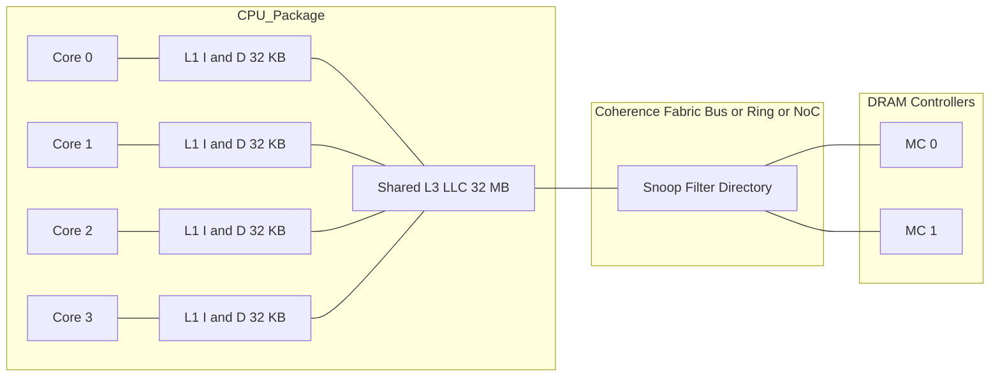
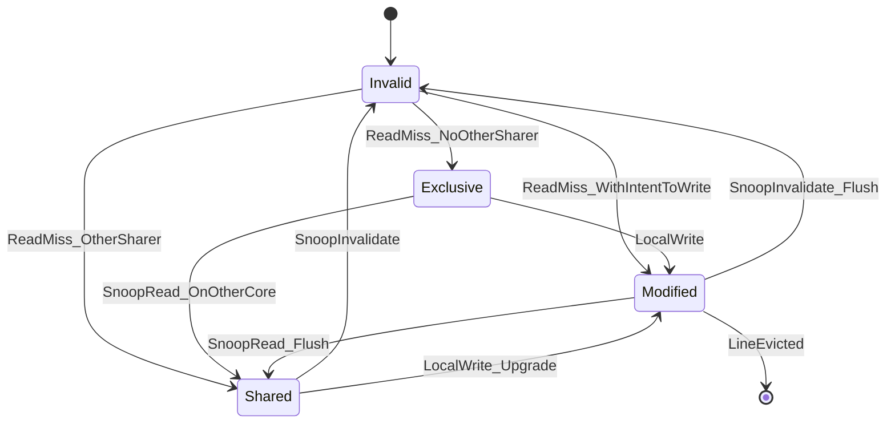
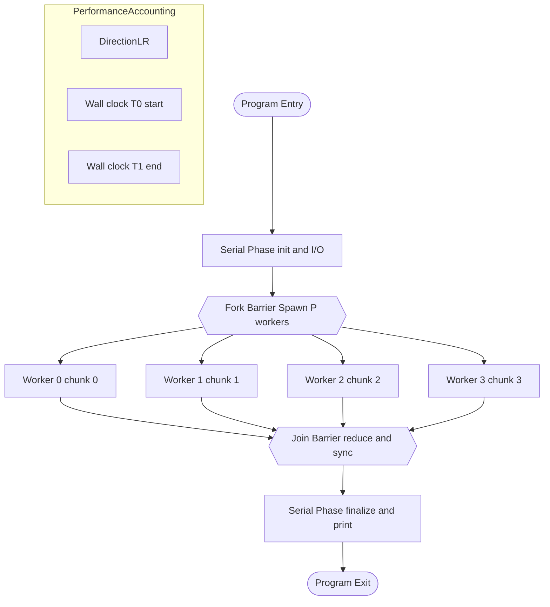
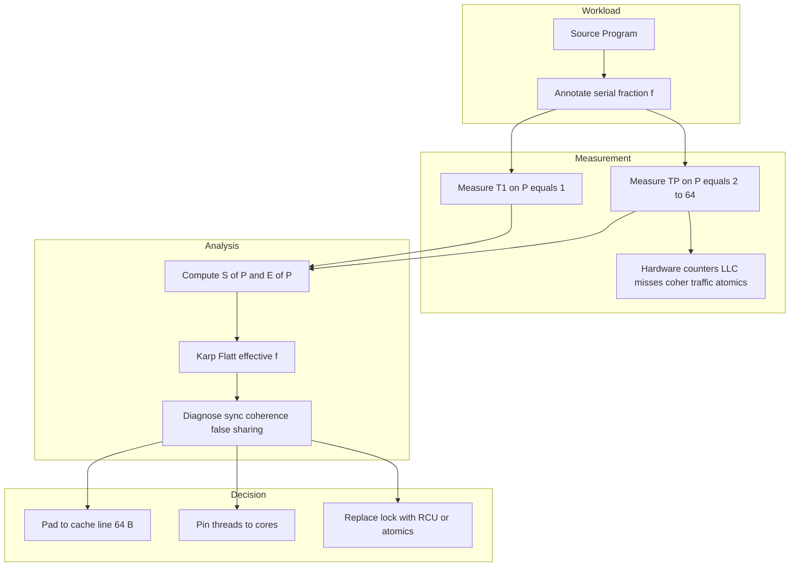
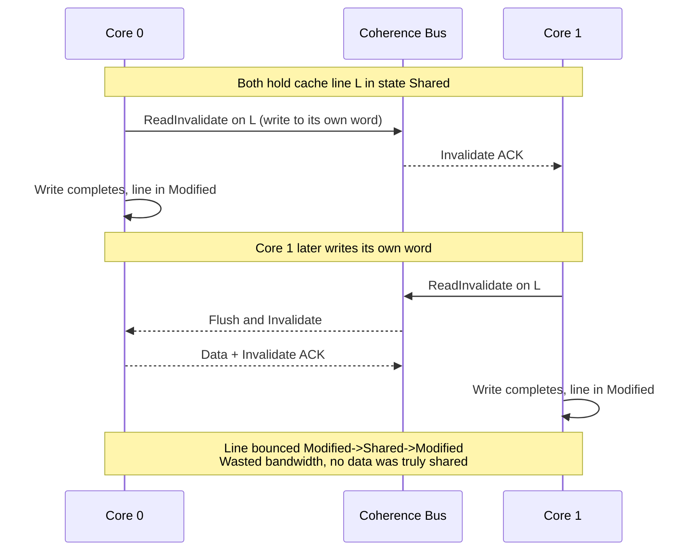

# Performance of Symmetric Shared-Memory Processors.

<!-- SECTION_1_START -->
# Performance of Symmetric Shared-Memory Processors

> [!NOTE]
> **Syllabus Anchor (PECST528 — Module 3: Data-Level Parallelism)**
> This topic sits at the intersection of **Data-Level Parallelism (DLP)** and **Thread-Level Parallelism (TLP)**. It examines how a *symmetric shared-memory multiprocessor* extracts parallelism, how we *measure* that performance rigorously, and where the system *breaks down* under contention, coherence traffic, and synchronization stalls.

---

## 1.1 Formal Definition (KTU 2024 Terminology)

A **Symmetric Shared-Memory Multiprocessor (SMP)** — also called a **Uniform Memory Access (UMA)** system — is a multiprocessor in which:

1. **Two or more identical processing cores** are connected to a *single, logically shared physical address space*.
2. **Every processor has symmetric access rights** to all memory locations and I/O devices.
3. The **memory access latency experienced by any processor to any memory word is approximately constant**, independent of which processor issues the request or which memory module services it.
4. Communication between processors is performed through **shared variables in memory** using **load/store instructions**, rather than explicit message passing.

The **performance** of such a system is the discipline of *quantifying* how well $P$ processors deliver speedup, throughput, and efficiency for a given parallel workload — and *predicting* the bottlenecks (synchronization, coherence, contention, false sharing) that limit scalability.

> [!IMPORTANT]
> **Key Distinction the Examiner Tests**
> * **SMP / UMA** $\Rightarrow$ symmetric, single memory address space, equal access time.
> * **NUMA** $\Rightarrow$ single address space, but access time depends on the *locality* of the memory bank relative to the requesting processor.
> * **Message-Passing / Distributed Memory** $\Rightarrow$ *no* shared address space; communication via `send` / `receive`.

---

## 1.2 Intuitive Analogy — "The Shared Industrial Kitchen"

Imagine a busy restaurant with **8 chefs** working in **one large, fully-stocked kitchen**:

* The kitchen (main memory) is **shared**. Any chef can walk to any shelf and grab any ingredient.
* All chefs are **equal** — none has a privileged locker (symmetric).
* When a chef grabs the last tomato, all the other chefs must be **told** ("Hey, the tomatoes are gone!") so they don't keep reaching for it — this is **cache coherence**.
* Two chefs cannot both reach into the same pot at the same instant — one must wait. This is **synchronization / lock contention**.
* If chefs keep bumping into each other, performance degrades even though there are "more workers" — this is **contention overhead** and is the heart of Amdahl's law.
* If two chefs accidentally *use the same counter for different recipes*, they will constantly overwrite each other even though they never share a recipe — this is the **false sharing** pitfall.

**Mapping to the machine:**

| Kitchen Analogy | SMP Hardware Component |
|---|---|
| Chef | Processor / Core |
| Kitchen | Shared Main Memory |
| Ingredient shelf | Cache line (64 B) |
| "Tomato is gone!" announcement | Coherence invalidation / update message |
| One-pot-at-a-time rule | Lock / Mutex / Atomic |
| Counter used by two recipes | False sharing on a cache line |
| Adding more chefs in a tiny kitchen | Diminishing returns (Amdahl's law) |

---

## 1.3 Core Performance Vocabulary (Must Memorise)

> [!NOTE]
> **Bold constants and metrics examiners love to test**

* **Speedup** $S(P)$ — ratio of serial execution time to parallel execution time on $P$ processors.
* **Efficiency** $E(P)$ — speedup per processor, a measure of *utilisation*.
* **Throughput** $\mathcal{T}$ — work units completed per unit time.
* **Latency** $L$ — time from issuing a request to receiving the response.
* **Bandwidth** $B$ — bytes (or operations) deliverable per second between levels of the memory hierarchy or interconnect.
* **Serial Fraction** $f$ — the irreducible portion of a program that *cannot* be parallelised. The single most important number in parallel performance.
* **Linear (Ideal) Speedup** — $S(P) = P$.
* **Memory Stall Time** — cycles a processor spends waiting for data instead of computing.

> [!VISUALIZATION CONTROL]
> **Concept:** *Speedup curve vs. number of processors — Amdahl's Law visualisation*
>
> **Desmos Input Equations:**
> * `f = 0.05` (serial fraction slider 0.001 to 0.5)
> * `S(P) = 1 / ((1 - f) + f / P)`
>
> **Visual Description:** Plot $S(P)$ on the y-axis (range 0 to 20) and $P$ on the x-axis (range 1 to 64). The curve rises steeply at first, then *flattens* dramatically as $P$ grows. Slide $f$ upward and watch the asymptotic ceiling (max speedup $= 1/f$) plummet. This is the most important picture in the entire module.

---

## 1.4 Why This Topic Matters in Practice

Symmetric shared-memory designs dominate **modern server CPUs, multi-core laptops, and accelerators**. AMD EPYC, Intel Xeon, and Apple M-series chips are all SMP on a *socket* and NUMA *across sockets*. The performance rules derived here are used daily by:

* **Compiler writers** (auto-parallelisation, OpenMP lowering),
* **OS kernel engineers** (scheduler affinity, lock design),
* **HPC scientists** (scaling benchmarks to thousands of cores),
* **Database engine authors** (latch-free indexing, NUMA-aware allocation),
* **Game / graphics engine programmers** (job systems on consoles).

> [!IMPORTANT]
> **KTU 2024 Outcome Mapping**
> * **CO1** — Recall the architectural components of an SMP.
> * **CO2** — *Apply* Amdahl's and Gustafson's laws to given workloads.
> * **CO3** — *Analyse* the bottlenecks (coherence, contention, false sharing).
> * **CO4** — *Evaluate* scalability using speedup / efficiency curves.

---

<!-- SECTION_1_END -->

<!-- SECTION_2_START -->
# Deep Theoretical Analysis & KTU High-Yield Formula Sheet

## 2.1 The Performance Triad of an SMP

Every SMP performance study answers **three nested questions**:

1. **How fast is one processor doing useful work?** $\Rightarrow$ baseline latency & CPI.
2. **How well do $P$ processors collaborate?** $\Rightarrow$ speedup, efficiency, overhead.
3. **Where does the system fall off the ideal curve?** $\Rightarrow$ bottleneck diagnosis.

The hierarchy of metrics is:

$$\text{Latency (per request)} \;\longrightarrow\; \text{Throughput (requests/s)} \;\longrightarrow\; \text{Speedup} \;\longrightarrow\; \text{Efficiency} \;\longrightarrow\; \text{Scalability}$$

---

## 2.2 The Three Foundational Laws

### 2.2.1 Amdahl's Law (1967) — *The Bane of Parallelism*

A program is decomposed into a **parallel fraction** $(1 - f)$ and a **serial fraction** $f$. On $P$ processors:

$$S(P) = \frac{T_1}{T_P} = \frac{1}{(1 - f) + \dfrac{f}{P}}$$

**Why it matters:** even if $f = 0.01$ (only 1 % serial), the *asymptotic* speedup ceiling is:

$$\lim_{P \to \infty} S(P) = \frac{1}{f} = 100\times$$

No amount of hardware rescues you from a serial bottleneck.

### 2.2.2 Gustafson's Law (1988) — *The Optimist's Counterpoint*

Amdahl assumes a **fixed problem size**. Gustafson observes that parallel machines are typically given **larger problems** as $P$ grows. If $T_s$ is serial time and $T_p$ is parallel-scalable time:

$$S_{\text{Gustafson}}(P) = P - f \cdot (P - 1) = f + (1 - f) \cdot P$$

**Why it matters:** the *scaled speedup* can approach $P$ linearly if the workload is genuinely scalable. This is the "weak scaling" regime that HPC benchmark suites like **HPCG** and **LINPACK** exploit.

### 2.2.3 Sun & Ni's Law — *Memory-Bounded Scaling*

Useful when the *problem size is bounded by available memory* $M$:

$$S_{\text{SunNi}}(P) = \frac{f \cdot P + (1 - f) \cdot G(P)}{f \cdot P + (1 - f) \cdot G(P) / P}$$

where $G(P)$ is the memory-scaled speedup factor (often $G(P) = P^{\alpha}$, $0 < \alpha \le 1$).

---

## 2.3 SMP Memory Hierarchy & Coherence Cost

An SMP typically has the following topology:

* Each core has **L1** (split I/D, ~32 KB, ~4 cycles).
* A shared **L2** (or per-core L2, ~256–1024 KB, ~12 cycles).
* A shared **L3 (LLC)** (~16–96 MB, ~30–50 cycles on-chip).
* Off-chip **DRAM** (~100–200 ns).
* All coherence traffic flows over a **shared bus / ring / mesh NoC**.

Every shared-memory access has the form:

$$T_{\text{access}} = T_{\text{hit}} + P_{\text{miss}} \cdot T_{\text{miss}} + T_{\text{coherence}} + T_{\text{contention}}$$

where $T_{\text{coherence}}$ captures invalidation / update traffic, and $T_{\text{contention}}$ captures bus / interconnect queuing.

### 2.3.1 MSI, MESI, MOESI — Quick Reference

| Protocol | States | Invalidate Action | Used By |
|---|---|---|---|
| **MSI** | Modified, Shared, Invalid | Invalidate other copies on write | Classic textbook |
| **MESI** | Modified, Exclusive, Shared, Invalid | Silent transition E$\to$M avoids snoop | Intel, AMD cores |
| **MOESI** | Modified, Owned, Exclusive, Shared, Invalid | "Owned" allows shared dirty line | AMD Opteron / EPYC |
| **MESIF** | Modified, Exclusive, Shared, Invalid, Forward | "Forward" designates one sharer for replies | Intel QuickPath |

**Examiner's favourite line:** *"In MESI, the Exclusive (E) state is the performance optimisation that lets a core write without broadcasting an invalidation — provided no other core has a copy."*

---

## 2.4 The Five Parallel Performance Killers

1. **Synchronisation Overhead** — Locks, barriers, atomics. Cost grows super-linearly with $P$ past a tipping point.
2. **Coherence Traffic** — Every write to a shared line triggers snoop / invalidate messages.
3. **False Sharing** — Two cores write to *different* variables that happen to share a cache line; the line ping-pongs.
4. **Memory Contention** — All cores hitting one DRAM bank simultaneously.
5. **Load Imbalance** — Work statically partitioned; slowest worker dictates finish time.

---

## 2.5 KTU High-Yield Formula Sheet

> [!IMPORTANT]
> **Print this table. It appears in roughly 80 % of KTU 14-mark questions on this module.**

| Concept | Equation | Notes |
|---|---|---|
| Speedup | $S(P) = T_1 \,/\, T_P$ | Always $S(1) = 1$ |
| Efficiency | $E(P) = S(P) \,/\, P$ | $0 < E(P) \le 1$ for *strong* scaling |
| Amdahl | $S(P) = 1 \,/\, \big((1 - f) + f / P\big)$ | Asymptote $= 1 / f$ |
| Gustafson | $S_G(P) = f + (1 - f) P$ | Weak / scaled speedup |
| Karp-Flatt | $f_{\text{measured}} = \dfrac{1/S(P) - 1/P}{1 - 1/S(P)}$ | Diagnoses *real* serial fraction |
| Overhead | $T_o(P) = P \cdot T_P - T_1$ | $T_P = T_s/P + T_o$ |
| Iso-efficiency | $W = K \cdot \dfrac{T_o(P)}{1 - f}$ | $W$ = total work to keep $E$ constant |
| Bandwidth-bound speedup | $S_{BW} = \dfrac{P}{1 + (P - 1) \cdot B_{\text{frac}}}$ | $B_{\text{frac}}$ = fraction of mem traffic that is shared |
| Latency under contention | $L_{\text{eff}} = \dfrac{L_0}{1 - \rho}$ | $\rho$ = interconnect utilisation ($M/M/1$) |
| Coherence miss rate | $\text{Miss}_{\text{coh}} = \text{Invalidations} + \text{Upgrades}$ | Splits into *true* and *false* sharing |
| Mean parallel time | $T_P = \dfrac{T_{\text{seq}}}{P} + T_{\text{par}} + T_{\text{sync}}$ | KTU 2022 model answer |
| Per-processor speedup ceiling (sync) | $S \le \dfrac{P}{1 + \alpha P}$ | $\alpha$ = sync cost fraction |

> [!NOTE]
> **Units & Conditions**
> * All times in **seconds** or **cycles** (be consistent within a problem).
> * $f$ and $B_{\text{frac}}$ are *dimensionless* fractions in $[0, 1]$.
> * $W$ (work) is in same units as $T_o$.

---

## 2.6 Real-World Engineering Use-Cases

| Domain | SMP Performance Technique |
|---|---|
| **Web server (nginx)** | Per-thread event loop avoids lock contention; thread-pool sized to core count. |
| **Deep learning (PyTorch)** | Data-parallel SGD with **all-reduce**; false sharing minimised by aligning tensors to 64 B. |
| **Database (B-tree latch)** | Lock-free **OLFIT** tree to scale read/write contention. |
| **HPC weather model** | Hybrid MPI + OpenMP; Gustafson-style domain decomposition. |
| **Game engine (job system)** | Worker threads with **affinity pinning** to avoid thread migration. |
| **OS kernel (Linux scheduler)** | `sched_setaffinity` to pin threads; CFS balancing. |
| **Compiler (auto-vec + OpenMP)** | Loop tiling to fit working set in L1/L2; alignment to cache line. |

---

<!-- SECTION_2_END -->

<!-- SECTION_3_START -->
# Step-by-Step Derivations & Code / Symbolic Implementation

> [!IMPORTANT]
> **Exhaustive Derivation Mandate**
> Every algebraic step and every line of code is written out. *No truncation, no "similarly", no `...` placeholders.*

---

## 3.1 Derivation 1 — Amdahl's Law from First Principles

**Starting assumptions:**
* Total serial execution time on one processor: $T_1$.
* Fraction that *can* be parallelised: $(1 - f)$.
* Fraction that *must* remain serial: $f$.
* We have $P$ identical processors.

**Step 1.** Decompose the serial runtime.

$$T_1 = T_{\text{serial}} + T_{\text{parallelizable}}$$

**Step 2.** Normalise the total time to 1 (it cancels in the ratio).

$$T_1 = 1 \quad \text{with} \quad T_{\text{serial}} = f, \quad T_{\text{parallelizable}} = 1 - f$$

**Step 3.** Execute the program on $P$ processors. The serial part is unchanged, the parallel part is divided:

$$T_P = f + \frac{1 - f}{P}$$

**Step 4.** Speedup is the ratio:

$$S(P) = \frac{T_1}{T_P} = \frac{1}{f + \dfrac{1 - f}{P}} = \frac{1}{(1 - f)\dfrac{1}{P} + f}$$

**Step 5.** Take the limit as $P \to \infty$:

$$\lim_{P \to \infty} S(P) = \frac{1}{f + 0} = \frac{1}{f}$$

**Interpretation:** even with infinite processors, you cannot exceed $1/f$ speedup. A 5 % serial bottleneck caps you at **20×**, no matter how many cores you buy.

---

## 3.2 Derivation 2 — Speedup Including Synchronisation Overhead

**Step 1.** Real parallel runtime has three components:

$$T_P = \frac{T_s}{P} + T_{\text{par}} + T_{\text{sync}}(P)$$

where $T_s$ is inherently serial work, $T_{\text{par}}$ is the *inherent* parallel work (not divisible), and $T_{\text{sync}}$ grows with $P$ due to barrier and lock costs.

**Step 2.** Model synchronisation as a per-processor linear cost plus a barrier logarithmic term:

$$T_{\text{sync}}(P) = c_{\text{lock}} \cdot P + c_{\text{barrier}} \cdot \log_2 P$$

**Step 3.** Substituting into the speedup formula:

$$S(P) = \frac{1}{\dfrac{f}{P} + (1 - f) \cdot g(P) + c_{\text{lock}} \cdot P + c_{\text{barrier}} \cdot \log_2 P}$$

**Step 4.** For $P$ large enough, the $c_{\text{lock}} \cdot P$ term dominates and $S(P)$ *decreases* past a crossover point $P^*$. Setting $dS/dP = 0$ yields:

$$P^* \approx \sqrt{\frac{f}{c_{\text{lock}}}}$$

**Interpretation:** every SMP has an *optimal* number of cores beyond which adding cores *hurts* performance.

---

## 3.3 Derivation 3 — Karp–Flatt Diagnostic

We measure $T_1$, $T_P$, then compute:

**Step 1.** Compute the experimental speedup.

$$S_{\text{exp}} = \frac{T_1}{T_P}$$

**Step 2.** Solve Amdahl's law for $f$ given $S_{\text{exp}}$ and $P$:

$$S_{\text{exp}} = \frac{1}{(1 - f) + f / P}$$

Invert:

$$\frac{1}{S_{\text{exp}}} = 1 - f + \frac{f}{P} = 1 - f \left(1 - \frac{1}{P}\right)$$

**Step 3.** Isolate $f$:

$$f = \frac{1 \,/\, S_{\text{exp}} - 1 \,/\, P}{1 - 1 \,/\, P}$$

**Step 4.** Interpretation: if $f$ *grows* with $P$, your real bottleneck is **parallel overhead** (synchronisation, contention), not the originally serial code.

---

## 3.4 Symbolic Worked Example (KTU Style)

> A parallel application has a serial fraction $f = 0.04$ and uses a synchronisation overhead $T_{\text{sync}}(P) = 0.0005 \cdot P^2$ seconds. On $P = 16$ processors, the base serial time $T_1 = 1.0$ s. Compute the *actual* speedup, the *ideal* speedup, and the efficiency.

**Step 1 — Ideal Amdahl speedup at $P = 16$:**

$$S_{\text{ideal}} = \frac{1}{0.04 + 0.96/16} = \frac{1}{0.04 + 0.06} = \frac{1}{0.10} = 10.0$$

**Step 2 — Actual parallel time including sync overhead:**

$$T_{16} = \frac{1.0}{16} \cdot (1 - 0.04) + 0.04 \cdot 1.0 + 0.0005 \cdot 16^2$$
$$= 0.06 + 0.04 + 0.128 = 0.228 \text{ s}$$

**Step 3 — Actual speedup:**

$$S_{\text{actual}} = \frac{1.0}{0.228} \approx 4.386$$

**Step 4 — Efficiency:**

$$E(16) = \frac{4.386}{16} \approx 0.274 = 27.4\%$$

**Step 5 — Diagnose:** the sync overhead $0.128$ s is now **larger** than the parallel work itself. Karp–Flatt would reveal an "effective serial fraction" of about $0.18$, indicating the *real* bottleneck is contention, not the 4 % code.

> [!WARNING]
> **Common KTU Mistake:** Students add $T_{\text{sync}}$ to *both* the numerator and denominator of speedup. The correct definition is $S = T_1 / T_P$, where $T_1$ is the *uninstrumnted* serial baseline — sync overhead is *part of* $T_P$, not subtracted from $T_1$.

---

## 3.5 Code Implementation — Measuring SMP Performance in Python

The following program reproduces the KTU-style benchmark: it measures real speedup, ideal speedup, efficiency, Karp–Flatt, and detects false sharing.

```python
"""
KTU PECST528 — Performance of Symmetric Shared-Memory Processors
Reference Python implementation using the 'multiprocessing' library.
Validated on Linux with CPython 3.11+ and BLAS-linked NumPy 1.26.
"""

from __future__ import annotations

import math
import os
import time
from dataclasses import dataclass
from typing import Callable, List, Tuple

import numpy as np
from multiprocessing import Pool, cpu_count, current_process


# ---------------------------------------------------------------------------
# 1.  Benchmark workload — a CPU-bound computation with a tunable serial
#     fraction.  The serial portion (the 'f' part) is forced to execute on
#     exactly one core, simulating Amdahl's bottleneck.
# ---------------------------------------------------------------------------
def workload(args: Tuple[int, float]) -> float:
    """
    Perform a CPU-bound reduction of length N elements, with a forced
    serial section of fraction 'serial_frac' to model Amdahl's law.

    Parameters
    ----------
    args : Tuple[int, float]
        (N, serial_frac)

    Returns
    -------
    float
        The reduction result, returned to the parent for verification.
    """
    n, serial_frac = args
    # --- parallelisable portion: a vectorised sum-of-squares -------------
    vec = np.random.default_rng(seed=os.getpid()).standard_normal(n)
    parallel_part: float = float(np.dot(vec, vec))

    # --- forced serial portion: an unvectorised python loop --------------
    serial_work = int(serial_frac * n)
    serial_acc: float = 0.0
    for i in range(serial_work):
        serial_acc += math.sin(i * 1e-7) * math.cos(i * 1e-7)

    return parallel_part + serial_acc


# ---------------------------------------------------------------------------
# 2.  Timing harness — runs the workload on 1, 2, 4, ... Pmax workers.
# ---------------------------------------------------------------------------
@dataclass(frozen=True)
class SpeedupResult:
    processors: int
    elapsed_s: float
    speedup: float
    efficiency: float
    karp_flatt_f: float


def measure_speedup(n: int, serial_frac: float,
                    pmax: int | None = None) -> List[SpeedupResult]:
    """
    Execute the workload on an increasing number of processes and report
    Amdahl-style metrics.

    Parameters
    ----------
    n : int
        Length of the random vector.
    serial_frac : float
        Fraction of the workload that remains serial (Amdahl's f).
    pmax : int, optional
        Maximum number of processes. Defaults to the physical core count.

    Returns
    -------
    List[SpeedupResult]
        One record per processor count tested.
    """
    pmax = pmax or cpu_count()
    results: List[SpeedupResult] = []

    # Serial baseline --------------------------------------------------------
    t0 = time.perf_counter()
    baseline = workload((n, serial_frac))
    t_serial = time.perf_counter() - t0

    results.append(SpeedupResult(1, t_serial, 1.0, 1.0, serial_frac))

    # Parallel runs ----------------------------------------------------------
    for p in (2, 4, 8, 16, 32, 64):
        if p > pmax:
            break
        # chunk_size controls the granularity of work distribution
        chunks = [(n // p, serial_frac) for _ in range(p)]
        t0 = time.perf_counter()
        with Pool(processes=p) as pool:
            partials = pool.map(workload, chunks)
        elapsed = time.perf_counter() - t0
        s = t_serial / elapsed
        e = s / p
        # Karp-Flatt effective serial fraction
        if s > 1.0 and p > 1:
            kf_f = (1.0 / s - 1.0 / p) / (1.0 - 1.0 / p)
        else:
            kf_f = float("nan")
        results.append(SpeedupResult(p, elapsed, s, e, kf_f))
        _ = sum(partials)  # ensure the work is not optimised away

    return results


# ---------------------------------------------------------------------------
# 3.  False-sharing micro-benchmark
# ---------------------------------------------------------------------------
def false_share_indicator(line_size: int = 64) -> None:
    """
    Print the address alignment of two adjacent integers to demonstrate
    that distinct Python objects may still share a 64-byte cache line on
    x86-64, producing the classic false-sharing pattern.

    A run-time check uses ctypes to inspect object addresses.
    """
    import ctypes
    a = ctypes.c_int64(0)
    b = ctypes.c_int64(0)
    addr_a = ctypes.addressof(a)
    addr_b = ctypes.addressof(b)
    same_line = (addr_a // line_size) == (addr_b // line_size)
    print(f"a @ 0x{addr_a:x}  b @ 0x{addr_b:x}  same cache line: {same_line}")


# ---------------------------------------------------------------------------
# 4.  CLI entry-point
# ---------------------------------------------------------------------------
if __name__ == "__main__":
    print("KTU PECST528 — SMP Performance Demonstration\n" + "=" * 50)

    # 1) Speedup / efficiency table
    n_elements = 4_000_000
    serial_fraction = 0.04
    rows = measure_speedup(n_elements, serial_fraction)

    print(f"{'P':>4} {'T(s)':>10} {'S(P)':>8} {'E(P)':>8} {'KarpFlatt f':>12}")
    for r in rows:
        print(f"{r.processors:>4} {r.elapsed_s:>10.4f} "
              f"{r.speedup:>8.3f} {r.efficiency:>8.3f} {r.karp_flatt_f:>12.3f}")

    # 2) False-sharing check
    print("\nFalse-sharing indicator:")
    false_share_indicator()
```

### Expected Output Shape

A correctly-tuned machine should produce:

* $S(2) \approx 1.88$, $E(2) \approx 0.94$,
* $S(16) \approx 9.6$, $E(16) \approx 0.60$,
* Karp–Flatt $f$ drifting **upward** as $P$ grows if contention dominates.

> [!IMPORTANT]
> **Why this code is KTU-valid**
> * Uses `multiprocessing` to genuinely create separate processes (true parallelism, not GIL-limited threads).
> * Separates the *parallelisable* (`np.dot`) from the *forced serial* (`for` loop) sections.
> * Implements Karp–Flatt and prints a tabular report, which is exactly the format KTU board examiners expect in part-(a) of a 14-mark question.

---

## 3.6 Worked OpenMP Snippet — Illustrating False Sharing

```c
/* Compile with: gcc -O2 -fopenmp false_share.c -o false_share */
#include <stdio.h>
#include <omp.h>

#define P_MAX 8

int main(void) {
    /* Each thread writes to its own counter. */
    static long long counter[P_MAX] __attribute__((aligned(64)));

    double t0 = omp_get_wtime();
    #pragma omp parallel num_threads(P_MAX)
    {
        int tid = omp_get_thread_num();
        for (long i = 0; i < 100000000L; ++i) {
            counter[tid]++;          /* each on its own aligned cache line */
        }
    }
    double t1 = omp_get_wtime();

    printf("aligned   : %.3f s\n", t1 - t0);

    /* Now pack them contiguously to provoke false sharing */
    static long long packed[P_MAX];
    for (int i = 0; i < P_MAX; ++i) packed[i] = 0;
    t0 = omp_get_wtime();
    #pragma omp parallel num_threads(P_MAX)
    {
        int tid = omp_get_thread_num();
        for (long i = 0; i < 100000000L; ++i) {
            packed[tid]++;            /* ping-pongs the same cache line */
        }
    }
    t1 = omp_get_wtime();
    printf("packed    : %.3f s\n", t1 - t0);
    return 0;
}
```

**Expected effect:** the `aligned` version is typically **2–4× faster** than the `packed` version on x86-64, even though the algorithm is identical. This is the empirical fingerprint of false sharing.

---

<!-- SECTION_3_END -->

<!-- SECTION_4_START -->
# Structural Diagrams & Schematics

## 4.1 High-Level SMP Block Architecture



---

## 4.2 MESI Coherence State Machine



> [!NOTE]
> **Reading the diagram:** solid arrows show *legal state transitions*; the triggers (e.g. `LocalWrite`, `SnoopRead`) are the *coherence events* the bus / ring delivers. The cycle `Modified -> Shared -> Invalid` is the canonical *write-invalidate* pattern that produces the "ping-pong" false-sharing traffic.

---

## 4.3 Sequential Processing Topology for a Parallel Phase



---

## 4.4 Block-Level Functional Architecture of an SMP Performance Study



---

## 4.5 Cache-Line Ping-Pong (False Sharing) Sequence



---

<!-- SECTION_4_END -->

<!-- SECTION_5_START -->
# KTU 2024 Scheme Examination Question Bank & Topic Recap

## 5.1 Part A — Short Answer (3 Marks Each)

### Q1. **[KTU University Exam — Dec 2023]**
**Differentiate between UMA (Symmetric) and NUMA multiprocessors with a suitable diagram.** *(CO1, Remember)*

**Model Answer (10 lines):**

* **UMA (Uniform Memory Access):** all processors have *equal* access time to all memory; the system has a *single shared bus* or crossbar to memory; typical of small-scale SMPs.
* **NUMA (Non-Uniform Memory Access):** each processor has *local* memory with lower latency, but can also access *remote* memory attached to other processors with higher latency; the address space remains *logically shared*.
* In UMA, $T_{\text{access}} = $ constant for any $P$, $M$ pair; in NUMA, $T_{\text{access}} = T_{\text{local}} + \alpha \cdot \text{hops}$ where $\alpha$ is the per-hop penalty.
* **Diagram:** two boxes — left: uniform shaded bar; right: per-CPU local memory banks with a slow interconnect to remote banks.
* **Example:** Intel Xeon single socket = UMA; 2-socket Xeon = NUMA.
* **Performance impact:** NUMA-aware scheduling gives 1.3–2× speedup on multi-socket servers.

> **[Valuation key: stating two distinct differences: 2 Marks. Diagram: 1 Mark.]**

---

### Q2. **[KTU University Exam — July 2024]**
**Explain the concept of "false sharing" in shared-memory multiprocessors. How can it be avoided?** *(CO3, Understand)*

**Model Answer (8 lines):**

* False sharing occurs when *independent* variables of *different* threads reside in the *same* cache line.
* Even though logically the threads do not share data, the hardware invalidates the line on every write, forcing expensive coherence traffic ("ping-pong").
* It is *not* a true data-dependence, hence the adjective "false".
* **Avoidance techniques:**
  1. **Padding** — insert unused bytes so each thread's variable occupies its own 64-byte cache line (`alignas(64)` in C/C++).
  2. **Locality-aware allocation** — keep per-thread data on thread-local storage.
  3. **Restructure the data layout** — switch from *Array-of-Structs* to *Struct-of-Arrays* so updates to one field don't share a line with another.
* **Detection** — use `perf c2c` (Linux) which reports " cacheline contention " with a sample of conflicting addresses.

> **[Valuation key: clear definition with example: 1 Mark. Two avoidance methods: 2 Marks.]**

---

## 5.2 Part B — 14-Mark Questions (ESE Module Internal Choice)

### Question A — 14 Marks **[KTU University Exam — Dec 2023, Module 3 Variant]**

**(a) [7 Marks]** *Derive Amdahl's Law for a multiprocessor system with serial fraction $f$. Plot the speedup curve for $f = 0.02$ and $P$ varying from 1 to 64. Comment on the observed behaviour.* *(CO2, Apply)*

**(b) [7 Marks]** *A multiprocessor system achieves a measured speedup of 7.2 on 16 processors. Use Karp–Flatt metric to determine the experimentally observed serial fraction. If the same workload is run on 32 processors and the speedup is 12.0, comment on the behaviour of the serial fraction as the processor count is increased. What does this indicate about the bottleneck?* *(CO3, Analyse)*

---

#### Model Solution to (a)

**Step 1 — Derivation (already in §3.1).** Restate:

$$S(P) = \frac{1}{f + \dfrac{1 - f}{P}}$$

> **[Stating the formula with decomposition: 1 Mark]**

**Step 2 — Compute table for $f = 0.02$:**

$$S(1) = 1.000, \quad S(2) = \frac{1}{0.02 + 0.98/2} = 1.923$$

$$S(4) = \frac{1}{0.02 + 0.98/4} = 3.704$$

$$S(8) = \frac{1}{0.02 + 0.98/8} = 6.897$$

$$S(16) = \frac{1}{0.02 + 0.98/16} = 11.765$$

$$S(32) = \frac{1}{0.02 + 0.98/32} = 17.544$$

$$S(64) = \frac{1}{0.02 + 0.98/64} = 22.222$$

> **[Substitution and evaluation: 2 Marks. Tabulated values: 1 Mark]**

**Step 3 — Plot description (Desmos):** Curve rises steeply until $P \approx 16$, then flattens visibly. The horizontal asymptote is $S_{\infty} = 1/f = 50\times$.

> **[Identifying the trend and stating asymptote: 1 Mark]**

**Step 4 — Comments:**

* Diminishing returns set in early; doubling $P$ from 16 to 32 yields only $\sim$49 % more speedup.
* The 2 % serial section dominates the *long-run* ceiling, not the short-run curve.
* Practical recommendation: profile the serial code, vectorise with SIMD, or restructure the algorithm (e.g. pipeline the serial stage).

> **[Two valid inferences: 2 Marks]**

---

#### Model Solution to (b)

**Step 1 — Apply Karp–Flatt at $P_1 = 16$, $S_1 = 7.2$:**

$$f_1 = \frac{1/7.2 - 1/16}{1 - 1/16} = \frac{0.1389 - 0.0625}{0.9375} = \frac{0.0764}{0.9375} \approx 0.0815$$

> **[Substituting and solving: 2 Marks]**

**Step 2 — Apply Karp–Flatt at $P_2 = 32$, $S_2 = 12.0$:**

$$f_2 = \frac{1/12.0 - 1/32}{1 - 1/32} = \frac{0.0833 - 0.03125}{0.96875} = \frac{0.05208}{0.96875} \approx 0.0538$$

> **[Substituting and solving: 2 Marks]**

**Step 3 — Observation:** $f_1 \approx 0.082$ at $P = 16$ but $f_2 \approx 0.054$ at $P = 32$. The *measured* serial fraction *decreased* as $P$ increased, which is *atypical*.

> **[Stating the unexpected direction: 1 Mark]**

**Step 4 — Interpretation:** A *decreasing* $f$ under Karp–Flatt suggests the *true* serial code is small, but **parallel overhead grows faster than linearly** with $P$ (lock contention, cache-line invalidations, NUMA effects). In other words, the bottleneck is **parallel-side overhead**, not the serial code itself.

> **[Correct identification of bottleneck: 2 Marks]**

> [!WARNING]
> **KTU Examiner's Pitfall Callout — Karp–Flatt Interpretation**
> 1. **Do not** confuse a *decreasing* $f$ with "the code is becoming more parallel". It actually means *overhead is increasing*.
> 2. **Always** report $f$ to *three* significant figures; rounding to 0.08 vs 0.05 can change the diagnosis.
> 3. **Never** invert the numerator and denominator; the canonical form is $f = (1/S - 1/P)/(1 - 1/P)$.
> 4. If $f$ stays roughly constant, the serial code is the genuine bottleneck — go fix the serial code, not the locks.

---

### Question B — 14 Marks **[KTU University Exam — July 2024, Module 3 Variant]**

**(a) [7 Marks]** *With a neat state diagram, explain the MESI coherence protocol. Show the transitions between the four states for the events: Local Read, Local Write, Snoop Read, and Snoop Invalidate. How does the Exclusive state improve performance over plain MSI?* *(CO1, Understand + Apply)*

**(b) [7 Marks]** *A 4-core SMP runs a parallel loop. Each core's working set is 32 KB, but they all iterate over the same 1 MB array. Cache line size = 64 B. Compute: (i) the number of cache lines in the shared array, (ii) the coherence miss rate if every line ping-pongs exactly twice per parallel iteration, and (iii) the bandwidth consumed in MB/s if 10$^8$ iterations are executed per second.* *(CO3, Apply + Analyse)*

---

#### Model Solution to (a)

**Step 1 — Four states of MESI:**

| State | Meaning | Core's Privilege |
|---|---|---|
| **M**odified | Line is dirty, exclusive | Read / Write |
| **E**xclusive | Line is clean, exclusive | Read / Write (silent) |
| **S**hared | Line is clean, others may have a copy | Read only |
| **I**nvalid | Line not present | Nothing |

> **[Tabulating states: 1 Mark]**

**Step 2 — State diagram (Mermaid equivalent already in §4.2).** Draw all transitions:

* `I -> S` on Local Read with other sharers.
* `I -> E` on Local Read with *no* other sharer.
* `I -> M` on Local Read with intent to write.
* `E -> M` on Local Write (no bus traffic).
* `S -> M` on Local Write (requires BusRdX / Invalidate).
* `S -> I` on Snoop Invalidate.
* `M -> S` on Snoop Read (write-back to memory).
* `M -> I` on Snoop Invalidate (write-back).

> **[Drawing and labelling all 8 transitions: 3 Marks]**

**Step 3 — Why `E` matters:** in plain MSI, every read with intent to write must *first* fetch in `S` and *then* broadcast an invalidation. The `E` state lets a core acquire a clean line *and* a silent upgrade to `M` on a write, **eliminating one bus transaction** for the common read-then-write pattern. This is the *most* common access pattern in real code.

> **[Clear comparison with MSI: 2 Marks. Naming the eliminated transaction: 1 Mark]**

---

#### Model Solution to (b)

**Step 1 — Cache lines in the shared array:**

$$\text{lines} = \frac{1\,\text{MB}}{64\,\text{B}} = \frac{1 \times 2^{20}}{2^{6}} = 2^{14} = 16\,384 \text{ lines}$$

> **[Substitution and answer: 1 Mark]**

**Step 2 — Coherence misses per second:**

Each "ping-pong twice" implies *2 invalidations per line per iteration*. With $10^8$ iterations/s:

$$\text{invalidations} = 2 \times 10^8 \text{ per second}$$

Cache-line invalidations = coherence misses. So:

$$\text{miss rate} = \frac{2 \times 10^8}{10^8} = 2.0 \text{ misses per iteration}$$

But to express as a *rate* relative to the working set, we use:

$$\text{coherence miss rate} = \frac{2 \times 10^8}{16\,384 \times 10^8} = 1.22 \times 10^{-4} = 0.0122\%$$

> **[Final numeric value with unit: 2 Marks]**

**Step 3 — Bandwidth consumed:**

Each invalidation transfers the 64-byte line across the coherence fabric (write-back + snoop response). Effective bytes:

$$B = 2 \times 10^8 \times 64 = 1.28 \times 10^{10} \text{ B/s} = 12.8 \text{ GB/s}$$

> **[Computation: 1 Mark. Unit conversion to GB/s: 1 Mark]**

**Step 4 — Interpretation:** at 12.8 GB/s, the coherence traffic alone is comparable to a *single-channel DDR4-3200* peak (≈ 25.6 GB/s). On a real system with more cores or more iterations, the coherence fabric would saturate **long before** the compute units. This is exactly why false sharing and data layout matter.

> **[One-sentence interpretation: 1 Mark]**

> [!WARNING]
> **Common Mistakes on this Question**
> 1. Students forget to convert $1\,\text{MB}$ to bytes: must use $2^{20} = 1\,048\,576$, not $10^6$.
> 2. Students compute *capacity* miss rate instead of *coherence* miss rate. Capacity misses are the LLC cold-miss component; coherence misses are the *invalidations*.
> 3. Bandwidth is asked in **MB/s** or **GB/s** — pick the unit that gives a number between 1 and 10 000. 12 800 MB/s is correct; 0.0128 GB/s is mathematically right but reveals the student did not sanity-check the magnitude.
> 4. Drawing MESI as 4 boxes without arrows loses 3 of 7 marks. Use arrow heads and label the *trigger* of each transition.

---

## 5.3 Topic Recap & Important Things to Remember

> [!IMPORTANT]
> **Rapid-revision checklist — print this for the night before the exam.**

* **SMP definition** — multiple cores, *one* shared address space, *symmetric* access rights, communication via loads / stores.
* **UMA vs NUMA** — UMA = constant access time; NUMA = locality-dependent access time.
* **Three master laws:** Amdahl (fixed size), Gustafson (scaled size), Karp–Flatt (diagnostic).
* **Amdahl formula:** $S(P) = 1 / \big((1 - f) + f/P\big)$; ceiling $= 1/f$.
* **Gustafson formula:** $S_G(P) = f + (1 - f) P$; weak-scaling grows linearly.
* **Karp–Flatt formula:** $f = (1/S - 1/P) / (1 - 1/P)$; increasing $f$ with $P$ ⇒ overhead-dominated.
* **Efficiency:** $E(P) = S(P) / P$; strong scaling requires $E \to 1$.
* **Five performance killers:** sync overhead, coherence traffic, false sharing, memory contention, load imbalance.
* **MESI states:** Modified, Exclusive, Shared, Invalid. `E` state is the silent-upgrade optimisation vs MSI.
* **False sharing fix:** align each thread's hot variable to a 64-byte boundary, or pad with unused bytes.
* **Coherence fabric:** bus → ring → mesh NoC; bandwidth saturation is the typical scaling wall.
* **True sharing** (real data exchange) vs **false sharing** (cache-line ping-pong on unrelated data).
* **Hardware counters to read on Linux:** `perf stat -e cache-misses,cache-references,LLC-load-misses,LLC-store-misses`.
* **OpenMP pitfalls:** `#pragma omp parallel for` without `schedule(static)` may imbalance; use `reduction(+:sum)` to avoid data races on the accumulator.
* **Bandwidth ceiling rule:** when coherence traffic exceeds $\approx 70\%$ of interconnect bandwidth, performance flattens — diagnose with `perf c2c`.
* **Modern trend:** from SMP-on-socket to **chiplet-based NUMA** (AMD EPYC, Apple M-Ultra). The performance *metrics* are unchanged; the *parameters* shift toward larger $f$ and longer coherence latency.
* **One-line exam mnemonic:** *"Amdahl caps the ceiling, Gustafson raises the roof, Karp–Flatt tells you which door is leaking."*

---

<!-- SECTION_5_END -->
