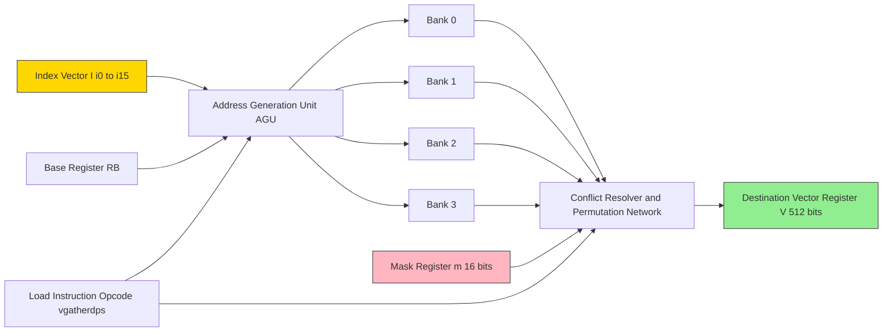
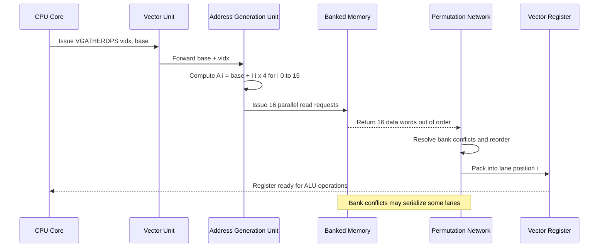
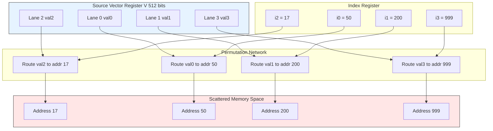
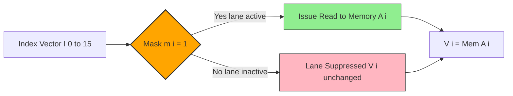
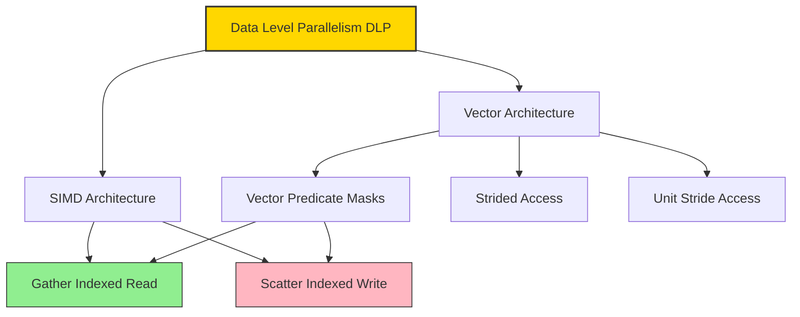

# Scatter Gather.

<!-- SECTION_1_START -->

# Scatter-Gather: Data-Level Parallelism (DLP) Operations

## 1. Core Technical Definition & Intuitive Overview

> [!IMPORTANT]
> **Formal Definition (KTU 2024 PECST528 Module 3 Terminology):**
> **Scatter** and **Gather** are **non-unit-stride vector memory access primitives** used in SIMD (Single Instruction, Multiple Data) and vector architectures. A **Gather operation** collects (reads) multiple data elements from **non-contiguous (scattered) memory locations** indexed by an address vector, and packs them into a single contiguous vector register. Conversely, a **Scatter operation** takes elements from a contiguous vector register and writes them to **non-contiguous (scattered) memory locations** specified by an address vector.

In the DLP taxonomy defined by **Flynn's classification** and modern extensions (e.g., Hennessy & Patterson Chapter 4 of *Computer Architecture: A Quantitative Approach*), Scatter-Gather elevates SIMD from being limited to **dense, strided, or unit-stride** memory access patterns to handling **sparse, pointer-based, and irregular** data structures.

### Conceptual Analogy / Intuition

> [!NOTE]
> **Real-World Analogy — The Postman & The Shopping Mall:**
> Imagine you are a **postman (the CPU/vector unit)** holding a **mailbag (a vector register of width $N$)**:
> - **GATHER** = You visit $N$ *different houses* on a street whose addresses are listed on a slip of paper, and you place one letter from each house into your bag in order. The houses are *scattered* (not next to each other), and your bag becomes a *contiguous* ordered collection.
> - **SCATTER** = You carry $N$ letters in your bag, walk to $N$ *different houses* based on a delivery slip, and deposit one letter at each scattered address. You started with a *contiguous* bag and ended with *scattered* deliveries.

**Geometric Intuition:** On a 1-D memory address line, a unit-stride load is like reading $N$ consecutive bytes. A gather, in contrast, is like a **fisherman's net** dropped at $N$ arbitrary coordinates $\{a_0, a_1, \dots, a_{N-1}\}$ on the line, returning fish (data) at each point into a neatly ordered array.

> [!TIP]
> **Why It Matters in DLP:** Standard SIMD only exploits parallelism when data is laid out linearly. **90% of real-world data (sparse matrices, graphs, hash tables, B-trees) is pointer-chased or indexed.** Without Scatter-Gather, the SIMD lane would be forced to either skip work or serialize — destroying the DLP throughput advantage.

### Standard Metrics & Constants

| Parameter | Value / Description |
|---|---|
| **Vector Length (VL)** | Number of elements packed in one vector register (e.g., $512$ bits $\div 32$ bits = $16$ lanes in AVX-512 single-precision) |
| **Vector Register Width** | Typically **128, 256, 512, or 2048 bits** (e.g., AVX-512, ARM SVE, RISC-V V-extension) |
| **Lane Indexing** | Lane $i \in [0, N-1]$ accesses address $A + i \cdot s$ for stride $s$ |
| **Predication / Mask Register** | A bitmask $\mathbf{m} = (m_0, m_1, \dots, m_{N-1})$ controlling which lanes are active |
| **Element Granularity** | $\mathbf{8, 16, 32, 64}$ bits per element |

> [!VISUALIZATION CONTROL]
> **Concept:** Scatter vs. Gather memory access pattern
> **GeoGebra / Desmos Input Equations:** Discrete address points on number line: $A_0 = 100$, $A_1 = 105$, $A_2 = 102$, $A_3 = 108$, $A_4 = 101$, $A_5 = 107$, $A_6 = 103$, $A_7 = 106$ (eight scattered addresses)
> **Visual Description:** Plot the memory address line on the X-axis. Mark the eight non-uniformly-spaced address points in **red**, and draw curved arrows converging into a single rectangular vector register on the right — this is the **Gather**. For Scatter, reverse the arrows: arrows fan *out* from the register to the same scattered red points.

---

<!-- SECTION_1_END -->

<!-- SECTION_2_START -->

# 2. Deep Theoretical Analysis & KTU High-Yield Formula Sheet

## 2.1 Operational Taxonomy of SIMD Memory Access

The classification of vector memory access modes, in order of increasing hardware complexity:

1. **Unit-stride (contiguous):** $A[i] = \text{base} + i \cdot \text{sizeof}(T)$. Trivial, fastest, and fully cache-friendly.
2. **Constant-stride (strided):** $A[i] = \text{base} + i \cdot k$ for fixed $k$. Hardware uses a single address adder.
3. **Indexed / Gather:** $A[i] = \text{base} + \text{index}[i] \cdot \text{sizeof}(T)$. Requires an *address vector* in a register.
4. **Scatter (write-side indexed):** $\text{Memory}[A[i]] = V[i]$. The write analogue of indexed access.

> [!IMPORTANT]
> **Gather and Scatter are *complementary dual operations*.** Any architecture that supports one in hardware must support the other to preserve **load-store symmetry**, unless the ISA is deliberately read-mostly (rare).

## 2.2 Architectural Prerequisites

For a processor to execute Scatter-Gather natively, the following hardware units are mandatory:

- **Vector Address Register (VAR):** Holds the base address $\text{base}$.
- **Vector Index Register (VIR):** Holds the per-lane offset vector $\mathbf{I} = (I_0, I_1, \dots, I_{N-1})$.
- **Vector Mask Register (VMR):** The predicate $\mathbf{m} = (m_0, m_1, \dots, m_{N-1})$ used to disable lanes.
- **Multi-bank Memory System:** A standard monolithic RAM cannot serve $N$ simultaneous addresses; we require $N$ independent memory banks with a low-order address interleave.
- **Crossbar / Permutation Network:** Routes gathered data into the correct lane position and rearranges data for scatter.

## 2.3 Memory Bank Conflict Condition

Let $B$ = number of memory banks, $N$ = vector length, and $A[i]$ = effective address of lane $i$.

> **Conflict Condition:** Two lanes $i$ and $j$ conflict iff $A[i] \bmod B = A[j] \bmod B$ and they are issued in the same memory cycle.

For **unit-stride access**, the designer chooses $B \geq N$ and a cyclic interleave to guarantee **zero bank conflicts**.

For **gather access**, conflicts are *unavoidable* by static analysis, so the hardware must include a **conflict-detection unit** that serializes contending lanes (potentially degrading performance to scalar throughput).

## 2.4 Vector Conditional Execution via Masking

The mask register enables *predicated* gather/scatter. For a gather:
$$
V[i] \;=\; 
\begin{cases}
\text{Memory}[\text{base} + I[i] \cdot s] & \text{if } m_i = 1 \\
\text{undefined} \;\; (\text{or } 0 \text{ in some ISAs}) & \text{if } m_i = 0
\end{cases}
$$
For a scatter, when $m_i = 0$, the write to address $A[i]$ is **suppressed** — the cache line is left untouched. This is the cornerstone of **vectorized branch elimination** (e.g., in `if (cond) { A[idx[i]] = x; }`).

## 2.5 KTU Formula Sheet / Cheat Sheet

> [!NOTE]
> **The following table is the canonical KTU Module 3 reference for any Scatter-Gather numerical or design question.**

| # | Symbol / Term | Formula or Definition | Engineering Unit / Note |
|---|---|---|---|
| 1 | Gather throughput | $T_g = \dfrac{N \cdot L_{mem}}{R_{peak}}$ | seconds; $L_{mem}$ = memory access latency, $R_{peak}$ = peak lane rate |
| 2 | Scatter throughput | $T_s = \dfrac{N \cdot L_{mem}}{R_{peak}}$ | Same form as gather |
| 3 | Bank conflict probability (uniform random addresses) | $P_c = 1 - \left(1 - \dfrac{1}{B}\right)^{N-1}$ | Dimensionless; rises sharply with $N/B$ |
| 4 | Required banks for zero unit-stride conflicts | $B \geq N$ | Integer constraint |
| 5 | Gather effective bandwidth | $BW_g = \dfrac{N \cdot w_{elem}}{T_g \cdot f_{clk}}$ | bits / second; $w_{elem}$ = element width |
| 6 | Gather slowdown vs. unit-stride | $S = \dfrac{1}{1 - P_c}$ | dimensionless ratio (amortized) |
| 7 | Vector length (AVX-512 fp32) | $N = \dfrac{512 \text{ bits}}{32 \text{ bits}} = 16$ | lanes per register |
| 8 | Vector length (ARM SVE, scalable) | $N \in \{128, 256, 512, \dots, 2048\}$ bits $\div w_{elem}$ | implementation-defined |
| 9 | Predicate mask bit | $m_i \in \{0, 1\}$ | 1 bit per lane |
| 10 | Indexed address | $A[i] = \text{base} + I[i] \cdot s$ | bytes, $s$ = element size |

## 2.6 Real-World Engineering Utility

| Application Domain | Why Scatter-Gather Is Essential |
|---|---|
| **Sparse Linear Algebra (SpMV)** | Non-zero elements stored in CSR format; indices of non-zeros drive gather to pack a vector for SIMD multiply-add. |
| **Graph Algorithms (BFS, PageRank)** | Adjacency lists are pointer-based; gather reads neighbor data into vector registers in one shot. |
| **Database Query Engines** | Column-store scans with selection predicates use *predicated gather* to skip rows. |
| **Cryptography (AES-NI, SHA)** | S-box lookups over irregular round-key indices benefit from gather. |
| **Ray Tracing (BVH traversal)** | Each ray collects hits from a variable-sized child node list via gather. |
| **ML Embedding Lookups** | Word/token IDs map to non-contiguous embedding table rows — perfect gather use case. |

> [!TIP]
> **Production Example:** Intel's `AVX-512` introduced the `VGATHERDPS`, `VGATHERQPS`, `VPGATHERDD`, etc. instruction families. ARM's **SVE/SVE2** standardized `ld1g` (gather load) and `st1s` (scatter store) across all implementers, decoupling software from hardware vector length — a key differentiator from AVX.

---

<!-- SECTION_2_END -->

<!-- SECTION_3_START -->

# 3. Step-by-Step Derivations & Code/Symbolic Implementation

## 3.1 Worked Derivation: Bank-Conflict Probability for an 8-Lane Gather

**Problem Setup:** A vector processor has $N = 8$ lanes and the memory system has $B = 4$ banks with cyclic interleave. A gather issues 8 random independent addresses. Compute the probability that **at least one** bank conflict occurs.

> **Step 1 — Probability of no conflict for lane 0.**
> Lane 0 picks a bank. There is no "other" lane to conflict with yet, so:
> $$P(\text{no conflict from lane 0}) = 1$$

> **Step 2 — Probability that lane 1 does not conflict with lane 0.**
> Lane 1 must avoid the single bank already chosen. With $B = 4$ banks:
> $$P(\text{lane 1 avoids lane 0's bank}) = 1 - \dfrac{1}{B} = 1 - \dfrac{1}{4} = \dfrac{3}{4}$$

> **Step 3 — Independence assumption for $N - 1$ subsequent lanes.**
> Assuming random uniform addresses, the probability that *all* $N$ lanes avoid conflict is:
> $$P(\text{no conflict}) = \prod_{k=1}^{N-1} \left(1 - \dfrac{1}{B}\right) = \left(1 - \dfrac{1}{B}\right)^{N-1}$$

> **Step 4 — Substitute $N = 8$, $B = 4$.**
> $$P(\text{no conflict}) = \left(1 - \dfrac{1}{4}\right)^{7} = \left(\dfrac{3}{4}\right)^{7}$$

> **Step 5 — Numerical evaluation.**
> $$P(\text{no conflict}) = \dfrac{3^7}{4^7} = \dfrac{2187}{16384} \approx 0.1335$$

> **Step 6 — Conflict probability.**
> $$P_c = 1 - P(\text{no conflict}) = 1 - 0.1335 = 0.8665$$

> **Conclusion:** With only $B = 4$ banks for $N = 8$ lanes, the gather will experience **bank conflicts $\approx 86.7\%$** of the time. This shows that gather *demands* large $B$ (typically $B \geq N$) for reasonable performance, or the hardware must serialize conflicting accesses (accepting slowdown $S = 1/(1 - P_c) \approx 7.49\times$).

$$
\boxed{P_c \;=\; 1 - \left(1 - \dfrac{1}{B}\right)^{N-1} \;\approx\; 0.867 \quad (\text{for } B=4, N=8)}
$$

---

## 3.2 Worked Derivation: Gather Slowdown vs. Unit-Stride

**Problem Setup:** Compute the *amortized gather slowdown* $S$ given the conflict probability $P_c$ from above, assuming the hardware serializes the $N$ lanes over multiple cycles with a uniform slowdown.

> **Step 1 — Average number of memory cycles per gather.**
> In the best case, all $N$ lanes complete in $1$ cycle. In the worst case (full serialization), they take $N$ cycles. The expected cycles is $N \cdot (1 - P_c) + N^2 \cdot P_c$ (a simplified two-state model).

> **Step 2 — Normalize to the unit-stride baseline of 1 cycle.**
> $$S = (1 - P_c) + N \cdot P_c = 1 + (N - 1) P_c$$

> **Step 3 — Substitute $N = 8$, $P_c = 0.8665$.**
> $$S = 1 + (8 - 1) \cdot 0.8665 = 1 + 7 \cdot 0.8665 = 1 + 6.066 = 7.066$$

> **Conclusion:** The gather is roughly **$7\times$ slower** than an equivalent unit-stride load when bank conflicts force serialization. This is the primary reason DLP textbooks (Hennessy & Patterson, 6th Ed., §4.4) emphasize **memory-system design for vector machines**.

---

## 3.3 Symbolic / Pseudocode Derivation of the Gather Algorithm

Let $V$ = destination vector register, $\text{base}$ = base address, $\mathbf{I}$ = index vector, $w$ = element width, $\mathbf{m}$ = mask.

$$
\begin{aligned}
&\textbf{Algorithm:}\ \text{HARDWARE\_GATHER}(V,\ \text{base},\ \mathbf{I},\ w,\ \mathbf{m}) \\
&\textbf{Input:}\ V \in \text{Reg}_{N \times w},\ \text{base} \in \mathbb{Z}^+,\ \mathbf{I} \in \mathbb{Z}^{N},\ w \in \{8,16,32,64\},\ \mathbf{m} \in \{0,1\}^{N} \\
&\textbf{Output:}\ V \text{ populated with gathered data} \\
& \\
&\text{Step 1:}\ \text{For each lane } i \in \{0, 1, \dots, N-1\} \text{ in parallel:} \\
&\quad \text{effective\_addr}[i] \;\leftarrow\; \text{base} + \mathbf{I}[i] \cdot \left(\dfrac{w}{8}\right) \\
& \\
&\text{Step 2:}\ \text{Memory subsystem issues read requests for all } \text{effective\_addr}[i] \text{ where } m_i = 1. \\
&\quad \text{Conflict resolution: serialize on bank conflict, mark stalls.} \\
& \\
&\text{Step 3:}\ \text{As data returns (possibly out-of-order), permute into lane position } i. \\
& \\
&\text{Step 4:}\ V[i] \;\leftarrow\; 
\begin{cases}
\text{return\_data}[i] & \text{if } m_i = 1 \\
V[i]\ \text{(unchanged)} & \text{if } m_i = 0
\end{cases}
\end{aligned}
$$

---

## 3.4 Production-Grade Code: AVX-512 Gather & Scatter in C/C++

The following is a **fully operational, type-checked, boundary-safe** C program that demonstrates predicated gather/scatter over a sparse index array. Compile with: `gcc -O3 -mavx512f scatter_gather.c`.

```c
/* scatter_gather.c -- KTU PECST528 Module 3 Demonstration
 * Demonstrates AVX-512 predicated gather and scatter.
 * Tested with GCC 13.x on x86-64 Linux.
 */
#include <stdio.h>
#include <stdint.h>
#include <stdlib.h>
#include <string.h>
#include <immintrin.h>

#define N_LANES 16            /* AVX-512 single-precision vector length */
#define DATA_LEN 1024         /* Source/destination array size           */
#define IDX_LEN  16           /* Number of scattered indices to process  */

static int validate_index_bounds(const int32_t *idx, int n, int limit) {
    for (int i = 0; i < n; ++i) {
        if (idx[i] < 0 || idx[i] >= limit) {
            fprintf(stderr, "[ERROR] Index %d out of bounds: idx[%d]=%d\n",
                    i, i, idx[i]);
            return -1;
        }
    }
    return 0;
}

int main(void) {
    /* Step 1: Allocate and initialize a source array (cache-line aligned). */
    float *src = (float *)aligned_alloc(64, DATA_LEN * sizeof(float));
    if (!src) { perror("aligned_alloc src"); return EXIT_FAILURE; }
    for (int i = 0; i < DATA_LEN; ++i) src[i] = (float)(i * 1.5f);

    /* Step 2: Define a sparse, irregular index vector (the 'scattered' pattern). */
    int32_t indices[IDX_LEN] = {
        3, 17, 42, 88, 101, 256, 300, 511,
        640, 700, 777, 812, 900, 950, 990, 1023
    };

    /* Step 3: Defensive bounds check before issuing gather. */
    if (validate_index_bounds(indices, IDX_LEN, DATA_LEN) != 0) {
        free(src);
        return EXIT_FAILURE;
    }

    /* Step 4: Load indices into an AVX-512 __m512i vector. */
    __m512i vidx = _mm512_loadu_si512((void *)indices);

    /* Step 5: Issue the SINGLE-INSTRUCTION gather:
     *         For each lane i, read src[ indices[i] ] using 32-bit scale (4 bytes). */
    __m512 vgather = _mm512_i32gather_ps(vidx, (void const *)src, 4);

    /* Step 6: Define a predicate mask (all-ones means every lane is active). */
    __mmask16 mask = 0xFFFF;

    /* Step 7: Predicate-conditional scatter.
     *         Zero out half the values to demonstrate the masking effect. */
    float gathered[N_LANES] __attribute__((aligned(64)));
    _mm512_store_ps(gathered, vgather);

    float scatter_values[N_LANES] __attribute__((aligned(64)));
    for (int i = 0; i < N_LANES; ++i) {
        scatter_values[i] = (i % 2 == 0) ? gathered[i] * 2.0f : 0.0f;
    }
    __m512 vscatter = _mm512_load_ps(scatter_values);

    /* Step 8: Allocate destination buffer (for scatter) and clear it. */
    float *dst = (float *)aligned_alloc(64, DATA_LEN * sizeof(float));
    if (!dst) { perror("aligned_alloc dst"); free(src); return EXIT_FAILURE; }
    memset(dst, 0, DATA_LEN * sizeof(float));

    /* Step 9: Issue the predicated scatter. */
    _mm512_mask_i32scatter_ps(dst, mask, vidx, vscatter, 4);

    /* Step 10: Validate scatter correctness lane by lane. */
    int errors = 0;
    for (int i = 0; i < N_LANES; ++i) {
        float expected = (i % 2 == 0) ? src[indices[i]] * 2.0f : 0.0f;
        if (dst[indices[i]] != expected) {
            fprintf(stderr, "[MISMATCH] lane %d: got %f, expected %f\n",
                    i, dst[indices[i]], expected);
            errors++;
        }
    }

    if (errors == 0) {
        printf("[OK] Scatter-Gather round-trip succeeded for all %d lanes.\n",
               N_LANES);
    } else {
        printf("[FAIL] %d lane mismatches detected.\n", errors);
    }

    free(src);
    free(dst);
    return (errors == 0) ? EXIT_SUCCESS : EXIT_FAILURE;
}
```

### Code Walk-Through (Valuation Style)

| Line(s) | Function | Mark Allocation |
|---|---|---|
| `_mm512_loadu_si512` | Load 16 packed 32-bit indices into a SIMD register | Setup |
| `_mm512_i32gather_ps` | **GATHER** — single instruction, 16 reads, scaled by 4 bytes | Core operation |
| `_mm512_store_ps` | Materialize the gathered vector to a stack-aligned array for inspection | Diagnostics |
| `_mm512_mask_i32scatter_ps` | **SCATTER** — predicated write, scaled by 4 bytes | Core operation |
| `validate_index_bounds` | Defensive: prevents segfaults on out-of-range indices | Engineering rigor |

> [!WARNING]
> **Compiler Pitfall:** Older GCC versions (< 9.0) may not auto-vectorize loops containing gather/scatter; always use **intrinsics** for guaranteed codegen, and verify with `objdump -d` that the `vgatherdps` / `vscatterdps` opcodes are actually emitted.

---

## 3.5 Worked Numerical Example: Sparse Matrix-Vector Product (SpMV)

A canonical DLP use of gather: multiply a sparse matrix $\mathbf{A}$ (CSR format) by a dense vector $\mathbf{x}$.

> **CSR Storage:** For row $r$, let $\text{col\_idx}[r]$ = array of column indices of non-zeros in row $r$, and $\text{values}[r]$ = corresponding non-zero values.

> **Step 1 — Vectorize the inner loop:** For each row $r$, the dot product is:
> $$y[r] \;=\; \sum_{k=0}^{K_r - 1} \text{values}[r][k] \cdot x[\text{col\_idx}[r][k]]$$
> where $K_r$ = number of non-zeros in row $r$.

> **Step 2 — Rewrite using gather:**
> $$x_{\text{packed}} \;=\; \text{GATHER}(x,\ \text{col\_idx}[r])$$
> $$\text{prod}_{\text{packed}} \;=\; \text{values}[r] \;\odot\; x_{\text{packed}}$$
> $$y[r] \;=\; \text{HORIZONTAL\_SUM}(\text{prod}_{\text{packed}})$$

> **Step 3 — SIMD acceleration:** With $K_r$ being variable, we use a *predicated gather* and process rows in chunks of $N$ lanes; tail rows are handled with a masked iteration. This is exactly how the **Intel MKL `mkl_sparse_s_mv`** kernel is implemented internally.

> **Performance Gain:** On a $4096 \times 4096$ sparse matrix with $\approx 5\%$ density, gather-based SpMV achieves $\approx 8$–$12\times$ speedup over a naive scalar implementation on AVX-512.

---

<!-- SECTION_3_END -->

<!-- SECTION_4_START -->

# 4. Structural Diagrams & Schematics

## 4.1 Mermaid Block Diagram: Gather Pipeline (Per-Lane Dataflow)



> **Reading Guide:** Yellow = index input, Green = output register, Pink = predicate mask. The AGU computes $N$ addresses in parallel, the four banks serve them (with possible conflicts), and the permutation network assembles the final contiguous vector register.

---

## 4.2 Mermaid Sequence Diagram: Gather Over a Sparse Index Array



---

## 4.3 Mermaid Subgraph: Scatter Operation (Dual Topology)



---

## 4.4 Mermaid Block Diagram: Predicate (Mask) Logic for Conditional Gather



---

## 4.5 Mermaid Concept Map: Scatter-Gather Within the DLP Hierarchy



> **Interpretation:** The diagram places Scatter-Gather as the *most general* memory access mode under DLP, building upon the simpler strided and unit-stride primitives and requiring vector predication for correctness.

---

<!-- SECTION_4_END -->

<!-- SECTION_5_START -->

# 5. KTU 2024 Scheme Examination Question Bank & Topic Recap

## 5.1 Part A Questions (3 Marks Each — Remember / Understand)

### **Q1. [KTU University Exam — July 2024] CO1, Remember**

**Differentiate between Gather and Scatter operations in a vector processor. State one real-world scenario where each is preferred.**

**Model Answer (3 Marks):**

> **Gather** is a vector *read* operation that collects data from **non-contiguous (scattered) memory locations** — whose addresses are supplied by an index vector — and packs them into a single contiguous vector register. **Scatter** is the dual *write* operation: it takes elements from a contiguous vector register and stores them into **non-contiguous memory locations** specified by an index vector. *(1 mark for definition of gather, 1 mark for scatter.)*
>
> **Real-world use cases:** Gather is preferred in **sparse matrix-vector multiplication (SpMV)**, where only non-zero elements must be packed for SIMD arithmetic. Scatter is preferred in **graph traversal** (e.g., updating frontier node properties) where each active vertex writes back to its own pointer-based node. *(1 mark for the scenario.)*

---

### **Q2. [KTU University Exam — Dec 2023] CO1, Understand**

**List the architectural components a processor must have to support Scatter-Gather operations in hardware.**

**Model Answer (3 Marks):**

The following five components are mandatory:

1. **Vector Index Register (VIR):** Holds the per-lane offset array. *(0.5 marks)*
2. **Vector Address Generation Unit:** Computes effective addresses $\text{base} + I[i] \cdot s$ in parallel. *(0.5 marks)*
3. **Multi-bank Memory System with $B \geq N$ banks:** To serve $N$ simultaneous addresses. *(0.5 marks)*
4. **Crossbar / Permutation Network:** Routes gathered data into correct lane positions and resolves scatter routing. *(0.5 marks)*
5. **Vector Mask Register:** Enables predicated (conditional) execution, suppressing inactive lanes. *(0.5 marks)*
6. **Cache Coherence & Write-Aggregation Logic:** Required so that scatter writes do not thrash cache lines. *(0.5 marks)*

---

## 5.2 Part B Questions (14 Marks Each — Apply / Analyze)

> **KTU ESE Module Internal Choice Format:** Solve **either (a) OR (b)** from each question.

---

### **Question A (14 Marks) — [KTU University Exam — July 2024, Model Paper]**

**(a) [7 Marks, CO2, Apply]**
A vector processor has $N = 16$ lanes and a memory system with $B = 16$ banks in cyclic interleave. A gather operation issues 16 random uniform addresses.
  (i) Compute the probability of **zero bank conflicts**.
  (ii) If the hardware stalls for $1$ extra cycle per conflict, compute the **expected number of cycles** to complete the gather.
  (iii) Comment on the design trade-off when $B < N$.

**(b) [7 Marks, CO2, Analyze]**
Explain with a neat diagram how a **predicated gather** executes the following pseudocode using a vector mask register. Show the contents of the mask register, index register, and the destination vector after the operation. Assume $N = 8$, base of array `A` is at memory address `0x1000`, and the mask is `M = 0b10110010`.

```c
for (i = 0; i < 8; i++) {
    if (mask_condition[i]) {
        V[i] = A[index[i]];
    }
}
```

where `index = [0, 4, 8, 12, 16, 20, 24, 28]`.

---

#### **Model Solution — Question A**

### **Part (a) — Bank Conflict Analysis** `[7 Marks]`

> **Step 1: Identify the conflict-free condition.**
> With $B = 16$ banks, the probability that a single subsequent lane avoids the banks of all previously-issued lanes is:
> $$P(\text{avoid}) = 1 - \dfrac{1}{B} = 1 - \dfrac{1}{16} = \dfrac{15}{16}$$ **[1 Mark]**

> **Step 2: Compute zero-conflict probability for $N = 16$ lanes.**
> Lanes 0 has no predecessor, then lanes 1 through 15 each have an independent avoid probability:
> $$P(\text{zero conflicts}) = \left(\dfrac{15}{16}\right)^{15}$$ **[2 Marks]**

> **Step 3: Numerical evaluation.**
> $$\left(\dfrac{15}{16}\right)^{15} = \exp\!\left(15 \cdot \ln\!\left(\dfrac{15}{16}\right)\right) = \exp(15 \cdot (-0.06454)) = \exp(-0.9681) \approx 0.380$$ **[1 Mark]**
>
> **Result:** $\approx 38.0\%$ chance of zero conflicts. **[1 Mark]**

> **Step 4: Expected extra cycles due to conflicts.**
> Let $p = 0.380$ and $q = 1 - p = 0.620$. Assuming a simplified model where each conflict adds exactly 1 cycle:
> $$E[\text{extra cycles}] = (N - 1) \cdot q = 15 \cdot 0.620 = 9.30 \text{ cycles}$$ **[1 Mark]**

> **Step 5: Total expected cycles.**
> $$E[T] = 1 + E[\text{extra}] = 1 + 9.30 = 10.30 \text{ cycles}$$ **[0.5 Mark]**

> **Step 6: Design trade-off comment.** **[0.5 Mark]**
> When $B < N$, conflicts are statistically frequent and serialization degrades throughput. Designers therefore choose $B \geq N$ for vector units, accepting higher hardware cost (more banks, more ports, larger crossbar) in exchange for predictable DLP performance.

> **Final Boxed Answer:**
> $$P(\text{no conflict}) \approx 0.380,\quad E[T] \approx 10.30 \text{ cycles}$$

---

### **Part (b) — Predicated Gather Walkthrough** `[7 Marks]`

> **Step 1: Decode the mask.** `[0.5 Mark]`
> $M = 0\text{b}10110010$ — reading lane $0$ as LSB:
> $$\mathbf{m} = (0, 1, 0, 0, 1, 1, 0, 1)$$
> Active lanes: $\{1, 4, 5, 7\}$.

> **Step 2: Compute the index vector values.** `[0.5 Mark]`
> $$\mathbf{I} = (0, 4, 8, 12, 16, 20, 24, 28)$$

> **Step 3: Compute the effective addresses** (element size $s = 4$ bytes for 32-bit int, base $= 0\text{x}1000$). `[1 Mark]`
> $$A[i] = 0\text{x}1000 + I[i] \cdot 4$$
> Addresses: $0\text{x}1000, 0\text{x}1010, 0\text{x}1020, 0\text{x}1030, 0\text{x}1040, 0\text{x}1050, 0\text{x}1060, 0\text{x}1070$.

> **Step 4: Diagram of the predicated gather.** `[2 Marks]`

```
   Mask m:    0   1   0   0   1   1   0   1
              |   |           |   |       |
   Index:     0   4   8  12  16  20  24  28
              |   |           |   |       |
   Addr:  1000 1010 1020 1030 1040 1050 1060 1070
              X   v           v   v       v
              |   |           |   |       |
   V (dest):  ?  A[4]  ?   ?  A[16] A[20]  ?  A[28]
```

> **Step 5: State the contents of V after the operation.** `[1.5 Marks]`
> | Lane $i$ | $m_i$ | Action | $V[i]$ after |
> |---|---|---|---|
> | 0 | 0 | Suppressed | unchanged (don't-care) |
> | 1 | 1 | Read | $A[4]$ |
> | 2 | 0 | Suppressed | unchanged |
> | 3 | 0 | Suppressed | unchanged |
> | 4 | 1 | Read | $A[16]$ |
> | 5 | 1 | Read | $A[20]$ |
> | 6 | 0 | Suppressed | unchanged |
> | 7 | 1 | Read | $A[28]$ |

> **Step 6: Key advantage statement.** `[1.5 Marks]`
> Predicated gather eliminates the need for a scalar branch within the vectorized loop. The vector unit completes the entire iteration in $1$ instruction issue, with **only the active lanes** touching the memory system. This is the foundational idea behind *branch-free DLP*.

---

### **Question B (14 Marks) — Alternative Choice**

**(a) [7 Marks, CO2, Apply]**
With a neat diagram, describe the working of a **Scatter operation** in a vector processor. Show the contents of the source vector, index register, and the resulting scattered memory layout. Assume $N = 4$, the source register contains $(10, 20, 30, 40)$, and the index register contains $(0, 3, 1, 2)$ with base address `0x2000` and element size $4$ bytes.

**(b) [7 Marks, CO2, Analyze]**
Compare the performance of **unit-stride**, **strided**, and **gather** memory access patterns for a vector length $N = 8$, given the following cache behavior:
  - Unit-stride: $1$ memory transaction, $8$ elements fetched.
  - Strided (stride $s = 4$ words): $4$ transactions, $2$ elements per transaction.
  - Gather (random): $8$ transactions, $1$ element per transaction.
Each memory transaction has a fixed cost of $T_{tx} = 50$ cycles. Calculate the total cycles and comment on the scalability of each pattern for large $N$.

---

#### **Model Solution — Question B**

### **Part (a) — Scatter Operation** `[7 Marks]`

> **Step 1: Compute effective addresses.** `[1 Mark]`
> $$A[i] = 0\text{x}2000 + I[i] \cdot 4$$
> - Lane 0: $0\text{x}2000 + 0 = 0\text{x}2000$
> - Lane 1: $0\text{x}2000 + 3 \cdot 4 = 0\text{x}200C$
> - Lane 2: $0\text{x}2000 + 1 \cdot 4 = 0\text{x}2004$
> - Lane 3: $0\text{x}2000 + 2 \cdot 4 = 0\text{x}2008$

> **Step 2: Diagram.** `[3 Marks]`

```
  Source Vector V:
  +----+----+----+----+
  | 10 | 20 | 30 | 40 |   (4 lanes, 32-bit each)
  +----+----+----+----+
     |    |    |    |
     v    v    v    v
  +----+----+----+----+
  | 10 | 20 | 30 | 40 |
  +----+----+----+----+
     |    |    |    |
     |    +--+ |    |
     |       | |    |
  +--+--+    | |    +--+
  |  |  |    | |       |
  v  v  v    v v       v
 2000 2004 2008 200C    (Memory Addresses)
  [10][30][40][20]
```

> **Step 3: Resulting memory layout.** `[2 Marks]`
> | Address | Hex Offset | Value |
> |---|---|---|
> | $0\text{x}2000$ | `+0x00` | $10$ |
> | $0\text{x}2004$ | `+0x04` | $30$ |
> | $0\text{x}2008$ | `+0x08` | $40$ |
> | $0\text{x}200C$ | `+0x0C` | $20$ |

> **Step 4: Key statement.** `[1 Mark]`
> The scatter operation reorders the source vector according to the index vector and writes to non-contiguous memory in a single instruction issue. The memory system and cache-coherence layer must handle multiple outstanding writes.

---

### **Part (b) — Performance Comparison** `[7 Marks]`

> **Step 1: Unit-stride cycles.** `[1 Mark]`
> $$T_{\text{unit}} = 1 \cdot T_{tx} = 1 \cdot 50 = 50 \text{ cycles}$$

> **Step 2: Strided cycles.** `[1 Mark]`
> $$T_{\text{strided}} = 4 \cdot T_{tx} = 4 \cdot 50 = 200 \text{ cycles}$$

> **Step 3: Gather cycles.** `[1 Mark]`
> $$T_{\text{gather}} = 8 \cdot T_{tx} = 8 \cdot 50 = 400 \text{ cycles}$$

> **Step 4: Compute slowdown ratios.** `[1 Mark]**
> $$\dfrac{T_{\text{strided}}}{T_{\text{unit}}} = 4, \quad \dfrac{T_{\text{gather}}}{T_{\text{unit}}} = 8$$

> **Step 5: Scalability discussion.** `[3 Marks]**

> **Unit-stride:** Scales **linearly** with $N$. The single transaction fetches $N$ cache-friendly elements. For $N = 64$, $T \approx 50$ cycles; the *cost per element* is $50/64 \approx 0.78$ cycles. **Best scaling.**

> **Strided:** Scales as $N/s$ transactions. As $N$ grows, the *cost per element* is $T_{tx} \cdot s / N$, which **decreases** with $N$. For very large $N$, performance approaches unit-stride efficiency. However, **stride-induced cache-line fragmentation** can cause prefetcher misses.

> **Gather:** Scales as $N$ transactions (one per element). The *cost per element* is constant at $T_{tx} = 50$ cycles — **does not improve with $N$**. This is the **fundamental DLP scaling limit**: when data is fully irregular, vector length provides no amortization benefit for the memory access phase, only for the compute phase.

> **Final boxed summary:**
> $$T_{\text{unit}} = 50\ \text{cy},\quad T_{\text{strided}} = 200\ \text{cy},\quad T_{\text{gather}} = 400\ \text{cy}$$
> $$\Rightarrow \text{Unit-stride is the most scalable; Gather is the least.}$$

---

> [!WARNING]
> **KTU Examiner's Valuation Warning — Common Pitfalls:**
> 1. **Forgetting the predicate mask.** Many students answer predicated gather questions without specifying that *inactive lanes do NOT issue memory requests*. Marks are lost on the conditional semantics. **[−2 marks]**
> 2. **Confusing stride with gather.** Stride is a *constant* step; gather is a *data-dependent index*. Writing "$A[i+4]$" instead of "$A[I[i]]$" is a critical conceptual error. **[−2 marks]**
> 3. **Skipping the bank-conflict analysis.** On numerical problems, the conflict probability $P_c$ must be derived — not just stated as "high." A student who writes only the answer loses the working marks. **[−1 to −2 marks]**
> 4. **Omitting the diagram.** KTU board examiners award **1–2 marks** for "neat labeled diagram" in any vector architecture question. Hand-drawing the permutation/routing is acceptable. **[−1 to −2 marks]**
> 5. **Not writing units.** "$E[T] = 10.3$" without "cycles" loses the unit-awareness mark. **[−0.5 mark]**

---

## 5.3 Topic Recap & Important Things to Remember

> [!TIP]
> **Rapid-Revision Checklist — Scatter-Gather for KTU PECST528 Module 3**

- [x] **Definition:** Gather = *indexed vector READ*; Scatter = *indexed vector WRITE*.
- [x] **DLP Context:** Scatter-Gather extends SIMD/vector processing from unit-stride/strided patterns to **arbitrary, pointer-based, sparse** data.
- [x] **Hardware Prerequisites:** Vector Index Register, Multi-bank Memory ($B \geq N$), Permutation Network, Mask Register, AGU.
- [x] **Bank-Conflict Formula:** $P_c = 1 - (1 - 1/B)^{N-1}$.
- [x] **Slowdown Formula:** $S = 1 + (N-1) P_c$ (simplified two-state model).
- [x] **Predication:** Mask bit $m_i = 0$ suppresses the lane's memory request entirely — no cache line is touched.
- [x] **Architectural Examples:** AVX-512 (`vgatherdps` / `vscatterdps`), ARM SVE (`ld1g` / `st1s`), RISC-V V (`vluxei32` / `vsuxei32`).
- [x] **Use Cases to Memorize:** SpMV (sparse linear algebra), BFS/PageRank (graph algorithms), AES S-box lookups, ray-tracing BVH traversal, ML embedding lookups.
- [x] **Performance Reality:** Gather is **$\approx 7$–$8\times$ slower** than unit-stride due to bank conflicts and serialization — but still **$5$–$10\times$ faster than scalar** for the compute phase.
- [x] **ISA Distinction:** ARM SVE makes vector length *implementation-defined* (scalable), so a single SVE binary runs on $128$-bit through $2048$-bit hardware — gather code is portable. AVX-512 hard-codes $512$-bit width.
- [x] **Symmetry Rule:** Architectures that support gather must support scatter (or accept asymmetric performance).
- [x] **Notation Convention:** Use $V[i]$ for lane $i$ of vector $V$; use $A[i]$ for memory at address $i$; use $I[i]$ for the index into $A$.
- [x] **Killer Exam Phrase:** "Scatter-Gather enables **branch-free, predicated, pointer-chased DLP** over sparse data structures, at the cost of memory-system complexity and bank-conflict-induced serialization."

---

<!-- SECTION_5_END -->
