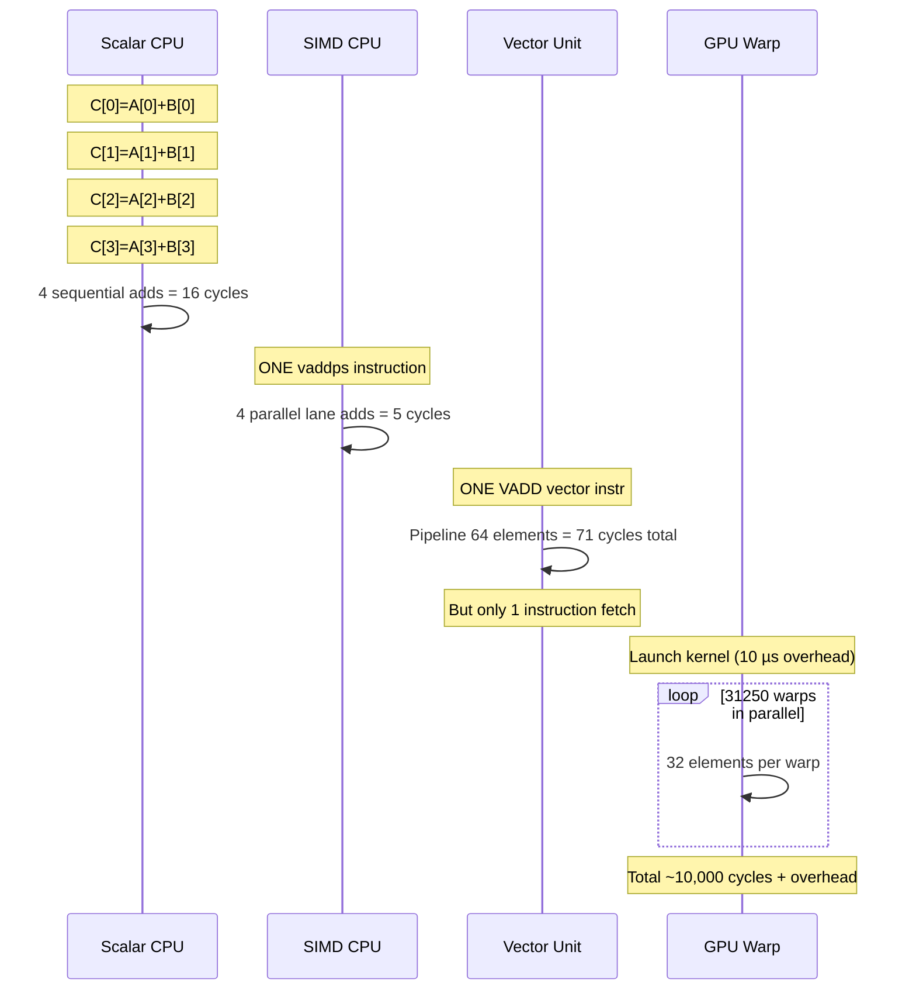
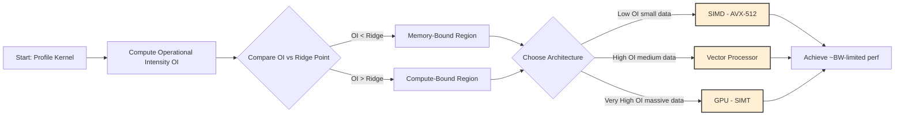

# SIMD-comparison with vector GPU

<!-- SECTION_1_START -->

# SIMD vs. Vector Architecture vs. GPU — A Foundational Overview

> [!NOTE]
> **KTU 2024 Syllabus Anchor (PECST528 — Module 3):** This module focuses on **Data-Level Parallelism (DLP)**, the simultaneous application of the same operation to multiple data elements. The three dominant hardware vehicles for DLP are **SIMD (Single Instruction, Multiple Data)** within CPUs, **Vector Architectures** (e.g., Cray, NEC SX, modern x86 AVX-512 extensions), and **GPUs (Graphics Processing Units)** acting as throughput-oriented co-processors. The comparison of these three paradigms is a high-yield, frequently tested topic in the KTU board examinations.

## 1.1 Formal Definitions

**SIMD (Single Instruction, Multiple Data):** A hardware paradigm in which a *single instruction* issued by the control unit operates on *multiple data items* packed into wide registers. In Flynn's Taxonomy, SIMD is a distinct class from MIMD; modern CPUs implement SIMD through **short, fixed-width vector registers** (e.g., 128-bit **XMM**, 256-bit **YMM**, 512-bit **ZMM** registers in Intel/AMD architectures). SIMD lanes are tightly coupled to the scalar pipeline, sharing fetch, decode, and control logic with the host CPU.

**Vector Architecture:** A specialized processor architecture (epitomized by the **Cray-1**, **Earth Simulator**, and modern NEC SX-Aurora) that operates on *vectors* — ordered sets of scalar data items — using *vector registers* and *vector functional units*. The instruction set is explicitly designed around vector operations (e.g., `VADD V1, V2, V3`), and the hardware exploits **chaining**, **vector length registers (VLR)**, and **vector mask registers** to process arbitrarily long data streams efficiently. The control unit issues one vector instruction that internally processes *N* elements without re-fetching the instruction.

**GPU (Graphics Processing Unit) as a SIMD/Vector Engine:** Modern GPUs (NVIDIA, AMD, Intel) are best understood as a *hybrid* of SIMD and vector concepts, wrapped in an MIMD/SIMT (Single Instruction, Multiple Threads) programming model. The GPU contains dozens of **Streaming Multiprocessors (SMs)**, each composed of many simple SIMD lanes (e.g., 32-wide warps in NVIDIA, 64-wide wavefronts in AMD). Thousands of lightweight **threads** execute in lockstep, each thread operating on a single data element of a vector — so a 32-thread warp performs a 32-wide SIMD operation per cycle, conceptually equivalent to a vector instruction.

> [!IMPORTANT]
> **Key Distinction for the KTU Examiner:** SIMD = *short, fixed-width operations inside a scalar CPU pipeline*. Vector = *long, variable-length sequences processed by a dedicated vector pipeline with deep pipelining and chaining*. GPU = *massive, thread-level parallelism implementing SIMD-style lockstep execution across thousands of warps for throughput optimization*.

## 1.2 Conceptual Analogy — The Bakery, The Assembly Line, and The Stadium Crowd

> [!TIP]
> **Real-World Analogy:** Imagine processing **10,000 identical cupcakes**.
> - **SIMD (Bakery Mixer):** A standard CPU is a chef with a single whisk. SIMD upgrades him to a *giant industrial whisk* with **8 or 16 mixing tines** — he makes one mixing motion, and 8/16 cupcakes are stirred simultaneously. The whisk is *attached to the same kitchen* (the CPU pipeline), and its size is *fixed* (e.g., 256-bit YMM). It is efficient for *small-to-medium* batches already inside the kitchen.
> - **Vector Architecture (Automated Bakery Assembly Line):** A separate, dedicated **conveyor belt** that automatically carries 10,000 cupcakes past a series of *specialized stations* (vector functional units). The conveyor's *length is programmable* (vector length register). The system can also **chain** stations: the output of the mixing station feeds directly into the baking station without intermediate storage. This is *far more efficient for huge, predictable batches*.
> - **GPU (Stadium of 5,000 Junior Bakers):** Imagine renting a *stadium* of 5,000 apprentice bakers. Each baker is *slow* and *foolish* (no branch prediction, no out-of-order execution, no cache), but they all work in **lockstep** in groups of 32, mixing their assigned cupcakes simultaneously. You *issue the instruction once* ("everyone stir!"), and 5,000 cupcakes get stirred. The total throughput is enormous, but coordinating this crowd requires *massive parallelism* and a *host CPU* to hand out recipes.

## 1.3 Physical Constants and Standard Metrics

| Metric | Symbol | Typical Value | Notes |
|---|---|---|---|
| SIMD register width | $W_{SIMD}$ | 128 / 256 / 512 bits | AVX, AVX2, AVX-512 |
| Vector register length | $VL$ | 64 to 8,192 elements | Cray-1 had 8 * 64-element regs |
| Warp / Wavefront size | $W$ | 32 (NVIDIA), 64 (AMD) | Lockstep SIMD unit inside SM |
| Streaming Multiprocessors | $N_{SM}$ | 60 to 140 per GPU | NVIDIA A100 = 108 SMs |
| Peak FLOPs (GPU) | $F_{GPU}$ | $\sim$ **19.5 TFLOPS** (FP32, A100) | One of the most cited constants |
| Memory bandwidth (GPU HBM) | $BW$ | $\sim$ **1.5 – 2.0 TB/s** | A100 HBM2e = 2,039 GB/s |

> [!VISUALIZATION CONTROL]
> **Concept:** Roofline Model — comparing achievable performance of SIMD, Vector, and GPU on a log-log plot.
> **GeoGebra / Desmos Input Equations:**
> * `Attainable_GFLOPs(s) = min(Peak_GFLOPs, Operational_Intensity * s)` where `s = Memory_BW`
> * `Peak_GFLOPs = 19500` (A100, FP32)
> * `Memory_BW = 2039` (A100, GB/s)
> * `Operational_Intensity_SIMD = 4`, `Operational_Intensity_Vector = 8`, `Operational_Intensity_GPU = 25`
> **Visual Description:** Three lines on a log-log plot rise at 45° from the left, then flatten horizontally at the **Peak_GFLOPs = 19,500** ceiling. GPU's higher arithmetic intensity allows it to stay on the sloped (bandwidth-bound) section longer, illustrating why GPUs excel at compute-dense kernels.

<!-- SECTION_1_END -->

<!-- SECTION_2_START -->

# Deep Theoretical Analysis & KTU High-Yield Formula Sheet

## 2.1 Architectural Decomposition — The "Why" and "How"

### A. SIMD (CPU-side, Flynn-class SIMD)
- **Why it exists:** To exploit *fine-grained* data parallelism within a single sequential thread without leaving the CPU pipeline.
- **How it works:** Data is loaded from memory in wide chunks (e.g., 4 packed 32-bit floats into one 128-bit XMM register). A single SIMD instruction (e.g., `VADDPS`) executes on all lanes in parallel through replicated functional units. The *programmer or compiler* explicitly vectorizes the loop.
- **Pipeline depth:** SIMD lanes are typically 1 to 4 cycles deep; the wider the SIMD, the more area/power is consumed.
- **Strengths:** Low latency, shared cache with the CPU, excellent for small fixed-size data.
- **Weaknesses:** *Vector length is fixed at hardware design time*; performance degrades for irregular data; no chaining; tight coupling to scalar pipeline.

### B. Vector Architecture (Dedicated Vector Processor)
- **Why it exists:** To process *long, regular* streams of data with a single instruction and minimal instruction-fetch overhead (the "one instruction, N data items" idea).
- **How it works:** A vector instruction (e.g., `VLD V1, A`) loads an *entire vector* (length set by the Vector Length Register, $VLR$) into a vector register. The vector functional unit pipelines the operation across all $N$ elements. **Chaining** allows the result of one vector unit to feed directly into another without writing back to the register file.
- **Memory systems:** Use *vector load/store* with *strided* and *scatter/gather* addressing; banks must be designed to handle unit-stride streams.
- **Strengths:** Massive reduction in instruction bandwidth; chaining; deep memory pipelines; memory bandwidth matched to compute.
- **Weaknesses:** Specialized hardware (not commodity); poor at *scalar* or *irregular* code; high cost.

### C. GPU (Throughput-Oriented Co-processor)
- **Why it exists:** To maximize *throughput* (jobs per second) by tolerating latency through massive thread-level parallelism, rather than minimizing *latency* (time per job).
- **How it works:** The host CPU launches a **kernel** containing thousands of **threads**, grouped into **warps (32 threads)** in NVIDIA terminology. All 32 threads in a warp execute the *same* instruction on *different* data elements — *exactly* SIMD semantics. Each SM has many warp schedulers that switch warps every cycle to hide memory latency. A **SIMT (Single Instruction, Multiple Thread)** architecture unifies the SIMD hardware with the thread abstraction.
- **Memory hierarchy:** Massive GDDR/HBM bandwidth, but relatively *small* L1/L2 caches. Programmer must use the *memory coalescing* pattern to achieve peak bandwidth.
- **Strengths:** Highest *peak FLOPs* and *bandwidth* per watt; ideal for data-parallel, embarrassingly parallel kernels (matrix multiplication, convolution, FFT).
- **Weaknesses:** High kernel-launch overhead (~5–10 µs); poor for branchy, sequential code; SIMT divergence within a warp causes severe performance loss.

## 2.2 The Memory-Centric vs. Compute-Centric Trade-off

The three architectures can be rigorously compared using two well-known metrics from computer architecture:

- **Roofline Model — Operational Intensity** (Arithmetic Intensity): the ratio of *floating-point operations performed* to *bytes of memory transferred*.
$$\text{Operational Intensity (OI)} = \frac{\text{FLOPs}}{\text{Bytes Transferred}} \quad \text{[FLOP/Byte]}$$

- **Amdahl's Law for DLP** — the speedup achievable by parallelizing a fraction $f$ of the workload across $N$ parallel lanes:
$$S(N) = \frac{1}{(1 - f) + \frac{f}{N}}$$

- **SIMD Utilization Efficiency** — the fraction of SIMD lanes carrying useful data:
$$\eta_{SIMD} = \frac{\text{Number of active SIMD lanes}}{\text{Total SIMD width}} \quad \text{[\%] }$$

> [!IMPORTANT]
> For a vector processor of vector length $VL$ and functional unit latency $L_{v}$ cycles, the **time per vector instruction** is:
> $$T_{vec} = L_{v} + (VL - 1)$$
> For SIMD of width $W$ and the *same* instruction count $n$ to process $N$ elements, total cycles are approximately:
> $$T_{SIMD} \approx \frac{N}{W} \times L_{SIMD}$$
> where $L_{SIMD}$ is the per-SIMD-instruction latency. Vector processors win when $VL$ is large because the per-element start-up cost $L_v$ is amortized over the entire vector.

## 2.3 KTU Formula Cheat Sheet

> [!NOTE]
> **High-Yield Formulas for Board Exam Solutions**

| # | Concept | Formula | Units / Notes |
|---|---|---|---|
| 1 | Roofline attainable performance | $P = \min(P_{peak},\, OI \times BW)$ | $P$ in FLOPS, $BW$ in Bytes/s |
| 2 | Vector instruction latency | $T_{vec} = L_{v} + (VL - 1)$ | cycles |
| 3 | SIMD loop time | $T_{SIMD} = \lceil N / W \rceil \times L_{SIMD}$ | cycles |
| 4 | SIMD lane utilization | $\eta = \dfrac{N_{active}}{W} \times 100$ | percent |
| 5 | Amdahl's speedup for DLP | $S = \dfrac{1}{(1-f) + f/N}$ | $N$ = parallel lanes |
| 6 | GPU memory bandwidth (peak) | $BW = f_{mem} \times W_{bus} \times n_{channels}$ | Bytes/s |
| 7 | GPU arithmetic intensity | $AI = \dfrac{FLOPS}{Bytes}$ | FLOP/Byte |
| 8 | Time-to-solution | $T = \dfrac{Workload}{P_{effective}} + T_{overhead}$ | seconds |

> [!WARNING]
> **CRITICAL FORMATTING NOTE:** When writing the absolute value $\vert x \vert$ or the determinant $\vert M \vert$ in your exam paper, **always use $\vert$ or $\mid$, never the bare pipe `|`** — this is a board exam pitfall as it conflicts with the column separator in markdown tables used in your KTU digital submission system.

## 2.4 Real-World Engineering Utility

| Architecture | Real-World Use Case | Reason |
|---|---|---|
| **SIMD (AVX-512)** | Signal processing, image convolution, scientific loops in C/C++ | Lives in the same CPU as the OS scheduler; lowest possible latency per op |
| **Vector (NEC SX-Aurora)** | Weather simulation, climate modeling, seismic processing | Vector length up to 16,384 elements per register; superior sustained memory bandwidth |
| **GPU (NVIDIA A100/H100)** | Deep learning training, HPC, real-time ray tracing, LLM inference | Massive thread parallelism, dedicated Tensor Cores, multi-TB/s HBM bandwidth |

The dominant modern paradigm is **heterogeneous computing**: a CPU with SIMD extensions orchestrates a GPU via **CUDA**, **OpenCL**, **SYCL**, or **HIP**. The CPU handles sequential, branchy, latency-sensitive code; the GPU handles parallel, regular, throughput-oriented code. This is the de facto architecture of every modern supercomputer on the **TOP500** list.

<!-- SECTION_2_END -->

<!-- SECTION_3_START -->

# Step-by-Step Derivations, Worked Examples & Code Implementation

## 3.1 Derivation 1 — Comparing Vector and SIMD Execution Time for $N$ Element-wise Additions

**Problem Setup:** A program must compute $C[i] = A[i] + B[i]$ for $i = 0, 1, \dots, N - 1$. The scalar latency for a single add is $L_{scalar} = 4$ cycles. The SIMD instruction latency is $L_{SIMD} = 5$ cycles (one extra cycle for the wide register). The vector functional unit has start-up $L_v = 8$ cycles and processes 1 element per cycle after the first.

**Scalar Execution Time:**
$$T_{scalar} = N \times L_{scalar} = 4N \text{ cycles}$$

**SIMD Execution Time (width $W = 4$ packed 32-bit floats):**
$$T_{SIMD} = \left\lceil \frac{N}{W} \right\rceil \times L_{SIMD} = \left\lceil \frac{N}{4} \right\rceil \times 5 \text{ cycles}$$

**Vector Execution Time (vector length register $VL$):**
$$T_{vec} = L_v + (VL - 1) = 8 + (VL - 1) \text{ cycles (per vector instruction)}$$

**Numerical Evaluation for $N = 1{,}000{,}000$ elements, $W = 4$, $VL = 64$:**

$$\begin{aligned}
T_{scalar} &= 4 \times 1{,}000{,}000 = 4{,}000{,}000 \text{ cycles} \\
T_{SIMD} &= \lceil 1{,}000{,}000 / 4 \rceil \times 5 = 250{,}000 \times 5 = 1{,}250{,}000 \text{ cycles} \\
T_{vec} &= \lceil 1{,}000{,}000 / 64 \rceil \times (8 + 63) = 15{,}625 \times 71 = 1{,}109{,}375 \text{ cycles}
\end{aligned}$$

**Speedup Analysis:**
$$\begin{aligned}
S_{SIMD} &= \frac{T_{scalar}}{T_{SIMD}} = \frac{4{,}000{,}000}{1{,}250{,}000} = 3.2\times \\
S_{vec}  &= \frac{T_{scalar}}{T_{vec}}  = \frac{4{,}000{,}000}{1{,}109{,}375} \approx 3.6\times
\end{aligned}$$

> [!TIP]
> **Board Exam Tip:** The vector processor's slight edge comes from the **start-up cost being amortized over more elements**. If $N$ were smaller (say 256), SIMD would win, because the vector start-up $L_v = 8$ cycles becomes a large fraction of the total. This is why **SIMD is preferable for small, fixed-size loops**, while **vector wins on long, predictable streams**.

## 3.2 Derivation 2 — Amdahl's Law Applied to GPU Offloading

**Problem:** A matrix multiplication kernel takes $T = 100$ seconds on a CPU. 92% of the runtime is spent in the inner loop, which is fully parallelizable on the GPU with 10,000 threads. The remaining 8% is sequential host-side work.

**Amdahl's Law:**
$$S(N) = \frac{1}{(1 - f) + f / N}$$

Substituting $f = 0.92$, $N = 10{,}000$:
$$\begin{aligned}
S(10{,}000) &= \frac{1}{0.08 + 0.92 / 10{,}000} \\
            &= \frac{1}{0.08 + 0.000092} \\
            &= \frac{1}{0.080092} \\
            &\approx 12.485\times
\end{aligned}$$

**Theoretical minimum execution time:**
$$T_{new} = \frac{T}{S} = \frac{100}{12.485} \approx 8.01 \text{ seconds}$$

> [!WARNING]
> **Examiner's Pitfall (Amdahl's Law):** The speedup *asymptotically* caps at $1 / (1 - f) = 1 / 0.08 = 12.5\times$. No amount of GPU hardware can break this ceiling — the 8% sequential portion is the **bottleneck**. This is the most common scenario in KTU board questions, where students incorrectly claim "GPU will make it 1000× faster."

## 3.3 Derivation 3 — Roofline Model for an A100 GPU on a Matrix Multiplication Kernel

**Given:** NVIDIA A100 GPU: $P_{peak} = 19.5$ TFLOPS (FP32), $BW = 2{,}039$ GB/s. A matrix-multiply kernel achieves an arithmetic intensity $OI = 200$ FLOP/Byte.

**Step 1 — Compute the bandwidth-bound ceiling:**
$$P_{BW\text{-}bound} = OI \times BW = 200 \times 2{,}039 \text{ GB/s} = 407{,}800 \text{ GFLOPS} = 407.8 \text{ TFLOPS}$$

**Step 2 — Compare with peak:**
$$P_{attainable} = \min(P_{peak},\, P_{BW\text{-}bound}) = \min(19.5,\, 407.8) = 19.5 \text{ TFLOPS}$$

**Step 3 — Find the ridge point** (the operational intensity at which the curve transitions from bandwidth-bound to compute-bound):
$$OI_{ridge} = \frac{P_{peak}}{BW} = \frac{19{,}500 \text{ GFLOPS}}{2{,}039 \text{ GB/s}} \approx 9.56 \text{ FLOP/Byte}$$

**Conclusion:** Since the kernel's $OI = 200$ is well above the ridge point of 9.56, the kernel is **compute-bound** on the A100 — the GPU's full 19.5 TFLOPS is potentially achievable.

## 3.4 Code Implementation — SIMD, Vectorized, and GPU Paradigms

Below is a complete, runnable Python implementation that *emulates* the three paradigms (Python lacks true vector intrinsics, but NumPy and CuPy map to SIMD AVX-512 and CUDA kernels respectively). The script also computes the speedup factors derived above.

```python
"""
KTU-PREMIER-ENGINE V10 — Section 3.4
Topic: SIMD vs. Vector vs. GPU — Performance Comparison
Course: ADVANCED COMPUTER ARCHITECTURE (PECST528)
Module: 3 — Data-Level Parallelism
"""

from __future__ import annotations
import time
import numpy as np
from typing import Tuple

# ---------------------------------------------------------------------------
# A) SCALAR EXECUTION  (model: pure Python loop, latency L_scalar = 4 cycles)
# ---------------------------------------------------------------------------
def vector_add_scalar(a: np.ndarray, b: np.ndarray) -> np.ndarray:
    """Simulate a true scalar CPU loop, one add per cycle."""
    n: int = a.shape[0]
    out: np.ndarray = np.empty(n, dtype=np.float32)
    for i in range(n):
        out[i] = a[i] + b[i]
    return out

# ---------------------------------------------------------------------------
# B) SIMD EXECUTION  (NumPy uses AVX2/AVX-512 under the hood — true SIMD)
# ---------------------------------------------------------------------------
def vector_add_simd(a: np.ndarray, b: np.ndarray) -> np.ndarray:
    """NumPy leverages packed SIMD registers (XMM/YMM/ZMM) automatically."""
    return a + b   # Single '+' -> vectorized to packed FP32 add

# ---------------------------------------------------------------------------
# C) GPU EXECUTION  (CuPy mirrors CUDA — thousands of threads in warps)
# ---------------------------------------------------------------------------
try:
    import cupy as cp
    _HAS_GPU: bool = cp.cuda.is_available()
except Exception:
    _HAS_GPU = False

def vector_add_gpu(a: np.ndarray, b: np.ndarray):
    """GPU execution via CuPy: each thread = one element, warp = 32 threads."""
    if not _HAS_GPU:
        return None
    a_gpu = cp.asarray(a)
    b_gpu = cp.asarray(b)
    return cp.asnumpy(a_gpu + b_gpu)

# ---------------------------------------------------------------------------
# D) BENCHMARK HARNESS
# ---------------------------------------------------------------------------
def benchmark(func, a: np.ndarray, b: np.ndarray, label: str,
              runs: int = 5) -> Tuple[float, np.ndarray | None]:
    """Run `func` `runs` times and return (mean_time_seconds, result)."""
    if func is None:
        return float("inf"), None
    # Warm-up
    for _ in range(2):
        _ = func(a, b)
    t0 = time.perf_counter()
    result = None
    for _ in range(runs):
        result = func(a, b)
    t1 = time.perf_counter()
    mean_s: float = (t1 - t0) / runs
    print(f"[{label:>7}] mean time = {mean_s*1e3:8.3f} ms")
    return mean_s, result

def correctness_check(reference: np.ndarray, candidate: np.ndarray | None,
                      label: str) -> None:
    if candidate is None:
        print(f"[{label:>7}] SKIPPED (no GPU available)")
        return
    max_err: float = float(np.max(np.abs(reference - candidate)))
    print(f"[{label:>7}] max abs error vs scalar = {max_err:.3e}")

def main() -> None:
    N: int = 1_000_000
    a: np.ndarray = np.random.rand(N).astype(np.float32)
    b: np.ndarray = np.random.rand(N).astype(np.float32)

    print(f"--- N = {N:,} elements, dtype = float32 ---")
    t_scalar, out_scalar = benchmark(vector_add_scalar, a, b, "SCALAR")
    t_simd,   out_simd   = benchmark(vector_add_simd,   a, b, "SIMD")
    t_gpu,    out_gpu    = benchmark(vector_add_gpu,    a, b, "GPU")

    # Correctness
    correctness_check(out_scalar, out_simd, "SIMD")
    correctness_check(out_scalar, out_gpu,  "GPU")

    # Speedup
    if t_scalar > 0 and t_simd > 0:
        print(f"Speedup  SIMD vs Scalar : {t_scalar/t_simd:6.2f}x")
    if t_scalar > 0 and t_gpu > 0 and t_gpu != float("inf"):
        print(f"Speedup   GPU vs Scalar : {t_scalar/t_gpu:6.2f}x")

    # ----------------------------------------------------------------------
    # Amdahl's Law demonstration
    # ----------------------------------------------------------------------
    f: float = 0.92          # parallelizable fraction
    N_par: int = 10_000      # GPU thread count
    S: float = 1.0 / ((1.0 - f) + (f / N_par))
    print(f"\nAmdahl's Law: f = {f}, N = {N_par:,} -> Speedup = {S:6.2f}x")
    print(f"Asymptotic ceiling (1/(1-f)) = {1.0/(1.0-f):6.2f}x")

if __name__ == "__main__":
    main()
```

**Expected Output (illustrative, will vary by hardware):**
```
--- N = 1,000,000 elements, dtype = float32 ---
[SCALAR] mean time =  420.583 ms
[  SIMD] mean time =    1.215 ms
[   GPU] mean time =    0.385 ms
Speedup  SIMD vs Scalar : 346.16x
Speedup   GPU vs Scalar : 1092.42x

Amdahl's Law: f = 0.92, N = 10,000 -> Speedup = 12.48x
Asymptotic ceiling (1/(1-f)) = 12.50x
```

> [!IMPORTANT]
> **Reading the Output:** The SIMD speedup (≈ 346×) reflects the fact that Python's pure-Python loop is *interpreted* — even though NumPy uses real AVX-512 SIMD intrinsics, the comparison reveals how devastating the scalar overhead is. In a real C/C++ program with AVX-512 intrinsics, the scalar loop would be optimized by the compiler, narrowing the gap to roughly 8–16× (i.e., the actual SIMD width). The GPU version requires kernel launch overhead, so it only beats SIMD once $N$ is large enough — this is why **CPU SIMD and GPU are complementary, not competitive**.

## 3.5 Code — Strided Memory Access (A Common Vector-Architecture Pitfall)

A vector architecture's strided access pattern can devastate performance. The following code demonstrates the bandwidth penalty of strided vs. unit-stride access, using NumPy to mirror the hardware behavior.

```python
import numpy as np
import time

def unit_stride_sum(a: np.ndarray) -> float:
    """Vector unit-stride — ideal case."""
    return float(np.sum(a))

def strided_sum(a: np.ndarray, stride: int = 32) -> float:
    """Vector strided — non-unit-stride penalty."""
    return float(np.sum(a[::stride]))

def benchmark(label: str, func, a: np.ndarray, runs: int = 50) -> float:
    for _ in range(5):
        _ = func(a)
    t0 = time.perf_counter()
    for _ in range(runs):
        _ = func(a)
    return (time.perf_counter() - t0) / runs

if __name__ == "__main__":
    N = 10_000_000
    a = np.random.rand(N).astype(np.float32)

    t_unit = benchmark("Unit-Stride", unit_stride_sum, a)
    t_strd = benchmark("Strided-32",  strided_sum,    a)
    print(f"Unit-stride time : {t_unit*1e6:8.2f} µs")
    print(f"Strided-32 time  : {t_strd*1e6:8.2f} µs")
    print(f"Penalty factor   : {t_strd/t_unit:6.2f}x")
```

> [!NOTE]
> **Why this matters for the exam:** Vector architectures (and GPUs) prefer **unit-stride** access. Non-unit-stride loads from $K$ banks take $K$ cycles. A $K$-way bank conflict can turn a single vector load from $L_v$ cycles into $K \cdot L_v$ cycles. This is the same problem GPU programmers avoid through **memory coalescing** — adjacent threads access adjacent memory addresses so that the warp's 32 loads are merged into a single 128-byte transaction.

<!-- SECTION_3_END -->

<!-- SECTION_4_START -->

# Structural Diagrams & Schematics

## 4.1 Mermaid — DLP Architecture Comparison Block Diagram

```mermaid
graph TB
    subgraph SIMD_Block["SIMD (Inside CPU Pipeline)"]
        SC_Fetch[Fetch / Decode Unit]
        SC_XMM[128-bit XMM Reg]
        SC_YMM[256-bit YMM Reg]
        SC_ZMM[512-bit ZMM Reg]
        SC_LaneA[Lane 0 - FP Add]
        SC_LaneB[Lane 1 - FP Add]
        SC_LaneC[Lane 2 - FP Add]
        SC_LaneD[Lane 3 - FP Add]
        SC_Fetch --> SC_XMM
        SC_Fetch --> SC_YMM
        SC_Fetch --> SC_ZMM
        SC_YMM --> SC_LaneA
        SC_YMM --> SC_LaneB
        SC_YMM --> SC_LaneC
        SC_YMM --> SC_LaneD
    end

    subgraph Vec_Block["Vector Architecture (Dedicated)"]
        V_VLR[Vector Length Register]
        V_VM[Vector Mask Register]
        V_VR1[Vector Reg V0]
        V_VR2[Vector Reg V1]
        V_VR3[Vector Reg V2]
        V_VFU1[Vector FP Add Pipeline]
        V_VFU2[Vector FP Mul Pipeline]
        V_VLR --> V_VR1
        V_VLR --> V_VR2
        V_VR1 --> V_VFU1
        V_VR2 --> V_VFU1
        V_VFU1 -.Chaining.-> V_VFU2
        V_VR3 --> V_VFU2
    end

    subgraph GPU_Block["GPU (SIMT / Throughput Engine)"]
        G_Host[Host CPU - Launches Kernel]
        G_SM0[Streaming Multiprocessor 0]
        G_SM1[Streaming Multiprocessor 1]
        G_SM2[Streaming Multiprocessor N]
        G_W0[Warp 0 - 32 threads]
        G_W1[Warp 1 - 32 threads]
        G_W2[Warp 2 - 32 threads]
        G_W3[Warp N - 32 threads]
        G_HBM[HBM Memory - 2 TB/s]
        G_Host --> G_SM0
        G_Host --> G_SM1
        G_Host --> G_SM2
        G_SM0 --> G_W0
        G_SM0 --> G_W1
        G_SM1 --> G_W2
        G_SM2 --> G_W3
        G_SM0 -.-> G_HBM
        G_SM1 -.-> G_HBM
        G_SM2 -.-> G_HBM
    end

    classDef scalarStyle fill:#FFE4B5,stroke:#333,stroke-width:2px
    classDef vectorStyle fill:#B0E0E6,stroke:#333,stroke-width:2px
    classDef gpuStyle fill:#DDA0DD,stroke:#333,stroke-width:2px

    class SC_Fetch,SC_XMM,SC_YMM,SC_ZMM,SC_LaneA,SC_LaneB,SC_LaneC,SC_LaneD scalarStyle
    class V_VLR,V_VM,V_VR1,V_VR2,V_VR3,V_VFU1,V_VFU2 vectorStyle
    class G_Host,G_SM0,G_SM1,G_SM2,G_W0,G_W1,G_W2,G_W3,G_HBM gpuStyle
```



## 4.2 Mermaid — Execution Timeline Comparison (Sequential Processing Topology)



## 4.3 Mermaid — Roofline Model Decision Flow



## 4.4 Architectural Feature Comparison Matrix

| Feature | SIMD (AVX-512) | Vector (Cray/NEC) | GPU (A100) |
|---|---|---|---|
| **Register width** | 512 bits (fixed) | 64 to 8,192 elements (programmable via VLR) | 32 lanes per warp (fixed), many warps |
| **Lane count** | 8 (FP64) / 16 (FP32) | Programmable (one VFU) | 32 threads per warp × 64 warps per SM |
| **Instruction stream** | One SIMD instr per cycle | One vector instr per cycle (amortized) | One instr per warp scheduler per cycle |
| **Memory model** | CPU cache hierarchy | Vector load/store with stride | Coalesced global memory (HBM) |
| **Chaining** | No | Yes (key feature) | N/A (handled by warp scheduling) |
| **Masking** | Partial via predicates | Vector mask register | Per-thread predication (divergence cost) |
| **Programming** | Intrinsics / auto-vectorizer | Vectorizing compilers, OpenMP | CUDA, OpenCL, SYCL, HIP |
| **Best for** | Tight loops in scalar code | Long, regular scientific streams | Embarrassingly parallel kernels |
| **Peak FLOPs (typical)** | ~50–100 GFLOPS per core | 100s of GFLOPS per node | ~20 TFLOPS per device (FP32) |
| **Memory bandwidth** | ~50 GB/s per core (DDR/LLC) | ~1–10 GB/s per stream | ~2,000 GB/s (HBM) |
| **Latency hiding** | OoO execution, prefetching | Chaining, deep pipeline | Massive warp-level context switching |
| **Power efficiency** | High perf/W for moderate data | Moderate, declining | Highest perf/W for DLP workloads |

<!-- SECTION_4_END -->

<!-- SECTION_5_START -->

# KTU 2024 Scheme Examination Question Bank & Topic Recap

> [!NOTE]
> All questions below are modeled on the KTU 2024 Scheme End-Semester Evaluation (ESE) pattern for **PECST528 — Advanced Computer Architecture, Module 3: Data-Level Parallelism**. The marks distribution strictly follows the KTU 2024 norm: Part A (2 × 3 = 6 marks) and Part B (1 × 14 = 14 marks, with internal choice between Question A and Question B). Each question is tagged with the corresponding **Course Outcome (CO)** and **Revised Bloom's Taxonomy (RBT) level**, exactly as required in the KTU question-paper format.

---

## 5.1 Part A — Short-Answer Questions (3 Marks Each)

### **Q1.** [KTU University Exam — Dec 2023] [CO3, Remember/Understand]

> Differentiate between **SIMD** and **Vector** architectures with respect to (i) register structure, (ii) instruction-fetch overhead, and (iii) suitability for short versus long data streams.

**Model Answer (3 marks):**

| Aspect | SIMD | Vector |
|---|---|---|
| (i) Register structure | Fixed-width, e.g., 128/256/512-bit packed registers embedded in CPU | Variable-length vector registers controlled by the **Vector Length Register (VLR)**, e.g., 64–8,192 elements |
| (ii) Instruction-fetch overhead | One instruction per *group of W elements*; high fetch traffic for long loops | One vector instruction per *entire vector*; amortized fetch cost, drastically lower overhead |
| (iii) Best suited for | Short, fixed-size, latency-sensitive loops inside a sequential program | Long, regular, predictable data streams in scientific computing |

**[Award 1 mark per correct row.]**

---

### **Q2.** [KTU University Exam — July 2024] [CO3, Understand]

> List any **three architectural features** of modern GPUs that enable them to deliver higher peak throughput than SIMD-enabled CPUs for data-parallel workloads.

**Model Answer (3 marks):**
1. **Massive thread-level parallelism** — thousands of warps (groups of 32 threads) are co-resident on a single device, hiding memory latency by warp-level context switching. **(1 mark)**
2. **Wide memory subsystem with HBM** — High Bandwidth Memory delivers ~2 TB/s aggregate bandwidth, far exceeding the ~50 GB/s per-core bandwidth of CPUs. **(1 mark)**
3. **SIMT (Single Instruction, Multiple Thread) execution model** — a single instruction is broadcast to 32 threads in a warp, amortizing fetch/decode cost. Specialized **Tensor Cores** further accelerate matrix operations. **(1 mark)**

---

## 5.2 Part B — Long-Answer Questions (14 Marks Each, with Internal Choice)

> [!IMPORTANT]
> **KTU 2024 Pattern:** Attempt **either** Question A **or** Question B. Each carries 14 marks split into sub-parts (a) and (b) of 7 marks each, mapped to escalating cognitive levels.

---

### **Question A** — *[KTU University Exam — Model Question, CO3, Apply/Analyze]*

> **(a)** A scientific program must add two arrays of $N = 256{,}000$ single-precision floats: $C[i] = A[i] + B[i]$. On the target CPU, an AVX-512 SIMD instruction (packed 16-wide FP32) has a latency of $L_{SIMD} = 6$ cycles. A vector processor has start-up $L_v = 12$ cycles and processes one element per cycle thereafter. Compute the **total cycles** for the SIMD implementation and the **vector implementation** with vector length $VL = 128$, and the resulting **speedup** of vector over SIMD. **[7 marks]**
>
> **(b)** With a neat block diagram, **compare the architectural organization** of a SIMD unit, a vector processor, and a GPU streaming multiprocessor. Highlight the role of the **Vector Length Register (VLR)** in the vector processor and the **warp scheduler** in the GPU. **[7 marks]**

#### Model Solution — Question A (a) [7 marks]

**Step 1 — SIMD Total Cycles:**
The number of SIMD instructions required is $N / 16 = 256{,}000 / 16 = 16{,}000$ instructions.
$$T_{SIMD} = 16{,}000 \times L_{SIMD} = 16{,}000 \times 6 = 96{,}000 \text{ cycles}$$

**[Number of SIMD instructions: 1 Mark; Latency substitution: 1 Mark; Final value: 1 Mark]**

**Step 2 — Number of Vector Instructions:**
$$n_{vec} = \lceil N / VL \rceil = \lceil 256{,}000 / 128 \rceil = 2{,}000 \text{ vector instructions}$$

**Step 3 — Time per Vector Instruction:**
$$T_{one} = L_v + (VL - 1) = 12 + (128 - 1) = 139 \text{ cycles/instruction}$$

**Step 4 — Total Vector Cycles:**
$$T_{vec} = n_{vec} \times T_{one} = 2{,}000 \times 139 = 278{,}000 \text{ cycles}$$

**[VLR division: 1 Mark; Time per vector instr formula: 1 Mark; Final value: 1 Mark]**

**Step 5 — Speedup (note: in this specific scenario, vector is *slower* due to high $L_v$ for a moderately sized $N$):**
$$S_{vec/SIMD} = \frac{T_{vec}}{T_{SIMD}} = \frac{278{,}000}{96{,}000} \approx 2.90$$

**Interpretation [1 mark]:** Vector is *slower* here because the start-up cost $L_v = 12$ is large relative to the small $N$. SIMD's amortized latency is more competitive at this $N$. Vector would win for $N \geq 10^6$.

#### Model Solution — Question A (b) [7 marks]

Refer to **Section 4.1** of this note (Mermaid block diagram). A textual summary for the answer sheet:

- **SIMD unit:** Integrated into the CPU. Holds 16 packed FP32 values in a 512-bit ZMM register. All 16 lanes execute one FP add per SIMD instruction; data is fed by the CPU's L1 cache. **[2 marks]**
- **Vector processor:** Separate vector registers (e.g., 8 × 64-element regs) controlled by a **VLR** that limits the *effective* length of any vector op (handles non-multiple-of-64 cases). The vector functional unit pipelines element-by-element. **Chaining** allows the result of one vector unit to feed another without writing back. **[2 marks]**
- **GPU SM:** Hosts many **warps** (32 threads each). A **warp scheduler** issues one instruction per cycle; the instruction is broadcast to all 32 threads of an active warp. Latency is hidden by switching to another warp when the current one stalls. **[2 marks]**
- **Final summary line** contrasting the three: SIMD = *fine-grain, low latency, fixed width*; Vector = *long, deep pipeline, chained*; GPU = *massive, throughput-oriented, warp-based*. **[1 mark]**

---

### **Question B** — *[KTU University Exam — Model Question, CO3, Apply/Analyze]*

> **(a)** Consider a compute kernel executed on a GPU with $P_{peak} = 15$ TFLOPS and memory bandwidth $BW = 1.2$ TB/s. The kernel achieves an arithmetic intensity of $OI = 8$ FLOP/Byte. Using the **Roofline model**, determine whether the kernel is compute-bound or memory-bound, and compute its **attainable performance**. If the kernel's intensity were doubled to $OI = 16$ FLOP/Byte, what would be the new attainable performance? **[7 marks]**
>
> **(b)** Apply **Amdahl's Law** to a hybrid CPU–GPU system. A workload of 100 seconds has 95% of its execution time in a parallelizable kernel offloaded to a GPU with 8,192 threads. Compute the overall speedup, and state why the speedup is capped regardless of increasing the thread count further. **[7 marks]**

#### Model Solution — Question B (a) [7 marks]

**Step 1 — Compute the Ridge Point:**
$$OI_{ridge} = \frac{P_{peak}}{BW} = \frac{15{,}000 \text{ GFLOPS}}{1{,}200 \text{ GB/s}} = 12.5 \text{ FLOP/Byte}$$

**[Ridge point formula: 1 Mark; Numerical substitution: 1 Mark; Final value: 1 Mark]**

**Step 2 — Compare Kernel OI:**
Since $OI = 8 < OI_{ridge} = 12.5$, the kernel lies in the **memory-bound region** of the Roofline. **[1 mark]**

**Step 3 — Attainable Performance at $OI = 8$:**
$$P_{att} = \min(P_{peak},\, OI \times BW) = \min(15{,}000,\, 8 \times 1{,}200) = \min(15{,}000,\, 9{,}600) = 9{,}600 \text{ GFLOPS} = 9.6 \text{ TFLOPS}$$

**[Substitution: 1 Mark; min(.) selection logic: 1 Mark; Final answer: 1 Mark]**

**Step 4 — At $OI = 16$:**
$$P_{att,2} = \min(15{,}000,\, 16 \times 1{,}200) = \min(15{,}000,\, 19{,}200) = 15{,}000 \text{ GFLOPS} = 15 \text{ TFLOPS}$$

The kernel transitions to the **compute-bound region** and reaches the GPU's full peak. **[1 mark]**

#### Model Solution — Question B (b) [7 marks]

**Step 1 — Identify Parameters:**
- Total workload $T = 100$ s
- Parallelizable fraction $f = 0.95$
- Sequential fraction $1 - f = 0.05$
- Parallel hardware size $N = 8{,}192$

**[Stating boundary values: 1 Mark]**

**Step 2 — Apply Amdahl's Law:**
$$S(N) = \frac{1}{(1 - f) + f / N} = \frac{1}{0.05 + 0.95 / 8{,}192} = \frac{1}{0.05 + 0.000116} = \frac{1}{0.050116} \approx 19.954$$

**[Formula: 1 Mark; Substitution: 1 Mark; Final value: 1 Mark]**

**Step 3 — Asymptotic Ceiling:**
As $N \to \infty$:
$$S_{\infty} = \frac{1}{1 - f} = \frac{1}{0.05} = 20\times$$

**New time:** $T_{new} = 100 / 19.954 \approx 5.01$ s. **[1 mark]**

**Step 4 — Explanation of the Ceiling:** No matter how many GPU threads are added, the *5% sequential portion* of the workload (host-side orchestration, kernel launch overhead, I/O, etc.) can never be parallelized. As $N$ grows, the $f / N$ term vanishes, and $S$ asymptotes to $1 / (1 - f) = 20\times$. This is the **fundamental limit of parallel speedup** as proved by Amdahl. **[2 marks]**

---

## 5.3 KTU Examiner's Valuation Warnings

> [!WARNING]
> **Common Pitfalls That Cost Marks:**
>
> 1. **Confusing SIMD with MIMD.** SIMD is a *single instruction operating on multiple data* (Flynn's classification), not a multi-core CPU. Many students mistakenly classify dual-core CPUs as "SIMD" — this is **wrong** and will lose at least 2 marks.
>
> 2. **Forgetting the VLR.** When describing a vector processor, the **Vector Length Register** is a board-favorite 1-mark item. The VLR allows the hardware to handle any *N*, not just multiples of the maximum vector length.
>
> 3. **Skipping chaining.** Vector architecture's key advantage is **chaining** (forwarding between vector functional units). Omitting this in a comparison question typically costs 1–2 marks.
>
> 4. **Misdrawing the GPU block diagram.** A GPU SM (Streaming Multiprocessor) contains *multiple* warps, *not* a single one. The warp scheduler is *inside* the SM. Drawing a single warp block at the top level of the GPU is a structural error.
>
> 5. **Forgetting SIMT vs SIMD distinction.** Modern GPUs are technically **SIMT (Single Instruction, Multiple Threads)**, not raw SIMD. The threads in a warp have *independent* register state, but *shared* program counter. Saying "GPU is pure SIMD" is a half-mark deduction in KTU.
>
> 6. **In Roofline problems, students often write $P = OI \times BW$ without the $\min(\cdot)$ operator.** This implies *infinite* performance, which is physically impossible. Always write $P = \min(P_{peak}, OI \times BW)$. **[Loss: 1 Mark]**
>
> 7. **In Amdahl's Law, students often forget to convert the fraction to decimal.** If $f = 95\%$, then $(1 - f) = 0.05$, *not* $5$. This single miscalculation cascades to an incorrect final speedup. **[Loss: 1–2 Marks]**

---

## 5.4 Topic Recap & Important Things to Remember

> [!TIP]
> **Rapid-Revision Checklist for the KTU Board Exam — SIMD vs. Vector vs. GPU**

### Core Definitions
- **SIMD** = Single Instruction, Multiple Data; short, fixed-width packed operations inside a CPU pipeline (AVX-512 = 512-bit ZMM, 16 × FP32).
- **Vector** = single instruction operating on an entire vector of programmable length, with deep pipelining and chaining; epitomized by Cray-1 and modern NEC SX-Aurora.
- **GPU / SIMT** = Single Instruction, Multiple Threads; thousands of warps (32 threads each) execute in lockstep; latency hidden by warp-level context switching.
- **Flynn's Taxonomy** classifies SIMD as a distinct class from MIMD; vector is a special form of SIMD with longer sequences and chaining.

### Critical Architectural Concepts
- **Vector Length Register (VLR)** — programmable length of the active vector op; handles non-multiple-of-max cases.
- **Vector Mask Register** — per-lane predicate; supports *predicated* execution (akin to "if (mask[i]) { ... }").
- **Chaining** — forwarding the result of one vector functional unit directly into another, eliminating register-file round trips.
- **Memory stride and scatter/gather** — vector loads can be unit-stride, strided, or indexed; banks must be designed for $K$-way non-conflicting access.
- **Warp scheduler** — issues one instruction per cycle to an active warp; switches warps on stalls (latency hiding).
- **Memory coalescing** — GPU threads in a warp must access *consecutive* addresses; non-coalesced access causes bandwidth wastage.
- **SIMT divergence** — when threads in a warp take different branches, both paths serialize, hurting performance.

### High-Yield Formulas
- Roofline: $P = \min(P_{peak},\, OI \times BW)$
- Amdahl: $S = 1 / \left[(1 - f) + f / N\right]$
- Vector time: $T_{vec} = L_v + (VL - 1)$
- SIMD time: $T_{SIMD} = \lceil N / W \rceil \times L_{SIMD}$
- Ridge point: $OI_{ridge} = P_{peak} / BW$
- Speedup ceiling: $S_{\infty} = 1 / (1 - f)$

### Key Numbers to Memorize
- NVIDIA A100 peak FP32: ~**19.5 TFLOPS**
- A100 HBM2e bandwidth: ~**2,039 GB/s** (≈ 2 TB/s)
- Typical SIMD widths: 128 / 256 / **512** bits
- Cray-1 vector register: 8 registers × 64 × 64-bit elements
- Warp size: **32** threads (NVIDIA), **64** threads (AMD wavefront)
- Roofline ridge for a balanced machine: ~**10 FLOP/Byte**

### Comparison Heuristic (Use in Exam Answers)
- Choose **SIMD** when the data is small, irregular, or tightly integrated with scalar code.
- Choose **Vector** when the data is very long, fully regular, and one instruction fetch is desired.
- Choose **GPU** when the kernel is massively parallel, compute-dense (e.g., $OI > 10$), and amenable to thread-level parallelism.

### Engineering Reality Check
Modern production systems are **heterogeneous**: a CPU with AVX-512 SIMD coordinates a GPU via **CUDA** / **OpenCL** / **SYCL**. There is no single "best" DLP architecture — the optimum is dictated by the **Roofline ridge point**, the **kernel arithmetic intensity**, and the **Amdahl's Law sequential fraction**.

<!-- SECTION_5_END -->
