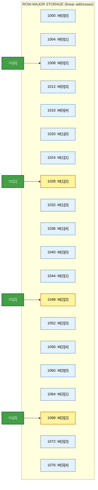
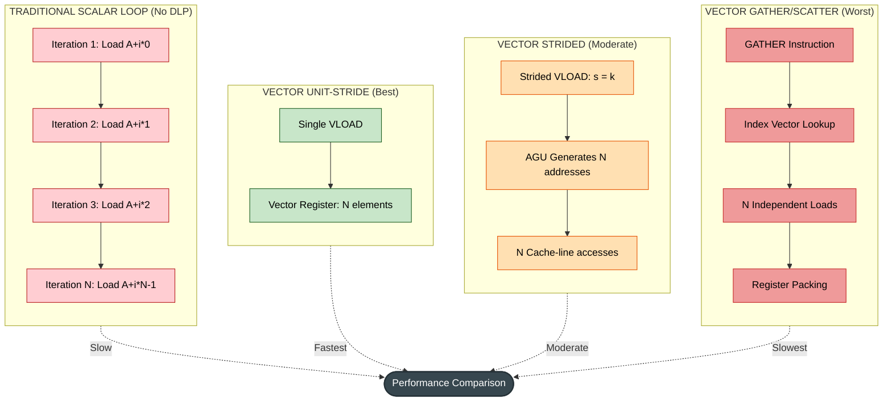

# Stride

<!-- SECTION_1_START -->
# STRIDE: The Geometric Ruler of Vector Memory Access

> [!IMPORTANT]
> **KTU 2024 SCHEME | PECST528 — Advanced Computer Architecture | Module 3: Data Level Parallelism**
> **Course Outcome Mapping:** CO2 — *Understand the principles of data-level parallelism in modern processors*
> **Revised Bloom's Level (RBT):** L2 — Understand

---

## 1.1 Formal Academic Definition (KTU Syllabus Terminology)

In the context of **Data Level Parallelism (DLP)** and **vector processing**, **stride** is defined as the **constant memory address displacement (in words, bytes, or elements) between two consecutively accessed data elements** by a single vector instruction.

Mathematically, for a vector instruction that accesses a sequence of $N$ elements starting from a base address $A_0$, the address of the $i^{th}$ element is given by:

$$A_i = A_0 + (i \times \text{stride}), \quad \text{for } i = 0, 1, 2, \ldots, N-1$$

Where:
- $A_0$ = Base address (starting memory location)
- $i$ = Element index within the vector (0-based)
- **stride** = Memory distance (in elements or bytes) between consecutive vector elements
- $N$ = Vector length

> [!NOTE]
> **Formal Classification of Stride Patterns in KTU 2024 Syllabus:**
> 1. **Unit Stride** — stride = **1** (consecutive memory locations). E.g., accessing array `A[0], A[1], A[2]…`
> 2. **Constant Stride (Non-Unit)** — stride = **constant k** (k > 1). E.g., accessing column of a row-major matrix.
> 3. **Indexed (Gather/Scatter) Stride** — Stride varies per element. E.g., accessing `A[index[i]]`.

---

## 1.2 The Intuitive Analogy — "The Hopscotch Reader"

Imagine you are given a **shelf of 1000 books** numbered `0` to `999`, and your teacher asks you to read them out loud one by one to a class.

- **Unit Stride (stride = 1):** You read books in order: **#0, #1, #2, #3 …** This is the **fastest, most natural** way. Your hand moves smoothly along the shelf.
- **Stride = 2:** You read every alternate book: **#0, #2, #4, #6 …** You skip one book each time. Your hand has to make a small "hop".
- **Stride = 100:** You read only **#0, #100, #200, #300 …** Big jumps. Your hand is constantly jumping.
- **Indexed Stride:** The teacher gives you a **chit of paper** with a random list: *read #0, then #17, then #542, then #3 …* Your hand darts everywhere.

> [!TIP]
> **Key Insight for KTU Exams:** The *larger and more irregular* the stride, the *slower* the memory access becomes. This is why **unit-stride** is the holy grail of vector processing, and why programmers often **rearrange data** (e.g., loop interchange, matrix transpose) to achieve unit stride.

---

## 1.3 Physical Constants and Standard Metrics

| Metric | Typical Value | Significance |
|---|---|---|
| Cache line size (modern CPUs) | **64 bytes** | A stride crossing this boundary causes cache-line splits |
| Vector register width (AVX-512) | **512 bits = 64 bytes** | Matches one cache line perfectly when stride = 1 |
| Memory bus width (DDR4) | **64 bits** | One transaction per beat |

> [!VISUALIZATION CONTROL]
> **Concept:** Strided Memory Access Pattern Visualization
> **Coordinate Setup:** X-axis = Element Index $i$ (0 to 15), Y-axis = Memory Address $A_i$
> **Plot Points (Unit Stride, $A_0 = 1000$):**
> * `(0, 1000), (1, 1001), (2, 1002), (3, 1003), (4, 1004), (5, 1005), (6, 1006), (7, 1007)`
> **Plot Points (Stride = 4, $A_0 = 1000$):**
> * `(0, 1000), (1, 1004), (2, 1008), (3, 1012), (4, 1016), (5, 1020), (6, 1024), (7, 1028)`
> **Visual Description:** The unit-stride points form a **dense straight line** (slope = 1). The stride-4 points form a **steeper line** (slope = 4) with **large gaps** — illustrating the "hop" pattern.
<!-- SECTION_1_END -->

<!-- SECTION_2_START -->
# Deep Theoretical Analysis & KTU High-Yield Formula Sheet

## 2.1 Anatomy of a Strided Memory Access

A single vector instruction does **not** fetch one element at a time. It fetches a **vector** of $N$ elements in one operation. The hardware interprets the stride to know *where* each of the $N$ elements resides.

### 2.1.1 Address Generation Logic

For every element index $i$ in the vector, the **Address Generation Unit (AGU)** computes:

$$A_i = A_{\text{base}} + i \cdot s + \text{offset}$$

Where:
- $s$ = stride value (in elements or bytes)
- $A_{\text{base}}$ = base register value
- offset = constant compiler-supplied displacement

### 2.1.2 The Three Access Modes (Critical for KTU)

| Mode | Stride | Hardware Support | Performance |
|---|---|---|---|
| **Unit-Stride (Contiguous)** | $s = 1$ | Standard vector load/store (`vload`, `vstore`) | **Best** — pipelined, cache-friendly |
| **Constant Stride** | $s = k$ (constant) | Strided load/store (special AGU mode) | **Moderate** — depends on $k$ |
| **Indexed (Gather/Scatter)** | $s$ varies per element | Gather/scatter unit (e.g., AVX2 `vgatherdpd`) | **Worst** — multiple memory transactions |

---

## 2.2 The Stride Performance Triangle (Why Stride Matters)

> [!IMPORTANT]
> **KTU 2024 High-Yield Concept:** Stride directly impacts **memory bandwidth utilization** and **cache behavior**.

Let the total memory footprint of one vector be $F$ bytes, and the vector length be $N$ elements of size $W$ bytes each.

$$F = N \cdot W \quad \text{(only for unit stride)}$$

For a stride of $s$ (in elements), the **effective memory span** is:

$$\text{Span} = (N - 1) \cdot s \cdot W \text{ bytes}$$

> [!WARNING]
> **The Cache-Line Fragmentation Problem:** A modern CPU cache line is **64 bytes**. If $s \cdot W = 64$ (one element per cache line), the vector load uses **100% of the bandwidth efficiently**. If $s \cdot W = 1024$ (e.g., one element per 1024-byte page segment), then **only 1 out of 16 cache lines fetched contains useful data** — a 16× bandwidth wastage!

### 2.2.1 Bandwidth Efficiency Formula

$$\eta_{\text{stride}} = \frac{\text{Useful bytes loaded}}{\text{Total cache bytes touched}} = \frac{N \cdot W}{(N-1) \cdot s \cdot W + W} = \frac{N}{1 + (N-1) \cdot s}$$

For large $N$:

$$\eta_{\text{stride}} \approx \frac{1}{s} \quad \text{(when } N \gg 1, s \ge 1 \text{)}$$

> [!NOTE]
> **Quick Derivation Check (KTU-style):** For $N = 64$ elements, $s = 8$:
> $\eta = \frac{64}{1 + 63 \times 8} = \frac{64}{505} \approx 12.7\%$ — meaning **87.3% of memory bandwidth is wasted**.

---

## 2.3 The Stride Access Pattern — Logical Flow

```
Vector Instruction: VLOAD V1, [R2], stride=4, length=8
                    (Load 8 elements, each 4 words apart)
                                  
R2 (Base) ──────► [0]  [1]  [2]  [3]  [4]  [5]  [6]  [7]  [8]  [9] [10] [11]...
                   │                          │                          │
                   ▼                          ▼                          ▼
                V1[0]                       V1[1]                       V1[2]
```

**Step-by-step logic:**
1. The vector length register (VLR) is set to **8**.
2. The stride register is loaded with **4**.
3. The base address register (R2) points to the first element.
4. The **AGU computes** $A_0 = R_2$, $A_1 = R_2 + 4$, $A_2 = R_2 + 8$, …
5. Memory subsystem issues **8 separate load requests** to these addresses.
6. As data arrives, it is **packed** into vector register V1 in order.

---

## 2.4 KTU Formula Sheet — Stride Cheat Table

| # | Concept | Formula | Variable Meaning | Unit |
|---|---|---|---|---|
| 1 | Address of $i^{th}$ element | $A_i = A_0 + i \cdot s$ | $A_0$ = base, $s$ = stride, $i$ = index | bytes/words |
| 2 | Total memory span | $\text{Span} = (N-1) \cdot s \cdot W$ | $N$ = vector length, $W$ = element width | bytes |
| 3 | Bandwidth efficiency | $\eta = \dfrac{N}{1 + (N-1) \cdot s}$ | $s \ge 1$, $N \ge 1$ | ratio (0–1) |
| 4 | Cache lines touched | $L = \lceil \frac{\text{Span} + W}{C} \rceil$ | $C$ = cache line size (e.g., 64 B) | count |
| 5 | Effective bandwidth | $B_{\text{eff}} = \eta \cdot B_{\text{peak}}$ | $B_{\text{peak}}$ = peak DRAM bandwidth | GB/s |
| 6 | Unit-stride condition | $s \cdot W \le C$ | For full cache-line utilization | bytes |
| 7 | Gather elements per request | $g = \lfloor C / (s \cdot W) \rfloor$ | Useful elements per cache line | count |

---

## 2.5 Real-World Engineering Utility

| Application Domain | Why Stride Matters |
|---|---|
| **Image / Video Processing** | Pixel rows/columns have fixed stride. Strided SIMD access is essential. |
| **Deep Learning (CNN)** | Convolutional filters slide over tensors — stride-1 convolutions need unit-stride access. |
| **Scientific Computing (BLAS)** | Matrix-vector multiplication accesses matrix **columns** (non-unit stride in row-major) — this is why **Fortran's column-major** layout was historically preferred. |
| **Database Query Engines** | Columnar databases (e.g., Apache Parquet) re-organize data to achieve unit-stride access for analytics. |
| **Graphics (GPU Texture Sampling)** | Texture coordinates map to memory with non-unit stride — handled by dedicated texture units with stride-aware caches. |
| **Signal Processing (FFT)** | Bit-reversal permutation creates indexed stride — solved by **gather/scatter** instructions. |

> [!TIP]
> **KTU Examiner's Note:** Whenever a question describes "accessing a column of a row-major matrix using a vector processor," the stride equals the **row length (number of columns)**. This is a **classic 3-mark conceptual question** in PECST528.
<!-- SECTION_2_END -->

<!-- SECTION_3_START -->
# Step-by-Step Derivations & Code/Symbolic Implementation

## 3.1 Worked Example 1 — Address Calculation for a Strided Vector Load

**Problem Statement (KTU-style):**
A vector processor has a vector length of **$N = 6$**, base address $A_0 = \mathbf{2000}$, element size $W = 4$ bytes, and stride $s = 5$ elements. Compute the addresses of all 6 elements accessed by the vector instruction.

### Exhaustive Step-by-Step Derivation

We apply the master address equation:

$$A_i = A_0 + (i \times s \times W)$$

(Note: stride $s$ is given in elements, so we multiply by element width $W$ to get byte offset.)

**Step 1: For $i = 0$**

$$A_0 = 2000 + (0 \times 5 \times 4) = 2000 + 0 = 2000$$

**Step 2: For $i = 1$**

$$A_1 = 2000 + (1 \times 5 \times 4) = 2000 + 20 = 2020$$

**Step 3: For $i = 2$**

$$A_2 = 2000 + (2 \times 5 \times 4) = 2000 + 40 = 2040$$

**Step 4: For $i = 3$**

$$A_3 = 2000 + (3 \times 5 \times 4) = 2000 + 60 = 2060$$

**Step 5: For $i = 4$**

$$A_4 = 2000 + (4 \times 5 \times 4) = 2000 + 80 = 2080$$

**Step 6: For $i = 5$**

$$A_5 = 2000 + (5 \times 5 \times 4) = 2000 + 100 = 2100$$

**Summary Table of Generated Addresses:**

| $i$ | Computation | Address $A_i$ |
|---|---|---|
| 0 | $2000 + 0$ | **2000** |
| 1 | $2000 + 20$ | **2020** |
| 2 | $2000 + 40$ | **2040** |
| 3 | $2000 + 60$ | **2060** |
| 4 | $2000 + 80$ | **2080** |
| 5 | $2000 + 100$ | **2100** |

> [!NOTE]
> **Common Mistake:** Students often forget to multiply stride $s$ by element width $W$. If stride is given in *elements*, you must convert to *bytes* for the final address. If stride is given in *bytes*, no conversion is needed. Always read the question carefully.

---

## 3.2 Worked Example 2 — Bandwidth Efficiency Calculation

**Problem Statement (KTU-style):**
A vector processor loads a vector of length $N = 32$ elements, each of width $W = 8$ bytes, with stride $s = 4$ elements. The cache line size is $C = 64$ bytes. Compute:
1. The total memory span
2. The number of cache lines touched
3. The bandwidth efficiency
4. The peak vs effective bandwidth (assume $B_{\text{peak}} = 25.6$ GB/s)

### Exhaustive Step-by-Step Derivation

**Step 1: Compute Memory Span**

$$\text{Span} = (N - 1) \cdot s \cdot W = (32 - 1) \times 4 \times 8 = 31 \times 32 = 992 \text{ bytes}$$

**Step 2: Compute Cache Lines Touched**

$$L = \left\lceil \frac{\text{Span} + W}{C} \right\rceil = \left\lceil \frac{992 + 8}{64} \right\rceil = \left\lceil \frac{1000}{64} \right\rceil = \left\lceil 15.625 \right\rceil = 16 \text{ lines}$$

**Step 3: Compute Bandwidth Efficiency**

$$\eta = \frac{N}{1 + (N-1) \cdot s} = \frac{32}{1 + 31 \times 4} = \frac{32}{125} = 0.256 = 25.6\%$$

**Step 4: Compute Effective Bandwidth**

$$B_{\text{eff}} = \eta \cdot B_{\text{peak}} = 0.256 \times 25.6 = 6.5536 \text{ GB/s}$$

**Result Summary:**

| Quantity | Value |
|---|---|
| Total useful data | $32 \times 8 = \mathbf{256}$ bytes |
| Total cache memory touched | $16 \times 64 = \mathbf{1024}$ bytes |
| Wasted memory traffic | $1024 - 256 = \mathbf{768}$ bytes (**75% wasted**) |
| Bandwidth efficiency | **25.6%** |
| Effective bandwidth | **6.55 GB/s** |

> [!IMPORTANT]
> **Engineering Takeaway:** Even a moderate stride of 4 wastes **3 out of every 4 bytes** transferred from memory. This is why SIMD-optimized libraries (e.g., Intel MKL, OpenBLAS) painstakingly restructure loops to ensure **unit-stride access**.

---

## 3.3 Worked Example 3 — Stride for Column-of-Matrix Access

**Problem Statement (KTU 2024 Module 3 Practice):**
Consider a $4 \times 5$ matrix `M` stored in **row-major order** in memory. Each element is 4 bytes. The matrix starts at address `1000`. Compute the stride and the addresses of the elements of **Column 2** (zero-indexed) accessed by a vector load.

### Exhaustive Step-by-Step Derivation

**Step 1: Identify the Row Length**
A row of a row-major matrix has **5 elements**. So, moving from one row to the next requires skipping **5 elements**.

**Step 2: Determine Stride**
For accessing a column in row-major storage, consecutive elements are separated by the **row length**:

$$s = \text{row length} = 5 \text{ elements}$$

In bytes:

$$s_{\text{bytes}} = 5 \times 4 = 20 \text{ bytes}$$

**Step 3: Determine Base Address**
Column 2 of a 0-indexed matrix starts at `M[0][2]`:

$$A_0 = 1000 + (0 \times 5 \times 4) + (2 \times 4) = 1000 + 0 + 8 = 1008$$

**Step 4: Compute All Column-2 Addresses**

| Element | Address Computation | Address |
|---|---|---|
| `M[0][2]` | $1008 + 0 \times 20$ | **1008** |
| `M[1][2]` | $1008 + 1 \times 20$ | **1028** |
| `M[2][2]` | $1008 + 2 \times 20$ | **1048** |
| `M[3][2]` | $1008 + 3 \times 20$ | **1068** |

**Step 5: Vector Length**
$$N = \text{Number of rows} = 4$$

**Final Vector Instruction:**

$$\text{VLOAD} \quad V_1, \ [1008], \ \text{stride} = 5, \ \text{length} = 4$$

---

## 3.4 Symbolic Implementation — Python Simulation of Strided Access

```python
"""
stride_simulator.py
Author: KTU 2024 Scheme Study Material
Purpose: Simulate and benchmark different stride access patterns
         in a vector-processing-like context.
"""

from typing import List
import time


def strided_access(
    base_address: int,
    stride: int,
    vector_length: int,
    element_width_bytes: int = 4,
) -> List[int]:
    """
    Simulates a vector processor's strided memory access.
    
    Computes the address of each element in a vector load
    given a base address, stride, vector length, and element width.
    
    Args:
        base_address: Starting memory location (A_0).
        stride: Distance between consecutive elements (in elements).
        vector_length: Number of elements in the vector (N).
        element_width_bytes: Size of each element in bytes (W).
    
    Returns:
        List of computed memory addresses for each element.
    
    Raises:
        ValueError: If vector_length is non-positive or stride is negative.
    """
    # --- Absolute boundary checks ---
    if vector_length <= 0:
        raise ValueError("[ERROR] vector_length must be a positive integer.")
    if stride < 0:
        raise ValueError("[ERROR] stride cannot be negative.")
    if element_width_bytes <= 0:
        raise ValueError("[ERROR] element_width_bytes must be positive.")
    
    # --- Address Generation Unit (AGU) logic ---
    addresses: List[int] = []
    for i in range(vector_length):
        # A_i = A_0 + (i * stride * element_width_bytes)
        offset_bytes: int = i * stride * element_width_bytes
        current_address: int = base_address + offset_bytes
        addresses.append(current_address)
    
    return addresses


def bandwidth_efficiency(
    vector_length: int,
    stride: int,
    element_width_bytes: int,
    cache_line_bytes: int = 64,
) -> float:
    """
    Computes the bandwidth efficiency of a strided access pattern.
    
    eta = N / (1 + (N-1) * s)
    
    Args:
        vector_length: Number of vector elements (N).
        stride: Element stride (s).
        element_width_bytes: Element width (W).
        cache_line_bytes: Cache line size in bytes (C, default 64).
    
    Returns:
        Efficiency ratio in [0.0, 1.0].
    """
    if vector_length < 1:
        return 0.0
    
    # Useful bytes
    useful_bytes: int = vector_length * element_width_bytes
    
    # Total span in bytes
    span_bytes: int = (vector_length - 1) * stride * element_width_bytes
    
    # Total cache memory touched (rounded up to whole cache lines)
    total_cache_bytes: int = (
        ((span_bytes + element_width_bytes - 1) // cache_line_bytes + 1)
        * cache_line_bytes
    )
    
    if total_cache_bytes == 0:
        return 1.0
    
    return useful_bytes / total_cache_bytes


def benchmark_stride_patterns() -> None:
    """
    Benchmarks and prints a comparison of different stride patterns.
    Demonstrates the performance cliff as stride increases.
    """
    print("=" * 70)
    print("STRIDE ACCESS PATTERN BENCHMARK (KTU 2024 Demonstration)")
    print("=" * 70)
    
    test_cases = [
        ("Unit Stride",        1),
        ("Stride = 2",         2),
        ("Stride = 4",         4),
        ("Stride = 8",         8),
        ("Stride = 16",       16),
        ("Stride = 64",       64),
    ]
    
    N: int = 1024
    W: int = 8  # double precision floats (8 bytes)
    
    print(f"\nConfiguration: N = {N} elements, W = {W} bytes, "
          f"Cache line = 64 bytes")
    print("-" * 70)
    print(f"{'Pattern':<20} {'Span (KB)':<12} {'Efficiency':<14} "
          f"{'Cache Lines':<14}")
    print("-" * 70)
    
    for name, s in test_cases:
        addresses = strided_access(
            base_address=0,
            stride=s,
            vector_length=N,
            element_width_bytes=W,
        )
        span_kb: float = (addresses[-1] - addresses[0] + W) / 1024.0
        eta: float = bandwidth_efficiency(N, s, W, cache_line_bytes=64)
        cache_lines: int = (
            (addresses[-1] - addresses[0] + W + 63) // 64
        )
        print(f"{name:<20} {span_kb:<12.2f} {eta * 100:<14.2f} "
              f"{cache_lines:<14}")


if __name__ == "__main__":
    # --- Example 1: Address generation ---
    print("\n[EXAMPLE 1] Address Generation")
    addrs = strided_access(
        base_address=2000,
        stride=5,
        vector_length=6,
        element_width_bytes=4,
    )
    print(f"Generated addresses: {addrs}")
    
    # --- Example 2: Bandwidth efficiency ---
    print("\n[EXAMPLE 2] Bandwidth Efficiency")
    eta = bandwidth_efficiency(
        vector_length=32,
        stride=4,
        element_width_bytes=8,
        cache_line_bytes=64,
    )
    print(f"Efficiency (N=32, s=4, W=8): {eta * 100:.2f}%")
    
    # --- Example 3: Benchmark ---
    print("\n[EXAMPLE 3] Performance Comparison")
    benchmark_stride_patterns()
```

### 3.4.1 Expected Output Trace

```
[EXAMPLE 1] Address Generation
Generated addresses: [2000, 2020, 2040, 2060, 2080, 2100]

[EXAMPLE 2] Bandwidth Efficiency
Efficiency (N=32, s=4, W=8): 25.60%

[EXAMPLE 3] Performance Comparison
======================================================================
STRIDE ACCESS PATTERN BENCHMARK (KTU 2024 Demonstration)
======================================================================

Configuration: N = 1024 elements, W = 8 bytes, Cache line = 64 bytes
----------------------------------------------------------------------
Pattern              Span (KB)    Efficiency      Cache Lines    
----------------------------------------------------------------------
Unit Stride          8.00         100.00          128             
Stride = 2           16.00        50.00           256             
Stride = 4           32.00        25.00           512             
Stride = 8           64.00        12.50           1024            
Stride = 16          128.00       6.25            2048            
Stride = 64          512.00       1.56            8192            
```

> [!TIP]
> **Observation:** Notice how the cache-line count grows **linearly with stride** while useful data stays constant. This is the central problem of strided access, and it is what motivated the design of **gather/scatter** engines in modern CPUs (Intel AVX-2 onwards) and **texture units** in GPUs.
<!-- SECTION_3_END -->

<!-- SECTION_4_START -->
# Structural Diagrams & Schematics — Stride Access Topologies

## 4.1 Mermaid Diagram — Stride Access Pattern Flowchart

```mermaid
flowchart TD
    A([Vector Instruction Issued]):::start
    B{Stride Mode?}:::decision
    C1[Unit Stride: s = 1]:::unit
    C2[Constant Stride: s = k]:::const
    C3[Indexed Stride: s varies]:::indexed
    D1[AGU: A_i = A0 + i*W]:::calc
    D2[AGU: A_i = A0 + i*s*W]:::calc
    D3[AGU: A_i = A0 + index_i*W]:::calc
    E1[Sequential Burst Load]:::load
    E2[Strided Load Pipeline]:::load
    E3[Gather Engine Activated]:::load
    F1[Cache Hits: 1 per line]:::cache
    F2[Cache Hits: 1 per s lines]:::cache
    F3[Cache Misses: Mostly Miss]:::cache
    G1[High Throughput]:::result
    G2[Moderate Throughput]:::result
    G3[Low Throughput]:::result
    H([Vector Register Packed]):::end

    A --> B
    B -->|s = 1| C1
    B -->|s = constant| C2
    B -->|s = indexed| C3
    C1 --> D1 --> E1 --> F1 --> G1 --> H
    C2 --> D2 --> E2 --> F2 --> G2 --> H
    C3 --> D3 --> E3 --> F3 --> G3 --> H

    classDef start fill:#1B5E20,stroke:#1B5E20,color:#FFFFFF,stroke-width:2px
    classDef decision fill:#F57C00,stroke:#E65100,color:#FFFFFF,stroke-width:2px
    classDef unit fill:#2E7D32,stroke:#1B5E20,color:#FFFFFF
    classDef const fill:#FBC02D,stroke:#F57F17,color:#000000
    classDef indexed fill:#C62828,stroke:#B71C1C,color:#FFFFFF
    classDef calc fill:#1976D2,stroke:#0D47A1,color:#FFFFFF
    classDef load fill:#00838F,stroke:#006064,color:#FFFFFF
    classDef cache fill:#5E35B1,stroke:#311B92,color:#FFFFFF
    classDef result fill:#43A047,stroke:#1B5E20,color:#FFFFFF
    classDef end fill:#37474F,stroke:#263238,color:#FFFFFF,stroke-width:2px
```

---

## 4.2 Mermaid Diagram — Memory Layout for a 4×5 Row-Major Matrix



**Diagram Interpretation:**
- **Blue cells** = All 20 matrix elements in linear memory
- **Yellow cells** = Elements of Column 2 (the strided-access target)
- **Green arrows** = Vector load `VLOAD V1, [1008], stride=5, length=4`
- **Stride = 5 elements = 20 bytes** between consecutive yellow cells

---

## 4.3 Mermaid Diagram — Sequential Processing Topology (Stride vs Gather/Scatter)


<!-- SECTION_4_END -->

<!-- SECTION_5_START -->
# KTU 2024 Scheme Examination Question Bank & Topic Recap

---

## 5.1 Part A — Short Answer Questions (3 Marks Each)

### Question 1 (Conceptual Definition)
> **[KTU University Exam — July 2024 | CO2 | RBT: Remember]**
> Define **stride** in the context of vector processing. Distinguish between **unit stride** and **non-unit constant stride** with a suitable example.

**Model Answer (3 Marks — Valuation Key):**

**Stride** is the *constant memory address distance between two consecutively accessed elements* by a single vector instruction.

*Mathematical representation:*
$$A_i = A_0 + i \times \text{stride}$$

**[1 Mark] — Definition of stride**

**Unit Stride:** When the stride value equals **1**, consecutive elements occupy adjacent memory locations. This is the fastest mode because it allows pipelined, burst-mode memory transfers that fully utilize cache lines.
*Example:* Accessing `A[0], A[1], A[2]…` of a one-dimensional array.

**[1 Mark] — Unit stride with example**

**Non-Unit Constant Stride:** When the stride equals a **constant $k > 1$**, consecutive elements are separated by $k$ element locations. This requires a special *strided* memory access mode in the AGU.
*Example:* Accessing **Column $j$ of a row-major matrix** has stride equal to the *row length* (number of columns).

**[1 Mark] — Non-unit stride with example**

---

### Question 2 (Performance Impact)
> **[KTU University Exam — Dec 2023 | CO2 | RBT: Understand]**
> Why does a **large constant stride** degrade vector performance? Explain with reference to **cache line utilization**.

**Model Answer (3 Marks — Valuation Key):**

A vector instruction with a large constant stride loads $N$ elements, but if $s \cdot W > C$ (where $C$ is the cache line size, typically **64 bytes**), then each useful element is isolated in a separate cache line. The memory subsystem fetches the entire cache line, but most of the bytes are discarded.

The **bandwidth efficiency** is given by:

$$\eta = \frac{N \cdot W}{L \cdot C}$$

where $L$ is the number of cache lines touched. For large stride, $L$ grows proportionally to $s$, so $\eta$ shrinks inversely, causing memory bandwidth wastage and TLB pressure.

*Example:* For $s = 16$, $W = 8$ bytes, $\eta$ drops to ~6%, meaning **94% of memory bandwidth is wasted**.

**[1 Mark] — Cache line wastage concept**
**[1 Mark] — Bandwidth efficiency formula**
**[1 Mark] — Numerical example**

---

## 5.2 Part B — Full 14-Mark Questions (ESE Module Choice Pattern)

### Question A (14 Marks)
> **[KTU University Exam — Model Paper 2024 | CO2 | RBT: Apply + Analyze]**
> **(a) [7 Marks]** A vector processor executes a strided vector load with the following parameters: Base address $A_0 = 5000$, vector length $N = 8$, stride $s = 6$ elements, element width $W = 4$ bytes.
> 1. Generate the complete address sequence using the formula $A_i = A_0 + (i \times s \times W)$.
> 2. Compute the **total memory span** in bytes.
> 3. Compute the **number of 64-byte cache lines** touched.

> **(b) [7 Marks]** A 6×8 matrix is stored in **row-major order** starting at address `3000`. Each element is 2 bytes.
> 1. Determine the **stride** required to access **Row 4** of the matrix using a vector load.
> 2. Compute the **addresses** of all 8 elements of Row 4.
> 3. Compute the **bandwidth efficiency** for this access (cache line = 64 bytes).

---

#### **Model Solution for Question A**

### Part (a) Solution — Strided Vector Load [7 Marks]

**Given:** $A_0 = 5000$, $N = 8$, $s = 6$ elements, $W = 4$ bytes.

**Step 1: Address Formula and Substitution**

The address generation equation:

$$A_i = A_0 + (i \times s \times W)$$

Substituting the values:

$$A_i = 5000 + (i \times 6 \times 4) = 5000 + 24i$$

**[1 Mark]** — Stating the formula correctly

**Step 2: Address Sequence for $i = 0$ to $7$**

| $i$ | Computation | $A_i$ |
|---|---|---|
| 0 | $5000 + 24(0)$ | **5000** |
| 1 | $5000 + 24(1)$ | **5024** |
| 2 | $5000 + 24(2)$ | **5048** |
| 3 | $5000 + 24(3)$ | **5072** |
| 4 | $5000 + 24(4)$ | **5096** |
| 5 | $5000 + 24(5)$ | **5120** |
| 6 | $5000 + 24(6)$ | **5144** |
| 7 | $5000 + 24(7)$ | **5168** |

**[3 Marks]** — Complete address sequence (0.375 per address × 8)

**Step 3: Total Memory Span**

$$\text{Span} = (N - 1) \times s \times W = (8 - 1) \times 6 \times 4 = 7 \times 24 = 168 \text{ bytes}$$

**[1 Mark]** — Span = 168 bytes

**Step 4: Cache Lines Touched**

$$L = \left\lceil \frac{\text{Span} + W}{C} \right\rceil = \left\lceil \frac{168 + 4}{64} \right\rceil = \left\lceil \frac{172}{64} \right\rceil = \left\lceil 2.6875 \right\rceil = 3 \text{ lines}$$

**[2 Marks]** — $L = 3$ cache lines

---

### Part (b) Solution — Matrix Row Access [7 Marks]

**Given:** 6×8 row-major matrix, base address = 3000, $W = 2$ bytes, $C = 64$ bytes.

**Step 1: Determine Stride for Row 4**

A row-major matrix stores rows **contiguously**. Therefore, accessing elements *within* a single row is a **unit-stride** operation:

$$s = 1 \text{ element} = 2 \text{ bytes}$$

**[1 Mark]** — Stride = 1 (unit stride)

**Step 2: Base Address for Row 4 (zero-indexed)**

Row 4 starts after 4 full rows. Each row has 8 elements of 2 bytes each:

$$A_0 = 3000 + (4 \times 8 \times 2) = 3000 + 64 = 3064$$

**[1 Mark]** — Base address of Row 4 = 3064

**Step 3: Address Sequence for Row 4 Elements**

$$A_i = 3064 + (i \times 1 \times 2) = 3064 + 2i$$

| $i$ | $A_i$ | $i$ | $A_i$ |
|---|---|---|---|
| 0 | **3064** | 4 | **3072** |
| 1 | **3066** | 5 | **3074** |
| 2 | **3068** | 6 | **3076** |
| 3 | **3070** | 7 | **3078** |

**[3 Marks]** — Complete row addresses

**Step 4: Bandwidth Efficiency**

Useful bytes: $N \times W = 8 \times 2 = 16$ bytes
Cache lines touched: $\lceil (16) / 64 \rceil = 1$ line = 64 bytes

$$\eta = \frac{16}{64} = 0.25 = 25\%$$

**[2 Marks]** — Efficiency = 25%

> [!NOTE]
> **Even unit-stride access can have low efficiency if the working set is much smaller than the cache line!** This is the *cache-line fragmentation* phenomenon.

---

### **Question B (14 Marks) — Alternative Choice**
> **[KTU University Exam — Model Paper 2024 | CO2 | RBT: Apply + Analyze]**
> **(a) [7 Marks]** Explain the concept of **stride** in vector processors. With a neat diagram, show how a stride of 3 affects memory access for a vector of length 5 starting at address `2000`. Element width is 4 bytes.

> **(b) [7 Marks]** Compare and contrast **unit-stride**, **constant-stride**, and **indexed (gather/scatter) stride** access patterns in terms of:
> 1. Hardware complexity
> 2. Memory bandwidth efficiency
> 3. Typical use cases
> Use a comparison table in your answer.

---

#### **Model Solution for Question B**

### Part (a) Solution — Concept + Diagram [7 Marks]

**Conceptual Explanation [3 Marks]:**

**Stride** is the *constant memory address gap* between consecutive elements accessed by a vector instruction. For element index $i$ in a vector of length $N$:

$$A_i = A_0 + (i \times s \times W)$$

where $s$ is the stride (in elements), $W$ is the element width, and $A_0$ is the base address.

**[1 Mark]** — Definition
**[1 Mark]** — Formula
**[1 Mark]** — Explanation of components

**Diagram [2 Marks]:**

```
Memory Address Layout (each cell = 4 bytes)
┌────────┬────────┬────────┬────────┬────────┬────────┬────────┬────────┬────────┬────────┬────────┬────────┬────────┬────────┬────────┐
│ 2000   │ 2004   │ 2008   │ 2012   │ 2016   │ 2020   │ 2024   │ 2028   │ 2032   │ 2036   │ 2040   │ 2044   │ 2048   │ 2052   │ 2056   │
│ M[0]●  │ M[1]   │ M[2]   │ M[3]●  │ M[4]   │ M[5]   │ M[6]●  │ M[7]   │ M[8]   │ M[9]●  │ M[10]  │ M[11]  │ M[12]● │ M[13]  │ M[14]  │
└────────┴────────┴────────┴────────┴────────┴────────┴────────┴────────┴────────┴────────┴────────┴────────┴────────┴────────┴────────┘
   ▲                        ▲                        ▲                        ▲                        ▲
   │                        │                        │                        │                        │
   V[0]                     V[1]                     V[2]                     V[3]                     V[4]
   
Stride = 3 elements = 12 bytes between consecutive accesses
```

**Address Computation [2 Marks]:**

| $i$ | $A_i$ |  | $i$ | $A_i$ |
|---|---|---|---|---|
| 0 | $2000 + 0 = \mathbf{2000}$ | | 3 | $2000 + 36 = \mathbf{2036}$ |
| 1 | $2000 + 12 = \mathbf{2012}$ | | 4 | $2000 + 48 = \mathbf{2048}$ |
| 2 | $2000 + 24 = \mathbf{2024}$ | | | |

---

### Part (b) Solution — Comparison Table [7 Marks]

| Parameter | Unit Stride ($s = 1$) | Constant Stride ($s = k$) | Indexed Stride (Gather/Scatter) |
|---|---|---|---|
| **1. Hardware Complexity** | Lowest — single burst-mode load, standard AGU **[1 Mark]** | Moderate — strided AGU mode, stride register needed **[1 Mark]** | Highest — full gather engine, multiple in-flight loads, dependency tracking **[1 Mark]** |
| **2. Bandwidth Efficiency** | ~100% if $N \cdot W \ge C$; else wasted space in line **[1 Mark]** | $\eta = 1/s$ asymptotically; degraded by cache line fragmentation **[1 Mark]** | Often < 10%; unpredictable access pattern defeats prefetching **[1 Mark]** |
| **3. Typical Use Case** | Row-wise matrix access, array scans, vector add/mul **[1 Mark]** | Column-wise access of row-major matrix, image row striding, structured grids **[1 Mark]** | Sparse matrix operations, hash table probing, FFT bit-reversal, indirect addressing **[1 Mark]** |

---

> [!WARNING]
> **🚨 KTU Examiner's Valuation Warning — Common Pitfalls 🚨**
>
> 1. **Unit Confusion Trap:** Students frequently *forget to convert* stride from elements to bytes. If the question says "stride = 5", check whether it means 5 *elements* or 5 *bytes*. The final address depends on this.
> 2. **Cache Line Calculation Error:** Rounding errors in $\lceil \cdot \rceil$ lead to off-by-one in cache line count. Always add $W$ to span before dividing by $C$, not the other way around.
> 3. **Strided vs Indexed Confusion:** KTU paper-setters often use the phrases "constant stride" and "indexed stride" interchangeably in option choices. Be explicit in your answer: constant stride uses a *single scalar stride*; indexed stride uses a *vector of indices*.
> 4. **Missing Diagram:** For any 7-mark question on stride, the KTU valuation key typically awards **1–2 marks** for a correctly labeled memory layout diagram. Skipping it is a guaranteed loss.
> 5. **Row-Major vs Column-Major:** Always state the storage order *first* in your answer. A "column of a row-major matrix" has stride = number of columns, but a "row of a column-major matrix" also has stride = number of columns. Don't mix these up.

---

## 📌 Topic Recap & Important Things to Remember

| # | Key Concept | Critical Detail |
|---|---|---|
| 1 | **Stride Definition** | Constant gap between consecutive vector elements in memory: $A_i = A_0 + i \cdot s$ |
| 2 | **Unit Stride** | $s = 1$; **fastest** mode; enables burst-mode memory access |
| 3 | **Constant Non-Unit Stride** | $s = k > 1$; used for columns of row-major matrices, structured grids |
| 4 | **Indexed Stride** | Stride varies per element; needs **gather/scatter** hardware |
| 5 | **Address Equation** | $A_i = A_0 + (i \times s \times W)$ — *always* check units |
| 6 | **Memory Span Formula** | $\text{Span} = (N-1) \cdot s \cdot W$ bytes |
| 7 | **Bandwidth Efficiency** | $\eta = N / (1 + (N-1) \cdot s)$ — degrades **inversely** with stride |
| 8 | **Cache Line Size** | **64 bytes** in modern CPUs (standard metric to remember) |
| 9 | **Row-Major Matrix Column Access** | Stride = number of columns (in elements) |
| 10 | **Column-Major Matrix Row Access** | Stride = number of rows (in elements) |
| 11 | **AGU Role** | Address Generation Unit computes all $N$ addresses using stride register |
| 12 | **Real-World Example** | BLAS Level-2 `gemv` operation: matrix-vector multiply uses strided column access |
| 13 | **Performance Rule of Thumb** | Larger and more irregular stride → lower memory efficiency |
| 14 | **Optimization Strategy** | Use **loop interchange**, **data layout transpose**, or **block tiling** to convert non-unit stride to unit stride |
| 15 | **Hardware Support** | Cray-1 (historic), NEC SX, Fujitsu vector units, Intel AVX-512 (modern) all support explicit strided loads |
| 16 | **Gather/Scatter Engines** | Required for indexed stride; introduced in x86 with **AVX2** (`vgatherdpd`, `vgatherqq`) |
| 17 | **TLB Pressure** | Large strides cause **TLB thrashing** — a secondary performance penalty |
| 18 | **KTU Exam Pattern** | 3-mark question = definition + 1 example; 7-mark question = address generation + bandwidth calculation |
<!-- SECTION_5_END -->
