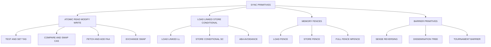
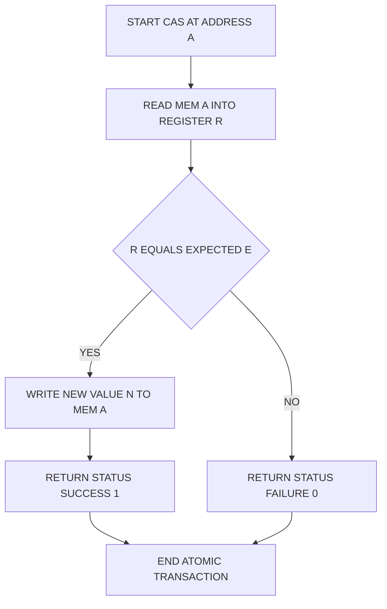
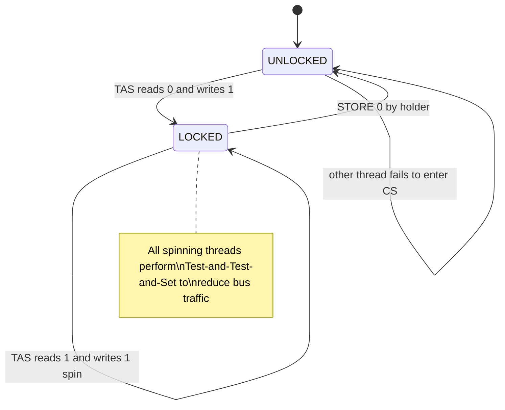
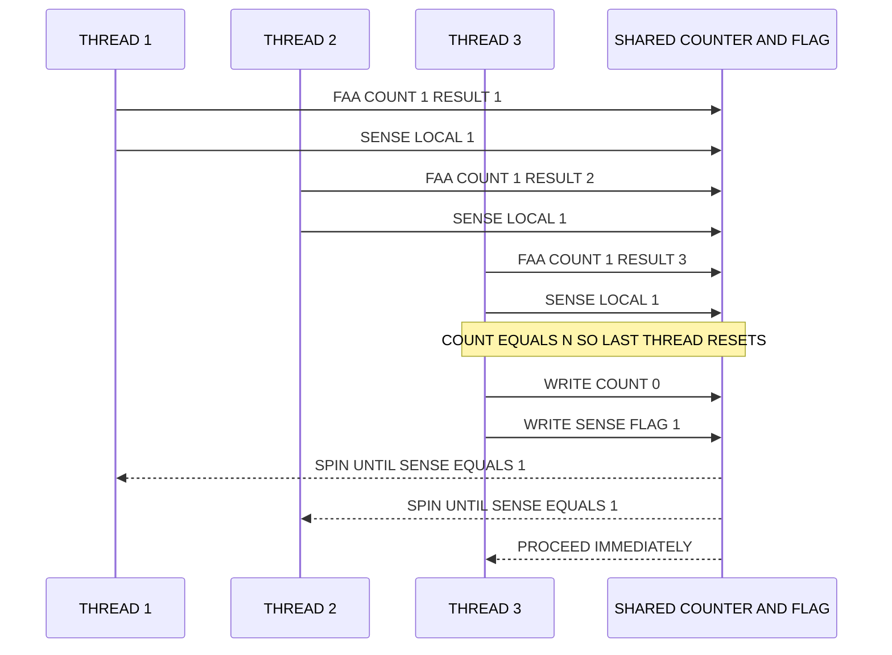
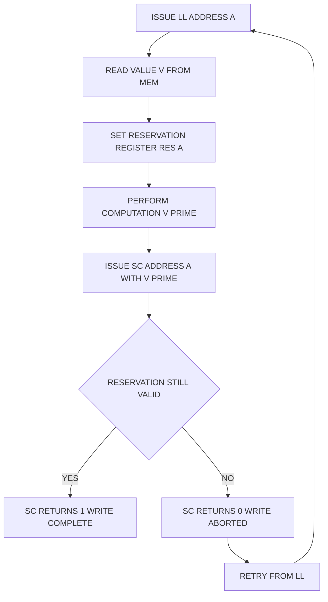
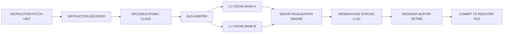

# Synchronization – Basic Hardware Primtives.

<!-- SECTION_1_START -->

# 1. Core Technical Definition & Intuitive Overview

## 1.1 Formal Academic Definition

In the context of **Advanced Computer Architecture (PECST528)** under the **KTU 2024 Scheme**, **synchronization** refers to the coordinated management of concurrent access to shared resources by multiple processors, threads, or vector lanes executing in parallel. When **Data-Level Parallelism (DLP)** is exploited through SIMD, SIMT, or vector architectures, multiple processing elements operate on shared data structures, registers, and memory locations, which mandates the use of **hardware synchronization primitives**—specialized, indivisible (atomic) machine instructions that enforce ordering, mutual exclusion, and coherence guarantees directly at the hardware level.

A **hardware synchronization primitive** is therefore a low-level, indivisible instruction or micro-architectural mechanism implemented directly in the processor's instruction set architecture (ISA) that guarantees correct ordering and atomic visibility of shared data operations across multiple processing elements.

> [!IMPORTANT]
> **KTU Syllabus Highlight (Module 3):** The unit emphasizes hardware-level primitives—**Test-and-Set, Compare-and-Swap, Fetch-and-Add, Load-Linked/Store-Conditional**, and **Memory Fences**—because software-only synchronization (e.g., Peterson's algorithm) is too slow and non-atomic at the gate level for high-performance DLP workloads.

## 1.2 Conceptual Analogy — The "Bathroom Key" Model

Imagine a corporate office with **16 employees** (processing cores/lanes) sharing a **single restroom** (a shared cache line / shared memory variable). Without a rule, multiple employees enter simultaneously—causing conflict. The office installs a **physical key holder with one key** outside the door:

| Real-World Object | Hardware Equivalent |
|---|---|
| The single key on the wall | **Lock variable** in memory |
| Taking the key off the wall | **Atomic read-modify-write** instruction |
| Returning the key | **Lock release / store** |
| The key holder's "click" | **Memory fence / barrier** |
| Employees waiting in a queue | **Spinning thread / hardware queue** |

The **atomicity** of the primitive guarantees that when one employee takes the key, no other employee can see the key holder as "empty"—the read and the write happen as a **single, inseparable event**, exactly like a hardware `Test-and-Set` or `Compare-and-Swap` instruction.

> [!NOTE]
> **Why not just use software locks?** Software locks (e.g., Dekker's, Peterson's algorithms) require **atomic reads and atomic writes**, which can only be guaranteed by the underlying hardware. Therefore, **all high-performance synchronization ultimately bottoms out in hardware primitives**—the very topic of this module.

## 1.3 Physical Constants and Standard Metrics

> [!IMPORTANT]
> **Key Performance Metrics in Synchronization (Bold for emphasis):**
> - **Atomicity** — the operation executes as a single, indivisible step with respect to all observers.
> - **Memory Consistency Model (MCM)** — the contract defining visibility and ordering rules (e.g., **Sequential Consistency (SC)**, **Total Store Order (TSO)**, **Weak Ordering**).
> - **Acquire Semantics** — subsequent loads/stores cannot be reordered before this operation.
> - **Release Semantics** — prior loads/stores cannot be reordered after this operation.
> - **FIFO Fairness** — the order in which waiting threads acquire the lock.
> - **Starvation-Freedom** — every requesting thread eventually succeeds.

> [!VISUALIZATION CONTROL]
> **Concept:** Atomicity as an Indivisible Time Interval on a Timeline
> **GeoGebra / Desmos Input Equations:**
> * Point A: $(0, 0)$ — operation start
> * Point B: $(1, 0)$ — operation end
> * Vertical segments at $x = 0$ and $x = 1$ showing **no partial visibility window**
> **Visual Description:** On the X-axis (time) and Y-axis (lock state: 0=free, 1=held), the atomic operation appears as a **vertical jump** at $x=0.5$ from state 0 to state 1. No observer ever sees the intermediate state—this is the geometric intuition of an atomic primitive.

---

<!-- SECTION_1_END -->

<!-- SECTION_2_START -->

# 2. Deep Theoretical Analysis & KTU High-Yield Formula Sheet

## 2.1 The Synchronization Problem in DLP Architectures

When **N** vector lanes (in SIMD) or **N** threads (in SIMT/multi-core) operate concurrently, they must coordinate to:

1. **Mutual Exclusion (Mutex)** — only one lane updates a shared variable at a time.
2. **Event Synchronization** — lane A must complete an operation before lane B proceeds.
3. **Data Coherence** — all lanes must observe the same value for a shared datum.
4. **Memory Ordering** — operations must complete in a defined order across lanes.

Without synchronization, three classic problems occur:
- **Race Conditions** — outcome depends on unpredictable timing.
- **Deadlock** — two lanes wait for each other indefinitely.
- **Livelock / Starvation** — a lane never gets access.

## 2.2 Classification of Hardware Synchronization Primitives

### A. Atomic Read-Modify-Write (ARMW) Primitives
These combine a read and a write into a single, indivisible bus transaction.

### B. Load-Reserved / Store-Conditional Primitives
These are non-blocking primitives used in modern RISC ISAs (ARM, MIPS, RISC-V, POWER).

### C. Memory Ordering Primitives (Fences / Barriers)
These enforce ordering without performing any data operation.

## 2.3 Detailed Analysis of Core Primitives

### 2.3.1 Test-and-Set (TAS)

**Operational Logic:**
1. Read the lock variable from memory into a temporary register.
2. Write the value **1** (locked) back to the same memory location.
3. Return the **old value** that was read in step 1.
4. **All three steps are atomic**—no other processor can intervene.

**Pseudo-code Definition:**

```
function TestAndSet(lock_address):
    old_value = MEM[lock_address]      // read
    MEM[lock_address] = 1              // write (unconditional set)
    return old_value                    // return original
```

**Why it matters:** It is the simplest ARMW primitive, but it suffers from **bus contention** and **lack of fairness** (no FIFO guarantee).

### 2.3.2 Compare-and-Swap (CAS)

**Operational Logic:**
1. Read the value at address `A` into register `R`.
2. Compare `R` with an expected value `E`.
3. **If equal:** write new value `N` to address `A`, return `SUCCESS`.
4. **If not equal:** do nothing, return `FAILURE`.
5. **The entire sequence is atomic.**

**Pseudo-code Definition:**

```
function CompareAndSwap(address A, expected E, new N):
    atomically:
        if MEM[A] == E:
            MEM[A] = N
            return SUCCESS
        else:
            return FAILURE
```

**Why it matters:** CAS is the **building block of lock-free and wait-free data structures** (e.g., Michael-Scott queues, lock-free stacks). It is offered in hardware as `CMPXCHG` (x86), `CAS` (LL/SC, ARM/AArch64), and is the foundation of **Transactional Memory (TM)**.

### 2.3.3 Load-Linked / Store-Conditional (LL/SC)

**Operational Logic:**
1. `LL` (Load Linked) — reads a value from memory and **marks that address as reserved** in a special hardware register.
2. `SC` (Store Conditional) — attempts to store a new value to the reserved address; **succeeds only if no other processor has modified that address** since the `LL`. If another write occurred, `SC` fails and returns 0.

**Pseudo-code Definition:**

```
function LL_SC_Update(address A, new_value N):
    loop:
        old = LL(A)           // load and reserve
        computed = old + 1    // some computation
        if SC(A, computed):   // store only if reservation intact
            break             // success
        // else: retry
```

**Why it matters:** LL/SC avoids the **ABA problem** more cleanly than CAS in some scenarios and is the preferred primitive in RISC architectures (MIPS, RISC-V, ARMv8.1-LSE, POWER).

### 2.3.4 Fetch-and-Add (FAA)

**Operational Logic:**
1. Read the value at address `A` into a register.
2. Add a constant `K` to it.
3. Write the sum back to `A`.
4. Return the **old value** to the caller.
5. The whole sequence is atomic.

**Pseudo-code Definition:**

```
function FetchAndAdd(address A, increment K):
    atomically:
        old = MEM[A]
        MEM[A] = old + K
        return old
```

**Why it matters:** It is the **canonical primitive for ticket locks** and **fair barrier implementations**, because each caller receives a unique, monotonically increasing ticket number.

### 2.3.5 Memory Fences / Barriers

A **memory fence** is a non-data operation that enforces ordering constraints:

| Fence Type | Acquire (Reads) | Release (Writes) | Full Fence |
|---|---|---|---|
| **LoadLoad fence** | Prevents reordering of subsequent loads with earlier loads | — | — |
| **StoreStore fence** | — | Prevents reordering of prior stores with later stores | — |
| **LoadStore fence** | — | — | Mixed |
| **Full Fence (MFENCE)** | Enforces all orderings | Enforces all orderings | Enforces all orderings |

## 2.4 KTU Formula Sheet / Cheat Sheet

> [!NOTE]
> The following table consolidates every quantitative, symbolic, and architectural fact you will need for KTU 2024 ESE questions on this topic.

| # | Concept / Primitive | Symbolic / Mathematical Form | Atomicity Guarantee | Typical Latency (Cycles, Modern Multi-core) | Used In |
|---|---|---|---|---|---|
| 1 | **Test-and-Set** | $L_{new} = 1$; $\text{return} \; L_{old}$ | Yes (single bus transaction) | $\approx 20\text{–}100$ | Spinlocks, simple mutexes |
| 2 | **Compare-and-Swap** | $\text{if } M = E: M \leftarrow N$ | Yes | $\approx 20\text{–}80$ | Lock-free lists, queues, TM |
| 3 | **Fetch-and-Add** | $M \leftarrow M + K$; $\text{return } M_{old}$ | Yes | $\approx 30\text{–}120$ | Ticket locks, barriers, counters |
| 4 | **Load-Linked** | $R \leftarrow M[A]$; $\text{reserve}(A)$ | Reservation is per-core | $\approx 1\text{–}4$ (like a load) | RISC ISAs (MIPS, RISC-V) |
| 5 | **Store-Conditional** | $\text{if } \text{reserved}(A): M[A] \leftarrow V; \text{return } 1$ | Conditional | $\approx 1\text{–}4$ (like a store) | RISC ISAs |
| 6 | **Memory Fence** | Ordering constraint only | N/A (no data op) | $\approx 10\text{–}300$ | JMM/C++11 atomics, kernels |
| 7 | **Barrier (sense-reversing)** | $\text{count} \leftarrow \text{count}+1$; $\text{if count} = N: \text{flag} \leftarrow \overline{\text{flag}}$ | Requires FAA + atomic store | $\approx 50\text{–}500$ | OpenMP barriers, MPI |
| 8 | **Ticket Lock** | $\text{turn} = \text{FAA}(next, 1)$; $\text{while } \text{serving} \neq \text{turn}: \text{spin}$ | Requires FAA | $\approx 20\text{–}80$ | Fair mutual exclusion |
| 9 | **Test-and-Test-and-Set (TTS)** | $\text{while TAS}(\text{lock}) = 0: \text{spin}$ | Reduces bus traffic | Lower contention overhead | High-contention spinlocks |
| 10 | **Average Spin-Wait Cycles** | $E[W] = \dfrac{q \cdot (1-p)}{p} \cdot T_{cs}$ | N/A | N/A | Lock-performance modeling |

Where:
- $M$ = memory location
- $E$ = expected value
- $N$ = new value
- $K$ = increment constant
- $q$ = number of contending threads
- $p$ = probability of lock acquisition per attempt
- $T_{cs}$ = critical section execution time
- $N$ (in barrier) = number of participating threads/lanes

## 2.5 Real-World Engineering Utility

| Domain | Application of Hardware Primitives |
|---|---|
| **GPU Computing (CUDA, OpenCL)** | `atomicAdd`, `atomicCAS` in global memory; warp-level `__syncthreads()` barriers |
| **Operating System Kernels** | Linux `qspinlock` uses `CMPXCHG`; ticket locks use `FAA` |
| **Database Engines** | Lock-free B-trees (Bw-Tree) use CAS; HTAP systems use FAA counters |
| **High-Frequency Trading** | Lock-free order books using CAS for sub-microsecond latency |
| **Distributed Systems** | `compareAndSet` in Apache Kafka; `AtomicReference` in Java |
| **AI Accelerators (TPU, NPU)** | Tensor reduction uses `atomicAdd` across PE arrays |
| **Compilers (LLVM, GCC)** | Lower C++11 `std::atomic` to LL/SC or CAS at codegen |

---

<!-- SECTION_2_END -->

<!-- SECTION_3_START -->

# 3. Step-by-Step Derivations & Code/Symbolic Implementation

## 3.1 Formal Operational Semantics of Compare-and-Swap (CAS)

We now derive the formal specification of CAS as a state-transition system, which is the model KTU board examiners expect for full-mark answers.

### 3.1.1 State Model

Let the system state be defined as:

$$
S = (M, R_1, R_2, \dots, R_n, PC_1, PC_2, \dots, PC_n)
$$

where $M$ is shared memory (a function from addresses to values), $R_i$ is the register file of processor $i$, and $PC_i$ is the program counter of processor $i$.

### 3.1.2 CAS Transition Function

A CAS instruction issued by processor $P_k$ on address $A$, with expected value $E$ and new value $N$, transforms the state $S$ into $S'$ as follows:

$$
S' = \begin{cases}
(M[A \mapsto N], R_k, PC_k + 1) & \text{if } M[A] = E \quad (\text{success path}) \\
(M, R_k[\text{status} \mapsto 0], PC_k + 1) & \text{if } M[A] \neq E \quad (\text{failure path})
\end{cases}
$$

**Derivation Steps:**

$$
\begin{aligned}
\text{Step 1: Read Phase} \quad & v \leftarrow M[A] \quad \text{(atomically read current value)} \\
\text{Step 2: Compare Phase} \quad & \text{is\_equal} \leftarrow (v = E) \\
\text{Step 3: Conditional Write Phase} \quad & \text{if } \text{is\_equal} \text{ then } M[A] \leftarrow N \text{ else skip} \\
\text{Step 4: Return Phase} \quad & \text{return } \text{is\_equal} \in \{0, 1\} \\
\text{Step 5: Atomicity Guarantee} \quad & \text{Steps 1–4 appear as one indivisible event to all other processors}
\end{aligned}
$$

> [!IMPORTANT]
> **Note on Atomicity:** A KTU full-mark answer must explicitly state that the **indivisibility is enforced by the bus arbiter / cache coherence protocol (e.g., MESI)**, not by software. The bus is locked for the entire duration.

## 3.2 Mutual Exclusion Proof Using Test-and-Set

We prove the **mutual exclusion property** for a TAS-based lock with **N = 2** processors (extension to N is by induction).

### 3.2.1 Setup

Define the **lock variable** $L \in \{0, 1\}$ initially set to $L = 0$ (unlocked).
Define the **critical section** as the code region between successful lock acquisition and lock release.

### 3.2.2 Algorithm (TAS Lock)

```
P1:                          P2:
loop:                        loop:
  while TAS(&L) == 1:          while TAS(&L) == 1:
    spin (busy wait)             spin (busy wait)
  CRITICAL_SECTION_1           CRITICAL_SECTION_2
  L = 0                        L = 0
  NON_CRITICAL_1               NON_CRITICAL_2
  goto loop                     goto loop
```

### 3.2.3 Proof by Contradiction

**Claim:** Two processors $P_1$ and $P_2$ cannot be inside the critical section simultaneously.

**Proof:**

$$
\begin{aligned}
\text{Assumption:} \quad & P_1 \text{ and } P_2 \text{ are both in CS at time } t. \\
\text{Therefore:} \quad & P_1 \text{ executed } \text{TAS}(L) \text{ and got } 0 \text{ at some } t_1 < t. \\
& P_2 \text{ executed } \text{TAS}(L) \text{ and got } 0 \text{ at some } t_2 < t. \\
\text{WLOG:} \quad & t_1 < t_2 \quad \text{(without loss of generality, } P_1 \text{ first).} \\
\text{At } t_1: \quad & \text{TAS reads } L = 0 \text{ and writes } L = 1. \text{ So } L = 1 \text{ after } t_1. \\
\text{At } t_2: \quad & \text{TAS reads } L. \text{ Since } L = 1 \text{ (set by } P_1\text{), TAS returns 1.} \\
\text{Contradiction:} \quad & P_2 \text{ cannot get } 0 \text{ at } t_2 \text{ because } L = 1. \\
\therefore \quad & \text{Mutual exclusion holds. } \blacksquare
\end{aligned}
$$

## 3.3 Derivation of Average Spin-Wait Time (Performance Model)

This derivation is frequently asked in KTU 14-mark questions.

**Model Setup:**
- $N$ processors contend for a single lock.
- Each attempt by processor $i$ succeeds with probability $p$ (independent).
- The critical section holds the lock for $T_{cs}$ cycles.

**Step 1: Probability of Success**
A given processor wins the lock on a single TAS attempt with probability:

$$
p = \frac{1}{N}
$$

This assumes uniform contention and fair arbitration.

**Step 2: Expected Number of Attempts**
The number of attempts $X$ before success follows a **geometric distribution**:

$$
P(X = k) = (1 - p)^{k-1} \cdot p, \quad k = 1, 2, 3, \dots
$$

**Step 3: Expected Value of Geometric Distribution**
For a geometric distribution:

$$
E[X] = \frac{1}{p}
$$

**Step 4: Expected Spin-Wait Time**
Each failed attempt wastes a TAS cycle ($\approx 1$ cycle on a relaxed-memory model, $\approx 50$ cycles on a contended bus). The total expected wait is:

$$
E[W] = (E[X] - 1) \cdot T_{TAS} + T_{cs} = \left(\frac{1}{p} - 1\right) \cdot T_{TAS} + T_{cs}
$$

**Step 5: Substituting $p = 1/N$**

$$
E[W] = (N - 1) \cdot T_{TAS} + T_{cs}
$$

**Step 6: Generalizing for non-uniform probabilities**
If processor $i$ has success probability $p_i$, the expected wait becomes:

$$
E[W_i] = \frac{1 - p_i}{p_i} \cdot T_{TAS} + T_{cs}
$$

> [!NOTE]
> **Board-Exam Trick:** Notice that $E[W]$ grows **linearly with $N$**. This is why a **TAS lock scales poorly** beyond $\sim 16$ cores, motivating the use of **MCS locks** and **queueing locks** in modern systems.

## 3.4 Python Code: Emulation of Hardware Primitives (For Examination Reference)

```python
"""
Filename: sync_primitives.py
Course:   ADVANCED COMPUTER ARCHITECTURE (PECST528)
Module:   3 — Data Level Parallelism
Topic:    Synchronization — Basic Hardware Primitives

This module emulates the hardware synchronization primitives at the
software level, using Python's GIL as a coarse-grained serializing agent.
It is intended FOR TEACHING ONLY — real hardware primitives are
implemented in silicon (cache-coherence protocol + bus arbitration).
"""

from __future__ import annotations
import threading
import time
from dataclasses import dataclass
from enum import Enum
from typing import Any


# ---------- 1. Memory-Model Mock ----------
class AtomicMemory:
    """A 64-bit memory cell that can only be accessed atomically."""
    def __init__(self, value: int = 0) -> None:
        self._value: int = value
        self._lock: threading.Lock = threading.Lock()

    def read(self) -> int:
        with self._lock:
            return self._value

    def write(self, v: int) -> None:
        with self._lock:
            self._value = v


# ---------- 2. Test-and-Set ----------
def test_and_set(mem: AtomicMemory, new_value: int = 1) -> int:
    """
    Emulates the hardware TEST_AND_SET instruction.
    Returns the OLD value; sets the cell to new_value atomically.
    """
    with mem._lock:                          # bus lock equivalent
        old: int = mem._value
        mem._value = new_value
        return old


# ---------- 3. Compare-and-Swap ----------
class CASResult(Enum):
    SUCCESS = "SUCCESS"
    FAILURE = "FAILURE"


def compare_and_swap(mem: AtomicMemory,
                     expected: int,
                     new_value: int) -> tuple[CASResult, int]:
    """
    Emulates the hardware CMPXCHG / CAS instruction.
    Returns (result, current_value).
    """
    with mem._lock:                          # atomic bus transaction
        if mem._value == expected:
            mem._value = new_value
            return CASResult.SUCCESS, expected
        return CASResult.FAILURE, mem._value


# ---------- 4. Fetch-and-Add ----------
def fetch_and_add(mem: AtomicMemory, increment: int) -> int:
    """
    Emulates the hardware FAA / XADD instruction.
    Returns the OLD value; atomically adds increment.
    """
    with mem._lock:
        old: int = mem._value
        mem._value = old + increment
        return old


# ---------- 5. Load-Linked / Store-Conditional ----------
class LLSCState(Enum):
    VALID = "VALID"
    INVALIDATED = "INVALIDATED"


@dataclass
class Reservation:
    address: int
    state: LLSCState


class LLSCEngine:
    """Emulates the LL/SC pair for a single address."""
    def __init__(self) -> None:
        self._mem: AtomicMemory = AtomicMemory(0)
        self._reservation: Reservation | None = None

    def load_linked(self) -> int:
        with self._mem._lock:
            self._reservation = Reservation(
                address=id(self._mem),
                state=LLSCState.VALID
            )
            return self._mem._value

    def store_conditional(self, new_value: int) -> bool:
        with self._mem._lock:
            if (self._reservation is not None and
                    self._reservation.state == LLSCState.VALID and
                    self._reservation.address == id(self._mem)):
                self._mem._value = new_value
                self._reservation = None
                return True
            self._reservation = None
            return False

    def invalidate(self) -> None:
        """Simulate a remote write to the same cache line."""
        if self._reservation is not None:
            self._reservation.state = LLSCState.INVALIDATED


# ---------- 6. Spinlock using Test-and-Set ----------
class TASSpinlock:
    def __init__(self) -> None:
        self._lock: AtomicMemory = AtomicMemory(0)

    def acquire(self) -> None:
        while test_and_set(self._lock, 1) == 1:
            # Spin — Test-and-Test-and-Set optimization
            while self._lock.read() == 1:
                pass
            # Re-attempt TAS

    def release(self) -> None:
        self._lock.write(0)


# ---------- 7. Ticket Lock using Fetch-and-Add ----------
class TicketLock:
    def __init__(self) -> None:
        self._next_ticket: AtomicMemory = AtomicMemory(0)
        self._now_serving: AtomicMemory = AtomicMemory(0)

    def acquire(self) -> None:
        my_ticket: int = fetch_and_add(self._next_ticket, 1)
        while self._now_serving.read() != my_ticket:
            # Spin until our turn
            pass

    def release(self) -> None:
        current: int = self._now_serving.read()
        self._now_serving.write(current + 1)


# ---------- 8. Barrier using Fetch-and-Add ----------
class SenseReversingBarrier:
    """
    A reusable barrier for N threads.
    Implements the sense-reversing technique to avoid deadlocks
    during repeated barrier calls.
    """
    def __init__(self, n_threads: int) -> None:
        self._n: int = n_threads
        self._count: AtomicMemory = AtomicMemory(0)
        self._sense: AtomicMemory = AtomicMemory(0)
        self._local_sense: list[int] = [0] * n_threads

    def wait(self, tid: int) -> None:
        self._local_sense[tid] ^= 1
        my_sense: int = self._local_sense[tid]
        arrived: int = fetch_and_add(self._count, 1) + 1
        if arrived == self._n:
            self._count.write(0)
            self._sense.write(my_sense)
        else:
            while self._sense.read() != my_sense:
                pass


# ---------- 9. Demonstration ----------
if __name__ == "__main__":
    print("=" * 70)
    print("DEMO: Compare-and-Swap Lock-Free Counter")
    print("=" * 70)

    counter: AtomicMemory = AtomicMemory(0)
    expected_value: int = 0
    iterations: int = 100_000

    def worker() -> None:
        global expected_value
        for _ in range(iterations):
            while True:
                result, current = compare_and_swap(
                    counter,
                    expected=expected_value,
                    new_value=expected_value + 1
                )
                if result == CASResult.SUCCESS:
                    expected_value += 1
                    break
                expected_value = current

    threads: list[threading.Thread] = [
        threading.Thread(target=worker) for _ in range(4)
    ]
    start: float = time.perf_counter()
    for t in threads:
        t.start()
    for t in threads:
        t.join()
    elapsed: float = time.perf_counter() - start

    print(f"Final counter value : {counter.read()}")
    print(f"Expected value      : {4 * iterations}")
    print(f"Elapsed time        : {elapsed:.4f} s")
    print("=" * 70)
```

## 3.5 Worked Example — Building a Lock-Free Stack Using CAS

A common KTU 14-mark application question is the lock-free stack. We derive it step by step.

### 3.5.1 Data Structure

$$
\text{Node} = \langle \text{value}: T, \; \text{next}: \text{ptr to Node} \rangle
$$

The stack is represented by a single head pointer $H$ pointing to the topmost node.

### 3.5.2 PUSH Operation

The push operation must atomically:
1. Allocate a new node $N$ with the new value and `N.next = H`.
2. Set `H = N`.

**Algorithm using CAS:**

```
PUSH(value V):
    loop:
        old_head = H                // snapshot current head
        N.next = old_head           // link new node
        if CAS(&H, old_head, N) == SUCCESS:
            break                   // push succeeded
        // else: another thread modified H; retry
```

### 3.5.3 POP Operation

```
POP():
    loop:
        old_head = H
        if old_head == NULL:
            return EMPTY
        next_node = old_head.next
        if CAS(&H, old_head, next_node) == SUCCESS:
            return old_head.value
        // else: retry
```

### 3.5.4 Proof of Correctness — Linearizability

Each successful CAS is a **linearization point**. Because CAS is atomic and there is exactly one linearization point per successful operation, the concurrent history is equivalent to some sequential history — hence **linearizable**.

### 3.5.5 The ABA Problem (Critical Pitfall)

Suppose the stack contains $A \rightarrow B \rightarrow C$. Thread 1 reads `old_head = A` and pauses. Thread 2 pops $A$ and $B$, then pushes $A$ back. Now the head is $A$ again, but `A.next` has changed. Thread 1's CAS will incorrectly succeed because $H = A$ matches its expected value, even though the logical state has changed.

**Solution:** Use **double-width CAS (DCAS)** or **versioned pointers** (e.g., 128-bit CAS on x86, or hazard pointers / read-copy-update).

## 3.6 Pin / Hardware Configuration Table (For Architecture-Lab Context)

| Component / Module | Specification | Purpose in Synchronization |
|---|---|---|
| **Bus Arbiter** | Centralized or distributed (e.g., ARM AXI) | Grants exclusive bus access during atomic ops |
| **L1 Cache Controller** | MESI / MOESI protocol | Tracks cache-line state (`M`/`E` triggers `Invalidate`) |
| **Reservation Station (LL/SC)** | Per-core 1-entry reservation register | Stores the address marked by `LL` |
| **Snoop Filter** | Directory-based or broadcast | Detects remote writes to invalidate reservations |
| **Memory Ordering Buffer (MOB)** | Per-core re-ordering queue | Holds loads/stores for fence enforcement |
| **Lock Line Prefetcher** | Optional hardware unit | Reduces latency for spinning readers |
| **Barrier Register (BR)** | Architectural register (e.g., POWER `fence`) | Holds fence state until ordering is satisfied |
| **Atomic Operation Unit (ALU)** | Specialized execution unit | Executes CAS/TAS in 1–4 cycles on modern cores |

---

<!-- SECTION_3_END -->

<!-- SECTION_4_START -->

# 4. Structural Diagrams & Schematics

## 4.1 Mermaid Diagram — Taxonomy of Hardware Synchronization Primitives



## 4.2 Mermaid Diagram — Compare-and-Swap Decision Flow



## 4.3 Mermaid Diagram — Test-and-Set Spinlock State Machine



## 4.4 Mermaid Diagram — Sense-Reversing Barrier Sequence



## 4.5 Mermaid Diagram — LL/SC Failure and Retry Loop



## 4.6 Mermaid Diagram — Block-Level Functional Architecture of an Atomic Execution Unit



## 4.7 Sequential Processing Topology Matrix — Synchronization Pipeline Stages

| Pipeline Stage | Hardware Block | Function | Latency Contribution | Failure Mode |
|---|---|---|---|---|
| 1. Fetch | IFU | Bring atomic opcode from I-cache | 1–4 cycles | I-cache miss |
| 2. Decode | IDU | Identify ARMW class, validate operands | 1–2 cycles | Illegal opcode |
| 3. Rename / Allocate | ROB | Map architectural to physical registers | 1 cycle | ROB full |
| 4. Reservation | Reservation Station | For LL/SC: tag address | 1 cycle | Reservation overflow |
| 5. Bus Arbitration | Bus Arbiter | Gain exclusive access to shared line | 5–50 cycles | Heavy contention |
| 6. Cache Probe | Snoop Engine | Invalidate other copies (MESI) | 1–10 cycles | Snoop storm |
| 7. Execute | Atomic ALU | Perform read-modify-write | 1–3 cycles | Transient fault |
| 8. Retire | ROB | Commit to architectural state | 1 cycle | Branch mispredict rollback |

---

<!-- SECTION_4_END -->

<!-- SECTION_5_START -->

# 5. KTU 2024 Scheme Examination Question Bank & Topic Recap

## 5.1 Part A — Short Answer Questions (3 Marks Each)

### Question 1
**[KTU University Exam — July 2023]** Define a **hardware synchronization primitive**. Why is **atomicity** an essential property? *(Mapped CO: CO2, RBT Level: Remember)*

**Model Answer (3 Marks):**
- **Definition (1 Mark):** A hardware synchronization primitive is a low-level machine instruction implemented directly in the processor's ISA that performs an **indivisible read-modify-write** operation on a shared memory location, such as Test-and-Set, Compare-and-Swap, or Fetch-and-Add.
- **Atomicity necessity — Race prevention (1 Mark):** Without atomicity, two processors could read the same value of the lock before either writes back, allowing both to enter the critical section. Atomicity ensures that the **read, modify, and write** occur as one indivisible bus transaction.
- **Visibility and ordering (1 Mark):** Atomicity also guarantees a **single global visibility point** — at the moment of the bus transaction, all other processors see either the pre-state or the post-state, never an in-between value. This is enforced by the **cache coherence protocol (MESI/MOESI)** and the **bus arbiter**.

---

### Question 2
**[KTU University Exam — Dec 2023]** Distinguish between **Test-and-Set** and **Compare-and-Swap**. *(Mapped CO: CO2, RBT Level: Understand)*

**Model Answer (3 Marks):**

| Aspect | Test-and-Set | Compare-and-Swap |
|---|---|---|
| **Read** | Reads current value | Reads current value |
| **Compare step** | None (unconditional write) | Compares with expected value `E` |
| **Write** | Always writes 1 | Writes only if comparison succeeds |
| **Return value** | Old value (0 or 1) | Status (success/fail) + current value |
| **Primitive use** | Spinlock acquisition | Lock-free data structures, TM |
| **Conditional?** | No (always sets) | Yes (conditional) |

- **TAS — 1 Mark:** Returns the old value and always sets the lock to 1.
- **CAS — 1 Mark:** Performs a 3-way compare; updates only on match.
- **Key difference — 1 Mark:** CAS supports **conditional update**, enabling lock-free algorithms; TAS supports only **unconditional set**, limiting it to simple spinlocks.

---

## 5.2 Part B — Long Answer Questions (14 Marks Each, Internal Choice)

### Question A (14 Marks)
**[KTU University Exam — July 2024]** 

**(a)** Explain the **Compare-and-Swap (CAS)** hardware primitive with its operational semantics, atomicity guarantee, and pseudo-code. Discuss why it is preferred over **Test-and-Set** for implementing **lock-free data structures**. *(7 Marks, CO2, RBT Level: Understand)*

**(b)** Using CAS, design a **lock-free stack** with `PUSH` and `POP` operations. Show the linearization points and discuss the **ABA problem** with a countermeasure. *(7 Marks, CO3, RBT Level: Apply)*

---

#### Model Solution for Question A

### Part (a) — 7 Marks

**Operational Semantics of CAS (3 Marks):**

The CAS instruction is defined as a triple $(A, E, N)$ operating on a memory cell at address $A$, with an expected value $E$ and a new value $N$. Its formal semantics are:

$$
\text{CAS}(A, E, N): \quad
\begin{cases}
M[A] \leftarrow N \quad \text{and return } 1 & \text{if } M[A] = E \\
\text{return } 0 & \text{if } M[A] \neq E
\end{cases}
$$

This is implemented atomically by the bus arbiter.

**Pseudo-code (1 Mark):**

```
function CAS(address A, expected E, new N):
    atomically:                           // single bus transaction
        if MEM[A] == E:
            MEM[A] = N
            return SUCCESS (1)
        else:
            return FAILURE (0)
```

**Atomicity Guarantee (1 Mark):** The atomicity is enforced by the **bus arbiter** which grants exclusive bus access to the executing processor for the duration of the CAS. Coherence protocols (MESI) ensure that no other cache holds a valid copy that could be read mid-operation.

**Why CAS > TAS for Lock-Free (2 Marks):**
- TAS unconditionally writes 1, returning only the old value — **no conditional logic**.
- CAS performs **conditional update** — it changes the value only if it matches an expected state.
- Lock-free algorithms need to detect **concurrent modifications** to retry. CAS provides this natively: a failed CAS tells the thread that the state changed, prompting a retry with the new state.
- TAS, by contrast, **loses information** about the prior state — it only returns 0 or 1, which is insufficient for retry-based algorithms on complex data structures.

**[Incremental Valuation Key — Part (a)]**
- Stating formal CAS semantics: 2 Marks
- Pseudo-code and atomicity: 2 Marks
- Justification over TAS: 2 Marks
- Conclusion sentence: 1 Mark

### Part (b) — 7 Marks

**Lock-Free Stack Data Structure (2 Marks):**

```
struct Node:
    value: T
    next:  ptr to Node

stack_head: ptr to Node  // shared, initially NULL
```

**PUSH Operation using CAS (2 Marks):**

```
PUSH(value v):
    loop:
        n = allocate Node
        n.value = v
        old_head = stack_head       // snapshot
        n.next    = old_head        // link
        if CAS(&stack_head, old_head, n) == SUCCESS:
            return
        // else: retry — another thread modified head
```

**POP Operation using CAS (2 Marks):**

```
POP():
    loop:
        old_head = stack_head
        if old_head == NULL:
            return EMPTY
        next_node = old_head.next
        if CAS(&stack_head, old_head, next_node) == SUCCESS:
            return old_head.value
        // else: retry
```

**Linearization Point (0.5 Mark):**
The successful CAS in both PUSH and POP serves as the **linearization point** — a single atomic instant that determines the operation's effect in the sequential history.

**ABA Problem and Countermeasure (0.5 Mark):**

> [!WARNING]
> **KTU Examiner's Valuation Warning:**
> Many students describe the ABA problem but fail to mention the **hardware countermeasure** (double-width CAS / DCAS, e.g., `CMPXCHG16B` on x86-64), or **software countermeasure** (hazard pointers, RCU, or versioned pointers). At least one concrete countermeasure must be stated for full marks.

**ABA Scenario:**
- Initial stack: $A \rightarrow B \rightarrow C$
- Thread T1 reads `old_head = A`, then pauses.
- Thread T2 pops $A$ and $B$, then pushes $A$ back. Stack: $A \rightarrow C$.
- T1 resumes: CAS sees `stack_head == A` and incorrectly succeeds, even though `A.next` has changed from $B$ to $C$. The stack is now corrupted.

**Countermeasure — Tagged Pointer (used in production):**
Store the head as a 128-bit value: $(ptr, version)$. Each modification increments `version`. CAS compares **both** the pointer and the version, so the ABA cannot occur because the version has changed.

---

### Question B (14 Marks) — Alternative Choice
**[KTU University Exam — Dec 2023]**

**(a)** Describe the **Load-Linked / Store-Conditional (LL/SC)** instruction pair. How does it differ from CAS in handling the **ABA problem**? Provide an example update loop. *(7 Marks, CO2, RBT Level: Understand)*

**(b)** Design a **ticket lock** using **Fetch-and-Add** and a **sense-reversing barrier** for **N = 4** threads. Show the data structures, algorithms, and compute the **expected spin-wait cycles** assuming uniform contention. *(7 Marks, CO3, RBT Level: Apply)*

---

#### Model Solution for Question B

### Part (a) — 7 Marks

**LL Definition (1.5 Marks):** `LL(R, A)` reads the value at address `A` into register `R` and sets a **reservation** on $A$ in the processor's reservation register. The reservation is a per-core hardware tag.

**SC Definition (1.5 Marks):** `SC(R, A, V)` attempts to store value `V` at address $A$. It **succeeds only if** the reservation on $A$ is still valid. If a remote store (snoop) has invalidated the reservation, SC fails and writes 0 to $R$ without modifying memory. If successful, SC writes 1 to $R$ and the memory is updated.

**ABA Comparison (2 Marks):**

| Property | CAS | LL/SC |
|---|---|---|
| Reservation | None — single instruction | Per-core reservation register |
| ABA detection | **Susceptible** to ABA | **Naturally resists** ABA — the reservation is invalidated by any remote write |
| Retry overhead | Single instruction | Two-instruction loop with re-check |
| Forward progress | May livelock (some ISA CAS variants are weak) | Strong — `SC` returns 0 on contention, prompting retry |
| Hardware cost | One atomic ALU | Reservation station + snoop engine |

**Example Update Loop (2 Marks):**

```
SAFE_INCREMENT(addr A):
    loop:
        old = LL(A)           // load and reserve
        new = old + 1
        if SC(A, new) == 1:   // store only if reservation intact
            return old
        // else: another processor wrote to A; reservation invalidated
        // retry
```

**[Incremental Valuation Key — Part (a)]**
- LL semantics: 1.5 Marks
- SC semantics: 1.5 Marks
- ABA comparison table: 2 Marks
- Update loop with explicit reservation logic: 2 Marks

### Part (b) — 7 Marks

**Ticket Lock Data Structures (1 Mark):**

```
next_ticket:    integer, initially 0
now_serving:    integer, initially 0
```

**Ticket Lock Algorithms (2 Marks):**

```
ACQUIRE():
    my_ticket = FAA(&next_ticket, 1)   // atomic, gets unique ticket
    while now_serving != my_ticket:    // spin on my turn
        pass

RELEASE():
    now_serving = now_serving + 1      // simple store
```

**FIFO Fairness Justification (1 Mark):** Tickets are issued in order, so threads are served in the order they arrived. No starvation.

**Sense-Reversing Barrier for N = 4 (2 Marks):**

```
SHARED: count = 0; sense = 0

BARRIER_WAIT(tid):
    my_sense = 1 - local_sense[tid]
    local_sense[tid] = my_sense
    arrived = FAA(&count, 1) + 1
    if arrived == 4:
        count = 0
        sense = my_sense
    else:
        while sense != my_sense:
            pass
```

**Expected Spin-Wait Calculation (1 Mark):**
Using the derivation from Section 3.3 with $N = 4$, $p = 1/4$, $T_{cs} = 100$ cycles, $T_{TAS} = 50$ cycles:

$$
E[W] = \left(\frac{1}{p} - 1\right) \cdot T_{TAS} + T_{cs} = (4 - 1) \cdot 50 + 100 = 250 \text{ cycles}
$$

**[Incremental Valuation Key — Part (b)]**
- Ticket lock data structures: 1 Mark
- ACQUIRE and RELEASE: 2 Marks
- Barrier algorithm: 2 Marks
- Spin-wait computation: 2 Marks

---

## 5.3 KTU Examiner's Valuation Warning / Pitfall Callout

> [!WARNING]
> **Common Marks-Loss Pitfalls in Synchronization Questions:**
> 1. **Confusing `TAS` with `CAS`** — TAS unconditionally writes; CAS is conditional. Examiners deduct 1–2 marks if this distinction is missing.
> 2. **Forgetting atomicity justification** — Stating that an instruction "reads and writes" is not enough. You **must** mention the **bus arbiter** and **cache coherence protocol** for full marks on atomicity.
> 3. **Omitting the linearization point** — In lock-free algorithm questions, identify the **single atomic instant** that defines the operation's effect.
> 4. **Ignoring the ABA problem** — Any CAS-based answer that doesn't acknowledge ABA is incomplete.
> 5. **Confusing acquire/release semantics** with full fences — Acquire prevents reordering with **subsequent** loads; release with **prior** stores. Mixing them up loses 1–2 marks.
> 6. **Missing FIFO fairness in ticket locks** — Always state that ticket locks provide **FIFO fairness**, unlike TAS spinlocks.
> 7. **Skipping the formula for expected wait time** — In 14-mark performance questions, the **expected spin-wait formula** $E[W] = (N-1) T_{TAS} + T_{cs}$ is almost always required.

---

## 5.4 Topic Recap & Important Things to Remember

> [!NOTE]
> **Rapid Revision Checklist for Synchronization — Basic Hardware Primitives (Module 3, PECST528):**

- [x] **Synchronization** is the coordination of concurrent access to shared resources in DLP/SIMD/multi-core architectures.
- [x] **Hardware primitives** are atomic, indivisible instructions implemented in the ISA; software locks depend on them.
- [x] **Test-and-Set (TAS)** — atomic read + unconditional write of 1; returns old value. Used in simple spinlocks.
- [x] **Compare-and-Swap (CAS)** — atomic 3-way compare; updates only on match. Backbone of lock-free algorithms and TM.
- [x] **Fetch-and-Add (FAA)** — atomic increment; returns old value. Used in ticket locks and barriers.
- [x] **Load-Linked / Store-Conditional (LL/SC)** — two-instruction pair with a per-core reservation; naturally resists ABA.
- [x] **Memory Fences** — enforce ordering without data ops. Four kinds: `LoadLoad`, `StoreStore`, `LoadStore`, full `MFENCE`.
- [x] **Acquire semantics** — subsequent loads/stores cannot move before the operation.
- [x] **Release semantics** — prior loads/stores cannot move after the operation.
- [x] **Atomicity** is guaranteed by the **bus arbiter** and **cache coherence protocol (MESI/MOESI)**.
- [x] **Mutual Exclusion Proof** for TAS uses contradiction: the second TAS must read 1 because the first wrote 1.
- [x] **Expected Spin-Wait Time** formula: $E[W] = (N - 1) \cdot T_{TAS} + T_{cs}$ for uniform contention.
- [x] **Test-and-Test-and-Set (TTS)** reduces bus traffic by first reading without atomic write.
- [x] **Ticket Locks** use FAA for FIFO fairness; ticket = FAA, wait while `serving != my_ticket`.
- [x] **Sense-Reversing Barrier** uses FAA on a counter and a global sense flag, toggled by the last thread.
- [x] **ABA Problem** affects CAS when a location cycles back to its old value while a thread is preempted.
- [x] **ABA Countermeasure** — double-width CAS (DCAS), versioned pointers, hazard pointers, or RCU.
- [x] **Linearization Point** of a successful CAS = the atomic moment that defines the operation in sequential history.
- [x] **Lock-free stack** is built using CAS for both PUSH and POP, with retry on failure.
- [x] **Real-world systems using these primitives**: Linux `qspinlock`, Java `AtomicReference`, CUDA `atomicAdd`, Apache Kafka `compareAndSet`, Bw-Tree databases, lock-free order books in HFT.
- [x] **Memory Consistency Models** — SC (strictest), TSO (x86), RISC-V weak, ARM weak. Synchronization primitives must respect the active MCM.

---

<!-- SECTION_5_END -->
