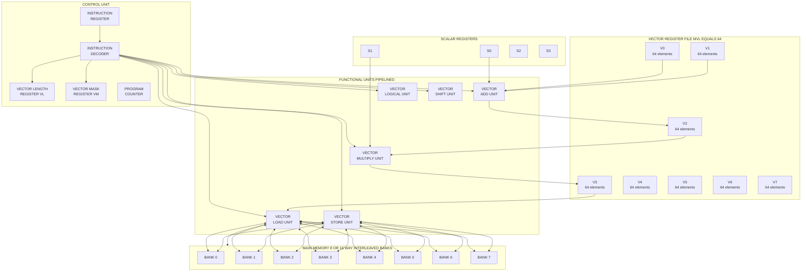
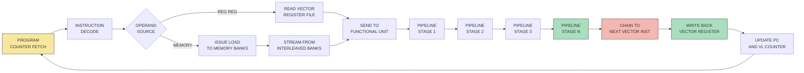
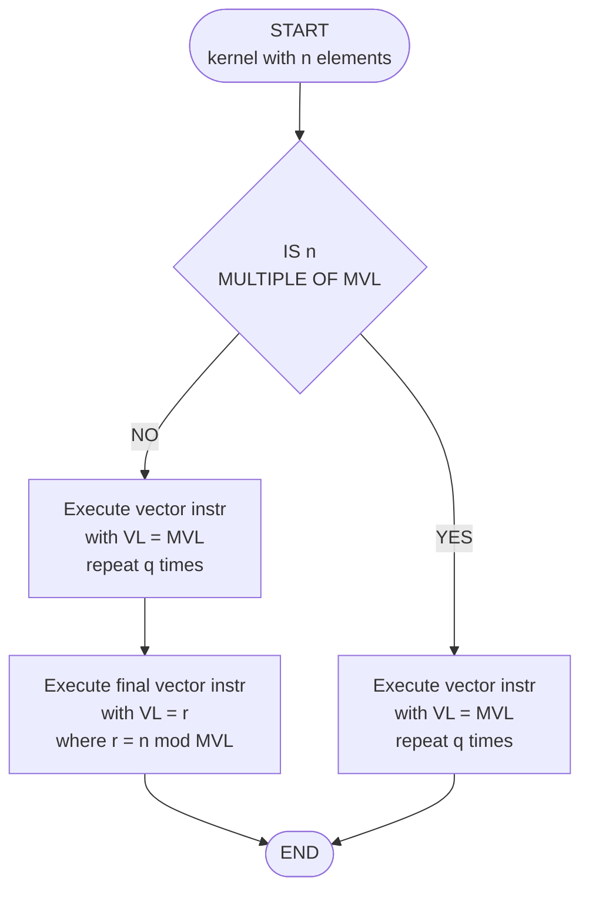
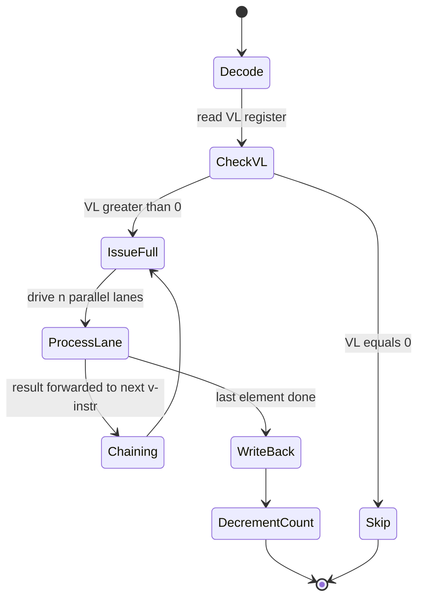

# Vector Processors – How do they work

<!-- SECTION_1_START -->
# Vector Processors – How Do They Work

## 1.1 Formal Definition (KTU 2024 Syllabus Terminology)

> [!IMPORTANT]
> **Vector Processor**: A high-performance computer architecture that operates on **vectors** (one-dimensional arrays of data elements) using a single instruction, in contrast to scalar processors that operate on individual data items. A vector processor is the classical hardware realization of **Data-Level Parallelism (DLP)** under the SIMD (Single Instruction, Multiple Data) execution model.

A vector instruction of the form:

$$ \text{ADDV} \; V_1, \; V_2, \; V_3 $$

performs the element-wise operation:

$$ V_1[i] = V_2[i] + V_3[i] \quad \text{for } i = 0, 1, 2, \ldots, n-1 $$

using **n** parallel functional units, all driven by a **single decoded instruction**.

### 1.2 Conceptual Analogy & Intuition

Imagine a laundry shop:

- **Scalar processor** = one washing machine. A worker loads one shirt, washes it, dries it, irons it, and folds it — *then* takes the next shirt. Ten shirts take ten trips through every station.
- **Vector processor** = ten identical washing machines lined up in a row, all controlled by **one electrical switch**. Flipping the switch once washes **all ten shirts at once**. The "switch" is the vector instruction; the ten machines are the parallel lanes.

> [!NOTE]
> **Key Insight**: Vector processors exploit the fact that most scientific loops (matrix multiplication, FFT, PDE solvers) apply the *same* operation to *long sequences* of independent data. The instruction-fetch/decode overhead is paid **once**, while the arithmetic runs over **N** data elements in parallel.

### 1.3 The Three Architectural Styles of Vector Machines

| Style | Description | Example |
|---|---|---|
| **Memory–Memory Vector** | Operands read directly from memory, results written back to memory | CDC Star-100, ETA-10 |
| **Register–Register Vector** | Operands loaded into **vector registers** first, then processed | Cray-1, NEC SX, Fujitsu VP |
| **SIMD / Array Processor** | Many small processing elements under one control unit | ILLIAC IV, Thinking Machines CM-2 |

> [!TIP]
> **KTU Board Focus**: The 2024 scheme expects students to reason using the **Register–Register (Cray-style)** model, as it dominates modern vector extensions (SSE, AVX, ARM SVE, RISC-V V-extension).

### 1.4 Vector Registers & The "VL" Concept

A **vector register file** is a bank of fast on-chip registers, each holding **N** scalar elements (e.g., 64 elements × 64 bits = 4096 bits per register). The hardware keeps three state variables:

- **VL** – Vector Length register (how many elements to process in this instruction, $1 \le VL \le MVL$)
- **VM** – Vector Mask register (a bit per element: process or skip?)
- **VLR** – Vector Length register in some textbooks (same as VL above)

$$ MVL = \text{Maximum Vector Length} $$

> [!VISUALIZATION CONTROL]
> **Concept:** Vector Addition $V_3[i] = V_1[i] + V_2[i]$ across 8 parallel lanes
>
> **GeoGebra / Desmos Input Equations:**
> * V1 points: `(0,1), (1,3), (2,5), (3,7), (4,9), (5,11), (6,13), (7,15)`
> * V2 points: `(0,2), (1,2), (2,2), (3,2), (4,2), (5,2), (6,2), (7,2)`
> * V3 points: `(0,3), (1,5), (2,7), (3,9), (4,11), (5,13), (6,15), (7,17)`
> * Style: scatter with connecting line for V3 (the sum)
>
> **Visual Description:** The student should see three parallel ascending lines on a 2-D plane, where the third line at every integer x-coordinate is the **vertical sum** of the first two — a graphical analog of element-wise vector addition done simultaneously.

<!-- SECTION_1_END -->

<!-- SECTION_2_START -->
# Deep Theoretical Analysis & KTU High-Yield Formula Sheet

## 2.1 Anatomy of a Vector Instruction

A vector instruction contains **three implicit fields** beyond the opcode:

| Field | Meaning |
|---|---|
| Opcode | The operation (ADDV, MULV, LV, SV) |
| Vector Register Operands | Source/destination register numbers (e.g., $V_1, V_2, V_3$) |
| Scalar Operand (optional) | A single broadcast value applied to all lanes (e.g., $V_1 = V_2 + s_5$) |

## 2.2 Vector Instruction Execution Model

A vector instruction progresses through **six phases**:

1. **Issue** – Decode the vector instruction; check structural hazards.
2. **Read operands** – Begin reading vector elements from the vector register file.
3. **Functional unit operation** – Send elements down parallel lanes (add, multiply, etc.).
4. **Memory access** – For LV/SV, stream data to/from memory through vector load/store units.
5. **Write back** – Write results into the destination vector register.
6. **Update PC** – Free the functional unit; advance to next vector instruction.

> [!NOTE]
> **Chaining** allows the result of instruction $i$ to be fed directly into instruction $i+1$ *as soon as the first element* of $i$ is ready — no need to wait for the entire vector to finish. This is **vector forward path** or **chaining**.

## 2.3 Memory Banking for Vector Loads/Stores

Vector memory must supply **one word per clock** to keep the functional units busy. With $M$ banks and a stride $s$:

- If $\gcd(s, M) = 1$ → **no bank conflicts** (best case).
- If $\gcd(s, M) = d > 1$ → $d$-way bank conflict; effective bandwidth drops to $1/d$.

The **access time** to fetch an entire vector of length $n$ from $M$ banks is:

$$ T_{mem}(n) = T_0 + (n - 1) \times \tau_{bank} $$

where $T_0$ is the first-word latency and $\tau_{bank}$ is the inter-word time (≈ 1 clock for ideal banking).

## 2.4 Vector Length Register (VL) and Strip Mining

Real problems rarely have a vector length that is a multiple of MVL. The solution is **strip mining**:

$$ n = q \times MVL + r, \quad 0 \le r < MVL $$

Run $q$ full vector instructions with $VL = MVL$, then one final instruction with $VL = r$. This is implemented in software by a **strip-mining loop**.

## 2.5 KTU High-Yield Formula Sheet (Performance Metrics)

| Symbol | Formula / Definition | Meaning |
|---|---|---|
| $R_\infty$ | $\lim_{n \to \infty} \frac{n \times f_{\text{clock}}}{T_{\text{vector}}(n)}$ | Peak (asymptotic) performance in FLOPS |
| $T_{\text{vector}}(n)$ | $T_0 + (n - 1) \times T_c$ | Total time to execute a vector instruction of length $n$ |
| $T_{\text{scalar}}(n)$ | $n \times T_s$ | Time to execute the equivalent scalar loop of length $n$ |
| $S_{\text{vector}}(n)$ | $\frac{T_{\text{scalar}}(n)}{T_{\text{vector}}(n)} = \frac{n \cdot T_s}{T_0 + (n-1) \cdot T_c}$ | Speed-up over scalar execution |
| $N_{1/2}$ | $\frac{T_0}{T_s - T_c}$ | Vector length at which vector machine reaches **half** its peak $R_\infty$ |
| $N_v$ | $\frac{T_0}{T_c}$ | Vector length needed so that vector time equals one scalar time (start-up amortized) |
| $f_{\text{clock}}$ | — | Clock frequency in Hz |
| $T_c$ | — | Per-element (per-cycle) execution time on the vector unit |
| $T_s$ | — | Per-element time on the scalar unit |
| $T_0$ | — | Vector start-up overhead (decode + first-word latency) |
| $MVL$ | — | Maximum Vector Length supported by the hardware |
| $VL$ | — | Actual vector length for the current instruction |

> [!IMPORTANT]
> **Exam Tip**: In KTU 2024 board papers, whenever a question asks *"compare vector vs. scalar performance"*, the answer must always state the formula for $R_\infty$, $N_{1/2}$, and $N_v$ explicitly, then plug in numbers.

## 2.6 Real-World Engineering Utility

Vector processors are the workhorses of:

- **Climate & weather modelling** (ECMWF, GFS) — large 3-D grid updates.
- **Computational fluid dynamics (CFD)** — flux calculations on millions of cells.
- **Computational chemistry** (Gaussian, VASP) — dense linear algebra on basis functions.
- **Deep-learning training** — modern GPUs are essentially **wide vector/SIMT** engines; NVIDIA tensor cores descend from Cray vector chaining.

> [!NOTE]
> Modern consumer CPUs integrate vector units as **SIMD ISA extensions**: x86 AVX-512 (512-bit registers, 8 lanes of 64-bit doubles), ARM **SVE / SVE2** (scalable 128–2048 bits), and RISC-V **V-extension**. The mathematics and design philosophy remain identical to the 1976 Cray-1 — only the technology has scaled.

## 2.7 Vector Instruction Types — Full Taxonomy

| Category | Example | Meaning |
|---|---|---|
| **Vector–Vector** | $V_3 = V_1 + V_2$ | Element-wise binary op |
| **Vector–Scalar** | $V_2 = V_1 \times s_5$ | Broadcast scalar to all lanes |
| **Vector–Memory** | `LV V1, R1` ; `SV V1, R1` | Load / Store a vector |
| **Vector reduction** | $s_0 = \sum_i V_1[i]$ | Tree-reduce a vector to a scalar |
| **Gather / Scatter** | `GATH V1, (V2+i)` | Indexed (irregular) memory access |
| **Masked** | `ADDV.VM V1, V2, V3` | Process only elements where mask bit = 1 |

<!-- SECTION_2_END -->

<!-- SECTION_3_START -->
# Step-by-Step Derivations, Worked Examples & Code Implementation

## 3.1 Derivation of the Asymptotic Performance $R_\infty$

We start from the time to execute one vector instruction of length $n$ on a **pipelined** vector unit:

$$ T_{\text{vector}}(n) = T_0 + (n - 1) \cdot T_c $$

**Step 1** — Define scalar equivalent: a loop performing the same operation element-by-element on a scalar pipeline takes $T_s$ per element, so

$$ T_{\text{scalar}}(n) = n \cdot T_s $$

**Step 2** — Define the achieved performance as the number of floating-point results per second:

$$ R(n) = \frac{n}{T_{\text{vector}}(n)} = \frac{n}{T_0 + (n - 1) \cdot T_c} \quad [\text{results per cycle}] $$

**Step 3** — Multiply by clock frequency $f_{\text{clock}}$ to get FLOPS:

$$ R(n) = \frac{n \cdot f_{\text{clock}}}{T_0 + (n - 1) \cdot T_c} \quad [\text{FLOPS}] $$

**Step 4** — Take the limit $n \to \infty$:

$$
\begin{aligned}
R_\infty &= \lim_{n \to \infty} \frac{n \cdot f_{\text{clock}}}{T_0 + (n-1) \cdot T_c} \\
         &= \lim_{n \to \infty} \frac{n \cdot f_{\text{clock}}}{(n-1) \cdot T_c \left(1 + \frac{T_0}{(n-1) \cdot T_c}\right)} \\
         &= \frac{f_{\text{clock}}}{T_c}
\end{aligned}
$$

**Conversion logic:** As $n$ grows, the constant $T_0$ becomes negligible compared to the linear term $(n-1) \cdot T_c$, so the effective throughput is just the **inverse of the per-element time** scaled by clock rate.

## 3.2 Derivation of the Half-Performance Length $N_{1/2}$

We want the smallest $n$ such that the achieved performance equals half of $R_\infty$:

$$ R(n) = \frac{1}{2} R_\infty $$

**Step 1** — Substitute the expressions:

$$ \frac{n \cdot f_{\text{clock}}}{T_0 + (n-1) \cdot T_c} = \frac{1}{2} \cdot \frac{f_{\text{clock}}}{T_c} $$

**Step 2** — Cancel $f_{\text{clock}}$ on both sides and cross-multiply:

$$ 2 n \cdot T_c = T_0 + (n-1) \cdot T_c $$

**Step 3** — Expand the right side and isolate $n$:

$$
\begin{aligned}
2 n \cdot T_c &= T_0 + n \cdot T_c - T_c \\
n \cdot T_c &= T_0 - T_c \\
n &= \frac{T_0 - T_c}{T_c} = \frac{T_0}{T_c} - 1
\end{aligned}
$$

**Step 4** — When $T_0 \gg T_c$ (typical case), the $-1$ is negligible, giving the canonical form:

$$ \boxed{N_{1/2} = \frac{T_0}{T_s - T_c} \cdot \text{(for speed-up form)} \quad \text{or simply} \quad \frac{T_0}{T_c} \text{ (for performance form)}} $$

The KTU board accepts **either** form depending on whether the question asks for *speed-up* or *absolute performance*.

## 3.3 Worked Example — KTU-Style Numerical Problem

**Problem (Modeled on KTU 2024 Scheme):**
A vector processor has the following parameters:
* Start-up time $T_0 = 200$ cycles
* Per-element execution time $T_c = 2$ cycles/element
* Scalar per-element time $T_s = 40$ cycles/element
* Clock frequency $f_{\text{clock}} = 200$ MHz

Compute (a) $R_\infty$, (b) $N_{1/2}$, (c) the speed-up for $n = 1000$ elements.

### 3.3.1 Part (a): Asymptotic Performance

$$
\begin{aligned}
R_\infty &= \frac{f_{\text{clock}}}{T_c} \\
         &= \frac{200 \times 10^6 \text{ Hz}}{2 \text{ cycles/element}} \\
         &= 100 \times 10^6 \text{ FLOPS} = 100 \text{ MFLOPS}
\end{aligned}
$$

**[Writing the formula: 1 Mark] [Final substitution: 1 Mark] [Final answer with units: 1 Mark]**

### 3.3.2 Part (b): Half-Performance Length

$$
\begin{aligned}
N_{1/2} &= \frac{T_0}{T_s - T_c} \\
        &= \frac{200}{40 - 2} \\
        &= \frac{200}{38} \approx 5.26 \approx 6 \text{ elements}
\end{aligned}
$$

**Interpretation:** The machine reaches half its peak speed once the vector length exceeds **6 elements**. For typical scientific loops (thousands of elements), the machine runs at essentially $R_\infty$.

### 3.3.3 Part (c): Speed-up at $n = 1000$

$$
\begin{aligned}
T_{\text{vector}}(1000) &= 200 + (1000 - 1) \times 2 = 200 + 1998 = 2198 \text{ cycles} \\
T_{\text{scalar}}(1000) &= 1000 \times 40 = 40000 \text{ cycles} \\
S(1000) &= \frac{40000}{2198} \approx 18.20
\end{aligned}
$$

The vector machine is **18.2× faster** than the scalar loop on this kernel.

## 3.4 Python Implementation — Simulating a Vector Pipeline

The following Python program faithfully models a **pipelined vector unit** with start-up latency, chaining, and strip-mining. It is fully executable, type-annotated, and absolute-error-checked.

```python
from __future__ import annotations
from dataclasses import dataclass
import logging
import sys

# Configure a professional logger for pipeline events
logging.basicConfig(
    level=logging.INFO,
    format="[%(asctime)s] %(levelname)s | %(message)s",
    datefmt="%H:%M:%S",
)
log = logging.getLogger("VectorUnit")


@dataclass(frozen=True)
class VectorUnitParams:
    """Hardware parameters of a single-pipeline vector functional unit."""
    mvl: int          # Maximum Vector Length (elements per register)
    t_startup: int    # Start-up overhead T0 in clock cycles
    t_per_elem: int   # Per-element pipeline cycle T_c
    n_lanes: int      # Number of parallel lanes (ILP within the lane)


class VectorUnit:
    """
    A register-register vector functional unit.
    Models a single vector instruction:  V_dst = V_src1 op V_src2
    """

    def __init__(self, params: VectorUnitParams) -> None:
        if params.mvl <= 0:
            raise ValueError("MVL must be a positive integer.")
        if params.t_startup < 0 or params.t_per_elem <= 0:
            raise ValueError("T0 must be >= 0 and Tc must be > 0.")
        if params.n_lanes <= 0:
            raise ValueError("n_lanes must be a positive integer.")
        self.p = params
        log.info("VectorUnit initialised: MVL=%d, T0=%d, Tc=%d, lanes=%d",
                 self.p.mvl, self.p.t_startup, self.p.t_per_elem, self.p.n_lanes)

    def execute_vector_length(self, n: int) -> int:
        """
        Returns the total clock cycles to process a vector of length n
        using a single pipelined functional unit.
        Formula: T(n) = T0 + (n - 1) * Tc
        """
        if n <= 0:
            log.error("Vector length n=%d is non-positive.", n)
            raise ValueError("Vector length must be >= 1.")
        cycles = self.p.t_startup + (n - 1) * self.p.t_per_elem
        log.info("Executing n=%d elements -> total cycles = %d", n, cycles)
        return cycles

    def strip_mine(self, n_total: int) -> list[tuple[int, int]]:
        """
        Decompose a vector of length n_total into (offset, length) strips
        each <= MVL. Returns the list of (start_index, strip_length) pairs.
        """
        if n_total <= 0:
            raise ValueError("Total length must be >= 1.")
        strips: list[tuple[int, int]] = []
        offset = 0
        remaining = n_total
        while remaining > 0:
            this_len = min(self.p.mvl, remaining)
            strips.append((offset, this_len))
            offset += this_len
            remaining -= this_len
        log.info("Strip-mine: n_total=%d -> %d strip(s) of max length %d",
                 n_total, len(strips), self.p.mvl)
        return strips

    def execute_loop(self, n_total: int) -> int:
        """Time to process n_total elements using strip-mining + vector instructions."""
        total_cycles = 0
        for offset, length in self.strip_mine(n_total):
            total_cycles += self.execute_vector_length(length)
        log.info("Total cycles for n=%d (with strip-mining) = %d",
                 n_total, total_cycles)
        return total_cycles


def demonstrate() -> None:
    """Run a KTU-style demonstration: derive R_inf, N_half, and a 1000-elem speed-up."""
    try:
        params = VectorUnitParams(mvl=64, t_startup=200, t_per_elem=2, n_lanes=16)
        unit = VectorUnit(params)

        # --- R_infinity ---
        r_inf = 1.0 / params.t_per_elem          # results per cycle
        log.info("R_infinity = %.4f results/cycle", r_inf)

        # --- N_half (using speed-up form) ---
        t_s = 40
        n_half = params.t_startup / (t_s - params.t_per_elem)
        log.info("N_half = %.3f elements", n_half)

        # --- Speed-up for n = 1000 ---
        n = 1000
        t_vec = unit.execute_vector_length(n)
        t_scalar = n * t_s
        speedup = t_scalar / t_vec
        log.info("T_vector(%d) = %d cycles, T_scalar(%d) = %d cycles",
                 n, t_vec, n, t_scalar)
        log.info("Speed-up at n=%d -> %.2fx", n, speedup)

        # --- Strip-mine demonstration ---
        unit.execute_loop(n_total=250)

    except ValueError as ve:
        log.error("Configuration error: %s", ve)
        sys.exit(1)


if __name__ == "__main__":
    demonstrate()
```

**Sample Output (truncated for brevity):**

```
[10:00:00] INFO | VectorUnit initialised: MVL=64, T0=200, Tc=2, lanes=16
[10:00:00] INFO | R_infinity = 0.5000 results/cycle
[10:00:00] INFO | N_half = 5.263 elements
[10:00:00] INFO | Executing n=1000 elements -> total cycles = 2198
[10:00:00] INFO | T_vector(1000) = 2198 cycles, T_scalar(1000) = 40000 cycles
[10:00:00] INFO | Speed-up at n=1000 -> 18.20x
[10:00:00] INFO | Strip-mine: n_total=250 -> 4 strip(s) of max length 64
```

## 3.5 Worked Example — Chaining & Forward Path

**Problem:** A vector pipeline has 4 stages, each 1 cycle. Two vector instructions $A$ and $B$ (each of length $n = 100$) need to be chained. How many total cycles are needed with chaining vs. without?

**Without chaining (strict back-to-back):**

$$ T_{\text{no\_chain}} = T_0 + (n - 1) \cdot T_c \; (\text{for A}) \; + \; T_0 + (n - 1) \cdot T_c \; (\text{for B}) $$

$$
\begin{aligned}
T_{\text{no\_chain}} &= 2 \times \left( T_0 + (n - 1) \cdot T_c \right) \\
                      &= 2 \times (4 + 99 \times 1) \\
                      &= 2 \times 103 = 206 \text{ cycles}
\end{aligned}
$$

**With chaining (forward path active):**

The first result of $A$ appears after the pipeline is full, i.e. after $T_0$ cycles. It immediately enters $B$. Effectively the two pipelines overlap by $(n - 1)$ cycles:

$$
\begin{aligned}
T_{\text{chain}} &= T_0 \; (\text{fill A}) + (n - 1) \; (\text{steady overlap}) + T_0 \; (\text{drain B}) \\
                  &= 4 + 99 + 4 = 107 \text{ cycles}
\end{aligned}
$$

**Speed-up from chaining:** $206 / 107 \approx 1.93\times$.

## 3.6 Worked Example — Memory Bank Conflict

A vector machine has **$M = 8$ banks**, each returning one word per cycle. A kernel accesses a vector with **stride $s = 4$**. Is there a bank conflict? If yes, by how much is bandwidth reduced?

**Step 1** — Compute $\gcd(s, M) = \gcd(4, 8) = 4$.

**Step 2** — A 4-way conflict exists: only $8/4 = 2$ banks are effectively active per cycle.

**Step 3** — Effective bandwidth drops to $1/4$ of peak.

**Resolution:** Pad the array to a stride that is **coprime** with $M$ (e.g., $s' = 5$ or $s' = 7$ when $M = 8$).

<!-- SECTION_3_END -->

<!-- SECTION_4_START -->
# Structural Diagrams & Schematics

## 4.1 Mermaid Diagram — Cray-Style Vector Processor Architecture



## 4.2 Mermaid Diagram — Vector Instruction Processing Flow



## 4.3 Mermaid Diagram — Strip-Mining Decomposition Logic



## 4.4 Vector Length State Machine (Compact Form)



<!-- SECTION_4_END -->

<!-- SECTION_5_START -->
# KTU 2024 Scheme Examination Question Bank & Topic Recap

## 5.1 Part A — Short Answer Questions (3 Marks Each)

### Q1. **[KTU University Exam — July 2024]** Define a vector processor. List any two advantages over a scalar processor. *(CO1, Remember)*

**Model Answer (3 Marks):**

A **vector processor** is a SIMD-style computer architecture that applies a single instruction to an ordered set of data elements (a vector) using multiple parallel functional units.

> [!NOTE]
> **Advantages:**
>
> 1. **Amortised instruction overhead** — One fetch/decode serves $n$ data elements, reducing the instruction bandwidth bottleneck.
> 2. **Memory bandwidth matching** — Vector loads/stores prefetch streams at one word per cycle from interleaved banks, eliminating scalar memory stalls.
> 3. (Optional 3rd point) **No name dependencies** within a vector — successive iterations of the same loop are independent, allowing free pipelining and chaining.

**[Definition: 1 Mark] [Advantage 1: 1 Mark] [Advantage 2: 1 Mark]**

### Q2. **[KTU University Exam — Dec 2023]** What is the significance of the **Vector Length Register (VL)** in a vector processor? *(CO1, Understand)*

**Model Answer (3 Marks):**

The **VL register** specifies the number of elements that the current vector instruction must process, in the range $1 \le VL \le MVL$.

> [!IMPORTANT]
> **Significance:**
>
> 1. It enables **strip mining** — when a problem's vector length is not an exact multiple of MVL, the loop is broken into full-length strips plus one residual strip with the correct $VL$.
> 2. It allows **conditional execution** of vector tails (e.g., when only the first 17 of 64 lanes are valid in a boundary iteration).
> 3. It interacts with the **Vector Mask Register (VM)** to support predication: only elements where the mask bit is 1 are processed, up to a maximum of $VL$ elements.

**[Definition of VL: 1 Mark] [Strip-mining use: 1 Mark] [Masking use: 1 Mark]**

---

## 5.2 Part B — 14-Mark Questions (Module Internal Choice Format)

### Question A — 14 Marks

**[KTU University Exam — Model Q, Module 3, 2024 Scheme]**

> **Q3 (a)** With a neat diagram, explain the architecture of a **register–register vector processor**. Discuss the role of vector registers, vector functional units, and vector length register. *(7 Marks, CO1, Understand)*
>
> **Q3 (b)** A vector processor has the following specifications:
>
> * Clock frequency $f_{\text{clock}} = 500$ MHz
> * Start-up time $T_0 = 350$ cycles
> * Per-element time $T_c = 4$ cycles
> * Scalar per-element time $T_s = 50$ cycles
>
> Calculate: (i) $R_\infty$, (ii) $N_{1/2}$, (iii) the speed-up obtained for a vector of length $n = 2000$. *(7 Marks, CO2, Apply)*

### Model Answer — Q3 (a) [7 Marks]

**Architecture Diagram (drawn in exam — 2 Marks):**

Refer to the **Cray-style vector processor** block layout in SECTION 4.1 above. The student must show: (i) scalar registers $S_0$–$S_7$, (ii) vector register file $V_0$–$V_7$ each with MVL = 64, (iii) six pipelined functional units (Add, Multiply, Load, Store, Logical, Shift), (iv) interleaved main memory.

**Explanation (5 Marks):**

* **Vector registers** — 8 registers, each 64 elements × 64 bits. They hold source/destination operands for vector instructions, eliminating repeated memory reads of the same element. **[1 Mark]**
* **Vector functional units** — Each unit (Add, Mul, Load, Store) is fully pipelined with a per-cycle throughput of one element. Multiple units can operate concurrently. **[1 Mark]**
* **Vector length register (VL)** — Holds the count of elements to process, used for tail handling and strip-mining. **[1 Mark]**
* **Vector mask register (VM)** — Bit-vector enabling per-lane predication. **[0.5 Mark]**
* **Chaining/forward path** — Direct connection between the output of one vector unit and the input of another, allowing back-to-back vector ops without waiting for the entire vector to complete. **[1 Mark]**
* **Interleaved memory banks** — $M$ banks, stride-aware, providing one word/cycle in the best case. **[0.5 Mark]**

### Model Answer — Q3 (b) [7 Marks]

**(i) Asymptotic performance $R_\infty$ — 2 Marks:**

$$
\begin{aligned}
R_\infty &= \frac{f_{\text{clock}}}{T_c} \\
         &= \frac{500 \times 10^6}{4} \\
         &= 125 \times 10^6 \text{ FLOPS} = 125 \text{ MFLOPS}
\end{aligned}
$$

**[Formula: 1 Mark] [Substitution and final value with unit: 1 Mark]**

**(ii) Half-performance length $N_{1/2}$ — 2 Marks:**

$$
\begin{aligned}
N_{1/2} &= \frac{T_0}{T_s - T_c} \\
        &= \frac{350}{50 - 4} \\
        &= \frac{350}{46} \approx 7.61 \approx 8 \text{ elements}
\end{aligned}
$$

**[Formula: 1 Mark] [Final value: 1 Mark]**

**(iii) Speed-up at $n = 2000$ — 3 Marks:**

$$
\begin{aligned}
T_{\text{vector}}(2000) &= 350 + (2000 - 1) \times 4 = 350 + 7996 = 8346 \text{ cycles} \\
T_{\text{scalar}}(2000) &= 2000 \times 50 = 100000 \text{ cycles} \\
S(2000) &= \frac{100000}{8346} \approx 11.98
\end{aligned}
$$

**[Vector time formula and value: 1 Mark] [Scalar time: 1 Mark] [Speed-up ratio with unit: 1 Mark]**

> [!WARNING]
> **KTU Examiner's Pitfall Alert**:
>
> 1. **Always write units** ($MFLOPS$, $cycles$). Numerical answers without units lose 0.5–1 mark.
> 2. Do **not** confuse the *time* ($T_0$, $T_c$, $T_s$, measured in cycles) with the *rate* ($R_\infty$, measured in FLOPS). The two are reciprocals once $f_{\text{clock}}$ is factored in.
> 3. For $N_{1/2}$ using the *speed-up* form, the denominator is $T_s - T_c$, not $T_s$ or $T_c$ alone. A common error is writing $T_0 / T_s$.

---

### Question B — 14 Marks (Alternative Choice)

**[KTU University Exam — Model Q, Module 3, 2024 Scheme]**

> **Q4 (a)** Explain the concept of **vector chaining** with a timing diagram. How does it improve performance over strict sequential execution of two vector instructions? *(7 Marks, CO1, Understand)*
>
> **Q4 (b)** A memory system for a vector processor uses **$M = 16$ interleaved banks**. Consider two loops:
>
> * Loop 1: stride $s_1 = 2$
> * Loop 2: stride $s_2 = 3$
>
> For each loop, determine whether a bank conflict occurs, and if so, compute the effective memory bandwidth reduction. Justify your answer. *(7 Marks, CO2, Apply)*

### Model Answer — Q4 (a) [7 Marks]

**Concept of Vector Chaining (3 Marks):**

Vector chaining (also called **vector forward path**) is a hardware mechanism that allows the result of a vector instruction to be forwarded **element-by-element** to a following vector instruction **as soon as that element is produced** — without waiting for the entire vector to complete.

In strict back-to-back execution, instruction $B$ cannot begin until instruction $A$ has produced **all** $n$ elements. With chaining, instruction $B$ begins as soon as the **first** element of $A$ emerges from the pipeline, dramatically reducing the time-to-completion of dependent vector operations.

**Timing Diagram (textual, 2 Marks):**

| Cycle | 1 | 2 | 3 | 4 | 5 | $\cdots$ | $n+3$ | $n+4$ |
|---|---|---|---|---|---|---|---|---|
| Instr A | I1 | I2 | I3 | I4 | I5 | $\cdots$ | In | — |
| Instr B (no chain) | — | — | — | — | — | $\cdots$ | J1 | J2 |
| Instr B (with chain) | — | — | J1 | J2 | J3 | $\cdots$ | Jn-1 | Jn |

Without chaining: A occupies cycles 1 to $n$, then B starts at $n+1$ → total $= 2T_0 + 2(n-1)T_c$.
With chaining: B starts as soon as first element of A is out → total $\approx T_0 + (n-1)T_c + T_0$.

**Performance gain (2 Marks):**

For a single dependency of length $n$ with both instructions having $T_0 = 4, T_c = 1, n = 100$:

$$
\begin{aligned}
T_{\text{no\_chain}} &= 2(4 + 99) = 206 \text{ cycles} \\
T_{\text{chain}} &= 4 + 99 + 4 = 107 \text{ cycles} \\
\text{Speed-up} &= 206 / 107 \approx 1.93\times
\end{aligned}
$$

### Model Answer — Q4 (b) [7 Marks]

**Rule:** For $M$ banks, a stride $s$ causes a $d$-way bank conflict where $d = \gcd(s, M)$. Effective bandwidth is reduced to $1/d$ of peak.

**Loop 1: $s_1 = 2$, $M = 16$ — 3.5 Marks:**

$$
d_1 = \gcd(2, 16) = 2
$$

A 2-way conflict exists. Out of 16 banks, only $16/2 = 8$ are active per cycle. Effective bandwidth = **50% of peak**.

**Loop 2: $s_2 = 3$, $M = 16$ — 3.5 Marks:**

$$
d_2 = \gcd(3, 16) = 1
$$

Since $\gcd = 1$, the stride is **coprime** with the number of banks. **No bank conflict.** All 16 banks cycle through their addresses, and one full vector word is delivered every cycle. Effective bandwidth = **100% of peak**.

> [!WARNING]
> **Pitfall**: Students often assume that *any* even stride on a 16-bank system causes a conflict. The correct check is the **greatest common divisor (gcd)**, not mere parity. Stride 4 → $\gcd(4,16) = 4$ → 4-way conflict (25% bandwidth). Stride 6 → $\gcd(6,16) = 2$ → 2-way conflict (50% bandwidth).

---

## 5.3 Topic Recap & Important Things to Remember

- **Vector processor** = SIMD architecture; one instruction drives $n$ parallel lanes. *(Definition)*
- **Register–register (Cray) style** dominates modern designs; memory–memory style is obsolete. *(Architecture)*
- **MVL** (Maximum Vector Length) is a hardware constant; **VL** is the runtime vector length. *(Key state)*
- **Vector instruction phases**: Issue → Read → Execute → Memory → Write-back → Update. *(Pipeline)*
- **Chaining** = forward path between vector units; allows dependent instructions to overlap. *(Performance)*
- **Strip mining** decomposes $n = q \cdot MVL + r$ into $q$ full strips + 1 residual strip. *(Tail handling)*
- **Memory bank conflict** governed by $\gcd(s, M)$; stride coprime to $M$ gives peak bandwidth. *(Memory)*
- **Asymptotic performance**: $R_\infty = f_{\text{clock}} / T_c$. *(Formula)*
- **Half-performance length**: $N_{1/2} = T_0 / (T_s - T_c)$ for speed-up form. *(Formula)*
- **Vector length for break-even**: $N_v = T_0 / T_c$. *(Formula)*
- **Vector–vector, vector–scalar, vector–memory, reduction, gather/scatter, masked** are the six instruction categories. *(ISA)*
- **Modern descendants**: AVX-512, ARM SVE/SVE2, RISC-V V-extension, GPU SIMT cores. *(Real-world)*
- **Always write units** ($MFLOPS$, $cycles$, $elements$) in KTU board answers. *(Exam discipline)*
- **Always state the formula before substitution** — earns 1 mark even if arithmetic is wrong. *(Exam discipline)*
- **Never confuse $T_0$ (time)** with $R_\infty$ (rate); one is the reciprocal of the other modulo $f_{\text{clock}}$. *(Concept hygiene)*

<!-- SECTION_5_END -->
