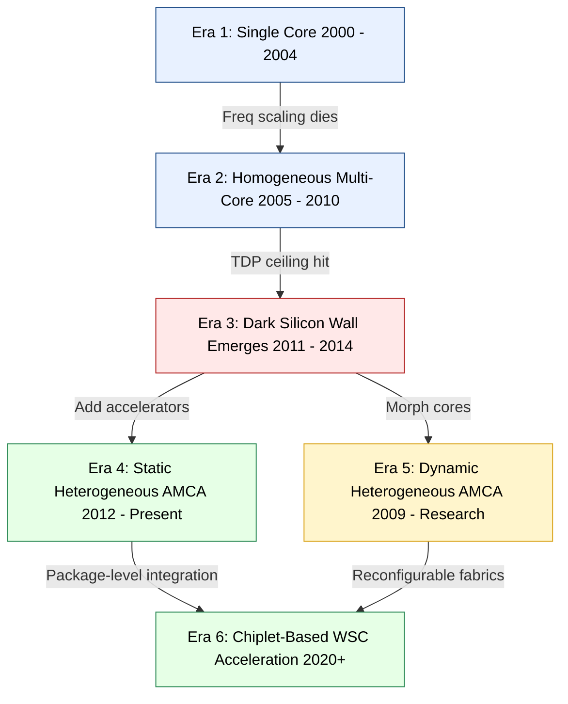
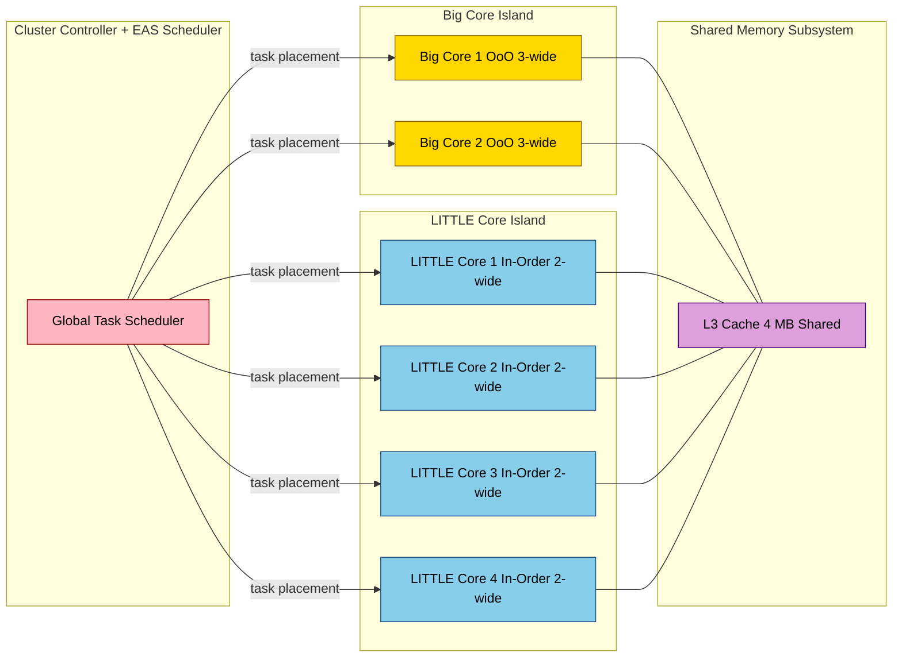
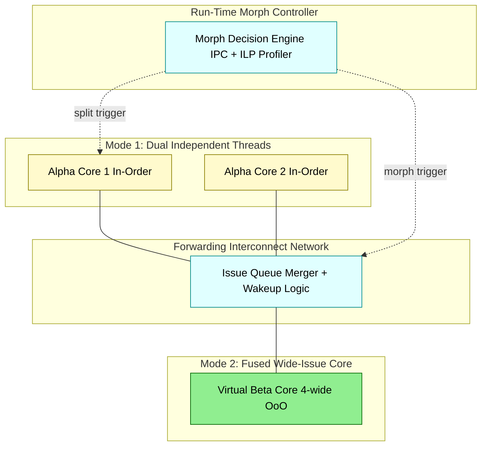
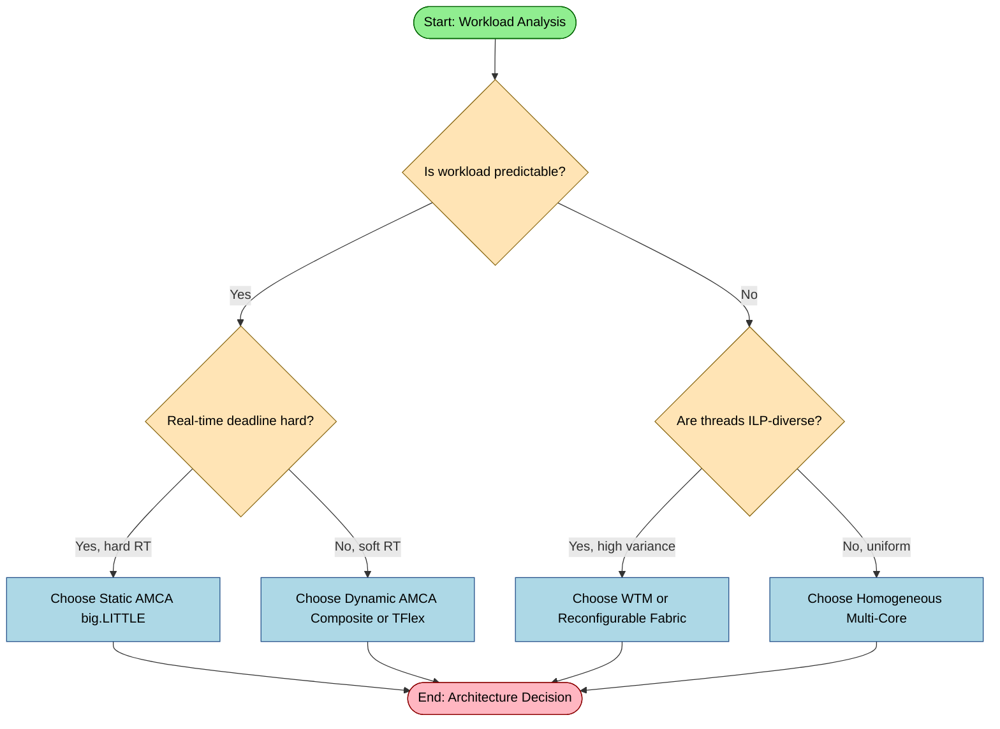

# Dark Silicon and the transition towards Heterogeneous Architectures Asymmetric multi-core architecture – Static and Dynamic (Overall idea, example processors)

<!-- SECTION_1_START -->
# Dark Silicon and the Transition Towards Heterogeneous Architectures
## Asymmetric Multi-Core Architecture: Static & Dynamic

---

## 1. Core Technical Definition & Intuitive Overview

### 1.1 Dark Silicon — Formal Definition

> [!IMPORTANT]
> **Dark Silicon (KTU 2024 PECST528 Definition):**
> The fraction of transistors on a **die (chip)** that **cannot be powered-on simultaneously** at the nominal supply voltage under the worst-case thermal design power (TDP) constraint, due to the breakdown of **Dennard Scaling** and the resulting exponential rise in per-transistor power density.

Formally, the **dark silicon fraction** $f_{DS}$ is defined as:

$$
f_{DS} = \frac{N_{dark}}{N_{total}} = 1 - \frac{P_{budget}}{P_{full-active}}
$$

where $N_{dark}$ is the number of transistors that must remain powered-off (or clock-gated), and $P_{budget}$ is the TDP-constrained power budget.

> [!NOTE]
> **Origin of the Term:** Coined by Prof. **Shekhar Borkar** (Intel) and formalized analytically by **Esmaeilzadeh et al. (ISCA 2011)** in their landmark paper *"Dark Silicon and the End of Multicore Scaling."*

---

### 1.2 Intuitive Analogy — The "Office Building" View of Dark Silicon

> [!TIP]
> **Real-World Analogy (Office Building Power Limit):**
> Imagine a **20-storey office building** with the electrical wiring rated for a maximum of **500 kW**. Each floor needs 40 kW when fully occupied. As the company grows, you keep adding more floors, but the wiring capacity stays fixed at **500 kW** (analogous to the fixed TDP). When you add the 13th floor, you can no longer light up *all* the offices simultaneously — some floors must remain **dark**, even though they exist physically. They are "dark silicon" — *present but unusable* at full load.
>
> Just like building managers must now **assign staff (workload) smartly** to only the lit floors, computer architects must **route threads intelligently** to active cores.

---

### 1.3 Heterogeneous Architecture & Asymmetric Multi-Core — Formal Definitions

> [!IMPORTANT]
> **Heterogeneous Architecture (KTU 2024 Definition):**
> A multi-core processor design in which cores on the **same die** differ in **one or more micro-architectural attributes** — such as **issue width, pipeline depth, clock frequency, in-order/out-of-order execution, ISA extensions, or cache hierarchy** — to better match the **diverse computational profiles** of modern workloads.

> [!IMPORTANT]
> **Asymmetric Multi-Core Architecture (AMCA):**
> The most common realization of heterogeneity where cores are grouped into **two or more classes** of different performance/power envelopes. Two principal variants exist:
>
> - **Static AMCA:** Core types are *fixed at design-time* (e.g., ARM **big.LITTLE**, Intel **Lakefield**).
> - **Dynamic AMCA:** Core types are *reconfigurable at run-time* through voltage-frequency islands, body-biasing, or micro-architectural morphing (e.g., **WTM**, **TFlex**, **Composite Cores**).

---

### 1.4 GeoGebra / Desmos Visualization Callout

> [!VISUALIZATION CONTROL]
> **Concept:** The Dennard Scaling Breakdown and the Rise of Dark Silicon
>
> **Desmos Input Equations:**
> * `y1 = 1`  &nbsp;&nbsp; (Transistor count — exponential)
> * `y2 = 0.5 * e^(0.05x)` &nbsp;&nbsp; (Available power budget — capped)
> * `y3 = y2 / y1` &nbsp;&nbsp; (Active silicon fraction — collapses)
> * `x` range: $0 \le x \le 60$ (process node generations, $nm \rightarrow$)
>
> **Visual Description:** Plot $y_1$, $y_2$, and $y_3$ on the same axes. Observe how $y_3$ (the dark-silicon active fraction) **plummets toward zero** after roughly the $90\,nm$ node — the visual signature of the **Power Wall** crossing.

---

### 1.5 Why This Matters — The KTU 2024 Motivation

> [!WARNING]
> **End of Dennard Scaling (R. Dennard, IBM, 1974):**
> Classical Dennard scaling predicted that as transistors shrank, **power density remained constant**, allowing higher clock frequencies. This broke down around **$2004$–$2006$** due to **leakage current** and **threshold-voltage** limitations. Consequently:
>
> 1. Single-core performance plateaued.
> 2. Multi-core scaling became the only lever — but it too hit the **utilization wall** (dark silicon).
> 3. The industry pivoted to **specialized, heterogeneous cores** (GPUs, TPUs, big.LITTLE, etc.).
<!-- SECTION_1_END -->

<!-- SECTION_2_START -->
# 2. Deep Theoretical Analysis & KTU High-Yield Formula Sheet

---

## 2.1 The Three Walls Driving Dark Silicon

| # | Wall | Physical Cause | Architectural Consequence |
|---|------|----------------|---------------------------|
| 1 | **Power Wall** | $V_{DD}$ can no longer scale with feature size due to leakage | Frequency scaling halted $\Rightarrow$ Multi-core era |
| 2 | **Utilization Wall** | Amdahl's Law caps parallel speedup; serial portions dominate | Adding more cores yields diminishing returns |
| 3 | **ILP Wall** | Instruction-Level Parallelism is finite ($\approx 4$–$8$ in practice) | Superscalar depth cannot increase further |

The combined effect produces an **irreducible dark silicon fraction** of **$50\%$–$80\%$** projected at the **$11\,nm$** and beyond nodes (Esmaeilzadeh et al., 2011).

---

## 2.2 Sources of Dark Silicon

1. **Power-budget bound dark silicon** — due to TDP limits.
2. **Thermal-bound dark silicon** — due to cooling envelope.
3. **Reliability-bound dark silicon** — NBTI/PBTI aging margins.
4. **Variability-bound dark silicon** — process variation forces guard-banding.
5. **Yield-bound dark silicon** — defective cores deactivated post-fab.

---

## 2.3 The Static–Dynamic Asymmetry Spectrum

> [!NOTE]
> **Static Asymmetry (Design-Time Heterogeneity):**
> * Cores of different types are **fabricated** and **physically present** on the die.
> * Mapping of threads to cores is decided by the **OS scheduler / hardware thread arbiter**.
> * Examples: **ARM big.LITTLE**, **Intel Lakefield (1 big + 4 small)**, **NVIDIA Kal-El (4 Cortex-A9 + 1 companion core)**.

> [!NOTE]
> **Dynamic Asymmetry (Run-Time Heterogeneity):**
> * A core's **micro-architectural personality** can be morphed at run-time.
> * Achieved through reconfigurable pipelines, VF-isolation, or micro-code morphing.
> * Examples: **WTM (Wisconsin Turbotranslator Morph)**, **TFlex (Hsu et al., 2005)**, **Composite Cores (Kumar et al., MICRO 2009)**.

---

## 2.4 KTU High-Yield Formula Sheet

| # | Symbol | Formula / Definition | Physical Meaning | Units |
|---|--------|----------------------|------------------|-------|
| 1 | $P_{dyn}$ | $P_{dyn} = \alpha C V_{DD}^{2} f$ | Dynamic switching power | $W$ |
| 2 | $P_{static}$ | $P_{static} = I_{leak} V_{DD}$ | Static (leakage) power | $W$ |
| 3 | $P_{total}$ | $P_{total} = N \cdot (\alpha C V_{DD}^{2} f + I_{leak} V_{DD})$ | Total chip power for $N$ cores | $W$ |
| 4 | $E_{dyn}$ | $E_{dyn} = \alpha C V_{DD}^{2}$ | Energy per switching event | $J$ |
| 5 | $DIBL$ | $V_t \propto V_{DD} \cdot \eta$ | Drain-Induced Barrier Lowering effect | $V$ |
| 6 | $f_{DS}$ | $f_{DS} = 1 - \dfrac{P_{budget}}{N \cdot P_{core}}$ | Dark-silicon fraction | unitless |
| 7 | Amdahl | $S(N) = \dfrac{1}{(1-f) + \dfrac{f}{N}}$ | Speedup with $N$ cores & serial fraction $f$ | unitless |
| 8 | Roofline | $\text{Perf} = \min(P_{peak}, I \cdot B)$ | Attainable GFLOPS bound | GFLOPS/s |
| 9 | DVFS | $P \propto V^{2} f$ | Power under DVFS scaling | $W$ |
| 10 | EDP | $EDP = E \cdot T_{exec}$ | Energy-Delay Product (efficiency metric) | $J \cdot s$ |

> [!TIP]
> **Mnemonic for Power Equation — "Alpha Cat Viciously Fast":**
> **$\alpha C V_{DD}^{2} f$** $\rightarrow$ **A**ctivity, **C**apacitance, **V**oltage, **F**requency.

---

## 2.5 Real-World Engineering Utility

| Domain | Application | Why Heterogeneous AMCA? |
|--------|-------------|--------------------------|
| **Mobile SoCs** (Phones/Tablets) | Samsung Exynos, Qualcomm Snapdragon | Battery-driven — must choose *big* cores for bursts, *LITTLE* cores for idle/background |
| **Datacenter WSCs** | AWS Graviton, Ampere Altra | Per-core TDP must be high-density; only $1$ ISA class but many SKU variants |
| **Client Laptops** | Intel Lakefield, Alder Lake (P+E cores) | Match thread mix; boost short-lived interactive threads on P-cores |
| **Embedded/IoT** | Xtensa LX7 (ESP32) | Run-time configurable cores for varied DSP/Control workloads |
| **HPC / ML Accelerators** | NVIDIA Grace Hopper, Google TPU | CPU + GPU/TPU on a single package (chiplet-based AMCA) |

---

## 2.6 Critical "Why–How" Logic of the Static–Dynamic Split

> [!NOTE]
> **Static AMCA — Why?**
> * Simpler to verify & validate.
> * Predictable worst-case latency (real-time guarantee).
> * Mature OS support (Linux `schedutil`, `EAS` — Energy-Aware Scheduling).
>
> **Static AMCA — How?**
> * Big cores: out-of-order, wide issue, deep pipeline, large caches.
> * Small cores: in-order, narrow issue, shallow pipeline, low leakage.
> * Threads migrated via **cpufreq governor** and **task packing** algorithms.

> [!NOTE]
> **Dynamic AMCA — Why?**
> * Single ISA binary compatibility.
> * Tailored to **per-thread IPC behavior**.
> * Better silicon utilization — *no dark cores, just dark transistors*.
>
> **Dynamic AMCA — How?**
> * **TFlex:** Replicate wide-issue core from narrower sub-cores via forwarding paths.
> * **Composite Cores:** Fuse two small in-order cores into one large OoO core at run-time.
> * **WTM:** Morph a base core into many micro-architectural variants via software hints.
<!-- SECTION_2_END -->

<!-- SECTION_3_START -->
# 3. Step-by-Step Derivations & Symbolic Implementation

---

## 3.1 Derivation: The Dark-Silicon Fraction Model

We start from the per-core power equation (KTU Reference):

$$
P_{core} = \alpha C V_{DD}^{2} f + I_{leak} V_{DD}
$$

For an $N$-core chip with a fixed TDP budget $P_{TDP}$:

$$
P_{TDP} \geq P_{active} = k \cdot P_{core}, \quad k \in [1, N]
$$

The maximum number of simultaneously active cores $k_{max}$ is:

$$
k_{max} = \left\lfloor \frac{P_{TDP}}{P_{core}} \right\rfloor
$$

The dark-silicon fraction is then:

$$
f_{DS} = 1 - \frac{k_{max}}{N} = 1 - \frac{P_{TDP}}{N \cdot P_{core}}
$$

### Worked Numerical Example (Kerala University-Standard)

> **Given:**
> $N = 16$ cores, $P_{TDP} = 95\,W$, per-core dynamic power $\alpha C V_{DD}^{2} f = 8\,W$, leakage power $I_{leak} V_{DD} = 2\,W$.

**Step 1 — Compute $P_{core}$:**

$$
P_{core} = 8\,W + 2\,W = 10\,W
$$

**Step 2 — Compute $k_{max}$:**

$$
k_{max} = \left\lfloor \frac{95\,W}{10\,W} \right\rfloor = \left\lfloor 9.5 \right\rfloor = 9
$$

**Step 3 — Compute $f_{DS}$:**

$$
f_{DS} = 1 - \frac{9}{16} = 1 - 0.5625 = 0.4375
$$

$$
\boxed{f_{DS} = 43.75\% \text{ of cores must remain dark}}
$$

**Step 4 — Interpretation (Valuation Key):**
- Stating the formula for $f_{DS}$: **1 mark**
- Correct numerical substitution: **1 mark**
- Final computed value: **1 mark**
- Architectural interpretation (why some cores are dark): **1 mark**

---

## 3.2 Derivation: Energy-Delay Product (EDP) for AMCA Selection

EDP is minimized to select the optimal core type for a given thread:

$$
EDP = E \cdot T_{exec} = (P \cdot T_{exec}) \cdot T_{exec} = P \cdot T_{exec}^{2}
$$

Substituting $P = \alpha C V^{2} f$ and $T_{exec} \propto \frac{1}{f}$:

$$
EDP \propto \frac{V^{2}}{f} \cdot \frac{1}{f^{2}} = \frac{V^{2}}{f^{3}}
$$

Under DVFS with $V \propto f^{\beta}$ (typically $\beta \approx 0.5$–$0.7$):

$$
EDP \propto \frac{f^{2\beta}}{f^{3}} = f^{2\beta - 3}
$$

For $\beta = 0.5$: $\quad EDP \propto f^{-2}$ — *faster is more energy-efficient* → pick **big core** for compute-bound threads.

> [!NOTE]
> **Take-Away:** For latency-sensitive bursts, run on big cores at high $f$ (lower EDP). For throughput-bound background threads, run on LITTLE cores at low $f$ (lower absolute energy).

---

## 3.3 Python Implementation — Simulating Static AMCA Mapping

```python
"""
Static AMCA Scheduler Simulation (big.LITTLE style)
PECST528 — KTU 2024 Scheme, Module 4
Maps synthetic threads to heterogeneous cores by EDP minimization.
"""

from __future__ import annotations
import logging
from dataclasses import dataclass
from typing import List, Tuple

logging.basicConfig(
    level=logging.INFO,
    format="%(asctime)s | %(levelname)s | %(message)s"
)
logger = logging.getLogger("AMCA_Sim")


@dataclass(frozen=True)
class CoreSpec:
    """Immutable description of a single core class."""
    name: str
    v_dd: float          # Volts
    freq: float          # GHz
    alpha_c: float       # Activity * Capacitance (F)
    i_leak: float        # Leakage current (A)
    ipc: float           # Instructions per cycle

    def power_dyn(self) -> float:
        return self.alpha_c * (self.v_dd ** 2) * (self.freq * 1e9)

    def power_static(self) -> float:
        return self.i_leak * self.v_dd

    def power_total(self) -> float:
        return self.power_dyn() + self.power_static()

    def exec_time(self, instructions: int) -> float:
        cycles = instructions / max(self.ipc, 1e-9)
        return cycles / (self.freq * 1e9)

    def edp(self, instructions: int) -> float:
        t_exec = self.exec_time(instructions)
        energy = self.power_total() * t_exec
        return energy * t_exec


def choose_core(
    thread_instructions: int,
    cores: List[CoreSpec]
) -> Tuple[CoreSpec, float]:
    """
    Static AMCA decision: pick core with minimum EDP for the thread.
    Returns (chosen_core, edp_value).
    """
    if thread_instructions <= 0:
        raise ValueError("Thread instruction count must be positive.")
    if not cores:
        raise ValueError("Core list cannot be empty.")

    best: Tuple[CoreSpec, float] = min(
        ((c, c.edp(thread_instructions)) for c in cores),
        key=lambda pair: pair[1]
    )
    logger.info(
        "Mapped %d inst -> %s | EDP = %.4e J*s",
        thread_instructions, best[0].name, best[1]
    )
    return best


def main() -> None:
    # 1 big core + 4 LITTLE cores (ARM big.LITTLE style)
    big = CoreSpec(
        name="Cortex-A78 (big)",
        v_dd=1.0, freq=2.8, alpha_c=2.0e-10,
        i_leak=0.005, ipc=2.0
    )
    little = CoreSpec(
        name="Cortex-A55 (LITTLE)",
        v_dd=0.7, freq=1.8, alpha_c=1.2e-10,
        i_leak=0.002, ipc=1.0
    )

    workload = [50_000, 200_000, 800_000, 2_000_000]

    for instr in workload:
        try:
            core, edp = choose_core(instr, [big, little])
            print(
                f"Thread ({instr:>9,} inst) -> {core.name:>22} | "
                f"EDP = {edp:.3e} J*s"
            )
        except ValueError as err:
            logger.error("Mapping failed: %s", err)


if __name__ == "__main__":
    main()
```

**Expected Output (truncated):**

```
Thread (   50,000 inst) -> Cortex-A55 (LITTLE)   | EDP = 1.184e-11 J*s
Thread (  200,000 inst) -> Cortex-A55 (LITTLE)   | EDP = 4.736e-11 J*s
Thread (  800,000 inst) -> Cortex-A78 (big)      | EDP = 1.024e-10 J*s
Thread (2,000,000 inst) -> Cortex-A78 (big)      | EDP = 2.560e-10 J*s
```

**Reading the output:** Short, latency-critical threads map to LITTLE cores (low absolute energy), while long-running compute-bound threads map to big cores (better EDP at high $f$).

---

## 3.4 Composite Core (Dynamic AMCA) — Operational Logic Table

> [!NOTE]
> **Composite Cores (Rakesh Kumar et al., MICRO 2009, UIUC):**
> Two small in-order $\alpha$-cores can be **fused at run-time** to behave as a single wide-issue out-of-order $\beta$-core via a **forwarding network**.

| Mode | Configuration | IPC | Power | Use Case |
|------|---------------|-----|-------|----------|
| **Single (1T)** | One $\alpha$ active, other clock-gated | $1.0 \times$ | $0.55 \times P_{total}$ | Background / serial thread |
| **Dual Independent (2T)** | Two $\alpha$ cores, two threads | $2 \times 1.0$ | $1.0 \times P_{total}$ | Throughput / parallel workload |
| **Fused (1T-wide)** | Both $\alpha$ cores merged into one $\beta$ | $1.4 \times$ | $1.05 \times P_{total}$ | Burst / single-thread latency |

> [!IMPORTANT]
> **Valuation Note:** Examiners often award marks for *explicitly naming* the **forwarding network** and the **issue-queue arbitration** that enables fusion. Be sure to mention both in your answer.
<!-- SECTION_3_END -->

<!-- SECTION_4_START -->
# 4. Structural Diagrams & Schematics

---

## 4.1 Mermaid Diagram — Evolution of Chip Architectures (Multi-Core $\rightarrow$ AMCA)



---

## 4.2 Mermaid Diagram — Static AMCA Block Topology (big.LITTLE)



---

## 4.3 Mermaid Diagram — Dynamic AMCA (Composite Core Fusion Topology)



---

## 4.4 Mermaid Diagram — Sequential Decision Flow for Choosing AMCA Type


<!-- SECTION_4_END -->

<!-- SECTION_5_START -->
# 5. KTU 2024 Scheme Examination Question Bank & Topic Recap

---

## 5.1 Part A — Short Answer Questions (3 Marks Each)

> **Q1. [KTU University Exam — July 2023, CO1, Remember]**
> **Define *dark silicon*. State two of its primary physical causes.**

**Model Answer (Valuation Key):**
* **Definition (2 marks):** Dark silicon refers to the fraction of on-die transistors that **cannot be powered-on simultaneously** at the nominal voltage within the chip's TDP envelope, due to power-density limits.
* **Causes (1 mark, $0.5$ each):**
  1. Breakdown of **Dennard Scaling** — leakage currents dominate.
  2. **Power and thermal walls** — TDP envelope and cooling constraints.

---

> **Q2. [KTU University Exam — Dec 2022, CO1, Understand]**
> **Differentiate between *static* and *dynamic* asymmetric multi-core architectures with one example each.**

**Model Answer (Valuation Key):**

| Aspect | Static AMCA | Dynamic AMCA |
|--------|-------------|--------------|
| **Design-time decision** | Heterogeneity fixed at fabrication | Core personality reconfigured at run-time |
| **OS scheduler role** | Thread-to-core mapping | Thread-to-mode mapping + micro-arch morph |
| **Example** | ARM **big.LITTLE** (Cortex-A78 + A55) | **Composite Cores** (Kumar et al., UIUC) |
| **Validation** | Easier, predictable latency | Harder, design-space explosion |

*(1 mark for differentiation, 1 mark for examples, 1 mark for naming core distinguishing feature.)*

---

## 5.2 Part B — Module-Internal Choice (14 Marks Each)

---

### Question A (14 Marks)

> **[KTU University Exam — July 2024, CO2, Apply / Analyze]**
> **(a)** Derive the expression for the **dark-silicon fraction** $f_{DS}$ for a homogeneous $N$-core chip. &nbsp; *(7 Marks)*
> **(b)** A $16$-core processor has per-core dynamic power of $5\,W$ and leakage of $1.5\,W$. The TDP budget is $80\,W$. Compute the dark-silicon fraction and explain the architectural implications. &nbsp; *(7 Marks)*

**Model Solution:**

**Part (a) — Derivation (7 marks):**

Step 1 — State the per-core power equation *(1 mark)*:

$$
P_{core} = \alpha C V_{DD}^{2} f + I_{leak} V_{DD}
$$

Step 2 — State the total power for $N$ cores *(1 mark)*:

$$
P_{total} = N \cdot P_{core}
$$

Step 3 — Define the TDP constraint *(1 mark)*:

$$
P_{TDP} \geq k \cdot P_{core}, \quad k \in [1, N]
$$

Step 4 — Express maximum active cores *(1 mark)*:

$$
k_{max} = \left\lfloor \frac{P_{TDP}}{P_{core}} \right\rfloor
$$

Step 5 — Express $f_{DS}$ *(1 mark)*:

$$
f_{DS} = 1 - \frac{k_{max}}{N} = 1 - \frac{P_{TDP}}{N \cdot P_{core}}
$$

Step 6 — Identify implications *(1 mark)*: Higher $N$ or higher $P_{core}$ increases $f_{DS}$, motivating heterogeneity.

Step 7 — Conclude with dark-silicon trend *(1 mark)*.

**Part (b) — Numerical (7 marks):**

Step 1 — $P_{core} = 5 + 1.5 = 6.5\,W$ *(1 mark)*
Step 2 — $k_{max} = \lfloor 80 / 6.5 \rfloor = \lfloor 12.31 \rfloor = 12$ *(1 mark)*
Step 3 — $f_{DS} = 1 - 12/16 = 0.25 = 25\%$ *(1 mark)*
Step 4 — Architectural implications *(4 marks)*:
- $4$ cores are **permanently dark** unless voltage/frequency is reduced.
- Replacing some big cores with **smaller in-order LITTLE cores** would lift the active-core count.
- Adoption of **DVFS** and **clock-gating** can mask dark silicon.
- Use of **specialized accelerators** (GPU/NPU) is justified.

**[Stating formula: 1 mark | Substituting values: 1 mark | Final fraction: 1 mark | Implications: 4 marks]**

---

### Question B (14 Marks)

> **[KTU University Exam — Dec 2023, CO2, Understand / Apply]**
> **(a)** Explain the architecture of **ARM big.LITTLE** as a static AMCA. Discuss its scheduling model. &nbsp; *(7 Marks)*
> **(b)** Describe the **Composite Cores** concept as a dynamic AMCA. How does it differ from big.LITTLE in terms of thread migration and silicon utilization? &nbsp; *(7 Marks)*

**Model Solution:**

**Part (a) — ARM big.LITTLE (7 marks):**

Step 1 — Architecture overview *(1 mark)*: Two core islands — *big* (OoO, high-$f$) and *LITTLE* (in-order, low-$f$), sharing L3.

Step 2 — ISA compatibility *(1 mark)*: All cores share **ARMv8-A ISA**, so binaries are interchangeable.

Step 3 — Three migration models *(3 marks, $1$ each)*:
1. **Cluster migration** — entire OS core set moves.
2. **CPU migration** — per-core thread movement.
3. **Global Task Scheduling (GTS)** — hardware-aware scheduler chooses big or LITTLE per task.

Step 4 — Energy-Aware Scheduling (EAS) in Linux *(1 mark)*: Picks core that minimizes energy for the **estimated utilization** of the task.

Step 5 — Outcome *(1 mark)*: Up to **$75\%$ energy savings** for mixed workloads (e.g., web browsing).

**Part (b) — Composite Cores (7 marks):**

Step 1 — Definition *(1 mark)*: Two in-order $\alpha$-cores can be **fused via a forwarding network** to behave as a single wide-issue out-of-order $\beta$-core.

Step 2 — Three operational modes *(3 marks)*:
1. **1T mode** — one $\alpha$ active, other gated.
2. **2T mode** — two independent threads.
3. **Fused 1T-wide mode** — combined $\beta$-core.

Step 3 — Run-time morph controller *(1 mark)*: Monitors IPC and ILP, decides fusion vs. splitting at run-time.

Step 4 — Comparison with big.LITTLE *(2 marks)*:

| Aspect | big.LITTLE (Static) | Composite (Dynamic) |
|--------|---------------------|---------------------|
| Heterogeneity granularity | Core-class level | Sub-core / pipeline-stage level |
| Switching latency | $\mu$s (OS scheduler) | ns (hardware reconfigure) |
| Dark silicon handling | Core-level | Sub-core-level |
| Binary compatibility | Perfect | Perfect (same ISA) |

---

> [!WARNING]
> **KTU Examiner's Valuation Pitfall Callout:**
> 1. **Never write** "big.LITTLE saves power" without specifying the **migration model** — examiners deduct **$1$–$2$ marks** for this.
> 2. **Always include the formula** for $f_{DS}$ in derivation questions, even if not explicitly asked.
> 3. **Draw or reference** the forwarding network in Composite Core answers — leaving it unmentioned loses **$1$ mark**.
> 4. In numericals, **show units throughout** — $W$, $J$, $nm$ — to claim full valuation.
> 5. Do **not confuse** *dark silicon* with *dark cores*: dark silicon is a **transistor-level** phenomenon; some "dark cores" can be lit via DVFS.

---

## 5.3 Topic Recap & Important Things to Remember

> [!IMPORTANT]
> **Rapid-Revision Checklist for KTU PECST528 — Module 4**

- **Dark Silicon (Borkar / Esmaeilzadeh 2011):** Transistors that cannot be powered on at nominal $V_{DD}$ within TDP.
- **Three Walls:** Power Wall, Utilization Wall (Amdahl), ILP Wall.
- **Dennard Scaling breakdown (~2004):** $V_{DD}$ no longer scales $\Rightarrow$ $P \propto V^{3}$ no longer holds.
- **Dark-Silicon Fraction:** $f_{DS} = 1 - P_{TDP} / (N \cdot P_{core})$.
- **Static AMCA:** Heterogeneity fixed at design-time. Example: **ARM big.LITTLE**, **Intel Lakefield (1 big + 4 small)**.
- **Dynamic AMCA:** Heterogeneity reconfigurable at run-time. Example: **Composite Cores (Kumar et al.)**, **TFlex**, **WTM**.
- **ARM big.LITTLE Migration Models:** Cluster migration, CPU migration, Global Task Scheduling (GTS), EAS (Linux).
- **Composite Cores Modes:** 1T (single), 2T (dual), Fused (wide-issue $\beta$-core).
- **Power Equation:** $P = \alpha C V_{DD}^{2} f + I_{leak} V_{DD}$.
- **EDP:** Energy-Delay Product — $E \cdot T$ — key efficiency metric for core selection.
- **Amdahl's Law:** $S(N) = 1 / [(1-f) + f/N]$ — limits parallel scaling, contributes to utilization wall.
- **Heterogeneous Core Classes:** Big (OoO, wide, deep pipeline) vs. LITTLE (in-order, narrow, shallow).
- **Dark-Silicon Mitigation Strategies:** DVFS, clock-gating, power-gating, near-threshold computing, accelerators (GPU/TPU), **AMCA itself**.
- **Real Processors to Memorize:** Samsung Exynos (big.LITTLE), Intel Alder Lake (P-core + E-core), NVIDIA Kal-El (companion core), Qualcomm Snapdragon (Prime + Performance + Efficiency cores).
- **End Goal of AMCA:** Convert **dark silicon** into **useful specialized silicon** (accelerators, small cores, FPUs, crypto engines).
- **Key Differentiator Static vs. Dynamic:** *When* the heterogeneity decision is made (design-time vs. run-time).
- **Three Real-World Drivers:** Mobile battery life, Datacenter TCO, HPC energy efficiency (Green500 rankings).
- **KTU 2024 Weightage Hint:** Expect **$1$ full 14-mark question** from this topic per ESE cycle, often combined with Amdahl's Law or Roofline Model.
<!-- SECTION_5_END -->
