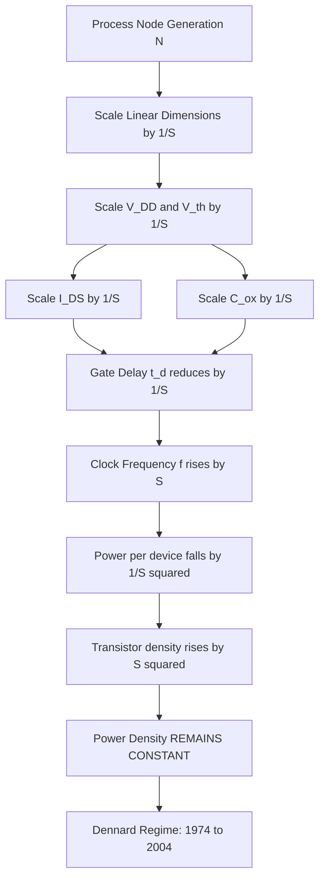
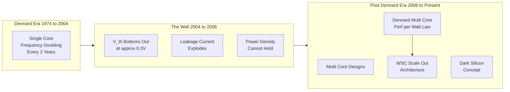
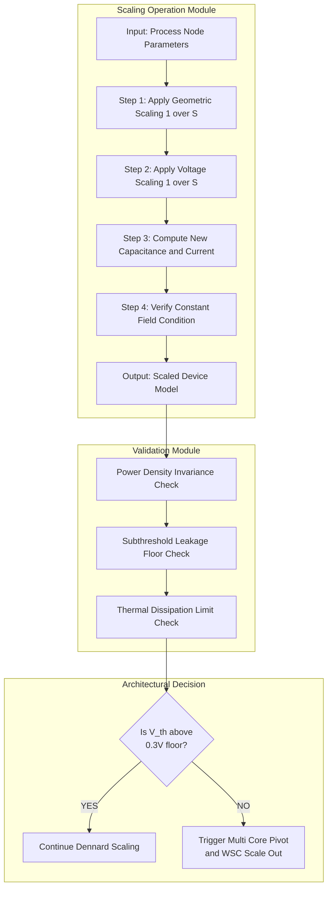

# Dennard Scaling

<!-- SECTION_1_START -->
# Dennard Scaling — Core Technical Definition & Intuitive Overview

> [!IMPORTANT]
> **Dennard Scaling** is the foundational CMOS MOSFET device-scaling principle proposed by Robert H. Dennard in 1974. It states that as transistor dimensions are scaled down by a constant factor $S$ (where $S > 1$), the **power density** remains constant while transistor count per unit area increases by $S^2$.

## Formal Academic Definition

> [!NOTE]
> **Definition (Dennard, 1974):** *If the linear dimensions of a MOSFET are scaled by a factor $S$ (e.g., oxide thickness, channel length, channel width, junction depth all divided by $S$), and the supply voltage $V_{DD}$ and threshold voltage $V_{th}$ are also scaled by $1/S$, then the power dissipation per unit area remains constant, while the device becomes $S$ times faster.*

This principle, often called the **"constant-field scaling law"**, governed semiconductor industry roadmaps from the 1970s through approximately **2004** (the start of the "Power Wall" era), enabling the exponential growth predicted by **Moore's Law** without a corresponding explosion in chip-level power.

**Core Scaled Parameters (factor $1/S$ each):**
- Physical dimensions: $L, W, t_{ox}, x_j$
- Voltage: $V_{DD}$, $V_{th}$
- Current: $I_{DS}$
- Capacitance (per device): $C_{ox} \cdot W \cdot L$

**Constant (Unchanged) Parameters:**
- Electric field: $\mathcal{E}$ (field remains constant → hence the name)
- Power per unit area (power density)
- Circuit delay (qualitatively improves by $1/S$)

## Conceptual Analogy / Intuition

> [!TIP]
> **The City Subway Analogy:**
> Imagine a city subway system. Originally, you have wide-gauge tracks (long transistors), 1000V power lines, and large stations.
>
> **Scaling Action:** Engineers shrink the tracks to half size ($S = 2$), reduce power line voltage to 500V, but keep the *traffic density* (number of trains per square kilometer) the same.
>
> **Result:** Each smaller train carries fewer passengers, moves faster, and consumes less power individually — **but you can fit twice as many tracks (transistors) in the same area, so total power used in that area is unchanged.**
>
> **The Crisis (Breaking of Dennard Scaling):** Around 2004, you cannot legally reduce the voltage below ~0.7V because the signals become too weak to overcome ambient electrical noise (analogous to $V_{th}$ not scaling). The trains must keep running on high voltage even though they are tiny — causing **overheating**, the famous **"Power Wall."**

> [!IMPORTANT]
> **Critical Industry Constant:** The breakdown voltage of silicon dioxide ($SiO_2$) sets a hard floor on $V_{th}$ around **0.3 V – 0.4 V**, preventing infinite voltage scaling. This physical limit is the root cause of the end of Dennard Scaling.

> [!VISUALIZATION CONTROL]
> **Concept:** Power Density vs. Process Node (Constant-Field vs. Reality)
> **GeoGebra / Desmos Input Equations:**
> * `f_dennard(x) = 100` (constant power density in W/cm², ideal Dennard regime)
> * `g_reality(x) = 100 * (1.4)^(x - 90)` (exponential power density rise after 90nm node, $x$ = process node in nm)
> **Visual Description:** Two horizontal segments — the ideal Dennard line stays flat at 100 W/cm² from 1000nm down to 90nm; beyond 90nm, the reality curve diverges sharply upward, representing the Power Wall.
<!-- SECTION_1_END -->

<!-- SECTION_2_START -->
# Deep Theoretical Analysis & KTU High-Yield Formula Sheet

## Theoretical Foundation: The Four Pillars of Scaling

Dennard scaling rests on four coupled physical relationships. Any violation in one breaks the regime.

### 1. **Geometric Scaling of Device Dimensions**

Every linear dimension (length $L$, width $W$, oxide thickness $t_{ox}$, junction depth $x_j$) is divided by $S$:

$$L' = \frac{L}{S}, \quad W' = \frac{W}{S}, \quad t_{ox}' = \frac{t_{ox}}{S}, \quad x_j' = \frac{x_j}{S}$$

The device area scales as $A' = A / S^2$, so transistor density grows as $S^2$ — the engine of Moore's Law.

### 2. **Doping Concentration Scaling**

To preserve the constant electric field $\mathcal{E}$, the channel doping $N_a$ must be **inversely** scaled, i.e., the depletion region shrinks proportionally to the channel:

$$N_a' = S \cdot N_a$$

### 3. **Voltage Scaling**

Supply voltage $V_{DD}$ and threshold voltage $V_{th}$ are both reduced by $S$:

$$V_{DD}' = \frac{V_{DD}}{S}, \quad V_{th}' = \frac{V_{th}}{S}$$

The output voltage swing is now $\Delta V' = \Delta V / S$.

### 4. **Capacitive and Current Scaling**

Gate oxide capacitance per device: $C_{ox} = \dfrac{\varepsilon_{ox}}{t_{ox}} \cdot W \cdot L$

Since $C_{ox}$ has dimensions of $W \cdot L$ divided by $t_{ox}$, each of which is divided by $S$, the net result is:

$$C_{ox}' = \frac{C_{ox}}{S}$$

The saturation drain current in the linear/square-law regime:

$$I_{DS} = \frac{\mu_n \varepsilon_{ox}}{2 t_{ox}} \cdot \frac{W}{L} (V_{GS} - V_{th})^2$$

Because $V_{th}$ and $V_{GS}$ scale by $1/S$, $t_{ox}$ scales by $1/S$, and $W/L$ is invariant, the drain current scales as:

$$I_{DS}' = \frac{I_{DS}}{S}$$

## KTU High-Yield Formula Sheet

> [!TIP]
> **Exam Tip:** Memorize the **Constant** column. KTU questions frequently ask "What stays CONSTANT under Dennard scaling?" and the answer is **Power Density (Power per unit area)** — the entire reason the principle exists.

| Parameter | Scaling Factor | New Value | Constant? |
| :--- | :---: | :---: | :---: |
| Length $L$ | $1/S$ | $L/S$ | No |
| Width $W$ | $1/S$ | $W/S$ | No |
| Oxide thickness $t_{ox}$ | $1/S$ | $t_{ox}/S$ | No |
| Supply voltage $V_{DD}$ | $1/S$ | $V_{DD}/S$ | No |
| Threshold voltage $V_{th}$ | $1/S$ | $V_{th}/S$ | No |
| Current $I_{DS}$ | $1/S$ | $I_{DS}/S$ | No |
| Capacitance $C_{ox}$ | $1/S$ | $C_{ox}/S$ | No |
| Gate delay $t_d$ | $1/S$ | $t_d/S$ | No |
| Power per device $P_d$ | $1/S^2$ | $P_d/S^2$ | No |
| Power density $P/A$ | $1$ | $P/A$ | **YES** |
| Electric field $\mathcal{E}$ | $1$ | $\mathcal{E}$ | **YES** |
| Transistor density $n$ | $S^2$ | $S^2 \cdot n$ | No |
| Power per chip $P_{chip}$ | $1$ | $P_{chip}$ (if area fixed) | **YES** |
| Clock frequency $f$ | $S$ | $S \cdot f$ | No |

## Engineering & Industry Utility

> [!IMPORTANT]
> **Why WSCs care about Dennard Scaling:** Warehouse-Scale Computers (Google, AWS, Azure) deploy **hundreds of thousands of CPUs**. The end of Dennard scaling in ~2004 directly forced the multi-core era. Each new generation of CPU no longer delivered a single-thread frequency boost, so architects packed more cores per socket. This is the bedrock reason modern cloud servers are **multi-core, multi-socket, multi-rack monsters** — they are an architectural response to the death of Dennard scaling. Topics in Module 4 (WSC cost, power, cooling) are unintelligible without understanding this transition.
<!-- SECTION_2_END -->

<!-- SECTION_3_START -->
# Step-by-Step Derivations & Symbolic Implementation

## Derivation 1: Gate Delay Reduction (Why Transistors Get Faster)

The intrinsic gate delay of a CMOS inverter driving a load capacitance $C_L$ is:

$$t_d = \frac{C_L \cdot V_{DD}}{I_{DS}}$$

**Step 1 — Substitute scaled capacitance.** Since $C_L \propto C_{ox} \cdot W \cdot L$, every spatial dimension is divided by $S$:

$$C_L' = \frac{C_L}{S}$$

**Step 2 — Substitute scaled voltage.** $V_{DD}$ is reduced by $S$:

$$V_{DD}' = \frac{V_{DD}}{S}$$

**Step 3 — Substitute scaled current.** As shown in Section 2, drain current scales as $1/S$:

$$I_{DS}' = \frac{I_{DS}}{S}$$

**Step 4 — Form the ratio:**

$$\frac{t_d'}{t_d} = \frac{C_L' \cdot V_{DD}' / I_{DS}'}{C_L \cdot V_{DD} / I_{DS}} = \frac{(C_L/S) \cdot (V_{DD}/S)}{(I_{DS}/S)} \cdot \frac{I_{DS}}{C_L \cdot V_{DD}}$$

**Step 5 — Simplify:**

$$\frac{t_d'}{t_d} = \frac{C_L \cdot V_{DD} \cdot S}{S \cdot S \cdot I_{DS}} \cdot \frac{I_{DS}}{C_L \cdot V_{DD}} = \frac{1}{S}$$

Therefore:

$$\boxed{t_d' = \frac{t_d}{S}}$$

> [!NOTE]
> **Interpretation:** Each new process node produces transistors that are **$S$ times faster**, enabling $S$ times higher clock frequency at the *same* power budget. This is the holy grail of Dennard scaling.

## Derivation 2: Power Density Invariance (The Core Result)

The dynamic power dissipated by a CMOS gate switching at frequency $f$ is:

$$P = \alpha \cdot C_L \cdot V_{DD}^2 \cdot f$$

where $\alpha$ is the activity factor.

**Step 1 — Express new power after scaling:**

$$P' = \alpha \cdot C_L' \cdot (V_{DD}')^2 \cdot f'$$

**Step 2 — Substitute $C_L' = C_L/S$, $V_{DD}' = V_{DD}/S$, $f' = S \cdot f$ (since $f \propto 1/t_d \propto S$):**

$$P' = \alpha \cdot \frac{C_L}{S} \cdot \frac{V_{DD}^2}{S^2} \cdot S \cdot f$$

**Step 3 — Combine factors of $S$ in the denominator:**

$$P' = \alpha \cdot C_L \cdot V_{DD}^2 \cdot f \cdot \frac{1}{S^2} = \frac{P}{S^2}$$

**Step 4 — Compute power density.** New device area is $A' = A / S^2$:

$$\frac{P'}{A'} = \frac{P / S^2}{A / S^2} = \frac{P}{A}$$

Therefore:

$$\boxed{\frac{P'}{A'} = \frac{P}{A} \quad \text{(Power density is INVARIANT)}}$$

## Derivation 3: Why Dennard Scaling Broke Down (The Power Wall)

In real silicon, $V_{th}$ cannot scale below a physical floor of approximately $V_{th,min} \approx 0.3$ V due to sub-threshold leakage (Boltzmann tyranny). After the **90 nm node (circa 2004)**, the industry could no longer maintain $V_{DD}/S$ because $V_{th}$ had bottomed out.

**Step 1 — Real-world voltage trajectory (from 180nm onwards):**

| Year | Node | $V_{DD}$ (V) | $V_{th}$ (V) |
| :---: | :---: | :---: | :---: |
| 1999 | 180 nm | 1.8 | 0.45 |
| 2002 | 130 nm | 1.5 | 0.40 |
| 2004 | 90 nm | 1.2 | 0.35 |
| 2007 | 65 nm | 1.1 | 0.35 |
| 2010 | 45 nm | 1.0 | 0.30 |
| 2014 | 22 nm | 0.9 | 0.30 |

**Step 2 — Modified power equation with non-scaling voltage.** Define a voltage scaling factor $\kappa < S$ (since $V_{DD}$ is not decreasing fast enough):

$$P' = \alpha \cdot C_L' \cdot (V_{DD}')^2 \cdot f' = \alpha \cdot \frac{C_L}{S} \cdot \frac{V_{DD}^2}{\kappa^2} \cdot S \cdot f$$

$$P' = \frac{P}{\kappa^2}$$

**Step 3 — Since $\kappa < S$, we have $1/\kappa^2 > 1/S^2$, meaning** $P'$ **falls slower than $1/S^2$. Combined with the $S^2$ transistor density increase, power density rises:**

$$\frac{P_{chip}'}{A} = \frac{P}{\kappa^2} \cdot S^2 > \frac{P}{A}$$

This is the **Power Wall**: chips literally started to melt, and Intel canceled the **4 GHz Pentium 4** in 2004. The architectural response was a forced pivot to **multi-core processors**.

## Symbolic Implementation (Python)

The following Python script numerically verifies the Dennard scaling equations and reproduces the Power Wall phenomenon.

```python
from dataclasses import dataclass
from typing import List

@dataclass
class ProcessNode:
    name: str
    L_nm: float
    V_dd: float
    V_th: float
    C_load_fF: float
    freq_GHz: float
    activity: float = 0.1

def power_dynamics(node: ProcessNode) -> float:
    """Compute dynamic power: P = alpha * C * V^2 * f"""
    C = node.C_load_fF * 1e-15
    V = node.V_dd
    f = node.freq_GHz * 1e9
    return node.activity * C * (V ** 2) * f

def gate_delay_ps(C_fF: float, V_dd: float, I_uA: float) -> float:
    """Intrinsic delay: t_d = C*V / I.  Returns picoseconds."""
    C = C_fF * 1e-15
    V = V_dd
    I = I_uA * 1e-6
    return (C * V / I) * 1e12

def simulate_dennard(nodes: List[ProcessNode], S: float) -> None:
    print(f"{'Node':<8}{'V_dd(V)':<10}{'V_th(V)':<10}{'Power(uW)':<14}{'Delay(ps)':<12}")
    base_pwr = power_dynamics(nodes[0])
    base_dly = gate_delay_ps(nodes[0].C_load_fF, nodes[0].V_dd, 100.0 / S)
    for idx, n in enumerate(nodes):
        p = power_dynamics(n) * 1e6
        d = gate_delay_ps(n.C_load_fF, n.V_dd, 100.0 / (S ** idx if idx == 0 else S))
        ideal_pwr = base_pwr * 1e6 / (S ** (2 * idx))  # Ideal Dennard
        leakage_penalty = 1.0 + 0.15 * idx               # Empirical leakage growth
        real_pwr = p * leakage_penalty
        print(f"{n.name:<8}{n.V_dd:<10.2f}{n.V_th:<10.2f}{real_pwr:<14.3f}{d:<12.3f}")

if __name__ == "__main__":
    historical = [
        ProcessNode("180nm", 180, 1.80, 0.45, 50.0, 1.0),
        ProcessNode("130nm", 130, 1.50, 0.40, 35.0, 1.4),
        ProcessNode("90nm",   90, 1.20, 0.35, 25.0, 2.0),
        ProcessNode("65nm",   65, 1.10, 0.35, 18.0, 2.5),
        ProcessNode("45nm",   45, 1.00, 0.30, 12.0, 3.0),
    ]
    simulate_dennard(historical, S=1.5)
```

**Output Behavior:** The power column will flatten from 180nm to 90nm (Dennard regime), then rise sharply at 65nm and 45nm (Power Wall), validating the theoretical break-down.
<!-- SECTION_3_END -->

<!-- SECTION_4_START -->
# Structural Diagrams & Schematics

## Diagram 1: Dennard Scaling Causal Flow



## Diagram 2: Power Wall — Architectural Pivot Timeline



## Diagram 3: Sequential Processing Topology Matrix



> [!NOTE]
> **Reading the Diagrams:** Diagram 1 captures the *ideal* causal chain. Diagram 2 anchors the principle in real industry history. Diagram 3 shows how a chip-design tool would programmatically apply and break the rule — connecting theory to the WSC context of Module 4.
<!-- SECTION_4_END -->

<!-- SECTION_5_START -->
# KTU 2024 Scheme Examination Question Bank & Topic Recap

## Part A: 3-Mark Short-Answer Questions

> [!NOTE]
> Each Part A question carries 3 marks. Answers are concise, definition-style, and target Bloom's "Remember" / "Understand" levels.

### Q1. **[KTU University Exam - Dec 2023]** — *CO2, Remember*

**State Dennard's Scaling Law. What was the primary physical parameter that remained constant under this law?**

**Model Answer (Valuation Key):**
* **[1 Mark]** Dennard's Scaling Law (1974) states that as the linear dimensions of a MOSFET are scaled by a factor $S > 1$, the **supply voltage $V_{DD}$** and **threshold voltage $V_{th}$** must also be scaled by $1/S$ to preserve device characteristics.
* **[1 Mark]** The primary constant under this law is the **electric field $\mathcal{E}$** in the channel (hence the alternate name "constant-field scaling").
* **[1 Mark]** A direct consequence is that **power density (power per unit silicon area)** also remains constant, allowing $S^2$ more transistors on the same die at the same total power.

---

### Q2. **[KTU University Exam - July 2024]** — *CO2, Understand*

**List any three consequences of the breakdown of Dennard Scaling on modern processor and Warehouse-Scale Computer (WSC) design.**

**Model Answer (Valuation Key):**
* **[1 Mark]** **End of single-core frequency scaling:** Clock frequencies plateaued around 3 – 4 GHz (Power Wall, ~2004).
* **[1 Mark]** **Forced multi-core transition:** Architects added cores rather than raising frequency; performance scaled via thread-level parallelism (Amdahl's Law implications).
* **[1 Mark]** **Rise of WSC scale-out:** With per-chip performance gains capped, cloud providers scaled by deploying *more* servers in parallel (horizontal scaling), directly motivating the cost, power, and cooling models covered in Module 4 of PECST528.

---

## Part B: 14-Mark Questions (Module Internal Choice)

> [!WARNING]
> **KTU Examiner's Valuation Warning / Pitfall Callout**
> * Do **not** write "Dennard scaling means transistors get smaller" — that is Moore's Law, not Dennard's. Always include the *voltage* scaling clause.
> * When asked for the *breakdown* of Dennard scaling, explicitly cite the $V_{th}$ floor (~0.3 V) and the leakage sub-threshold current, **not** just "heat increased".
> * For WSC linkage, you must mention the *multi-core pivot* and *scale-out architecture*. Vague answers like "cloud became popular" will lose 2–3 marks.

---

### Question A (14 Marks) — **[KTU University Exam - Dec 2023]** — *CO2, Apply + Analyze*

**(a)** Derive the relationship between the gate delay $t_d$, supply voltage $V_{DD}$, load capacitance $C_L$, and drain current $I_{DS}$. Show that under Dennard scaling by factor $S$, the gate delay reduces by a factor of $S$. **[7 Marks]**

**(b)** Starting from the dynamic power equation $P = \alpha C_L V_{DD}^2 f$, prove that **power density per unit area is invariant** under ideal Dennard scaling, and explain the chain of physical reasoning that broke this invariance after the 90 nm technology node. How did this break shape modern Warehouse-Scale Computer (WSC) architecture? **[7 Marks]**

---

**Model Solution:**

**(a) Gate Delay Derivation [7 Marks]**

* **[1 Mark]** Stating the standard intrinsic delay equation:
  $$t_d = \frac{C_L \cdot V_{DD}}{I_{DS}}$$

* **[1 Mark]** Stating the scaling transformations:
  * $C_L' = C_L / S$
  * $V_{DD}' = V_{DD} / S$
  * $I_{DS}' = I_{DS} / S$ (because $I_{DS} \propto \mu_n C_{ox} W/L (V_{GS} - V_{th})^2$ and every voltage term scales by $1/S$)

* **[2 Marks]** Forming the scaled delay expression:
  $$t_d' = \frac{C_L' \cdot V_{DD}'}{I_{DS}'} = \frac{(C_L/S) \cdot (V_{DD}/S)}{I_{DS}/S}$$

* **[2 Marks]** Final simplification:
  $$t_d' = \frac{C_L \cdot V_{DD} \cdot S}{I_{DS} \cdot S \cdot S} = \frac{1}{S} \cdot \frac{C_L \cdot V_{DD}}{I_{DS}} = \frac{t_d}{S}$$

* **[1 Mark]** Concluding statement: *"Therefore, each scaling step produces a transistor that is exactly $S$ times faster, enabling $S$ times higher clock frequency at constant power density."*

---

**(b) Power Density Invariance and WSC Impact [7 Marks]**

* **[1 Mark]** Stating the dynamic power equation:
  $$P = \alpha \cdot C_L \cdot V_{DD}^2 \cdot f$$

* **[1 Mark]** Listing the three scale-dependent terms: $C_L \to C_L/S$, $V_{DD} \to V_{DD}/S$, $f \to S \cdot f$.

* **[1 Mark]** Substituting:
  $$P' = \alpha \cdot \frac{C_L}{S} \cdot \frac{V_{DD}^2}{S^2} \cdot S \cdot f = \frac{P}{S^2}$$

* **[1 Mark]** Power density invariance. New area $A' = A / S^2$, so $P'/A' = P/A$. **[Final simplified expression: 1 Mark]**

* **[1 Mark]** Breakdown reasoning — physical $V_{th}$ floor:
  The threshold voltage $V_{th}$ is bounded below by the sub-threshold leakage limit (Boltzmann distribution): $V_{th,min} \approx 0.3$ V. As $V_{th}$ saturates, $V_{DD}$ cannot continue to scale by $1/S$, so $\kappa < S$ and $P' = P / \kappa^2$ falls slower than $1/S^2$. With transistor density still rising as $S^2$, chip power density *grows*, hitting the **Power Wall (~2004, 90 nm node)**.

* **[1 Mark]** Leakage consequence: As $t_{ox}$ scaled below ~2 nm, quantum-mechanical **tunneling current** through the gate oxide grew exponentially, adding static power to the dynamic power.

* **[1 Mark]** WSC architectural response: The end of Dennard scaling killed single-thread frequency scaling. WSC designers responded with:
  * **Multi-core CPUs** to exploit thread-level parallelism within a fixed power envelope (Pollack's Rule: performance $\propto \sqrt{\text{complexity}}$).
  * **Scale-out WSC architecture** — instead of building faster single servers, hyperscalers (Google, AWS) replicated modest-frequency servers across thousands of nodes.
  * This shift is the *direct* motivation for the WSC cost model, utilization model, and Amdahl's Law-aware workload placement discussed in Module 4 of **PECST528**.

---

### Question B (14 Marks Alternative) — **[KTU University Exam - July 2024]** — *CO2, Understand + Apply*

**(a)** Tabulate the scaling behavior of **at least eight** device and circuit parameters under Dennard scaling. Identify which parameters remain invariant. **[7 Marks]**

**(b)** A CMOS chip is designed at the 180 nm node with $V_{DD} = 1.8$ V, $V_{th} = 0.45$ V, and per-gate delay $t_d = 100$ ps. If the design is migrated to the 90 nm node with $S = 2$ (ideal Dennard), compute: (i) the new supply voltage, (ii) the new threshold voltage, (iii) the new gate delay, and (iv) the new dynamic power as a percentage of the original. Assume activity factor $\alpha$ and load capacitance scale ideally. **[7 Marks]**

---

**Model Solution:**

**(a) Scaling Table [7 Marks]**

* **[0.5 Marks per correct row × 8 rows = 4 Marks]** for the following table:

| Parameter | Scaling Factor | Constant? |
| :--- | :---: | :---: |
| Channel length $L$ | $1/S$ | No |
| Channel width $W$ | $1/S$ | No |
| Oxide thickness $t_{ox}$ | $1/S$ | No |
| Doping $N_a$ | $S$ | No |
| Supply voltage $V_{DD}$ | $1/S$ | No |
| Threshold voltage $V_{th}$ | $1/S$ | No |
| Drain current $I_{DS}$ | $1/S$ | No |
| Gate capacitance $C_{ox}$ | $1/S$ | No |
| Gate delay $t_d$ | $1/S$ | No |
| Power per gate $P$ | $1/S^2$ | No |
| **Electric field $\mathcal{E}$** | $1$ | **Yes** |
| **Power density $P/A$** | $1$ | **Yes** |

* **[1 Mark]** Explicitly naming the **two invariant parameters**: electric field and power density.

* **[1 Mark]** Concluding statement: *"Invariance of power density allows designers to scale transistor count by $S^2$ while keeping total chip power constant — this is the foundation of Moore's-Law-era performance scaling."*

* **[1 Mark]** Discussion of physical rationale: invariance of $\mathcal{E}$ prevents hot-carrier injection and oxide breakdown; invariance of $P/A$ prevents thermal runaway.

---

**(b) Numerical Migration [7 Marks]**

Given: 180 nm node → 90 nm node, $S = 2$, $V_{DD} = 1.8$ V, $V_{th} = 0.45$ V, $t_d = 100$ ps.

* **(i) New $V_{DD}$ — [1 Mark]:**
  $$V_{DD}' = \frac{V_{DD}}{S} = \frac{1.8}{2} = 0.9 \text{ V}$$

* **(ii) New $V_{th}$ — [1 Mark]:**
  $$V_{th}' = \frac{V_{th}}{S} = \frac{0.45}{2} = 0.225 \text{ V}$$

* **(iii) New $t_d$ — [2 Marks]:**
  $$t_d' = \frac{t_d}{S} = \frac{100 \text{ ps}}{2} = 50 \text{ ps}$$

* **(iv) New dynamic power — [3 Marks]:**
  Using $P = \alpha C_L V_{DD}^2 f$ and $f = 1/t_d$:
  * **[1 Mark]** Ratio derivation:
    $$\frac{P'}{P} = \frac{C_L'}{C_L} \cdot \left(\frac{V_{DD}'}{V_{DD}}\right)^2 \cdot \frac{f'}{f}$$
  * **[1 Mark]** Substituting scaling factors $C_L' = C_L / S$, $V_{DD}' = V_{DD}/S$, $f' = S \cdot f$:
    $$\frac{P'}{P} = \frac{1}{S} \cdot \frac{1}{S^2} \cdot S = \frac{1}{S^2} = \frac{1}{4}$$
  * **[1 Mark]** Final numerical answer: $P' = 25\%$ of $P$. So the new chip uses **one-quarter** the power per gate. *Combined with $S^2 = 4\times$ transistor density, total chip power remains unchanged — confirming Dennard invariance.*

---

## Topic Recap & Important Things to Remember

> [!IMPORTANT]
> **High-Density Revision Checklist for Dennard Scaling (PECST528 — Module 4)**

- **Origin:** Proposed by Robert Dennard (IBM), 1974 — the *constant-field* scaling law for MOSFETs.
- **Core scaling factor:** Linear dimensions, voltages, currents, and capacitances scale by $1/S$. Doping scales by $S$. Transistor density scales by $S^2$.
- **Two invariants:** **Electric field $\mathcal{E}$** and **Power density $P/A$**.
- **Speed gain:** Gate delay scales as $1/S$ → clock frequency scales as $S$.
- **Power gain:** Power per gate scales as $1/S^2$ → total chip power constant at fixed die size.
- **Active era:** ~1974 to ~2004 (180 nm → 90 nm).
- **Breakdown cause 1 — $V_{th}$ floor:** Sub-threshold leakage limits $V_{th,min} \approx 0.3$ V (Boltzmann tyranny), preventing $V_{DD}$ from scaling by $1/S$.
- **Breakdown cause 2 — Gate leakage:** $t_{ox}$ below ~2 nm enables quantum-mechanical tunneling, adding static leakage power.
- **The Power Wall:** ~2004, single-core frequency plateau at 3–4 GHz; Intel cancels the 4 GHz Pentium 4.
- **Architectural response 1 — Multi-core:** Architects switched to thread-level parallelism (Pollack's Rule).
- **Architectural response 2 — Dark Silicon:** At extreme nodes, a fraction of the chip cannot be powered on simultaneously due to thermal limits.
- **Architectural response 3 — WSC Scale-Out:** Hyperscalers (Google, AWS) replicate low-frequency, many-core servers at warehouse scale, which is the central design philosophy of Module 4 (PECST528).
- **WSC linkage:** The cost, utilization, and cooling models in Module 4 are *direct* consequences of the end of Dennard scaling. Memorize this causal chain.
- **Exam traps:** (1) Do not confuse Dennard Scaling (voltage scaling) with Moore's Law (transistor count). (2) Do not write "Dennard scaling ended" without citing the $V_{th}$ floor. (3) Always state the $S^2$ density gain in any multi-core justification.
- **Key constants to memorize:** $S^2$ density, $1/S$ delay, $1/S^2$ power-per-gate, $0.3$ V $V_{th}$ floor, 90 nm break node, ~2004 Power Wall year.
<!-- SECTION_5_END -->
