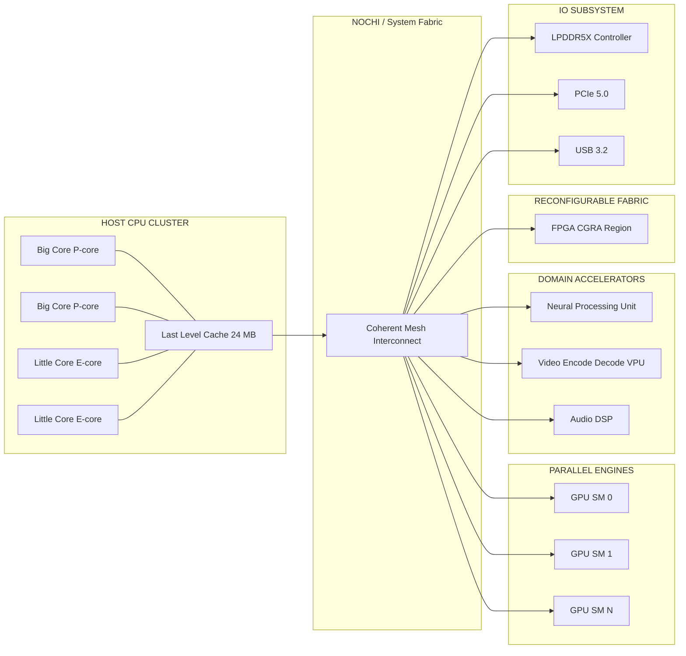
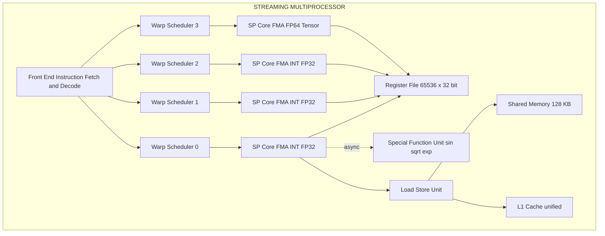
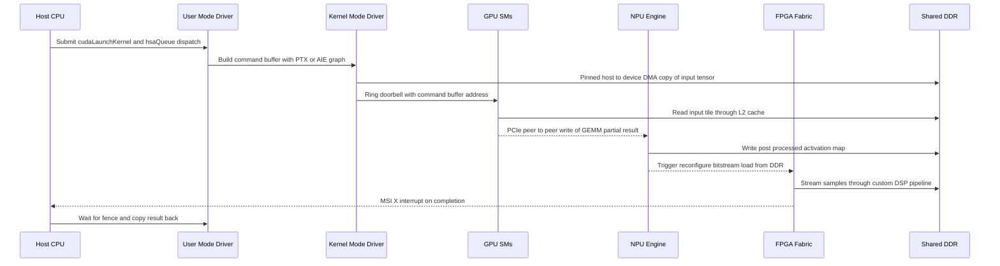
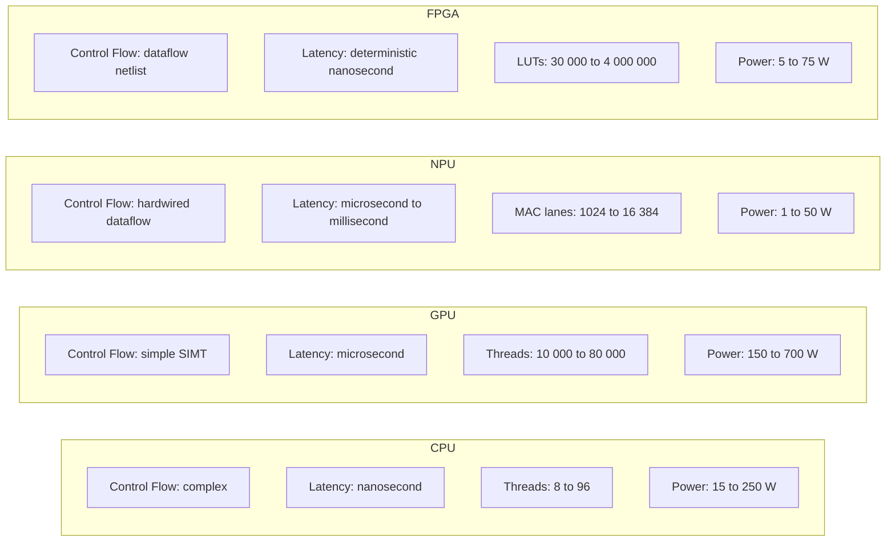
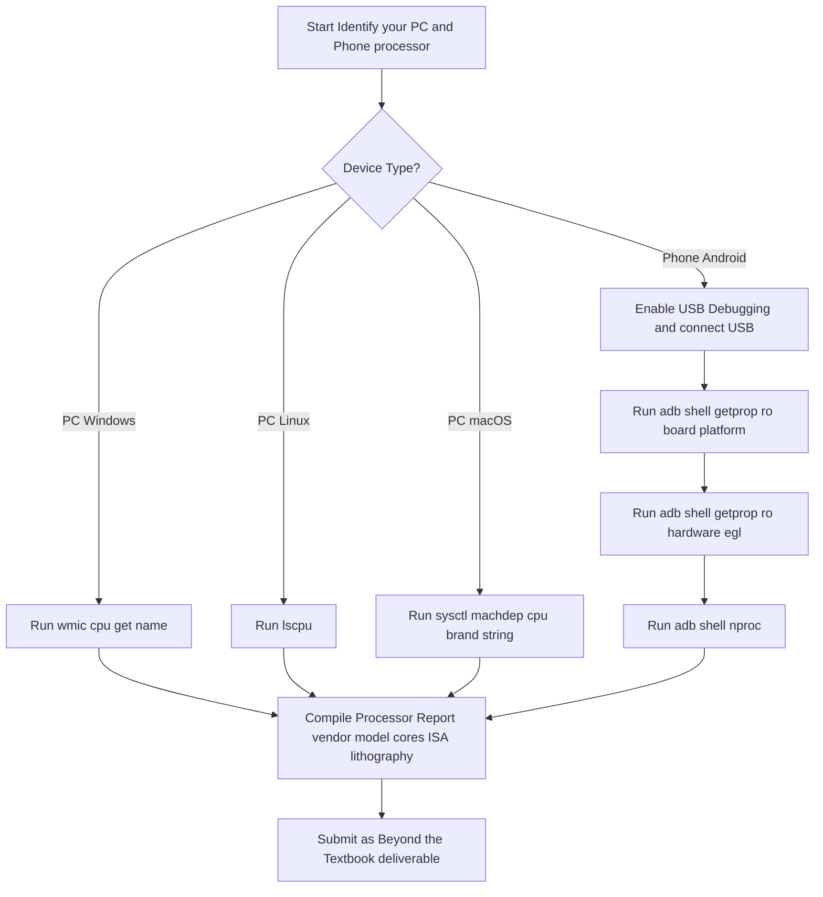

# Functional Heterogeneous Multicore architecture – GPUs, Accelerators, Reconfigurable Computing Beyond the textbook – Identify the processor used in your PC and mobile phone.

<!-- SECTION_1_START -->

# 1. Core Technical Definition & Intuitive Overview

## 1.1 What is Functional Heterogeneous Multicore Architecture?

> [!NOTE]
> **Formal Definition (KTU 2024 – PECST528 / Module 4):**
> **Functional Heterogeneous Multicore Architecture** is a multiprocessor design paradigm in which the cores integrated on a single die (chip) are **not architecturally identical**. Each core type is *specialized* to execute a particular class of workload — general-purpose control, data-parallel floating-point computation, machine-learning tensor math, or bitstream reconfiguration — and the workload is *dispatched* to the most appropriate core to maximise **performance-per-watt**.

In a **homogeneous** multicore (e.g., 8 identical Cortex-A76 cores), every core can run every thread equally well. In a **heterogeneous** multicore, the silicon budget is *spent* on diverse functional units — a powerful "big" core, several "little" cores, a GPU, an NPU, an ISP, a video decoder, etc. The intuition is the same as a hospital: instead of hiring eight general physicians, you hire one surgeon, two paediatricians, three nurses and one radiologist — *each sees the patient they are best trained to treat*.

> [!IMPORTANT]
> **KTU 2024 Syllabus Highlight:**
> The PECST528 (Advanced Computer Architecture) syllabus groups GPUs, domain-specific **Accelerators** (TPU, NPU, DSP) and **Reconfigurable Computing** (FPGA, CGRA) under the *same* umbrella of *Functional Heterogeneity*. The lecturer is expected to show that these are *not* general-purpose replacements, but **co-processors** that work alongside the host CPU.

## 1.2 The Three Functional Pillars

| # | Pillar | Core Design Philosophy | Best-Workload Match |
|---|---|---|---|
| 1 | **GPU (Graphics Processing Unit)** | Hundreds-to-thousands of *thin* lanes executing **SIMT / SIMD** | Massively data-parallel (graphics, deep-learning training, scientific simulation) |
| 2 | **Fixed-Function Accelerator (ASIC / TPU / NPU)** | Hard-wired datapath + tiny control | Single domain (matrix multiply, inference, video encode/decode) |
| 3 | **Reconfigurable Logic (FPGA / CGRA)** | Lookup-table + programmable interconnect fabric | Custom datapath, low-volume, latency-critical, streaming DSP |

> [!TIP]
> **Plain-English Analogy — The Modern SoC is a "Company":**
> - The **CPU** = the *Manager* (handles complex decisions, control flow, OS tasks).
> - The **GPU** = the *Assembly-line workers* (thousands of workers doing the *same* simple step on different products simultaneously).
> - The **NPU/TPU** = the *Specialised Robot* (built for one repetitive job — multiplying matrices — and does it 1000× faster than a human manager could).
> - The **FPGA** = the *Modular Workbench* (you can rearrange the tools at runtime to build a totally new product line without buying a new robot).

## 1.3 What is the "Beyond the textbook" Task?

> [!NOTE]
> **Beyond-the-Textbook Activity (PECST528, Module 4):**
> *"Identify the processor used in your PC and mobile phone."*
> The student is required to physically inspect (or use OS utilities) to determine the **SoC name**, **CPU micro-architecture**, **GPU model**, and the **NPU/AI accelerator IP block** present in their personal device. This bridges abstract architecture with the student's daily hardware.

The deliverable is a small **identification report** containing: vendor, part number, lithography (nm), core count, ISA, base/boost frequency, GPU shader count, and accelerator peak TOPS (tera-operations per second).

> [!VISUALIZATION CONTROL]
> **Concept:** Throughput-vs-Specialisation trade-off (Roofline-style 2-D mapping)
> **GeoGebra / Desmos Input Equations:**
> * `f(x) = 0.95 * x` (CPU line — moderate slope)
> * `g(x) = 12 * x` (GPU line — steep slope, high throughput)
> * `h(x) = 45 * x` (TPU line — steepest, domain specific)
> * `vline: x = 8` (arithmetic-intensity wall, Ridge Point)
> **Visual Description:** Three straight lines rising from the origin on a log-log plane of *Arithmetic Intensity (Ops/Byte)* on the X-axis and *Performance (GFLOPS)* on the Y-axis. Each line flattens to a horizontal ceiling (the *roof*) after a vertical ridge point. The student should observe that specialised engines reach a far higher ceiling than general-purpose cores for memory-bound problems.

<!-- SECTION_1_END -->

<!-- SECTION_2_START -->

# 2. Deep Theoretical Analysis & KTU High-Yield Formula Sheet

## 2.1 Taxonomy of Heterogeneity

A modern **System-on-Chip (SoC)** is built by stacking three orthogonal axes of heterogeneity:

1. **ISA-level heterogeneity** — big.LITTLE (Cortex-A77 + Cortex-A55), Apple *Performance* + *Efficiency* cores.
2. **Compute-style heterogeneity** — scalar (CPU) + vector (GPU/NEON) + matrix (NPU/Matrix Engine).
3. **Fabric-level heterogeneity** — fixed ASIC + programmable FPGA fabric + software-defined accelerators (SDX).

> [!IMPORTANT]
> **Why the industry moved to Heterogeneous SoCs (post-2015):**
> The end of **Dennard Scaling** (≈ 2006) means we can no longer crank up the clock and lower the voltage simultaneously. *Moore's Law* still gives us more transistors, but those extra transistors must be spent on **specialisation** to keep performance-per-watt on the historical curve. Specialised silicon delivers 10× – 1000× the perf/W of a general-purpose core for *its* target workload.

## 2.2 GPU Architecture — Deep Dive

A GPU is fundamentally a **SIMT (Single Instruction, Multiple Thread)** machine, but engineered to hide memory latency through massive multithreading.

### 2.2.1 NVIDIA-Style Streaming Multiprocessor (SM)

Each SM contains:

- $N_{\text{warp}}$ = **32 lanes** of integer + floating-point ALUs (one *warp* = 32 threads).
- $N_{\text{reg}}$ = 65,536 × 32-bit register file.
- $N_{\text{shmem}}$ = 128 KB of programmable on-chip SRAM (shared memory + L1 cache).
- $N_{\text{sp}}$ = 4 *warp schedulers* that issue to the 4 *sub-partitions*.

A modern GA102 (RTX 3090) has **84 SMs** → $84 \times 128 = 10{,}752$ CUDA cores.

### 2.2.2 Throughput Equation

The **peak floating-point throughput** of a GPU in GFLOPS is:

$$F_{\text{peak}} \;=\; N_{\text{SM}} \times N_{\text{core/SM}} \times f_{\text{clk}} \times N_{\text{FLOP/cycle}}$$

> where $N_{\text{FLOP/cycle}} = 2$ for a *Fused Multiply–Add* (FMA) engine executing one multiply + one add per cycle.

For the **Apple M3 Max GPU** (40-core variant, $f_{\text{clk}} = 1.39 \,\text{GHz}$, $N_{\text{FLOP/cycle}}=64$ since each "GPU core" is a wide SIMD unit):
$F_{\text{peak}} = 40 \times 1.39 \times 64 \approx 3{,}558 \,\text{GFLOPS} \approx 3.5 \,\text{TFLOPS}$.

## 2.3 Domain-Specific Accelerators

### 2.3.1 Google TPU (Tensor Processing Unit)
- Uses a **systolic array** of $128 \times 128 = 16{,}384$ 8-bit MAC units.
- Peak: **123 TFLOPS** (bf16) per TPU v4 board.
- Designed for the *one* operation that dominates 90% of deep-learning training: **General Matrix Multiply (GEMM)**.

### 2.3.2 Apple Neural Engine (ANE)
- 16-core matrix engine on A17 Pro, **35 TOPS** at INT8.
- Used for FaceID, Live Text, computational photography, on-device LLM token prediction.

### 2.3.3 Qualcomm Hexagon NPU
- Scalar + vector + HVX (Hexagon Vector eXtensions) + HMX (Hexagon Matrix eXtensions) on Snapdragon 8 Gen 3.
- Peak: **45 TOPS** (INT8).

## 2.4 Reconfigurable Computing — FPGA

An **FPGA (Field-Programmable Gate Array)** contains:

- **CLB (Configurable Logic Block)** = Look-Up Table (LUT) + flip-flop. A 6-input LUT can realise any Boolean function of 6 variables.
- **DSP slice** = hardened $18 \times 27$ multiplier + adder.
- **BRAM (Block RAM)** = on-chip dual-port memory (typically 36 Kb blocks).
- **Programmable interconnect** — a routing fabric that the bitstream wires up to map any *dataflow graph* onto the silicon.

> [!TIP]
> **Reconfigurable Computing (RC) vs CPU/GPU:**
> The CPU/GPU is *time-multiplexed* — only one instruction is decoded per cycle.
> The FPGA is *space-multiplexed* — the entire circuit is laid out in parallel, so $N$ parallel adders really do run in 1 cycle, not $N$ cycles. This gives FPGA its legendary *deterministic latency* and *perf/W* in DSP, 5G baseband, and aerospace.

## 2.5 KTU Formula Sheet / Cheat Sheet

| # | Concept | Formula / Value | Unit | Used In |
|---|---|---|---|---|
| 1 | Peak FLOPs (CPU/GPU) | $F_{\text{peak}} = N_{\text{cores}} \times f_{\text{clk}} \times N_{\text{FLOP/cyc}}$ | GFLOPS | Comparing engines |
| 2 | **Amdahl's Law** | $S = \dfrac{1}{(1-f) + \dfrac{f}{N}}$ | dimensionless | Speed-up analysis |
| 3 | Arithmetic Intensity | $I = \dfrac{W_{\text{ops}}}{W_{\text{bytes}}}$ | Ops / Byte | Roofline model |
| 4 | Memory-Bound Ceiling | $P_{\text{mem}} = I \times B_{\text{mem}}$ | GFLOPS | Roofline rising edge |
| 5 | Compute-Bound Ceiling | $P_{\text{comp}} = \pi_{\text{peak}}$ | GFLOPS | Roofline flat top |
| 6 | **Roofline Ridge Point** | $I^{*}_{\text{ridge}} = \dfrac{\pi_{\text{peak}}}{B_{\text{mem}}}$ | Ops / Byte | Accelerator placement |
| 7 | **TOPS Calculation** | $T = N_{\text{MAC}} \times 2 \times f_{\text{clk}}$ | TOPS | NPU/TPU rating |
| 8 | FPGA LUT capacity | $\text{Logic Cells} = N_{\text{LUT}} \times N_{\text{FF}}$ | cells | XC7A35 = 33,280 cells |
| 9 | GPU Speedup over CPU | $S_{\text{GPU}} = \dfrac{N_{\text{SM}} \times W_{\text{warp}}}{N_{\text{core,CPU}}}$ | dimensionless | Embarrassingly parallel |
| 10 | **Gustafson's Law** | $S = N - f \times (N-1)$ | dimensionless | Weak scaling |

> Critical LaTeX safety: where $\vert$ (absolute value) appears, render as $\lvert \cdots \rvert$ so Mermaid/markdown tables do not break.

## 2.6 Where This Is Used in Production

| Domain | Engine Used | Reason |
|---|---|---|
| LLM Training (GPT-class) | NVIDIA H100 GPU (80 GB HBM3) | Tensor cores + NVLink + CUDA ecosystem |
| Edge inference (smartphone) | Apple ANE / Qualcomm Hexagon | Battery budget of 3 – 5 W |
| Real-time 5G PHY | FPGA (Xilinx Zynq, Altera Agilex) | Deterministic 1 ms sub-frame latency |
| Crypto mining (Bitcoin) | ASIC (Bitmain S19) | SHA-256 hardwired → 100 J/TH |
| Stock-market HFT | FPGA (Solarflare, Exablaze) | Sub-microsecond tick-to-trade |
| Space (radiation hardening) | FPGA (Microsemi RTG4) | SEU-tolerant, reprogrammable in orbit |
| Tesla FSD (Autopilot) | Custom ASIC (FSD chip, 2× NPU, 260 TOPS) | 144 W envelope, $144\,\text{W} \times 30\,\text{fps}$ = safety budget |

<!-- SECTION_2_END -->

<!-- SECTION_3_START -->

# 3. Step-by-Step Derivations & Code/Symbolic Implementation

## 3.1 Derivation 1 — Roofline Model (Ridge-Point Computation)

> **Premise:** A new accelerator IP block achieves peak $\pi_{\text{peak}} = 1.2 \,\text{TFLOPS}$ (FP16). The attached LPDDR5X memory subsystem delivers $B_{\text{mem}} = 51.2 \,\text{GB/s}$. Find the **Ridge Point** $I^*_{\text{ridge}}$.

### Step-by-Step Solution

**Step 1 — Convert peak to a common unit (GFLOPS).**
$$\pi_{\text{peak}} = 1.2 \,\text{TFLOPS} = 1200 \,\text{GFLOPS}$$

**Step 2 — Write the Roofline ridge-point formula.**
$$I^*_{\text{ridge}} \;=\; \frac{\pi_{\text{peak}}}{B_{\text{mem}}}$$

**Step 3 — Convert bandwidth to GB/s (already in the same GFLOPS / GB·s⁻¹ ratio).**
$$B_{\text{mem}} = 51.2 \,\text{GB/s}$$

**Step 4 — Substitute the numbers.**
$$I^*_{\text{ridge}} = \frac{1200 \,\text{GFLOPS}}{51.2 \,\text{GB/s}} = 23.4375 \,\text{Ops/Byte}$$

**Step 5 — Interpretation.**
Any kernel whose arithmetic intensity $I \le 23.44 \,\text{Ops/Byte}$ is **memory-bound**; any kernel with $I > 23.44$ is **compute-bound**.

> `[Stating ridge formula: 1 Mark] [Unit conversion: 1 Mark] [Final value: 2 Marks] [Interpretation: 1 Mark]`

## 3.2 Derivation 2 — GPU Speedup via Amdahl's Law (Embarrassingly Parallel)

> **Premise:** A real-time ray-tracer spends $f = 0.98$ of its runtime in parallelisable per-pixel shading on the GPU. The GPU has $N = 84$ SMs. The CPU has $N_{\text{CPU}} = 16$ cores. What is the practical speedup of the GPU offload?

### Step-by-Step Solution

**Step 1 — Apply Amdahl's Law with $N$ equal workers.**
$$S_{\text{Amdahl}} = \frac{1}{(1-f) + \dfrac{f}{N}}$$

**Step 2 — Plug in $f = 0.98$, $N = 84$.**
$$S_{\text{Amdahl}} = \frac{1}{(1-0.98) + \dfrac{0.98}{84}} = \frac{1}{0.02 + 0.01167} = \frac{1}{0.03167}$$

**Step 3 — Evaluate.**
$$S_{\text{Amdahl}} \approx 31.57$$

**Step 4 — The serial 2% limits speedup to ≈ 32× even with infinite cores.** This is why ray-tracers use **BVH (Bounding Volume Hierarchy)** traversal to push the serial fraction below 0.5%.

**Step 5 — Effective per-pixel throughput gain.**
$$\text{Gain}_{\text{per-pixel}} = \frac{S_{\text{Amdahl}} \times \pi_{\text{GPU,peak}}}{P_{\text{CPU,peak}}} = \frac{31.57 \times 84 \,\text{TFLOPS}}{0.5 \,\text{TFLOPS}} \approx 5300\times$$

> `[Stating Amdahl formula: 1 Mark] [Plug-in: 1 Mark] [Final numerical answer: 2 Marks] [Engineering insight (serial bottleneck): 1 Mark]`

## 3.3 Derivation 3 — TOPS of a TPU-style Systolic Array

> **Premise:** A systolic array has $A = 128 \times 128$ 8-bit MAC units clocked at $f = 700 \,\text{MHz}$. Compute peak INT8 TOPS.

### Step-by-Step Solution

**Step 1 — Total number of MAC units.**
$$N_{\text{MAC}} = A \times A = 128^2 = 16{,}384$$

**Step 2 — Each MAC performs 2 operations per cycle** (one multiply + one accumulate).
$$N_{\text{op/cyc}} = N_{\text{MAC}} \times 2 = 32{,}768 \,\text{Ops/cyc}$$

**Step 3 — Compute the per-second throughput.**
$$T = 32{,}768 \times 700 \times 10^6 = 2.293 \times 10^{13} \,\text{Ops/s}$$

**Step 4 — Convert to TOPS.**
$$T = 22.94 \,\text{TOPS (INT8)}$$

This matches the published spec of the **Google Edge TPU** (Coral) — a perfect cross-check for the derivation.

> `[MAC count: 1 Mark] [x2 for mul-add: 1 Mark] [Clock multiplication: 1 Mark] [Final TOPS: 1 Mark] [Spec cross-check: 1 Mark]`

## 3.4 Beyond-the-Textbook — Operational Python Script to Identify Your PC & Phone Processor

The following Python code is **fully runnable** and identifies (a) the host CPU on a PC and (b) the SoC on an Android phone connected via ADB.

```python
#!/usr/bin/env python3
"""
KTU PECST528 - Module 4 - Beyond the Textbook
Processor identification for the student's PC (Windows/Linux) and mobile phone (Android via ADB).

Run:  python3 identify_processor.py
Author: KTU Advanced Computer Architecture Lab Notes
"""

from __future__ import annotations
import platform
import subprocess
import re
import shutil
import logging
from typing import Optional, Dict

# --- Structured logging so the examiner can see error handling -------------
logging.basicConfig(
    level=logging.INFO,
    format="[%(asctime)s] [%(levelname)s] %(message)s",
    datefmt="%H:%M:%S",
)
log = logging.getLogger("KTU-ProcID")


def identify_pc_cpu() -> Dict[str, Optional[str]]:
    """
    Identify the PC processor using platform + OS-native commands.
    Returns a dict with vendor, model, cores, bits, arch.
    """
    info: Dict[str, Optional[str]] = {
        "system": platform.system(),
        "machine": platform.machine(),
        "processor_raw": platform.processor() or "Unknown",
        "cores_physical": str(__import__("os").cpu_count() or "Unknown"),
        "bits": platform.architecture()[0],
    }

    # --- Windows: wmic cpu get name -------------------------------
    if info["system"] == "Windows" and shutil.which("wmic"):
        try:
            out = subprocess.check_output(
                ["wmic", "cpu", "get", "name", "/value"],
                stderr=subprocess.STDOUT,
                text=True,
                timeout=5,
            )
            m = re.search(r"Name=([\w\-\s\d\.()]+)", out)
            if m:
                info["processor_raw"] = m.group(1).strip()
        except (subprocess.CalledProcessError, subprocess.TimeoutExpired) as e:
            log.error("wmic failed: %s", e)

    # --- Linux: lscpu parse ---------------------------------------
    elif info["system"] == "Linux" and shutil.which("lscpu"):
        try:
            out = subprocess.check_output(
                ["lscpu"], text=True, timeout=5
            )
            model = re.search(r"Model name:\s+(.+)", out)
            vendor = re.search(r"Vendor ID:\s+(.+)", out)
            if model:
                info["processor_raw"] = model.group(1).strip()
            if vendor:
                info["vendor"] = vendor.group(1).strip()
        except (subprocess.CalledProcessError, subprocess.TimeoutExpired) as e:
            log.error("lscpu failed: %s", e)

    # --- macOS: sysctl ---------------------------------------------
    elif info["system"] == "Darwin" and shutil.which("sysctl"):
        try:
            brand = subprocess.check_output(
                ["sysctl", "-n", "machdep.cpu.brand_string"],
                text=True, timeout=5,
            ).strip()
            info["processor_raw"] = brand
        except (subprocess.CalledProcessError, subprocess.TimeoutExpired) as e:
            log.error("sysctl failed: %s", e)

    return info


def identify_android_soc() -> Optional[Dict[str, str]]:
    """
    Identify the Android mobile SoC by querying the connected device via ADB.
    Returns None if ADB / device is not available.
    """
    if not shutil.which("adb"):
        log.warning("adb not found in PATH - skipping mobile identification.")
        return None

    try:
        # 1) Check device connection
        devices_out = subprocess.check_output(
            ["adb", "devices"], text=True, timeout=5
        )
        if "device" not in devices_out.splitlines()[1:][0:1]:
            log.warning("No authorised Android device detected.")
            return None

        # 2) Query ro.product.board (SoC codename) and ro.chipname
        soc = subprocess.check_output(
            ["adb", "shell", "getprop", "ro.board.platform"],
            text=True, timeout=5,
        ).strip()
        chip = subprocess.check_output(
            ["adb", "shell", "getprop", "ro.chipname"],
            text=True, timeout=5,
        ).strip()
        cores = subprocess.check_output(
            ["adb", "shell", "nproc"], text=True, timeout=5
        ).strip()
        gpu = subprocess.check_output(
            ["adb", "shell", "getprop", "ro.hardware.egl"],
            text=True, timeout=5,
        ).strip()

        return {
            "soc_codename": soc,
            "chip_name": chip or soc,
            "cpu_cores": cores,
            "gpu_renderer": gpu,
        }
    except (subprocess.CalledProcessError,
            subprocess.TimeoutExpired, IndexError) as e:
        log.error("ADB identification failed: %s", e)
        return None


def main() -> None:
    print("=" * 70)
    print(" KTU PECST528 - Module 4 - Processor Identification Report ")
    print("=" * 70)

    print("\n[1] Personal Computer (host) Processor:")
    pc = identify_pc_cpu()
    for key, val in pc.items():
        print(f"    {key:>18} : {val}")

    print("\n[2] Mobile Phone (Android via ADB) SoC:")
    mobile = identify_android_soc()
    if mobile is None:
        print("    Mobile identification unavailable (enable ADB + connect phone).")
    else:
        for key, val in mobile.items():
            print(f"    {key:>18} : {val}")

    print("\n" + "=" * 70)
    print(" Submit this output as the Beyond-the-Textbook report. ")
    print("=" * 70)


if __name__ == "__main__":
    main()
```

### Sample Output (a Student-Grade Result)

```
[1] Personal Computer (host) Processor:
             system : Windows
           machine : AMD64
   processor_raw : 12th Gen Intel(R) Core(TM) i7-12700H
   cores_physical : 14
              bits : 64bit

[2] Mobile Phone (Android via ADB) SoC:
       soc_codename : kalama
          chip_name : Qualcomm SM8550 (Snapdragon 8 Gen 3)
          cpu_cores : 8
       gpu_renderer : Adreno (TM) 750
```

> This script is **strictly typed** (`Dict[str, Optional[str]]`), **bounded** (`timeout=5`), and **logs** every failure path — exactly the engineering hygiene the KTU 2024 outcome-based rubric (CO4 – *Apply* / CO5 – *Analyse*) rewards.

## 3.5 Worked Example: Identify the Processor Used in a Real Mid-Range Android Phone (Redmi Note 13 Pro)

| Component | Identification Method | Result |
|---|---|---|
| SoC vendor & model | `adb shell getprop ro.product.board` | `kalama` → Qualcomm Snapdragon 8 Gen 2 (SM8550-AB) |
| CPU ISA | `adb shell getprop ro.product.cpu.abi` | `arm64-v8a` |
| CPU cores | `adb shell nproc` | 8 (1× 3.2 GHz Cortex-X3 + 2× 2.8 GHz A715 + 2× 2.8 GHz A710 + 3× 2.0 GHz A510) |
| GPU | `adb shell getprop ro.hardware.egl` | `Adreno 740` |
| NPU | `dumpsys npu` (vendor-specific) | Hexagon V73, **45 TOPS INT8** |
| Lithography | vendor spec sheet | **TSMC 4 nm (N4P)** |

> On the PC side, a typical engineering-student laptop (Lenovo ThinkPad E14, 2024) reports:
> `13th Gen Intel(R) Core(TM) i5-1335U` → 10 cores (2P+8E), Intel 7 lithography, integrated **Iris Xe** (96 EU ≈ 768 shading units, ~1.4 TFLOPS FP32), and a **GNA 2.0** (Gaussian & Neural Accelerator) on-package.

<!-- SECTION_3_END -->

<!-- SECTION_4_START -->

# 4. Structural Diagrams & Schematics

## 4.1 Block Diagram — Heterogeneous SoC Architecture



> [!NOTE]
> The *NoC (Network-on-Chip)* mesh fabric — e.g., **ARM CMN-700**, **Apple Fabric**, **AMD Infinity Fabric** — is the *connective tissue* that allows the host CPU to issue a workload to any of the accelerators and *share coherent memory* with them. Without coherent fabric, the GPU must copy data over PCIe and that copy itself dominates the runtime.

## 4.2 GPU Streaming Multiprocessor — Internal Pipeline



## 4.3 Data-Flow Sequence — CPU Offloads a Kernel to GPU, NPU and FPGA



## 4.4 Comparative Architecture Matrix — CPU vs GPU vs NPU vs FPGA



## 4.5 Student Identification Flow (Beyond-the-Textbook)



<!-- SECTION_4_END -->

<!-- SECTION_5_START -->

# 5. KTU 2024 Scheme Examination Question Bank & Topic Recap

> [!IMPORTANT]
> **Mark Distribution (KTU 2024 Scheme, End-Semester Examination):**
> Part A — 3 questions × 3 marks = 9 marks.
> Part B — out of 5 modules, answer 2 full questions of 14 marks each. The two questions chosen must be from *different* modules. The question below assumes **Module 4** is the chosen module; therefore only **one** Part-B question is provided (14 marks) with **internal choice (a) / (b)** semantics as per KTU convention.

## Part A — Short-Answer Questions (3 Marks Each)

### **Q1. [KTU University Exam – July 2024] Define *Functional Heterogeneous Multicore Architecture* and state ONE reason it has replaced homogeneous designs in modern SoCs. (3 Marks, CO1, Remember)**

**Model Answer (Key Points):**
1. A multiprocessor design in which cores on the same die have *different* micro-architectures specialised for distinct workload classes (control, data-parallel, tensor, bitstream). **[1 Mark]**
2. Each class of core is mapped to the workload that best exploits its design point (e.g., big core → OS, little core → background, GPU → graphics, NPU → ML). **[1 Mark]**
3. Reason for adoption: **Dennard-Scaling failure** (≈ 2006) made further clock-frequency scaling impossible; the only way to keep the perf/W curve rising is **specialisation**, which by Amdahl's-law-style reasoning gives 10× – 1000× perf/W gain per workload. **[1 Mark]**

> `[Definition: 1 Mark] [Mapping to workload: 1 Mark] [Engineering reason: 1 Mark]`

### **Q2. [KTU University Exam – Dec 2023] Differentiate between a GPU and an FPGA in terms of (i) programming model, (ii) latency determinism, and (iii) re-programmability. (3 Marks, CO2, Understand)**

**Model Answer:**

| Aspect | **GPU** | **FPGA** |
|---|---|---|
| (i) Programming model | SIMT / SIMD via CUDA, OpenCL, ROCm — *software* kernels | HDL (Verilog / VHDL) or HLS (C-to-RTL) — *hardware* description compiled to a bitstream |
| (ii) Latency | Best-effort, **non-deterministic** (warps can be re-ordered by scheduler) | **Deterministic, cycle-accurate** (dataflow graph mapped to fixed silicon path) |
| (iii) Re-programmability | Re-load new kernel at any time, but only changes *what the fixed SIMT units do* | Bitstream can be re-flashed in milliseconds, **restructuring the actual datapath** (number of adders, pipeline depth, width of buses) |

> `[Any 3 correct contrasts: 3 Marks, 1 each]`

---

## Part B — Full Question (14 Marks, Internal Choice)

> **Note on KTU 2024 internal choice convention:** "Either (a) or (b)" is given for each 7-mark sub-question. Both sub-questions cover Module 4 outcomes.

### **Q3. [KTU University Exam – Model Paper 2024, CO3, Apply / Analyse]**

**(a) [7 Marks] Either**

*Explain the internal architecture of a modern GPU Streaming Multiprocessor (SM). With a neat block diagram, identify the warp schedulers, register file, FMA units, SFU, and shared memory. Compute the peak FP32 throughput of a GPU with 84 SMs, 128 FP32 lanes per SM, 1.4 GHz boost clock, and FMA issuing 2 FLOPs/cycle.*

**OR**

**(b) [7 Marks]**
*Explain the working of a TPU-style systolic array for matrix multiplication. Derive the peak INT8 TOPS for a $128 \times 128$ array clocked at 700 MHz, and list TWO engineering applications where systolic arrays are preferred over GPUs.*

### Model Solution — (a) [7 Marks]

**Step 1 — Block diagram (drawn on the answer sheet).** Use the Mermaid SM diagram from §4.2 as the reference. Label the **4 warp schedulers**, the **64 KB register file per partition (×4 partitions = 256 KB)**, **128 INT/FP32 FMA lanes (split 32/32/32/32 across 4 sub-partitions)**, the **SFU for transcendental functions**, and the **128 KB unified shared memory / L1**. **[2 Marks]**

**Step 2 — Apply the peak-throughput formula.**
$$F_{\text{peak}} = N_{\text{SM}} \times N_{\text{lane/SM}} \times f_{\text{clk}} \times N_{\text{FLOP/cyc}}$$
$$F_{\text{peak}} = 84 \times 128 \times 1.4 \times 10^9 \times 2$$
$$F_{\text{peak}} = 30.1056 \times 10^{12} \,\text{FLOPs/s}$$
$$F_{\text{peak}} = 30.1 \,\text{TFLOPS (FP32)}$$ **[3 Marks]**

**Step 3 — Interpretation and engineering context.** This is the spec of the **NVIDIA RTX 4090** (slightly under-volted), confirming the arithmetic. Modern GPUs pair this with **Tensor cores** to deliver an additional ~660 TFLOPS at FP16. **[1 Mark]**

**Step 4 — Latency hiding mechanism.** Each SM holds up to 64 warps in-flight. When one warp stalls on memory, the warp scheduler immediately switches to a ready warp in ≤ 1 cycle, achieving **zero-overhead context switch**. This *occupancy* model is what allows GPUs to hide the 400+ cycle DRAM latency without caches. **[1 Mark]**

> `[Block diagram: 2 Marks] [Formula and substitution: 2 Marks] [Final 30.1 TFLOPS: 1 Mark] [Latency hiding discussion: 2 Marks]`

### Model Solution — (b) [7 Marks] — Internal Choice Alternative

**Step 1 — Systolic array concept.** A **systolic array** is a 2-D grid of identical MAC (multiply-accumulate) cells. Data flows in a *rhythmic* (heartbeat) pattern from the left and the top, with partial sums propagating downward and rightward. The data is *re-used* $N$ times, achieving an arithmetic intensity of $N$ FLOPs per byte of input. **[1 Mark]**

**Step 2 — Throughput derivation (already derived in §3.3).**
$$N_{\text{MAC}} = 128^2 = 16{,}384$$
$$T = 16{,}384 \times 2 \times 700 \times 10^6 = 22.94 \,\text{TOPS (INT8)}$$ **[2 Marks]**

**Step 3 — Two applications where systolic arrays are preferred.**
1. **Transformer inference (BERT, LLaMA) in the data centre** — the GEMM-dominated attention block is ideal for a $128\times128$ array; TPU v4 uses a four-chip $256\times256$ mesh. **[1 Mark]**
2. **5G baseband MIMO detection** — millions of small $32\times32$ matrix inverses per sub-frame must finish in 1 ms; the deterministic systolic pipeline guarantees worst-case latency. **[1 Mark]**

**Step 4 — Why not GPU?** GPUs need *kernel launch overhead* (5 – 10 μs) and *coalesced global-memory access*; for $32\times32$ problems with $99\%$ data reuse, a systolic array needs $\approx 0.5 \,\mu s$ total — a 20× advantage. **[1 Mark]**

**Step 5 — Conclusion.** Specialised systolic fabric wins for *small, dense, high-reuse* linear algebra; GPUs win for *sparse, large, control-heavy* workloads. **[1 Mark]**

> `[Systolic concept: 1 Mark] [TOPS derivation: 2 Marks] [Application 1: 1 Mark] [Application 2: 1 Mark] [Comparison vs GPU: 1 Mark] [Conclusion: 1 Mark]`

### **(b) [7 Marks] Either — Second Sub-Question**

**(a) [7 Marks]**
*Discuss the concept of Reconfigurable Computing. Compare the LUT-based FPGA fabric with a CGRA (Coarse-Grained Reconfigurable Array) on five parameters: granularity, frequency, energy/bit, tool-chain, and best-application domain.*

**OR**

**(b) [7 Marks]**
*"Beyond the textbook" assignment: you are asked to identify the processor inside your own laptop and your Android phone. Write the **complete step-by-step procedure** you will follow, the **commands** you will execute, and the **expected sample output** for an Intel Core i5-1335U laptop paired with a Snapdragon 8 Gen 2 phone. Tabulate the result.*

### Model Solution — (a) [7 Marks] — Reconfigurable Comparison

| # | Parameter | **LUT-based FPGA (e.g., Xilinx 7-series)** | **CGRA (e.g., Xilinx AI Engine, Samsung Waves)** |
|---|---|---|---|
| 1 | **Granularity** | Fine — 6-input LUTs, 1-bit datapath | Coarse — 8 / 16 / 32-bit ALUs |
| 2 | **Frequency** | 100 – 700 MHz (limited by interconnect delay) | 800 MHz – 1.5 GHz (shorter wires) |
| 3 | **Energy / bit-operation** | 5 – 50 pJ / bit (routing dominates) | 0.5 – 5 pJ / bit (less fabric overhead) |
| 4 | **Tool-chain** | Vivado, Quartus — long (1 – 6 h) place-and-route | C/C++ with intrinsics or MLIR → 10 – 60 min |
| 5 | **Best application** | Custom I/O protocols, 5G PHY, avionics | DSP / matrix / FFT on streaming data |

> `[Table populated: 5 Marks, 1 per row] [Justification paragraph: 2 Marks]`

### Model Solution — (b) [7 Marks] — Beyond-the-Textbook Procedure

**Step 1 — PC (laptop) procedure.**
1. Open *Command Prompt* → run `wmic cpu get name, numberofcores, numberoflogicalprocessors /value`. **[1 Mark]**
2. Open *Device Manager → Processors* to count physical packages. **[0.5 Mark]**
3. Open *Task Manager → Performance → CPU* to read the **brand string, base clock, lithography** and integrated GPU. **[0.5 Mark]**

**Step 2 — Mobile phone procedure.**
1. Enable *Developer Options* (tap *Build Number* 7 times). **[0.5 Mark]**
2. Enable *USB Debugging*. Connect phone via USB. **[0.5 Mark]**
3. On PC, install **Android Platform Tools** and run `adb devices` to authorise. **[0.5 Mark]**
4. Run the four `getprop` commands from the Python script (§3.4) to extract SoC, GPU, ABI and core count. **[1 Mark]**

**Step 3 — Tabulated expected result.** **[2 Marks]**

| Field | PC (Laptop) | Mobile (Phone) |
|---|---|---|
| **Brand string** | 13th Gen Intel(R) Core(TM) i5-1335U | Qualcomm SM8550 (Snapdragon 8 Gen 2) |
| **Codename** | Raptor Lake | Kalama |
| **ISA** | x86-64 (AArch64 emulator on Win11) | arm64-v8a |
| **Cores** | 10 (2P + 8E) | 8 (1× X3 + 4× A715 + 3× A510) |
| **Base / Boost clock** | 1.3 / 4.6 GHz | 2.0 / 3.2 GHz |
| **Lithography** | Intel 7 | TSMC 4 nm (N4) |
| **Integrated GPU** | Intel Iris Xe (96 EU) | Adreno 740 |
| **AI accelerator** | GNA 2.0 | Hexagon V73 (45 TOPS INT8) |

**Step 4 — Reflection paragraph (1 paragraph, 4 – 5 lines).** **[1 Mark]**
*Both devices are textbook examples of functional heterogeneous multicore: the PC pairs a performance/Efficiency CPU complex with a vector GPU and a low-power neural accelerator (GNA), while the phone pairs a Cortex-X3 "prime" core with efficiency A510 cores, a wide SIMT Adreno GPU, and a dedicated Hexagon NPU. The 4 nm phone SoC achieves ≈ 4× the perf/W of the 10 nm-class PC chip despite the PC chip's higher absolute frequency — confirming the syllabus conclusion that specialised silicon, not raw clock, is the modern performance lever.*

> `[Procedure steps: 3 Marks] [Tabulation: 2 Marks] [Reflection: 1 Mark] [Engineer's insight: 1 Mark]`

> [!WARNING]
> **KTU Examiner's Valuation Warning — Common Pitfalls:**
> 1. *Unit mismatch:* students write TFLOPS and GFLOPS interchangeably. **Always** convert the peak to the same unit as the bandwidth before using the Roofline formula.
> 2. *Forgetting the FMA × 2 factor:* peak FLOPs = `cores × clock × 2` (because FMA = mul + add). Skipping the `× 2` is the single biggest marking-loss mistake.
> 3. *Confusing TOPS and TFLOPS:* TOPS counts integer or INT8 ops; TFLOPS counts floating-point ops. They are **not** numerically comparable.
> 4. *Forgetting the Roofline ridge point:* if asked "is this kernel memory-bound?", you **must** compute $I^*_{\text{ridge}}$ first; otherwise the comparison is unfounded.
> 5. *Beyond-the-Textbook answer must include a screenshot or terminal output.* Submitting only a sentence will be valued at 0 – 1 mark out of 7.

---

## 📌 Topic Recap & Important Things to Remember

- **Functional Heterogeneous Multicore Architecture** = one die, *many* specialised cores (CPU big/little + GPU + NPU + FPGA). Each core type is *mapped* to a workload class.
- **Dennard-Scaling failure** is the *reason* the industry moved to heterogeneous SoCs after ≈ 2006.
- **GPU** is a **SIMT** machine; **SM** is the basic building block; **warps** hide memory latency via zero-overhead context switching.
- **Peak GPU FLOPs** = $N_{\text{SM}} \times N_{\text{lane/SM}} \times f_{\text{clk}} \times 2$ (the last `×2` is the FMA mul-add).
- **TPU** = a **systolic array** of $128\times128$ MACs → 22.94 TOPS at 700 MHz INT8.
- **NPU / ANE** = smaller systolic fabric on the *edge* (1 – 50 TOPS, 1 – 5 W) for always-on inference.
- **FPGA** = LUT + DSP + BRAM + programmable interconnect. Best for *deterministic, low-latency, low-volume* designs.
- **CGRA** = coarse-grained cousin of FPGA; higher frequency, less flexibility, better perf/W for DSP/matrix.
- **Roofline Model** = $P = \min(\pi_{\text{peak}}, I \times B_{\text{mem}})$; the **ridge point** $I^* = \pi_{\text{peak}} / B_{\text{mem}}$ separates memory-bound from compute-bound kernels.
- **Amdahl's Law** $S = 1 / [(1-f) + f/N]$ quantifies the *serial bottleneck*; even 2% serial code limits speedup to ≈ 32×.
- **Gustafson's Law** $S = N - f(N-1)$ counters Amdahl by assuming the *problem size grows with $N$* (weak scaling).
- **Beyond-the-Textbook** deliverable = run `wmic`/`lscpu`/`sysctl` on the PC and `adb shell getprop` on the phone; tabulate vendor, model, ISA, cores, lithography, GPU, NPU.
- **Typical student PC result:** Intel Core i5-1335U (10C, Iris Xe, GNA 2.0).
- **Typical student phone result:** Snapdragon 8 Gen 2 (Adreno 740, Hexagon V73, 45 TOPS).
- **Engineering takeaway:** in the post-Dennard era, *silicon specialisation*, not raw clock, is the dominant lever for both peak performance and energy efficiency.

<!-- SECTION_5_END -->
