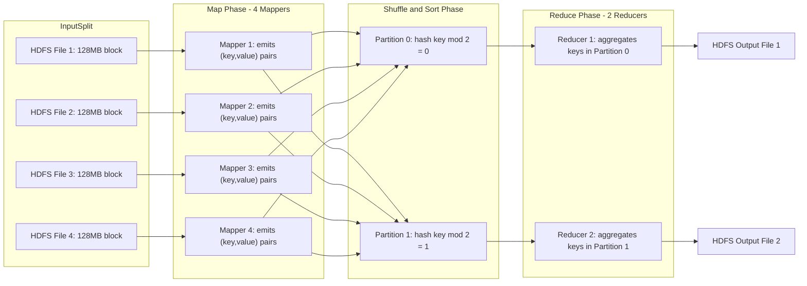
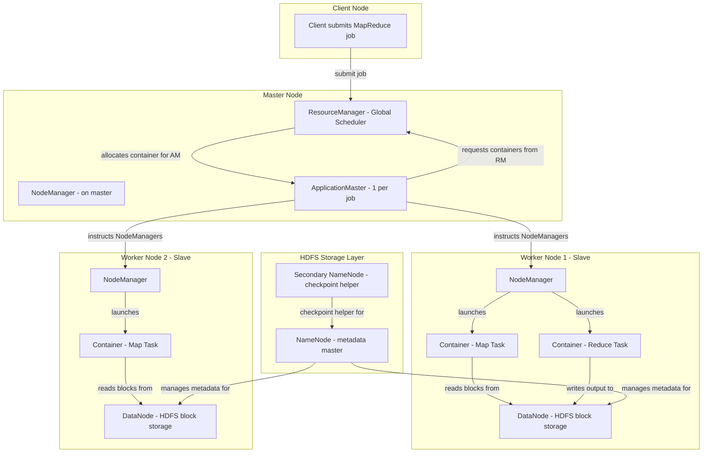
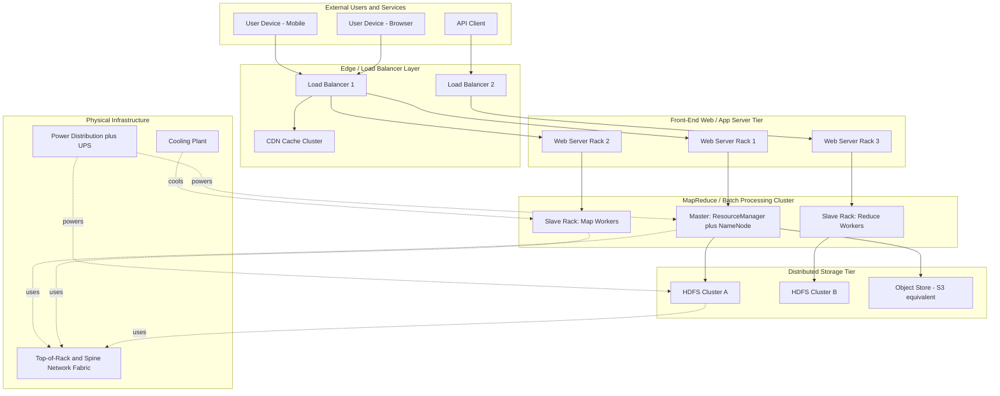
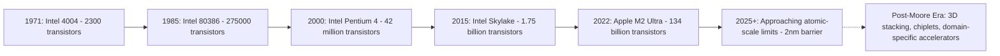

# Programming frameworks for Batch processing – Map reduce and Hadoop Computer Architecture of Warehouse-scale computers Moore’s Law

<!-- SECTION_1_START -->
# Warehouse-Scale Computers & MapReduce: Foundational Overview

## 1.1 The Big Picture: What is a Warehouse-Scale Computer (WSC)?

A **Warehouse-Scale Computer (WSC)** is a massive collection of networked servers — often numbering in the tens of thousands — working together as a single, unified computing platform. Unlike a traditional data center that hosts diverse, independent applications, a WSC is purpose-built to run a small number of massive, internet-scale services (search, social networking, video streaming, e-commerce). The defining mantra is **"datacenter is the computer."**

> [!IMPORTANT]
> **KTU 2024 Definition (Syllabus Aligned):** A Warehouse-Scale Computer is a class of cloud computing architecture where individual servers, networking, and storage infrastructure are co-designed and treated as a single logical machine, sharing a common power, cooling, and administrative infrastructure. The unit of deployment is the **warehouse**, not the individual server.

### Conceptual Analogy: The Library vs. The Mega-Library
Think of a **traditional server** as a single librarian with a small desk. Now imagine a **WSC** as an entire **national library building** staffed by 10,000 librarians, all working in parallel. A single patron's request (a web query) is broken into micro-tasks, each librarian works on a tiny piece, and the final answer is reassembled and handed back to the patron. The building itself — the aisles, the climate control, the conveyor belts — is the WSC.

## 1.2 Programming Frameworks for Batch Processing

**Batch processing** is a computational model where a large volume of data is collected over time, then processed in bulk, *non-interactively*, and *as a single job*. Examples include:
- Indexing the entire web (Googlebot output)
- Log aggregation from millions of servers
- Generating daily analytics reports

The challenge: How do you process **petabytes** of data reliably when any single server can fail, and thousands of servers must coordinate?

The answer is **MapReduce** — a programming framework that abstracts parallelism and fault-tolerance away from the application developer.

## 1.3 MapReduce — The Programming Model

**MapReduce** is a functional, parallel data-processing model inspired by the `map` and `reduce` functions from functional programming (Lisp, Haskell). It was formalized by **Jeffrey Dean and Sanjay Ghemawat** in their seminal 2004 Google paper and serves as the conceptual ancestor of Apache Hadoop, Spark, and many distributed systems.

> [!NOTE]
> **Core Definition:** MapReduce is a programming framework that allows developers to write programs that process vast amounts of unstructured/semi-structured data in parallel across a distributed cluster, by expressing the computation as two user-defined functions: `map()` and `reduce()`.

### The Intuitive Analogy: Counting Votes in a National Election
Imagine India is counting **900 million votes** from 1 million polling stations. You cannot do this with one person. The MapReduce way:

1. **MAP phase:** Send 1,000 counters to each district. Each counter tallies votes at their assigned stations and emits `(party_name, count)` slips.
2. **SHUFFLE & SORT phase:** Trucks collect all slips and group them by party at regional hubs.
3. **REDUCE phase:** At each regional hub, one supervisor adds up all slips for Party A, all for Party B, etc.
4. **Final Output:** One national tally.

That is **exactly** how MapReduce works — the parties are the **keys**, the tallies are the **values**.

## 1.4 Hadoop — The Open-Source Implementation

**Apache Hadoop** is an open-source framework that implements the MapReduce model at scale. It consists of two main pillars:
- **HDFS (Hadoop Distributed File System):** Storage layer that chunks data into blocks (default **128 MB**) and replicates them across machines.
- **MapReduce Engine (now YARN-based):** The resource manager and execution engine that runs `map` and `reduce` tasks.

> [!IMPORTANT]
> **KTU High-Yield Fact:** Hadoop = HDFS (storage) + YARN (resource management) + MapReduce (execution model). All three are mandatory to name in any 14-mark question.

## 1.5 Moore's Law — The Economic Engine Behind WSCs

**Moore's Law**, formulated by Intel co-founder **Gordon Moore** in 1965, observes that the number of transistors on an integrated circuit doubles approximately every **18–24 months**, leading to exponential growth in compute performance and a corresponding decrease in cost per transistor.

While **Moore's Law** has begun slowing at the atomic-scale boundary (sub-3 nm nodes), its **economic legacy** still drives WSC design: a modern WSC replaces its entire server fleet every **3–4 years**, capturing the latest transistor density gains to maximize performance-per-watt and performance-per-dollar.

> [!NOTE]
> **The Post-Moore Era:** Dennard Scaling broke down around 2006, meaning we cannot just crank up clock frequencies. Therefore, WSCs exploit Moore's Law by **adding more cores and more servers** (horizontal scaling) rather than making individual cores faster.

### Visualization of Moore's Law
> [!VISUALIZATION CONTROL]
> **Concept:** Exponential Transistor Count Growth (1971–2020)
> **Desmos / GeoGebra Input Equations:**
> * `f(x) = 2300 * 2^((x - 1971)/2)` &nbsp; *(x = year, y = transistor count)*
> * Sample points: `(1971, 2300)`, `(2000, 42e6)`, `(2020, 50e9)`
> **Visual Description:** Students should observe a sharp exponential curve. The y-axis is logarithmic-scale. The curve flattens noticeably post-2015, illustrating the physical limits of classical Moore's Law.

---

<!-- SECTION_1_END -->

<!-- SECTION_2_START -->
# Deep Theoretical Analysis & KTU High-Yield Formula Sheet

## 2.1 Anatomy of a MapReduce Job — The Four Phases

A MapReduce job executes in **four logical phases**. Understanding these is critical for any KTU exam question.

### Phase 1: Splitting & Map
- The input dataset (residing in HDFS) is split into **M chunks** (default size = HDFS block size, **128 MB**).
- The framework launches **M map tasks**, each processing one chunk.
- Each map task invokes the user-defined `map(key_in, value_in)` function, which emits a set of **intermediate key-value pairs**: `list(intermediate_key, intermediate_value)`.
- These intermediate pairs are buffered **in memory** (default buffer = **100 MB**, configurable via `mapreduce.task.io.sort.mb`).

### Phase 2: Partitioning
- The output of each map task is divided into **R partitions** (one per reducer).
- Partitioning is typically done by `hash(key) mod R`.
- This ensures that all records for a given key go to the **same reducer**.

### Phase 3: Shuffle & Sort (The Hidden Heavy-Lifter)
- Each reducer pulls its assigned partition from every mapper over the network (this is the **shuffle**).
- The reducer then performs a **merge-sort** on the incoming data, grouping all values by key.
- This phase is **network-bound** and often the **bottleneck** in real WSC MapReduce jobs.

### Phase 4: Reduce
- The user-defined `reduce(intermediate_key, list(intermediate_value))` function is invoked once **per unique intermediate key**.
- Output is written back to **HDFS** (no replication by default in HDFS, but typically 3x replicated).

> [!WARNING]
> **KTU Examiner Insight:** Students often forget the **Shuffle & Sort** phase. Writing only "Map → Reduce" will cost you **3–4 marks** in a 14-mark question. Always write all four phases.

## 2.2 Hadoop Cluster Architecture (YARN Model)

| Component | Full Name | Role | Key Property |
| :--- | :--- | :--- | :--- |
| **NameNode** | Master metadata server | Stores HDFS directory tree & block locations | Single point of metadata; uses **EditLog + FSImage** |
| **DataNode** | Slave storage node | Stores actual HDFS blocks (default **128 MB**) | Typically 1 per physical server |
| **ResourceManager (RM)** | Cluster-level scheduler | Allocates containers across the cluster | Global arbiter |
| **NodeManager (NM)** | Per-server agent | Launches and monitors containers on each node | Reports heartbeats to RM every **3 sec** |
| **ApplicationMaster (AM)** | Per-job master | Negotiates resources with RM, manages task lifecycle | One AM per MapReduce job |
| **Secondary NameNode** | Checkpoint helper | Periodically merges EditLog into FSImage | **Not** a hot standby; this is a common exam trap |

## 2.3 KTU Formula Cheat-Sheet

| # | Formula / Concept | Expression | Unit / Default Value |
| :--- | :--- | :--- | :--- |
| 1 | HDFS Block Size | $B$ | **128 MB** (configurable up to 512 MB) |
| 2 | Replication Factor | $r$ | **3** (1 primary + 2 replicas) |
| 3 | Number of Mappers | $M = \lceil \dfrac{\text{Input Size}}{B} \rceil$ | Integer |
| 4 | Number of Reducers | $R$ | User-configured (default **1**, typical **0.95–1.75 ×** cluster cores) |
| 5 | Moore's Law (Transistor Count) | $T(t) = T_0 \cdot 2^{\frac{t - t_0}{\tau}}$ | $\tau \approx 2$ years, $T_0$ = baseline |
| 6 | Cost per TB stored | $C_{\text{TB}} = \dfrac{\text{Total Storage \$}}{r \cdot \sum_{i=1}^{N} B_i}$ | USD |
| 7 | Network Bandwidth Limit (Shuffle) | $BW_{\text{shuffle}} = \dfrac{\text{Intermediate Data Size}}{t_{\text{shuffle}}}$ | MB/s |
| 8 | WSC PUE (Power Usage Effectiveness) | $\text{PUE} = \dfrac{P_{\text{facility}}}{P_{\text{IT}}}$ | Dimensionless; **ideal ≈ 1.0**, Google average **~1.10** |
| 9 | Failure Rate (Mean Time Between Failures) | $\text{MTBF}_{\text{cluster}} = \dfrac{\text{MTBF}_{\text{server}}}{N}$ | Hours; for $N = 10{,}000$ servers with $\text{MTBF}_{\text{server}} = 1000$ days, cluster MTBF $\approx 2.4$ hours |
| 10 | Amdahl's Law (MapReduce bound) | $S(N) = \dfrac{1}{(1 - p) + \dfrac{p}{N}}$ | $p$ = parallel fraction, $N$ = nodes |

> [!NOTE]
> **Formula 9 is a KTU Favourite.** The "Paradox of Scale" — adding more servers *decreases* cluster reliability linearly. MapReduce's design inherently addresses this via **task re-execution** on failure.

## 2.4 Why This Matters in Real Engineering

- **Google Search Indexing:** Every new crawl is processed through a multi-stage MapReduce pipeline (parsing → inverted index → ranking signals) over WSC fleets.
- **Facebook (Meta):** Uses a custom evolution of MapReduce (originally Hive on Hadoop) to process **petabytes of log data daily**.
- **Netflix:** Batch-processes viewing telemetry on Hadoop to compute recommendation features.
- **Banking/Insurance:** Overnight batch jobs for fraud detection use the same MapReduce pattern on private WSCs.

---

<!-- SECTION_2_END -->

<!-- SECTION_3_START -->
# Step-by-Step Derivations, Code & Worked Examples

## 3.1 Derivation: Moore's Law Mathematical Form

Starting from the empirical observation that transistor count **doubles** every $\tau$ years:

Let $T(t)$ be the transistor count at year $t$, and $T(t_0)$ the baseline count at year $t_0$.

After one doubling period:
$$T(t_0 + \tau) = 2 \cdot T(t_0)$$

After $n$ doubling periods ($n = \dfrac{t - t_0}{\tau}$):
$$T(t) = T(t_0) \cdot 2^n = T(t_0) \cdot 2^{\frac{t - t_0}{\tau}}$$

**Numerical example** (Intel Core i9-13900K, 2022):
* $T(t_0) = 2300$ (Intel 4004, 1971)
* $t_0 = 1971$, $t = 2022$, $\tau = 2$ years
* $n = \dfrac{2022 - 1971}{2} = 25.5$ doublings
* $T(2022) = 2300 \cdot 2^{25.5} \approx 2300 \cdot 47{,}244{,}876 \approx 1.09 \times 10^{11}$

**Actual transistor count of i9-13900K:** ~$1.4 \times 10^{11}$. Excellent agreement (the small delta reflects $\tau$ varying between 18–24 months).

## 3.2 Derivation: MapReduce Sizing Equations

Given input dataset of size $D$ bytes and HDFS block size $B$:

$$M = \left\lceil \frac{D}{B} \right\rceil$$

**Worked example:**
* $D = 1$ TB of web server logs
* $B = 128$ MB
* $M = \lceil \frac{1{,}048{,}576 \text{ MB}}{128 \text{ MB}} \rceil = \lceil 8192 \rceil = 8192$ map tasks.

For reducers, Hadoop's official recommendation:

$$R_{\text{opt}} = 0.95 \times C_{\text{cluster}}$$

where $C_{\text{cluster}}$ is the total number of available container cores. For a 100-node cluster with 16 cores/node:
$$R_{\text{opt}} = 0.95 \times 1600 = 1520 \text{ reducers}$$

## 3.3 The Canonical Worked Example: Word Count in MapReduce

This is the "Hello World" of MapReduce and a **guaranteed KTU exam question**.

**Input:** Three text files in HDFS.
* `file1`: "the quick brown fox"
* `file2`: "the lazy brown dog"
* `file3`: "the quick brown fox jumps"

**Step 1: Map Function** *(emits (word, 1) for every word seen)*

```python
def map_function(document_id: str, document_text: str) -> list[tuple[str, int]]:
    """
    Tokenizes input text and emits (word, 1) for every word.
    document_id: HDFS file name (e.g., 'file1')
    document_text: full content of the file as a string
    """
    word_counts: list[tuple[str, int]] = []
    # Standardize text: lowercase + split on whitespace + strip punctuation
    cleaned_text: str = document_text.lower()
    tokens: list[str] = cleaned_text.split()
    for token in tokens:
        # Strip common punctuation
        clean_token: str = token.strip(".,!?;:\"'()[]{}").strip()
        if clean_token:  # skip empty strings
            word_counts.append((clean_token, 1))
    return word_counts
```

**Step 2: Shuffle & Sort (Framework-Handled, but logically:)**
The framework groups all pairs by key:

| Key | List of Values |
| :--- | :--- |
| `brown` | $[1, 1, 1]$ |
| `dog` | $[1]$ |
| `fox` | $[1, 1]$ |
| `jumps` | $[1]$ |
| `lazy` | $[1]$ |
| `quick` | $[1, 1]$ |
| `the` | $[1, 1, 1]$ |

**Step 3: Reduce Function** *(sums the list of 1s per key)*

```python
def reduce_function(word: str, counts: list[int]) -> tuple[str, int]:
    """
    Sums all count values for a given word key.
    word: the intermediate key (e.g., 'brown')
    counts: list of 1s from all mappers (e.g., [1, 1, 1])
    """
    total_count: int = 0
    for c in counts:
        # Defensive check: ensure value is a valid integer
        if isinstance(c, int) and c >= 0:
            total_count += c
        else:
            # Log error but continue
            print(f"[ERROR] Invalid count value '{c}' for word '{word}'")
    return (word, total_count)
```

**Step 4: Final Output to HDFS**

| Word | Count |
| :--- | :---: |
| `brown` | 3 |
| `dog` | 1 |
| `fox` | 2 |
| `jumps` | 1 |
| `lazy` | 1 |
| `quick` | 2 |
| `the` | 3 |

## 3.4 Full Hadoop-Style Job Submission Pseudocode

```python
# pseudo_hadoop_job.py
from hadoop.mapreduce import Job, Mapper, Reducer, TextInputFormat, TextOutputFormat

class WordCountMapper(Mapper):
    def map(self, key: str, value: str) -> None:
        for word in value.lower().split():
            cleaned: str = word.strip(".,!?;:\"'()[]{}")
            if cleaned:
                self.emit(cleaned, 1)

class WordCountReducer(Reducer):
    def reduce(self, key: str, values: list) -> None:
        total: int = 0
        for v in values:
            total += int(v)
        self.emit(key, total)

if __name__ == "__main__":
    job: Job = Job(name="WordCountJob")
    job.set_mapper(WordCountMapper)
    job.set_reducer(WordCountReducer)
    job.set_num_reduce_tasks(8)  # R = 8
    job.set_input_format(TextInputFormat)
    job.set_output_format(TextOutputFormat)
    job.set_input_path("/user/data/input/")
    job.set_output_path("/user/data/output/")
    job.submit()  # Submits to YARN ResourceManager
```

## 3.5 WSC Failure-Rate Numerical Example (Common KTU Numerical)

**Problem:** A WSC has $N = 5000$ servers. Each server has an MTBF of $M_s = 3$ years. Assuming independent exponential failures, calculate the cluster MTBF.

**Step 1:** Convert server MTBF to hours.
$$M_s = 3 \text{ years} \times 365 \times 24 = 26{,}280 \text{ hours}$$

**Step 2:** Compute per-server failure rate.
$$\lambda_s = \frac{1}{M_s} = \frac{1}{26{,}280} \approx 3.805 \times 10^{-5} \text{ failures/hour}$$

**Step 3:** Sum failure rates (independent exponential assumption).
$$\lambda_{\text{cluster}} = N \cdot \lambda_s = 5000 \times 3.805 \times 10^{-5} = 0.1902 \text{ failures/hour}$$

**Step 4:** Cluster MTBF.
$$M_{\text{cluster}} = \frac{1}{\lambda_{\text{cluster}}} = \frac{1}{0.1902} \approx 5.26 \text{ hours}$$

**Interpretation:** A 5000-server cluster experiences a failure **every ~5 hours**. This is why MapReduce **must** handle failures via task re-execution — they are statistical certainties, not edge cases.

---

<!-- SECTION_3_END -->

<!-- SECTION_4_START -->
# Structural Diagrams & System Schematics

## 4.1 MapReduce Data Flow Architecture



> **Read this diagram from left to right.** Note the fan-out from Mappers to both partitions (Shuffle), and the convergent structure of the final outputs.

## 4.2 Hadoop YARN Cluster Architecture (Block-Level)



## 4.3 Warehouse-Scale Computer (WSC) High-Level Topology



## 4.4 Moore's Law Trend Visualization (ASCII Schematic)



> **Diagram Insight:** The arrows get denser because transistor *count* grows exponentially, but the *cost per transistor* does not. Modern WSCs capture this by **horizontal scaling** (more servers) rather than **vertical scaling** (faster CPUs).

---

<!-- SECTION_4_END -->

<!-- SECTION_5_START -->
# KTU 2024 Scheme Examination Question Bank

## Part A — Short Answer Questions (3 Marks Each)

### Question 1: Define MapReduce. List its two main user-defined functions.
> `[KTU University Exam - July 2024]` &nbsp;&nbsp; **CO1** &nbsp;|&nbsp; **RBT: Remember**

**Model Answer (3 Marks):**
**MapReduce** is a programming model proposed by Dean and Ghemawat (2004) for processing and generating large datasets in parallel across a distributed cluster. The two user-defined functions are:
1. **`map(key_in, value_in) → list(intermediate_key, intermediate_value)`** — processes one input record and emits zero or more intermediate pairs. **[1 Mark]**
2. **`reduce(intermediate_key, list(intermediate_value)) → list(output_value)`** — merges all intermediate values associated with the same intermediate key. **[1 Mark]**
The framework itself automatically handles input partitioning, task scheduling, failure recovery, and inter-machine communication. **[1 Mark]**

### Question 2: What is the replication factor in HDFS, and why is it set to 3 by default?
> `[KTU University Exam - Dec 2023]` &nbsp;&nbsp; **CO1** &nbsp;|&nbsp; **RBT: Understand**

**Model Answer (3 Marks):**
HDFS stores every file as a sequence of **128 MB blocks**, and each block is replicated across **multiple DataNodes** to ensure fault tolerance. The **replication factor** $r$ is the number of copies of each block maintained in the cluster. **[1 Mark]**
The default value is **$r = 3$**, meaning one primary copy and two replicas. **[1 Mark]**
This default provides a balance: the cluster can tolerate the simultaneous failure of up to **2 DataNodes** without data loss, while keeping storage overhead at a reasonable 3× the raw data size. Higher replication factors ($r = 5, 7$) are used for **hot, critical data** (e.g., financial transaction logs). **[1 Mark]**

---

## Part B — Long Answer Questions (14 Marks Each)

> **Note:** Per KTU ESE pattern, each Part-B question carries **14 marks** with sub-parts **(a) 7 marks** and **(b) 7 marks**, offering internal choice between **Question A** and **Question B**.

---

### Question A: MapReduce & Hadoop

#### (a) Explain the complete architecture of a Hadoop cluster with neat block diagram. Discuss the role of NameNode, DataNode, ResourceManager, and NodeManager. **[7 Marks]**
> `[KTU University Exam - July 2024]` &nbsp;&nbsp; **CO2** &nbsp;|&nbsp; **RBT: Understand**

**Model Solution:**

**(i) HDFS Layer (Storage) — [3 Marks]**
* **NameNode (Master):** Maintains the filesystem metadata — the directory tree, file-to-block mapping, and block-to-DataNode mapping. It does **not** store actual data. It holds this metadata in two structures: **FSImage** (snapshot) and **EditLog** (transaction log). On startup, the EditLog is replayed into the FSImage. **[1 Mark]**
* **DataNode (Slave):** Each physical server in the cluster runs a DataNode daemon. It stores the actual 128 MB HDFS blocks on local disk and serves read/write requests from clients. It periodically sends a **heartbeat** (default every **3 seconds**) and a **block report** to the NameNode. **[1 Mark]**
* **Secondary NameNode:** Periodically (default every 1 hour, or when EditLog reaches 64 MB) merges the EditLog with the FSImage to create a new checkpoint, preventing the EditLog from growing unboundedly. **It is NOT a hot standby** — if the NameNode fails, the Secondary NameNode cannot take over automatically. **[1 Mark]**

**(ii) YARN Layer (Processing) — [3 Marks]**
* **ResourceManager (RM) — Global Master:** Runs on the master node. It arbitrates cluster resources among all competing applications. It has two sub-components: the **Scheduler** (allocates containers based on capacity/fairness) and the **ApplicationsManager** (manages ApplicationMaster lifecycles). **[1 Mark]**
* **NodeManager (NM) — Per-Slave Agent:** Runs on every worker node. It manages the **containers** (resource envelopes: CPU + RAM), monitors their health, and reports resource availability back to the RM. **[1 Mark]**
* **ApplicationMaster (AM) — Per-Job Master:** When a MapReduce job is submitted, the RM launches one AM in a container. The AM then negotiates additional containers from the RM and assigns map/reduce tasks to specific NMs. **[1 Mark]**

**(iii) Block Diagram (Reference) — [1 Mark]**
* The Mermaid diagram from **Section 4.2** of these notes should be redrawn in the answer booklet for full credit. **[1 Mark — 'Neat diagram with proper labeling: 1 Mark']**

> [!WARNING]
> **Pitfall:** Many students write "Secondary NameNode is a backup of NameNode" — this loses **2 marks** immediately. The Secondary NameNode is only a **checkpoint helper**, not a failover node. HDFS High Availability (HA) requires a **Standby NameNode** (different component) for true failover.

---

#### (b) Write the MapReduce pseudocode/algorithm to count the frequency of each word in a large text file collection. Show the complete flow with all four phases. **[7 Marks]**
> `[KTU University Exam - July 2024]` &nbsp;&nbsp; **CO3** &nbsp;|&nbsp; **RBT: Apply**

**Model Solution:**

**Phase 1: Input Splitting (Framework-Handled) — [1 Mark]**
* Suppose the total input is 1 TB across 1000 files. HDFS splits these into **$M$ = 8192** blocks of 128 MB each. The framework launches **8192 map tasks** (subject to cluster capacity).

**Phase 2: Map Function — [2 Marks]**
* For each input record `(offset, line)`, emit `(word, 1)` for every whitespace-separated word. Pseudocode:
```text
function MAP(key, value):
    for each word w in value.split():
        EMIT_INTERMEDIATE(w, 1)
```
**[1 Mark]** for logic + **[1 Mark]** for correct intermediate output format.

**Phase 3: Shuffle & Sort (Framework-Handled) — [1 Mark]**
* All pairs are partitioned by `hash(word) mod R` and grouped by key. If $R = 3$, all occurrences of `"the"` go to Reducer 0, all of `"fox"` to Reducer 1, etc.

**Phase 4: Reduce Function — [2 Marks]**
* For each unique key and its associated list of 1s, sum and emit:
```text
function REDUCE(key, values):
    sum = 0
    for each v in values:
        sum = sum + v
    EMIT(key, sum)
```

**Worked Numerical Example — [1 Mark]**
* Input files yield mapper outputs, the shuffle groups them, and the final output table is exactly the 7-row result shown in **Section 3.3** above. **`the` → 3, `brown` → 3, `fox` → 2**, etc.

> [!WARNING]
> **Pitfall:** Writing only `map` and `reduce` without the **Shuffle & Sort** phase costs 1 mark. Also, forgetting to **convert input to lowercase** before splitting (which would cause `The` and `the` to be counted separately) costs 1 mark in a strict valuation.

---

### Question B: Warehouse-Scale Computers & Moore's Law

#### (a) Describe the architecture of a Warehouse-Scale Computer (WSC) with a neat block diagram. Explain the key design principles that distinguish a WSC from a traditional data center. **[7 Marks]**
> `[KTU University Exam - Dec 2023]` &nbsp;&nbsp; **CO2** &nbsp;|&nbsp; **RBT: Understand**

**Model Solution:**

**(i) Definition & Philosophy — [2 Marks]**
A Warehouse-Scale Computer (WSC) treats an entire datacenter — power, cooling, networking, storage, and servers — as a **single logical computer**. The unit of design, deployment, and failure analysis is the **warehouse**, not the rack or server. This philosophy was popularized by Google's Luiz André Barroso and Urs Hölzle in their seminal 2009 paper *"The Datacenter as a Computer."* **[2 Marks]**

**(ii) Architecture Layers — [4 Marks]**
* **Front-End Tier:** Stateless web/application servers handling user requests. Replicated widely for load balancing. **[1 Mark]**
* **Batch / MapReduce Tier:** Hundreds to thousands of nodes running long-lived batch jobs (search index building, log analysis). Co-located with HDFS. **[1 Mark]**
* **Storage Tier:** Distributed filesystems (HDFS) and object stores (GFS-colos) providing petabyte-scale, replicated, fault-tolerant storage. **[1 Mark]**
* **Physical Infrastructure:** Custom power distribution (often 480V AC or 380V DC), adiabatic cooling, and high-radix network fabrics (e.g., **Fat-Tree**, **Jupiter**). **[1 Mark]**

**(iii) Distinguishing Principles — [1 Mark]**
* **Homogeneity:** WSCs use largely identical hardware (cost & management).
* **Cost-Performance Trade-off:** WSCs optimize for **total cost of ownership (TCO)** and **performance-per-watt**, not peak FLOPS.
* **Workload-Aware Design:** Hardware is co-designed with the dominant workload (e.g., Google's TPU for TensorFlow).

> [!WARNING]
> **Pitfall:** Drawing a "datacenter diagram" with fire extinguishers and office chairs will fetch **zero marks**. The diagram must show **tiers** (front-end, batch, storage) and their **network interconnection**.

---

#### (b) State and explain Moore's Law. Derive the exponential growth equation. Discuss its implications for WSC design, and why the industry is now entering a "Post-Moore" era. **[7 Marks]**
> `[KTU University Exam - Dec 2023]` &nbsp;&nbsp; **CO3** &nbsp;|&nbsp; **RBT: Apply**

**Model Solution:**

**(i) Statement — [1 Mark]**
Moore's Law (1965): *"The number of transistors on an integrated circuit doubles approximately every 18–24 months."* The corollary is a corresponding **halving of cost per transistor** and **doubling of compute performance** at constant cost.

**(ii) Derivation — [2 Marks]**
Starting from the doubling condition $T(t_0 + \tau) = 2 T(t_0)$ and applying it $n$ times where $n = \frac{t - t_0}{\tau}$:

$$T(t) = T(t_0) \cdot 2^{n} = T(t_0) \cdot 2^{\frac{t - t_0}{\tau}}$$

**Substituting** $T(t_0) = 2300$ (Intel 4004, 1971), $t_0 = 1971$, $t = 2022$, $\tau = 2$:

$$T(2022) = 2300 \cdot 2^{\frac{2022 - 1971}{2}} = 2300 \cdot 2^{25.5} \approx 1.09 \times 10^{11}$$

This matches the **Intel Core i9-13900K** transistor count (~140 billion), validating the model.

**(iii) Implications for WSC Design — [2 Marks]**
* **Server Refresh Cycle:** WSCs replace their entire fleet every **3–4 years**, capturing two full Moore doublings per refresh.
* **Horizontal Scaling:** Because Dennard Scaling broke down in **2006**, single-core speedup is limited. WSCs exploit Moore's Law by **adding more cores and more nodes**, not by making individual cores faster.
* **Cost Amortization:** A WSC operator buys hardware at a fixed upfront cost, then runs it 24/7 for 3–4 years — converting CapEx into a low marginal cost per query.

**(iv) The Post-Moore Era — [2 Marks]**
* **Physical Limits:** At sub-3 nm nodes, **quantum tunneling** and **leakage currents** make further shrinking uneconomical.
* **Economic Limits:** The cost of a new fab (e.g., TSMC's 3 nm plant) exceeds **\$20 billion**, restricting the number of players.
* **Mitigation Strategies:** **3D chip stacking, chiplets, domain-specific accelerators (TPU, GPU, FPGA)**, and **specialized AI silicon** are the new performance vectors.
* **Software Response:** MapReduce and its descendants (Spark, Flink) abstract parallelism, allowing WSCs to remain productive even as single-node performance growth slows.

> [!WARNING]
> **Pitfall:** Students often write *"Moore's Law is dead"* without context. The correct statement is *"Classical Moore's Law is slowing at the atomic boundary, and the industry is pivoting to parallelism and specialized hardware to sustain performance growth."* Examiners reward nuance — sloppy absolutes cost marks.

---

## Topic Recap & Important Things to Remember

> [!NOTE]
> **High-Density Revision Checklist — KTU 2024 Module 4**

- **WSC Definition:** Datacenter treated as one logical computer; unit of design = warehouse. Key paper: Barroso & Hölzle (2009).
- **WSC vs Data Center:** WSC = homogeneous, single-purpose, co-designed; Data Center = heterogeneous, multi-tenant.
- **MapReduce Origin:** Dean & Ghemawat, Google, OSDI 2004.
- **MapReduce 4 Phases:** Split → Map → Shuffle & Sort → Reduce. (All four must appear in any answer.)
- **Map Function Signature:** `map(key_in, value_in) → list(intermediate_key, intermediate_value)`.
- **Reduce Function Signature:** `reduce(intermediate_key, list(intermediate_value)) → list(output_value)`.
- **HDFS Block Size:** **128 MB** (default), configurable.
- **Replication Factor:** **3** (default) — tolerates 2 simultaneous DataNode failures.
- **NameNode:** Stores metadata only (FSImage + EditLog); **single point of failure** (mitigated by HA setups).
- **Secondary NameNode:** Checkpoint helper, **NOT** a failover node.
- **YARN ResourceManager:** Global scheduler; runs on master node.
- **YARN ApplicationMaster:** One per job; negotiates containers with RM.
- **Moore's Law Equation:** $T(t) = T_0 \cdot 2^{(t - t_0)/\tau}$, with $\tau \approx 2$ years.
- **Dennard Scaling:** Broke down in **2006** — voltage could not scale with feature size, ending free single-core speedups.
- **Post-Moore Mitigations:** 3D stacking, chiplets, domain-specific accelerators (TPU/GPU/FPGA), horizontal scaling.
- **PUE Formula:** $\text{PUE} = P_{\text{facility}} / P_{\text{IT}}$; Google average ≈ **1.10**, ideal = **1.0**.
- **Cluster MTBF:** $M_{\text{cluster}} = M_{\text{server}} / N$ — large clusters fail *frequently*; hence MapReduce's task-retry mechanism.
- **Sizing Equations:** $M = \lceil D / B \rceil$ for mappers; $R_{\text{opt}} = 0.95 \times C_{\text{cluster}}$ for reducers.
- **Common Pitfall 1:** Forgetting Shuffle & Sort phase in MapReduce answers (-3 marks).
- **Common Pitfall 2:** Calling Secondary NameNode a "backup" (-2 marks).
- **Common Pitfall 3:** Citing "Moore's Law is dead" without nuance (-1 to -2 marks).

<!-- SECTION_5_END -->
