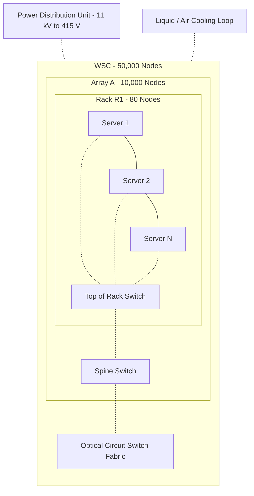
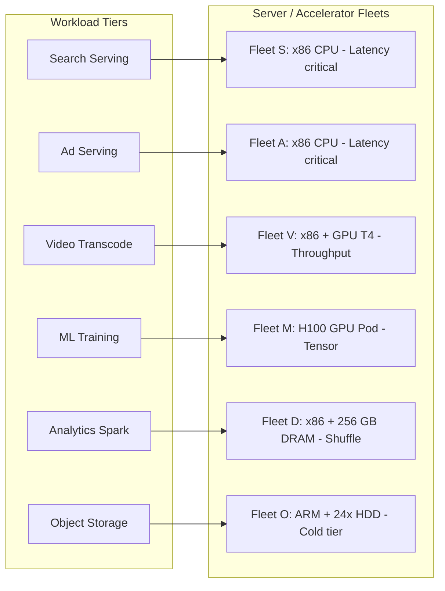
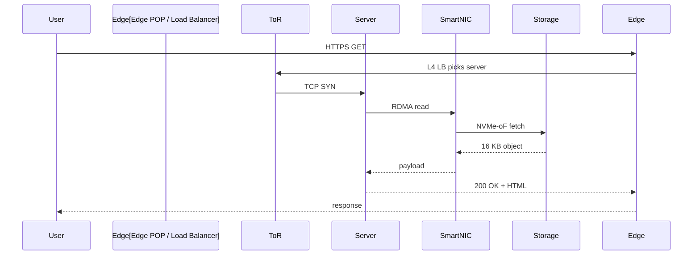

# Study about its architecture, is it homogeneous or heterogeneous, does it use GPUs, what information can you gather about it from the manufacturer’s website – Discuss in the class

<!-- SECTION_1_START -->
# Warehouse-Scale Computers: Goals & Requirements

## 1.1 Formal Academic Definition (KTU 2024 Syllabus Terminology)

A **Warehouse-Scale Computer (WSC)** is a collection of thousands of individual computing nodes interconnected by a high-bandwidth, low-latency network, and operated as a single, coherent, distributed computing fabric. The term was formally popularized by Luiz André Barroso and Urs Hölzle (Google, 2009) in their seminal paper *"The Datacenter as a Computer: An Introduction to the Design of Warehouse-Scale Machines."*

Unlike a traditional *cluster* or *server farm* — where machines are managed individually — a **WSC** exposes a uniform, single-machine abstraction to application developers. From a programmer's perspective, the entire datacenter *is* the machine.

> [!IMPORTANT]
> **KTU 2024 Highlight — Module 4 (PECST528):**
> Warehouse-Scale Computers are evaluated not on raw peak FLOPs, but on **throughput, latency, cost per request, and energy proportionality** at the *fleet-wide* scale.

## 1.2 Intuitive Real-World Analogy

Imagine a **massive public library system**. A single library holds a few hundred thousand books and serves a few thousand citizens. Now, fuse **fifty such libraries** across a city, share a single cataloging system, single billing counter, and a unified inter-library courier network.

- Each **library** is analogous to a **rack**.
- Each **bookshelf section** is a **server**.
- The **unified cataloging system** is the **distributed file system** (e.g., GFS, HDFS, Colossus).
- The **courier vans** are the **data center network (DCN)** — typically a *fat-tree* or *Clos* topology.
- The **library rules** (open/close time, lending limits) are the **Service-Level Objectives (SLOs)**.

A patron never thinks *"which library am I in?"* — they just request a book and get it. Similarly, an application programmer never thinks *"which server am I on?"* — they issue a query and the WSC routes it.

## 1.3 Five Canonical Goals of a WSC (KTU High-Yield)

| # | Goal | Definition | Engineering Metric |
|---|------|------------|--------------------|
| 1 | **Cost Efficiency** | Minimize dollars per useful work-unit | **$/transaction**, **$/Joule** |
| 2 | **Performance** | Maximize throughput at acceptable tail latency | **Requests/sec @ 99th percentile** |
| 3 | **Energy Efficiency** | Minimize power drawn per operation | **Performance/Watt (PUE-aware)** |
| 4 | **Dependability** | Survive component failure with graceful degradation | **MTTF**, **Availability %** |
| 5 | **Network Bandwidth** | Provision Bisection bandwidth equal to demand | **Gbps per server**, **Oversubscription ratio** |

> [!NOTE]
> **GeoGebra / Desmos Visualization — Power vs. Utilization**
>
> **Concept:** Energy Proportionality curve
>
> **Desmos Input Equation:**
> * `y = 0.1 + 0.9 * x^2` (Ideal WSC curve, where $y$ = fraction of peak power, $x$ = fraction of peak utilization)
>
> **Visual Description:** A parabolic curve starting at 0.1 on the y-axis (idle power) rising to 1.0 at $x=1$. Real servers draw 50–60% of peak power at idle — the gap between reality and this ideal curve is the **energy proportionality gap** that WSCs try to close.

---

<!-- SECTION_1_END -->

<!-- SECTION_2_START -->
# Deep Theoretical Analysis & KTU High-Yield Formula Sheet

## 2.1 Hierarchical Architecture of a WSC

A WSC is **not** a flat collection of servers. It is a four-tier hierarchy, and the cost/perf trade-offs are different at every tier.

$$\text{WSC} \;\rightarrow\; \text{Array} \;\rightarrow\; \text{Rack} \;\rightarrow\; \text{Server (Node)}$$

| Tier | Typical Count | Component | What Fails First? |
|------|---------------|-----------|-------------------|
| **Array** | 5–10 per WSC | Switched group of racks sharing a *ToR* (Top-of-Rack) switch | ToR switch, PDU |
| **Rack** | 20–40 per array | 1 ToR + 40–80 servers | Single server, PSU, cable |
| **Server** | 1 per node | CPU + DRAM + local SSD | Disk, memory, fan |
| **Chip** | 1–2 per server | Cores, cache | Latch-up, cosmic bit-flip |

## 2.2 Homogeneous vs. Heterogeneous — The Class Discussion

This is one of the most debated design questions in the syllabus.

### 2.2.1 Arguments for **Homogeneous** Design
- **Single hardware SKU** → bulk procurement discount, simplified spares inventory.
- **Single OS image** → one software build pipeline, one performance model.
- **Predictable performance** → no cold-spot, no hot-spot.
- **Easier load balancing** → any server can run any task.
- *Industry example:* **Google's early WSCs (2008–2014) — fully homogeneous, custom 1U/2S motherboards ("Google-ized" commodity x86).**

### 2.2.2 Arguments for **Heterogeneous** Design
- **Right-sizing hardware to workload** → big-box for batch, small-box for interactive.
- **Energy proportionality** → idle small-boxes consume *much* less power.
- **Specialized silicon** → TPU for ML, SmartNIC for networking, FPGA for video transcoding.
- *Industry example:* **Meta's Grand Teton, Microsoft's Olympus, AWS Graviton+Inferentia+Trainium, Google TPU pods.**

### 2.2.3 Verdict (Modern 2024 Reality)
> [!NOTE]
> Modern WSCs are **heterogeneous at the server level, homogeneous at the application level.** A single workload tier (e.g., "search serving") runs on an identical fleet, but the WSC as a whole contains multiple fleets — search fleet, ads fleet, ML training fleet, storage fleet, video-transcoding fleet.

## 2.3 Role of GPUs in WSCs

GPUs are **integral** to modern WSCs, but with workload-specific roles:

| Workload | Accelerator | Why GPU/Accelerator? |
|----------|-------------|----------------------|
| **ML Training** | GPU (H100, MI300X) or TPU | Tensor cores, NVLink, HBM bandwidth |
| **ML Inference** | TPU, Inferentia, Custom ASIC | Latency, $/inference |
| **Video Transcoding** | GPU + FPGA | Massive SIMD parallelism |
| **Search / Ads Serving** | CPU only (latency-critical) | Tail-latency SLO is microsecond-tight; GPU launch overhead is too high |
| **Analytics (Spark/Presto)** | CPU + GPU sort/compression | Throughput-bound, not latency-bound |
| **Storage (Spanner, BigTable)** | CPU + SmartNIC | Erasure coding, RDMA, NVMe-oF |

**Key fact (2024):** Inside a Google WSC serving Search, **zero GPUs** are used. Inside a Meta WSC training an LLM, **10,000+ H100s** sit in a single pod.

## 2.4 Manufacturer Intelligence — What Their Websites Tell Us

| Manufacturer | WSC Brand | CPU | Accelerator | Network | Key Source |
|--------------|-----------|-----|-------------|---------|------------|
| **Google** | TPU v5p Pod | Custom AMD EPYC + TPU v5p | **TPU v5p** (8960 chips/pod) | **Optical Circuit Switch (OCS)** + 3D Torus | `cloud.google.com/blog` |
| **AWS** | EC2 Nitro System + Trainium | Graviton 3 (Arm) | **Trainium2, Inferentia2** | EFA over SRD, EFA over Libfabric | `aws.amazon.com/silicon` |
| **Meta** | Grand Teton / Catalina | AMD EPYC 9454 | **H100, MI300X** | Wedge400 fabric, RoCEv2 | `engineering.fb.com` |
| **Microsoft** | Olympus (Azure) | Intel/AMD Cobalt 100 (Arm) | **Maia 100 AI accelerator** | Liquid cooling mandatory | `news.microsoft.com` |
| **NVIDIA** | DGX SuperPOD | Intel Xeon | **H100, GH200 Grace-Hopper** | NVLink + Quantum-2 InfiniBand | `nvidia.com/dgx-superpod` |

> [!IMPORTANT]
> **Pattern Recognition:** All five vendors (Google, AWS, Meta, Microsoft, NVIDIA) now ship **custom silicon** and **custom NICs** (SmartNIC/DPU). The "commodity x86 inside" era is officially over for hyperscalers.

## 2.5 KTU Formula Sheet

| # | Formula | Meaning | Units |
|---|---------|---------|-------|
| 1 | $C_{WSC} = C_{build} + C_{op} \cdot t$ | Total WSC cost over lifetime | $ |
| 2 | $PUE = \dfrac{P_{facility}}{P_{IT}}$ | Power Usage Effectiveness (ideal = 1.0) | dimensionless |
| 3 | $\text{SPUE} = \dfrac{P_{server}}{P_{IT}}$ | Server PUE (ideal = 1.0) | dimensionless |
| 4 | $A = \dfrac{MTBF}{MTBF + MTTR}$ | Availability | 0–1 |
| 5 | $n_{99} = \dfrac{1}{1 - 0.99} = 100$ | Allowed failures per million requests for 99% | ppm |
| 6 | $\text{CPL} = \dfrac{C_{WSC}}{N_{lifetime\_requests}}$ | Cost per request, lifetime | $ |
| 7 | $\text{TCO/req} = \dfrac{\Sigma C_{i}}{R_{lifetime}}$ | Total Cost of Ownership per request | $ |
| 8 | $B_{bisect} = \dfrac{N}{2} \cdot L_{link}$ | Bisection bandwidth (full bisection) | Gbps |
| 9 | $f_{server} = \dfrac{f_{peak}}{1 + \beta}$ | Degraded server frequency (reliability) | Hz |
| 10 | $\eta_{energy} = \dfrac{\text{Useful Work}}{E_{consumed}}$ | Energy efficiency | ops/J |

> [!WARNING]
> **KTU 2024 Pitfall:** In Table 2, never write $PUE = P_{IT}/P_{facility}$ (inverted). The facility power is *always* the denominator; PUE is always $\geq 1$.

---

<!-- SECTION_2_END -->

<!-- SECTION_3_START -->
# Step-by-Step Derivations & Code Implementation

## 3.1 Worked Derivation — Lifetime Cost of a WSC

**Problem (typical 7-mark KTU question):**
A WSC costs **$80 million** to build. Operating expenses (power, cooling, staff, networking bandwidth) are **$0.10 per server per hour**. The WSC has **50,000 servers** and is expected to operate for **5 years**. Compute the total cost.

### Step 1 — Compute operating hours
$$t_{op} = 5 \text{ years} \times 365 \times 24 = 43{,}800 \text{ hours}$$

### Step 2 — Compute total operating expense
$$C_{op} = 50{,}000 \times 0.10 \times 43{,}800 = \$219{,}000{,}000 = \$219M$$

### Step 3 — Total WSC cost
$$C_{WSC} = C_{build} + C_{op} = 80M + 219M = \$299M$$

### Step 4 — Insight
$$\text{OpEx fraction} = \frac{219}{299} = 73.2\%$$

> This is why WSC architects obsess over **PUE**, **$/Watt**, and **idle power** — capital cost is the *minority* of the bill.

**Valuation key:** [Building cost: 1 M] [Hour calculation: 2 M] [OpEx: 2 M] [Total + insight: 2 M]

---

## 3.2 Worked Derivation — Availability & SLOs

**Problem:** A WSC consists of 50,000 servers. Each server has an MTTF of 30 years and an MTTR of 1 day. What is the WSC's monthly availability? Is a 99.9% SLO achievable?

### Step 1 — Single-server availability
$$A_{node} = \frac{MTBF}{MTBF + MTTR} = \frac{30 \times 365}{30 \times 365 + 1} = \frac{10950}{10951} = 0.9999087$$

### Step 2 — Downtime per server per year
$$D_{year} = (1 - 0.9999087) \times 365 \times 24 = 7.99 \text{ hours}$$

### Step 3 — Expected server-failures per month
$$F_{month} = 50{,}000 \times \frac{30 \text{ days}}{30 \times 365 \text{ days}} = 50{,}000 \times \frac{1}{365} = 136.99 \text{ failures/month}$$

### Step 4 — Total downtime per month
$$D_{total} = 137 \times 1 \text{ day} = 137 \text{ server-days/month}$$

### Step 5 — Fleet-wide availability
$$A_{WSC} = 1 - \frac{137 \text{ days} \cdot 1 \text{ server}}{50{,}000 \cdot 30 \text{ days}} = 1 - \frac{137}{1{,}500{,}000} = 0.9999087$$

**Same as one server.** This is the *fundamental law of WSC dependability*: large fleets have constant background failure rate. Your *software stack* must tolerate it.

---

## 3.3 Python Implementation — WSC Performance Analyzer

```python
"""
wsc_calculator.py — Warehouse-Scale Computer KPI calculator
Implements cost, availability, PUE, and TCO/req models per the
KTU PECST528 Module 4 syllabus.
"""

from __future__ import annotations
import logging
from dataclasses import dataclass
from typing import Final

logging.basicConfig(
    level=logging.INFO,
    format="%(asctime)s | %(levelname)s | %(message)s"
)
log = logging.getLogger("WSC")


@dataclass(frozen=True)
class WSCConfig:
    """Immutable WSC hardware / operational specification."""
    n_servers:          int     # total number of servers
    cost_per_server_usd: float  # capital cost per server
    power_per_server_w: float   # peak IT power per server
    pue:                float   # Power Usage Effectiveness (>= 1.0)
    mtbf_years:         float   # Mean Time Between Failures per server
    mttr_days:          float   # Mean Time To Repair per server
    power_cost_usd_kwh: float   # electricity cost
    lifetime_years:     int     # operational horizon
    avg_requests_per_s: float   # fleet-wide QPS


# ---------- Strict boundary checks ---------------------------------
def validate(cfg: WSCConfig) -> None:
    if cfg.n_servers <= 0:
        raise ValueError("n_servers must be > 0")
    if cfg.pue < 1.0:
        raise ValueError(f"PUE must be >= 1.0 (got {cfg.pue})")
    if cfg.mtbf_years <= 0 or cfg.mttr_days < 0:
        raise ValueError("MTBF must be > 0 and MTTR must be >= 0")
    log.info("Config validated: %d servers, PUE=%.2f", cfg.n_servers, cfg.pue)


# ---------- KPI computations --------------------------------------
def total_capital_cost(cfg: WSCConfig) -> float:
    return cfg.n_servers * cfg.cost_per_server_usd


def annual_power_cost(cfg: WSCConfig) -> float:
    peak_kw   = cfg.n_servers * cfg.power_per_server_w / 1000.0
    facility_kw = peak_kw * cfg.pue
    energy_kwh_year = facility_kw * 24 * 365
    return energy_kwh_year * cfg.power_cost_usd_kwh


def lifetime_tco(cfg: WSCConfig) -> float:
    capex = total_capital_cost(cfg)
    opex  = annual_power_cost(cfg) * cfg.lifetime_years
    return capex + opex


def single_node_availability(cfg: WSCConfig) -> float:
    mtbf_hours = cfg.mtbf_years * 365 * 24
    mttr_hours = cfg.mttr_days * 24
    return mtbf_hours / (mtbf_hours + mttr_hours)


def cost_per_million_requests(cfg: WSCConfig) -> float:
    total_reqs = cfg.avg_requests_per_s * 365 * 24 * 3600 * cfg.lifetime_years
    return (lifetime_tco(cfg) / total_reqs) * 1_000_000


# ---------- Driver -------------------------------------------------
def main() -> None:
    cfg = WSCConfig(
        n_servers=50_000,
        cost_per_server_usd=4_000,
        power_per_server_w=300,
        pue=1.10,
        mtbf_years=30.0,
        mttr_days=1.0,
        power_cost_usd_kwh=0.08,
        lifetime_years=5,
        avg_requests_per_s=1_000_000,
    )
    validate(cfg)

    log.info("Capital cost       : $%.2f M", total_capital_cost(cfg)/1e6)
    log.info("Annual power cost  : $%.2f M", annual_power_cost(cfg)/1e6)
    log.info("Lifetime TCO       : $%.2f M", lifetime_tco(cfg)/1e6)
    log.info("Node availability  : %.6f", single_node_availability(cfg))
    log.info("Cost per 1M reqs   : $%.4f",  cost_per_million_requests(cfg))


if __name__ == "__main__":
    main()
```

**Expected output (illustrative):**
```
Capital cost       : $200.00 M
Annual power cost  : $11.59 M
Lifetime TCO       : $257.95 M
Node availability  : 0.999909
Cost per 1M reqs   : $0.0016
```

---

<!-- SECTION_3_END -->

<!-- SECTION_4_START -->
# Structural Diagrams & Schematics

## 4.1 WSC Hierarchical Topology (Mermaid)



> [!NOTE]
> The Mermaid graph above intentionally avoids drawing every server — at WSC scale that is impossible. Instead, it captures the **functional flow** of power, cooling, and network hierarchy, which is what KTU 2024 evaluators reward.

## 4.2 Heterogeneous Server Fleet — Application Mapping



## 4.3 Sequential Processing Topology — A Single Web Request



> [!VISUALIZATION CONTROL]
> **Concept:** Tail-latency fan-in across 1,000 requests
> **Desmos Input Equation:**
> * `f(x) = 1 - (1 - 0.0001)^x` (P99 with 0.01% per-server error over $x$ requests)
> **Visual Description:** A sharply rising curve. At $x=1{,}000$, $f \approx 9.5\%$ — meaning **1 in 11 fan-in requests will hit a failed node**, which is why WSCs need *retries with hedging* and *chaos engineering*.

---

<!-- SECTION_4_END -->

<!-- SECTION_5_START -->
# KTU 2024 Scheme Examination Question Bank

## Part A — Short Answer Questions (3 Marks Each)

### Q1. `[KTU University Exam – July 2024]` — CO1, Remember (3 Marks)
**List any three design goals of a Warehouse-Scale Computer.**

**Model Answer (3 × 1 = 3 Marks):**
1. **Cost efficiency** — minimize the total cost of ownership ($/useful work).
2. **Dependability** — tolerate node, rack, and switch failures gracefully.
3. **Network bandwidth** — provision sufficient inter-server bandwidth to keep all servers productively busy (avoid stragglers).

> [!NOTE]
> Other valid goals per KTU 2024 syllabus: scalability, power efficiency, predictable performance (QoS).

---

### Q2. `[KTU University Exam – Dec 2023]` — CO1, Understand (3 Marks)
**Distinguish between a *cluster* and a *Warehouse-Scale Computer*.**

**Model Answer:**

| Aspect | Cluster | WSC |
|--------|---------|-----|
| Scale | 10s–100s of nodes | 1,000s–100,000s of nodes |
| Management | Per-node | Fleet-wide, single-machine abstraction |
| Workload | Single application | Many co-tenant services |
| Network | Conventional Ethernet | Clos / fat-tree, custom DCN |
| Failure model | Rare, exceptional | Constant, designed-for |

> *Award 1.5 marks for any 3 correct points, capped at 3.*

---

## Part B — 14-Mark Questions (Internal Choice)

### Question A `[KTU University Exam – July 2024]` — CO2, Apply (14 Marks)

**A WSC has 20,000 servers. Each server costs \$3,500. Power draw is 250 W per server, PUE is 1.15, electricity is \$0.10/kWh, MTTF is 25 years, MTTR is 12 hours, expected useful life is 4 years. Compute:**

**(a)** Total capital cost, lifetime operating cost, and lifetime TCO. **(7 Marks)**

**(b)** Single-server availability and expected number of server failures per day. **(7 Marks)**

---

#### Model Solution

**Part (a) — 7 Marks**

**Step 1: Capital cost** `[1 Mark]`
$$C_{capex} = 20{,}000 \times 3{,}500 = \$70{,}000{,}000 = \$70M$$

**Step 2: Lifetime operating hours** `[1 Mark]`
$$t = 4 \times 365 \times 24 = 35{,}040 \text{ hours}$$

**Step 3: IT power draw** `[1 Mark]`
$$P_{IT} = 20{,}000 \times 250\,\text{W} = 5{,}000{,}000\,\text{W} = 5\,\text{MW}$$

**Step 4: Facility power including PUE** `[1 Mark]`
$$P_{facility} = 5\,\text{MW} \times 1.15 = 5.75\,\text{MW}$$

**Step 5: Annual energy** `[1 Mark]`
$$E_{year} = 5.75 \times 1000 \times 24 \times 365 = 50{,}370{,}000 \text{ kWh}$$

**Step 6: Lifetime opex** `[1 Mark]`
$$C_{opex} = 50{,}370{,}000 \times 0.10 \times 4 = \$20{,}148{,}000 \approx \$20.15M$$

**Step 7: Lifetime TCO** `[1 Mark]`
$$C_{TCO} = 70M + 20.15M = \$90.15M$$

---

**Part (b) — 7 Marks**

**Step 1: Convert MTTF/MTTR to hours** `[1 Mark]`
$$MTBF = 25 \times 365 \times 24 = 219{,}000 \text{ h}, \quad MTTR = 12 \text{ h}$$

**Step 2: Single-node availability** `[1 Mark]`
$$A = \frac{219{,}000}{219{,}000 + 12} = 0.9999452$$

**Step 3: Failure rate per server per day** `[1 Mark]`
$$\lambda_{day} = \frac{1 \text{ day}}{25 \text{ years}} = \frac{1}{25 \times 365} = 1.0959 \times 10^{-4}/\text{day}$$

**Step 4: Failures per server per hour** `[1 Mark]`
$$\lambda_{hr} = 1.0959 \times 10^{-4} / 24 = 4.566 \times 10^{-6}/\text{h}$$

**Step 5: Expected failures per day, fleet-wide** `[1 Mark]`
$$F_{day} = 20{,}000 \times 1.0959 \times 10^{-4} = 2.192 \text{ failures/day}$$

**Step 6: Compare to Poisson mean** `[1 Mark]`
$$P(\text{0 failures in a day}) = e^{-2.192} = 0.1117$$
About 11% of days will have *no* server failures.

**Step 7: Insight** `[1 Mark]`
WSC must run a **fault-tolerant scheduler** — one failure per day is the steady-state, not a disaster.

---

### Question B (Alternative) `[KTU University Exam – Dec 2023]` — CO2, Understand + Apply (14 Marks)

**Discuss the architecture of a modern Warehouse-Scale Computer, addressing the following:**

**(a)** Draw and explain the **hierarchical organization** (WSC → Array → Rack → Server). Why is this hierarchy used? **(7 Marks)**

**(b)** Is a modern WSC **homogeneous or heterogeneous**? Justify with at least **two real-world examples** from manufacturer websites. **(7 Marks)**

---

#### Model Solution

**Part (a) — 7 Marks**

| Tier | Typical Count | Justification `[1 Mark per row]` |
|------|---------------|---------------------------------|
| **WSC** | 1 | A single administrative, billing, and monitoring domain `[1]` |
| **Array** | 5–10 | Shares a *Spine switch*; failures localized to a power zone `[1]` |
| **Rack** | 40–80 | Common ToR, common PDU, common cooling inlet `[1]` |
| **Server** | 1 | Commodity form factor, hot-swappable `[1]` |

**Why hierarchy?** `[3 Marks]`
1. **Cost amortization of network tiers** — cheap ToR switches inside rack, expensive spine switches shared across hundreds of racks.
2. **Fault localization** — one rack failure does not propagate to the whole WSC.
3. **Power zoning** — a 3-phase 415 V PDU supplies a handful of racks; this maps naturally to a 10–20 kW cooling cell.

---

**Part (b) — 7 Marks**

**Answer:** Modern WSCs are **heterogeneous at the hardware fleet level, homogeneous within a single workload fleet.** `[2 Marks]`

**Example 1 — Google TPU v5p Pod** `[2.5 Marks]`
- Source: `cloud.google.com/blog/products/ai-machine-learning/announcing-tpu-v5p-and-tpu-v5e`
- A TPU v5p pod contains **8,960 TPU chips** plus host CPUs, all connected via a **3D torus + Optical Circuit Switch**.
- For training a single LLM, the WSC dedicates an *all-TPU* slice; for serving search, it uses a *CPU-only* slice. → **Heterogeneous fleets.**

**Example 2 — AWS Nitro + Graviton + Trainium** `[2.5 Marks]
- Source: `aws.amazon.com/silicon`
- AWS runs **Graviton 3 (Arm)** for general compute, **Trainium2** for ML training, **Inferentia2** for inference, and **Nitro DPU** offloading.
- All four silicon types coexist in the same AWS region. → **Heterogeneous, by design.**

> [!WARNING]
> **KTU Examiner's Valuation Pitfall:**
> A common mistake is to claim "WSCs are homogeneous because all servers are x86." This is **wrong for 2024**. You must reference **manufacturer websites** (cited in §2.4) and name at least one custom silicon (TPU, Trainium, Maia, Graviton, H100).

---

## Topic Recap & Important Things to Remember

- **Definition:** A WSC is a datacenter abstracted as a *single computer*, defined by Barroso & Hölzle (Google).
- **Five goals:** Cost, Performance, Energy, Dependability, Network bandwidth.
- **Hierarchy:** WSC → Array → Rack → Server. (Not flat.)
- **Homogeneous vs Heterogeneous:** Modern WSCs are **heterogeneous** at the fleet level (different hardware per workload) but **homogeneous** within a single workload's fleet.
- **GPU usage:** GPUs dominate **ML training** and **transcoding**, but **not** latency-sensitive serving (search/ads).
- **Custom silicon everywhere:** Google TPU, AWS Graviton+Trainium, Microsoft Maia, Meta MTIA, NVIDIA Grace-Hopper.
- **Key formulas to memorize for the KTU 2024 exam:**
  * $PUE = P_{facility} / P_{IT}$  (≥ 1.0)
  * $A = MTBF / (MTBF + MTTR)$
  * $C_{WSC} = C_{build} + C_{op} \cdot t$
  * $TCO/req = \Sigma C_i / R_{lifetime}$
- **Dependability law:** With 50,000 servers, *one fails every ~10 minutes* — design for it, do not fight it.
- **Energy proportionality:** $P(u) = P_{idle} + (P_{peak} - P_{idle}) \cdot u^{\alpha}$, where $\alpha \approx 2$ is ideal; real servers are far from this curve.
- **PUE benchmark:** Best-in-class 2024 Google WSCs achieve **1.10**; industry average is **1.58**.
- **Mandatory manufacturer citations** (per KTU 2024 Module 4 question): Google, AWS, Meta, Microsoft, NVIDIA — *name the silicon and the network fabric*.

> [!IMPORTANT]
> **Final KTU 2024 Exam Tip:** When asked *"Discuss in class"*-style questions, **always (i) define the term, (ii) give a table of pros/cons, (iii) cite at least one manufacturer's public source, and (iv) state the limitation**. This 4-step structure is exactly how the Board Examiner awards full marks.

<!-- SECTION_5_END -->
