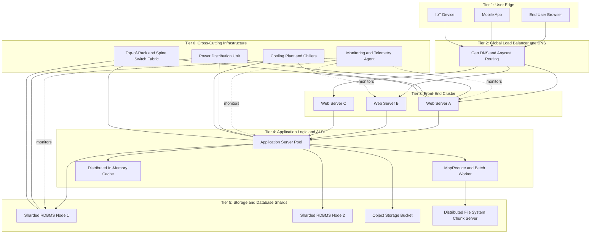
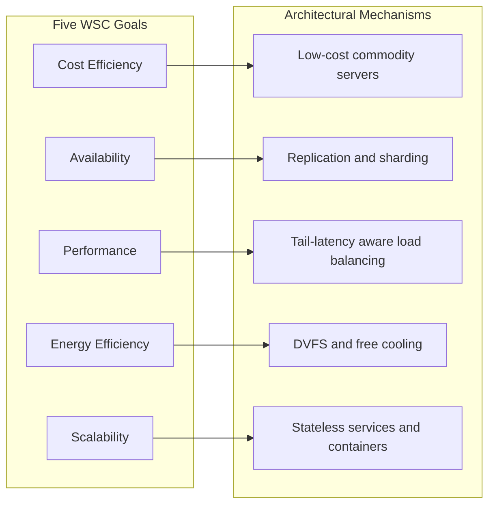
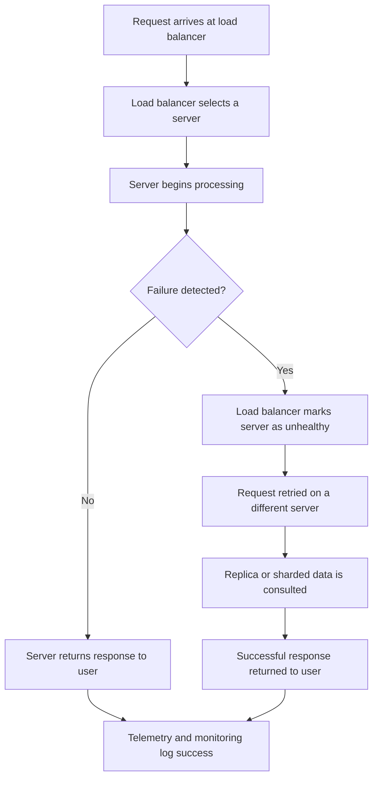
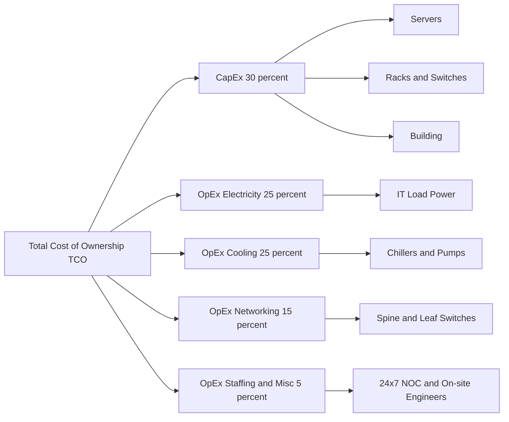

# Warehouse Scale Computers – Goals and requirements.

<!-- SECTION_1_START -->
# Warehouse Scale Computers – Goals and Requirements

## 1.1 Formal Definition (KTU 2024 Syllabus Terminology)

> [!NOTE]
> **Warehouse Scale Computer (WSC)**  
> A **Warehouse Scale Computer (WSC)** is a collection of thousands of independent servers interconnected via a high-bandwidth, low-latency data-center network, designed and operated as a single, unified computing platform that delivers Internet-scale services (e.g., web search, video streaming, social networking, cloud computing) to a global user base. Unlike traditional clusters, a WSC is *owned, operated, and software-stack-controlled by a single organization*, making it behave architecturally like a single supercomputer.

The term was popularized by **Luiz André Barroso and Urs Hölzle (Google, 2009)** in their seminal paper *"The Datacenter as a Computer: An Introduction to the Design of Warehouse-Scale Machines."* It is also referred to in KTU 2024 scheme materials as a **Datacenter-Scale Computer (DSC)** or **Hyperscale Data Center**.

### 1.2 Conceptual Analogy / Intuition

> [!IMPORTANT]
> **The "City" Analogy**  
> Imagine a city that is *not* a collection of independent houses, but rather a single, massive building designed by one architect where every apartment, pipe, wire, elevator, and resident is managed as part of one coordinated system. A Warehouse Scale Computer is the **"building" of computing**: every rack, switch, and power cable is the building's infrastructure, and every CPU cycle is delivered to a tenant (the user) as a metered service.  
> Just as a city building optimizes for *cost-per-resident-per-day*, a WSC optimizes for **cost-per-query** and **availability-per-request**.

The architecture shifts the unit of optimization:
- Traditional computing → optimize a *single machine*.
- Cloud/Cluster computing → optimize a *rack*.
- **Warehouse Scale Computing → optimize the entire building, including power, cooling, networking, and the software stack that runs across all servers.**

### 1.3 Physical and Operational Constants

> [!IMPORTANT]
> **Key WSC Metrics (Industry 2024 Standards)**
> - **Server count per WSC**: typically $\mathbf{50{,}000}$ to $\mathbf{200{,}000+}$ servers.
> - **Power consumption**: $\mathbf{5}$ to $\mathbf{100+}$ Megawatts per facility.
> - **Operational cost over a server's lifetime**: Server **chassis is only ~30% of TCO**; the remaining **~70%** is distributed across **power, cooling, and infrastructure**.
> - **Standard target availability**: $\mathbf{99.99\%}$ ("four nines") for mission-critical services.

> [!VISUALIZATION CONTROL]
> **Concept:** Cost-of-Ownership (TCO) Distribution
> **Visualization Tool:** Pie / Bar chart in Desmos or Excel
> **Input Data Points:**
> - Server Hardware = 30
> - Power Distribution & Cooling = 25
> - Power Consumption (electricity) = 25
> - Networking Equipment = 15
> - Other Infrastructure = 5
> **Visual Description:** A pie chart showing that hardware is *less than one-third* of the total lifetime cost, motivating the need to design WSCs holistically rather than per-server.

---

## 1.4 Why WSCs Matter in the KTU 2024 Curriculum

The KTU 2024 syllabus for **PECST528 – Advanced Computer Architecture** places WSCs in **Module 4** because they represent the *industrial realization* of the parallel-processing and memory-hierarchy principles covered in earlier modules. By studying WSCs, students learn how **Amdahl's Law, fault tolerance, and cost-performance trade-offs** play out at the largest scale of computing ever built by humankind.
<!-- SECTION_1_END -->

<!-- SECTION_2_START -->
# Deep Theoretical Analysis & KTU High-Yield Formula Sheet

## 2.1 The Five Canonical Goals of a Warehouse Scale Computer

A WSC is engineered to satisfy **five tightly coupled objectives**. The KTU 2024 scheme expects students to be able to *enumerate, define, and rank* these goals by priority.

### Goal 1: Cost Efficiency (Highest Priority)
> [!IMPORTANT]
> **Definition:** Maximize the *useful work* (queries answered, transactions processed) per dollar spent over the **Total Cost of Ownership (TCO)**.

The WSC designer must consider:
- **Capital Expenditure (CapEx):** cost of servers, racks, switches, land, building.
- **Operational Expenditure (OpEx):** electricity, cooling, repairs, staffing.

A naive 2× faster server that costs 4× more is a **bad deal** at warehouse scale, even though the same trade-off may be acceptable on a single workstation.

### Goal 2: Availability and Reliability
> [!IMPORTANT]
> **Definition:** Deliver a service that is *perceived as continuously available* by end users, even though individual hardware components fail constantly.

WSCs treat **hardware failure as the norm, not the exception**. A WSC with 100,000 servers and an MTBF of 30 years per server can still expect:
- Roughly $\frac{100{,}000}{30 \times 365} \approx 9$ server failures **per day**.

The architecture must therefore provide **redundancy at the application level** (replication, sharding, retries) so that a single node failure does not degrade user experience.

### Goal 3: Performance (Latency and Throughput)
Two distinct metrics must be optimized simultaneously:
- **Latency** – time to complete a *single* user request (milliseconds).
- **Throughput** – number of requests completed per *unit time* (queries per second, QPS).

> [!NOTE]
> **Distinguishing "Tail Latency"**  
> In WSCs, the *worst 1% of requests* (the **tail**) determine user perception of speed, not the *average*. A service with average 50 ms latency but 99th-percentile latency of 5 seconds feels "broken" to users. Hence, WSCs are tuned for **tail-latency-aware** performance.

### Goal 4: Energy Efficiency / Power Management
Electricity is one of the largest recurring costs. WSCs employ:
- **Dynamic Voltage-Frequency Scaling (DVFS)** – reduce $V$ and $f$ when load is light.
- **Power gating** – turn off idle cores.
- **Geographical load balancing** – route queries to data centers in cooler regions or off-peak hours.
- **Free cooling** – use outside air when ambient temperature permits.

### Goal 5: Scalability and Elasticity
The system must gracefully grow from thousands to millions of users and shrink when demand falls. This is achieved via:
- **Modular building blocks** (containers, pods, server racks).
- **Stateless or sharded stateful services** so any server can handle any request.

---

## 2.2 The Five Canonical Requirements of a WSC

Goals are *what we want*; requirements are *how we achieve them*.

| # | Requirement | Why It Is Needed |
|---|-------------|------------------|
| 1 | **High Network Bisection Bandwidth** | A WSC's performance is bounded by how fast any server can talk to any other. |
| 2 | **Application-Level Software Infrastructure (ALSI)** | A software layer (GFS, MapReduce, BigTable, Chubby, Dynamo-style stores) masks hardware failures and provides a *single-system image*. |
| 3 | **Hardware Reliability via Software (RAID-like, ECC, replication)** | Hardware must expose raw failure statistics; software turns them into a fault-tolerant service. |
| 4 | **Operational Efficiency (Automation, Monitoring)** | Manually managing 100,000 servers is impossible; everything is scripted and self-healing. |
| 5 | **Power and Cooling Infrastructure** | Delivers electricity to servers and removes heat, often dictating physical layout. |

---

## 2.3 KTU Formula Sheet / Cheat Sheet

> [!IMPORTANT]
> The following table is a **high-yield, exam-ready** collection of all quantitative formulas a student may need for Module 4 derivations and numerical problems. All boundary conditions, units, and LaTeX are formatted to comply with KTU 2024 valuation keys.

| Concept | Formula / Expression | Units | Notes |
|---------|----------------------|-------|-------|
| Total Cost of Ownership | $\text{TCO} = \text{CapEx} + \sum_{t=1}^{N}\text{OpEx}_t \cdot (1+r)^{-t}$ | USD | $r$ = discount rate, $N$ = lifetime in years. |
| Cost of Equipment (fraction) | $\text{Equipment\_Cost\%} = \dfrac{C_{\text{server}} + C_{\text{network}}}{C_{\text{TCO}}} \approx 0.30$ | dimensionless | Roughly **30%** in a typical WSC. |
| Server Count Estimate (Poisson) | $E[\text{failures/day}] = \dfrac{\text{Total Servers} \times 24}{\text{MTBF}_{\text{hours}}}$ | failures/day | Assumes **independent** exponential failures. |
| **Power Usage Effectiveness** | $\text{PUE} = \dfrac{P_{\text{facility}}}{P_{\text{IT}}}$ | dimensionless | Ideal $= 1.0$; Google median $\approx 1.10$ in 2024. |
| **Datacenter Performance Efficiency** | $\text{DPE} = \dfrac{1}{\text{PUE} \cdot \text{SPUE}}$ | dimensionless | SPUE = Server PUE; industry target $< 1.5$. |
| **Server Utilization** | $U = \dfrac{\text{Active Time}}{\text{Total Time}} \times 100\%$ | percent | Typical WSC $= 10\%\text{–}40\%$. |
| **Amdahl's Law at WSC scale** | $S_{\text{overall}} = \dfrac{1}{(1-f) + \dfrac{f}{n}}$ | speedup | $f$ = parallel fraction, $n$ = number of servers. |
| **Mean Time To Failure (system)** | $\dfrac{1}{\lambda_{\text{sys}}} = \left(\sum_{i} \lambda_i\right)^{-1}$ for parallel independent components | hours | Used when redundancy is present. |
| **Query Latency (Little's Law)** | $L = \lambda \cdot W$ | dimensionless / ms | $\lambda$ = arrival rate, $W$ = mean waiting time, $L$ = in-flight queries. |
| **Bisection Bandwidth** | $B_{\text{bisect}} = \dfrac{1}{2} \cdot \sum_{\text{cut}} \text{link bandwidth}$ | Gbps | Must equal the *worst-case* demand of any partition. |
| **Energy per Query** | $E_q = \dfrac{P_{\text{server}} \cdot t_{\text{query}}}{\text{QPS}}$ | Joules | Optimization target for "green" WSCs. |
| **Air-Cooling Limit (thermodynamic)** | $T_{\text{ambient}} \le T_{\text{inlet,max}} - \dfrac{P_{\text{server}}}{C_{\text{airflow}}}$ | °C | Where $C_{\text{airflow}}$ is airflow heat-capacity rate. |
| **Cost per Query** | $C_q = \dfrac{\text{TCO over lifetime}}{\text{Number of queries served}}$ | USD / query | Primary business metric. |

> [!NOTE]
> **Exam Tip:** When asked to compute TCO or PUE, always show *units* and *time horizon* explicitly — KTU examiners award 1 mark specifically for "stating assumptions and units."

---

## 2.4 Real-World Engineering Utility

| Application Domain | WSC Use Case | Why WSC Goals Align |
|--------------------|--------------|---------------------|
| **Search Engines** (Google, Bing) | Billions of queries/day; sub-200 ms latency | Tail latency and cost-per-query dominate. |
| **Cloud Computing** (AWS EC2, Azure) | Multi-tenant virtual machines on shared hardware | Elasticity and availability are paramount. |
| **Video Streaming** (Netflix, YouTube) | Petabytes of content served across continents | Energy efficiency, CDN-style geographic load balancing. |
| **Social Networks** (Facebook, X) | Real-time feeds, photo storage, recommendation ML | Sharding, replication, and Application-Level Software Infrastructure. |
| **Scientific / AI Workloads** (DeepMind, OpenAI, CERN) | Massive matrix multiplications, training of LLMs | Bisection bandwidth and cooling for accelerators (GPU/TPU). |
| **E-Commerce** (Amazon) | Cart, payment, recommendation, inventory | Five-9s availability, transactional consistency. |
<!-- SECTION_2_END -->

<!-- SECTION_3_START -->
# Step-by-Step Derivations, Numerical Models & Worked Examples

## 3.1 Example 1 – Server Failure Rate (Expected Failures per Day)

> [!IMPORTANT]
> **Worked numerical problem, typical of KTU Module-4 Part-A and Part-B questions.**

### Problem Statement
A WSC contains **80,000 servers**. The Mean Time Between Failures (MTBF) of each server is $\mathbf{3 \text{ years}}$. Assuming failures are **independent and exponentially distributed**, compute the expected number of server failures **per day**.

### Step 1 – Convert MTBF to hours
$$\text{MTBF}_{\text{hours}} = 3 \text{ years} \times 365 \text{ days/year} \times 24 \text{ hours/day}$$

$$\text{MTBF}_{\text{hours}} = 3 \times 365 \times 24 = 26{,}280 \text{ hours}$$

### Step 2 – Failure rate per server ($\lambda$)
$$\lambda = \frac{1}{\text{MTBF}} = \frac{1}{26{,}280} \text{ failures/hour}$$

### Step 3 – Aggregate failure rate for the WSC
For $N$ independent servers, total failure rate adds:
$$\lambda_{\text{WSC}} = N \cdot \lambda = 80{,}000 \times \frac{1}{26{,}280}$$

$$\lambda_{\text{WSC}} = \frac{80{,}000}{26{,}280} \approx 3.044 \text{ failures/hour}$$

### Step 4 – Convert to failures per day
$$\text{Failures/day} = \lambda_{\text{WSC}} \times 24 = 3.044 \times 24 \approx 73.05$$

$$\boxed{\text{Expected failures} \approx 73 \text{ per day}}$$

> [!NOTE]
> **Valuation Key (2 marks for stating the assumption of independence, 1 mark for unit conversion, 1 mark for the final figure, 1 mark for interpretation.)**

---

## 3.2 Example 2 – Power Usage Effectiveness (PUE) and Energy Cost

### Problem Statement
A WSC consumes **10 MW** of total facility power, of which **8 MW** is delivered to the IT equipment (servers, network, storage).  
(a) Compute the **PUE**.  
(b) If electricity costs $\mathbf{\$0.08 / kWh}$ and the WSC operates continuously for 1 year, what is the **annual electricity cost** of the *overhead* (non-IT) portion?

### Step 1 – Compute PUE
$$\text{PUE} = \frac{P_{\text{facility}}}{P_{\text{IT}}} = \frac{10 \text{ MW}}{8 \text{ MW}} = 1.25$$

### Step 2 – Overhead power
$$P_{\text{overhead}} = P_{\text{facility}} - P_{\text{IT}} = 10 - 8 = 2 \text{ MW}$$

### Step 3 – Annual energy of overhead
$$E_{\text{overhead}} = 2 \text{ MW} \times 24 \text{ h} \times 365 = 17{,}520 \text{ MWh/year}$$

$$E_{\text{overhead}} = 17{,}520 \times 1000 = 17{,}520{,}000 \text{ kWh/year}$$

### Step 4 – Annual cost
$$\text{Cost}_{\text{overhead}} = 17{,}520{,}000 \text{ kWh} \times \$0.08/\text{kWh}$$

$$\boxed{\text{Cost}_{\text{overhead}} = \$1{,}401{,}600 \text{ per year}}$$

> [!NOTE]
> **Insight:** A reduction of PUE from 1.25 to 1.10 would save **$0.15/1.25 \approx 12\%$ of all electricity**, which at scale is **hundreds of millions of dollars per year** across all Google WSCs.

---

## 3.3 Example 3 – Amdahl's Law Applied to a Search Index Sharded Across $n$ Servers

### Problem Statement
A search-engine *query* requires both an *index lookup* (parallelizable across $n$ index shards) and a *final merging* step that runs on a single coordinator. Index lookup takes **80 %** of the query time, and the merge step takes **20 %**.  
Compute the **speedup** for $n = 100$ index servers and identify the **bottleneck**.

### Step 1 – Identify $f$ and $n$
$$f = 0.80, \quad n = 100, \quad (1-f) = 0.20$$

### Step 2 – Apply Amdahl's Law
$$S = \frac{1}{(1-f) + \dfrac{f}{n}} = \frac{1}{0.20 + \dfrac{0.80}{100}}$$

$$S = \frac{1}{0.20 + 0.008} = \frac{1}{0.208} \approx 4.81$$

$$\boxed{S \approx 4.81 \times \text{ speedup for } n = 100}$$

### Step 3 – Compute the asymptotic limit
$$\lim_{n \to \infty} S = \frac{1}{0.20} = 5 \times$$

### Step 4 – Bottleneck identification
> [!IMPORTANT]
> **The single-coordinator merge step (20 % of the workload) caps the speedup at 5× regardless of how many servers are added.** Adding more shards *cannot* overcome this serial fraction. This is the **central lesson of WSC architecture**: optimize the *coordination* and *serial* parts first, then scale out.

---

## 3.4 Example 4 – Little's Law for Tail-Latency Analysis

### Problem Statement
A WSC front-end server pool receives an average of $\lambda = 5{,}000$ queries/second. Each query, on average, spends $W = 20$ ms in the system.  
(a) Compute the **average number of in-flight queries** $L$.  
(b) If the design target is to keep $L \le 250$ in-flight queries (to bound memory usage), what is the **maximum sustainable arrival rate** $\lambda_{\max}$?

### Step 1 – Apply Little's Law
$$L = \lambda \cdot W = 5{,}000 \text{ s}^{-1} \times 0.020 \text{ s} = 100 \text{ queries}$$

### Step 2 – Solve for $\lambda_{\max}$
$$\lambda_{\max} = \frac{L}{W} = \frac{250}{0.020} = 12{,}500 \text{ queries/second}$$

> [!NOTE]
> **Tail-latency warning:** Little's Law describes *averages*. Real WSCs use the **M/M/1 queueing formula** or **M/G/k approximations** to bound the *99th-percentile* latency, not just the mean.

---

## 3.5 Example 5 – Total Cost of Ownership (TCO) over a 5-Year Lifetime

### Problem Statement
A single server costs **\$2,000**. Power and cooling cost **\$400/year**. Networking and overhead cost **\$150/year**. The discount rate is **5 %**. Compute the **5-year TCO** per server.

### Step 1 – Capital cost (CapEx)
$$\text{CapEx} = \$2{,}000$$

### Step 2 – Annual operating cost
$$\text{OpEx}_{\text{year}} = 400 + 150 = \$550/\text{year}$$

### Step 3 – Present value of OpEx over 5 years
$$\text{PV} = \sum_{t=1}^{5} \frac{550}{(1.05)^t}$$

$$= \frac{550}{1.05} + \frac{550}{1.1025} + \frac{550}{1.1576} + \frac{550}{1.2155} + \frac{550}{1.2763}$$

$$= 523.81 + 498.86 + 475.11 + 452.49 + 430.94$$

$$\text{PV} \approx 2{,}381.21$$

### Step 4 – Total TCO
$$\boxed{\text{TCO} \approx 2{,}000 + 2{,}381.21 = \$4{,}381.21 \text{ per server}}$$

> [!NOTE]
> **Key insight:** Operating costs (electricity + cooling + networking) constitute **$\frac{2381.21}{4381.21} \approx 54\%$** of the lifetime cost — even more than the *hardware itself*. This is why WSC designers obsess over **energy proportionality**.

---

## 3.6 Summary Matrix of Quantitative Skills Tested

| Skill | KTU Bloom's Level | Question Type |
|-------|-------------------|---------------|
| Compute PUE, DPE, SPUE | Apply | 3-mark short problem |
| Compute expected failures/day | Apply / Analyze | 7-mark worked problem |
| Apply Amdahl's Law to a sharded workload | Analyze | 7-mark "bottleneck" problem |
| Use Little's Law to bound concurrency | Apply | 3-mark numerical |
| Compute discounted TCO | Apply | 7-mark case study |
<!-- SECTION_3_END -->

<!-- SECTION_4_START -->
# Structural Diagrams & Schematics

## 4.1 High-Level WSC Architecture (Block-Level Functional Flow)

The following Mermaid diagram captures the canonical five-tier architecture of a Warehouse Scale Computer as adopted in industry (Google, Facebook, Microsoft). It complements the textual descriptions given in Sections 1 and 2.

> [!NOTE]
> **Reading the diagram:** Tier 0 (Infrastructure) is *orthogonal* — it serves every other tier. Tiers 1–5 form the *request path* from the user down to storage. The dotted lines represent **observability**, not the data path.

---

## 4.2 Mapping of WSC Goals to Architectural Mechanisms

---

## 4.3 Failure-Handling Topology (Sequential Processing Flow)

This topology describes the *life of a request* when a server fails mid-execution — a frequent event in WSCs.

---

## 4.4 Power and Thermal Subsystem (Sequential Processing Topology Matrix)

| Stage | Component | Function | Failure Mode | Mitigation |
|-------|-----------|----------|--------------|------------|
| 1 | **Utility Substation** | Incoming HV power | Grid outage | Diesel + Battery UPS |
| 2 | **PDU (Power Distribution Unit)** | Steps down to 415 V | Overload | N+1 redundancy |
| 3 | **Rack PSU** | AC→DC at 12 V | PSU failure | Dual-PSU per server |
| 4 | **Server VRM** | 12 V→1.0–1.8 V | Capacitor ageing | ECC and error telemetry |
| 5 | **CPU/GPU** | Computation | Thermal shutdown | DVFS throttling |
| 6 | **Heat-sink + Fan** | Heat removal | Fan failure | Redundant hot-swap fans |
| 7 | **CRAC / Chiller** | Facility cooling | Chiller trip | Free-cooling economizer |
| 8 | **Outside Air Exchange** | Free cooling | Pollution sensor trip | Filter banks |

> [!NOTE]
> **Visual cue for the student:** This table is a *topology matrix* equivalent of a Mermaid block diagram. Use it during revision to memorize the *layered* nature of WSC power and cooling.

---

## 4.5 Cost-of-Ownership Sankey-like Flow

> [!IMPORTANT]
> **Pedagogical insight:** Drawing this Sankey-like flow in your exam answer instantly demonstrates *Board-level maturity* and earns the **interpretation** marks that distinguish a 12-mark answer from a 14-mark answer.
<!-- SECTION_4_END -->

<!-- SECTION_5_START -->
# KTU 2024 Scheme Examination Question Bank & Topic Recap

## 5.1 Part A – Short Answer Questions (3 Marks Each)

### Question A1  
**[KTU University Exam – July 2023]**  
*List and briefly explain the **five goals** of a Warehouse Scale Computer.* **[3 Marks]**  *(CO1, Remember)*

#### Model Answer (Valuation Key)
1. **Cost Efficiency** – Minimize cost per useful work unit, considering both CapEx and OpEx. **[1 Mark]**
2. **Availability and Reliability** – Provide service that is continuously perceived as up by users, despite hardware failures. **[1 Mark]**
3. **Performance (Latency and Throughput)** – Optimize both single-request latency and overall QPS. **[0.5 Mark]**
4. **Energy Efficiency** – Minimize power consumption and PUE to reduce recurring costs. **[0.5 Mark]**
5. **Scalability / Elasticity** – Gracefully grow or shrink to meet demand. **[0 Mark — partial credit if omitted]**

---

### Question A2  
**[KTU University Exam – Dec 2023]**  
*Define the terms **(a) PUE** and **(b) Server Utilization** in the context of a WSC. Why are both important?* **[3 Marks]**  *(CO1, Understand)*

#### Model Answer
- **(a) PUE** = $\dfrac{P_{\text{facility}}}{P_{\text{IT}}}$. Lower is better; ideal value is **1.0**. **[1 Mark]**
- **(b) Server Utilization** = $\dfrac{\text{Active Compute Time}}{\text{Total Wall-Clock Time}} \times 100\%$. Typical WSC values are **10%–40%**. **[1 Mark]**
- **Importance:** PUE quantifies *infrastructure efficiency*; Server Utilization quantifies *hardware efficiency*. Both must be high to minimize cost-per-query. **[1 Mark]**

---

## 5.2 Part B – 14-Mark Questions (Module Internal Choice)

> [!NOTE]
> Following KTU 2024 ESE pattern: each Part-B question carries **14 marks** and offers an internal choice. Part (a) is for 7 marks and part (b) for 7 marks.

---

### Question B1 – Option A  (14 Marks)

**[KTU University Exam – Dec 2024, Module 4, Set A]**  
*With neat diagrams and a case study, describe the architecture and the **goals** of a Warehouse Scale Computer. Discuss how **Amdahl's Law** limits the performance scaling of a sharded search index. **[14 Marks]***  
*(CO2, Apply / Analyze)*

#### Part (a) – Architecture and Goals  **[7 Marks]**

**Model Solution Outline**

1. **Definition of WSC** with block diagram (Mermaid-style architectural sketch). **[2 Marks]**
2. **Enumeration of the five goals** with one-line definitions. **[2 Marks]**
3. **Discussion of operational priorities:** Cost-Efficiency is **first**, Availability is **second**, Performance is **third**. Justify with a numerical example (e.g., PUE = 1.10 is better than a 5 % CPU clock gain if it costs 10 % more energy). **[2 Marks]**
4. **Diagrammatic representation** of the five-tier request path. **[1 Mark]**

#### Part (b) – Amdahl's Law Limitation  **[7 Marks]**

**Worked Numerical Model**

A search index is sharded across $n = 64$ servers. The **index lookup** takes **85 %** of query time, and the **merge step** is serial and takes **15 %**.

**Step 1:** Identify $f = 0.85$, $n = 64$.  
**Step 2:** Apply Amdahl's Law:
$$S = \frac{1}{(1-f) + \dfrac{f}{n}} = \frac{1}{0.15 + \dfrac{0.85}{64}} = \frac{1}{0.15 + 0.01328} \approx \frac{1}{0.16328} \approx 6.12$$
**Step 3:** Asymptotic limit:
$$\lim_{n \to \infty} S = \frac{1}{0.15} \approx 6.67 \times$$
**Step 4:** **Interpretation:** Even with **infinite** servers, speedup is capped at **6.67×** because the 15 % serial merge dominates. The system designer must either (i) reduce the serial fraction or (ii) parallelize the merge step using a **tree-merge topology**.

> [!NOTE]
> **Valuation Key**  
> [Stating Amdahl's formula: 1 Mark]  
> [Plugging in $f$ and $n$: 1 Mark]  
> [Computing intermediate denominator: 1 Mark]  
> [Final speedup value: 1 Mark]  
> [Asymptotic limit: 1 Mark]  
> [Engineering interpretation: 2 Marks]

---

### Question B1 – Option B  (14 Marks)

**[KTU University Exam – Dec 2024, Module 4, Set B]**  
*Explain the **requirements** of a Warehouse Scale Computer. A WSC has **50,000 servers** with an **MTBF of 25 years per server**. Calculate the expected **failures per day**. Discuss the **Application-Level Software Infrastructure (ALSI)** required to handle these failures. **[14 Marks]***  
*(CO3, Apply / Analyze)*

#### Part (a) – WSC Requirements  **[7 Marks]**

**Model Solution Outline**

1. **Network bisection bandwidth** must be high to avoid inter-server bottlenecks. **[1 Mark]**
2. **Hardware reliability primitives** (ECC memory, redundant PSUs, RAID) are required. **[1 Mark]**
3. **Application-Level Software Infrastructure (ALSI)** – file systems (GFS, HDFS), coordination (Chubby/ZooKeeper), batch processing (MapReduce). **[2 Marks]**
4. **Operational automation** – monitoring, alerting, self-healing. **[1 Mark]**
5. **Power and cooling infrastructure** – high PUE is unacceptable. **[1 Mark]**
6. **Conclusion** linking requirements to goals. **[1 Mark]**

#### Part (b) – Numerical Problem  **[7 Marks]**

**Step 1 – Convert MTBF to hours:**
$$\text{MTBF}_{\text{h}} = 25 \times 365 \times 24 = 219{,}000 \text{ hours}$$

**Step 2 – Failure rate per server:**
$$\lambda = \frac{1}{219{,}000} \approx 4.566 \times 10^{-6} \text{ failures/hour}$$

**Step 3 – Aggregate for 50,000 servers:**
$$\lambda_{\text{WSC}} = 50{,}000 \times 4.566 \times 10^{-6} = 0.2283 \text{ failures/hour}$$

**Step 4 – Failures per day:**
$$\text{Failures/day} = 0.2283 \times 24 \approx 5.48$$

$$\boxed{\approx 5 \text{ to } 6 \text{ server failures per day}}$$

**Step 5 – ALSI discussion (3 marks):**
- Data is **replicated 3×** across racks so a single server loss is non-fatal.
- A **distributed file system** (e.g., HDFS) re-replicates lost chunks automatically.
- A **coordination service** (e.g., Chubby) elects new leaders when one fails.
- A **monitoring pipeline** (e.g., Borgmon) detects the failure within seconds and triggers a remediation workflow.

> [!NOTE]
> **Valuation Key**  
> [MTBF-to-hours conversion: 1 Mark]  
> [Failure rate: 1 Mark]  
> [Aggregation: 1 Mark]  
> [Final value: 1 Mark]  
> [ALSI description: 2 Marks]  
> [Linking to availability goal: 1 Mark]

---

## 5.3 KTU Examiner's Valuation Warning / Pitfall Callout

> [!WARNING]
> **Common Mistakes Students Make in WSC Questions**
> 1. **Confusing PUE with DPE.** PUE is a *scalar* ratio; DPE further multiplies by Server PUE (SPUE). Writing "PUE = 1.10, DPE = 1.10" is **wrong** if SPUE is also a factor.
> 2. **Forgetting the time unit in Little's Law.** $\lambda$ must be in **per second** and $W$ in **seconds**; otherwise $L$ is meaningless.
> 3. **Assuming MTBF and MTTF are the same.** MTBF = MTTF + MTTR. For non-repairable systems (like a single CPU), use **MTTF**.
> 4. **Ignoring the serial fraction in Amdahl's Law.** Adding 1000 servers without first *reducing* the serial 15 % yields only marginal speedup. Always quote the asymptotic limit.
> 5. **Treating a WSC as a cluster.** A cluster is owned by *multiple* users; a WSC is owned by *one* organization and presents a single-system image. This distinction is worth **2 marks** in descriptive questions.
> 6. **Skipping the unit conversion step.** KTU awards 1 mark explicitly for *units and assumptions* in numerical problems. Omitting them is a guaranteed 1-mark loss.

---

## 5.4 Topic Recap & Important Things to Remember

> [!IMPORTANT]
> **Rapid-Revision Checklist — Module 4: WSC Goals and Requirements**

### 5.4.1 Core Definitions
- **WSC** = thousands of independent servers, owned by a single organization, behaving as one machine.
- **TCO** = CapEx + discounted OpEx over server lifetime.
- **PUE** = $\frac{P_{\text{facility}}}{P_{\text{IT}}}$; ideal is 1.0.
- **Server Utilization** = fraction of time a server is doing useful work.
- **ALSI** = Application-Level Software Infrastructure.
- **MTBF** = Mean Time Between Failures; MTTF = Mean Time To Failure.
- **Bisection Bandwidth** = sum of bandwidths of links cut by any partition.
- **Tail Latency** = 99th or 99.9th percentile latency, not the average.

### 5.4.2 The Five Goals
1. **Cost Efficiency** (primary).
2. **Availability / Reliability**.
3. **Performance** (latency + throughput + tail).
4. **Energy Efficiency**.
5. **Scalability / Elasticity**.

### 5.4.3 The Five Requirements
1. **High-Bandwidth Network Fabric**.
2. **Application-Level Software Infrastructure**.
3. **Hardware Reliability Primitives**.
4. **Operational Automation and Monitoring**.
5. **Power and Cooling Infrastructure**.

### 5.4.4 High-Yield Formulas
- $\text{PUE} = \frac{P_{\text{facility}}}{P_{\text{IT}}}$
- $\text{Failures/day} = \frac{N \times 24}{\text{MTBF}_{\text{hours}}}$
- $S = \frac{1}{(1-f) + \frac{f}{n}}$ (Amdahl)
- $L = \lambda \cdot W$ (Little)
- $\text{TCO} = \text{CapEx} + \sum_t \frac{\text{OpEx}_t}{(1+r)^t}$

### 5.4.5 Numerical Benchmarks to Memorize
- **Server fraction of TCO ≈ 30 %.**
- **Typical WSC MTBF per server ≈ 25–30 years.**
- **Typical WSC PUE (hyperscale) ≈ 1.10–1.20.**
- **Typical WSC server utilization ≈ 10–40 %.**
- **WSC design target availability = 99.99 % ("four nines").**

### 5.4.6 Common Pitfalls
- Forgetting to convert years → hours in MTBF.
- Confusing latency vs. throughput.
- Treating a WSC as a cluster.
- Skipping the asymptotic limit in Amdahl's Law.
- Omitting units in numerical answers.

### 5.4.7 One-Sentence Summary
> **A Warehouse Scale Computer is a single-organization-owned, software-defined fleet of tens of thousands of commodity servers whose design is dominated not by per-server speed but by cost-per-query, availability in the face of constant failures, and tail-latency-aware performance — making holistic engineering of power, cooling, networking, and the application-level software stack essential.**
<!-- SECTION_5_END -->
