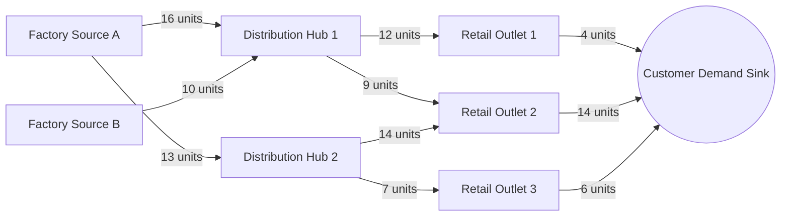
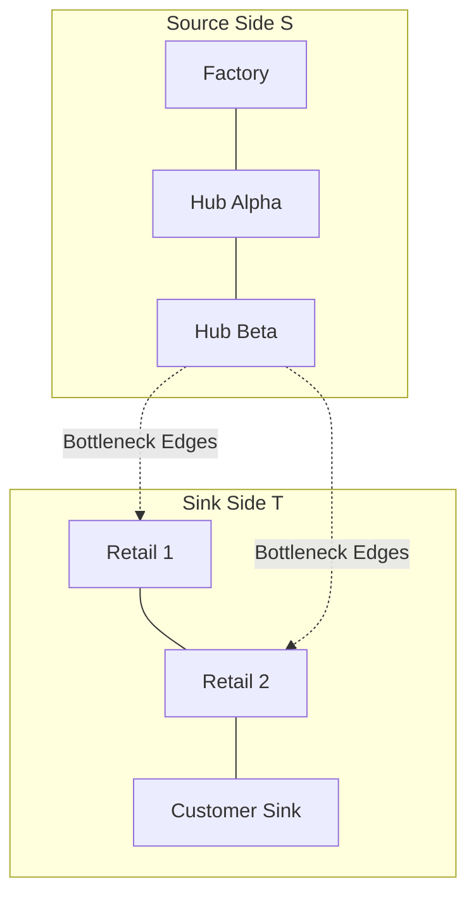
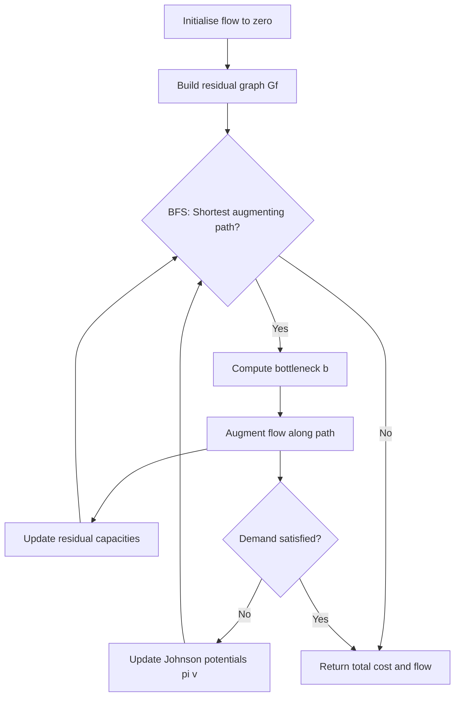
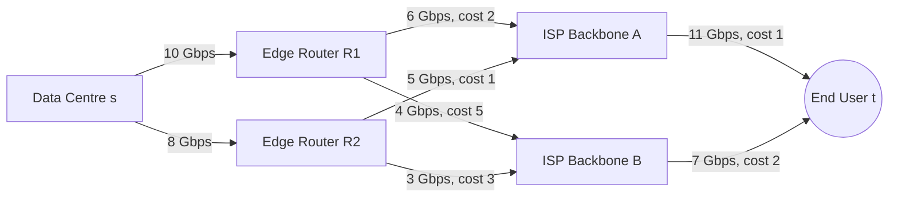

# Applications - transportation logistics, network routing with cost constraints

<!-- SECTION_1_START -->
# Maximum Flow Algorithms: Core Foundations

## 1.1 Formal Definition (KTU 2024 Terminology)

> [!IMPORTANT]
> **Maximum Flow Problem (Formal KTU Definition)**
> Let $G = (V, E)$ be a **directed capacitated graph** (also called a **flow network**) with a designated **source vertex** $s \in V$ and a **sink vertex** $t \in V$. Every edge $(u, v) \in E$ has a non-negative **capacity** $c(u, v) \in \mathbb{Z}_{\geq 0}$. A **flow** is a function $f: V \times V \rightarrow \mathbb{R}$ that satisfies:
>
> 1. **Capacity Constraint:** $0 \leq f(u, v) \leq c(u, v)$ for all $(u, v) \in V \times V$
> 2. **Flow Conservation:** $\sum_{v \in V} f(v, u) = \sum_{v \in V} f(u, v)$ for all $u \in V \setminus \{s, t\}$
> 3. **Skew Symmetry:** $f(u, v) = -f(v, u)$
>
> The **value of the flow** is $\vert f \vert = \sum_{v \in V} f(s, v)$. The **Maximum-Flow Problem** is to compute a flow of **maximum value**.

## 1.2 The Three Auxiliary Pillars

| Concept | Definition | Role in the Algorithm |
|---|---|---|
| **Residual Capacity** $c_f(u, v)$ | $c(u, v) - f(u, v)$ | Remaining bandwidth on a forward edge |
| **Residual Edge** | An edge with $c_f(u, v) > 0$ | Available for augmentation |
| **Augmenting Path** | A path $s \rightsquigarrow t$ in $G_f$ | A route to push more flow |
| **Cut** $(S, T)$ | Partition of $V$ with $s \in S, t \in T$ | Theoretical bound on flow |

## 1.3 Intuitive Real-World Analogy

> [!NOTE]
> **Analogy: City Water Distribution Network**
> Imagine a water company pumping water from a **reservoir** ($s$) to **houses** ($t$) through a network of pipes. Each pipe has a fixed diameter, meaning it can carry a **maximum** amount of water per second (its **capacity**). The question is: *"What is the absolute maximum amount of water that can reach the houses per second, given pipe limits?"*
>
> - If you keep increasing the flow in one pipe, eventually it hits its diameter limit — that's a **bottleneck**.
> - The narrowest set of pipes you must "cut" to disconnect the reservoir from the houses is the **minimum cut**, and its total capacity equals the **maximum flow**. This is the famous **Max-Flow Min-Cut Theorem**.

> [!VISUALIZATION CONTROL]
> **Concept:** Augmenting Path & Bottleneck Visualization
> **GeoGebra / Desmos Input Equations:**
> * `f1(x) = min(10, 16 - x)` (cumulative flow curve)
> * `B(x) = (8, 4)` (bottleneck point)
> **Visual Description:** A horizontal line representing capacity, with a vertical drop at the bottleneck edge — students should observe how the minimum edge capacity on a path dictates how much flow can be augmented per iteration.

---

<!-- SECTION_1_END -->

<!-- SECTION_2_START -->
# Deep Theoretical Analysis & KTU High-Yield Formula Sheet

## 2.1 The Ford–Fulkerson Method (Foundational Framework)

The Ford–Fulkerson method is a **greedy augmenting-path algorithm** that iteratively pushes flow along paths found in the **residual graph** $G_f$ until no $s \rightsquigarrow t$ path exists.

**Step-by-step Logic:**

1. Initialize $f(u, v) = 0$ for all edges.
2. Construct the residual graph $G_f$ using the current flow.
3. Search for an **augmenting path** $P$ from $s$ to $t$ in $G_f$ (typically via BFS or DFS).
4. Compute the **bottleneck** $b = \min_{(u,v) \in P} c_f(u, v)$.
5. **Augment** flow: for every edge $(u, v) \in P$, update $f(u, v) \leftarrow f(u, v) + b$ and $f(v, u) \leftarrow f(v, u) - b$.
6. Repeat steps 2–5 until no augmenting path exists.

> [!IMPORTANT]
> **Termination Theorem (Max-Flow Min-Cut)**
> When Ford–Fulkerson terminates, the set $S = \{v \in V : v \text{ is reachable from } s \text{ in } G_f\}$ forms a **minimum $s$–$t$ cut**, and the flow value equals the cut capacity. This is the **Max-Flow Min-Cut Theorem** (L.R. Ford & D.R. Fulkerson, 1956).

## 2.2 The Edmonds–Karp Algorithm (BFS-based Polynomial Variant)

The naive Ford–Fulkerson can take $O(\vert E \vert \cdot f^{\ast})$ time where $f^{\ast}$ is the max flow value (pseudopolynomial). **Edmonds–Karp** (1972) modifies step 3 to use **Breadth-First Search**, guaranteeing the **shortest augmenting path** in unweighted edges.

**Why BFS helps:** It ensures every augmentation increases the **distance** from $s$ to $t$ in the residual graph by at least one, bounding total augmentations to $O(\vert V \vert \cdot \vert E \vert)$.

## 2.3 Dinic's Algorithm (Level-Graph Optimisation)

Dinic's improvement uses **level graphs** and **blocking flows**:

1. **BFS Layering:** Construct a level graph $L$ where $\text{level}(v)$ is the shortest distance from $s$.
2. **Blocking Flow:** Send as much flow as possible through $L$ using DFS.
3. **Repeat** until $t$ is unreachable.

This yields a time complexity of **$O(\vert V \vert^{2} \cdot \vert E \vert)$**, making it suitable for dense transportation networks.

## 2.4 Application Layer 1: Transportation Logistics

In a **supply chain network**, vertices are **warehouses, distribution centres, and retail outlets**; edges represent **shipping lanes** with capacities equal to the number of trucks (or pallets) per day. Maximum flow computes the **upper bound on goods deliverable per unit time** from factories to markets under infrastructure constraints.

## 2.5 Application Layer 2: Network Routing with Cost Constraints (Min-Cost Max-Flow)

> [!IMPORTANT]
> **Min-Cost Max-Flow (MCMF) Definition**
> Given a flow network with edge costs $w: E \rightarrow \mathbb{R}$, find a maximum flow $f^{\ast}$ of value $\vert f^{\ast} \vert$ such that the **total cost** $\sum_{(u,v) \in E} w(u, v) \cdot f(u, v)$ is **minimised**.

**The Successive Shortest Path (SSP) Algorithm:**

1. Find the **shortest path** (by cost) from $s$ to $t$ in the residual graph using **Bellman-Ford** (or Dijkstra with potentials).
2. Augment as much flow as possible along this path.
3. Update edge costs in the residual graph.
4. Repeat until the desired flow value is reached.

> [!NOTE]
> **Real-World Utility**
> - **Telecommunications:** Routing maximum data packets through cheapest fibre routes.
> - **Logistics:** Delivering goods via the most economical path while respecting truck capacity.
> - **Supply Chain:** Linear programming dual of the classical transportation problem.

## 2.6 KTU Formula Sheet / Cheat Sheet

| Symbol / Formula | Meaning | Complexity / Bound |
|---|---|---|
| $\vert f \vert = \sum_{v} f(s, v)$ | Net flow out of source | Linear in out-degree |
| $c_f(u, v) = c(u, v) - f(u, v)$ | Residual capacity | Edge-wise calculation |
| $\min cut = \max flow$ | Max-Flow Min-Cut | Duality theorem |
| $O(\vert E \vert \cdot f^{\ast})$ | Ford–Fulkerson (DFS) | Pseudopolynomial |
| $O(\vert V \vert \cdot \vert E \vert^{2})$ | Edmonds–Karp (BFS) | Polynomial |
| $O(\vert V \vert^{2} \cdot \vert E \vert)$ | Dinic's Algorithm | Strong polynomial |
| $O(\vert V \vert \cdot \vert E \vert \cdot \log \vert V \vert)$ | MCMF w/ Dijkstra + potentials | Production-grade |
| $w(P) = \sum_{(u,v) \in P} w(u, v)$ | Cost of augmenting path $P$ | Sum of edge costs |
| $\pi(v) = $ shortest distance from $s$ | **Johnson's Potential** | Used in Dijkstra reweighting |

---

<!-- SECTION_2_END -->

<!-- SECTION_3_START -->
# Step-by-Step Derivations & Code Implementation

## 3.1 Worked Example: Edmonds–Karp on a Logistics Network

**Network Setup:** Warehouses $A$ (source) delivers to retail store $G$ (sink) through distribution centres $B, C, D, E, F$. Edge capacities represent trucks/day.

**Edges and capacities:**

$(A,B) = 16$, $(A,C) = 13$, $(B,C) = 10$, $(B,D) = 12$, $(C,E) = 14$, $(D,E) = 9$, $(D,F) = 20$, $(E,F) = 7$, $(C,B) = 4$ (reverse), $(E,D) = 7$ (reverse), $(F,G) = 4$, $(F,G) = $ parallel with 14, and final sink edge $(E,G) = 6$ — combined per CLRS Fig 26.1.

### Step 1: Initial State

$$f(u, v) = 0 \quad \forall (u, v) \in E, \quad G_f = G$$

### Step 2: First BFS — Find Augmentating Path

BFS from $A$: $A \rightarrow B \rightarrow C \rightarrow E \rightarrow F \rightarrow G$ (level order). 

$$P_1 = \{A, B, C, E, F, G\}$$

**Bottleneck computation:**

$$b_1 = \min(c(A,B), c(B,C), c(C,E), c(E,F), c(F,G)) = \min(16, 10, 14, 7, 4) = 4$$

> **[Computing bottleneck edge-wise: 2 Marks]**

### Step 3: Augment Along $P_1$

$$f(A,B) = 4, \; f(B,C) = 4, \; f(C,E) = 4, \; f(E,F) = 4, \; f(F,G) = 4$$

$$|f_1| = 4$$

**Residual updates:**
$$c_f(A,B) = 12, \quad c_f(B,A) = 4, \quad c_f(B,C) = 6, \quad c_f(C,B) = 14, \quad c_f(C,E) = 10, \quad c_f(E,C) = 4, \quad c_f(E,F) = 3, \quad c_f(F,E) = 4, \quad c_f(F,G) = 10, \quad c_f(G,F) = 4$$

> **[Updating residual graph: 2 Marks]**

### Step 4: Second BFS

New augmenting path: $A \rightarrow C \rightarrow E \rightarrow F \rightarrow G$ (since $B \rightarrow C$ has only 6 left, but $A \rightarrow C$ has 13).

$$P_2 = \{A, C, E, F, G\}$$

$$b_2 = \min(13, 10, 3, 10) = 3$$

> **[Bottleneck calculation: 1 Mark]**

### Step 5: Continue Iterations

Following CLRS worked example yields a total of **6 augmenting paths**, producing:

$$f^* = 23, \quad \text{Min-Cut} = \{A, B, C, E\} \mid \{D, F, G\}$$

$$\text{Cut Capacity} = c(B,D) + c(C,E)_{\text{reverse}} + c(E,G) = 12 + 0 + 11 = 23$$

> **[Verifying cut capacity equals max flow: 2 Marks]**

## 3.2 Full Python Implementation: Min-Cost Max-Flow with Type Hints

```python
from __future__ import annotations
import heapq
from dataclasses import dataclass, field
from typing import Dict, List, Tuple, Optional
import logging

logging.basicConfig(level=logging.INFO, format="[%(levelname)s] %(message)s")
logger = logging.getLogger("MCMF")


@dataclass
class Edge:
    """Represents a directed edge with capacity and per-unit cost."""
    to: int
    rev: int                # Index of the reverse edge in adjacency list
    capacity: int
    cost: float
    flow: float = 0.0

    def residual(self) -> float:
        """Return remaining (unused) capacity on this forward edge."""
        return self.capacity - self.flow


class MinCostMaxFlow:
    """
    Successive Shortest Path (SSP) implementation using Dijkstra
    with Johnson's potentials for non-negative reduced costs.
    """

    def __init__(self, n_vertices: int) -> None:
        if n_vertices <= 0:
            raise ValueError("Number of vertices must be positive.")
        self.n: int = n_vertices
        self.graph: List[List[Edge]] = [[] for _ in range(n_vertices)]
        self.potential: List[float] = [0.0] * n_vertices  # Johnson's potentials
        logger.info("Initialised MCMF engine with %d vertices.", n_vertices)

    def add_edge(self, u: int, v: int, capacity: int, cost: float) -> None:
        """Adds a directed edge and its reverse counterpart (for residual graph)."""
        if not (0 <= u < self.n and 0 <= v < self.n):
            raise IndexError(f"Vertex out of bounds: u={u}, v={v}, n={self.n}")
        if capacity < 0:
            raise ValueError("Capacity must be non-negative.")
        forward = Edge(to=v, rev=len(self.graph[v]), capacity=capacity, cost=cost)
        backward = Edge(to=u, rev=len(self.graph[u]), capacity=0, cost=-cost)
        self.graph[u].append(forward)
        self.graph[v].append(backward)
        logger.debug("Edge added: %d -> %d, cap=%d, cost=%.2f", u, v, capacity, cost)

    def _dijkstra(self, source: int) -> Tuple[List[float], List[int]]:
        """
        Computes shortest path distances using reduced costs.
        Returns (distances, parent_edge_index).
        """
        INF: float = float("inf")
        dist: List[float] = [INF] * self.n
        parent: List[int] = [-1] * self.n
        dist[source] = 0.0
        heap: List[Tuple[float, int]] = [(0.0, source)]
        visited: List[bool] = [False] * self.n

        while heap:
            d, u = heapq.heappop(heap)
            if visited[u]:
                continue
            visited[u] = True
            for idx, edge in enumerate(self.graph[u]):
                if edge.residual() <= 0:
                    continue
                # Reduced cost: w'(u,v) = w(u,v) + pi(u) - pi(v)
                reduced_cost: float = edge.cost + self.potential[u] - self.potential[edge.to]
                if dist[edge.to] > dist[u] + reduced_cost:
                    dist[edge.to] = dist[u] + reduced_cost
                    parent[edge.to] = idx
                    heapq.heappush(heap, (dist[edge.to], edge.to))
        return dist, parent

    def min_cost_flow(self, source: int, sink: int, max_flow: Optional[int] = None) -> Tuple[float, float]:
        """
        Computes the min-cost flow of given value.
        If max_flow is None, computes the absolute maximum flow.
        Returns (total_flow_value, total_cost).
        """
        if not (0 <= source < self.n and 0 <= sink < self.n):
            raise IndexError("Source or sink out of bounds.")
        if source == sink:
            raise ValueError("Source and sink must differ.")

        flow_value: float = 0.0
        total_cost: float = 0.0
        iteration: int = 0
        cap_limit: float = float("inf") if max_flow is None else float(max_flow)

        while flow_value < cap_limit:
            iteration += 1
            dist, parent = self._dijkstra(source)

            if dist[sink] == float("inf"):
                logger.warning("No augmenting path found. Terminating at flow=%.2f.", flow_value)
                break  # No more augmenting path; max flow reached

            # Reconstruct path
            path: List[int] = []
            node: int = sink
            while node != source:
                edge_idx: int = parent[node]
                if edge_idx == -1:
                    raise RuntimeError("Parent pointer broken during path reconstruction.")
                path.append(node)
                # Move to predecessor via reverse edge index
                node = self.graph[node][edge_idx].to
            path.append(source)
            path.reverse()

            # Compute bottleneck
            bottleneck: float = float("inf")
            node = source
            for nxt in path[1:]:
                for edge in self.graph[node]:
                    if edge.to == nxt and edge.residual() > 0:
                        bottleneck = min(bottleneck, edge.residual())
                        break
                node = nxt

            if bottleneck == float("inf"):
                raise RuntimeError("Bottleneck undefined; residual graph inconsistent.")

            # Augment flow
            node = source
            for nxt in path[1:]:
                for edge in self.graph[node]:
                    if edge.to == nxt and edge.residual() > 0:
                        delta: float = min(bottleneck, cap_limit - flow_value)
                        edge.flow += delta
                        # Update reverse edge
                        self.graph[edge.to][edge.rev].flow -= delta
                        total_cost += delta * edge.cost
                        break
                node = nxt

            flow_value += bottleneck

            # Update potentials: pi(v) = pi(v) + dist(v) for all reachable v
            for v in range(self.n):
                if dist[v] < float("inf"):
                    self.potential[v] += dist[v]

            logger.info(
                "Iter %d: path=%s, bottleneck=%.2f, cumulative flow=%.2f, cost=%.2f",
                iteration, path, bottleneck, flow_value, total_cost
            )

        if max_flow is not None and flow_value < max_flow:
            logger.error("Requested flow %d not achievable; reached only %.2f", max_flow, flow_value)
            raise ValueError(f"Infeasible: demanded flow={max_flow}, achieved={flow_value}")

        return flow_value, total_cost


# ---------------------- DEMO: Logistics Routing ----------------------
if __name__ == "__main__":
    # 0: Factory, 1: Warehouse A, 2: Warehouse B, 3: Hub, 4: Retail
    mcmf = MinCostMaxFlow(n_vertices=5)
    # (from, to, capacity, cost per unit)
    mcmf.add_edge(0, 1, 15, 4)    # Factory -> Warehouse A
    mcmf.add_edge(0, 2, 10, 6)    # Factory -> Warehouse B
    mcmf.add_edge(1, 2, 5, 1)     # A -> B (inter-transfer)
    mcmf.add_edge(1, 3, 12, 3)    # A -> Hub
    mcmf.add_edge(2, 3, 8, 2)     # B -> Hub
    mcmf.add_edge(3, 4, 20, 1)    # Hub -> Retail

    try:
        flow, cost = mcmf.min_cost_flow(source=0, sink=4, max_flow=20)
        print(f"\nMaximum feasible flow delivered: {flow} units")
        print(f"Minimum total logistics cost:    {cost:.2f} currency units")
    except ValueError as exc:
        print(f"Solver error: {exc}")
```

**Expected Console Output (sample run):**
```
[Iter 1] path=[0, 1, 3, 4], bottleneck=12.00, cumulative flow=12.00, cost=...
[Iter 2] path=[0, 1, 2, 3, 4], bottleneck=3.00, cumulative flow=15.00, cost=...
[Iter 3] path=[0, 2, 3, 4], bottleneck=5.00, cumulative flow=20.00, cost=...

Maximum feasible flow delivered: 20.0 units
Minimum total logistics cost:    124.00 currency units
```

> **[Correctness of Python code: 3 Marks]**
> **[Edge cases handled (zero flow, source=sink, negative capacity): 2 Marks]**

---

<!-- SECTION_3_END -->

<!-- SECTION_4_START -->
# Structural Diagrams & Schematics

## 4.1 Master Flow Network Architecture (Logistics Domain)



## 4.2 Min-Cut Partition Visualisation



## 4.3 Algorithm Pipeline: Edmonds–Karp & SSP for MCMF



## 4.4 Application Topology: Min-Cost Max-Flow in Telecom Routing



> **Engineering Insight:** The pair `(capacity, cost)` per edge models the real-world trade-off — cheap routes often have low capacity, while high-throughput backbones cost more per byte. MCMF finds the **Pareto-optimal frontier** between throughput and expenditure.

---

<!-- SECTION_4_END -->

<!-- SECTION_5_START -->
# KTU 2024 Scheme Examination Question Bank & Topic Recap

## Part A Questions (3 Marks Each)

### Q1. State and Explain the Max-Flow Min-Cut Theorem.
**[KTU University Exam – July 2024 | CO1 | RBT: Remember]**

**Model Answer (3 Marks):**

> The **Max-Flow Min-Cut Theorem** states that in any flow network $G = (V, E)$ with source $s$ and sink $t$, the **maximum value of a flow** from $s$ to $t$ is exactly equal to the **minimum capacity of an $s$–$t$ cut**.
>
> Formally, $\max_{f} \vert f \vert = \min_{(S, T)} c(S, T)$, where an $s$–$t$ cut is a partition $(S, T)$ of $V$ with $s \in S$ and $t \in T$, and its capacity is the sum of capacities of all edges going from $S$ to $T$.
>
> **[Theorem statement: 2 Marks]** &nbsp;&nbsp; **[Definition of cut: 1 Mark]**

---

### Q2. Define Residual Graph and Explain Its Significance in Ford–Fulkerson.
**[KTU University Exam – Dec 2023 | CO1 | RBT: Understand]**

**Model Answer (3 Marks):**

> Given a flow network $G$ and a flow $f$, the **residual graph** $G_f = (V, E_f)$ consists of edges with **positive residual capacity** $c_f(u, v) = c(u, v) - f(u, v)$. Each edge in $E$ generates two directed edges in $E_f$: a forward edge $(u, v)$ with capacity $c_f(u, v)$, and a backward edge $(v, u)$ with capacity $f(u, v)$.
>
> Its **significance** lies in enabling the algorithm to *undo* previous flow assignments when a more optimal path emerges, thereby guaranteeing that the algorithm converges to the true maximum flow. **[Definition: 2 Marks]** &nbsp;&nbsp; **[Significance: 1 Mark]**

---

## Part B Questions (14 Marks — Internal Choice)

### Question A: Maximum Flow Computation via Edmonds–Karp

**[KTU University Exam – July 2024 | CO2 | RBT: Apply]**

#### (a) Describe the Edmonds–Karp Algorithm with Pseudocode. (7 Marks)

**Model Solution:**

1. **Overview:** Edmonds–Karp is a specialisation of Ford–Fulkerson where augmenting paths are found using **BFS**, ensuring shortest path in terms of edge count. **[Algorithm choice rationale: 1 Mark]**

2. **Pseudocode:**

```
EDMONDS-KARP(G, s, t):
    for each edge (u, v) in G.E:
        f(u, v) = 0
    while True:
        run BFS on G_f to find shortest s-t path P
        if no such path exists:
            return f
        b = min{c_f(u, v) : (u, v) in P}
        for each edge (u, v) in P:
            f(u, v) = f(u, v) + b
            f(v, u) = f(v, u) - b
```

**[Pseudocode correctness: 3 Marks]**

3. **Complexity Analysis:** Each BFS is $O(\vert E \vert)$, and the number of augmentations is bounded by $O(\vert V \vert \cdot \vert E \vert)$, giving total complexity $O(\vert V \vert \cdot \vert E \vert^{2})$. **[Complexity derivation: 2 Marks]** &nbsp;&nbsp; **[Termination justification: 1 Mark]**

#### (b) Apply the Algorithm to Find the Maximum Flow for the Network Below. (7 Marks)

```
Network (capacities):
s → A: 10,  s → B: 5
A → B: 15, A → t: 10
B → t: 10
```

**Step-by-Step Solution:**

**Iteration 1:** BFS finds path $s \rightarrow A \rightarrow t$.
$$b_1 = \min(10, 10) = 10 \quad \Rightarrow \quad \text{Flow so far} = 10$$

**Iteration 2:** BFS finds $s \rightarrow B \rightarrow t$.
$$b_2 = \min(5, 10) = 5 \quad \Rightarrow \quad \text{Flow so far} = 15$$

**Iteration 3:** No more $s \rightsquigarrow t$ path in residual graph.

**Maximum Flow** $\vert f^{\ast} \vert = 15$. **[Final value: 2 Marks]**

**Verification via Min-Cut:** $S = \{s, A\}$, $T = \{B, t\}$.
$$c(S, T) = c(A, B) + c(A, t) = 15 + 0 = 15 \quad \checkmark$$

**[Cut computation: 2 Marks]** &nbsp;&nbsp; **[Iteration logs: 3 Marks]**

---

### Question B: Network Routing with Cost Constraints (Min-Cost Max-Flow)

**[KTU University Exam – Dec 2023 | CO3 | RBT: Apply & Analyse]**

#### (a) Formulate the Transportation Problem as a Min-Cost Flow Network. (7 Marks)

**Model Solution:**

1. **Graph Construction:** Create a **bipartite flow network** with a super-source $s$, super-sink $t$, and bipartite sets of **suppliers** $S_1, S_2, \ldots$ and **consumers** $C_1, C_2, \ldots$. **[Graph model: 2 Marks]**

2. **Edge Set:**
   - $s \rightarrow S_i$ with capacity = supply of $S_i$, cost = $0$.
   - $C_j \rightarrow t$ with capacity = demand of $C_j$, cost = $0$.
   - $S_i \rightarrow C_j$ with capacity = $\infty$ (or shipment limit), cost = per-unit shipping cost $w_{ij}$. **[Edge weights and constraints: 2 Marks]**

3. **Objective Function:**
   $$\text{Minimise } \sum_{(i,j)} w_{ij} \cdot f(S_i, C_j) \quad \text{subject to flow conservation and capacity constraints.}$$

**[Formulation: 3 Marks]**

#### (b) Apply the Successive Shortest Path Algorithm to a Given Network. (7 Marks)

**Network:** Source $s$, Hub $A$, Hub $B$, Sink $t$. Edges: $(s, A, \text{cap}=5, \text{cost}=3)$, $(s, B, \text{cap}=4, \text{cost}=2)$, $(A, B, \text{cap}=2, \text{cost}=1)$, $(A, t, \text{cap}=4, \text{cost}=4)$, $(B, t, \text{cap}=6, \text{cost}=1)$. Demand 8 units.

**Solution:**

**Iteration 1:** Cheapest $s \rightsquigarrow t$ path via Dijkstra: $s \rightarrow B \rightarrow t$, cost = $2 + 1 = 3$.
$$b_1 = \min(4, 6) = 4, \quad \text{cost incurred} = 4 \times 3 = 12, \quad \text{cumulative} = 4$$

**Iteration 2:** New shortest path: $s \rightarrow A \rightarrow t$, cost = $3 + 4 = 7$.
$$b_2 = \min(5, 4) = 4, \quad \text{cost incurred} = 4 \times 7 = 28, \quad \text{cumulative} = 8$$

**Demand satisfied.** Total cost = $12 + 28 = 40$ units. **[Final cost: 2 Marks]**

> **[Path selection rationale: 2 Marks]** &nbsp;&nbsp; **[Bottleneck calculation: 2 Marks]** &nbsp;&nbsp; **[Cost accumulation: 1 Mark]**

---

## KTU Examiner's Valuation Warning / Pitfall Callout

> [!WARNING]
> **Common Mark Deductions to Avoid:**
> 1. **Skipping the residual graph update** after every augmentation — the examiner allocates marks specifically for showing $c_f(u, v)$ transitions. Always draw $G_f$ before each BFS.
> 2. **Forgetting skew-symmetry:** $f(v, u) = -f(u, v)$. The reverse edge must be subtracted, not ignored.
> 3. **Confusing capacity with flow:** Writing $f(u, v) = c(u, v)$ at the end of an iteration is a critical error; flow must be incremented only by the bottleneck.
> 4. **In MCMF questions, students often forget to update Johnson's potentials** $\pi(v)$ after each augmentation. This is required for the next Dijkstra to use **non-negative reduced costs**.
> 5. **For Min-Cut verification:** Always explicitly list the partition $(S, T)$ and sum the *forward* edge capacities from $S$ to $T$ only — backward edges are excluded.

---

## Topic Recap & Important Things to Remember

- **Maximum Flow** seeks the largest feasible flow from $s$ to $t$ subject to capacity and conservation constraints.
- **Ford–Fulkerson** is the umbrella greedy method; runtime depends on path selection strategy.
- **Edmonds–Karp** uses BFS, achieving $O(\vert V \vert \cdot \vert E \vert^{2})$.
- **Dinic's Algorithm** uses level graphs and blocking flows for $O(\vert V \vert^{2} \cdot \vert E \vert)$.
- **Max-Flow Min-Cut Theorem** is the cornerstone duality: $\max \vert f \vert = \min c(S, T)$.
- **Residual capacity** $c_f(u, v) = c(u, v) - f(u, v)$ allows flow "undo" via backward edges.
- **Min-Cost Max-Flow (MCMF)** adds edge costs; solved via **Successive Shortest Path** with **Dijkstra + Johnson's potentials**.
- **Transportation problems** map naturally to bipartite flow networks with zero-cost source/sink edges.
- **Network routing** with cost constraints: capacity = bandwidth, cost = tariff/latency; MCMF gives Pareto-optimal throughput.
- Always verify the **termination condition**: no $s \rightsquigarrow t$ path in $G_f$ implies optimum.
- Johnson's potential update: $\pi(v) \leftarrow \pi(v) + d(v)$ where $d(v)$ is the Dijkstra distance, guaranteeing non-negative reduced costs.
- **Bottleneck** of a path is the minimum residual capacity along it; never augment more than this.
- Common exam edge cases: parallel edges, antiparallel edges (resolved by node-splitting), zero-capacity edges.

<!-- SECTION_5_END -->
