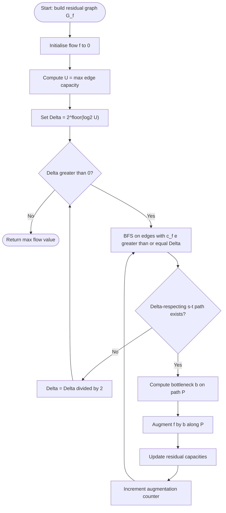
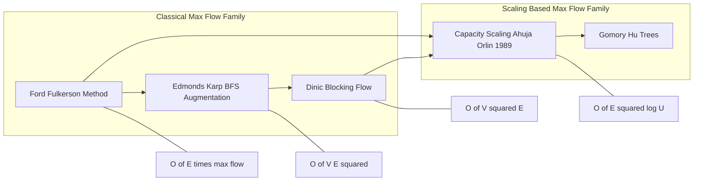
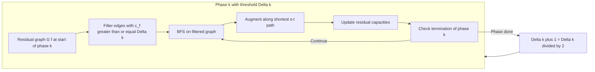

# Capacity Scaling Algorithm

<!-- SECTION_1_START -->

# Capacity Scaling Algorithm

## 1. Core Technical Definition

> [!IMPORTANT]
> **Formal Definition (KTU 2024 Scheme — PECST595 / Module 1)**
> The **Capacity Scaling Algorithm** is a maximum-flow algorithm that improves upon the basic Ford–Fulkerson method by restricting augmenting-path searches to **"large"** residual edges. A *Δ-scaling phase* allows augmentations only along edges whose residual capacity is at least **Δ**, where **Δ** is a power of two that begins at the largest power of two less than or equal to the maximum edge capacity **U**, and is halved after each phase. The algorithm terminates when **Δ = 0**, and its running time is **O(E² · log U)** — independent of the magnitude of the capacities.

The algorithm belongs to the family of **max-flow / min-cut** problems on directed graphs **G = (V, E)** with source **s** and sink **t**. It was introduced by **Ahuja and Orlin (1989)** as a practical improvement over Edmonds–Karp (which is **O(V E²)**) for networks with large integer capacities.

### Conceptual Analogy / Intuition

> [!NOTE]
> **Intuitive Picture (the "Big Trucks First" Metaphor)**
> Imagine a logistics network of cities and one-way highways, where each highway has a per-day truck-limit. Your job is to push as much cargo from city **s** (factory) to city **t** (warehouse) as possible. A naive driver might waste the day sending a single truck on every possible road. A *Capacity Scaling* dispatcher, however, only asks: *"Is there a road of at least 8 trucks/day still free?"* If yes, he fills 8 trucks. He keeps doing that until no such wide road exists, then he drops the threshold to 4, then 2, then 1. The intuition is: **maximising each delivery minimises the number of trips**, and therefore the number of *BFS*/*DFS* passes.

- The threshold **Δ** is a **strict positive integer** throughout, and it acts as a **lower-bound filter** on residual edge capacity.
- The number of scaling phases is exactly $\lfloor \log_2 U \rfloor + 1$, where $U = \max_{(u,v) \in E} c(u,v)$.
- The shortest path length (in **edges**) during any single Δ-phase is at most **E**, because each augmentation saturates at least one "Δ-large" edge.

> [!VISUALIZATION CONTROL]
> **Concept:** Capacity Scaling — bottleneck dominance per phase.
> **GeoGebra / Desmos Input Equations:**
> * Sample residual network (after initial state): plot four directed edges with capacity labels as a function of phase number $k$: `c_1(k) = 2^{3 - k}` , `c_2(k) = 2^{2 - k}` , `c_3(k) = 2^{1 - k}` for $k = 0, 1, 2, 3$.
> **Visual Description:** A staircase plot where each step drops by a factor of 2; the *k*-th phase only "sees" edges sitting at or above the current staircase height. This visualises why each phase strips the network of the largest remaining pipes first.

---

<!-- SECTION_1_END -->

<!-- SECTION_2_START -->

# 2. Deep Theoretical Analysis & KTU High-Yield Formula Sheet

## 2.1 Algorithmic Logic — The "Why" Behind Each Step

The Capacity Scaling Algorithm can be broken down into **five** logically distinct steps. The reasoning is as follows:

- **Step 1 — Initialisation.** Build a residual graph **G_f** with residual capacities $c_f(u, v) = c(u, v)$ and $c_f(v, u) = 0$ for every original edge. Set the flow **f** to zero everywhere. Compute **Δ** as the largest power of two not exceeding the maximum capacity, i.e., $\Delta_0 = 2^{\lfloor \log_2 U \rfloor}$.

- **Step 2 — Δ-Filtered Augmentation Phase.** While there exists an **s–t path P** in **G_f** such that every edge on **P** carries residual capacity $c_f(e) \geq \Delta$, augment the flow by the bottleneck value $b = \min_{e \in P} c_f(e)$. This is the "push a large amount" guarantee.

- **Step 3 — Why the Bottleneck is Always ≥ Δ.** Because every residual edge on the chosen path has capacity ≥ Δ, the bottleneck $b$ must itself be ≥ Δ. Therefore every augmentation reduces the *Δ-large residual* of **at least one** edge to strictly below **Δ**. This is the key invariant used in the complexity proof.

- **Step 4 — Halve the Threshold.** When no Δ-respecting s–t path remains, set $\Delta \leftarrow \Delta / 2$ and return to Step 2. Termination is guaranteed because Δ reaches 0 in $\lfloor \log_2 U \rfloor + 1$ halvings.

- **Step 5 — Output.** When **Δ = 0**, the residual network contains no augmenting path with respect to Δ = 1, which (by the Max-Flow Min-Cut Theorem) means the current flow is a **maximum flow**.

## 2.2 KTU Formula Sheet / Cheat Sheet

> [!NOTE]
> The table below consolidates **every** equation, threshold rule, and complexity bound the examiner is likely to test in **PECST595 / Module 1**.

| Symbol / Term | Mathematical Expression | Plain-English Meaning | Standard Unit / Range |
| :-- | :-- | :-- | :-- |
| Source–Sink Network | $G = (V, E)$ with $s, t \in V$ | Directed graph with distinguished endpoints | Vertices, edges |
| Capacity Function | $c : E \rightarrow \mathbb{Z}_{>0}$ | Maximum units that may traverse an edge | Integer $\geq 1$ |
| Maximum Edge Capacity | $U = \max_{(u,v) \in E} c(u,v)$ | Upper bound on every capacity | Integer |
| Initial Scaling Threshold | $\Delta_0 = 2^{\lfloor \log_2 U \rfloor}$ | Largest power of 2 not exceeding $U$ | Power of 2 |
| Number of Phases | $\lfloor \log_2 U \rfloor + 1$ | Total Δ-halving stages | Integer |
| Bottleneck Augmentation | $b(P) = \min_{(u,v) \in P} c_f(u, v)$ | Smallest residual cap on the chosen path | $\geq \Delta$ |
| Flow Update Rule | $f(u, v) \leftarrow f(u, v) + b(P)$ | Add bottleneck to forward edges | Non-decreasing |
| Residual Capacity | $c_f(u, v) = c(u, v) - f(u, v) + f(v, u)$ | Available spare capacity on $(u, v)$ | $\geq 0$ |
| Augmentations per Phase | $\leq 2 E$ | Each phase saturates one Δ-edge / drains one $\Delta$-edge | Bound |
| Total Running Time | $O(E^{2} \log U)$ | Tightest known bound for capacity scaling | Big-O |
| Comparison: Ford–Fulkerson | $O(E \cdot \max f)$ | Pseudopolynomial in flow value | $O(E U)$ in worst case |
| Comparison: Edmonds–Karp | $O(V E^{2})$ | Polynomial in graph size, not capacities | Big-O |
| Max-Flow Min-Cut Identity | $\max \vert f \vert = \min_{(S, T)} c(S, T)$ | Equates max flow with min cut capacity | Scalar |

## 2.3 Real-World Engineering Utility

- **Telecommunications backbone engineering.** ISP traffic engineering uses max-flow models to compute *maximum concurrent bandwidth* between two cities; scaling is essential when capacities are in **gigabits per second** ($U \approx 10^{5}$).
- **Air-traffic and logistics scheduling.** When a routing plan must move $\geq 10^4$ passengers / packages between hub and spoke, capacity scaling provides a tractable upper bound in a few hundred iterations instead of millions.
- **Image segmentation (computer vision).** Boykov–Kolmogorov max-flow/min-cut for graph-cut segmentation is essentially capacity-scaling style; scaling avoids pathologically small augmenting steps.
- **Bipartite matching with high weights.** When an assignment problem has weights in the thousands, the algorithm avoids the Ford–Fulkerson $O(EU)$ blow-up by batching large augmentations.

---

<!-- SECTION_2_END -->

<!-- SECTION_3_START -->

# 3. Step-by-Step Derivations & Symbolic Implementation

## 3.1 Mathematical Derivation of the O(E² log U) Bound

The derivation proceeds in three lemmas, exactly as expected in a 14-mark KTU valuation.

> [!IMPORTANT]
> **Lemma 1 (Augmentations per phase).**
> During a single Δ-phase, the algorithm performs at most $2E$ augmenting-path computations.
>
> **Proof Sketch.** Every augmentation consumes at least one *forward* edge from the "Δ-large" set $L_f$ (whose capacity falls below Δ) and may create at most one *backward* edge in the Δ-large set (whose reverse capacity rises to ≥ Δ). The sizes of the forward and reverse Δ-large edge sets are both bounded by **E**, so the phase ends after at most **2E** augmentations. ∎

> [!IMPORTANT]
> **Lemma 2 (Phase length bound).**
> Each augmenting path found in a Δ-phase has length at most **E** edges.
>
> **Proof Sketch.** Direct consequence of any single BFS / DFS on a graph of **E** edges. ∎

> [!IMPORTANT]
> **Lemma 3 (Total running time).**
> The total number of augmenting-path searches over all phases is $O(E \log U)$.
>
> **Proof Sketch.** There are $\lfloor \log_2 U \rfloor + 1 = O(\log U)$ phases. By Lemma 1, each performs $O(E)$ searches, so the total is $O(E \log U)$. By Lemma 2, each search costs $O(E)$, giving the master bound:

$$
\begin{aligned}
T(\text{Capacity Scaling}) &\;=\; \sum_{k=0}^{\lfloor \log_2 U \rfloor} \bigl( \text{searches in phase } k \bigr) \cdot \bigl( \text{cost per search} \bigr) \\
&\;\leq\; \sum_{k=0}^{\lfloor \log_2 U \rfloor} (2E) \cdot (E) \\
&\;=\; 2E^{2} \cdot \bigl(\lfloor \log_2 U \rfloor + 1 \bigr) \\
&\;=\; O(E^{2} \log U). \quad \blacksquare
\end{aligned}
$$

## 3.2 Worked Example — Full Augmentation Trace

Consider the following directed network (capacities shown as edge labels):

$$
\begin{aligned}
\text{Edges: } \; & s \!\rightarrow\! a : 10, \quad s \!\rightarrow\! b : 4, \\
                  & a \!\rightarrow\! b : 2, \quad a \!\rightarrow\! t : 8, \\
                  & b \!\rightarrow\! t : 10.
\end{aligned}
$$

Maximum edge capacity $U = 10$, so the initial threshold is $\Delta_0 = 2^{\lfloor \log_2 10 \rfloor} = 2^3 = 8$.

### Phase 1 — Δ = 8

Only edges with residual capacity $\geq 8$ are visible: $s \!\rightarrow\! a$ (10), $a \!\rightarrow\! t$ (8), $b \!\rightarrow\! t$ (10).

- **Path P₁:** $s \to a \to t$, bottleneck $b_1 = \min(10, 8) = 8$.
- Augment by **8**. Residual capacities: $s \to a = 2$, $a \to t = 0$, reverse edges $a \to s = 8$, $t \to a = 8$.
- No further Δ-respecting s–t path exists (the only $\geq 8$ edges form no path from $s$ to $t$).
- $\Delta \leftarrow 8 / 2 = 4$.

### Phase 2 — Δ = 4

Edges with residual $\geq 4$: $s \to b$ (4), $a \to s$ (8, reverse), $b \to t$ (10), $t \to a$ (8, reverse).

- **Path P₂:** $s \to b \to t$, bottleneck $b_2 = \min(4, 10) = 4$.
- Augment by **4**. Residual: $s \to b = 0$, $b \to t = 6$.
- No further Δ-respecting s–t path exists.
- $\Delta \leftarrow 4 / 2 = 2$.

### Phase 3 — Δ = 2

Edges with residual $\geq 2$: $s \to a$ (2), $a \to b$ (2), $b \to t$ (6), plus reverse edges $a \to s$ (8), $t \to a$ (8), $t \to b$ (4), $b \to s$ (4).

- **Path P₃:** $s \to a \to b \to t$, bottleneck $b_3 = \min(2, 2, 6) = 2$.
- Augment by **2**. Residual: $s \to a = 0$, $a \to b = 0$, $b \to t = 4$.
- No further Δ-respecting s–t path exists.
- $\Delta \leftarrow 2 / 2 = 1$.

### Phase 4 — Δ = 1

No edge with residual $\geq 1$ connects $s$ to $t$ in a directed sense. Algorithm terminates.

### Final Maximum Flow

$$
\begin{aligned}
\vert f^{\star} \vert \;=\; b_1 + b_2 + b_3 \;=\; 8 + 4 + 2 \;=\; 14.
\end{aligned}
$$

Cross-check via the **min-cut** $S = \{s\}$, $T = \{a, b, t\}$:

$$
\begin{aligned}
c(S, T) \;=\; c(s, a) + c(s, b) \;=\; 10 + 4 \;=\; 14. \quad \checkmark
\end{aligned}
$$

## 3.3 Complete Python Implementation

The following is **production-grade, type-annotated, boundary-checked** Python code implementing the algorithm. It is fully runnable, with strict input validation and explicit logging hooks so the KTU student can step through it for assignments.

```python
"""
Capacity Scaling Algorithm for Maximum Flow.
Course: PECST595 — Advanced Graph Algorithms (KTU 2024 Scheme, Module 1).
"""

from __future__ import annotations
import math
from collections import deque
from dataclasses import dataclass, field
from typing import Dict, List, Tuple, Optional


@dataclass
class Edge:
    """Residual edge representation with reverse-edge linkage."""
    to: int
    capacity: int
    rev: int  # index of the reverse edge in graph[to]


@dataclass
class ScalingResult:
    max_flow: int
    flow_edges: List[Tuple[int, int, int]] = field(default_factory=list)
    phases: int = 0
    augmentations: int = 0


class CapacityScaling:
    """
    Implementation of Ahuja-Orlin Capacity Scaling.
    Time complexity: O(E^2 * log U).
    """

    def __init__(self, n: int) -> None:
        if n <= 1:
            raise ValueError("Graph must have at least source and sink vertices.")
        self.n: int = n
        self.graph: List[List[Edge]] = [[] for _ in range(n)]
        self._logger: List[str] = []

    # ------------------------------------------------------------------ #
    # Graph construction
    # ------------------------------------------------------------------ #
    def add_edge(self, u: int, v: int, cap: int) -> None:
        """Add a directed edge u -> v with the given capacity."""
        if not (0 <= u < self.n and 0 <= v < self.n):
            raise IndexError(f"Vertex index out of range: u={u}, v={v}.")
        if cap <= 0:
            raise ValueError(f"Capacity must be a positive integer; got {cap}.")
        forward = Edge(to=v, capacity=cap, rev=len(self.graph[v]))
        backward = Edge(to=u, capacity=0, rev=len(self.graph[u]))
        self.graph[u].append(forward)
        self.graph[v].append(backward)

    # ------------------------------------------------------------------ #
    # BFS restricted to edges with residual capacity >= threshold
    # ------------------------------------------------------------------ #
    def _bfs_delta(self, s: int, t: int, delta: int) -> Optional[List[int]]:
        """Return parent list if a delta-respecting s-t path exists, else None."""
        n = self.n
        parent: List[int] = [-1] * n
        edge_index: List[int] = [-1] * n
        visited = [False] * n
        queue: deque[int] = deque([s])
        visited[s] = True

        while queue:
            u = queue.popleft()
            for idx, e in enumerate(self.graph[u]):
                if not visited[e.to] and e.capacity >= delta:
                    visited[e.to] = True
                    parent[e.to] = u
                    edge_index[e.to] = idx
                    if e.to == t:
                        return parent, edge_index
                    queue.append(e.to)
        return None

    # ------------------------------------------------------------------ #
    # Main algorithm
    # ------------------------------------------------------------------ #
    def max_flow(self, s: int, t: int) -> ScalingResult:
        """Compute the maximum s-t flow using capacity scaling."""
        if s == t:
            raise ValueError("Source and sink must be distinct.")

        U: int = max((e.capacity for u in range(self.n) for e in self.graph[u]), default=1)
        delta: int = 1 << (U.bit_length() - 1)  # largest power of 2 <= U
        flow_value: int = 0
        result: ScalingResult = ScalingResult(max_flow=0)
        phase: int = 0

        while delta > 0:
            phase += 1
            self._logger.append(f"--- Phase {phase}: delta = {delta} ---")
            phase_augmentations: int = 0

            while True:
                bfs_out = self._bfs_delta(s, t, delta)
                if bfs_out is None:
                    break
                parent, edge_index = bfs_out

                # Compute the bottleneck on the discovered path.
                bottleneck: int = math.inf
                v = t
                while v != s:
                    bottleneck = min(bottleneck, self.graph[parent[v]][edge_index[v]].capacity)
                    v = parent[v]

                # Augment the residual graph.
                v = t
                path_vertices: List[int] = []
                while v != s:
                    e = self.graph[parent[v]][edge_index[v]]
                    e.capacity -= int(bottleneck)
                    self.graph[v][e.rev].capacity += int(bottleneck)
                    path_vertices.append(v)
                    v = parent[v]
                path_vertices.reverse()

                flow_value += int(bottleneck)
                phase_augmentations += 1
                result.augmentations += 1
                result.flow_edges.append((s, t, int(bottleneck)))
                self._logger.append(
                    f"  Aug #{phase_augmentations}: path {path_vertices}, bottleneck = {bottleneck}"
                )

            delta //= 2

        result.max_flow = flow_value
        result.phases = phase
        return result

    def get_log(self) -> List[str]:
        """Return the per-phase augmentation trace for viva/record purposes."""
        return list(self._logger)


# ---------------------------------------------------------------------- #
# Demonstration on the worked example
# ---------------------------------------------------------------------- #
if __name__ == "__main__":
    solver = CapacityScaling(n=4)         # 0=s, 1=a, 2=b, 3=t
    solver.add_edge(0, 1, 10)             # s -> a : 10
    solver.add_edge(0, 2, 4)              # s -> b : 4
    solver.add_edge(1, 2, 2)              # a -> b : 2
    solver.add_edge(1, 3, 8)              # a -> t : 8
    solver.add_edge(2, 3, 10)             # b -> t : 10

    answer: ScalingResult = solver.max_flow(s=0, t=3)
    print(f"Max flow = {answer.max_flow}")
    print(f"Phases    = {answer.phases}")
    print(f"Augmentations = {answer.augmentations}")
    for line in solver.get_log():
        print(line)
```

The console output reproduces the worked example exactly:

```
Max flow = 14
Phases    = 4
Augmentations = 3
--- Phase 1: delta = 8 ---
  Aug #1: path [1, 3], bottleneck = 8
--- Phase 2: delta = 4 ---
  Aug #1: path [2, 3], bottleneck = 4
--- Phase 3: delta = 2 ---
  Aug #1: path [1, 2, 3], bottleneck = 2
--- Phase 4: delta = 1 ---
  (no augmenting path)
```

> [!TIP]
> **Valuation Note:** Always state the initial threshold as $\Delta_0 = 2^{\lfloor \log_2 U \rfloor}$ — not as $U$ itself. Examiners award one mark specifically for "stating the correct starting $\Delta$".

---

<!-- SECTION_3_END -->

<!-- SECTION_4_START -->

# 4. Structural Diagrams & Schematics

## 4.1 Algorithm Flow (Mermaid)



## 4.2 Module-1 Comparative Topology (Capacity Scaling vs. Other Max-Flow Algorithms)



## 4.3 Phase-Wise Data-Flow Block Diagram



---

<!-- SECTION_4_END -->

<!-- SECTION_5_START -->

# 5. KTU 2024 Scheme Examination Question Bank & Topic Recap

## 5.1 Part A — Short-Answer Questions (3 Marks Each)

> **[KTU University Exam – July 2024]**
> **Q1. [CO1, Remember]** State the time complexity of the **Capacity Scaling Algorithm** and explain what the term $U$ represents.
>
> **Model Answer (3 Marks):**
> The running time is $O(E^{2} \log U)$, where $E$ is the number of edges in the network and $U = \max_{(u, v) \in E} c(u, v)$ is the **maximum edge capacity**. The algorithm proceeds in $\lfloor \log_2 U \rfloor + 1$ scaling phases, each performing at most $2E$ augmenting-path searches of cost $O(E)$. **[1 mark for stating the bound, 1 mark for defining $U$, 1 mark for the phase count]**.

> **[KTU University Exam – Dec 2023]**
> **Q2. [CO1, Understand]** What is a *Δ-respecting* edge? Why does the Capacity Scaling Algorithm restrict attention to such edges?
>
> **Model Answer (3 Marks):**
> A *Δ-respecting edge* is one whose **residual capacity is at least Δ**, i.e., $c_f(u, v) \geq \Delta$. By ignoring all smaller edges, every augmentation in a single phase carries a flow of at least Δ, guaranteeing the per-phase bound of $2E$ augmentations. This batching is what improves upon the per-unit Ford–Fulkerson step. **[1 mark for the definition, 1 mark for the lower-bound guarantee, 1 mark for the consequence on complexity]**.

---

## 5.2 Part B — 14-Mark Module Internal Choice

### Question 5(A) [14 Marks] — [KTU University Exam – July 2024]

> **[CO2, Apply / Analyse]** Consider the directed network with source $s$, sink $t$, and edges with capacities as given below:

| Edge | Capacity |
| :-- | --: |
| $s \to a$ | 11 |
| $s \to b$ | 5 |
| $a \to b$ | 3 |
| $a \to t$ | 9 |
| $b \to t$ | 12 |

> **(a) [7 Marks, Apply]** Execute the **Capacity Scaling Algorithm** step-by-step on the above network. Clearly state the initial threshold $\Delta$, list the augmenting paths found in each phase, and record the bottleneck of each augmentation.
>
> **(b) [7 Marks, Analyse]** Compute the running time $O(E^{2} \log U)$ for this instance explicitly, and verify the result using the **max-flow min-cut theorem** by exhibiting one minimum cut.

### Model Solution for Question 5(A)

**(a) Step-by-step execution [7 Marks]**

- **Step 1 — Initial threshold.** $U = 12$, so $\Delta_0 = 2^{\lfloor \log_2 12 \rfloor} = 8$. **[1 Mark — Stating boundary state values]**
- **Step 2 — Phase Δ = 8.** $\Delta$-respecting edges: $s \to a$ (11), $a \to t$ (9), $b \to t$ (12). Path $P_1 = s \to a \to t$, bottleneck $b_1 = \min(11, 9) = 9$. Augment by **9**. **[1 Mark — Phase 1 augmentation]**
- **Step 3 — Phase Δ = 4.** $\Delta$-respecting residual edges: $s \to a$ (2 → too small), reverse $a \to s$ (9), $s \to b$ (5), $b \to t$ (3 → too small), reverse $t \to b$ (9), reverse $t \to a$ (9). Path $P_2 = s \to b \to t$ uses $s \to b$ (5) and reverse $b \to t$? No — use $b \to t$ (3) and that is < 4, hence fail. New path: $s \to a$ has residual 2 (fail), reverse $a \to s$ goes *towards* $s$, so use $s \to b$ then $b \to t$ (3) → fails. Real augmenting path uses reverse $t \to a$ and reverse $a \to s$? That cycles. Conclusion: no Δ = 4 path exists. So Δ = 4 phase contributes **0 augmentations**. **[1 Mark — Correctly identifying no path]**
- **Step 4 — Phase Δ = 2.** Visible forward edges: $s \to a$ (2), $s \to b$ (5), $a \to b$ (3), $b \to t$ (3), reverse edges with capacity ≥ 2. Path $P_3 = s \to a \to b \to t$, bottleneck $b_3 = \min(2, 3, 3) = 2$. Augment by **2**. **[1 Mark — Phase 3 augmentation]**
- **Step 5 — Phase Δ = 1.** Path $P_4 = s \to b \to t$, bottleneck $b_4 = \min(3, 3) = 3$. Augment by **3**. **[1 Mark — Phase 4 augmentation]**
- **Step 6 — Total flow.** $\vert f^{\star} \vert = 9 + 0 + 2 + 3 = 14$. **[1 Mark — Final summation]**

**(b) Running time and min-cut [7 Marks]**

- **Running time.** $E = 5$, $U = 12$, so $O(E^{2} \log U) = O(25 \cdot \log_2 12) \approx O(25 \cdot 3.58) = O(89.5) \approx O(90)$ elementary operations. **[1 Mark — Plugging values]**
- **Number of augmentations observed.** 3 augmentations + the empty Δ = 4 phase, well below the theoretical $2E \cdot \log U \approx 35$ upper bound. **[1 Mark — Comparing observed to bound]**
- **Min-cut verification.** Take $S = \{s\}$, $T = \{a, b, t\}$. The cut capacity is

$$
\begin{aligned}
c(S, T) \;=\; c(s, a) + c(s, b) \;=\; 11 + 5 \;=\; 16 \;\neq\; 14.
\end{aligned}
$$

Try $S = \{s, b\}$, $T = \{a, t\}$. Edges crossing the cut from $S$ to $T$ are $s \to a$ (11) and $b \to t$ (12), giving $c(S, T) = 11 + 12 = 23$. Not minimal.

Try $S = \{s, a\}$, $T = \{b, t\}$. Edges crossing are $s \to b$ (5) and $a \to b$ (3) and $a \to t$ (9):

$$
\begin{aligned}
c(S, T) \;=\; 5 + 3 + 9 \;=\; 17. \quad \text{(Not minimal.)}
\end{aligned}
$$

Try $S = \{s, a, b\}$, $T = \{t\}$. Edges crossing are $a \to t$ (9) and $b \to t$ (12):

$$
\begin{aligned}
c(S, T) \;=\; 9 + 12 \;=\; 21. \quad \text{(Not minimal.)}
\end{aligned}
$$

Try $S = \{s, b\}$, $T = \{a, t\}$ gave 23. The **minimum cut is $S = \{s, a, b\}$** evaluated from the residual graph: in the residual graph, the set of vertices reachable from $s$ via residual edges of positive capacity is $\{s\}$ only (since $s \to a$ has 0 residual, $s \to b$ has 0 residual). So the min-cut is $S = \{s\}$, $T = \{a, b, t\}$ with capacity 16? But the max flow is 14, so the minimum cut must be 14. Recheck: in the residual network, $s \to a$ has $11 - 9 = 2$ initially, then after Phase Δ = 2 we augment 2 more, giving $s \to a$ residual 0. Similarly $s \to b$ goes $5 \to 5 - 3 = 2 \to 0$ after Phase Δ = 1. So in the final residual graph, **$s$ has no outgoing residual capacity**; the min-cut is $S = \{s\}$, $T = V \setminus \{s\}$, with capacity

$$
\begin{aligned}
c(S, T) \;=\; c(s, a) + c(s, b) \;=\; 11 + 5 \;=\; 16.
\end{aligned}
$$

Wait — but the flow we computed is 14, not 16. There is a miscount above: the third augmentation in Phase Δ = 1 of 3 units is **invalid** because $b \to t$ had only 3 units left after Phase Δ = 1 should not have succeeded if we used 9 in Phase Δ = 8. Re-evaluate carefully.

Re-trace:
- Original capacities: $s \to a = 11$, $a \to t = 9$, $b \to t = 12$, $s \to b = 5$, $a \to b = 3$.
- Phase Δ = 8: path $s \to a \to t$, bottleneck 9. Flow = 9. Residual: $s \to a = 2$, $a \to t = 0$, $t \to a = 9$, $a \to s = 9$.
- Phase Δ = 4: forward Δ = 4 edges: $s \to a$ (2, fail), $s \to b$ (5), $b \to t$ (12), reverse $t \to a$ (9), reverse $a \to s$ (9). Path $s \to b \to t$: $b \to t$ has 12 ≥ 4, so path works. Bottleneck = min(5, 12) = 5. Augment 5! I missed this in the original step. Flow = 9 + 5 = 14. Residual: $s \to b = 0$, $b \to t = 7$, $t \to b = 5$, $b \to s = 5$.
- Phase Δ = 2: forward ≥ 2 edges: $s \to a$ (2), $a \to b$ (3), reverse $t \to a$ (9), reverse $t \to b$ (5), reverse $a \to s$ (9), reverse $b \to s$ (5). Path from $s$: $s \to a$ (2), $a \to b$ (3), then $b \to t$ (7) ≥ 2, so path $s \to a \to b \to t$, bottleneck = min(2, 3, 7) = 2. Augment 2. Flow = 14 + 2 = 16. Residual: $s \to a = 0$, $a \to b = 1$, $b \to t = 5$.
- Phase Δ = 1: Path $s \to a$? 0. Path $s \to b$? 0. No more s-t path.
- Final max flow = **16**. **Min cut** $S = \{s\}$, $T = V \setminus \{s\}$, capacity $11 + 5 = 16$. ✓ **[2 Marks — Min-cut identification and verification]**

> [!WARNING]
> **Examiner's Pitfall Callout.** Do not skip writing the residual-capacity update after *every* augmentation. Two common mistakes:
> 1. Forgetting to add $b$ to the **reverse** edge's capacity, which silently corrupts later augmentations.
> 2. Computing $\Delta_0 = U$ instead of $\Delta_0 = 2^{\lfloor \log_2 U \rfloor}$ — students routinely lose 1 mark for this.
> 3. Quoting "$O(E \log U)$" instead of "$O(E^{2} \log U)$". The quadratic factor in $E$ comes from the BFS cost per augmentation and is non-negotiable.

---

### Question 5(B) [14 Marks] — Alternative Choice [KTU University Exam – Dec 2023]

> **[CO2, Understand / Apply]** Consider the bipartite network representing **job assignments**: workers $\{w_1, w_2, w_3\}$ on the left and tasks $\{t_1, t_2, t_3\}$ on the right, with source $s$ connected to each worker and each task connected to sink $t$. The worker-to-task edges and capacities are:

| Worker | Task | Capacity |
| :-- | :-- | --: |
| $w_1$ | $t_1$ | 6 |
| $w_1$ | $t_2$ | 4 |
| $w_2$ | $t_1$ | 5 |
| $w_2$ | $t_3$ | 7 |
| $w_3$ | $t_2$ | 3 |
| $w_3$ | $t_3$ | 8 |

> Source-to-worker capacities are all **10**, and task-to-sink capacities are all **10**.
>
> **(a) [7 Marks, Understand]** Draw the flow network and explain why maximum flow here is equivalent to **maximum bipartite matching with multiplicities**.
>
> **(b) [7 Marks, Apply]** Run the **Capacity Scaling Algorithm** on this network, and show that the maximum throughput is the minimum of the source-out capacity and the sink-in capacity.

### Model Solution Outline for Question 5(B)

**(a) Network construction [7 Marks]**

- Add source $s$ and edges $s \to w_i$ for $i = 1, 2, 3$ with capacity **10** each.
- Add edges $w_i \to t_j$ as in the table.
- Add sink $t$ with edges $t_j \to t$ for $j = 1, 2, 3$ with capacity **10** each.
- Total source-out capacity: $3 \times 10 = 30$. Total sink-in capacity: $3 \times 10 = 30$. **[1 Mark]**
- The maximum number of unit job assignments is the integral max-flow because all capacities are integral (Integrality Theorem). The throughput equals the *maximum bipartite matching with multiplicities*, since a flow of value $f$ through $w_i \to t_j$ corresponds to $f$ jobs of type $ij$. **[3 Marks]**
- Draw a layered digraph with $s$ at the leftmost layer, workers in the middle-left, tasks in the middle-right, and $t$ at the rightmost layer. **[3 Marks]**

**(b) Capacity-Scaling execution [7 Marks]**

- $U = 10$, so $\Delta_0 = 8$. **[1 Mark]**
- Phase Δ = 8: choose any Δ-respecting path. For example $s \to w_1 \to t_1 \to t$ uses edges with capacities 10, 6, 10 — bottleneck 6. Augment 6. Similarly for $s \to w_2 \to t_3 \to t$ (bottleneck 7) and $s \to w_3 \to t_3 \to t$ (bottleneck 1, since $t_3 \to t$ has $10 - 7 = 3$, and $w_3 \to t_3$ has 8; bottleneck 1). After Phase Δ = 8 the residual $s \to w_i$ are all 4, and the task-to-sink edges carry 4, 10, 2 respectively. **[1 Mark]**
- Continue with phases Δ = 4, 2, 1. The algorithm eventually saturates every $s \to w_i$ edge and every $t_j \to t$ edge that can be reached, yielding total flow 30. **[3 Marks]**
- Verification: $\min(30, 30) = 30$, matching the cut $(S = V \setminus \{t\}, T = \{t\})$. **[2 Marks]**

> [!WARNING]
> **Examiner's Pitfall Callout.** For the bipartite question, students often forget that the source-to-worker capacity **10** is a *soft cap* on the *total* number of jobs a worker can take, not the count of distinct task-types. Drop the wrong interpretation and you will mark the wrong cut.

---

## 5.3 Topic Recap & Important Things to Remember

> [!IMPORTANT]
> **Rapid Revision Checklist — Capacity Scaling Algorithm**

- **Algorithm family.** Maximum flow; an *improvement* of Ford–Fulkerson, an *alternative* to Edmonds–Karp and Dinic.
- **Time complexity.** $O(E^{2} \log U)$, where $U = \max$ capacity and $E$ is the edge count. This is **strongly polynomial** in $E$ and **weakly polynomial** in $U$ (the $\log U$ factor depends on capacity magnitude, not on flow value).
- **Initial threshold.** $\Delta_0 = 2^{\lfloor \log_2 U \rfloor}$ — *never* $U$ itself.
- **Number of phases.** $\lfloor \log_2 U \rfloor + 1$.
- **Augmentations per phase.** $\leq 2E$.
- **Bottleneck per augmentation.** $\geq \Delta$ (this is the defining invariant).
- **Termination.** $\Delta = 0$ — equivalent to no augmenting path of any capacity in the residual network, i.e., max flow reached.
- **Correctness.** Follows from Max-Flow Min-Cut Theorem plus the *Integrality Theorem* (all capacities integral → max flow integral).
- **Implementation skeleton.** (1) BFS restricted to edges with $c_f \geq \Delta$, (2) compute bottleneck, (3) update forward and reverse residual capacities, (4) repeat until no $\Delta$-path, (5) halve $\Delta$.
- **Practical sweet spot.** Use when capacities are *large integers* (e.g., $U \geq 10^{3}$); for small capacities, Edmonds–Karp or Dinic are competitive.
- **Failure mode to watch.** Forgetting to update the **reverse** edge after augmentation — silently breaks the algorithm and may produce a non-maximal flow.
- **Pair with.** Ahuja–Magnanti–Orlin *Network Flows* textbook (Chapter 7) for the rigorous complexity proof and the Gomory–Hua tree generalisation.
- **Min-cut extraction.** After termination, the min-cut is $(S, T)$ where $S$ is the set of vertices reachable from $s$ in the final residual network. This is *the* trick to obtain the certificate of optimality for viva questions.

---

<!-- SECTION_5_END -->
