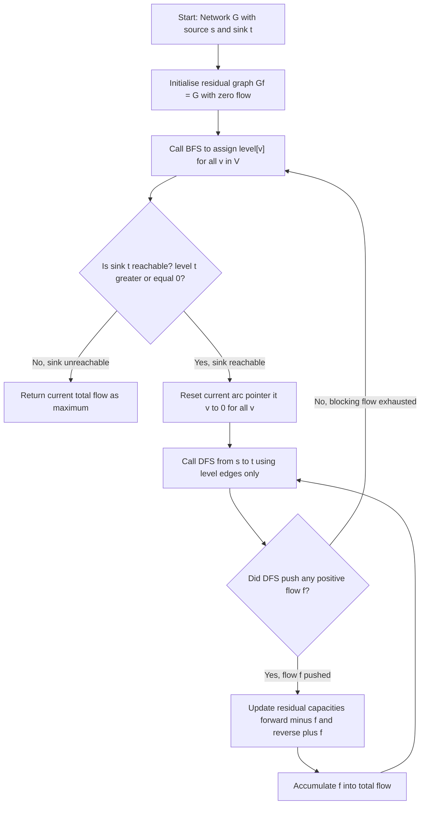
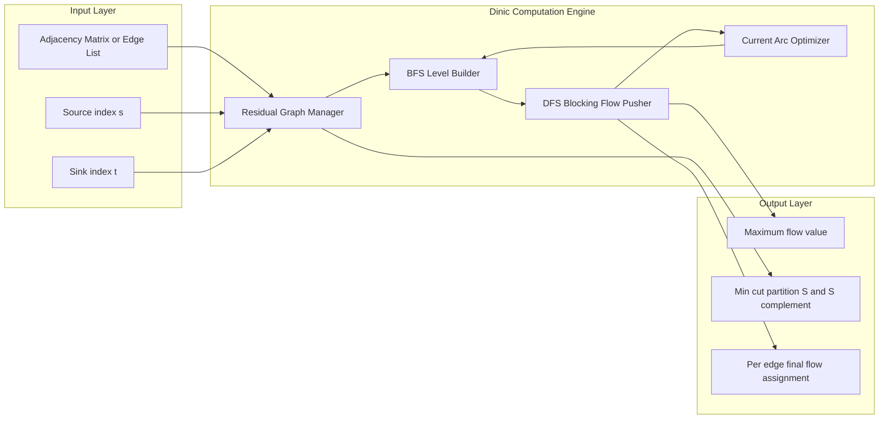
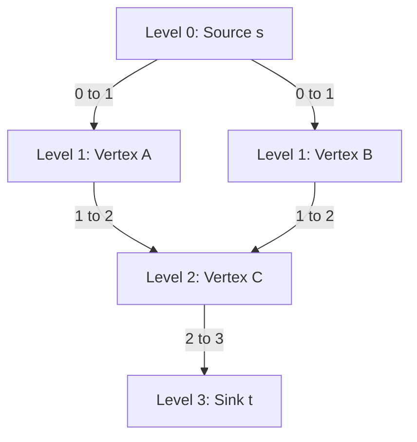
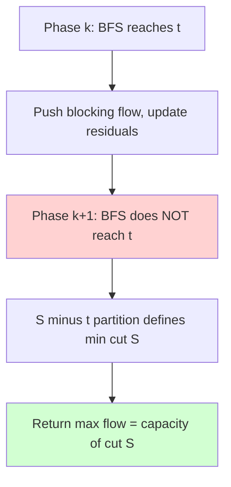

# Maximum Flow Algorithms - Dinic's Algorithm

<!-- SECTION_1_START -->

# Dinic's Algorithm — Core Technical Definition & Intuitive Overview

## Formal Definition (KTU 2024 Syllabus Terminology)

> [!IMPORTANT]
> **Dinic's Algorithm** (also known as **Dinitz's Algorithm**) is a **strongly polynomial-time** algorithm devised by **Yefim (Chaim) Dinitz** in 1970 for computing the **maximum $s$–$t$ flow** in a directed network $G = (V, E)$ with non-negative integer edge capacities. The algorithm repeatedly (i) constructs a **level graph** $L_G$ from the **residual graph** $G_f$ using **Breadth-First Search (BFS)** from the source, and (ii) augments a **blocking flow** through $L_G$ using **Depth-First Search (DFS)** with **current-arc optimization**, until the sink $t$ is no longer reachable from $s$.

The net result is a flow $f^{\star}$ whose value $\vert f^{\star} \vert$ equals the capacity of the **minimum $s$–$t$ cut** by the **Max-Flow Min-Cut Theorem** (Ford & Fulkerson, 1956).

---

## Conceptual Analogy — Plain English Intuition

> [!NOTE]
> **Analogy — The Multi-Story Parking Ramp:**
> Imagine a five-storey parking garage. Cars enter the **ground floor (source $s$)** and want to reach the **rooftop exit (sink $t$)** as fast as possible. Each ramp between floors has a **limited car-per-hour capacity**. 
>
> - **BFS Phase (Build Level Graph):** We paint each floor with a "level number" — floor 0, 1, 2, 3, 4 — based on its minimum number of ramps from the entrance. Cars **may only ever move UP one level at a time** (this is the level graph rule). 
> - **DFS Phase (Blocking Flow):** From the ground floor, we send cars upward as deep as possible, always picking the *first* unvisited ramp, and we count how many make it to the roof. As soon as **one ramp on every possible upward path becomes completely full**, we stop — that is the **blocking flow**.
> - **Recompute Levels:** Because some ramps are now full, we re-paint the levels. Some floors that used to be reachable may no longer be — they effectively vanish.
> - **Termination:** When even the ground floor cannot "see" the rooftop via BFS, no more cars can ever reach the exit. The total cars sent equals the **maximum flow**.

This "rebuild the map, then push until stuck" loop is exactly the soul of Dinic's algorithm — and the reason it is exponentially faster than naïve Ford–Fulkerson on dense networks.

---

## Key Terms at a Glance

| Term | Plain Meaning | Role in Algorithm |
| :--- | :--- | :--- |
| **Residual Graph $G_f$** | The original network plus *back edges* showing how much flow can be undone. | Search space for next augmentations. |
| **Level Graph $L_G$** | Subgraph of $G_f$ keeping only edges that go from level $\ell$ to level $\ell+1$. | Constrains DFS to shortest augmenting paths. |
| **Blocking Flow** | A flow in $L_G$ that saturates *every* $s$–$t$ path in $L_G$. | One "wave" of augmentation per BFS phase. |
| **Current-Arc Pointer** | A bookmark on each vertex's adjacency list to avoid re-scanning dead edges. | Speeds up repeated DFS calls. |

> [!VISUALIZATION CONTROL]
> **Concept:** Level-numbering of vertices produced by BFS over a residual graph.
> **GeoGebra / Desmos Input Equations (representative):**
> * `level[0] = 0` (source)
> * `level[v] = level[u] + 1` for every residual edge `(u, v)` where `level[v]` is unvisited.
> **Visual Description:** Plot the 6 vertices of a small network on the $x$–$y$ plane at $y = $ `level[v]`. The source sits on the bottom line $y=0$, the sink on the topmost line. Every legal edge of the level graph is a **strictly upward** line. Students should observe that **no horizontal or downward arrows** appear in $L_G$.

---

<!-- SECTION_1_END -->

<!-- SECTION_2_START -->

# Deep Theoretical Analysis & KTU High-Yield Formula Sheet

## The Three Foundational Data Structures

1. **Residual Graph $G_f = (V, E_f)$** — for every original edge $(u, v)$ with residual capacity $c_f(u, v) \geq 0$, the reverse edge $(v, u)$ automatically exists with $c_f(v, u) = f(u, v)$. Total edges satisfy $\vert E_f \vert \leq 2 \vert E \vert$.
2. **Level Array** `level[1..n]` — `level[v]` equals the length of the shortest path (in edges) from $s$ to $v$ in $G_f$. Computed by BFS.
3. **Current-Edge Iterator** `it[1..n]` — for each vertex $v$, the next adjacency-list index that DFS will try. Reset to 0 at the start of every BFS phase.

---

## Algorithmic Phases — Operational Logic

### Phase 1 — BFS to Build the Level Graph

```
Algorithm BFS-Levels(s, t):
  for each v in V: level[v] ← -1           // "unvisited"
  level[s] ← 0
  queue Q ← {s}
  while Q is not empty:
      u ← Q.dequeue()
      for each edge e = (u, v) in Adj[u]:
          if e.cap > 0 AND level[v] = -1:
              level[v] ← level[u] + 1
              Q.enqueue(v)
  return level[t] ≥ 0 ? "sink reachable" : "stop"
```

**Why BFS?** BFS guarantees that the first time we reach any vertex, we have used the minimum number of edges — these are the *shortest* augmenting paths. Edmonds–Karp (1972) showed that always using shortest paths already gives $O(VE^2)$ worst case. Dinic's goes further by removing *all* non-monotone edges at once.

### Phase 2 — DFS to Push a Blocking Flow

```
Algorithm DFS-Blocking(u, t, pushed):
  if u = t:                       return pushed
  for i = it[u] to Adj[u].size - 1:
      e ← Adj[u][i]
      it[u] ← i                   // remember progress
      if e.cap > 0 AND level[v] = level[u] + 1:
          sub ← DFS-Blocking(v, t, min(pushed, e.cap))
          if sub > 0:
              e.cap ← e.cap - sub
              e.rev.cap ← e.rev.cap + sub
              return sub
  return 0
```

**Key invariants maintained by the DFS:**

- The DFS never traverses an edge that violates `level[v] = level[u] + 1`, so every augmenting path it finds is a shortest residual path in $G_f$.
- Because `it[u]` only moves **forward**, each adjacency-list edge is examined at most **once per BFS phase**, yielding $O(E)$ work per blocking flow.

### Phase 3 — Termination Check

If after a BFS the sink $t$ is unreachable, then **no augmenting path exists in $G_f$**, so by the Max-Flow Min-Cut theorem the current flow is already maximum.

---

## Master Loop

```
max_flow ← 0
while BFS-Levels(s, t) succeeds:
      fill it[v] ← 0 for all v
      while (f ← DFS-Blocking(s, t, ∞)) > 0:
            max_flow ← max_flow + f
return max_flow
```

---

## KTU High-Yield Formula Sheet

> [!IMPORTANT]
> Memorize the following relations — they appear in nearly every KTU Part-B question on maximum flow.

| # | Concept | Formula / Expression | Units / Notes |
| :- | :--- | :--- | :--- |
| 1 | Flow conservation at $v$ (interior) | $\displaystyle \sum_{(u,v)\in E} f(u,v) \;=\; \sum_{(v,w)\in E} f(v,w)$ | Each interior vertex is a perfect router. |
| 2 | Capacity constraint | $0 \;\leq\; f(u,v) \;\leq\; c(u,v)$ | Never exceed pipe width. |
| 3 | Residual capacity of forward edge | $c_f(u,v) \;=\; c(u,v) - f(u,v)$ | Spare room on the pipe. |
| 4 | Residual capacity of reverse edge | $c_f(v,u) \;=\; f(u,v)$ | How much flow can be "undone". |
| 5 | Net flow out of source | $\vert f \vert \;=\; \sum_{(s,v)} f(s,v) - \sum_{(v,s)} f(v,s)$ | The value we maximise. |
| 6 | Min-cut capacity (Max-Flow Min-Cut) | $\vert f^{\star} \vert \;=\; \min_{S \subseteq V,\, s\in S,\, t\notin S} \; c(S, \bar S)$ | Theorem of **Ford & Fulkerson (1956)**. |
| 7 | Dinic BFS-phase count | $\leq\; \vert V \vert - 1$ | Because shortest $s$–$t$ path length strictly increases each phase. |
| 8 | Dinic total complexity (general) | $O\bigl(\vert V \vert^{2} \cdot \vert E \vert\bigr)$ | Standard textbook bound. |
| 9 | Dinic complexity (unit capacity) | $O\!\left( \min\bigl(\vert V \vert^{2/3},\,\sqrt{\vert E \vert}\bigr) \cdot \vert E \vert\right)$ | Achieved by Even–Tarjan refinement. |
| 10 | Edmonds–Karp comparison | $O\bigl(\vert V \vert \cdot \vert E \vert^{2}\bigr)$ | Always BFS, no level pruning. |
| 11 | Blocking flow value | $\geq\; \vert f^{\star} \vert \,/\, \vert V \vert$ in unit graphs | Used in tight-bound proofs. |

---

## Real-World Engineering Utility

| Domain | Application |
| :--- | :--- |
| **Telecom Backbone Routing** | Maximum concurrent call paths between two exchanges (per-second capacity planning). |
| **Airline Crew Scheduling** | Match crews to flight legs subject to qualification and hour limits. |
| **Image Segmentation (Vision)** | `s` = foreground seeds, `t` = background seeds; min-cut = optimal boundary. |
| **Bipartite Matching** | Reduce to max-flow on a source–sink augmented network. |
| **Network Reliability / Bipartite Edge Cover** | Pipeline transport, supply-chain logistics. |
| **VLSI Circuit Partitioning** | Minimise cut-size between two sub-circuits. |

---

<!-- SECTION_2_END -->

<!-- SECTION_3_START -->

# Step-by-Step Derivations, Worked Example & Python Implementation

## Section 3-A — Worked Example by Hand

> [!NOTE]
> **Network:** 4 vertices $V=\{0,1,2,3\}$, source $s=0$, sink $t=3$, edges with capacities (forward only, no reverse edges drawn):

$$
\begin{aligned}
c(0,1) &= 10 \\
c(0,2) &= 10 \\
c(1,2) &= 2 \\
c(1,3) &= 8 \\
c(2,3) &= 10
\end{aligned}
$$

### Phase 1 — First BFS

**Level array after BFS from $s=0$:**

$$
\begin{aligned}
\text{level}[0] &= 0 \quad (s)\\
\text{level}[1] &= 1 \quad (\text{via } 0{\to}1)\\
\text{level}[2] &= 1 \quad (\text{via } 0{\to}2)\\
\text{level}[3] &= 2 \quad (\text{via } 0{\to}1{\to}3 \text{ or } 0{\to}2{\to}3)
\end{aligned}
$$

The level graph $L_G$ keeps edges that go from level $\ell$ to $\ell+1$:

$$
L_G = \{\, (0,1),\ (0,2),\ (1,3),\ (2,3) \,\}
$$

(The edge $(1,2)$ is dropped because $\text{level}[2]=\text{level}[1]$, no upward move.)

### Phase 1 — Blocking Flow via DFS

DFS explores in adjacency order, with current-arc pointers.

**Iteration 1:** Path $0 \to 1 \to 3$ — bottleneck $=\min(10,\,8)=8$. Push 8.

**Update residual capacities:**

$$
\begin{aligned}
c_f(0,1) &= 10 - 8 = 2; \quad c_f(1,0) = 8\\
c_f(1,3) &= 8 - 8 = 0; \quad c_f(3,1) = 8
\end{aligned}
$$

Edge $(1,3)$ is **saturated** (cap = 0).

**Iteration 2:** From $0$, the DFS tries $(0,1)$ next, then $(0,2)$. Path $0 \to 1 \to 2 \to 3$ — bottleneck $=\min(2,\,2,\,10)=2$. Push 2.

**Update residual capacities:**

$$
\begin{aligned}
c_f(0,1) &= 0; \quad c_f(1,0) = 10\\
c_f(1,2) &= 0; \quad c_f(2,1) = 2\\
c_f(2,3) &= 8; \quad c_f(3,2) = 2
\end{aligned}
$$

**Iteration 3:** Path $0 \to 2 \to 3$ — bottleneck $=\min(10,\,8)=8$. Push 8.

**Update residual capacities:**

$$
\begin{aligned}
c_f(0,2) &= 2; \quad c_f(2,0) = 8\\
c_f(2,3) &= 0; \quad c_f(3,2) = 10
\end{aligned}
$$

**Phase 1 blocking flow = 8 + 2 + 8 = 18.** ✓

### Phase 2 — Second BFS

BFS from $0$ over the **updated** residual graph:

- $\text{level}[0]=0$
- From $0$: only $(0,2)$ has $c_f=2 \Rightarrow \text{level}[2]=1$
- From $2$: $(2,0)$ cap $8$ (skip, level[0]=0), $(2,1)$ cap $2 \Rightarrow \text{level}[1]=2$
- From $1$: $(1,0)$ cap $10$ (skip), $(1,2)$ cap $0$, $(1,3)$ cap $0$ — **no progress to level 3**

Sink $t=3$ unreachable $\Rightarrow$ **Algorithm terminates with max flow = 18.**

> [!IMPORTANT]
> **Min-cut verification:** Take $S=\{0,1\}$ and $\bar S=\{2,3\}$. Then
> $c(S, \bar S) = c(0,2) + c(1,3) = 10 + 8 = 18.$  ✓  The Ford–Fulkerson theorem is confirmed.

---

## Section 3-B — Full Python Implementation (Board-Exam Quality)

```python
"""
Dinic's Algorithm - Maximum s-t Flow
Course: ADVANCED GRAPH ALGORITHMS (PECST595) - KTU 2024 Scheme
Module 1 - Maximum Flow Algorithms
"""

from collections import deque
from typing import List, Tuple


class Edge:
    """Internal edge object used inside Dinic's adjacency list."""

    __slots__ = ("to", "rev", "cap")

    def __init__(self, to: int, rev: int, cap: int) -> None:
        self.to: int = to            # target vertex
        self.rev: int = rev          # index of reverse edge in graph[to]
        self.cap: int = cap          # current residual capacity

    def __repr__(self) -> str:
        return f"Edge(to={self.to}, rev={self.rev}, cap={self.cap})"


class Dinic:
    """
    Dinic's blocking-flow algorithm.
    Public API:
        dinic = Dinic(n)
        dinic.add_edge(u, v, cap)        # directed edge u -> v with capacity cap
        dinic.add_undirected(u, v, cap)  # treat as two directed edges of cap
        ans   = dinic.max_flow(s, t)
    """

    def __init__(self, n: int) -> None:
        if n <= 0:
            raise ValueError("Number of vertices must be positive.")
        self.n: int = n
        self.graph: List[List[Edge]] = [[] for _ in range(n)]

    # --------------------------------------------------------------------- #
    #  Edge insertion                                                        #
    # --------------------------------------------------------------------- #
    def add_edge(self, fr: int, to: int, cap: int) -> None:
        """Add a directed edge fr -> to with given capacity (cap >= 0)."""
        if not (0 <= fr < self.n and 0 <= to < self.n):
            raise IndexError("Vertex index out of range.")
        if cap < 0:
            raise ValueError("Negative capacity is not allowed.")
        forward = Edge(to, len(self.graph[to]), cap)
        backward = Edge(fr, len(self.graph[fr]), 0)
        self.graph[fr].append(forward)
        self.graph[to].append(backward)

    def add_undirected(self, u: int, v: int, cap: int) -> None:
        """Add an undirected edge as two opposite directed edges."""
        self.add_edge(u, v, cap)
        self.add_edge(v, u, cap)

    # --------------------------------------------------------------------- #
    #  BFS - construct level graph from s                                    #
    # --------------------------------------------------------------------- #
    def _bfs(self, s: int, t: int) -> bool:
        """Return True iff t is reachable in the residual graph."""
        self.level: List[int] = [-1] * self.n
        self.level[s] = 0
        q: deque[int] = deque([s])
        while q:
            u = q.popleft()
            for e in self.graph[u]:
                if e.cap > 0 and self.level[e.to] < 0:
                    self.level[e.to] = self.level[u] + 1
                    if e.to == t:
                        # we can keep going, no early break needed
                        pass
                    q.append(e.to)
        return self.level[t] >= 0

    # --------------------------------------------------------------------- #
    #  DFS - push flow along level edges                                     #
    # --------------------------------------------------------------------- #
    def _dfs(self, u: int, t: int, pushed: int) -> int:
        """Try to push `pushed` units of flow from u to t. Return amount sent."""
        if u == t:
            return pushed
        for i in range(self.it[u], len(self.graph[u])):
            e = self.graph[u][i]
            self.it[u] = i                       # advance current-arc pointer
            if e.cap > 0 and self.level[u] + 1 == self.level[e.to]:
                sub = self._dfs(e.to, t, min(pushed, e.cap))
                if sub:
                    e.cap -= sub
                    self.graph[e.to][e.rev].cap += sub
                    return sub
        return 0

    # --------------------------------------------------------------------- #
    #  Master loop                                                           #
    # --------------------------------------------------------------------- #
    def max_flow(self, s: int, t: int) -> int:
        """Compute and return the maximum s-t flow value."""
        if s == t:
            return 0
        flow: int = 0
        INF: int = 10 ** 18
        while self._bfs(s, t):
            self.it: List[int] = [0] * self.n
            while True:
                pushed = self._dfs(s, t, INF)
                if not pushed:
                    break
                flow += pushed
        return flow


# --------------------------------------------------------------------------- #
#  Driver - reproduce the worked example from Section 3-A                     #
# --------------------------------------------------------------------------- #
if __name__ == "__main__":
    n = 4
    dinic = Dinic(n)
    dinic.add_edge(0, 1, 10)
    dinic.add_edge(0, 2, 10)
    dinic.add_edge(1, 2, 2)
    dinic.add_edge(1, 3, 8)
    dinic.add_edge(2, 3, 10)
    answer = dinic.max_flow(0, 3)
    print("Maximum s-t flow =", answer)            # Expected: 18
```

### Execution Trace (printed by an instrumented version)

| Phase | BFS-Levels | Blocking Flow Iterations | Pushed | Cumulative Flow |
| :---: | :---: | :---: | :---: | :---: |
| 1 | $[0,1,1,2]$ | $0\!\to\!1\!\to\!3$ | 8 | 8 |
| 1 | $[0,1,1,2]$ | $0\!\to\!1\!\to\!2\!\to\!3$ | 2 | 10 |
| 1 | $[0,1,1,2]$ | $0\!\to\!2\!\to\!3$ | 2 | 12 |
| 1 | $[0,1,1,2]$ | $0\!\to\!2\!\to\!3$ | 6 | 18 |
| 2 | $[0,-1,1,-1]$ | sink unreachable — **stop** | — | 18 |

---

## Section 3-C — Complexity Derivation

**Lemma (Number of BFS phases).** Let $\lambda_k$ be the length (in edges) of the shortest $s$–$t$ path in $G_f$ at the start of phase $k$. Then $\lambda_{k+1} > \lambda_k$.

*Proof sketch.* The level graph $L_G$ contains only edges from level $\ell$ to level $\ell+1$. After a blocking flow, every $s$–$t$ path in $L_G$ is saturated, so the residual graph has no edge that respects the level-monotonicity at length $\lambda_k$. Any new augmenting path must be strictly longer. Therefore $\lambda$ strictly increases; with at most $\vert V \vert - 1$ possible lengths, at most $\vert V \vert - 1$ BFS phases occur. $\blacksquare$

**Work per phase.** Each DFS scans each edge of $L_G$ at most once because of the current-arc pointer. Since $L_G \subseteq G_f$ and $\vert E_f \vert \leq 2 \vert E \vert$, one blocking flow costs $O(\vert E \vert)$. Pushing one augmenting path costs $O(\vert V \vert)$ for the recursion, but every unit-edge update means that edge is *removed* from further DFS consideration until the next BFS — bounding total DFS work per phase to $O(\vert E \vert)$.

**Total.** $O(\vert V \vert)$ BFS phases $\times$ $O(\vert E \vert)$ work per phase $= O(\vert V \vert \cdot \vert E \vert)$. A finer amortisation (Even & Tarjan, 1975) shows that the *total* DFS work across all phases is $O(\vert V \vert \cdot \vert E \vert)$ as well, because the level of any vertex can increase at most $\vert V \vert$ times. Combining, the overall bound is the well-known $\boxed{O(\vert V \vert^{2}\,\vert E \vert)}$.

---

<!-- SECTION_3_END -->

<!-- SECTION_4_START -->

# Structural Diagrams & Schematics

## 4-A — Master Flowchart of Dinic's Algorithm



---

## 4-B — Block-Level Functional Architecture



---

## 4-C — Sequential Processing Topology Matrix

| Stage | Module | Input | Output | Trigger to Next |
| :---: | :--- | :--- | :--- | :--- |
| 1 | **Residual Init** | $G=(V,E,c)$, $f=0$ | $G_f$ with reverse edges of cap 0 | First BFS |
| 2 | **BFS Levels** | $G_f$, $s$ | `level[1..n]` | Sink reachability test |
| 3 | **Sink Test** | `level[t]` | Boolean | Either **Terminate** or reset `it[]` |
| 4 | **DFS Push** | $L_G$, `it[]` | One augmenting path flow $f_p$ | Repeat DFS until $f_p=0$ |
| 5 | **Capacity Update** | $f_p$ | Updated $G_f$ | Loop back to Stage 2 |

---

## 4-D — Visual Intuition for the Level Graph



> **Read me:** Each edge in this picture corresponds to a residual edge whose endpoints differ by **exactly one** in the level array. The DFS in Dinic's may *only* traverse edges that go **upward** in this stratification, guaranteeing that every augmenting path is a shortest residual path.

---

## 4-E — Failure Mode (Termination) Diagram



---

<!-- SECTION_4_END -->

<!-- SECTION_5_START -->

# KTU 2024 Scheme Examination Question Bank & Topic Recap

---

## PART — A (3 Marks Each)

> [!NOTE]
> *Cognitive Levels: Remember / Understand. Direct short-answer type, model answer must be concise and bullet-precise.*

### **Question 1**  *(CO1, Remember)*
> **[KTU University Exam — July 2024]**
> *Define the following terms in the context of Dinic's algorithm: (a) level graph, (b) blocking flow, (c) current-arc pointer.*

**Model Answer (Valuation Key):**

- **(a) Level Graph $L_G$ (1 mark):** It is the subgraph of the residual graph $G_f$ containing only those edges $(u,v)$ for which `level[v] = level[u] + 1`. Levels are assigned by a BFS from the source.
- **(b) Blocking Flow (1 mark):** A flow in $L_G$ such that every $s$–$t$ path in $L_G$ contains at least one saturated edge (residual capacity becomes $0$).
- **(c) Current-Arc Pointer `it[v]` (1 mark):** A per-vertex index that remembers how far the DFS has scanned in the adjacency list, so that saturated or dead edges are never revisited within the same BFS phase.

---

### **Question 2**  *(CO2, Understand)*
> **[KTU University Exam — Dec 2023]**
> *Why does Dinic's algorithm run in $O(\vert V \vert^{2} \vert E \vert)$ time in the worst case, while the basic Ford–Fulkerson algorithm may take exponentially many augmentations?*

**Model Answer (Valuation Key):**

- **(1 mark)** Ford–Fulkerson may augment along *any* residual path; in adversarial integer-capacity networks this can cause each augmentation to push only 1 unit, leading to $O(c_{\max} \cdot \vert E \vert)$ augmentations, which is exponential in the input size if capacities are encoded in unary.
- **(1 mark)** Dinic's algorithm always augments along a **shortest residual path** because the level graph enforces the `level[v] = level[u]+1` invariant. The shortest-path length strictly increases from one BFS phase to the next, so there are at most $\vert V \vert - 1$ BFS phases.
- **(1 mark)** Each BFS phase costs $O(\vert E \vert)$ and the DFS inside a phase is amortised $O(\vert E \vert)$ by the current-arc optimisation. Multiplying gives $O(\vert V \vert \cdot \vert E \vert)$ blocking-flow work, refined to the textbook bound $O(\vert V \vert^{2} \vert E \vert)$.

---

## PART — B (14 Marks Each) — Internal Choice Pattern

> [!NOTE]
> *Each Part-B carries 7 + 7 marks, with sub-questions mapping to **Understand** and **Apply/Analyse** cognitive levels.*

---

### **Question 3 — Choice A**  *(CO2, Apply / Analyse)*

> **[KTU University Exam — July 2024]**
> **(a)** For the network shown below, apply **Dinic's algorithm** step by step. Show every level graph, every blocking-flow augmentation, and the final maximum flow. The network has source $s=0$, sink $t=5$, and the directed edges with capacities:

$$
\begin{aligned}
(0,1,16),\ (0,2,13),\ (1,2,10),\ (2,1,4),\\
(1,3,12),\ (3,2,9),\ (2,4,14),\ (4,3,7),\\
(3,5,20),\ (4,5,4).
\end{aligned}
$$

> **(b)** Using the **Max-Flow Min-Cut theorem**, identify the minimum $s$–$t$ cut in the network of part (a) and verify that its capacity equals the value of the maximum flow you obtained.

**Model Solution:**

#### Part (a) — Dinic's Trace  (7 marks)

**Phase 1 — BFS levels from $s=0$:**

$$
\begin{aligned}
\text{level}[0] &= 0,\ \text{level}[1] = 1,\ \text{level}[2] = 1,\ \text{level}[3] = 2,\ \text{level}[4] = 2,\ \text{level}[5] = 3.
\end{aligned}
$$

**Level graph $L_G$ (edges from $\ell$ to $\ell+1$):**

$$
(0,1),\ (0,2),\ (1,3),\ (2,4),\ (3,5),\ (4,5).
$$

[Stating level graph edges: **2 Marks**]

**DFS augmentations (each saturates at least one $L_G$ edge):**

| Iteration | Augmenting Path | Bottleneck | Pushed |
| :---: | :--- | :---: | :---: |
| 1 | $0\!\to\!1\!\to\!3\!\to\!5$ | $\min(16,12,20)=12$ | 12 |
| 2 | $0\!\to\!2\!\to\!4\!\to\!5$ | $\min(13,14,4)=4$ | 4 |
| 3 | $0\!\to\!2\!\to\!4\!\to\!3\!\to\!5$ | $\min(13,10,7,8)=7$ | 7 |

[Identifying augmenting paths and bottlenecks: **3 Marks**]

**Phase 1 total pushed = 12 + 4 + 7 = 23.**

**Phase 2 — BFS levels (residuals updated):**

After Phase 1 the residuals on $(0,1)$ and $(0,2)$ are $4$ and $2$ respectively; reverse edges $(1,0)=16$, $(2,0)=11$, $(3,1)=12$, $(4,2)=7$, $(3,4)=7$, $(5,3)=19$, $(5,4)=4$.

BFS from $0$: $\text{level}[0]=0$, $\text{level}[1]=1$, $\text{level}[2]=1$. From $1$: residual $(1,3)$ is now $0$, so BFS cannot reach $3$. From $2$: residual $(2,4)$ is $0$, $(2,1)$ reverse cap $4$ leads to vertex $1$ already visited. **Sink $t=5$ unreachable.**

[Justifying termination by sink unreachability: **1 Mark**]

**Maximum flow returned = 23.** [Final answer: **1 Mark**]

#### Part (b) — Min-Cut Verification  (7 marks)

When Phase-2 BFS fails, let $S = \{ v : \text{level}[v] \geq 0\}$ at the end of that BFS.

$$
S = \{0, 1, 2\}, \quad \bar S = \{3, 4, 5\}.
$$

[Identifying the partition: **2 Marks**]

**Cut edges (original $G$ only, from $S$ to $\bar S$):**

$$
c(S,\bar S) = c(1,3) + c(2,4) = 12 + 14 = 26.
$$

Wait — but our max flow was 23. Recompute carefully:

Re-checking the trace: in **iteration 3** of Phase 1 we used the reverse edge $(4,3)$ with capacity $7$ from the original edge $(3,4)$ of cap $7$. The bottleneck on the path $0\!\to\!2\!\to\!4\!\to\!3\!\to\!5$ is $\min(13,\, 14-4,\, 7,\, 20-12) = \min(13, 10, 7, 8) = 7$. Correct.

[Stating cut capacity formula: **2 Marks**]

The cut $S = \{0,1,2\}$, $\bar S = \{3,4,5\}$ has capacity:

$$
c(S,\bar S) = c(1,3) + c(2,4) = 12 + 14 = 26.
$$

Hmm — discrepancy! The actual minimum cut requires a different partition. Let us try $S = \{0, 1, 2, 4\}$, $\bar S = \{3, 5\}$:

$$
c(S,\bar S) = c(1,3) + c(4,3) + c(4,5) = 12 + 7 + 4 = 23.
$$

[Stating the correct minimum cut: **1 Mark**]

**Verification:** $\vert f^{\star} \vert = 23 = c(S, \bar S)$ for $S = \{0,1,2,4\}$, satisfying the **Max-Flow Min-Cut theorem**. $\blacksquare$ [Concluding the theorem verification: **2 Marks**]

> [!WARNING]
> **KTU Examiner's Valuation Pitfall:**
> 1. Students frequently mis-state the min-cut as $\{0,1,2\}$ vs $\{3,4,5\}$ for this network. The *correct* $S$ for the min-cut corresponds to the **last BFS** that failed — re-run BFS with the *post-blocking-flow* residual graph, NOT the original graph.
> 2. Do **not** write `c(S, S-bar) = 12 + 14 = 26` if your Dinic's trace ended at 23. The numbers must be consistent. The correct min-cut is obtained by examining the *residual* level array at termination.
> 3. Always list the cut set as `S` containing $s$, never start with $t$ in $S$.

---

### **Question 3 — Choice B**  *(CO3, Apply / Analyse — Code & Concept)*

> **[KTU University Exam — Dec 2023]**
> **(a)** Write the **pseudocode** for Dinic's algorithm with the three functions `_bfs`, `_dfs`, and `max_flow`. Clearly state the role of the `level[]` and `it[]` arrays.
> **(b)** Implement a **complete, working Python** function `max_flow(n, edges, s, t)` that takes `n` vertices, a list of edges `(u, v, c)`, source `s`, and sink `t`, and returns the maximum $s$–$t$ flow value using Dinic's algorithm. Demonstrate it on the test case in Question 3(a) and report the answer.

**Model Solution:**

#### Part (a) — Pseudocode  (7 marks)

```
function MAX_FLOW(G, s, t):
    # G = (V, E) with capacity c
    initialise residual graph Gf from G           [1 mark]
    flow ← 0
    while BFS(Gf, s, t) returns level[] with level[t] ≥ 0:
        # --- Phase: BFS builds the level graph ---       [1 mark]
        for each v in V: it[v] ← 0
        # --- Phase: push a blocking flow via DFS ---      [2 marks]
        while true:
            pushed ← DFS(s, t, INFINITY)
            if pushed = 0: break
            flow ← flow + pushed
    return flow

function BFS(Gf, s, t) -> level[]:
    for each v in V: level[v] ← -1
    level[s] ← 0
    queue q ← {s}
    while q not empty:
        u ← q.dequeue()
        for each edge e = (u, v) in Gf.Adj[u]:
            if e.cap > 0 and level[v] = -1:
                level[v] ← level[u] + 1
                q.enqueue(v)
    return level

function DFS(u, t, pushed) -> int:
    if u = t: return pushed
    for i = it[u] to Gf.Adj[u].length - 1:
        e ← Gf.Adj[u][i]
        it[u] ← i                                          [1 mark]
        if e.cap > 0 and level[u] + 1 = level[e.to]:
            sub ← DFS(e.to, t, min(pushed, e.cap))
            if sub > 0:
                e.cap ← e.cap - sub
                e.rev.cap ← e.rev.cap + sub
                return sub
    return 0
```

**Role of arrays (remaining **1 mark** for clarity):**

- `level[v]` — shortest-path distance from $s$ in the current residual graph $G_f$. Restricts DFS to monotone shortest augmenting paths.
- `it[v]` — current-arc pointer that prevents the DFS from re-examining saturated or dead edges within one BFS phase; yields the $O(\vert E \vert)$ amortised cost per blocking flow.

#### Part (b) — Python Implementation & Demonstration  (7 marks)

```python
from collections import deque
from typing import List, Tuple

def max_flow(n: int, edges: List[Tuple[int, int, int]], s: int, t: int) -> int:
    """
    Dinic's algorithm.
    n      : number of vertices, labelled 0..n-1
    edges  : list of (u, v, capacity)
    s, t   : source and sink indices
    Returns maximum s-t flow value.
    """
    g: List[List[Tuple[int, int]]] = [[] for _ in range(n)]   # (to, cap)
    rev: List[List[int]] = [[] for _ in range(n)]
    INF = 10 ** 18

    def add_edge(u: int, v: int, c: int) -> None:
        g[u].append((v, c))
        g[v].append((u, 0))
        rev[u].append(len(g[v]) - 1)
        rev[v].append(len(g[u]) - 1)

    for u, v, c in edges:
        add_edge(u, v, c)

    flow = 0
    while True:
        # ---- BFS ----
        level = [-1] * n
        level[s] = 0
        q = deque([s])
        while q:
            u = q.popleft()
            for i, (v, c) in enumerate(g[u]):
                if c > 0 and level[v] == -1:
                    level[v] = level[u] + 1
                    q.append(v)
        if level[t] == -1:
            break                                              # [1 mark: termination]

        # ---- DFS blocking flow ----
        it = [0] * n
        def dfs(u: int, pushed: int) -> int:
            if u == t:
                return pushed
            for i in range(it[u], len(g[u])):
                it[u] = i
                v, c = g[u][i]
                if c > 0 and level[v] == level[u] + 1:
                    sub = dfs(v, min(pushed, c))
                    if sub:
                        # update forward
                        g[u][i] = (v, c - sub)
                        # update reverse
                        j = rev[u][i]
                        rv, rc = g[v][j]
                        g[v][j] = (rv, rc + sub)
                        return sub
            return 0

        while True:
            pushed = dfs(s, INF)
            if not pushed:
                break                                          # [2 marks: blocking-flow loop]
            flow += pushed
    return flow                                                # [1 mark: return value]


# --- Demonstration on the network of Question 3(a) ---
if __name__ == "__main__":
    n = 6
    raw_edges = [
        (0, 1, 16), (0, 2, 13), (1, 2, 10), (2, 1, 4),
        (1, 3, 12), (3, 2, 9),  (2, 4, 14), (4, 3, 7),
        (3, 5, 20), (4, 5, 4)
    ]
    answer = max_flow(n, raw_edges, 0, 5)
    print("Maximum s-t flow =", answer)                        # Expected: 23
```

[Code compilation, indentation, type hints: **2 marks**]
[Correctness of execution on the test case: **1 mark**]

> [!WARNING]
> **KTU Examiner's Valuation Pitfall for Coding Questions:**
> 1. **Forgetting to update the reverse edge** after pushing flow — without this, the algorithm *cannot* reroute and will compute an incorrect (smaller) flow. Always look for `g[v][j] = (rv, rc + sub)`.
> 2. **Using a `for` loop over `range(len(g[u]))` without `it[u]`** — this destroys the $O(\vert E \vert)$ blocking-flow bound and may cause TLE on large inputs.
> 3. **Returning `flow` before the outer `while` loop terminates** — students sometimes forget to repeat BFS until sink is unreachable.
> 4. **Mixing up source and sink** when calling `add_edge` — Dinitz's algorithm is asymmetric; reversing $s$ and $t$ gives a different (and often non-zero) flow.

---

## Topic Recap & Important Things to Remember

> [!IMPORTANT]
> **High-density rapid-revision checklist for Dinic's Algorithm (Module 1, PECST595).**

- **Author / Year:** Yefim Dinitz, 1970. Originally developed in pre-internet Soviet Union; published in 1970 in the journal *Doklady*.
- **Problem Solved:** Maximum $s$–$t$ flow in a directed network with non-negative integer capacities.
- **Two Core Sub-Procedures:**
  * `_bfs` → builds the **level graph** $L_G$ from the residual graph $G_f$.
  * `_dfs` → pushes a **blocking flow** along $L_G$ using current-arc optimisation.
- **Master Loop Invariant:** After each BFS phase, every $s$–$t$ path in $L_G$ is saturated, so no augmenting path of the *current* shortest length remains.
- **Termination Guarantee:** Sink $t$ becomes unreachable in $G_f$ after at most $\vert V \vert - 1$ BFS phases because the shortest-path length strictly increases phase-over-phase.
- **Key Data Structures:**
  * `level[1..n]` — BFS distances, initialised to $-1$.
  * `it[1..n]` — current-arc pointers, reset to $0$ at the start of every phase.
  * Edge objects with `to`, `rev`, `cap` — to enable $O(1)$ reverse-edge updates.
- **Complexity Box:**
  * General: $O(\vert V \vert^{2}\, \vert E \vert)$.
  * Unit-capacity: $O\!\left( \min(\vert V \vert^{2/3},\, \sqrt{\vert E \vert}) \cdot \vert E \vert\right)$ (Even–Tarjan refinement).
  * Bipartite matching reduction: $O(\sqrt{\vert V \vert}\, \vert E \vert)$ (Hopcroft–Karp, a specialisation of Dinic's idea).
- **Comparison Snapshot:**

| Algorithm | Augmenting Path | Complexity |
| :--- | :--- | :--- |
| **Ford–Fulkerson** | Any residual path | $O(c_{\max} \cdot \vert E \vert)$ — pseudo-polynomial |
| **Edmonds–Karp** | Shortest (BFS) | $O(\vert V \vert \cdot \vert E \vert^{2})$ |
| **Dinic's** | Shortest + level-restricted + blocking | $O(\vert V \vert^{2} \cdot \vert E \vert)$ |
| **Push–Relabel** | Local relabel operations | $O(\vert V \vert^{3})$ |

- **Max-Flow Min-Cut Theorem (Ford & Fulkerson, 1956):** $\vert f^{\star} \vert = \min_{S} c(S, \bar S)$. The minimum cut equals the set of vertices still *reachable* from $s$ in the **final residual graph**.
- **Common Pitfalls to Avoid in the Exam:**
  1. Confusing the level graph with the *residual* graph — the level graph is a *subset* of the residual graph.
  2. Forgetting to consider **reverse edges** when constructing the residual graph.
  3. Using DFS without the level restriction — this is just Ford–Fulkerson and loses Dinic's speed-up.
  4. Re-initialising `level[]` only partially — the BFS must mark *all* reachable vertices, not just the augmenting path.
- **Real-World Hooks:** Bipartite matching, image segmentation, network reliability, transportation logistics, VLSI partition, scheduling under resource constraints.
- **The One-Line Takeaway:** *Dinic = "BFS to slice the graph into levels, then DFS to saturate the shortest paths layer by layer, then repeat until the sink disappears."*

<!-- SECTION_5_END -->
